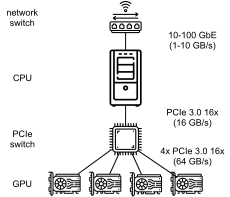

# Parameter Server
:label:`sec_parameterserver`

## Data Parallel


:label:`fig_parameterserver`


:label:`fig_ps_multimachine`


:label:`fig_ps_multips`


:label:`fig_nvlink`


:label:`fig_nvlink_twoloop`


:label:`fig_ringsync`


:label:`fig_ps_distributed`


:label:`fig_bw_hierarchy`


## Exercises


```{.python .input}

```
