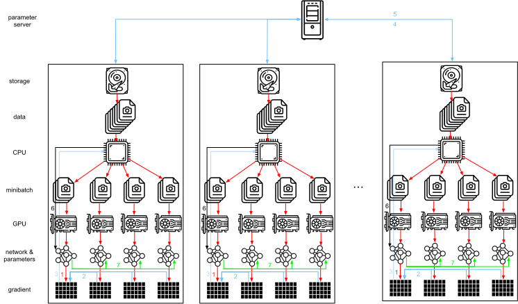

# Paramètre Serveurs
:label:`sec_parameterserver` 

 Au fur et à mesure que nous passons d'un GPU unique à plusieurs GPU, puis à plusieurs serveurs contenant plusieurs GPU, éventuellement répartis sur plusieurs racks et commutateurs réseau,
nos algorithmes d'apprentissage distribué et parallèle doivent devenir beaucoup plus sophistiqués. Les détails ont leur importance puisque les différentes interconnexions ont une bande passante très différente (par exemple, NVLink peut offrir jusqu'à 100 Go/s sur 6 liens dans un cadre approprié, PCIe 4.0 (16 voies) offre 32 Go/s, tandis que même l'Ethernet 100GbE à haut débit n'atteint que 10 Go/s). En même temps, il n'est pas raisonnable d'attendre d'un modélisateur statistique qu'il soit un expert en réseaux et en systèmes.

L'idée centrale du serveur de paramètres a été introduite dans :cite:`Smola.Narayanamurthy.2010` dans le contexte des modèles à variables latentes distribuées. Une description de la sémantique "push and pull" a suivi dans :cite:`Ahmed.Aly.Gonzalez.ea.2012` et une description du système et d'une bibliothèque open source a suivi dans :cite:`Li.Andersen.Park.ea.2014` . Dans ce qui suit, nous allons motiver les composants nécessaires à l'efficacité.

## entrainement parallèle aux données

Passons en revue l'approche de l'entrainement parallèle aux données pour l'entrainement distribuée. Nous l'utiliserons à l'exclusion de toutes les autres dans cette section car elle est nettement plus simple à mettre en œuvre dans la pratique. Il n'existe pratiquement aucun cas d'utilisation (en dehors de l'apprentissage profond sur les graphes) pour lequel une autre stratégie de parallélisme est préférable, car les GPU disposent aujourd'hui d'une mémoire abondante. :numref:`fig_parameterserver` décrit la variante du parallélisme des données que nous avons mise en œuvre dans :numref:`sec_multi_gpu` . L'aspect clé est que l'agrégation des gradients se produit sur le GPU 0 avant que les paramètres mis à jour ne soient rediffusés à tous les GPU.

:label:`fig_parameterserver` 

 Rétrospectivement, la décision d'agréger sur le GPU 0 semble plutôt ad-hoc. Après tout, nous pourrions tout aussi bien agréger sur le CPU. En fait, nous pourrions même décider d'agréger certains des paramètres sur un GPU et d'autres sur un autre. À condition que l'algorithme d'optimisation le prenne en charge, il n'y a aucune raison réelle de ne pas le faire. Par exemple, si nous avons quatre vecteurs de paramètres avec des gradients associés $\mathbf{g}_1, \ldots, \mathbf{g}_4$, nous pourrions agréger les gradients sur un GPU pour chaque $\mathbf{g}_i$ ($i = 1, \ldots, 4$).

Ce raisonnement semble arbitraire et frivole. Après tout, les mathématiques sont les mêmes partout. Cependant, nous avons affaire à du matériel physique réel où les différents bus ont une largeur de bande différente, comme nous l'avons vu dans :numref:`sec_hardware` .
Prenons l'exemple d'un véritable serveur GPU à 4 voies tel que décrit dans :numref:`fig_bw_hierarchy` . S'il est particulièrement bien connecté, il peut disposer d'une carte réseau de 100 GbE. Les chiffres les plus courants sont de l'ordre de 1 à 10 GbE, avec une bande passante effective de 100 Mo/s à 1 Go/s.
Étant donné que les CPU ont trop peu de couloirs PCIe pour se connecter directement à tous les GPU (par exemple, les CPU Intel grand public ont 24 couloirs), nous avons besoin de [multiplexer](https://www.broadcom.com/products/pcie-switches-bridges/pcie-switches). La bande passante du CPU sur une liaison Gen3 16x est de 16 Go/s. C'est également la vitesse à laquelle *chacun* des GPU est connecté au commutateur. Cela signifie qu'il est plus efficace de communiquer entre les appareils.

:label:`fig_bw_hierarchy`

Pour les besoins de l'argumentation, supposons que les gradients sont de 160 Mo. Dans ce cas, il faut 30 ms pour envoyer les gradients des trois GPU restants vers le quatrième (chaque transfert prend 10 ms = 160 Mo / 16 Go/s). En ajoutant encore 30 ms pour transmettre les vecteurs de poids en retour, nous arrivons à un total de 60 ms.
Si nous envoyons toutes les données au CPU, nous subissons une pénalité de 40 ms puisque *chacun* des quatre GPU doit envoyer les données au CPU, ce qui donne un total de 80 ms. Enfin, supposons que nous soyons capables de diviser les gradients en 4 parties de 40 Mo chacune. Nous pouvons maintenant agréger chacune des parties sur un GPU différent *simultanément* puisque le commutateur PCIe offre une opération à bande passante complète entre tous les liens. Au lieu de 30 ms, cela prend 7,5 ms, ce qui donne un total de 15 ms pour une opération de synchronisation. En bref, selon la manière dont nous synchronisons les paramètres, la même opération peut prendre entre 15 ms et 80 ms. :numref:`fig_ps_distributed` illustre les différentes stratégies d'échange de paramètres.

:label:`fig_ps_distributed`

Notez que nous disposons d'un autre outil pour améliorer les performances : dans un réseau profond, le calcul de tous les gradients du haut vers le bas prend un certain temps. Nous pouvons commencer à synchroniser les gradients pour certains groupes de paramètres alors que nous sommes encore occupés à les calculer pour d'autres. Voir, par exemple, :cite:`Sergeev.Del-Balso.2018` pour plus de détails sur la façon de procéder dans [Horovod](https://github.com/horovod/horovod).

## Synchronisation en anneau

Lorsqu'il s'agit de synchronisation sur du matériel moderne d'apprentissage profond, nous rencontrons souvent une connectivité réseau très inégale. Par exemple, les instances AWS p3.16xlarge et NVIDIA DGX-2 partagent la structure de connectivité de :numref:`fig_nvlink` . Chaque GPU se connecte à un CPU hôte via un lien PCIe qui fonctionne au mieux à 16 Go/s. En outre, chaque GPU dispose également de 6 connexions NVLink, chacune d'entre elles étant capable de transférer 300 Gbit/s de manière bidirectionnelle. Cela représente environ 18 Go/s par liaison et par direction. En bref, la bande passante NVLink agrégée est nettement supérieure à la bande passante PCIe. La question est de savoir comment l'utiliser le plus efficacement possible.

:label:`fig_nvlink` 

 Il s'avère que la stratégie de synchronisation optimale consiste à décomposer le réseau en deux anneaux et à les utiliser pour synchroniser les données directement :cite:`Wang.Li.Liberty.ea.2018` . :numref:`fig_nvlink_twoloop` illustre que le réseau peut être décomposé en un anneau (1-2-3-4-5-6-7-8-1) avec une bande passante NVLink double et en un (1-4-6-3-5-8-2-7-1) avec une bande passante normale. Concevoir un protocole de synchronisation efficace dans ce cas n'est pas une mince affaire.

:label:`fig_nvlink_twoloop`

Considérez l'expérience suivante : avec un anneau de nœuds de calcul (ou de GPU) $n$, nous pouvons envoyer les gradients du premier au deuxième nœud. Là, il est ajouté au gradient local et envoyé au troisième nœud, et ainsi de suite. Après $n-1$ étapes, le gradient agrégé peut être trouvé dans le dernier nœud visité. Autrement dit, le temps d'agrégation des gradients croît linéairement avec le nombre de nœuds. Mais si nous procédons ainsi, l'algorithme est assez inefficace. Après tout, à tout moment, il n'y a qu'un seul des nœuds qui communique. Que se passe-t-il si nous divisons les gradients en $n$ morceaux et commençons à synchroniser le morceau $i$ à partir du nœud $i$?
Comme chaque morceau est de taille $1/n$, le temps total est maintenant $(n-1)/n \approx 1$. En d'autres termes, le temps passé à agréger les gradients *ne croît pas* lorsque nous augmentons la taille de l'anneau. C'est un résultat tout à fait étonnant. :numref:`fig_ringsync` illustre la séquence des étapes sur les nœuds de $n=4$.

:label:`fig_ringsync`

Si nous reprenons le même exemple de synchronisation de 160 Mo sur 8 GPU V100, nous arrivons à environ $2 \cdot 160 \mathrm{MB} / (3 \cdot 18 \mathrm{GB/s}) \approx 6 \mathrm{ms}$. Ce résultat est meilleur que l'utilisation du bus PCIe, même si nous utilisons maintenant 8 GPU. Notez que dans la pratique, ces chiffres sont un peu plus mauvais, car les cadres d'apprentissage profond ne parviennent souvent pas à assembler la communication en gros transferts en rafale. 

Notez que l'on croit souvent à tort que la synchronisation en anneau est fondamentalement différente des autres algorithmes de synchronisation. La seule différence est que le chemin de synchronisation est un peu plus élaboré par rapport à un simple arbre.

## entrainement sur plusieurs machines

l'entrainement distribuée sur plusieurs machines ajoute un défi supplémentaire : nous devons communiquer avec des serveurs qui ne sont connectés qu'à travers un réseau à bande passante relativement faible, qui peut être plus d'un ordre de grandeur plus lent dans certains cas. 
La synchronisation entre les appareils est délicate. Après tout, des machines différentes exécutant du code d'entraînement auront des vitesses subtilement différentes. Nous devons donc les *synchroniser* si nous voulons utiliser l'optimisation distribuée synchrone. :numref:`fig_ps_multimachine` illustre comment se déroule l'entrainement parallèle distribuée.

1. Un lot (différent) de données est lu sur chaque machine, réparti sur plusieurs GPU et transféré dans la mémoire du GPU. Là, les prédictions et les gradients sont calculés sur chaque lot de GPU séparément.
2. Les gradients de tous les GPU locaux sont agrégés sur un GPU (ou certaines parties sont agrégées sur différents GPU).
3. Les gradients sont envoyés aux CPUs.
4. Les CPUs envoient les gradients à un serveur central de paramètres qui agrège tous les gradients.
5. Les gradients agrégés sont ensuite utilisés pour mettre à jour les paramètres et les paramètres mis à jour sont retransmis aux unités centrales individuelles.
6. Les informations sont envoyées à un (ou plusieurs) GPU.
7. Les paramètres mis à jour sont répartis sur tous les GPU.

:label:`fig_ps_multimachine`

Chacune de ces opérations semble assez simple. Et, en effet, elles peuvent être effectuées efficacement *au sein d'une seule machine. Cependant, si l'on considère plusieurs machines, on constate que le serveur central des paramètres devient le goulot d'étranglement. Après tout, la bande passante par serveur est limitée, donc pour $m$ travailleurs le temps nécessaire pour envoyer tous les gradients au serveur est $\mathcal{O}(m)$. Nous pouvons franchir cet obstacle en augmentant le nombre de serveurs à $n$. À ce stade, chaque serveur n'a besoin de stocker que $\mathcal{O}(1/n)$ des paramètres, et le temps total pour les mises à jour et l'optimisation devient donc $\mathcal{O}(m/n)$. 
En faisant correspondre ces deux chiffres, on obtient une mise à l'échelle constante, quel que soit le nombre de travailleurs. En pratique, nous utilisons les *mêmes* machines à la fois comme travailleurs et comme serveurs. :numref:`fig_ps_multips` illustre la conception (voir également :cite:`Li.Andersen.Park.ea.2014` pour les détails). 
En particulier, il n'est pas facile de s'assurer que plusieurs machines travaillent sans retard déraisonnable. Nous ne donnons pas de détails sur les barrières et nous n'aborderons que brièvement les mises à jour synchrones et asynchrones ci-dessous.

:label:`fig_ps_multips`

## Key--Value Stores

La mise en œuvre des étapes requises pour l'entrainement distribuée multi-GPU dans la pratique n'est pas triviale. 
C'est pourquoi il est utile d'utiliser une abstraction commune, à savoir celle d'un *key--value store* avec une sémantique de mise à jour redéfinie. 

Sur plusieurs travailleurs et plusieurs GPU, le calcul du gradient $i$ peut être défini comme suit :

$$\mathbf{g}_{i} = \sum_{k \in \text{workers}} \sum_{j \in \text{GPUs}} \mathbf{g}_{ijk},$$ 

 où $\mathbf{g}_{ijk}$ est une partie du gradient $i$ divisé sur le GPU $j$ du travailleur $k$.
L'aspect clé de cette opération est qu'il s'agit d'une réduction *commutative*, c'est-à-dire qu'elle transforme plusieurs vecteurs en un seul et que l'ordre dans lequel l'opération est appliquée n'a pas d'importance. Cela convient parfaitement à nos objectifs puisque nous n'avons pas (besoin d') avoir un contrôle fin sur le moment où le gradient est reçu. De plus, notez que cette opération est indépendante entre les différents $i$.

Cela nous permet de définir les deux opérations suivantes : *push*, qui accumule les gradients, et *pull*, qui récupère les gradients agrégés. Puisque nous disposons de nombreux ensembles différents de gradients (après tout, nous avons de nombreuses couches), nous devons indexer les gradients avec une clé $i$. Cette similitude avec les magasins de clés et de valeurs, comme celui introduit dans Dynamo
:cite:`DeCandia.Hastorun.Jampani.ea.2007` n'est pas une coïncidence. Ils répondent eux aussi à de nombreuses caractéristiques similaires, en particulier lorsqu'il s'agit de distribuer les paramètres sur plusieurs serveurs.

Les opérations push et pull pour les magasins clé-valeur sont décrites comme suit :

* **push(key, value)** envoie un gradient particulier (la valeur) d'un travailleur à un stockage commun. Là, la valeur est agrégée, par exemple, en la sommant.
* **pull(key, value)** récupère une valeur agrégée du stockage commun, par exemple, après avoir combiné les gradients de tous les travailleurs.

En cachant toute la complexité de la synchronisation derrière une simple opération de push et pull, nous pouvons découpler les préoccupations des modélisateurs statistiques qui veulent pouvoir exprimer l'optimisation en termes simples et celles des ingénieurs système qui doivent gérer la complexité inhérente à la synchronisation distribuée.

## Résumé

* La synchronisation doit être hautement adaptable à l'infrastructure réseau spécifique et à la connectivité au sein d'un serveur. Cela peut faire une différence significative sur le temps nécessaire à la synchronisation.
* La synchronisation en anneau peut être optimale pour les serveurs p3 et DGX-2. Pour d'autres, ce n'est peut-être pas le cas.
* Une stratégie de synchronisation hiérarchique fonctionne bien lorsque l'on ajoute plusieurs serveurs de paramètres pour augmenter la bande passante.

## Exercices

1. Pouvez-vous augmenter encore plus la synchronisation en anneau ? Indice : vous pouvez envoyer des messages dans les deux sens.
1. Est-il possible d'autoriser la communication asynchrone (alors que le calcul est toujours en cours) ? Comment cela affecte-t-il les performances ?
1. Que se passe-t-il si nous perdons un serveur pendant un calcul de longue durée ? Comment pouvons-nous concevoir un mécanisme de *tolérance aux pannes* pour éviter de redémarrer complètement le calcul ?

[Discussions](https://discuss.d2l.ai/t/366)
