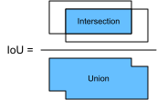

# Object Detection and Bounding Boxes
:label:`sec_bbox`

In previous sections, we introduced many models for image classification. In image classification tasks, we assume that there is only one main target in the image and we only focus on how to 
identify the target category. However, in many situations, there are multiple targets in the image that we are interested in. We not only want to classify them, but also want to obtain their 
specific positions in the image. In computer vision, we refer to such tasks as object detection (or object recognition). The difference between image classification and object detection is illustrated in :numref:`fig_classification_vs_detection`.


:label:`fig_classification_vs_detection`


Object detection is widely used in many fields. For example, in self-driving technology, we need to plan routes by identifying the locations of vehicles, pedestrians, roads, and obstacles in 
the captured video image. Robots often perform this type of task to detect targets of interest. Systems in the security field need to detect abnormal targets, such as intruders or bombs.

Object detection generalizes image classification in two ways. One is it identifies more than one object in a single image. The other one is localizing the object positions. As seen in :numref:`fig_classification_vs_detection`, a position is presented as a rectangles that contains the main part of the object. Such a rectangle is often called a bounding box.

The exist of bounding box greatly complicates the data preprocessing, training and prediction in object detection compared to image classification. In the reset of this chapter, we will address how to encode and illustrate these bounding boxes and compare their similarities. 

First, import the packages and modules required for the experiment.

```{.python .input  n=1}
%matplotlib inline
import d2l
from mxnet import image, np, npx

npx.set_np()
```

Next, we will load the sample image used in :numref:`fig_classification_vs_detection` and visualize it. Note that the origin is on the upper-left corner instead of the usual bottom-left corner.

```{.python .input  n=2}
# Saved in the d2l package for later use
d2l.DATA_HUB['catdog'] = (d2l.DATA_URL+'catdog.jpg',
                         '60b7d540db03eef6b9834329bccc4417ef349bf6')

img = image.imread(d2l.download('catdog')).asnumpy()
d2l.set_figsize((3.5, 2.5))
d2l.plt.imshow(img);
```

## Bounding Box Representations

We know that a rectangle can be determined by the $x$ and $y$ axis coordinates in the upper-left corner and the $x$ and $y$ axis coordinates in the lower-right corner. It 

We will define the bounding boxes of the dog and the cat in the image based on the coordinate information in the above image. The origin of the coordinates in the above image is the upper left corner of the image, and to the right and down are the positive directions of the $x$ axis and the $y$ axis, respectively.

```{.python .input  n=11}
dog_box, cat_box = [60, 45, 378, 516], [400, 112, 655, 493]
```

We can draw the bounding box in the image to check if it is accurate. Before drawing the box, we will define a helper function `box_to_rect`. It represents the bounding box in the bounding box format of `matplotlib`.

```{.python .input  n=12}
# Saved in the d2l package for later use
def show_boxes(axes, boxes, labels=None, colors=['b','g','r','m','c']):
    """Show a list of bounding boxes with labels."""
    for i, box in enumerate(boxes):
        color = colors[i % len(colors)]
        # convert to matplotlib Rectangle
        rect = d2l.plt.Rectangle(
            xy=(box[0], box[1]), width=box[2]-box[0], 
            height=box[3]-box[1], fill=False, edgecolor=color, linewidth=2)
        axes.add_patch(rect)
        if labels and len(labels) > i:
            text_color = 'k' if color == 'w' else 'w'
            axes.text(rect.xy[0], rect.xy[1], labels[i],
                      va='center', ha='center', fontsize=9, color=text_color,
                      bbox=dict(facecolor=color, lw=0))
```

Let's draw the bounding boxes of the cat and the dog in the image.

```{.python .input  n=13}
fig = d2l.plt.imshow(img)
show_boxes(fig.axes, [dog_box, cat_box], ['dog', 'cat'])
```

Another commonly used bounding box presentation is the $x$ and $y$ axis coordinates of the bounding box center, and its width and height. Here we define functions to convert between these two representations, `box_corner_to_center` converts from the two-corner representation to the center-width-height presentation, and `box_center_to_corner` vice verse. The input argument `boxes` can be either a length $4$ array, or a $(4, n)$ 2-D array.

```{.python .input  n=7}
# Saved in the d2l package for later use
def box_corner_to_center(boxes):
    """Convert from (upper_left, bottom_right) to (center, width, height)"""
    assert boxes.shape[0] == 4, 'The shape should be either (4,) or (4,n)'
    return np.stack(((boxes[0] + boxes[2])/2,  # center-x
                     (boxes[1] + boxes[3])/2,  # center-y
                     boxes[2] - boxes[0],      # width
                     boxes[3] - boxes[1]))     # height

# Saved in the d2l package for later use    
def box_center_to_corner(boxes):
    """Convert from (center, width, height) to (upper_left, bottom_right)"""
    assert boxes.shape[0] == 4, 'The shape should be either (4,) or (4,n)'
    return np.stack((boxes[0] - boxes[2]/2,  # upper_left_x
                     boxes[1] - boxes[3]/2,  # upper_left_y
                     boxes[0] + boxes[2]/2,  # bottom_right_x
                     boxes[1] + boxes[3]/2))  # bottom_right_y

```

We can verify the correctness by converting twice.

```{.python .input  n=8}
boxes = np.array((dog_box, cat_box)).T
box_center_to_corner(box_corner_to_center(boxes)) - boxes
```

## Intersection over Union

We often need to compare the similarity between two bounding boxes, such as the similarity between the predicted bounding box and the ground-truth box as the quality score. We know that the Jaccard index can measure the similarity between two sets. Given sets $\mathcal{A}$ and $\mathcal{B}$, their Jaccard index is the size of their intersection divided by the size of their union:

$$J(\mathcal{A},\mathcal{B}) = \frac{\left|\mathcal{A} \cap \mathcal{B}\right|}{\left| \mathcal{A} \cup \mathcal{B}\right|}.$$


In fact, we can consider the pixel area of a bounding box as a collection of pixels. In this way, we can measure the similarity of the two bounding boxes by the Jaccard index of their pixel sets. When we measure the similarity of two bounding boxes, we usually refer the Jaccard index as intersection over union (IoU), which is the ratio of the intersecting area to the union area of the two bounding boxes, as shown in :numref:`fig_iou`. The value range of IoU is between 0 and 1: 0 means that there are no overlapping pixels between the two bounding boxes, while 1 indicates that the two bounding boxes are equal.


:label:`fig_iou`

```{.python .input  n=9}
# Saved in the d2l package for later use
def iou(a, b, use_numpy=False):
    """Compute the IOU between two box sets a and b
    
    a : its shape can be (4,), (4, 1) or (4, n)
    b : its shape can be (4,), (4, 1) or (4, n)
    use_numpy : fallback to numpy (Will remove later)
    """
    if use_numpy: 
        import numpy as np
    else:
        from mxnet import np    
    # Compute box areas
    box_area = lambda boxes: (np.maximum(boxes[2]-boxes[0], 0) 
                              * np.maximum(boxes[3]-boxes[1], 0))
    inter = np.stack((np.maximum(a[0], b[0]),  # Intersections 
                      np.maximum(a[1], b[1]),
                      np.minimum(a[2], b[2]),
                      np.minimum(a[3], b[3]))) 
    a_area, b_area, inter_area = box_area(a), box_area(b), box_area(inter)
    return inter_area / (a_area + b_area - inter_area)
```

Here we draw multiple boxes and visualize their IoU scores compared to the dog bounding box. You can see that a $0.7$ score means these two boxes are quite similar,  a $0.3$ score then implies there is a large gap, and $0$ means there is no overlap.

```{.python .input  n=11}
boxes = [[80, 245, 328, 420], [120, 105, 390, 540], cat_box]
scores = iou(np.array(dog_box), np.array(boxes).T)
fig = d2l.plt.imshow(img)
show_boxes(fig.axes, [dog_box], ['dog'], ['k'])
show_boxes(fig.axes, boxes, ['%.1f'%s for s in scores])
```

## Summary

* In object detection, we not only need to identify all the objects of interest in the image, but also their positions. The positions are generally represented by a rectangular bounding box.
* IoU, also called Jaccard index, measures the similarity of two bounding boxes. It is the ratio of the intersecting area to the union area of two bounding boxes.


## Exercises

1. Find some images and try to label a bounding box that contains the target. Compare the difference between the time it takes to label the bounding box and label the category.
1. Construct two bounding boxes with and IoU of 0.5, and observe their coincidence.


## [Discussions](https://discuss.mxnet.io/t/2444)


