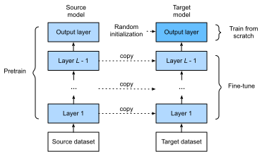

# Fine Tuning

In earlier chapters, we discussed how to train models on the Fashion-MNIST training data set, which only has 60,000 images. We also described ImageNet, the most widely used large-scale image data set in the academic world, with more than 10 million images and objects of over 1000 categories. However, the size of data sets that we often deal with is usually larger than the first, but smaller than the second.

Assume we want to identify different kinds of chairs in images and then push the purchase link to the user. One possible method is to first find a hundred common chairs, take one thousand different images with different angles for each chair, and then train a classification model on the collected image data set. Although this data set may be larger than Fashion-MNIST, the number of examples is still less than one tenth of ImageNet. This may result in the overfitting of the complicated model applicable to ImageNet on this data set. At the same time, because of the limited amount of data, the accuracy of the final trained model may not meet the practical requirements.

In order to deal with the above problems, an obvious solution is to collect more data. However, collecting and labeling data can consume a lot of time and money. For example, in order to collect the ImageNet data sets, researchers have spent millions of dollars of research funding. Although, recently, data collection costs have dropped significantly, the costs still cannot be ignored.

Another solution is to apply transfer learning to migrate the knowledge learned from the source data set to the target data set. For example, although the images in ImageNet are mostly unrelated to chairs, models trained on this data set can extract more general image features that can help identify edges, textures, shapes, and object composition. These similar features may be equally effective for recognizing a chair.

In this section, we introduce a common technique in transfer learning: fine tuning. As shown in Figure 9.1, fine tuning consists of the following four steps:

1. Pre-train a neural network model, i.e. the source model, on a source data set (e.g., the ImageNet data set).
2. Create a new neural network model, i.e. the target model. This replicates all model designs and their parameters on the source model, except the output layer. We assume that these model parameters contain the knowledge learned from the source data set and that this knowledge will be equally applicable to the target data set. We also assume that the output layer of the source model is closely related to the labels of the source data set and is therefore not used in the target model.
3. Add an output layer whose output size is the number of target data set categories to the target model, and randomly initialize the model parameters of this layer.
4. Train the target model on a target data set, such as a chair data set. We will train the output layer from scratch, while the parameters of all remaining layers are fine tuned based on the parameters of the source model.




## Hot Dog Recognition

Next, we will use a specific example for practice: hot dog recognition. We will fine tune the ResNet model trained on the ImageNet data set based on a small data set. This small data set contains thousands of images, some of which contain hot dogs. We will use the model obtained by fine tuning to identify whether an image contains a hot dog.

First, import the packages and modules required for the experiment.  Gluon's `model_zoo` package provides a common pre-trained model. If you want to get more pre-trained models for computer vision, you can use the GluonCV Toolkit[1].

```{.python .input  n=1}
%matplotlib inline
import gluonbook as gb
from mxnet import gluon, init, nd
from mxnet.gluon import data as gdata, loss as gloss, model_zoo
from mxnet.gluon import utils as gutils
import os
import zipfile
```

### Get the Data Set

The hot dog data set we use was taken from online images and contains 1,400 positive images containing hot dogs and same number of negative images containing other foods. 1,000 images of various classes are used for training and the rest are used for testing.

We first download the compressed data set to the path `../data`. Then, we unzip the downloaded data set in this path and get two folders, `hotdog/train` and `hotdog/test`. Both folders have `hotdog` and `not-hotdog` category subfolders, each of which has corresponding image files.

```{.python .input  n=2}
data_dir = '../data'
base_url = 'https://apache-mxnet.s3-accelerate.amazonaws.com/'
fname = gutils.download(
    base_url + 'gluon/dataset/hotdog.zip',
    path=data_dir, sha1_hash='fba480ffa8aa7e0febbb511d181409f899b9baa5')
with zipfile.ZipFile(fname, 'r') as z:
    z.extractall(data_dir)
```

We create two `ImageFolderDataset` instances to read all the image files in the training data set and testing data set, respectively.

```{.python .input  n=3}
train_imgs = gdata.vision.ImageFolderDataset(
    os.path.join(data_dir, 'hotdog/train'))
test_imgs = gdata.vision.ImageFolderDataset(
    os.path.join(data_dir, 'hotdog/test'))
```

The first 8 positive examples and the last 8 negative images are shown below. As you can see, the images vary in size and aspect ratio.

```{.python .input  n=4}
hotdogs = [train_imgs[i][0] for i in range(8)]
not_hotdogs = [train_imgs[-i - 1][0] for i in range(8)]
gb.show_images(hotdogs + not_hotdogs, 2, 8, scale=1.4);
```

During training, we first crop a random area with random size and random aspect ratio from the image and then scale the area to an input with a height and width of 224 pixels. During testing, we scale the height and width of images to 256 pixels, and then crop the center area with height and width of 224 pixels to use as the input. In addition, we normalize the values of the three RGB (red, green, and blue) color channels. The average of all values of the channel is subtracted from each value and then the result is divided by the standard deviation of all values of the channel to produce the output.

```{.python .input  n=5}
# We specify the mean and variance of the three RGB channels to normalize the image channel.
normalize = gdata.vision.transforms.Normalize(
    [0.485, 0.456, 0.406], [0.229, 0.224, 0.225])

train_augs = gdata.vision.transforms.Compose([
    gdata.vision.transforms.RandomResizedCrop(224),
    gdata.vision.transforms.RandomFlipLeftRight(),
    gdata.vision.transforms.ToTensor(),
    normalize])

test_augs = gdata.vision.transforms.Compose([
    gdata.vision.transforms.Resize(256),
    gdata.vision.transforms.CenterCrop(224),
    gdata.vision.transforms.ToTensor(),
    normalize])
```

### Define and Initialize the Model

We use ResNet-18, which was pre-trained on the ImageNet data set, as the source model. Here, we specify `pretrained=True` to automatically download and load the pre-trained model parameters. The first time they are used, the model parameters need to be downloaded from the Internet.

```{.python .input  n=6}
pretrained_net = model_zoo.vision.resnet18_v2(pretrained=True)
```

The pre-trained source model instance contains two member variables: `features` and `output`. The former contains all layers of the model, except the output layer, and the latter is the output layer of the model. The main purpose of this division is to facilitate the fine tuning of the model parameters of all layers except the output layer. The member variable `output` of source model is given below. As a fully connected layer, it transforms ResNet's final global average pooling layer output into 1000 class output on the ImageNet data set.

```{.python .input  n=7}
pretrained_net.output
```

We then build a new neural network to use as the target model. It is defined in the same way as the pre-trained source model, but the final number of outputs is equal to the number of categories in the target data set. In the code below, the model parameters in the member variable `features` of the target model instance `finetune_net` are initialized to model parameters of the corresponding layer of the source model. Because the model parameters in `features` are obtained by pre-training on the ImageNet data set, it is good enough. Therefore, we generally only need to use small learning rates to "fine tune" these parameters. In contrast, model parameters in the member variable `output` are randomly initialized and generally require a larger learning rate to learn from scratch. Assume the learning rate in the `Trainer` instance is $\eta$ and use a learning rate of $10\eta$ to update the model parameters in the member variable `output`.

```{.python .input  n=9}
finetune_net = model_zoo.vision.resnet18_v2(classes=2)
finetune_net.features = pretrained_net.features
finetune_net.output.initialize(init.Xavier())
# The model parameters in output will be updated using a learning rate ten times greater.
finetune_net.output.collect_params().setattr('lr_mult', 10)
```

### Fine Tune the Model

We first define a training function `train_fine_tuning` that uses fine tuning so it can be called multiple times.

```{.python .input  n=10}
def train_fine_tuning(net, learning_rate, batch_size=128, num_epochs=5):
    train_iter = gdata.DataLoader(
        train_imgs.transform_first(train_augs), batch_size, shuffle=True)
    test_iter = gdata.DataLoader(
        test_imgs.transform_first(test_augs), batch_size)
    ctx = gb.try_all_gpus()
    net.collect_params().reset_ctx(ctx)
    net.hybridize()
    loss = gloss.SoftmaxCrossEntropyLoss()
    trainer = gluon.Trainer(net.collect_params(), 'sgd', {
        'learning_rate': learning_rate, 'wd': 0.001})
    gb.train(train_iter, test_iter, net, loss, trainer, ctx, num_epochs)
```

We set the learning rate in the `Trainer` instance to a smaller value, such as 0.01, in order to fine tune the model parameters obtained in pre-training. Based on the previous settings, we will train the output layer parameters of the target model from scratch using a learning rate ten times greater.

```{.python .input  n=11}
train_fine_tuning(finetune_net, 0.01)
```

For comparison, we define an identical model, but initialize all of its model parameters to random values. Since the entire model needs to be trained from scratch, we can use a larger learning rate.

```{.python .input  n=12}
scratch_net = model_zoo.vision.resnet18_v2(classes=2)
scratch_net.initialize(init=init.Xavier())
train_fine_tuning(scratch_net, 0.1)
```

As you can see, the fine-tuned model tends to achieve higher precision in the same epoch because the initial values of the parameters are better.


## Summary


* Transfer learning migrates the knowledge learned from the source data set to the target data set. Fine tuning is a common technique for transfer learning.
* The target model replicates all model designs and their parameters on the source model, except the output layer, and fine tunes these parameters based on the target data set. In contrast, the output layer of the target model needs to be trained from scratch.
* Generally, fine tuning parameters use a smaller learning rate, while training the output layer from scratch can use a larger learning rate.


## Problems

* Keep increasing the learning rate of `finetune_net`. How does the precision of the model change?
* Further tune the hyper-parameters of `finetune_net` and `scratch_net` in the comparative experiment. Do they still have different precisions?
* Set the parameters in `finetune_net.features` to the parameters of the source model and do not update them during training. What will happen? You can use the following code.

```{.python .input}
finetune_net.features.collect_params().setattr('grad_req', 'null')
```

* In fact, there is also a "hotdog" class in the `ImageNet` data set. Its corresponding weight parameter at the output layer can be obtained by using the following code. How can we use this parameter?

```{.python .input  n=13}
weight = pretrained_net.output.weight
hotdog_w = nd.split(weight.data(), 1000, axis=0)[713]
hotdog_w.shape
```

## Reference

[1] GluonCV Toolkit. https://gluon-cv.mxnet.io/

## Discuss on our Forum

<div id="discuss" topic_id="">2443</div>
