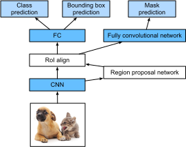

# Region-based CNNs (R-CNNs)


Region-based convolutional neural networks or regions with CNN features (R-CNNs) are a pioneering approach that applies deep models to object detection[1]. In this section, we will discuss R-CNNs and a series of improvements made to them: Fast R-CNN[3], Faster R-CNN[4], and Mask R-CNN[5]. Due to space limitations, we will confine our discussion to the designs of these models.


## R-CNNs

R-CNN models first select several proposed regions from an image (for example, anchor boxes are one type of selection method) and then label their categories and bounding boxes (e.g., offsets). Then, they use a CNN to perform forward computation to extract features from each proposed area. Afterwards, we use the features of each proposed region to predict their categories and bounding boxes. Figure 9.5 shows an R-CNN model.


Specifically, R-CNNs are composed of four main parts:

1. Selective search is performed on the input image to select multiple high-quality proposed regions[2]. These proposed regions are generally selected on multiple scales and have different shapes and sizes. The category and ground-truth bounding box of each proposed region is labeled.
1. A pre-trained CNN is selected and placed, in truncated form, before the output layer. It transforms each proposed region into the input dimensions required by the network and uses forward computation to output the features extracted from the proposed regions.
1. The features and labeled category of each proposed region are combined as an example to train multiple support vector machines for object classification. Here, each support vector machine is used to determine whether an example belongs to a certain category.
1. The features and labeled bounding box of each proposed region are combined as an example to train a linear regression model for ground-truth bounding box prediction.

Although R-CNN models use pre-trained CNNs to effectively extract image features, the main downside is the slow speed. As you can imagine, we can select thousands of proposed regions from a single image, requiring thousands of forward computations from the CNN to perform object detection. This massive computing load means that R-CNNs are not widely used in actual applications.


## Fast R-CNN

The main performance bottleneck of an R-CNN model is the need to independently extract features for each proposed region. As these regions have a high degree of overlap, independent feature extraction results in a high volume of repetitive computations. Fast R-CNN improves on the R-CNN by only performing CNN forward computation on the image as a whole.


Figure 10.6 shows a Fast R-CNN model. It's primary computation steps are described below:

1. Compared to an R-CNN model, a Fast R-CNN model uses the entire image as the CNN input for feature extraction, rather than each proposed region. Moreover, this network is generally trained to update the model parameters. As the input is an entire image, the CNN output shape is $1 \times c \times h_1 \times w_1$.
1. Assuming selective search generates $n$ proposed regions, their different shapes indicate regions of interests (RoIs) of different shapes on the CNN output. Features of the same shapes must be extracted from these RoIs (here we assume that the height is $h_2$ and the width is $w_2$). Fast R-CNN introduces RoI pooling, which uses the CNN output and RoIs as input to output a concatenation of the features extracted from each proposed region with the shape $n \times c \times h_2 \times w_2$.
1. A fully connected layer is used to transform the output shape to $n \times d$, where $d$ is determined by the model design.
1. During category prediction, the shape of the fully connected layer output is again transformed to $n \times q$ and we use software regression ($q$ is the number of categories). During bounding box prediction, the shape of the fully connected layer output is again transformed to $n \times 4$. This means that we predict the category and bounding box for each proposed region.

The RoI pooling layer in Fast R-CNN is somewhat different from the pooling layers we have discussed before. In a normal pooling layer, we set the pooling window, padding, and stride to control the output shape. In an RoI pooling layer, we can directly specify the output shape of each region, such as specifying the height and width of each region as $h_2,w_2$. Assuming that the height and width of the RoI window are $h$ and $w$, this window is divided into a grid of sub-windows with the shape $h_2 \times w_2$. The size of each sub-window is about $(h/h_2) \times (w/w_2)$. The sub-window height and width must always be integers and the largest element is used as the output for a given sub-window. This allows the RoI pooling layer to extract features of the same shape from RoIs of different shapes.

In Figure 9.7, we select an $3\times 3$ region as an RoI of the $4 \times 4$ input. For this RoI, we use a $2\times 2$ RoI pooling layer to obtain a single $2\times 2$ output. When we divide the region into four sub-windows, they respectively contain the elements 0, 1, 4, and 5 (5 is the largest); 2 and 6 (6 is the largest); 8 and 9 (9 is the largest); and 10.


We use the `ROIPooling` function to demonstrate the RoI pooling layer computation. Assume that the CNN extracts the feature `X` with both a height and width of 4 and only a single channel.

```{.python .input  n=4}
from mxnet import nd

X = nd.arange(16).reshape((1, 1, 4, 4))
X
```

Assume that the height and width of the image are both 40 pixels and that selective search generates two proposed regions on the image. Each region is expressed as five elements: the region's object category and the $x,y$ coordinates of its upper-left and bottom-right corners.

```{.python .input  n=5}
rois = nd.array([[0, 0, 0, 20, 20], [0, 0, 10, 30, 30]])
```

Because the height and width of `X` are $1/10$ of the height and width of the image, the coordinates of the two proposed regions are multiplied by 0.1 according to the `spatial_scale`, and then the RoIs are labeled on `X` as `X[:,:,0:3,0:3]` and `X[:,:,1:4,0:4]`, respectively. Finally, we divide the two RoIs into a sub-window grid and extract features with a height and width of 2.

```{.python .input  n=6}
nd.ROIPooling(X, rois, pooled_size=(2, 2), spatial_scale=0.1)
```

## Faster R-CNN

In order to obtain precise object detection results, Fast R-CNN generally requires that many proposed regions be generated in selective search. Faster R-CNN replaces selective search with a region proposal network. This reduces the number of proposed regions generated, while ensuring precise object detection.


Figure 9.8 shows a Faster R-CNN model. Compared to Fast R-CNN, Faster R-CNN only changes the method for generating proposed regions from selective search to region proposal network. The other parts of the model remain unchanged. The detailed region proposal network computation process is described below:

1. We use a $3\times 3$ convolutional layer with a padding of 1 to transform the CNN output and set the number of output channels to $c$. This way, each element in the feature map the CNN extracts from the image is a new feature with a length of $c$.
1. We use each element in the feature map as a center to generate multiple anchor boxes of different sizes and aspect ratios and then label them.
1. We use the features of the elements of length $c$ at the center on the anchor boxes to predict the binary category (object or background) and bounding box for their respective anchor boxes.
1. Then, we use non-maximum suppression to remove similar bounding box results that correspond to category predictions of "object". Finally, we output the predicted bounding boxes as the proposed regions required by the RoI pooling layer.


It is worth noting that, as a part of the Faster R-CNN model, the region proposal network is trained together with the rest of the model. In addition, the Faster R-CNN object functions include the category and bounding box predictions in object detection, as well as the binary category and bounding box predictions for the anchor boxes in the region proposal network. Finally, the region proposal network can learn how to generate high-quality proposed regions, which reduces the number of proposed regions while maintaining the precision of object detection.


## Mask R-CNN

If training data is labeled with the pixel-level positions of each object in an image, a Mask R-CNN model can effectively use these detailed labels to further improve the precision of object detection.



As shown in 9.9, Mask R-CNN is a modification to the Faster R-CNN model. Mask R-CNN models replace the RoI pooling layer with an RoI alignment layer. This allows the use of bilinear interpolation to retain spatial information on feature maps, making Mask R-CNN better suited for pixel-level predictions. The RoI alignment layer outputs feature maps of the same shape for all RoIs. This not only predicts the categories and bounding boxes of RoIs, but allows us to use an additional fully convolutional network to predict the pixel-level positions of objects. We will describe how to use fully convolutional networks to predict pixel-level semantics in images later in this chapter.


## Summary

* An R-CNN model selects several proposed regions and uses a CNN to perform forward computation and extract the features from each proposed region. It then uses these features to predict the categories and bounding boxes of proposed regions.
* Fast R-CNN improves on the R-CNN by only performing CNN forward computation on the image as a whole. It introduces an RoI pooling layer to extract features of the same shape from RoIs of different shapes.
* Faster R-CNN replaces the selective search used in Fast R-CNN with a region proposal network. This reduces the number of proposed regions generated, while ensuring precise object detection.
* Mask R-CNN uses the same basic structure as Faster R-CNN, but adds a fully convolution layer to help locate objects at the pixel level and further improve the precision of object detection.


## Exercises

* Study the implementation of each model in the GluonCV toolkit related to this section[6].


## References

[1] Girshick, R., Donahue, J., Darrell, T., & Malik, J. (2014). Rich feature hierarchies for accurate object detection and semantic segmentation. In Proceedings of the IEEE conference on computer vision and pattern recognition (pp. 580-587).

[2] Uijlings, J. R., Van De Sande, K. E., Gevers, T., & Smeulders, A. W. (2013). Selective search for object recognition. International journal of computer vision, 104(2), 154-171.

[3] Girshick, R. (2015). Fast r-cnn. arXiv preprint arXiv:1504.08083.

[4] Ren, S., He, K., Girshick, R., & Sun, J. (2015). Faster r-cnn: Towards real-time object detection with region proposal networks. In Advances in neural information processing systems (pp. 91-99).

[5] He, K., Gkioxari, G., Dollár, P., & Girshick, R. (2017, October). Mask r-cnn. In Computer Vision (ICCV), 2017 IEEE International Conference on (pp. 2980-2988). IEEE.

[6] GluonCV Toolkit. https://gluon-cv.mxnet.io/

## Scan the QR Code to [Discuss](https://discuss.mxnet.io/t/2447)


