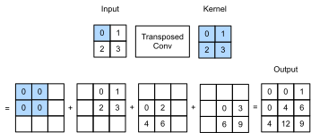

# Transposed Convolution
:label:`chapter_transposed_conv`

The layers we introduced so far for convolutional neural networks, including 
convolutional layers (:numref:`chapter_conv_chapter`) and pooling layers (:numref:`chapter_pooling`), often reduce or do not change the input width and height. Applications such as semantic segmentation (:numref:`chapter_semantic_segmentation`) and 


:label:`fig_trans_conv`


The transposed convolution layer takes its name from the matrix transposition operation. In fact, convolution operations can also be achieved by matrix multiplication. In the example below, we define input `X` with a height and width of 4 respectively, and a convolution kernel `K` with a height and width of 3 respectively. Print the output of the 2D convolution operation and the convolution kernel. As you can see, the output has a height and a width of 2.

```{.python .input  n=13}
from mxnet import nd, init
from mxnet.gluon import nn
```

```{.python .input  n=17}
conv_trans = nn.Conv2DTranspose(1, kernel_size=2)
K = nd.array([[0,1],[2,3]]).reshape((1, 1, 2, 2))
conv_trans.initialize(init.Constant(K))
X = nd.array([[0,1],[2,3]])
conv_trans(X.reshape((1,1,2,2)))
          

```

```{.json .output n=17}
[
 {
  "data": {
   "text/plain": "\n[[[[ 0.  0.  1.]\n   [ 0.  4.  6.]\n   [ 4. 12.  9.]]]]\n<NDArray 1x1x3x3 @cpu(0)>"
  },
  "execution_count": 17,
  "metadata": {},
  "output_type": "execute_result"
 }
]
```

```{.python .input  n=5}
X = nd.arange(1, 17).reshape((1, 1, 4, 4))
K = nd.arange(1, 10).reshape((1, 1, 3, 3))
conv = nn.Conv2D(channels=1, kernel_size=3)
conv.initialize(init.Constant(K))
conv(X), K
```

```{.json .output n=5}
[
 {
  "data": {
   "text/plain": "(\n [[[[348. 393.]\n    [528. 573.]]]]\n <NDArray 1x1x2x2 @cpu(0)>, \n [[[[1. 2. 3.]\n    [4. 5. 6.]\n    [7. 8. 9.]]]]\n <NDArray 1x1x3x3 @cpu(0)>)"
  },
  "execution_count": 5,
  "metadata": {},
  "output_type": "execute_result"
 }
]
```

Next, we rewrite convolution kernel `K` as a sparse matrix `W` with a large number of zero elements, i.e. a weight matrix. The shape of the weight matrix is (4,16), where the non-zero elements are taken from the elements in convolution kernel `K`. Enter `X` and concatenate line by line to get a vector of length 16. Then, perform matrix multiplication for `W` and the `X` vector to get a vector of length 4. After the transformation, we can get the same result as the convolution operation above. As you can see, in this example, we implement the convolution operation using matrix multiplication.

```{.python .input  n=6}
W, k = nd.zeros((4, 16)), nd.zeros(11)
k[:3], k[4:7], k[8:] = K[0, 0, 0, :], K[0, 0, 1, :], K[0, 0, 2, :]
W[0, 0:11], W[1, 1:12], W[2, 4:15], W[3, 5:16] = k, k, k, k
nd.dot(W, X.reshape(16)).reshape((1, 1, 2, 2)), W
```

```{.json .output n=6}
[
 {
  "data": {
   "text/plain": "(\n [[[[348. 393.]\n    [528. 573.]]]]\n <NDArray 1x1x2x2 @cpu(0)>, \n [[1. 2. 3. 0. 4. 5. 6. 0. 7. 8. 9. 0. 0. 0. 0. 0.]\n  [0. 1. 2. 3. 0. 4. 5. 6. 0. 7. 8. 9. 0. 0. 0. 0.]\n  [0. 0. 0. 0. 1. 2. 3. 0. 4. 5. 6. 0. 7. 8. 9. 0.]\n  [0. 0. 0. 0. 0. 1. 2. 3. 0. 4. 5. 6. 0. 7. 8. 9.]]\n <NDArray 4x16 @cpu(0)>)"
  },
  "execution_count": 6,
  "metadata": {},
  "output_type": "execute_result"
 }
]
```

Now we will describe the convolution operation from the perspective of matrix multiplication. Let the input vector be $\boldsymbol{x}$ and weight matrix be $\boldsymbol{W}$. The implementation of the convolutional forward computation function can be considered as the multiplication of the function input by the weight matrix to output the vector $\boldsymbol{ y} = \boldsymbol{W}\boldsymbol{x}$. We know that back propagation needs to be based on chain rules. Because $\nabla_{\boldsymbol{x}} \boldsymbol{y} = \boldsymbol{W}^\top$, the implementation of the convolutional back propagation function can be considered as the multiplication of the function input by the transposed weight matrix $\boldsymbol{W}^\top$. The transposed convolution layer exchanges the forward computation function and the back propagation function of the convolution layer. These two functions can be regarded as the multiplication of the function input vectors by $\boldsymbol{W}^\top$ and $\boldsymbol{W}$, respectively.

It is not difficult to see that the transposed convolution layer can be used to exchange the shape of input and output of the convolution layer. Let us continue to describe convolution using matrix multiplication. Let the weight matrix be a matrix with a shape of $4\times16$. For an input vector of length 16, the convolution forward computation outputs a vector with a length of 4. If the length of the input vector is 4 and the shape of the transpose weight matrix is $16\times4$, then the transposed convolution layer outputs a vector of length 16. In model design, transposed convolution layers are often used to transform smaller feature maps into larger ones. In a full convolutional network, when the input is a feature map with a high height and a wide width, the transposed convolution layer can be used to magnify the height and width to the size of the input image.

Now we will look at an example. Construct a convolution layer `conv` and let shape of input `X` be (1,3,64,64). The number of channels for convolution output `Y` is increased to 10, but the height and width are reduced by half.

```{.python .input  n=7}
conv = nn.Conv2D(10, kernel_size=4, padding=1, strides=2)
conv.initialize()

X = nd.random.uniform(shape=(1, 3, 64, 64))
Y = conv(X)
Y.shape
```

```{.json .output n=7}
[
 {
  "data": {
   "text/plain": "(1, 10, 32, 32)"
  },
  "execution_count": 7,
  "metadata": {},
  "output_type": "execute_result"
 }
]
```

Next, we construct transposed convolution layer `conv_trans` by creating a `Conv2DTranspose` instance. Here, we assume the convolution kernel shape, padding, and stride of `conv_trans` are the same with those in `conv`, and the number of output channels is 3. When the input is output `Y` of the convolution layer `conv`, the transposed convolution layer output has the same height and width as convolution layer input. The transposed convolution layer magnifies the height and width of the feature map by a factor of 2.

```{.python .input  n=8}
conv_trans = nn.Conv2DTranspose(3, kernel_size=4, padding=1, strides=2)
conv_trans.initialize()
conv_trans(Y).shape
```

```{.json .output n=8}
[
 {
  "data": {
   "text/plain": "(1, 3, 64, 64)"
  },
  "execution_count": 8,
  "metadata": {},
  "output_type": "execute_result"
 }
]
```

In the literature, transposed convolution is also sometimes referred to as
fractionally-strided convolution :ref:`Dumoulin.Visin.2016`
