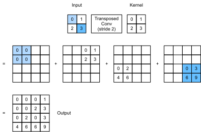

# Transposed Convolution
:label:`sec_transposed_conv`

Les couches CNN que nous avons vues jusqu'à présent,
comme les couches convolutionnelles (:numref:`sec_conv_layer`) et les couches de pooling (:numref:`sec_pooling`),
réduisent typiquement (downsample) les dimensions spatiales (hauteur et largeur) de l'entrée,
ou les gardent inchangées.
Dans la segmentation sémantique
qui classifie au niveau du pixel,
il sera pratique si
les dimensions spatiales de l'entrée
entrée et de la sortie sont les mêmes.
Par exemple
la dimension du canal à un pixel de sortie 
peut contenir les résultats de la classification
pour le pixel d'entrée à la même position spatiale.


Pour y parvenir, surtout après 
les dimensions spatiales sont réduites par les couches CNN,
nous pouvons utiliser un autre type
de couches CNN
qui peuvent augmenter (upsample) les dimensions spatiales
des cartes de caractéristiques intermédiaires.
Dans cette section,
nous allons introduire 
la *convolution transposée*, qui est aussi appelée *convolution à stries fractionnées* :cite:`Dumoulin.Visin.2016`, 
pour inverser les opérations de déséchantillonnage
par la convolution.

```{.python .input}
#@tab mxnet
from mxnet import np, npx, init
from mxnet.gluon import nn
from d2l import mxnet as d2l

npx.set_np()
```

```{.python .input}
#@tab pytorch
import torch
from torch import nn
from d2l import torch as d2l
```

## Opération basique

Ignorant les chaînes pour l'instant,
commençons par
l'opération de convolution transposée de base
avec un stride de 1 et sans padding.
Supposons que
on nous donne un 
$n_h \times n_w$ tenseur d'entrée
et un noyau de $k_h \times k_w$.
On fait glisser la fenêtre du noyau avec un pas de 1
pour $n_w$ fois dans chaque ligne
et $n_h$ fois dans chaque colonne
donne 
un total de $n_h n_w$ résultats intermédiaires.
Chaque résultat intermédiaire est
un tenseur $(n_h + k_h - 1) \times (n_w + k_w - 1)$.
qui sont initialisés comme des zéros.
Pour calculer chaque tenseur intermédiaire,
chaque élément du tenseur d'entrée
est multiplié par le noyau
de sorte que le tenseur $k_h \times k_w$ résultant
remplace une partie dans
chaque tenseur intermédiaire.
Notez que
la position de la partie remplacée dans chaque
dans chaque tenseur intermédiaire correspond à la position de l'élément
dans le tenseur d'entrée utilisé pour le calcul.
A la fin, tous les résultats intermédiaires
sont additionnés pour produire la sortie.

A titre d'exemple,
:numref:`fig_trans_conv` illustre
comment la convolution transposée avec un noyau de $2\times 2$ est calculée pour un tenseur d'entrée de $2\times 2$.


:label:`fig_trans_conv`


Nous pouvons (**implémenter cette opération de convolution transposée de base**) `trans_conv` pour une matrice d'entrée `X` et une matrice noyau `K`.

```{.python .input}
#@tab all
def trans_conv(X, K):
    h, w = K.shape
    Y = d2l.zeros((X.shape[0] + h - 1, X.shape[1] + w - 1))
    for i in range(X.shape[0]):
        for j in range(X.shape[1]):
            Y[i: i + h, j: j + w] += X[i, j] * K
    return Y
```

Contrairement à la convolution régulière (dans :numref:`sec_conv_layer`) qui *réduit* les éléments d'entrée
via le noyau,
la convolution transposée
*diffuse* les éléments d'entrée 
via le noyau, produisant ainsi
produisant ainsi une sortie
qui est plus grande que l'entrée.
Nous pouvons construire le tenseur d'entrée `X` et le tenseur du noyau `K` à partir de :numref:`fig_trans_conv` pour [**valider la sortie de l'implémentation ci-dessus**] de l'opération de base de convolution transposée bidimensionnelle.

```{.python .input}
#@tab all
X = d2l.tensor([[0.0, 1.0], [2.0, 3.0]])
K = d2l.tensor([[0.0, 1.0], [2.0, 3.0]])
trans_conv(X, K)
```

Alternativement,
lorsque l'entrée `X` et le noyau `K` sont tous deux
tenseurs à quatre dimensions,
on peut [**utiliser des API de haut niveau pour obtenir les mêmes résultats**].

```{.python .input}
#@tab mxnet
X, K = X.reshape(1, 1, 2, 2), K.reshape(1, 1, 2, 2)
tconv = nn.Conv2DTranspose(1, kernel_size=2)
tconv.initialize(init.Constant(K))
tconv(X)
```

```{.python .input}
#@tab pytorch
X, K = X.reshape(1, 1, 2, 2), K.reshape(1, 1, 2, 2)
tconv = nn.ConvTranspose2d(1, 1, kernel_size=2, bias=False)
tconv.weight.data = K
tconv(X)
```

## [**Padding, Strides, and Multiple Channels**]

Différent de la convolution régulière
où le remplissage est appliqué à l'entrée,
il est appliqué à la sortie
dans la convolution transposée.
Par exemple
en spécifiant le nombre de remplissage
de part et d'autre de la hauteur et de la largeur 
comme 1,
les première et dernière lignes et colonnes
seront supprimées de la sortie de la convolution transposée.

```{.python .input}
#@tab mxnet
tconv = nn.Conv2DTranspose(1, kernel_size=2, padding=1)
tconv.initialize(init.Constant(K))
tconv(X)
```

```{.python .input}
#@tab pytorch
tconv = nn.ConvTranspose2d(1, 1, kernel_size=2, padding=1, bias=False)
tconv.weight.data = K
tconv(X)
```

Dans la convolution transposée, les strides
sont spécifiés pour les résultats intermédiaires (donc la sortie), et non pour l'entrée.
En utilisant les mêmes tenseurs d'entrée et de noyau
de :numref:`fig_trans_conv` ,
changer le stride de 1 à 2
augmente à la fois la hauteur et le poids
des tenseurs intermédiaires, donc le tenseur de sortie
dans :numref:`fig_trans_conv_stride2` .



:label:`fig_trans_conv_stride2`


L'extrait de code suivant peut valider la sortie de la convolution transposée pour un stride de 2 dans :numref:`fig_trans_conv_stride2` .

```{.python .input}
#@tab mxnet
tconv = nn.Conv2DTranspose(1, kernel_size=2, strides=2)
tconv.initialize(init.Constant(K))
tconv(X)
```

```{.python .input}
#@tab pytorch
tconv = nn.ConvTranspose2d(1, 1, kernel_size=2, stride=2, bias=False)
tconv.weight.data = K
tconv(X)
```

Pour les canaux d'entrée et de sortie multiples,
la convolution transposée
fonctionne de la même manière que la convolution ordinaire.
Supposons que
l'entrée ait $c_i$ canaux,
et que la convolution transposée
assigne un tenseur de noyau $k_h\times k_w$
 à chaque canal d'entrée.
Lorsque plusieurs canaux de sortie 
sont spécifiés,
nous aurons un noyau $c_i\times k_h\times k_w$ pour chaque canal de sortie.


Comme dans tous les cas, si nous alimentons $\mathsf{X}$ dans une couche convolutive $f$ pour sortir $\mathsf{Y}=f(\mathsf{X})$ et créer une couche convolutive transposée $g$ avec les mêmes hyperparamètres que $f$ sauf 
pour le nombre de canaux de sortie 
étant le nombre de canaux dans $\mathsf{X}$,
puis $g(Y)$ auront la même forme que $\mathsf{X}$.
Ceci peut être illustré dans l'exemple suivant.

```{.python .input}
#@tab mxnet
X = np.random.uniform(size=(1, 10, 16, 16))
conv = nn.Conv2D(20, kernel_size=5, padding=2, strides=3)
tconv = nn.Conv2DTranspose(10, kernel_size=5, padding=2, strides=3)
conv.initialize()
tconv.initialize()
tconv(conv(X)).shape == X.shape
```

```{.python .input}
#@tab pytorch
X = torch.rand(size=(1, 10, 16, 16))
conv = nn.Conv2d(10, 20, kernel_size=5, padding=2, stride=3)
tconv = nn.ConvTranspose2d(20, 10, kernel_size=5, padding=2, stride=3)
tconv(conv(X)).shape == X.shape
```

## [**Connexion à la transposition de matrice**]
:label:`subsec-connection-to-mat-transposition` 

 La convolution transposée porte le nom de
la transposition de matrice.
Pour expliquer,
voyons d'abord
comment implémenter les convolutions
en utilisant les multiplications matricielles.
Dans l'exemple ci-dessous, nous définissons une entrée $3\times 3$ `X` et un noyau de convolution $2\times 2$ `K` , puis nous utilisons la fonction `corr2d` pour calculer la sortie de la convolution `Y`.

```{.python .input}
#@tab all
X = d2l.arange(9.0).reshape(3, 3)
K = d2l.tensor([[1.0, 2.0], [3.0, 4.0]])
Y = d2l.corr2d(X, K)
Y
```

Ensuite, nous réécrivons le noyau de convolution `K` comme
une matrice de poids clairsemée `W`
 contenant beaucoup de zéros. 
La forme de la matrice de poids est ($4$, $9$),
où les éléments non nuls proviennent de
le noyau de convolution `K`.

```{.python .input}
#@tab all
def kernel2matrix(K):
    k, W = d2l.zeros(5), d2l.zeros((4, 9))
    k[:2], k[3:5] = K[0, :], K[1, :]
    W[0, :5], W[1, 1:6], W[2, 3:8], W[3, 4:] = k, k, k, k
    return W

W = kernel2matrix(K)
W
```

Concaténer l'entrée `X` ligne par ligne pour obtenir un vecteur de longueur 9. Ensuite, la multiplication matricielle de `W` et de `X` vectorisé donne un vecteur de longueur 4.
Après l'avoir remodelé, nous pouvons obtenir le même résultat `Y`
 à partir de l'opération de convolution originale ci-dessus :
nous avons juste implémenté des convolutions en utilisant des multiplications matricielles.

```{.python .input}
#@tab all
Y == d2l.matmul(W, d2l.reshape(X, -1)).reshape(2, 2)
```

De même, nous pouvons implémenter des convolutions transposées en utilisant des multiplications de matrices
.
Dans l'exemple suivant,
nous prenons la sortie $2 \times 2$ `Y` de la convolution régulière
ci-dessus
comme entrée de la convolution transposée.
Pour mettre en œuvre cette opération en multipliant des matrices,
il nous suffit de transposer la matrice de poids `W`
 avec la nouvelle forme $(9, 4)$.

```{.python .input}
#@tab all
Z = trans_conv(Y, K)
Z == d2l.matmul(W.T, d2l.reshape(Y, -1)).reshape(3, 3)
```

Considérons l'implémentation de la convolution
en multipliant des matrices.
Étant donné un vecteur d'entrée $\mathbf{x}$
 et une matrice de poids $\mathbf{W}$,
la fonction de propagation vers l'avant de la convolution
peut être implémentée
en multipliant son entrée avec la matrice de poids
et en produisant un vecteur 
$\mathbf{y}=\mathbf{W}\mathbf{x}$ .
Puisque la rétropropagation
suit la règle de la chaîne
et $\nabla_{\mathbf{x}}\mathbf{y}=\mathbf{W}^\top$,
la fonction de rétropropagation de la convolution
peut être mise en œuvre
en multipliant son entrée avec la matrice de poids transposée 
 $\mathbf{W}^\top$ .
Par conséquent, 
la couche convolutionnelle transposée
peut simplement échanger la fonction de propagation directe
et la fonction de rétropropagation de la couche convolutionnelle :
ses fonctions de propagation directe 
et de rétropropagation
multiplient leur vecteur d'entrée avec 
$\mathbf{W}^\top$ et $\mathbf{W}$, respectivement.


## Résumé

* Contrairement à la convolution régulière qui réduit les éléments d'entrée via le noyau, la convolution transposée diffuse les éléments d'entrée via le noyau, produisant ainsi une sortie qui est plus grande que l'entrée.
* Si nous alimentons $\mathsf{X}$ dans une couche convolutionnelle $f$ pour produire $\mathsf{Y}=f(\mathsf{X})$ et créons une couche convolutionnelle transposée $g$ avec les mêmes hyperparamètres que $f$, à l'exception du nombre de canaux de sortie qui est le nombre de canaux dans $\mathsf{X}$, alors $g(Y)$ aura la même forme que $\mathsf{X}$.
* Nous pouvons mettre en œuvre des convolutions en utilisant des multiplications de matrices. La couche convolutionnelle transposée peut simplement échanger la fonction de propagation vers l'avant et la fonction de rétropropagation de la couche convolutionnelle.


## Exercices

1. Dans :numref:`subsec-connection-to-mat-transposition` , l'entrée de convolution `X` et la sortie de convolution transposée `Z` ont la même forme. Ont-elles la même valeur ? Pourquoi ?
1. Est-il efficace d'utiliser des multiplications matricielles pour implémenter des convolutions ? Pourquoi ?

:begin_tab:`mxnet`
[Discussions](https://discuss.d2l.ai/t/376)
:end_tab:

:begin_tab:`pytorch`
[Discussions](https://discuss.d2l.ai/t/1450)
:end_tab:
