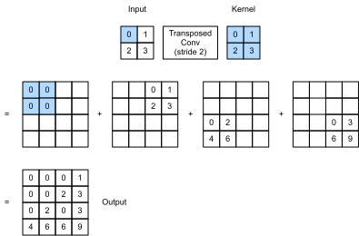

# Transposed Convolution
:label:`sec_transposed_conv`

The CNN layers we have seen so far,
such as convolutional layers (:numref:`sec_conv_layer`) and pooling layers (:numref:`sec_pooling`),
typically reduce (downsample) the spatial dimensions (height and width) of the input,
or keep them unchanged.
In semantic segmentation
that classifies at pixel-level,
it will be convenient if
the spatial dimensions of the
input and output are the same.
For example,
the channel dimension at one output pixel 
can hold the classification results
for the input pixel at the same spatial position.


To achieve this, especially after 
the spatial dimensions are reduced by CNN layers,
we can use another type
of CNN layers
that can increase (upsample) the spatial dimensions
of intermediate feature maps.
In this section,
we will introduce 
*transposed convolution*, which is also called *fractionally-strided convolution* :cite:`Dumoulin.Visin.2016`, 
for reversing downsampling operations
by the convolution.

```{.python .input}
from mxnet import np, npx, init
from mxnet.gluon import nn
from d2l import mxnet as d2l

npx.set_np()
```

```{.python .input}
#@tab pytorch
import torch
from torch import nn
from d2l import torch as d2l
```

## Basic Operation

Ignoring channels for now,
let us begin with
the basic transposed convolution operation
with stride of 1 and no padding.
Suppose that
we are given a 
$n_h \times n_w$ input tensor
and a $k_h \times k_w$ kernel.
Sliding the kernel window with stride of 1
for $n_w$ times in each row
and $n_h$ times in each column
yields 
a total of $n_h n_w$ intermediate results.
Each intermediate result is
a $(n_h + k_h - 1) \times (n_w + k_w - 1)$
tensor that are initialized as zeros.
To compute each intermediate tensor,
each element in the input tensor
is multiplied by the kernel
so that the resulting $k_h \times k_w$ tensor
replaces a portion in
each intermediate tensor.
Note that
the position of the replaced portion in each
intermediate tensor corresponds to the position of the element
in the input tensor used for the computation.
In the end, all the intermediate results
are summed over to produce the output.

As an example,
:numref:`fig_trans_conv` illustrates
how transposed convolution with a $2\times 2$ kernel is computed for a $2\times 2$ input tensor.


:label:`fig_trans_conv`


We can implement this basic transposed convolution operation `trans_conv` for a input matrix `X` and a kernel matrix `K`.

```{.python .input}
#@tab all
def trans_conv(X, K):
    h, w = K.shape
    Y = d2l.zeros((X.shape[0] + h - 1, X.shape[1] + w - 1))
    for i in range(X.shape[0]):
        for j in range(X.shape[1]):
            Y[i: i + h, j: j + w] += X[i, j] * K
    return Y
```

In contrast to the regular convolution (in :numref:`sec_conv_layer`) that *reduces* input elements
via the kernel,
the transposed convolution
*broadcasts* input elements 
via the kernel, thereby
producing an output
that is larger than the input.
We can construct the input tensor `X` and the kernel tensor `K` from :numref:`fig_trans_conv` to validate the output of the above implementation of the basic two-dimensional transposed convolution operation.

```{.python .input}
#@tab all
X = d2l.tensor([[0.0, 1.0], [2.0, 3.0]])
K = d2l.tensor([[0.0, 1.0], [2.0, 3.0]])
trans_conv(X, K)
```

Alternatively,
when the input `X` and kernel `K` are both
four-dimensional tensors,
we can use high-level APIs to obtain the same results.

```{.python .input}
X, K = X.reshape(1, 1, 2, 2), K.reshape(1, 1, 2, 2)
tconv = nn.Conv2DTranspose(1, kernel_size=2)
tconv.initialize(init.Constant(K))
tconv(X)
```

```{.python .input}
#@tab pytorch
X, K = X.reshape(1, 1, 2, 2), K.reshape(1, 1, 2, 2)
tconv = nn.ConvTranspose2d(1, 1, kernel_size=2, bias=False)
tconv.weight.data = K
tconv(X)
```

## Padding, Strides, and Multiple Channels

Different from in the regular convolution
where padding is applied to input,
it is applied to output
in the transposed convolution.
For example,
when specifying the padding number
on either side of the height and width 
as 1,
the first and last rows and columns
will be removed from the transposed convolution output.

```{.python .input}
tconv = nn.Conv2DTranspose(1, kernel_size=2, padding=1)
tconv.initialize(init.Constant(K))
tconv(X)
```

```{.python .input}
#@tab pytorch
tconv = nn.ConvTranspose2d(1, 1, kernel_size=2, padding=1, bias=False)
tconv.weight.data = K
tconv(X)
```

In the transposed convolution,
strides are specified for intermediate results (thus output), not for input.
Using the same input and kernel tensors
from :numref:`fig_trans_conv`,
changing the stride from 1 to 2
increases both the height and weight
of intermediate tensors, hence the output tensor
in :numref:`fig_trans_conv_stride2`.



:label:`fig_trans_conv_stride2`


The following code snippet can validate the transposed convolution output for stride of 2 in :numref:`fig_trans_conv_stride2`.

```{.python .input}
tconv = nn.Conv2DTranspose(1, kernel_size=2, strides=2)
tconv.initialize(init.Constant(K))
tconv(X)
```

```{.python .input}
#@tab pytorch
tconv = nn.ConvTranspose2d(1, 1, kernel_size=2, stride=2, bias=False)
tconv.weight.data = K
tconv(X)
```

For multiple input and output channels,
the transposed convolution
works in the same way as the regular convolution.
Suppose that
the input has $c_i$ channels,
and that the transposed convolution
assigns a $k_h\times k_w$ kernel tensor
to each input channel.
When multiple output channels 
are specified,
we will have a $c_i\times k_h\times k_w$ kernel for each output channel.


As in all, if we feed $\mathsf{X}$ into a convolutional layer $f$ to output $\mathsf{Y}=f(\mathsf{X})$ and create a transposed convolution layer $g$ with the same hyperparameters as $f$ except 
for the number of output channels 
being the number of channels in $\mathsf{X}$,
then $g(Y)$ will have the same shape as $\mathsf{X}$.
This can be illustrated in the following example.

```{.python .input}
X = np.random.uniform(size=(1, 10, 16, 16))
conv = nn.Conv2D(20, kernel_size=5, padding=2, strides=3)
tconv = nn.Conv2DTranspose(10, kernel_size=5, padding=2, strides=3)
conv.initialize()
tconv.initialize()
tconv(conv(X)).shape == X.shape
```

```{.python .input}
#@tab pytorch
X = torch.rand(size=(1, 10, 16, 16))
conv = nn.Conv2d(10, 20, kernel_size=5, padding=2, stride=3)
tconv = nn.ConvTranspose2d(20, 10, kernel_size=5, padding=2, stride=3)
tconv(conv(X)).shape == X.shape
```

## Analogy to Matrix Transposition

The transposed convolution takes its name from the matrix transposition. In fact, convolution operations can also be achieved by matrix multiplication. In the example below, we define a $3\times 3$ input $X$ with a $2\times 2$ kernel $K$, and then use `corr2d` to compute the convolution output.

```{.python .input}
#@tab all
X = d2l.arange(9.0).reshape(3, 3)
K = d2l.tensor([[1.0, 2.0], [3.0, 4.0]])
Y = d2l.corr2d(X, K)
Y
```

Next, we rewrite convolution kernel $K$ as a matrix $W$. Its shape will be $(4, 9)$, where the $i^\mathrm{th}$ row present applying the kernel to the input to generate the $i^\mathrm{th}$ output element.

```{.python .input}
#@tab all
def kernel2matrix(K):
    k, W = d2l.zeros(5), d2l.zeros((4, 9))
    k[:2], k[3:5] = K[0, :], K[1, :]
    W[0, :5], W[1, 1:6], W[2, 3:8], W[3, 4:] = k, k, k, k
    return W

W = kernel2matrix(K)
W
```

Then the convolution operator can be implemented by matrix multiplication with proper reshaping.

```{.python .input}
#@tab all
Y == d2l.matmul(W, d2l.reshape(X, -1)).reshape(2, 2)
```

We can implement transposed convolution as a matrix multiplication as well by reusing `kernel2matrix`. To reuse the generated $W$, we construct a $2\times 2$ input, so the corresponding weight matrix will have a shape $(9, 4)$, which is $W^\top$. Let us verify the results.

```{.python .input}
#@tab all
X = d2l.tensor([[1.0, 2.0], [3.0, 4.0]])
Y = trans_conv(X, K)
Y == d2l.matmul(W.T, d2l.reshape(X, -1)).reshape(3, 3)
```

## Summary

* Compared to convolutions that reduce inputs through kernels, transposed convolutions broadcast inputs.
* If a convolution layer reduces the input width and height by $n_w$ and $h_h$ time, respectively. Then a transposed convolution layer with the same kernel sizes, padding and strides will increase the input width and height by $n_w$ and $n_h$, respectively.
* We can implement convolution operations by the matrix multiplication, the corresponding transposed convolutions can be done by transposed matrix multiplication.

## Exercises

1. Is it efficient to use matrix multiplication to implement convolution operations? Why?

:begin_tab:`mxnet`
[Discussions](https://discuss.d2l.ai/t/376)
:end_tab:

:begin_tab:`pytorch`
[Discussions](https://discuss.d2l.ai/t/1450)
:end_tab:
