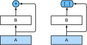

```{.python .input}
%load_ext d2lbook.tab
tab.interact_select(['mxnet', 'pytorch', 'tensorflow', 'jax'])
```

# Densely Connected Networks (DenseNet)
:label:`sec_densenet`

ResNet significantly changed the view of how to parametrize the functions in deep networks. *DenseNet* (dense convolutional network) is to some extent the logical extension of this :cite:`Huang.Liu.Van-Der-Maaten.ea.2017`.
DenseNet is characterized by both the connectivity pattern where
each layer connects to all the preceding layers
and the concatenation operation (rather than the addition operator in ResNet) to preserve and reuse features
from earlier layers.
To understand how to arrive at it, let's take a small detour to mathematics.

```{.python .input}
%%tab mxnet
from d2l import mxnet as d2l
from mxnet import init, np, npx
from mxnet.gluon import nn
npx.set_np()
```

```{.python .input}
%%tab pytorch
from d2l import torch as d2l
import torch
from torch import nn
```

```{.python .input}
%%tab tensorflow
from d2l import tensorflow as d2l
import tensorflow as tf
```

```{.python .input}
%%tab jax
from d2l import jax as d2l
from flax import linen as nn
from jax import numpy as jnp
import jax
```

## From ResNet to DenseNet

Recall the Taylor expansion for functions. For the point $x = 0$ it can be written as

$$f(x) = f(0) + x \cdot \left[f'(0) + x \cdot \left[\frac{f''(0)}{2!}  + x \cdot \left[\frac{f'''(0)}{3!}  + \ldots \right]\right]\right].$$


The key point is that it decomposes a function into increasingly higher order terms. In a similar vein, ResNet decomposes functions into

$$f(\mathbf{x}) = \mathbf{x} + g(\mathbf{x}).$$

That is, ResNet decomposes $f$ into a simple linear term and a more complex
nonlinear one.
What if we wanted to capture (not necessarily add) information beyond two terms?
One such solution is DenseNet :cite:`Huang.Liu.Van-Der-Maaten.ea.2017`.


:label:`fig_densenet_block`

As shown in :numref:`fig_densenet_block`, the key difference between ResNet and DenseNet is that in the latter case outputs are *concatenated* (denoted by $[,]$) rather than added.
As a result, we perform a mapping from $\mathbf{x}$ to its values after applying an increasingly complex sequence of functions:

$$\mathbf{x} \to \left[
\mathbf{x},
f_1(\mathbf{x}),
f_2\left(\left[\mathbf{x}, f_1\left(\mathbf{x}\right)\right]\right), f_3\left(\left[\mathbf{x}, f_1\left(\mathbf{x}\right), f_2\left(\left[\mathbf{x}, f_1\left(\mathbf{x}\right)\right]\right)\right]\right), \ldots\right].$$

In the end, all these functions are combined in MLP to reduce the number of features again. In terms of implementation this is quite simple:
rather than adding terms, we concatenate them. The name DenseNet arises from the fact that the dependency graph between variables becomes quite dense. The last layer of such a chain is densely connected to all previous layers. The dense connections are shown in :numref:`fig_densenet`.


:label:`fig_densenet`

The main components that compose a DenseNet are *dense blocks* and *transition layers*. The former define how the inputs and outputs are concatenated, while the latter control the number of channels so that it is not too large, 
since the expansion $\mathbf{x} \to \left[\mathbf{x}, f_1(\mathbf{x}),
f_2\left(\left[\mathbf{x}, f_1\left(\mathbf{x}\right)\right]\right), \ldots \right]$ can be quite high-dimensional.


## [**Dense Blocks**]

DenseNet uses the modified "batch normalization, activation, and convolution"
structure of ResNet (see the exercise in :numref:`sec_resnet`).
First, we implement this convolution block structure.

```{.python .input}
%%tab mxnet
def conv_block(num_channels):
    blk = nn.Sequential()
    blk.add(nn.BatchNorm(),
            nn.Activation('relu'),
            nn.Conv2D(num_channels, kernel_size=3, padding=1))
    return blk
```

```{.python .input}
%%tab pytorch
def conv_block(num_channels):
    return nn.Sequential(
        nn.LazyBatchNorm2d(), nn.ReLU(),
        nn.LazyConv2d(num_channels, kernel_size=3, padding=1))
```

```{.python .input}
%%tab tensorflow
class ConvBlock(tf.keras.layers.Layer):
    def __init__(self, num_channels):
        super(ConvBlock, self).__init__()
        self.bn = tf.keras.layers.BatchNormalization()
        self.relu = tf.keras.layers.ReLU()
        self.conv = tf.keras.layers.Conv2D(
            filters=num_channels, kernel_size=(3, 3), padding='same')

        self.listLayers = [self.bn, self.relu, self.conv]

    def call(self, x):
        y = x
        for layer in self.listLayers.layers:
            y = layer(y)
        y = tf.keras.layers.concatenate([x,y], axis=-1)
        return y
```

```{.python .input}
%%tab jax
class ConvBlock(nn.Module):
    num_channels: int
    training: bool = True

    @nn.compact
    def __call__(self, X):
        Y = nn.relu(nn.BatchNorm(not self.training)(X))
        Y = nn.Conv(self.num_channels, kernel_size=(3, 3), padding=(1, 1))(Y)
        Y = jnp.concatenate((X, Y), axis=-1)
        return Y
```

A *dense block* consists of multiple convolution blocks, each using the same number of output channels. In the forward propagation, however, we concatenate the input and output of each convolution block on the channel dimension. Lazy evaluation allows us to adjust the dimensionality automatically.

```{.python .input}
%%tab mxnet
class DenseBlock(nn.Block):
    def __init__(self, num_convs, num_channels):
        super().__init__()
        self.net = nn.Sequential()
        for _ in range(num_convs):
            self.net.add(conv_block(num_channels))

    def forward(self, X):
        for blk in self.net:
            Y = blk(X)
            # Concatenate input and output of each block along the channels
            X = np.concatenate((X, Y), axis=1)
        return X
```

```{.python .input}
%%tab pytorch
class DenseBlock(nn.Module):
    def __init__(self, num_convs, num_channels):
        super(DenseBlock, self).__init__()
        layer = []
        for i in range(num_convs):
            layer.append(conv_block(num_channels))
        self.net = nn.Sequential(*layer)

    def forward(self, X):
        for blk in self.net:
            Y = blk(X)
            # Concatenate input and output of each block along the channels
            X = torch.cat((X, Y), dim=1)
        return X
```

```{.python .input}
%%tab tensorflow
class DenseBlock(tf.keras.layers.Layer):
    def __init__(self, num_convs, num_channels):
        super(DenseBlock, self).__init__()
        self.listLayers = []
        for _ in range(num_convs):
            self.listLayers.append(ConvBlock(num_channels))

    def call(self, x):
        for layer in self.listLayers.layers:
            x = layer(x)
        return x
```

```{.python .input}
%%tab jax
class DenseBlock(nn.Module):
    num_convs: int
    num_channels: int
    training: bool = True

    def setup(self):
        layer = []
        for i in range(self.num_convs):
            layer.append(ConvBlock(self.num_channels, self.training))
        self.net = nn.Sequential(layer)

    def __call__(self, X):
        return self.net(X)
```

In the following example,
we [**define a `DenseBlock` instance**] with 2 convolution blocks of 10 output channels.
When using an input with 3 channels, we will get an output with  $3 + 10 + 10=23$ channels. The number of convolution block channels controls the growth in the number of output channels relative to the number of input channels. This is also referred to as the *growth rate*.

```{.python .input}
%%tab pytorch, mxnet, tensorflow
blk = DenseBlock(2, 10)
if tab.selected('mxnet'):
    X = np.random.uniform(size=(4, 3, 8, 8))
    blk.initialize()
if tab.selected('pytorch'):
    X = torch.randn(4, 3, 8, 8)
if tab.selected('tensorflow'):
    X = tf.random.uniform((4, 8, 8, 3))
Y = blk(X)
Y.shape
```

```{.python .input}
%%tab jax
blk = DenseBlock(2, 10)
X = jnp.zeros((4, 8, 8, 3))
Y = blk.init_with_output(d2l.get_key(), X)[0]
Y.shape
```

## [**Transition Layers**]

Since each dense block will increase the number of channels, adding too many of them will lead to an excessively complex model. A *transition layer* is used to control the complexity of the model. It reduces the number of channels by using an $1\times 1$ convolution. Moreover, it halves the height and width via average pooling with a stride of 2.

```{.python .input}
%%tab mxnet
def transition_block(num_channels):
    blk = nn.Sequential()
    blk.add(nn.BatchNorm(), nn.Activation('relu'),
            nn.Conv2D(num_channels, kernel_size=1),
            nn.AvgPool2D(pool_size=2, strides=2))
    return blk
```

```{.python .input}
%%tab pytorch
def transition_block(num_channels):
    return nn.Sequential(
        nn.LazyBatchNorm2d(), nn.ReLU(),
        nn.LazyConv2d(num_channels, kernel_size=1),
        nn.AvgPool2d(kernel_size=2, stride=2))
```

```{.python .input}
%%tab tensorflow
class TransitionBlock(tf.keras.layers.Layer):
    def __init__(self, num_channels, **kwargs):
        super(TransitionBlock, self).__init__(**kwargs)
        self.batch_norm = tf.keras.layers.BatchNormalization()
        self.relu = tf.keras.layers.ReLU()
        self.conv = tf.keras.layers.Conv2D(num_channels, kernel_size=1)
        self.avg_pool = tf.keras.layers.AvgPool2D(pool_size=2, strides=2)

    def call(self, x):
        x = self.batch_norm(x)
        x = self.relu(x)
        x = self.conv(x)
        return self.avg_pool(x)
```

```{.python .input}
%%tab jax
class TransitionBlock(nn.Module):
    num_channels: int
    training: bool = True

    @nn.compact
    def __call__(self, X):
        X = nn.BatchNorm(not self.training)(X)
        X = nn.relu(X)
        X = nn.Conv(self.num_channels, kernel_size=(1, 1))(X)
        X = nn.avg_pool(X, window_shape=(2, 2), strides=(2, 2))
        return X
```

[**Apply a transition layer**] with 10 channels to the output of the dense block in the previous example.  This reduces the number of output channels to 10, and halves the height and width.

```{.python .input}
%%tab mxnet
blk = transition_block(10)
blk.initialize()
blk(Y).shape
```

```{.python .input}
%%tab pytorch
blk = transition_block(10)
blk(Y).shape
```

```{.python .input}
%%tab tensorflow
blk = TransitionBlock(10)
blk(Y).shape
```

```{.python .input}
%%tab jax
blk = TransitionBlock(10)
blk.init_with_output(d2l.get_key(), Y)[0].shape
```

## [**DenseNet Model**]

Next, we will construct a DenseNet model. DenseNet first uses the same single convolutional layer and max-pooling layer as in ResNet.

```{.python .input}
%%tab pytorch, mxnet, tensorflow
class DenseNet(d2l.Classifier):
    def b1(self):
        if tab.selected('mxnet'):
            net = nn.Sequential()
            net.add(nn.Conv2D(64, kernel_size=7, strides=2, padding=3),
                nn.BatchNorm(), nn.Activation('relu'),
                nn.MaxPool2D(pool_size=3, strides=2, padding=1))
            return net
        if tab.selected('pytorch'):
            return nn.Sequential(
                nn.LazyConv2d(64, kernel_size=7, stride=2, padding=3),
                nn.LazyBatchNorm2d(), nn.ReLU(),
                nn.MaxPool2d(kernel_size=3, stride=2, padding=1))
        if tab.selected('tensorflow'):
            return tf.keras.models.Sequential([
                tf.keras.layers.Conv2D(
                    64, kernel_size=7, strides=2, padding='same'),
                tf.keras.layers.BatchNormalization(),
                tf.keras.layers.ReLU(),
                tf.keras.layers.MaxPool2D(
                    pool_size=3, strides=2, padding='same')])
```

```{.python .input}
%%tab jax
class DenseNet(d2l.Classifier):
    num_channels: int = 64
    growth_rate: int = 32
    arch: tuple = (4, 4, 4, 4)
    lr: float = 0.1
    num_classes: int = 10
    training: bool = True

    def setup(self):
        self.net = self.create_net()

    def b1(self):
        return nn.Sequential([
            nn.Conv(64, kernel_size=(7, 7), strides=(2, 2), padding='same'),
            nn.BatchNorm(not self.training),
            nn.relu,
            lambda x: nn.max_pool(x, window_shape=(3, 3),
                                  strides=(2, 2), padding='same')
        ])
```

Then, similar to the four modules made up of residual blocks that ResNet uses,
DenseNet uses four dense blocks.
Similar to ResNet, we can set the number of convolutional layers used in each dense block. Here, we set it to 4, consistent with the ResNet-18 model in :numref:`sec_resnet`. Furthermore, we set the number of channels (i.e., growth rate) for the convolutional layers in the dense block to 32, so 128 channels will be added to each dense block.

In ResNet, the height and width are reduced between each module by a residual block with a stride of 2. Here, we use the transition layer to halve the height and width and halve the number of channels. Similar to ResNet, a global pooling layer and a fully connected layer are connected at the end to produce the output.

```{.python .input}
%%tab pytorch, mxnet, tensorflow
@d2l.add_to_class(DenseNet)
def __init__(self, num_channels=64, growth_rate=32, arch=(4, 4, 4, 4),
             lr=0.1, num_classes=10):
    super(DenseNet, self).__init__()
    self.save_hyperparameters()
    if tab.selected('mxnet'):
        self.net = nn.Sequential()
        self.net.add(self.b1())
        for i, num_convs in enumerate(arch):
            self.net.add(DenseBlock(num_convs, growth_rate))
            # The number of output channels in the previous dense block
            num_channels += num_convs * growth_rate
            # A transition layer that halves the number of channels is added
            # between the dense blocks
            if i != len(arch) - 1:
                num_channels //= 2
                self.net.add(transition_block(num_channels))
        self.net.add(nn.BatchNorm(), nn.Activation('relu'),
                     nn.GlobalAvgPool2D(), nn.Dense(num_classes))
        self.net.initialize(init.Xavier())
    if tab.selected('pytorch'):
        self.net = nn.Sequential(self.b1())
        for i, num_convs in enumerate(arch):
            self.net.add_module(f'dense_blk{i+1}', DenseBlock(num_convs,
                                                              growth_rate))
            # The number of output channels in the previous dense block
            num_channels += num_convs * growth_rate
            # A transition layer that halves the number of channels is added
            # between the dense blocks
            if i != len(arch) - 1:
                num_channels //= 2
                self.net.add_module(f'tran_blk{i+1}', transition_block(
                    num_channels))
        self.net.add_module('last', nn.Sequential(
            nn.LazyBatchNorm2d(), nn.ReLU(),
            nn.AdaptiveAvgPool2d((1, 1)), nn.Flatten(),
            nn.LazyLinear(num_classes)))
        self.net.apply(d2l.init_cnn)
    if tab.selected('tensorflow'):
        self.net = tf.keras.models.Sequential(self.b1())
        for i, num_convs in enumerate(arch):
            self.net.add(DenseBlock(num_convs, growth_rate))
            # The number of output channels in the previous dense block
            num_channels += num_convs * growth_rate
            # A transition layer that halves the number of channels is added
            # between the dense blocks
            if i != len(arch) - 1:
                num_channels //= 2
                self.net.add(TransitionBlock(num_channels))
        self.net.add(tf.keras.models.Sequential([
            tf.keras.layers.BatchNormalization(),
            tf.keras.layers.ReLU(),
            tf.keras.layers.GlobalAvgPool2D(),
            tf.keras.layers.Flatten(),
            tf.keras.layers.Dense(num_classes)]))
```

```{.python .input}
%%tab jax
@d2l.add_to_class(DenseNet)
def create_net(self):
    net = self.b1()
    for i, num_convs in enumerate(self.arch):
        net.layers.extend([DenseBlock(num_convs, self.growth_rate,
                                      training=self.training)])
        # The number of output channels in the previous dense block
        num_channels = self.num_channels + (num_convs * self.growth_rate)
        # A transition layer that halves the number of channels is added
        # between the dense blocks
        if i != len(self.arch) - 1:
            num_channels //= 2
            net.layers.extend([TransitionBlock(num_channels,
                                               training=self.training)])
    net.layers.extend([
        nn.BatchNorm(not self.training),
        nn.relu,
        lambda x: nn.avg_pool(x, window_shape=x.shape[1:3],
                              strides=x.shape[1:3], padding='valid'),
        lambda x: x.reshape((x.shape[0], -1)),
        nn.Dense(self.num_classes)
    ])
    return net
```

## [**Training**]

Since we are using a deeper network here, in this section, we will reduce the input height and width from 224 to 96 to simplify the computation.

```{.python .input}
%%tab mxnet, pytorch, jax
model = DenseNet(lr=0.01)
trainer = d2l.Trainer(max_epochs=10, num_gpus=1)
data = d2l.FashionMNIST(batch_size=128, resize=(96, 96))
trainer.fit(model, data)
```

```{.python .input}
%%tab tensorflow
trainer = d2l.Trainer(max_epochs=10)
data = d2l.FashionMNIST(batch_size=128, resize=(96, 96))
with d2l.try_gpu():
    model = DenseNet(lr=0.01)
    trainer.fit(model, data)
```

## Summary and Discussion

The main components that compose DenseNet are dense blocks and transition layers. For the latter, we need to keep the dimensionality under control when composing the network by adding transition layers that shrink the number of channels again.
In terms of cross-layer connections, unlike ResNet, where inputs and outputs are added together, DenseNet concatenates inputs and outputs on the channel dimension.
Although these concatenation operations
reuse features to achieve computational efficiency,
unfortunately they lead to heavy GPU memory consumption.
As a result,
applying DenseNet may require more memory-efficient implementations that may increase training time :cite:`pleiss2017memory`.


## Exercises

1. Why do we use average pooling rather than max-pooling in the transition layer?
1. One of the advantages mentioned in the DenseNet paper is that its model parameters are smaller than those of ResNet. Why is this the case?
1. One problem for which DenseNet has been criticized is its high memory consumption.
    1. Is this really the case? Try to change the input shape to $224\times 224$ to see the actual GPU memory consumption empirically.
    1. Can you think of an alternative means of reducing the memory consumption? How would you need to change the framework?
1. Implement the various DenseNet versions presented in Table 1 of the DenseNet paper :cite:`Huang.Liu.Van-Der-Maaten.ea.2017`.
1. Design an MLP-based model by applying the DenseNet idea. Apply it to the housing price prediction task in :numref:`sec_kaggle_house`.

:begin_tab:`mxnet`
[Discussions](https://discuss.d2l.ai/t/87)
:end_tab:

:begin_tab:`pytorch`
[Discussions](https://discuss.d2l.ai/t/88)
:end_tab:

:begin_tab:`tensorflow`
[Discussions](https://discuss.d2l.ai/t/331)
:end_tab:
