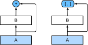
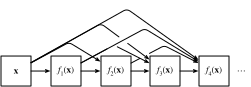

```{.python .input}
%load_ext d2lbook.tab
tab.interact_select(['mxnet', 'pytorch', 'tensorflow'])
```

# Les réseaux densément connectés (DenseNet)
:label:`sec_densenet` 

ResNet a considérablement changé la vision de la manière de paramétrer les fonctions dans les réseaux profonds. *DenseNet* (dense convolutional network) est en quelque sorte l'extension logique de ce :cite:`Huang.Liu.Van-Der-Maaten.ea.2017`.
En conséquence,
DenseNet 
est caractérisé par
à la fois par le schéma de connectivité où
chaque couche est connectée à toutes les couches précédentes
et par l'opération de concaténation (plutôt que l'opérateur d'addition dans ResNet) pour préserver et réutiliser les caractéristiques
des couches précédentes.
Pour comprendre comment on en arrive là, faisons un petit détour par les mathématiques.


## De ResNet à DenseNet

Rappelons l'expansion de Taylor pour les fonctions. Pour le point $x = 0$, elle peut s'écrire comme suit :

$$f(x) = f(0) + f'(0) x + \frac{f''(0)}{2!}  x^2 + \frac{f'''(0)}{3!}  x^3 + \ldots.$$ 

 
Le point essentiel est qu'elle décompose une fonction en termes d'ordre de plus en plus élevé. Dans le même ordre d'idées, ResNet décompose les fonctions en

$$f(\mathbf{x}) = \mathbf{x} + g(\mathbf{x}).$$ 

C'est-à-dire que ResNet décompose $f$ en un terme linéaire simple et un terme non linéaire plus complexe
.
Que faire si nous voulons capturer (sans nécessairement ajouter) des informations au-delà de deux termes ?
Une solution était
DenseNet :cite:`Huang.Liu.Van-Der-Maaten.ea.2017`.


:label:`fig_densenet_block` 

Comme le montre :numref:`fig_densenet_block`, la principale différence entre ResNet et DenseNet est que dans ce dernier cas, les sorties sont *concaténées* (indiquées par $[,]$) plutôt qu'ajoutées.
Par conséquent, nous effectuons un mappage de $\mathbf{x}$ à ses valeurs après avoir appliqué une séquence de fonctions de plus en plus complexe :

$$\mathbf{x} \to \left[
\mathbf{x},
f_1(\mathbf{x}),
f_2([\mathbf{x}, f_1(\mathbf{x})]), f_3([\mathbf{x}, f_1(\mathbf{x}), f_2([\mathbf{x}, f_1(\mathbf{x})])]), \ldots\right].$$

Au final, toutes ces fonctions sont combinées dans le MLP pour réduire à nouveau le nombre de caractéristiques. En termes d'implémentation, c'est assez simple :
plutôt que d'ajouter des termes, nous les concaténons. Le nom DenseNet vient du fait que le graphe de dépendance entre les variables devient assez dense. La dernière couche d'une telle chaîne est densément connectée à toutes les couches précédentes. Les connexions denses sont illustrées sur le site :numref:`fig_densenet`.


:label:`fig_densenet`


Les principaux éléments qui composent un DenseNet sont les *blocs denses* et les *couches de transition*. Les premiers définissent la manière dont les entrées et les sorties sont concaténées, tandis que les seconds contrôlent le nombre de canaux afin qu'il ne soit pas trop important.


## [**Blocs denses**]

DenseNet utilise la structure modifiée "normalisation, activation et convolution par lots"
de ResNet (voir l'exercice dans :numref:`sec_resnet` ).
Tout d'abord, nous implémentons cette structure de bloc de convolution.

```{.python .input}
%%tab mxnet
from d2l import mxnet as d2l
from mxnet import init, np, npx
from mxnet.gluon import nn
npx.set_np()

def conv_block(num_channels):
    blk = nn.Sequential()
    blk.add(nn.BatchNorm(),
            nn.Activation('relu'),
            nn.Conv2D(num_channels, kernel_size=3, padding=1))
    return blk
```

```{.python .input}
%%tab pytorch
from d2l import torch as d2l
import torch
from torch import nn

def conv_block(num_channels):
    return nn.Sequential(
        nn.LazyBatchNorm2d(), nn.ReLU(),
        nn.LazyConv2d(num_channels, kernel_size=3, padding=1))
```

```{.python .input}
%%tab tensorflow
from d2l import tensorflow as d2l
import tensorflow as tf

class ConvBlock(tf.keras.layers.Layer):
    def __init__(self, num_channels):
        super(ConvBlock, self).__init__()
        self.bn = tf.keras.layers.BatchNormalization()
        self.relu = tf.keras.layers.ReLU()
        self.conv = tf.keras.layers.Conv2D(
            filters=num_channels, kernel_size=(3, 3), padding='same')

        self.listLayers = [self.bn, self.relu, self.conv]

    def call(self, x):
        y = x
        for layer in self.listLayers.layers:
            y = layer(y)
        y = tf.keras.layers.concatenate([x,y], axis=-1)
        return y
```

Un *bloc dense* est constitué de plusieurs blocs de convolution, chacun utilisant le même nombre de canaux de sortie. Dans la propagation vers l'avant, cependant, nous concaténons l'entrée et la sortie de chaque bloc de convolution sur la dimension du canal.

```{.python .input}
%%tab mxnet
class DenseBlock(nn.Block):
    def __init__(self, num_convs, num_channels):
        super().__init__()
        self.net = nn.Sequential()
        for _ in range(num_convs):
            self.net.add(conv_block(num_channels))

    def forward(self, X):
        for blk in self.net:
            Y = blk(X)
            # Concatenate the input and output of each block on the channel
            # dimension
            X = np.concatenate((X, Y), axis=1)
        return X
```

```{.python .input}
%%tab pytorch
class DenseBlock(nn.Module):
    def __init__(self, num_convs, num_channels):
        super(DenseBlock, self).__init__()
        layer = []
        for i in range(num_convs):
            layer.append(conv_block(num_channels))
        self.net = nn.Sequential(*layer)

    def forward(self, X):
        for blk in self.net:
            Y = blk(X)
            # Concatenate the input and output of each block on the channel
            # dimension
            X = torch.cat((X, Y), dim=1)
        return X
```

```{.python .input}
%%tab tensorflow
class DenseBlock(tf.keras.layers.Layer):
    def __init__(self, num_convs, num_channels):
        super(DenseBlock, self).__init__()
        self.listLayers = []
        for _ in range(num_convs):
            self.listLayers.append(ConvBlock(num_channels))

    def call(self, x):
        for layer in self.listLayers.layers:
            x = layer(x)
        return x
```

Dans l'exemple suivant,
nous [**définissons une instance `DenseBlock`**] avec 2 blocs de convolution de 10 canaux de sortie.
En utilisant une entrée avec 3 canaux, nous obtiendrons une sortie avec $3+2\times 10=23$ canaux. Le nombre de canaux des blocs de convolution contrôle la croissance du nombre de canaux de sortie par rapport au nombre de canaux d'entrée. Ceci est également appelé le *taux de croissance*.

```{.python .input}
%%tab all
blk = DenseBlock(2, 10)
if tab.selected('mxnet'):
    X = np.random.uniform(size=(4, 3, 8, 8))
    blk.initialize()
if tab.selected('pytorch'):
    X = torch.randn(4, 3, 8, 8)
if tab.selected('tensorflow'):
    X = tf.random.uniform((4, 8, 8, 3))
Y = blk(X)
Y.shape
```

## [**Couches de transition**]

Puisque chaque bloc dense augmentera le nombre de canaux, en ajouter trop conduira à un modèle excessivement complexe. Une *couche de transition* est utilisée pour contrôler la complexité du modèle. Elle réduit le nombre de canaux en utilisant la couche convolutive $1\times 1$ et divise par deux la hauteur et la largeur de la couche de mise en commun moyenne avec un stride de 2, ce qui réduit encore la complexité du modèle.

```{.python .input}
%%tab mxnet
def transition_block(num_channels):
    blk = nn.Sequential()
    blk.add(nn.BatchNorm(), nn.Activation('relu'),
            nn.Conv2D(num_channels, kernel_size=1),
            nn.AvgPool2D(pool_size=2, strides=2))
    return blk
```

```{.python .input}
%%tab pytorch
def transition_block(num_channels):
    return nn.Sequential(
        nn.LazyBatchNorm2d(), nn.ReLU(),
        nn.LazyConv2d(num_channels, kernel_size=1),
        nn.AvgPool2d(kernel_size=2, stride=2))
```

```{.python .input}
%%tab tensorflow
class TransitionBlock(tf.keras.layers.Layer):
    def __init__(self, num_channels, **kwargs):
        super(TransitionBlock, self).__init__(**kwargs)
        self.batch_norm = tf.keras.layers.BatchNormalization()
        self.relu = tf.keras.layers.ReLU()
        self.conv = tf.keras.layers.Conv2D(num_channels, kernel_size=1)
        self.avg_pool = tf.keras.layers.AvgPool2D(pool_size=2, strides=2)

    def call(self, x):
        x = self.batch_norm(x)
        x = self.relu(x)
        x = self.conv(x)
        return self.avg_pool(x)
```

[**Appliquer une couche de transition**] avec 10 canaux à la sortie du bloc dense de l'exemple précédent.  Cela réduit le nombre de canaux de sortie à 10, et divise par deux la hauteur et la largeur.

```{.python .input}
%%tab mxnet
blk = transition_block(10)
blk.initialize()
blk(Y).shape
```

```{.python .input}
%%tab pytorch
blk = transition_block(10)
blk(Y).shape
```

```{.python .input}
%%tab tensorflow
blk = TransitionBlock(10)
blk(Y).shape
```

## [**DenseNet Model**]

Ensuite, nous allons construire un modèle DenseNet. DenseNet utilise d'abord la même couche convolutive unique et la même couche de max-pooling que dans ResNet.

```{.python .input}
%%tab all
class DenseNet(d2l.Classifier):
    def b1(self):
        if tab.selected('mxnet'):
            net = nn.Sequential()
            net.add(nn.Conv2D(64, kernel_size=7, strides=2, padding=3),
                nn.BatchNorm(), nn.Activation('relu'),
                nn.MaxPool2D(pool_size=3, strides=2, padding=1))
            return net
        if tab.selected('pytorch'):
            return nn.Sequential(
                nn.LazyConv2d(64, kernel_size=7, stride=2, padding=3),
                nn.LazyBatchNorm2d(), nn.ReLU(),
                nn.MaxPool2d(kernel_size=3, stride=2, padding=1))
        if tab.selected('tensorflow'):
            return tf.keras.models.Sequential([
                tf.keras.layers.Conv2D(
                    64, kernel_size=7, strides=2, padding='same'),
                tf.keras.layers.BatchNormalization(),
                tf.keras.layers.ReLU(),
                tf.keras.layers.MaxPool2D(
                    pool_size=3, strides=2, padding='same')])
```

Ensuite, à l'instar des quatre modules constitués de blocs résiduels qu'utilise ResNet,
DenseNet utilise quatre blocs denses.
Comme dans ResNet, nous pouvons définir le nombre de couches convolutives utilisées dans chaque bloc dense. Ici, nous l'avons fixé à 4, en accord avec le modèle ResNet-18 dans :numref:`sec_resnet`. En outre, nous fixons le nombre de canaux (c'est-à-dire le taux de croissance) pour les couches convolutives dans le bloc dense à 32, de sorte que 128 canaux seront ajoutés à chaque bloc dense.

Dans ResNet, la hauteur et la largeur sont réduites entre chaque module par un bloc résiduel avec un stride de 2. Ici, nous utilisons la couche de transition pour diviser par deux la hauteur et la largeur et par deux le nombre de canaux. Comme pour ResNet, une couche de mise en commun globale et une couche entièrement connectée sont connectées à la fin pour produire la sortie.

```{.python .input}
%%tab all
@d2l.add_to_class(DenseNet)
def __init__(self, num_channels=64, growth_rate=32, arch=(4, 4, 4, 4),
             lr=0.1, num_classes=10):
    super(DenseNet, self).__init__()
    self.save_hyperparameters()
    if tab.selected('mxnet'):
        self.net = nn.Sequential()
        self.net.add(self.b1())
        for i, num_convs in enumerate(arch):
            self.net.add(DenseBlock(num_convs, growth_rate))
            # The number of output channels in the previous dense block
            num_channels += num_convs * growth_rate
            # A transition layer that halves the number of channels is added
            # between the dense blocks
            if i != len(arch) - 1:
                num_channels //= 2
                self.net.add(transition_block(num_channels))
        self.net.add(nn.BatchNorm(), nn.Activation('relu'),
                     nn.GlobalAvgPool2D(), nn.Dense(num_classes))
        self.net.initialize(init.Xavier())
    if tab.selected('pytorch'):
        self.net = nn.Sequential(self.b1())
        for i, num_convs in enumerate(arch):
            self.net.add_module(f'dense_blk{i+1}', DenseBlock(num_convs,
                                                              growth_rate))
            # The number of output channels in the previous dense block
            num_channels += num_convs * growth_rate
            # A transition layer that halves the number of channels is added
            # between the dense blocks
            if i != len(arch) - 1:
                num_channels //= 2
                self.net.add_module(f'tran_blk{i+1}', transition_block(
                    num_channels))
        self.net.add_module('last', nn.Sequential(
            nn.LazyBatchNorm2d(), nn.ReLU(),
            nn.AdaptiveAvgPool2d((1, 1)), nn.Flatten(),
            nn.LazyLinear(num_classes)))
        self.net.apply(d2l.init_cnn)
    if tab.selected('tensorflow'):
        self.net = tf.keras.models.Sequential(self.b1())
        for i, num_convs in enumerate(arch):
            self.net.add(DenseBlock(num_convs, growth_rate))
            # The number of output channels in the previous dense block
            num_channels += num_convs * growth_rate
            # A transition layer that halves the number of channels is added
            # between the dense blocks
            if i != len(arch) - 1:
                num_channels //= 2
                self.net.add(TransitionBlock(num_channels))
        self.net.add(tf.keras.models.Sequential([
            tf.keras.layers.BatchNormalization(),
            tf.keras.layers.ReLU(),
            tf.keras.layers.GlobalAvgPool2D(),
            tf.keras.layers.Flatten(),
            tf.keras.layers.Dense(num_classes)]))
```

## [**Training**]

Comme nous utilisons ici un réseau plus profond, dans cette section, nous allons réduire la hauteur et la largeur d'entrée de 224 à 96 pour simplifier le calcul.

```{.python .input}
%%tab mxnet, pytorch
model = DenseNet(lr=0.01)
trainer = d2l.Trainer(max_epochs=10, num_gpus=1)
data = d2l.FashionMNIST(batch_size=128, resize=(96, 96))
trainer.fit(model, data)
```

```{.python .input}
%%tab tensorflow
trainer = d2l.Trainer(max_epochs=10)
data = d2l.FashionMNIST(batch_size=128, resize=(96, 96))
with d2l.try_gpu():
    model = DenseNet(lr=0.01)
    trainer.fit(model, data)
```

## Résumé et discussion

Les principaux éléments qui composent DenseNet sont les blocs denses et les couches de transition. Pour ces dernières, nous devons garder la dimensionnalité sous contrôle lors de la composition du réseau en ajoutant des couches de transition qui réduisent à nouveau le nombre de canaux.
En termes de connexions entre couches, contrairement à ResNet, où les entrées et les sorties sont additionnées, DenseNet concatène les entrées et les sorties sur la dimension des canaux.
Bien que ces opérations de concaténation
réutilisent les caractéristiques pour obtenir une efficacité de calcul,
elles entraînent malheureusement une forte consommation de mémoire du GPU.
Par conséquent,
l'application de DenseNet peut nécessiter des implémentations plus complexes et efficaces en termes de mémoire, ce qui peut augmenter le temps de entrainement :cite:`pleiss2017memory`.


## Exercices

1. Pourquoi utiliser le pooling moyen plutôt que le max-pooling dans la couche de transition ?
1. L'un des avantages mentionnés dans l'article sur DenseNet est que les paramètres de son modèle sont plus petits que ceux de ResNet. Pourquoi est-ce le cas ?
1. Un des problèmes pour lequel DenseNet a été critiqué est sa forte consommation de mémoire.
   1. Est-ce vraiment le cas ? Essayez de changer la forme d'entrée en $224\times 224$ pour voir la consommation réelle de mémoire du GPU.
   1. Pouvez-vous penser à un autre moyen de réduire la consommation de mémoire ? Comment devriez-vous modifier le framework ?
1. Implémentez les différentes versions de DenseNet présentées dans le tableau 1 de l'article sur DenseNet :cite:`Huang.Liu.Van-Der-Maaten.ea.2017`.
1. Concevez un modèle MLP en appliquant l'idée de DenseNet. Appliquez-le à la tâche de prédiction du prix des logements dans :numref:`sec_kaggle_house`.

:begin_tab:`mxnet`
[Discussions](https://discuss.d2l.ai/t/87)
:end_tab:

:begin_tab:`pytorch`
[Discussions](https://discuss.d2l.ai/t/88)
:end_tab:

:begin_tab:`tensorflow`
[Discussions](https://discuss.d2l.ai/t/331)
:end_tab:
