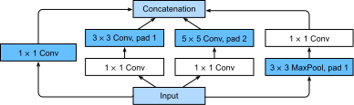
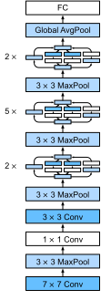

# Networks with Parallel Concatenations (GoogLeNet)

In 2014, :cite:`Szegedy.Liu.Jia.ea.2015`
won the ImageNet Challenge, proposing a structure
that combined the strengths of the NiN and repeated blocks paradigms.
One focus of the paper was to address the question
of which sized convolutional kernels are best.
After all, previous popular networks employed choices
as small as $1 \times 1$ and as large as $11 \times 11$.
One insight in this paper was that sometimes
it can be advantageous to employ a combination of variously-sized kernels.
In this section, we will introduce GoogLeNet,
presenting a slightly simplified version of the original model—we
omit a few ad hoc features that were added to stabilize training
but are unnecessary now with better training algorithms available.

## Inception Blocks

The basic convolutional block in GoogLeNet is called an Inception block,
likely named due to a quote from the movie Inception ("We Need To Go Deeper"),
which launched a viral meme.



As depicted in the figure above,
the inception block consists of four parallel paths.
The first three paths use convolutional layers
with window sizes of $1\times 1$, $3\times 3$, and $5\times 5$
to extract information from different spatial sizes.
The middle two paths perform a $1\times 1$ convolution on the input
to reduce the number of input channels, reducing the model's complexity.
The fourth path uses a $3\times 3$ maximum pooling layer,
followed by a $1\times 1$ convolutional layer
to change the number of channels.
The four paths all use appropriate padding to give the input and output the same height and width.
Finally, the outputs along each path are concatenated
along the channel dimension and comprise the block's output.
The commonly-tuned parameters of the Inception block
are the number of output channels per layer.

```{.python .input  n=1}
import d2l
from mxnet import gluon, nd
from mxnet.gluon import nn

class Inception(nn.Block):
    # c1 - c4 are the number of output channels for each layer in the path
    def __init__(self, c1, c2, c3, c4, **kwargs):
        super(Inception, self).__init__(**kwargs)
        # Path 1 is a single 1 x 1 convolutional layer
        self.p1_1 = nn.Conv2D(c1, kernel_size=1, activation='relu')
        # Path 2 is a 1 x 1 convolutional layer followed by a 3 x 3
        # convolutional layer
        self.p2_1 = nn.Conv2D(c2[0], kernel_size=1, activation='relu')
        self.p2_2 = nn.Conv2D(c2[1], kernel_size=3, padding=1,
                              activation='relu')
        # Path 3 is a 1 x 1 convolutional layer followed by a 5 x 5
        # convolutional layer
        self.p3_1 = nn.Conv2D(c3[0], kernel_size=1, activation='relu')
        self.p3_2 = nn.Conv2D(c3[1], kernel_size=5, padding=2,
                              activation='relu')
        # Path 4 is a 3 x 3 maximum pooling layer followed by a 1 x 1
        # convolutional layer
        self.p4_1 = nn.MaxPool2D(pool_size=3, strides=1, padding=1)
        self.p4_2 = nn.Conv2D(c4, kernel_size=1, activation='relu')

    def forward(self, x):
        p1 = self.p1_1(x)
        p2 = self.p2_2(self.p2_1(x))
        p3 = self.p3_2(self.p3_1(x))
        p4 = self.p4_2(self.p4_1(x))
        # Concatenate the outputs on the channel dimension
        return nd.concat(p1, p2, p3, p4, dim=1)
```

To gain some intuition for why this network works so well,
consider the combination of the filters.
They explore the image in varying ranges.
This means that details at different extents
can be recognized efficiently by different filters.
At the same time, we can allocate different amounts of parameters
for different ranges (e.g. more for short range
but not ignore the long range entirely).

## GoogLeNet Model

GoogLeNet uses a stack of a total of 9 inception blocks
and global average pooling to generate its estimates.
Maximum pooling between inception blocks reduced the dimensionality.
The first part is identical to AlexNet and LeNet,
the stack of blocks is inherited from VGG
and the global average pooling avoids
a stack of fully-connected layers at the end.
The architecture is depicted below.



We can now implement GoogLeNet piece by piece.
The first component uses a 64-channel 7×7 convolutional layer.

```{.python .input  n=2}
b1 = nn.Sequential()
b1.add(nn.Conv2D(64, kernel_size=7, strides=2, padding=3, activation='relu'),
       nn.MaxPool2D(pool_size=3, strides=2, padding=1))
```

The second component uses two convolutional layers:
first, a 64-channel $1\times 1$ convolutional layer,
then a $3\times 3$ convolutional layer that triples the number of channels. This corresponds to the second path in the Inception block.

```{.python .input  n=3}
b2 = nn.Sequential()
b2.add(nn.Conv2D(64, kernel_size=1, activation='relu'),
       nn.Conv2D(192, kernel_size=3, padding=1, activation='relu'),
       nn.MaxPool2D(pool_size=3, strides=2, padding=1))
```

The third component connects two complete Inception blocks in series.
The number of output channels of the first Inception block is
$64+128+32+32=256$, and the ratio to the output channels
of the four paths is $64:128:32:32=2:4:1:1$.
The second and third paths first reduce the number of input channels
to $96/192=1/2$ and $16/192=1/12$, respectively,
and then connect the second convolutional layer.
The number of output channels of the second Inception block
is increased to $128+192+96+64=480$, and the ratio to the number of output channels per path is $128:192:96:64 = 4:6:3:2$.
The second and third paths first reduce the number of input channels
to $128/256=1/2$ and $32/256=1/8$, respectively.

```{.python .input  n=4}
b3 = nn.Sequential()
b3.add(Inception(64, (96, 128), (16, 32), 32),
       Inception(128, (128, 192), (32, 96), 64),
       nn.MaxPool2D(pool_size=3, strides=2, padding=1))
```

The fourth block is more complicated.
It connects five Inception blocks in series,
and they have $192+208+48+64=512$, $160+224+64+64=512$,
$128+256+64+64=512$, $112+288+64+64=528$,
and $256+320+128+128=832$ output channels, respectively.
The number of channels assigned to these paths is similar
to that in the third module:
the second path with the $3\times 3$ convolutional layer
outputs the largest number of channels,
followed by the first path with only the $1\times 1$ convolutional layer,
the third path with the $5\times 5$ convolutional layer,
and the fourth path with the $3\times 3$ maximum pooling layer.
The second and third paths will first reduce
the number of channels according the ratio.
These ratios are slightly different in different Inception blocks.

```{.python .input  n=5}
b4 = nn.Sequential()
b4.add(Inception(192, (96, 208), (16, 48), 64),
       Inception(160, (112, 224), (24, 64), 64),
       Inception(128, (128, 256), (24, 64), 64),
       Inception(112, (144, 288), (32, 64), 64),
       Inception(256, (160, 320), (32, 128), 128),
       nn.MaxPool2D(pool_size=3, strides=2, padding=1))
```

The fifth block has two Inception blocks with $256+320+128+128=832$
and $384+384+128+128=1024$ output channels.
The number of channels assigned to each path
is the same as that in the third and fourth modules,
but differs in specific values.
It should be noted that the fifth block is followed by the output layer.
This block uses the global average pooling layer
to change the height and width of each channel to 1, just as in NiN.
Finally, we turn the output into a two-dimensional array
followed by a fully-connected layer
whose number of outputs is the number of label classes.

```{.python .input  n=6}
b5 = nn.Sequential()
b5.add(Inception(256, (160, 320), (32, 128), 128),
       Inception(384, (192, 384), (48, 128), 128),
       nn.GlobalAvgPool2D())

net = nn.Sequential()
net.add(b1, b2, b3, b4, b5, nn.Dense(10))
```

The GoogLeNet model is computationally complex,
so it is not as easy to modify the number of channels as in VGG.
To have a reasonable training time on Fashion-MNIST,
we reduce the input height and width from 224 to 96.
This simplifies the computation.
The changes in the shape of the output
between the various modules is demonstrated below.

```{.python .input  n=7}
X = nd.random.uniform(shape=(1, 1, 96, 96))
net.initialize()
for layer in net:
    X = layer(X)
    print(layer.name, 'output shape:\t', X.shape)
```

## Data Acquisition and Training

As before, we train our model using the Fashion-MNIST dataset.
 We transform it to $96 \times 96$ pixel resolution
 before invoking the training procedure.

```{.python .input  n=8}
lr, num_epochs, batch_size = 0.1, 10, 128
train_iter, test_iter = d2l.load_data_fashion_mnist(batch_size, resize=96)
d2l.train_ch5(net, train_iter, test_iter, num_epochs, lr)
```

## Summary

* The Inception block is equivalent to a subnetwork with four paths. It extracts information in parallel through convolutional layers of different window shapes and maximum pooling layers. $1 \times 1$ convolutions reduce channel dimensionality on a per-pixel level. Max-pooling reduces the resolution.
* GoogLeNet connects multiple well-designed Inception blocks with other layers in series. The ratio of the number of channels assigned in the Inception block is obtained through a large number of experiments on the ImageNet data set.
* GoogLeNet, as well as its succeeding versions, was one of the most efficient models on ImageNet, providing similar test accuracy with lower computational complexity.

## Exercises

1. There are several iterations of GoogLeNet. Try to implement and run them. Some of them include the following:
    * Add a batch normalization layer :cite:`Ioffe.Szegedy.2015`, as described
      later in :numref:`chapter_batch_norm`.
    * Make adjustments to the Inception block
      :cite:`Szegedy.Vanhoucke.Ioffe.ea.2016`.
    * Use "label smoothing" for model regularization
      :cite:`Szegedy.Vanhoucke.Ioffe.ea.2016`.
    * Include it in the residual connection
      :cite:`Szegedy.Ioffe.Vanhoucke.ea.2017`, as described later in
      :numref:`chapter_resnet`.
1. What is the minimum image size for GoogLeNet to work?
1. Compare the model parameter sizes of AlexNet, VGG, and NiN with GoogLeNet. How do the latter two network architectures significantly reduce the model parameter size?
1. Why do we need a large range convolution initially?


## Scan the QR Code to [Discuss](https://discuss.mxnet.io/t/2357)


