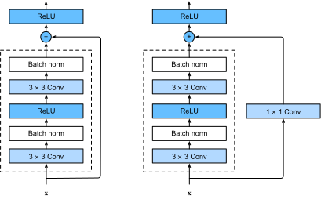
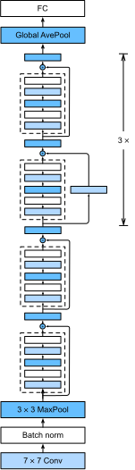

```{.python .input}
%load_ext d2lbook.tab
tab.interact_select(['mxnet', 'pytorch', 'tensorflow'])
```

# Réseaux résiduels (ResNet) et ResNeXt
:label:`sec_resnet` 

 À mesure que nous concevons des réseaux de plus en plus profonds, il devient impératif de comprendre comment l'ajout de couches peut accroître la complexité et l'expressivité du réseau.
Il est encore plus important de pouvoir concevoir des réseaux où l'ajout de couches rend les réseaux strictement plus expressifs plutôt que simplement différents.
Pour progresser, nous avons besoin d'un peu de mathématiques.


## Classes de fonctions

Considérons $\mathcal{F}$, la classe de fonctions qu'une architecture de réseau spécifique (avec des taux d'apprentissage et d'autres réglages d'hyperparamètres) peut atteindre.
Autrement dit, pour tout $f \in \mathcal{F}$, il existe un ensemble de paramètres (par exemple, les poids et les biais) qui peuvent être obtenus par l'apprentissage sur un ensemble de données approprié.
Supposons que $f^*$ soit la fonction "vérité" que nous souhaitons réellement trouver.
Si elle se trouve dans $\mathcal{F}$, nous sommes en bonne forme, mais nous n'aurons généralement pas cette chance.
Au lieu de cela, nous essaierons de trouver une certaine $f^*_\mathcal{F}$ qui est notre meilleure chance dans $\mathcal{F}$.
Par exemple,
étant donné un ensemble de données avec des caractéristiques $\mathbf{X}$
 et des étiquettes $\mathbf{y}$,
nous pourrions essayer de le trouver en résolvant le problème d'optimisation suivant :

$$f^*_\mathcal{F} \stackrel{\mathrm{def}}{=} \mathop{\mathrm{argmin}}_f L(\mathbf{X}, \mathbf{y}, f) \text{ subject to } f \in \mathcal{F}.$$ 

 Nous savons que la régularisation :cite:`tikhonov1977solutions,morozov2012methods` peut contrôler la complexité de $\mathcal{F}$
 et atteindre la cohérence, donc une plus grande taille de données d'apprentissage 
conduit généralement à un meilleur $f^*_\mathcal{F}$.
Il n'est que raisonnable de supposer que si nous concevons une architecture différente et plus puissante $\mathcal{F}'$ nous devrions arriver à un meilleur résultat. En d'autres termes, nous nous attendrions à ce que $f^*_{\mathcal{F}'}$ soit "meilleur" que $f^*_{\mathcal{F}}$. Cependant, si $\mathcal{F} \not\subseteq \mathcal{F}'$, rien ne garantit que cela se produise. En fait, $f^*_{\mathcal{F}'}$ pourrait bien être pire.
Comme l'illustre :numref:`fig_functionclasses` ,
pour les classes de fonctions non imbriquées, une classe de fonctions plus grande ne se rapproche pas toujours de la fonction "vraie" $f^*$. Par exemple,
à gauche de :numref:`fig_functionclasses` ,
bien que $\mathcal{F}_3$ soit plus proche de $f^*$ que de $\mathcal{F}_1$, $\mathcal{F}_6$ s'éloigne et il n'est pas garanti qu'une augmentation supplémentaire de la complexité puisse réduire la distance par rapport à $f^*$.
Avec les classes de fonctions imbriquées
où $\mathcal{F}_1 \subseteq \ldots \subseteq \mathcal{F}_6$
 à droite de :numref:`fig_functionclasses` ,
nous pouvons éviter le problème susmentionné des classes de fonctions non imbriquées. La classe de fonctions


 
:label:`fig_functionclasses` 

 Ainsi,
ce n'est que si les plus grandes classes de fonctions contiennent les plus petites que nous avons la garantie que leur augmentation augmente strictement le pouvoir expressif du réseau.
Pour les réseaux neuronaux profonds,
si nous pouvons former
la couche nouvellement ajoutée à une fonction d'identité $f(\mathbf{x}) = \mathbf{x}$, le nouveau modèle sera aussi efficace que le modèle original. Comme le nouveau modèle peut obtenir une meilleure solution pour s'adapter à l'ensemble de données de formation, la couche ajoutée peut faciliter la réduction des erreurs de formation.

C'est la question que :cite:`He.Zhang.Ren.ea.2016` s'est posée en travaillant sur des modèles de vision par ordinateur très profonds.
Au cœur de leur proposition de *réseau résiduel* (*ResNet*) se trouve l'idée que chaque couche supplémentaire devrait
plus facilement
contenir la fonction d'identité comme l'un de ses éléments.
Ces considérations sont assez profondes mais elles ont conduit à une solution étonnamment simple
, un *bloc résiduel*.
Grâce à cette solution, ResNet a remporté le concours de reconnaissance visuelle à grande échelle ImageNet en 2015. La conception a eu une profonde influence sur la façon de
construire des réseaux neuronaux profonds.


## (**Blocs résiduels**)
:label:`subsec_residual-blks` 

 Concentrons-nous sur une partie locale d'un réseau neuronal, comme illustré dans :numref:`fig_residual_block` . Désignons l'entrée par $\mathbf{x}$.
Nous supposons que la cartographie sous-jacente souhaitée que nous voulons obtenir par apprentissage est $f(\mathbf{x})$, et qu'elle sera utilisée comme entrée de la fonction d'activation en haut.
À gauche,
, la partie située dans la boîte en pointillés
doit apprendre directement le mappage $f(\mathbf{x})$.
À droite,
, la partie située dans la boîte en pointillés
doit
apprendre le mappage *résiduel* $f(\mathbf{x}) - \mathbf{x}$,
, d'où le nom du bloc résiduel.
Si la cartographie d'identité $f(\mathbf{x}) = \mathbf{x}$ est la cartographie sous-jacente souhaitée,
la cartographie résiduelle est plus facile à apprendre :
il suffit de mettre à zéro les poids et les biais
de la couche de poids supérieure
(par exemple, la couche entièrement connectée et la couche convolutive)
dans la boîte en pointillés
.
La figure de droite illustre le *bloc résiduel* de ResNet,
où la ligne solide portant l'entrée de la couche
$\mathbf{x}$ à l'opérateur d'addition
est appelée une *connexion résiduelle* (ou *connexion raccourcie*).
Avec les blocs résiduels, les entrées peuvent
forward se propager plus rapidement à travers les connexions résiduelles entre les couches.
En fait,
le bloc résiduel
peut être considéré comme
un cas particulier du bloc Inception multi-branches :
il possède deux branches
dont l'une est le mappage d'identité.


:label:`fig_residual_block` 

 
 ResNet suit la conception de la couche convolutive $3\times 3$ complète de VGG. Le bloc résiduel possède deux couches convolutionnelles $3\times 3$ avec le même nombre de canaux de sortie. Chaque couche convolutive est suivie d'une couche de normalisation de lot et d'une fonction d'activation ReLU. Ensuite, nous sautons ces deux opérations de convolution et ajoutons l'entrée directement avant la fonction d'activation ReLU finale.
Ce type de conception nécessite que la sortie des deux couches de convolution soit de la même forme que l'entrée, afin qu'elles puissent être ajoutées ensemble. Si nous voulons changer le nombre de canaux, nous devons introduire une couche convolutive supplémentaire $1\times 1$ pour transformer l'entrée dans la forme souhaitée pour l'opération d'addition. Jetons un coup d'oeil au code ci-dessous.

```{.python .input}
%%tab mxnet
from d2l import mxnet as d2l
from mxnet import np, npx, init
from mxnet.gluon import nn
npx.set_np()

class Residual(nn.Block):  #@save
    """The Residual block of ResNet."""
    def __init__(self, num_channels, use_1x1conv=False, strides=1, **kwargs):
        super().__init__(**kwargs)
        self.conv1 = nn.Conv2D(num_channels, kernel_size=3, padding=1,
                               strides=strides)
        self.conv2 = nn.Conv2D(num_channels, kernel_size=3, padding=1)
        if use_1x1conv:
            self.conv3 = nn.Conv2D(num_channels, kernel_size=1,
                                   strides=strides)
        else:
            self.conv3 = None
        self.bn1 = nn.BatchNorm()
        self.bn2 = nn.BatchNorm()

    def forward(self, X):
        Y = npx.relu(self.bn1(self.conv1(X)))
        Y = self.bn2(self.conv2(Y))
        if self.conv3:
            X = self.conv3(X)
        return npx.relu(Y + X)
```

```{.python .input}
%%tab pytorch
from d2l import torch as d2l
import torch
from torch import nn
from torch.nn import functional as F

class Residual(nn.Module):  #@save
    """The Residual block of ResNet."""
    def __init__(self, num_channels, use_1x1conv=False, strides=1):
        super().__init__()
        self.conv1 = nn.LazyConv2d(num_channels, kernel_size=3, padding=1, 
                                   stride=strides)
        self.conv2 = nn.LazyConv2d(num_channels, kernel_size=3, padding=1)
        if use_1x1conv:
            self.conv3 = nn.LazyConv2d(num_channels, kernel_size=1, 
                                       stride=strides)
        else:
            self.conv3 = None
        self.bn1 = nn.LazyBatchNorm2d()
        self.bn2 = nn.LazyBatchNorm2d()

    def forward(self, X):
        Y = F.relu(self.bn1(self.conv1(X)))
        Y = self.bn2(self.conv2(Y))
        if self.conv3:
            X = self.conv3(X)
        Y += X
        return F.relu(Y)
```

```{.python .input}
%%tab tensorflow
import tensorflow as tf
from d2l import tensorflow as d2l

class Residual(tf.keras.Model):  #@save
    """The Residual block of ResNet."""
    def __init__(self, num_channels, use_1x1conv=False, strides=1):
        super().__init__()
        self.conv1 = tf.keras.layers.Conv2D(num_channels, padding='same',
                                            kernel_size=3, strides=strides)
        self.conv2 = tf.keras.layers.Conv2D(num_channels, kernel_size=3,
                                            padding='same')
        self.conv3 = None
        if use_1x1conv:
            self.conv3 = tf.keras.layers.Conv2D(num_channels, kernel_size=1,
                                                strides=strides)
        self.bn1 = tf.keras.layers.BatchNormalization()
        self.bn2 = tf.keras.layers.BatchNormalization()

    def call(self, X):
        Y = tf.keras.activations.relu(self.bn1(self.conv1(X)))
        Y = self.bn2(self.conv2(Y))
        if self.conv3 is not None:
            X = self.conv3(X)
        Y += X
        return tf.keras.activations.relu(Y)
```

Ce code génère deux types de réseaux : un où nous ajoutons l'entrée à la sortie avant d'appliquer la non-linéarité ReLU chaque fois que `use_1x1conv=False`, et un où nous ajustons les canaux et la résolution au moyen d'une convolution $1 \times 1$ avant d'ajouter. :numref:`fig_resnet_block` illustre cela.


:label:`fig_resnet_block`

Examinons maintenant [**une situation où l'entrée et la sortie ont la même forme**], où la convolution $1 \times 1$ n'est pas nécessaire.

```{.python .input}
%%tab mxnet, pytorch
if tab.selected('mxnet'):
    blk = Residual(3)
    blk.initialize()
if tab.selected('pytorch'):
    blk = Residual(3)
X = d2l.randn(4, 3, 6, 6)
blk(X).shape
```

```{.python .input}
%%tab tensorflow
blk = Residual(3)
X = d2l.normal((4, 6, 6, 3))
Y = blk(X)
Y.shape
```

Nous avons également la possibilité de [**réduire de moitié la hauteur et la largeur de la sortie tout en augmentant le nombre de canaux de sortie**].
Puisque la forme de l'entrée est modifiée, `use_1x1conv=True` est spécifié.

```{.python .input}
%%tab all
blk = Residual(6, use_1x1conv=True, strides=2)
if tab.selected('mxnet'):
    blk.initialize()
blk(X).shape
```

## [**Modèle ResNet**]

Les deux premières couches de ResNet sont les mêmes que celles de GoogLeNet que nous avons décrites précédemment : la couche convolutive $7\times 7$ avec 64 canaux de sortie et un stride de 2 est suivie de la couche max-pooling $3\times 3$ avec un stride de 2. La différence est la couche de normalisation par lot ajoutée après chaque couche convolutive dans ResNet.

```{.python .input}
%%tab all
class ResNet(d2l.Classifier):
    def b1(self):
        if tab.selected('mxnet'):
            net = nn.Sequential()
            net.add(nn.Conv2D(64, kernel_size=7, strides=2, padding=3),
                    nn.BatchNorm(), nn.Activation('relu'),
                    nn.MaxPool2D(pool_size=3, strides=2, padding=1))
            return net
        if tab.selected('pytorch'):
            return nn.Sequential(
                nn.LazyConv2d(64, kernel_size=7, stride=2, padding=3),
                nn.LazyBatchNorm2d(), nn.ReLU(),
                nn.MaxPool2d(kernel_size=3, stride=2, padding=1))
        if tab.selected('tensorflow'):
            return tf.keras.models.Sequential([
                tf.keras.layers.Conv2D(64, kernel_size=7, strides=2,
                                       padding='same'),
                tf.keras.layers.BatchNormalization(),
                tf.keras.layers.Activation('relu'),
                tf.keras.layers.MaxPool2D(pool_size=3, strides=2,
                                          padding='same')])
```

GoogLeNet utilise quatre modules constitués de blocs d'Inception.
Cependant, ResNet utilise quatre modules constitués de blocs résiduels, chacun d'entre eux utilisant plusieurs blocs résiduels avec le même nombre de canaux de sortie.
Le nombre de canaux dans le premier module est le même que le nombre de canaux d'entrée. Comme une couche de max-pooling avec un stride de 2 a déjà été utilisée, il n'est pas nécessaire de réduire la hauteur et la largeur. Dans le premier bloc résiduel de chacun des modules suivants, le nombre de canaux est doublé par rapport à celui du module précédent, et la hauteur et la largeur sont divisées par deux.

Maintenant, nous implémentons ce module. Notez qu'un traitement spécial a été effectué sur le premier module.

```{.python .input}
%%tab mxnet
@d2l.add_to_class(ResNet)
def block(self, num_residuals, num_channels, first_block=False):
    blk = nn.Sequential()
    for i in range(num_residuals):
        if i == 0 and not first_block:
            blk.add(Residual(num_channels, use_1x1conv=True, strides=2))
        else:
            blk.add(Residual(num_channels))
    return blk
```

```{.python .input}
%%tab pytorch
@d2l.add_to_class(ResNet)
def block(self, num_residuals, num_channels, first_block=False):
    blk = []
    for i in range(num_residuals):
        if i == 0 and not first_block:
            blk.append(Residual(num_channels, use_1x1conv=True, strides=2))
        else:
            blk.append(Residual(num_channels))
    return nn.Sequential(*blk)
```

```{.python .input}
%%tab tensorflow
@d2l.add_to_class(ResNet)
def block(self, num_residuals, num_channels, first_block=False):
    blk = tf.keras.models.Sequential()
    for i in range(num_residuals):
        if i == 0 and not first_block:
            blk.add(Residual(num_channels, use_1x1conv=True, strides=2))
        else:
            blk.add(Residual(num_channels))
    return blk
```

Ensuite, nous ajoutons tous les modules à ResNet. Ici, deux blocs résiduels sont utilisés pour chaque module. Enfin, tout comme GoogLeNet, nous ajoutons une couche de mise en commun de la moyenne globale, suivie de la sortie de la couche entièrement connectée.

```{.python .input}
%%tab all
@d2l.add_to_class(ResNet)
def __init__(self, arch, lr=0.1, num_classes=10):
    super(ResNet, self).__init__()
    self.save_hyperparameters()
    if tab.selected('mxnet'):
        self.net = nn.Sequential()
        self.net.add(self.b1())
        for i, b in enumerate(arch):
            self.net.add(self.block(*b, first_block=(i==0)))
        self.net.add(nn.GlobalAvgPool2D(), nn.Dense(num_classes))
        self.net.initialize(init.Xavier())
    if tab.selected('pytorch'):
        self.net = nn.Sequential(self.b1())
        for i, b in enumerate(arch):
            self.net.add_module(f'b{i+2}', self.block(*b, first_block=(i==0)))
        self.net.add_module('last', nn.Sequential(
            nn.AdaptiveAvgPool2d((1, 1)), nn.Flatten(),
            nn.LazyLinear(num_classes)))
        self.net.apply(d2l.init_cnn)
    if tab.selected('tensorflow'):
        self.net = tf.keras.models.Sequential(self.b1())
        for i, b in enumerate(arch):
            self.net.add(self.block(*b, first_block=(i==0)))
        self.net.add(tf.keras.models.Sequential([
            tf.keras.layers.GlobalAvgPool2D(),
            tf.keras.layers.Dense(units=num_classes)]))
```

Il y a 4 couches convolutives dans chaque module (à l'exception de la couche convolutive $1\times 1$ ). Avec la première couche convolutive $7\times 7$ et la couche finale entièrement connectée, il y a 18 couches au total. Par conséquent, ce modèle est communément appelé ResNet-18.
En configurant différents nombres de canaux et de blocs résiduels dans le module, nous pouvons créer différents modèles ResNet, tels que le plus profond ResNet-152 à 152 couches. Bien que l'architecture principale de ResNet soit similaire à celle de GoogLeNet, la structure de ResNet est plus simple et plus facile à modifier. Tous ces facteurs ont permis l'utilisation rapide et répandue de ResNet. :numref:`fig_resnet18` représente le ResNet-18 complet.

 
 :label:`fig_resnet18` 

 Avant d'entraîner ResNet, observons [**comment la forme de l'entrée change à travers les différents modules de ResNet**]. Comme dans toutes les architectures précédentes, la résolution diminue tandis que le nombre de canaux augmente jusqu'au point où une couche de mise en commun de la moyenne globale agrège toutes les caractéristiques.

```{.python .input}
%%tab all
class ResNet18(ResNet):
    def __init__(self, lr=0.1, num_classes=10):
        super().__init__(((2, 64), (2, 128), (2, 256), (2, 512)),
                       lr, num_classes)
```

```{.python .input}
%%tab pytorch, mxnet
ResNet18().layer_summary((1, 1, 96, 96))
```

```{.python .input}
%%tab tensorflow
ResNet18().layer_summary((1, 96, 96, 1))
```

## [**Training**]

Nous entraînons ResNet sur le jeu de données Fashion-MNIST, comme précédemment.

```{.python .input}
%%tab mxnet, pytorch
model = ResNet18(lr=0.01)
trainer = d2l.Trainer(max_epochs=10, num_gpus=1)
data = d2l.FashionMNIST(batch_size=128, resize=(96, 96))
if tab.selected('pytorch'):
    model.apply_init([next(iter(data.get_dataloader(True)))[0]], d2l.init_cnn)
trainer.fit(model, data)
```

```{.python .input}
%%tab tensorflow
trainer = d2l.Trainer(max_epochs=10)
data = d2l.FashionMNIST(batch_size=128, resize=(96, 96))
with d2l.try_gpu():
    model = ResNet18(lr=0.01)
    trainer.fit(model, data)
```

## ResNeXt
:label:`subsec_resnext` 

 Rappelons :numref:`fig_resnet_block` 
 que chaque bloc ResNet empile simplement les couches entre les connexions résiduelles.
Cette conception peut être modifiée
en remplaçant les couches empilées par
des transformations parallèles concaténées,
conduisant à ResNeXt
:cite:`Xie.Girshick.Dollar.ea.2017` .
Contrairement à *une variété de* transformations
dans les blocs Inception multi-branches,
ResNeXt adopte la *même* transformation dans toutes les branches,
minimisant ainsi les efforts de conception manuelle dans chaque branche.


:label:`fig_resnext_block` 

 La boîte en pointillés de gauche dans
:numref:`fig_resnext_block` 
 représente la stratégie de transformation parallèle concaténée ajoutée
dans ResNeXt.
Plus concrètement,
une entrée avec $c$ canaux
est d'abord divisée en $g$ groupes
via $g$ branches de $1 \times 1$ convolutions
suivies de $3 \times 3$ convolutions,
toutes avec $b/g$ canaux de sortie.
La concaténation de ces sorties $g$
 donne lieu à des canaux de sortie $b$,
conduisant à une largeur de réseau
"goulot d'étranglement" (lorsque $b < c$) à l'intérieur de la boîte en pointillés.
Cette sortie
restaurera les canaux originaux $c$ de l'entrée
via la convolution finale $1 \times 1$
 juste avant la somme avec la connexion résiduelle.
Notamment,
la boîte pointillée gauche est équivalente à
la boîte pointillée droite beaucoup *simplifiée dans :numref:`fig_resnext_block` ,
où il suffit de spécifier
que la convolution $3 \times 3$ est une *convolution de groupe*
avec $g$ groupes.
En fait,
la convolution de groupe remonte
à l'idée de distribuer le modèle AlexNet
sur deux GPU en raison de la mémoire limitée des GPU à cette époque :cite:`Krizhevsky.Sutskever.Hinton.2012` .

L'implémentation suivante de la classe `ResNeXtBlock`
 traite `groups` ($b/g$ dans :numref:`fig_resnext_block` ) comme un argument
de sorte que, compte tenu des canaux goulots d'étranglement `bot_channels` ($b$ dans :numref:`fig_resnext_block` ),
la convolution de groupe $3 \times 3$ aura
groupes `bot_channels//groups`.
Comme pour
, la mise en œuvre du bloc résiduel dans
:numref:`subsec_residual-blks` ,
la connexion résiduelle
est généralisée
avec une convolution $1 \times 1$ (`conv4`),
où le réglage de `use_1x1conv=True, strides=2`
 divise par deux la hauteur et la largeur d'entrée.

```{.python .input}
%%tab mxnet
class ResNeXtBlock(nn.Block):  #@save
    """The ResNeXt block."""
    def __init__(self, num_channels, groups, bot_mul,
                 use_1x1conv=False, strides=1, **kwargs):
        super().__init__(**kwargs)
        bot_channels = int(round(num_channels * bot_mul))
        self.conv1 = nn.Conv2D(bot_channels, kernel_size=1, padding=0,
                               strides=1)
        self.conv2 = nn.Conv2D(bot_channels, kernel_size=3, padding=1,
                               strides=strides,
                               groups=bot_channels//groups)
        self.conv3 = nn.Conv2D(num_channels, kernel_size=1, padding=0,
                               strides=1)
        self.bn1 = nn.BatchNorm()
        self.bn2 = nn.BatchNorm()
        self.bn3 = nn.BatchNorm()
        if use_1x1conv:
            self.conv4 = nn.Conv2D(num_channels, kernel_size=1,
                                   strides=strides)
            self.bn4 = nn.BatchNorm()
        else:
            self.conv4 = None

    def forward(self, X):
        Y = npx.relu(self.bn1(self.conv1(X)))
        Y = npx.relu(self.bn2(self.conv2(Y)))
        Y = self.bn3(self.conv3(Y))
        if self.conv4:
            X = self.bn4(self.conv4(X))
        return npx.relu(Y + X)
```

```{.python .input}
%%tab pytorch
class ResNeXtBlock(nn.Module):  #@save
    """The ResNeXt block."""
    def __init__(self, num_channels, groups, bot_mul, use_1x1conv=False, 
                 strides=1):
        super().__init__()
        bot_channels = int(round(num_channels * bot_mul))
        self.conv1 = nn.LazyConv2d(bot_channels, kernel_size=1,
                               stride=1)
        self.conv2 = nn.LazyConv2d(bot_channels, kernel_size=3,
                               stride=strides, padding=1,
                               groups=bot_channels//groups)
        self.conv3 = nn.LazyConv2d(num_channels, kernel_size=1,
                               stride=1)
        self.bn1 = nn.LazyBatchNorm2d()
        self.bn2 = nn.LazyBatchNorm2d()
        self.bn3 = nn.LazyBatchNorm2d()
        if use_1x1conv:
            self.conv4 = nn.LazyConv2d(num_channels, kernel_size=1, 
                                       stride=strides)
            self.bn4 = nn.LazyBatchNorm2d()
        else:
            self.conv4 = None

    def forward(self, X):
        Y = F.relu(self.bn1(self.conv1(X)))
        Y = F.relu(self.bn2(self.conv2(Y)))
        Y = self.bn3(self.conv3(Y))
        if self.conv4:
            X = self.bn4(self.conv4(X))
        return F.relu(Y + X)
```

```{.python .input}
%%tab tensorflow
class ResNeXtBlock(tf.keras.Model):  #@save
    """The ResNeXt block.""" 
    def __init__(self, num_channels, groups, bot_mul, use_1x1conv=False, 
                 strides=1):
        super().__init__()
        bot_channels = int(round(num_channels * bot_mul))
        self.conv1 = tf.keras.layers.Conv2D(bot_channels, 1, strides=1)
        self.conv2 = tf.keras.layers.Conv2D(bot_channels, 3, strides=strides,
                                            padding="same",
                                            groups=bot_channels//groups)
        self.conv3 = tf.keras.layers.Conv2D(num_channels, 1, strides=1)
        self.bn1 = tf.keras.layers.BatchNormalization()
        self.bn2 = tf.keras.layers.BatchNormalization()
        self.bn3 = tf.keras.layers.BatchNormalization()
        if use_1x1conv:
            self.conv4 = tf.keras.layers.Conv2D(num_channels, 1, 
                                       strides=strides)
            self.bn4 = tf.keras.layers.BatchNormalization()
        else:
            self.conv4 = None
        
    def call(self, X):
        Y = tf.keras.activations.relu(self.bn1(self.conv1(X)))
        Y = tf.keras.activations.relu(self.bn2(self.conv2(Y)))
        Y = self.bn3(self.conv3(Y))
        if self.conv4:
            X = self.bn4(self.conv4(X))
        return tf.keras.activations.relu(Y + X)
```

Dans le cas suivant (`use_1x1conv=False, strides=1`), l'entrée et la sortie ont la même forme.

```{.python .input}
%%tab mxnet, pytorch
blk = ResNeXtBlock(32, 16, 1)
if tab.selected('mxnet'):
    blk.initialize()
X = d2l.randn(4, 32, 96, 96)
blk(X).shape
```

```{.python .input}
%%tab tensorflow
blk = ResNeXtBlock(32, 16, 1)
X = d2l.normal((4, 96, 96, 32))
Y = blk(X)
Y.shape
```

Alternativement, le réglage de `use_1x1conv=True, strides=2`
 divise par deux la hauteur et la largeur de la sortie.

```{.python .input}
%%tab mxnet, pytorch
blk = ResNeXtBlock(32, 16, 1, use_1x1conv=True, strides=2)
if tab.selected('mxnet'):
    blk.initialize()
blk(X).shape
```

```{.python .input}
%%tab tensorflow
blk = ResNeXtBlock(32, 16, 1, use_1x1conv=True, strides=2)
X = d2l.normal((4, 96, 96, 32))
Y = blk(X)
Y.shape
```

## Résumé et discussion

Les classes de fonctions imbriquées sont souhaitables. L'apprentissage d'une couche supplémentaire dans les réseaux neuronaux profonds en tant que fonction d'identité (bien que ce soit un cas extrême) devrait être facilité. Le mappage résiduel peut apprendre la fonction d'identité plus facilement, par exemple en poussant les paramètres de la couche de poids à zéro. Nous pouvons former un réseau neuronal *profond* efficace en ayant des blocs résiduels. Les entrées peuvent se propager plus rapidement à travers les connexions résiduelles entre les couches.

Avant les connexions résiduelles, des chemins de contournement
avec des unités de déclenchement ont été introduits
pour former efficacement des réseaux routiers de plus de 100 couches
:cite:`srivastava2015highway` .
En utilisant des fonctions d'identité comme chemins de contournement,
ResNets a obtenu des résultats remarquables
sur de multiples tâches de vision par ordinateur.
Les connexions résiduelles ont eu une influence majeure sur la conception des réseaux neuronaux profonds ultérieurs, tant pour la nature convolutive que séquentielle.
Comme nous le présenterons plus loin,
l'architecture transformatrice :cite:`Vaswani.Shazeer.Parmar.ea.2017` 
 adopte les connexions résiduelles (ainsi que d'autres choix de conception) et est omniprésente
dans des domaines aussi divers que 
le langage, la vision, la parole et l'apprentissage par renforcement.
L'un des principaux avantages de la conception ResNeXt
est que l'augmentation des groupes
entraîne des connexions plus éparses (c'est-à-dire une moindre complexité de calcul) au sein du bloc,
permettant ainsi d'augmenter la largeur du réseau
pour obtenir un meilleur compromis entre
FLOPs et précision.
La ResNeXt-ification
est intéressante pour la conception ultérieure de réseaux de convolution,
comme dans le modèle RegNet :cite:`Radosavovic.Kosaraju.Girshick.ea.2020` 
 et l'architecture ConvNeXt :cite:`liu2022convnet` .
Nous appliquerons le bloc ResNeXt plus tard dans ce chapitre.


## Exercices

1. Quelles sont les principales différences entre le bloc Inception de :numref:`fig_inception` et le bloc ResNeXt ? Après avoir supprimé certains chemins dans le bloc Inception, comment sont-ils reliés les uns aux autres ?
1. Reportez-vous au tableau 1 du document ResNet :cite:`He.Zhang.Ren.ea.2016` pour
 mettre en œuvre différentes variantes.
1. Pour les réseaux plus profonds, ResNet introduit une architecture " goulot d'étranglement " pour réduire la complexité du modèle
. Essayez de la mettre en œuvre.
1. Dans les versions ultérieures de ResNet, les auteurs ont changé la structure " convolution, normalisation par lots
 et activation " en structure " normalisation par lots, activation
 et convolution ". Apportez vous-même cette amélioration
. Voir la figure 1 de :cite:`He.Zhang.Ren.ea.2016*1` 
 pour plus de détails.
1. Pourquoi ne pouvons-nous pas simplement augmenter la complexité des fonctions sans limite, même si les classes de fonctions sont imbriquées ?

:begin_tab:`mxnet`
[Discussions](https://discuss.d2l.ai/t/85)
:end_tab:

:begin_tab:`pytorch`
[Discussions](https://discuss.d2l.ai/t/86)
:end_tab:

:begin_tab:`tensorflow`
[Discussions](https://discuss.d2l.ai/t/8737)
:end_tab:
