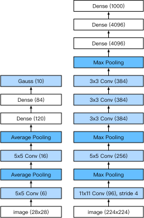

# Deep Convolutional Neural Networks (AlexNet)

In nearly two decades since LeNet was proposed, for a time, neural networks were surpassed by other machine learning methods, such as Support Vector Machines. Although LeNet achieved good results on early small data sets, its performance on larger real data sets was not satisfactory. Neural network computing is complex. Although some neural network accelerators were available in the 1990s, they were not sufficiently powerful. Therefore, it was difficult to train a multichannel, multilayer convolutional neural network with a large number of parameters in those years. Secondly, datasets were still relatively small. As a result, deep learning research lay mostly dormant. Key techniques such as parameter initialization, non-convex optimization algorithms, activation functions and effective regularization were still missing. The lack of such research was another reason why the training of complex neural networks was very difficult. 

One of the key differences to classical computer vision is that we trained the OCR system *end-to-end*. That is, we modeled the entire data analysis pipeline from raw pixels to the classifier output as a single trainable and deformable model. In training the model end-to-end it does away with a lot of the engineering typically required to build a machine learning model. This is quite different from what was the dominant paradigm for machine learning in the 1990s and 2000s. 

1. Obtain an interesting dataset that captures relevant aspects e.g. of computer vision. Typically such datasets were hand generated using very expensive sensors (at the time 1 megapixel images were state of the art).
1. Preprocess the dataset using a significant amount of optics, geometry, and analytic tools. 
1. Dump the data into a standard set of feature extractors such as [SIFT](https://en.wikipedia.org/wiki/Scale-invariant_feature_transform), the Scale-Invariant Feature Transform, or [SURF](https://en.wikipedia.org/wiki/Speeded_up_robust_features), the Speeded-Up Robust Features, or any number of other hand-tuned pipelines.
1. Dump the resulting representations into a linear model (or a kernel method which generates a linear odel in feature space) to solve the machine learning part.

If you spoke to machine learning researchers, they believed that machine learning was both important and beautiful. Elegant theories proved the properties of various classifiers. The field of machine learning was thriving, rigorous and eminently useful. However, if you spoke to a computer vision researcher, you’d hear a very different story. The dirty truth of image recognition, they’d tell you, is that the really important aspects of the ML for CV pipeline were data and features. A slightly cleaner dataset, or a slightly better hand-tuned feature mattered a lot to the final accuracy. However, the specific choice of classifier was little more than an afterthought. At the end of the day you could throw your features in a logistic regression model, a support vector machine, or any other classifier of choice, and they would all perform roughly the same.


## Learning Feature Representation

Another way to cast the state of affairs is that the most important part of the pipeline was the representation. And up until 2012, this part was done mechanically, based on some hard-fought intuition. In fact, engineering a new set of feature functions, improving results, and writing up the method was a prominent genre of paper. 
[SIFT](https://en.wikipedia.org/wiki/Scale-invariant_feature_transform), 
[SURF](https://en.wikipedia.org/wiki/Speeded_up_robust_features), 
[HOG](https://en.wikipedia.org/wiki/Histogram_of_oriented_gradients), 
[Bags of visual words](https://en.wikipedia.org/wiki/Bag-of-words_model_in_computer_vision)
and similar feature extractors ruled the roost. 

Another group of researchers had different plans. They believed that features themselves ought to be learned. Moreover they believed that to be reasonably complex, the features ought to be hierarchically composed. These researchers, including Yann LeCun, Geoff Hinton, Yoshua Bengio, Andrew Ng, Shun-ichi Amari, and Juergen Schmidhuber believed that by jointly training many layers of a neural network, they might come to learn hierarchical representations of data. 
In the case of an image, the lowest layers might come to detect edges, colors, and textures. Indeed, [Krizhevski, Sutskever and Hinton, 2012](https://papers.nips.cc/paper/4824-imagenet-classification-with-deep-convolutional-neural-networks) designed a new variant of a convolutional neural network which achieved excellent performance in the ImageNet challenge. Indeed, it learned good feature extractors in the lower layers. The figure below is reproduced from this paper and it describes lower level image descriptors. 


Higher layers might build upon these representations to represent larger structures, like eyes, noses, blades of grass, and features. Yet higher layers might represent whole objects like people, airplanes, dogs, or frisbees. 
And ultimately, before the classification layer, the final hidden state might represent a compact representation of the image that summarized the contents in a space where data belonging to different categories would be linearly separable. It should be emphasized that the hierarchical representation of the input is determined by the parameters in the multilayer model, and these parameters are all obtained from learning.

Indeed, the visual processing system of animals (and humans) works a bit like that. At its lowest level it contains mostly edge detectors, followed by more structured features. Although researchers dedicated themselves to this idea and attempted to study the hierarchical representation of visual data, their ambitions went unrewarded until 2012. This was due to two key factors.

### Missing Ingredient - Data

A deep model with many layers requires a large amount of data to achieve better results than convex models, such as kernel methods. However, given the limited storage capacity of computers, the fact that sensors were expensive and the comparatively tighter research budgets in the 1990s, most research relied on tiny datasets. For example, many  research papers relied on the UCI corpus of datasets, many of which contained hundreds or a few thousand images of low resolution, which were taken in unnatural settings. This situation was improved by the advent of big data around 2010. In particular, the ImageNet data set, which was released in 2009, contains 1,000 categories of objects, each with thousands of different images. This scale was unprecedented. It pushed both computer vision and machine learning research towards deep nonconvex models. 


### Missing Ingredient - Hardware

Deep Learning has a voracious appetite for computation. This is one of the main reasons why in the 90s and early 2000s algorithms based on convex optimization were the preferred way of solving problems. After all, convex algorithms have fast rates of convergence, global minima, and efficient algorithms can be found. 

The game changer was the availability of GPUs. They had long been tuned for graphics processing in computer games. In particular, they were optimized for high throughput 4x4 matrix-vector products, since these are needed for many computer graphics tasks. Fortunately, the math required for that is very similar to convolutional layers in deep networks. Furthermore, around that time, NVIDIA and ATI had begun optimizing GPUs for general compute operations, going as far as renaming them GPGPU (General Purpose GPUs). 

To provide some intuition, consider the cores of a modern microprocessor. Each of the cores is quite powerful, running at a high clock frequency, it has quite advanced and large caches (up to several MB of L3). Each core is very good at executing a very wide range of code, with branch predictors, a deep pipeline and lots of other things that make it great at executing regular programs. This apparent strength, however, is also its Achilles heel: general purpose cores are very expensive to build. They require lots of chip area, a sophisticated support structure (memory interfaces, caching logic between cores, high speed interconnects, etc.), and they're comparatively bad at any single task. Modern laptops have up to 4 cores, and even high end servers rarely exceed 64 cores, simply because it is not cost effective. 

Compare that with GPUs. They consist of 100-1000 small processing elements (the details differ somewhat betwen NVIDIA, ATI, ARM and other chip vendors), often grouped into larger groups (NVIDIA calls them warps). While each core is relatively weak, sometimes even running at sub-1GHz clock frequency, it is the total number of such cores that makes GPUs orders of magnitude faster than CPUs. For instance, NVIDIA's latest Volta generation offers up to 120 TFlops per chip for specialized instructions (and up to 24 TFlops for more general purpose ones), while floating point performance of CPUs has not exceeded 1 TFlop to date. The reason for why this is possible is actually quite simple: firstly, power consumption tends to grow *quadratically* with clock frequency. Hence, for the power budget of a CPU core that runs 4x faster (a typical number) you can use 16 GPU cores at 1/4 the speed, which yields 16 x 1/4 = 4x the performance. Furthermore GPU cores are much simpler (in fact, for a long time they weren't even *able* to execute general purpose code), which makes them more energy efficient. Lastly, many operations in deep learning require high memory bandwidth. Again, GPUs shine here with buses that are at least 10x as wide as many CPUs. 

Back to 2012. A major breakthrough came when Alex Krizhevsky and Ilya Sutskever 
implemented a deep convolutional neural network that could run on GPU hardware. They realized that 
the computational bottlenecks in CNNs (convolutions and matrix multiplications) are all operations that could be parallelized in hardware. Using two NIVIDA GTX 580s with 3GB of memory they implemented fast convolutions. The code [cuda-convnet](https://code.google.com/archive/p/cuda-convnet/) was good enough that for several years it was the industry standard and powered the first couple years of the deep learning boom.  

## AlexNet

AlexNet was introduced in 2012, named after Alex Krizhevsky, the first author of the eponymous [paper](https://papers.nips.cc/paper/4824-imagenet-classification-with-deep-convolutional-neural-networks). AlexNet uses an 8-layer convolutional neural network and won the ImageNet Large Scale Visual Recognition Challenge 2012 with a large margin. This network proved, for the first time, that the features obtained by learning can transcend manually-design features, breaking the previous paradigm in computer vision. The architectures of AlexNet and LeNet are *very similar*, as the diagram below illustrates. Note that we provide a slightly streamlined version of AlexNet which removes the quirks that were needed in 2012 to make the model fit on two small GPUs. 



The design philosophies of AlextNet and LeNet are very similar, but there are also significant differences.
First, AlexNet is much deeper than the comparatively small LeNet5. AlexNet consists of eight layers, five convolutional layers, two fully connected hidden layers, and one fully connected output layer. Second, AlexNet used the ReLu instead of the sigmoid as its activation function. This improved convergence during training significantly. Let's delve into the details below. 

### Architecture

In AlexNet's first layer, the convolution window shape is $11\times11$. Since most images in ImageNet are more than ten times higher and wider than the MNIST images, objects in ImageNet images take up more pixels. Consequently, a larger convolution window is needed to capture the object. The convolution window shape in the second layer is reduced to $5\times5$, followed by $3\times3$. In addition, after the first, second, and fifth convolutional layers, the network adds maximum pooling layers with a window shape of $3\times3$ and a stride of 2. Moreover, AlexNet has ten times more convolution channels than LeNet.

After the last convolutional layer are two fully connected layers with 4096 outputs. These two huge fully connected layers produce model parameters of nearly 1 GB. Due to the limited memory in early GPUs, the original AlexNet used a dual data stream design, so that one GPU only needs to process half of the model. Fortunately, GPU memory has developed tremendously over the past few years, so we usually do not need this special design anymore (our model deviates from the original paper in this aspect).

### Activation Functions

Second, AlextNet changed the sigmoid activation function to a simpler ReLU activation function. On the one hand, the computation of the ReLU activation function is simpler. For example, it does not have the exponentiation operation found in the sigmoid activation function. On the other hand, the ReLU activation function makes model training easier when using different parameter initialization methods. This is because, when the output of the sigmoid activation function is very close to 0 or 1, the gradient of these regions is almost 0, so that back propagation cannot continue to update some of the model parameters. In contrast, the gradient of the ReLU activation function in the positive interval is always 1. Therefore, if the model parameters are not properly initialized, the sigmoid function may obtain a gradient of almost 0 in the positive interval, so that the model cannot be effectively trained.

### Capacity Control and Preprocessing

AlextNet controls the model complexity of the fully connected layer by [dropout](../chapter_deep-learning-basics/dropout.md) section), while LeNet only uses weight decay. To augment the data even further, the training loop of AlexNet added a great deal of image augmentation, such as flipping, clipping, and color changes. This makes the model more robust and the larger sample size effectively reduces overfitting. We will discuss preprocessing in detail in a [subsequent section](../chapter_computer-vision/image-augmentation.md).

```{.python .input  n=1}
import gluonbook as gb
from mxnet import gluon, init, nd
from mxnet.gluon import data as gdata, nn
import os
import sys

net = nn.Sequential()
# Here, we use a larger 11 x 11 window to capture objects. At the same time, we use a stride of 4 to greatly reduce the height and width of the output.
# Here, the number of input channels is much larger than that in LeNet.
net.add(nn.Conv2D(96, kernel_size=11, strides=4, activation='relu'),
        nn.MaxPool2D(pool_size=3, strides=2),
        # Make the convolution window smaller, set padding to 2 for consistent height and width across the input and output, and increase the number of output channels
        nn.Conv2D(256, kernel_size=5, padding=2, activation='relu'),
        nn.MaxPool2D(pool_size=3, strides=2),
        # Use three successive convolutional layers and a smaller convolution window. Except for the final convolutional layer, the number of output channels is further increased.
        # Pooling layers are not used to reduce the height and width of input after the first two convolutional layers.
        nn.Conv2D(384, kernel_size=3, padding=1, activation='relu'),
        nn.Conv2D(384, kernel_size=3, padding=1, activation='relu'),
        nn.Conv2D(256, kernel_size=3, padding=1, activation='relu'),
        nn.MaxPool2D(pool_size=3, strides=2),
        # Here, the number of outputs of the fully connected layer is several times larger than that in LeNet. Use the dropout layer to mitigate overfitting.
        nn.Dense(4096, activation="relu"), nn.Dropout(0.5),
        nn.Dense(4096, activation="relu"), nn.Dropout(0.5),
        # Output layer. Since we are using Fashion-MNIST, the number of classes is 10, instead of 1000 as in the paper.
        nn.Dense(10))
```

We construct a single-channel data instance with both height and width of 224 to observe the output shape of each layer. It matches our diagram above.

```{.python .input  n=2}
X = nd.random.uniform(shape=(1, 1, 224, 224))
net.initialize()
for layer in net:
    X = layer(X)
    print(layer.name, 'output shape:\t', X.shape)
```

## Reading Data

Although AlexNet uses ImageNet in the paper, we use Fashion-MNIST. This is simply since training on ImageNet would take hours even on modern GPUs. One of the problems with applying AlexNet directly is that the images are simply too low resolution at $28 \times 28$ pixels. To make things work we upsample them to $244 \times 244$ (this is generally not very smart but we do so to illustrate network performance). This can be done with the `Resize` class. We insert it into the processing pipeline before using the `ToTensor` class. The `Compose` class to concatenates these two changes for easy invocation.

```{.python .input  n=3}
# This function has been saved in the gluonbook package for future use.
def load_data_fashion_mnist(batch_size, resize=None, root=os.path.join(
        '~', '.mxnet', 'datasets', 'fashion-mnist')):
    root = os.path.expanduser(root)  # Expand the user path '~'.
    transformer = []
    if resize:
        transformer += [gdata.vision.transforms.Resize(resize)]
    transformer += [gdata.vision.transforms.ToTensor()]
    transformer = gdata.vision.transforms.Compose(transformer)
    mnist_train = gdata.vision.FashionMNIST(root=root, train=True)
    mnist_test = gdata.vision.FashionMNIST(root=root, train=False)
    num_workers = 0 if sys.platform.startswith('win32') else 4
    train_iter = gdata.DataLoader(
        mnist_train.transform_first(transformer), batch_size, shuffle=True,
        num_workers=num_workers)
    test_iter = gdata.DataLoader(
        mnist_test.transform_first(transformer), batch_size, shuffle=False,
        num_workers=num_workers)
    return train_iter, test_iter

batch_size = 128
train_iter, test_iter = load_data_fashion_mnist(batch_size, resize=224)
```

## Training

Now, we can start training AlexNet. Compared to LeNet in the previous section, the main change here is the use of a smaller learning rate and much slower training due to the deeper and wider network, the higher image resolution and the more costly convolutions.

```{.python .input  n=5}
lr, num_epochs, ctx = 0.01, 5, gb.try_gpu()
net.initialize(force_reinit=True, ctx=ctx, init=init.Xavier())
trainer = gluon.Trainer(net.collect_params(), 'sgd', {'learning_rate': lr})
gb.train_ch5(net, train_iter, test_iter, batch_size, trainer, ctx, num_epochs)
```

## Summary

* AlexNet has a similar structure to that of LeNet, but uses more convolutional layers and a larger parameter space to fit the large-scale data set ImageNet. 
* Today AlexNet has been surpassed by much more effective architectures but it is a key step from shallow to deep networks that are used nowadays.
* Although it seems that there are only a few more lines in AlexNet's implementation than in LeNet, it took the academic community many years to embrace this conceptual change and take advantage of its excellent experimental results. This was also due to the lack of efficient computational tools.
* Dropout, ReLu and preprocessing were the other key steps in achieving excellent performance in computer vision tasks.

## Problems

1. Try increasing the number of epochs. Compared with LeNet, how are the results different? Why? 
1. AlexNet may be too complex for the Fashion-MNIST data set. 
    * Try to simplify the model to make the training faster, while ensuring that the accuracy does not drop significantly. 
    * Can you design a better model that works directly on $28 \times 28$ images.
1. Modify the batch size, and observe the changes in accuracy and GPU memory.
1. Rooflines
    * What is the dominant part for the memory footprint of AlexNet?
    * What is the dominant part for computation in AlexNet?
    * How about memory bandwidth when computing the results?
1. Apply dropout and ReLu to LeNet5. Does it improve? How about preprocessing?


## Scan the QR Code to Access [Discussions](https://discuss.gluon.ai/t/topic/1258)


