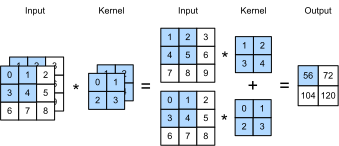
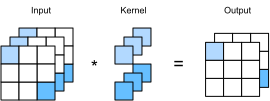

# Multiple Input and Output Channels

In the previous section, we used two-dimensional arrays are the inputs and outputs, but real data often has higher dimensions. For example, a color image has three color channels of RGB (red, green, and blue) in addition to the height and width dimensions. Assuming that the height and width of the color image are $h$ and $w$ (pixels), it can be represented in the memory as a multi-dimensional array of $3\times h\times w$. We refer to this dimension, with a size of 3, as the channel dimension. In this section, we will introduce convolution kernels with multiple input and multiple output channels.

## Multiple Input Channels

When the input data contains multiple channels, we need to construct a convolution kernel with the same number of input channels as the input data, so that it can perform cross-correlation with the input data. Assuming that the number of channels for the input data is $c_i$, the number of input channels of the convolution kernel also needs to be $c_i$. We set the convolution kernel window shape to $k_h\times k_w$. This way, when $c_i=1$, we know that the convolution kernel contains only a two-dimensional array of the shape $k_h\times k_w$. When $c_i>1$, we will assign a kernel array of shape $k_h\times k_w$ to each input channel. Concatenating these $c_i$ arrays to the input channel dimension yields a convolution kernel of shape $c_i\times k_h\times k_w$. Since the input and convolution kernel each have $c_i$ channels, we can perform a cross-correlation operation on the two-dimensional array of the input and the two-dimensional kernel array of the convolution kernel on each channel, and then add the $c_i$ cross-correlated two-dimensional outputs by channel to get a two-dimensional array. This is the output of a two-dimensional cross-correlation operation between the multi-channel input data and the multi-input channel convolution kernel.

The figure below shows an example of a two-dimensional cross-correlation computation with two input channels. On each channel, the two-dimensional input array and the two-dimensional kernel array are cross-correlated, and then added together by channel to obtain the output. The shaded portions are the first output element as well as the input and kernel array elements used in its computation: $(1\times1+2\times2+4\times3+5\times4)+(0\times0+1\times1+3\times2+4\times3)=56$.




Let's implement cross-correlation operations with multiple input channels. We simply need to perform a cross-correlation operation for each channel, and then add them up using the `add_n` function.

```{.python .input  n=1}
import sys
sys.path.insert(0, '..')

import d2l
from mxnet import nd

def corr2d_multi_in(X, K):
    # First, traverse along the 0th dimension (channel dimension) of X and K.
    # Then, add them together by using * to turn the result list into a
    # positional argument of the add_n function
    return nd.add_n(*[d2l.corr2d(x, k) for x, k in zip(X, K)])
```

We can construct the input array `X` and the kernel array `K` of the above diagram to validate the output of the cross-correlation operation.

```{.python .input  n=2}
X = nd.array([[[0, 1, 2], [3, 4, 5], [6, 7, 8]],
              [[1, 2, 3], [4, 5, 6], [7, 8, 9]]])
K = nd.array([[[0, 1], [2, 3]], [[1, 2], [3, 4]]])

corr2d_multi_in(X, K)
```

## Multiple Output Channels

Regardless of the number of input channels, so far we always ended up with one output channel. However, it is quite reasonable to assume that we might need more than one output, e.g. for edge detection in different directions or for more advanced filters. Denote by $c_i$ and $c_o$ the number of input and output channels respectively and let $k_h$ and $k_w$ be the height and width of the kernel. To get an output with multiple channels, we can create a kernel array of shape $c_i\times k_h\times k_w$ for each output channel. We concatenate them on the output channel dimension, so that the shape of the convolution kernel is $c_o\times c_i\times k_h\times k_w$. In cross-correlation operations, the result on each output channel is calculated from the kernel array of the convolution kernel on the same output channel and the entire input array.

We implement a cross-correlation function to calculate the output of multiple channels as shown below.

```{.python .input  n=3}
def corr2d_multi_in_out(X, K):
    # Traverse along the 0th dimension of K, and each time, perform
    # cross-correlation operations with input X. All of the results are merged
    # together using the stack function
    return nd.stack(*[corr2d_multi_in(X, k) for k in K])
```

We construct a convolution kernel with 3 output channels by concatenating the kernel array `K` with `K+1` (plus one for each element in `K`) and `K+2`.

```{.python .input  n=4}
K = nd.stack(K, K + 1, K + 2)
K.shape
```

Below, we perform cross-correlation operations on the input array `X` with the kernel array `K`. Now the output contains 3 channels. The result of the first channel is consistent with the result of the previous input array `X` and the multi-input channel, single-output channel kernel.

```{.python .input  n=5}
corr2d_multi_in_out(X, K)
```

## $1\times 1$ Convolutional Layer

At first a $1 \times 1$ convolution, i.e. $k_h = k_w = 1$, doesn't seem to make much sense. After all, a convolution correlates adjacent pixels. A $1 \times 1$ convolution obviously doesn't. Nonetheless, it is a popular choice when designing complex and deep networks. Let's see in some detail what it actually does.

Because the minimum window is used, the $1\times 1$ convolution loses the ability of the convolutional layer to recognize patterns composed of adjacent elements in the height and width dimensions. The main computation of the $1\times 1$ convolution occurs on the channel dimension. The figure below shows the cross-correlation computation using the $1\times 1$ convolution kernel with 3 input channels and 2 output channels. It is worth noting that the inputs and outputs have the same height and width. Each element in the output is derived from a linear combination of elements in the same position in the height and width of the input between different channels. Assuming that the channel dimension is considered a feature dimension and that the elements in the height and width dimensions are considered data examples, then the $1\times 1$ convolutional layer is equivalent to the fully connected layer.



Let's check whether this works in practice: we implement the $1 \times 1$ convolution using a fully connected layer. The only thing is that we need to make some adjustments to the data shape before and after the matrix multiplication.

```{.python .input  n=6}
def corr2d_multi_in_out_1x1(X, K):
    c_i, h, w = X.shape
    c_o = K.shape[0]
    X = X.reshape((c_i, h * w))
    K = K.reshape((c_o, c_i))
    Y = nd.dot(K, X)  # Matrix multiplication in the fully connected layer
    return Y.reshape((c_o, h, w))
```

When performing $1\times 1$ convolution, the above function is equivalent to the previously implemented cross-correlation function `corr2d_multi_in_out`. Let's check this with some reference data.

```{.python .input  n=7}
X = nd.random.uniform(shape=(3, 3, 3))
K = nd.random.uniform(shape=(2, 3, 1, 1))

Y1 = corr2d_multi_in_out_1x1(X, K)
Y2 = corr2d_multi_in_out(X, K)

(Y1 - Y2).norm().asscalar() < 1e-6
```

## Summary

* Multiple channels can be used to extend the model parameters of the convolutional layer.
* The $1\times 1$ convolutional layer is equivalent to the fully connected layer, when applied on a per pixel basis.
* The $1\times 1$ convolutional layer is typically used to adjust the number of channels between network layers and to control model complexity.


## Exercises

1. Assume that we have two convolutional kernels of size $k_1$ and $k_2$ respectively (with no nonlinearity in between).
    * Prove that the result of the operation can be expressed by a single convolution.
    * What is the dimensionality of the equivalent single convolution?
    * Is the converse true?
1. Assume an input shape of $c_i\times h\times w$ and a convolution kernel with the shape $c_o\times c_i\times k_h\times k_w$, padding of $(p_h, p_w)$, and stride of $(s_h, s_w)$.
    * What is the computational cost (multiplications and additions) for the forward computation?
    * What is the memory footprint?
    * What is the memory footprint for the backward computation?
    * What is the computational cost for the backward computation?
1. By what factor does the number of calculations increase if we double the number of input channels $c_i$ and the number of output channels $c_o$? What happens if we double the padding?
1. If the height and width of the convolution kernel is $k_h=k_w=1$, what is the complexity of the forward computation?
1. Are the variables `Y1` and `Y2` in the last example of this section exactly the same? Why?
1. How would you implement convolutions using matrix multiplication when the convolution window is not $1\times 1$?

## Scan the QR Code to [Discuss](https://discuss.mxnet.io/t/2351)


