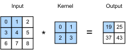

# Convolutions for Images
:label:`sec_conv_layer`

Now that we understand how convolutional layers work in theory,
we are ready to see how they work in practice.
Building on our motivation of convolutional neural networks
as efficient architectures for epxloring structure in image data,
we stick with images as our running example.


## The Cross-Correlation Operator

Recall that strictly speaking, *convolutional* layers 
are a (slight) misnomer, since the operations they express
are more accurately described as cross correlations.
In a convolutional layer, an input array
and a *correlation kernel* array are combined
to produce an output array through a cross-correlation operation.
Let's ignore channels for now and see how this works 
with two-dimensional data and hidden representations.
In :numref:`fig_correlation`, 
the input is a two-dimensional array
with a height of 3 and width of 3.
We mark the shape of the array as $3 \times 3$ or ($3$, $3$).
The height and width of the kernel are both $2$.
Note that in the deep learning research community,
this object may be referred to as *a convolutional kernel*, 
*a filter*, or simply the layer's *weights*.
The shape of the kernel window
is given by the height and width of the kernel
(here it is $2 \times 2$).


:label:`fig_correlation`

In the two-dimensional cross-correlation operation,
we begin with the convolution window positioned
at the top-left corner of the input array
and slide it across the input array,
both from left to right and top to bottom.
When the convolution window slides to a certain position,
the input subarray contained in that window
and the kernel array are multiplied (elementwise)
and the resulting array is summed up
yielding a single scalar value.
This result gives the value of the output array
at the corresponding location.
Here, the output array has a height of 2 and width of 2
and the four elements are derived from
the two-dimensional cross-correlation operation:

$$
0\times0+1\times1+3\times2+4\times3=19,\\
1\times0+2\times1+4\times2+5\times3=25,\\
3\times0+4\times1+6\times2+7\times3=37,\\
4\times0+5\times1+7\times2+8\times3=43.
$$

Note that along each axis, the output 
is slightly *smaller* than the input.
Because the kernel has width and height greater than one,
we can only properly compute the cross-correlation
for locations where the kernel fits wholly within the image,
the output size is given by the input size $H \times W$
minus the size of the convolutional kernel $h \times w$
via $(H-h+1) \times (W-w+1)$.
This is the case since we need enough space
to 'shift' the convolutional kernel across the image
(later we will see how to keep the size unchanged
by padding the image with zeros around its boundary
such that there is enough space to shift the kernel).
Next, we implement this process in the `corr2d` function,
which accepts the input array `X` and kernel array `K`
and returns the output array `Y`.

```{.python .input}
from mxnet import autograd, np, npx
from mxnet.gluon import nn
npx.set_np()

def corr2d(X, K):  #@save
    """Compute 2D cross-correlation."""
    h, w = K.shape
    Y = np.zeros((X.shape[0] - h + 1, X.shape[1] - w + 1))
    for i in range(Y.shape[0]):
        for j in range(Y.shape[1]):
            Y[i, j] = (X[i: i + h, j: j + w] * K).sum()
    return Y
```

```{.python .input}
#@tab pytorch
import torch
from torch import nn

def corr2d(X, K):  #@save
    """Compute 2D cross-correlation."""
    h, w = K.shape
    Y = torch.zeros((X.shape[0] - h + 1, X.shape[1] - w + 1))
    for i in range(Y.shape[0]):
        for j in range(Y.shape[1]):
            Y[i, j] = (X[i: i + h, j: j + w] * K).sum()
    return Y
```

```{.python .input}
#@tab tensorflow
import tensorflow as tf

def corr2d(X, K):  #@save
    """Compute 2D cross-correlation."""
    h, w = K.shape
    Y = tf.Variable(tf.zeros((X.shape[0] - h + 1, X.shape[1] - w + 1)))
    for i in range(Y.shape[0]):
        for j in range(Y.shape[1]):
            Y[i, j].assign(tf.reduce_sum(
                X[i: i + h, j: j + w] * K))
    return Y
```

We can construct the input array `X` and the kernel array `K`
from the figure above
to validate the output of the above implementation
of the two-dimensional cross-correlation operation.

```{.python .input}
X = np.array([[0, 1, 2], [3, 4, 5], [6, 7, 8]])
K = np.array([[0, 1], [2, 3]])
corr2d(X, K)
```

```{.json .output n=48}
[
 {
  "data": {
   "text/plain": "array([[19., 25.],\n       [37., 43.]])"
  },
  "execution_count": 48,
  "metadata": {},
  "output_type": "execute_result"
 }
]
```

```{.python .input}
#@tab pytorch
X = torch.tensor([[0, 1, 2], [3, 4, 5], [6, 7, 8]], dtype=torch.float32)
K = torch.tensor([[0, 1], [2, 3]], dtype=torch.float32)
corr2d(X, K)
```

```{.json .output n=30}
[
 {
  "data": {
   "text/plain": "tensor([[19., 25.],\n        [37., 43.]])"
  },
  "execution_count": 30,
  "metadata": {},
  "output_type": "execute_result"
 }
]
```

```{.python .input}
#@tab tensorflow
X = tf.constant([[0, 1, 2], [3, 4, 5], [6, 7, 8]], dtype=tf.float32)
K = tf.constant([[0, 1], [2, 3]], dtype=tf.float32)
corr2d(X, K)
```

```{.json .output n=39}
[
 {
  "data": {
   "text/plain": "<tf.Variable 'Variable:0' shape=(2, 2) dtype=float32, numpy=\narray([[19., 25.],\n       [37., 43.]], dtype=float32)>"
  },
  "execution_count": 39,
  "metadata": {},
  "output_type": "execute_result"
 }
]
```

## Convolutional Layers

A convolutional layer cross-correlates the input and kernels
and adds a scalar bias to produce an output.
The two parameters of the convolutional layer
are the kernel and the scalar bias.
When training models based on convolutional layers,
we typically initialize the kernels randomly,
just as we would with a fully connected layer.

We are now ready to implement a two-dimensional convolutional layer
based on the `corr2d` function defined above.
In the `__init__` constructor function,
we declare `weight` and `bias` as the two model parameters.
The forward computation function 
calls the `corr2d` function and adds the bias.
As with $h \times w$ cross-correlation
we also refer to convolutional layers
as $h \times w$ convolutions.

```{.python .input}
class Conv2D(nn.Block):
    def __init__(self, kernel_size, **kwargs):
        super().__init__(**kwargs)
        self.weight = self.params.get('weight', shape=kernel_size)
        self.bias = self.params.get('bias', shape=(1,))

    def forward(self, x):
        return corr2d(x, self.weight.data()) + self.bias.data()
```

```{.python .input}
#@tab pytorch
class Conv2D(nn.Module):
    def __init__(self, kernel_size):
        super().__init__()
        self.weight = nn.Parameter(torch.rand(kernel_size))
        self.bias = nn.Parameter(torch.zeros(1))

    def forward(self, x):
        return corr2d(x, self.weight) + self.bias
```

```{.python .input}
#@tab tensorflow
class Conv2D(tf.keras.layers.Layer):
    def __init__(self):
        super().__init__()

    def build(self, kernel_size):
        initializer = tf.random_normal_initializer()
        self.weight = self.add_weight(name='w', shape=kernel_size, initializer=initializer)
        self.bias = self.add_weight(name='b', shape=(1, ), initializer=initializer)

    def call(self, inputs):
        return corr2d(inputs, self.weight) + self.bias
```

## Object Edge Detection in Images

Let's take a moment to parse a simple application of a convolutional layer:
detecting the edge of an object in an image
by finding the location of the pixel change.
First, we construct an 'image' of $6\times 8$ pixels.
The middle four columns are black (0) and the rest are white (1).

```{.python .input}
X = np.ones((6, 8))
X[:, 2:6] = 0
X
```

```{.json .output n=50}
[
 {
  "data": {
   "text/plain": "array([[1., 1., 0., 0., 0., 0., 1., 1.],\n       [1., 1., 0., 0., 0., 0., 1., 1.],\n       [1., 1., 0., 0., 0., 0., 1., 1.],\n       [1., 1., 0., 0., 0., 0., 1., 1.],\n       [1., 1., 0., 0., 0., 0., 1., 1.],\n       [1., 1., 0., 0., 0., 0., 1., 1.]])"
  },
  "execution_count": 50,
  "metadata": {},
  "output_type": "execute_result"
 }
]
```

```{.python .input}
#@tab pytorch
X = torch.ones(6, 8)
X[:, 2:6] = 0
X
```

```{.json .output n=32}
[
 {
  "data": {
   "text/plain": "tensor([[1., 1., 0., 0., 0., 0., 1., 1.],\n        [1., 1., 0., 0., 0., 0., 1., 1.],\n        [1., 1., 0., 0., 0., 0., 1., 1.],\n        [1., 1., 0., 0., 0., 0., 1., 1.],\n        [1., 1., 0., 0., 0., 0., 1., 1.],\n        [1., 1., 0., 0., 0., 0., 1., 1.]])"
  },
  "execution_count": 32,
  "metadata": {},
  "output_type": "execute_result"
 }
]
```

```{.python .input}
#@tab tensorflow
X = tf.Variable(tf.ones((6, 8)))
X[:, 2:6].assign(tf.zeros(X[:, 2:6].shape))
X
```

```{.json .output n=41}
[
 {
  "data": {
   "text/plain": "<tf.Variable 'Variable:0' shape=(6, 8) dtype=float32, numpy=\narray([[1., 1., 0., 0., 0., 0., 1., 1.],\n       [1., 1., 0., 0., 0., 0., 1., 1.],\n       [1., 1., 0., 0., 0., 0., 1., 1.],\n       [1., 1., 0., 0., 0., 0., 1., 1.],\n       [1., 1., 0., 0., 0., 0., 1., 1.],\n       [1., 1., 0., 0., 0., 0., 1., 1.]], dtype=float32)>"
  },
  "execution_count": 41,
  "metadata": {},
  "output_type": "execute_result"
 }
]
```

Next, we construct a kernel `K` with a height of $1$ and width of $2$.
When we perform the cross-correlation operation with the input,
if the horizontally adjacent elements are the same,
the output is 0. Otherwise, the output is non-zero.

```{.python .input}
K = np.array([[1, -1]])
```

```{.python .input}
#@tab pytorch
K = torch.tensor([[1, -1]], dtype=torch.float32)
```

```{.python .input}
#@tab tensorflow
K = tf.constant([[1, -1]], dtype=tf.float32)
```

We are ready to perform the cross-correlation operation
with arguments `X` (our input) and `K` (our kernel).
As you can see, we detect 1 for the edge from white to black
and -1 for the edge from black to white.
All other outputs take value $0$.

```{.python .input}
#@tab all
Y = corr2d(X, K)
Y
```

```{.json .output n=52}
[
 {
  "data": {
   "text/plain": "array([[ 0.,  1.,  0.,  0.,  0., -1.,  0.],\n       [ 0.,  1.,  0.,  0.,  0., -1.,  0.],\n       [ 0.,  1.,  0.,  0.,  0., -1.,  0.],\n       [ 0.,  1.,  0.,  0.,  0., -1.,  0.],\n       [ 0.,  1.,  0.,  0.,  0., -1.,  0.],\n       [ 0.,  1.,  0.,  0.,  0., -1.,  0.]])"
  },
  "execution_count": 52,
  "metadata": {},
  "output_type": "execute_result"
 }
]
```

We can now apply the kernel to the transposed image.
As expected, it vanishes. The kernel `K` only detects vertical edges.

```{.python .input}
corr2d(X.T, K)
```

```{.json .output n=53}
[
 {
  "data": {
   "text/plain": "array([[0., 0., 0., 0., 0.],\n       [0., 0., 0., 0., 0.],\n       [0., 0., 0., 0., 0.],\n       [0., 0., 0., 0., 0.],\n       [0., 0., 0., 0., 0.],\n       [0., 0., 0., 0., 0.],\n       [0., 0., 0., 0., 0.],\n       [0., 0., 0., 0., 0.]])"
  },
  "execution_count": 53,
  "metadata": {},
  "output_type": "execute_result"
 }
]
```

```{.python .input}
#@tab pytorch
corr2d(X.t(), K)
```

```{.json .output n=43}
[
 {
  "ename": "AttributeError",
  "evalue": "'ResourceVariable' object has no attribute 't'",
  "output_type": "error",
  "traceback": [
   "\u001b[0;31m---------------------------------------------------------------------------\u001b[0m",
   "\u001b[0;31mAttributeError\u001b[0m                            Traceback (most recent call last)",
   "\u001b[0;32m<ipython-input-43-e776c5839792>\u001b[0m in \u001b[0;36m<module>\u001b[0;34m\u001b[0m\n\u001b[1;32m      1\u001b[0m \u001b[0;31m#@tab pytorch\u001b[0m\u001b[0;34m\u001b[0m\u001b[0;34m\u001b[0m\u001b[0;34m\u001b[0m\u001b[0m\n\u001b[0;32m----> 2\u001b[0;31m \u001b[0mcorr2d\u001b[0m\u001b[0;34m(\u001b[0m\u001b[0mX\u001b[0m\u001b[0;34m.\u001b[0m\u001b[0mt\u001b[0m\u001b[0;34m(\u001b[0m\u001b[0;34m)\u001b[0m\u001b[0;34m,\u001b[0m \u001b[0mK\u001b[0m\u001b[0;34m)\u001b[0m\u001b[0;34m\u001b[0m\u001b[0;34m\u001b[0m\u001b[0m\n\u001b[0m",
   "\u001b[0;31mAttributeError\u001b[0m: 'ResourceVariable' object has no attribute 't'"
  ]
 }
]
```

```{.python .input}
#@tab tensorflow
corr2d(tf.transpose(X), K)
```

```{.json .output n=44}
[
 {
  "data": {
   "text/plain": "<tf.Variable 'Variable:0' shape=(8, 5) dtype=float32, numpy=\narray([[0., 0., 0., 0., 0.],\n       [0., 0., 0., 0., 0.],\n       [0., 0., 0., 0., 0.],\n       [0., 0., 0., 0., 0.],\n       [0., 0., 0., 0., 0.],\n       [0., 0., 0., 0., 0.],\n       [0., 0., 0., 0., 0.],\n       [0., 0., 0., 0., 0.]], dtype=float32)>"
  },
  "execution_count": 44,
  "metadata": {},
  "output_type": "execute_result"
 }
]
```

## Learning a Kernel

Designing an edge detector by finite differences `[1, -1]` is neat
if we know this is precisely what we are looking for.
However, as we look at larger kernels,
and consider successive layers of convolutions,
it might be impossible to specify
precisely what each filter should be doing manually.

Now let us see whether we can learn the kernel that generated `Y` from `X`
by looking at the (input, output) pairs only.
We first construct a convolutional layer
and initialize its kernel as a random array.
Next, in each iteration, we will use the squared error
to compare `Y` to the output of the convolutional layer.
We can then calculate the gradient to update the weight.
For the sake of simplicity, in this convolutional layer,
we will ignore the bias.

We previously constructed the `Conv2D` class.
However, since we used single-element assignments,
`autograd` has some trouble finding the gradient.
Instead, we use the built-in `Conv2D` class.

```{.python .input}
# Construct a convolutional layer with 1 output channel
# (channels will be introduced in the following section)
# and a kernel array shape of (1, 2)
conv2d = nn.Conv2D(1, kernel_size=(1, 2))
conv2d.initialize()

# The two-dimensional convolutional layer uses four-dimensional input and
# output in the format of (example, channel, height, width), where the batch
# size (number of examples in the batch) and the number of channels are both 1
X = X.reshape(1, 1, 6, 8)
Y = Y.reshape(1, 1, 6, 7)

for i in range(10):
    with autograd.record():
        Y_hat = conv2d(X)
        l = (Y_hat - Y) ** 2
    l.backward()
    # For the sake of simplicity, we ignore the bias here
    conv2d.weight.data()[:] -= 3e-2 * conv2d.weight.grad()
    if (i + 1) % 2 == 0:
        print(f'batch {i+1}, loss {float(l.sum()):.3f}')
```

```{.json .output n=54}
[
 {
  "name": "stdout",
  "output_type": "stream",
  "text": "batch 2, loss 4.949\nbatch 4, loss 0.831\nbatch 6, loss 0.140\nbatch 8, loss 0.024\nbatch 10, loss 0.004\n"
 }
]
```

```{.python .input}
#@tab pytorch
# Construct a convolutional layer with 1 input channel and 1 output channel
# (channels will be introduced in the following section)
# and a kernel array shape of (1, 2). For sake of simplicity we ignore bias.
conv2d = nn.Conv2d(1,1, kernel_size=(1, 2), bias=False)

# The two-dimensional convolutional layer uses four-dimensional input and
# output in the format of (example channel, height, width), where the batch
# size (number of examples in the batch) and the number of channels are both 1
X = X.reshape((1, 1, 6, 8))
Y = Y.reshape((1, 1, 6, 7))


for i in range(10):
    Y_hat = conv2d(X)
    l = (Y_hat - Y) ** 2
    conv2d.zero_grad()
    l.sum().backward()
    conv2d.weight.data[:] -= 3e-2 * conv2d.weight.grad
    if (i + 1) % 2 == 0:
        print(f'batch {i+1}, loss {l.sum():.3f}')
```

```{.json .output n=36}
[
 {
  "name": "stdout",
  "output_type": "stream",
  "text": "batch 2, loss 9.349\nbatch 4, loss 1.570\nbatch 6, loss 0.264\nbatch 8, loss 0.044\nbatch 10, loss 0.008\n"
 }
]
```

```{.python .input}
#@tab tensorflow
# Construct a convolutional layer with 1 input channel and 1 output channel
# (channels will be introduced in the following section)
# and a kernel array shape of (1, 2). For sake of simplicity we ignore bias.
conv2d = tf.keras.layers.Conv2D(1, (1, 2), use_bias=False)

# The two-dimensional convolutional layer uses four-dimensional input and
# output in the format of (example channel, height, width), where the batch
# size (number of examples in the batch) and the number of channels are both 1
X = tf.reshape(X, (1, 6, 8, 1))
Y = tf.reshape(Y, (1, 6, 7, 1))

Y_hat = conv2d(X)
for i in range(10):
    with tf.GradientTape(watch_accessed_variables=False) as g:
        g.watch(conv2d.weights[0])
        Y_hat = conv2d(X)
        l = (abs(Y_hat - Y)) ** 2
        update = tf.multiply(3e-2, g.gradient(l, conv2d.weights[0]))
        weights = conv2d.get_weights()
        weights[0] = conv2d.weights[0] - update
        conv2d.set_weights(weights)  
        
        if (i + 1) % 2 == 0:
            print(f'batch {i+1}, loss {tf.reduce_sum(l):.3f}')
```

```{.json .output n=45}
[
 {
  "name": "stdout",
  "output_type": "stream",
  "text": "batch 2, loss 1.837\nbatch 4, loss 0.663\nbatch 6, loss 0.257\nbatch 8, loss 0.103\nbatch 10, loss 0.042\n"
 }
]
```

Note that the error has dropped to a small value after 10 iterations. Now we will take a look at the kernel array we learned.

```{.python .input}
conv2d.weight.data().reshape(1, 2)
```

```{.json .output n=55}
[
 {
  "data": {
   "text/plain": "array([[ 0.9895   , -0.9873705]])"
  },
  "execution_count": 55,
  "metadata": {},
  "output_type": "execute_result"
 }
]
```

```{.python .input}
#@tab pytorch
conv2d.weight.data.reshape((1, 2))
```

```{.json .output n=37}
[
 {
  "data": {
   "text/plain": "tensor([[ 0.9830, -0.9853]])"
  },
  "execution_count": 37,
  "metadata": {},
  "output_type": "execute_result"
 }
]
```

```{.python .input}
#@tab tensorflow
tf.reshape(conv2d.get_weights()[0], (1, 2))
```

```{.json .output n=46}
[
 {
  "data": {
   "text/plain": "<tf.Tensor: shape=(1, 2), dtype=float32, numpy=array([[ 0.9758461, -1.0178485]], dtype=float32)>"
  },
  "execution_count": 46,
  "metadata": {},
  "output_type": "execute_result"
 }
]
```

Indeed, the learned kernel array is remarkably close
to the kernel array `K` we defined earlier.

## Cross-Correlation and Convolution

Recall our observation from the previous section of the correspondence 
between the cross-correlation and convolution operators.
The figure above makes this correspondence apparent.
Simply flip the kernel from the bottom left to the top right.
In this case, the indexing in the sum is reverted,
yet the same result can be obtained.
In keeping with standard terminology with deep learning literature,
we will continue to refer to the cross-correlation operation
as a convolution even though, strictly-speaking, it is slightly different.

## Summary

* The core computation of a two-dimensional convolutional layer is a two-dimensional cross-correlation operation. In its simplest form, this performs a cross-correlation operation on the two-dimensional input data and the kernel, and then adds a bias.
* We can design a kernel to detect edges in images.
* We can learn the kernel's parameters from data.

## Exercises

1. Construct an image `X` with diagonal edges.
    * What happens if you apply the kernel `K` to it?
    * What happens if you transpose `X`?
    * What happens if you transpose `K`?
1. When you try to automatically find the gradient for the `Conv2D` class we created, what kind of error message do you see?
1. How do you represent a cross-correlation operation as a matrix multiplication by changing the input and kernel arrays?
1. Design some kernels manually.
    * What is the form of a kernel for the second derivative?
    * What is the kernel for the Laplace operator?
    * What is the kernel for an integral?
    * What is the minimum size of a kernel to obtain a derivative of degree $d$?

:begin_tab:`mxnet`
[Discussions](https://discuss.d2l.ai/t/65)
:end_tab:

:begin_tab:`pytorch`
[Discussions](https://discuss.d2l.ai/t/66)
:end_tab:

:begin_tab:`tensorflow`
[Discussions](https://discuss.d2l.ai/t/271)
:end_tab:
