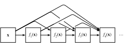

# Densely Connected Networks (DenseNet)

The cross-layer connection design in ResNet has led to some offshoots. In this section, we will introduce one of them: densely connected networks (DenseNet)[1]. The main difference between this type of network and ResNet is shown in Figure 5.10.



In Figure 5.10, some of the adjacent operations are abstracted into module $A$ and module $B$. The main different between DenseNat and ResNet is that the output of module $B$ in DenseNet is not added to the output of module $A$ like in ResNet, but is concatenated in the channel dimension. Thus, the output of module $A$ can be passed directly to the layer behind module $B$. In this design, module $A$ is directly connected to all layers behind module $B$. This is why it is called a "dense connection".

The main components that compose a DenseNet are dense blocks and transition layers. The former defines how the inputs and outputs are concatenated, while the latter controls the number of channels so that it is not too large.


## Dense Blocks

DenseNet uses the modified "batch normalization, activation, and convolution" architecture of ResNet (see the exercise in the previous section). First, we implement this architecture in the `conv_block` function.

```{.python .input  n=1}
import gluonbook as gb
from mxnet import gluon, init, nd
from mxnet.gluon import nn

def conv_block(num_channels):
    blk = nn.Sequential()
    blk.add(nn.BatchNorm(), nn.Activation('relu'),
            nn.Conv2D(num_channels, kernel_size=3, padding=1))
    return blk
```

A dense block consists of multiple `conv_block` units, each using the same number of output channels. In the forward computation, however, we concatenate the input and output of each block on the channel dimension.

```{.python .input  n=2}
class DenseBlock(nn.Block):
    def __init__(self, num_convs, num_channels, **kwargs):
        super(DenseBlock, self).__init__(**kwargs)
        self.net = nn.Sequential()
        for _ in range(num_convs):
            self.net.add(conv_block(num_channels))

    def forward(self, X):
        for blk in self.net:
            Y = blk(X)
            X = nd.concat(X, Y, dim=1)  # Concatenate the input and output of each block on the channel dimension.
        return X
```

In the following example, we define a convolution block with two blocks of 10 output channels. When using an input with 3 channels, we will get an output with the $3+2\times 10=23$ channels. The number of convolution block channels controls the increase in the number of output channels relative to the number of input channels. This is also referred to as the growth rate.

```{.python .input  n=8}
blk = DenseBlock(2, 10)
blk.initialize()
X = nd.random.uniform(shape=(4, 3, 8, 8))
Y = blk(X)
Y.shape
```

## Transition Layers

Since each dense block will increase the number of channels, too many will lead to an excessively complex model. A transition layer is used to control the complexity of the model. It reduces the number of channels by using the $1\times1$ convolutional layer and halves the height and width of the average pooling layer with a stride of 2, further reducing the complexity of the model.

```{.python .input  n=3}
def transition_block(num_channels):
    blk = nn.Sequential()
    blk.add(nn.BatchNorm(), nn.Activation('relu'),
            nn.Conv2D(num_channels, kernel_size=1),
            nn.AvgPool2D(pool_size=2, strides=2))
    return blk
```

Apply a transition layer with 10 channels to the output of the dense block in the previous example.  This reduces the number of output channels to 10, and halves the height and width.

```{.python .input}
blk = transition_block(10)
blk.initialize()
blk(Y).shape
```

## DenseNet Model

Next, we will construct a DenseNet model. DenseNet first uses the same single convolutional layer and maximum pooling layer as ResNet.

```{.python .input}
net = nn.Sequential()
net.add(nn.Conv2D(64, kernel_size=7, strides=2, padding=3),
        nn.BatchNorm(), nn.Activation('relu'),
        nn.MaxPool2D(pool_size=3, strides=2, padding=1))
```

Then, similar to the four residual blocks that ResNet uses, DenseNet uses four dense blocks. Similar to ResNet, we can set the number of convolutional layers used in each dense block. Here, we set it to 4, consistent with the ResNet-18 in the previous section. Set the number of channels (i.e. growth rate) for the convolutional layers in the dense block to 32, so 128 channels will be added to each dense block.

In ResNet, the height and width are reduced between each module by a residual block with a stride of 2. Here, we use the transition layer to halve the height and width and halve the number of channels.

```{.python .input  n=5}
num_channels, growth_rate = 64, 32  # Num_channels: the current number of channels.
num_convs_in_dense_blocks = [4, 4, 4, 4]

for i, num_convs in enumerate(num_convs_in_dense_blocks):
    net.add(DenseBlock(num_convs, growth_rate))
    # This is the number of output channels in the previous dense block.
    num_channels += num_convs * growth_rate
    # A transition layer that haves the number of channels is added between the dense blocks.
    if i != len(num_convs_in_dense_blocks) - 1:
        net.add(transition_block(num_channels // 2))
```

Similar to ResNet, a global pooling layer and fully connected layer are connected at the end to produce the output.

```{.python .input}
net.add(nn.BatchNorm(), nn.Activation('relu'), nn.GlobalAvgPool2D(),
        nn.Dense(10))
```

## Data Acquisition and Training

Since we are using a deeper network here, in this section, we will reduce the input height and width from 224 to 96 to simplify the computation.

```{.python .input}
lr, num_epochs, batch_size, ctx = 0.1, 5, 256, gb.try_gpu()
net.initialize(ctx=ctx, init=init.Xavier())
trainer = gluon.Trainer(net.collect_params(), 'sgd', {'learning_rate': lr})
train_iter, test_iter = gb.load_data_fashion_mnist(batch_size, resize=96)
gb.train_ch5(net, train_iter, test_iter, batch_size, trainer, ctx, num_epochs)
```

## Summary

* In terms of cross-layer connections, unlike ResNet, where inputs and outputs are added together, DenseNet concatenates inputs and outputs on the channel dimension.
* The main units that compose DenseNet are dense blocks and transition layers.

## exercise

* One of the advantages mentioned in the DenseNet paper is that its model parameters are smaller than those of ResNet. Why is this the case?
* One problem for which DenseNet has been criticized is its high memory consumption. Is this really the case? Try to change the input shape to $224\times 224$ to see the actual (GPU) memory consumption.
* Implement the various DenseNet versions presented in Table 1 of the DenseNet paper[1].

## Scan the QR Code to Access [Discussions](https://discuss.gluon.ai/t/topic/1664)


## References

[1] Huang, G., Liu, Z., Weinberger, K. Q., & van der Maaten, L. (2017). Densely connected convolutional networks. In Proceedings of the IEEE conference on computer vision and pattern recognition (Vol. 1, No. 2).
