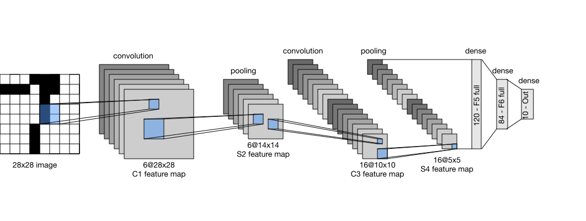

```{.python .input}
%load_ext d2lbook.tab
tab.interact_select(['mxnet', 'pytorch', 'tensorflow'])
```

# Convolutional Neural Networks (LeNet)
:label:`sec_lenet`

We now have all the ingredients required to assemble
a fully-functional CNN.
In our earlier encounter with image data, we applied
a linear model with softmax regression (:numref:`sec_softmax_scratch`)
and an MLP (:numref:`sec_mlp_scratch`)
to pictures of clothing in the Fashion-MNIST dataset.
To make such data amenable we first flattened each image from a $28\times28$ matrix
into a fixed-length $784$-dimensional vector,
and thereafter processed them in fully connected layers.
Now that we have a handle on convolutional layers,
we can retain the spatial structure in our images.
As an additional benefit of replacing fully connected layers with convolutional layers,
we will enjoy more parsimonious models that require far fewer parameters.

In this section, we will introduce *LeNet*,
among the first published CNNs
to capture wide attention for its performance on computer vision tasks.
The model was introduced by (and named for) Yann LeCun,
then a researcher at AT&T Bell Labs,
for the purpose of recognizing handwritten digits in images :cite:`LeCun.Bottou.Bengio.ea.1998`.
This work represented the culmination
of a decade of research developing the technology.
In 1989, LeCun's team published the first study to successfully
train CNNs via backpropagation :cite:`LeCun.Boser.Denker.ea.1989`.

At the time LeNet achieved outstanding results
matching the performance of support vector machines,
then a dominant approach in supervised learning, achieving an error rate of less than 1% per digit.
LeNet was eventually adapted to recognize digits
for processing deposits in ATM machines.
To this day, some ATMs still run the code
that Yann LeCun and his colleague Leon Bottou wrote in the 1990s!


## LeNet

At a high level, (**LeNet (LeNet-5) consists of two parts:
(i) a convolutional encoder consisting of two convolutional layers; and
(ii) a dense block consisting of three fully connected layers**);
The architecture is summarized in :numref:`img_lenet`.


:label:`img_lenet`

The basic units in each convolutional block
are a convolutional layer, a sigmoid activation function,
and a subsequent average pooling operation.
Note that while ReLUs and max-pooling work better,
these discoveries had not yet been made at the time.
Each convolutional layer uses a $5\times 5$ kernel
and a sigmoid activation function.
These layers map spatially arranged inputs
to a number of two-dimensional feature maps, typically
increasing the number of channels.
The first convolutional layer has 6 output channels,
while the second has 16.
Each $2\times2$ pooling operation (stride 2)
reduces dimensionality by a factor of $4$ via spatial downsampling.
The convolutional block emits an output with shape given by
(batch size, number of channel, height, width).

In order to pass output from the convolutional block
to the dense block,
we must flatten each example in the minibatch.
In other words, we take this four-dimensional input and transform it
into the two-dimensional input expected by fully connected layers:
as a reminder, the two-dimensional representation that we desire uses the first dimension to index examples in the minibatch
and the second to give the flat vector representation of each example.
LeNet's dense block has three fully connected layers,
with 120, 84, and 10 outputs, respectively.
Because we are still performing classification,
the 10-dimensional output layer corresponds
to the number of possible output classes.

While getting to the point where you truly understand
what is going on inside LeNet may have taken a bit of work,
hopefully the following code snippet will convince you
that implementing such models with modern deep learning frameworks
is remarkably simple.
We need only to instantiate a `Sequential` block
and chain together the appropriate layers,
using Xavier initialization as
introduced in :numref:`subsec_xavier`.

```{.python .input}
%%tab mxnet
from d2l import mxnet as d2l
from mxnet import autograd, gluon, init, np, npx
from mxnet.gluon import nn
npx.set_np()
```

```{.python .input}
%%tab pytorch
from d2l import torch as d2l
import torch
from torch import nn
```

```{.python .input}
%%tab tensorflow
import tensorflow as tf
from d2l import tensorflow as d2l
```

```{.python .input}
%%tab pytorch
def init_cnn(module):  #@save
    """Initialize weights for CNNs."""
    if type(module) == nn.Linear or type(module) == nn.Conv2d:
        nn.init.xavier_uniform_(module.weight)
```

```{.python .input}
%%tab all
class LeNet(d2l.Classifier):
    def __init__(self, lr=0.1, num_classes=10):
        super().__init__()
        self.save_hyperparameters()
        if tab.selected('mxnet'):
            self.net = nn.Sequential()
            self.net.add(
                nn.Conv2D(channels=6, kernel_size=5, padding=2,
                          activation='sigmoid'),
                nn.AvgPool2D(pool_size=2, strides=2),
                nn.Conv2D(channels=16, kernel_size=5, activation='sigmoid'),
                nn.AvgPool2D(pool_size=2, strides=2),
                nn.Dense(120, activation='sigmoid'),
                nn.Dense(84, activation='sigmoid'),
                nn.Dense(num_classes))
            self.net.initialize(init.Xavier())
        if tab.selected('pytorch'):
            self.net = nn.Sequential(
                nn.LazyConv2d(6, kernel_size=5, padding=2), nn.Sigmoid(),
                nn.AvgPool2d(kernel_size=2, stride=2),
                nn.LazyConv2d(16, kernel_size=5), nn.Sigmoid(),
                nn.AvgPool2d(kernel_size=2, stride=2),
                nn.Flatten(),
                nn.LazyLinear(120), nn.Sigmoid(),
                nn.LazyLinear(84), nn.Sigmoid(),
                nn.LazyLinear(num_classes))
        if tab.selected('tensorflow'):
            self.net = tf.keras.models.Sequential([
                tf.keras.layers.Conv2D(filters=6, kernel_size=5,
                                       activation='sigmoid', padding='same'),
                tf.keras.layers.AvgPool2D(pool_size=2, strides=2),
                tf.keras.layers.Conv2D(filters=16, kernel_size=5,
                                       activation='sigmoid'),
                tf.keras.layers.AvgPool2D(pool_size=2, strides=2),
                tf.keras.layers.Flatten(),
                tf.keras.layers.Dense(120, activation='sigmoid'),
                tf.keras.layers.Dense(84, activation='sigmoid'),
                tf.keras.layers.Dense(num_classes)])
```

We take some liberty in the reproduction of LeNet insofar as we replace the Gaussian activation layer by
a softmax layer. This greatly simplifies the implementation, not the least due to the
fact that the Gaussian decoder is rarely used nowadays. Other than that, this network matches
the original LeNet-5 architecture.

Let's see what happens inside the network. By passing a
single-channel (black and white)
$28 \times 28$ image through the network
and printing the output shape at each layer,
we can [**inspect the model**] to make sure
that its operations line up with
what we expect from :numref:`img_lenet_vert`.


:label:`img_lenet_vert`

```{.python .input}
%%tab mxnet, pytorch
@d2l.add_to_class(d2l.Classifier)  #@save
def layer_summary(self, X_shape):
    X = d2l.randn(*X_shape)
    for layer in self.net:
        X = layer(X)
        print(layer.__class__.__name__, 'output shape:\t', X.shape)

model = LeNet()
model.layer_summary((1, 1, 28, 28))
```

```{.python .input}
%%tab tensorflow
@d2l.add_to_class(d2l.Classifier)  #@save
def layer_summary(self, X_shape):
    X = d2l.normal(X_shape)
    for layer in self.net.layers:
        X = layer(X)
        print(layer.__class__.__name__, 'output shape:\t', X.shape)

model = LeNet()
model.layer_summary((1, 28, 28, 1))
```

Notez que la hauteur et la largeur de la représentation
à chaque couche tout au long du bloc convolutif
sont réduites (par rapport à la couche précédente).
La première couche convolutive utilise 2 pixels de remplissage
pour compenser la réduction de la hauteur et de la largeur
qui résulterait autrement de l'utilisation d'un noyau $5 \times 5$.
Pour l'anecdote, la taille de l'image de $28 \times 28$ pixels dans l'ensemble de données OCR MNIST original
est le résultat de *l'élagage* de lignes (et de colonnes) de 2 pixels des scans originaux
qui mesuraient $32 \times 32$ pixels. Cela a été fait principalement pour
économiser de l'espace (une réduction de 30%) à une époque où les mégaoctets étaient importants.

En revanche, la deuxième couche convolutive renonce au remplissage,
et donc la hauteur et la largeur sont toutes deux réduites de 4 pixels.
À mesure que l'on monte dans la pile de couches,
le nombre de canaux augmente couche par couche
, passant de 1 dans l'entrée à 6 après la première couche convolutive
et à 16 après la deuxième couche convolutive.
Cependant, chaque couche de mise en commun réduit de moitié la hauteur et la largeur.
Enfin, chaque couche entièrement connectée réduit la dimensionnalité,
émettant finalement une sortie dont la dimension
correspond au nombre de classes.


## Entraînement

Maintenant que nous avons implémenté le modèle,
faisons [**une expérience pour voir comment le modèle LeNet-5 se comporte sur Fashion-MNIST**].

Bien que les CNN aient moins de paramètres,
ils peuvent néanmoins être plus coûteux à calculer
que les MLP de profondeur similaire
car chaque paramètre participe à beaucoup plus de multiplications
.
Si vous avez accès à un GPU, c'est peut-être le bon moment
de le mettre en action pour accélérer la formation.
Notez que
la classe `d2l.Trainer` s'occupe de tous les détails.
Par défaut, elle initialise les paramètres du modèle sur les
dispositifs disponibles.
Comme pour les MLP, notre fonction de perte est l'entropie croisée,
et nous la minimisons via une descente de gradient stochastique en minibatch.

```{.python .input}
%%tab pytorch, mxnet
trainer = d2l.Trainer(max_epochs=10, num_gpus=1)
data = d2l.FashionMNIST(batch_size=128)
model = LeNet(lr=0.1)
if tab.selected('pytorch'):
    model.apply_init([next(iter(data.get_dataloader(True)))[0]], init_cnn)
trainer.fit(model, data)
```

```{.python .input}
%%tab tensorflow
trainer = d2l.Trainer(max_epochs=10)
data = d2l.FashionMNIST(batch_size=128)
with d2l.try_gpu():
    model = LeNet(lr=0.1)
    trainer.fit(model, data)
```

## Résumé

Dans ce chapitre, nous avons fait des progrès significatifs. Nous sommes passés des MLP des années 1980 aux CNN des années 1990 et du début des années 2000. Les architectures proposées, par exemple sous la forme de LeNet-5, restent significatives, même à ce jour. Il est intéressant de comparer les taux d'erreur sur Fashion-MNIST obtenus avec LeNet-5 aux meilleurs taux obtenus avec les MLP (:numref:`sec_mlp_scratch` ) et ceux obtenus avec des architectures beaucoup plus avancées comme ResNet (:numref:`sec_resnet` ). LeNet est beaucoup plus proche de ces dernières que des premières. L'une des principales différences, comme nous le verrons, est que de plus grandes quantités de calcul permettent des architectures beaucoup plus complexes.

Une deuxième différence est la facilité relative avec laquelle nous avons pu implémenter LeNet. Ce qui était auparavant un défi d'ingénierie représentant des mois de code C++ et d'assemblage, d'ingénierie pour améliorer SN, un outil précoce d'apprentissage profond basé sur Lisp :cite:`Bottou.Le-Cun.1988` , et enfin l'expérimentation de modèles, peut maintenant être accompli en quelques minutes. C'est cet incroyable gain de productivité qui a considérablement démocratisé le développement de modèles d'apprentissage profond. Dans le chapitre suivant, nous allons suivre ce terrier de lapin pour voir où il nous mène.

## Exercices

1. Modernisons LeNet. Implémentez et testez les changements suivants :
   1. Remplacer le pooling moyen par le max-pooling.
   1. Remplacer la couche softmax par ReLU.
1. Essayez de modifier la taille du réseau de style LeNet pour améliorer sa précision en plus du max-pooling et de ReLU.
   1. Ajustez la taille de la fenêtre de convolution.
   1. Ajustez le nombre de canaux de sortie.
   1. Ajustez le nombre de couches de convolution.
   1. Ajustez le nombre de couches entièrement connectées.
   1. Ajustez les taux d'apprentissage et d'autres détails de entrainement (par exemple, l'initialisation et le nombre d'époques).
1. Essayez le réseau amélioré sur l'ensemble de données MNIST original.
1. Affichez les activations de la première et de la deuxième couche de LeNet pour différentes entrées (par exemple, des pulls et des manteaux).
1. Qu'arrive-t-il aux activations lorsque vous introduisez des images très différentes dans le réseau (par exemple, des chats, des voitures, ou même du bruit aléatoire) ?

:begin_tab:`mxnet`
[Discussions](https://discuss.d2l.ai/t/73)
:end_tab:

:begin_tab:`pytorch`
[Discussions](https://discuss.d2l.ai/t/74)
:end_tab:

:begin_tab:`tensorflow`
[Discussions](https://discuss.d2l.ai/t/275)
:end_tab:
