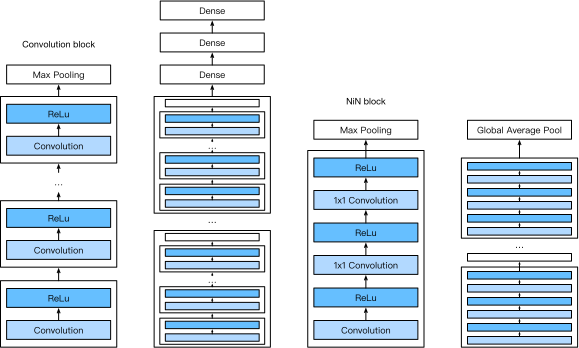

# Network in Network (NiN)

LeNet, AlexNet, and VGG all share a common design pattern: extract the spatial features through a sequence of convolutions and pooling layers and then post-process the representations via fully connected layers. The improvements upon LeNet by AlexNet and VGG mainly lie in how these later networks widen and deepen these two modules. An alternative is to use fully connected layers much earlier in the process. However, a careless use of a dense layer would destroy the spatial structure of the data entirely, since fully connected layers mangle all inputs. Network in Network (NiN) blocks offer an alternative. They were proposed by [Lin, Chen and Yan, 2013](https://arxiv.org/pdf/1312.4400.pdf) based on a very simple insight - to use an MLP on the channels for each pixel separately. 

## NiN Blocks

We know that the inputs and outputs of convolutional layers are usually four-dimensional arrays (example, channel, height, width), while the inputs and outputs of fully connected layers are usually two-dimensional arrays (example, feature). This means that once we process data by a fully connected layer it's virtually impossible to recover the spatial structure of the representation. But we could apply a fully connected layer at a pixel level: Recall the $1\times 1$ convolutional layer described in the section discussing [channels](channels.md). This somewhat unusual convolution can be thought of as a fully connected layer processing channel activations on a per pixel level. Another way to view this is to think of each element in the spatial dimension (height and width) as equivalent to an example, and the channel as equivalent to a feature. NiNs use the $1\times 1$ convolutional layer instead of a fully connected layer. The spatial information can then be naturally passed to the subsequent layers. The figure below illustrates the main structural differences between NiN and AlexNet, VGG, and other networks.



The NiN block is the basic block in NiN. It concatenates a convolutional layer and two $1\times 1$ convolutional layers that act as fully connected layers (with ReLu in between). The convolution width of the first layer is typically set by the user. The subsequent widths are fixed to $1 \times 1$. 

```{.python .input  n=2}
import gluonbook as gb
from mxnet import gluon, init, nd
from mxnet.gluon import nn

def nin_block(num_channels, kernel_size, strides, padding):
    blk = nn.Sequential()
    blk.add(nn.Conv2D(num_channels, kernel_size, strides, padding, activation='relu'),
            nn.Conv2D(num_channels, kernel_size=1, activation='relu'),
            nn.Conv2D(num_channels, kernel_size=1, activation='relu'))
    return blk
```

## NiN Model

NiN was proposed shortly after the release of AlexNet. Their convolutional layer settings share some similarities. NiN uses convolutional layers with convolution window shapes of $11\times 11$, $5\times 5$, and $3\times 3$, and the corresponding numbers of output channels are the same as in AlexNet. Each NiN block is followed by a maximum pooling layer with a stride of 2 and a window shape of $3\times 3$.

In addition to using NiN blocks, NiN’s design is significantly different from AlexNet by avoiding dense connections entirely: Instead, NiN uses a NiN block with a number of output channels equal to the number of label classes, and then uses a global average pooling layer to average all elements in each channel for direct use in classification. Here, the global average pooling layer, i.e. the window shape, is equal to the average pooling layer of the input spatial dimension shape. The advantage of NiN's design is that it can significantly reduce the size of model parameters, thus mitigating overfitting. In other words, short of the average pooling all operations are convolutions. However, this design sometimes results in an increase in model training time.

```{.python .input  n=9}
net = nn.Sequential()
net.add(nin_block(96, kernel_size=11, strides=4, padding=0),
        nn.MaxPool2D(pool_size=3, strides=2),
        nin_block(256, kernel_size=5, strides=1, padding=2),
        nn.MaxPool2D(pool_size=3, strides=2),
        nin_block(384, kernel_size=3, strides=1, padding=1),
        nn.MaxPool2D(pool_size=3, strides=2), 
        nn.Dropout(0.5),
        # There are 10 label classes.
        nin_block(10, kernel_size=3, strides=1, padding=1),
        # The global average pooling layer automatically sets the window shape to the height and width of the input.
        nn.GlobalAvgPool2D(),
        # Transform the four-dimensional output into two-dimensional output with a shape of (batch size, 10).
        nn.Flatten())
```

We create a data example to see the output shape of each block.

```{.python .input}
X = nd.random.uniform(shape=(1, 1, 224, 224))
net.initialize()
for layer in net:
    X = layer(X)
    print(layer.name, 'output shape:\t', X.shape)
```

## Data Acquisition and Training

As before we use Fashion-MNIST to train the model. NiN's training is similar to that for AlexNet and VGG, but it often uses a larger learning rate.

```{.python .input}
lr, num_epochs, batch_size, ctx = 0.1, 5, 128, gb.try_gpu()
net.initialize(force_reinit=True, ctx=ctx, init=init.Xavier())
trainer = gluon.Trainer(net.collect_params(), 'sgd', {'learning_rate': lr})
train_iter, test_iter = gb.load_data_fashion_mnist(batch_size, resize=224)
gb.train_ch5(net, train_iter, test_iter, batch_size, trainer, ctx, num_epochs)
```

## Summary

* NiN uses blocks consisting of a convolutional layer and multiple $1\times 1$ convolutional layer. This can be used within the convolutional stack to allow for more per-pixel nonlinearity.
* NiN removes the fully connected layers and replaces them with global average pooling (i.e. summing over all locations) after reducing the number of channels to the desired number of outputs (e.g. 10 for Fashion-MNIST).
* Removing the dense layers reduces overfitting. NiN has dramatically fewer parameters. 
* The NiN design influenced many subsequent convolutional neural networks designs.

## Problems

1. Tune the hyper-parameters to improve the classification accuracy.
1. Why are there two $1\times 1$ convolutional layers in the NiN block? Remove one of them, and then observe and analyze the experimental phenomena.
1. Calculate the resource usage for NiN
    * What is the number of parameters?
    * What is the amount of computation? 
    * What is the amount of memory needed during training?
    * What is the amount of memory needed during inference?
1. What are possible problems with reducing the $384 \times 5 \times 5$ representation to a $10 \times 5 \times 5$ representation in one step?


## Scan the QR Code to access [Discussions](https://discuss.gluon.ai/t/topic/1661)


```{.python .input}

```
