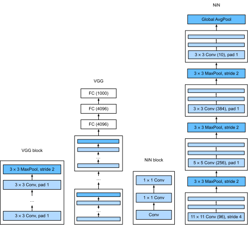

# Network in Network (NiN)

LeNet, AlexNet, and VGG introduced in the previous sections all act as follows: They first extract the spatial features through modules consisting of convolutional layers, and then output the classification results through modules consisting of fully connected layers. The improvements upon LeNet by AlexNet and VGG mainly lie in how these later networks widen and deepen these two modules. In this section, we will introduce network in network (NiN)[1]. This network introduces another concept, that is, constructing a deep network by concatenating small networks made up of multiple convolutional layers and fully connected layers.


## NiN Block

We know that the inputs and outputs of convolutional layers are usually four-dimensional arrays (example, channel, height, width), while the inputs and outputs of fully connected layers are usually two-dimensional arrays (example, feature). If you want to connect a convolutional layer after the fully connected layer, you need to transform the output of the fully connected layer into four dimensions. Recall the $1\times 1$ convolutional layer described in the ["Multiple Input and Output Channels"](channels.md) section. This can be thought of as a fully connected layer. Each element on the spatial dimension (height and width) is equivalent to an example, and the channel is equivalent to a feature. Therefore, NiN uses the $1\times 1$ convolutional layer instead of a fully connected layer. The spatial information can then be naturally passed to the subsequent layers. Figure 5.7 compares the main structural differences between NiN and AlexNet, VGG, and other networks.



The NiN block is the basic block in NiN. It concatenates a convolutional layer and two $1\times 1$ convolutional layers that act as fully connected layers. The hyper-parameter of the first convolutional layer can be set by the user, while the hyper-parameters of the second and third convolutional layers are generally fixed.

```{.python .input  n=2}
import gluonbook as gb
from mxnet import gluon, init, nd
from mxnet.gluon import nn

def nin_block(num_channels, kernel_size, strides, padding):
    blk = nn.Sequential()
    blk.add(nn.Conv2D(num_channels, kernel_size,
                      strides, padding, activation='relu'),
            nn.Conv2D(num_channels, kernel_size=1, activation='relu'),
            nn.Conv2D(num_channels, kernel_size=1, activation='relu'))
    return blk
```

## NiN Model

NiN was proposed shortly after the release of AlexNet. Their convolutional layer settings share some similarities. NiN uses convolutional layers with convolution window shapes of $11\times 11$, $5\times 5$, and $3\times 3$, and the corresponding numbers of output channels are the same as in AlexNet. Each NiN block is followed by a maximum pooling layer with a stride of 2 and a window shape of $3\times 3$.

In addition to using NiN blocks, NiN’s design is significantly different from AlexNet: NiN removes the last three fully connected layers of AlexNet. Instead, NiN uses a NiN block with a number of output channels equal to the number of label classes, and then uses a global average pooling layer to average all elements in each channel for direct use in classification. Here, the global average pooling layer, i.e. the window shape, is equal to the average pooling layer of the input spatial dimension shape. The advantage of NiN's design is that it can significantly reduce the size of model parameters, thus mitigating overfitting. However, this design sometimes results in an increase in model training time.

```{.python .input  n=9}
net = nn.Sequential()
net.add(nin_block(96, kernel_size=11, strides=4, padding=0),
        nn.MaxPool2D(pool_size=3, strides=2),
        nin_block(256, kernel_size=5, strides=1, padding=2),
        nn.MaxPool2D(pool_size=3, strides=2),
        nin_block(384, kernel_size=3, strides=1, padding=1),
        nn.MaxPool2D(pool_size=3, strides=2), nn.Dropout(0.5),
        # There are 10 label classes.
        nin_block(10, kernel_size=3, strides=1, padding=1),
        # The global average pooling layer automatically sets the window shape to the height and width of the input.
        nn.GlobalAvgPool2D(),
        # Transform the four-dimensional output into two-dimensional output with a shape of (batch size, 10).
        nn.Flatten())
```

We create a data example to see the output shape of each layer.

```{.python .input}
X = nd.random.uniform(shape=(1, 1, 224, 224))
net.initialize()
for layer in net:
    X = layer(X)
    print(layer.name, 'output shape:\t', X.shape)
```

## Data Acquisition and Training

We again use the Fashion-MNIST data set to train the model. NiN's training is similar to that for AlexNet and VGG, but it generally uses a larger learning rate.

```{.python .input}
lr, num_epochs, batch_size, ctx = 0.1, 5, 128, gb.try_gpu()
net.initialize(force_reinit=True, ctx=ctx, init=init.Xavier())
trainer = gluon.Trainer(net.collect_params(), 'sgd', {'learning_rate': lr})
train_iter, test_iter = gb.load_data_fashion_mnist(batch_size, resize=224)
gb.train_ch5(net, train_iter, test_iter, batch_size, trainer, ctx, num_epochs)
```

## Summary

* NiN reuses NiN blocks consisting of a convolutional layer and the $1\times 1$ convolutional layer, which replaces the fully connected layer, to create deep networks.
* NiN removes the fully connected output layer that often causes overfitting and replaces it with a NiN block, whose number of output channels equals the number of label classes, and a global average pooling layer.
* The NiN design concepts described above influenced a series of subsequent convolutional neural networks designs.

## exercise

* Tune the hyper-parameters to improve the classification accuracy.
* Why are there two $1\times 1$ convolutional layers in the NiN block? Remove one of them, and then observe and analyze the experimental phenomena.


## Scan the QR Code to access [Discussions](https://discuss.gluon.ai/t/topic/1661)


## References

[1] Lin, M., Chen, Q., & Yan, S. (2013). Network in network. arXiv preprint arXiv:1312.4400.
