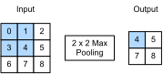

# Pooling
:label:`sec_pooling`


Often, as we process images, we want to gradually
reduce the spatial resolution of our hidden representations,
aggregating information so that
the higher up we go in the network,
the larger the receptive field (in the input)
to which each hidden node is sensitive.

Often our ultimate task asks some global question about the image,
e.g., *does it contain a cat?*
So typically the nodes of our final layer should be sensitive
to the entire input.
By gradually aggregating information, yielding coarser and coarser maps,
we accomplish this goal of ultimately learning a global representation,
while keeping all of the advantages of convolutional layers at the intermediate layers of processing.


Moreover, when detecting lower-level features, such as edges
(as discussed in :numref:`sec_conv_layer`),
we often want our representations to be somewhat invariant to translation.
For instance, if we take the image `X`
with a sharp delineation between black and white
and shift the whole image by one pixel to the right,
i.e., `Z[i,j] = X[i,j+1]`,
then the output for the new image `Z` might be vastly different.
The edge will have shifted by one pixel and with it all the activations.
In reality, objects hardly ever occur exactly at the same place.
In fact, even with a tripod and a stationary object,
vibration of the camera due to the movement of the shutter
might shift everything by a pixel or so
(high-end cameras are loaded with special features to address this problem).

This section introduces pooling layers,
which serve the dual purposes of
mitigating the sensitivity of convolutional layers to location
and of spatially downsampling representations.

## Maximum Pooling and Average Pooling

Like convolutional layers, pooling operators
consist of a fixed-shape window that is slid over
all regions in the input according to its stride,
computing a single output for each location traversed
by the fixed-shape window (sometimes known as the *pooling window*).
However, unlike the cross-correlation computation
of the inputs and kernels in the convolutional layer,
the pooling layer contains no parameters (there is no *filter*).
Instead, pooling operators are deterministic,
typically calculating either the maximum or the average value
of the elements in the pooling window.
These operations are called *maximum pooling* (*max pooling* for short)
and *average pooling*, respectively.

In both cases, as with the cross-correlation operator,
we can think of the pooling window
as starting from the top left of the input array
and sliding across the input array from left to right and top to bottom.
At each location that the pooling window hits,
it computes the maximum or average
value of the input subarray in the window
(depending on whether *max* or *average* pooling is employed).




The output array in the figure above has a height of 2 and a width of 2.
The four elements are derived from the maximum value of $\text{max}$:

$$
\max(0,1,3,4)=4,\\
\max(1,2,4,5)=5,\\
\max(3,4,6,7)=7,\\
\max(4,5,7,8)=8.\\
$$

A pooling layer with a pooling window shape of $p \times q$
is called a $p \times q$ pooling layer.
The pooling operation is called $p \times q$ pooling.

Let us return to the object edge detection example
mentioned at the beginning of this section.
Now we will use the output of the convolutional layer
as the input for $2\times 2$ maximum pooling.
Set the convolutional layer input as `X` and the pooling layer output as `Y`. Whether or not the values of `X[i, j]` and `X[i, j+1]` are different,
or `X[i, j+1]` and `X[i, j+2]` are different,
the pooling layer outputs all include `Y[i, j]=1`.
That is to say, using the $2\times 2$ maximum pooling layer,
we can still detect if the pattern recognized by the convolutional layer
moves no more than one element in height and width.

In the code below, we implement the forward computation
of the pooling layer in the `pool2d` function.
This function is similar to the `corr2d` function
in :numref:`sec_conv_layer`.
However, here we have no kernel, computing the output
as either the max or the average of each region in the input..

```{.python .input  n=3}
from mxnet import np, npx
from mxnet.gluon import nn
npx.set_np()

def pool2d(X, pool_size, mode='max'):
    p_h, p_w = pool_size
    Y = np.zeros((X.shape[0] - p_h + 1, X.shape[1] - p_w + 1))
    for i in range(Y.shape[0]):
        for j in range(Y.shape[1]):
            if mode == 'max':
                Y[i, j] = np.max(X[i: i + p_h, j: j + p_w])
            elif mode == 'avg':
                Y[i, j] = X[i: i + p_h, j: j + p_w].mean()
    return Y
```

We can construct the input array `X` in the above diagram to validate the output of the two-dimensional maximum pooling layer.

```{.python .input  n=4}
X = np.array([[0, 1, 2], [3, 4, 5], [6, 7, 8]])
pool2d(X, (2, 2))
```

At the same time, we experiment with the average pooling layer.

```{.python .input  n=14}
pool2d(X, (2, 2), 'avg')
```

## Padding and Stride

As with convolutional layers, pooling layers
can also change the output shape.
And as before, we can alter the operation to achieve a desired output shape
by padding the input and adjusting the stride.
We can demonstrate the use of padding and strides
in pooling layers via the two-dimensional maximum pooling layer MaxPool2D
shipped in MXNet Gluon's `nn` module.
We first construct an input data of shape `(1, 1, 4, 4)`,
where the first two dimensions are batch and channel.

```{.python .input  n=15}
X = np.arange(16).reshape(1, 1, 4, 4)
X
```

By default, the stride in the `MaxPool2D` class
has the same shape as the pooling window.
Below, we use a pooling window of shape `(3, 3)`,
so we get a stride shape of `(3, 3)` by default.

```{.python .input  n=16}
pool2d = nn.MaxPool2D(3)
# Because there are no model parameters in the pooling layer, we do not need
# to call the parameter initialization function
pool2d(X)
```

The stride and padding can be manually specified.

```{.python .input  n=7}
pool2d = nn.MaxPool2D(3, padding=1, strides=2)
pool2d(X)
```

Of course, we can specify an arbitrary rectangular pooling window
and specify the padding and stride for height and width, respectively.

```{.python .input  n=8}
pool2d = nn.MaxPool2D((2, 3), padding=(1, 2), strides=(2, 3))
pool2d(X)
```

## Multiple Channels

When processing multi-channel input data,
the pooling layer pools each input channel separately,
rather than adding the inputs of each channel by channel
as in a convolutional layer.
This means that the number of output channels for the pooling layer
is the same as the number of input channels.
Below, we will concatenate arrays `X` and `X+1`
on the channel dimension to construct an input with 2 channels.

```{.python .input  n=9}
X = np.concatenate((X, X + 1), axis=1)
X
```

As we can see, the number of output channels is still 2 after pooling.

```{.python .input  n=10}
pool2d = nn.MaxPool2D(3, padding=1, strides=2)
pool2d(X)
```

## Summary

* Taking the input elements in the pooling window, the maximum pooling operation assigns the maximum value as the output and the average pooling operation assigns the average value as the output.
* One of the major functions of a pooling layer is to alleviate the excessive sensitivity of the convolutional layer to location.
* We can specify the padding and stride for the pooling layer.
* Maximum pooling, combined with a stride larger than 1 can be used to reduce the resolution.
* The pooling layer's number of output channels is the same as the number of input channels.


## Exercises

1. Can you implement average pooling as a special case of a convolution layer? If so, do it.
1. Can you implement max pooling as a special case of a convolution layer? If so, do it.
1. What is the computational cost of the pooling layer? Assume that the input to the pooling layer is of size $c\times h\times w$, the pooling window has a shape of $p_h\times p_w$ with a padding of $(p_h, p_w)$ and a stride of $(s_h, s_w)$.
1. Why do you expect maximum pooling and average pooling to work differently?
1. Do we need a separate minimum pooling layer? Can you replace it with another operation?
1. Is there another operation between average and maximum pooling that you could consider (hint - recall the softmax)? Why might it not be so popular?

## [Discussions](https://discuss.mxnet.io/t/2352)


