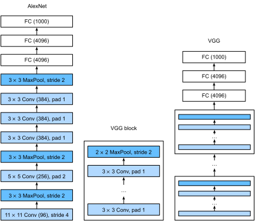

# Networks Using Blocks (VGG)

AlexNet adds three convolutional layers to LeNet. Beyond that, the authors of AlexNet made significant adjustments to the convolution windows, the number of output channels, nonlinear activation, and regularization. Although AlexNet proved that deep convolutional neural networks can achieve good results, it does not provide simple rules to guide subsequent researchers in the design of new networks. In the following sections, we will introduce several different concepts used in deep network design.

Progress in this field mirrors that in chip design where engineers went from placing transistors (neurons) to logical elements (layers) to logic blocks  (the topic of the current section). The idea of using blocks was first proposed by the [Visual Geometry Group](http://www.robots.ox.ac.uk/~vgg/) (VGG) at Oxford University. This led to the VGG network, which we will be discussing below. When using a modern deep learning framework repeated structures can be expressed as *code* with for loops and subroutines. Just like we would use a for loop to count from 1 to 10, we'll use code to combine layers.

## VGG Blocks

The basic building block of a ConvNet is the combination of a convolutional layer (with padding to keep the resolution unchanged), followed by a nonlinearity such as a ReLu. A VGG block is given by a sequence of such layers, followed by maximum pooling. Throughout their design [Simonyan and Ziserman, 2014](https://arxiv.org/abs/1409.1556) used convolution windows of size 3 and maximum pooling with stride and window width 2, effectively halving the resolution after each block. We use the `vgg_block` function to implement this basic VGG block. This function takes the number of convolutional layers `num_convs` and the number of output channels `num_channels` as input.


```{.python .input  n=1}
import sys
sys.path.insert(0, '..')

import d2l
from mxnet import gluon, init, nd
from mxnet.gluon import nn

def vgg_block(num_convs, num_channels):
    blk = nn.Sequential()
    for _ in range(num_convs):
        blk.add(nn.Conv2D(num_channels, kernel_size=3,
                          padding=1, activation='relu'))
    blk.add(nn.MaxPool2D(pool_size=2, strides=2))
    return blk
```

## VGG Network

Like AlexNet and LeNet, the VGG Network is composed of convolutional layer modules attached to fully connected layers. Several `vgg_block` modules are connected in series in the convolutional layer module, the hyper-parameter of which is defined by the variable `conv_arch`. This variable specifies the numbers of convolutional layers and output channels in each VGG block. The fully connected module is the same as that of AlexNet.



The VGG network proposed by Simonyan and Ziserman has 5 convolutional blocks, among which the former two use a single convolutional layer, while the latter three use a double convolutional layer. The first block has 64 output channels, and the latter blocks double the number of output channels, until that number reaches 512. Since this network uses 8 convolutional layers and 3 fully connected layers, it is often called VGG-11.

```{.python .input  n=2}
conv_arch = ((1, 64), (1, 128), (2, 256), (2, 512), (2, 512))
```

Now, we will implement VGG-11. This is a simple matter of executing a for loop over `conv_arch`.

```{.python .input  n=3}
def vgg(conv_arch):
    net = nn.Sequential()
    # The convolutional layer part
    for (num_convs, num_channels) in conv_arch:
        net.add(vgg_block(num_convs, num_channels))
    # The fully connected layer part
    net.add(nn.Dense(4096, activation='relu'), nn.Dropout(0.5),
            nn.Dense(4096, activation='relu'), nn.Dropout(0.5),
            nn.Dense(10))
    return net

net = vgg(conv_arch)
```

Next, we will construct a single-channel data example with a height and width of 224 to observe the output shape of each layer.

```{.python .input  n=4}
net.initialize()
X = nd.random.uniform(shape=(1, 1, 224, 224))
for blk in net:
    X = blk(X)
    print(blk.name, 'output shape:\t', X.shape)
```

As we can see, we halve the entered value of the height and width each time, until the final values of height and width change to 7 before we pass it to the fully connected layer. Meanwhile, the number of output channels doubles until it becomes 512. Since the windows of each convolutional layer are of the same size, the model parameter size of each layer and the computational complexity is proportional to the product of height, width, number of input channels, and number of output channels. By halving the height and width while doubling the number of channels, VGG allows most convolutional layers to have the same model activation size and computational complexity.

## Model Training

Since VGG-11 is more complicated than AlexNet in terms of computation, we construct a network with a smaller number of channels. This is more than sufficient for training on Fashion-MNIST.

```{.python .input  n=5}
ratio = 4
small_conv_arch = [(pair[0], pair[1] // ratio) for pair in conv_arch]
net = vgg(small_conv_arch)
```

Apart from using a slightly larger learning rate, the model training process is similar to that of AlexNet in the last section.

```{.python .input}
lr, num_epochs, batch_size, ctx = 0.05, 5, 128, d2l.try_gpu()
net.initialize(ctx=ctx, init=init.Xavier())
trainer = gluon.Trainer(net.collect_params(), 'sgd', {'learning_rate': lr})
train_iter, test_iter = d2l.load_data_fashion_mnist(batch_size, resize=224)
d2l.train_ch5(net, train_iter, test_iter, batch_size, trainer, ctx,
              num_epochs)
```

## Summary

* VGG-11 constructs a network using reusable convolutional blocks. Different VGG models can be defined by the differences in the number of convolutional layers and output channels in each block.
* The use of blocks leads to very compact representations of the network definition. It allows for efficient design of complex networks.
* In their work Simonyan and Ziserman experimented with various architectures. In particular, they found that several layers of deep and narrow convolutions (i.e. $3 \times 3$) were more effective than fewer layers of wider convolutions.

## Exercises

1. When printing out the dimensions of the layers we only saw 8 results rather than 11. Where did the remaining 3 layer informations go?
1. Compared with AlexNet, VGG is much slower in terms of computation, and it also needs more GPU memory. Try to analyze the reasons for this.
1. Try to change the height and width of the images in Fashion-MNIST from 224 to 96. What influence does this have on the experiments?
1. Refer to Table 1 in the original [VGG Paper](https://arxiv.org/abs/1409.1556) to construct other common models, such as VGG-16 or VGG-19.

## Scan the QR Code to [Discuss](https://discuss.mxnet.io/t/2355)


