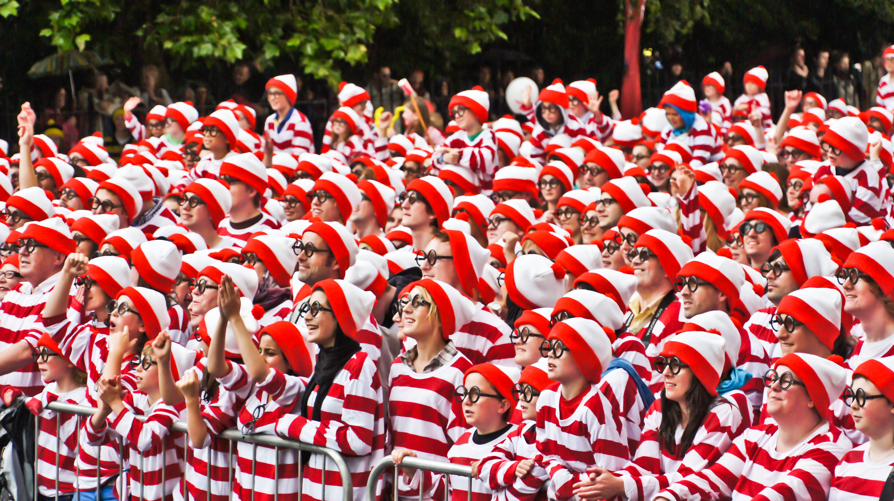

# From Fully Connected Layers to Convolutions
:label:`sec_why-conv`

To this day,
the models that we have discussed so far
remain appropriate options
when we are dealing with tabular data.
By tabular, we mean that the data consist
of rows corresponding to examples
and columns corresponding to features.
With tabular data, we might anticipate
that the patterns we seek could involve
interactions among the features,
but we do not assume any structure *a priori*
concerning how the features interact.

Sometimes, we truly lack the knowledge to be able to guide the construction of fancier architectures.
In these cases, an MLP
may be the best that we can do.
However, for high-dimensional perceptual data,
such structureless networks can grow unwieldy.

For instance, let's return to our running example
of distinguishing cats from dogs.
Say that we do a thorough job in data collection,
collecting an annotated dataset of one-megapixel photographs.
This means that each input to the network has one million dimensions.
Even an aggressive reduction to one thousand hidden dimensions
would require a fully connected layer
characterized by $10^6 \times 10^3 = 10^9$ parameters.
Unless we have lots of GPUs, a talent
for distributed optimization,
and an extraordinary amount of patience,
learning the parameters of this network
may turn out to be infeasible.

A careful reader might object to this argument
on the basis that one megapixel resolution may not be necessary.
However, while we might be able
to get away with one hundred thousand pixels,
our hidden layer of size 1000 grossly underestimates
the number of hidden units that it takes
to learn good representations of images,
so a practical system will still require billions of parameters.
Moreover, learning a classifier by fitting so many parameters
might require collecting an enormous dataset.
And yet today both humans and computers are able
to distinguish cats from dogs quite well,
seemingly contradicting these intuitions.
That is because images exhibit rich structure
that can be exploited by humans
and machine learning models alike.
Convolutional neural networks (CNNs) are one creative way
that machine learning has embraced for exploiting
some of the known structure in natural images.

## Invariance

Imagine that we want to detect an object in an image.
It seems reasonable that whatever method
we use to recognize objects should not be overly concerned
with the precise location of the object in the image.
Ideally, our system should exploit this knowledge.
Pigs usually do not fly and planes usually do not swim.
Nonetheless, we should still recognize
a pig were one to appear at the top of the image.
We can draw some inspiration here
from the children's game "Where's Waldo"
(which itself has inspired many real-life imitations, such as that depicted in :numref:`img_waldo`).
The game consists of a number of chaotic scenes
bursting with activities.
Waldo shows up somewhere in each,
typically lurking in some unlikely location.
The reader's goal is to locate him.
Despite his characteristic outfit,
this can be surprisingly difficult,
due to the large number of distractions.
However, *what Waldo looks like*
does not depend upon *where Waldo is located*.
We could sweep the image with a Waldo detector
that could assign a score to each patch,
indicating the likelihood that the patch contains Waldo. 
In fact, many object detection and segmentation algorithms 
are based on this approach :cite:`Long.Shelhamer.Darrell.2015`. 
CNNs systematize this idea of *spatial invariance*,
exploiting it to learn useful representations
with fewer parameters.

:width:`400px`
:label:`img_waldo`

We can now make these intuitions more concrete 
by enumerating a few desiderata to guide our design
of a neural network architecture suitable for computer vision:

1. In the earliest layers, our network
   should respond similarly to the same patch,
   regardless of where it appears in the image. This principle is called *translation invariance* (or *translation equivariance*).
1. The earliest layers of the network should focus on local regions,
   without regard for the contents of the image in distant regions. This is the *locality* principle.
   Eventually, these local representations can be aggregated
   to make predictions at the whole image level.
1. As we proceed, deeper layers should be able to capture longer-range features of the 
   image, in a way similar to higher level vision in nature. 

Let's see how this translates into mathematics.

## Constraining the MLP

To start off, we can consider an MLP
with two-dimensional images $\mathbf{X}$ as inputs
and their immediate hidden representations
$\mathbf{H}$ similarly represented as matrices (they are two-dimensional tensors in code), where both $\mathbf{X}$ and $\mathbf{H}$ have the same shape.
Let that sink in.
We now imagine that not only the inputs but
also the hidden representations possess spatial structure.

Let $[\mathbf{X}]_{i, j}$ and $[\mathbf{H}]_{i, j}$ denote the pixel
at location $(i,j)$
in the input image and hidden representation, respectively.
Consequently, to have each of the hidden units
receive input from each of the input pixels,
we would switch from using weight matrices
(as we did previously in MLPs)
to representing our parameters
as fourth-order weight tensors $\mathsf{W}$.
Suppose that $\mathbf{U}$ contains biases,
we could formally express the fully connected layer as

$$\begin{aligned} \left[\mathbf{H}\right]_{i, j} &= [\mathbf{U}]_{i, j} + \sum_k \sum_l[\mathsf{W}]_{i, j, k, l}  [\mathbf{X}]_{k, l}\\ &=  [\mathbf{U}]_{i, j} +
\sum_a \sum_b [\mathsf{V}]_{i, j, a, b}  [\mathbf{X}]_{i+a, j+b}.\end{aligned}$$

The switch from $\mathsf{W}$ to $\mathsf{V}$ is entirely cosmetic for now
since there is a one-to-one correspondence
between coefficients in both fourth-order tensors.
We simply re-index the subscripts $(k, l)$
such that $k = i+a$ and $l = j+b$.
In other words, we set $[\mathsf{V}]_{i, j, a, b} = [\mathsf{W}]_{i, j, i+a, j+b}$.
The indices $a$ and $b$ run over both positive and negative offsets,
covering the entire image.
For any given location ($i$, $j$) in the hidden representation $[\mathbf{H}]_{i, j}$,
we compute its value by summing over pixels in $x$,
centered around $(i, j)$ and weighted by $[\mathsf{V}]_{i, j, a, b}$. Before we carry on, let's consider the total number of parameters required for a *single* layer in this parametrization: a $1000 \times 1000$ image (1 megapixel) is mapped to a $1000 \times 1000$ hidden representation. This requires $10^{12}$ parameters, far beyond what computers currently can handle.  

### Translation Invariance

Now let's invoke the first principle
established above: translation invariance :cite:`Zhang.ea.1988`.
This implies that a shift in the input $\mathbf{X}$
should simply lead to a shift in the hidden representation $\mathbf{H}$.
This is only possible if $\mathsf{V}$ and $\mathbf{U}$ do not actually depend on $(i, j)$. As such,
we have $[\mathsf{V}]_{i, j, a, b} = [\mathbf{V}]_{a, b}$ and $\mathbf{U}$ is a constant, say $u$.
As a result, we can simplify the definition for $\mathbf{H}$:

$$[\mathbf{H}]_{i, j} = u + \sum_a\sum_b [\mathbf{V}]_{a, b}  [\mathbf{X}]_{i+a, j+b}.$$

This is a *convolution*!
We are effectively weighting pixels at $(i+a, j+b)$
in the vicinity of location $(i, j)$ with coefficients $[\mathbf{V}]_{a, b}$
to obtain the value $[\mathbf{H}]_{i, j}$.
Note that $[\mathbf{V}]_{a, b}$ needs many fewer coefficients than $[\mathsf{V}]_{i, j, a, b}$ since it
no longer depends on the location within the image. Consequently, the number of parameters required is no longer $10^{12}$ but a much more reasonable $4 \times 10^6$: we still have the dependency on $a, b \in (-1000, 1000)$. In short, we have made significant progress. Time-delay neural networks (TDNNs) are some of the first examples to exploit this idea :cite:`Waibel.Hanazawa.Hinton.ea.1989`.

###  Locality

Now let's invoke the second principle: locality.
As motivated above, we believe that we should not have
to look very far away from location $(i, j)$
in order to glean relevant information
to assess what is going on at $[\mathbf{H}]_{i, j}$.
This means that outside some range $|a|> \Delta$ or $|b| > \Delta$,
we should set $[\mathbf{V}]_{a, b} = 0$.
Equivalently, we can rewrite $[\mathbf{H}]_{i, j}$ as

$$[\mathbf{H}]_{i, j} = u + \sum_{a = -\Delta}^{\Delta} \sum_{b = -\Delta}^{\Delta} [\mathbf{V}]_{a, b}  [\mathbf{X}]_{i+a, j+b}.$$
:eqlabel:`eq_conv-layer`

This reduces the number of parameters from $4 \times 10^6$ to $4 \Delta^2$, where $\Delta$ is typically smaller than $10$. As such, we reduced the number of parameters by another four orders of magnitude. Note that :eqref:`eq_conv-layer`, is what is called, in a nutshell, a *convolutional layer*. 
*Convolutional neural networks* (CNNs)
are a special family of neural networks that contain convolutional layers.
In the deep learning research community,
$\mathbf{V}$ is referred to as a *convolution kernel*,
a *filter*, or simply the layer's *weights* that are learnable parameters.

While previously, we might have required billions of parameters
to represent just a single layer in an image-processing network,
we now typically need just a few hundred, without
altering the dimensionality of either
the inputs or the hidden representations.
The price paid for this drastic reduction in parameters
is that our features are now translation invariant
and that our layer can only incorporate local information,
when determining the value of each hidden activation.
All learning depends on imposing inductive bias.
When that bias agrees with reality,
we get sample-efficient models
that generalize well to unseen data.
But of course, if those biases do not agree with reality,
e.g., if images turned out not to be translation invariant,
our models might struggle even to fit our training data.

This dramatic reduction in parameters brings us to our last desideratum, 
namely that deeper layers should represent larger and more complex aspects 
of an image. This can be achieved by interleaving nonlinearities and convolutional 
layers repeatedly. 

## Convolutions

Let's briefly review why :eqref:`eq_conv-layer` is called a convolution. 
In mathematics, the *convolution* between two functions :cite:`Rudin.1973`,
say $f, g: \mathbb{R}^d \to \mathbb{R}$ is defined as

$$(f * g)(\mathbf{x}) = \int f(\mathbf{z}) g(\mathbf{x}-\mathbf{z}) d\mathbf{z}.$$

That is, we measure the overlap between $f$ and $g$
when one function is "flipped" and shifted by $\mathbf{x}$.
Whenever we have discrete objects, the integral turns into a sum.
For instance, for vectors from
the set of square-summable infinite-dimensional vectors
with index running over $\mathbb{Z}$ we obtain the following definition:

$$(f * g)(i) = \sum_a f(a) g(i-a).$$

For two-dimensional tensors, we have a corresponding sum
with indices $(a, b)$ for $f$ and $(i-a, j-b)$ for $g$, respectively:

$$(f * g)(i, j) = \sum_a\sum_b f(a, b) g(i-a, j-b).$$
:eqlabel:`eq_2d-conv-discrete`

This looks similar to :eqref:`eq_conv-layer`, with one major difference.
Rather than using $(i+a, j+b)$, we are using the difference instead.
Note, though, that this distinction is mostly cosmetic
since we can always match the notation between
:eqref:`eq_conv-layer` and :eqref:`eq_2d-conv-discrete`.
Our original definition in :eqref:`eq_conv-layer` more properly
describes a *cross-correlation*.
We will come back to this in the following section.

## Channels
:label:`subsec_why-conv-channels`

Returning to our Waldo detector, let's see what this looks like.
The convolutional layer picks windows of a given size
and weighs intensities according to the filter $\mathsf{V}$, as demonstrated in :numref:`fig_waldo_mask`.
We might aim to learn a model so that
wherever the "waldoness" is highest,
we should find a peak in the hidden layer representations.

:width:`400px`
:label:`fig_waldo_mask`

There is just one problem with this approach.
So far, we blissfully ignored that images consist
of three channels: red, green, and blue. 
In sum, images are not two-dimensional objects
but rather third-order tensors,
characterized by a height, width, and channel,
e.g., with shape $1024 \times 1024 \times 3$ pixels. 
While the first two of these axes concern spatial relationships,
the third can be regarded as assigning
a multidimensional representation to each pixel location.
We thus index $\mathsf{X}$ as $[\mathsf{X}]_{i, j, k}$.
The convolutional filter has to adapt accordingly.
Instead of $[\mathbf{V}]_{a,b}$, we now have $[\mathsf{V}]_{a,b,c}$.

Moreover, just as our input consists of a third-order tensor,
it turns out to be a good idea to similarly formulate
our hidden representations as third-order tensors $\mathsf{H}$.
In other words, rather than just having a single hidden representation
corresponding to each spatial location,
we want an entire vector of hidden representations
corresponding to each spatial location.
We could think of the hidden representations as comprising
a number of two-dimensional grids stacked on top of each other.
As in the inputs, these are sometimes called *channels*.
They are also sometimes called *feature maps*,
as each provides a spatialized set
of learned features for the subsequent layer.
Intuitively, you might imagine that at lower layers that are closer to inputs,
some channels could become specialized to recognize edges while
others could recognize textures.

To support multiple channels in both inputs ($\mathsf{X}$) and hidden representations ($\mathsf{H}$),
we can add a fourth coordinate to $\mathsf{V}$: $[\mathsf{V}]_{a, b, c, d}$.
Putting everything together we have:

$$[\mathsf{H}]_{i,j,d} = \sum_{a = -\Delta}^{\Delta} \sum_{b = -\Delta}^{\Delta} \sum_c [\mathsf{V}]_{a, b, c, d} [\mathsf{X}]_{i+a, j+b, c},$$
:eqlabel:`eq_conv-layer-channels`

where $d$ indexes the output channels in the hidden representations $\mathsf{H}$. The subsequent convolutional layer will go on to take a third-order tensor, $\mathsf{H}$, as input.
We take
:eqref:`eq_conv-layer-channels`,
because of its generality, as
the definition of a convolutional layer for multiple channels, where $\mathsf{V}$ is a kernel or filter of the layer.

There are still many operations that we need to address.
For instance, we need to figure out how to combine all the hidden representations
to a single output, e.g., whether there is a Waldo *anywhere* in the image.
We also need to decide how to compute things efficiently,
how to combine multiple layers,
appropriate activation functions,
and how to make reasonable design choices
to yield networks that are effective in practice.
We turn to these issues in the remainder of the chapter.

## Summary and Discussion

In this section we derived the structure of convolutional neural networks from first principles. While it is unclear whether this was the route taken to the invention of CNNs, it is satisfying to know that they are the *right* choice when applying reasonable principles to how image processing and computer vision algorithms should operate, at least at lower levels. In particular, translation invariance in images implies that all patches of an image will be treated in the same manner. Locality means that only a small neighborhood of pixels will be used to compute the corresponding hidden representations. Some of the earliest references to CNNs are in the form of the Neocognitron :cite:`Fukushima.1982`. 

A second principle that we encountered in our reasoning is how to reduce the number of parameters in a function class without limiting its expressive power, at least, whenever certain assumptions on the model hold. We saw a dramatic reduction of complexity as a result of this restriction, turning computationally and statistically infeasible problems into tractable models. 

Adding channels allowed us to bring back some of the complexity that was lost due to the restrictions imposed on the convolutional kernel by locality and translation invariance. Note that it is quite natural to add channels other than just red, green, and blue. Many satellite 
images, in particular for agriculture and meteorology, have tens to hundreds of channels, 
generating hyperspectral images instead. They report data on many different wavelengths. In the following we will see how to use convolutions effectively to manipulate the dimensionality of the images they operate on, how to move from location-based to channel-based representations, and how to deal with large numbers of categories efficiently. 

## Exercises

1. Assume that the size of the convolution kernel is $\Delta = 0$.
   Show that in this case the convolution kernel
   implements an MLP independently for each set of channels. This leads to the Network in Network 
   architectures :cite:`Lin.Chen.Yan.2013`. 
1. Audio data is often represented as a one-dimensional sequence. 
    1. When might you want to impose locality and translation invariance for audio? 
    1. Derive the convolution operations for audio.
    1. Can you treat audio using the same tools as computer vision? Hint: use the spectrogram.
1. Why might translation invariance not be a good idea after all? Give an example. 
1. Do you think that convolutional layers might also be applicable for text data?
   Which problems might you encounter with language?
1. What happens with convolutions when an object is at the boundary of an image?
1. Prove that the convolution is symmetric, i.e., $f * g = g * f$.

[Discussions](https://discuss.d2l.ai/t/64)
