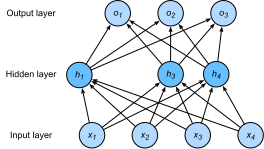

# Dropout

In addition to the weight decay described in the previous section, deep learning models often use dropout[1] to deal with overfitting problems. There are some different variants of dropout. The dropout mentioned in this section refers to the inverted dropout.

## Technique

Recall that Figure 3.3 of the section [“Multilayer Perceptron”](mlp.md) described a multilayer perceptron with a single hidden layer. The number of inputs was 4, the number of hidden units was 5, and the calculation expression of the hidden unit $h_i$($i=1, \ldots, 5$) was

$$h_i = \phi\left(x_1 w_{1i}+ x_2 w_{2i} + x_3 w_{3i} + x_4 w_{4i} + b_i\right),$$

Here, $\phi$ was the activation function, $x_1, \ldots, x_4$ were inputs, and the weight parameters of the hidden unit $i$ were $w_{1i}, \ldots, w_{4i}$, and the bias parameter was $b_i$. When we use dropout for this hidden layer, the hidden units of this layer will be dropped out with a certain probability. If the probability of dropout is $p$,
then the probability that $h_i$ will be cleared is $p$ and the probability that $h_i$ will be divided by $1-p$ for stretching is $1-p$. The dropout probability is a hyper-parameter of dropout. Specifically, let the probability that the random variable $\xi_i$ is 0 and 1 be $p$ and $1-p$, respectively. When using dropout, we calculate the new hidden unit $h_i'$

$$h_i' = \frac{\xi_i}{1-p}h_i.$$

As $\mathbb{E}(\xi_i) = 1-p$, therefore

$$\mathbb{E}(h_i') = \frac{\mathbb{E}(\xi_i)}{1-p}h_i = h_i.$$

That is, dropout does not change the expected value of its input. We use dropout for the hidden layer in Figure 3.3. One possible result is shown in Figure 3.5, where $h_2$ and $h_5$ are cleared. Now, the calculation of the output value is no longer dependent on $h_2$ and $h_5$. In back propagation, the gradients of the weights associated with the two hidden units are both 0. Since the dropout of the hidden layer neurons during training is random, $h_1, \ldots, h_5$ may all be cleared. In this way, the calculation of the output layer cannot be overly dependent on any one element of $h_1, \ldots, h_5$ and, therefore, it can be used as a regularization when training the model, and can be used to cope with overfitting. When testing the model, we generally do not use dropout to get more conclusive results.



## Dropout Implementation Starting from Scratch

According to the definition of dropout, we can implement it easily. The following `dropout` function will drop out the elements in the NDArray input `X` with the probability of `drop_prob`.

```{.python .input}
import gluonbook as gb
from mxnet import autograd, gluon, init, nd
from mxnet.gluon import loss as gloss, nn

def dropout(X, drop_prob):
    assert 0 <= drop_prob <= 1
    keep_prob = 1 - drop_prob
    # In this case, all elements are dropped out.
    if keep_prob == 0:
        return X.zeros_like()
    mask = nd.random.uniform(0, 1, X.shape) < keep_prob
    return mask * X / keep_prob
```

Now, we will run a few examples to test the `dropout` function. The dropout probability is 0, 0.5, and 1, respectively.

```{.python .input}
X = nd.arange(16).reshape((2, 8))
dropout(X, 0)
```

```{.python .input}
dropout(X, 0.5)
```

```{.python .input}
dropout(X, 1)
```

### Defining Model Parameters

In the experiment we still use the Fashion-MNIST data set described in the section ["Softmax Regression - Starting From Scratch"](softmax-regression-scratch.md). We will define a multilayer perceptron with two hidden layers. The two hidden layers both have 256 outputs.

```{.python .input}
num_inputs, num_outputs, num_hiddens1, num_hiddens2 = 784, 10, 256, 256

W1 = nd.random.normal(scale=0.01, shape=(num_inputs, num_hiddens1))
b1 = nd.zeros(num_hiddens1)
W2 = nd.random.normal(scale=0.01, shape=(num_hiddens1, num_hiddens2))
b2 = nd.zeros(num_hiddens2)
W3 = nd.random.normal(scale=0.01, shape=(num_hiddens2, num_outputs))
b3 = nd.zeros(num_outputs)

params = [W1, b1, W2, b2, W3, b3]
for param in params:
    param.attach_grad()
```

### Define the Model

The model defined below concatenates the fully connected layer and the activation function ReLU, using dropout for the output of each activation function. We can set the dropout probability of each layer separately. It is generally recommended to set a lower dropout probability closer to the input layer. In this experiment, we set the dropout probability of the first hidden layer to 0.2 and the dropout probability of the second hidden layer to 0.5. We can use the `is_training` function described in the ["Automatic Gradient"](../chapter_prerequisite/autograd.md) section to determine whether the running mode is training or testing, and only use dropout in the training mode.

```{.python .input}
drop_prob1, drop_prob2 = 0.2, 0.5

def net(X):
    X = X.reshape((-1, num_inputs))
    H1 = (nd.dot(X, W1) + b1).relu()
    if autograd.is_training():  # Use dropout only when training the model.
        H1 = dropout(H1, drop_prob1)  # Add a dropout layer after the first fully connected layer.
    H2 = (nd.dot(H1, W2) + b2).relu()
    if autograd.is_training():
        H2 = dropout(H2, drop_prob2)  # Add a dropout layer after the second fully connected layer.
    return nd.dot(H2, W3) + b3
```

### Model Training and Testing

This part is similar to the training and testing of multilayer perceptrons described previously.

```{.python .input}
num_epochs, lr, batch_size = 5, 0.5, 256
loss = gloss.SoftmaxCrossEntropyLoss()
train_iter, test_iter = gb.load_data_fashion_mnist(batch_size)
gb.train_ch3(net, train_iter, test_iter, loss, num_epochs, batch_size, params,
             lr)
```

## Gluon Implementation of Dropout

In Gluon, we only need to add the `Dropout` layer after the fully connected layer and specify the dropout probability. When training the model, the `Dropout` layer will randomly drop out the output elements of the previous layer at the specified dropout probability; the `Dropout` layer does not function during model testing.

```{.python .input}
net = nn.Sequential()
net.add(nn.Dense(256, activation="relu"),
        nn.Dropout(drop_prob1),  # Add a dropout layer after the first fully connected layer.
        nn.Dense(256, activation="relu"),
        nn.Dropout(drop_prob2),  # Add a dropout layer after the second fully connected layer.
        nn.Dense(10))
net.initialize(init.Normal(sigma=0.01))
```

Next, we will train and test the model.

```{.python .input}
trainer = gluon.Trainer(net.collect_params(), 'sgd', {'learning_rate': lr})
gb.train_ch3(net, train_iter, test_iter, loss, num_epochs, batch_size,
             None, None, trainer)
```

## Summary

* We can use dropout to cope with overfitting.
* Dropout is only used when training the model.

## exercise

* What will be the result if the two dropout probability hyper-parameters in this section are reversed?
* Increase the number of epochs, then compare the results obtained when using dropout with those when not using it.
* If changes are made to the model to make it more complex, such as adding hidden layer units, will the effect of using dropout to cope with overfitting be more obvious?
* Using the model in this section as an example, compare the effects of using dropout and weight decay. What if dropout and weight decay are used at the same time?

## Scan the QR Code to Access [Discussions](https://discuss.gluon.ai/t/topic/1278)


## References

[1] Srivastava, N., Hinton, G., Krizhevsky, A., Sutskever, I., & Salakhutdinov, R. (2014).  JMLR
