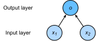

# Linear Regression

In the first few sections of this chapter, we will introduce single-layer neural network: linear regression and Softmax regression. The linear regression output is a continuous value and is therefore suitable for regression problems. Regression problems are extremely common in practice. For example, they are used for predicting continuous values, such as house prices, temperatures, sales, and so on. Unlike regression problems, the final output of the model in classification problems are a discrete value. Problems with discrete values as within model outputs, such as image classification, spam identification, and disease detection, as we said, are all categorized as classification problems. Softmax regression applies to classification problems.

Since both linear regression and Softmax regression are single-layer neural networks, the concepts and techniques involved are equally applicable in most deep learning models. First, we will use linear regression as an example to introduce the basic elements and representation methods of most deep learning models.


## Basic Elements of Linear Regression

We can use a simple prediction of housing prices as an example to help better explain the basic elements of linear regression. The goal of this application is to predict the selling price (yuan) of a house. We know that the price depends on many factors, such as the condition of the house, the location, the market, and so on. For the sake of simplicity, here we will assume that the price only depends on two factors regarding the condition of the house: area (square meters) and age (years). Next, we hope to explore the specific relationship between the price and the two factors.

### model

Suppose the house has an area of $x_1$, the age is $x_2$, and the selling price is $y$. We need to build an expression that calculates the output $y$ based on the input $x_1$ and $x_2$. This information constitutes the model. As the name suggests, linear regression assumes a linear relationship between the output and each input:

$$\hat{y}= x_1 w_1 + x_2 w_2 + b,$$

Both the weight, $w_1, w_2$ and the bias, $b$ are scalar. They are the parameters of the linear regression model. The model output $\hat{y}$ is the prediction or estimate of the linear regression for the actual price $y$. We usually allow for some error between them.


### Model Training

Next, we need to use the data collected to find the specific model parameter values, so as to make the model error for the data as small as possible. This process is called model training. In the following sections we will introduce the three elements involved in model training.

#### Training Data

We usually collect a set real data, such as the actual selling price of multiple houses as well as their corresponding area and age. We hope to find model parameters on this data to minimize the error between the predicted price and the real price of the model. In the terminology of machine learning, the data set is called a ‘training data set’ or ‘training set’, a house is called a ‘sample’, and its actual selling price is called a ‘label’. The two factors used to predict the label are called ‘features’. Features are used to describe the characteristics of the sample.

Suppose the number of samples we collect is $n$, and the sample (indexed as $i$) is featured by $x_1^{(i)}, x_2^{(i)}$, and the label is $y^{(i)}$. For houses with an index of $i$, the house price prediction expression for the linear regression model is as follows:

$$\hat{y}^{(i)} = x_1^{(i)} w_1 + x_2^{(i)} w_2 + b.$$

#### Loss Function

In model training, we need to measure the error between the predicted value and the real value of the price. Usually, we will choose a non-negative number as the error. The smaller the value, the smaller the error. A common choice is the square function. The expression for evaluating the error of a sample with an index of $i$ is as follows:

$$\ell^{(i)}(w_1, w_2, b) = \frac{1}{2} \left(\hat{y}^{(i)} - y^{(i)}\right)^2,$$

The constant $1/2$ ensures that the constant coefficient, after deriving the quadratic term, is 1, which is slightly simpler in form. Obviously, the smaller the error, the closer the predicted price is to the actual price, and when the two are equal, the error will be zero. Given the training data set, this error is only related to the model parameters, so we record it as a function with the model parameters as parameters. In machine learning, we call the function that measures the error the ‘loss function’. The squared error function used here is also referred to as ‘square loss’.

In general, we measure the quality of model predictions by using the average of all sample errors in the training data set. For example:

$$\ell(w_1, w_2, b) =\frac{1}{n}\sum_{i=1}^n \ell^{(i)}(w_1, w_2, b) =\frac{1}{n} \sum_{i=1}^n \frac{1}{2}\left(x_1^{(i)} w_1 + x_2^{(i)} w_2 + b - y^{(i)}\right)^2.$$

In model training, we want to find a set of model parameters, represented by $w_1^*, w_2^*, b^*$, that can minimize the average loss of training samples:

$$w_1^*, w_2^*, b^* = \operatorname*{argmin}_{w_1, w_2, b}\  \ell(w_1, w_2, b).$$


#### Optimization Algorithm

When the model and loss function are in a relatively simple format, the solution to the aforementioned error minimization problem can be expressed directly by the formula. This kind of solution is called an ‘analytical solution’.  The linear regression and squared errors used in this section are exclusively part of this category. However, most deep learning models do not possess analytical solutions. The value of the loss function can only be reduced as much as is possible with finite update model parameter of the optimization algorithm. This class of solution is called a ‘numerical solution’.

The mini-batch stochastic gradient descent is widely used for deep learning within the optimization algorithm for solving numerical solutions. Its algorithm is simple: first, we select the initial values of a set of model parameters, often a random selection; then iterate the parameters multiple times, so that each iteration may reduce the value of the loss function. In each iteration, we first randomly and uniformly sample a mini-batch $\mathcal{B}$ consisting of a fixed number of training data examples; we then solve the derivative (gradient) of the model parameters related to the average loss of the data examples in the mini-batch. Finally, the product of this result and a predetermined positive number is used as the basis of reduction to the model’s parameters in this specific iteration.

During the process of training the linear regression model discussed in this section, each parameter of the model will be iterated as follows:

$$
\begin{aligned}
w_1 &\leftarrow w_1 -   \frac{\eta}{|\mathcal{B}|} \sum_{i \in \mathcal{B}} \frac{ \partial \ell^{(i)}(w_1, w_2, b)  }{\partial w_1} = w_1 -   \frac{\eta}{|\mathcal{B}|} \sum_{i \in \mathcal{B}}x_1^{(i)} \left(x_1^{(i)} w_1 + x_2^{(i)} w_2 + b - y^{(i)}\right),\\
w_2 &\leftarrow w_2 -   \frac{\eta}{|\mathcal{B}|} \sum_{i \in \mathcal{B}} \frac{ \partial \ell^{(i)}(w_1, w_2, b)  }{\partial w_2} = w_2 -   \frac{\eta}{|\mathcal{B}|} \sum_{i \in \mathcal{B}}x_2^{(i)} \left(x_1^{(i)} w_1 + x_2^{(i)} w_2 + b - y^{(i)}\right),\\
b &\leftarrow b -   \frac{\eta}{|\mathcal{B}|} \sum_{i \in \mathcal{B}} \frac{ \partial \ell^{(i)}(w_1, w_2, b)  }{\partial b} = b -   \frac{\eta}{|\mathcal{B}|} \sum_{i \in \mathcal{B}}\left(x_1^{(i)} w_1 + x_2^{(i)} w_2 + b - y^{(i)}\right).
\end{aligned}
$$

In the above formula, $|\mathcal{B}|$ represents the number of samples (batch size) in each mini-batch, $\eta$ is referred to as ‘learning rate’ and takes a positive number. It should be emphasized that the values of the batch size and learning rate are artificially set and are not learned through model training. Therefore, they are referred to as ‘hyper-parameters’. What we usually call "tuning hyper-parameters" refers to the adjustment of the hyper-parameters. This can be performed through repeated trial and error until the appropriate hyper-parameters are found. In a few cases, hyper-parameters can also be learned through model training. However, this book does not discuss such cases.

### Model Prediction

After model training has been completed, we then record the values of the model parameters $w_1, w_2, b$ as $\hat{w}_1, \hat{w}_2, \hat{b}$ when the optimization algorithm stops. Note that we do not necessarily obtain the optimal solution of the minimized loss function, $w_1^*, w_2^*, b^*$, but instead we gain an approximation of the optimal solution. We can then use the learned linear regression model $x_1 \hat{w}_1 + x_2 \hat{w}_2 + \hat{b}$ to estimate the price of any house outside the training data set with area (square meter) of $x_1$ and house age (year) of $x_2$. Here, estimation also referred to as ‘model prediction’, ‘model inference’, or ‘model test.’.


## Representing Method of Linear Regression

We have already described model expressions, training, and predictions for linear regression. Below, we will explain the relationship between linear regression and neural networks, as well as vector calculation expressions for linear regression.

### Neural Network Diagram

While in deep learning, we can represent model structures visually using neural network diagrams. To more clearly demonstrate the linear regression as the structure of neural network, Figure 3.1 uses a neural network diagram to represent the linear regression model presented in this section. The neural network diagram hides the weight and bias of the model parameter.



In the neural network shown in Figure 3.1, the inputs are $x_1$ and $x_2$ respectively. Therefore, the number of inputs of the input layer is 2. The number of inputs is also referred to as ‘feature number’ or ‘feature vector dimension’. In Figure 3.1, the output of the network is $o$, and the number of outputs within the output layer is 1. It should be noted that we use the output of neural network $o$ in Figure 3.1 directly as the output of linear regression, i.e. $\hat{y}= o$.  Since the input layer does not involve calculations, by convention, the number of layers of the neural network shown in Figure 3.1 is 1. Therefore, linear regression is a single-layer neural network. The unit in the output layer responsible for calculating $o$ is also referred to as a ‘neuron’. In linear regression, the calculation of $o$ is dependent on $x_1$ and $x_2$. This is to say, the neurons in the output layer are fully connected to the inputs in the input layer. Therefore, the output layer in this situation is also referred to as a ‘fully-connected layer’ or ‘dense layer’.


### Vector Calculation Expression

In model training or prediction, we often use vector calculations and process multiple data examples at the same time. Before we introduce the vector calculation expression for linear regression, let us first consider two methods of adding two vectors.

Let's define two 1000-dimensional vectors first.

```{.python .input  n=1}
from mxnet import nd
from time import time

a = nd.ones(shape=1000)
b = nd.ones(shape=1000)
```

One way to add vectors is to add the scalar to the two vectors according to the element one at a time.

```{.python .input  n=2}
start = time()
c = nd.zeros(shape=1000)
for i in range(1000):
    c[i] = a[i] + b[i]
time() - start
```

Another way to add vectors is to add the vector to the other two vectors directly:

```{.python .input  n=3}
start = time()
d = a + b
time() - start
```

Obviously, the latter is more time-efficient than the former. Therefore, we should use vector calculations as often as possible as to improve computational efficiency.

Let us return to the prediction problem for house prices we discussed previously in this section. If we predict the price of the three house samples in the training data set (index is 1, 2, and 3 respectively) one by one, we will get

$$
\begin{aligned}
\hat{y}^{(1)} &= x_1^{(1)} w_1 + x_2^{(1)} w_2 + b,\\
\hat{y}^{(2)} &= x_1^{(2)} w_1 + x_2^{(2)} w_2 + b,\\
\hat{y}^{(3)} &= x_1^{(3)} w_1 + x_2^{(3)} w_2 + b.
\end{aligned}
$$

Now, we convert the above three equations into vector calculations. Set

$$
\boldsymbol{\hat{y}} =
\begin{bmatrix}
    \hat{y}^{(1)} \\
    \hat{y}^{(2)} \\
    \hat{y}^{(3)}
\end{bmatrix},\quad
\boldsymbol{X} =
\begin{bmatrix}
    x_1^{(1)} & x_2^{(1)} \\
    x_1^{(2)} & x_2^{(2)} \\
    x_1^{(3)} & x_2^{(3)}
\end{bmatrix},\quad
\boldsymbol{w} =
\begin{bmatrix}
    w_1 \\
    w_2
\end{bmatrix}.
$$

The vector calculation expression for the predicted price of the three house samples is $\boldsymbol{\hat{y}} = \boldsymbol{X} \boldsymbol{w} + b,$, where the additive operation uses the broadcast mechanism (see the section of ["Data Manipulation"](../chapter_prerequisite/ndarray.md)).     For example

```{.python .input  n=4}
a = nd.ones(shape=3)
b = 10
a + b
```

Generally, when the number of data examples is $n$ and the feature number is $d$, the vector calculation expression for linear regression is

$$\boldsymbol{\hat{y}} = \boldsymbol{X} \boldsymbol{w} + b,$$

Model output is $\boldsymbol{\hat{y}} \in \mathbb{R}^{n \times 1}$, batch data example feature is $\boldsymbol{X} \in \mathbb{R}^{n \times d}$, weight is $\boldsymbol{w} \in \mathbb{R}^{d \times 1}$, bias is $b \in \mathbb{R}$. Correspondingly, batch data example label is $\boldsymbol{y}\in \mathbb{R}^{n \times 1}$. Set the model parameter to $\boldsymbol{\theta}= [w_1, w_2, b]^\top$, we can rewrite the loss function to


$$\ell(\boldsymbol{w})=\frac{1}{2n}(\boldsymbol{\hat{y}}-\boldsymbol{y})^\top(\boldsymbol{\hat{y}}-\boldsymbol{y}).$$

The iteration steps of mini-batch stochastic gradient descent will be rewritten accordingly to

$$\boldsymbol{\theta}\leftarrow \boldsymbol{\theta} -   \frac{\eta}{|\mathcal{B}|} \sum_{i \in \mathcal{B}}   \nabla_{\boldsymbol{\theta}} \ell^{(i)}(\boldsymbol{\theta}),$$

其中梯度是损失有关三个为标量的模型参数的偏导数组成的向量：

$$
\nabla_{\boldsymbol{\theta}} \ell^{(i)}(\boldsymbol{\theta})=
\begin{bmatrix}
    \frac{ \partial \ell^{(i)}(w_1, w_2, b)  }{\partial w_1} \\
    \frac{ \partial \ell^{(i)}(w_1, w_2, b)  }{\partial w_2} \\
    \frac{ \partial \ell^{(i)}(w_1, w_2, b)  }{\partial b}
\end{bmatrix}
=
\begin{bmatrix}
    x_1^{(i)} (x_1^{(i)} w_1 + x_2^{(i)} w_2 + b - y^{(i)}) \\
    x_2^{(i)} (x_1^{(i)} w_1 + x_2^{(i)} w_2 + b - y^{(i)}) \\
    x_1^{(i)} w_1 + x_2^{(i)} w_2 + b - y^{(i)}
\end{bmatrix}
=
\begin{bmatrix}
    x_1^{(i)} \\
    x_2^{(i)} \\
    1
\end{bmatrix}
(\hat{y}^{(i)} - y^{(i)}).
$$


## Summary

* Like most deep learning models, for a single-layer neural network such as linear regression, its basic elements include the model, training data, loss function, and the optimization algorithm.
* We can use either a neural network diagram to represent linear regression or a vector calculation to represent the model.
* We should use vector calculations as often as possible as to improve computational efficiency.


## exercise

* Compare the runtime of the two methods of adding two vectors using other packages (such as NumPy) or other programming languages (such as MATLAB).


## Scan the QR code to get to the [forum](https://discuss.gluon.ai/t/topic/6321)


