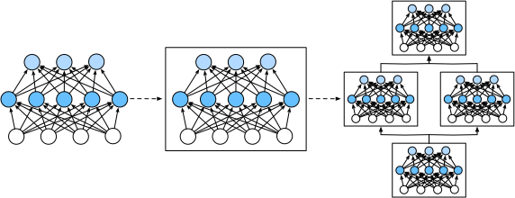

# Layers and Blocks
:label:`chapter_model_construction`


When we first started talking about neural networks,
we introduced linear models with a single output.
Here, the entire model consists of just a single neuron.
By itself, a single neuron takes some set of inputs,
generates a corresponding (*scalar*) output,
and has a set of associated parameters that can be updated
to optimize some objective function of interest. 
Then, once we started thinking about networks with multiple outputs,
we leveraged vectorized arithmetic, 
we showed how we could use linear algebra
to efficiently express an entire *layer* of neurons. 
Layers too expect some inputs, generate corresponding outputs,
and are described by a set of tunable parameters.

When we worked through softmax regression,
a single *layer* was itself *the model*.
However, when we subsequently introduced multilayer perceptrons,
we developed models consisting of multiple layers.
One interesting property of multilayer neural networks
is that the *entire model* and its *constituent layers*
share the same basic structure. 
The model takes the true inputs (as stated in the problem formulation),
outputs predictions of the true outputs,
and possesses parameters (the combined set of all parameters from all layers)
Likewise any individual constituent layer in a multilayer perceptron
ingests inputs (supplied by the previous layer)
generates outputs (which form the inputs to the subsequent layer),
and possesses a set of tunable parameters 
tht are updated with respect to the ultimate objective 
(using the signal that flows backwards through the subsequent layer).

While you might think that neurons, layers, and models 
give us enough abstractions to go about our business,
it turns out that we'll often want to express our model
in terms of a components that are large than an indivudal layer.
For example, when designing models, like ResNet-152,
which possess hundreds (152, thus the name) of layers,
implementing the network one layer at a time can grow tedious.
Moreover, this concern is not just hypothetical---such deep networks
dominate numerous application areas, especally when training data is abundant. 
For example the ResNet architecture mentioned above ([He et al.](https://www.cv-foundation.org/openaccess/content_cvpr_2016/papers/He_Deep_Residual_Learning_CVPR_2016_paper.pdf))
won the 2015 ImageNet and COCO computer vision compeititions
for both recognition and detection.
Deep networks with many layers arranged into components
with various repeating patterns are now ubiquitous in other domains
including natural language processing and speech.

To facilitate the implementation of networks consisting of components
of arbitrary complecity, we introduce a new flexible concept: 
a neural network *block*.
A block could describe a single neuron, 
a high-dimensional layer, 
or an arbitrarily-complex component consisting of multiple layers.
From a software development, a `Block` is a class.
Any subclass of `Block` must define a method called `forward`
that transforms its input into output,
and must store any necessary parameters. 
Note that some Blocks do not require any parameters at all!
Finally a `Block` must possess a `backward` method,
for purposes of calculating gradients.
Fortunately, due to some behind-the-scenes magic 
supplied by the autograd  `autograd` package 
(introduced in :numref`chapter_crashcourse`)
when defining our own `Block` typically requires
only that we worry about parameters and the `forward` function.


By defining code to generate Blocks of arbitrary complexity on demand,
we can write surprisingly compact code 
and still implement complex neural networks.

To begin, we revisit the Blocks that played a role 
in our implementation of the multilayer perceptron 
in :numref:`chapter_mlp_gluon`:

```{.python .input  n=1}
from mxnet import np, npx
from mxnet.gluon import nn
npx.set_np()

x = np.random.uniform(size=(2, 20))

net = nn.Sequential()
net.add(nn.Dense(256, activation='relu'))
net.add(nn.Dense(10))
net.initialize()
net(x)
```

This code generates a network with a hidden layer of 256 units, 
followed by a ReLU activation and another 10 units governing the output. 
Note that we used the `nn.Sequential` constructor 
to generate an empty network into which we then inserted both layers. 
What exactly happens inside `nn.Sequential` 
has remained rather mysterious so far. 
In the following, we will see that this really just constructs a block. 
These blocks can be combined into larger artifacts, often recursively. T
he diagram below shows how:



In the following we will explain the various steps needed to go from defining layers to defining blocks (of one or more layers). To get started we need a bit of reasoning about software. For most intents and purposes a block behaves very much like a fancy layer. That is, it provides the following functionality:

1. It needs to ingest data (the input).
1. It needs to produce a meaningful output. This is typically encoded in what we will call the `forward` function. It allows us to invoke a block via `net(X)` to obtain the desired output. What happens behind the scenes is that it invokes `forward` to perform forward propagation.
1. It needs to produce a gradient with regard to its input when invoking `backward`. Typically this is automatic.
1. It needs to store parameters that are inherent to the block. For instance, the block above contains two hidden layers, and we need a place to store parameters for it.
1. Obviously it also needs to initialize these parameters as needed.

## A Custom Block

The `nn.Block` class provides the functionality required for much of what we need. It is a model constructor provided in the `nn` module, which we can inherit to define the model we want. The following inherits the Block class to construct the multilayer perceptron mentioned at the beginning of this section. The `MLP` class defined here overrides the `__init__` and `forward` functions of the Block class. They are used to create model parameters and define forward computations, respectively. Forward computation is also forward propagation.

```{.python .input  n=1}
from mxnet.gluon import nn

class MLP(nn.Block):
    # Declare a layer with model parameters. Here, we declare two fully
    # connected layers
    def __init__(self, **kwargs):
        # Call the constructor of the MLP parent class Block to perform the
        # necessary initialization. In this way, other function parameters can
        # also be specified when constructing an instance, such as the model
        # parameter, params, described in the following sections
        super(MLP, self).__init__(**kwargs)
        self.hidden = nn.Dense(256, activation='relu')  # Hidden layer
        self.output = nn.Dense(10)  # Output layer

    # Define the forward computation of the model, that is, how to return the
    # required model output based on the input x
    def forward(self, x):
        return self.output(self.hidden(x))
```

Let's look at it a bit more closely. The `forward` method invokes a network simply by evaluating the hidden layer `self.hidden(x)` and subsequently by evaluating the output layer `self.output( ... )`. This is what we expect in the forward pass of this block.

In order for the block to know what it needs to evaluate, we first need to define the layers. This is what the `__init__` method does. It first initializes all of the Block-related parameters and then constructs the requisite layers. This attached the corresponding layers and the required parameters to the class. Note that there is no need to define a backpropagation method in the class. The system automatically generates the `backward` method needed for back propagation by automatically finding the gradient. The same applies to the `initialize` method, which is generated automatically. Let's try this out:

```{.python .input  n=2}
net = MLP()
net.initialize()
net(x)
```

As explained above, the block class can be quite versatile in terms of what it does. For instance, its subclass can be a layer (such as the `Dense` class provided by Gluon), it can be a model (such as the `MLP` class we just derived), or it can be a part of a model (this is what typically happens when designing very deep networks). Throughout this chapter we will see how to use this with great flexibility.

## A Sequential Block

The Block class is a generic component describing dataflow. In fact, the Sequential class is derived from the Block class: when the forward computation of the model is a simple concatenation of computations for each layer, we can define the model in a much simpler way. The purpose of the Sequential class is to provide some useful convenience functions. In particular, the `add` method allows us to add concatenated Block subclass instances one by one, while the forward computation of the model is to compute these instances one by one in the order of addition.
Below, we implement a `MySequential` class that has the same functionality as the Sequential class. This may help you understand more clearly how the Sequential class works.

```{.python .input  n=3}
class MySequential(nn.Block):
    def __init__(self, **kwargs):
        super(MySequential, self).__init__(**kwargs)

    def add(self, block):
        # Here, block is an instance of a Block subclass, and we assume it has
        # a unique name. We save it in the member variable _children of the
        # Block class, and its type is OrderedDict. When the MySequential
        # instance calls the initialize function, the system automatically
        # initializes all members of _children
        self._children[block.name] = block

    def forward(self, x):
        # OrderedDict guarantees that members will be traversed in the order
        # they were added
        for block in self._children.values():
            x = block(x)
        return x
```

At its core is the `add` method. It adds any block to the ordered dictionary of children. These are then executed in sequence when forward propagation is invoked. Let's see what the MLP looks like now.

```{.python .input  n=4}
net = MySequential()
net.add(nn.Dense(256, activation='relu'))
net.add(nn.Dense(10))
net.initialize()
net(x)
```

Indeed, it is no different than It can observed here that the use of the
`MySequential` class is no different from the use of the Sequential class
described in :numref:`chapter_mlp_gluon`.


## Blocks with Code

Although the Sequential class can make model construction easier, and you do not need to define the `forward` method, directly inheriting the Block class can greatly expand the flexibility of model construction. In particular, we will use Python's control flow within the forward method. While we're at it, we need to introduce another concept, that of the *constant* parameter. These are parameters that are not used when invoking backprop. This sounds very abstract but here's what's really going on. Assume that we have some function

$$f(\mathbf{x},\mathbf{w}) = 3 \cdot \mathbf{w}^\top \mathbf{x}.$$

In this case 3 is a constant parameter. We could change 3 to something else, say $c$ via

$$f(\mathbf{x},\mathbf{w}) = c \cdot \mathbf{w}^\top \mathbf{x}.$$

Nothing has really changed, except that we can adjust the value of $c$. It is still a constant as far as $\mathbf{w}$ and $\mathbf{x}$ are concerned. However, since Gluon doesn't know about this beforehand, it's worth while to give it a hand (this makes the code go faster, too, since we're not sending the Gluon engine on a wild goose chase after a parameter that doesn't change). `get_constant` is the method that can be used to accomplish this. Let's see what this looks like in practice.

```{.python .input  n=5}
class FancyMLP(nn.Block):
    def __init__(self, **kwargs):
        super(FancyMLP, self).__init__(**kwargs)
        # Random weight parameters created with the get_constant are not
        # iterated during training (i.e. constant parameters)
        self.rand_weight = self.params.get_constant(
            'rand_weight', np.random.uniform(size=(20, 20)))
        self.dense = nn.Dense(20, activation='relu')

    def forward(self, x):
        x = self.dense(x)
        # Use the constant parameters created, as well as the relu and dot functions
        x = npx.relu(np.dot(x, self.rand_weight.data()) + 1)
        # Reuse the fully connected layer. This is equivalent to sharing
        # parameters with two fully connected layers
        x = self.dense(x)
        # Here in Control flow, we need to call asscalar to return the scalar
        # for comparison
        while np.abs(x).sum() > 1:
            x /= 2
        if np.abs(x).sum() < 0.8:
            x *= 10
        return x.sum()
```

In this `FancyMLP` model, we used constant weight `Rand_weight` (note that it is not a model parameter), performed a matrix multiplication operation (`np.dot<`), and reused the *same* `Dense` layer. Note that this is very different from using two dense layers with different sets of parameters. Instead, we used the same network twice. Quite often in deep networks one also says that the parameters are *tied* when one wants to express that multiple parts of a network share the same parameters. Let's see what happens if we construct it and feed data through it.

```{.python .input  n=6}
net = FancyMLP()
net.initialize()
net(x)
```

There's no reason why we couldn't mix and match these ways of build a network. Obviously the example below resembles more a chimera, or less charitably, a [Rube Goldberg Machine](https://en.wikipedia.org/wiki/Rube_Goldberg_machine). That said, it combines examples for building a block from individual blocks, which in turn, may be blocks themselves. Furthermore, we can even combine multiple strategies inside the same forward function. To demonstrate this, here's the network.

```{.python .input  n=7}
class NestMLP(nn.Block):
    def __init__(self, **kwargs):
        super(NestMLP, self).__init__(**kwargs)
        self.net = nn.Sequential()
        self.net.add(nn.Dense(64, activation='relu'),
                     nn.Dense(32, activation='relu'))
        self.dense = nn.Dense(16, activation='relu')

    def forward(self, x):
        return self.dense(self.net(x))

chimera = nn.Sequential()
chimera.add(NestMLP(), nn.Dense(20), FancyMLP())

chimera.initialize()
chimera(x)
```

## Compilation

The avid reader is probably starting to worry about the efficiency of this. After all, we have lots of dictionary lookups, code execution, and lots of other Pythonic things going on in what is supposed to be a high performance deep learning library. The problems of Python's [Global Interpreter Lock](https://wiki.python.org/moin/GlobalInterpreterLock) are well known. In the context of deep learning it means that we have a super fast GPU (or multiple of them) which might have to wait until a puny single CPU core running Python gets a chance to tell it what to do next. This is clearly awful and there are many ways around it. The best way to speed up Python is by avoiding it altogether.

Gluon does this by allowing for Hybridization (:numref:`chapter_hybridize`). In it, the Python
interpreter executes the block the first time it's invoked. The Gluon runtime
records what is happening and the next time around it short circuits any calls
to Python. This can accelerate things considerably in some cases but care needs
to be taken with control flow. We suggest that the interested reader skip
forward to the section covering hybridization and compilation after finishing
the current chapter.


## Summary

* Layers are blocks
* Many layers can be a block
* Many blocks can be a block
* Code can be a block
* Blocks take are of a lot of housekeeping, such as parameter initialization, backprop and related issues.
* Sequential concatenations of layers and blocks are handled by the eponymous `Sequential` block.

## Exercises

1. What kind of error message will you get when calling an `__init__` method whose parent class not in the `__init__` function of the parent class?
1. What kinds of problems will occur if you remove the `asscalar` function in the `FancyMLP` class?
1. What kinds of problems will occur if you change `self.net` defined by the Sequential instance in the `NestMLP` class to `self.net = [nn.Dense(64, activation='relu'), nn. Dense(32, activation='relu')]`?
1. Implement a block that takes two blocks as an argument, say `net1` and `net2` and returns the concatenated output of both networks in the forward pass (this is also called a parallel block).
1. Assume that you want to concatenate multiple instances of the same network. Implement a factory function that generates multiple instances of the same block and build a larger network from it.

## Scan the QR Code to [Discuss](https://discuss.mxnet.io/t/2325)


