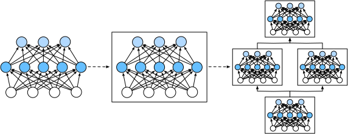

# Layers and Blocks
:label:`sec_model_construction`

When we first introduced neural networks,
we focused on linear models with a single output.
Here, the entire model consists of just a single neuron.
Note that a single neuron
(i) takes some set of inputs;
(ii) generates a corresponding (*scalar*) output;
and (iii) has a set of associated parameters that can be updated 
to optimize some objective function of interest.
Then, once we started thinking about networks with multiple outputs,
we leveraged vectorized arithmetic
to characterize an entire *layer* of neurons.
Just like individual neurons, 
layers (i) take a set of inputs, 
(ii) generate corresponding outputs,
and (iii) are described by a set of tunable parameters.
When we worked through softmax regression,
a single *layer* was itself *the model*.
However, even when we subsequently 
introduced multilayer perceptrons,
we could still think of the model as 
retaining this same basic structure.

Interestingly, for multilayer perceptrons, 
both the *entire model* and its *constituent layers* 
share this structure. 
The (entire) model takes in raw inputs (the features),
generates outputs (the predictions),
and possesses parameters 
(the combined parameters from all constituent layers).
Likewise, each individual layer ingests inputs 
(supplied by the previous layer)
generates outputs (the inputs to the subsequent layer),
and possesses a set of tunable parameters that are updated
according to the signal that flows backwards 
from the subsequent layer.


While you might think that neurons, layers, and models
give us enough abstractions to go about our business,
it turns out that we often find it convenient
to speak about components that are
larger than an individual layer
but smaller than the entire model.
For example, the ResNet-152 architecture,
which is wildly popular in computer vision,
possesses hundreds of layers.
These layers consist of repeating patterns of *groups of layers*. Implementing such a network one layer at a time can grow tedious.
This concern is not just hypothetical---such 
design patterns are common in practice.
The ResNet architecture mentioned above
won the 2015 ImageNet and COCO computer vision competitions
for both recognition and detection :cite:`He.Zhang.Ren.ea.2016`
and remains a go-to architecture for many vision tasks.
Similar patterns are in which layers are arranged 
in various repeating patterns 
are now ubiquitous in other domains,
including natural language processing and speech.

To implement these complex networks,
we introduce the concept of a neural network *block*.
A block could describe a single layer,
a component consisting of multiple layers,
or the entire model itself!
From a software standpoint, a `Block` is a *class*.
Any subclass of `Block` must define a `forward` method 
that transforms its input into output
and must store any necessary parameters.
Note that some Blocks do not require any parameters at all!
Finally a `Block` must possess a `backward` method,
for purposes of calculating gradients.
Fortunately, due to some behind-the-scenes magic
supplied by the `autograd` package
(introduced in :numref:`chap_preliminaries`)
when defining our own `Block`,
we only need to worry about parameters
and the `forward` function.

One benefit of working with the `Block` abstraction 
is that they can be combined into larger artifacts,
often recursively, (see illustration in :numref:`fig_blocks`).


:label:`fig_blocks`

By defining code to generate Blocks 
of arbitrary complexity on demand,
we can write surprisingly compact code
and still implement complex neural networks.

To begin, we revisit the Blocks 
that we used to implement multilayer perceptrons
(:numref:`sec_mlp_gluon`).
The following code generates a network
with one fully-connected hidden layer 
with 256 units and ReLU activation,
followed by a fully-connected *output layer*
with 10 units (no activation function).

```{.python .input  n=33}
from mxnet import np, npx
from mxnet.gluon import nn
npx.set_np()

x = np.random.uniform(size=(2, 20))

net = nn.Sequential()
net.add(nn.Dense(256, activation='relu'))
net.add(nn.Dense(10))
net.initialize()
net(x)
```

In this example, we constructed
our model by instantiating an `nn.Sequential`,
assigning the returned object to the `net` variable.
Next, we repeatedly call its `add` method,
appending layers in the order
that they should be executed.
In short, `nn.Sequential` defines a special kind of `Block`
that mantains an ordered list of constituent `Blocks`.
The `add` method simply facilitates
the addition of each successive `Block` to the list.
Note that each our layer is an instance of the `Dense` class
which is itself a subclass of `Block`.
The `forward` function is also remarkably simple:
it chains each Block in the list together,
passing the output of each as the input to the next.
Note that until now, we have been invoking our models
via the construction `net(X)` to obtain their outputs.
This is actually just shorthand for `net.forward(X)`,
a slick Python trick achieved via 
the Block class's `__call__` function.


## A Custom Block

Perhaps the easiest way to develop intuition
about how `nn.Block` works
is to implement one ourselves.
Before we implement our own custom `Block`,
we briefly summarize the basic functionality
that each `Block` must provide:

1. Ingest input data as arguments to its `forward` method.
1. Generate an output by having `forward` return a value. 
   Note that the output may have a different shape from the input.      For example, the first Dense layer in our model above ingests an      input of arbitrary dimension but returns 
   an output of dimension 256.
1. Calculate the gradient of its output with respect to its input,      which can be accessed via its `backward` method. 
   Typically this happens automatically.
1. Store and provide access to those parameters necessary 
   to execute the `forward` computation.
1. Initialize these parameters as needed.

In the following snippet,
we code up a Block from scratch
corresponding to a multilayer perceptron
with one hidden layer with 256 hidden nodes, 
and a 10-dimensional output layer.
Note that the `MLP` class below inherits the `Block` class.
We will rely heavily on the parent class's methods,
supplying only our own `__init__` and `forward` methods.

```{.python .input  n=34}
from mxnet.gluon import nn

class MLP(nn.Block):
    # Declare a layer with model parameters. Here, we declare two fully
    # connected layers
    def __init__(self, **kwargs):
        # Call the constructor of the MLP parent class Block to perform the
        # necessary initialization. In this way, other function parameters can
        # also be specified when constructing an instance, such as the model
        # parameter, params, described in the following sections
        super(MLP, self).__init__(**kwargs)
        self.hidden = nn.Dense(256, activation='relu')  # Hidden layer
        self.output = nn.Dense(10)  # Output layer

    # Define the forward computation of the model, that is, how to return the
    # required model output based on the input x
    def forward(self, x):
        return self.output(self.hidden(x))
```

To begin, let's focus on the `forward` method.
Note that it takes `x` as input,
calculates the hidden representation (`self.hidden(x)`),
and outputs its logits (`self.output( ... )`).
In this MLP implementation,
both layers are instance variables.
To see why this is reasonable, imagine
instantiating two MLPs, `net1` and `net2`,
and training them on different data.
Naturally, we would expect them them
to represent two different learned models.

We instantiate the MLP's layers
in the `__init__` method (the constructor)
and subsequently invoke these layers
on each call to the `forward` method.
Note a few key details.
First, our customized `__init__` method 
invokes the parent class's `__init__` method
via `super(MLP, self).__init__(**kwargs)`
sparing us the pain of restating
boilerplate code applicable to most Blocks.
We then instantiate our two `Dense` layers,
assigning them to `self.hidden` and `self.output`.
Note that unless we implement a new operator,
we need not worry about backpropagation (the `backward` method)
or parameter initialization (the `initialize` method).
Gluon will generate these methods automatically.
Let's try this out:

```{.python .input  n=35}
net = MLP()
net.initialize()
net(x)
```

A key virtue of the `Block` abstraction is its versatility.
We can subclass `Block` to create layers
(such as the `Dense` class provided by Gluon),
entire models (such as the `MLP` above),
or various components of intermediate complexity.
We exploit this versatility
throughout the following chapters,
especially when addressing 
convolutional neural networks.


## The Sequential Block

We can now take a closer look 
at how the `Sequential` class works.
Recall that `Sequential` was designed 
to daisy-chain other Blocks together.
To build our own simplified `MySequential`,
we just need to define two key methods:
1. An `add` method for appending Blocks one by one to a list.
2. A `forward` method to pass an input through the chain of Blocks
(in the same order as they were appended).

The following `MySequential` class delivers the same 
functionality as Gluon's default `Sequential` class:

```{.python .input  n=36}
class MySequential(nn.Block):
    def add(self, block):
        # Here, block is an instance of a Block subclass, and we assume it has
        # a unique name. We save it in the member variable _children of the
        # Block class, and its type is OrderedDict. When the MySequential
        # instance calls the initialize function, the system automatically
        # initializes all members of _children
        self._children[block.name] = block

    def forward(self, x):
        # OrderedDict guarantees that members will be traversed in the order
        # they were added
        for block in self._children.values():
            x = block(x)
        return x
```

The `add` method adds a single Block 
to the ordered dictionary `_children`. 
You might wonder why every Gluon `Block` 
possesses a `_children` attribute 
and why we used it rather than just 
defining a Python list ourselves.
In short the chief advantage of `_children`
is that during our Block's parameter inititialization,
Gluon knows to look in the `_children`
dictionary to find sub-Blocks whose 
parameters also need to be initialized.

When our `MySequential` Block's `forward` method is invoked,
each added `Block` is executed 
in the order in which they were added.
We can now reimplement an MLP 
using our `MySequential` class.

```{.python .input  n=37}
net = MySequential()
net.add(nn.Dense(256, activation='relu'))
net.add(nn.Dense(10))
net.initialize()
net(x)
```

Note that this use of `MySequential`
is identical to the code we previously wrote 
for the Gluon `Sequential` class 
(as described in :numref:`sec_mlp_gluon`).


## Executing Code in the `forward` Method

The `nn.Sequential` class makes model construction easy,
allowing us to assemble new architectures
without having to defined our own class.
However, not all architectures are simple daisy chains.
When greater flexibility is required,
we will want to define our own `Block`s.
For example, we might want to exectute 
Python's control flow within the forward method.
Moreover we might want to perform
arbitrary mathematical operations,
not simply relying on predefined neural network layers.

You might have noticed that until now,
all of the operations in our networks
have acted upon our network's activations
and its parameters. 
Sometimes, however, we might want to 
incorporate terms constant terms 
which are neither the result of previous layers
nor updatable parameters. 
In Gluon, we call these *constant* parameters. 
Say for example that we want a layer
that calculates the function 
$f(\mathbf{x},\mathbf{w}) = c \cdot \mathbf{w}^\top \mathbf{x}$,
where $\mathbf{x}$ is the input, $\mathbf{w}$ is our parameter,
and $c$ is some specified constant 
that is not updated during optimization.

Declaring constants explicitly (via `get_constant`)
makes this clear helps Gluon to speed up execution.
In the following code, we'll implement a model
that could not easily be assembled
using only predefined layers and `Sequential`.

```{.python .input  n=38}
class FixedHiddenMLP(nn.Block):
    def __init__(self, **kwargs):
        super(FixedHiddenMLP, self).__init__(**kwargs)
        # Random weight parameters created with the get_constant are not
        # iterated during training (i.e., constant parameters)
        self.rand_weight = self.params.get_constant(
            'rand_weight', np.random.uniform(size=(20, 20)))
        self.dense = nn.Dense(20, activation='relu')

    def forward(self, x):
        x = self.dense(x)
        # Use the constant parameters created, as well as the relu
        # and dot functions
        x = npx.relu(np.dot(x, self.rand_weight.data()) + 1)
        # Reuse the fully connected layer. This is equivalent to sharing
        # parameters with two fully connected layers
        x = self.dense(x)
        # Here in Control flow, we need to call asscalar to return the scalar
        # for comparison
        while np.abs(x).sum() > 1:
            x /= 2
        return x.sum()
```

In this `FixedHiddenMLP` model,
we implement a hidden layer whose weights 
(`self.rand_weight`) are initialized randomly
at instantiation and are thereafter constant. 
This weight is not a model parameter
and thus it is never updated by backpropagation.
The network then passes the output of this *fixed* layer
through a `Dense` layer. 

Note that before returning output,
our model did something unusual.
We ran a `while` loop, testing 
on the condition `np.abs(x).sum() > 1`,
and dividing our output vector by $2$ 
until it satisfied the condition.
Finally, we outputed the sum of the entries in `x`.
To our knowledge, no standard neural network
performs this operation.
Note that this particular operation may not be useful
in any real world task. 
Our point is only to show you how to integrate
arbitrary code into the flow of your 
neural network computations.

```{.python .input  n=39}
net = FixedHiddenMLP()
net.initialize()
net(x)
```

With Gluon, we can mix and match various 
ways of assembling `Block`s together.
In the following example, we nest `Block`s
in some creative ways.

```{.python .input  n=40}
class NestMLP(nn.Block):
    def __init__(self, **kwargs):
        super(NestMLP, self).__init__(**kwargs)
        self.net = nn.Sequential()
        self.net.add(nn.Dense(64, activation='relu'),
                     nn.Dense(32, activation='relu'))
        self.dense = nn.Dense(16, activation='relu')

    def forward(self, x):
        return self.dense(self.net(x))

chimera = nn.Sequential()
chimera.add(NestMLP(), nn.Dense(20), FixedHiddenMLP())

chimera.initialize()
chimera(x)
```

## Compilation

The avid reader might start to worry 
about the efficiency of some of these operations. 
After all, we have lots of dictionary lookups, 
code execution, and lots of other Pythonic things 
taking place in what is supposed to be 
a high performance deep learning library.
The problems of Python's [Global Interpreter Lock](https://wiki.python.org/moin/GlobalInterpreterLock) are well known. In the context of deep learning,
we worry that our extremely fast GPU(s)
might have to wait until a puny CPU
runs Python code before it gets another job to run.
The best way to speed up Python is by avoiding it altogether.
One way that Gluon does this by allowing for 
Hybridization (:numref:`sec_hybridize`). 
Here, the Python interpreter executes a Block
the first time it is invoked. 
The Gluon runtime records what is happening
and the next time around it short-circuits calls to Python.
This can accelerate things considerably in some cases
but care needs to be taken when control flow (as above)
lead down different branches on different passes through the net.
We recommend that the interested reader check out 
the hybridization section (:numref:`sec_hybridize`)
to learn about compilation after finishing the current chapter.


## Summary

* Layers are Blocks.
* Many layers can comprise a Block.
* Many Blocks can comprise a Block.
* A Block can contain code.
* Blocks take care of lots of housekeeping, including parameter initialization and backpropagation.
* Sequential concatenations of layers and blocks are handled by the `Sequential` Block.


## Exercises

1. What kinds of problems will occur if you remove the `asscalar` function in the `FixedHiddenMLP` class?
1. What kinds of problems will occur if you change `self.net` defined by the Sequential instance in the `NestMLP` class to `self.net = [nn.Dense(64, activation='relu'), nn. Dense(32, activation='relu')]`?
1. Implement a block that takes two blocks as an argument, say `net1` and `net2` and returns the concatenated output of both networks in the forward pass (this is also called a parallel block).
1. Assume that you want to concatenate multiple instances of the same network. Implement a factory function that generates multiple instances of the same block and build a larger network from it.

## [Discussions](https://discuss.mxnet.io/t/2325)


