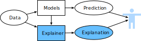

# Overview of Model Explainability 

The availability of large datasets combined with the exponential growth in computing power led to an unprecedented surge of model complexity in machine learning. We have seen a clear shift from simple machine learning models to complex models across domains such as computer vision and natural language understanding. Simple models such as linear regression and decision trees/lists are no longer sufficient in predictive accuracy. In contrast, complex models with up to billions of trainable parameters (e.g., transformer, :numref:`sec_transformer`) or hundreds of neural network layers (e.g., ResNet, :numref:`sec_resnet`) can lead to more accurate results and become increasingly prevalent. However, these complex models are less understandable to humans. *What does a neuron in layer 10 do in my trained ResNet?* A better understanding of models, such as how a specific prediction is made, is the core of *model explainability*.

In machine learning, *model explainability* can be roughly defined as (it is hard to define rigorously) the degree to which humans can understand the decisions made by models. Before formally introducing model explainability, let's look at a real-world example.

```{.python .input}
from d2l import torch as d2l
import pandas as pd
import numpy as np
import torch
import torch.nn as nn
from sklearn import model_selection
from sklearn import linear_model
```

## Heart Disease Prediction
:label:`subsec_heart-disease-dataset`
In this example, we will anticipate whether a patient has heart disease or not using a [dataset](https://archive.ics.uci.edu/ml/datasets/heart+disease) consisting of patients' demographics and medical information. Heart disease is one of the major causes of death globally. Leading risk factors for heart disease include high blood pressure, diabetes, unhealthy cholesterol level, etc. Automating the heart disease prediction process can potentially help reduce clinical costs. Yet, a poor clinical decision on this can lead to unacceptable consequences.

As usual, the first step is to read the dataset and split it into training and testing sets.

```{.python .input}
class HeartDiseaseData(d2l.DataModule):  #@save
    def __init__(self, batch_size=256, test_ratio=0.4, feat_col=None, 
                 target='target'):
        super().__init__()
        self.save_hyperparameters()
        self.df = pd.read_csv(d2l.download(d2l.DATA_URL + 'heart_disease.csv'))
        self.feat_col = list(self.df.columns) if not feat_col else feat_col
        if target in self.feat_col: self.feat_col.remove(target) 
        self.X_train, self.X_test, self.y_train, self.y_test = \
        model_selection.train_test_split(self.df[self.feat_col].values, \
                    self.df[[target]].values, test_size=test_ratio)

    def get_dataloader(self, train):
        batch_size = self.batch_size if train else np.shape(self.X_test)[0]
        x = self.X_train if train else self.X_test
        y = self.y_train if train else self.y_test
        return torch.utils.data.DataLoader(torch.utils.data.TensorDataset(
            torch.from_numpy(x).type(torch.float), 
            torch.from_numpy(y).view(-1).type(torch.long)), 
            batch_size=batch_size, shuffle=train)
```

Let's take a look at three random examples from the dataset.

```{.python .input}
data = HeartDiseaseData()
data.df.sample(n=3, replace=True)
```

As we can see, this dataset has one target column, with 1 representing having heart disease and 0 otherwise, and 13 feature columns containing health and heart disease related indicators like *age*, *sex*, *chol* (serum cholesterol), etc.

### A Linear Classifier for Heart Disease Prediction

Now let's train a linear classifier on the heart disease dataset.

```{.python .input}
lr = linear_model.LogisticRegression(solver='sag', max_iter=10000)
lr.fit(data.X_train, np.squeeze(data.y_train))
print(f'Validation accuracy :\
{lr.score(data.X_test, np.squeeze(data.y_test)):.3f}') 
```

You may think that the accuracy is not so impressive. Indeed, we can improve it with more complex models, which will be discussed later. But on the positive side, logistic regression is easy to understand since the target is predicted as a weighted sum of the feature inputs. We can plot the learned coefficients (weights) to get an intuitive understanding of this model.

```{.python .input}
def plot_hbar(names, importance, fsize=(2.5, 3.0), xlabel=None): #@save
    d2l.set_figsize(fsize)
    d2l.plt.barh(range(len(names)), importance)
    d2l.plt.yticks(range(len(names)), names)
    d2l.plt.xlabel(xlabel)
    
plot_hbar(data.feat_col, lr.coef_[0])
```

This plot gives us a sense on how changes in the raw values of risk factors affect heart disease prediction. The magnitude of coefficients indicates the strength of effect that a feature has on model prediction, and the sign on coefficients (positive or negative) indicates the direction of the effect. Specifically, you may find, in this model, features such as *sex* and *cp* (chest pain type) have the most significant influence, either negative or positive, on the prediction, while the effect of *age* and *chol* (serum cholesterol) is insignificant.

However, we highlight that this is an inaccurate interpretation due to the nonlinear logistic function used in logistic regression. Later we will introduce how to correctly interpret logistic regression and other linear models (e.g., using the odds ratio). Here we just need to know that it is possible to obtain understandable explanations from linear models.


### An MLP Classifier for Heart Disease Prediction

Now, let's build a more complex MLP classifier consisting of two nonlinear hidden layers, where each layer has 256 neurons (hidden units).

```{.python .input}
class HeartDiseaseMLP(d2l.Classifier): #@save
    def __init__(self, num_outputs=2, lr=0.001, wd=1e-6):
        self.save_hyperparameters()
        super(HeartDiseaseMLP, self).__init__()
        self.net = nn.Sequential(nn.LazyBatchNorm1d(),
            nn.LazyLinear(256), nn.ReLU(),  
            nn.LazyLinear(256), nn.ReLU(),   
            nn.LazyLinear(num_outputs))

    def configure_optimizers(self):
        return torch.optim.Adam(self.parameters(), self.lr, 
                                weight_decay=self.wd)

    def predict(self, X, Y):
        return self.accuracy(self(X), Y).numpy()
```

The MLP training loop is similar to the implementation in :numref:`sec_mlp_scratch`.

```{.python .input}
model = HeartDiseaseMLP()
trainer = d2l.Trainer(max_epochs=50)
trainer.fit(model, data)
print('Validation accuracy : %.3f' % 
      model.predict(*next(iter(data.val_dataloader())))) 
```

We can see that MLP outperforms logistic regression by a wide margin in accuracy. One possible explanation is that some nonlinear patterns exist in the data, which linear models cannot capture. For example, this could be supported by the *quadratic* association between total cholesterol levels and mortality from heart disease :cite:`yi2019total`. 

However, to what extent can we understand such a more complex MLP classifier? Unfortunately, we can no longer get intuitive explanations for the weights of the MLP classifier owing to the increased model complexity, such as nonlinearity and increased layers. For example, we visualize the weight matrices of the MLP classifier using the heatmap below, and as expected, no insights can be drawn from this heatmap. As a result, physicians may not trust this classifier and do not use it in practice despite its higher accuracy since they cannot associate their professional knowledge with the working mechanisms easily. Therefore, we need to develop tools that can get human-understandable explanations of the inner workings of complex models like this MLP.

```{.python .input}
d2l.set_figsize((5, 5))
fig, ax = d2l.plt.subplots(1, 3)
i = 0

for param in model.parameters():
    if len(param.shape) == 2:
        if param.shape[0] >  param.shape[1]: param = torch.t(param) 
        im = ax[i].matshow(param.detach().numpy())
        ax[i].set_axis_off()
        i += 1
fig.colorbar(im, ax=ax.ravel().tolist(), location='right', fraction=0.02)
fig.suptitle('Weihghts of the MLP classifier', x=0.485, y=0.32)
d2l.plt.show()
```

## Model Explainability
In the previous example, we tried to vet simple and complex models via a comparison concerning prediction accuracy and how easily they can be explained.

Often, simple models such as linear regression, logistic regression, and decision trees are easy to interpret (or self-explanatory) but fall short in capturing the intricate patterns in data. Nonetheless, humans have been using easy-to-employ simple models to avoid cognitive overload. For example, emergency medical workers use the [rule of nines](https://en.wikipedia.org/wiki/Wallace_rule_of_nines) (:numref:`fig_ruleof9s`) to quickly assess a burn's percentage of the total skin; Recreational divers use a [diving planner](https://en.wikipedia.org/wiki/Recreational_Dive_Planner) to determine how long they can safely stay underwater at a given depth to avoid putting too much nitrogen in their bodies which can cause injury or even death.


:label:`fig_ruleof9s`

While simple models and rules of thumb can help, there has been a boom of complex models, driving numerous breakthrough results in various fields. In general, complex models (also known as black-box models) trade explainability for better performance. In cases (e.g., high-stake applications) where explainability is necessary, we need an additional set of explanation tools. Good explanation tools have the potential to dramatically improve the communication process with practitioners and domain experts for broader model deployment, provide a new perspective to troubleshoot complex models, speedup debugging or auditing processes, and bust biases or other potential AI potholes.

This chapter will walk you through popular explanation approaches, and we summarize some widely used terms and taxonomy below.

**Forms of explanations:**
Explanations come in various forms. They can be numerical feature importance values, saliency maps, readable sentences, graphs, or a few representative instances. Explanations should be humanly comprehensible and aligned with the vocabulary of target users. That is, explanations that domain experts can understand are not necessarily comprehensible to ordinary users.

**Stakeholders of explanations:**
The stakeholders of explanations can be end-users who are directly affected by the AI decisions, AI practitioners who design and implement the AI models, domain experts who will refer to the explanations when making decisions, business owners who are responsible for ensuring AI systems to be aligned with corporate strategies, or governments who should regulate the usage of AI algorithms.

**Inherently interpretable models and post-hoc explanation methods:**
Simple models, such as linear regression, logistic/softmax regression, naive Bayes classifiers, k-nearest neighbors, decision trees, decision set, and generalized additive models, are *inherently explainable* (or *self-explanatory*). We can easily figure out how these models obtain predictions.

When models become more complex and challenging to interpret in itself (e.g., deep neural networks, random forests, support vector machines, and XGBoost), post-hoc explanations come to the rescue. :numref:`fig_posthoc-xdl` illustrates the pipeline of post-hoc explanation methods. Once a black-box model is trained, we can apply post-hoc explanation methods to produce human-understandable explanations.


:label:`fig_posthoc-xdl`

**Global explanations and local explanations:**
Pertaining to the scope of explanations, we can classify explanations into global and local explanations. *Global explanation methods* describe the average behavior of a model and connote some sense of understanding of the mechanism by which the model works. A typical global explanation method is the global feature importance plot that displays how much impact, on average, each feature has on model predictions.

On the contrary, *local explanation methods* are centered around explaining how a specific prediction is obtained for an individual sample. For example, local explanation methods for image classifiers allow us to understand which pixels make an image be classified as a bird. Also, local explanations are helpful to examine if individual predictions are being made for the right reasons (e.g., whether an image classifier relies on the appropriate pixels when making predictions).

**Model-agnostic methods and model-specific methods:**
Based on the applicability of explanation methods, we have *model-agnostic* and *model-specific* explanation methods. The former is more flexible and can be applied to any black-box model regardless of its structure, while the latter is limited to specific model classes.


## Pitfalls and Perils

As a fast-growing research area, many unresolved challenges and concerns remain. First and foremost, there are usually no ground-truth labels for evaluating the generated explanations. What the explanation algorithm produce does not necessarily reflect the truth. As such, blindly trusting the explanations and acting on them can lead to disastrous consequences. For the same reason, there is an increasing concern about the efficacy of existing explanation methods, which is sarcastically departing from the original purpose of explanation methods, i.e., increasing the trustworthiness of black-box models.

Furthermore, explanations generated by various methods can disagree with one another drastically, and contradictory explanations are not uncommon :cite:`Krishna.Han.Gu.ea.2022`. Consequently, some researchers recommend that inherently interpretable models, rather than black-box models, be adopted in high-stake scenarios to avoid potential risks :cite:`Rudin.2019`. They also advocate that we should propose more powerful self-explanatory models (e.g., decision lists :cite:`letham2015interpretable`). In the exercise, you may find that decision trees perform very well on the heart disease dataset. Practically, decision trees shall be preferred over the MLP classifier because it is self-explanatory as well as accurate to avoid unnecessary concerns in explaining complex models.

The relation between explainability and causality is tricky. A priori, understanding the input-output behavior of an *algorithm* does not necessarily entail an understanding of the causal relations behind the data generating process. However, also the former question does have a causal aspect because analyzing outputs for hypothetical inputs is, by definition, a *causal* question. For this reason, we need to be explicit about whether "causal explainability" refers to the causality of the algorithm or causality of the data generating process. It is debatable, however, whether one should entirely ignore causality of the data when studying causality of the algorithm. Assume, for instance, that one is only interested in outputs for hypothetical inputs that are semantically meaningful. In this case, one may want to understand causality behind the data in order to ensure meaningful inputs.


## Summary

Model explainability is essential in many domains, and the benefits of providing explanations are multifold. In recent years, there has been an explosion of interest in developing explanation methods for black-box models. We will dive into some popular methods and introduce how to apply them to explaining black-box models. Also, bear in mind that the described methods are not de facto solutions, and many critical issues remain underexplored.

## Exercises

1. Can you name some scenarios where explanations are critical?
1. When should we use post-hoc explanation methods rather than self-explanatory methods?
1. Use the decision tree (`sklearn.tree.DecisionTreeClassifier`) for heart disease prediction. How does it perform?
1. Among the 13 features:  *age*, *sex* ($1$: male, $0$: female), *cp* (chest pain type), *trestbps* (resting blood pressure), *chol* (serum cholesterol),  *fbs* (fasting blood sugar > $120$ mg/dl or not), *restecg* (resting electrocardiographic results), *thalach* (maximum heart rate achieved), *exang* (exercise induced angina), *oldpeak* (ST depression induced by exercise), *slope* (the slope of the peak exercise ST segment), *ca* (number of major vessels colored by fluoroscopy), and *thal* (thalassemia), which features do you think intuitively are the most important for model prediction?
