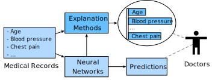

# Overview of Model Explainability

Deep neural networks have achieved breakthrough achievements in recent years. However, they are often criticized for being non-transparent as they are too complex to be comprehended by humans, and their working mechanism is a myth. As a result, many AI practitioners and domain experts (e.g., doctors and policymakers) do not have confidence in these algorithms. To bridge this trust gap, we need to uncover the black boxes and make deep neural networks transparent.

Imagine that a hospital deployed a neural network classifier to predict whether patients have heart disease based on their medical records with attributes such as age, gender, blood pressure, and cholesterol :numref:`fig_xdl-intro`. Chances are that the doctors in the hospital will not trust the classifier. An effective way to increase their willingness to trust the classifier's outputs is producing explanations for the predictions. If the explanations show that the classifier performs consistent with the doctors' expertise (e.g., putting more weights on high risky factors such as the patients' blood pressure, cholesterol level, and electrocardiogram), the doctors may be more likely to use the classifier as an assistant when making decisions. Note that this is a simplified example. Making clinical decisions is an intricate errand and some studies suggest that explainability methods did not alter intended physician behavior :cite:`diprose2020physician`.

:label:`fig_xdl-intro`

In recent years, methods that can produce human-understandable explanations for black-box models (e.g., neural networks) are gaining popularity. The advantages of providing explanations are multifold: it can help earn the trust of end users (e.g., practitioners and domain experts) and boost model adoption and deployment; high-quality explanations can help detect model biases, speed up model debugging processes, strengthen model robustness, and even provide recourse to individuals who are adversely affected by model predictions.

In this chapter, we will give a thorough introduction to model explainability (or interpretability, and they are used interchangeably in this chapter) to enable you to (1) get hands-on experiences in analyzing and explaining black-box models (especially deep learning models); (2) be familiar with popular and state-of-the-art algorithms on model explainability; (3) be aware of the perils and pitfalls in the domain.

## Taxonomies in Model Explainability

*Explainability* in machine learning is the degree to which a human can understand the cause of a decision made by a machine learning model. As shown in :numref:`fig_xdl-intro`, explanation methods take the data and the black-box model as inputs and provide users with human-comprehensible explanations. Before delving into actual approaches for explainability, it is worthwhile to know what forms of explanations you can expect and what types of explanation methods you will encounter in subsequent sections.

**Forms of explanations:**
Explanations come in various forms. It can be simple formats such as numerical feature importance values, saliency maps, readable sentences, and graphs, or complex formats such as a bunch of representative instances or a simple model that can be used to approximate an opaque model.

**Stakeholders of explanation methods:**
The stakeholders can be end-users who are directly affected by the AI decisions, AI practitioners who design and implement the AI models, domain experts who will refer to the explanation methods when making decisions, business owners who are responsible for ensuring AI systems to be aligned with corporate strategies, and governments who should regulate the usage of AI algorithms.

**Inherently interpretable models vs. post-hoc explanation methods:**
While some conventional machine learning models :cite:`Bishop.2006` such as linear regression, logistic regression, naive Bayes classifier, k-nearest neighbors, decision trees, decision set, and generalized additive models (GAMs) :cite:`Hastie.Tibshirani.2017` are *inherently explainable* (or *self-explanatory*), most *black-box models* (deep neural networks, random forests :cite:`Breiman.2001`, support vector machines :cite:`Scholkopf.Smola.2002`, XGBoost :cite:`Chen.Guestrin.2016`, etc.) that are often demonstrated to be more effective in real-world applications are challenging to interpret. There is usually a tradeoff between the predictive accuracy and how easy the model is to interpret. As such, we need post-hoc explanation methods to interpret these black-box models.

**Global explanations vs. local explanations:**
Pertaining the scope of explanations, we can classify explanations into *global explanations* and *local explanations*. Global explanation methods describe the average behavior of a black-box model. A typical global explanation method is the global feature importance plot that displays how much impact on average each feature has for model predictions. On the contrary, local explanation methods are centered around the prediction of each instance and focus on explaining how a specific prediction is obtained for an individual instance. For example, local explanation methods for image classifiers allow us to understand which pixels make an image be classified as a bird. Moreover, local explanations are helpful to vet if individual predictions are being made for the right reasons (e.g., whether gender is heavily used when predicting the eligibility of loan applicants). 

**Model-agnostic methods vs. model-specific methods:**
Based on the applicability of explanation methods, we have *model-agnostic* explanation methods and *model-specific* explanation methods. The former is more flexible and can be applied to any black-box model regardless of its structure, while the latter is limited to specific model classes.

## Desired Properties of Explanations
There are no standard evaluation measures on explainability. Still, the following dimensions, which might be challenging to quantify rigorously, can be considered as guiding intuitions when developing or evaluating explanation methods:

* Fidelity (or Faithfulness): how well the explanation model captures the black box models. For instance, if we use a surrogate model (i.e., self-explanatory models) to mimic a black-box model, we can check if it can give the same outputs as the original model. We can also measure the fidelity by checking whether the prediction changes if the supposedly important features are flipped.
* Comprehensibility: to what extent the explanations are humanly comprehensible. Explanations should be aligned to the target user's vocabulary. An explanation that is comprehensible to machine learning engineers or domain experts does not necessarily be understandable to common users.
* Stability: to what extent the explanations are similar for similar inputs. The explanations of two similar inputs shall not differ from one another drastically.
* Transparency:  the opposite of opaque or black boxes. Transparency can be achieved at three levels: simulatability, decomposability, and algorithmic transparency :cite:`Lipton.2018`. A model is simulatable if a human user can comprehend the entire model at once. A model is decomposable if each of its parts (e.g., input, parameters, calculation) admits an intuitive explanation. Finally, algorithmic transparency means that the learning process used to develop a model is understandable.

Other dimensions such as simplicity (simpler explanations are generally preferred), causality (whether it reflects the causal relationships), and generality (whether the method requires restrictions) might also be taken into consideration.

Note that explanations only present a partial view of black-box models. The goal is not to explain everything, but to provide explanations just enough for accomplishing a task. If the explanation model can mimic everything, we will not need black-box models anymore.

## Perils and Pitfalls

Given that model explainability is a fast-growing research area, many unresolved questions and concerns are still lingering. Practitioners and researchers are worried about the efficacy of the existing explanation methods. Unlike traditional classification or regression tasks, there are no "gold" labels for evaluating explanations. As a result, no consensus has been reached on which method is better. What's worse, explanations generated by various methods can disagree with each other drastically, and contradictory explanations are not uncommon :cite:`Krishna.Han.Gu.ea.2022`. Disparate explanations can be produced by one method with different seeds or baselines. Human-in-the-loop evaluations are adopted in many pieces of literature but it is costly and difficult to scale. Researchers also advocate that inherently interpretable models, rather than black-box models, should be adopted in high-stake scenarios :cite:`Rudin.2019`. However, black-box models significantly outperform inherently interpretable models and even humans in many domains. 

We will lay out this chapter by first introducing global explanation methods (e.g., error analysis and ablative studies) and then local explanation methods (e.g., gradient-based methods :cite:`Sundararajan.Taly.Yan.2017`, local interpretable model-agnostic explanations (LIME) :cite:`Ribeiro.Singh.Guestrin.2016`, and SHAP variants :cite:`Lundberg.Lee.2017`). Also, bear in mind that the described methods are not de facto solutions, and many critical issues remain underexplored

## Summary

* Model explainability is essential to the usability of black-box models.
* Explanation methods can be model-agnostic or model-specific.
* Explanations can be on the entire model or at the instance level.
* Perils and pitfalls exist in explanation methods.

## Exercises
1. Can you name some scenarios where explanations are critical?
1. When should we use post-hoc explanation methods rather than self-explanatory methods?
