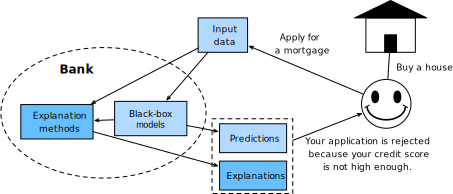

# Overview of Model Explainability

Artificial intelligence (AI) opens up unprecedented opportunities to numerous domains but also brings considerable concerns around trust, fairness, ethics, etc. When we put decisions into the hands of AI, we might suffer significant risks such as privacy violations and discrimination. The consequences may be catastrophic in some high-stakes domains such as medicine, finance, and law. For example, a physician will put a patient's life at risk if he/she blindly trusts a lung cancer detection model. Unsurprisingly, many AI practitioners and domain experts (e.g., doctors, policymakers) do not have confidence in AI-based decisions. The case is even worse for black-box models such as deep neural networks, as they are often criticized for being non-transparent and non-interpretable. These black-box algorithms are too complex to be comprehended by humans, and the working mechanism is a myth. To bridge this trust gap, we need to uncover the black boxes and make AI models transparent across processes and predictions.


Imagine that you applied for a mortgage from a bank to buy your first dream house, and your application was rejected ruthlessly by a black-box loan eligibility prediction model, which gets your heart broken. Still, you do not want to lose your dream home, so you decide to reapply. At this time, you may wonder if there is any method to increase the chances of getting your application approved. This is when explanations come into play. If the bank also provides explanations for the rejection, indicating that it is mainly because of your low credit score, you are not clueless now. You can try to raise your credit score by paying your credit card bills more regularly before resubmitting your application. The explanations are also valuable for auditors/regulators to check for the reasonableness of model predictions and vet if the model is suitable for a broader deployment.



:label:`xdl_intro`

In recent years, developing explanations methods that can produce human-understandable explanations for AI predictions is gaining popularity. Explanations are so crucial that the European Union [General Data Protection Regulation](https://en.wikipedia.org/wiki/General_Data_Protection_Regulation) mandates a "right to explanation" from AI models, i.e., an individual has the right to be given an explanation for an output of an AI algorithm. Transparency and explainability are also part of the Organisation for Economic Co-operation and Development (OECD)  [AI principles](https://oecd.ai/en/ai-principles). By equipping AI models with explanations, we will provide recourse to individuals who are adversely affected by model predictions and earn the trust of AI practitioners and domain experts, which can boost the adoption and development of AI models. Moreover, good explanations can help detect model biases, ensure model fairness, speed up model debugging processes, strengthen model robustness, and even avoid privacy breaches.

In this chapter, we will give a thorough introduction to model explainability (or interpretability, they are used interchangeably in this chapter) to enable readers to (1) get hands-on experiences in analyzing and explaining black-box models; (2) be familiar with popular and state-of-the-art algorithms on model explainability; (3) be aware of the perils and pitfalls existing in the domain.


## Taxonomies in Model Explainability

Explainability in machine learning is the degree to which a human can understand the cause of a decision made by a machine learning model. As shown in Figure :numref:`xdl_intro`, explanation methods take the data and the black-box model as inputs and provide users with human-comprehensible explanations. Before delving into actual approaches for explainability, it is worthwhile to know what forms of explanations you can expect and what types of explanation methods you will encounter in future sections.

**Forms of explanations:**
Explanations come in various forms. It can be simple formats such as numerical feature importance values, saliency maps, readable sentences, and graphs, or complex formats such as a bunch of representative instances or a simple model that can be used to approximate an opaque model.

**Stakeholders of explanation methods:**
The stakeholders can be end-users who are directly affected by the AI decisions, AI practitioners who design and implement the AI models, domain experts who will refer to the explanation methods when making decisions, business owners who are responsible for ensuring AI systems to be aligned with corporate strategies, and governments who should regulate the usage of AI algorithms.

**Inherently interpretable models vs. post-hoc explanation methods:**
While some conventional machine learning models :cite:`Bishop.2006` such as linear regression, logistic regression, naive Bayes classifier, k-nearest neighbors, decision trees, decision set, and generalized additive models (GAMs) :cite:`Hastie.Tibshirani.2017` are inherently explainable, most black-box models (e.g., deep neural networks, random forests :cite:`Breiman.2001`, support vector machines :cite:`Scholkopf.Smola.2002`, XGBoost :cite:`Chen.Guestrin.2016`, etc.) which are often demonstrated to be more effective in real-world applications are challenging to interpret. There is usually a tradeoff between the predictive accuracy and how easy the model is to interpret.

**Global explanations vs. local explanations:**
Pertaining the scope of explanations, we can classify explanations into global explanations and local explanations. Global explanation methods describe the average behavior of a black-box model. A typical global explanation method is the global feature importance plot which displays how much impact each feature has on average for model predictions. On the contrary, local explanation methods are centered around the prediction of each instance and focus on explaining how a specific prediction is obtained for an individual instance. For example, we will know which pixels make an image be classified as a bird via local explanation methods for image classifiers. Local explanations are helpful to vet if individual predictions are being made for the right reasons.

**Model-agnostic methods vs. model-specific methods:**
Based on the applicability of explanation methods, we have model agnostic explanation methods and model-specific explanation methods. The former is more flexible and can be applied to any black-box model regardless of its structure, while the latter is limited to specific model classes.


## Desired Properties of Explanations
There are no standard evaluation measures on explainability. Still, the following dimensions, which might be challenging to quantify rigorously, can be considered as guiding intuitions when developing or evaluating explanation methods:

* Fidelity (or Faithfulness): How well does the explanation model capture the black box models. For instance, if we use a surrogate model to mimic a black-box model, we can check if it can give the same outputs as the original model. We can also measure the fidelity by checking whether the prediction changes if the supposedly important features are flipped.
* Comprehensibility: To what extent the explanations are humanly comprehensible. Explanations should be aligned to the target user's vocabulary. An explanation that is comprehensible to machine learning engineers or domain experts does not necessarily be understandable to common users.
* Stability: The extent to which the explanations are similar for similar inputs. The explanations of two similar inputs shall not differ from one another drastically.
* Transparency: It is the opposite of opaque or black boxes. Transparency can be achieved at three levels: simulatability, decomposability, and algorithmic transparency :cite:`Lipton.2018`. A model is simulatable if a human user can comprehend the entire model at once. A model is decomposable if each of its parts (e.g., input, parameters, calculation) admits an intuitive explanation. Finally, algorithmic transparency means that the learning process used to develop a model is understandable.

Other dimensions such as simplicity (simpler explanations are generally preferred), causality (whether it reflects the causal relationships), and generality (whether the method requires restrictions) might also be taken into consideration.

Note that explanations only present a partial view of black-box models. It is not about explaining everything but understanding enough to accomplish the task. If the explanation model can mimic everything, we will not need black models anymore.

## Perils and Pitfalls

Given that model explainability is a fast-growing research area, many unresolved questions and concerns are still lingering. Practitioners and researchers are worried about the efficacy of existing explanation methods. Unlike traditional classification or regression tasks, there are no "gold" labels for evaluating explanations. As a result, no consensus has been reached on which method is better. What's worse, explanations generated by various methods can disagree with each other drastically, and contradictory explanations are not uncommon :cite:`Krishna.Han.Gu.ea.2022`; Disparate explanations can be produced by one method with different seeds or baselines. Human-in-the-loop evaluations are adopted in many pieces of literature but it is costly and difficult to scale. Researchers also advocate that inherently interpretable models, rather than black-box models, should be adopted in high-stake scenarios :cite:`Rudin.2019`. However, black-box models significantly outperform inherently interpretable models and even humans in many domains. We will give a more comprehensive discussion in later sections.

We will lay out this chapter by first introducing global explanation methods (e.g., error analysis, ablative studies, etc.) and then local explanation methods (e.g., gradient-based methods :cite:`Sundararajan.Taly.Yan.2017`, local interpretable model-agnostic explanations (LIME) :cite:`Ribeiro.Singh.Guestrin.2016`, SHAP variants :cite:`Lundberg.Lee.2017`, etc.). Readers shall bear in mind that the described methods are not de facto solutions, and many critical issues remain underexplored

## Summary

* Model explainability is essential to the usability of black-box models.
* Explanation methods can be model-agnostic or model-specific.
* Explanations can be on the entire model or at the instance level.
* Perils and pitfalls exist in explanation methods.

```{.python .input}

```
