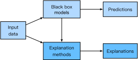

Artificial intelligence (AI) opens up unprecedented opportunities to numerous domains as well as brings considerable concerns around trust, fairness, ethics, etc. When we put decisions into the hands of AI, we might suffer significant risks such as privacy violations and discrimination. In some high stakes domains such as medicine, finance, and law, the consequences may be catastrophic. For instance, if a physician blindly trusts a lung cancer detection model, he/she are putting at risk the patient's life; if auditors mindlessly rely on the prediction of a fraudster detection model, they may cause financial losses and lose customers' trust. Unsurprisingly, many AI practitioners and domain experts (e.g., doctors, policy makers) do not have confidence in AI-based decisions and the case is even worse for black-box models such as deep neural networks as they are often criticized to be non-transparent and non-interpretable. These black-box algorithms are too complex to be comprehended by humans and the working mechanic is a myth.

To bridge this trust gap, we need to uncover the black boxes and make the AI models transparent across processes and predictions. This is why developing explanations methods which can produce human-understandable explanations for AI predictions is gaining popularity. Explanations are so important that the European Union [General Data Protection Regulation](https://en.wikipedia.org/wiki/General_Data_Protection_Regulation) mandates a “right to explanation” from AI models, i.e., an individual has the right to be given an explanation for an output of an AI algorithm. Equipping AI models with explanations, we can earn the trust of practitioners and domain experts more easily, which boosts the adoption and development of AI models in turn. Moreover, good explanations can help detect model biases, ensure model fairness, speed up model debugging processes, strengthen the model robustness, and even avoid privacy breaches.

In this chapter, we will give a thorough introduction to model explainability (or interpretability, they are used interchangeably in this chapter) with the goal of enabling readers to: get hands-on experiences on analyzing and explaining black box models; be familiar with popular and state-of-the-art algorithms on model explainability; be aware of the perils and pitfalls existing in the domain.

## Taxonomies in model explainability

Explainability in machine learning is the degree to which a human can understand the cause of a decision made by a machine learning model. As shown in Figure :numref:`xdl_intro`, explanation methods take as inputs the data and the black box model, and provide users with human-comprehensible explanations which are utilized to assist the decision-making process.

:label:xdl_intro

Before delving into actual approaches for explainability,  it is worthwhile to know what forms of explanations you can expect and what types of explanation methods you will encounter in future sections.

### Forms of Explanations
Explanations come in various forms. It can not only be simple formats such as numerical feature importance values, saliency maps, readable sentences, graphs, and bar plots, but also be a bunch of representative instances or a simple model which can be used to approximate an opaque model.

### Inherently interpretable models vs. post-hoc explanations
While some conventional machine learning models:cite:`Bishop.2006` such as linear regression, logistic regression, naive Bayes classifier, k-nearest neighbors, decision trees, decision set, and generalized additive models (GAMs):cite:`Hastie.Tibshirani.2017` are inherently explainable, most black box models (e.g., deep neural networks, random forests:cite:`Breiman.2001`, support vector machines:cite:`Scholkopf.Smola.2002`, XGBoost:cite:`Chen.Guestrin.2016`, etc) which are often demonstrated to be more effective in many real-world applications are not. In recent years, a variety of approaches are proposed to enhance the explainability of black box models. 

### Global explanations vs. local explanations
Pertaining the scope of explanations, we can classify explanations into global explanations and local explanations. Global explanation methods describe the average behavior of a black box model. A typical global explanation method is the global feature importance plot which displays how much impact each feature has on average for model predictions. On the contrary, local explanation methods are centered around the prediction of each instance and focus on explaining how a certain prediction is obtained for an individual instance. For instance, we will know which pixels make an image to be classified as a bird via local explanation methods for image classifiers.

### Model-agnostic methods vs. model specific methods
Based on the applicability of explanation methods, we have model agnostic explanation methods and model specific explanation methods. The former is more flexible and can be applied to any black box model regardless of its structure while the latter is limited to specific model classes.

## Desired properties of eplanations 
There is no standard evaluation measures on explainability but the following dimensions, which might be difficult to quantify rigorously, can be considered as guiding intuitions when developing or evaluating explanation methods:
* Fidelity (or Faithfulness) : How well does the explanation model capture the black box models. For instance, if we use a surrogate model to mimic a black box model, we can check if it can give the same outputs as the original model.
* Comprehensibility: To what extent the explanations are humanly comprehensible. Explanations should be aligned to the target user's vocabulary. An  explanation which is comprehensible to machine learning engineers or domain experts does not necessarily be understandable to common users.
* Stability: The extent to which the explanations are similar for similar inputs. The explanations on two similar inputs shall not differ to one another drastically.
* Transparency: It is the opposite of opaque or black-boxes. Transparency can be measured by asking: how were the data collected and processed and how does the model work? In particular, we can check whether the each part of the model (i.e., input, parameter, and calculation) the error surface are understandable:cite:`Lipton.2018`.

Other dimensions such as simplicity (simpler explanations are generally preferred), causality (whether it reflects the causal relationships), generality (whether the method requires restrictions) might also be taken into consideration.

Note that explanations only present a partial view of black box models. It is not about explaining everything but understanding enough to accomplish the task at hand. If the explanation model can mimic everything, we will not need black models anymore.

## Perils and pitfalls

Given that model explanability is a fast growing research area, many unresolved questions and concerns are still lingering. Practitioners and researchers are worried about the efficacy of existing explanation methods. Unlike traditional classification or regression tasks, there does not exist any "gold" labels for evaluating explanations. As a result, no consensus has been arrived at so far on which method is better or worse. What's worse, explanations generated by various methods can disagree with each other and contradictory explanations are not uncommon:cite:`Krishna.Han.Gu.ea.202`; Disparate explanations can be produced by one method with different seeds or baselines. To remedy these issues, human-in-the-loop evaluations are employed in many literatures, but it is costly and human's opinions can be very subjective on this matter. Researchers also advocate that inherently interpretable models, rather than black box models, should be adopted in high-stake scenarios:cite:`Rudin.2019`. However, it has been demonstrated that black box models significantly outperform inherently interpretable models, and even humans, in many domains. In any case, many critical issues still remain unexplored. We will give a more comprehensive discussion in later sections.

We will lay out this chapter by first introducing global explanation methods (e.g., error analysis, ablative studies, etc) and then local explanation methods (e.g., gradient based methods:cite:`Sundararajan.Taly.Yan.2017`, local interpretable model-agnostic explanations (LIME):cite:`Ribeiro.Singh.Guestrin.2016`, SHAP variants:cite:`Lundberg.Lee.2017`, etc). Readers shall bear in mind that the described methods are not de facto solutions and pitfalls might exist.

## Summary

* Model explainability is essential to the usability of black box models.
* Explanation methods can be model-agnostic or model-specific.
* Explanations can be on the entire model as well as instance level.
* Perils and pitfalls exist in explanation methods.
