# Introduction to Gaussian Processes

In many cases, machine learning amounts to estimating parameters from data. These parameters are often numerous and relatively uninterpretable --- such as the weights of a neural network. Gaussian processes, by contrast, provide a mechanism for directly reasoning about the high-level properties of functions that could fit our data. For example, we may have a sense of whether these functions are quickly varying, periodic, involve conditional independencies, or translation invariance. Gaussian processes enable us to easily incorporate these properties into our model, by directly specifying a Gaussian distribution over the function values that could fit our data. 

Let's get a feel for how Gaussian processes operate, by starting with some examples.

Suppose we observe the following dataset, of regression targets (outputs), $y$, indexed by inputs, $x$. As an example, the targets could be changes in carbon dioxide concentrations, and the inputs could be the times at which these targets have been recorded. What are some features of the data? How quickly does it seem to varying? Do we have data points collected at regular intervals, or are there missing inputs? How would you imagine filling in the missing regions, or forecasting up until $x=25$?

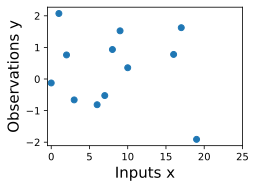

In order to fit the data with a Gaussian process, we start by specifying a prior distribution over what types of functions we might believe to be reasonable. Here we show several sample functions from a Gaussian process. Does this prior look reasonable? Note here we are not looking for functions that fit our dataset, but instead for specifying reasonable high-level properties of the solutions, such as how quickly they vary with inputs. Note that we will see code for reproducing all of the plots in this notebook, in the next notebooks on priors and inference.

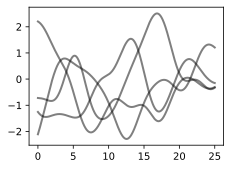

Once we condition on data, we can use this prior to infer a posterior distribution over functions that could fit the data. Here we show sample posterior functions.

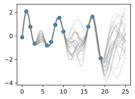

We see that each of these functions are entirely consistent with our data, perfectly running through each observation. In order to use these posterior samples to make predictions, we can average the values of every possible sample function from the posterior, to create the curve below, in thick blue. Note that we do not actually have to take an infinite number of samples to compute this expectation; as we will see later, we can compute the expectation in closed form. 

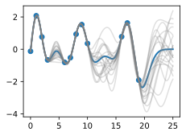

We may also want a representation of uncertainty, so we know how confident we should be in our predictions. Intuitively, we should have more uncertainty where there is more variability in the sample posterior functions, as this tells us there are many more possible values the true function could take. This type of uncertainty is called _epistemic uncertainty_, which is the _reducible uncertainty_ associated with lack of information. As we acquire more data, this type of uncertainty disappears, as there will be increasingly fewer solutions consistent with what we observe. Like with the posterior mean, we can compute the posterior variance (the variability of these functions in the posterior) in closed form. With shade, we show two times the posterior standard deviation on either side of the mean, creating a _credible interval_ that has a 95% probability of containing the true value of the function for any input $x$.

The plot looks somewhat cleaner if we remove the posterior samples, simply visualizing the data, posterior mean, and 95% credible set. Notice how the uncertainty grows away from the data, a property of epistemic uncertainty. 

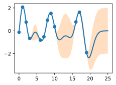

The properties of the Gaussian process that we used to fit the data are strongly controlled by what's called a _covariance function_, also known as a _kernel_. The covariance function we used is called the _RBF (Radial Basis Function) kernel_, which has the form
$$ k_{\text{RBF}}(x,x') = \mathrm{Cov}(f(x),f(x')) = a^2 \exp\left(-\frac{1}{2\ell^2}||x-x'||^2\right) $$

The _hyperparameters_ of this kernel are interpretable. The _amplitude_ parameter $a$ controls the vertical scale over which the function is varying, and the _length-scale_ parameter
$\ell$
controls the rate of variation (the wiggliness) of the function. Larger $a$ means larger function values, and larger 
$\ell$ 
means more slowly varying functions. Let's see what happens to our sample prior and posterior functions as we vary $a$ and 
$\ell$. 

The _length-scale_ has a particularly pronounced effect on the predictions and uncertainty of a GP. At 
$||x-x'|| = \ell$
, the covariance between a pair of function values is $a^2\exp(-0.5)$. At larger distances than 
$\ell$
, the values of the function values becomes nearly uncorrelated. This means that if we want to make a prediction at a point $x_*$, then function values with inputs $x$ such that 
$||x-x'||>\ell$
will not have a strong effect on our predictions. 

Let's see how changing the lengthscale affects sample prior and posterior functions, and credible sets. The above fits use a length-scale of $2$. Let's now consider 
$\ell = 0.1, 0.5, 2, 5, 10$
. A length-scale of $0.1$ is very small relative to the range of the input domain we are considering, $25$. For example, the values of the function at $x=5$ and $x=10$ will have essentially no correlation at such a length-scale. On the other hand, for a length-scale of $10$, the function values at these inputs will be highly correlated. Note that the vertical scale changes in the following figures.

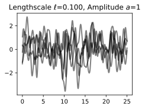
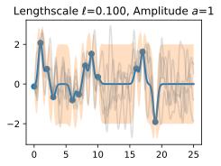

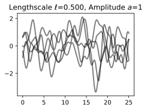
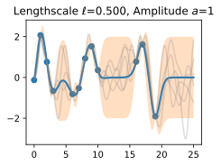

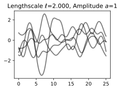
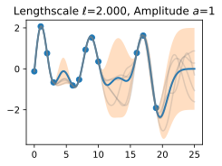

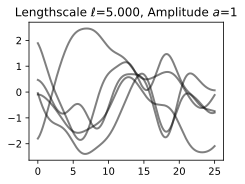
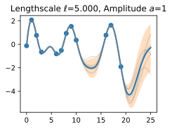

Notice as the length-scale increases the 'wiggliness' of the functions decrease, and our uncertainty decreases. If the length-scale is small, the uncertainty will quickly increase as we move away from the data, as the datapoints become less informative about the function values. 

Now, let's vary the amplitude parameter, holding the length-scale fixed at $2$. Note the vertical scale is held fixed for the prior samples, and varies for the posterior samples, so you can clearly see both the increasing scale of the function, and the fits to the data.

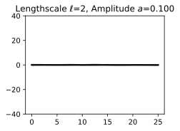
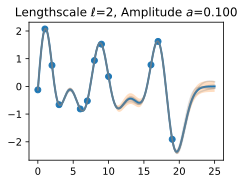

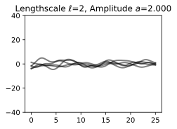
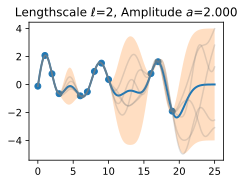

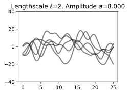
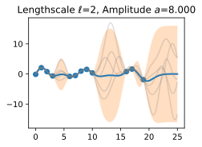

We see the amplitude parameter affects the scale of the function, but not the rate of variation. At this point, we also have the sense that the generalization performance of our procedure will depend on having reasonable values for these hyperparameters. Values of $\ell=2$ and $a=1$ appeared to provide reasonable fits, while some of the other values did not. Fortunately, there is a robust and automatic way to specify these hyperparameters, using what is called the _marginal likelihood_, which we will return to in the notebook on inference. 

So what is a GP, really? As we started, a GP simply says that any collection of function values 
$f(x_1),\dots,f(x_n)$, 
indexed by any collection of inputs 
$x_1,\dots,x_n$ 
has a joint multivariate Gaussian distribution. The mean vector $\mu$ of this distribution is given by a _mean function_, which is typically taken to be a constant or zero. The covariance matrix of this distribution is given by the _kernel_ evaluated at all pairs of the inputs $x$. 

$$\begin{bmatrix}f(x) \\f(x_1) \\ \vdots \\ f(x_n) \end{bmatrix}\sim \mathcal{N}\left(\mu, \begin{bmatrix}k(x,x) & k(x, x_1) & \dots & k(x,x_n) \\ k(x_1,x) & k(x_1,x_1) & \dots & k(x_1,x_n) \\ \vdots & \vdots & \ddots & \vdots \\ k(x_n, x) & k(x_n, x_1) & \dots & k(x_n,x_n) \end{bmatrix}\right)$$
:eqlabel:`eq_gp_prior`

Equation :eqref:`eq_gp_prior` specifies a GP prior. We can compute the conditional distribution of $f(x)$ for any $x$ given $f(x_1), \dots, f(x_n)$, the function values we have observed. This conditional distribution is called the _posterior_, and it is what we use to make predictions.

In particular, 

$$f(x) | f(x_1), \dots, f(x_n) \sim \mathcal{N}(m,s^2)$$ 

where

$$m = k(x,x_{1:n}) k(x_{1:n},x_{1:n})^{-1} f(x_{1:n})$$ 

$$s^2 = k(x,x) - k(x,x_{1:n})k(x_{1:n},x_{1:n})^{-1}k(x,x_{1:n})$$ 

where $k(x,x_{1:n})$ is a $1 \times n$ vector formed by evaluating $k(x,x_{i})$ for $i=1,\dots,n$ and $k(x_{1:n},x_{1:n})$ is an $n \times n$ matrix formed by evaluating $k(x_i,x_j)$ for $i,j = 1,\dots,n$. $m$ is what we can use as a point predictor for any $x$, and $s^2$ is what we use for uncertainty: if we want to create an interval with a 95% probability that $f(x)$ is in the interval, we would use $m \pm 2s$. The predictive means and uncertainties for all the above figures were created using these equations. The observed data points were given by 
$f(x_1), \dots, f(x_n)$
and chose a fine grained set of $x$ points to make predictions.

Let's suppose we observe a single datapoint, $f(x_1)$, and we want to determine the value of $f(x)$ at some $x$. Because $f(x)$ is described by a Gaussian process, we know the joint distribution over 
$(f(x), f(x_1))$ 
is Gaussian: 

$$
\begin{bmatrix}
f(x) \\ 
f(x_1) \\
\end{bmatrix}
\sim
\mathcal{N}\left(\mu, 
\begin{bmatrix}
k(x,x) & k(x, x_1) \\
k(x_1,x) & k(x_1,x_1)
\end{bmatrix}
\right)
$$

The off-diagonal expression $k(x,x_1) = k(x_1,x)$ 
tells us how correlated the function values will be --- how strongly determined $f(x)$
will be from $f(x_1)$. 
We have seen already that if we use a large length-scale, relative to the distance between $x$ and $x_1$, 
$||x-x_1||$, then the function values will be highly correlated. We can visualize the process of determining $f(x)$ from $f(x_1)$ both in the space of functions, and in the joint distribution over $f(x_1), f(x)$. Let's initially consider an $x$ such that $k(x,x_1) = 0.9$, and $k(x,x)=1$, meaning that the value of $f(x)$ is moderately correlated with the value of $f(x_1)$. In the joint distribution, the contours of constant probability will be relatively narrow ellipses.

Suppose we observe $f(x_1) = 1.2$. 
To condition on this value of $f(x_1)$, 
we can draw a horizontal line at $1.2$ on our plot of the density, and see that the value of $f(x)$ 
is mostly constrained to $[0.64,1.52]$. We have also drawn this plot in function space, showing the observed
point $f(x_1)$ in orange, and 1 standard deviation of the Gaussian process predictive distribution for $f(x)$ 
in blue, about the mean value of $1.08$.

Now suppose we have a stronger correlation, $k(x,x_1) = 0.95$. 
Now the ellipses have narrowed further, and the value of $f(x)$ 
is even more strongly determined by $f(x_1)$. Drawing a horizontal line at $1.2$, we see the contours for $f(x)$
support values mostly within $[0.83, 1.45]$. Again, we also show the plot in function space, with one standard 
deviation about the mean predictive value of $1.14$.

We see that the posterior mean predictor of our Gaussian process is closer to $1.2$, because there is now a stronger correlation. We also see that our uncertainty (the error bars) have somewhat decreased. Despite the strong correlation between these function values, our uncertainty is still righly quite large, because we have only observed a single data point! 

This procedure can give us a posterior on $f(x)$ for any $x$, for any number of points we have observed. Suppose we observe $f(x_1), f(x_2)$. We now visualize the posterior for $f(x)$ at a particular $x=x'$ in function space. The exact distribution for $f(x)$ is given by the above equations. $f(x)$ is Gaussian distributed, with mean 

$$m = k(x,x_{1:3}) k(x_{1:3},x_{1:3})^{-1} f(x_{1:3})$$

and variance 

$$s^2 = k(x,x) - k(x,x_{1:3})k(x_{1:3},x_{1:3})^{-1}k(x,x_{1:3})$$

In this introductory notebook, we have been considering _noise free_ observations. As we will see, it is easy to include observation noise. If we assume that the data are generated from a latent noise free function $f(x)$ plus iid Gaussian noise 
$\epsilon(x) \sim \mathcal{N}(0,\sigma^2)$
with variance $\sigma^2$, then our covariance function simply becomes 
$k(x_i,x_j) \to k(x_i,x_j) + \delta_{ij}\sigma^2$,
where $\delta_{ij} = 1$ if $i=j$ and $0$ otherwise.

We have already started getting some intuition about how we can use a Gaussian process to specify a prior and posterior over solutions, and how the kernel function affects the properties of these solutions. In the following notebooks, we will precisely show how to specify a Gaussian process prior, introduce and derive various kernel functions, and then go through the mechanics of how to automatically learn kernel hyperparameters, and form a Gaussian process posterior to make predictions. While it takes time and practice to get used to concepts such as a "distributions over functions", the actual mechanics of finding the GP predictive equations is actually quite simple --- making it easy to get practice to form an intuitive understanding of these concepts.

## Summary

In typical machine learning, we specify a function with some free parameters (such as a neural network and its weights), and we focus on estimating those parameters, which may not be interpretable. With a Gaussian process, we instead reason about distributions over functions directly, which enables us to reason about the high-level properties of the solutions. These properties are controlled by a covariance function (kernel), which often has a few highly interpretable hyperparameters. These hyperparameters include the _length-scale_, which controls how rapidly (how wiggily) the functions are. Another hyperparameter is the amplitude, which controls the vertical scale over which our functions are varying. 
Representing many different functions that can fit the data, and combining them all together into a predictive distribution, is a distinctive feature of Bayesian methods. Because there is a greater amount of variability between possible solutions far away from the data, our uncertainty intuitively grows as we move from the data. 

A Gaussian process represents a distribution over functions by specifying a multivariate normal (Gaussian) distribution over all possible function values. It is possible to easily manipulate Gaussian distributions to find the distribution of one function value based on the values of any set of other values. In other words, if we observe a set of points, then we can condition on these points and infer a distribution over what the value of the function might look like at any other input. How we model the correlations between these points is determined by the covariance function and is what defines the generalization properties of the Gaussian process. While it takes time to get used to Gaussian processes, they are easy to work with, have many applications, and help us understand and develop other model classes, like neural networks.

## Exercises

1. What is the difference between epistemic uncertainty versus observation uncertainty?
2. Besides rate of variation and amplitude, what other properties of functions might we want to consider, and what would be real-world examples of functions that have those properties?
3. The RBF covariance function we considered says that covariances (and correlations) between observations decrease with their distance in the input space (times, spatial locations, etc.). Is this a reasonable assumption? Why or why not?
4. Is a sum of two Gaussian variables Gaussian? Is a product of two Gaussian variables Gaussian? If (a,b) have a joint Gaussian distribution, is a|b (a given b) Gaussian? Is a Gaussian?
5. Repeat the exercise where we observe a data point at $f(x_1) = 1.2$, but now suppose we additionally observe $f(x_2) = 1.4$. Let $k(x,x_1) = 0.9$, and $k(x,x_2) = 0.8$. Will we be more or less certain about the value of $f(x)$, than when we had only observed $f(x_1)$? What is the mean and 95\% credible set for our value of $f(x)$ now? 
6. Do you think increasing our estimate of observation noise would increase or decrease our estimate of the length-scale of the ground truth function?
7. As we move away from the data, suppose the uncertainty in our predictive distribution increases to a point, then stops increasing. Why might that happen?

:begin_tab:`pytorch`
[Discussions](https://discuss.d2l.ai/t/12115)
:end_tab:
