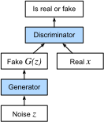

# Generative Adversarial Networks
:label:`sec_basic_gan` 

 Tout au long de ce livre, nous avons parlé de la manière de faire des prédictions. Sous une forme ou une autre, nous avons utilisé des réseaux neuronaux profonds pour apprendre des correspondances entre des exemples de données et des étiquettes. Ce type d'apprentissage est appelé apprentissage discriminatif, comme dans l'exemple suivant : nous aimerions pouvoir faire la distinction entre les photos de chats et les photos de chiens. Les classificateurs et les régresseurs sont deux exemples d'apprentissage discriminant. Les réseaux neuronaux formés par rétropropagation ont bouleversé tout ce que nous pensions savoir sur l'apprentissage discriminatif sur de grands ensembles de données complexes. La précision de la classification sur des images à haute résolution est passée d'un niveau inutile à un niveau humain (avec quelques réserves) en seulement 5 ou 6 ans. Nous vous épargnerons un autre baratin sur toutes les autres tâches discriminantes pour lesquelles les réseaux neuronaux profonds obtiennent des résultats stupéfiants.

Mais l'apprentissage automatique ne se limite pas à la résolution de tâches discriminantes. Par exemple, étant donné un grand ensemble de données, sans aucune étiquette, nous pourrions vouloir apprendre un modèle qui capture de manière concise les caractéristiques de ces données. Avec un tel modèle, nous pourrions échantillonner des exemples de données synthétiques qui ressemblent à la distribution des données d'apprentissage. Par exemple, si l'on dispose d'un vaste corpus de photographies de visages, on peut générer une nouvelle image photoréaliste qui semble provenir du même ensemble de données. Ce type d'apprentissage est appelé modélisation générative.

Jusqu'à récemment, nous ne disposions d'aucune méthode permettant de synthétiser de nouvelles images photoréalistes. Mais le succès des réseaux neuronaux profonds pour l'apprentissage discriminatif a ouvert de nouvelles possibilités. L'une des grandes tendances de ces trois dernières années a été l'application des réseaux profonds discriminants pour surmonter des problèmes que nous ne considérons généralement pas comme des problèmes d'apprentissage supervisé. Les modèles de langage des réseaux neuronaux récurrents sont un exemple d'utilisation d'un réseau discriminant (formé pour prédire le prochain caractère) qui, une fois formé, peut agir comme un modèle génératif.

En 2014, un article révolutionnaire a présenté les réseaux adversatifs génératifs (GAN) :cite:`Goodfellow.Pouget-Abadie.Mirza.ea.2014` , une nouvelle façon intelligente de tirer parti de la puissance des modèles discriminatifs pour obtenir de bons modèles génératifs. Au cœur de ces réseaux, les GAN reposent sur l'idée qu'un générateur de données est bon si nous ne pouvons pas distinguer les données fausses des données réelles. En statistiques, on appelle cela un test à deux échantillons - un test pour répondre à la question de savoir si les ensembles de données $X=\{x_1,\ldots, x_n\}$ et $X'=\{x'_1,\ldots, x'_n\}$ ont été tirés de la même distribution. La principale différence entre la plupart des articles statistiques et les GAN est que ces derniers utilisent cette idée de manière constructive. En d'autres termes, plutôt que de se contenter d'entraîner un modèle pour dire "hé, ces deux ensembles de données ne semblent pas provenir de la même distribution", ils utilisent le site [two-sample test](https://en.wikipedia.org/wiki/Two-sample_hypothesis_testing) pour fournir des signaux d'entraînement à un modèle génératif. Cela nous permet d'améliorer le générateur de données jusqu'à ce qu'il génère quelque chose qui ressemble aux données réelles. Au minimum, il doit tromper le classificateur. Même si notre classificateur est un réseau neuronal profond à la pointe de la technologie.


:label:`fig_gan`


L'architecture du GAN est illustrée sur le site :numref:`fig_gan` .
Comme vous pouvez le constater, l'architecture GAN comporte deux parties : tout d'abord, nous avons besoin d'un dispositif (disons un réseau profond, mais il peut s'agir de n'importe quoi, par exemple un moteur de rendu de jeu) capable de générer des données qui ressemblent à la réalité. S'il s'agit d'images, ce dispositif doit générer des images. S'il s'agit de paroles, il doit générer des séquences audio, et ainsi de suite. Nous l'appelons le réseau générateur. Le deuxième composant est le réseau discriminateur. Il tente de distinguer les données fausses et réelles les unes des autres. Les deux réseaux sont en compétition l'un avec l'autre. Le réseau générateur tente de tromper le réseau discriminateur. À ce moment-là, le réseau discriminateur s'adapte aux nouvelles fausses données. Cette information, à son tour, est utilisée pour améliorer le réseau générateur, et ainsi de suite.


Le discriminateur est un classificateur binaire qui distingue si l'entrée $x$ est réelle (à partir de données réelles) ou fausse (à partir du générateur). En général, le discriminateur produit une prédiction scalaire $o\in\mathbb R$ pour l'entrée $\mathbf x$, par exemple en utilisant une couche entièrement connectée avec une taille cachée de 1, puis il applique une fonction sigmoïde pour obtenir la probabilité prédite $D(\mathbf x) = 1/(1+e^{-o})$. Supposons que l'étiquette $y$ pour les vraies données est $1$ et $0$ pour les fausses données. Nous entraînons le discriminateur pour minimiser la perte d'entropie croisée, *c'est-à-dire*,

$$ \min_D \{ - y \log D(\mathbf x) - (1-y)\log(1-D(\mathbf x)) \},$$ 

 Pour le générateur, il tire d'abord un paramètre $\mathbf z\in\mathbb R^d$ d'une source d'aléa, *c'est-à-dire*, une distribution normale $\mathbf z \sim \mathcal{N} (0, 1)$. Nous appelons souvent $\mathbf z$ la variable latente.
Il applique ensuite une fonction pour générer $\mathbf x'=G(\mathbf z)$. Le but du générateur est de tromper le discriminateur pour qu'il classe $\mathbf x'=G(\mathbf z)$ comme une vraie donnée, *c'est-à-dire*, nous voulons $D( G(\mathbf z)) \approx 1$.
En d'autres termes, pour un discriminateur donné $D$, nous mettons à jour les paramètres du générateur $G$ pour maximiser la perte d'entropie croisée lorsque $y=0$, *i.e.*,

$$ \max_G \{ - (1-y) \log(1-D(G(\mathbf z))) \} = \max_G \{ - \log(1-D(G(\mathbf z))) \}.$$ 

 Si le générateur fait un travail parfait, alors $D(\mathbf x')\approx 1$ alors la perte ci-dessus est proche de 0, ce qui résulte que les gradients sont trop petits pour faire un bon progrès pour le discriminateur. En général, nous minimisons donc la perte suivante :

$$ \min_G \{ - y \log(D(G(\mathbf z))) \} = \min_G \{ - \log(D(G(\mathbf z))) \}, $$ 

 ce qui revient à introduire $\mathbf x'=G(\mathbf z)$ dans le discriminateur mais en donnant l'étiquette $y=1$.


Pour résumer, $D$ et $G$ jouent un jeu "minimax" avec la fonction objectif globale :

$$min_D max_G \{ -E_{x \sim \text{Data}} log D(\mathbf x) - E_{z \sim \text{Noise}} log(1 - D(G(\mathbf z))) \}.$$ 

 

 De nombreuses applications des GANs se situent dans le contexte des images. À des fins de démonstration, nous allons nous contenter d'ajuster une distribution beaucoup plus simple dans un premier temps. Nous allons illustrer ce qui se passe si nous utilisons les GANs pour construire l'estimateur de paramètres le plus inefficace au monde pour une gaussienne. Commençons.

```{.python .input}
#@tab mxnet
%matplotlib inline
from d2l import mxnet as d2l
from mxnet import autograd, gluon, init, np, npx
from mxnet.gluon import nn
npx.set_np()
```

```{.python .input}
#@tab pytorch
%matplotlib inline
from d2l import torch as d2l
import torch
from torch import nn
```

```{.python .input}
#@tab tensorflow
from d2l import tensorflow as d2l
import tensorflow as tf
```

## Générer de "vraies" données

Comme il s'agit de l'exemple le plus minable du monde, nous générons simplement des données tirées d'une gaussienne.

```{.python .input}
#@tab mxnet, pytorch
X = d2l.normal(0.0, 1, (1000, 2))
A = d2l.tensor([[1, 2], [-0.1, 0.5]])
b = d2l.tensor([1, 2])
data = d2l.matmul(X, A) + b
```

```{.python .input}
#@tab tensorflow
X = d2l.normal((1000, 2), 0.0, 1)
A = d2l.tensor([[1, 2], [-0.1, 0.5]])
b = d2l.tensor([1, 2], tf.float32)
data = d2l.matmul(X, A) + b
```

Voyons ce que nous avons obtenu. Il devrait s'agir d'une gaussienne décalée d'une manière plutôt arbitraire avec une moyenne $b$ et une matrice de covariance $A^TA$.

```{.python .input}
#@tab mxnet, pytorch
d2l.set_figsize()
d2l.plt.scatter(d2l.numpy(data[:100, 0]), d2l.numpy(data[:100, 1]));
print(f'The covariance matrix is\n{d2l.matmul(A.T, A)}')
```

```{.python .input}
#@tab tensorflow
d2l.set_figsize()
d2l.plt.scatter(d2l.numpy(data[:100, 0]), d2l.numpy(data[:100, 1]));
print(f'The covariance matrix is\n{tf.matmul(A, A, transpose_a=True)}')
```

```{.python .input}
#@tab all
batch_size = 8
data_iter = d2l.load_array((data,), batch_size)
```

## Générateur

Notre réseau générateur sera le réseau le plus simple possible - un modèle linéaire à une couche. En effet, nous allons piloter ce réseau linéaire avec un générateur de données gaussien. Par conséquent, il n'a littéralement besoin d'apprendre que les paramètres pour simuler parfaitement les choses.

```{.python .input}
#@tab mxnet
net_G = nn.Sequential()
net_G.add(nn.Dense(2))
```

```{.python .input}
#@tab pytorch
net_G = nn.Sequential(nn.Linear(2, 2))
```

```{.python .input}
#@tab tensorflow
net_G = tf.keras.layers.Dense(2)
```

## Discriminateur

Pour le discriminateur, nous serons un peu plus discriminants : nous utiliserons un MLP à 3 couches pour rendre les choses un peu plus intéressantes.

```{.python .input}
#@tab mxnet
net_D = nn.Sequential()
net_D.add(nn.Dense(5, activation='tanh'),
          nn.Dense(3, activation='tanh'),
          nn.Dense(1))
```

```{.python .input}
#@tab pytorch
net_D = nn.Sequential(
    nn.Linear(2, 5), nn.Tanh(),
    nn.Linear(5, 3), nn.Tanh(),
    nn.Linear(3, 1))
```

```{.python .input}
#@tab tensorflow
net_D = tf.keras.models.Sequential([
    tf.keras.layers.Dense(5, activation="tanh", input_shape=(2,)),
    tf.keras.layers.Dense(3, activation="tanh"),
    tf.keras.layers.Dense(1)
])
```

## Training

Tout d'abord, nous définissons une fonction pour mettre à jour le discriminateur.

```{.python .input}
#@tab mxnet
#@save
def update_D(X, Z, net_D, net_G, loss, trainer_D):
    """Update discriminator."""
    batch_size = X.shape[0]
    ones = np.ones((batch_size,), ctx=X.ctx)
    zeros = np.zeros((batch_size,), ctx=X.ctx)
    with autograd.record():
        real_Y = net_D(X)
        fake_X = net_G(Z)
        # Do not need to compute gradient for `net_G`, detach it from
        # computing gradients.
        fake_Y = net_D(fake_X.detach())
        loss_D = (loss(real_Y, ones) + loss(fake_Y, zeros)) / 2
    loss_D.backward()
    trainer_D.step(batch_size)
    return float(loss_D.sum())
```

```{.python .input}
#@tab pytorch
#@save
def update_D(X, Z, net_D, net_G, loss, trainer_D):
    """Update discriminator."""
    batch_size = X.shape[0]
    ones = torch.ones((batch_size,), device=X.device)
    zeros = torch.zeros((batch_size,), device=X.device)
    trainer_D.zero_grad()
    real_Y = net_D(X)
    fake_X = net_G(Z)
    # Do not need to compute gradient for `net_G`, detach it from
    # computing gradients.
    fake_Y = net_D(fake_X.detach())
    loss_D = (loss(real_Y, ones.reshape(real_Y.shape)) +
              loss(fake_Y, zeros.reshape(fake_Y.shape))) / 2
    loss_D.backward()
    trainer_D.step()
    return loss_D
```

```{.python .input}
#@tab tensorflow
#@save
def update_D(X, Z, net_D, net_G, loss, optimizer_D):
    """Update discriminator."""
    batch_size = X.shape[0]
    ones = tf.ones((batch_size,)) # Labels corresponding to real data
    zeros = tf.zeros((batch_size,)) # Labels corresponding to fake data
    # Do not need to compute gradient for `net_G`, so it's outside GradientTape
    fake_X = net_G(Z)
    with tf.GradientTape() as tape:
        real_Y = net_D(X)
        fake_Y = net_D(fake_X)
        # We multiply the loss by batch_size to match PyTorch's BCEWithLogitsLoss
        loss_D = (loss(ones, tf.squeeze(real_Y)) + loss(
            zeros, tf.squeeze(fake_Y))) * batch_size / 2
    grads_D = tape.gradient(loss_D, net_D.trainable_variables)
    optimizer_D.apply_gradients(zip(grads_D, net_D.trainable_variables))
    return loss_D
```

Le générateur est mis à jour de manière similaire. Ici, nous réutilisons la perte d'entropie croisée mais nous changeons l'étiquette des fausses données de $0$ à $1$.

```{.python .input}
#@tab mxnet
#@save
def update_G(Z, net_D, net_G, loss, trainer_G):
    """Update generator."""
    batch_size = Z.shape[0]
    ones = np.ones((batch_size,), ctx=Z.ctx)
    with autograd.record():
        # We could reuse `fake_X` from `update_D` to save computation
        fake_X = net_G(Z)
        # Recomputing `fake_Y` is needed since `net_D` is changed
        fake_Y = net_D(fake_X)
        loss_G = loss(fake_Y, ones)
    loss_G.backward()
    trainer_G.step(batch_size)
    return float(loss_G.sum())
```

```{.python .input}
#@tab pytorch
#@save
def update_G(Z, net_D, net_G, loss, trainer_G):
    """Update generator."""
    batch_size = Z.shape[0]
    ones = torch.ones((batch_size,), device=Z.device)
    trainer_G.zero_grad()
    # We could reuse `fake_X` from `update_D` to save computation
    fake_X = net_G(Z)
    # Recomputing `fake_Y` is needed since `net_D` is changed
    fake_Y = net_D(fake_X)
    loss_G = loss(fake_Y, ones.reshape(fake_Y.shape))
    loss_G.backward()
    trainer_G.step()
    return loss_G
```

```{.python .input}
#@tab tensorflow
#@save
def update_G(Z, net_D, net_G, loss, optimizer_G):
    """Update generator."""
    batch_size = Z.shape[0]
    ones = tf.ones((batch_size,))
    with tf.GradientTape() as tape:
        # We could reuse `fake_X` from `update_D` to save computation
        fake_X = net_G(Z)
        # Recomputing `faux_Y` is needed since `net_D` is changed
        fake_Y = net_D(fake_X)
        # We multiply the loss by batch_size to match PyTorch's BCEWithLogits loss
        loss_G = loss(ones, tf.squeeze(fake_Y)) * batch_size
    grads_G = tape.gradient(loss_G, net_G.trainable_variables)
    optimizer_G.apply_gradients(zip(grads_G, net_G.trainable_variables))
    return loss_G
```

Le discriminateur et le générateur effectuent tous deux une régression logistique binaire avec la perte d'entropie croisée. Nous utilisons Adam pour lisser le processus de formation. À chaque itération, nous mettons d'abord à jour le discriminateur, puis le générateur. Nous visualisons les pertes et les exemples générés.

```{.python .input}
#@tab mxnet
def train(net_D, net_G, data_iter, num_epochs, lr_D, lr_G, latent_dim, data):
    loss = gluon.loss.SigmoidBCELoss()
    net_D.initialize(init=init.Normal(0.02), force_reinit=True)
    net_G.initialize(init=init.Normal(0.02), force_reinit=True)
    trainer_D = gluon.Trainer(net_D.collect_params(),
                              'adam', {'learning_rate': lr_D})
    trainer_G = gluon.Trainer(net_G.collect_params(),
                              'adam', {'learning_rate': lr_G})
    animator = d2l.Animator(xlabel='epoch', ylabel='loss',
                            xlim=[1, num_epochs], nrows=2, figsize=(5, 5),
                            legend=['discriminator', 'generator'])
    animator.fig.subplots_adjust(hspace=0.3)
    for epoch in range(num_epochs):
        # Train one epoch
        timer = d2l.Timer()
        metric = d2l.Accumulator(3)  # loss_D, loss_G, num_examples
        for X in data_iter:
            batch_size = X.shape[0]
            Z = np.random.normal(0, 1, size=(batch_size, latent_dim))
            metric.add(update_D(X, Z, net_D, net_G, loss, trainer_D),
                       update_G(Z, net_D, net_G, loss, trainer_G),
                       batch_size)
        # Visualize generated examples
        Z = np.random.normal(0, 1, size=(100, latent_dim))
        fake_X = net_G(Z).asnumpy()
        animator.axes[1].cla()
        animator.axes[1].scatter(data[:, 0], data[:, 1])
        animator.axes[1].scatter(fake_X[:, 0], fake_X[:, 1])
        animator.axes[1].legend(['real', 'generated'])
        # Show the losses
        loss_D, loss_G = metric[0]/metric[2], metric[1]/metric[2]
        animator.add(epoch + 1, (loss_D, loss_G))
    print(f'loss_D {loss_D:.3f}, loss_G {loss_G:.3f}, '
          f'{metric[2] / timer.stop():.1f} examples/sec')
```

```{.python .input}
#@tab pytorch
def train(net_D, net_G, data_iter, num_epochs, lr_D, lr_G, latent_dim, data):
    loss = nn.BCEWithLogitsLoss(reduction='sum')
    for w in net_D.parameters():
        nn.init.normal_(w, 0, 0.02)
    for w in net_G.parameters():
        nn.init.normal_(w, 0, 0.02)
    trainer_D = torch.optim.Adam(net_D.parameters(), lr=lr_D)
    trainer_G = torch.optim.Adam(net_G.parameters(), lr=lr_G)
    animator = d2l.Animator(xlabel='epoch', ylabel='loss',
                            xlim=[1, num_epochs], nrows=2, figsize=(5, 5),
                            legend=['discriminator', 'generator'])
    animator.fig.subplots_adjust(hspace=0.3)
    for epoch in range(num_epochs):
        # Train one epoch
        timer = d2l.Timer()
        metric = d2l.Accumulator(3)  # loss_D, loss_G, num_examples
        for (X,) in data_iter:
            batch_size = X.shape[0]
            Z = torch.normal(0, 1, size=(batch_size, latent_dim))
            metric.add(update_D(X, Z, net_D, net_G, loss, trainer_D),
                       update_G(Z, net_D, net_G, loss, trainer_G),
                       batch_size)
        # Visualize generated examples
        Z = torch.normal(0, 1, size=(100, latent_dim))
        fake_X = net_G(Z).detach().numpy()
        animator.axes[1].cla()
        animator.axes[1].scatter(data[:, 0], data[:, 1])
        animator.axes[1].scatter(fake_X[:, 0], fake_X[:, 1])
        animator.axes[1].legend(['real', 'generated'])
        # Show the losses
        loss_D, loss_G = metric[0]/metric[2], metric[1]/metric[2]
        animator.add(epoch + 1, (loss_D, loss_G))
    print(f'loss_D {loss_D:.3f}, loss_G {loss_G:.3f}, '
          f'{metric[2] / timer.stop():.1f} examples/sec')
```

```{.python .input}
#@tab tensorflow
def train(net_D, net_G, data_iter, num_epochs, lr_D, lr_G, latent_dim, data):
    loss = tf.keras.losses.BinaryCrossentropy(
        from_logits=True, reduction=tf.keras.losses.Reduction.SUM)
    for w in net_D.trainable_variables:
        w.assign(tf.random.normal(mean=0, stddev=0.02, shape=w.shape))
    for w in net_G.trainable_variables:
        w.assign(tf.random.normal(mean=0, stddev=0.02, shape=w.shape))
    optimizer_D = tf.keras.optimizers.Adam(learning_rate=lr_D)
    optimizer_G = tf.keras.optimizers.Adam(learning_rate=lr_G)
    animator = d2l.Animator(
        xlabel="epoch", ylabel="loss", xlim=[1, num_epochs], nrows=2,
        figsize=(5, 5), legend=["discriminator", "generator"])
    animator.fig.subplots_adjust(hspace=0.3)
    for epoch in range(num_epochs):
        # Train one epoch
        timer = d2l.Timer()
        metric = d2l.Accumulator(3)  # loss_D, loss_G, num_examples
        for (X,) in data_iter:
            batch_size = X.shape[0]
            Z = tf.random.normal(
                mean=0, stddev=1, shape=(batch_size, latent_dim))
            metric.add(update_D(X, Z, net_D, net_G, loss, optimizer_D),
                       update_G(Z, net_D, net_G, loss, optimizer_G),
                       batch_size)
        # Visualize generated examples
        Z = tf.random.normal(mean=0, stddev=1, shape=(100, latent_dim))
        fake_X = net_G(Z)
        animator.axes[1].cla()
        animator.axes[1].scatter(data[:, 0], data[:, 1])
        animator.axes[1].scatter(fake_X[:, 0], fake_X[:, 1])
        animator.axes[1].legend(["real", "generated"])

        # Show the losses
        loss_D, loss_G = metric[0] / metric[2], metric[1] / metric[2]
        animator.add(epoch + 1, (loss_D, loss_G))

    print(f'loss_D {loss_D:.3f}, loss_G {loss_G:.3f}, '
          f'{metric[2] / timer.stop():.1f} examples/sec')
```

Maintenant, nous spécifions les hyperparamètres pour ajuster la distribution gaussienne.

```{.python .input}
#@tab all
lr_D, lr_G, latent_dim, num_epochs = 0.05, 0.005, 2, 20
train(net_D, net_G, data_iter, num_epochs, lr_D, lr_G,
      latent_dim, d2l.numpy(data[:100]))
```

## Résumé

* Les réseaux adversariens génératifs (GANs) sont composés de deux réseaux profonds, le générateur et le discriminateur.
* Le générateur génère l'image la plus proche possible de la vraie image pour tromper le discriminateur, en maximisant la perte d'entropie croisée, *i.e.*, $\max \log(D(\mathbf{x'}))$.
* Le discriminateur essaie de distinguer les images générées des vraies images, en minimisant la perte d'entropie croisée, *i.e.*, $\min - y \log D(\mathbf{x}) - (1-y)\log(1-D(\mathbf{x}))$.

## Exercices

* Existe-t-il un équilibre où le générateur gagne, *c'est-à-dire* le discriminateur finit par être incapable de distinguer les deux distributions sur des échantillons finis ?

:begin_tab:`mxnet`
[Discussions](https://discuss.d2l.ai/t/408)
:end_tab:

:begin_tab:`pytorch`
[Discussions](https://discuss.d2l.ai/t/1082)
:end_tab:
