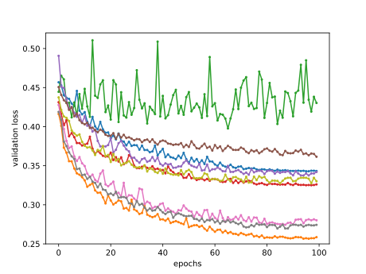
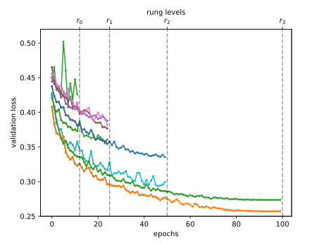
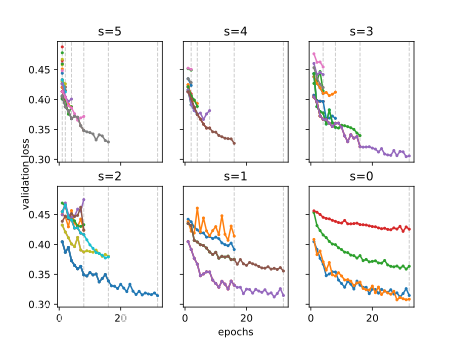

```{.python .input  n=1}
%load_ext d2lbook.tab
tab.interact_select(["pytorch"])
```

# Multi-fidelity Hyperparameter Optimization
:label:`sec_mf_hpo`

Training neural networks can be expensive even on moderate size datasets.
Depending on the configuration space (:numref:`sec_intro_config_spaces`),
hyperparameter optimization requires tens to hundreds of function evaluations
to find a well-performing hyperparameter configuration. As we have seen in
:numref:`sec_rs_async`, we can significantly speed up the overall wall-clock
time of HPO by exploiting parallel resources, but this does not reduce the total
amount of compute required.

In this section, we will show how the evaluation of hyperparameter configurations
can be sped up. Methods such as random search allocate the same amount of
resources (e.g., number of epochs, training data points) to each hyperparameter
evaluation. :numref:`img_samples_ls`  depicts learning curves of a set of neural
networks trained with different hyperparameter configurations. After a few epochs we are
already able to visually distinguish between well-performing and suboptimal
configurations. However, the learning curves are noisy, and we might still require
the full amount of 100 epochs to identify the best performing one.


:label:`img_samples_lc`

Multi-fidelity hyperparameter optimization allocates more resources
to promising configurations and stop evaluations of poorly performing ones early.
This speeds up the optimization process, since we can try a larger number of
configurations for the same total amount of resources.

More formally, we expand our definition in :numref:`sec_definition_hpo`,
such that our objective function $f(\mathbf{x}, r)$ gets an additional input
$r \in [r_{min}, r_{max}]$, specifying the amount of resources that we are
willing to spend for the evaluation of configuration $\mathbf{x}$. We assume that
the error $f(\mathbf{x}, r)$ decreases with $r$, whereas the computational
cost $c(\mathbf{x}, r)$ increases. Typically, $r$ represents the number of
epochs for training the neural network, but it could also be the training
subset size or the number of cross-validation folds.

## Successive Halving

One of the simplest ways to adapt random search to the multi-fidelity setting is
*successive halving* :cite:`jamieson-aistats16,karnin-icml13`. The basic
idea is to start with $N$ configurations, for example randomly sampled from the
configuration space, and to train each of them for $r_{min}$ epochs only. We
then discard a fraction of the worst performing trials and train the remaining
ones for longer. Iterating this process, fewer trials run for longer, until at
least one trial reaches $r_{max}$ epochs.

More formally, consider a minimum budget $r_{min}$, for example 1 epoch, a maximum
budget $r_{max}$, for example `max_epochs` in our previous example, and a halving
constant $\eta\in\{2, 3, \dots\}$. For simplicity, assume that $r_{max} = r_{min}
\eta^K$, with $K \in \mathbb{I}$ . The number of initial configurations is then
$N = \eta^K$. Let us define *rungs* $\mathcal{R} =
\{ r_{min}, r_{min}\eta, r_{min}\eta^2, \dots, r_{max} \}$. 

We start with running $N$ trials until the first rung $r_{min}$. Sorting the
validation errors, we keep the top $1 / \eta$ fraction (which amounts to
$\eta^{K-1}$ configurations) and discard all the rest. The surviving trials are
trained for the next rung, i.e $r_{min}\eta$ epochs, and the process is repeated.
In each round, a $1 / \eta$ fraction of trials survives and their training
continues with a $\eta$ times larger budget. With this particular choice of $N$,
only a single trial will be trained to the full budget $r_{max}$. Finally, once
we finished one round of successive halving, we start the next round with a new
set of initial configurations, until the total budget is spent.


:label:`sh`

To implement successive halving, we use the `HPOScheduler` base class from
:numref:`sec_api_hpo`. Since successive halving can be combined with Bayesian
optimization, we allow for a generic `HPOSearcher` object to sample
configurations. Additionally, the user has to pass the minimum resource
$r_{min}$, the maximum resource $r_{max}$ and $\eta$ as input.

Inside our scheduler we maintain a queue of configurations that need to be
evaluated for the current rung $r_i$. We update the queue every time we jump to
the next rung.

```{.python .input}
%%tab pytorch
from d2l import torch as d2l
```

```{.python .input  n=2}
%%tab all
import numpy as np
import copy
from scipy import stats
from collections import defaultdict
from operator import itemgetter

class SuccessiveHalvingScheduler(d2l.HPOScheduler):  #@save
    def __init__(self, searcher, eta, r_min, r_max, prefact=1):
        self.save_hyperparameters()
        # Compute K, which is later used to determine the number of configurations
        self.K = int(np.log(r_max / r_min) / np.log(eta))
        # Define the rungs
        self.rung_levels = [r_min * eta ** k for k in range(self.K + 1)]
        if r_max not in self.rung_levels:
            # The final rung should be r_max
            self.rung_levels.append(r_max)
            self.K += 1
        # Bookkeeping
        self.observed_error_at_rungs = defaultdict(list)
        # Our processing queue
        self.queue = []
```

In the beginning our queue is empty and we fill it with $n = prefact * \eta^{K}$
configurations, which are first evaluated on the smallest rung $r_{min}$.
The effect of $prefact$ will become important in the next part when we talk
about Hyperband, for now we assume $prefact=1$. Now, every time resources become
available and the `HPOTuner`object queries the suggest function, we return an
element from the queue. Once we finish one round of successive halving - which
means that we evaluated all surviving configurations on the highest resource
level $r_{max}$ and our queue is empty - we start the entire process again with
a new, randomly sampled set of configurations.

```{.python .input  n=12}
%%tab all
@d2l.add_to_class(SuccessiveHalvingScheduler)  #@save
def suggest(self):
    if len(self.queue) == 0:
        # Start a new round of successive halving
        # Number of configurations for the first rung:
        n0 = int(self.prefact * self.eta ** self.K)
        for _ in range(n0):
            config = searcher.sample_configuration()
            config["max_epochs"] = self.r_min  # Set r = r_min
            self.queue.append(config)
    # Return an element from the queue
    return self.queue.pop()
```

When we collected a new data point, we first update the searcher module.
Afterwards we check if we already collect all data points on the current rung. 
If so, we sort all configurations and push the top $\frac{1}{\eta}$
configurations into the queue.

```{.python .input  n=4}
%%tab all
@d2l.add_to_class(SuccessiveHalvingScheduler)  #@save
def update(self, config: dict, error: float, info=None):
    ri = config["max_epochs"]  # Rung r_i
    # Update our searcher, e.g if we use Bayesian optimization later
    self.searcher.update(config, error, additional_info=info)     
    if ri < self.r_max:
        # Bookkeeping
        self.observed_error_at_rungs[ri].append((config, error))
        # Determine how many configurations should be evaluated on this rung
        ki = self.K - self.rung_levels.index(ri)
        ni = int(self.prefact * self.eta ** ki)
        # If we observed all configuration on this rung r_i, we estimate the
        # top 1 / eta configuration, add them to queue and promote them for the
        # next rung r_{i+1}
        if len(self.observed_error_at_rungs[ri]) >= ni:
            kiplus1 = ki - 1
            niplus1 = int(self.prefact * self.eta ** kiplus1)
            best_performing_configurations = self.get_top_n_configurations(
                rung_level=ri, n=niplus1
            )
            riplus1 = self.rung_levels[self.K - kiplus1]  # r_{i+1}
            # Queue may not be empty: insert new entries at the beginning
            self.queue = [
                dict(config, max_epochs=riplus1)
                for config in best_performing_configurations
            ] + self.queue
            self.observed_error_at_rungs[ri] = []  # reset
```

Configurations are sorted based on their observed performance on the current rung.

```{.python .input  n=4}
%%tab all
 
@d2l.add_to_class(SuccessiveHalvingScheduler)  #@save
def get_top_n_configurations(self, rung_level, n):
    rung = self.observed_error_at_rungs[rung_level]
    if not rung:
        return []
    sorted_rung = sorted(rung, key=itemgetter(1))
    return [x[0] for x in sorted_rung[:n]]
```

Let us see how successive halving is doing on our neural network example.

```{.python .input  n=5}
min_number_of_epochs = 1
max_number_of_epochs = 10

config_space = {
    "learning_rate": stats.loguniform(1e-2, 1),
    "batch_size": stats.randint(32, 256),
}
initial_config = {
    "learning_rate": 0.1,
    "batch_size": 128,
}
```

We just replace the scheduler with our new `SuccessiveHalvingScheduler`.

```{.python .input  n=14}
searcher = d2l.RandomSearcher(config_space, initial_config=initial_config)
scheduler = SuccessiveHalvingScheduler(
    searcher=searcher,
    eta=2,
    r_min=min_number_of_epochs,
    r_max=max_number_of_epochs,
)
tuner = d2l.HPOTuner(
    scheduler=scheduler,
    objective=d2l.hpo_objective_lenet,
)
tuner.run(number_of_trials=31)
```

We can visualize the learning curves of all configuration that we evaluated.
Most of the configurations are stopped early and only the better performing
configurations survive until $r_{max}$. Compare this to vanilla random search
which would allocate $r_{max}$ to every configuration.

```{.python .input  n=19}
for rung_index, rung in scheduler.observed_error_at_rungs.items():
    errors = [xi[1] for xi in rung]   
    d2l.plt.scatter([rung_index] * len(errors), errors)
d2l.plt.xlim(min_number_of_epochs - 0.5, max_number_of_epochs + 0.5)
d2l.plt.xticks(
    np.arange(min_number_of_epochs, max_number_of_epochs + 1),
    np.arange(min_number_of_epochs, max_number_of_epochs + 1)
)
d2l.plt.ylabel("validation error")
d2l.plt.xlabel("epochs")        
```

Finally, note some slight complexity in our implementation of
`SuccessiveHalvingScheduler`. Namely, `suggest` needs to return a configuration
immediately. But if at least one other worker is still busy with an evaluation
in the current rung, we cannot determine the top $1 / \eta$ fraction to open the
next rung. Instead, `suggest` starts a new round of successive halving already.
However, once a rung is completed in `update`, we make sure to insert new
configurations at the beginning of the queue, so they take precedence over
configurations from the next round.

## Hyperband

While successive halving can greatly improve upon random search, the choice of
$r_{min}$ can have a large impact on its performance. If $r_{min}$ is too small,
our network might not have enough time to learn anything, and even the best
configurations may be filtered out due to noisy observations. If $r_{min}$ is
too large on the other hand, the benefits of successive-halving may be greatly
diminished.

Hyperband :cite:`li-iclr17` is an extension of successive halving that mitigates
the risk of setting $r_{min}$ too small. It runs successive halving as subroutine,
where each round of successive halving, called a bracket, balances between
$r_{min}$ and the number of initial configurations $N$, such that the same total
amount of resources per bracket is used.

Let's define $s_{max} = \lfloor log_{\eta} \frac{r_{max}}{r_{min}} \rfloor$.
Now for each bracket $s \in \{s_{max}, ..., 0\}$, we call successive halving with
$r_{min} = \eta^{-s} * r_{max}$ and the number of configurations
$N = \lceil \frac{s_{max} + 1}{s+1} * \eta^s \rceil$. Note that the last bracket
where $s=0$ evaluates all configurations on $r_{min} = r_{max}$, which means that
we effectively run random search. In practice we execute brackets in a round robin
fashion, which means we start with $s=s_{max}$ again once we finished the loop.
Given enough resources, we could also run all brackets in parallel because
configurations are sampled at random. We will discuss this case in more detail
in :numref:`sec_sh_async`.


:width:`400px`
:label:`hb`

We implement a new scheduler, that maintains a `SuccessiveHalvingScheduler` object.

```{.python .input  n=8}
%%tab all
class HyperbandScheduler(d2l.HPOScheduler):  #@save
    def __init__(self, searcher, eta, r_min, r_max):
        self.save_hyperparameters()
        self.s_max = int(np.ceil((np.log(r_max) - np.log(r_min)) / np.log(eta)))
        self.s = self.s_max
        self.successive_halving = SuccessiveHalvingScheduler(
            searcher=self.searcher,
            eta=self.eta,
            r_min=self.r_min,
            r_max=self.r_max,
            prefact=(self.s_max + 1) / (self.s + 1),
        )
        self.brackets = defaultdict(list)

    def suggest(self):
        return self.successive_halving.suggest()        
```

The update function keeps track of the individual brackets. Once we finished a
bracket, we move on to the next, i.e. re-initialize Successive Halving with
different $r_{min}$ and $s$.

```{.python .input  n=9}
%%tab all
@d2l.add_to_class(HyperbandScheduler)  #@save
def update(self, config: dict, error: float, info=None):
    self.brackets[self.s].append((config["max_epochs"], error))
    self.successive_halving.update(config, error, info=info)
    # If the queue of successive halving is empty, than we finished this round
    # and start with a new round with different r_min and N
    if len(self.successive_halving.queue) == 0:
        self.s -= 1
        if self.s < 0:
            self.s = self.s_max
        self.successive_halving = SuccessiveHalvingScheduler(
            searcher=self.searcher,
            eta=self.eta,
            r_min=int(self.r_max * self.eta ** (-self.s)),
            r_max=self.r_max,
            prefact=(self.s_max + 1) / (self.s + 1),
        )
```

Let see how Hyperband performs on our neural network example.

```{.python .input  n=21}
searcher = d2l.RandomSearcher(config_space, initial_config=initial_config)
scheduler = HyperbandScheduler(
    searcher=searcher,
    eta=2,
    r_min=min_number_of_epochs,
    r_max=max_number_of_epochs
)
tuner = d2l.HPOTuner(
    scheduler=scheduler,
    objective=d2l.hpo_objective_lenet,
)
tuner.run(number_of_trials=50)
```

Now, we can visualize the different bracket of successive halving.

```{.python .input  n=24}
for bi, bracket in scheduler.brackets.items():
    rung_levels = [xi[0] for xi in bracket]
    errors = [xi[1] for xi in bracket]
    d2l.plt.scatter(rung_levels, errors)
d2l.plt.xlim(min_number_of_epochs - 0.5, max_number_of_epochs + 0.5)
d2l.plt.xticks(
    np.arange(min_number_of_epochs, max_number_of_epochs + 1),
    np.arange(min_number_of_epochs, max_number_of_epochs + 1)
)
d2l.plt.title(f"bracket s={bi}")
d2l.plt.ylabel("objective function")
d2l.plt.xlabel("epochs")        
d2l.plt.show()
```

## Summary

This section introduced the concept of multi-fidelity hyperparameter optimization,
where we assume to have access to cheap-to-evaluate approximations of the
objective function. Here, we consider the performance after each epoch as an
approximation of the performance after training for the full amount of epochs.
Multi-fidelity hyperparameter optimization allows to reduce the overall
computation of the HPO instead of just reducing the wall-clock time.

Arguably the simplest method for multi-fidelity hyperparameter optimization is
successive halving which is based on random search. We also looked at Hyperband,
which run multiple brackets of successive halving, to avoid that good
configurations are stopped to early.

## Exercises
