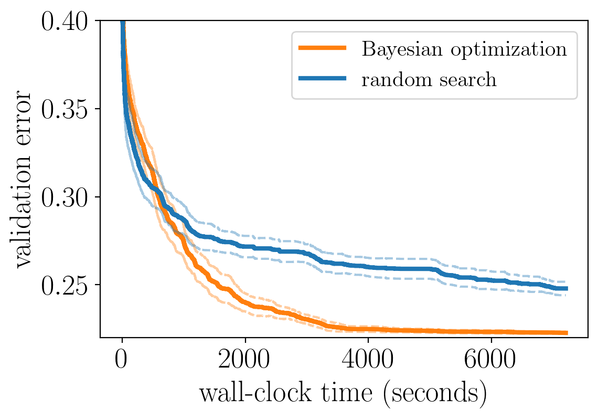

```{.python .input  n=1}
%load_ext d2lbook.tab
tab.interact_select(['mxnet', 'pytorch', 'tensorflow'])
```

```{.json .output n=1}
[
 {
  "data": {
   "application/vnd.jupyter.widget-view+json": {
    "model_id": "eef64ed7211940649f798449faf7d6f5",
    "version_major": 2,
    "version_minor": 0
   },
   "text/plain": "interactive(children=(Dropdown(description='tab', options=('mxnet', 'pytorch', 'tensorflow'), value=None), Out\u2026"
  },
  "metadata": {},
  "output_type": "display_data"
 }
]
```

# An API for Hyperparameter Optimization
:label:`sec_api_hpo`


Before we dive into different methods, we will first discuss a basic code structure that allows us to efficiently implement different HPO methods. In general, all HPO
methods considered here need to implement two decision making primitives, **search** and **scheduling**. First, they need to sample new configurations to be trained and evaluated, given that resources are available, which often involves some kind of search over the configuration space.
Once a configuration is marked for execution, we will refer to it as a **trial**. Second, they need to schedule trials, which means deciding for how long to
run them, or when to stop, pause or resume them. We map these decisions to two classes,
`HPOSearcher` and `HPOScheduler`.

### Searcher

Below we define a base class for searchers, which provides a new candidate
configuration through the `sample_configuration` method. Many algorithms will make
these decisions based on observed performances of previously run trials. Such an
observation can be passed via the `update` method.

```{.python .input  n=2}
%%tab all

from d2l import torch as d2l


class HPOSearcher(d2l.HyperParameters): #@save
    
    def sample_configuration():
        raise NotImplementedError
    
    def update(self, config, error, additional_info=None):
        pass
        
```

### Scheduler

Beyond sampling configurations for new trials, we also need to decide how long to
run a trial for, or whether to stop it early. In practice, all these decisions are
done by the `HPOScheduler`, who delegates the choice of new configurations to a
`HPOSearcher`. The `suggest` method is called whenever some resource for training
becomes available. Apart from invoking `sample_configuration` of a searcher, it
may also decide upon parameters like `max_epochs` (i.e., how long to train the
model for). The `update` method is called whenever a trial produces a new
metric value.

```{.python .input  n=3}
%%tab all

class HPOScheduler(d2l.HyperParameters): #@save
    
    def suggest(self):
        raise NotImplementedError
    
    def update(self, config, error, info=None):
        raise NotImplementedError
```

Below we define a basic first-in first-out scheduler which simply schedules the next configuration once resources become available.

```{.python .input  n=4}
%%tab all

class FIFOScheduler(HPOScheduler): #@save
    def __init__(self, searcher):
        self.save_hyperparameters()
        
    def suggest(self):
        return self.searcher.sample_configuration()

    def update(self, config, error, info=None):
        searcher.update(config, error, additional_info=info)
```

### Tuner

Finally, we need a component running the optimizer and doing some book-keeping
of the results. The following code implements a sequential execution of the HPO process (one training
job after the next) and will serve as a basic example. We will later use **Syne Tune** for more sophisticated distributed HPO cases.

```{.python .input  n=5}
%%tab all

class HPOTuner(d2l.HyperParameters): #@save
    def __init__(self, scheduler, objective):
        self.save_hyperparameters()
        
        # for bookeeping
        self.incumbent = None
        self.incumbent_error = None
        self.incumbent_trajectory = []
        self.cumulative_runtime = []
        self.current_time = 0
        
    def run(self, max_wallclock_time):
        while self.current_time < max_wallclock_time:
            start_time = time.time()
            config = self.scheduler.suggest()
        
            error = self.objective(config)
        
            self.scheduler.update(config, error)
        
            runtime = time.time() - start_time
            self.bookkeeping(config, error, runtime)        
```

## Evaluating Hyperparameter Optimization Methods

With any HPO method, we are mostly interested in the best performing
configuration (called **incumbent**) and its validation error after a given 
wall-clock time. This is why we track `runtime` per iteration, which includes
both the time to run an evaluation (call of `self.objective`) and the time to
make a decision (call of `self.scheduler.suggest`). In the sequel, we will plot
`cumulative_runtime` against `incumbent_trajectory` in  order to visualize the
**any-time performance** of the HPO method defined in  terms of `scheduler`
(and `searcher`). This allows us to quantify not only how well the configuration found by an optimizer works, but also how quickly an optimizers is able to find it.

```{.python .input  n=6}
%%tab all

@d2l.add_to_class(HPOTuner) #@save
def bookkeeping(self, config, error, runtime): 
    if self.incumbent is None or self.incumbent_error > error:
        self.incumbent = config
        self.incumbent_error = error
        
    self.incumbent_trajectory.append(self.incumbent_error)
    
    self.current_time += runtime
    self.cumulative_runtime.append(self.current_time)
```

Just as with training algorithms or model architectures, it is important to understand how to best
compare different HPO methods. Each run of an HPO experiment depends on mostly two sources of randomness,
the random effects in each training run (such as random weight initialization or mini-batch ordering) and, as we are going to see in the next sections, the intrinsic randomness of the HPO method itself. Hence, when comparing different methods, it is crucial to run each experiment several times and present statistics, such as mean or median, across a population of multiple repetitions of an optimizer based on different seeds of the random number generator.

To illustrate this, we below compare to methods A and B on some HPO problem. Each method was evaluated $N$ times with a different random seed. The solid line indicates the average performance of the incumbent across these $N$ repetitions and the dashed line the standard deviation. We can see that method A and B perform roughly the same up to ~1000 seconds, but method B quickly outperforms A afterwards.



:width:`400px`
:label:`example_anytime_performance`


## Summary

## Exercise
