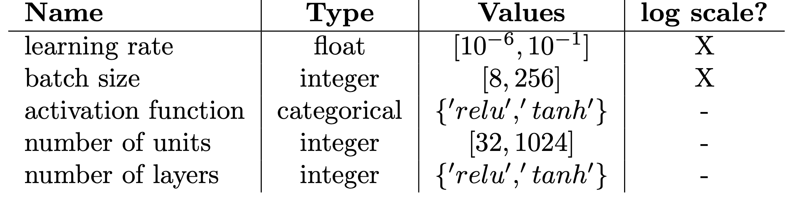

```{.python .input  n=8}
%load_ext d2lbook.tab
tab.interact_select(['mxnet', 'pytorch', 'tensorflow'])
```

```{.json .output n=8}
[
 {
  "data": {
   "application/vnd.jupyter.widget-view+json": {
    "model_id": "9cdaf836d41045a68aaf449bd8db2341",
    "version_major": 2,
    "version_minor": 0
   },
   "text/plain": "interactive(children=(Dropdown(description='tab', options=('mxnet', 'pytorch', 'tensorflow'), value=None), Out\u2026"
  },
  "metadata": {},
  "output_type": "display_data"
 }
]
```

# What is Hyperparameter Optimization?
:label:`sec_what_is_hpo`

Consider the weight parameters of a deep neural network. They are automatically determined during training by minimizing the loss function with, for example, stochastic gradient descent (see Chapter :ref:`sec_sgd`). 
Every neural network comes with additional parameters, called **hyperparameters**, that define and control this training process. For example, the learning rate and the batch size control the convergence speed of the learning algorithms, while the number of layers and the number of units per layer determine the capacity of the network (I.e., the number of parameters). Unfortunately these **hyperparameters** cannot be learned in the same way as the weight parameters. For discrete or integer hyperparameters, the training error might not be differentiable with respect to them. On the other hand, for continuous hyperparameters, such as the learning rate, we could compute gradients but this woulrd require to propagate the gradient through the entire training process :cite:`maclaurin-icml15`.

Without a different form of automation, the user has to set hyperparameters manually by trial-and-error process, in what amounts to a time-consuming and difficult part of machine learning workflows :cite:`hpo`. 
Hyperparameters are usually not directly transferable across architectures and datasets :cite:`feurer-arxiv22`,`wistuba-ml18`,`bardenet-icml13a`, making the search for the right hyperparameters a recurring task in practice. Furthermore, for most hyperparameters there are no rule-of-thumbs to set them and often expert knowledge is required to find sensible values.

Hyperparameter optimization (HPO) algorithms are designed to tackle this problem in an principled and automated fashion :cite:`feurer-automlbook18a`. The main idea is to cast the search for the optimal hyperparameter configuration as a global optimization problem. The optimization objective consists usually in minimizing the generalization error on a hold-out validation dataset, but could in principle be an business objective or it could be minimized in conjunction with other objectives such as training time, inference time, or model size.

More recently, hyperparameter optimization has been extended to search for entirely new neural network architectures :cite:`elsken-arxiv18a`,`wistuba-arxiv19`. This is often referred to as neural architecture search (NAS) in the literature. Compared to classical HPO, NAS is often even more compute intensive and requires additional efforts to be feasible in practice. Both, HPO and NAS can be considered as sub-fields of AutoML  which aims to automated the entire ML pipeline :cite:`hutter-book19a`.

In this section we will introduce HPO and show how we can automatically find good hyperparameters of an logistic regression example, introduced in :ref:`sec_softmax_concise`, that minimizes the classification error on the hold-out validation dataset. 

##  The Optimization Problem
:label:`sec_definition_hpo`

To get started, we will first look at a simple toy problem: we will search for a learning rate that minimizes the validation error of a multi-class logistic regression model from :ref:sec_sgd trained on the Fashion MNIST dataset. Even though there are more hyperparameters we could optimize, for example the batch size or the number of epochs, we will focus only on the learning rate to keep the complexity of this example at bay.
For that, we have to first define the objective function and the search space.

```{.python .input  n=9}
from d2l import torch as d2l

from torch import nn

class SoftmaxClassification(d2l.Classification):
    def __init__(self, num_outputs, lr):
        super().__init__()
        self.save_hyperparameters()
        self.net = nn.Sequential(nn.Flatten(),
                                 nn.LazyLinear(num_outputs))
    def forward(self, X):
        return self.net(X)
```

### The Objective Function


The performance of a learning algorithm can be seen as a function $f: \mathcal{X} \rightarrow \mathbb{R}$ that maps from the hyperparameter space $\mathbf{x} \in \mathcal{X}$ to the validation error. For every evaluation of $f(\mathbf{x})$, we have to train and validate our machine learning model, which can be time and compute intensive in the case of deep neural networks trained on large datasets. For example, if we train a modern neural network architecture, e.g convolutional neural network :ref:`chap_modern_cnn` or a transformer :ref:`sec_transformer`, this can easily take several hours or even days. We will see in Chapter :ref:`sec_mf_hpo` how we can exploit cheaper approximations of $f$ to speed up the optimization process. Training is stochastic in general (e.g., weights are randomly initialized, mini-batches are randomly sampled), so that our observations will be noisy: $y \sim f(\mathbf{x}) + \epsilon$, where we assume that $\epsilon \sim N(0, \sigma)$.

Now, since we would like to optimize the validation error, i.e 1 - accuracy, we need to add a method computing this metric.

```{.python .input  n=10}
%%tab all

from d2l import torch as d2l
import torch
from torch import nn

def validate(trainer, model):
    model.eval()
    accuracy = 0
    val_batch_idx = 0
    for batch in trainer.val_dataloader:
        with torch.no_grad():
            x, y = trainer.prepare_batch(batch)
            y_hat = model(x)
            accuracy += model.accuracy(y_hat, y)
        val_batch_idx += 1
    return 1 -  accuracy / val_batch_idx
```

We optimize validation error with respect to the hyperparameter configuration `config`, consisting of the `learning_rate`. For each evaluation, we train our model
for `max_epochs` epochs, then compute and return its validation error:

```{.python .input  n=11}
# %%tab all

def hpo_objective_softmax_classification(config, max_epochs=10):
    learning_rate = config['learning_rate']
    trainer = d2l.Trainer(max_epochs=max_epochs)
    
    data = d2l.FashionMNIST(batch_size=16)
    model = SoftmaxClassification(num_outputs=10, lr=learning_rate)
    trainer.fit(model=model, data=data)
    validation_error = validate(trainer, model=model)
    return validation_error.numpy()
```

Now, given our criterion $f(\mathbf{x})$ in terms of `hpo_objective_softmax_classification(config)`, where $\mathbf{x}$ corresponds to `config`, our goal is to find $\mathbf{x}_{\star} \in argmin_{\mathbf{x} \in \mathcal{X}} f(\mathbf{x})$. 

There is no simple way to compute gradients of $f$ with respect to $\mathbf{x}$, because it would require to propagate the gradient through the entire training process. While there is recent work :cite:`maclaurin-icml15`,`franceschi-icml17a` to drive HPO by approximate "hypergradients", none of the existing approaches are competitive with the state-of-the-art yet, and we will not discuss them here. Furthermore, the computational burden of evaluating $f$ requires HPO methods to approach the global optimum with as few samples as possible.

### The Search Space

:label:`sec_intro_search_spaces`

Along with the objective function $f(\mathbf{x})$, we need to define the *search space* $\mathbf{x} \in \mathcal{X}$, which we will also refer to as *configuration space*. For our logistic regression example we define it as follows:

```{.python .input  n=12}
search_space = {
   "learning_rate": [1e-4, 1e4]
} 
```

Each hyperparameter has a data type, such as `float` for `learning_rate`, as well as a closed bounded range
(i.e., lower and upper bounds). Some positive parameters, such as `learning_rate`, are best represented on a logarithmic scale as optimal values can differ by several orders of magnitude, while others come with linear scale.

Below we show a simple example search spaces consisting of typical hyperparameters of feed-forward neural networks including their type and standard ranges.


:width:`40px`
:label:`example_search_spacee`


In general, the structure of the search space $\mathcal{X}$ can be complex and it can be quite different from $\mathbb{R}^d$. In practice, some hyperparameters may depend on the value of others. For example, if we try to tune both the number of layers and widths per layer for a multi-layer perceptron,
the width of the $l$-th layer is relevant only if the network has at least $l+1$ layers. These advanced HPO problems are beyond the scope of this chapter. We refer the interested reader to :cite:`hutter-lion11a`,`jenatton-icml17a`, `baptista-icml18a`.

The search spaces plays an important role for hyperparameter optimization, since no method can find something that is not included in the search space. On the other hand, if the ranges are too large, the time to find a well performing configurations might become infeasible.


## Grid Search

Now, we look at the first method to solve our hyperparameter optimization problem: grid search. 
The main idea of grid search is to define a discrete set of values for each hyperparameter and then to evaluate the cartesian product, i.e grid of all hyperparameters.

```{.python .input  n=13}
grid = [1e-4, 1e-3, 1e-2, 1e-1, 1e0, 1e1, 1e2, 1e3, 1e4]
```

The evaluation can be executed sequentially (as we do here) or in parallel.

```{.python .input  n=14}
errors = []
for lr in grid:
        errors.append(hpo_objective_softmax_classification({"learning_rate": lr}))
```

```{.json .output n=14}
[
 {
  "data": {
   "image/svg+xml": "<?xml version=\"1.0\" encoding=\"utf-8\" standalone=\"no\"?>\n<!DOCTYPE svg PUBLIC \"-//W3C//DTD SVG 1.1//EN\"\n  \"http://www.w3.org/Graphics/SVG/1.1/DTD/svg11.dtd\">\n<svg xmlns:xlink=\"http://www.w3.org/1999/xlink\" width=\"238.965625pt\" height=\"180.65625pt\" viewBox=\"0 0 238.965625 180.65625\" xmlns=\"http://www.w3.org/2000/svg\" version=\"1.1\">\n <metadata>\n  <rdf:RDF xmlns:dc=\"http://purl.org/dc/elements/1.1/\" xmlns:cc=\"http://creativecommons.org/ns#\" xmlns:rdf=\"http://www.w3.org/1999/02/22-rdf-syntax-ns#\">\n   <cc:Work>\n    <dc:type rdf:resource=\"http://purl.org/dc/dcmitype/StillImage\"/>\n    <dc:date>2022-06-02T13:27:23.092941</dc:date>\n    <dc:format>image/svg+xml</dc:format>\n    <dc:creator>\n     <cc:Agent>\n      <dc:title>Matplotlib v3.5.0, https://matplotlib.org/</dc:title>\n     </cc:Agent>\n    </dc:creator>\n   </cc:Work>\n  </rdf:RDF>\n </metadata>\n <defs>\n  <style type=\"text/css\">*{stroke-linejoin: round; stroke-linecap: butt}</style>\n </defs>\n <g id=\"figure_1\">\n  <g id=\"patch_1\">\n   <path d=\"M 0 180.65625 \nL 238.965625 180.65625 \nL 238.965625 0 \nL 0 0 \nL 0 180.65625 \nz\n\" style=\"fill: none\"/>\n  </g>\n  <g id=\"axes_1\">\n   <g id=\"patch_2\">\n    <path d=\"M 30.103125 143.1 \nL 225.403125 143.1 \nL 225.403125 7.2 \nL 30.103125 7.2 \nz\n\" style=\"fill: #ffffff\"/>\n   </g>\n   <g id=\"matplotlib.axis_1\">\n    <g id=\"xtick_1\">\n     <g id=\"line2d_1\">\n      <defs>\n       <path id=\"m39ea57c00b\" d=\"M 0 0 \nL 0 3.5 \n\" style=\"stroke: #000000; stroke-width: 0.8\"/>\n      </defs>\n      <g>\n       <use xlink:href=\"#m39ea57c00b\" x=\"30.103125\" y=\"143.1\" style=\"stroke: #000000; stroke-width: 0.8\"/>\n      </g>\n     </g>\n     <g id=\"text_1\">\n      <!-- 0 -->\n      <g transform=\"translate(26.921875 157.698438)scale(0.1 -0.1)\">\n       <defs>\n        <path id=\"DejaVuSans-30\" d=\"M 2034 4250 \nQ 1547 4250 1301 3770 \nQ 1056 3291 1056 2328 \nQ 1056 1369 1301 889 \nQ 1547 409 2034 409 \nQ 2525 409 2770 889 \nQ 3016 1369 3016 2328 \nQ 3016 3291 2770 3770 \nQ 2525 4250 2034 4250 \nz\nM 2034 4750 \nQ 2819 4750 3233 4129 \nQ 3647 3509 3647 2328 \nQ 3647 1150 3233 529 \nQ 2819 -91 2034 -91 \nQ 1250 -91 836 529 \nQ 422 1150 422 2328 \nQ 422 3509 836 4129 \nQ 1250 4750 2034 4750 \nz\n\" transform=\"scale(0.015625)\"/>\n       </defs>\n       <use xlink:href=\"#DejaVuSans-30\"/>\n      </g>\n     </g>\n    </g>\n    <g id=\"xtick_2\">\n     <g id=\"line2d_2\">\n      <g>\n       <use xlink:href=\"#m39ea57c00b\" x=\"69.163125\" y=\"143.1\" style=\"stroke: #000000; stroke-width: 0.8\"/>\n      </g>\n     </g>\n     <g id=\"text_2\">\n      <!-- 2 -->\n      <g transform=\"translate(65.981875 157.698438)scale(0.1 -0.1)\">\n       <defs>\n        <path id=\"DejaVuSans-32\" d=\"M 1228 531 \nL 3431 531 \nL 3431 0 \nL 469 0 \nL 469 531 \nQ 828 903 1448 1529 \nQ 2069 2156 2228 2338 \nQ 2531 2678 2651 2914 \nQ 2772 3150 2772 3378 \nQ 2772 3750 2511 3984 \nQ 2250 4219 1831 4219 \nQ 1534 4219 1204 4116 \nQ 875 4013 500 3803 \nL 500 4441 \nQ 881 4594 1212 4672 \nQ 1544 4750 1819 4750 \nQ 2544 4750 2975 4387 \nQ 3406 4025 3406 3419 \nQ 3406 3131 3298 2873 \nQ 3191 2616 2906 2266 \nQ 2828 2175 2409 1742 \nQ 1991 1309 1228 531 \nz\n\" transform=\"scale(0.015625)\"/>\n       </defs>\n       <use xlink:href=\"#DejaVuSans-32\"/>\n      </g>\n     </g>\n    </g>\n    <g id=\"xtick_3\">\n     <g id=\"line2d_3\">\n      <g>\n       <use xlink:href=\"#m39ea57c00b\" x=\"108.223125\" y=\"143.1\" style=\"stroke: #000000; stroke-width: 0.8\"/>\n      </g>\n     </g>\n     <g id=\"text_3\">\n      <!-- 4 -->\n      <g transform=\"translate(105.041875 157.698438)scale(0.1 -0.1)\">\n       <defs>\n        <path id=\"DejaVuSans-34\" d=\"M 2419 4116 \nL 825 1625 \nL 2419 1625 \nL 2419 4116 \nz\nM 2253 4666 \nL 3047 4666 \nL 3047 1625 \nL 3713 1625 \nL 3713 1100 \nL 3047 1100 \nL 3047 0 \nL 2419 0 \nL 2419 1100 \nL 313 1100 \nL 313 1709 \nL 2253 4666 \nz\n\" transform=\"scale(0.015625)\"/>\n       </defs>\n       <use xlink:href=\"#DejaVuSans-34\"/>\n      </g>\n     </g>\n    </g>\n    <g id=\"xtick_4\">\n     <g id=\"line2d_4\">\n      <g>\n       <use xlink:href=\"#m39ea57c00b\" x=\"147.283125\" y=\"143.1\" style=\"stroke: #000000; stroke-width: 0.8\"/>\n      </g>\n     </g>\n     <g id=\"text_4\">\n      <!-- 6 -->\n      <g transform=\"translate(144.101875 157.698438)scale(0.1 -0.1)\">\n       <defs>\n        <path id=\"DejaVuSans-36\" d=\"M 2113 2584 \nQ 1688 2584 1439 2293 \nQ 1191 2003 1191 1497 \nQ 1191 994 1439 701 \nQ 1688 409 2113 409 \nQ 2538 409 2786 701 \nQ 3034 994 3034 1497 \nQ 3034 2003 2786 2293 \nQ 2538 2584 2113 2584 \nz\nM 3366 4563 \nL 3366 3988 \nQ 3128 4100 2886 4159 \nQ 2644 4219 2406 4219 \nQ 1781 4219 1451 3797 \nQ 1122 3375 1075 2522 \nQ 1259 2794 1537 2939 \nQ 1816 3084 2150 3084 \nQ 2853 3084 3261 2657 \nQ 3669 2231 3669 1497 \nQ 3669 778 3244 343 \nQ 2819 -91 2113 -91 \nQ 1303 -91 875 529 \nQ 447 1150 447 2328 \nQ 447 3434 972 4092 \nQ 1497 4750 2381 4750 \nQ 2619 4750 2861 4703 \nQ 3103 4656 3366 4563 \nz\n\" transform=\"scale(0.015625)\"/>\n       </defs>\n       <use xlink:href=\"#DejaVuSans-36\"/>\n      </g>\n     </g>\n    </g>\n    <g id=\"xtick_5\">\n     <g id=\"line2d_5\">\n      <g>\n       <use xlink:href=\"#m39ea57c00b\" x=\"186.343125\" y=\"143.1\" style=\"stroke: #000000; stroke-width: 0.8\"/>\n      </g>\n     </g>\n     <g id=\"text_5\">\n      <!-- 8 -->\n      <g transform=\"translate(183.161875 157.698438)scale(0.1 -0.1)\">\n       <defs>\n        <path id=\"DejaVuSans-38\" d=\"M 2034 2216 \nQ 1584 2216 1326 1975 \nQ 1069 1734 1069 1313 \nQ 1069 891 1326 650 \nQ 1584 409 2034 409 \nQ 2484 409 2743 651 \nQ 3003 894 3003 1313 \nQ 3003 1734 2745 1975 \nQ 2488 2216 2034 2216 \nz\nM 1403 2484 \nQ 997 2584 770 2862 \nQ 544 3141 544 3541 \nQ 544 4100 942 4425 \nQ 1341 4750 2034 4750 \nQ 2731 4750 3128 4425 \nQ 3525 4100 3525 3541 \nQ 3525 3141 3298 2862 \nQ 3072 2584 2669 2484 \nQ 3125 2378 3379 2068 \nQ 3634 1759 3634 1313 \nQ 3634 634 3220 271 \nQ 2806 -91 2034 -91 \nQ 1263 -91 848 271 \nQ 434 634 434 1313 \nQ 434 1759 690 2068 \nQ 947 2378 1403 2484 \nz\nM 1172 3481 \nQ 1172 3119 1398 2916 \nQ 1625 2713 2034 2713 \nQ 2441 2713 2670 2916 \nQ 2900 3119 2900 3481 \nQ 2900 3844 2670 4047 \nQ 2441 4250 2034 4250 \nQ 1625 4250 1398 4047 \nQ 1172 3844 1172 3481 \nz\n\" transform=\"scale(0.015625)\"/>\n       </defs>\n       <use xlink:href=\"#DejaVuSans-38\"/>\n      </g>\n     </g>\n    </g>\n    <g id=\"xtick_6\">\n     <g id=\"line2d_6\">\n      <g>\n       <use xlink:href=\"#m39ea57c00b\" x=\"225.403125\" y=\"143.1\" style=\"stroke: #000000; stroke-width: 0.8\"/>\n      </g>\n     </g>\n     <g id=\"text_6\">\n      <!-- 10 -->\n      <g transform=\"translate(219.040625 157.698438)scale(0.1 -0.1)\">\n       <defs>\n        <path id=\"DejaVuSans-31\" d=\"M 794 531 \nL 1825 531 \nL 1825 4091 \nL 703 3866 \nL 703 4441 \nL 1819 4666 \nL 2450 4666 \nL 2450 531 \nL 3481 531 \nL 3481 0 \nL 794 0 \nL 794 531 \nz\n\" transform=\"scale(0.015625)\"/>\n       </defs>\n       <use xlink:href=\"#DejaVuSans-31\"/>\n       <use xlink:href=\"#DejaVuSans-30\" x=\"63.623047\"/>\n      </g>\n     </g>\n    </g>\n    <g id=\"text_7\">\n     <!-- epoch -->\n     <g transform=\"translate(112.525 171.376563)scale(0.1 -0.1)\">\n      <defs>\n       <path id=\"DejaVuSans-65\" d=\"M 3597 1894 \nL 3597 1613 \nL 953 1613 \nQ 991 1019 1311 708 \nQ 1631 397 2203 397 \nQ 2534 397 2845 478 \nQ 3156 559 3463 722 \nL 3463 178 \nQ 3153 47 2828 -22 \nQ 2503 -91 2169 -91 \nQ 1331 -91 842 396 \nQ 353 884 353 1716 \nQ 353 2575 817 3079 \nQ 1281 3584 2069 3584 \nQ 2775 3584 3186 3129 \nQ 3597 2675 3597 1894 \nz\nM 3022 2063 \nQ 3016 2534 2758 2815 \nQ 2500 3097 2075 3097 \nQ 1594 3097 1305 2825 \nQ 1016 2553 972 2059 \nL 3022 2063 \nz\n\" transform=\"scale(0.015625)\"/>\n       <path id=\"DejaVuSans-70\" d=\"M 1159 525 \nL 1159 -1331 \nL 581 -1331 \nL 581 3500 \nL 1159 3500 \nL 1159 2969 \nQ 1341 3281 1617 3432 \nQ 1894 3584 2278 3584 \nQ 2916 3584 3314 3078 \nQ 3713 2572 3713 1747 \nQ 3713 922 3314 415 \nQ 2916 -91 2278 -91 \nQ 1894 -91 1617 61 \nQ 1341 213 1159 525 \nz\nM 3116 1747 \nQ 3116 2381 2855 2742 \nQ 2594 3103 2138 3103 \nQ 1681 3103 1420 2742 \nQ 1159 2381 1159 1747 \nQ 1159 1113 1420 752 \nQ 1681 391 2138 391 \nQ 2594 391 2855 752 \nQ 3116 1113 3116 1747 \nz\n\" transform=\"scale(0.015625)\"/>\n       <path id=\"DejaVuSans-6f\" d=\"M 1959 3097 \nQ 1497 3097 1228 2736 \nQ 959 2375 959 1747 \nQ 959 1119 1226 758 \nQ 1494 397 1959 397 \nQ 2419 397 2687 759 \nQ 2956 1122 2956 1747 \nQ 2956 2369 2687 2733 \nQ 2419 3097 1959 3097 \nz\nM 1959 3584 \nQ 2709 3584 3137 3096 \nQ 3566 2609 3566 1747 \nQ 3566 888 3137 398 \nQ 2709 -91 1959 -91 \nQ 1206 -91 779 398 \nQ 353 888 353 1747 \nQ 353 2609 779 3096 \nQ 1206 3584 1959 3584 \nz\n\" transform=\"scale(0.015625)\"/>\n       <path id=\"DejaVuSans-63\" d=\"M 3122 3366 \nL 3122 2828 \nQ 2878 2963 2633 3030 \nQ 2388 3097 2138 3097 \nQ 1578 3097 1268 2742 \nQ 959 2388 959 1747 \nQ 959 1106 1268 751 \nQ 1578 397 2138 397 \nQ 2388 397 2633 464 \nQ 2878 531 3122 666 \nL 3122 134 \nQ 2881 22 2623 -34 \nQ 2366 -91 2075 -91 \nQ 1284 -91 818 406 \nQ 353 903 353 1747 \nQ 353 2603 823 3093 \nQ 1294 3584 2113 3584 \nQ 2378 3584 2631 3529 \nQ 2884 3475 3122 3366 \nz\n\" transform=\"scale(0.015625)\"/>\n       <path id=\"DejaVuSans-68\" d=\"M 3513 2113 \nL 3513 0 \nL 2938 0 \nL 2938 2094 \nQ 2938 2591 2744 2837 \nQ 2550 3084 2163 3084 \nQ 1697 3084 1428 2787 \nQ 1159 2491 1159 1978 \nL 1159 0 \nL 581 0 \nL 581 4863 \nL 1159 4863 \nL 1159 2956 \nQ 1366 3272 1645 3428 \nQ 1925 3584 2291 3584 \nQ 2894 3584 3203 3211 \nQ 3513 2838 3513 2113 \nz\n\" transform=\"scale(0.015625)\"/>\n      </defs>\n      <use xlink:href=\"#DejaVuSans-65\"/>\n      <use xlink:href=\"#DejaVuSans-70\" x=\"61.523438\"/>\n      <use xlink:href=\"#DejaVuSans-6f\" x=\"125\"/>\n      <use xlink:href=\"#DejaVuSans-63\" x=\"186.181641\"/>\n      <use xlink:href=\"#DejaVuSans-68\" x=\"241.162109\"/>\n     </g>\n    </g>\n   </g>\n   <g id=\"matplotlib.axis_2\">\n    <g id=\"ytick_1\">\n     <g id=\"line2d_7\">\n      <defs>\n       <path id=\"m76cb698043\" d=\"M 0 0 \nL -3.5 0 \n\" style=\"stroke: #000000; stroke-width: 0.8\"/>\n      </defs>\n      <g>\n       <use xlink:href=\"#m76cb698043\" x=\"30.103125\" y=\"104.576876\" style=\"stroke: #000000; stroke-width: 0.8\"/>\n      </g>\n     </g>\n     <g id=\"text_8\">\n      <!-- 1.0 -->\n      <g transform=\"translate(7.2 108.376095)scale(0.1 -0.1)\">\n       <defs>\n        <path id=\"DejaVuSans-2e\" d=\"M 684 794 \nL 1344 794 \nL 1344 0 \nL 684 0 \nL 684 794 \nz\n\" transform=\"scale(0.015625)\"/>\n       </defs>\n       <use xlink:href=\"#DejaVuSans-31\"/>\n       <use xlink:href=\"#DejaVuSans-2e\" x=\"63.623047\"/>\n       <use xlink:href=\"#DejaVuSans-30\" x=\"95.410156\"/>\n      </g>\n     </g>\n    </g>\n    <g id=\"ytick_2\">\n     <g id=\"line2d_8\">\n      <g>\n       <use xlink:href=\"#m76cb698043\" x=\"30.103125\" y=\"62.979846\" style=\"stroke: #000000; stroke-width: 0.8\"/>\n      </g>\n     </g>\n     <g id=\"text_9\">\n      <!-- 1.5 -->\n      <g transform=\"translate(7.2 66.779064)scale(0.1 -0.1)\">\n       <defs>\n        <path id=\"DejaVuSans-35\" d=\"M 691 4666 \nL 3169 4666 \nL 3169 4134 \nL 1269 4134 \nL 1269 2991 \nQ 1406 3038 1543 3061 \nQ 1681 3084 1819 3084 \nQ 2600 3084 3056 2656 \nQ 3513 2228 3513 1497 \nQ 3513 744 3044 326 \nQ 2575 -91 1722 -91 \nQ 1428 -91 1123 -41 \nQ 819 9 494 109 \nL 494 744 \nQ 775 591 1075 516 \nQ 1375 441 1709 441 \nQ 2250 441 2565 725 \nQ 2881 1009 2881 1497 \nQ 2881 1984 2565 2268 \nQ 2250 2553 1709 2553 \nQ 1456 2553 1204 2497 \nQ 953 2441 691 2322 \nL 691 4666 \nz\n\" transform=\"scale(0.015625)\"/>\n       </defs>\n       <use xlink:href=\"#DejaVuSans-31\"/>\n       <use xlink:href=\"#DejaVuSans-2e\" x=\"63.623047\"/>\n       <use xlink:href=\"#DejaVuSans-35\" x=\"95.410156\"/>\n      </g>\n     </g>\n    </g>\n    <g id=\"ytick_3\">\n     <g id=\"line2d_9\">\n      <g>\n       <use xlink:href=\"#m76cb698043\" x=\"30.103125\" y=\"21.382815\" style=\"stroke: #000000; stroke-width: 0.8\"/>\n      </g>\n     </g>\n     <g id=\"text_10\">\n      <!-- 2.0 -->\n      <g transform=\"translate(7.2 25.182034)scale(0.1 -0.1)\">\n       <use xlink:href=\"#DejaVuSans-32\"/>\n       <use xlink:href=\"#DejaVuSans-2e\" x=\"63.623047\"/>\n       <use xlink:href=\"#DejaVuSans-30\" x=\"95.410156\"/>\n      </g>\n     </g>\n    </g>\n   </g>\n   <g id=\"line2d_10\">\n    <path d=\"M 34.983021 13.377273 \n\" clip-path=\"url(#p4fa7db2563)\" style=\"fill: none; stroke: #1f77b4; stroke-width: 1.5; stroke-linecap: square\"/>\n   </g>\n   <g id=\"line2d_11\">\n    <path d=\"M 34.983021 13.377273 \nL 44.748021 36.861474 \n\" clip-path=\"url(#p4fa7db2563)\" style=\"fill: none; stroke: #1f77b4; stroke-width: 1.5; stroke-linecap: square\"/>\n   </g>\n   <g id=\"line2d_12\">\n    <path d=\"M 34.983021 13.377273 \nL 44.748021 36.861474 \n\" clip-path=\"url(#p4fa7db2563)\" style=\"fill: none; stroke: #1f77b4; stroke-width: 1.5; stroke-linecap: square\"/>\n   </g>\n   <g id=\"line2d_13\">\n    <path d=\"M 49.633125 45.321324 \n\" clip-path=\"url(#p4fa7db2563)\" style=\"fill: none; stroke-dasharray: 5.55,2.4; stroke-dashoffset: 0; stroke: #ff7f0e; stroke-width: 1.5\"/>\n   </g>\n   <g id=\"line2d_14\"/>\n   <g id=\"line2d_15\">\n    <path d=\"M 34.983021 13.377273 \nL 44.748021 36.861474 \n\" clip-path=\"url(#p4fa7db2563)\" style=\"fill: none; stroke: #1f77b4; stroke-width: 1.5; stroke-linecap: square\"/>\n   </g>\n   <g id=\"line2d_16\">\n    <path d=\"M 49.633125 45.321324 \n\" clip-path=\"url(#p4fa7db2563)\" style=\"fill: none; stroke-dasharray: 5.55,2.4; stroke-dashoffset: 0; stroke: #ff7f0e; stroke-width: 1.5\"/>\n   </g>\n   <g id=\"line2d_17\">\n    <path d=\"M 49.633125 136.922727 \n\" clip-path=\"url(#p4fa7db2563)\" style=\"fill: none; stroke-dasharray: 9.6,2.4,1.5,2.4; stroke-dashoffset: 0; stroke: #2ca02c; stroke-width: 1.5\"/>\n   </g>\n   <g id=\"line2d_18\">\n    <path d=\"M 34.983021 13.377273 \nL 44.748021 36.861474 \nL 54.513021 52.785676 \n\" clip-path=\"url(#p4fa7db2563)\" style=\"fill: none; stroke: #1f77b4; stroke-width: 1.5; stroke-linecap: square\"/>\n   </g>\n   <g id=\"line2d_19\">\n    <path d=\"M 49.633125 45.321324 \n\" clip-path=\"url(#p4fa7db2563)\" style=\"fill: none; stroke-dasharray: 5.55,2.4; stroke-dashoffset: 0; stroke: #ff7f0e; stroke-width: 1.5\"/>\n   </g>\n   <g id=\"line2d_20\">\n    <path d=\"M 49.633125 136.922727 \n\" clip-path=\"url(#p4fa7db2563)\" style=\"fill: none; stroke-dasharray: 9.6,2.4,1.5,2.4; stroke-dashoffset: 0; stroke: #2ca02c; stroke-width: 1.5\"/>\n   </g>\n   <g id=\"line2d_21\">\n    <path d=\"M 34.983021 13.377273 \nL 44.748021 36.861474 \nL 54.513021 52.785676 \nL 64.278021 63.957778 \n\" clip-path=\"url(#p4fa7db2563)\" style=\"fill: none; stroke: #1f77b4; stroke-width: 1.5; stroke-linecap: square\"/>\n   </g>\n   <g id=\"line2d_22\">\n    <path d=\"M 49.633125 45.321324 \n\" clip-path=\"url(#p4fa7db2563)\" style=\"fill: none; stroke-dasharray: 5.55,2.4; stroke-dashoffset: 0; stroke: #ff7f0e; stroke-width: 1.5\"/>\n   </g>\n   <g id=\"line2d_23\">\n    <path d=\"M 49.633125 136.922727 \n\" clip-path=\"url(#p4fa7db2563)\" style=\"fill: none; stroke-dasharray: 9.6,2.4,1.5,2.4; stroke-dashoffset: 0; stroke: #2ca02c; stroke-width: 1.5\"/>\n   </g>\n   <g id=\"line2d_24\">\n    <path d=\"M 34.983021 13.377273 \nL 44.748021 36.861474 \nL 54.513021 52.785676 \nL 64.278021 63.957778 \n\" clip-path=\"url(#p4fa7db2563)\" style=\"fill: none; stroke: #1f77b4; stroke-width: 1.5; stroke-linecap: square\"/>\n   </g>\n   <g id=\"line2d_25\">\n    <path d=\"M 49.633125 45.321324 \nL 69.163125 68.391627 \n\" clip-path=\"url(#p4fa7db2563)\" style=\"fill: none; stroke-dasharray: 5.55,2.4; stroke-dashoffset: 0; stroke: #ff7f0e; stroke-width: 1.5\"/>\n   </g>\n   <g id=\"line2d_26\">\n    <path d=\"M 49.633125 136.922727 \n\" clip-path=\"url(#p4fa7db2563)\" style=\"fill: none; stroke-dasharray: 9.6,2.4,1.5,2.4; stroke-dashoffset: 0; stroke: #2ca02c; stroke-width: 1.5\"/>\n   </g>\n   <g id=\"line2d_27\">\n    <path d=\"M 34.983021 13.377273 \nL 44.748021 36.861474 \nL 54.513021 52.785676 \nL 64.278021 63.957778 \n\" clip-path=\"url(#p4fa7db2563)\" style=\"fill: none; stroke: #1f77b4; stroke-width: 1.5; stroke-linecap: square\"/>\n   </g>\n   <g id=\"line2d_28\">\n    <path d=\"M 49.633125 45.321324 \nL 69.163125 68.391627 \n\" clip-path=\"url(#p4fa7db2563)\" style=\"fill: none; stroke-dasharray: 5.55,2.4; stroke-dashoffset: 0; stroke: #ff7f0e; stroke-width: 1.5\"/>\n   </g>\n   <g id=\"line2d_29\">\n    <path d=\"M 49.633125 136.922727 \nL 69.163125 133.686478 \n\" clip-path=\"url(#p4fa7db2563)\" style=\"fill: none; stroke-dasharray: 9.6,2.4,1.5,2.4; stroke-dashoffset: 0; stroke: #2ca02c; stroke-width: 1.5\"/>\n   </g>\n   <g id=\"line2d_30\">\n    <path d=\"M 34.983021 13.377273 \nL 44.748021 36.861474 \nL 54.513021 52.785676 \nL 64.278021 63.957778 \nL 74.043021 73.090998 \n\" clip-path=\"url(#p4fa7db2563)\" style=\"fill: none; stroke: #1f77b4; stroke-width: 1.5; stroke-linecap: square\"/>\n   </g>\n   <g id=\"line2d_31\">\n    <path d=\"M 49.633125 45.321324 \nL 69.163125 68.391627 \n\" clip-path=\"url(#p4fa7db2563)\" style=\"fill: none; stroke-dasharray: 5.55,2.4; stroke-dashoffset: 0; stroke: #ff7f0e; stroke-width: 1.5\"/>\n   </g>\n   <g id=\"line2d_32\">\n    <path d=\"M 49.633125 136.922727 \nL 69.163125 133.686478 \n\" clip-path=\"url(#p4fa7db2563)\" style=\"fill: none; stroke-dasharray: 9.6,2.4,1.5,2.4; stroke-dashoffset: 0; stroke: #2ca02c; stroke-width: 1.5\"/>\n   </g>\n   <g id=\"line2d_33\">\n    <path d=\"M 34.983021 13.377273 \nL 44.748021 36.861474 \nL 54.513021 52.785676 \nL 64.278021 63.957778 \nL 74.043021 73.090998 \nL 83.808021 79.389473 \n\" clip-path=\"url(#p4fa7db2563)\" style=\"fill: none; stroke: #1f77b4; stroke-width: 1.5; stroke-linecap: square\"/>\n   </g>\n   <g id=\"line2d_34\">\n    <path d=\"M 49.633125 45.321324 \nL 69.163125 68.391627 \n\" clip-path=\"url(#p4fa7db2563)\" style=\"fill: none; stroke-dasharray: 5.55,2.4; stroke-dashoffset: 0; stroke: #ff7f0e; stroke-width: 1.5\"/>\n   </g>\n   <g id=\"line2d_35\">\n    <path d=\"M 49.633125 136.922727 \nL 69.163125 133.686478 \n\" clip-path=\"url(#p4fa7db2563)\" style=\"fill: none; stroke-dasharray: 9.6,2.4,1.5,2.4; stroke-dashoffset: 0; stroke: #2ca02c; stroke-width: 1.5\"/>\n   </g>\n   <g id=\"line2d_36\">\n    <path d=\"M 34.983021 13.377273 \nL 44.748021 36.861474 \nL 54.513021 52.785676 \nL 64.278021 63.957778 \nL 74.043021 73.090998 \nL 83.808021 79.389473 \n\" clip-path=\"url(#p4fa7db2563)\" style=\"fill: none; stroke: #1f77b4; stroke-width: 1.5; stroke-linecap: square\"/>\n   </g>\n   <g id=\"line2d_37\">\n    <path d=\"M 49.633125 45.321324 \nL 69.163125 68.391627 \nL 88.693125 81.891548 \n\" clip-path=\"url(#p4fa7db2563)\" style=\"fill: none; stroke-dasharray: 5.55,2.4; stroke-dashoffset: 0; stroke: #ff7f0e; stroke-width: 1.5\"/>\n   </g>\n   <g id=\"line2d_38\">\n    <path d=\"M 49.633125 136.922727 \nL 69.163125 133.686478 \n\" clip-path=\"url(#p4fa7db2563)\" style=\"fill: none; stroke-dasharray: 9.6,2.4,1.5,2.4; stroke-dashoffset: 0; stroke: #2ca02c; stroke-width: 1.5\"/>\n   </g>\n   <g id=\"line2d_39\">\n    <path d=\"M 34.983021 13.377273 \nL 44.748021 36.861474 \nL 54.513021 52.785676 \nL 64.278021 63.957778 \nL 74.043021 73.090998 \nL 83.808021 79.389473 \n\" clip-path=\"url(#p4fa7db2563)\" style=\"fill: none; stroke: #1f77b4; stroke-width: 1.5; stroke-linecap: square\"/>\n   </g>\n   <g id=\"line2d_40\">\n    <path d=\"M 49.633125 45.321324 \nL 69.163125 68.391627 \nL 88.693125 81.891548 \n\" clip-path=\"url(#p4fa7db2563)\" style=\"fill: none; stroke-dasharray: 5.55,2.4; stroke-dashoffset: 0; stroke: #ff7f0e; stroke-width: 1.5\"/>\n   </g>\n   <g id=\"line2d_41\">\n    <path d=\"M 49.633125 136.922727 \nL 69.163125 133.686478 \nL 88.693125 132.596636 \n\" clip-path=\"url(#p4fa7db2563)\" style=\"fill: none; stroke-dasharray: 9.6,2.4,1.5,2.4; stroke-dashoffset: 0; stroke: #2ca02c; stroke-width: 1.5\"/>\n   </g>\n   <g id=\"line2d_42\">\n    <path d=\"M 34.983021 13.377273 \nL 44.748021 36.861474 \nL 54.513021 52.785676 \nL 64.278021 63.957778 \nL 74.043021 73.090998 \nL 83.808021 79.389473 \nL 93.573021 84.81941 \n\" clip-path=\"url(#p4fa7db2563)\" style=\"fill: none; stroke: #1f77b4; stroke-width: 1.5; stroke-linecap: square\"/>\n   </g>\n   <g id=\"line2d_43\">\n    <path d=\"M 49.633125 45.321324 \nL 69.163125 68.391627 \nL 88.693125 81.891548 \n\" clip-path=\"url(#p4fa7db2563)\" style=\"fill: none; stroke-dasharray: 5.55,2.4; stroke-dashoffset: 0; stroke: #ff7f0e; stroke-width: 1.5\"/>\n   </g>\n   <g id=\"line2d_44\">\n    <path d=\"M 49.633125 136.922727 \nL 69.163125 133.686478 \nL 88.693125 132.596636 \n\" clip-path=\"url(#p4fa7db2563)\" style=\"fill: none; stroke-dasharray: 9.6,2.4,1.5,2.4; stroke-dashoffset: 0; stroke: #2ca02c; stroke-width: 1.5\"/>\n   </g>\n   <g id=\"line2d_45\">\n    <path d=\"M 34.983021 13.377273 \nL 44.748021 36.861474 \nL 54.513021 52.785676 \nL 64.278021 63.957778 \nL 74.043021 73.090998 \nL 83.808021 79.389473 \nL 93.573021 84.81941 \nL 103.338021 89.706777 \n\" clip-path=\"url(#p4fa7db2563)\" style=\"fill: none; stroke: #1f77b4; stroke-width: 1.5; stroke-linecap: square\"/>\n   </g>\n   <g id=\"line2d_46\">\n    <path d=\"M 49.633125 45.321324 \nL 69.163125 68.391627 \nL 88.693125 81.891548 \n\" clip-path=\"url(#p4fa7db2563)\" style=\"fill: none; stroke-dasharray: 5.55,2.4; stroke-dashoffset: 0; stroke: #ff7f0e; stroke-width: 1.5\"/>\n   </g>\n   <g id=\"line2d_47\">\n    <path d=\"M 49.633125 136.922727 \nL 69.163125 133.686478 \nL 88.693125 132.596636 \n\" clip-path=\"url(#p4fa7db2563)\" style=\"fill: none; stroke-dasharray: 9.6,2.4,1.5,2.4; stroke-dashoffset: 0; stroke: #2ca02c; stroke-width: 1.5\"/>\n   </g>\n   <g id=\"line2d_48\">\n    <path d=\"M 34.983021 13.377273 \nL 44.748021 36.861474 \nL 54.513021 52.785676 \nL 64.278021 63.957778 \nL 74.043021 73.090998 \nL 83.808021 79.389473 \nL 93.573021 84.81941 \nL 103.338021 89.706777 \n\" clip-path=\"url(#p4fa7db2563)\" style=\"fill: none; stroke: #1f77b4; stroke-width: 1.5; stroke-linecap: square\"/>\n   </g>\n   <g id=\"line2d_49\">\n    <path d=\"M 49.633125 45.321324 \nL 69.163125 68.391627 \nL 88.693125 81.891548 \nL 108.223125 90.664159 \n\" clip-path=\"url(#p4fa7db2563)\" style=\"fill: none; stroke-dasharray: 5.55,2.4; stroke-dashoffset: 0; stroke: #ff7f0e; stroke-width: 1.5\"/>\n   </g>\n   <g id=\"line2d_50\">\n    <path d=\"M 49.633125 136.922727 \nL 69.163125 133.686478 \nL 88.693125 132.596636 \n\" clip-path=\"url(#p4fa7db2563)\" style=\"fill: none; stroke-dasharray: 9.6,2.4,1.5,2.4; stroke-dashoffset: 0; stroke: #2ca02c; stroke-width: 1.5\"/>\n   </g>\n   <g id=\"line2d_51\">\n    <path d=\"M 34.983021 13.377273 \nL 44.748021 36.861474 \nL 54.513021 52.785676 \nL 64.278021 63.957778 \nL 74.043021 73.090998 \nL 83.808021 79.389473 \nL 93.573021 84.81941 \nL 103.338021 89.706777 \n\" clip-path=\"url(#p4fa7db2563)\" style=\"fill: none; stroke: #1f77b4; stroke-width: 1.5; stroke-linecap: square\"/>\n   </g>\n   <g id=\"line2d_52\">\n    <path d=\"M 49.633125 45.321324 \nL 69.163125 68.391627 \nL 88.693125 81.891548 \nL 108.223125 90.664159 \n\" clip-path=\"url(#p4fa7db2563)\" style=\"fill: none; stroke-dasharray: 5.55,2.4; stroke-dashoffset: 0; stroke: #ff7f0e; stroke-width: 1.5\"/>\n   </g>\n   <g id=\"line2d_53\">\n    <path d=\"M 49.633125 136.922727 \nL 69.163125 133.686478 \nL 88.693125 132.596636 \nL 108.223125 132.130749 \n\" clip-path=\"url(#p4fa7db2563)\" style=\"fill: none; stroke-dasharray: 9.6,2.4,1.5,2.4; stroke-dashoffset: 0; stroke: #2ca02c; stroke-width: 1.5\"/>\n   </g>\n   <g id=\"line2d_54\">\n    <path d=\"M 34.983021 13.377273 \nL 44.748021 36.861474 \nL 54.513021 52.785676 \nL 64.278021 63.957778 \nL 74.043021 73.090998 \nL 83.808021 79.389473 \nL 93.573021 84.81941 \nL 103.338021 89.706777 \nL 113.103021 93.22749 \n\" clip-path=\"url(#p4fa7db2563)\" style=\"fill: none; stroke: #1f77b4; stroke-width: 1.5; stroke-linecap: square\"/>\n   </g>\n   <g id=\"line2d_55\">\n    <path d=\"M 49.633125 45.321324 \nL 69.163125 68.391627 \nL 88.693125 81.891548 \nL 108.223125 90.664159 \n\" clip-path=\"url(#p4fa7db2563)\" style=\"fill: none; stroke-dasharray: 5.55,2.4; stroke-dashoffset: 0; stroke: #ff7f0e; stroke-width: 1.5\"/>\n   </g>\n   <g id=\"line2d_56\">\n    <path d=\"M 49.633125 136.922727 \nL 69.163125 133.686478 \nL 88.693125 132.596636 \nL 108.223125 132.130749 \n\" clip-path=\"url(#p4fa7db2563)\" style=\"fill: none; stroke-dasharray: 9.6,2.4,1.5,2.4; stroke-dashoffset: 0; stroke: #2ca02c; stroke-width: 1.5\"/>\n   </g>\n   <g id=\"line2d_57\">\n    <path d=\"M 34.983021 13.377273 \nL 44.748021 36.861474 \nL 54.513021 52.785676 \nL 64.278021 63.957778 \nL 74.043021 73.090998 \nL 83.808021 79.389473 \nL 93.573021 84.81941 \nL 103.338021 89.706777 \nL 113.103021 93.22749 \nL 122.868021 96.222067 \n\" clip-path=\"url(#p4fa7db2563)\" style=\"fill: none; stroke: #1f77b4; stroke-width: 1.5; stroke-linecap: square\"/>\n   </g>\n   <g id=\"line2d_58\">\n    <path d=\"M 49.633125 45.321324 \nL 69.163125 68.391627 \nL 88.693125 81.891548 \nL 108.223125 90.664159 \n\" clip-path=\"url(#p4fa7db2563)\" style=\"fill: none; stroke-dasharray: 5.55,2.4; stroke-dashoffset: 0; stroke: #ff7f0e; stroke-width: 1.5\"/>\n   </g>\n   <g id=\"line2d_59\">\n    <path d=\"M 49.633125 136.922727 \nL 69.163125 133.686478 \nL 88.693125 132.596636 \nL 108.223125 132.130749 \n\" clip-path=\"url(#p4fa7db2563)\" style=\"fill: none; stroke-dasharray: 9.6,2.4,1.5,2.4; stroke-dashoffset: 0; stroke: #2ca02c; stroke-width: 1.5\"/>\n   </g>\n   <g id=\"line2d_60\">\n    <path d=\"M 34.983021 13.377273 \nL 44.748021 36.861474 \nL 54.513021 52.785676 \nL 64.278021 63.957778 \nL 74.043021 73.090998 \nL 83.808021 79.389473 \nL 93.573021 84.81941 \nL 103.338021 89.706777 \nL 113.103021 93.22749 \nL 122.868021 96.222067 \n\" clip-path=\"url(#p4fa7db2563)\" style=\"fill: none; stroke: #1f77b4; stroke-width: 1.5; stroke-linecap: square\"/>\n   </g>\n   <g id=\"line2d_61\">\n    <path d=\"M 49.633125 45.321324 \nL 69.163125 68.391627 \nL 88.693125 81.891548 \nL 108.223125 90.664159 \nL 127.753125 96.831027 \n\" clip-path=\"url(#p4fa7db2563)\" style=\"fill: none; stroke-dasharray: 5.55,2.4; stroke-dashoffset: 0; stroke: #ff7f0e; stroke-width: 1.5\"/>\n   </g>\n   <g id=\"line2d_62\">\n    <path d=\"M 49.633125 136.922727 \nL 69.163125 133.686478 \nL 88.693125 132.596636 \nL 108.223125 132.130749 \n\" clip-path=\"url(#p4fa7db2563)\" style=\"fill: none; stroke-dasharray: 9.6,2.4,1.5,2.4; stroke-dashoffset: 0; stroke: #2ca02c; stroke-width: 1.5\"/>\n   </g>\n   <g id=\"line2d_63\">\n    <path d=\"M 34.983021 13.377273 \nL 44.748021 36.861474 \nL 54.513021 52.785676 \nL 64.278021 63.957778 \nL 74.043021 73.090998 \nL 83.808021 79.389473 \nL 93.573021 84.81941 \nL 103.338021 89.706777 \nL 113.103021 93.22749 \nL 122.868021 96.222067 \n\" clip-path=\"url(#p4fa7db2563)\" style=\"fill: none; stroke: #1f77b4; stroke-width: 1.5; stroke-linecap: square\"/>\n   </g>\n   <g id=\"line2d_64\">\n    <path d=\"M 49.633125 45.321324 \nL 69.163125 68.391627 \nL 88.693125 81.891548 \nL 108.223125 90.664159 \nL 127.753125 96.831027 \n\" clip-path=\"url(#p4fa7db2563)\" style=\"fill: none; stroke-dasharray: 5.55,2.4; stroke-dashoffset: 0; stroke: #ff7f0e; stroke-width: 1.5\"/>\n   </g>\n   <g id=\"line2d_65\">\n    <path d=\"M 49.633125 136.922727 \nL 69.163125 133.686478 \nL 88.693125 132.596636 \nL 108.223125 132.130749 \nL 127.753125 131.265531 \n\" clip-path=\"url(#p4fa7db2563)\" style=\"fill: none; stroke-dasharray: 9.6,2.4,1.5,2.4; stroke-dashoffset: 0; stroke: #2ca02c; stroke-width: 1.5\"/>\n   </g>\n   <g id=\"line2d_66\">\n    <path d=\"M 34.983021 13.377273 \nL 44.748021 36.861474 \nL 54.513021 52.785676 \nL 64.278021 63.957778 \nL 74.043021 73.090998 \nL 83.808021 79.389473 \nL 93.573021 84.81941 \nL 103.338021 89.706777 \nL 113.103021 93.22749 \nL 122.868021 96.222067 \nL 132.633021 99.077738 \n\" clip-path=\"url(#p4fa7db2563)\" style=\"fill: none; stroke: #1f77b4; stroke-width: 1.5; stroke-linecap: square\"/>\n   </g>\n   <g id=\"line2d_67\">\n    <path d=\"M 49.633125 45.321324 \nL 69.163125 68.391627 \nL 88.693125 81.891548 \nL 108.223125 90.664159 \nL 127.753125 96.831027 \n\" clip-path=\"url(#p4fa7db2563)\" style=\"fill: none; stroke-dasharray: 5.55,2.4; stroke-dashoffset: 0; stroke: #ff7f0e; stroke-width: 1.5\"/>\n   </g>\n   <g id=\"line2d_68\">\n    <path d=\"M 49.633125 136.922727 \nL 69.163125 133.686478 \nL 88.693125 132.596636 \nL 108.223125 132.130749 \nL 127.753125 131.265531 \n\" clip-path=\"url(#p4fa7db2563)\" style=\"fill: none; stroke-dasharray: 9.6,2.4,1.5,2.4; stroke-dashoffset: 0; stroke: #2ca02c; stroke-width: 1.5\"/>\n   </g>\n   <g id=\"line2d_69\">\n    <path d=\"M 34.983021 13.377273 \nL 44.748021 36.861474 \nL 54.513021 52.785676 \nL 64.278021 63.957778 \nL 74.043021 73.090998 \nL 83.808021 79.389473 \nL 93.573021 84.81941 \nL 103.338021 89.706777 \nL 113.103021 93.22749 \nL 122.868021 96.222067 \nL 132.633021 99.077738 \nL 142.398021 101.183491 \n\" clip-path=\"url(#p4fa7db2563)\" style=\"fill: none; stroke: #1f77b4; stroke-width: 1.5; stroke-linecap: square\"/>\n   </g>\n   <g id=\"line2d_70\">\n    <path d=\"M 49.633125 45.321324 \nL 69.163125 68.391627 \nL 88.693125 81.891548 \nL 108.223125 90.664159 \nL 127.753125 96.831027 \n\" clip-path=\"url(#p4fa7db2563)\" style=\"fill: none; stroke-dasharray: 5.55,2.4; stroke-dashoffset: 0; stroke: #ff7f0e; stroke-width: 1.5\"/>\n   </g>\n   <g id=\"line2d_71\">\n    <path d=\"M 49.633125 136.922727 \nL 69.163125 133.686478 \nL 88.693125 132.596636 \nL 108.223125 132.130749 \nL 127.753125 131.265531 \n\" clip-path=\"url(#p4fa7db2563)\" style=\"fill: none; stroke-dasharray: 9.6,2.4,1.5,2.4; stroke-dashoffset: 0; stroke: #2ca02c; stroke-width: 1.5\"/>\n   </g>\n   <g id=\"line2d_72\">\n    <path d=\"M 34.983021 13.377273 \nL 44.748021 36.861474 \nL 54.513021 52.785676 \nL 64.278021 63.957778 \nL 74.043021 73.090998 \nL 83.808021 79.389473 \nL 93.573021 84.81941 \nL 103.338021 89.706777 \nL 113.103021 93.22749 \nL 122.868021 96.222067 \nL 132.633021 99.077738 \nL 142.398021 101.183491 \n\" clip-path=\"url(#p4fa7db2563)\" style=\"fill: none; stroke: #1f77b4; stroke-width: 1.5; stroke-linecap: square\"/>\n   </g>\n   <g id=\"line2d_73\">\n    <path d=\"M 49.633125 45.321324 \nL 69.163125 68.391627 \nL 88.693125 81.891548 \nL 108.223125 90.664159 \nL 127.753125 96.831027 \nL 147.283125 101.43172 \n\" clip-path=\"url(#p4fa7db2563)\" style=\"fill: none; stroke-dasharray: 5.55,2.4; stroke-dashoffset: 0; stroke: #ff7f0e; stroke-width: 1.5\"/>\n   </g>\n   <g id=\"line2d_74\">\n    <path d=\"M 49.633125 136.922727 \nL 69.163125 133.686478 \nL 88.693125 132.596636 \nL 108.223125 132.130749 \nL 127.753125 131.265531 \n\" clip-path=\"url(#p4fa7db2563)\" style=\"fill: none; stroke-dasharray: 9.6,2.4,1.5,2.4; stroke-dashoffset: 0; stroke: #2ca02c; stroke-width: 1.5\"/>\n   </g>\n   <g id=\"line2d_75\">\n    <path d=\"M 34.983021 13.377273 \nL 44.748021 36.861474 \nL 54.513021 52.785676 \nL 64.278021 63.957778 \nL 74.043021 73.090998 \nL 83.808021 79.389473 \nL 93.573021 84.81941 \nL 103.338021 89.706777 \nL 113.103021 93.22749 \nL 122.868021 96.222067 \nL 132.633021 99.077738 \nL 142.398021 101.183491 \n\" clip-path=\"url(#p4fa7db2563)\" style=\"fill: none; stroke: #1f77b4; stroke-width: 1.5; stroke-linecap: square\"/>\n   </g>\n   <g id=\"line2d_76\">\n    <path d=\"M 49.633125 45.321324 \nL 69.163125 68.391627 \nL 88.693125 81.891548 \nL 108.223125 90.664159 \nL 127.753125 96.831027 \nL 147.283125 101.43172 \n\" clip-path=\"url(#p4fa7db2563)\" style=\"fill: none; stroke-dasharray: 5.55,2.4; stroke-dashoffset: 0; stroke: #ff7f0e; stroke-width: 1.5\"/>\n   </g>\n   <g id=\"line2d_77\">\n    <path d=\"M 49.633125 136.922727 \nL 69.163125 133.686478 \nL 88.693125 132.596636 \nL 108.223125 132.130749 \nL 127.753125 131.265531 \nL 147.283125 130.58334 \n\" clip-path=\"url(#p4fa7db2563)\" style=\"fill: none; stroke-dasharray: 9.6,2.4,1.5,2.4; stroke-dashoffset: 0; stroke: #2ca02c; stroke-width: 1.5\"/>\n   </g>\n   <g id=\"line2d_78\">\n    <path d=\"M 34.983021 13.377273 \nL 44.748021 36.861474 \nL 54.513021 52.785676 \nL 64.278021 63.957778 \nL 74.043021 73.090998 \nL 83.808021 79.389473 \nL 93.573021 84.81941 \nL 103.338021 89.706777 \nL 113.103021 93.22749 \nL 122.868021 96.222067 \nL 132.633021 99.077738 \nL 142.398021 101.183491 \nL 152.163021 103.251784 \n\" clip-path=\"url(#p4fa7db2563)\" style=\"fill: none; stroke: #1f77b4; stroke-width: 1.5; stroke-linecap: square\"/>\n   </g>\n   <g id=\"line2d_79\">\n    <path d=\"M 49.633125 45.321324 \nL 69.163125 68.391627 \nL 88.693125 81.891548 \nL 108.223125 90.664159 \nL 127.753125 96.831027 \nL 147.283125 101.43172 \n\" clip-path=\"url(#p4fa7db2563)\" style=\"fill: none; stroke-dasharray: 5.55,2.4; stroke-dashoffset: 0; stroke: #ff7f0e; stroke-width: 1.5\"/>\n   </g>\n   <g id=\"line2d_80\">\n    <path d=\"M 49.633125 136.922727 \nL 69.163125 133.686478 \nL 88.693125 132.596636 \nL 108.223125 132.130749 \nL 127.753125 131.265531 \nL 147.283125 130.58334 \n\" clip-path=\"url(#p4fa7db2563)\" style=\"fill: none; stroke-dasharray: 9.6,2.4,1.5,2.4; stroke-dashoffset: 0; stroke: #2ca02c; stroke-width: 1.5\"/>\n   </g>\n   <g id=\"line2d_81\">\n    <path d=\"M 34.983021 13.377273 \nL 44.748021 36.861474 \nL 54.513021 52.785676 \nL 64.278021 63.957778 \nL 74.043021 73.090998 \nL 83.808021 79.389473 \nL 93.573021 84.81941 \nL 103.338021 89.706777 \nL 113.103021 93.22749 \nL 122.868021 96.222067 \nL 132.633021 99.077738 \nL 142.398021 101.183491 \nL 152.163021 103.251784 \nL 161.928021 105.261037 \n\" clip-path=\"url(#p4fa7db2563)\" style=\"fill: none; stroke: #1f77b4; stroke-width: 1.5; stroke-linecap: square\"/>\n   </g>\n   <g id=\"line2d_82\">\n    <path d=\"M 49.633125 45.321324 \nL 69.163125 68.391627 \nL 88.693125 81.891548 \nL 108.223125 90.664159 \nL 127.753125 96.831027 \nL 147.283125 101.43172 \n\" clip-path=\"url(#p4fa7db2563)\" style=\"fill: none; stroke-dasharray: 5.55,2.4; stroke-dashoffset: 0; stroke: #ff7f0e; stroke-width: 1.5\"/>\n   </g>\n   <g id=\"line2d_83\">\n    <path d=\"M 49.633125 136.922727 \nL 69.163125 133.686478 \nL 88.693125 132.596636 \nL 108.223125 132.130749 \nL 127.753125 131.265531 \nL 147.283125 130.58334 \n\" clip-path=\"url(#p4fa7db2563)\" style=\"fill: none; stroke-dasharray: 9.6,2.4,1.5,2.4; stroke-dashoffset: 0; stroke: #2ca02c; stroke-width: 1.5\"/>\n   </g>\n   <g id=\"line2d_84\">\n    <path d=\"M 34.983021 13.377273 \nL 44.748021 36.861474 \nL 54.513021 52.785676 \nL 64.278021 63.957778 \nL 74.043021 73.090998 \nL 83.808021 79.389473 \nL 93.573021 84.81941 \nL 103.338021 89.706777 \nL 113.103021 93.22749 \nL 122.868021 96.222067 \nL 132.633021 99.077738 \nL 142.398021 101.183491 \nL 152.163021 103.251784 \nL 161.928021 105.261037 \n\" clip-path=\"url(#p4fa7db2563)\" style=\"fill: none; stroke: #1f77b4; stroke-width: 1.5; stroke-linecap: square\"/>\n   </g>\n   <g id=\"line2d_85\">\n    <path d=\"M 49.633125 45.321324 \nL 69.163125 68.391627 \nL 88.693125 81.891548 \nL 108.223125 90.664159 \nL 127.753125 96.831027 \nL 147.283125 101.43172 \nL 166.813125 105.011488 \n\" clip-path=\"url(#p4fa7db2563)\" style=\"fill: none; stroke-dasharray: 5.55,2.4; stroke-dashoffset: 0; stroke: #ff7f0e; stroke-width: 1.5\"/>\n   </g>\n   <g id=\"line2d_86\">\n    <path d=\"M 49.633125 136.922727 \nL 69.163125 133.686478 \nL 88.693125 132.596636 \nL 108.223125 132.130749 \nL 127.753125 131.265531 \nL 147.283125 130.58334 \n\" clip-path=\"url(#p4fa7db2563)\" style=\"fill: none; stroke-dasharray: 9.6,2.4,1.5,2.4; stroke-dashoffset: 0; stroke: #2ca02c; stroke-width: 1.5\"/>\n   </g>\n   <g id=\"line2d_87\">\n    <path d=\"M 34.983021 13.377273 \nL 44.748021 36.861474 \nL 54.513021 52.785676 \nL 64.278021 63.957778 \nL 74.043021 73.090998 \nL 83.808021 79.389473 \nL 93.573021 84.81941 \nL 103.338021 89.706777 \nL 113.103021 93.22749 \nL 122.868021 96.222067 \nL 132.633021 99.077738 \nL 142.398021 101.183491 \nL 152.163021 103.251784 \nL 161.928021 105.261037 \n\" clip-path=\"url(#p4fa7db2563)\" style=\"fill: none; stroke: #1f77b4; stroke-width: 1.5; stroke-linecap: square\"/>\n   </g>\n   <g id=\"line2d_88\">\n    <path d=\"M 49.633125 45.321324 \nL 69.163125 68.391627 \nL 88.693125 81.891548 \nL 108.223125 90.664159 \nL 127.753125 96.831027 \nL 147.283125 101.43172 \nL 166.813125 105.011488 \n\" clip-path=\"url(#p4fa7db2563)\" style=\"fill: none; stroke-dasharray: 5.55,2.4; stroke-dashoffset: 0; stroke: #ff7f0e; stroke-width: 1.5\"/>\n   </g>\n   <g id=\"line2d_89\">\n    <path d=\"M 49.633125 136.922727 \nL 69.163125 133.686478 \nL 88.693125 132.596636 \nL 108.223125 132.130749 \nL 127.753125 131.265531 \nL 147.283125 130.58334 \nL 166.813125 129.951065 \n\" clip-path=\"url(#p4fa7db2563)\" style=\"fill: none; stroke-dasharray: 9.6,2.4,1.5,2.4; stroke-dashoffset: 0; stroke: #2ca02c; stroke-width: 1.5\"/>\n   </g>\n   <g id=\"line2d_90\">\n    <path d=\"M 34.983021 13.377273 \nL 44.748021 36.861474 \nL 54.513021 52.785676 \nL 64.278021 63.957778 \nL 74.043021 73.090998 \nL 83.808021 79.389473 \nL 93.573021 84.81941 \nL 103.338021 89.706777 \nL 113.103021 93.22749 \nL 122.868021 96.222067 \nL 132.633021 99.077738 \nL 142.398021 101.183491 \nL 152.163021 103.251784 \nL 161.928021 105.261037 \nL 171.693021 107.230113 \n\" clip-path=\"url(#p4fa7db2563)\" style=\"fill: none; stroke: #1f77b4; stroke-width: 1.5; stroke-linecap: square\"/>\n   </g>\n   <g id=\"line2d_91\">\n    <path d=\"M 49.633125 45.321324 \nL 69.163125 68.391627 \nL 88.693125 81.891548 \nL 108.223125 90.664159 \nL 127.753125 96.831027 \nL 147.283125 101.43172 \nL 166.813125 105.011488 \n\" clip-path=\"url(#p4fa7db2563)\" style=\"fill: none; stroke-dasharray: 5.55,2.4; stroke-dashoffset: 0; stroke: #ff7f0e; stroke-width: 1.5\"/>\n   </g>\n   <g id=\"line2d_92\">\n    <path d=\"M 49.633125 136.922727 \nL 69.163125 133.686478 \nL 88.693125 132.596636 \nL 108.223125 132.130749 \nL 127.753125 131.265531 \nL 147.283125 130.58334 \nL 166.813125 129.951065 \n\" clip-path=\"url(#p4fa7db2563)\" style=\"fill: none; stroke-dasharray: 9.6,2.4,1.5,2.4; stroke-dashoffset: 0; stroke: #2ca02c; stroke-width: 1.5\"/>\n   </g>\n   <g id=\"line2d_93\">\n    <path d=\"M 34.983021 13.377273 \nL 44.748021 36.861474 \nL 54.513021 52.785676 \nL 64.278021 63.957778 \nL 74.043021 73.090998 \nL 83.808021 79.389473 \nL 93.573021 84.81941 \nL 103.338021 89.706777 \nL 113.103021 93.22749 \nL 122.868021 96.222067 \nL 132.633021 99.077738 \nL 142.398021 101.183491 \nL 152.163021 103.251784 \nL 161.928021 105.261037 \nL 171.693021 107.230113 \nL 181.458021 107.817809 \n\" clip-path=\"url(#p4fa7db2563)\" style=\"fill: none; stroke: #1f77b4; stroke-width: 1.5; stroke-linecap: square\"/>\n   </g>\n   <g id=\"line2d_94\">\n    <path d=\"M 49.633125 45.321324 \nL 69.163125 68.391627 \nL 88.693125 81.891548 \nL 108.223125 90.664159 \nL 127.753125 96.831027 \nL 147.283125 101.43172 \nL 166.813125 105.011488 \n\" clip-path=\"url(#p4fa7db2563)\" style=\"fill: none; stroke-dasharray: 5.55,2.4; stroke-dashoffset: 0; stroke: #ff7f0e; stroke-width: 1.5\"/>\n   </g>\n   <g id=\"line2d_95\">\n    <path d=\"M 49.633125 136.922727 \nL 69.163125 133.686478 \nL 88.693125 132.596636 \nL 108.223125 132.130749 \nL 127.753125 131.265531 \nL 147.283125 130.58334 \nL 166.813125 129.951065 \n\" clip-path=\"url(#p4fa7db2563)\" style=\"fill: none; stroke-dasharray: 9.6,2.4,1.5,2.4; stroke-dashoffset: 0; stroke: #2ca02c; stroke-width: 1.5\"/>\n   </g>\n   <g id=\"line2d_96\">\n    <path d=\"M 34.983021 13.377273 \nL 44.748021 36.861474 \nL 54.513021 52.785676 \nL 64.278021 63.957778 \nL 74.043021 73.090998 \nL 83.808021 79.389473 \nL 93.573021 84.81941 \nL 103.338021 89.706777 \nL 113.103021 93.22749 \nL 122.868021 96.222067 \nL 132.633021 99.077738 \nL 142.398021 101.183491 \nL 152.163021 103.251784 \nL 161.928021 105.261037 \nL 171.693021 107.230113 \nL 181.458021 107.817809 \n\" clip-path=\"url(#p4fa7db2563)\" style=\"fill: none; stroke: #1f77b4; stroke-width: 1.5; stroke-linecap: square\"/>\n   </g>\n   <g id=\"line2d_97\">\n    <path d=\"M 49.633125 45.321324 \nL 69.163125 68.391627 \nL 88.693125 81.891548 \nL 108.223125 90.664159 \nL 127.753125 96.831027 \nL 147.283125 101.43172 \nL 166.813125 105.011488 \nL 186.343125 107.897161 \n\" clip-path=\"url(#p4fa7db2563)\" style=\"fill: none; stroke-dasharray: 5.55,2.4; stroke-dashoffset: 0; stroke: #ff7f0e; stroke-width: 1.5\"/>\n   </g>\n   <g id=\"line2d_98\">\n    <path d=\"M 49.633125 136.922727 \nL 69.163125 133.686478 \nL 88.693125 132.596636 \nL 108.223125 132.130749 \nL 127.753125 131.265531 \nL 147.283125 130.58334 \nL 166.813125 129.951065 \n\" clip-path=\"url(#p4fa7db2563)\" style=\"fill: none; stroke-dasharray: 9.6,2.4,1.5,2.4; stroke-dashoffset: 0; stroke: #2ca02c; stroke-width: 1.5\"/>\n   </g>\n   <g id=\"line2d_99\">\n    <path d=\"M 34.983021 13.377273 \nL 44.748021 36.861474 \nL 54.513021 52.785676 \nL 64.278021 63.957778 \nL 74.043021 73.090998 \nL 83.808021 79.389473 \nL 93.573021 84.81941 \nL 103.338021 89.706777 \nL 113.103021 93.22749 \nL 122.868021 96.222067 \nL 132.633021 99.077738 \nL 142.398021 101.183491 \nL 152.163021 103.251784 \nL 161.928021 105.261037 \nL 171.693021 107.230113 \nL 181.458021 107.817809 \n\" clip-path=\"url(#p4fa7db2563)\" style=\"fill: none; stroke: #1f77b4; stroke-width: 1.5; stroke-linecap: square\"/>\n   </g>\n   <g id=\"line2d_100\">\n    <path d=\"M 49.633125 45.321324 \nL 69.163125 68.391627 \nL 88.693125 81.891548 \nL 108.223125 90.664159 \nL 127.753125 96.831027 \nL 147.283125 101.43172 \nL 166.813125 105.011488 \nL 186.343125 107.897161 \n\" clip-path=\"url(#p4fa7db2563)\" style=\"fill: none; stroke-dasharray: 5.55,2.4; stroke-dashoffset: 0; stroke: #ff7f0e; stroke-width: 1.5\"/>\n   </g>\n   <g id=\"line2d_101\">\n    <path d=\"M 49.633125 136.922727 \nL 69.163125 133.686478 \nL 88.693125 132.596636 \nL 108.223125 132.130749 \nL 127.753125 131.265531 \nL 147.283125 130.58334 \nL 166.813125 129.951065 \nL 186.343125 129.426942 \n\" clip-path=\"url(#p4fa7db2563)\" style=\"fill: none; stroke-dasharray: 9.6,2.4,1.5,2.4; stroke-dashoffset: 0; stroke: #2ca02c; stroke-width: 1.5\"/>\n   </g>\n   <g id=\"line2d_102\">\n    <path d=\"M 34.983021 13.377273 \nL 44.748021 36.861474 \nL 54.513021 52.785676 \nL 64.278021 63.957778 \nL 74.043021 73.090998 \nL 83.808021 79.389473 \nL 93.573021 84.81941 \nL 103.338021 89.706777 \nL 113.103021 93.22749 \nL 122.868021 96.222067 \nL 132.633021 99.077738 \nL 142.398021 101.183491 \nL 152.163021 103.251784 \nL 161.928021 105.261037 \nL 171.693021 107.230113 \nL 181.458021 107.817809 \nL 191.223021 109.214943 \n\" clip-path=\"url(#p4fa7db2563)\" style=\"fill: none; stroke: #1f77b4; stroke-width: 1.5; stroke-linecap: square\"/>\n   </g>\n   <g id=\"line2d_103\">\n    <path d=\"M 49.633125 45.321324 \nL 69.163125 68.391627 \nL 88.693125 81.891548 \nL 108.223125 90.664159 \nL 127.753125 96.831027 \nL 147.283125 101.43172 \nL 166.813125 105.011488 \nL 186.343125 107.897161 \n\" clip-path=\"url(#p4fa7db2563)\" style=\"fill: none; stroke-dasharray: 5.55,2.4; stroke-dashoffset: 0; stroke: #ff7f0e; stroke-width: 1.5\"/>\n   </g>\n   <g id=\"line2d_104\">\n    <path d=\"M 49.633125 136.922727 \nL 69.163125 133.686478 \nL 88.693125 132.596636 \nL 108.223125 132.130749 \nL 127.753125 131.265531 \nL 147.283125 130.58334 \nL 166.813125 129.951065 \nL 186.343125 129.426942 \n\" clip-path=\"url(#p4fa7db2563)\" style=\"fill: none; stroke-dasharray: 9.6,2.4,1.5,2.4; stroke-dashoffset: 0; stroke: #2ca02c; stroke-width: 1.5\"/>\n   </g>\n   <g id=\"line2d_105\">\n    <path d=\"M 34.983021 13.377273 \nL 44.748021 36.861474 \nL 54.513021 52.785676 \nL 64.278021 63.957778 \nL 74.043021 73.090998 \nL 83.808021 79.389473 \nL 93.573021 84.81941 \nL 103.338021 89.706777 \nL 113.103021 93.22749 \nL 122.868021 96.222067 \nL 132.633021 99.077738 \nL 142.398021 101.183491 \nL 152.163021 103.251784 \nL 161.928021 105.261037 \nL 171.693021 107.230113 \nL 181.458021 107.817809 \nL 191.223021 109.214943 \nL 200.988021 111.178291 \n\" clip-path=\"url(#p4fa7db2563)\" style=\"fill: none; stroke: #1f77b4; stroke-width: 1.5; stroke-linecap: square\"/>\n   </g>\n   <g id=\"line2d_106\">\n    <path d=\"M 49.633125 45.321324 \nL 69.163125 68.391627 \nL 88.693125 81.891548 \nL 108.223125 90.664159 \nL 127.753125 96.831027 \nL 147.283125 101.43172 \nL 166.813125 105.011488 \nL 186.343125 107.897161 \n\" clip-path=\"url(#p4fa7db2563)\" style=\"fill: none; stroke-dasharray: 5.55,2.4; stroke-dashoffset: 0; stroke: #ff7f0e; stroke-width: 1.5\"/>\n   </g>\n   <g id=\"line2d_107\">\n    <path d=\"M 49.633125 136.922727 \nL 69.163125 133.686478 \nL 88.693125 132.596636 \nL 108.223125 132.130749 \nL 127.753125 131.265531 \nL 147.283125 130.58334 \nL 166.813125 129.951065 \nL 186.343125 129.426942 \n\" clip-path=\"url(#p4fa7db2563)\" style=\"fill: none; stroke-dasharray: 9.6,2.4,1.5,2.4; stroke-dashoffset: 0; stroke: #2ca02c; stroke-width: 1.5\"/>\n   </g>\n   <g id=\"line2d_108\">\n    <path d=\"M 34.983021 13.377273 \nL 44.748021 36.861474 \nL 54.513021 52.785676 \nL 64.278021 63.957778 \nL 74.043021 73.090998 \nL 83.808021 79.389473 \nL 93.573021 84.81941 \nL 103.338021 89.706777 \nL 113.103021 93.22749 \nL 122.868021 96.222067 \nL 132.633021 99.077738 \nL 142.398021 101.183491 \nL 152.163021 103.251784 \nL 161.928021 105.261037 \nL 171.693021 107.230113 \nL 181.458021 107.817809 \nL 191.223021 109.214943 \nL 200.988021 111.178291 \n\" clip-path=\"url(#p4fa7db2563)\" style=\"fill: none; stroke: #1f77b4; stroke-width: 1.5; stroke-linecap: square\"/>\n   </g>\n   <g id=\"line2d_109\">\n    <path d=\"M 49.633125 45.321324 \nL 69.163125 68.391627 \nL 88.693125 81.891548 \nL 108.223125 90.664159 \nL 127.753125 96.831027 \nL 147.283125 101.43172 \nL 166.813125 105.011488 \nL 186.343125 107.897161 \nL 205.873125 110.289472 \n\" clip-path=\"url(#p4fa7db2563)\" style=\"fill: none; stroke-dasharray: 5.55,2.4; stroke-dashoffset: 0; stroke: #ff7f0e; stroke-width: 1.5\"/>\n   </g>\n   <g id=\"line2d_110\">\n    <path d=\"M 49.633125 136.922727 \nL 69.163125 133.686478 \nL 88.693125 132.596636 \nL 108.223125 132.130749 \nL 127.753125 131.265531 \nL 147.283125 130.58334 \nL 166.813125 129.951065 \nL 186.343125 129.426942 \n\" clip-path=\"url(#p4fa7db2563)\" style=\"fill: none; stroke-dasharray: 9.6,2.4,1.5,2.4; stroke-dashoffset: 0; stroke: #2ca02c; stroke-width: 1.5\"/>\n   </g>\n   <g id=\"line2d_111\">\n    <path d=\"M 34.983021 13.377273 \nL 44.748021 36.861474 \nL 54.513021 52.785676 \nL 64.278021 63.957778 \nL 74.043021 73.090998 \nL 83.808021 79.389473 \nL 93.573021 84.81941 \nL 103.338021 89.706777 \nL 113.103021 93.22749 \nL 122.868021 96.222067 \nL 132.633021 99.077738 \nL 142.398021 101.183491 \nL 152.163021 103.251784 \nL 161.928021 105.261037 \nL 171.693021 107.230113 \nL 181.458021 107.817809 \nL 191.223021 109.214943 \nL 200.988021 111.178291 \n\" clip-path=\"url(#p4fa7db2563)\" style=\"fill: none; stroke: #1f77b4; stroke-width: 1.5; stroke-linecap: square\"/>\n   </g>\n   <g id=\"line2d_112\">\n    <path d=\"M 49.633125 45.321324 \nL 69.163125 68.391627 \nL 88.693125 81.891548 \nL 108.223125 90.664159 \nL 127.753125 96.831027 \nL 147.283125 101.43172 \nL 166.813125 105.011488 \nL 186.343125 107.897161 \nL 205.873125 110.289472 \n\" clip-path=\"url(#p4fa7db2563)\" style=\"fill: none; stroke-dasharray: 5.55,2.4; stroke-dashoffset: 0; stroke: #ff7f0e; stroke-width: 1.5\"/>\n   </g>\n   <g id=\"line2d_113\">\n    <path d=\"M 49.633125 136.922727 \nL 69.163125 133.686478 \nL 88.693125 132.596636 \nL 108.223125 132.130749 \nL 127.753125 131.265531 \nL 147.283125 130.58334 \nL 166.813125 129.951065 \nL 186.343125 129.426942 \nL 205.873125 128.936097 \n\" clip-path=\"url(#p4fa7db2563)\" style=\"fill: none; stroke-dasharray: 9.6,2.4,1.5,2.4; stroke-dashoffset: 0; stroke: #2ca02c; stroke-width: 1.5\"/>\n   </g>\n   <g id=\"line2d_114\">\n    <path d=\"M 34.983021 13.377273 \nL 44.748021 36.861474 \nL 54.513021 52.785676 \nL 64.278021 63.957778 \nL 74.043021 73.090998 \nL 83.808021 79.389473 \nL 93.573021 84.81941 \nL 103.338021 89.706777 \nL 113.103021 93.22749 \nL 122.868021 96.222067 \nL 132.633021 99.077738 \nL 142.398021 101.183491 \nL 152.163021 103.251784 \nL 161.928021 105.261037 \nL 171.693021 107.230113 \nL 181.458021 107.817809 \nL 191.223021 109.214943 \nL 200.988021 111.178291 \nL 210.753021 111.95184 \n\" clip-path=\"url(#p4fa7db2563)\" style=\"fill: none; stroke: #1f77b4; stroke-width: 1.5; stroke-linecap: square\"/>\n   </g>\n   <g id=\"line2d_115\">\n    <path d=\"M 49.633125 45.321324 \nL 69.163125 68.391627 \nL 88.693125 81.891548 \nL 108.223125 90.664159 \nL 127.753125 96.831027 \nL 147.283125 101.43172 \nL 166.813125 105.011488 \nL 186.343125 107.897161 \nL 205.873125 110.289472 \n\" clip-path=\"url(#p4fa7db2563)\" style=\"fill: none; stroke-dasharray: 5.55,2.4; stroke-dashoffset: 0; stroke: #ff7f0e; stroke-width: 1.5\"/>\n   </g>\n   <g id=\"line2d_116\">\n    <path d=\"M 49.633125 136.922727 \nL 69.163125 133.686478 \nL 88.693125 132.596636 \nL 108.223125 132.130749 \nL 127.753125 131.265531 \nL 147.283125 130.58334 \nL 166.813125 129.951065 \nL 186.343125 129.426942 \nL 205.873125 128.936097 \n\" clip-path=\"url(#p4fa7db2563)\" style=\"fill: none; stroke-dasharray: 9.6,2.4,1.5,2.4; stroke-dashoffset: 0; stroke: #2ca02c; stroke-width: 1.5\"/>\n   </g>\n   <g id=\"line2d_117\">\n    <path d=\"M 34.983021 13.377273 \nL 44.748021 36.861474 \nL 54.513021 52.785676 \nL 64.278021 63.957778 \nL 74.043021 73.090998 \nL 83.808021 79.389473 \nL 93.573021 84.81941 \nL 103.338021 89.706777 \nL 113.103021 93.22749 \nL 122.868021 96.222067 \nL 132.633021 99.077738 \nL 142.398021 101.183491 \nL 152.163021 103.251784 \nL 161.928021 105.261037 \nL 171.693021 107.230113 \nL 181.458021 107.817809 \nL 191.223021 109.214943 \nL 200.988021 111.178291 \nL 210.753021 111.95184 \nL 220.518021 112.927293 \n\" clip-path=\"url(#p4fa7db2563)\" style=\"fill: none; stroke: #1f77b4; stroke-width: 1.5; stroke-linecap: square\"/>\n   </g>\n   <g id=\"line2d_118\">\n    <path d=\"M 49.633125 45.321324 \nL 69.163125 68.391627 \nL 88.693125 81.891548 \nL 108.223125 90.664159 \nL 127.753125 96.831027 \nL 147.283125 101.43172 \nL 166.813125 105.011488 \nL 186.343125 107.897161 \nL 205.873125 110.289472 \n\" clip-path=\"url(#p4fa7db2563)\" style=\"fill: none; stroke-dasharray: 5.55,2.4; stroke-dashoffset: 0; stroke: #ff7f0e; stroke-width: 1.5\"/>\n   </g>\n   <g id=\"line2d_119\">\n    <path d=\"M 49.633125 136.922727 \nL 69.163125 133.686478 \nL 88.693125 132.596636 \nL 108.223125 132.130749 \nL 127.753125 131.265531 \nL 147.283125 130.58334 \nL 166.813125 129.951065 \nL 186.343125 129.426942 \nL 205.873125 128.936097 \n\" clip-path=\"url(#p4fa7db2563)\" style=\"fill: none; stroke-dasharray: 9.6,2.4,1.5,2.4; stroke-dashoffset: 0; stroke: #2ca02c; stroke-width: 1.5\"/>\n   </g>\n   <g id=\"line2d_120\">\n    <path d=\"M 34.983021 13.377273 \nL 44.748021 36.861474 \nL 54.513021 52.785676 \nL 64.278021 63.957778 \nL 74.043021 73.090998 \nL 83.808021 79.389473 \nL 93.573021 84.81941 \nL 103.338021 89.706777 \nL 113.103021 93.22749 \nL 122.868021 96.222067 \nL 132.633021 99.077738 \nL 142.398021 101.183491 \nL 152.163021 103.251784 \nL 161.928021 105.261037 \nL 171.693021 107.230113 \nL 181.458021 107.817809 \nL 191.223021 109.214943 \nL 200.988021 111.178291 \nL 210.753021 111.95184 \nL 220.518021 112.927293 \n\" clip-path=\"url(#p4fa7db2563)\" style=\"fill: none; stroke: #1f77b4; stroke-width: 1.5; stroke-linecap: square\"/>\n   </g>\n   <g id=\"line2d_121\">\n    <path d=\"M 49.633125 45.321324 \nL 69.163125 68.391627 \nL 88.693125 81.891548 \nL 108.223125 90.664159 \nL 127.753125 96.831027 \nL 147.283125 101.43172 \nL 166.813125 105.011488 \nL 186.343125 107.897161 \nL 205.873125 110.289472 \nL 225.403125 112.313305 \n\" clip-path=\"url(#p4fa7db2563)\" style=\"fill: none; stroke-dasharray: 5.55,2.4; stroke-dashoffset: 0; stroke: #ff7f0e; stroke-width: 1.5\"/>\n   </g>\n   <g id=\"line2d_122\">\n    <path d=\"M 49.633125 136.922727 \nL 69.163125 133.686478 \nL 88.693125 132.596636 \nL 108.223125 132.130749 \nL 127.753125 131.265531 \nL 147.283125 130.58334 \nL 166.813125 129.951065 \nL 186.343125 129.426942 \nL 205.873125 128.936097 \n\" clip-path=\"url(#p4fa7db2563)\" style=\"fill: none; stroke-dasharray: 9.6,2.4,1.5,2.4; stroke-dashoffset: 0; stroke: #2ca02c; stroke-width: 1.5\"/>\n   </g>\n   <g id=\"line2d_123\">\n    <path d=\"M 34.983021 13.377273 \nL 44.748021 36.861474 \nL 54.513021 52.785676 \nL 64.278021 63.957778 \nL 74.043021 73.090998 \nL 83.808021 79.389473 \nL 93.573021 84.81941 \nL 103.338021 89.706777 \nL 113.103021 93.22749 \nL 122.868021 96.222067 \nL 132.633021 99.077738 \nL 142.398021 101.183491 \nL 152.163021 103.251784 \nL 161.928021 105.261037 \nL 171.693021 107.230113 \nL 181.458021 107.817809 \nL 191.223021 109.214943 \nL 200.988021 111.178291 \nL 210.753021 111.95184 \nL 220.518021 112.927293 \n\" clip-path=\"url(#p4fa7db2563)\" style=\"fill: none; stroke: #1f77b4; stroke-width: 1.5; stroke-linecap: square\"/>\n   </g>\n   <g id=\"line2d_124\">\n    <path d=\"M 49.633125 45.321324 \nL 69.163125 68.391627 \nL 88.693125 81.891548 \nL 108.223125 90.664159 \nL 127.753125 96.831027 \nL 147.283125 101.43172 \nL 166.813125 105.011488 \nL 186.343125 107.897161 \nL 205.873125 110.289472 \nL 225.403125 112.313305 \n\" clip-path=\"url(#p4fa7db2563)\" style=\"fill: none; stroke-dasharray: 5.55,2.4; stroke-dashoffset: 0; stroke: #ff7f0e; stroke-width: 1.5\"/>\n   </g>\n   <g id=\"line2d_125\">\n    <path d=\"M 49.633125 136.922727 \nL 69.163125 133.686478 \nL 88.693125 132.596636 \nL 108.223125 132.130749 \nL 127.753125 131.265531 \nL 147.283125 130.58334 \nL 166.813125 129.951065 \nL 186.343125 129.426942 \nL 205.873125 128.936097 \nL 225.403125 128.387017 \n\" clip-path=\"url(#p4fa7db2563)\" style=\"fill: none; stroke-dasharray: 9.6,2.4,1.5,2.4; stroke-dashoffset: 0; stroke: #2ca02c; stroke-width: 1.5\"/>\n   </g>\n   <g id=\"patch_3\">\n    <path d=\"M 30.103125 143.1 \nL 30.103125 7.2 \n\" style=\"fill: none; stroke: #000000; stroke-width: 0.8; stroke-linejoin: miter; stroke-linecap: square\"/>\n   </g>\n   <g id=\"patch_4\">\n    <path d=\"M 225.403125 143.1 \nL 225.403125 7.2 \n\" style=\"fill: none; stroke: #000000; stroke-width: 0.8; stroke-linejoin: miter; stroke-linecap: square\"/>\n   </g>\n   <g id=\"patch_5\">\n    <path d=\"M 30.103125 143.1 \nL 225.403125 143.1 \n\" style=\"fill: none; stroke: #000000; stroke-width: 0.8; stroke-linejoin: miter; stroke-linecap: square\"/>\n   </g>\n   <g id=\"patch_6\">\n    <path d=\"M 30.103125 7.2 \nL 225.403125 7.2 \n\" style=\"fill: none; stroke: #000000; stroke-width: 0.8; stroke-linejoin: miter; stroke-linecap: square\"/>\n   </g>\n   <g id=\"legend_1\">\n    <g id=\"patch_7\">\n     <path d=\"M 138.8125 60.06875 \nL 218.403125 60.06875 \nQ 220.403125 60.06875 220.403125 58.06875 \nL 220.403125 14.2 \nQ 220.403125 12.2 218.403125 12.2 \nL 138.8125 12.2 \nQ 136.8125 12.2 136.8125 14.2 \nL 136.8125 58.06875 \nQ 136.8125 60.06875 138.8125 60.06875 \nz\n\" style=\"fill: #ffffff; opacity: 0.8; stroke: #cccccc; stroke-linejoin: miter\"/>\n    </g>\n    <g id=\"line2d_126\">\n     <path d=\"M 140.8125 20.298437 \nL 150.8125 20.298437 \nL 160.8125 20.298437 \n\" style=\"fill: none; stroke: #1f77b4; stroke-width: 1.5; stroke-linecap: square\"/>\n    </g>\n    <g id=\"text_11\">\n     <!-- train_loss -->\n     <g transform=\"translate(168.8125 23.798437)scale(0.1 -0.1)\">\n      <defs>\n       <path id=\"DejaVuSans-74\" d=\"M 1172 4494 \nL 1172 3500 \nL 2356 3500 \nL 2356 3053 \nL 1172 3053 \nL 1172 1153 \nQ 1172 725 1289 603 \nQ 1406 481 1766 481 \nL 2356 481 \nL 2356 0 \nL 1766 0 \nQ 1100 0 847 248 \nQ 594 497 594 1153 \nL 594 3053 \nL 172 3053 \nL 172 3500 \nL 594 3500 \nL 594 4494 \nL 1172 4494 \nz\n\" transform=\"scale(0.015625)\"/>\n       <path id=\"DejaVuSans-72\" d=\"M 2631 2963 \nQ 2534 3019 2420 3045 \nQ 2306 3072 2169 3072 \nQ 1681 3072 1420 2755 \nQ 1159 2438 1159 1844 \nL 1159 0 \nL 581 0 \nL 581 3500 \nL 1159 3500 \nL 1159 2956 \nQ 1341 3275 1631 3429 \nQ 1922 3584 2338 3584 \nQ 2397 3584 2469 3576 \nQ 2541 3569 2628 3553 \nL 2631 2963 \nz\n\" transform=\"scale(0.015625)\"/>\n       <path id=\"DejaVuSans-61\" d=\"M 2194 1759 \nQ 1497 1759 1228 1600 \nQ 959 1441 959 1056 \nQ 959 750 1161 570 \nQ 1363 391 1709 391 \nQ 2188 391 2477 730 \nQ 2766 1069 2766 1631 \nL 2766 1759 \nL 2194 1759 \nz\nM 3341 1997 \nL 3341 0 \nL 2766 0 \nL 2766 531 \nQ 2569 213 2275 61 \nQ 1981 -91 1556 -91 \nQ 1019 -91 701 211 \nQ 384 513 384 1019 \nQ 384 1609 779 1909 \nQ 1175 2209 1959 2209 \nL 2766 2209 \nL 2766 2266 \nQ 2766 2663 2505 2880 \nQ 2244 3097 1772 3097 \nQ 1472 3097 1187 3025 \nQ 903 2953 641 2809 \nL 641 3341 \nQ 956 3463 1253 3523 \nQ 1550 3584 1831 3584 \nQ 2591 3584 2966 3190 \nQ 3341 2797 3341 1997 \nz\n\" transform=\"scale(0.015625)\"/>\n       <path id=\"DejaVuSans-69\" d=\"M 603 3500 \nL 1178 3500 \nL 1178 0 \nL 603 0 \nL 603 3500 \nz\nM 603 4863 \nL 1178 4863 \nL 1178 4134 \nL 603 4134 \nL 603 4863 \nz\n\" transform=\"scale(0.015625)\"/>\n       <path id=\"DejaVuSans-6e\" d=\"M 3513 2113 \nL 3513 0 \nL 2938 0 \nL 2938 2094 \nQ 2938 2591 2744 2837 \nQ 2550 3084 2163 3084 \nQ 1697 3084 1428 2787 \nQ 1159 2491 1159 1978 \nL 1159 0 \nL 581 0 \nL 581 3500 \nL 1159 3500 \nL 1159 2956 \nQ 1366 3272 1645 3428 \nQ 1925 3584 2291 3584 \nQ 2894 3584 3203 3211 \nQ 3513 2838 3513 2113 \nz\n\" transform=\"scale(0.015625)\"/>\n       <path id=\"DejaVuSans-5f\" d=\"M 3263 -1063 \nL 3263 -1509 \nL -63 -1509 \nL -63 -1063 \nL 3263 -1063 \nz\n\" transform=\"scale(0.015625)\"/>\n       <path id=\"DejaVuSans-6c\" d=\"M 603 4863 \nL 1178 4863 \nL 1178 0 \nL 603 0 \nL 603 4863 \nz\n\" transform=\"scale(0.015625)\"/>\n       <path id=\"DejaVuSans-73\" d=\"M 2834 3397 \nL 2834 2853 \nQ 2591 2978 2328 3040 \nQ 2066 3103 1784 3103 \nQ 1356 3103 1142 2972 \nQ 928 2841 928 2578 \nQ 928 2378 1081 2264 \nQ 1234 2150 1697 2047 \nL 1894 2003 \nQ 2506 1872 2764 1633 \nQ 3022 1394 3022 966 \nQ 3022 478 2636 193 \nQ 2250 -91 1575 -91 \nQ 1294 -91 989 -36 \nQ 684 19 347 128 \nL 347 722 \nQ 666 556 975 473 \nQ 1284 391 1588 391 \nQ 1994 391 2212 530 \nQ 2431 669 2431 922 \nQ 2431 1156 2273 1281 \nQ 2116 1406 1581 1522 \nL 1381 1569 \nQ 847 1681 609 1914 \nQ 372 2147 372 2553 \nQ 372 3047 722 3315 \nQ 1072 3584 1716 3584 \nQ 2034 3584 2315 3537 \nQ 2597 3491 2834 3397 \nz\n\" transform=\"scale(0.015625)\"/>\n      </defs>\n      <use xlink:href=\"#DejaVuSans-74\"/>\n      <use xlink:href=\"#DejaVuSans-72\" x=\"39.208984\"/>\n      <use xlink:href=\"#DejaVuSans-61\" x=\"80.322266\"/>\n      <use xlink:href=\"#DejaVuSans-69\" x=\"141.601562\"/>\n      <use xlink:href=\"#DejaVuSans-6e\" x=\"169.384766\"/>\n      <use xlink:href=\"#DejaVuSans-5f\" x=\"232.763672\"/>\n      <use xlink:href=\"#DejaVuSans-6c\" x=\"282.763672\"/>\n      <use xlink:href=\"#DejaVuSans-6f\" x=\"310.546875\"/>\n      <use xlink:href=\"#DejaVuSans-73\" x=\"371.728516\"/>\n      <use xlink:href=\"#DejaVuSans-73\" x=\"423.828125\"/>\n     </g>\n    </g>\n    <g id=\"line2d_127\">\n     <path d=\"M 140.8125 35.254687 \nL 150.8125 35.254687 \nL 160.8125 35.254687 \n\" style=\"fill: none; stroke-dasharray: 5.55,2.4; stroke-dashoffset: 0; stroke: #ff7f0e; stroke-width: 1.5\"/>\n    </g>\n    <g id=\"text_12\">\n     <!-- val_loss -->\n     <g transform=\"translate(168.8125 38.754687)scale(0.1 -0.1)\">\n      <defs>\n       <path id=\"DejaVuSans-76\" d=\"M 191 3500 \nL 800 3500 \nL 1894 563 \nL 2988 3500 \nL 3597 3500 \nL 2284 0 \nL 1503 0 \nL 191 3500 \nz\n\" transform=\"scale(0.015625)\"/>\n      </defs>\n      <use xlink:href=\"#DejaVuSans-76\"/>\n      <use xlink:href=\"#DejaVuSans-61\" x=\"59.179688\"/>\n      <use xlink:href=\"#DejaVuSans-6c\" x=\"120.458984\"/>\n      <use xlink:href=\"#DejaVuSans-5f\" x=\"148.242188\"/>\n      <use xlink:href=\"#DejaVuSans-6c\" x=\"198.242188\"/>\n      <use xlink:href=\"#DejaVuSans-6f\" x=\"226.025391\"/>\n      <use xlink:href=\"#DejaVuSans-73\" x=\"287.207031\"/>\n      <use xlink:href=\"#DejaVuSans-73\" x=\"339.306641\"/>\n     </g>\n    </g>\n    <g id=\"line2d_128\">\n     <path d=\"M 140.8125 50.210937 \nL 150.8125 50.210937 \nL 160.8125 50.210937 \n\" style=\"fill: none; stroke-dasharray: 9.6,2.4,1.5,2.4; stroke-dashoffset: 0; stroke: #2ca02c; stroke-width: 1.5\"/>\n    </g>\n    <g id=\"text_13\">\n     <!-- val_acc -->\n     <g transform=\"translate(168.8125 53.710937)scale(0.1 -0.1)\">\n      <use xlink:href=\"#DejaVuSans-76\"/>\n      <use xlink:href=\"#DejaVuSans-61\" x=\"59.179688\"/>\n      <use xlink:href=\"#DejaVuSans-6c\" x=\"120.458984\"/>\n      <use xlink:href=\"#DejaVuSans-5f\" x=\"148.242188\"/>\n      <use xlink:href=\"#DejaVuSans-61\" x=\"198.242188\"/>\n      <use xlink:href=\"#DejaVuSans-63\" x=\"259.521484\"/>\n      <use xlink:href=\"#DejaVuSans-63\" x=\"314.501953\"/>\n     </g>\n    </g>\n   </g>\n  </g>\n </g>\n <defs>\n  <clipPath id=\"p4fa7db2563\">\n   <rect x=\"30.103125\" y=\"7.2\" width=\"195.3\" height=\"135.9\"/>\n  </clipPath>\n </defs>\n</svg>\n",
   "text/plain": "<Figure size 252x180 with 1 Axes>"
  },
  "metadata": {
   "needs_background": "light"
  },
  "output_type": "display_data"
 },
 {
  "data": {
   "image/svg+xml": "<?xml version=\"1.0\" encoding=\"utf-8\" standalone=\"no\"?>\n<!DOCTYPE svg PUBLIC \"-//W3C//DTD SVG 1.1//EN\"\n  \"http://www.w3.org/Graphics/SVG/1.1/DTD/svg11.dtd\">\n<svg xmlns:xlink=\"http://www.w3.org/1999/xlink\" width=\"238.965625pt\" height=\"180.65625pt\" viewBox=\"0 0 238.965625 180.65625\" xmlns=\"http://www.w3.org/2000/svg\" version=\"1.1\">\n <metadata>\n  <rdf:RDF xmlns:dc=\"http://purl.org/dc/elements/1.1/\" xmlns:cc=\"http://creativecommons.org/ns#\" xmlns:rdf=\"http://www.w3.org/1999/02/22-rdf-syntax-ns#\">\n   <cc:Work>\n    <dc:type rdf:resource=\"http://purl.org/dc/dcmitype/StillImage\"/>\n    <dc:date>2022-06-02T13:27:23.258199</dc:date>\n    <dc:format>image/svg+xml</dc:format>\n    <dc:creator>\n     <cc:Agent>\n      <dc:title>Matplotlib v3.5.0, https://matplotlib.org/</dc:title>\n     </cc:Agent>\n    </dc:creator>\n   </cc:Work>\n  </rdf:RDF>\n </metadata>\n <defs>\n  <style type=\"text/css\">*{stroke-linejoin: round; stroke-linecap: butt}</style>\n </defs>\n <g id=\"figure_1\">\n  <g id=\"patch_1\">\n   <path d=\"M 0 180.65625 \nL 238.965625 180.65625 \nL 238.965625 0 \nL 0 0 \nL 0 180.65625 \nz\n\" style=\"fill: none\"/>\n  </g>\n  <g id=\"axes_1\">\n   <g id=\"patch_2\">\n    <path d=\"M 30.103125 143.1 \nL 225.403125 143.1 \nL 225.403125 7.2 \nL 30.103125 7.2 \nz\n\" style=\"fill: #ffffff\"/>\n   </g>\n   <g id=\"matplotlib.axis_1\">\n    <g id=\"xtick_1\">\n     <g id=\"line2d_1\">\n      <defs>\n       <path id=\"m0cf534613f\" d=\"M 0 0 \nL 0 3.5 \n\" style=\"stroke: #000000; stroke-width: 0.8\"/>\n      </defs>\n      <g>\n       <use xlink:href=\"#m0cf534613f\" x=\"30.103125\" y=\"143.1\" style=\"stroke: #000000; stroke-width: 0.8\"/>\n      </g>\n     </g>\n     <g id=\"text_1\">\n      <!-- 0 -->\n      <g transform=\"translate(26.921875 157.698438)scale(0.1 -0.1)\">\n       <defs>\n        <path id=\"DejaVuSans-30\" d=\"M 2034 4250 \nQ 1547 4250 1301 3770 \nQ 1056 3291 1056 2328 \nQ 1056 1369 1301 889 \nQ 1547 409 2034 409 \nQ 2525 409 2770 889 \nQ 3016 1369 3016 2328 \nQ 3016 3291 2770 3770 \nQ 2525 4250 2034 4250 \nz\nM 2034 4750 \nQ 2819 4750 3233 4129 \nQ 3647 3509 3647 2328 \nQ 3647 1150 3233 529 \nQ 2819 -91 2034 -91 \nQ 1250 -91 836 529 \nQ 422 1150 422 2328 \nQ 422 3509 836 4129 \nQ 1250 4750 2034 4750 \nz\n\" transform=\"scale(0.015625)\"/>\n       </defs>\n       <use xlink:href=\"#DejaVuSans-30\"/>\n      </g>\n     </g>\n    </g>\n    <g id=\"xtick_2\">\n     <g id=\"line2d_2\">\n      <g>\n       <use xlink:href=\"#m0cf534613f\" x=\"69.163125\" y=\"143.1\" style=\"stroke: #000000; stroke-width: 0.8\"/>\n      </g>\n     </g>\n     <g id=\"text_2\">\n      <!-- 2 -->\n      <g transform=\"translate(65.981875 157.698438)scale(0.1 -0.1)\">\n       <defs>\n        <path id=\"DejaVuSans-32\" d=\"M 1228 531 \nL 3431 531 \nL 3431 0 \nL 469 0 \nL 469 531 \nQ 828 903 1448 1529 \nQ 2069 2156 2228 2338 \nQ 2531 2678 2651 2914 \nQ 2772 3150 2772 3378 \nQ 2772 3750 2511 3984 \nQ 2250 4219 1831 4219 \nQ 1534 4219 1204 4116 \nQ 875 4013 500 3803 \nL 500 4441 \nQ 881 4594 1212 4672 \nQ 1544 4750 1819 4750 \nQ 2544 4750 2975 4387 \nQ 3406 4025 3406 3419 \nQ 3406 3131 3298 2873 \nQ 3191 2616 2906 2266 \nQ 2828 2175 2409 1742 \nQ 1991 1309 1228 531 \nz\n\" transform=\"scale(0.015625)\"/>\n       </defs>\n       <use xlink:href=\"#DejaVuSans-32\"/>\n      </g>\n     </g>\n    </g>\n    <g id=\"xtick_3\">\n     <g id=\"line2d_3\">\n      <g>\n       <use xlink:href=\"#m0cf534613f\" x=\"108.223125\" y=\"143.1\" style=\"stroke: #000000; stroke-width: 0.8\"/>\n      </g>\n     </g>\n     <g id=\"text_3\">\n      <!-- 4 -->\n      <g transform=\"translate(105.041875 157.698438)scale(0.1 -0.1)\">\n       <defs>\n        <path id=\"DejaVuSans-34\" d=\"M 2419 4116 \nL 825 1625 \nL 2419 1625 \nL 2419 4116 \nz\nM 2253 4666 \nL 3047 4666 \nL 3047 1625 \nL 3713 1625 \nL 3713 1100 \nL 3047 1100 \nL 3047 0 \nL 2419 0 \nL 2419 1100 \nL 313 1100 \nL 313 1709 \nL 2253 4666 \nz\n\" transform=\"scale(0.015625)\"/>\n       </defs>\n       <use xlink:href=\"#DejaVuSans-34\"/>\n      </g>\n     </g>\n    </g>\n    <g id=\"xtick_4\">\n     <g id=\"line2d_4\">\n      <g>\n       <use xlink:href=\"#m0cf534613f\" x=\"147.283125\" y=\"143.1\" style=\"stroke: #000000; stroke-width: 0.8\"/>\n      </g>\n     </g>\n     <g id=\"text_4\">\n      <!-- 6 -->\n      <g transform=\"translate(144.101875 157.698438)scale(0.1 -0.1)\">\n       <defs>\n        <path id=\"DejaVuSans-36\" d=\"M 2113 2584 \nQ 1688 2584 1439 2293 \nQ 1191 2003 1191 1497 \nQ 1191 994 1439 701 \nQ 1688 409 2113 409 \nQ 2538 409 2786 701 \nQ 3034 994 3034 1497 \nQ 3034 2003 2786 2293 \nQ 2538 2584 2113 2584 \nz\nM 3366 4563 \nL 3366 3988 \nQ 3128 4100 2886 4159 \nQ 2644 4219 2406 4219 \nQ 1781 4219 1451 3797 \nQ 1122 3375 1075 2522 \nQ 1259 2794 1537 2939 \nQ 1816 3084 2150 3084 \nQ 2853 3084 3261 2657 \nQ 3669 2231 3669 1497 \nQ 3669 778 3244 343 \nQ 2819 -91 2113 -91 \nQ 1303 -91 875 529 \nQ 447 1150 447 2328 \nQ 447 3434 972 4092 \nQ 1497 4750 2381 4750 \nQ 2619 4750 2861 4703 \nQ 3103 4656 3366 4563 \nz\n\" transform=\"scale(0.015625)\"/>\n       </defs>\n       <use xlink:href=\"#DejaVuSans-36\"/>\n      </g>\n     </g>\n    </g>\n    <g id=\"xtick_5\">\n     <g id=\"line2d_5\">\n      <g>\n       <use xlink:href=\"#m0cf534613f\" x=\"186.343125\" y=\"143.1\" style=\"stroke: #000000; stroke-width: 0.8\"/>\n      </g>\n     </g>\n     <g id=\"text_5\">\n      <!-- 8 -->\n      <g transform=\"translate(183.161875 157.698438)scale(0.1 -0.1)\">\n       <defs>\n        <path id=\"DejaVuSans-38\" d=\"M 2034 2216 \nQ 1584 2216 1326 1975 \nQ 1069 1734 1069 1313 \nQ 1069 891 1326 650 \nQ 1584 409 2034 409 \nQ 2484 409 2743 651 \nQ 3003 894 3003 1313 \nQ 3003 1734 2745 1975 \nQ 2488 2216 2034 2216 \nz\nM 1403 2484 \nQ 997 2584 770 2862 \nQ 544 3141 544 3541 \nQ 544 4100 942 4425 \nQ 1341 4750 2034 4750 \nQ 2731 4750 3128 4425 \nQ 3525 4100 3525 3541 \nQ 3525 3141 3298 2862 \nQ 3072 2584 2669 2484 \nQ 3125 2378 3379 2068 \nQ 3634 1759 3634 1313 \nQ 3634 634 3220 271 \nQ 2806 -91 2034 -91 \nQ 1263 -91 848 271 \nQ 434 634 434 1313 \nQ 434 1759 690 2068 \nQ 947 2378 1403 2484 \nz\nM 1172 3481 \nQ 1172 3119 1398 2916 \nQ 1625 2713 2034 2713 \nQ 2441 2713 2670 2916 \nQ 2900 3119 2900 3481 \nQ 2900 3844 2670 4047 \nQ 2441 4250 2034 4250 \nQ 1625 4250 1398 4047 \nQ 1172 3844 1172 3481 \nz\n\" transform=\"scale(0.015625)\"/>\n       </defs>\n       <use xlink:href=\"#DejaVuSans-38\"/>\n      </g>\n     </g>\n    </g>\n    <g id=\"xtick_6\">\n     <g id=\"line2d_6\">\n      <g>\n       <use xlink:href=\"#m0cf534613f\" x=\"225.403125\" y=\"143.1\" style=\"stroke: #000000; stroke-width: 0.8\"/>\n      </g>\n     </g>\n     <g id=\"text_6\">\n      <!-- 10 -->\n      <g transform=\"translate(219.040625 157.698438)scale(0.1 -0.1)\">\n       <defs>\n        <path id=\"DejaVuSans-31\" d=\"M 794 531 \nL 1825 531 \nL 1825 4091 \nL 703 3866 \nL 703 4441 \nL 1819 4666 \nL 2450 4666 \nL 2450 531 \nL 3481 531 \nL 3481 0 \nL 794 0 \nL 794 531 \nz\n\" transform=\"scale(0.015625)\"/>\n       </defs>\n       <use xlink:href=\"#DejaVuSans-31\"/>\n       <use xlink:href=\"#DejaVuSans-30\" x=\"63.623047\"/>\n      </g>\n     </g>\n    </g>\n    <g id=\"text_7\">\n     <!-- epoch -->\n     <g transform=\"translate(112.525 171.376563)scale(0.1 -0.1)\">\n      <defs>\n       <path id=\"DejaVuSans-65\" d=\"M 3597 1894 \nL 3597 1613 \nL 953 1613 \nQ 991 1019 1311 708 \nQ 1631 397 2203 397 \nQ 2534 397 2845 478 \nQ 3156 559 3463 722 \nL 3463 178 \nQ 3153 47 2828 -22 \nQ 2503 -91 2169 -91 \nQ 1331 -91 842 396 \nQ 353 884 353 1716 \nQ 353 2575 817 3079 \nQ 1281 3584 2069 3584 \nQ 2775 3584 3186 3129 \nQ 3597 2675 3597 1894 \nz\nM 3022 2063 \nQ 3016 2534 2758 2815 \nQ 2500 3097 2075 3097 \nQ 1594 3097 1305 2825 \nQ 1016 2553 972 2059 \nL 3022 2063 \nz\n\" transform=\"scale(0.015625)\"/>\n       <path id=\"DejaVuSans-70\" d=\"M 1159 525 \nL 1159 -1331 \nL 581 -1331 \nL 581 3500 \nL 1159 3500 \nL 1159 2969 \nQ 1341 3281 1617 3432 \nQ 1894 3584 2278 3584 \nQ 2916 3584 3314 3078 \nQ 3713 2572 3713 1747 \nQ 3713 922 3314 415 \nQ 2916 -91 2278 -91 \nQ 1894 -91 1617 61 \nQ 1341 213 1159 525 \nz\nM 3116 1747 \nQ 3116 2381 2855 2742 \nQ 2594 3103 2138 3103 \nQ 1681 3103 1420 2742 \nQ 1159 2381 1159 1747 \nQ 1159 1113 1420 752 \nQ 1681 391 2138 391 \nQ 2594 391 2855 752 \nQ 3116 1113 3116 1747 \nz\n\" transform=\"scale(0.015625)\"/>\n       <path id=\"DejaVuSans-6f\" d=\"M 1959 3097 \nQ 1497 3097 1228 2736 \nQ 959 2375 959 1747 \nQ 959 1119 1226 758 \nQ 1494 397 1959 397 \nQ 2419 397 2687 759 \nQ 2956 1122 2956 1747 \nQ 2956 2369 2687 2733 \nQ 2419 3097 1959 3097 \nz\nM 1959 3584 \nQ 2709 3584 3137 3096 \nQ 3566 2609 3566 1747 \nQ 3566 888 3137 398 \nQ 2709 -91 1959 -91 \nQ 1206 -91 779 398 \nQ 353 888 353 1747 \nQ 353 2609 779 3096 \nQ 1206 3584 1959 3584 \nz\n\" transform=\"scale(0.015625)\"/>\n       <path id=\"DejaVuSans-63\" d=\"M 3122 3366 \nL 3122 2828 \nQ 2878 2963 2633 3030 \nQ 2388 3097 2138 3097 \nQ 1578 3097 1268 2742 \nQ 959 2388 959 1747 \nQ 959 1106 1268 751 \nQ 1578 397 2138 397 \nQ 2388 397 2633 464 \nQ 2878 531 3122 666 \nL 3122 134 \nQ 2881 22 2623 -34 \nQ 2366 -91 2075 -91 \nQ 1284 -91 818 406 \nQ 353 903 353 1747 \nQ 353 2603 823 3093 \nQ 1294 3584 2113 3584 \nQ 2378 3584 2631 3529 \nQ 2884 3475 3122 3366 \nz\n\" transform=\"scale(0.015625)\"/>\n       <path id=\"DejaVuSans-68\" d=\"M 3513 2113 \nL 3513 0 \nL 2938 0 \nL 2938 2094 \nQ 2938 2591 2744 2837 \nQ 2550 3084 2163 3084 \nQ 1697 3084 1428 2787 \nQ 1159 2491 1159 1978 \nL 1159 0 \nL 581 0 \nL 581 4863 \nL 1159 4863 \nL 1159 2956 \nQ 1366 3272 1645 3428 \nQ 1925 3584 2291 3584 \nQ 2894 3584 3203 3211 \nQ 3513 2838 3513 2113 \nz\n\" transform=\"scale(0.015625)\"/>\n      </defs>\n      <use xlink:href=\"#DejaVuSans-65\"/>\n      <use xlink:href=\"#DejaVuSans-70\" x=\"61.523438\"/>\n      <use xlink:href=\"#DejaVuSans-6f\" x=\"125\"/>\n      <use xlink:href=\"#DejaVuSans-63\" x=\"186.181641\"/>\n      <use xlink:href=\"#DejaVuSans-68\" x=\"241.162109\"/>\n     </g>\n    </g>\n   </g>\n   <g id=\"matplotlib.axis_2\">\n    <g id=\"ytick_1\">\n     <g id=\"line2d_7\">\n      <defs>\n       <path id=\"m78bc750550\" d=\"M 0 0 \nL -3.5 0 \n\" style=\"stroke: #000000; stroke-width: 0.8\"/>\n      </defs>\n      <g>\n       <use xlink:href=\"#m78bc750550\" x=\"30.103125\" y=\"131.192534\" style=\"stroke: #000000; stroke-width: 0.8\"/>\n      </g>\n     </g>\n     <g id=\"text_8\">\n      <!-- 0.6 -->\n      <g transform=\"translate(7.2 134.991753)scale(0.1 -0.1)\">\n       <defs>\n        <path id=\"DejaVuSans-2e\" d=\"M 684 794 \nL 1344 794 \nL 1344 0 \nL 684 0 \nL 684 794 \nz\n\" transform=\"scale(0.015625)\"/>\n       </defs>\n       <use xlink:href=\"#DejaVuSans-30\"/>\n       <use xlink:href=\"#DejaVuSans-2e\" x=\"63.623047\"/>\n       <use xlink:href=\"#DejaVuSans-36\" x=\"95.410156\"/>\n      </g>\n     </g>\n    </g>\n    <g id=\"ytick_2\">\n     <g id=\"line2d_8\">\n      <g>\n       <use xlink:href=\"#m78bc750550\" x=\"30.103125\" y=\"103.145873\" style=\"stroke: #000000; stroke-width: 0.8\"/>\n      </g>\n     </g>\n     <g id=\"text_9\">\n      <!-- 0.8 -->\n      <g transform=\"translate(7.2 106.945091)scale(0.1 -0.1)\">\n       <use xlink:href=\"#DejaVuSans-30\"/>\n       <use xlink:href=\"#DejaVuSans-2e\" x=\"63.623047\"/>\n       <use xlink:href=\"#DejaVuSans-38\" x=\"95.410156\"/>\n      </g>\n     </g>\n    </g>\n    <g id=\"ytick_3\">\n     <g id=\"line2d_9\">\n      <g>\n       <use xlink:href=\"#m78bc750550\" x=\"30.103125\" y=\"75.099211\" style=\"stroke: #000000; stroke-width: 0.8\"/>\n      </g>\n     </g>\n     <g id=\"text_10\">\n      <!-- 1.0 -->\n      <g transform=\"translate(7.2 78.89843)scale(0.1 -0.1)\">\n       <use xlink:href=\"#DejaVuSans-31\"/>\n       <use xlink:href=\"#DejaVuSans-2e\" x=\"63.623047\"/>\n       <use xlink:href=\"#DejaVuSans-30\" x=\"95.410156\"/>\n      </g>\n     </g>\n    </g>\n    <g id=\"ytick_4\">\n     <g id=\"line2d_10\">\n      <g>\n       <use xlink:href=\"#m78bc750550\" x=\"30.103125\" y=\"47.05255\" style=\"stroke: #000000; stroke-width: 0.8\"/>\n      </g>\n     </g>\n     <g id=\"text_11\">\n      <!-- 1.2 -->\n      <g transform=\"translate(7.2 50.851769)scale(0.1 -0.1)\">\n       <use xlink:href=\"#DejaVuSans-31\"/>\n       <use xlink:href=\"#DejaVuSans-2e\" x=\"63.623047\"/>\n       <use xlink:href=\"#DejaVuSans-32\" x=\"95.410156\"/>\n      </g>\n     </g>\n    </g>\n    <g id=\"ytick_5\">\n     <g id=\"line2d_11\">\n      <g>\n       <use xlink:href=\"#m78bc750550\" x=\"30.103125\" y=\"19.005889\" style=\"stroke: #000000; stroke-width: 0.8\"/>\n      </g>\n     </g>\n     <g id=\"text_12\">\n      <!-- 1.4 -->\n      <g transform=\"translate(7.2 22.805107)scale(0.1 -0.1)\">\n       <use xlink:href=\"#DejaVuSans-31\"/>\n       <use xlink:href=\"#DejaVuSans-2e\" x=\"63.623047\"/>\n       <use xlink:href=\"#DejaVuSans-34\" x=\"95.410156\"/>\n      </g>\n     </g>\n    </g>\n   </g>\n   <g id=\"line2d_12\">\n    <path d=\"M 34.983021 13.377273 \n\" clip-path=\"url(#p77c1e079bd)\" style=\"fill: none; stroke: #1f77b4; stroke-width: 1.5; stroke-linecap: square\"/>\n   </g>\n   <g id=\"line2d_13\">\n    <path d=\"M 34.983021 13.377273 \nL 44.748021 78.275604 \n\" clip-path=\"url(#p77c1e079bd)\" style=\"fill: none; stroke: #1f77b4; stroke-width: 1.5; stroke-linecap: square\"/>\n   </g>\n   <g id=\"line2d_14\">\n    <path d=\"M 34.983021 13.377273 \nL 44.748021 78.275604 \n\" clip-path=\"url(#p77c1e079bd)\" style=\"fill: none; stroke: #1f77b4; stroke-width: 1.5; stroke-linecap: square\"/>\n   </g>\n   <g id=\"line2d_15\">\n    <path d=\"M 49.633125 87.154828 \n\" clip-path=\"url(#p77c1e079bd)\" style=\"fill: none; stroke-dasharray: 5.55,2.4; stroke-dashoffset: 0; stroke: #ff7f0e; stroke-width: 1.5\"/>\n   </g>\n   <g id=\"line2d_16\"/>\n   <g id=\"line2d_17\">\n    <path d=\"M 34.983021 13.377273 \nL 44.748021 78.275604 \n\" clip-path=\"url(#p77c1e079bd)\" style=\"fill: none; stroke: #1f77b4; stroke-width: 1.5; stroke-linecap: square\"/>\n   </g>\n   <g id=\"line2d_18\">\n    <path d=\"M 49.633125 87.154828 \n\" clip-path=\"url(#p77c1e079bd)\" style=\"fill: none; stroke-dasharray: 5.55,2.4; stroke-dashoffset: 0; stroke: #ff7f0e; stroke-width: 1.5\"/>\n   </g>\n   <g id=\"line2d_19\">\n    <path d=\"M 49.633125 117.19725 \n\" clip-path=\"url(#p77c1e079bd)\" style=\"fill: none; stroke-dasharray: 9.6,2.4,1.5,2.4; stroke-dashoffset: 0; stroke: #2ca02c; stroke-width: 1.5\"/>\n   </g>\n   <g id=\"line2d_20\">\n    <path d=\"M 34.983021 13.377273 \nL 44.748021 78.275604 \nL 54.513021 96.171654 \n\" clip-path=\"url(#p77c1e079bd)\" style=\"fill: none; stroke: #1f77b4; stroke-width: 1.5; stroke-linecap: square\"/>\n   </g>\n   <g id=\"line2d_21\">\n    <path d=\"M 49.633125 87.154828 \n\" clip-path=\"url(#p77c1e079bd)\" style=\"fill: none; stroke-dasharray: 5.55,2.4; stroke-dashoffset: 0; stroke: #ff7f0e; stroke-width: 1.5\"/>\n   </g>\n   <g id=\"line2d_22\">\n    <path d=\"M 49.633125 117.19725 \n\" clip-path=\"url(#p77c1e079bd)\" style=\"fill: none; stroke-dasharray: 9.6,2.4,1.5,2.4; stroke-dashoffset: 0; stroke: #2ca02c; stroke-width: 1.5\"/>\n   </g>\n   <g id=\"line2d_23\">\n    <path d=\"M 34.983021 13.377273 \nL 44.748021 78.275604 \nL 54.513021 96.171654 \nL 64.278021 105.03712 \n\" clip-path=\"url(#p77c1e079bd)\" style=\"fill: none; stroke: #1f77b4; stroke-width: 1.5; stroke-linecap: square\"/>\n   </g>\n   <g id=\"line2d_24\">\n    <path d=\"M 49.633125 87.154828 \n\" clip-path=\"url(#p77c1e079bd)\" style=\"fill: none; stroke-dasharray: 5.55,2.4; stroke-dashoffset: 0; stroke: #ff7f0e; stroke-width: 1.5\"/>\n   </g>\n   <g id=\"line2d_25\">\n    <path d=\"M 49.633125 117.19725 \n\" clip-path=\"url(#p77c1e079bd)\" style=\"fill: none; stroke-dasharray: 9.6,2.4,1.5,2.4; stroke-dashoffset: 0; stroke: #2ca02c; stroke-width: 1.5\"/>\n   </g>\n   <g id=\"line2d_26\">\n    <path d=\"M 34.983021 13.377273 \nL 44.748021 78.275604 \nL 54.513021 96.171654 \nL 64.278021 105.03712 \n\" clip-path=\"url(#p77c1e079bd)\" style=\"fill: none; stroke: #1f77b4; stroke-width: 1.5; stroke-linecap: square\"/>\n   </g>\n   <g id=\"line2d_27\">\n    <path d=\"M 49.633125 87.154828 \nL 69.163125 106.521472 \n\" clip-path=\"url(#p77c1e079bd)\" style=\"fill: none; stroke-dasharray: 5.55,2.4; stroke-dashoffset: 0; stroke: #ff7f0e; stroke-width: 1.5\"/>\n   </g>\n   <g id=\"line2d_28\">\n    <path d=\"M 49.633125 117.19725 \n\" clip-path=\"url(#p77c1e079bd)\" style=\"fill: none; stroke-dasharray: 9.6,2.4,1.5,2.4; stroke-dashoffset: 0; stroke: #2ca02c; stroke-width: 1.5\"/>\n   </g>\n   <g id=\"line2d_29\">\n    <path d=\"M 34.983021 13.377273 \nL 44.748021 78.275604 \nL 54.513021 96.171654 \nL 64.278021 105.03712 \n\" clip-path=\"url(#p77c1e079bd)\" style=\"fill: none; stroke: #1f77b4; stroke-width: 1.5; stroke-linecap: square\"/>\n   </g>\n   <g id=\"line2d_30\">\n    <path d=\"M 49.633125 87.154828 \nL 69.163125 106.521472 \n\" clip-path=\"url(#p77c1e079bd)\" style=\"fill: none; stroke-dasharray: 5.55,2.4; stroke-dashoffset: 0; stroke: #ff7f0e; stroke-width: 1.5\"/>\n   </g>\n   <g id=\"line2d_31\">\n    <path d=\"M 49.633125 117.19725 \nL 69.163125 110.592261 \n\" clip-path=\"url(#p77c1e079bd)\" style=\"fill: none; stroke-dasharray: 9.6,2.4,1.5,2.4; stroke-dashoffset: 0; stroke: #2ca02c; stroke-width: 1.5\"/>\n   </g>\n   <g id=\"line2d_32\">\n    <path d=\"M 34.983021 13.377273 \nL 44.748021 78.275604 \nL 54.513021 96.171654 \nL 64.278021 105.03712 \nL 74.043021 111.617206 \n\" clip-path=\"url(#p77c1e079bd)\" style=\"fill: none; stroke: #1f77b4; stroke-width: 1.5; stroke-linecap: square\"/>\n   </g>\n   <g id=\"line2d_33\">\n    <path d=\"M 49.633125 87.154828 \nL 69.163125 106.521472 \n\" clip-path=\"url(#p77c1e079bd)\" style=\"fill: none; stroke-dasharray: 5.55,2.4; stroke-dashoffset: 0; stroke: #ff7f0e; stroke-width: 1.5\"/>\n   </g>\n   <g id=\"line2d_34\">\n    <path d=\"M 49.633125 117.19725 \nL 69.163125 110.592261 \n\" clip-path=\"url(#p77c1e079bd)\" style=\"fill: none; stroke-dasharray: 9.6,2.4,1.5,2.4; stroke-dashoffset: 0; stroke: #2ca02c; stroke-width: 1.5\"/>\n   </g>\n   <g id=\"line2d_35\">\n    <path d=\"M 34.983021 13.377273 \nL 44.748021 78.275604 \nL 54.513021 96.171654 \nL 64.278021 105.03712 \nL 74.043021 111.617206 \nL 83.808021 115.698194 \n\" clip-path=\"url(#p77c1e079bd)\" style=\"fill: none; stroke: #1f77b4; stroke-width: 1.5; stroke-linecap: square\"/>\n   </g>\n   <g id=\"line2d_36\">\n    <path d=\"M 49.633125 87.154828 \nL 69.163125 106.521472 \n\" clip-path=\"url(#p77c1e079bd)\" style=\"fill: none; stroke-dasharray: 5.55,2.4; stroke-dashoffset: 0; stroke: #ff7f0e; stroke-width: 1.5\"/>\n   </g>\n   <g id=\"line2d_37\">\n    <path d=\"M 49.633125 117.19725 \nL 69.163125 110.592261 \n\" clip-path=\"url(#p77c1e079bd)\" style=\"fill: none; stroke-dasharray: 9.6,2.4,1.5,2.4; stroke-dashoffset: 0; stroke: #2ca02c; stroke-width: 1.5\"/>\n   </g>\n   <g id=\"line2d_38\">\n    <path d=\"M 34.983021 13.377273 \nL 44.748021 78.275604 \nL 54.513021 96.171654 \nL 64.278021 105.03712 \nL 74.043021 111.617206 \nL 83.808021 115.698194 \n\" clip-path=\"url(#p77c1e079bd)\" style=\"fill: none; stroke: #1f77b4; stroke-width: 1.5; stroke-linecap: square\"/>\n   </g>\n   <g id=\"line2d_39\">\n    <path d=\"M 49.633125 87.154828 \nL 69.163125 106.521472 \nL 88.693125 115.314466 \n\" clip-path=\"url(#p77c1e079bd)\" style=\"fill: none; stroke-dasharray: 5.55,2.4; stroke-dashoffset: 0; stroke: #ff7f0e; stroke-width: 1.5\"/>\n   </g>\n   <g id=\"line2d_40\">\n    <path d=\"M 49.633125 117.19725 \nL 69.163125 110.592261 \n\" clip-path=\"url(#p77c1e079bd)\" style=\"fill: none; stroke-dasharray: 9.6,2.4,1.5,2.4; stroke-dashoffset: 0; stroke: #2ca02c; stroke-width: 1.5\"/>\n   </g>\n   <g id=\"line2d_41\">\n    <path d=\"M 34.983021 13.377273 \nL 44.748021 78.275604 \nL 54.513021 96.171654 \nL 64.278021 105.03712 \nL 74.043021 111.617206 \nL 83.808021 115.698194 \n\" clip-path=\"url(#p77c1e079bd)\" style=\"fill: none; stroke: #1f77b4; stroke-width: 1.5; stroke-linecap: square\"/>\n   </g>\n   <g id=\"line2d_42\">\n    <path d=\"M 49.633125 87.154828 \nL 69.163125 106.521472 \nL 88.693125 115.314466 \n\" clip-path=\"url(#p77c1e079bd)\" style=\"fill: none; stroke-dasharray: 5.55,2.4; stroke-dashoffset: 0; stroke: #ff7f0e; stroke-width: 1.5\"/>\n   </g>\n   <g id=\"line2d_43\">\n    <path d=\"M 49.633125 117.19725 \nL 69.163125 110.592261 \nL 88.693125 107.647362 \n\" clip-path=\"url(#p77c1e079bd)\" style=\"fill: none; stroke-dasharray: 9.6,2.4,1.5,2.4; stroke-dashoffset: 0; stroke: #2ca02c; stroke-width: 1.5\"/>\n   </g>\n   <g id=\"line2d_44\">\n    <path d=\"M 34.983021 13.377273 \nL 44.748021 78.275604 \nL 54.513021 96.171654 \nL 64.278021 105.03712 \nL 74.043021 111.617206 \nL 83.808021 115.698194 \nL 93.573021 118.88866 \n\" clip-path=\"url(#p77c1e079bd)\" style=\"fill: none; stroke: #1f77b4; stroke-width: 1.5; stroke-linecap: square\"/>\n   </g>\n   <g id=\"line2d_45\">\n    <path d=\"M 49.633125 87.154828 \nL 69.163125 106.521472 \nL 88.693125 115.314466 \n\" clip-path=\"url(#p77c1e079bd)\" style=\"fill: none; stroke-dasharray: 5.55,2.4; stroke-dashoffset: 0; stroke: #ff7f0e; stroke-width: 1.5\"/>\n   </g>\n   <g id=\"line2d_46\">\n    <path d=\"M 49.633125 117.19725 \nL 69.163125 110.592261 \nL 88.693125 107.647362 \n\" clip-path=\"url(#p77c1e079bd)\" style=\"fill: none; stroke-dasharray: 9.6,2.4,1.5,2.4; stroke-dashoffset: 0; stroke: #2ca02c; stroke-width: 1.5\"/>\n   </g>\n   <g id=\"line2d_47\">\n    <path d=\"M 34.983021 13.377273 \nL 44.748021 78.275604 \nL 54.513021 96.171654 \nL 64.278021 105.03712 \nL 74.043021 111.617206 \nL 83.808021 115.698194 \nL 93.573021 118.88866 \nL 103.338021 122.604261 \n\" clip-path=\"url(#p77c1e079bd)\" style=\"fill: none; stroke: #1f77b4; stroke-width: 1.5; stroke-linecap: square\"/>\n   </g>\n   <g id=\"line2d_48\">\n    <path d=\"M 49.633125 87.154828 \nL 69.163125 106.521472 \nL 88.693125 115.314466 \n\" clip-path=\"url(#p77c1e079bd)\" style=\"fill: none; stroke-dasharray: 5.55,2.4; stroke-dashoffset: 0; stroke: #ff7f0e; stroke-width: 1.5\"/>\n   </g>\n   <g id=\"line2d_49\">\n    <path d=\"M 49.633125 117.19725 \nL 69.163125 110.592261 \nL 88.693125 107.647362 \n\" clip-path=\"url(#p77c1e079bd)\" style=\"fill: none; stroke-dasharray: 9.6,2.4,1.5,2.4; stroke-dashoffset: 0; stroke: #2ca02c; stroke-width: 1.5\"/>\n   </g>\n   <g id=\"line2d_50\">\n    <path d=\"M 34.983021 13.377273 \nL 44.748021 78.275604 \nL 54.513021 96.171654 \nL 64.278021 105.03712 \nL 74.043021 111.617206 \nL 83.808021 115.698194 \nL 93.573021 118.88866 \nL 103.338021 122.604261 \n\" clip-path=\"url(#p77c1e079bd)\" style=\"fill: none; stroke: #1f77b4; stroke-width: 1.5; stroke-linecap: square\"/>\n   </g>\n   <g id=\"line2d_51\">\n    <path d=\"M 49.633125 87.154828 \nL 69.163125 106.521472 \nL 88.693125 115.314466 \nL 108.223125 120.718533 \n\" clip-path=\"url(#p77c1e079bd)\" style=\"fill: none; stroke-dasharray: 5.55,2.4; stroke-dashoffset: 0; stroke: #ff7f0e; stroke-width: 1.5\"/>\n   </g>\n   <g id=\"line2d_52\">\n    <path d=\"M 49.633125 117.19725 \nL 69.163125 110.592261 \nL 88.693125 107.647362 \n\" clip-path=\"url(#p77c1e079bd)\" style=\"fill: none; stroke-dasharray: 9.6,2.4,1.5,2.4; stroke-dashoffset: 0; stroke: #2ca02c; stroke-width: 1.5\"/>\n   </g>\n   <g id=\"line2d_53\">\n    <path d=\"M 34.983021 13.377273 \nL 44.748021 78.275604 \nL 54.513021 96.171654 \nL 64.278021 105.03712 \nL 74.043021 111.617206 \nL 83.808021 115.698194 \nL 93.573021 118.88866 \nL 103.338021 122.604261 \n\" clip-path=\"url(#p77c1e079bd)\" style=\"fill: none; stroke: #1f77b4; stroke-width: 1.5; stroke-linecap: square\"/>\n   </g>\n   <g id=\"line2d_54\">\n    <path d=\"M 49.633125 87.154828 \nL 69.163125 106.521472 \nL 88.693125 115.314466 \nL 108.223125 120.718533 \n\" clip-path=\"url(#p77c1e079bd)\" style=\"fill: none; stroke-dasharray: 5.55,2.4; stroke-dashoffset: 0; stroke: #ff7f0e; stroke-width: 1.5\"/>\n   </g>\n   <g id=\"line2d_55\">\n    <path d=\"M 49.633125 117.19725 \nL 69.163125 110.592261 \nL 88.693125 107.647362 \nL 108.223125 106.118819 \n\" clip-path=\"url(#p77c1e079bd)\" style=\"fill: none; stroke-dasharray: 9.6,2.4,1.5,2.4; stroke-dashoffset: 0; stroke: #2ca02c; stroke-width: 1.5\"/>\n   </g>\n   <g id=\"line2d_56\">\n    <path d=\"M 34.983021 13.377273 \nL 44.748021 78.275604 \nL 54.513021 96.171654 \nL 64.278021 105.03712 \nL 74.043021 111.617206 \nL 83.808021 115.698194 \nL 93.573021 118.88866 \nL 103.338021 122.604261 \nL 113.103021 124.206939 \n\" clip-path=\"url(#p77c1e079bd)\" style=\"fill: none; stroke: #1f77b4; stroke-width: 1.5; stroke-linecap: square\"/>\n   </g>\n   <g id=\"line2d_57\">\n    <path d=\"M 49.633125 87.154828 \nL 69.163125 106.521472 \nL 88.693125 115.314466 \nL 108.223125 120.718533 \n\" clip-path=\"url(#p77c1e079bd)\" style=\"fill: none; stroke-dasharray: 5.55,2.4; stroke-dashoffset: 0; stroke: #ff7f0e; stroke-width: 1.5\"/>\n   </g>\n   <g id=\"line2d_58\">\n    <path d=\"M 49.633125 117.19725 \nL 69.163125 110.592261 \nL 88.693125 107.647362 \nL 108.223125 106.118819 \n\" clip-path=\"url(#p77c1e079bd)\" style=\"fill: none; stroke-dasharray: 9.6,2.4,1.5,2.4; stroke-dashoffset: 0; stroke: #2ca02c; stroke-width: 1.5\"/>\n   </g>\n   <g id=\"line2d_59\">\n    <path d=\"M 34.983021 13.377273 \nL 44.748021 78.275604 \nL 54.513021 96.171654 \nL 64.278021 105.03712 \nL 74.043021 111.617206 \nL 83.808021 115.698194 \nL 93.573021 118.88866 \nL 103.338021 122.604261 \nL 113.103021 124.206939 \nL 122.868021 126.644516 \n\" clip-path=\"url(#p77c1e079bd)\" style=\"fill: none; stroke: #1f77b4; stroke-width: 1.5; stroke-linecap: square\"/>\n   </g>\n   <g id=\"line2d_60\">\n    <path d=\"M 49.633125 87.154828 \nL 69.163125 106.521472 \nL 88.693125 115.314466 \nL 108.223125 120.718533 \n\" clip-path=\"url(#p77c1e079bd)\" style=\"fill: none; stroke-dasharray: 5.55,2.4; stroke-dashoffset: 0; stroke: #ff7f0e; stroke-width: 1.5\"/>\n   </g>\n   <g id=\"line2d_61\">\n    <path d=\"M 49.633125 117.19725 \nL 69.163125 110.592261 \nL 88.693125 107.647362 \nL 108.223125 106.118819 \n\" clip-path=\"url(#p77c1e079bd)\" style=\"fill: none; stroke-dasharray: 9.6,2.4,1.5,2.4; stroke-dashoffset: 0; stroke: #2ca02c; stroke-width: 1.5\"/>\n   </g>\n   <g id=\"line2d_62\">\n    <path d=\"M 34.983021 13.377273 \nL 44.748021 78.275604 \nL 54.513021 96.171654 \nL 64.278021 105.03712 \nL 74.043021 111.617206 \nL 83.808021 115.698194 \nL 93.573021 118.88866 \nL 103.338021 122.604261 \nL 113.103021 124.206939 \nL 122.868021 126.644516 \n\" clip-path=\"url(#p77c1e079bd)\" style=\"fill: none; stroke: #1f77b4; stroke-width: 1.5; stroke-linecap: square\"/>\n   </g>\n   <g id=\"line2d_63\">\n    <path d=\"M 49.633125 87.154828 \nL 69.163125 106.521472 \nL 88.693125 115.314466 \nL 108.223125 120.718533 \nL 127.753125 124.511806 \n\" clip-path=\"url(#p77c1e079bd)\" style=\"fill: none; stroke-dasharray: 5.55,2.4; stroke-dashoffset: 0; stroke: #ff7f0e; stroke-width: 1.5\"/>\n   </g>\n   <g id=\"line2d_64\">\n    <path d=\"M 49.633125 117.19725 \nL 69.163125 110.592261 \nL 88.693125 107.647362 \nL 108.223125 106.118819 \n\" clip-path=\"url(#p77c1e079bd)\" style=\"fill: none; stroke-dasharray: 9.6,2.4,1.5,2.4; stroke-dashoffset: 0; stroke: #2ca02c; stroke-width: 1.5\"/>\n   </g>\n   <g id=\"line2d_65\">\n    <path d=\"M 34.983021 13.377273 \nL 44.748021 78.275604 \nL 54.513021 96.171654 \nL 64.278021 105.03712 \nL 74.043021 111.617206 \nL 83.808021 115.698194 \nL 93.573021 118.88866 \nL 103.338021 122.604261 \nL 113.103021 124.206939 \nL 122.868021 126.644516 \n\" clip-path=\"url(#p77c1e079bd)\" style=\"fill: none; stroke: #1f77b4; stroke-width: 1.5; stroke-linecap: square\"/>\n   </g>\n   <g id=\"line2d_66\">\n    <path d=\"M 49.633125 87.154828 \nL 69.163125 106.521472 \nL 88.693125 115.314466 \nL 108.223125 120.718533 \nL 127.753125 124.511806 \n\" clip-path=\"url(#p77c1e079bd)\" style=\"fill: none; stroke-dasharray: 5.55,2.4; stroke-dashoffset: 0; stroke: #ff7f0e; stroke-width: 1.5\"/>\n   </g>\n   <g id=\"line2d_67\">\n    <path d=\"M 49.633125 117.19725 \nL 69.163125 110.592261 \nL 88.693125 107.647362 \nL 108.223125 106.118819 \nL 127.753125 104.772579 \n\" clip-path=\"url(#p77c1e079bd)\" style=\"fill: none; stroke-dasharray: 9.6,2.4,1.5,2.4; stroke-dashoffset: 0; stroke: #2ca02c; stroke-width: 1.5\"/>\n   </g>\n   <g id=\"line2d_68\">\n    <path d=\"M 34.983021 13.377273 \nL 44.748021 78.275604 \nL 54.513021 96.171654 \nL 64.278021 105.03712 \nL 74.043021 111.617206 \nL 83.808021 115.698194 \nL 93.573021 118.88866 \nL 103.338021 122.604261 \nL 113.103021 124.206939 \nL 122.868021 126.644516 \nL 132.633021 129.134577 \n\" clip-path=\"url(#p77c1e079bd)\" style=\"fill: none; stroke: #1f77b4; stroke-width: 1.5; stroke-linecap: square\"/>\n   </g>\n   <g id=\"line2d_69\">\n    <path d=\"M 49.633125 87.154828 \nL 69.163125 106.521472 \nL 88.693125 115.314466 \nL 108.223125 120.718533 \nL 127.753125 124.511806 \n\" clip-path=\"url(#p77c1e079bd)\" style=\"fill: none; stroke-dasharray: 5.55,2.4; stroke-dashoffset: 0; stroke: #ff7f0e; stroke-width: 1.5\"/>\n   </g>\n   <g id=\"line2d_70\">\n    <path d=\"M 49.633125 117.19725 \nL 69.163125 110.592261 \nL 88.693125 107.647362 \nL 108.223125 106.118819 \nL 127.753125 104.772579 \n\" clip-path=\"url(#p77c1e079bd)\" style=\"fill: none; stroke-dasharray: 9.6,2.4,1.5,2.4; stroke-dashoffset: 0; stroke: #2ca02c; stroke-width: 1.5\"/>\n   </g>\n   <g id=\"line2d_71\">\n    <path d=\"M 34.983021 13.377273 \nL 44.748021 78.275604 \nL 54.513021 96.171654 \nL 64.278021 105.03712 \nL 74.043021 111.617206 \nL 83.808021 115.698194 \nL 93.573021 118.88866 \nL 103.338021 122.604261 \nL 113.103021 124.206939 \nL 122.868021 126.644516 \nL 132.633021 129.134577 \nL 142.398021 128.476192 \n\" clip-path=\"url(#p77c1e079bd)\" style=\"fill: none; stroke: #1f77b4; stroke-width: 1.5; stroke-linecap: square\"/>\n   </g>\n   <g id=\"line2d_72\">\n    <path d=\"M 49.633125 87.154828 \nL 69.163125 106.521472 \nL 88.693125 115.314466 \nL 108.223125 120.718533 \nL 127.753125 124.511806 \n\" clip-path=\"url(#p77c1e079bd)\" style=\"fill: none; stroke-dasharray: 5.55,2.4; stroke-dashoffset: 0; stroke: #ff7f0e; stroke-width: 1.5\"/>\n   </g>\n   <g id=\"line2d_73\">\n    <path d=\"M 49.633125 117.19725 \nL 69.163125 110.592261 \nL 88.693125 107.647362 \nL 108.223125 106.118819 \nL 127.753125 104.772579 \n\" clip-path=\"url(#p77c1e079bd)\" style=\"fill: none; stroke-dasharray: 9.6,2.4,1.5,2.4; stroke-dashoffset: 0; stroke: #2ca02c; stroke-width: 1.5\"/>\n   </g>\n   <g id=\"line2d_74\">\n    <path d=\"M 34.983021 13.377273 \nL 44.748021 78.275604 \nL 54.513021 96.171654 \nL 64.278021 105.03712 \nL 74.043021 111.617206 \nL 83.808021 115.698194 \nL 93.573021 118.88866 \nL 103.338021 122.604261 \nL 113.103021 124.206939 \nL 122.868021 126.644516 \nL 132.633021 129.134577 \nL 142.398021 128.476192 \n\" clip-path=\"url(#p77c1e079bd)\" style=\"fill: none; stroke: #1f77b4; stroke-width: 1.5; stroke-linecap: square\"/>\n   </g>\n   <g id=\"line2d_75\">\n    <path d=\"M 49.633125 87.154828 \nL 69.163125 106.521472 \nL 88.693125 115.314466 \nL 108.223125 120.718533 \nL 127.753125 124.511806 \nL 147.283125 127.224999 \n\" clip-path=\"url(#p77c1e079bd)\" style=\"fill: none; stroke-dasharray: 5.55,2.4; stroke-dashoffset: 0; stroke: #ff7f0e; stroke-width: 1.5\"/>\n   </g>\n   <g id=\"line2d_76\">\n    <path d=\"M 49.633125 117.19725 \nL 69.163125 110.592261 \nL 88.693125 107.647362 \nL 108.223125 106.118819 \nL 127.753125 104.772579 \n\" clip-path=\"url(#p77c1e079bd)\" style=\"fill: none; stroke-dasharray: 9.6,2.4,1.5,2.4; stroke-dashoffset: 0; stroke: #2ca02c; stroke-width: 1.5\"/>\n   </g>\n   <g id=\"line2d_77\">\n    <path d=\"M 34.983021 13.377273 \nL 44.748021 78.275604 \nL 54.513021 96.171654 \nL 64.278021 105.03712 \nL 74.043021 111.617206 \nL 83.808021 115.698194 \nL 93.573021 118.88866 \nL 103.338021 122.604261 \nL 113.103021 124.206939 \nL 122.868021 126.644516 \nL 132.633021 129.134577 \nL 142.398021 128.476192 \n\" clip-path=\"url(#p77c1e079bd)\" style=\"fill: none; stroke: #1f77b4; stroke-width: 1.5; stroke-linecap: square\"/>\n   </g>\n   <g id=\"line2d_78\">\n    <path d=\"M 49.633125 87.154828 \nL 69.163125 106.521472 \nL 88.693125 115.314466 \nL 108.223125 120.718533 \nL 127.753125 124.511806 \nL 147.283125 127.224999 \n\" clip-path=\"url(#p77c1e079bd)\" style=\"fill: none; stroke-dasharray: 5.55,2.4; stroke-dashoffset: 0; stroke: #ff7f0e; stroke-width: 1.5\"/>\n   </g>\n   <g id=\"line2d_79\">\n    <path d=\"M 49.633125 117.19725 \nL 69.163125 110.592261 \nL 88.693125 107.647362 \nL 108.223125 106.118819 \nL 127.753125 104.772579 \nL 147.283125 104.407972 \n\" clip-path=\"url(#p77c1e079bd)\" style=\"fill: none; stroke-dasharray: 9.6,2.4,1.5,2.4; stroke-dashoffset: 0; stroke: #2ca02c; stroke-width: 1.5\"/>\n   </g>\n   <g id=\"line2d_80\">\n    <path d=\"M 34.983021 13.377273 \nL 44.748021 78.275604 \nL 54.513021 96.171654 \nL 64.278021 105.03712 \nL 74.043021 111.617206 \nL 83.808021 115.698194 \nL 93.573021 118.88866 \nL 103.338021 122.604261 \nL 113.103021 124.206939 \nL 122.868021 126.644516 \nL 132.633021 129.134577 \nL 142.398021 128.476192 \nL 152.163021 130.63565 \n\" clip-path=\"url(#p77c1e079bd)\" style=\"fill: none; stroke: #1f77b4; stroke-width: 1.5; stroke-linecap: square\"/>\n   </g>\n   <g id=\"line2d_81\">\n    <path d=\"M 49.633125 87.154828 \nL 69.163125 106.521472 \nL 88.693125 115.314466 \nL 108.223125 120.718533 \nL 127.753125 124.511806 \nL 147.283125 127.224999 \n\" clip-path=\"url(#p77c1e079bd)\" style=\"fill: none; stroke-dasharray: 5.55,2.4; stroke-dashoffset: 0; stroke: #ff7f0e; stroke-width: 1.5\"/>\n   </g>\n   <g id=\"line2d_82\">\n    <path d=\"M 49.633125 117.19725 \nL 69.163125 110.592261 \nL 88.693125 107.647362 \nL 108.223125 106.118819 \nL 127.753125 104.772579 \nL 147.283125 104.407972 \n\" clip-path=\"url(#p77c1e079bd)\" style=\"fill: none; stroke-dasharray: 9.6,2.4,1.5,2.4; stroke-dashoffset: 0; stroke: #2ca02c; stroke-width: 1.5\"/>\n   </g>\n   <g id=\"line2d_83\">\n    <path d=\"M 34.983021 13.377273 \nL 44.748021 78.275604 \nL 54.513021 96.171654 \nL 64.278021 105.03712 \nL 74.043021 111.617206 \nL 83.808021 115.698194 \nL 93.573021 118.88866 \nL 103.338021 122.604261 \nL 113.103021 124.206939 \nL 122.868021 126.644516 \nL 132.633021 129.134577 \nL 142.398021 128.476192 \nL 152.163021 130.63565 \nL 161.928021 132.273095 \n\" clip-path=\"url(#p77c1e079bd)\" style=\"fill: none; stroke: #1f77b4; stroke-width: 1.5; stroke-linecap: square\"/>\n   </g>\n   <g id=\"line2d_84\">\n    <path d=\"M 49.633125 87.154828 \nL 69.163125 106.521472 \nL 88.693125 115.314466 \nL 108.223125 120.718533 \nL 127.753125 124.511806 \nL 147.283125 127.224999 \n\" clip-path=\"url(#p77c1e079bd)\" style=\"fill: none; stroke-dasharray: 5.55,2.4; stroke-dashoffset: 0; stroke: #ff7f0e; stroke-width: 1.5\"/>\n   </g>\n   <g id=\"line2d_85\">\n    <path d=\"M 49.633125 117.19725 \nL 69.163125 110.592261 \nL 88.693125 107.647362 \nL 108.223125 106.118819 \nL 127.753125 104.772579 \nL 147.283125 104.407972 \n\" clip-path=\"url(#p77c1e079bd)\" style=\"fill: none; stroke-dasharray: 9.6,2.4,1.5,2.4; stroke-dashoffset: 0; stroke: #2ca02c; stroke-width: 1.5\"/>\n   </g>\n   <g id=\"line2d_86\">\n    <path d=\"M 34.983021 13.377273 \nL 44.748021 78.275604 \nL 54.513021 96.171654 \nL 64.278021 105.03712 \nL 74.043021 111.617206 \nL 83.808021 115.698194 \nL 93.573021 118.88866 \nL 103.338021 122.604261 \nL 113.103021 124.206939 \nL 122.868021 126.644516 \nL 132.633021 129.134577 \nL 142.398021 128.476192 \nL 152.163021 130.63565 \nL 161.928021 132.273095 \n\" clip-path=\"url(#p77c1e079bd)\" style=\"fill: none; stroke: #1f77b4; stroke-width: 1.5; stroke-linecap: square\"/>\n   </g>\n   <g id=\"line2d_87\">\n    <path d=\"M 49.633125 87.154828 \nL 69.163125 106.521472 \nL 88.693125 115.314466 \nL 108.223125 120.718533 \nL 127.753125 124.511806 \nL 147.283125 127.224999 \nL 166.813125 129.599984 \n\" clip-path=\"url(#p77c1e079bd)\" style=\"fill: none; stroke-dasharray: 5.55,2.4; stroke-dashoffset: 0; stroke: #ff7f0e; stroke-width: 1.5\"/>\n   </g>\n   <g id=\"line2d_88\">\n    <path d=\"M 49.633125 117.19725 \nL 69.163125 110.592261 \nL 88.693125 107.647362 \nL 108.223125 106.118819 \nL 127.753125 104.772579 \nL 147.283125 104.407972 \n\" clip-path=\"url(#p77c1e079bd)\" style=\"fill: none; stroke-dasharray: 9.6,2.4,1.5,2.4; stroke-dashoffset: 0; stroke: #2ca02c; stroke-width: 1.5\"/>\n   </g>\n   <g id=\"line2d_89\">\n    <path d=\"M 34.983021 13.377273 \nL 44.748021 78.275604 \nL 54.513021 96.171654 \nL 64.278021 105.03712 \nL 74.043021 111.617206 \nL 83.808021 115.698194 \nL 93.573021 118.88866 \nL 103.338021 122.604261 \nL 113.103021 124.206939 \nL 122.868021 126.644516 \nL 132.633021 129.134577 \nL 142.398021 128.476192 \nL 152.163021 130.63565 \nL 161.928021 132.273095 \n\" clip-path=\"url(#p77c1e079bd)\" style=\"fill: none; stroke: #1f77b4; stroke-width: 1.5; stroke-linecap: square\"/>\n   </g>\n   <g id=\"line2d_90\">\n    <path d=\"M 49.633125 87.154828 \nL 69.163125 106.521472 \nL 88.693125 115.314466 \nL 108.223125 120.718533 \nL 127.753125 124.511806 \nL 147.283125 127.224999 \nL 166.813125 129.599984 \n\" clip-path=\"url(#p77c1e079bd)\" style=\"fill: none; stroke-dasharray: 5.55,2.4; stroke-dashoffset: 0; stroke: #ff7f0e; stroke-width: 1.5\"/>\n   </g>\n   <g id=\"line2d_91\">\n    <path d=\"M 49.633125 117.19725 \nL 69.163125 110.592261 \nL 88.693125 107.647362 \nL 108.223125 106.118819 \nL 127.753125 104.772579 \nL 147.283125 104.407972 \nL 166.813125 103.384269 \n\" clip-path=\"url(#p77c1e079bd)\" style=\"fill: none; stroke-dasharray: 9.6,2.4,1.5,2.4; stroke-dashoffset: 0; stroke: #2ca02c; stroke-width: 1.5\"/>\n   </g>\n   <g id=\"line2d_92\">\n    <path d=\"M 34.983021 13.377273 \nL 44.748021 78.275604 \nL 54.513021 96.171654 \nL 64.278021 105.03712 \nL 74.043021 111.617206 \nL 83.808021 115.698194 \nL 93.573021 118.88866 \nL 103.338021 122.604261 \nL 113.103021 124.206939 \nL 122.868021 126.644516 \nL 132.633021 129.134577 \nL 142.398021 128.476192 \nL 152.163021 130.63565 \nL 161.928021 132.273095 \nL 171.693021 133.105932 \n\" clip-path=\"url(#p77c1e079bd)\" style=\"fill: none; stroke: #1f77b4; stroke-width: 1.5; stroke-linecap: square\"/>\n   </g>\n   <g id=\"line2d_93\">\n    <path d=\"M 49.633125 87.154828 \nL 69.163125 106.521472 \nL 88.693125 115.314466 \nL 108.223125 120.718533 \nL 127.753125 124.511806 \nL 147.283125 127.224999 \nL 166.813125 129.599984 \n\" clip-path=\"url(#p77c1e079bd)\" style=\"fill: none; stroke-dasharray: 5.55,2.4; stroke-dashoffset: 0; stroke: #ff7f0e; stroke-width: 1.5\"/>\n   </g>\n   <g id=\"line2d_94\">\n    <path d=\"M 49.633125 117.19725 \nL 69.163125 110.592261 \nL 88.693125 107.647362 \nL 108.223125 106.118819 \nL 127.753125 104.772579 \nL 147.283125 104.407972 \nL 166.813125 103.384269 \n\" clip-path=\"url(#p77c1e079bd)\" style=\"fill: none; stroke-dasharray: 9.6,2.4,1.5,2.4; stroke-dashoffset: 0; stroke: #2ca02c; stroke-width: 1.5\"/>\n   </g>\n   <g id=\"line2d_95\">\n    <path d=\"M 34.983021 13.377273 \nL 44.748021 78.275604 \nL 54.513021 96.171654 \nL 64.278021 105.03712 \nL 74.043021 111.617206 \nL 83.808021 115.698194 \nL 93.573021 118.88866 \nL 103.338021 122.604261 \nL 113.103021 124.206939 \nL 122.868021 126.644516 \nL 132.633021 129.134577 \nL 142.398021 128.476192 \nL 152.163021 130.63565 \nL 161.928021 132.273095 \nL 171.693021 133.105932 \nL 181.458021 134.010035 \n\" clip-path=\"url(#p77c1e079bd)\" style=\"fill: none; stroke: #1f77b4; stroke-width: 1.5; stroke-linecap: square\"/>\n   </g>\n   <g id=\"line2d_96\">\n    <path d=\"M 49.633125 87.154828 \nL 69.163125 106.521472 \nL 88.693125 115.314466 \nL 108.223125 120.718533 \nL 127.753125 124.511806 \nL 147.283125 127.224999 \nL 166.813125 129.599984 \n\" clip-path=\"url(#p77c1e079bd)\" style=\"fill: none; stroke-dasharray: 5.55,2.4; stroke-dashoffset: 0; stroke: #ff7f0e; stroke-width: 1.5\"/>\n   </g>\n   <g id=\"line2d_97\">\n    <path d=\"M 49.633125 117.19725 \nL 69.163125 110.592261 \nL 88.693125 107.647362 \nL 108.223125 106.118819 \nL 127.753125 104.772579 \nL 147.283125 104.407972 \nL 166.813125 103.384269 \n\" clip-path=\"url(#p77c1e079bd)\" style=\"fill: none; stroke-dasharray: 9.6,2.4,1.5,2.4; stroke-dashoffset: 0; stroke: #2ca02c; stroke-width: 1.5\"/>\n   </g>\n   <g id=\"line2d_98\">\n    <path d=\"M 34.983021 13.377273 \nL 44.748021 78.275604 \nL 54.513021 96.171654 \nL 64.278021 105.03712 \nL 74.043021 111.617206 \nL 83.808021 115.698194 \nL 93.573021 118.88866 \nL 103.338021 122.604261 \nL 113.103021 124.206939 \nL 122.868021 126.644516 \nL 132.633021 129.134577 \nL 142.398021 128.476192 \nL 152.163021 130.63565 \nL 161.928021 132.273095 \nL 171.693021 133.105932 \nL 181.458021 134.010035 \n\" clip-path=\"url(#p77c1e079bd)\" style=\"fill: none; stroke: #1f77b4; stroke-width: 1.5; stroke-linecap: square\"/>\n   </g>\n   <g id=\"line2d_99\">\n    <path d=\"M 49.633125 87.154828 \nL 69.163125 106.521472 \nL 88.693125 115.314466 \nL 108.223125 120.718533 \nL 127.753125 124.511806 \nL 147.283125 127.224999 \nL 166.813125 129.599984 \nL 186.343125 131.404763 \n\" clip-path=\"url(#p77c1e079bd)\" style=\"fill: none; stroke-dasharray: 5.55,2.4; stroke-dashoffset: 0; stroke: #ff7f0e; stroke-width: 1.5\"/>\n   </g>\n   <g id=\"line2d_100\">\n    <path d=\"M 49.633125 117.19725 \nL 69.163125 110.592261 \nL 88.693125 107.647362 \nL 108.223125 106.118819 \nL 127.753125 104.772579 \nL 147.283125 104.407972 \nL 166.813125 103.384269 \n\" clip-path=\"url(#p77c1e079bd)\" style=\"fill: none; stroke-dasharray: 9.6,2.4,1.5,2.4; stroke-dashoffset: 0; stroke: #2ca02c; stroke-width: 1.5\"/>\n   </g>\n   <g id=\"line2d_101\">\n    <path d=\"M 34.983021 13.377273 \nL 44.748021 78.275604 \nL 54.513021 96.171654 \nL 64.278021 105.03712 \nL 74.043021 111.617206 \nL 83.808021 115.698194 \nL 93.573021 118.88866 \nL 103.338021 122.604261 \nL 113.103021 124.206939 \nL 122.868021 126.644516 \nL 132.633021 129.134577 \nL 142.398021 128.476192 \nL 152.163021 130.63565 \nL 161.928021 132.273095 \nL 171.693021 133.105932 \nL 181.458021 134.010035 \n\" clip-path=\"url(#p77c1e079bd)\" style=\"fill: none; stroke: #1f77b4; stroke-width: 1.5; stroke-linecap: square\"/>\n   </g>\n   <g id=\"line2d_102\">\n    <path d=\"M 49.633125 87.154828 \nL 69.163125 106.521472 \nL 88.693125 115.314466 \nL 108.223125 120.718533 \nL 127.753125 124.511806 \nL 147.283125 127.224999 \nL 166.813125 129.599984 \nL 186.343125 131.404763 \n\" clip-path=\"url(#p77c1e079bd)\" style=\"fill: none; stroke-dasharray: 5.55,2.4; stroke-dashoffset: 0; stroke: #ff7f0e; stroke-width: 1.5\"/>\n   </g>\n   <g id=\"line2d_103\">\n    <path d=\"M 49.633125 117.19725 \nL 69.163125 110.592261 \nL 88.693125 107.647362 \nL 108.223125 106.118819 \nL 127.753125 104.772579 \nL 147.283125 104.407972 \nL 166.813125 103.384269 \nL 186.343125 103.061733 \n\" clip-path=\"url(#p77c1e079bd)\" style=\"fill: none; stroke-dasharray: 9.6,2.4,1.5,2.4; stroke-dashoffset: 0; stroke: #2ca02c; stroke-width: 1.5\"/>\n   </g>\n   <g id=\"line2d_104\">\n    <path d=\"M 34.983021 13.377273 \nL 44.748021 78.275604 \nL 54.513021 96.171654 \nL 64.278021 105.03712 \nL 74.043021 111.617206 \nL 83.808021 115.698194 \nL 93.573021 118.88866 \nL 103.338021 122.604261 \nL 113.103021 124.206939 \nL 122.868021 126.644516 \nL 132.633021 129.134577 \nL 142.398021 128.476192 \nL 152.163021 130.63565 \nL 161.928021 132.273095 \nL 171.693021 133.105932 \nL 181.458021 134.010035 \nL 191.223021 134.323579 \n\" clip-path=\"url(#p77c1e079bd)\" style=\"fill: none; stroke: #1f77b4; stroke-width: 1.5; stroke-linecap: square\"/>\n   </g>\n   <g id=\"line2d_105\">\n    <path d=\"M 49.633125 87.154828 \nL 69.163125 106.521472 \nL 88.693125 115.314466 \nL 108.223125 120.718533 \nL 127.753125 124.511806 \nL 147.283125 127.224999 \nL 166.813125 129.599984 \nL 186.343125 131.404763 \n\" clip-path=\"url(#p77c1e079bd)\" style=\"fill: none; stroke-dasharray: 5.55,2.4; stroke-dashoffset: 0; stroke: #ff7f0e; stroke-width: 1.5\"/>\n   </g>\n   <g id=\"line2d_106\">\n    <path d=\"M 49.633125 117.19725 \nL 69.163125 110.592261 \nL 88.693125 107.647362 \nL 108.223125 106.118819 \nL 127.753125 104.772579 \nL 147.283125 104.407972 \nL 166.813125 103.384269 \nL 186.343125 103.061733 \n\" clip-path=\"url(#p77c1e079bd)\" style=\"fill: none; stroke-dasharray: 9.6,2.4,1.5,2.4; stroke-dashoffset: 0; stroke: #2ca02c; stroke-width: 1.5\"/>\n   </g>\n   <g id=\"line2d_107\">\n    <path d=\"M 34.983021 13.377273 \nL 44.748021 78.275604 \nL 54.513021 96.171654 \nL 64.278021 105.03712 \nL 74.043021 111.617206 \nL 83.808021 115.698194 \nL 93.573021 118.88866 \nL 103.338021 122.604261 \nL 113.103021 124.206939 \nL 122.868021 126.644516 \nL 132.633021 129.134577 \nL 142.398021 128.476192 \nL 152.163021 130.63565 \nL 161.928021 132.273095 \nL 171.693021 133.105932 \nL 181.458021 134.010035 \nL 191.223021 134.323579 \nL 200.988021 136.269514 \n\" clip-path=\"url(#p77c1e079bd)\" style=\"fill: none; stroke: #1f77b4; stroke-width: 1.5; stroke-linecap: square\"/>\n   </g>\n   <g id=\"line2d_108\">\n    <path d=\"M 49.633125 87.154828 \nL 69.163125 106.521472 \nL 88.693125 115.314466 \nL 108.223125 120.718533 \nL 127.753125 124.511806 \nL 147.283125 127.224999 \nL 166.813125 129.599984 \nL 186.343125 131.404763 \n\" clip-path=\"url(#p77c1e079bd)\" style=\"fill: none; stroke-dasharray: 5.55,2.4; stroke-dashoffset: 0; stroke: #ff7f0e; stroke-width: 1.5\"/>\n   </g>\n   <g id=\"line2d_109\">\n    <path d=\"M 49.633125 117.19725 \nL 69.163125 110.592261 \nL 88.693125 107.647362 \nL 108.223125 106.118819 \nL 127.753125 104.772579 \nL 147.283125 104.407972 \nL 166.813125 103.384269 \nL 186.343125 103.061733 \n\" clip-path=\"url(#p77c1e079bd)\" style=\"fill: none; stroke-dasharray: 9.6,2.4,1.5,2.4; stroke-dashoffset: 0; stroke: #2ca02c; stroke-width: 1.5\"/>\n   </g>\n   <g id=\"line2d_110\">\n    <path d=\"M 34.983021 13.377273 \nL 44.748021 78.275604 \nL 54.513021 96.171654 \nL 64.278021 105.03712 \nL 74.043021 111.617206 \nL 83.808021 115.698194 \nL 93.573021 118.88866 \nL 103.338021 122.604261 \nL 113.103021 124.206939 \nL 122.868021 126.644516 \nL 132.633021 129.134577 \nL 142.398021 128.476192 \nL 152.163021 130.63565 \nL 161.928021 132.273095 \nL 171.693021 133.105932 \nL 181.458021 134.010035 \nL 191.223021 134.323579 \nL 200.988021 136.269514 \n\" clip-path=\"url(#p77c1e079bd)\" style=\"fill: none; stroke: #1f77b4; stroke-width: 1.5; stroke-linecap: square\"/>\n   </g>\n   <g id=\"line2d_111\">\n    <path d=\"M 49.633125 87.154828 \nL 69.163125 106.521472 \nL 88.693125 115.314466 \nL 108.223125 120.718533 \nL 127.753125 124.511806 \nL 147.283125 127.224999 \nL 166.813125 129.599984 \nL 186.343125 131.404763 \nL 205.873125 132.827958 \n\" clip-path=\"url(#p77c1e079bd)\" style=\"fill: none; stroke-dasharray: 5.55,2.4; stroke-dashoffset: 0; stroke: #ff7f0e; stroke-width: 1.5\"/>\n   </g>\n   <g id=\"line2d_112\">\n    <path d=\"M 49.633125 117.19725 \nL 69.163125 110.592261 \nL 88.693125 107.647362 \nL 108.223125 106.118819 \nL 127.753125 104.772579 \nL 147.283125 104.407972 \nL 166.813125 103.384269 \nL 186.343125 103.061733 \n\" clip-path=\"url(#p77c1e079bd)\" style=\"fill: none; stroke-dasharray: 9.6,2.4,1.5,2.4; stroke-dashoffset: 0; stroke: #2ca02c; stroke-width: 1.5\"/>\n   </g>\n   <g id=\"line2d_113\">\n    <path d=\"M 34.983021 13.377273 \nL 44.748021 78.275604 \nL 54.513021 96.171654 \nL 64.278021 105.03712 \nL 74.043021 111.617206 \nL 83.808021 115.698194 \nL 93.573021 118.88866 \nL 103.338021 122.604261 \nL 113.103021 124.206939 \nL 122.868021 126.644516 \nL 132.633021 129.134577 \nL 142.398021 128.476192 \nL 152.163021 130.63565 \nL 161.928021 132.273095 \nL 171.693021 133.105932 \nL 181.458021 134.010035 \nL 191.223021 134.323579 \nL 200.988021 136.269514 \n\" clip-path=\"url(#p77c1e079bd)\" style=\"fill: none; stroke: #1f77b4; stroke-width: 1.5; stroke-linecap: square\"/>\n   </g>\n   <g id=\"line2d_114\">\n    <path d=\"M 49.633125 87.154828 \nL 69.163125 106.521472 \nL 88.693125 115.314466 \nL 108.223125 120.718533 \nL 127.753125 124.511806 \nL 147.283125 127.224999 \nL 166.813125 129.599984 \nL 186.343125 131.404763 \nL 205.873125 132.827958 \n\" clip-path=\"url(#p77c1e079bd)\" style=\"fill: none; stroke-dasharray: 5.55,2.4; stroke-dashoffset: 0; stroke: #ff7f0e; stroke-width: 1.5\"/>\n   </g>\n   <g id=\"line2d_115\">\n    <path d=\"M 49.633125 117.19725 \nL 69.163125 110.592261 \nL 88.693125 107.647362 \nL 108.223125 106.118819 \nL 127.753125 104.772579 \nL 147.283125 104.407972 \nL 166.813125 103.384269 \nL 186.343125 103.061733 \nL 205.873125 102.430683 \n\" clip-path=\"url(#p77c1e079bd)\" style=\"fill: none; stroke-dasharray: 9.6,2.4,1.5,2.4; stroke-dashoffset: 0; stroke: #2ca02c; stroke-width: 1.5\"/>\n   </g>\n   <g id=\"line2d_116\">\n    <path d=\"M 34.983021 13.377273 \nL 44.748021 78.275604 \nL 54.513021 96.171654 \nL 64.278021 105.03712 \nL 74.043021 111.617206 \nL 83.808021 115.698194 \nL 93.573021 118.88866 \nL 103.338021 122.604261 \nL 113.103021 124.206939 \nL 122.868021 126.644516 \nL 132.633021 129.134577 \nL 142.398021 128.476192 \nL 152.163021 130.63565 \nL 161.928021 132.273095 \nL 171.693021 133.105932 \nL 181.458021 134.010035 \nL 191.223021 134.323579 \nL 200.988021 136.269514 \nL 210.753021 136.922727 \n\" clip-path=\"url(#p77c1e079bd)\" style=\"fill: none; stroke: #1f77b4; stroke-width: 1.5; stroke-linecap: square\"/>\n   </g>\n   <g id=\"line2d_117\">\n    <path d=\"M 49.633125 87.154828 \nL 69.163125 106.521472 \nL 88.693125 115.314466 \nL 108.223125 120.718533 \nL 127.753125 124.511806 \nL 147.283125 127.224999 \nL 166.813125 129.599984 \nL 186.343125 131.404763 \nL 205.873125 132.827958 \n\" clip-path=\"url(#p77c1e079bd)\" style=\"fill: none; stroke-dasharray: 5.55,2.4; stroke-dashoffset: 0; stroke: #ff7f0e; stroke-width: 1.5\"/>\n   </g>\n   <g id=\"line2d_118\">\n    <path d=\"M 49.633125 117.19725 \nL 69.163125 110.592261 \nL 88.693125 107.647362 \nL 108.223125 106.118819 \nL 127.753125 104.772579 \nL 147.283125 104.407972 \nL 166.813125 103.384269 \nL 186.343125 103.061733 \nL 205.873125 102.430683 \n\" clip-path=\"url(#p77c1e079bd)\" style=\"fill: none; stroke-dasharray: 9.6,2.4,1.5,2.4; stroke-dashoffset: 0; stroke: #2ca02c; stroke-width: 1.5\"/>\n   </g>\n   <g id=\"line2d_119\">\n    <path d=\"M 34.983021 13.377273 \nL 44.748021 78.275604 \nL 54.513021 96.171654 \nL 64.278021 105.03712 \nL 74.043021 111.617206 \nL 83.808021 115.698194 \nL 93.573021 118.88866 \nL 103.338021 122.604261 \nL 113.103021 124.206939 \nL 122.868021 126.644516 \nL 132.633021 129.134577 \nL 142.398021 128.476192 \nL 152.163021 130.63565 \nL 161.928021 132.273095 \nL 171.693021 133.105932 \nL 181.458021 134.010035 \nL 191.223021 134.323579 \nL 200.988021 136.269514 \nL 210.753021 136.922727 \nL 220.518021 136.60709 \n\" clip-path=\"url(#p77c1e079bd)\" style=\"fill: none; stroke: #1f77b4; stroke-width: 1.5; stroke-linecap: square\"/>\n   </g>\n   <g id=\"line2d_120\">\n    <path d=\"M 49.633125 87.154828 \nL 69.163125 106.521472 \nL 88.693125 115.314466 \nL 108.223125 120.718533 \nL 127.753125 124.511806 \nL 147.283125 127.224999 \nL 166.813125 129.599984 \nL 186.343125 131.404763 \nL 205.873125 132.827958 \n\" clip-path=\"url(#p77c1e079bd)\" style=\"fill: none; stroke-dasharray: 5.55,2.4; stroke-dashoffset: 0; stroke: #ff7f0e; stroke-width: 1.5\"/>\n   </g>\n   <g id=\"line2d_121\">\n    <path d=\"M 49.633125 117.19725 \nL 69.163125 110.592261 \nL 88.693125 107.647362 \nL 108.223125 106.118819 \nL 127.753125 104.772579 \nL 147.283125 104.407972 \nL 166.813125 103.384269 \nL 186.343125 103.061733 \nL 205.873125 102.430683 \n\" clip-path=\"url(#p77c1e079bd)\" style=\"fill: none; stroke-dasharray: 9.6,2.4,1.5,2.4; stroke-dashoffset: 0; stroke: #2ca02c; stroke-width: 1.5\"/>\n   </g>\n   <g id=\"line2d_122\">\n    <path d=\"M 34.983021 13.377273 \nL 44.748021 78.275604 \nL 54.513021 96.171654 \nL 64.278021 105.03712 \nL 74.043021 111.617206 \nL 83.808021 115.698194 \nL 93.573021 118.88866 \nL 103.338021 122.604261 \nL 113.103021 124.206939 \nL 122.868021 126.644516 \nL 132.633021 129.134577 \nL 142.398021 128.476192 \nL 152.163021 130.63565 \nL 161.928021 132.273095 \nL 171.693021 133.105932 \nL 181.458021 134.010035 \nL 191.223021 134.323579 \nL 200.988021 136.269514 \nL 210.753021 136.922727 \nL 220.518021 136.60709 \n\" clip-path=\"url(#p77c1e079bd)\" style=\"fill: none; stroke: #1f77b4; stroke-width: 1.5; stroke-linecap: square\"/>\n   </g>\n   <g id=\"line2d_123\">\n    <path d=\"M 49.633125 87.154828 \nL 69.163125 106.521472 \nL 88.693125 115.314466 \nL 108.223125 120.718533 \nL 127.753125 124.511806 \nL 147.283125 127.224999 \nL 166.813125 129.599984 \nL 186.343125 131.404763 \nL 205.873125 132.827958 \nL 225.403125 134.062898 \n\" clip-path=\"url(#p77c1e079bd)\" style=\"fill: none; stroke-dasharray: 5.55,2.4; stroke-dashoffset: 0; stroke: #ff7f0e; stroke-width: 1.5\"/>\n   </g>\n   <g id=\"line2d_124\">\n    <path d=\"M 49.633125 117.19725 \nL 69.163125 110.592261 \nL 88.693125 107.647362 \nL 108.223125 106.118819 \nL 127.753125 104.772579 \nL 147.283125 104.407972 \nL 166.813125 103.384269 \nL 186.343125 103.061733 \nL 205.873125 102.430683 \n\" clip-path=\"url(#p77c1e079bd)\" style=\"fill: none; stroke-dasharray: 9.6,2.4,1.5,2.4; stroke-dashoffset: 0; stroke: #2ca02c; stroke-width: 1.5\"/>\n   </g>\n   <g id=\"line2d_125\">\n    <path d=\"M 34.983021 13.377273 \nL 44.748021 78.275604 \nL 54.513021 96.171654 \nL 64.278021 105.03712 \nL 74.043021 111.617206 \nL 83.808021 115.698194 \nL 93.573021 118.88866 \nL 103.338021 122.604261 \nL 113.103021 124.206939 \nL 122.868021 126.644516 \nL 132.633021 129.134577 \nL 142.398021 128.476192 \nL 152.163021 130.63565 \nL 161.928021 132.273095 \nL 171.693021 133.105932 \nL 181.458021 134.010035 \nL 191.223021 134.323579 \nL 200.988021 136.269514 \nL 210.753021 136.922727 \nL 220.518021 136.60709 \n\" clip-path=\"url(#p77c1e079bd)\" style=\"fill: none; stroke: #1f77b4; stroke-width: 1.5; stroke-linecap: square\"/>\n   </g>\n   <g id=\"line2d_126\">\n    <path d=\"M 49.633125 87.154828 \nL 69.163125 106.521472 \nL 88.693125 115.314466 \nL 108.223125 120.718533 \nL 127.753125 124.511806 \nL 147.283125 127.224999 \nL 166.813125 129.599984 \nL 186.343125 131.404763 \nL 205.873125 132.827958 \nL 225.403125 134.062898 \n\" clip-path=\"url(#p77c1e079bd)\" style=\"fill: none; stroke-dasharray: 5.55,2.4; stroke-dashoffset: 0; stroke: #ff7f0e; stroke-width: 1.5\"/>\n   </g>\n   <g id=\"line2d_127\">\n    <path d=\"M 49.633125 117.19725 \nL 69.163125 110.592261 \nL 88.693125 107.647362 \nL 108.223125 106.118819 \nL 127.753125 104.772579 \nL 147.283125 104.407972 \nL 166.813125 103.384269 \nL 186.343125 103.061733 \nL 205.873125 102.430683 \nL 225.403125 102.192286 \n\" clip-path=\"url(#p77c1e079bd)\" style=\"fill: none; stroke-dasharray: 9.6,2.4,1.5,2.4; stroke-dashoffset: 0; stroke: #2ca02c; stroke-width: 1.5\"/>\n   </g>\n   <g id=\"patch_3\">\n    <path d=\"M 30.103125 143.1 \nL 30.103125 7.2 \n\" style=\"fill: none; stroke: #000000; stroke-width: 0.8; stroke-linejoin: miter; stroke-linecap: square\"/>\n   </g>\n   <g id=\"patch_4\">\n    <path d=\"M 225.403125 143.1 \nL 225.403125 7.2 \n\" style=\"fill: none; stroke: #000000; stroke-width: 0.8; stroke-linejoin: miter; stroke-linecap: square\"/>\n   </g>\n   <g id=\"patch_5\">\n    <path d=\"M 30.103125 143.1 \nL 225.403125 143.1 \n\" style=\"fill: none; stroke: #000000; stroke-width: 0.8; stroke-linejoin: miter; stroke-linecap: square\"/>\n   </g>\n   <g id=\"patch_6\">\n    <path d=\"M 30.103125 7.2 \nL 225.403125 7.2 \n\" style=\"fill: none; stroke: #000000; stroke-width: 0.8; stroke-linejoin: miter; stroke-linecap: square\"/>\n   </g>\n   <g id=\"legend_1\">\n    <g id=\"patch_7\">\n     <path d=\"M 138.8125 60.06875 \nL 218.403125 60.06875 \nQ 220.403125 60.06875 220.403125 58.06875 \nL 220.403125 14.2 \nQ 220.403125 12.2 218.403125 12.2 \nL 138.8125 12.2 \nQ 136.8125 12.2 136.8125 14.2 \nL 136.8125 58.06875 \nQ 136.8125 60.06875 138.8125 60.06875 \nz\n\" style=\"fill: #ffffff; opacity: 0.8; stroke: #cccccc; stroke-linejoin: miter\"/>\n    </g>\n    <g id=\"line2d_128\">\n     <path d=\"M 140.8125 20.298437 \nL 150.8125 20.298437 \nL 160.8125 20.298437 \n\" style=\"fill: none; stroke: #1f77b4; stroke-width: 1.5; stroke-linecap: square\"/>\n    </g>\n    <g id=\"text_13\">\n     <!-- train_loss -->\n     <g transform=\"translate(168.8125 23.798437)scale(0.1 -0.1)\">\n      <defs>\n       <path id=\"DejaVuSans-74\" d=\"M 1172 4494 \nL 1172 3500 \nL 2356 3500 \nL 2356 3053 \nL 1172 3053 \nL 1172 1153 \nQ 1172 725 1289 603 \nQ 1406 481 1766 481 \nL 2356 481 \nL 2356 0 \nL 1766 0 \nQ 1100 0 847 248 \nQ 594 497 594 1153 \nL 594 3053 \nL 172 3053 \nL 172 3500 \nL 594 3500 \nL 594 4494 \nL 1172 4494 \nz\n\" transform=\"scale(0.015625)\"/>\n       <path id=\"DejaVuSans-72\" d=\"M 2631 2963 \nQ 2534 3019 2420 3045 \nQ 2306 3072 2169 3072 \nQ 1681 3072 1420 2755 \nQ 1159 2438 1159 1844 \nL 1159 0 \nL 581 0 \nL 581 3500 \nL 1159 3500 \nL 1159 2956 \nQ 1341 3275 1631 3429 \nQ 1922 3584 2338 3584 \nQ 2397 3584 2469 3576 \nQ 2541 3569 2628 3553 \nL 2631 2963 \nz\n\" transform=\"scale(0.015625)\"/>\n       <path id=\"DejaVuSans-61\" d=\"M 2194 1759 \nQ 1497 1759 1228 1600 \nQ 959 1441 959 1056 \nQ 959 750 1161 570 \nQ 1363 391 1709 391 \nQ 2188 391 2477 730 \nQ 2766 1069 2766 1631 \nL 2766 1759 \nL 2194 1759 \nz\nM 3341 1997 \nL 3341 0 \nL 2766 0 \nL 2766 531 \nQ 2569 213 2275 61 \nQ 1981 -91 1556 -91 \nQ 1019 -91 701 211 \nQ 384 513 384 1019 \nQ 384 1609 779 1909 \nQ 1175 2209 1959 2209 \nL 2766 2209 \nL 2766 2266 \nQ 2766 2663 2505 2880 \nQ 2244 3097 1772 3097 \nQ 1472 3097 1187 3025 \nQ 903 2953 641 2809 \nL 641 3341 \nQ 956 3463 1253 3523 \nQ 1550 3584 1831 3584 \nQ 2591 3584 2966 3190 \nQ 3341 2797 3341 1997 \nz\n\" transform=\"scale(0.015625)\"/>\n       <path id=\"DejaVuSans-69\" d=\"M 603 3500 \nL 1178 3500 \nL 1178 0 \nL 603 0 \nL 603 3500 \nz\nM 603 4863 \nL 1178 4863 \nL 1178 4134 \nL 603 4134 \nL 603 4863 \nz\n\" transform=\"scale(0.015625)\"/>\n       <path id=\"DejaVuSans-6e\" d=\"M 3513 2113 \nL 3513 0 \nL 2938 0 \nL 2938 2094 \nQ 2938 2591 2744 2837 \nQ 2550 3084 2163 3084 \nQ 1697 3084 1428 2787 \nQ 1159 2491 1159 1978 \nL 1159 0 \nL 581 0 \nL 581 3500 \nL 1159 3500 \nL 1159 2956 \nQ 1366 3272 1645 3428 \nQ 1925 3584 2291 3584 \nQ 2894 3584 3203 3211 \nQ 3513 2838 3513 2113 \nz\n\" transform=\"scale(0.015625)\"/>\n       <path id=\"DejaVuSans-5f\" d=\"M 3263 -1063 \nL 3263 -1509 \nL -63 -1509 \nL -63 -1063 \nL 3263 -1063 \nz\n\" transform=\"scale(0.015625)\"/>\n       <path id=\"DejaVuSans-6c\" d=\"M 603 4863 \nL 1178 4863 \nL 1178 0 \nL 603 0 \nL 603 4863 \nz\n\" transform=\"scale(0.015625)\"/>\n       <path id=\"DejaVuSans-73\" d=\"M 2834 3397 \nL 2834 2853 \nQ 2591 2978 2328 3040 \nQ 2066 3103 1784 3103 \nQ 1356 3103 1142 2972 \nQ 928 2841 928 2578 \nQ 928 2378 1081 2264 \nQ 1234 2150 1697 2047 \nL 1894 2003 \nQ 2506 1872 2764 1633 \nQ 3022 1394 3022 966 \nQ 3022 478 2636 193 \nQ 2250 -91 1575 -91 \nQ 1294 -91 989 -36 \nQ 684 19 347 128 \nL 347 722 \nQ 666 556 975 473 \nQ 1284 391 1588 391 \nQ 1994 391 2212 530 \nQ 2431 669 2431 922 \nQ 2431 1156 2273 1281 \nQ 2116 1406 1581 1522 \nL 1381 1569 \nQ 847 1681 609 1914 \nQ 372 2147 372 2553 \nQ 372 3047 722 3315 \nQ 1072 3584 1716 3584 \nQ 2034 3584 2315 3537 \nQ 2597 3491 2834 3397 \nz\n\" transform=\"scale(0.015625)\"/>\n      </defs>\n      <use xlink:href=\"#DejaVuSans-74\"/>\n      <use xlink:href=\"#DejaVuSans-72\" x=\"39.208984\"/>\n      <use xlink:href=\"#DejaVuSans-61\" x=\"80.322266\"/>\n      <use xlink:href=\"#DejaVuSans-69\" x=\"141.601562\"/>\n      <use xlink:href=\"#DejaVuSans-6e\" x=\"169.384766\"/>\n      <use xlink:href=\"#DejaVuSans-5f\" x=\"232.763672\"/>\n      <use xlink:href=\"#DejaVuSans-6c\" x=\"282.763672\"/>\n      <use xlink:href=\"#DejaVuSans-6f\" x=\"310.546875\"/>\n      <use xlink:href=\"#DejaVuSans-73\" x=\"371.728516\"/>\n      <use xlink:href=\"#DejaVuSans-73\" x=\"423.828125\"/>\n     </g>\n    </g>\n    <g id=\"line2d_129\">\n     <path d=\"M 140.8125 35.254687 \nL 150.8125 35.254687 \nL 160.8125 35.254687 \n\" style=\"fill: none; stroke-dasharray: 5.55,2.4; stroke-dashoffset: 0; stroke: #ff7f0e; stroke-width: 1.5\"/>\n    </g>\n    <g id=\"text_14\">\n     <!-- val_loss -->\n     <g transform=\"translate(168.8125 38.754687)scale(0.1 -0.1)\">\n      <defs>\n       <path id=\"DejaVuSans-76\" d=\"M 191 3500 \nL 800 3500 \nL 1894 563 \nL 2988 3500 \nL 3597 3500 \nL 2284 0 \nL 1503 0 \nL 191 3500 \nz\n\" transform=\"scale(0.015625)\"/>\n      </defs>\n      <use xlink:href=\"#DejaVuSans-76\"/>\n      <use xlink:href=\"#DejaVuSans-61\" x=\"59.179688\"/>\n      <use xlink:href=\"#DejaVuSans-6c\" x=\"120.458984\"/>\n      <use xlink:href=\"#DejaVuSans-5f\" x=\"148.242188\"/>\n      <use xlink:href=\"#DejaVuSans-6c\" x=\"198.242188\"/>\n      <use xlink:href=\"#DejaVuSans-6f\" x=\"226.025391\"/>\n      <use xlink:href=\"#DejaVuSans-73\" x=\"287.207031\"/>\n      <use xlink:href=\"#DejaVuSans-73\" x=\"339.306641\"/>\n     </g>\n    </g>\n    <g id=\"line2d_130\">\n     <path d=\"M 140.8125 50.210937 \nL 150.8125 50.210937 \nL 160.8125 50.210937 \n\" style=\"fill: none; stroke-dasharray: 9.6,2.4,1.5,2.4; stroke-dashoffset: 0; stroke: #2ca02c; stroke-width: 1.5\"/>\n    </g>\n    <g id=\"text_15\">\n     <!-- val_acc -->\n     <g transform=\"translate(168.8125 53.710937)scale(0.1 -0.1)\">\n      <use xlink:href=\"#DejaVuSans-76\"/>\n      <use xlink:href=\"#DejaVuSans-61\" x=\"59.179688\"/>\n      <use xlink:href=\"#DejaVuSans-6c\" x=\"120.458984\"/>\n      <use xlink:href=\"#DejaVuSans-5f\" x=\"148.242188\"/>\n      <use xlink:href=\"#DejaVuSans-61\" x=\"198.242188\"/>\n      <use xlink:href=\"#DejaVuSans-63\" x=\"259.521484\"/>\n      <use xlink:href=\"#DejaVuSans-63\" x=\"314.501953\"/>\n     </g>\n    </g>\n   </g>\n  </g>\n </g>\n <defs>\n  <clipPath id=\"p77c1e079bd\">\n   <rect x=\"30.103125\" y=\"7.2\" width=\"195.3\" height=\"135.9\"/>\n  </clipPath>\n </defs>\n</svg>\n",
   "text/plain": "<Figure size 252x180 with 1 Axes>"
  },
  "metadata": {
   "needs_background": "light"
  },
  "output_type": "display_data"
 },
 {
  "data": {
   "image/svg+xml": "<?xml version=\"1.0\" encoding=\"utf-8\" standalone=\"no\"?>\n<!DOCTYPE svg PUBLIC \"-//W3C//DTD SVG 1.1//EN\"\n  \"http://www.w3.org/Graphics/SVG/1.1/DTD/svg11.dtd\">\n<svg xmlns:xlink=\"http://www.w3.org/1999/xlink\" width=\"238.965625pt\" height=\"180.65625pt\" viewBox=\"0 0 238.965625 180.65625\" xmlns=\"http://www.w3.org/2000/svg\" version=\"1.1\">\n <metadata>\n  <rdf:RDF xmlns:dc=\"http://purl.org/dc/elements/1.1/\" xmlns:cc=\"http://creativecommons.org/ns#\" xmlns:rdf=\"http://www.w3.org/1999/02/22-rdf-syntax-ns#\">\n   <cc:Work>\n    <dc:type rdf:resource=\"http://purl.org/dc/dcmitype/StillImage\"/>\n    <dc:date>2022-06-02T13:27:23.497619</dc:date>\n    <dc:format>image/svg+xml</dc:format>\n    <dc:creator>\n     <cc:Agent>\n      <dc:title>Matplotlib v3.5.0, https://matplotlib.org/</dc:title>\n     </cc:Agent>\n    </dc:creator>\n   </cc:Work>\n  </rdf:RDF>\n </metadata>\n <defs>\n  <style type=\"text/css\">*{stroke-linejoin: round; stroke-linecap: butt}</style>\n </defs>\n <g id=\"figure_1\">\n  <g id=\"patch_1\">\n   <path d=\"M 0 180.65625 \nL 238.965625 180.65625 \nL 238.965625 0 \nL 0 0 \nL 0 180.65625 \nz\n\" style=\"fill: none\"/>\n  </g>\n  <g id=\"axes_1\">\n   <g id=\"patch_2\">\n    <path d=\"M 30.103125 143.1 \nL 225.403125 143.1 \nL 225.403125 7.2 \nL 30.103125 7.2 \nz\n\" style=\"fill: #ffffff\"/>\n   </g>\n   <g id=\"matplotlib.axis_1\">\n    <g id=\"xtick_1\">\n     <g id=\"line2d_1\">\n      <defs>\n       <path id=\"m5ab691f605\" d=\"M 0 0 \nL 0 3.5 \n\" style=\"stroke: #000000; stroke-width: 0.8\"/>\n      </defs>\n      <g>\n       <use xlink:href=\"#m5ab691f605\" x=\"30.103125\" y=\"143.1\" style=\"stroke: #000000; stroke-width: 0.8\"/>\n      </g>\n     </g>\n     <g id=\"text_1\">\n      <!-- 0 -->\n      <g transform=\"translate(26.921875 157.698438)scale(0.1 -0.1)\">\n       <defs>\n        <path id=\"DejaVuSans-30\" d=\"M 2034 4250 \nQ 1547 4250 1301 3770 \nQ 1056 3291 1056 2328 \nQ 1056 1369 1301 889 \nQ 1547 409 2034 409 \nQ 2525 409 2770 889 \nQ 3016 1369 3016 2328 \nQ 3016 3291 2770 3770 \nQ 2525 4250 2034 4250 \nz\nM 2034 4750 \nQ 2819 4750 3233 4129 \nQ 3647 3509 3647 2328 \nQ 3647 1150 3233 529 \nQ 2819 -91 2034 -91 \nQ 1250 -91 836 529 \nQ 422 1150 422 2328 \nQ 422 3509 836 4129 \nQ 1250 4750 2034 4750 \nz\n\" transform=\"scale(0.015625)\"/>\n       </defs>\n       <use xlink:href=\"#DejaVuSans-30\"/>\n      </g>\n     </g>\n    </g>\n    <g id=\"xtick_2\">\n     <g id=\"line2d_2\">\n      <g>\n       <use xlink:href=\"#m5ab691f605\" x=\"69.163125\" y=\"143.1\" style=\"stroke: #000000; stroke-width: 0.8\"/>\n      </g>\n     </g>\n     <g id=\"text_2\">\n      <!-- 2 -->\n      <g transform=\"translate(65.981875 157.698438)scale(0.1 -0.1)\">\n       <defs>\n        <path id=\"DejaVuSans-32\" d=\"M 1228 531 \nL 3431 531 \nL 3431 0 \nL 469 0 \nL 469 531 \nQ 828 903 1448 1529 \nQ 2069 2156 2228 2338 \nQ 2531 2678 2651 2914 \nQ 2772 3150 2772 3378 \nQ 2772 3750 2511 3984 \nQ 2250 4219 1831 4219 \nQ 1534 4219 1204 4116 \nQ 875 4013 500 3803 \nL 500 4441 \nQ 881 4594 1212 4672 \nQ 1544 4750 1819 4750 \nQ 2544 4750 2975 4387 \nQ 3406 4025 3406 3419 \nQ 3406 3131 3298 2873 \nQ 3191 2616 2906 2266 \nQ 2828 2175 2409 1742 \nQ 1991 1309 1228 531 \nz\n\" transform=\"scale(0.015625)\"/>\n       </defs>\n       <use xlink:href=\"#DejaVuSans-32\"/>\n      </g>\n     </g>\n    </g>\n    <g id=\"xtick_3\">\n     <g id=\"line2d_3\">\n      <g>\n       <use xlink:href=\"#m5ab691f605\" x=\"108.223125\" y=\"143.1\" style=\"stroke: #000000; stroke-width: 0.8\"/>\n      </g>\n     </g>\n     <g id=\"text_3\">\n      <!-- 4 -->\n      <g transform=\"translate(105.041875 157.698438)scale(0.1 -0.1)\">\n       <defs>\n        <path id=\"DejaVuSans-34\" d=\"M 2419 4116 \nL 825 1625 \nL 2419 1625 \nL 2419 4116 \nz\nM 2253 4666 \nL 3047 4666 \nL 3047 1625 \nL 3713 1625 \nL 3713 1100 \nL 3047 1100 \nL 3047 0 \nL 2419 0 \nL 2419 1100 \nL 313 1100 \nL 313 1709 \nL 2253 4666 \nz\n\" transform=\"scale(0.015625)\"/>\n       </defs>\n       <use xlink:href=\"#DejaVuSans-34\"/>\n      </g>\n     </g>\n    </g>\n    <g id=\"xtick_4\">\n     <g id=\"line2d_4\">\n      <g>\n       <use xlink:href=\"#m5ab691f605\" x=\"147.283125\" y=\"143.1\" style=\"stroke: #000000; stroke-width: 0.8\"/>\n      </g>\n     </g>\n     <g id=\"text_4\">\n      <!-- 6 -->\n      <g transform=\"translate(144.101875 157.698438)scale(0.1 -0.1)\">\n       <defs>\n        <path id=\"DejaVuSans-36\" d=\"M 2113 2584 \nQ 1688 2584 1439 2293 \nQ 1191 2003 1191 1497 \nQ 1191 994 1439 701 \nQ 1688 409 2113 409 \nQ 2538 409 2786 701 \nQ 3034 994 3034 1497 \nQ 3034 2003 2786 2293 \nQ 2538 2584 2113 2584 \nz\nM 3366 4563 \nL 3366 3988 \nQ 3128 4100 2886 4159 \nQ 2644 4219 2406 4219 \nQ 1781 4219 1451 3797 \nQ 1122 3375 1075 2522 \nQ 1259 2794 1537 2939 \nQ 1816 3084 2150 3084 \nQ 2853 3084 3261 2657 \nQ 3669 2231 3669 1497 \nQ 3669 778 3244 343 \nQ 2819 -91 2113 -91 \nQ 1303 -91 875 529 \nQ 447 1150 447 2328 \nQ 447 3434 972 4092 \nQ 1497 4750 2381 4750 \nQ 2619 4750 2861 4703 \nQ 3103 4656 3366 4563 \nz\n\" transform=\"scale(0.015625)\"/>\n       </defs>\n       <use xlink:href=\"#DejaVuSans-36\"/>\n      </g>\n     </g>\n    </g>\n    <g id=\"xtick_5\">\n     <g id=\"line2d_5\">\n      <g>\n       <use xlink:href=\"#m5ab691f605\" x=\"186.343125\" y=\"143.1\" style=\"stroke: #000000; stroke-width: 0.8\"/>\n      </g>\n     </g>\n     <g id=\"text_5\">\n      <!-- 8 -->\n      <g transform=\"translate(183.161875 157.698438)scale(0.1 -0.1)\">\n       <defs>\n        <path id=\"DejaVuSans-38\" d=\"M 2034 2216 \nQ 1584 2216 1326 1975 \nQ 1069 1734 1069 1313 \nQ 1069 891 1326 650 \nQ 1584 409 2034 409 \nQ 2484 409 2743 651 \nQ 3003 894 3003 1313 \nQ 3003 1734 2745 1975 \nQ 2488 2216 2034 2216 \nz\nM 1403 2484 \nQ 997 2584 770 2862 \nQ 544 3141 544 3541 \nQ 544 4100 942 4425 \nQ 1341 4750 2034 4750 \nQ 2731 4750 3128 4425 \nQ 3525 4100 3525 3541 \nQ 3525 3141 3298 2862 \nQ 3072 2584 2669 2484 \nQ 3125 2378 3379 2068 \nQ 3634 1759 3634 1313 \nQ 3634 634 3220 271 \nQ 2806 -91 2034 -91 \nQ 1263 -91 848 271 \nQ 434 634 434 1313 \nQ 434 1759 690 2068 \nQ 947 2378 1403 2484 \nz\nM 1172 3481 \nQ 1172 3119 1398 2916 \nQ 1625 2713 2034 2713 \nQ 2441 2713 2670 2916 \nQ 2900 3119 2900 3481 \nQ 2900 3844 2670 4047 \nQ 2441 4250 2034 4250 \nQ 1625 4250 1398 4047 \nQ 1172 3844 1172 3481 \nz\n\" transform=\"scale(0.015625)\"/>\n       </defs>\n       <use xlink:href=\"#DejaVuSans-38\"/>\n      </g>\n     </g>\n    </g>\n    <g id=\"xtick_6\">\n     <g id=\"line2d_6\">\n      <g>\n       <use xlink:href=\"#m5ab691f605\" x=\"225.403125\" y=\"143.1\" style=\"stroke: #000000; stroke-width: 0.8\"/>\n      </g>\n     </g>\n     <g id=\"text_6\">\n      <!-- 10 -->\n      <g transform=\"translate(219.040625 157.698438)scale(0.1 -0.1)\">\n       <defs>\n        <path id=\"DejaVuSans-31\" d=\"M 794 531 \nL 1825 531 \nL 1825 4091 \nL 703 3866 \nL 703 4441 \nL 1819 4666 \nL 2450 4666 \nL 2450 531 \nL 3481 531 \nL 3481 0 \nL 794 0 \nL 794 531 \nz\n\" transform=\"scale(0.015625)\"/>\n       </defs>\n       <use xlink:href=\"#DejaVuSans-31\"/>\n       <use xlink:href=\"#DejaVuSans-30\" x=\"63.623047\"/>\n      </g>\n     </g>\n    </g>\n    <g id=\"text_7\">\n     <!-- epoch -->\n     <g transform=\"translate(112.525 171.376563)scale(0.1 -0.1)\">\n      <defs>\n       <path id=\"DejaVuSans-65\" d=\"M 3597 1894 \nL 3597 1613 \nL 953 1613 \nQ 991 1019 1311 708 \nQ 1631 397 2203 397 \nQ 2534 397 2845 478 \nQ 3156 559 3463 722 \nL 3463 178 \nQ 3153 47 2828 -22 \nQ 2503 -91 2169 -91 \nQ 1331 -91 842 396 \nQ 353 884 353 1716 \nQ 353 2575 817 3079 \nQ 1281 3584 2069 3584 \nQ 2775 3584 3186 3129 \nQ 3597 2675 3597 1894 \nz\nM 3022 2063 \nQ 3016 2534 2758 2815 \nQ 2500 3097 2075 3097 \nQ 1594 3097 1305 2825 \nQ 1016 2553 972 2059 \nL 3022 2063 \nz\n\" transform=\"scale(0.015625)\"/>\n       <path id=\"DejaVuSans-70\" d=\"M 1159 525 \nL 1159 -1331 \nL 581 -1331 \nL 581 3500 \nL 1159 3500 \nL 1159 2969 \nQ 1341 3281 1617 3432 \nQ 1894 3584 2278 3584 \nQ 2916 3584 3314 3078 \nQ 3713 2572 3713 1747 \nQ 3713 922 3314 415 \nQ 2916 -91 2278 -91 \nQ 1894 -91 1617 61 \nQ 1341 213 1159 525 \nz\nM 3116 1747 \nQ 3116 2381 2855 2742 \nQ 2594 3103 2138 3103 \nQ 1681 3103 1420 2742 \nQ 1159 2381 1159 1747 \nQ 1159 1113 1420 752 \nQ 1681 391 2138 391 \nQ 2594 391 2855 752 \nQ 3116 1113 3116 1747 \nz\n\" transform=\"scale(0.015625)\"/>\n       <path id=\"DejaVuSans-6f\" d=\"M 1959 3097 \nQ 1497 3097 1228 2736 \nQ 959 2375 959 1747 \nQ 959 1119 1226 758 \nQ 1494 397 1959 397 \nQ 2419 397 2687 759 \nQ 2956 1122 2956 1747 \nQ 2956 2369 2687 2733 \nQ 2419 3097 1959 3097 \nz\nM 1959 3584 \nQ 2709 3584 3137 3096 \nQ 3566 2609 3566 1747 \nQ 3566 888 3137 398 \nQ 2709 -91 1959 -91 \nQ 1206 -91 779 398 \nQ 353 888 353 1747 \nQ 353 2609 779 3096 \nQ 1206 3584 1959 3584 \nz\n\" transform=\"scale(0.015625)\"/>\n       <path id=\"DejaVuSans-63\" d=\"M 3122 3366 \nL 3122 2828 \nQ 2878 2963 2633 3030 \nQ 2388 3097 2138 3097 \nQ 1578 3097 1268 2742 \nQ 959 2388 959 1747 \nQ 959 1106 1268 751 \nQ 1578 397 2138 397 \nQ 2388 397 2633 464 \nQ 2878 531 3122 666 \nL 3122 134 \nQ 2881 22 2623 -34 \nQ 2366 -91 2075 -91 \nQ 1284 -91 818 406 \nQ 353 903 353 1747 \nQ 353 2603 823 3093 \nQ 1294 3584 2113 3584 \nQ 2378 3584 2631 3529 \nQ 2884 3475 3122 3366 \nz\n\" transform=\"scale(0.015625)\"/>\n       <path id=\"DejaVuSans-68\" d=\"M 3513 2113 \nL 3513 0 \nL 2938 0 \nL 2938 2094 \nQ 2938 2591 2744 2837 \nQ 2550 3084 2163 3084 \nQ 1697 3084 1428 2787 \nQ 1159 2491 1159 1978 \nL 1159 0 \nL 581 0 \nL 581 4863 \nL 1159 4863 \nL 1159 2956 \nQ 1366 3272 1645 3428 \nQ 1925 3584 2291 3584 \nQ 2894 3584 3203 3211 \nQ 3513 2838 3513 2113 \nz\n\" transform=\"scale(0.015625)\"/>\n      </defs>\n      <use xlink:href=\"#DejaVuSans-65\"/>\n      <use xlink:href=\"#DejaVuSans-70\" x=\"61.523438\"/>\n      <use xlink:href=\"#DejaVuSans-6f\" x=\"125\"/>\n      <use xlink:href=\"#DejaVuSans-63\" x=\"186.181641\"/>\n      <use xlink:href=\"#DejaVuSans-68\" x=\"241.162109\"/>\n     </g>\n    </g>\n   </g>\n   <g id=\"matplotlib.axis_2\">\n    <g id=\"ytick_1\">\n     <g id=\"line2d_7\">\n      <defs>\n       <path id=\"ma6152189e7\" d=\"M 0 0 \nL -3.5 0 \n\" style=\"stroke: #000000; stroke-width: 0.8\"/>\n      </defs>\n      <g>\n       <use xlink:href=\"#ma6152189e7\" x=\"30.103125\" y=\"115.037836\" style=\"stroke: #000000; stroke-width: 0.8\"/>\n      </g>\n     </g>\n     <g id=\"text_8\">\n      <!-- 0.5 -->\n      <g transform=\"translate(7.2 118.837055)scale(0.1 -0.1)\">\n       <defs>\n        <path id=\"DejaVuSans-2e\" d=\"M 684 794 \nL 1344 794 \nL 1344 0 \nL 684 0 \nL 684 794 \nz\n\" transform=\"scale(0.015625)\"/>\n        <path id=\"DejaVuSans-35\" d=\"M 691 4666 \nL 3169 4666 \nL 3169 4134 \nL 1269 4134 \nL 1269 2991 \nQ 1406 3038 1543 3061 \nQ 1681 3084 1819 3084 \nQ 2600 3084 3056 2656 \nQ 3513 2228 3513 1497 \nQ 3513 744 3044 326 \nQ 2575 -91 1722 -91 \nQ 1428 -91 1123 -41 \nQ 819 9 494 109 \nL 494 744 \nQ 775 591 1075 516 \nQ 1375 441 1709 441 \nQ 2250 441 2565 725 \nQ 2881 1009 2881 1497 \nQ 2881 1984 2565 2268 \nQ 2250 2553 1709 2553 \nQ 1456 2553 1204 2497 \nQ 953 2441 691 2322 \nL 691 4666 \nz\n\" transform=\"scale(0.015625)\"/>\n       </defs>\n       <use xlink:href=\"#DejaVuSans-30\"/>\n       <use xlink:href=\"#DejaVuSans-2e\" x=\"63.623047\"/>\n       <use xlink:href=\"#DejaVuSans-35\" x=\"95.410156\"/>\n      </g>\n     </g>\n    </g>\n    <g id=\"ytick_2\">\n     <g id=\"line2d_8\">\n      <g>\n       <use xlink:href=\"#ma6152189e7\" x=\"30.103125\" y=\"85.146462\" style=\"stroke: #000000; stroke-width: 0.8\"/>\n      </g>\n     </g>\n     <g id=\"text_9\">\n      <!-- 0.6 -->\n      <g transform=\"translate(7.2 88.945681)scale(0.1 -0.1)\">\n       <use xlink:href=\"#DejaVuSans-30\"/>\n       <use xlink:href=\"#DejaVuSans-2e\" x=\"63.623047\"/>\n       <use xlink:href=\"#DejaVuSans-36\" x=\"95.410156\"/>\n      </g>\n     </g>\n    </g>\n    <g id=\"ytick_3\">\n     <g id=\"line2d_9\">\n      <g>\n       <use xlink:href=\"#ma6152189e7\" x=\"30.103125\" y=\"55.255088\" style=\"stroke: #000000; stroke-width: 0.8\"/>\n      </g>\n     </g>\n     <g id=\"text_10\">\n      <!-- 0.7 -->\n      <g transform=\"translate(7.2 59.054307)scale(0.1 -0.1)\">\n       <defs>\n        <path id=\"DejaVuSans-37\" d=\"M 525 4666 \nL 3525 4666 \nL 3525 4397 \nL 1831 0 \nL 1172 0 \nL 2766 4134 \nL 525 4134 \nL 525 4666 \nz\n\" transform=\"scale(0.015625)\"/>\n       </defs>\n       <use xlink:href=\"#DejaVuSans-30\"/>\n       <use xlink:href=\"#DejaVuSans-2e\" x=\"63.623047\"/>\n       <use xlink:href=\"#DejaVuSans-37\" x=\"95.410156\"/>\n      </g>\n     </g>\n    </g>\n    <g id=\"ytick_4\">\n     <g id=\"line2d_10\">\n      <g>\n       <use xlink:href=\"#ma6152189e7\" x=\"30.103125\" y=\"25.363714\" style=\"stroke: #000000; stroke-width: 0.8\"/>\n      </g>\n     </g>\n     <g id=\"text_11\">\n      <!-- 0.8 -->\n      <g transform=\"translate(7.2 29.162933)scale(0.1 -0.1)\">\n       <use xlink:href=\"#DejaVuSans-30\"/>\n       <use xlink:href=\"#DejaVuSans-2e\" x=\"63.623047\"/>\n       <use xlink:href=\"#DejaVuSans-38\" x=\"95.410156\"/>\n      </g>\n     </g>\n    </g>\n   </g>\n   <g id=\"line2d_11\">\n    <path d=\"M 34.983021 19.145319 \n\" clip-path=\"url(#p1a8897dc45)\" style=\"fill: none; stroke: #1f77b4; stroke-width: 1.5; stroke-linecap: square\"/>\n   </g>\n   <g id=\"line2d_12\">\n    <path d=\"M 34.983021 19.145319 \nL 44.748021 85.95083 \n\" clip-path=\"url(#p1a8897dc45)\" style=\"fill: none; stroke: #1f77b4; stroke-width: 1.5; stroke-linecap: square\"/>\n   </g>\n   <g id=\"line2d_13\">\n    <path d=\"M 34.983021 19.145319 \nL 44.748021 85.95083 \n\" clip-path=\"url(#p1a8897dc45)\" style=\"fill: none; stroke: #1f77b4; stroke-width: 1.5; stroke-linecap: square\"/>\n   </g>\n   <g id=\"line2d_14\">\n    <path d=\"M 49.633125 90.304044 \n\" clip-path=\"url(#p1a8897dc45)\" style=\"fill: none; stroke-dasharray: 5.55,2.4; stroke-dashoffset: 0; stroke: #ff7f0e; stroke-width: 1.5\"/>\n   </g>\n   <g id=\"line2d_15\"/>\n   <g id=\"line2d_16\">\n    <path d=\"M 34.983021 19.145319 \nL 44.748021 85.95083 \n\" clip-path=\"url(#p1a8897dc45)\" style=\"fill: none; stroke: #1f77b4; stroke-width: 1.5; stroke-linecap: square\"/>\n   </g>\n   <g id=\"line2d_17\">\n    <path d=\"M 49.633125 90.304044 \n\" clip-path=\"url(#p1a8897dc45)\" style=\"fill: none; stroke-dasharray: 5.55,2.4; stroke-dashoffset: 0; stroke: #ff7f0e; stroke-width: 1.5\"/>\n   </g>\n   <g id=\"line2d_18\">\n    <path d=\"M 49.633125 22.703381 \n\" clip-path=\"url(#p1a8897dc45)\" style=\"fill: none; stroke-dasharray: 9.6,2.4,1.5,2.4; stroke-dashoffset: 0; stroke: #2ca02c; stroke-width: 1.5\"/>\n   </g>\n   <g id=\"line2d_19\">\n    <path d=\"M 34.983021 19.145319 \nL 44.748021 85.95083 \nL 54.513021 103.207602 \n\" clip-path=\"url(#p1a8897dc45)\" style=\"fill: none; stroke: #1f77b4; stroke-width: 1.5; stroke-linecap: square\"/>\n   </g>\n   <g id=\"line2d_20\">\n    <path d=\"M 49.633125 90.304044 \n\" clip-path=\"url(#p1a8897dc45)\" style=\"fill: none; stroke-dasharray: 5.55,2.4; stroke-dashoffset: 0; stroke: #ff7f0e; stroke-width: 1.5\"/>\n   </g>\n   <g id=\"line2d_21\">\n    <path d=\"M 49.633125 22.703381 \n\" clip-path=\"url(#p1a8897dc45)\" style=\"fill: none; stroke-dasharray: 9.6,2.4,1.5,2.4; stroke-dashoffset: 0; stroke: #2ca02c; stroke-width: 1.5\"/>\n   </g>\n   <g id=\"line2d_22\">\n    <path d=\"M 34.983021 19.145319 \nL 44.748021 85.95083 \nL 54.513021 103.207602 \nL 64.278021 108.872382 \n\" clip-path=\"url(#p1a8897dc45)\" style=\"fill: none; stroke: #1f77b4; stroke-width: 1.5; stroke-linecap: square\"/>\n   </g>\n   <g id=\"line2d_23\">\n    <path d=\"M 49.633125 90.304044 \n\" clip-path=\"url(#p1a8897dc45)\" style=\"fill: none; stroke-dasharray: 5.55,2.4; stroke-dashoffset: 0; stroke: #ff7f0e; stroke-width: 1.5\"/>\n   </g>\n   <g id=\"line2d_24\">\n    <path d=\"M 49.633125 22.703381 \n\" clip-path=\"url(#p1a8897dc45)\" style=\"fill: none; stroke-dasharray: 9.6,2.4,1.5,2.4; stroke-dashoffset: 0; stroke: #2ca02c; stroke-width: 1.5\"/>\n   </g>\n   <g id=\"line2d_25\">\n    <path d=\"M 34.983021 19.145319 \nL 44.748021 85.95083 \nL 54.513021 103.207602 \nL 64.278021 108.872382 \n\" clip-path=\"url(#p1a8897dc45)\" style=\"fill: none; stroke: #1f77b4; stroke-width: 1.5; stroke-linecap: square\"/>\n   </g>\n   <g id=\"line2d_26\">\n    <path d=\"M 49.633125 90.304044 \nL 69.163125 105.285449 \n\" clip-path=\"url(#p1a8897dc45)\" style=\"fill: none; stroke-dasharray: 5.55,2.4; stroke-dashoffset: 0; stroke: #ff7f0e; stroke-width: 1.5\"/>\n   </g>\n   <g id=\"line2d_27\">\n    <path d=\"M 49.633125 22.703381 \n\" clip-path=\"url(#p1a8897dc45)\" style=\"fill: none; stroke-dasharray: 9.6,2.4,1.5,2.4; stroke-dashoffset: 0; stroke: #2ca02c; stroke-width: 1.5\"/>\n   </g>\n   <g id=\"line2d_28\">\n    <path d=\"M 34.983021 19.145319 \nL 44.748021 85.95083 \nL 54.513021 103.207602 \nL 64.278021 108.872382 \n\" clip-path=\"url(#p1a8897dc45)\" style=\"fill: none; stroke: #1f77b4; stroke-width: 1.5; stroke-linecap: square\"/>\n   </g>\n   <g id=\"line2d_29\">\n    <path d=\"M 49.633125 90.304044 \nL 69.163125 105.285449 \n\" clip-path=\"url(#p1a8897dc45)\" style=\"fill: none; stroke-dasharray: 5.55,2.4; stroke-dashoffset: 0; stroke: #ff7f0e; stroke-width: 1.5\"/>\n   </g>\n   <g id=\"line2d_30\">\n    <path d=\"M 49.633125 22.703381 \nL 69.163125 19.265873 \n\" clip-path=\"url(#p1a8897dc45)\" style=\"fill: none; stroke-dasharray: 9.6,2.4,1.5,2.4; stroke-dashoffset: 0; stroke: #2ca02c; stroke-width: 1.5\"/>\n   </g>\n   <g id=\"line2d_31\">\n    <path d=\"M 34.983021 19.145319 \nL 44.748021 85.95083 \nL 54.513021 103.207602 \nL 64.278021 108.872382 \nL 74.043021 115.54915 \n\" clip-path=\"url(#p1a8897dc45)\" style=\"fill: none; stroke: #1f77b4; stroke-width: 1.5; stroke-linecap: square\"/>\n   </g>\n   <g id=\"line2d_32\">\n    <path d=\"M 49.633125 90.304044 \nL 69.163125 105.285449 \n\" clip-path=\"url(#p1a8897dc45)\" style=\"fill: none; stroke-dasharray: 5.55,2.4; stroke-dashoffset: 0; stroke: #ff7f0e; stroke-width: 1.5\"/>\n   </g>\n   <g id=\"line2d_33\">\n    <path d=\"M 49.633125 22.703381 \nL 69.163125 19.265873 \n\" clip-path=\"url(#p1a8897dc45)\" style=\"fill: none; stroke-dasharray: 9.6,2.4,1.5,2.4; stroke-dashoffset: 0; stroke: #2ca02c; stroke-width: 1.5\"/>\n   </g>\n   <g id=\"line2d_34\">\n    <path d=\"M 34.983021 19.145319 \nL 44.748021 85.95083 \nL 54.513021 103.207602 \nL 64.278021 108.872382 \nL 74.043021 115.54915 \nL 83.808021 118.564025 \n\" clip-path=\"url(#p1a8897dc45)\" style=\"fill: none; stroke: #1f77b4; stroke-width: 1.5; stroke-linecap: square\"/>\n   </g>\n   <g id=\"line2d_35\">\n    <path d=\"M 49.633125 90.304044 \nL 69.163125 105.285449 \n\" clip-path=\"url(#p1a8897dc45)\" style=\"fill: none; stroke-dasharray: 5.55,2.4; stroke-dashoffset: 0; stroke: #ff7f0e; stroke-width: 1.5\"/>\n   </g>\n   <g id=\"line2d_36\">\n    <path d=\"M 49.633125 22.703381 \nL 69.163125 19.265873 \n\" clip-path=\"url(#p1a8897dc45)\" style=\"fill: none; stroke-dasharray: 9.6,2.4,1.5,2.4; stroke-dashoffset: 0; stroke: #2ca02c; stroke-width: 1.5\"/>\n   </g>\n   <g id=\"line2d_37\">\n    <path d=\"M 34.983021 19.145319 \nL 44.748021 85.95083 \nL 54.513021 103.207602 \nL 64.278021 108.872382 \nL 74.043021 115.54915 \nL 83.808021 118.564025 \n\" clip-path=\"url(#p1a8897dc45)\" style=\"fill: none; stroke: #1f77b4; stroke-width: 1.5; stroke-linecap: square\"/>\n   </g>\n   <g id=\"line2d_38\">\n    <path d=\"M 49.633125 90.304044 \nL 69.163125 105.285449 \nL 88.693125 110.660163 \n\" clip-path=\"url(#p1a8897dc45)\" style=\"fill: none; stroke-dasharray: 5.55,2.4; stroke-dashoffset: 0; stroke: #ff7f0e; stroke-width: 1.5\"/>\n   </g>\n   <g id=\"line2d_39\">\n    <path d=\"M 49.633125 22.703381 \nL 69.163125 19.265873 \n\" clip-path=\"url(#p1a8897dc45)\" style=\"fill: none; stroke-dasharray: 9.6,2.4,1.5,2.4; stroke-dashoffset: 0; stroke: #2ca02c; stroke-width: 1.5\"/>\n   </g>\n   <g id=\"line2d_40\">\n    <path d=\"M 34.983021 19.145319 \nL 44.748021 85.95083 \nL 54.513021 103.207602 \nL 64.278021 108.872382 \nL 74.043021 115.54915 \nL 83.808021 118.564025 \n\" clip-path=\"url(#p1a8897dc45)\" style=\"fill: none; stroke: #1f77b4; stroke-width: 1.5; stroke-linecap: square\"/>\n   </g>\n   <g id=\"line2d_41\">\n    <path d=\"M 49.633125 90.304044 \nL 69.163125 105.285449 \nL 88.693125 110.660163 \n\" clip-path=\"url(#p1a8897dc45)\" style=\"fill: none; stroke-dasharray: 5.55,2.4; stroke-dashoffset: 0; stroke: #ff7f0e; stroke-width: 1.5\"/>\n   </g>\n   <g id=\"line2d_42\">\n    <path d=\"M 49.633125 22.703381 \nL 69.163125 19.265873 \nL 88.693125 18.877286 \n\" clip-path=\"url(#p1a8897dc45)\" style=\"fill: none; stroke-dasharray: 9.6,2.4,1.5,2.4; stroke-dashoffset: 0; stroke: #2ca02c; stroke-width: 1.5\"/>\n   </g>\n   <g id=\"line2d_43\">\n    <path d=\"M 34.983021 19.145319 \nL 44.748021 85.95083 \nL 54.513021 103.207602 \nL 64.278021 108.872382 \nL 74.043021 115.54915 \nL 83.808021 118.564025 \nL 93.573021 124.474065 \n\" clip-path=\"url(#p1a8897dc45)\" style=\"fill: none; stroke: #1f77b4; stroke-width: 1.5; stroke-linecap: square\"/>\n   </g>\n   <g id=\"line2d_44\">\n    <path d=\"M 49.633125 90.304044 \nL 69.163125 105.285449 \nL 88.693125 110.660163 \n\" clip-path=\"url(#p1a8897dc45)\" style=\"fill: none; stroke-dasharray: 5.55,2.4; stroke-dashoffset: 0; stroke: #ff7f0e; stroke-width: 1.5\"/>\n   </g>\n   <g id=\"line2d_45\">\n    <path d=\"M 49.633125 22.703381 \nL 69.163125 19.265873 \nL 88.693125 18.877286 \n\" clip-path=\"url(#p1a8897dc45)\" style=\"fill: none; stroke-dasharray: 9.6,2.4,1.5,2.4; stroke-dashoffset: 0; stroke: #2ca02c; stroke-width: 1.5\"/>\n   </g>\n   <g id=\"line2d_46\">\n    <path d=\"M 34.983021 19.145319 \nL 44.748021 85.95083 \nL 54.513021 103.207602 \nL 64.278021 108.872382 \nL 74.043021 115.54915 \nL 83.808021 118.564025 \nL 93.573021 124.474065 \nL 103.338021 121.028903 \n\" clip-path=\"url(#p1a8897dc45)\" style=\"fill: none; stroke: #1f77b4; stroke-width: 1.5; stroke-linecap: square\"/>\n   </g>\n   <g id=\"line2d_47\">\n    <path d=\"M 49.633125 90.304044 \nL 69.163125 105.285449 \nL 88.693125 110.660163 \n\" clip-path=\"url(#p1a8897dc45)\" style=\"fill: none; stroke-dasharray: 5.55,2.4; stroke-dashoffset: 0; stroke: #ff7f0e; stroke-width: 1.5\"/>\n   </g>\n   <g id=\"line2d_48\">\n    <path d=\"M 49.633125 22.703381 \nL 69.163125 19.265873 \nL 88.693125 18.877286 \n\" clip-path=\"url(#p1a8897dc45)\" style=\"fill: none; stroke-dasharray: 9.6,2.4,1.5,2.4; stroke-dashoffset: 0; stroke: #2ca02c; stroke-width: 1.5\"/>\n   </g>\n   <g id=\"line2d_49\">\n    <path d=\"M 34.983021 19.145319 \nL 44.748021 85.95083 \nL 54.513021 103.207602 \nL 64.278021 108.872382 \nL 74.043021 115.54915 \nL 83.808021 118.564025 \nL 93.573021 124.474065 \nL 103.338021 121.028903 \n\" clip-path=\"url(#p1a8897dc45)\" style=\"fill: none; stroke: #1f77b4; stroke-width: 1.5; stroke-linecap: square\"/>\n   </g>\n   <g id=\"line2d_50\">\n    <path d=\"M 49.633125 90.304044 \nL 69.163125 105.285449 \nL 88.693125 110.660163 \nL 108.223125 116.87891 \n\" clip-path=\"url(#p1a8897dc45)\" style=\"fill: none; stroke-dasharray: 5.55,2.4; stroke-dashoffset: 0; stroke: #ff7f0e; stroke-width: 1.5\"/>\n   </g>\n   <g id=\"line2d_51\">\n    <path d=\"M 49.633125 22.703381 \nL 69.163125 19.265873 \nL 88.693125 18.877286 \n\" clip-path=\"url(#p1a8897dc45)\" style=\"fill: none; stroke-dasharray: 9.6,2.4,1.5,2.4; stroke-dashoffset: 0; stroke: #2ca02c; stroke-width: 1.5\"/>\n   </g>\n   <g id=\"line2d_52\">\n    <path d=\"M 34.983021 19.145319 \nL 44.748021 85.95083 \nL 54.513021 103.207602 \nL 64.278021 108.872382 \nL 74.043021 115.54915 \nL 83.808021 118.564025 \nL 93.573021 124.474065 \nL 103.338021 121.028903 \n\" clip-path=\"url(#p1a8897dc45)\" style=\"fill: none; stroke: #1f77b4; stroke-width: 1.5; stroke-linecap: square\"/>\n   </g>\n   <g id=\"line2d_53\">\n    <path d=\"M 49.633125 90.304044 \nL 69.163125 105.285449 \nL 88.693125 110.660163 \nL 108.223125 116.87891 \n\" clip-path=\"url(#p1a8897dc45)\" style=\"fill: none; stroke-dasharray: 5.55,2.4; stroke-dashoffset: 0; stroke: #ff7f0e; stroke-width: 1.5\"/>\n   </g>\n   <g id=\"line2d_54\">\n    <path d=\"M 49.633125 22.703381 \nL 69.163125 19.265873 \nL 88.693125 18.877286 \nL 108.223125 16.665324 \n\" clip-path=\"url(#p1a8897dc45)\" style=\"fill: none; stroke-dasharray: 9.6,2.4,1.5,2.4; stroke-dashoffset: 0; stroke: #2ca02c; stroke-width: 1.5\"/>\n   </g>\n   <g id=\"line2d_55\">\n    <path d=\"M 34.983021 19.145319 \nL 44.748021 85.95083 \nL 54.513021 103.207602 \nL 64.278021 108.872382 \nL 74.043021 115.54915 \nL 83.808021 118.564025 \nL 93.573021 124.474065 \nL 103.338021 121.028903 \nL 113.103021 126.828358 \n\" clip-path=\"url(#p1a8897dc45)\" style=\"fill: none; stroke: #1f77b4; stroke-width: 1.5; stroke-linecap: square\"/>\n   </g>\n   <g id=\"line2d_56\">\n    <path d=\"M 49.633125 90.304044 \nL 69.163125 105.285449 \nL 88.693125 110.660163 \nL 108.223125 116.87891 \n\" clip-path=\"url(#p1a8897dc45)\" style=\"fill: none; stroke-dasharray: 5.55,2.4; stroke-dashoffset: 0; stroke: #ff7f0e; stroke-width: 1.5\"/>\n   </g>\n   <g id=\"line2d_57\">\n    <path d=\"M 49.633125 22.703381 \nL 69.163125 19.265873 \nL 88.693125 18.877286 \nL 108.223125 16.665324 \n\" clip-path=\"url(#p1a8897dc45)\" style=\"fill: none; stroke-dasharray: 9.6,2.4,1.5,2.4; stroke-dashoffset: 0; stroke: #2ca02c; stroke-width: 1.5\"/>\n   </g>\n   <g id=\"line2d_58\">\n    <path d=\"M 34.983021 19.145319 \nL 44.748021 85.95083 \nL 54.513021 103.207602 \nL 64.278021 108.872382 \nL 74.043021 115.54915 \nL 83.808021 118.564025 \nL 93.573021 124.474065 \nL 103.338021 121.028903 \nL 113.103021 126.828358 \nL 122.868021 126.707689 \n\" clip-path=\"url(#p1a8897dc45)\" style=\"fill: none; stroke: #1f77b4; stroke-width: 1.5; stroke-linecap: square\"/>\n   </g>\n   <g id=\"line2d_59\">\n    <path d=\"M 49.633125 90.304044 \nL 69.163125 105.285449 \nL 88.693125 110.660163 \nL 108.223125 116.87891 \n\" clip-path=\"url(#p1a8897dc45)\" style=\"fill: none; stroke-dasharray: 5.55,2.4; stroke-dashoffset: 0; stroke: #ff7f0e; stroke-width: 1.5\"/>\n   </g>\n   <g id=\"line2d_60\">\n    <path d=\"M 49.633125 22.703381 \nL 69.163125 19.265873 \nL 88.693125 18.877286 \nL 108.223125 16.665324 \n\" clip-path=\"url(#p1a8897dc45)\" style=\"fill: none; stroke-dasharray: 9.6,2.4,1.5,2.4; stroke-dashoffset: 0; stroke: #2ca02c; stroke-width: 1.5\"/>\n   </g>\n   <g id=\"line2d_61\">\n    <path d=\"M 34.983021 19.145319 \nL 44.748021 85.95083 \nL 54.513021 103.207602 \nL 64.278021 108.872382 \nL 74.043021 115.54915 \nL 83.808021 118.564025 \nL 93.573021 124.474065 \nL 103.338021 121.028903 \nL 113.103021 126.828358 \nL 122.868021 126.707689 \n\" clip-path=\"url(#p1a8897dc45)\" style=\"fill: none; stroke: #1f77b4; stroke-width: 1.5; stroke-linecap: square\"/>\n   </g>\n   <g id=\"line2d_62\">\n    <path d=\"M 49.633125 90.304044 \nL 69.163125 105.285449 \nL 88.693125 110.660163 \nL 108.223125 116.87891 \nL 127.753125 119.409427 \n\" clip-path=\"url(#p1a8897dc45)\" style=\"fill: none; stroke-dasharray: 5.55,2.4; stroke-dashoffset: 0; stroke: #ff7f0e; stroke-width: 1.5\"/>\n   </g>\n   <g id=\"line2d_63\">\n    <path d=\"M 49.633125 22.703381 \nL 69.163125 19.265873 \nL 88.693125 18.877286 \nL 108.223125 16.665324 \n\" clip-path=\"url(#p1a8897dc45)\" style=\"fill: none; stroke-dasharray: 9.6,2.4,1.5,2.4; stroke-dashoffset: 0; stroke: #2ca02c; stroke-width: 1.5\"/>\n   </g>\n   <g id=\"line2d_64\">\n    <path d=\"M 34.983021 19.145319 \nL 44.748021 85.95083 \nL 54.513021 103.207602 \nL 64.278021 108.872382 \nL 74.043021 115.54915 \nL 83.808021 118.564025 \nL 93.573021 124.474065 \nL 103.338021 121.028903 \nL 113.103021 126.828358 \nL 122.868021 126.707689 \n\" clip-path=\"url(#p1a8897dc45)\" style=\"fill: none; stroke: #1f77b4; stroke-width: 1.5; stroke-linecap: square\"/>\n   </g>\n   <g id=\"line2d_65\">\n    <path d=\"M 49.633125 90.304044 \nL 69.163125 105.285449 \nL 88.693125 110.660163 \nL 108.223125 116.87891 \nL 127.753125 119.409427 \n\" clip-path=\"url(#p1a8897dc45)\" style=\"fill: none; stroke-dasharray: 5.55,2.4; stroke-dashoffset: 0; stroke: #ff7f0e; stroke-width: 1.5\"/>\n   </g>\n   <g id=\"line2d_66\">\n    <path d=\"M 49.633125 22.703381 \nL 69.163125 19.265873 \nL 88.693125 18.877286 \nL 108.223125 16.665324 \nL 127.753125 15.947931 \n\" clip-path=\"url(#p1a8897dc45)\" style=\"fill: none; stroke-dasharray: 9.6,2.4,1.5,2.4; stroke-dashoffset: 0; stroke: #2ca02c; stroke-width: 1.5\"/>\n   </g>\n   <g id=\"line2d_67\">\n    <path d=\"M 34.983021 19.145319 \nL 44.748021 85.95083 \nL 54.513021 103.207602 \nL 64.278021 108.872382 \nL 74.043021 115.54915 \nL 83.808021 118.564025 \nL 93.573021 124.474065 \nL 103.338021 121.028903 \nL 113.103021 126.828358 \nL 122.868021 126.707689 \nL 132.633021 128.751035 \n\" clip-path=\"url(#p1a8897dc45)\" style=\"fill: none; stroke: #1f77b4; stroke-width: 1.5; stroke-linecap: square\"/>\n   </g>\n   <g id=\"line2d_68\">\n    <path d=\"M 49.633125 90.304044 \nL 69.163125 105.285449 \nL 88.693125 110.660163 \nL 108.223125 116.87891 \nL 127.753125 119.409427 \n\" clip-path=\"url(#p1a8897dc45)\" style=\"fill: none; stroke-dasharray: 5.55,2.4; stroke-dashoffset: 0; stroke: #ff7f0e; stroke-width: 1.5\"/>\n   </g>\n   <g id=\"line2d_69\">\n    <path d=\"M 49.633125 22.703381 \nL 69.163125 19.265873 \nL 88.693125 18.877286 \nL 108.223125 16.665324 \nL 127.753125 15.947931 \n\" clip-path=\"url(#p1a8897dc45)\" style=\"fill: none; stroke-dasharray: 9.6,2.4,1.5,2.4; stroke-dashoffset: 0; stroke: #2ca02c; stroke-width: 1.5\"/>\n   </g>\n   <g id=\"line2d_70\">\n    <path d=\"M 34.983021 19.145319 \nL 44.748021 85.95083 \nL 54.513021 103.207602 \nL 64.278021 108.872382 \nL 74.043021 115.54915 \nL 83.808021 118.564025 \nL 93.573021 124.474065 \nL 103.338021 121.028903 \nL 113.103021 126.828358 \nL 122.868021 126.707689 \nL 132.633021 128.751035 \nL 142.398021 130.38306 \n\" clip-path=\"url(#p1a8897dc45)\" style=\"fill: none; stroke: #1f77b4; stroke-width: 1.5; stroke-linecap: square\"/>\n   </g>\n   <g id=\"line2d_71\">\n    <path d=\"M 49.633125 90.304044 \nL 69.163125 105.285449 \nL 88.693125 110.660163 \nL 108.223125 116.87891 \nL 127.753125 119.409427 \n\" clip-path=\"url(#p1a8897dc45)\" style=\"fill: none; stroke-dasharray: 5.55,2.4; stroke-dashoffset: 0; stroke: #ff7f0e; stroke-width: 1.5\"/>\n   </g>\n   <g id=\"line2d_72\">\n    <path d=\"M 49.633125 22.703381 \nL 69.163125 19.265873 \nL 88.693125 18.877286 \nL 108.223125 16.665324 \nL 127.753125 15.947931 \n\" clip-path=\"url(#p1a8897dc45)\" style=\"fill: none; stroke-dasharray: 9.6,2.4,1.5,2.4; stroke-dashoffset: 0; stroke: #2ca02c; stroke-width: 1.5\"/>\n   </g>\n   <g id=\"line2d_73\">\n    <path d=\"M 34.983021 19.145319 \nL 44.748021 85.95083 \nL 54.513021 103.207602 \nL 64.278021 108.872382 \nL 74.043021 115.54915 \nL 83.808021 118.564025 \nL 93.573021 124.474065 \nL 103.338021 121.028903 \nL 113.103021 126.828358 \nL 122.868021 126.707689 \nL 132.633021 128.751035 \nL 142.398021 130.38306 \n\" clip-path=\"url(#p1a8897dc45)\" style=\"fill: none; stroke: #1f77b4; stroke-width: 1.5; stroke-linecap: square\"/>\n   </g>\n   <g id=\"line2d_74\">\n    <path d=\"M 49.633125 90.304044 \nL 69.163125 105.285449 \nL 88.693125 110.660163 \nL 108.223125 116.87891 \nL 127.753125 119.409427 \nL 147.283125 121.40619 \n\" clip-path=\"url(#p1a8897dc45)\" style=\"fill: none; stroke-dasharray: 5.55,2.4; stroke-dashoffset: 0; stroke: #ff7f0e; stroke-width: 1.5\"/>\n   </g>\n   <g id=\"line2d_75\">\n    <path d=\"M 49.633125 22.703381 \nL 69.163125 19.265873 \nL 88.693125 18.877286 \nL 108.223125 16.665324 \nL 127.753125 15.947931 \n\" clip-path=\"url(#p1a8897dc45)\" style=\"fill: none; stroke-dasharray: 9.6,2.4,1.5,2.4; stroke-dashoffset: 0; stroke: #2ca02c; stroke-width: 1.5\"/>\n   </g>\n   <g id=\"line2d_76\">\n    <path d=\"M 34.983021 19.145319 \nL 44.748021 85.95083 \nL 54.513021 103.207602 \nL 64.278021 108.872382 \nL 74.043021 115.54915 \nL 83.808021 118.564025 \nL 93.573021 124.474065 \nL 103.338021 121.028903 \nL 113.103021 126.828358 \nL 122.868021 126.707689 \nL 132.633021 128.751035 \nL 142.398021 130.38306 \n\" clip-path=\"url(#p1a8897dc45)\" style=\"fill: none; stroke: #1f77b4; stroke-width: 1.5; stroke-linecap: square\"/>\n   </g>\n   <g id=\"line2d_77\">\n    <path d=\"M 49.633125 90.304044 \nL 69.163125 105.285449 \nL 88.693125 110.660163 \nL 108.223125 116.87891 \nL 127.753125 119.409427 \nL 147.283125 121.40619 \n\" clip-path=\"url(#p1a8897dc45)\" style=\"fill: none; stroke-dasharray: 5.55,2.4; stroke-dashoffset: 0; stroke: #ff7f0e; stroke-width: 1.5\"/>\n   </g>\n   <g id=\"line2d_78\">\n    <path d=\"M 49.633125 22.703381 \nL 69.163125 19.265873 \nL 88.693125 18.877286 \nL 108.223125 16.665324 \nL 127.753125 15.947931 \nL 147.283125 14.961516 \n\" clip-path=\"url(#p1a8897dc45)\" style=\"fill: none; stroke-dasharray: 9.6,2.4,1.5,2.4; stroke-dashoffset: 0; stroke: #2ca02c; stroke-width: 1.5\"/>\n   </g>\n   <g id=\"line2d_79\">\n    <path d=\"M 34.983021 19.145319 \nL 44.748021 85.95083 \nL 54.513021 103.207602 \nL 64.278021 108.872382 \nL 74.043021 115.54915 \nL 83.808021 118.564025 \nL 93.573021 124.474065 \nL 103.338021 121.028903 \nL 113.103021 126.828358 \nL 122.868021 126.707689 \nL 132.633021 128.751035 \nL 142.398021 130.38306 \nL 152.163021 130.723237 \n\" clip-path=\"url(#p1a8897dc45)\" style=\"fill: none; stroke: #1f77b4; stroke-width: 1.5; stroke-linecap: square\"/>\n   </g>\n   <g id=\"line2d_80\">\n    <path d=\"M 49.633125 90.304044 \nL 69.163125 105.285449 \nL 88.693125 110.660163 \nL 108.223125 116.87891 \nL 127.753125 119.409427 \nL 147.283125 121.40619 \n\" clip-path=\"url(#p1a8897dc45)\" style=\"fill: none; stroke-dasharray: 5.55,2.4; stroke-dashoffset: 0; stroke: #ff7f0e; stroke-width: 1.5\"/>\n   </g>\n   <g id=\"line2d_81\">\n    <path d=\"M 49.633125 22.703381 \nL 69.163125 19.265873 \nL 88.693125 18.877286 \nL 108.223125 16.665324 \nL 127.753125 15.947931 \nL 147.283125 14.961516 \n\" clip-path=\"url(#p1a8897dc45)\" style=\"fill: none; stroke-dasharray: 9.6,2.4,1.5,2.4; stroke-dashoffset: 0; stroke: #2ca02c; stroke-width: 1.5\"/>\n   </g>\n   <g id=\"line2d_82\">\n    <path d=\"M 34.983021 19.145319 \nL 44.748021 85.95083 \nL 54.513021 103.207602 \nL 64.278021 108.872382 \nL 74.043021 115.54915 \nL 83.808021 118.564025 \nL 93.573021 124.474065 \nL 103.338021 121.028903 \nL 113.103021 126.828358 \nL 122.868021 126.707689 \nL 132.633021 128.751035 \nL 142.398021 130.38306 \nL 152.163021 130.723237 \nL 161.928021 132.76175 \n\" clip-path=\"url(#p1a8897dc45)\" style=\"fill: none; stroke: #1f77b4; stroke-width: 1.5; stroke-linecap: square\"/>\n   </g>\n   <g id=\"line2d_83\">\n    <path d=\"M 49.633125 90.304044 \nL 69.163125 105.285449 \nL 88.693125 110.660163 \nL 108.223125 116.87891 \nL 127.753125 119.409427 \nL 147.283125 121.40619 \n\" clip-path=\"url(#p1a8897dc45)\" style=\"fill: none; stroke-dasharray: 5.55,2.4; stroke-dashoffset: 0; stroke: #ff7f0e; stroke-width: 1.5\"/>\n   </g>\n   <g id=\"line2d_84\">\n    <path d=\"M 49.633125 22.703381 \nL 69.163125 19.265873 \nL 88.693125 18.877286 \nL 108.223125 16.665324 \nL 127.753125 15.947931 \nL 147.283125 14.961516 \n\" clip-path=\"url(#p1a8897dc45)\" style=\"fill: none; stroke-dasharray: 9.6,2.4,1.5,2.4; stroke-dashoffset: 0; stroke: #2ca02c; stroke-width: 1.5\"/>\n   </g>\n   <g id=\"line2d_85\">\n    <path d=\"M 34.983021 19.145319 \nL 44.748021 85.95083 \nL 54.513021 103.207602 \nL 64.278021 108.872382 \nL 74.043021 115.54915 \nL 83.808021 118.564025 \nL 93.573021 124.474065 \nL 103.338021 121.028903 \nL 113.103021 126.828358 \nL 122.868021 126.707689 \nL 132.633021 128.751035 \nL 142.398021 130.38306 \nL 152.163021 130.723237 \nL 161.928021 132.76175 \n\" clip-path=\"url(#p1a8897dc45)\" style=\"fill: none; stroke: #1f77b4; stroke-width: 1.5; stroke-linecap: square\"/>\n   </g>\n   <g id=\"line2d_86\">\n    <path d=\"M 49.633125 90.304044 \nL 69.163125 105.285449 \nL 88.693125 110.660163 \nL 108.223125 116.87891 \nL 127.753125 119.409427 \nL 147.283125 121.40619 \nL 166.813125 121.801948 \n\" clip-path=\"url(#p1a8897dc45)\" style=\"fill: none; stroke-dasharray: 5.55,2.4; stroke-dashoffset: 0; stroke: #ff7f0e; stroke-width: 1.5\"/>\n   </g>\n   <g id=\"line2d_87\">\n    <path d=\"M 49.633125 22.703381 \nL 69.163125 19.265873 \nL 88.693125 18.877286 \nL 108.223125 16.665324 \nL 127.753125 15.947931 \nL 147.283125 14.961516 \n\" clip-path=\"url(#p1a8897dc45)\" style=\"fill: none; stroke-dasharray: 9.6,2.4,1.5,2.4; stroke-dashoffset: 0; stroke: #2ca02c; stroke-width: 1.5\"/>\n   </g>\n   <g id=\"line2d_88\">\n    <path d=\"M 34.983021 19.145319 \nL 44.748021 85.95083 \nL 54.513021 103.207602 \nL 64.278021 108.872382 \nL 74.043021 115.54915 \nL 83.808021 118.564025 \nL 93.573021 124.474065 \nL 103.338021 121.028903 \nL 113.103021 126.828358 \nL 122.868021 126.707689 \nL 132.633021 128.751035 \nL 142.398021 130.38306 \nL 152.163021 130.723237 \nL 161.928021 132.76175 \n\" clip-path=\"url(#p1a8897dc45)\" style=\"fill: none; stroke: #1f77b4; stroke-width: 1.5; stroke-linecap: square\"/>\n   </g>\n   <g id=\"line2d_89\">\n    <path d=\"M 49.633125 90.304044 \nL 69.163125 105.285449 \nL 88.693125 110.660163 \nL 108.223125 116.87891 \nL 127.753125 119.409427 \nL 147.283125 121.40619 \nL 166.813125 121.801948 \n\" clip-path=\"url(#p1a8897dc45)\" style=\"fill: none; stroke-dasharray: 5.55,2.4; stroke-dashoffset: 0; stroke: #ff7f0e; stroke-width: 1.5\"/>\n   </g>\n   <g id=\"line2d_90\">\n    <path d=\"M 49.633125 22.703381 \nL 69.163125 19.265873 \nL 88.693125 18.877286 \nL 108.223125 16.665324 \nL 127.753125 15.947931 \nL 147.283125 14.961516 \nL 166.813125 15.170755 \n\" clip-path=\"url(#p1a8897dc45)\" style=\"fill: none; stroke-dasharray: 9.6,2.4,1.5,2.4; stroke-dashoffset: 0; stroke: #2ca02c; stroke-width: 1.5\"/>\n   </g>\n   <g id=\"line2d_91\">\n    <path d=\"M 34.983021 19.145319 \nL 44.748021 85.95083 \nL 54.513021 103.207602 \nL 64.278021 108.872382 \nL 74.043021 115.54915 \nL 83.808021 118.564025 \nL 93.573021 124.474065 \nL 103.338021 121.028903 \nL 113.103021 126.828358 \nL 122.868021 126.707689 \nL 132.633021 128.751035 \nL 142.398021 130.38306 \nL 152.163021 130.723237 \nL 161.928021 132.76175 \nL 171.693021 133.878326 \n\" clip-path=\"url(#p1a8897dc45)\" style=\"fill: none; stroke: #1f77b4; stroke-width: 1.5; stroke-linecap: square\"/>\n   </g>\n   <g id=\"line2d_92\">\n    <path d=\"M 49.633125 90.304044 \nL 69.163125 105.285449 \nL 88.693125 110.660163 \nL 108.223125 116.87891 \nL 127.753125 119.409427 \nL 147.283125 121.40619 \nL 166.813125 121.801948 \n\" clip-path=\"url(#p1a8897dc45)\" style=\"fill: none; stroke-dasharray: 5.55,2.4; stroke-dashoffset: 0; stroke: #ff7f0e; stroke-width: 1.5\"/>\n   </g>\n   <g id=\"line2d_93\">\n    <path d=\"M 49.633125 22.703381 \nL 69.163125 19.265873 \nL 88.693125 18.877286 \nL 108.223125 16.665324 \nL 127.753125 15.947931 \nL 147.283125 14.961516 \nL 166.813125 15.170755 \n\" clip-path=\"url(#p1a8897dc45)\" style=\"fill: none; stroke-dasharray: 9.6,2.4,1.5,2.4; stroke-dashoffset: 0; stroke: #2ca02c; stroke-width: 1.5\"/>\n   </g>\n   <g id=\"line2d_94\">\n    <path d=\"M 34.983021 19.145319 \nL 44.748021 85.95083 \nL 54.513021 103.207602 \nL 64.278021 108.872382 \nL 74.043021 115.54915 \nL 83.808021 118.564025 \nL 93.573021 124.474065 \nL 103.338021 121.028903 \nL 113.103021 126.828358 \nL 122.868021 126.707689 \nL 132.633021 128.751035 \nL 142.398021 130.38306 \nL 152.163021 130.723237 \nL 161.928021 132.76175 \nL 171.693021 133.878326 \nL 181.458021 133.307744 \n\" clip-path=\"url(#p1a8897dc45)\" style=\"fill: none; stroke: #1f77b4; stroke-width: 1.5; stroke-linecap: square\"/>\n   </g>\n   <g id=\"line2d_95\">\n    <path d=\"M 49.633125 90.304044 \nL 69.163125 105.285449 \nL 88.693125 110.660163 \nL 108.223125 116.87891 \nL 127.753125 119.409427 \nL 147.283125 121.40619 \nL 166.813125 121.801948 \n\" clip-path=\"url(#p1a8897dc45)\" style=\"fill: none; stroke-dasharray: 5.55,2.4; stroke-dashoffset: 0; stroke: #ff7f0e; stroke-width: 1.5\"/>\n   </g>\n   <g id=\"line2d_96\">\n    <path d=\"M 49.633125 22.703381 \nL 69.163125 19.265873 \nL 88.693125 18.877286 \nL 108.223125 16.665324 \nL 127.753125 15.947931 \nL 147.283125 14.961516 \nL 166.813125 15.170755 \n\" clip-path=\"url(#p1a8897dc45)\" style=\"fill: none; stroke-dasharray: 9.6,2.4,1.5,2.4; stroke-dashoffset: 0; stroke: #2ca02c; stroke-width: 1.5\"/>\n   </g>\n   <g id=\"line2d_97\">\n    <path d=\"M 34.983021 19.145319 \nL 44.748021 85.95083 \nL 54.513021 103.207602 \nL 64.278021 108.872382 \nL 74.043021 115.54915 \nL 83.808021 118.564025 \nL 93.573021 124.474065 \nL 103.338021 121.028903 \nL 113.103021 126.828358 \nL 122.868021 126.707689 \nL 132.633021 128.751035 \nL 142.398021 130.38306 \nL 152.163021 130.723237 \nL 161.928021 132.76175 \nL 171.693021 133.878326 \nL 181.458021 133.307744 \n\" clip-path=\"url(#p1a8897dc45)\" style=\"fill: none; stroke: #1f77b4; stroke-width: 1.5; stroke-linecap: square\"/>\n   </g>\n   <g id=\"line2d_98\">\n    <path d=\"M 49.633125 90.304044 \nL 69.163125 105.285449 \nL 88.693125 110.660163 \nL 108.223125 116.87891 \nL 127.753125 119.409427 \nL 147.283125 121.40619 \nL 166.813125 121.801948 \nL 186.343125 123.428819 \n\" clip-path=\"url(#p1a8897dc45)\" style=\"fill: none; stroke-dasharray: 5.55,2.4; stroke-dashoffset: 0; stroke: #ff7f0e; stroke-width: 1.5\"/>\n   </g>\n   <g id=\"line2d_99\">\n    <path d=\"M 49.633125 22.703381 \nL 69.163125 19.265873 \nL 88.693125 18.877286 \nL 108.223125 16.665324 \nL 127.753125 15.947931 \nL 147.283125 14.961516 \nL 166.813125 15.170755 \n\" clip-path=\"url(#p1a8897dc45)\" style=\"fill: none; stroke-dasharray: 9.6,2.4,1.5,2.4; stroke-dashoffset: 0; stroke: #2ca02c; stroke-width: 1.5\"/>\n   </g>\n   <g id=\"line2d_100\">\n    <path d=\"M 34.983021 19.145319 \nL 44.748021 85.95083 \nL 54.513021 103.207602 \nL 64.278021 108.872382 \nL 74.043021 115.54915 \nL 83.808021 118.564025 \nL 93.573021 124.474065 \nL 103.338021 121.028903 \nL 113.103021 126.828358 \nL 122.868021 126.707689 \nL 132.633021 128.751035 \nL 142.398021 130.38306 \nL 152.163021 130.723237 \nL 161.928021 132.76175 \nL 171.693021 133.878326 \nL 181.458021 133.307744 \n\" clip-path=\"url(#p1a8897dc45)\" style=\"fill: none; stroke: #1f77b4; stroke-width: 1.5; stroke-linecap: square\"/>\n   </g>\n   <g id=\"line2d_101\">\n    <path d=\"M 49.633125 90.304044 \nL 69.163125 105.285449 \nL 88.693125 110.660163 \nL 108.223125 116.87891 \nL 127.753125 119.409427 \nL 147.283125 121.40619 \nL 166.813125 121.801948 \nL 186.343125 123.428819 \n\" clip-path=\"url(#p1a8897dc45)\" style=\"fill: none; stroke-dasharray: 5.55,2.4; stroke-dashoffset: 0; stroke: #ff7f0e; stroke-width: 1.5\"/>\n   </g>\n   <g id=\"line2d_102\">\n    <path d=\"M 49.633125 22.703381 \nL 69.163125 19.265873 \nL 88.693125 18.877286 \nL 108.223125 16.665324 \nL 127.753125 15.947931 \nL 147.283125 14.961516 \nL 166.813125 15.170755 \nL 186.343125 14.244123 \n\" clip-path=\"url(#p1a8897dc45)\" style=\"fill: none; stroke-dasharray: 9.6,2.4,1.5,2.4; stroke-dashoffset: 0; stroke: #2ca02c; stroke-width: 1.5\"/>\n   </g>\n   <g id=\"line2d_103\">\n    <path d=\"M 34.983021 19.145319 \nL 44.748021 85.95083 \nL 54.513021 103.207602 \nL 64.278021 108.872382 \nL 74.043021 115.54915 \nL 83.808021 118.564025 \nL 93.573021 124.474065 \nL 103.338021 121.028903 \nL 113.103021 126.828358 \nL 122.868021 126.707689 \nL 132.633021 128.751035 \nL 142.398021 130.38306 \nL 152.163021 130.723237 \nL 161.928021 132.76175 \nL 171.693021 133.878326 \nL 181.458021 133.307744 \nL 191.223021 133.423897 \n\" clip-path=\"url(#p1a8897dc45)\" style=\"fill: none; stroke: #1f77b4; stroke-width: 1.5; stroke-linecap: square\"/>\n   </g>\n   <g id=\"line2d_104\">\n    <path d=\"M 49.633125 90.304044 \nL 69.163125 105.285449 \nL 88.693125 110.660163 \nL 108.223125 116.87891 \nL 127.753125 119.409427 \nL 147.283125 121.40619 \nL 166.813125 121.801948 \nL 186.343125 123.428819 \n\" clip-path=\"url(#p1a8897dc45)\" style=\"fill: none; stroke-dasharray: 5.55,2.4; stroke-dashoffset: 0; stroke: #ff7f0e; stroke-width: 1.5\"/>\n   </g>\n   <g id=\"line2d_105\">\n    <path d=\"M 49.633125 22.703381 \nL 69.163125 19.265873 \nL 88.693125 18.877286 \nL 108.223125 16.665324 \nL 127.753125 15.947931 \nL 147.283125 14.961516 \nL 166.813125 15.170755 \nL 186.343125 14.244123 \n\" clip-path=\"url(#p1a8897dc45)\" style=\"fill: none; stroke-dasharray: 9.6,2.4,1.5,2.4; stroke-dashoffset: 0; stroke: #2ca02c; stroke-width: 1.5\"/>\n   </g>\n   <g id=\"line2d_106\">\n    <path d=\"M 34.983021 19.145319 \nL 44.748021 85.95083 \nL 54.513021 103.207602 \nL 64.278021 108.872382 \nL 74.043021 115.54915 \nL 83.808021 118.564025 \nL 93.573021 124.474065 \nL 103.338021 121.028903 \nL 113.103021 126.828358 \nL 122.868021 126.707689 \nL 132.633021 128.751035 \nL 142.398021 130.38306 \nL 152.163021 130.723237 \nL 161.928021 132.76175 \nL 171.693021 133.878326 \nL 181.458021 133.307744 \nL 191.223021 133.423897 \nL 200.988021 136.340488 \n\" clip-path=\"url(#p1a8897dc45)\" style=\"fill: none; stroke: #1f77b4; stroke-width: 1.5; stroke-linecap: square\"/>\n   </g>\n   <g id=\"line2d_107\">\n    <path d=\"M 49.633125 90.304044 \nL 69.163125 105.285449 \nL 88.693125 110.660163 \nL 108.223125 116.87891 \nL 127.753125 119.409427 \nL 147.283125 121.40619 \nL 166.813125 121.801948 \nL 186.343125 123.428819 \n\" clip-path=\"url(#p1a8897dc45)\" style=\"fill: none; stroke-dasharray: 5.55,2.4; stroke-dashoffset: 0; stroke: #ff7f0e; stroke-width: 1.5\"/>\n   </g>\n   <g id=\"line2d_108\">\n    <path d=\"M 49.633125 22.703381 \nL 69.163125 19.265873 \nL 88.693125 18.877286 \nL 108.223125 16.665324 \nL 127.753125 15.947931 \nL 147.283125 14.961516 \nL 166.813125 15.170755 \nL 186.343125 14.244123 \n\" clip-path=\"url(#p1a8897dc45)\" style=\"fill: none; stroke-dasharray: 9.6,2.4,1.5,2.4; stroke-dashoffset: 0; stroke: #2ca02c; stroke-width: 1.5\"/>\n   </g>\n   <g id=\"line2d_109\">\n    <path d=\"M 34.983021 19.145319 \nL 44.748021 85.95083 \nL 54.513021 103.207602 \nL 64.278021 108.872382 \nL 74.043021 115.54915 \nL 83.808021 118.564025 \nL 93.573021 124.474065 \nL 103.338021 121.028903 \nL 113.103021 126.828358 \nL 122.868021 126.707689 \nL 132.633021 128.751035 \nL 142.398021 130.38306 \nL 152.163021 130.723237 \nL 161.928021 132.76175 \nL 171.693021 133.878326 \nL 181.458021 133.307744 \nL 191.223021 133.423897 \nL 200.988021 136.340488 \n\" clip-path=\"url(#p1a8897dc45)\" style=\"fill: none; stroke: #1f77b4; stroke-width: 1.5; stroke-linecap: square\"/>\n   </g>\n   <g id=\"line2d_110\">\n    <path d=\"M 49.633125 90.304044 \nL 69.163125 105.285449 \nL 88.693125 110.660163 \nL 108.223125 116.87891 \nL 127.753125 119.409427 \nL 147.283125 121.40619 \nL 166.813125 121.801948 \nL 186.343125 123.428819 \nL 205.873125 125.582488 \n\" clip-path=\"url(#p1a8897dc45)\" style=\"fill: none; stroke-dasharray: 5.55,2.4; stroke-dashoffset: 0; stroke: #ff7f0e; stroke-width: 1.5\"/>\n   </g>\n   <g id=\"line2d_111\">\n    <path d=\"M 49.633125 22.703381 \nL 69.163125 19.265873 \nL 88.693125 18.877286 \nL 108.223125 16.665324 \nL 127.753125 15.947931 \nL 147.283125 14.961516 \nL 166.813125 15.170755 \nL 186.343125 14.244123 \n\" clip-path=\"url(#p1a8897dc45)\" style=\"fill: none; stroke-dasharray: 9.6,2.4,1.5,2.4; stroke-dashoffset: 0; stroke: #2ca02c; stroke-width: 1.5\"/>\n   </g>\n   <g id=\"line2d_112\">\n    <path d=\"M 34.983021 19.145319 \nL 44.748021 85.95083 \nL 54.513021 103.207602 \nL 64.278021 108.872382 \nL 74.043021 115.54915 \nL 83.808021 118.564025 \nL 93.573021 124.474065 \nL 103.338021 121.028903 \nL 113.103021 126.828358 \nL 122.868021 126.707689 \nL 132.633021 128.751035 \nL 142.398021 130.38306 \nL 152.163021 130.723237 \nL 161.928021 132.76175 \nL 171.693021 133.878326 \nL 181.458021 133.307744 \nL 191.223021 133.423897 \nL 200.988021 136.340488 \n\" clip-path=\"url(#p1a8897dc45)\" style=\"fill: none; stroke: #1f77b4; stroke-width: 1.5; stroke-linecap: square\"/>\n   </g>\n   <g id=\"line2d_113\">\n    <path d=\"M 49.633125 90.304044 \nL 69.163125 105.285449 \nL 88.693125 110.660163 \nL 108.223125 116.87891 \nL 127.753125 119.409427 \nL 147.283125 121.40619 \nL 166.813125 121.801948 \nL 186.343125 123.428819 \nL 205.873125 125.582488 \n\" clip-path=\"url(#p1a8897dc45)\" style=\"fill: none; stroke-dasharray: 5.55,2.4; stroke-dashoffset: 0; stroke: #ff7f0e; stroke-width: 1.5\"/>\n   </g>\n   <g id=\"line2d_114\">\n    <path d=\"M 49.633125 22.703381 \nL 69.163125 19.265873 \nL 88.693125 18.877286 \nL 108.223125 16.665324 \nL 127.753125 15.947931 \nL 147.283125 14.961516 \nL 166.813125 15.170755 \nL 186.343125 14.244123 \nL 205.873125 13.377273 \n\" clip-path=\"url(#p1a8897dc45)\" style=\"fill: none; stroke-dasharray: 9.6,2.4,1.5,2.4; stroke-dashoffset: 0; stroke: #2ca02c; stroke-width: 1.5\"/>\n   </g>\n   <g id=\"line2d_115\">\n    <path d=\"M 34.983021 19.145319 \nL 44.748021 85.95083 \nL 54.513021 103.207602 \nL 64.278021 108.872382 \nL 74.043021 115.54915 \nL 83.808021 118.564025 \nL 93.573021 124.474065 \nL 103.338021 121.028903 \nL 113.103021 126.828358 \nL 122.868021 126.707689 \nL 132.633021 128.751035 \nL 142.398021 130.38306 \nL 152.163021 130.723237 \nL 161.928021 132.76175 \nL 171.693021 133.878326 \nL 181.458021 133.307744 \nL 191.223021 133.423897 \nL 200.988021 136.340488 \nL 210.753021 136.922727 \n\" clip-path=\"url(#p1a8897dc45)\" style=\"fill: none; stroke: #1f77b4; stroke-width: 1.5; stroke-linecap: square\"/>\n   </g>\n   <g id=\"line2d_116\">\n    <path d=\"M 49.633125 90.304044 \nL 69.163125 105.285449 \nL 88.693125 110.660163 \nL 108.223125 116.87891 \nL 127.753125 119.409427 \nL 147.283125 121.40619 \nL 166.813125 121.801948 \nL 186.343125 123.428819 \nL 205.873125 125.582488 \n\" clip-path=\"url(#p1a8897dc45)\" style=\"fill: none; stroke-dasharray: 5.55,2.4; stroke-dashoffset: 0; stroke: #ff7f0e; stroke-width: 1.5\"/>\n   </g>\n   <g id=\"line2d_117\">\n    <path d=\"M 49.633125 22.703381 \nL 69.163125 19.265873 \nL 88.693125 18.877286 \nL 108.223125 16.665324 \nL 127.753125 15.947931 \nL 147.283125 14.961516 \nL 166.813125 15.170755 \nL 186.343125 14.244123 \nL 205.873125 13.377273 \n\" clip-path=\"url(#p1a8897dc45)\" style=\"fill: none; stroke-dasharray: 9.6,2.4,1.5,2.4; stroke-dashoffset: 0; stroke: #2ca02c; stroke-width: 1.5\"/>\n   </g>\n   <g id=\"line2d_118\">\n    <path d=\"M 34.983021 19.145319 \nL 44.748021 85.95083 \nL 54.513021 103.207602 \nL 64.278021 108.872382 \nL 74.043021 115.54915 \nL 83.808021 118.564025 \nL 93.573021 124.474065 \nL 103.338021 121.028903 \nL 113.103021 126.828358 \nL 122.868021 126.707689 \nL 132.633021 128.751035 \nL 142.398021 130.38306 \nL 152.163021 130.723237 \nL 161.928021 132.76175 \nL 171.693021 133.878326 \nL 181.458021 133.307744 \nL 191.223021 133.423897 \nL 200.988021 136.340488 \nL 210.753021 136.922727 \nL 220.518021 135.440273 \n\" clip-path=\"url(#p1a8897dc45)\" style=\"fill: none; stroke: #1f77b4; stroke-width: 1.5; stroke-linecap: square\"/>\n   </g>\n   <g id=\"line2d_119\">\n    <path d=\"M 49.633125 90.304044 \nL 69.163125 105.285449 \nL 88.693125 110.660163 \nL 108.223125 116.87891 \nL 127.753125 119.409427 \nL 147.283125 121.40619 \nL 166.813125 121.801948 \nL 186.343125 123.428819 \nL 205.873125 125.582488 \n\" clip-path=\"url(#p1a8897dc45)\" style=\"fill: none; stroke-dasharray: 5.55,2.4; stroke-dashoffset: 0; stroke: #ff7f0e; stroke-width: 1.5\"/>\n   </g>\n   <g id=\"line2d_120\">\n    <path d=\"M 49.633125 22.703381 \nL 69.163125 19.265873 \nL 88.693125 18.877286 \nL 108.223125 16.665324 \nL 127.753125 15.947931 \nL 147.283125 14.961516 \nL 166.813125 15.170755 \nL 186.343125 14.244123 \nL 205.873125 13.377273 \n\" clip-path=\"url(#p1a8897dc45)\" style=\"fill: none; stroke-dasharray: 9.6,2.4,1.5,2.4; stroke-dashoffset: 0; stroke: #2ca02c; stroke-width: 1.5\"/>\n   </g>\n   <g id=\"line2d_121\">\n    <path d=\"M 34.983021 19.145319 \nL 44.748021 85.95083 \nL 54.513021 103.207602 \nL 64.278021 108.872382 \nL 74.043021 115.54915 \nL 83.808021 118.564025 \nL 93.573021 124.474065 \nL 103.338021 121.028903 \nL 113.103021 126.828358 \nL 122.868021 126.707689 \nL 132.633021 128.751035 \nL 142.398021 130.38306 \nL 152.163021 130.723237 \nL 161.928021 132.76175 \nL 171.693021 133.878326 \nL 181.458021 133.307744 \nL 191.223021 133.423897 \nL 200.988021 136.340488 \nL 210.753021 136.922727 \nL 220.518021 135.440273 \n\" clip-path=\"url(#p1a8897dc45)\" style=\"fill: none; stroke: #1f77b4; stroke-width: 1.5; stroke-linecap: square\"/>\n   </g>\n   <g id=\"line2d_122\">\n    <path d=\"M 49.633125 90.304044 \nL 69.163125 105.285449 \nL 88.693125 110.660163 \nL 108.223125 116.87891 \nL 127.753125 119.409427 \nL 147.283125 121.40619 \nL 166.813125 121.801948 \nL 186.343125 123.428819 \nL 205.873125 125.582488 \nL 225.403125 124.643052 \n\" clip-path=\"url(#p1a8897dc45)\" style=\"fill: none; stroke-dasharray: 5.55,2.4; stroke-dashoffset: 0; stroke: #ff7f0e; stroke-width: 1.5\"/>\n   </g>\n   <g id=\"line2d_123\">\n    <path d=\"M 49.633125 22.703381 \nL 69.163125 19.265873 \nL 88.693125 18.877286 \nL 108.223125 16.665324 \nL 127.753125 15.947931 \nL 147.283125 14.961516 \nL 166.813125 15.170755 \nL 186.343125 14.244123 \nL 205.873125 13.377273 \n\" clip-path=\"url(#p1a8897dc45)\" style=\"fill: none; stroke-dasharray: 9.6,2.4,1.5,2.4; stroke-dashoffset: 0; stroke: #2ca02c; stroke-width: 1.5\"/>\n   </g>\n   <g id=\"line2d_124\">\n    <path d=\"M 34.983021 19.145319 \nL 44.748021 85.95083 \nL 54.513021 103.207602 \nL 64.278021 108.872382 \nL 74.043021 115.54915 \nL 83.808021 118.564025 \nL 93.573021 124.474065 \nL 103.338021 121.028903 \nL 113.103021 126.828358 \nL 122.868021 126.707689 \nL 132.633021 128.751035 \nL 142.398021 130.38306 \nL 152.163021 130.723237 \nL 161.928021 132.76175 \nL 171.693021 133.878326 \nL 181.458021 133.307744 \nL 191.223021 133.423897 \nL 200.988021 136.340488 \nL 210.753021 136.922727 \nL 220.518021 135.440273 \n\" clip-path=\"url(#p1a8897dc45)\" style=\"fill: none; stroke: #1f77b4; stroke-width: 1.5; stroke-linecap: square\"/>\n   </g>\n   <g id=\"line2d_125\">\n    <path d=\"M 49.633125 90.304044 \nL 69.163125 105.285449 \nL 88.693125 110.660163 \nL 108.223125 116.87891 \nL 127.753125 119.409427 \nL 147.283125 121.40619 \nL 166.813125 121.801948 \nL 186.343125 123.428819 \nL 205.873125 125.582488 \nL 225.403125 124.643052 \n\" clip-path=\"url(#p1a8897dc45)\" style=\"fill: none; stroke-dasharray: 5.55,2.4; stroke-dashoffset: 0; stroke: #ff7f0e; stroke-width: 1.5\"/>\n   </g>\n   <g id=\"line2d_126\">\n    <path d=\"M 49.633125 22.703381 \nL 69.163125 19.265873 \nL 88.693125 18.877286 \nL 108.223125 16.665324 \nL 127.753125 15.947931 \nL 147.283125 14.961516 \nL 166.813125 15.170755 \nL 186.343125 14.244123 \nL 205.873125 13.377273 \nL 225.403125 14.572928 \n\" clip-path=\"url(#p1a8897dc45)\" style=\"fill: none; stroke-dasharray: 9.6,2.4,1.5,2.4; stroke-dashoffset: 0; stroke: #2ca02c; stroke-width: 1.5\"/>\n   </g>\n   <g id=\"patch_3\">\n    <path d=\"M 30.103125 143.1 \nL 30.103125 7.2 \n\" style=\"fill: none; stroke: #000000; stroke-width: 0.8; stroke-linejoin: miter; stroke-linecap: square\"/>\n   </g>\n   <g id=\"patch_4\">\n    <path d=\"M 225.403125 143.1 \nL 225.403125 7.2 \n\" style=\"fill: none; stroke: #000000; stroke-width: 0.8; stroke-linejoin: miter; stroke-linecap: square\"/>\n   </g>\n   <g id=\"patch_5\">\n    <path d=\"M 30.103125 143.1 \nL 225.403125 143.1 \n\" style=\"fill: none; stroke: #000000; stroke-width: 0.8; stroke-linejoin: miter; stroke-linecap: square\"/>\n   </g>\n   <g id=\"patch_6\">\n    <path d=\"M 30.103125 7.2 \nL 225.403125 7.2 \n\" style=\"fill: none; stroke: #000000; stroke-width: 0.8; stroke-linejoin: miter; stroke-linecap: square\"/>\n   </g>\n   <g id=\"legend_1\">\n    <g id=\"patch_7\">\n     <path d=\"M 138.8125 99.084375 \nL 218.403125 99.084375 \nQ 220.403125 99.084375 220.403125 97.084375 \nL 220.403125 53.215625 \nQ 220.403125 51.215625 218.403125 51.215625 \nL 138.8125 51.215625 \nQ 136.8125 51.215625 136.8125 53.215625 \nL 136.8125 97.084375 \nQ 136.8125 99.084375 138.8125 99.084375 \nz\n\" style=\"fill: #ffffff; opacity: 0.8; stroke: #cccccc; stroke-linejoin: miter\"/>\n    </g>\n    <g id=\"line2d_127\">\n     <path d=\"M 140.8125 59.314062 \nL 150.8125 59.314062 \nL 160.8125 59.314062 \n\" style=\"fill: none; stroke: #1f77b4; stroke-width: 1.5; stroke-linecap: square\"/>\n    </g>\n    <g id=\"text_12\">\n     <!-- train_loss -->\n     <g transform=\"translate(168.8125 62.814062)scale(0.1 -0.1)\">\n      <defs>\n       <path id=\"DejaVuSans-74\" d=\"M 1172 4494 \nL 1172 3500 \nL 2356 3500 \nL 2356 3053 \nL 1172 3053 \nL 1172 1153 \nQ 1172 725 1289 603 \nQ 1406 481 1766 481 \nL 2356 481 \nL 2356 0 \nL 1766 0 \nQ 1100 0 847 248 \nQ 594 497 594 1153 \nL 594 3053 \nL 172 3053 \nL 172 3500 \nL 594 3500 \nL 594 4494 \nL 1172 4494 \nz\n\" transform=\"scale(0.015625)\"/>\n       <path id=\"DejaVuSans-72\" d=\"M 2631 2963 \nQ 2534 3019 2420 3045 \nQ 2306 3072 2169 3072 \nQ 1681 3072 1420 2755 \nQ 1159 2438 1159 1844 \nL 1159 0 \nL 581 0 \nL 581 3500 \nL 1159 3500 \nL 1159 2956 \nQ 1341 3275 1631 3429 \nQ 1922 3584 2338 3584 \nQ 2397 3584 2469 3576 \nQ 2541 3569 2628 3553 \nL 2631 2963 \nz\n\" transform=\"scale(0.015625)\"/>\n       <path id=\"DejaVuSans-61\" d=\"M 2194 1759 \nQ 1497 1759 1228 1600 \nQ 959 1441 959 1056 \nQ 959 750 1161 570 \nQ 1363 391 1709 391 \nQ 2188 391 2477 730 \nQ 2766 1069 2766 1631 \nL 2766 1759 \nL 2194 1759 \nz\nM 3341 1997 \nL 3341 0 \nL 2766 0 \nL 2766 531 \nQ 2569 213 2275 61 \nQ 1981 -91 1556 -91 \nQ 1019 -91 701 211 \nQ 384 513 384 1019 \nQ 384 1609 779 1909 \nQ 1175 2209 1959 2209 \nL 2766 2209 \nL 2766 2266 \nQ 2766 2663 2505 2880 \nQ 2244 3097 1772 3097 \nQ 1472 3097 1187 3025 \nQ 903 2953 641 2809 \nL 641 3341 \nQ 956 3463 1253 3523 \nQ 1550 3584 1831 3584 \nQ 2591 3584 2966 3190 \nQ 3341 2797 3341 1997 \nz\n\" transform=\"scale(0.015625)\"/>\n       <path id=\"DejaVuSans-69\" d=\"M 603 3500 \nL 1178 3500 \nL 1178 0 \nL 603 0 \nL 603 3500 \nz\nM 603 4863 \nL 1178 4863 \nL 1178 4134 \nL 603 4134 \nL 603 4863 \nz\n\" transform=\"scale(0.015625)\"/>\n       <path id=\"DejaVuSans-6e\" d=\"M 3513 2113 \nL 3513 0 \nL 2938 0 \nL 2938 2094 \nQ 2938 2591 2744 2837 \nQ 2550 3084 2163 3084 \nQ 1697 3084 1428 2787 \nQ 1159 2491 1159 1978 \nL 1159 0 \nL 581 0 \nL 581 3500 \nL 1159 3500 \nL 1159 2956 \nQ 1366 3272 1645 3428 \nQ 1925 3584 2291 3584 \nQ 2894 3584 3203 3211 \nQ 3513 2838 3513 2113 \nz\n\" transform=\"scale(0.015625)\"/>\n       <path id=\"DejaVuSans-5f\" d=\"M 3263 -1063 \nL 3263 -1509 \nL -63 -1509 \nL -63 -1063 \nL 3263 -1063 \nz\n\" transform=\"scale(0.015625)\"/>\n       <path id=\"DejaVuSans-6c\" d=\"M 603 4863 \nL 1178 4863 \nL 1178 0 \nL 603 0 \nL 603 4863 \nz\n\" transform=\"scale(0.015625)\"/>\n       <path id=\"DejaVuSans-73\" d=\"M 2834 3397 \nL 2834 2853 \nQ 2591 2978 2328 3040 \nQ 2066 3103 1784 3103 \nQ 1356 3103 1142 2972 \nQ 928 2841 928 2578 \nQ 928 2378 1081 2264 \nQ 1234 2150 1697 2047 \nL 1894 2003 \nQ 2506 1872 2764 1633 \nQ 3022 1394 3022 966 \nQ 3022 478 2636 193 \nQ 2250 -91 1575 -91 \nQ 1294 -91 989 -36 \nQ 684 19 347 128 \nL 347 722 \nQ 666 556 975 473 \nQ 1284 391 1588 391 \nQ 1994 391 2212 530 \nQ 2431 669 2431 922 \nQ 2431 1156 2273 1281 \nQ 2116 1406 1581 1522 \nL 1381 1569 \nQ 847 1681 609 1914 \nQ 372 2147 372 2553 \nQ 372 3047 722 3315 \nQ 1072 3584 1716 3584 \nQ 2034 3584 2315 3537 \nQ 2597 3491 2834 3397 \nz\n\" transform=\"scale(0.015625)\"/>\n      </defs>\n      <use xlink:href=\"#DejaVuSans-74\"/>\n      <use xlink:href=\"#DejaVuSans-72\" x=\"39.208984\"/>\n      <use xlink:href=\"#DejaVuSans-61\" x=\"80.322266\"/>\n      <use xlink:href=\"#DejaVuSans-69\" x=\"141.601562\"/>\n      <use xlink:href=\"#DejaVuSans-6e\" x=\"169.384766\"/>\n      <use xlink:href=\"#DejaVuSans-5f\" x=\"232.763672\"/>\n      <use xlink:href=\"#DejaVuSans-6c\" x=\"282.763672\"/>\n      <use xlink:href=\"#DejaVuSans-6f\" x=\"310.546875\"/>\n      <use xlink:href=\"#DejaVuSans-73\" x=\"371.728516\"/>\n      <use xlink:href=\"#DejaVuSans-73\" x=\"423.828125\"/>\n     </g>\n    </g>\n    <g id=\"line2d_128\">\n     <path d=\"M 140.8125 74.270312 \nL 150.8125 74.270312 \nL 160.8125 74.270312 \n\" style=\"fill: none; stroke-dasharray: 5.55,2.4; stroke-dashoffset: 0; stroke: #ff7f0e; stroke-width: 1.5\"/>\n    </g>\n    <g id=\"text_13\">\n     <!-- val_loss -->\n     <g transform=\"translate(168.8125 77.770312)scale(0.1 -0.1)\">\n      <defs>\n       <path id=\"DejaVuSans-76\" d=\"M 191 3500 \nL 800 3500 \nL 1894 563 \nL 2988 3500 \nL 3597 3500 \nL 2284 0 \nL 1503 0 \nL 191 3500 \nz\n\" transform=\"scale(0.015625)\"/>\n      </defs>\n      <use xlink:href=\"#DejaVuSans-76\"/>\n      <use xlink:href=\"#DejaVuSans-61\" x=\"59.179688\"/>\n      <use xlink:href=\"#DejaVuSans-6c\" x=\"120.458984\"/>\n      <use xlink:href=\"#DejaVuSans-5f\" x=\"148.242188\"/>\n      <use xlink:href=\"#DejaVuSans-6c\" x=\"198.242188\"/>\n      <use xlink:href=\"#DejaVuSans-6f\" x=\"226.025391\"/>\n      <use xlink:href=\"#DejaVuSans-73\" x=\"287.207031\"/>\n      <use xlink:href=\"#DejaVuSans-73\" x=\"339.306641\"/>\n     </g>\n    </g>\n    <g id=\"line2d_129\">\n     <path d=\"M 140.8125 89.226562 \nL 150.8125 89.226562 \nL 160.8125 89.226562 \n\" style=\"fill: none; stroke-dasharray: 9.6,2.4,1.5,2.4; stroke-dashoffset: 0; stroke: #2ca02c; stroke-width: 1.5\"/>\n    </g>\n    <g id=\"text_14\">\n     <!-- val_acc -->\n     <g transform=\"translate(168.8125 92.726562)scale(0.1 -0.1)\">\n      <use xlink:href=\"#DejaVuSans-76\"/>\n      <use xlink:href=\"#DejaVuSans-61\" x=\"59.179688\"/>\n      <use xlink:href=\"#DejaVuSans-6c\" x=\"120.458984\"/>\n      <use xlink:href=\"#DejaVuSans-5f\" x=\"148.242188\"/>\n      <use xlink:href=\"#DejaVuSans-61\" x=\"198.242188\"/>\n      <use xlink:href=\"#DejaVuSans-63\" x=\"259.521484\"/>\n      <use xlink:href=\"#DejaVuSans-63\" x=\"314.501953\"/>\n     </g>\n    </g>\n   </g>\n  </g>\n </g>\n <defs>\n  <clipPath id=\"p1a8897dc45\">\n   <rect x=\"30.103125\" y=\"7.2\" width=\"195.3\" height=\"135.9\"/>\n  </clipPath>\n </defs>\n</svg>\n",
   "text/plain": "<Figure size 252x180 with 1 Axes>"
  },
  "metadata": {
   "needs_background": "light"
  },
  "output_type": "display_data"
 },
 {
  "data": {
   "image/svg+xml": "<?xml version=\"1.0\" encoding=\"utf-8\" standalone=\"no\"?>\n<!DOCTYPE svg PUBLIC \"-//W3C//DTD SVG 1.1//EN\"\n  \"http://www.w3.org/Graphics/SVG/1.1/DTD/svg11.dtd\">\n<svg xmlns:xlink=\"http://www.w3.org/1999/xlink\" width=\"238.965625pt\" height=\"180.65625pt\" viewBox=\"0 0 238.965625 180.65625\" xmlns=\"http://www.w3.org/2000/svg\" version=\"1.1\">\n <metadata>\n  <rdf:RDF xmlns:dc=\"http://purl.org/dc/elements/1.1/\" xmlns:cc=\"http://creativecommons.org/ns#\" xmlns:rdf=\"http://www.w3.org/1999/02/22-rdf-syntax-ns#\">\n   <cc:Work>\n    <dc:type rdf:resource=\"http://purl.org/dc/dcmitype/StillImage\"/>\n    <dc:date>2022-06-02T13:27:23.896551</dc:date>\n    <dc:format>image/svg+xml</dc:format>\n    <dc:creator>\n     <cc:Agent>\n      <dc:title>Matplotlib v3.5.0, https://matplotlib.org/</dc:title>\n     </cc:Agent>\n    </dc:creator>\n   </cc:Work>\n  </rdf:RDF>\n </metadata>\n <defs>\n  <style type=\"text/css\">*{stroke-linejoin: round; stroke-linecap: butt}</style>\n </defs>\n <g id=\"figure_1\">\n  <g id=\"patch_1\">\n   <path d=\"M 0 180.65625 \nL 238.965625 180.65625 \nL 238.965625 0 \nL 0 0 \nL 0 180.65625 \nz\n\" style=\"fill: none\"/>\n  </g>\n  <g id=\"axes_1\">\n   <g id=\"patch_2\">\n    <path d=\"M 30.103125 143.1 \nL 225.403125 143.1 \nL 225.403125 7.2 \nL 30.103125 7.2 \nz\n\" style=\"fill: #ffffff\"/>\n   </g>\n   <g id=\"matplotlib.axis_1\">\n    <g id=\"xtick_1\">\n     <g id=\"line2d_1\">\n      <defs>\n       <path id=\"mf3969610e9\" d=\"M 0 0 \nL 0 3.5 \n\" style=\"stroke: #000000; stroke-width: 0.8\"/>\n      </defs>\n      <g>\n       <use xlink:href=\"#mf3969610e9\" x=\"30.103125\" y=\"143.1\" style=\"stroke: #000000; stroke-width: 0.8\"/>\n      </g>\n     </g>\n     <g id=\"text_1\">\n      <!-- 0 -->\n      <g transform=\"translate(26.921875 157.698438)scale(0.1 -0.1)\">\n       <defs>\n        <path id=\"DejaVuSans-30\" d=\"M 2034 4250 \nQ 1547 4250 1301 3770 \nQ 1056 3291 1056 2328 \nQ 1056 1369 1301 889 \nQ 1547 409 2034 409 \nQ 2525 409 2770 889 \nQ 3016 1369 3016 2328 \nQ 3016 3291 2770 3770 \nQ 2525 4250 2034 4250 \nz\nM 2034 4750 \nQ 2819 4750 3233 4129 \nQ 3647 3509 3647 2328 \nQ 3647 1150 3233 529 \nQ 2819 -91 2034 -91 \nQ 1250 -91 836 529 \nQ 422 1150 422 2328 \nQ 422 3509 836 4129 \nQ 1250 4750 2034 4750 \nz\n\" transform=\"scale(0.015625)\"/>\n       </defs>\n       <use xlink:href=\"#DejaVuSans-30\"/>\n      </g>\n     </g>\n    </g>\n    <g id=\"xtick_2\">\n     <g id=\"line2d_2\">\n      <g>\n       <use xlink:href=\"#mf3969610e9\" x=\"69.163125\" y=\"143.1\" style=\"stroke: #000000; stroke-width: 0.8\"/>\n      </g>\n     </g>\n     <g id=\"text_2\">\n      <!-- 2 -->\n      <g transform=\"translate(65.981875 157.698438)scale(0.1 -0.1)\">\n       <defs>\n        <path id=\"DejaVuSans-32\" d=\"M 1228 531 \nL 3431 531 \nL 3431 0 \nL 469 0 \nL 469 531 \nQ 828 903 1448 1529 \nQ 2069 2156 2228 2338 \nQ 2531 2678 2651 2914 \nQ 2772 3150 2772 3378 \nQ 2772 3750 2511 3984 \nQ 2250 4219 1831 4219 \nQ 1534 4219 1204 4116 \nQ 875 4013 500 3803 \nL 500 4441 \nQ 881 4594 1212 4672 \nQ 1544 4750 1819 4750 \nQ 2544 4750 2975 4387 \nQ 3406 4025 3406 3419 \nQ 3406 3131 3298 2873 \nQ 3191 2616 2906 2266 \nQ 2828 2175 2409 1742 \nQ 1991 1309 1228 531 \nz\n\" transform=\"scale(0.015625)\"/>\n       </defs>\n       <use xlink:href=\"#DejaVuSans-32\"/>\n      </g>\n     </g>\n    </g>\n    <g id=\"xtick_3\">\n     <g id=\"line2d_3\">\n      <g>\n       <use xlink:href=\"#mf3969610e9\" x=\"108.223125\" y=\"143.1\" style=\"stroke: #000000; stroke-width: 0.8\"/>\n      </g>\n     </g>\n     <g id=\"text_3\">\n      <!-- 4 -->\n      <g transform=\"translate(105.041875 157.698438)scale(0.1 -0.1)\">\n       <defs>\n        <path id=\"DejaVuSans-34\" d=\"M 2419 4116 \nL 825 1625 \nL 2419 1625 \nL 2419 4116 \nz\nM 2253 4666 \nL 3047 4666 \nL 3047 1625 \nL 3713 1625 \nL 3713 1100 \nL 3047 1100 \nL 3047 0 \nL 2419 0 \nL 2419 1100 \nL 313 1100 \nL 313 1709 \nL 2253 4666 \nz\n\" transform=\"scale(0.015625)\"/>\n       </defs>\n       <use xlink:href=\"#DejaVuSans-34\"/>\n      </g>\n     </g>\n    </g>\n    <g id=\"xtick_4\">\n     <g id=\"line2d_4\">\n      <g>\n       <use xlink:href=\"#mf3969610e9\" x=\"147.283125\" y=\"143.1\" style=\"stroke: #000000; stroke-width: 0.8\"/>\n      </g>\n     </g>\n     <g id=\"text_4\">\n      <!-- 6 -->\n      <g transform=\"translate(144.101875 157.698438)scale(0.1 -0.1)\">\n       <defs>\n        <path id=\"DejaVuSans-36\" d=\"M 2113 2584 \nQ 1688 2584 1439 2293 \nQ 1191 2003 1191 1497 \nQ 1191 994 1439 701 \nQ 1688 409 2113 409 \nQ 2538 409 2786 701 \nQ 3034 994 3034 1497 \nQ 3034 2003 2786 2293 \nQ 2538 2584 2113 2584 \nz\nM 3366 4563 \nL 3366 3988 \nQ 3128 4100 2886 4159 \nQ 2644 4219 2406 4219 \nQ 1781 4219 1451 3797 \nQ 1122 3375 1075 2522 \nQ 1259 2794 1537 2939 \nQ 1816 3084 2150 3084 \nQ 2853 3084 3261 2657 \nQ 3669 2231 3669 1497 \nQ 3669 778 3244 343 \nQ 2819 -91 2113 -91 \nQ 1303 -91 875 529 \nQ 447 1150 447 2328 \nQ 447 3434 972 4092 \nQ 1497 4750 2381 4750 \nQ 2619 4750 2861 4703 \nQ 3103 4656 3366 4563 \nz\n\" transform=\"scale(0.015625)\"/>\n       </defs>\n       <use xlink:href=\"#DejaVuSans-36\"/>\n      </g>\n     </g>\n    </g>\n    <g id=\"xtick_5\">\n     <g id=\"line2d_5\">\n      <g>\n       <use xlink:href=\"#mf3969610e9\" x=\"186.343125\" y=\"143.1\" style=\"stroke: #000000; stroke-width: 0.8\"/>\n      </g>\n     </g>\n     <g id=\"text_5\">\n      <!-- 8 -->\n      <g transform=\"translate(183.161875 157.698438)scale(0.1 -0.1)\">\n       <defs>\n        <path id=\"DejaVuSans-38\" d=\"M 2034 2216 \nQ 1584 2216 1326 1975 \nQ 1069 1734 1069 1313 \nQ 1069 891 1326 650 \nQ 1584 409 2034 409 \nQ 2484 409 2743 651 \nQ 3003 894 3003 1313 \nQ 3003 1734 2745 1975 \nQ 2488 2216 2034 2216 \nz\nM 1403 2484 \nQ 997 2584 770 2862 \nQ 544 3141 544 3541 \nQ 544 4100 942 4425 \nQ 1341 4750 2034 4750 \nQ 2731 4750 3128 4425 \nQ 3525 4100 3525 3541 \nQ 3525 3141 3298 2862 \nQ 3072 2584 2669 2484 \nQ 3125 2378 3379 2068 \nQ 3634 1759 3634 1313 \nQ 3634 634 3220 271 \nQ 2806 -91 2034 -91 \nQ 1263 -91 848 271 \nQ 434 634 434 1313 \nQ 434 1759 690 2068 \nQ 947 2378 1403 2484 \nz\nM 1172 3481 \nQ 1172 3119 1398 2916 \nQ 1625 2713 2034 2713 \nQ 2441 2713 2670 2916 \nQ 2900 3119 2900 3481 \nQ 2900 3844 2670 4047 \nQ 2441 4250 2034 4250 \nQ 1625 4250 1398 4047 \nQ 1172 3844 1172 3481 \nz\n\" transform=\"scale(0.015625)\"/>\n       </defs>\n       <use xlink:href=\"#DejaVuSans-38\"/>\n      </g>\n     </g>\n    </g>\n    <g id=\"xtick_6\">\n     <g id=\"line2d_6\">\n      <g>\n       <use xlink:href=\"#mf3969610e9\" x=\"225.403125\" y=\"143.1\" style=\"stroke: #000000; stroke-width: 0.8\"/>\n      </g>\n     </g>\n     <g id=\"text_6\">\n      <!-- 10 -->\n      <g transform=\"translate(219.040625 157.698438)scale(0.1 -0.1)\">\n       <defs>\n        <path id=\"DejaVuSans-31\" d=\"M 794 531 \nL 1825 531 \nL 1825 4091 \nL 703 3866 \nL 703 4441 \nL 1819 4666 \nL 2450 4666 \nL 2450 531 \nL 3481 531 \nL 3481 0 \nL 794 0 \nL 794 531 \nz\n\" transform=\"scale(0.015625)\"/>\n       </defs>\n       <use xlink:href=\"#DejaVuSans-31\"/>\n       <use xlink:href=\"#DejaVuSans-30\" x=\"63.623047\"/>\n      </g>\n     </g>\n    </g>\n    <g id=\"text_7\">\n     <!-- epoch -->\n     <g transform=\"translate(112.525 171.376563)scale(0.1 -0.1)\">\n      <defs>\n       <path id=\"DejaVuSans-65\" d=\"M 3597 1894 \nL 3597 1613 \nL 953 1613 \nQ 991 1019 1311 708 \nQ 1631 397 2203 397 \nQ 2534 397 2845 478 \nQ 3156 559 3463 722 \nL 3463 178 \nQ 3153 47 2828 -22 \nQ 2503 -91 2169 -91 \nQ 1331 -91 842 396 \nQ 353 884 353 1716 \nQ 353 2575 817 3079 \nQ 1281 3584 2069 3584 \nQ 2775 3584 3186 3129 \nQ 3597 2675 3597 1894 \nz\nM 3022 2063 \nQ 3016 2534 2758 2815 \nQ 2500 3097 2075 3097 \nQ 1594 3097 1305 2825 \nQ 1016 2553 972 2059 \nL 3022 2063 \nz\n\" transform=\"scale(0.015625)\"/>\n       <path id=\"DejaVuSans-70\" d=\"M 1159 525 \nL 1159 -1331 \nL 581 -1331 \nL 581 3500 \nL 1159 3500 \nL 1159 2969 \nQ 1341 3281 1617 3432 \nQ 1894 3584 2278 3584 \nQ 2916 3584 3314 3078 \nQ 3713 2572 3713 1747 \nQ 3713 922 3314 415 \nQ 2916 -91 2278 -91 \nQ 1894 -91 1617 61 \nQ 1341 213 1159 525 \nz\nM 3116 1747 \nQ 3116 2381 2855 2742 \nQ 2594 3103 2138 3103 \nQ 1681 3103 1420 2742 \nQ 1159 2381 1159 1747 \nQ 1159 1113 1420 752 \nQ 1681 391 2138 391 \nQ 2594 391 2855 752 \nQ 3116 1113 3116 1747 \nz\n\" transform=\"scale(0.015625)\"/>\n       <path id=\"DejaVuSans-6f\" d=\"M 1959 3097 \nQ 1497 3097 1228 2736 \nQ 959 2375 959 1747 \nQ 959 1119 1226 758 \nQ 1494 397 1959 397 \nQ 2419 397 2687 759 \nQ 2956 1122 2956 1747 \nQ 2956 2369 2687 2733 \nQ 2419 3097 1959 3097 \nz\nM 1959 3584 \nQ 2709 3584 3137 3096 \nQ 3566 2609 3566 1747 \nQ 3566 888 3137 398 \nQ 2709 -91 1959 -91 \nQ 1206 -91 779 398 \nQ 353 888 353 1747 \nQ 353 2609 779 3096 \nQ 1206 3584 1959 3584 \nz\n\" transform=\"scale(0.015625)\"/>\n       <path id=\"DejaVuSans-63\" d=\"M 3122 3366 \nL 3122 2828 \nQ 2878 2963 2633 3030 \nQ 2388 3097 2138 3097 \nQ 1578 3097 1268 2742 \nQ 959 2388 959 1747 \nQ 959 1106 1268 751 \nQ 1578 397 2138 397 \nQ 2388 397 2633 464 \nQ 2878 531 3122 666 \nL 3122 134 \nQ 2881 22 2623 -34 \nQ 2366 -91 2075 -91 \nQ 1284 -91 818 406 \nQ 353 903 353 1747 \nQ 353 2603 823 3093 \nQ 1294 3584 2113 3584 \nQ 2378 3584 2631 3529 \nQ 2884 3475 3122 3366 \nz\n\" transform=\"scale(0.015625)\"/>\n       <path id=\"DejaVuSans-68\" d=\"M 3513 2113 \nL 3513 0 \nL 2938 0 \nL 2938 2094 \nQ 2938 2591 2744 2837 \nQ 2550 3084 2163 3084 \nQ 1697 3084 1428 2787 \nQ 1159 2491 1159 1978 \nL 1159 0 \nL 581 0 \nL 581 4863 \nL 1159 4863 \nL 1159 2956 \nQ 1366 3272 1645 3428 \nQ 1925 3584 2291 3584 \nQ 2894 3584 3203 3211 \nQ 3513 2838 3513 2113 \nz\n\" transform=\"scale(0.015625)\"/>\n      </defs>\n      <use xlink:href=\"#DejaVuSans-65\"/>\n      <use xlink:href=\"#DejaVuSans-70\" x=\"61.523438\"/>\n      <use xlink:href=\"#DejaVuSans-6f\" x=\"125\"/>\n      <use xlink:href=\"#DejaVuSans-63\" x=\"186.181641\"/>\n      <use xlink:href=\"#DejaVuSans-68\" x=\"241.162109\"/>\n     </g>\n    </g>\n   </g>\n   <g id=\"matplotlib.axis_2\">\n    <g id=\"ytick_1\">\n     <g id=\"line2d_7\">\n      <defs>\n       <path id=\"mc1c9571eda\" d=\"M 0 0 \nL -3.5 0 \n\" style=\"stroke: #000000; stroke-width: 0.8\"/>\n      </defs>\n      <g>\n       <use xlink:href=\"#mc1c9571eda\" x=\"30.103125\" y=\"123.27592\" style=\"stroke: #000000; stroke-width: 0.8\"/>\n      </g>\n     </g>\n     <g id=\"text_8\">\n      <!-- 0.5 -->\n      <g transform=\"translate(7.2 127.075139)scale(0.1 -0.1)\">\n       <defs>\n        <path id=\"DejaVuSans-2e\" d=\"M 684 794 \nL 1344 794 \nL 1344 0 \nL 684 0 \nL 684 794 \nz\n\" transform=\"scale(0.015625)\"/>\n        <path id=\"DejaVuSans-35\" d=\"M 691 4666 \nL 3169 4666 \nL 3169 4134 \nL 1269 4134 \nL 1269 2991 \nQ 1406 3038 1543 3061 \nQ 1681 3084 1819 3084 \nQ 2600 3084 3056 2656 \nQ 3513 2228 3513 1497 \nQ 3513 744 3044 326 \nQ 2575 -91 1722 -91 \nQ 1428 -91 1123 -41 \nQ 819 9 494 109 \nL 494 744 \nQ 775 591 1075 516 \nQ 1375 441 1709 441 \nQ 2250 441 2565 725 \nQ 2881 1009 2881 1497 \nQ 2881 1984 2565 2268 \nQ 2250 2553 1709 2553 \nQ 1456 2553 1204 2497 \nQ 953 2441 691 2322 \nL 691 4666 \nz\n\" transform=\"scale(0.015625)\"/>\n       </defs>\n       <use xlink:href=\"#DejaVuSans-30\"/>\n       <use xlink:href=\"#DejaVuSans-2e\" x=\"63.623047\"/>\n       <use xlink:href=\"#DejaVuSans-35\" x=\"95.410156\"/>\n      </g>\n     </g>\n    </g>\n    <g id=\"ytick_2\">\n     <g id=\"line2d_8\">\n      <g>\n       <use xlink:href=\"#mc1c9571eda\" x=\"30.103125\" y=\"91.085338\" style=\"stroke: #000000; stroke-width: 0.8\"/>\n      </g>\n     </g>\n     <g id=\"text_9\">\n      <!-- 0.6 -->\n      <g transform=\"translate(7.2 94.884557)scale(0.1 -0.1)\">\n       <use xlink:href=\"#DejaVuSans-30\"/>\n       <use xlink:href=\"#DejaVuSans-2e\" x=\"63.623047\"/>\n       <use xlink:href=\"#DejaVuSans-36\" x=\"95.410156\"/>\n      </g>\n     </g>\n    </g>\n    <g id=\"ytick_3\">\n     <g id=\"line2d_9\">\n      <g>\n       <use xlink:href=\"#mc1c9571eda\" x=\"30.103125\" y=\"58.894756\" style=\"stroke: #000000; stroke-width: 0.8\"/>\n      </g>\n     </g>\n     <g id=\"text_10\">\n      <!-- 0.7 -->\n      <g transform=\"translate(7.2 62.693974)scale(0.1 -0.1)\">\n       <defs>\n        <path id=\"DejaVuSans-37\" d=\"M 525 4666 \nL 3525 4666 \nL 3525 4397 \nL 1831 0 \nL 1172 0 \nL 2766 4134 \nL 525 4134 \nL 525 4666 \nz\n\" transform=\"scale(0.015625)\"/>\n       </defs>\n       <use xlink:href=\"#DejaVuSans-30\"/>\n       <use xlink:href=\"#DejaVuSans-2e\" x=\"63.623047\"/>\n       <use xlink:href=\"#DejaVuSans-37\" x=\"95.410156\"/>\n      </g>\n     </g>\n    </g>\n    <g id=\"ytick_4\">\n     <g id=\"line2d_10\">\n      <g>\n       <use xlink:href=\"#mc1c9571eda\" x=\"30.103125\" y=\"26.704174\" style=\"stroke: #000000; stroke-width: 0.8\"/>\n      </g>\n     </g>\n     <g id=\"text_11\">\n      <!-- 0.8 -->\n      <g transform=\"translate(7.2 30.503392)scale(0.1 -0.1)\">\n       <use xlink:href=\"#DejaVuSans-30\"/>\n       <use xlink:href=\"#DejaVuSans-2e\" x=\"63.623047\"/>\n       <use xlink:href=\"#DejaVuSans-38\" x=\"95.410156\"/>\n      </g>\n     </g>\n    </g>\n   </g>\n   <g id=\"line2d_11\">\n    <path d=\"M 34.983021 66.04864 \n\" clip-path=\"url(#pc63e8562d6)\" style=\"fill: none; stroke: #1f77b4; stroke-width: 1.5; stroke-linecap: square\"/>\n   </g>\n   <g id=\"line2d_12\">\n    <path d=\"M 34.983021 66.04864 \nL 44.748021 111.52495 \n\" clip-path=\"url(#pc63e8562d6)\" style=\"fill: none; stroke: #1f77b4; stroke-width: 1.5; stroke-linecap: square\"/>\n   </g>\n   <g id=\"line2d_13\">\n    <path d=\"M 34.983021 66.04864 \nL 44.748021 111.52495 \n\" clip-path=\"url(#pc63e8562d6)\" style=\"fill: none; stroke: #1f77b4; stroke-width: 1.5; stroke-linecap: square\"/>\n   </g>\n   <g id=\"line2d_14\">\n    <path d=\"M 49.633125 120.147901 \n\" clip-path=\"url(#pc63e8562d6)\" style=\"fill: none; stroke-dasharray: 5.55,2.4; stroke-dashoffset: 0; stroke: #ff7f0e; stroke-width: 1.5\"/>\n   </g>\n   <g id=\"line2d_15\"/>\n   <g id=\"line2d_16\">\n    <path d=\"M 34.983021 66.04864 \nL 44.748021 111.52495 \n\" clip-path=\"url(#pc63e8562d6)\" style=\"fill: none; stroke: #1f77b4; stroke-width: 1.5; stroke-linecap: square\"/>\n   </g>\n   <g id=\"line2d_17\">\n    <path d=\"M 49.633125 120.147901 \n\" clip-path=\"url(#pc63e8562d6)\" style=\"fill: none; stroke-dasharray: 5.55,2.4; stroke-dashoffset: 0; stroke: #ff7f0e; stroke-width: 1.5\"/>\n   </g>\n   <g id=\"line2d_18\">\n    <path d=\"M 49.633125 16.274425 \n\" clip-path=\"url(#pc63e8562d6)\" style=\"fill: none; stroke-dasharray: 9.6,2.4,1.5,2.4; stroke-dashoffset: 0; stroke: #2ca02c; stroke-width: 1.5\"/>\n   </g>\n   <g id=\"line2d_19\">\n    <path d=\"M 34.983021 66.04864 \nL 44.748021 111.52495 \nL 54.513021 117.737599 \n\" clip-path=\"url(#pc63e8562d6)\" style=\"fill: none; stroke: #1f77b4; stroke-width: 1.5; stroke-linecap: square\"/>\n   </g>\n   <g id=\"line2d_20\">\n    <path d=\"M 49.633125 120.147901 \n\" clip-path=\"url(#pc63e8562d6)\" style=\"fill: none; stroke-dasharray: 5.55,2.4; stroke-dashoffset: 0; stroke: #ff7f0e; stroke-width: 1.5\"/>\n   </g>\n   <g id=\"line2d_21\">\n    <path d=\"M 49.633125 16.274425 \n\" clip-path=\"url(#pc63e8562d6)\" style=\"fill: none; stroke-dasharray: 9.6,2.4,1.5,2.4; stroke-dashoffset: 0; stroke: #2ca02c; stroke-width: 1.5\"/>\n   </g>\n   <g id=\"line2d_22\">\n    <path d=\"M 34.983021 66.04864 \nL 44.748021 111.52495 \nL 54.513021 117.737599 \nL 64.278021 119.982882 \n\" clip-path=\"url(#pc63e8562d6)\" style=\"fill: none; stroke: #1f77b4; stroke-width: 1.5; stroke-linecap: square\"/>\n   </g>\n   <g id=\"line2d_23\">\n    <path d=\"M 49.633125 120.147901 \n\" clip-path=\"url(#pc63e8562d6)\" style=\"fill: none; stroke-dasharray: 5.55,2.4; stroke-dashoffset: 0; stroke: #ff7f0e; stroke-width: 1.5\"/>\n   </g>\n   <g id=\"line2d_24\">\n    <path d=\"M 49.633125 16.274425 \n\" clip-path=\"url(#pc63e8562d6)\" style=\"fill: none; stroke-dasharray: 9.6,2.4,1.5,2.4; stroke-dashoffset: 0; stroke: #2ca02c; stroke-width: 1.5\"/>\n   </g>\n   <g id=\"line2d_25\">\n    <path d=\"M 34.983021 66.04864 \nL 44.748021 111.52495 \nL 54.513021 117.737599 \nL 64.278021 119.982882 \n\" clip-path=\"url(#pc63e8562d6)\" style=\"fill: none; stroke: #1f77b4; stroke-width: 1.5; stroke-linecap: square\"/>\n   </g>\n   <g id=\"line2d_26\">\n    <path d=\"M 49.633125 120.147901 \nL 69.163125 116.386431 \n\" clip-path=\"url(#pc63e8562d6)\" style=\"fill: none; stroke-dasharray: 5.55,2.4; stroke-dashoffset: 0; stroke: #ff7f0e; stroke-width: 1.5\"/>\n   </g>\n   <g id=\"line2d_27\">\n    <path d=\"M 49.633125 16.274425 \n\" clip-path=\"url(#pc63e8562d6)\" style=\"fill: none; stroke-dasharray: 9.6,2.4,1.5,2.4; stroke-dashoffset: 0; stroke: #2ca02c; stroke-width: 1.5\"/>\n   </g>\n   <g id=\"line2d_28\">\n    <path d=\"M 34.983021 66.04864 \nL 44.748021 111.52495 \nL 54.513021 117.737599 \nL 64.278021 119.982882 \n\" clip-path=\"url(#pc63e8562d6)\" style=\"fill: none; stroke: #1f77b4; stroke-width: 1.5; stroke-linecap: square\"/>\n   </g>\n   <g id=\"line2d_29\">\n    <path d=\"M 49.633125 120.147901 \nL 69.163125 116.386431 \n\" clip-path=\"url(#pc63e8562d6)\" style=\"fill: none; stroke-dasharray: 5.55,2.4; stroke-dashoffset: 0; stroke: #ff7f0e; stroke-width: 1.5\"/>\n   </g>\n   <g id=\"line2d_30\">\n    <path d=\"M 49.633125 16.274425 \nL 69.163125 16.274425 \n\" clip-path=\"url(#pc63e8562d6)\" style=\"fill: none; stroke-dasharray: 9.6,2.4,1.5,2.4; stroke-dashoffset: 0; stroke: #2ca02c; stroke-width: 1.5\"/>\n   </g>\n   <g id=\"line2d_31\">\n    <path d=\"M 34.983021 66.04864 \nL 44.748021 111.52495 \nL 54.513021 117.737599 \nL 64.278021 119.982882 \nL 74.043021 124.355157 \n\" clip-path=\"url(#pc63e8562d6)\" style=\"fill: none; stroke: #1f77b4; stroke-width: 1.5; stroke-linecap: square\"/>\n   </g>\n   <g id=\"line2d_32\">\n    <path d=\"M 49.633125 120.147901 \nL 69.163125 116.386431 \n\" clip-path=\"url(#pc63e8562d6)\" style=\"fill: none; stroke-dasharray: 5.55,2.4; stroke-dashoffset: 0; stroke: #ff7f0e; stroke-width: 1.5\"/>\n   </g>\n   <g id=\"line2d_33\">\n    <path d=\"M 49.633125 16.274425 \nL 69.163125 16.274425 \n\" clip-path=\"url(#pc63e8562d6)\" style=\"fill: none; stroke-dasharray: 9.6,2.4,1.5,2.4; stroke-dashoffset: 0; stroke: #2ca02c; stroke-width: 1.5\"/>\n   </g>\n   <g id=\"line2d_34\">\n    <path d=\"M 34.983021 66.04864 \nL 44.748021 111.52495 \nL 54.513021 117.737599 \nL 64.278021 119.982882 \nL 74.043021 124.355157 \nL 83.808021 123.007477 \n\" clip-path=\"url(#pc63e8562d6)\" style=\"fill: none; stroke: #1f77b4; stroke-width: 1.5; stroke-linecap: square\"/>\n   </g>\n   <g id=\"line2d_35\">\n    <path d=\"M 49.633125 120.147901 \nL 69.163125 116.386431 \n\" clip-path=\"url(#pc63e8562d6)\" style=\"fill: none; stroke-dasharray: 5.55,2.4; stroke-dashoffset: 0; stroke: #ff7f0e; stroke-width: 1.5\"/>\n   </g>\n   <g id=\"line2d_36\">\n    <path d=\"M 49.633125 16.274425 \nL 69.163125 16.274425 \n\" clip-path=\"url(#pc63e8562d6)\" style=\"fill: none; stroke-dasharray: 9.6,2.4,1.5,2.4; stroke-dashoffset: 0; stroke: #2ca02c; stroke-width: 1.5\"/>\n   </g>\n   <g id=\"line2d_37\">\n    <path d=\"M 34.983021 66.04864 \nL 44.748021 111.52495 \nL 54.513021 117.737599 \nL 64.278021 119.982882 \nL 74.043021 124.355157 \nL 83.808021 123.007477 \n\" clip-path=\"url(#pc63e8562d6)\" style=\"fill: none; stroke: #1f77b4; stroke-width: 1.5; stroke-linecap: square\"/>\n   </g>\n   <g id=\"line2d_38\">\n    <path d=\"M 49.633125 120.147901 \nL 69.163125 116.386431 \nL 88.693125 126.783972 \n\" clip-path=\"url(#pc63e8562d6)\" style=\"fill: none; stroke-dasharray: 5.55,2.4; stroke-dashoffset: 0; stroke: #ff7f0e; stroke-width: 1.5\"/>\n   </g>\n   <g id=\"line2d_39\">\n    <path d=\"M 49.633125 16.274425 \nL 69.163125 16.274425 \n\" clip-path=\"url(#pc63e8562d6)\" style=\"fill: none; stroke-dasharray: 9.6,2.4,1.5,2.4; stroke-dashoffset: 0; stroke: #2ca02c; stroke-width: 1.5\"/>\n   </g>\n   <g id=\"line2d_40\">\n    <path d=\"M 34.983021 66.04864 \nL 44.748021 111.52495 \nL 54.513021 117.737599 \nL 64.278021 119.982882 \nL 74.043021 124.355157 \nL 83.808021 123.007477 \n\" clip-path=\"url(#pc63e8562d6)\" style=\"fill: none; stroke: #1f77b4; stroke-width: 1.5; stroke-linecap: square\"/>\n   </g>\n   <g id=\"line2d_41\">\n    <path d=\"M 49.633125 120.147901 \nL 69.163125 116.386431 \nL 88.693125 126.783972 \n\" clip-path=\"url(#pc63e8562d6)\" style=\"fill: none; stroke-dasharray: 5.55,2.4; stroke-dashoffset: 0; stroke: #ff7f0e; stroke-width: 1.5\"/>\n   </g>\n   <g id=\"line2d_42\">\n    <path d=\"M 49.633125 16.274425 \nL 69.163125 16.274425 \nL 88.693125 16.853856 \n\" clip-path=\"url(#pc63e8562d6)\" style=\"fill: none; stroke-dasharray: 9.6,2.4,1.5,2.4; stroke-dashoffset: 0; stroke: #2ca02c; stroke-width: 1.5\"/>\n   </g>\n   <g id=\"line2d_43\">\n    <path d=\"M 34.983021 66.04864 \nL 44.748021 111.52495 \nL 54.513021 117.737599 \nL 64.278021 119.982882 \nL 74.043021 124.355157 \nL 83.808021 123.007477 \nL 93.573021 126.57008 \n\" clip-path=\"url(#pc63e8562d6)\" style=\"fill: none; stroke: #1f77b4; stroke-width: 1.5; stroke-linecap: square\"/>\n   </g>\n   <g id=\"line2d_44\">\n    <path d=\"M 49.633125 120.147901 \nL 69.163125 116.386431 \nL 88.693125 126.783972 \n\" clip-path=\"url(#pc63e8562d6)\" style=\"fill: none; stroke-dasharray: 5.55,2.4; stroke-dashoffset: 0; stroke: #ff7f0e; stroke-width: 1.5\"/>\n   </g>\n   <g id=\"line2d_45\">\n    <path d=\"M 49.633125 16.274425 \nL 69.163125 16.274425 \nL 88.693125 16.853856 \n\" clip-path=\"url(#pc63e8562d6)\" style=\"fill: none; stroke-dasharray: 9.6,2.4,1.5,2.4; stroke-dashoffset: 0; stroke: #2ca02c; stroke-width: 1.5\"/>\n   </g>\n   <g id=\"line2d_46\">\n    <path d=\"M 34.983021 66.04864 \nL 44.748021 111.52495 \nL 54.513021 117.737599 \nL 64.278021 119.982882 \nL 74.043021 124.355157 \nL 83.808021 123.007477 \nL 93.573021 126.57008 \nL 103.338021 125.833095 \n\" clip-path=\"url(#pc63e8562d6)\" style=\"fill: none; stroke: #1f77b4; stroke-width: 1.5; stroke-linecap: square\"/>\n   </g>\n   <g id=\"line2d_47\">\n    <path d=\"M 49.633125 120.147901 \nL 69.163125 116.386431 \nL 88.693125 126.783972 \n\" clip-path=\"url(#pc63e8562d6)\" style=\"fill: none; stroke-dasharray: 5.55,2.4; stroke-dashoffset: 0; stroke: #ff7f0e; stroke-width: 1.5\"/>\n   </g>\n   <g id=\"line2d_48\">\n    <path d=\"M 49.633125 16.274425 \nL 69.163125 16.274425 \nL 88.693125 16.853856 \n\" clip-path=\"url(#pc63e8562d6)\" style=\"fill: none; stroke-dasharray: 9.6,2.4,1.5,2.4; stroke-dashoffset: 0; stroke: #2ca02c; stroke-width: 1.5\"/>\n   </g>\n   <g id=\"line2d_49\">\n    <path d=\"M 34.983021 66.04864 \nL 44.748021 111.52495 \nL 54.513021 117.737599 \nL 64.278021 119.982882 \nL 74.043021 124.355157 \nL 83.808021 123.007477 \nL 93.573021 126.57008 \nL 103.338021 125.833095 \n\" clip-path=\"url(#pc63e8562d6)\" style=\"fill: none; stroke: #1f77b4; stroke-width: 1.5; stroke-linecap: square\"/>\n   </g>\n   <g id=\"line2d_50\">\n    <path d=\"M 49.633125 120.147901 \nL 69.163125 116.386431 \nL 88.693125 126.783972 \nL 108.223125 119.959483 \n\" clip-path=\"url(#pc63e8562d6)\" style=\"fill: none; stroke-dasharray: 5.55,2.4; stroke-dashoffset: 0; stroke: #ff7f0e; stroke-width: 1.5\"/>\n   </g>\n   <g id=\"line2d_51\">\n    <path d=\"M 49.633125 16.274425 \nL 69.163125 16.274425 \nL 88.693125 16.853856 \n\" clip-path=\"url(#pc63e8562d6)\" style=\"fill: none; stroke-dasharray: 9.6,2.4,1.5,2.4; stroke-dashoffset: 0; stroke: #2ca02c; stroke-width: 1.5\"/>\n   </g>\n   <g id=\"line2d_52\">\n    <path d=\"M 34.983021 66.04864 \nL 44.748021 111.52495 \nL 54.513021 117.737599 \nL 64.278021 119.982882 \nL 74.043021 124.355157 \nL 83.808021 123.007477 \nL 93.573021 126.57008 \nL 103.338021 125.833095 \n\" clip-path=\"url(#pc63e8562d6)\" style=\"fill: none; stroke: #1f77b4; stroke-width: 1.5; stroke-linecap: square\"/>\n   </g>\n   <g id=\"line2d_53\">\n    <path d=\"M 49.633125 120.147901 \nL 69.163125 116.386431 \nL 88.693125 126.783972 \nL 108.223125 119.959483 \n\" clip-path=\"url(#pc63e8562d6)\" style=\"fill: none; stroke-dasharray: 5.55,2.4; stroke-dashoffset: 0; stroke: #ff7f0e; stroke-width: 1.5\"/>\n   </g>\n   <g id=\"line2d_54\">\n    <path d=\"M 49.633125 16.274425 \nL 69.163125 16.274425 \nL 88.693125 16.853856 \nL 108.223125 15.405279 \n\" clip-path=\"url(#pc63e8562d6)\" style=\"fill: none; stroke-dasharray: 9.6,2.4,1.5,2.4; stroke-dashoffset: 0; stroke: #2ca02c; stroke-width: 1.5\"/>\n   </g>\n   <g id=\"line2d_55\">\n    <path d=\"M 34.983021 66.04864 \nL 44.748021 111.52495 \nL 54.513021 117.737599 \nL 64.278021 119.982882 \nL 74.043021 124.355157 \nL 83.808021 123.007477 \nL 93.573021 126.57008 \nL 103.338021 125.833095 \nL 113.103021 131.381582 \n\" clip-path=\"url(#pc63e8562d6)\" style=\"fill: none; stroke: #1f77b4; stroke-width: 1.5; stroke-linecap: square\"/>\n   </g>\n   <g id=\"line2d_56\">\n    <path d=\"M 49.633125 120.147901 \nL 69.163125 116.386431 \nL 88.693125 126.783972 \nL 108.223125 119.959483 \n\" clip-path=\"url(#pc63e8562d6)\" style=\"fill: none; stroke-dasharray: 5.55,2.4; stroke-dashoffset: 0; stroke: #ff7f0e; stroke-width: 1.5\"/>\n   </g>\n   <g id=\"line2d_57\">\n    <path d=\"M 49.633125 16.274425 \nL 69.163125 16.274425 \nL 88.693125 16.853856 \nL 108.223125 15.405279 \n\" clip-path=\"url(#pc63e8562d6)\" style=\"fill: none; stroke-dasharray: 9.6,2.4,1.5,2.4; stroke-dashoffset: 0; stroke: #2ca02c; stroke-width: 1.5\"/>\n   </g>\n   <g id=\"line2d_58\">\n    <path d=\"M 34.983021 66.04864 \nL 44.748021 111.52495 \nL 54.513021 117.737599 \nL 64.278021 119.982882 \nL 74.043021 124.355157 \nL 83.808021 123.007477 \nL 93.573021 126.57008 \nL 103.338021 125.833095 \nL 113.103021 131.381582 \nL 122.868021 126.195775 \n\" clip-path=\"url(#pc63e8562d6)\" style=\"fill: none; stroke: #1f77b4; stroke-width: 1.5; stroke-linecap: square\"/>\n   </g>\n   <g id=\"line2d_59\">\n    <path d=\"M 49.633125 120.147901 \nL 69.163125 116.386431 \nL 88.693125 126.783972 \nL 108.223125 119.959483 \n\" clip-path=\"url(#pc63e8562d6)\" style=\"fill: none; stroke-dasharray: 5.55,2.4; stroke-dashoffset: 0; stroke: #ff7f0e; stroke-width: 1.5\"/>\n   </g>\n   <g id=\"line2d_60\">\n    <path d=\"M 49.633125 16.274425 \nL 69.163125 16.274425 \nL 88.693125 16.853856 \nL 108.223125 15.405279 \n\" clip-path=\"url(#pc63e8562d6)\" style=\"fill: none; stroke-dasharray: 9.6,2.4,1.5,2.4; stroke-dashoffset: 0; stroke: #2ca02c; stroke-width: 1.5\"/>\n   </g>\n   <g id=\"line2d_61\">\n    <path d=\"M 34.983021 66.04864 \nL 44.748021 111.52495 \nL 54.513021 117.737599 \nL 64.278021 119.982882 \nL 74.043021 124.355157 \nL 83.808021 123.007477 \nL 93.573021 126.57008 \nL 103.338021 125.833095 \nL 113.103021 131.381582 \nL 122.868021 126.195775 \n\" clip-path=\"url(#pc63e8562d6)\" style=\"fill: none; stroke: #1f77b4; stroke-width: 1.5; stroke-linecap: square\"/>\n   </g>\n   <g id=\"line2d_62\">\n    <path d=\"M 49.633125 120.147901 \nL 69.163125 116.386431 \nL 88.693125 126.783972 \nL 108.223125 119.959483 \nL 127.753125 125.388129 \n\" clip-path=\"url(#pc63e8562d6)\" style=\"fill: none; stroke-dasharray: 5.55,2.4; stroke-dashoffset: 0; stroke: #ff7f0e; stroke-width: 1.5\"/>\n   </g>\n   <g id=\"line2d_63\">\n    <path d=\"M 49.633125 16.274425 \nL 69.163125 16.274425 \nL 88.693125 16.853856 \nL 108.223125 15.405279 \n\" clip-path=\"url(#pc63e8562d6)\" style=\"fill: none; stroke-dasharray: 9.6,2.4,1.5,2.4; stroke-dashoffset: 0; stroke: #2ca02c; stroke-width: 1.5\"/>\n   </g>\n   <g id=\"line2d_64\">\n    <path d=\"M 34.983021 66.04864 \nL 44.748021 111.52495 \nL 54.513021 117.737599 \nL 64.278021 119.982882 \nL 74.043021 124.355157 \nL 83.808021 123.007477 \nL 93.573021 126.57008 \nL 103.338021 125.833095 \nL 113.103021 131.381582 \nL 122.868021 126.195775 \n\" clip-path=\"url(#pc63e8562d6)\" style=\"fill: none; stroke: #1f77b4; stroke-width: 1.5; stroke-linecap: square\"/>\n   </g>\n   <g id=\"line2d_65\">\n    <path d=\"M 49.633125 120.147901 \nL 69.163125 116.386431 \nL 88.693125 126.783972 \nL 108.223125 119.959483 \nL 127.753125 125.388129 \n\" clip-path=\"url(#pc63e8562d6)\" style=\"fill: none; stroke-dasharray: 5.55,2.4; stroke-dashoffset: 0; stroke: #ff7f0e; stroke-width: 1.5\"/>\n   </g>\n   <g id=\"line2d_66\">\n    <path d=\"M 49.633125 16.274425 \nL 69.163125 16.274425 \nL 88.693125 16.853856 \nL 108.223125 15.405279 \nL 127.753125 13.699179 \n\" clip-path=\"url(#pc63e8562d6)\" style=\"fill: none; stroke-dasharray: 9.6,2.4,1.5,2.4; stroke-dashoffset: 0; stroke: #2ca02c; stroke-width: 1.5\"/>\n   </g>\n   <g id=\"line2d_67\">\n    <path d=\"M 34.983021 66.04864 \nL 44.748021 111.52495 \nL 54.513021 117.737599 \nL 64.278021 119.982882 \nL 74.043021 124.355157 \nL 83.808021 123.007477 \nL 93.573021 126.57008 \nL 103.338021 125.833095 \nL 113.103021 131.381582 \nL 122.868021 126.195775 \nL 132.633021 132.252897 \n\" clip-path=\"url(#pc63e8562d6)\" style=\"fill: none; stroke: #1f77b4; stroke-width: 1.5; stroke-linecap: square\"/>\n   </g>\n   <g id=\"line2d_68\">\n    <path d=\"M 49.633125 120.147901 \nL 69.163125 116.386431 \nL 88.693125 126.783972 \nL 108.223125 119.959483 \nL 127.753125 125.388129 \n\" clip-path=\"url(#pc63e8562d6)\" style=\"fill: none; stroke-dasharray: 5.55,2.4; stroke-dashoffset: 0; stroke: #ff7f0e; stroke-width: 1.5\"/>\n   </g>\n   <g id=\"line2d_69\">\n    <path d=\"M 49.633125 16.274425 \nL 69.163125 16.274425 \nL 88.693125 16.853856 \nL 108.223125 15.405279 \nL 127.753125 13.699179 \n\" clip-path=\"url(#pc63e8562d6)\" style=\"fill: none; stroke-dasharray: 9.6,2.4,1.5,2.4; stroke-dashoffset: 0; stroke: #2ca02c; stroke-width: 1.5\"/>\n   </g>\n   <g id=\"line2d_70\">\n    <path d=\"M 34.983021 66.04864 \nL 44.748021 111.52495 \nL 54.513021 117.737599 \nL 64.278021 119.982882 \nL 74.043021 124.355157 \nL 83.808021 123.007477 \nL 93.573021 126.57008 \nL 103.338021 125.833095 \nL 113.103021 131.381582 \nL 122.868021 126.195775 \nL 132.633021 132.252897 \nL 142.398021 128.435758 \n\" clip-path=\"url(#pc63e8562d6)\" style=\"fill: none; stroke: #1f77b4; stroke-width: 1.5; stroke-linecap: square\"/>\n   </g>\n   <g id=\"line2d_71\">\n    <path d=\"M 49.633125 120.147901 \nL 69.163125 116.386431 \nL 88.693125 126.783972 \nL 108.223125 119.959483 \nL 127.753125 125.388129 \n\" clip-path=\"url(#pc63e8562d6)\" style=\"fill: none; stroke-dasharray: 5.55,2.4; stroke-dashoffset: 0; stroke: #ff7f0e; stroke-width: 1.5\"/>\n   </g>\n   <g id=\"line2d_72\">\n    <path d=\"M 49.633125 16.274425 \nL 69.163125 16.274425 \nL 88.693125 16.853856 \nL 108.223125 15.405279 \nL 127.753125 13.699179 \n\" clip-path=\"url(#pc63e8562d6)\" style=\"fill: none; stroke-dasharray: 9.6,2.4,1.5,2.4; stroke-dashoffset: 0; stroke: #2ca02c; stroke-width: 1.5\"/>\n   </g>\n   <g id=\"line2d_73\">\n    <path d=\"M 34.983021 66.04864 \nL 44.748021 111.52495 \nL 54.513021 117.737599 \nL 64.278021 119.982882 \nL 74.043021 124.355157 \nL 83.808021 123.007477 \nL 93.573021 126.57008 \nL 103.338021 125.833095 \nL 113.103021 131.381582 \nL 122.868021 126.195775 \nL 132.633021 132.252897 \nL 142.398021 128.435758 \n\" clip-path=\"url(#pc63e8562d6)\" style=\"fill: none; stroke: #1f77b4; stroke-width: 1.5; stroke-linecap: square\"/>\n   </g>\n   <g id=\"line2d_74\">\n    <path d=\"M 49.633125 120.147901 \nL 69.163125 116.386431 \nL 88.693125 126.783972 \nL 108.223125 119.959483 \nL 127.753125 125.388129 \nL 147.283125 123.440023 \n\" clip-path=\"url(#pc63e8562d6)\" style=\"fill: none; stroke-dasharray: 5.55,2.4; stroke-dashoffset: 0; stroke: #ff7f0e; stroke-width: 1.5\"/>\n   </g>\n   <g id=\"line2d_75\">\n    <path d=\"M 49.633125 16.274425 \nL 69.163125 16.274425 \nL 88.693125 16.853856 \nL 108.223125 15.405279 \nL 127.753125 13.699179 \n\" clip-path=\"url(#pc63e8562d6)\" style=\"fill: none; stroke-dasharray: 9.6,2.4,1.5,2.4; stroke-dashoffset: 0; stroke: #2ca02c; stroke-width: 1.5\"/>\n   </g>\n   <g id=\"line2d_76\">\n    <path d=\"M 34.983021 66.04864 \nL 44.748021 111.52495 \nL 54.513021 117.737599 \nL 64.278021 119.982882 \nL 74.043021 124.355157 \nL 83.808021 123.007477 \nL 93.573021 126.57008 \nL 103.338021 125.833095 \nL 113.103021 131.381582 \nL 122.868021 126.195775 \nL 132.633021 132.252897 \nL 142.398021 128.435758 \n\" clip-path=\"url(#pc63e8562d6)\" style=\"fill: none; stroke: #1f77b4; stroke-width: 1.5; stroke-linecap: square\"/>\n   </g>\n   <g id=\"line2d_77\">\n    <path d=\"M 49.633125 120.147901 \nL 69.163125 116.386431 \nL 88.693125 126.783972 \nL 108.223125 119.959483 \nL 127.753125 125.388129 \nL 147.283125 123.440023 \n\" clip-path=\"url(#pc63e8562d6)\" style=\"fill: none; stroke-dasharray: 5.55,2.4; stroke-dashoffset: 0; stroke: #ff7f0e; stroke-width: 1.5\"/>\n   </g>\n   <g id=\"line2d_78\">\n    <path d=\"M 49.633125 16.274425 \nL 69.163125 16.274425 \nL 88.693125 16.853856 \nL 108.223125 15.405279 \nL 127.753125 13.699179 \nL 147.283125 13.666988 \n\" clip-path=\"url(#pc63e8562d6)\" style=\"fill: none; stroke-dasharray: 9.6,2.4,1.5,2.4; stroke-dashoffset: 0; stroke: #2ca02c; stroke-width: 1.5\"/>\n   </g>\n   <g id=\"line2d_79\">\n    <path d=\"M 34.983021 66.04864 \nL 44.748021 111.52495 \nL 54.513021 117.737599 \nL 64.278021 119.982882 \nL 74.043021 124.355157 \nL 83.808021 123.007477 \nL 93.573021 126.57008 \nL 103.338021 125.833095 \nL 113.103021 131.381582 \nL 122.868021 126.195775 \nL 132.633021 132.252897 \nL 142.398021 128.435758 \nL 152.163021 134.707407 \n\" clip-path=\"url(#pc63e8562d6)\" style=\"fill: none; stroke: #1f77b4; stroke-width: 1.5; stroke-linecap: square\"/>\n   </g>\n   <g id=\"line2d_80\">\n    <path d=\"M 49.633125 120.147901 \nL 69.163125 116.386431 \nL 88.693125 126.783972 \nL 108.223125 119.959483 \nL 127.753125 125.388129 \nL 147.283125 123.440023 \n\" clip-path=\"url(#pc63e8562d6)\" style=\"fill: none; stroke-dasharray: 5.55,2.4; stroke-dashoffset: 0; stroke: #ff7f0e; stroke-width: 1.5\"/>\n   </g>\n   <g id=\"line2d_81\">\n    <path d=\"M 49.633125 16.274425 \nL 69.163125 16.274425 \nL 88.693125 16.853856 \nL 108.223125 15.405279 \nL 127.753125 13.699179 \nL 147.283125 13.666988 \n\" clip-path=\"url(#pc63e8562d6)\" style=\"fill: none; stroke-dasharray: 9.6,2.4,1.5,2.4; stroke-dashoffset: 0; stroke: #2ca02c; stroke-width: 1.5\"/>\n   </g>\n   <g id=\"line2d_82\">\n    <path d=\"M 34.983021 66.04864 \nL 44.748021 111.52495 \nL 54.513021 117.737599 \nL 64.278021 119.982882 \nL 74.043021 124.355157 \nL 83.808021 123.007477 \nL 93.573021 126.57008 \nL 103.338021 125.833095 \nL 113.103021 131.381582 \nL 122.868021 126.195775 \nL 132.633021 132.252897 \nL 142.398021 128.435758 \nL 152.163021 134.707407 \nL 161.928021 129.554008 \n\" clip-path=\"url(#pc63e8562d6)\" style=\"fill: none; stroke: #1f77b4; stroke-width: 1.5; stroke-linecap: square\"/>\n   </g>\n   <g id=\"line2d_83\">\n    <path d=\"M 49.633125 120.147901 \nL 69.163125 116.386431 \nL 88.693125 126.783972 \nL 108.223125 119.959483 \nL 127.753125 125.388129 \nL 147.283125 123.440023 \n\" clip-path=\"url(#pc63e8562d6)\" style=\"fill: none; stroke-dasharray: 5.55,2.4; stroke-dashoffset: 0; stroke: #ff7f0e; stroke-width: 1.5\"/>\n   </g>\n   <g id=\"line2d_84\">\n    <path d=\"M 49.633125 16.274425 \nL 69.163125 16.274425 \nL 88.693125 16.853856 \nL 108.223125 15.405279 \nL 127.753125 13.699179 \nL 147.283125 13.666988 \n\" clip-path=\"url(#pc63e8562d6)\" style=\"fill: none; stroke-dasharray: 9.6,2.4,1.5,2.4; stroke-dashoffset: 0; stroke: #2ca02c; stroke-width: 1.5\"/>\n   </g>\n   <g id=\"line2d_85\">\n    <path d=\"M 34.983021 66.04864 \nL 44.748021 111.52495 \nL 54.513021 117.737599 \nL 64.278021 119.982882 \nL 74.043021 124.355157 \nL 83.808021 123.007477 \nL 93.573021 126.57008 \nL 103.338021 125.833095 \nL 113.103021 131.381582 \nL 122.868021 126.195775 \nL 132.633021 132.252897 \nL 142.398021 128.435758 \nL 152.163021 134.707407 \nL 161.928021 129.554008 \n\" clip-path=\"url(#pc63e8562d6)\" style=\"fill: none; stroke: #1f77b4; stroke-width: 1.5; stroke-linecap: square\"/>\n   </g>\n   <g id=\"line2d_86\">\n    <path d=\"M 49.633125 120.147901 \nL 69.163125 116.386431 \nL 88.693125 126.783972 \nL 108.223125 119.959483 \nL 127.753125 125.388129 \nL 147.283125 123.440023 \nL 166.813125 124.385982 \n\" clip-path=\"url(#pc63e8562d6)\" style=\"fill: none; stroke-dasharray: 5.55,2.4; stroke-dashoffset: 0; stroke: #ff7f0e; stroke-width: 1.5\"/>\n   </g>\n   <g id=\"line2d_87\">\n    <path d=\"M 49.633125 16.274425 \nL 69.163125 16.274425 \nL 88.693125 16.853856 \nL 108.223125 15.405279 \nL 127.753125 13.699179 \nL 147.283125 13.666988 \n\" clip-path=\"url(#pc63e8562d6)\" style=\"fill: none; stroke-dasharray: 9.6,2.4,1.5,2.4; stroke-dashoffset: 0; stroke: #2ca02c; stroke-width: 1.5\"/>\n   </g>\n   <g id=\"line2d_88\">\n    <path d=\"M 34.983021 66.04864 \nL 44.748021 111.52495 \nL 54.513021 117.737599 \nL 64.278021 119.982882 \nL 74.043021 124.355157 \nL 83.808021 123.007477 \nL 93.573021 126.57008 \nL 103.338021 125.833095 \nL 113.103021 131.381582 \nL 122.868021 126.195775 \nL 132.633021 132.252897 \nL 142.398021 128.435758 \nL 152.163021 134.707407 \nL 161.928021 129.554008 \n\" clip-path=\"url(#pc63e8562d6)\" style=\"fill: none; stroke: #1f77b4; stroke-width: 1.5; stroke-linecap: square\"/>\n   </g>\n   <g id=\"line2d_89\">\n    <path d=\"M 49.633125 120.147901 \nL 69.163125 116.386431 \nL 88.693125 126.783972 \nL 108.223125 119.959483 \nL 127.753125 125.388129 \nL 147.283125 123.440023 \nL 166.813125 124.385982 \n\" clip-path=\"url(#pc63e8562d6)\" style=\"fill: none; stroke-dasharray: 5.55,2.4; stroke-dashoffset: 0; stroke: #ff7f0e; stroke-width: 1.5\"/>\n   </g>\n   <g id=\"line2d_90\">\n    <path d=\"M 49.633125 16.274425 \nL 69.163125 16.274425 \nL 88.693125 16.853856 \nL 108.223125 15.405279 \nL 127.753125 13.699179 \nL 147.283125 13.666988 \nL 166.813125 17.272333 \n\" clip-path=\"url(#pc63e8562d6)\" style=\"fill: none; stroke-dasharray: 9.6,2.4,1.5,2.4; stroke-dashoffset: 0; stroke: #2ca02c; stroke-width: 1.5\"/>\n   </g>\n   <g id=\"line2d_91\">\n    <path d=\"M 34.983021 66.04864 \nL 44.748021 111.52495 \nL 54.513021 117.737599 \nL 64.278021 119.982882 \nL 74.043021 124.355157 \nL 83.808021 123.007477 \nL 93.573021 126.57008 \nL 103.338021 125.833095 \nL 113.103021 131.381582 \nL 122.868021 126.195775 \nL 132.633021 132.252897 \nL 142.398021 128.435758 \nL 152.163021 134.707407 \nL 161.928021 129.554008 \nL 171.693021 133.742548 \n\" clip-path=\"url(#pc63e8562d6)\" style=\"fill: none; stroke: #1f77b4; stroke-width: 1.5; stroke-linecap: square\"/>\n   </g>\n   <g id=\"line2d_92\">\n    <path d=\"M 49.633125 120.147901 \nL 69.163125 116.386431 \nL 88.693125 126.783972 \nL 108.223125 119.959483 \nL 127.753125 125.388129 \nL 147.283125 123.440023 \nL 166.813125 124.385982 \n\" clip-path=\"url(#pc63e8562d6)\" style=\"fill: none; stroke-dasharray: 5.55,2.4; stroke-dashoffset: 0; stroke: #ff7f0e; stroke-width: 1.5\"/>\n   </g>\n   <g id=\"line2d_93\">\n    <path d=\"M 49.633125 16.274425 \nL 69.163125 16.274425 \nL 88.693125 16.853856 \nL 108.223125 15.405279 \nL 127.753125 13.699179 \nL 147.283125 13.666988 \nL 166.813125 17.272333 \n\" clip-path=\"url(#pc63e8562d6)\" style=\"fill: none; stroke-dasharray: 9.6,2.4,1.5,2.4; stroke-dashoffset: 0; stroke: #2ca02c; stroke-width: 1.5\"/>\n   </g>\n   <g id=\"line2d_94\">\n    <path d=\"M 34.983021 66.04864 \nL 44.748021 111.52495 \nL 54.513021 117.737599 \nL 64.278021 119.982882 \nL 74.043021 124.355157 \nL 83.808021 123.007477 \nL 93.573021 126.57008 \nL 103.338021 125.833095 \nL 113.103021 131.381582 \nL 122.868021 126.195775 \nL 132.633021 132.252897 \nL 142.398021 128.435758 \nL 152.163021 134.707407 \nL 161.928021 129.554008 \nL 171.693021 133.742548 \nL 181.458021 132.387758 \n\" clip-path=\"url(#pc63e8562d6)\" style=\"fill: none; stroke: #1f77b4; stroke-width: 1.5; stroke-linecap: square\"/>\n   </g>\n   <g id=\"line2d_95\">\n    <path d=\"M 49.633125 120.147901 \nL 69.163125 116.386431 \nL 88.693125 126.783972 \nL 108.223125 119.959483 \nL 127.753125 125.388129 \nL 147.283125 123.440023 \nL 166.813125 124.385982 \n\" clip-path=\"url(#pc63e8562d6)\" style=\"fill: none; stroke-dasharray: 5.55,2.4; stroke-dashoffset: 0; stroke: #ff7f0e; stroke-width: 1.5\"/>\n   </g>\n   <g id=\"line2d_96\">\n    <path d=\"M 49.633125 16.274425 \nL 69.163125 16.274425 \nL 88.693125 16.853856 \nL 108.223125 15.405279 \nL 127.753125 13.699179 \nL 147.283125 13.666988 \nL 166.813125 17.272333 \n\" clip-path=\"url(#pc63e8562d6)\" style=\"fill: none; stroke-dasharray: 9.6,2.4,1.5,2.4; stroke-dashoffset: 0; stroke: #2ca02c; stroke-width: 1.5\"/>\n   </g>\n   <g id=\"line2d_97\">\n    <path d=\"M 34.983021 66.04864 \nL 44.748021 111.52495 \nL 54.513021 117.737599 \nL 64.278021 119.982882 \nL 74.043021 124.355157 \nL 83.808021 123.007477 \nL 93.573021 126.57008 \nL 103.338021 125.833095 \nL 113.103021 131.381582 \nL 122.868021 126.195775 \nL 132.633021 132.252897 \nL 142.398021 128.435758 \nL 152.163021 134.707407 \nL 161.928021 129.554008 \nL 171.693021 133.742548 \nL 181.458021 132.387758 \n\" clip-path=\"url(#pc63e8562d6)\" style=\"fill: none; stroke: #1f77b4; stroke-width: 1.5; stroke-linecap: square\"/>\n   </g>\n   <g id=\"line2d_98\">\n    <path d=\"M 49.633125 120.147901 \nL 69.163125 116.386431 \nL 88.693125 126.783972 \nL 108.223125 119.959483 \nL 127.753125 125.388129 \nL 147.283125 123.440023 \nL 166.813125 124.385982 \nL 186.343125 122.878762 \n\" clip-path=\"url(#pc63e8562d6)\" style=\"fill: none; stroke-dasharray: 5.55,2.4; stroke-dashoffset: 0; stroke: #ff7f0e; stroke-width: 1.5\"/>\n   </g>\n   <g id=\"line2d_99\">\n    <path d=\"M 49.633125 16.274425 \nL 69.163125 16.274425 \nL 88.693125 16.853856 \nL 108.223125 15.405279 \nL 127.753125 13.699179 \nL 147.283125 13.666988 \nL 166.813125 17.272333 \n\" clip-path=\"url(#pc63e8562d6)\" style=\"fill: none; stroke-dasharray: 9.6,2.4,1.5,2.4; stroke-dashoffset: 0; stroke: #2ca02c; stroke-width: 1.5\"/>\n   </g>\n   <g id=\"line2d_100\">\n    <path d=\"M 34.983021 66.04864 \nL 44.748021 111.52495 \nL 54.513021 117.737599 \nL 64.278021 119.982882 \nL 74.043021 124.355157 \nL 83.808021 123.007477 \nL 93.573021 126.57008 \nL 103.338021 125.833095 \nL 113.103021 131.381582 \nL 122.868021 126.195775 \nL 132.633021 132.252897 \nL 142.398021 128.435758 \nL 152.163021 134.707407 \nL 161.928021 129.554008 \nL 171.693021 133.742548 \nL 181.458021 132.387758 \n\" clip-path=\"url(#pc63e8562d6)\" style=\"fill: none; stroke: #1f77b4; stroke-width: 1.5; stroke-linecap: square\"/>\n   </g>\n   <g id=\"line2d_101\">\n    <path d=\"M 49.633125 120.147901 \nL 69.163125 116.386431 \nL 88.693125 126.783972 \nL 108.223125 119.959483 \nL 127.753125 125.388129 \nL 147.283125 123.440023 \nL 166.813125 124.385982 \nL 186.343125 122.878762 \n\" clip-path=\"url(#pc63e8562d6)\" style=\"fill: none; stroke-dasharray: 5.55,2.4; stroke-dashoffset: 0; stroke: #ff7f0e; stroke-width: 1.5\"/>\n   </g>\n   <g id=\"line2d_102\">\n    <path d=\"M 49.633125 16.274425 \nL 69.163125 16.274425 \nL 88.693125 16.853856 \nL 108.223125 15.405279 \nL 127.753125 13.699179 \nL 147.283125 13.666988 \nL 166.813125 17.272333 \nL 186.343125 17.497667 \n\" clip-path=\"url(#pc63e8562d6)\" style=\"fill: none; stroke-dasharray: 9.6,2.4,1.5,2.4; stroke-dashoffset: 0; stroke: #2ca02c; stroke-width: 1.5\"/>\n   </g>\n   <g id=\"line2d_103\">\n    <path d=\"M 34.983021 66.04864 \nL 44.748021 111.52495 \nL 54.513021 117.737599 \nL 64.278021 119.982882 \nL 74.043021 124.355157 \nL 83.808021 123.007477 \nL 93.573021 126.57008 \nL 103.338021 125.833095 \nL 113.103021 131.381582 \nL 122.868021 126.195775 \nL 132.633021 132.252897 \nL 142.398021 128.435758 \nL 152.163021 134.707407 \nL 161.928021 129.554008 \nL 171.693021 133.742548 \nL 181.458021 132.387758 \nL 191.223021 133.70558 \n\" clip-path=\"url(#pc63e8562d6)\" style=\"fill: none; stroke: #1f77b4; stroke-width: 1.5; stroke-linecap: square\"/>\n   </g>\n   <g id=\"line2d_104\">\n    <path d=\"M 49.633125 120.147901 \nL 69.163125 116.386431 \nL 88.693125 126.783972 \nL 108.223125 119.959483 \nL 127.753125 125.388129 \nL 147.283125 123.440023 \nL 166.813125 124.385982 \nL 186.343125 122.878762 \n\" clip-path=\"url(#pc63e8562d6)\" style=\"fill: none; stroke-dasharray: 5.55,2.4; stroke-dashoffset: 0; stroke: #ff7f0e; stroke-width: 1.5\"/>\n   </g>\n   <g id=\"line2d_105\">\n    <path d=\"M 49.633125 16.274425 \nL 69.163125 16.274425 \nL 88.693125 16.853856 \nL 108.223125 15.405279 \nL 127.753125 13.699179 \nL 147.283125 13.666988 \nL 166.813125 17.272333 \nL 186.343125 17.497667 \n\" clip-path=\"url(#pc63e8562d6)\" style=\"fill: none; stroke-dasharray: 9.6,2.4,1.5,2.4; stroke-dashoffset: 0; stroke: #2ca02c; stroke-width: 1.5\"/>\n   </g>\n   <g id=\"line2d_106\">\n    <path d=\"M 34.983021 66.04864 \nL 44.748021 111.52495 \nL 54.513021 117.737599 \nL 64.278021 119.982882 \nL 74.043021 124.355157 \nL 83.808021 123.007477 \nL 93.573021 126.57008 \nL 103.338021 125.833095 \nL 113.103021 131.381582 \nL 122.868021 126.195775 \nL 132.633021 132.252897 \nL 142.398021 128.435758 \nL 152.163021 134.707407 \nL 161.928021 129.554008 \nL 171.693021 133.742548 \nL 181.458021 132.387758 \nL 191.223021 133.70558 \nL 200.988021 132.986642 \n\" clip-path=\"url(#pc63e8562d6)\" style=\"fill: none; stroke: #1f77b4; stroke-width: 1.5; stroke-linecap: square\"/>\n   </g>\n   <g id=\"line2d_107\">\n    <path d=\"M 49.633125 120.147901 \nL 69.163125 116.386431 \nL 88.693125 126.783972 \nL 108.223125 119.959483 \nL 127.753125 125.388129 \nL 147.283125 123.440023 \nL 166.813125 124.385982 \nL 186.343125 122.878762 \n\" clip-path=\"url(#pc63e8562d6)\" style=\"fill: none; stroke-dasharray: 5.55,2.4; stroke-dashoffset: 0; stroke: #ff7f0e; stroke-width: 1.5\"/>\n   </g>\n   <g id=\"line2d_108\">\n    <path d=\"M 49.633125 16.274425 \nL 69.163125 16.274425 \nL 88.693125 16.853856 \nL 108.223125 15.405279 \nL 127.753125 13.699179 \nL 147.283125 13.666988 \nL 166.813125 17.272333 \nL 186.343125 17.497667 \n\" clip-path=\"url(#pc63e8562d6)\" style=\"fill: none; stroke-dasharray: 9.6,2.4,1.5,2.4; stroke-dashoffset: 0; stroke: #2ca02c; stroke-width: 1.5\"/>\n   </g>\n   <g id=\"line2d_109\">\n    <path d=\"M 34.983021 66.04864 \nL 44.748021 111.52495 \nL 54.513021 117.737599 \nL 64.278021 119.982882 \nL 74.043021 124.355157 \nL 83.808021 123.007477 \nL 93.573021 126.57008 \nL 103.338021 125.833095 \nL 113.103021 131.381582 \nL 122.868021 126.195775 \nL 132.633021 132.252897 \nL 142.398021 128.435758 \nL 152.163021 134.707407 \nL 161.928021 129.554008 \nL 171.693021 133.742548 \nL 181.458021 132.387758 \nL 191.223021 133.70558 \nL 200.988021 132.986642 \n\" clip-path=\"url(#pc63e8562d6)\" style=\"fill: none; stroke: #1f77b4; stroke-width: 1.5; stroke-linecap: square\"/>\n   </g>\n   <g id=\"line2d_110\">\n    <path d=\"M 49.633125 120.147901 \nL 69.163125 116.386431 \nL 88.693125 126.783972 \nL 108.223125 119.959483 \nL 127.753125 125.388129 \nL 147.283125 123.440023 \nL 166.813125 124.385982 \nL 186.343125 122.878762 \nL 205.873125 132.307517 \n\" clip-path=\"url(#pc63e8562d6)\" style=\"fill: none; stroke-dasharray: 5.55,2.4; stroke-dashoffset: 0; stroke: #ff7f0e; stroke-width: 1.5\"/>\n   </g>\n   <g id=\"line2d_111\">\n    <path d=\"M 49.633125 16.274425 \nL 69.163125 16.274425 \nL 88.693125 16.853856 \nL 108.223125 15.405279 \nL 127.753125 13.699179 \nL 147.283125 13.666988 \nL 166.813125 17.272333 \nL 186.343125 17.497667 \n\" clip-path=\"url(#pc63e8562d6)\" style=\"fill: none; stroke-dasharray: 9.6,2.4,1.5,2.4; stroke-dashoffset: 0; stroke: #2ca02c; stroke-width: 1.5\"/>\n   </g>\n   <g id=\"line2d_112\">\n    <path d=\"M 34.983021 66.04864 \nL 44.748021 111.52495 \nL 54.513021 117.737599 \nL 64.278021 119.982882 \nL 74.043021 124.355157 \nL 83.808021 123.007477 \nL 93.573021 126.57008 \nL 103.338021 125.833095 \nL 113.103021 131.381582 \nL 122.868021 126.195775 \nL 132.633021 132.252897 \nL 142.398021 128.435758 \nL 152.163021 134.707407 \nL 161.928021 129.554008 \nL 171.693021 133.742548 \nL 181.458021 132.387758 \nL 191.223021 133.70558 \nL 200.988021 132.986642 \n\" clip-path=\"url(#pc63e8562d6)\" style=\"fill: none; stroke: #1f77b4; stroke-width: 1.5; stroke-linecap: square\"/>\n   </g>\n   <g id=\"line2d_113\">\n    <path d=\"M 49.633125 120.147901 \nL 69.163125 116.386431 \nL 88.693125 126.783972 \nL 108.223125 119.959483 \nL 127.753125 125.388129 \nL 147.283125 123.440023 \nL 166.813125 124.385982 \nL 186.343125 122.878762 \nL 205.873125 132.307517 \n\" clip-path=\"url(#pc63e8562d6)\" style=\"fill: none; stroke-dasharray: 5.55,2.4; stroke-dashoffset: 0; stroke: #ff7f0e; stroke-width: 1.5\"/>\n   </g>\n   <g id=\"line2d_114\">\n    <path d=\"M 49.633125 16.274425 \nL 69.163125 16.274425 \nL 88.693125 16.853856 \nL 108.223125 15.405279 \nL 127.753125 13.699179 \nL 147.283125 13.666988 \nL 166.813125 17.272333 \nL 186.343125 17.497667 \nL 205.873125 13.377273 \n\" clip-path=\"url(#pc63e8562d6)\" style=\"fill: none; stroke-dasharray: 9.6,2.4,1.5,2.4; stroke-dashoffset: 0; stroke: #2ca02c; stroke-width: 1.5\"/>\n   </g>\n   <g id=\"line2d_115\">\n    <path d=\"M 34.983021 66.04864 \nL 44.748021 111.52495 \nL 54.513021 117.737599 \nL 64.278021 119.982882 \nL 74.043021 124.355157 \nL 83.808021 123.007477 \nL 93.573021 126.57008 \nL 103.338021 125.833095 \nL 113.103021 131.381582 \nL 122.868021 126.195775 \nL 132.633021 132.252897 \nL 142.398021 128.435758 \nL 152.163021 134.707407 \nL 161.928021 129.554008 \nL 171.693021 133.742548 \nL 181.458021 132.387758 \nL 191.223021 133.70558 \nL 200.988021 132.986642 \nL 210.753021 136.922727 \n\" clip-path=\"url(#pc63e8562d6)\" style=\"fill: none; stroke: #1f77b4; stroke-width: 1.5; stroke-linecap: square\"/>\n   </g>\n   <g id=\"line2d_116\">\n    <path d=\"M 49.633125 120.147901 \nL 69.163125 116.386431 \nL 88.693125 126.783972 \nL 108.223125 119.959483 \nL 127.753125 125.388129 \nL 147.283125 123.440023 \nL 166.813125 124.385982 \nL 186.343125 122.878762 \nL 205.873125 132.307517 \n\" clip-path=\"url(#pc63e8562d6)\" style=\"fill: none; stroke-dasharray: 5.55,2.4; stroke-dashoffset: 0; stroke: #ff7f0e; stroke-width: 1.5\"/>\n   </g>\n   <g id=\"line2d_117\">\n    <path d=\"M 49.633125 16.274425 \nL 69.163125 16.274425 \nL 88.693125 16.853856 \nL 108.223125 15.405279 \nL 127.753125 13.699179 \nL 147.283125 13.666988 \nL 166.813125 17.272333 \nL 186.343125 17.497667 \nL 205.873125 13.377273 \n\" clip-path=\"url(#pc63e8562d6)\" style=\"fill: none; stroke-dasharray: 9.6,2.4,1.5,2.4; stroke-dashoffset: 0; stroke: #2ca02c; stroke-width: 1.5\"/>\n   </g>\n   <g id=\"line2d_118\">\n    <path d=\"M 34.983021 66.04864 \nL 44.748021 111.52495 \nL 54.513021 117.737599 \nL 64.278021 119.982882 \nL 74.043021 124.355157 \nL 83.808021 123.007477 \nL 93.573021 126.57008 \nL 103.338021 125.833095 \nL 113.103021 131.381582 \nL 122.868021 126.195775 \nL 132.633021 132.252897 \nL 142.398021 128.435758 \nL 152.163021 134.707407 \nL 161.928021 129.554008 \nL 171.693021 133.742548 \nL 181.458021 132.387758 \nL 191.223021 133.70558 \nL 200.988021 132.986642 \nL 210.753021 136.922727 \nL 220.518021 132.571715 \n\" clip-path=\"url(#pc63e8562d6)\" style=\"fill: none; stroke: #1f77b4; stroke-width: 1.5; stroke-linecap: square\"/>\n   </g>\n   <g id=\"line2d_119\">\n    <path d=\"M 49.633125 120.147901 \nL 69.163125 116.386431 \nL 88.693125 126.783972 \nL 108.223125 119.959483 \nL 127.753125 125.388129 \nL 147.283125 123.440023 \nL 166.813125 124.385982 \nL 186.343125 122.878762 \nL 205.873125 132.307517 \n\" clip-path=\"url(#pc63e8562d6)\" style=\"fill: none; stroke-dasharray: 5.55,2.4; stroke-dashoffset: 0; stroke: #ff7f0e; stroke-width: 1.5\"/>\n   </g>\n   <g id=\"line2d_120\">\n    <path d=\"M 49.633125 16.274425 \nL 69.163125 16.274425 \nL 88.693125 16.853856 \nL 108.223125 15.405279 \nL 127.753125 13.699179 \nL 147.283125 13.666988 \nL 166.813125 17.272333 \nL 186.343125 17.497667 \nL 205.873125 13.377273 \n\" clip-path=\"url(#pc63e8562d6)\" style=\"fill: none; stroke-dasharray: 9.6,2.4,1.5,2.4; stroke-dashoffset: 0; stroke: #2ca02c; stroke-width: 1.5\"/>\n   </g>\n   <g id=\"line2d_121\">\n    <path d=\"M 34.983021 66.04864 \nL 44.748021 111.52495 \nL 54.513021 117.737599 \nL 64.278021 119.982882 \nL 74.043021 124.355157 \nL 83.808021 123.007477 \nL 93.573021 126.57008 \nL 103.338021 125.833095 \nL 113.103021 131.381582 \nL 122.868021 126.195775 \nL 132.633021 132.252897 \nL 142.398021 128.435758 \nL 152.163021 134.707407 \nL 161.928021 129.554008 \nL 171.693021 133.742548 \nL 181.458021 132.387758 \nL 191.223021 133.70558 \nL 200.988021 132.986642 \nL 210.753021 136.922727 \nL 220.518021 132.571715 \n\" clip-path=\"url(#pc63e8562d6)\" style=\"fill: none; stroke: #1f77b4; stroke-width: 1.5; stroke-linecap: square\"/>\n   </g>\n   <g id=\"line2d_122\">\n    <path d=\"M 49.633125 120.147901 \nL 69.163125 116.386431 \nL 88.693125 126.783972 \nL 108.223125 119.959483 \nL 127.753125 125.388129 \nL 147.283125 123.440023 \nL 166.813125 124.385982 \nL 186.343125 122.878762 \nL 205.873125 132.307517 \nL 225.403125 124.858208 \n\" clip-path=\"url(#pc63e8562d6)\" style=\"fill: none; stroke-dasharray: 5.55,2.4; stroke-dashoffset: 0; stroke: #ff7f0e; stroke-width: 1.5\"/>\n   </g>\n   <g id=\"line2d_123\">\n    <path d=\"M 49.633125 16.274425 \nL 69.163125 16.274425 \nL 88.693125 16.853856 \nL 108.223125 15.405279 \nL 127.753125 13.699179 \nL 147.283125 13.666988 \nL 166.813125 17.272333 \nL 186.343125 17.497667 \nL 205.873125 13.377273 \n\" clip-path=\"url(#pc63e8562d6)\" style=\"fill: none; stroke-dasharray: 9.6,2.4,1.5,2.4; stroke-dashoffset: 0; stroke: #2ca02c; stroke-width: 1.5\"/>\n   </g>\n   <g id=\"line2d_124\">\n    <path d=\"M 34.983021 66.04864 \nL 44.748021 111.52495 \nL 54.513021 117.737599 \nL 64.278021 119.982882 \nL 74.043021 124.355157 \nL 83.808021 123.007477 \nL 93.573021 126.57008 \nL 103.338021 125.833095 \nL 113.103021 131.381582 \nL 122.868021 126.195775 \nL 132.633021 132.252897 \nL 142.398021 128.435758 \nL 152.163021 134.707407 \nL 161.928021 129.554008 \nL 171.693021 133.742548 \nL 181.458021 132.387758 \nL 191.223021 133.70558 \nL 200.988021 132.986642 \nL 210.753021 136.922727 \nL 220.518021 132.571715 \n\" clip-path=\"url(#pc63e8562d6)\" style=\"fill: none; stroke: #1f77b4; stroke-width: 1.5; stroke-linecap: square\"/>\n   </g>\n   <g id=\"line2d_125\">\n    <path d=\"M 49.633125 120.147901 \nL 69.163125 116.386431 \nL 88.693125 126.783972 \nL 108.223125 119.959483 \nL 127.753125 125.388129 \nL 147.283125 123.440023 \nL 166.813125 124.385982 \nL 186.343125 122.878762 \nL 205.873125 132.307517 \nL 225.403125 124.858208 \n\" clip-path=\"url(#pc63e8562d6)\" style=\"fill: none; stroke-dasharray: 5.55,2.4; stroke-dashoffset: 0; stroke: #ff7f0e; stroke-width: 1.5\"/>\n   </g>\n   <g id=\"line2d_126\">\n    <path d=\"M 49.633125 16.274425 \nL 69.163125 16.274425 \nL 88.693125 16.853856 \nL 108.223125 15.405279 \nL 127.753125 13.699179 \nL 147.283125 13.666988 \nL 166.813125 17.272333 \nL 186.343125 17.497667 \nL 205.873125 13.377273 \nL 225.403125 13.377273 \n\" clip-path=\"url(#pc63e8562d6)\" style=\"fill: none; stroke-dasharray: 9.6,2.4,1.5,2.4; stroke-dashoffset: 0; stroke: #2ca02c; stroke-width: 1.5\"/>\n   </g>\n   <g id=\"patch_3\">\n    <path d=\"M 30.103125 143.1 \nL 30.103125 7.2 \n\" style=\"fill: none; stroke: #000000; stroke-width: 0.8; stroke-linejoin: miter; stroke-linecap: square\"/>\n   </g>\n   <g id=\"patch_4\">\n    <path d=\"M 225.403125 143.1 \nL 225.403125 7.2 \n\" style=\"fill: none; stroke: #000000; stroke-width: 0.8; stroke-linejoin: miter; stroke-linecap: square\"/>\n   </g>\n   <g id=\"patch_5\">\n    <path d=\"M 30.103125 143.1 \nL 225.403125 143.1 \n\" style=\"fill: none; stroke: #000000; stroke-width: 0.8; stroke-linejoin: miter; stroke-linecap: square\"/>\n   </g>\n   <g id=\"patch_6\">\n    <path d=\"M 30.103125 7.2 \nL 225.403125 7.2 \n\" style=\"fill: none; stroke: #000000; stroke-width: 0.8; stroke-linejoin: miter; stroke-linecap: square\"/>\n   </g>\n   <g id=\"legend_1\">\n    <g id=\"patch_7\">\n     <path d=\"M 138.8125 99.084375 \nL 218.403125 99.084375 \nQ 220.403125 99.084375 220.403125 97.084375 \nL 220.403125 53.215625 \nQ 220.403125 51.215625 218.403125 51.215625 \nL 138.8125 51.215625 \nQ 136.8125 51.215625 136.8125 53.215625 \nL 136.8125 97.084375 \nQ 136.8125 99.084375 138.8125 99.084375 \nz\n\" style=\"fill: #ffffff; opacity: 0.8; stroke: #cccccc; stroke-linejoin: miter\"/>\n    </g>\n    <g id=\"line2d_127\">\n     <path d=\"M 140.8125 59.314062 \nL 150.8125 59.314062 \nL 160.8125 59.314062 \n\" style=\"fill: none; stroke: #1f77b4; stroke-width: 1.5; stroke-linecap: square\"/>\n    </g>\n    <g id=\"text_12\">\n     <!-- train_loss -->\n     <g transform=\"translate(168.8125 62.814062)scale(0.1 -0.1)\">\n      <defs>\n       <path id=\"DejaVuSans-74\" d=\"M 1172 4494 \nL 1172 3500 \nL 2356 3500 \nL 2356 3053 \nL 1172 3053 \nL 1172 1153 \nQ 1172 725 1289 603 \nQ 1406 481 1766 481 \nL 2356 481 \nL 2356 0 \nL 1766 0 \nQ 1100 0 847 248 \nQ 594 497 594 1153 \nL 594 3053 \nL 172 3053 \nL 172 3500 \nL 594 3500 \nL 594 4494 \nL 1172 4494 \nz\n\" transform=\"scale(0.015625)\"/>\n       <path id=\"DejaVuSans-72\" d=\"M 2631 2963 \nQ 2534 3019 2420 3045 \nQ 2306 3072 2169 3072 \nQ 1681 3072 1420 2755 \nQ 1159 2438 1159 1844 \nL 1159 0 \nL 581 0 \nL 581 3500 \nL 1159 3500 \nL 1159 2956 \nQ 1341 3275 1631 3429 \nQ 1922 3584 2338 3584 \nQ 2397 3584 2469 3576 \nQ 2541 3569 2628 3553 \nL 2631 2963 \nz\n\" transform=\"scale(0.015625)\"/>\n       <path id=\"DejaVuSans-61\" d=\"M 2194 1759 \nQ 1497 1759 1228 1600 \nQ 959 1441 959 1056 \nQ 959 750 1161 570 \nQ 1363 391 1709 391 \nQ 2188 391 2477 730 \nQ 2766 1069 2766 1631 \nL 2766 1759 \nL 2194 1759 \nz\nM 3341 1997 \nL 3341 0 \nL 2766 0 \nL 2766 531 \nQ 2569 213 2275 61 \nQ 1981 -91 1556 -91 \nQ 1019 -91 701 211 \nQ 384 513 384 1019 \nQ 384 1609 779 1909 \nQ 1175 2209 1959 2209 \nL 2766 2209 \nL 2766 2266 \nQ 2766 2663 2505 2880 \nQ 2244 3097 1772 3097 \nQ 1472 3097 1187 3025 \nQ 903 2953 641 2809 \nL 641 3341 \nQ 956 3463 1253 3523 \nQ 1550 3584 1831 3584 \nQ 2591 3584 2966 3190 \nQ 3341 2797 3341 1997 \nz\n\" transform=\"scale(0.015625)\"/>\n       <path id=\"DejaVuSans-69\" d=\"M 603 3500 \nL 1178 3500 \nL 1178 0 \nL 603 0 \nL 603 3500 \nz\nM 603 4863 \nL 1178 4863 \nL 1178 4134 \nL 603 4134 \nL 603 4863 \nz\n\" transform=\"scale(0.015625)\"/>\n       <path id=\"DejaVuSans-6e\" d=\"M 3513 2113 \nL 3513 0 \nL 2938 0 \nL 2938 2094 \nQ 2938 2591 2744 2837 \nQ 2550 3084 2163 3084 \nQ 1697 3084 1428 2787 \nQ 1159 2491 1159 1978 \nL 1159 0 \nL 581 0 \nL 581 3500 \nL 1159 3500 \nL 1159 2956 \nQ 1366 3272 1645 3428 \nQ 1925 3584 2291 3584 \nQ 2894 3584 3203 3211 \nQ 3513 2838 3513 2113 \nz\n\" transform=\"scale(0.015625)\"/>\n       <path id=\"DejaVuSans-5f\" d=\"M 3263 -1063 \nL 3263 -1509 \nL -63 -1509 \nL -63 -1063 \nL 3263 -1063 \nz\n\" transform=\"scale(0.015625)\"/>\n       <path id=\"DejaVuSans-6c\" d=\"M 603 4863 \nL 1178 4863 \nL 1178 0 \nL 603 0 \nL 603 4863 \nz\n\" transform=\"scale(0.015625)\"/>\n       <path id=\"DejaVuSans-73\" d=\"M 2834 3397 \nL 2834 2853 \nQ 2591 2978 2328 3040 \nQ 2066 3103 1784 3103 \nQ 1356 3103 1142 2972 \nQ 928 2841 928 2578 \nQ 928 2378 1081 2264 \nQ 1234 2150 1697 2047 \nL 1894 2003 \nQ 2506 1872 2764 1633 \nQ 3022 1394 3022 966 \nQ 3022 478 2636 193 \nQ 2250 -91 1575 -91 \nQ 1294 -91 989 -36 \nQ 684 19 347 128 \nL 347 722 \nQ 666 556 975 473 \nQ 1284 391 1588 391 \nQ 1994 391 2212 530 \nQ 2431 669 2431 922 \nQ 2431 1156 2273 1281 \nQ 2116 1406 1581 1522 \nL 1381 1569 \nQ 847 1681 609 1914 \nQ 372 2147 372 2553 \nQ 372 3047 722 3315 \nQ 1072 3584 1716 3584 \nQ 2034 3584 2315 3537 \nQ 2597 3491 2834 3397 \nz\n\" transform=\"scale(0.015625)\"/>\n      </defs>\n      <use xlink:href=\"#DejaVuSans-74\"/>\n      <use xlink:href=\"#DejaVuSans-72\" x=\"39.208984\"/>\n      <use xlink:href=\"#DejaVuSans-61\" x=\"80.322266\"/>\n      <use xlink:href=\"#DejaVuSans-69\" x=\"141.601562\"/>\n      <use xlink:href=\"#DejaVuSans-6e\" x=\"169.384766\"/>\n      <use xlink:href=\"#DejaVuSans-5f\" x=\"232.763672\"/>\n      <use xlink:href=\"#DejaVuSans-6c\" x=\"282.763672\"/>\n      <use xlink:href=\"#DejaVuSans-6f\" x=\"310.546875\"/>\n      <use xlink:href=\"#DejaVuSans-73\" x=\"371.728516\"/>\n      <use xlink:href=\"#DejaVuSans-73\" x=\"423.828125\"/>\n     </g>\n    </g>\n    <g id=\"line2d_128\">\n     <path d=\"M 140.8125 74.270312 \nL 150.8125 74.270312 \nL 160.8125 74.270312 \n\" style=\"fill: none; stroke-dasharray: 5.55,2.4; stroke-dashoffset: 0; stroke: #ff7f0e; stroke-width: 1.5\"/>\n    </g>\n    <g id=\"text_13\">\n     <!-- val_loss -->\n     <g transform=\"translate(168.8125 77.770312)scale(0.1 -0.1)\">\n      <defs>\n       <path id=\"DejaVuSans-76\" d=\"M 191 3500 \nL 800 3500 \nL 1894 563 \nL 2988 3500 \nL 3597 3500 \nL 2284 0 \nL 1503 0 \nL 191 3500 \nz\n\" transform=\"scale(0.015625)\"/>\n      </defs>\n      <use xlink:href=\"#DejaVuSans-76\"/>\n      <use xlink:href=\"#DejaVuSans-61\" x=\"59.179688\"/>\n      <use xlink:href=\"#DejaVuSans-6c\" x=\"120.458984\"/>\n      <use xlink:href=\"#DejaVuSans-5f\" x=\"148.242188\"/>\n      <use xlink:href=\"#DejaVuSans-6c\" x=\"198.242188\"/>\n      <use xlink:href=\"#DejaVuSans-6f\" x=\"226.025391\"/>\n      <use xlink:href=\"#DejaVuSans-73\" x=\"287.207031\"/>\n      <use xlink:href=\"#DejaVuSans-73\" x=\"339.306641\"/>\n     </g>\n    </g>\n    <g id=\"line2d_129\">\n     <path d=\"M 140.8125 89.226562 \nL 150.8125 89.226562 \nL 160.8125 89.226562 \n\" style=\"fill: none; stroke-dasharray: 9.6,2.4,1.5,2.4; stroke-dashoffset: 0; stroke: #2ca02c; stroke-width: 1.5\"/>\n    </g>\n    <g id=\"text_14\">\n     <!-- val_acc -->\n     <g transform=\"translate(168.8125 92.726562)scale(0.1 -0.1)\">\n      <use xlink:href=\"#DejaVuSans-76\"/>\n      <use xlink:href=\"#DejaVuSans-61\" x=\"59.179688\"/>\n      <use xlink:href=\"#DejaVuSans-6c\" x=\"120.458984\"/>\n      <use xlink:href=\"#DejaVuSans-5f\" x=\"148.242188\"/>\n      <use xlink:href=\"#DejaVuSans-61\" x=\"198.242188\"/>\n      <use xlink:href=\"#DejaVuSans-63\" x=\"259.521484\"/>\n      <use xlink:href=\"#DejaVuSans-63\" x=\"314.501953\"/>\n     </g>\n    </g>\n   </g>\n  </g>\n </g>\n <defs>\n  <clipPath id=\"pc63e8562d6\">\n   <rect x=\"30.103125\" y=\"7.2\" width=\"195.3\" height=\"135.9\"/>\n  </clipPath>\n </defs>\n</svg>\n",
   "text/plain": "<Figure size 252x180 with 1 Axes>"
  },
  "metadata": {
   "needs_background": "light"
  },
  "output_type": "display_data"
 },
 {
  "data": {
   "image/svg+xml": "<?xml version=\"1.0\" encoding=\"utf-8\" standalone=\"no\"?>\n<!DOCTYPE svg PUBLIC \"-//W3C//DTD SVG 1.1//EN\"\n  \"http://www.w3.org/Graphics/SVG/1.1/DTD/svg11.dtd\">\n<svg xmlns:xlink=\"http://www.w3.org/1999/xlink\" width=\"229.425pt\" height=\"180.65625pt\" viewBox=\"0 0 229.425 180.65625\" xmlns=\"http://www.w3.org/2000/svg\" version=\"1.1\">\n <metadata>\n  <rdf:RDF xmlns:dc=\"http://purl.org/dc/elements/1.1/\" xmlns:cc=\"http://creativecommons.org/ns#\" xmlns:rdf=\"http://www.w3.org/1999/02/22-rdf-syntax-ns#\">\n   <cc:Work>\n    <dc:type rdf:resource=\"http://purl.org/dc/dcmitype/StillImage\"/>\n    <dc:date>2022-06-02T13:27:24.353009</dc:date>\n    <dc:format>image/svg+xml</dc:format>\n    <dc:creator>\n     <cc:Agent>\n      <dc:title>Matplotlib v3.5.0, https://matplotlib.org/</dc:title>\n     </cc:Agent>\n    </dc:creator>\n   </cc:Work>\n  </rdf:RDF>\n </metadata>\n <defs>\n  <style type=\"text/css\">*{stroke-linejoin: round; stroke-linecap: butt}</style>\n </defs>\n <g id=\"figure_1\">\n  <g id=\"patch_1\">\n   <path d=\"M 0 180.65625 \nL 229.425 180.65625 \nL 229.425 0 \nL 0 0 \nL 0 180.65625 \nz\n\" style=\"fill: none\"/>\n  </g>\n  <g id=\"axes_1\">\n   <g id=\"patch_2\">\n    <path d=\"M 20.5625 143.1 \nL 215.8625 143.1 \nL 215.8625 7.2 \nL 20.5625 7.2 \nz\n\" style=\"fill: #ffffff\"/>\n   </g>\n   <g id=\"matplotlib.axis_1\">\n    <g id=\"xtick_1\">\n     <g id=\"line2d_1\">\n      <defs>\n       <path id=\"mfa22918723\" d=\"M 0 0 \nL 0 3.5 \n\" style=\"stroke: #000000; stroke-width: 0.8\"/>\n      </defs>\n      <g>\n       <use xlink:href=\"#mfa22918723\" x=\"20.5625\" y=\"143.1\" style=\"stroke: #000000; stroke-width: 0.8\"/>\n      </g>\n     </g>\n     <g id=\"text_1\">\n      <!-- 0 -->\n      <g transform=\"translate(17.38125 157.698438)scale(0.1 -0.1)\">\n       <defs>\n        <path id=\"DejaVuSans-30\" d=\"M 2034 4250 \nQ 1547 4250 1301 3770 \nQ 1056 3291 1056 2328 \nQ 1056 1369 1301 889 \nQ 1547 409 2034 409 \nQ 2525 409 2770 889 \nQ 3016 1369 3016 2328 \nQ 3016 3291 2770 3770 \nQ 2525 4250 2034 4250 \nz\nM 2034 4750 \nQ 2819 4750 3233 4129 \nQ 3647 3509 3647 2328 \nQ 3647 1150 3233 529 \nQ 2819 -91 2034 -91 \nQ 1250 -91 836 529 \nQ 422 1150 422 2328 \nQ 422 3509 836 4129 \nQ 1250 4750 2034 4750 \nz\n\" transform=\"scale(0.015625)\"/>\n       </defs>\n       <use xlink:href=\"#DejaVuSans-30\"/>\n      </g>\n     </g>\n    </g>\n    <g id=\"xtick_2\">\n     <g id=\"line2d_2\">\n      <g>\n       <use xlink:href=\"#mfa22918723\" x=\"59.6225\" y=\"143.1\" style=\"stroke: #000000; stroke-width: 0.8\"/>\n      </g>\n     </g>\n     <g id=\"text_2\">\n      <!-- 2 -->\n      <g transform=\"translate(56.44125 157.698438)scale(0.1 -0.1)\">\n       <defs>\n        <path id=\"DejaVuSans-32\" d=\"M 1228 531 \nL 3431 531 \nL 3431 0 \nL 469 0 \nL 469 531 \nQ 828 903 1448 1529 \nQ 2069 2156 2228 2338 \nQ 2531 2678 2651 2914 \nQ 2772 3150 2772 3378 \nQ 2772 3750 2511 3984 \nQ 2250 4219 1831 4219 \nQ 1534 4219 1204 4116 \nQ 875 4013 500 3803 \nL 500 4441 \nQ 881 4594 1212 4672 \nQ 1544 4750 1819 4750 \nQ 2544 4750 2975 4387 \nQ 3406 4025 3406 3419 \nQ 3406 3131 3298 2873 \nQ 3191 2616 2906 2266 \nQ 2828 2175 2409 1742 \nQ 1991 1309 1228 531 \nz\n\" transform=\"scale(0.015625)\"/>\n       </defs>\n       <use xlink:href=\"#DejaVuSans-32\"/>\n      </g>\n     </g>\n    </g>\n    <g id=\"xtick_3\">\n     <g id=\"line2d_3\">\n      <g>\n       <use xlink:href=\"#mfa22918723\" x=\"98.6825\" y=\"143.1\" style=\"stroke: #000000; stroke-width: 0.8\"/>\n      </g>\n     </g>\n     <g id=\"text_3\">\n      <!-- 4 -->\n      <g transform=\"translate(95.50125 157.698438)scale(0.1 -0.1)\">\n       <defs>\n        <path id=\"DejaVuSans-34\" d=\"M 2419 4116 \nL 825 1625 \nL 2419 1625 \nL 2419 4116 \nz\nM 2253 4666 \nL 3047 4666 \nL 3047 1625 \nL 3713 1625 \nL 3713 1100 \nL 3047 1100 \nL 3047 0 \nL 2419 0 \nL 2419 1100 \nL 313 1100 \nL 313 1709 \nL 2253 4666 \nz\n\" transform=\"scale(0.015625)\"/>\n       </defs>\n       <use xlink:href=\"#DejaVuSans-34\"/>\n      </g>\n     </g>\n    </g>\n    <g id=\"xtick_4\">\n     <g id=\"line2d_4\">\n      <g>\n       <use xlink:href=\"#mfa22918723\" x=\"137.7425\" y=\"143.1\" style=\"stroke: #000000; stroke-width: 0.8\"/>\n      </g>\n     </g>\n     <g id=\"text_4\">\n      <!-- 6 -->\n      <g transform=\"translate(134.56125 157.698438)scale(0.1 -0.1)\">\n       <defs>\n        <path id=\"DejaVuSans-36\" d=\"M 2113 2584 \nQ 1688 2584 1439 2293 \nQ 1191 2003 1191 1497 \nQ 1191 994 1439 701 \nQ 1688 409 2113 409 \nQ 2538 409 2786 701 \nQ 3034 994 3034 1497 \nQ 3034 2003 2786 2293 \nQ 2538 2584 2113 2584 \nz\nM 3366 4563 \nL 3366 3988 \nQ 3128 4100 2886 4159 \nQ 2644 4219 2406 4219 \nQ 1781 4219 1451 3797 \nQ 1122 3375 1075 2522 \nQ 1259 2794 1537 2939 \nQ 1816 3084 2150 3084 \nQ 2853 3084 3261 2657 \nQ 3669 2231 3669 1497 \nQ 3669 778 3244 343 \nQ 2819 -91 2113 -91 \nQ 1303 -91 875 529 \nQ 447 1150 447 2328 \nQ 447 3434 972 4092 \nQ 1497 4750 2381 4750 \nQ 2619 4750 2861 4703 \nQ 3103 4656 3366 4563 \nz\n\" transform=\"scale(0.015625)\"/>\n       </defs>\n       <use xlink:href=\"#DejaVuSans-36\"/>\n      </g>\n     </g>\n    </g>\n    <g id=\"xtick_5\">\n     <g id=\"line2d_5\">\n      <g>\n       <use xlink:href=\"#mfa22918723\" x=\"176.8025\" y=\"143.1\" style=\"stroke: #000000; stroke-width: 0.8\"/>\n      </g>\n     </g>\n     <g id=\"text_5\">\n      <!-- 8 -->\n      <g transform=\"translate(173.62125 157.698438)scale(0.1 -0.1)\">\n       <defs>\n        <path id=\"DejaVuSans-38\" d=\"M 2034 2216 \nQ 1584 2216 1326 1975 \nQ 1069 1734 1069 1313 \nQ 1069 891 1326 650 \nQ 1584 409 2034 409 \nQ 2484 409 2743 651 \nQ 3003 894 3003 1313 \nQ 3003 1734 2745 1975 \nQ 2488 2216 2034 2216 \nz\nM 1403 2484 \nQ 997 2584 770 2862 \nQ 544 3141 544 3541 \nQ 544 4100 942 4425 \nQ 1341 4750 2034 4750 \nQ 2731 4750 3128 4425 \nQ 3525 4100 3525 3541 \nQ 3525 3141 3298 2862 \nQ 3072 2584 2669 2484 \nQ 3125 2378 3379 2068 \nQ 3634 1759 3634 1313 \nQ 3634 634 3220 271 \nQ 2806 -91 2034 -91 \nQ 1263 -91 848 271 \nQ 434 634 434 1313 \nQ 434 1759 690 2068 \nQ 947 2378 1403 2484 \nz\nM 1172 3481 \nQ 1172 3119 1398 2916 \nQ 1625 2713 2034 2713 \nQ 2441 2713 2670 2916 \nQ 2900 3119 2900 3481 \nQ 2900 3844 2670 4047 \nQ 2441 4250 2034 4250 \nQ 1625 4250 1398 4047 \nQ 1172 3844 1172 3481 \nz\n\" transform=\"scale(0.015625)\"/>\n       </defs>\n       <use xlink:href=\"#DejaVuSans-38\"/>\n      </g>\n     </g>\n    </g>\n    <g id=\"xtick_6\">\n     <g id=\"line2d_6\">\n      <g>\n       <use xlink:href=\"#mfa22918723\" x=\"215.8625\" y=\"143.1\" style=\"stroke: #000000; stroke-width: 0.8\"/>\n      </g>\n     </g>\n     <g id=\"text_6\">\n      <!-- 10 -->\n      <g transform=\"translate(209.5 157.698438)scale(0.1 -0.1)\">\n       <defs>\n        <path id=\"DejaVuSans-31\" d=\"M 794 531 \nL 1825 531 \nL 1825 4091 \nL 703 3866 \nL 703 4441 \nL 1819 4666 \nL 2450 4666 \nL 2450 531 \nL 3481 531 \nL 3481 0 \nL 794 0 \nL 794 531 \nz\n\" transform=\"scale(0.015625)\"/>\n       </defs>\n       <use xlink:href=\"#DejaVuSans-31\"/>\n       <use xlink:href=\"#DejaVuSans-30\" x=\"63.623047\"/>\n      </g>\n     </g>\n    </g>\n    <g id=\"text_7\">\n     <!-- epoch -->\n     <g transform=\"translate(102.984375 171.376563)scale(0.1 -0.1)\">\n      <defs>\n       <path id=\"DejaVuSans-65\" d=\"M 3597 1894 \nL 3597 1613 \nL 953 1613 \nQ 991 1019 1311 708 \nQ 1631 397 2203 397 \nQ 2534 397 2845 478 \nQ 3156 559 3463 722 \nL 3463 178 \nQ 3153 47 2828 -22 \nQ 2503 -91 2169 -91 \nQ 1331 -91 842 396 \nQ 353 884 353 1716 \nQ 353 2575 817 3079 \nQ 1281 3584 2069 3584 \nQ 2775 3584 3186 3129 \nQ 3597 2675 3597 1894 \nz\nM 3022 2063 \nQ 3016 2534 2758 2815 \nQ 2500 3097 2075 3097 \nQ 1594 3097 1305 2825 \nQ 1016 2553 972 2059 \nL 3022 2063 \nz\n\" transform=\"scale(0.015625)\"/>\n       <path id=\"DejaVuSans-70\" d=\"M 1159 525 \nL 1159 -1331 \nL 581 -1331 \nL 581 3500 \nL 1159 3500 \nL 1159 2969 \nQ 1341 3281 1617 3432 \nQ 1894 3584 2278 3584 \nQ 2916 3584 3314 3078 \nQ 3713 2572 3713 1747 \nQ 3713 922 3314 415 \nQ 2916 -91 2278 -91 \nQ 1894 -91 1617 61 \nQ 1341 213 1159 525 \nz\nM 3116 1747 \nQ 3116 2381 2855 2742 \nQ 2594 3103 2138 3103 \nQ 1681 3103 1420 2742 \nQ 1159 2381 1159 1747 \nQ 1159 1113 1420 752 \nQ 1681 391 2138 391 \nQ 2594 391 2855 752 \nQ 3116 1113 3116 1747 \nz\n\" transform=\"scale(0.015625)\"/>\n       <path id=\"DejaVuSans-6f\" d=\"M 1959 3097 \nQ 1497 3097 1228 2736 \nQ 959 2375 959 1747 \nQ 959 1119 1226 758 \nQ 1494 397 1959 397 \nQ 2419 397 2687 759 \nQ 2956 1122 2956 1747 \nQ 2956 2369 2687 2733 \nQ 2419 3097 1959 3097 \nz\nM 1959 3584 \nQ 2709 3584 3137 3096 \nQ 3566 2609 3566 1747 \nQ 3566 888 3137 398 \nQ 2709 -91 1959 -91 \nQ 1206 -91 779 398 \nQ 353 888 353 1747 \nQ 353 2609 779 3096 \nQ 1206 3584 1959 3584 \nz\n\" transform=\"scale(0.015625)\"/>\n       <path id=\"DejaVuSans-63\" d=\"M 3122 3366 \nL 3122 2828 \nQ 2878 2963 2633 3030 \nQ 2388 3097 2138 3097 \nQ 1578 3097 1268 2742 \nQ 959 2388 959 1747 \nQ 959 1106 1268 751 \nQ 1578 397 2138 397 \nQ 2388 397 2633 464 \nQ 2878 531 3122 666 \nL 3122 134 \nQ 2881 22 2623 -34 \nQ 2366 -91 2075 -91 \nQ 1284 -91 818 406 \nQ 353 903 353 1747 \nQ 353 2603 823 3093 \nQ 1294 3584 2113 3584 \nQ 2378 3584 2631 3529 \nQ 2884 3475 3122 3366 \nz\n\" transform=\"scale(0.015625)\"/>\n       <path id=\"DejaVuSans-68\" d=\"M 3513 2113 \nL 3513 0 \nL 2938 0 \nL 2938 2094 \nQ 2938 2591 2744 2837 \nQ 2550 3084 2163 3084 \nQ 1697 3084 1428 2787 \nQ 1159 2491 1159 1978 \nL 1159 0 \nL 581 0 \nL 581 4863 \nL 1159 4863 \nL 1159 2956 \nQ 1366 3272 1645 3428 \nQ 1925 3584 2291 3584 \nQ 2894 3584 3203 3211 \nQ 3513 2838 3513 2113 \nz\n\" transform=\"scale(0.015625)\"/>\n      </defs>\n      <use xlink:href=\"#DejaVuSans-65\"/>\n      <use xlink:href=\"#DejaVuSans-70\" x=\"61.523438\"/>\n      <use xlink:href=\"#DejaVuSans-6f\" x=\"125\"/>\n      <use xlink:href=\"#DejaVuSans-63\" x=\"186.181641\"/>\n      <use xlink:href=\"#DejaVuSans-68\" x=\"241.162109\"/>\n     </g>\n    </g>\n   </g>\n   <g id=\"matplotlib.axis_2\">\n    <g id=\"ytick_1\">\n     <g id=\"line2d_7\">\n      <defs>\n       <path id=\"m4c2c79a348\" d=\"M 0 0 \nL -3.5 0 \n\" style=\"stroke: #000000; stroke-width: 0.8\"/>\n      </defs>\n      <g>\n       <use xlink:href=\"#m4c2c79a348\" x=\"20.5625\" y=\"128.72583\" style=\"stroke: #000000; stroke-width: 0.8\"/>\n      </g>\n     </g>\n     <g id=\"text_8\">\n      <!-- 1 -->\n      <g transform=\"translate(7.2 132.525049)scale(0.1 -0.1)\">\n       <use xlink:href=\"#DejaVuSans-31\"/>\n      </g>\n     </g>\n    </g>\n    <g id=\"ytick_2\">\n     <g id=\"line2d_8\">\n      <g>\n       <use xlink:href=\"#m4c2c79a348\" x=\"20.5625\" y=\"95.173243\" style=\"stroke: #000000; stroke-width: 0.8\"/>\n      </g>\n     </g>\n     <g id=\"text_9\">\n      <!-- 2 -->\n      <g transform=\"translate(7.2 98.972462)scale(0.1 -0.1)\">\n       <use xlink:href=\"#DejaVuSans-32\"/>\n      </g>\n     </g>\n    </g>\n    <g id=\"ytick_3\">\n     <g id=\"line2d_9\">\n      <g>\n       <use xlink:href=\"#m4c2c79a348\" x=\"20.5625\" y=\"61.620656\" style=\"stroke: #000000; stroke-width: 0.8\"/>\n      </g>\n     </g>\n     <g id=\"text_10\">\n      <!-- 3 -->\n      <g transform=\"translate(7.2 65.419874)scale(0.1 -0.1)\">\n       <defs>\n        <path id=\"DejaVuSans-33\" d=\"M 2597 2516 \nQ 3050 2419 3304 2112 \nQ 3559 1806 3559 1356 \nQ 3559 666 3084 287 \nQ 2609 -91 1734 -91 \nQ 1441 -91 1130 -33 \nQ 819 25 488 141 \nL 488 750 \nQ 750 597 1062 519 \nQ 1375 441 1716 441 \nQ 2309 441 2620 675 \nQ 2931 909 2931 1356 \nQ 2931 1769 2642 2001 \nQ 2353 2234 1838 2234 \nL 1294 2234 \nL 1294 2753 \nL 1863 2753 \nQ 2328 2753 2575 2939 \nQ 2822 3125 2822 3475 \nQ 2822 3834 2567 4026 \nQ 2313 4219 1838 4219 \nQ 1578 4219 1281 4162 \nQ 984 4106 628 3988 \nL 628 4550 \nQ 988 4650 1302 4700 \nQ 1616 4750 1894 4750 \nQ 2613 4750 3031 4423 \nQ 3450 4097 3450 3541 \nQ 3450 3153 3228 2886 \nQ 3006 2619 2597 2516 \nz\n\" transform=\"scale(0.015625)\"/>\n       </defs>\n       <use xlink:href=\"#DejaVuSans-33\"/>\n      </g>\n     </g>\n    </g>\n    <g id=\"ytick_4\">\n     <g id=\"line2d_10\">\n      <g>\n       <use xlink:href=\"#m4c2c79a348\" x=\"20.5625\" y=\"28.068068\" style=\"stroke: #000000; stroke-width: 0.8\"/>\n      </g>\n     </g>\n     <g id=\"text_11\">\n      <!-- 4 -->\n      <g transform=\"translate(7.2 31.867287)scale(0.1 -0.1)\">\n       <use xlink:href=\"#DejaVuSans-34\"/>\n      </g>\n     </g>\n    </g>\n   </g>\n   <g id=\"line2d_11\">\n    <path d=\"M 25.442396 20.88384 \n\" clip-path=\"url(#p17bf3349b5)\" style=\"fill: none; stroke: #1f77b4; stroke-width: 1.5; stroke-linecap: square\"/>\n   </g>\n   <g id=\"line2d_12\">\n    <path d=\"M 25.442396 20.88384 \nL 35.207396 45.576321 \n\" clip-path=\"url(#p17bf3349b5)\" style=\"fill: none; stroke: #1f77b4; stroke-width: 1.5; stroke-linecap: square\"/>\n   </g>\n   <g id=\"line2d_13\">\n    <path d=\"M 25.442396 20.88384 \nL 35.207396 45.576321 \n\" clip-path=\"url(#p17bf3349b5)\" style=\"fill: none; stroke: #1f77b4; stroke-width: 1.5; stroke-linecap: square\"/>\n   </g>\n   <g id=\"line2d_14\">\n    <path d=\"M 40.0925 32.169247 \n\" clip-path=\"url(#p17bf3349b5)\" style=\"fill: none; stroke-dasharray: 5.55,2.4; stroke-dashoffset: 0; stroke: #ff7f0e; stroke-width: 1.5\"/>\n   </g>\n   <g id=\"line2d_15\"/>\n   <g id=\"line2d_16\">\n    <path d=\"M 25.442396 20.88384 \nL 35.207396 45.576321 \n\" clip-path=\"url(#p17bf3349b5)\" style=\"fill: none; stroke: #1f77b4; stroke-width: 1.5; stroke-linecap: square\"/>\n   </g>\n   <g id=\"line2d_17\">\n    <path d=\"M 40.0925 32.169247 \n\" clip-path=\"url(#p17bf3349b5)\" style=\"fill: none; stroke-dasharray: 5.55,2.4; stroke-dashoffset: 0; stroke: #ff7f0e; stroke-width: 1.5\"/>\n   </g>\n   <g id=\"line2d_18\">\n    <path d=\"M 40.0925 136.291939 \n\" clip-path=\"url(#p17bf3349b5)\" style=\"fill: none; stroke-dasharray: 9.6,2.4,1.5,2.4; stroke-dashoffset: 0; stroke: #2ca02c; stroke-width: 1.5\"/>\n   </g>\n   <g id=\"line2d_19\">\n    <path d=\"M 25.442396 20.88384 \nL 35.207396 45.576321 \nL 44.972396 53.664071 \n\" clip-path=\"url(#p17bf3349b5)\" style=\"fill: none; stroke: #1f77b4; stroke-width: 1.5; stroke-linecap: square\"/>\n   </g>\n   <g id=\"line2d_20\">\n    <path d=\"M 40.0925 32.169247 \n\" clip-path=\"url(#p17bf3349b5)\" style=\"fill: none; stroke-dasharray: 5.55,2.4; stroke-dashoffset: 0; stroke: #ff7f0e; stroke-width: 1.5\"/>\n   </g>\n   <g id=\"line2d_21\">\n    <path d=\"M 40.0925 136.291939 \n\" clip-path=\"url(#p17bf3349b5)\" style=\"fill: none; stroke-dasharray: 9.6,2.4,1.5,2.4; stroke-dashoffset: 0; stroke: #2ca02c; stroke-width: 1.5\"/>\n   </g>\n   <g id=\"line2d_22\">\n    <path d=\"M 25.442396 20.88384 \nL 35.207396 45.576321 \nL 44.972396 53.664071 \nL 54.737396 51.083092 \n\" clip-path=\"url(#p17bf3349b5)\" style=\"fill: none; stroke: #1f77b4; stroke-width: 1.5; stroke-linecap: square\"/>\n   </g>\n   <g id=\"line2d_23\">\n    <path d=\"M 40.0925 32.169247 \n\" clip-path=\"url(#p17bf3349b5)\" style=\"fill: none; stroke-dasharray: 5.55,2.4; stroke-dashoffset: 0; stroke: #ff7f0e; stroke-width: 1.5\"/>\n   </g>\n   <g id=\"line2d_24\">\n    <path d=\"M 40.0925 136.291939 \n\" clip-path=\"url(#p17bf3349b5)\" style=\"fill: none; stroke-dasharray: 9.6,2.4,1.5,2.4; stroke-dashoffset: 0; stroke: #2ca02c; stroke-width: 1.5\"/>\n   </g>\n   <g id=\"line2d_25\">\n    <path d=\"M 25.442396 20.88384 \nL 35.207396 45.576321 \nL 44.972396 53.664071 \nL 54.737396 51.083092 \n\" clip-path=\"url(#p17bf3349b5)\" style=\"fill: none; stroke: #1f77b4; stroke-width: 1.5; stroke-linecap: square\"/>\n   </g>\n   <g id=\"line2d_26\">\n    <path d=\"M 40.0925 32.169247 \nL 59.6225 84.532804 \n\" clip-path=\"url(#p17bf3349b5)\" style=\"fill: none; stroke-dasharray: 5.55,2.4; stroke-dashoffset: 0; stroke: #ff7f0e; stroke-width: 1.5\"/>\n   </g>\n   <g id=\"line2d_27\">\n    <path d=\"M 40.0925 136.291939 \n\" clip-path=\"url(#p17bf3349b5)\" style=\"fill: none; stroke-dasharray: 9.6,2.4,1.5,2.4; stroke-dashoffset: 0; stroke: #2ca02c; stroke-width: 1.5\"/>\n   </g>\n   <g id=\"line2d_28\">\n    <path d=\"M 25.442396 20.88384 \nL 35.207396 45.576321 \nL 44.972396 53.664071 \nL 54.737396 51.083092 \n\" clip-path=\"url(#p17bf3349b5)\" style=\"fill: none; stroke: #1f77b4; stroke-width: 1.5; stroke-linecap: square\"/>\n   </g>\n   <g id=\"line2d_29\">\n    <path d=\"M 40.0925 32.169247 \nL 59.6225 84.532804 \n\" clip-path=\"url(#p17bf3349b5)\" style=\"fill: none; stroke-dasharray: 5.55,2.4; stroke-dashoffset: 0; stroke: #ff7f0e; stroke-width: 1.5\"/>\n   </g>\n   <g id=\"line2d_30\">\n    <path d=\"M 40.0925 136.291939 \nL 59.6225 135.362532 \n\" clip-path=\"url(#p17bf3349b5)\" style=\"fill: none; stroke-dasharray: 9.6,2.4,1.5,2.4; stroke-dashoffset: 0; stroke: #2ca02c; stroke-width: 1.5\"/>\n   </g>\n   <g id=\"line2d_31\">\n    <path d=\"M 25.442396 20.88384 \nL 35.207396 45.576321 \nL 44.972396 53.664071 \nL 54.737396 51.083092 \nL 64.502396 59.772812 \n\" clip-path=\"url(#p17bf3349b5)\" style=\"fill: none; stroke: #1f77b4; stroke-width: 1.5; stroke-linecap: square\"/>\n   </g>\n   <g id=\"line2d_32\">\n    <path d=\"M 40.0925 32.169247 \nL 59.6225 84.532804 \n\" clip-path=\"url(#p17bf3349b5)\" style=\"fill: none; stroke-dasharray: 5.55,2.4; stroke-dashoffset: 0; stroke: #ff7f0e; stroke-width: 1.5\"/>\n   </g>\n   <g id=\"line2d_33\">\n    <path d=\"M 40.0925 136.291939 \nL 59.6225 135.362532 \n\" clip-path=\"url(#p17bf3349b5)\" style=\"fill: none; stroke-dasharray: 9.6,2.4,1.5,2.4; stroke-dashoffset: 0; stroke: #2ca02c; stroke-width: 1.5\"/>\n   </g>\n   <g id=\"line2d_34\">\n    <path d=\"M 25.442396 20.88384 \nL 35.207396 45.576321 \nL 44.972396 53.664071 \nL 54.737396 51.083092 \nL 64.502396 59.772812 \nL 74.267396 58.000485 \n\" clip-path=\"url(#p17bf3349b5)\" style=\"fill: none; stroke: #1f77b4; stroke-width: 1.5; stroke-linecap: square\"/>\n   </g>\n   <g id=\"line2d_35\">\n    <path d=\"M 40.0925 32.169247 \nL 59.6225 84.532804 \n\" clip-path=\"url(#p17bf3349b5)\" style=\"fill: none; stroke-dasharray: 5.55,2.4; stroke-dashoffset: 0; stroke: #ff7f0e; stroke-width: 1.5\"/>\n   </g>\n   <g id=\"line2d_36\">\n    <path d=\"M 40.0925 136.291939 \nL 59.6225 135.362532 \n\" clip-path=\"url(#p17bf3349b5)\" style=\"fill: none; stroke-dasharray: 9.6,2.4,1.5,2.4; stroke-dashoffset: 0; stroke: #2ca02c; stroke-width: 1.5\"/>\n   </g>\n   <g id=\"line2d_37\">\n    <path d=\"M 25.442396 20.88384 \nL 35.207396 45.576321 \nL 44.972396 53.664071 \nL 54.737396 51.083092 \nL 64.502396 59.772812 \nL 74.267396 58.000485 \n\" clip-path=\"url(#p17bf3349b5)\" style=\"fill: none; stroke: #1f77b4; stroke-width: 1.5; stroke-linecap: square\"/>\n   </g>\n   <g id=\"line2d_38\">\n    <path d=\"M 40.0925 32.169247 \nL 59.6225 84.532804 \nL 79.1525 56.220353 \n\" clip-path=\"url(#p17bf3349b5)\" style=\"fill: none; stroke-dasharray: 5.55,2.4; stroke-dashoffset: 0; stroke: #ff7f0e; stroke-width: 1.5\"/>\n   </g>\n   <g id=\"line2d_39\">\n    <path d=\"M 40.0925 136.291939 \nL 59.6225 135.362532 \n\" clip-path=\"url(#p17bf3349b5)\" style=\"fill: none; stroke-dasharray: 9.6,2.4,1.5,2.4; stroke-dashoffset: 0; stroke: #2ca02c; stroke-width: 1.5\"/>\n   </g>\n   <g id=\"line2d_40\">\n    <path d=\"M 25.442396 20.88384 \nL 35.207396 45.576321 \nL 44.972396 53.664071 \nL 54.737396 51.083092 \nL 64.502396 59.772812 \nL 74.267396 58.000485 \n\" clip-path=\"url(#p17bf3349b5)\" style=\"fill: none; stroke: #1f77b4; stroke-width: 1.5; stroke-linecap: square\"/>\n   </g>\n   <g id=\"line2d_41\">\n    <path d=\"M 40.0925 32.169247 \nL 59.6225 84.532804 \nL 79.1525 56.220353 \n\" clip-path=\"url(#p17bf3349b5)\" style=\"fill: none; stroke-dasharray: 5.55,2.4; stroke-dashoffset: 0; stroke: #ff7f0e; stroke-width: 1.5\"/>\n   </g>\n   <g id=\"line2d_42\">\n    <path d=\"M 40.0925 136.291939 \nL 59.6225 135.362532 \nL 79.1525 135.822202 \n\" clip-path=\"url(#p17bf3349b5)\" style=\"fill: none; stroke-dasharray: 9.6,2.4,1.5,2.4; stroke-dashoffset: 0; stroke: #2ca02c; stroke-width: 1.5\"/>\n   </g>\n   <g id=\"line2d_43\">\n    <path d=\"M 25.442396 20.88384 \nL 35.207396 45.576321 \nL 44.972396 53.664071 \nL 54.737396 51.083092 \nL 64.502396 59.772812 \nL 74.267396 58.000485 \nL 84.032396 60.251325 \n\" clip-path=\"url(#p17bf3349b5)\" style=\"fill: none; stroke: #1f77b4; stroke-width: 1.5; stroke-linecap: square\"/>\n   </g>\n   <g id=\"line2d_44\">\n    <path d=\"M 40.0925 32.169247 \nL 59.6225 84.532804 \nL 79.1525 56.220353 \n\" clip-path=\"url(#p17bf3349b5)\" style=\"fill: none; stroke-dasharray: 5.55,2.4; stroke-dashoffset: 0; stroke: #ff7f0e; stroke-width: 1.5\"/>\n   </g>\n   <g id=\"line2d_45\">\n    <path d=\"M 40.0925 136.291939 \nL 59.6225 135.362532 \nL 79.1525 135.822202 \n\" clip-path=\"url(#p17bf3349b5)\" style=\"fill: none; stroke-dasharray: 9.6,2.4,1.5,2.4; stroke-dashoffset: 0; stroke: #2ca02c; stroke-width: 1.5\"/>\n   </g>\n   <g id=\"line2d_46\">\n    <path d=\"M 25.442396 20.88384 \nL 35.207396 45.576321 \nL 44.972396 53.664071 \nL 54.737396 51.083092 \nL 64.502396 59.772812 \nL 74.267396 58.000485 \nL 84.032396 60.251325 \nL 93.797396 54.357684 \n\" clip-path=\"url(#p17bf3349b5)\" style=\"fill: none; stroke: #1f77b4; stroke-width: 1.5; stroke-linecap: square\"/>\n   </g>\n   <g id=\"line2d_47\">\n    <path d=\"M 40.0925 32.169247 \nL 59.6225 84.532804 \nL 79.1525 56.220353 \n\" clip-path=\"url(#p17bf3349b5)\" style=\"fill: none; stroke-dasharray: 5.55,2.4; stroke-dashoffset: 0; stroke: #ff7f0e; stroke-width: 1.5\"/>\n   </g>\n   <g id=\"line2d_48\">\n    <path d=\"M 40.0925 136.291939 \nL 59.6225 135.362532 \nL 79.1525 135.822202 \n\" clip-path=\"url(#p17bf3349b5)\" style=\"fill: none; stroke-dasharray: 9.6,2.4,1.5,2.4; stroke-dashoffset: 0; stroke: #2ca02c; stroke-width: 1.5\"/>\n   </g>\n   <g id=\"line2d_49\">\n    <path d=\"M 25.442396 20.88384 \nL 35.207396 45.576321 \nL 44.972396 53.664071 \nL 54.737396 51.083092 \nL 64.502396 59.772812 \nL 74.267396 58.000485 \nL 84.032396 60.251325 \nL 93.797396 54.357684 \n\" clip-path=\"url(#p17bf3349b5)\" style=\"fill: none; stroke: #1f77b4; stroke-width: 1.5; stroke-linecap: square\"/>\n   </g>\n   <g id=\"line2d_50\">\n    <path d=\"M 40.0925 32.169247 \nL 59.6225 84.532804 \nL 79.1525 56.220353 \nL 98.6825 58.873084 \n\" clip-path=\"url(#p17bf3349b5)\" style=\"fill: none; stroke-dasharray: 5.55,2.4; stroke-dashoffset: 0; stroke: #ff7f0e; stroke-width: 1.5\"/>\n   </g>\n   <g id=\"line2d_51\">\n    <path d=\"M 40.0925 136.291939 \nL 59.6225 135.362532 \nL 79.1525 135.822202 \n\" clip-path=\"url(#p17bf3349b5)\" style=\"fill: none; stroke-dasharray: 9.6,2.4,1.5,2.4; stroke-dashoffset: 0; stroke: #2ca02c; stroke-width: 1.5\"/>\n   </g>\n   <g id=\"line2d_52\">\n    <path d=\"M 25.442396 20.88384 \nL 35.207396 45.576321 \nL 44.972396 53.664071 \nL 54.737396 51.083092 \nL 64.502396 59.772812 \nL 74.267396 58.000485 \nL 84.032396 60.251325 \nL 93.797396 54.357684 \n\" clip-path=\"url(#p17bf3349b5)\" style=\"fill: none; stroke: #1f77b4; stroke-width: 1.5; stroke-linecap: square\"/>\n   </g>\n   <g id=\"line2d_53\">\n    <path d=\"M 40.0925 32.169247 \nL 59.6225 84.532804 \nL 79.1525 56.220353 \nL 98.6825 58.873084 \n\" clip-path=\"url(#p17bf3349b5)\" style=\"fill: none; stroke-dasharray: 5.55,2.4; stroke-dashoffset: 0; stroke: #ff7f0e; stroke-width: 1.5\"/>\n   </g>\n   <g id=\"line2d_54\">\n    <path d=\"M 40.0925 136.291939 \nL 59.6225 135.362532 \nL 79.1525 135.822202 \nL 98.6825 134.768651 \n\" clip-path=\"url(#p17bf3349b5)\" style=\"fill: none; stroke-dasharray: 9.6,2.4,1.5,2.4; stroke-dashoffset: 0; stroke: #2ca02c; stroke-width: 1.5\"/>\n   </g>\n   <g id=\"line2d_55\">\n    <path d=\"M 25.442396 20.88384 \nL 35.207396 45.576321 \nL 44.972396 53.664071 \nL 54.737396 51.083092 \nL 64.502396 59.772812 \nL 74.267396 58.000485 \nL 84.032396 60.251325 \nL 93.797396 54.357684 \nL 103.562396 61.145974 \n\" clip-path=\"url(#p17bf3349b5)\" style=\"fill: none; stroke: #1f77b4; stroke-width: 1.5; stroke-linecap: square\"/>\n   </g>\n   <g id=\"line2d_56\">\n    <path d=\"M 40.0925 32.169247 \nL 59.6225 84.532804 \nL 79.1525 56.220353 \nL 98.6825 58.873084 \n\" clip-path=\"url(#p17bf3349b5)\" style=\"fill: none; stroke-dasharray: 5.55,2.4; stroke-dashoffset: 0; stroke: #ff7f0e; stroke-width: 1.5\"/>\n   </g>\n   <g id=\"line2d_57\">\n    <path d=\"M 40.0925 136.291939 \nL 59.6225 135.362532 \nL 79.1525 135.822202 \nL 98.6825 134.768651 \n\" clip-path=\"url(#p17bf3349b5)\" style=\"fill: none; stroke-dasharray: 9.6,2.4,1.5,2.4; stroke-dashoffset: 0; stroke: #2ca02c; stroke-width: 1.5\"/>\n   </g>\n   <g id=\"line2d_58\">\n    <path d=\"M 25.442396 20.88384 \nL 35.207396 45.576321 \nL 44.972396 53.664071 \nL 54.737396 51.083092 \nL 64.502396 59.772812 \nL 74.267396 58.000485 \nL 84.032396 60.251325 \nL 93.797396 54.357684 \nL 103.562396 61.145974 \nL 113.327396 58.95481 \n\" clip-path=\"url(#p17bf3349b5)\" style=\"fill: none; stroke: #1f77b4; stroke-width: 1.5; stroke-linecap: square\"/>\n   </g>\n   <g id=\"line2d_59\">\n    <path d=\"M 40.0925 32.169247 \nL 59.6225 84.532804 \nL 79.1525 56.220353 \nL 98.6825 58.873084 \n\" clip-path=\"url(#p17bf3349b5)\" style=\"fill: none; stroke-dasharray: 5.55,2.4; stroke-dashoffset: 0; stroke: #ff7f0e; stroke-width: 1.5\"/>\n   </g>\n   <g id=\"line2d_60\">\n    <path d=\"M 40.0925 136.291939 \nL 59.6225 135.362532 \nL 79.1525 135.822202 \nL 98.6825 134.768651 \n\" clip-path=\"url(#p17bf3349b5)\" style=\"fill: none; stroke-dasharray: 9.6,2.4,1.5,2.4; stroke-dashoffset: 0; stroke: #2ca02c; stroke-width: 1.5\"/>\n   </g>\n   <g id=\"line2d_61\">\n    <path d=\"M 25.442396 20.88384 \nL 35.207396 45.576321 \nL 44.972396 53.664071 \nL 54.737396 51.083092 \nL 64.502396 59.772812 \nL 74.267396 58.000485 \nL 84.032396 60.251325 \nL 93.797396 54.357684 \nL 103.562396 61.145974 \nL 113.327396 58.95481 \n\" clip-path=\"url(#p17bf3349b5)\" style=\"fill: none; stroke: #1f77b4; stroke-width: 1.5; stroke-linecap: square\"/>\n   </g>\n   <g id=\"line2d_62\">\n    <path d=\"M 40.0925 32.169247 \nL 59.6225 84.532804 \nL 79.1525 56.220353 \nL 98.6825 58.873084 \nL 118.2125 93.870534 \n\" clip-path=\"url(#p17bf3349b5)\" style=\"fill: none; stroke-dasharray: 5.55,2.4; stroke-dashoffset: 0; stroke: #ff7f0e; stroke-width: 1.5\"/>\n   </g>\n   <g id=\"line2d_63\">\n    <path d=\"M 40.0925 136.291939 \nL 59.6225 135.362532 \nL 79.1525 135.822202 \nL 98.6825 134.768651 \n\" clip-path=\"url(#p17bf3349b5)\" style=\"fill: none; stroke-dasharray: 9.6,2.4,1.5,2.4; stroke-dashoffset: 0; stroke: #2ca02c; stroke-width: 1.5\"/>\n   </g>\n   <g id=\"line2d_64\">\n    <path d=\"M 25.442396 20.88384 \nL 35.207396 45.576321 \nL 44.972396 53.664071 \nL 54.737396 51.083092 \nL 64.502396 59.772812 \nL 74.267396 58.000485 \nL 84.032396 60.251325 \nL 93.797396 54.357684 \nL 103.562396 61.145974 \nL 113.327396 58.95481 \n\" clip-path=\"url(#p17bf3349b5)\" style=\"fill: none; stroke: #1f77b4; stroke-width: 1.5; stroke-linecap: square\"/>\n   </g>\n   <g id=\"line2d_65\">\n    <path d=\"M 40.0925 32.169247 \nL 59.6225 84.532804 \nL 79.1525 56.220353 \nL 98.6825 58.873084 \nL 118.2125 93.870534 \n\" clip-path=\"url(#p17bf3349b5)\" style=\"fill: none; stroke-dasharray: 5.55,2.4; stroke-dashoffset: 0; stroke: #ff7f0e; stroke-width: 1.5\"/>\n   </g>\n   <g id=\"line2d_66\">\n    <path d=\"M 40.0925 136.291939 \nL 59.6225 135.362532 \nL 79.1525 135.822202 \nL 98.6825 134.768651 \nL 118.2125 134.372731 \n\" clip-path=\"url(#p17bf3349b5)\" style=\"fill: none; stroke-dasharray: 9.6,2.4,1.5,2.4; stroke-dashoffset: 0; stroke: #2ca02c; stroke-width: 1.5\"/>\n   </g>\n   <g id=\"line2d_67\">\n    <path d=\"M 25.442396 20.88384 \nL 35.207396 45.576321 \nL 44.972396 53.664071 \nL 54.737396 51.083092 \nL 64.502396 59.772812 \nL 74.267396 58.000485 \nL 84.032396 60.251325 \nL 93.797396 54.357684 \nL 103.562396 61.145974 \nL 113.327396 58.95481 \nL 123.092396 57.983662 \n\" clip-path=\"url(#p17bf3349b5)\" style=\"fill: none; stroke: #1f77b4; stroke-width: 1.5; stroke-linecap: square\"/>\n   </g>\n   <g id=\"line2d_68\">\n    <path d=\"M 40.0925 32.169247 \nL 59.6225 84.532804 \nL 79.1525 56.220353 \nL 98.6825 58.873084 \nL 118.2125 93.870534 \n\" clip-path=\"url(#p17bf3349b5)\" style=\"fill: none; stroke-dasharray: 5.55,2.4; stroke-dashoffset: 0; stroke: #ff7f0e; stroke-width: 1.5\"/>\n   </g>\n   <g id=\"line2d_69\">\n    <path d=\"M 40.0925 136.291939 \nL 59.6225 135.362532 \nL 79.1525 135.822202 \nL 98.6825 134.768651 \nL 118.2125 134.372731 \n\" clip-path=\"url(#p17bf3349b5)\" style=\"fill: none; stroke-dasharray: 9.6,2.4,1.5,2.4; stroke-dashoffset: 0; stroke: #2ca02c; stroke-width: 1.5\"/>\n   </g>\n   <g id=\"line2d_70\">\n    <path d=\"M 25.442396 20.88384 \nL 35.207396 45.576321 \nL 44.972396 53.664071 \nL 54.737396 51.083092 \nL 64.502396 59.772812 \nL 74.267396 58.000485 \nL 84.032396 60.251325 \nL 93.797396 54.357684 \nL 103.562396 61.145974 \nL 113.327396 58.95481 \nL 123.092396 57.983662 \nL 132.857396 61.743857 \n\" clip-path=\"url(#p17bf3349b5)\" style=\"fill: none; stroke: #1f77b4; stroke-width: 1.5; stroke-linecap: square\"/>\n   </g>\n   <g id=\"line2d_71\">\n    <path d=\"M 40.0925 32.169247 \nL 59.6225 84.532804 \nL 79.1525 56.220353 \nL 98.6825 58.873084 \nL 118.2125 93.870534 \n\" clip-path=\"url(#p17bf3349b5)\" style=\"fill: none; stroke-dasharray: 5.55,2.4; stroke-dashoffset: 0; stroke: #ff7f0e; stroke-width: 1.5\"/>\n   </g>\n   <g id=\"line2d_72\">\n    <path d=\"M 40.0925 136.291939 \nL 59.6225 135.362532 \nL 79.1525 135.822202 \nL 98.6825 134.768651 \nL 118.2125 134.372731 \n\" clip-path=\"url(#p17bf3349b5)\" style=\"fill: none; stroke-dasharray: 9.6,2.4,1.5,2.4; stroke-dashoffset: 0; stroke: #2ca02c; stroke-width: 1.5\"/>\n   </g>\n   <g id=\"line2d_73\">\n    <path d=\"M 25.442396 20.88384 \nL 35.207396 45.576321 \nL 44.972396 53.664071 \nL 54.737396 51.083092 \nL 64.502396 59.772812 \nL 74.267396 58.000485 \nL 84.032396 60.251325 \nL 93.797396 54.357684 \nL 103.562396 61.145974 \nL 113.327396 58.95481 \nL 123.092396 57.983662 \nL 132.857396 61.743857 \n\" clip-path=\"url(#p17bf3349b5)\" style=\"fill: none; stroke: #1f77b4; stroke-width: 1.5; stroke-linecap: square\"/>\n   </g>\n   <g id=\"line2d_74\">\n    <path d=\"M 40.0925 32.169247 \nL 59.6225 84.532804 \nL 79.1525 56.220353 \nL 98.6825 58.873084 \nL 118.2125 93.870534 \nL 137.7425 57.9413 \n\" clip-path=\"url(#p17bf3349b5)\" style=\"fill: none; stroke-dasharray: 5.55,2.4; stroke-dashoffset: 0; stroke: #ff7f0e; stroke-width: 1.5\"/>\n   </g>\n   <g id=\"line2d_75\">\n    <path d=\"M 40.0925 136.291939 \nL 59.6225 135.362532 \nL 79.1525 135.822202 \nL 98.6825 134.768651 \nL 118.2125 134.372731 \n\" clip-path=\"url(#p17bf3349b5)\" style=\"fill: none; stroke-dasharray: 9.6,2.4,1.5,2.4; stroke-dashoffset: 0; stroke: #2ca02c; stroke-width: 1.5\"/>\n   </g>\n   <g id=\"line2d_76\">\n    <path d=\"M 25.442396 20.88384 \nL 35.207396 45.576321 \nL 44.972396 53.664071 \nL 54.737396 51.083092 \nL 64.502396 59.772812 \nL 74.267396 58.000485 \nL 84.032396 60.251325 \nL 93.797396 54.357684 \nL 103.562396 61.145974 \nL 113.327396 58.95481 \nL 123.092396 57.983662 \nL 132.857396 61.743857 \n\" clip-path=\"url(#p17bf3349b5)\" style=\"fill: none; stroke: #1f77b4; stroke-width: 1.5; stroke-linecap: square\"/>\n   </g>\n   <g id=\"line2d_77\">\n    <path d=\"M 40.0925 32.169247 \nL 59.6225 84.532804 \nL 79.1525 56.220353 \nL 98.6825 58.873084 \nL 118.2125 93.870534 \nL 137.7425 57.9413 \n\" clip-path=\"url(#p17bf3349b5)\" style=\"fill: none; stroke-dasharray: 5.55,2.4; stroke-dashoffset: 0; stroke: #ff7f0e; stroke-width: 1.5\"/>\n   </g>\n   <g id=\"line2d_78\">\n    <path d=\"M 40.0925 136.291939 \nL 59.6225 135.362532 \nL 79.1525 135.822202 \nL 98.6825 134.768651 \nL 118.2125 134.372731 \nL 137.7425 134.899506 \n\" clip-path=\"url(#p17bf3349b5)\" style=\"fill: none; stroke-dasharray: 9.6,2.4,1.5,2.4; stroke-dashoffset: 0; stroke: #2ca02c; stroke-width: 1.5\"/>\n   </g>\n   <g id=\"line2d_79\">\n    <path d=\"M 25.442396 20.88384 \nL 35.207396 45.576321 \nL 44.972396 53.664071 \nL 54.737396 51.083092 \nL 64.502396 59.772812 \nL 74.267396 58.000485 \nL 84.032396 60.251325 \nL 93.797396 54.357684 \nL 103.562396 61.145974 \nL 113.327396 58.95481 \nL 123.092396 57.983662 \nL 132.857396 61.743857 \nL 142.622396 59.222568 \n\" clip-path=\"url(#p17bf3349b5)\" style=\"fill: none; stroke: #1f77b4; stroke-width: 1.5; stroke-linecap: square\"/>\n   </g>\n   <g id=\"line2d_80\">\n    <path d=\"M 40.0925 32.169247 \nL 59.6225 84.532804 \nL 79.1525 56.220353 \nL 98.6825 58.873084 \nL 118.2125 93.870534 \nL 137.7425 57.9413 \n\" clip-path=\"url(#p17bf3349b5)\" style=\"fill: none; stroke-dasharray: 5.55,2.4; stroke-dashoffset: 0; stroke: #ff7f0e; stroke-width: 1.5\"/>\n   </g>\n   <g id=\"line2d_81\">\n    <path d=\"M 40.0925 136.291939 \nL 59.6225 135.362532 \nL 79.1525 135.822202 \nL 98.6825 134.768651 \nL 118.2125 134.372731 \nL 137.7425 134.899506 \n\" clip-path=\"url(#p17bf3349b5)\" style=\"fill: none; stroke-dasharray: 9.6,2.4,1.5,2.4; stroke-dashoffset: 0; stroke: #2ca02c; stroke-width: 1.5\"/>\n   </g>\n   <g id=\"line2d_82\">\n    <path d=\"M 25.442396 20.88384 \nL 35.207396 45.576321 \nL 44.972396 53.664071 \nL 54.737396 51.083092 \nL 64.502396 59.772812 \nL 74.267396 58.000485 \nL 84.032396 60.251325 \nL 93.797396 54.357684 \nL 103.562396 61.145974 \nL 113.327396 58.95481 \nL 123.092396 57.983662 \nL 132.857396 61.743857 \nL 142.622396 59.222568 \nL 152.387396 59.756724 \n\" clip-path=\"url(#p17bf3349b5)\" style=\"fill: none; stroke: #1f77b4; stroke-width: 1.5; stroke-linecap: square\"/>\n   </g>\n   <g id=\"line2d_83\">\n    <path d=\"M 40.0925 32.169247 \nL 59.6225 84.532804 \nL 79.1525 56.220353 \nL 98.6825 58.873084 \nL 118.2125 93.870534 \nL 137.7425 57.9413 \n\" clip-path=\"url(#p17bf3349b5)\" style=\"fill: none; stroke-dasharray: 5.55,2.4; stroke-dashoffset: 0; stroke: #ff7f0e; stroke-width: 1.5\"/>\n   </g>\n   <g id=\"line2d_84\">\n    <path d=\"M 40.0925 136.291939 \nL 59.6225 135.362532 \nL 79.1525 135.822202 \nL 98.6825 134.768651 \nL 118.2125 134.372731 \nL 137.7425 134.899506 \n\" clip-path=\"url(#p17bf3349b5)\" style=\"fill: none; stroke-dasharray: 9.6,2.4,1.5,2.4; stroke-dashoffset: 0; stroke: #2ca02c; stroke-width: 1.5\"/>\n   </g>\n   <g id=\"line2d_85\">\n    <path d=\"M 25.442396 20.88384 \nL 35.207396 45.576321 \nL 44.972396 53.664071 \nL 54.737396 51.083092 \nL 64.502396 59.772812 \nL 74.267396 58.000485 \nL 84.032396 60.251325 \nL 93.797396 54.357684 \nL 103.562396 61.145974 \nL 113.327396 58.95481 \nL 123.092396 57.983662 \nL 132.857396 61.743857 \nL 142.622396 59.222568 \nL 152.387396 59.756724 \n\" clip-path=\"url(#p17bf3349b5)\" style=\"fill: none; stroke: #1f77b4; stroke-width: 1.5; stroke-linecap: square\"/>\n   </g>\n   <g id=\"line2d_86\">\n    <path d=\"M 40.0925 32.169247 \nL 59.6225 84.532804 \nL 79.1525 56.220353 \nL 98.6825 58.873084 \nL 118.2125 93.870534 \nL 137.7425 57.9413 \nL 157.2725 66.651151 \n\" clip-path=\"url(#p17bf3349b5)\" style=\"fill: none; stroke-dasharray: 5.55,2.4; stroke-dashoffset: 0; stroke: #ff7f0e; stroke-width: 1.5\"/>\n   </g>\n   <g id=\"line2d_87\">\n    <path d=\"M 40.0925 136.291939 \nL 59.6225 135.362532 \nL 79.1525 135.822202 \nL 98.6825 134.768651 \nL 118.2125 134.372731 \nL 137.7425 134.899506 \n\" clip-path=\"url(#p17bf3349b5)\" style=\"fill: none; stroke-dasharray: 9.6,2.4,1.5,2.4; stroke-dashoffset: 0; stroke: #2ca02c; stroke-width: 1.5\"/>\n   </g>\n   <g id=\"line2d_88\">\n    <path d=\"M 25.442396 20.88384 \nL 35.207396 45.576321 \nL 44.972396 53.664071 \nL 54.737396 51.083092 \nL 64.502396 59.772812 \nL 74.267396 58.000485 \nL 84.032396 60.251325 \nL 93.797396 54.357684 \nL 103.562396 61.145974 \nL 113.327396 58.95481 \nL 123.092396 57.983662 \nL 132.857396 61.743857 \nL 142.622396 59.222568 \nL 152.387396 59.756724 \n\" clip-path=\"url(#p17bf3349b5)\" style=\"fill: none; stroke: #1f77b4; stroke-width: 1.5; stroke-linecap: square\"/>\n   </g>\n   <g id=\"line2d_89\">\n    <path d=\"M 40.0925 32.169247 \nL 59.6225 84.532804 \nL 79.1525 56.220353 \nL 98.6825 58.873084 \nL 118.2125 93.870534 \nL 137.7425 57.9413 \nL 157.2725 66.651151 \n\" clip-path=\"url(#p17bf3349b5)\" style=\"fill: none; stroke-dasharray: 5.55,2.4; stroke-dashoffset: 0; stroke: #ff7f0e; stroke-width: 1.5\"/>\n   </g>\n   <g id=\"line2d_90\">\n    <path d=\"M 40.0925 136.291939 \nL 59.6225 135.362532 \nL 79.1525 135.822202 \nL 98.6825 134.768651 \nL 118.2125 134.372731 \nL 137.7425 134.899506 \nL 157.2725 135.131019 \n\" clip-path=\"url(#p17bf3349b5)\" style=\"fill: none; stroke-dasharray: 9.6,2.4,1.5,2.4; stroke-dashoffset: 0; stroke: #2ca02c; stroke-width: 1.5\"/>\n   </g>\n   <g id=\"line2d_91\">\n    <path d=\"M 25.442396 20.88384 \nL 35.207396 45.576321 \nL 44.972396 53.664071 \nL 54.737396 51.083092 \nL 64.502396 59.772812 \nL 74.267396 58.000485 \nL 84.032396 60.251325 \nL 93.797396 54.357684 \nL 103.562396 61.145974 \nL 113.327396 58.95481 \nL 123.092396 57.983662 \nL 132.857396 61.743857 \nL 142.622396 59.222568 \nL 152.387396 59.756724 \nL 162.152396 65.449526 \n\" clip-path=\"url(#p17bf3349b5)\" style=\"fill: none; stroke: #1f77b4; stroke-width: 1.5; stroke-linecap: square\"/>\n   </g>\n   <g id=\"line2d_92\">\n    <path d=\"M 40.0925 32.169247 \nL 59.6225 84.532804 \nL 79.1525 56.220353 \nL 98.6825 58.873084 \nL 118.2125 93.870534 \nL 137.7425 57.9413 \nL 157.2725 66.651151 \n\" clip-path=\"url(#p17bf3349b5)\" style=\"fill: none; stroke-dasharray: 5.55,2.4; stroke-dashoffset: 0; stroke: #ff7f0e; stroke-width: 1.5\"/>\n   </g>\n   <g id=\"line2d_93\">\n    <path d=\"M 40.0925 136.291939 \nL 59.6225 135.362532 \nL 79.1525 135.822202 \nL 98.6825 134.768651 \nL 118.2125 134.372731 \nL 137.7425 134.899506 \nL 157.2725 135.131019 \n\" clip-path=\"url(#p17bf3349b5)\" style=\"fill: none; stroke-dasharray: 9.6,2.4,1.5,2.4; stroke-dashoffset: 0; stroke: #2ca02c; stroke-width: 1.5\"/>\n   </g>\n   <g id=\"line2d_94\">\n    <path d=\"M 25.442396 20.88384 \nL 35.207396 45.576321 \nL 44.972396 53.664071 \nL 54.737396 51.083092 \nL 64.502396 59.772812 \nL 74.267396 58.000485 \nL 84.032396 60.251325 \nL 93.797396 54.357684 \nL 103.562396 61.145974 \nL 113.327396 58.95481 \nL 123.092396 57.983662 \nL 132.857396 61.743857 \nL 142.622396 59.222568 \nL 152.387396 59.756724 \nL 162.152396 65.449526 \nL 171.917396 53.615508 \n\" clip-path=\"url(#p17bf3349b5)\" style=\"fill: none; stroke: #1f77b4; stroke-width: 1.5; stroke-linecap: square\"/>\n   </g>\n   <g id=\"line2d_95\">\n    <path d=\"M 40.0925 32.169247 \nL 59.6225 84.532804 \nL 79.1525 56.220353 \nL 98.6825 58.873084 \nL 118.2125 93.870534 \nL 137.7425 57.9413 \nL 157.2725 66.651151 \n\" clip-path=\"url(#p17bf3349b5)\" style=\"fill: none; stroke-dasharray: 5.55,2.4; stroke-dashoffset: 0; stroke: #ff7f0e; stroke-width: 1.5\"/>\n   </g>\n   <g id=\"line2d_96\">\n    <path d=\"M 40.0925 136.291939 \nL 59.6225 135.362532 \nL 79.1525 135.822202 \nL 98.6825 134.768651 \nL 118.2125 134.372731 \nL 137.7425 134.899506 \nL 157.2725 135.131019 \n\" clip-path=\"url(#p17bf3349b5)\" style=\"fill: none; stroke-dasharray: 9.6,2.4,1.5,2.4; stroke-dashoffset: 0; stroke: #2ca02c; stroke-width: 1.5\"/>\n   </g>\n   <g id=\"line2d_97\">\n    <path d=\"M 25.442396 20.88384 \nL 35.207396 45.576321 \nL 44.972396 53.664071 \nL 54.737396 51.083092 \nL 64.502396 59.772812 \nL 74.267396 58.000485 \nL 84.032396 60.251325 \nL 93.797396 54.357684 \nL 103.562396 61.145974 \nL 113.327396 58.95481 \nL 123.092396 57.983662 \nL 132.857396 61.743857 \nL 142.622396 59.222568 \nL 152.387396 59.756724 \nL 162.152396 65.449526 \nL 171.917396 53.615508 \n\" clip-path=\"url(#p17bf3349b5)\" style=\"fill: none; stroke: #1f77b4; stroke-width: 1.5; stroke-linecap: square\"/>\n   </g>\n   <g id=\"line2d_98\">\n    <path d=\"M 40.0925 32.169247 \nL 59.6225 84.532804 \nL 79.1525 56.220353 \nL 98.6825 58.873084 \nL 118.2125 93.870534 \nL 137.7425 57.9413 \nL 157.2725 66.651151 \nL 176.8025 36.67216 \n\" clip-path=\"url(#p17bf3349b5)\" style=\"fill: none; stroke-dasharray: 5.55,2.4; stroke-dashoffset: 0; stroke: #ff7f0e; stroke-width: 1.5\"/>\n   </g>\n   <g id=\"line2d_99\">\n    <path d=\"M 40.0925 136.291939 \nL 59.6225 135.362532 \nL 79.1525 135.822202 \nL 98.6825 134.768651 \nL 118.2125 134.372731 \nL 137.7425 134.899506 \nL 157.2725 135.131019 \n\" clip-path=\"url(#p17bf3349b5)\" style=\"fill: none; stroke-dasharray: 9.6,2.4,1.5,2.4; stroke-dashoffset: 0; stroke: #2ca02c; stroke-width: 1.5\"/>\n   </g>\n   <g id=\"line2d_100\">\n    <path d=\"M 25.442396 20.88384 \nL 35.207396 45.576321 \nL 44.972396 53.664071 \nL 54.737396 51.083092 \nL 64.502396 59.772812 \nL 74.267396 58.000485 \nL 84.032396 60.251325 \nL 93.797396 54.357684 \nL 103.562396 61.145974 \nL 113.327396 58.95481 \nL 123.092396 57.983662 \nL 132.857396 61.743857 \nL 142.622396 59.222568 \nL 152.387396 59.756724 \nL 162.152396 65.449526 \nL 171.917396 53.615508 \n\" clip-path=\"url(#p17bf3349b5)\" style=\"fill: none; stroke: #1f77b4; stroke-width: 1.5; stroke-linecap: square\"/>\n   </g>\n   <g id=\"line2d_101\">\n    <path d=\"M 40.0925 32.169247 \nL 59.6225 84.532804 \nL 79.1525 56.220353 \nL 98.6825 58.873084 \nL 118.2125 93.870534 \nL 137.7425 57.9413 \nL 157.2725 66.651151 \nL 176.8025 36.67216 \n\" clip-path=\"url(#p17bf3349b5)\" style=\"fill: none; stroke-dasharray: 5.55,2.4; stroke-dashoffset: 0; stroke: #ff7f0e; stroke-width: 1.5\"/>\n   </g>\n   <g id=\"line2d_102\">\n    <path d=\"M 40.0925 136.291939 \nL 59.6225 135.362532 \nL 79.1525 135.822202 \nL 98.6825 134.768651 \nL 118.2125 134.372731 \nL 137.7425 134.899506 \nL 157.2725 135.131019 \nL 176.8025 136.922727 \n\" clip-path=\"url(#p17bf3349b5)\" style=\"fill: none; stroke-dasharray: 9.6,2.4,1.5,2.4; stroke-dashoffset: 0; stroke: #2ca02c; stroke-width: 1.5\"/>\n   </g>\n   <g id=\"line2d_103\">\n    <path d=\"M 25.442396 20.88384 \nL 35.207396 45.576321 \nL 44.972396 53.664071 \nL 54.737396 51.083092 \nL 64.502396 59.772812 \nL 74.267396 58.000485 \nL 84.032396 60.251325 \nL 93.797396 54.357684 \nL 103.562396 61.145974 \nL 113.327396 58.95481 \nL 123.092396 57.983662 \nL 132.857396 61.743857 \nL 142.622396 59.222568 \nL 152.387396 59.756724 \nL 162.152396 65.449526 \nL 171.917396 53.615508 \nL 181.682396 62.325369 \n\" clip-path=\"url(#p17bf3349b5)\" style=\"fill: none; stroke: #1f77b4; stroke-width: 1.5; stroke-linecap: square\"/>\n   </g>\n   <g id=\"line2d_104\">\n    <path d=\"M 40.0925 32.169247 \nL 59.6225 84.532804 \nL 79.1525 56.220353 \nL 98.6825 58.873084 \nL 118.2125 93.870534 \nL 137.7425 57.9413 \nL 157.2725 66.651151 \nL 176.8025 36.67216 \n\" clip-path=\"url(#p17bf3349b5)\" style=\"fill: none; stroke-dasharray: 5.55,2.4; stroke-dashoffset: 0; stroke: #ff7f0e; stroke-width: 1.5\"/>\n   </g>\n   <g id=\"line2d_105\">\n    <path d=\"M 40.0925 136.291939 \nL 59.6225 135.362532 \nL 79.1525 135.822202 \nL 98.6825 134.768651 \nL 118.2125 134.372731 \nL 137.7425 134.899506 \nL 157.2725 135.131019 \nL 176.8025 136.922727 \n\" clip-path=\"url(#p17bf3349b5)\" style=\"fill: none; stroke-dasharray: 9.6,2.4,1.5,2.4; stroke-dashoffset: 0; stroke: #2ca02c; stroke-width: 1.5\"/>\n   </g>\n   <g id=\"line2d_106\">\n    <path d=\"M 25.442396 20.88384 \nL 35.207396 45.576321 \nL 44.972396 53.664071 \nL 54.737396 51.083092 \nL 64.502396 59.772812 \nL 74.267396 58.000485 \nL 84.032396 60.251325 \nL 93.797396 54.357684 \nL 103.562396 61.145974 \nL 113.327396 58.95481 \nL 123.092396 57.983662 \nL 132.857396 61.743857 \nL 142.622396 59.222568 \nL 152.387396 59.756724 \nL 162.152396 65.449526 \nL 171.917396 53.615508 \nL 181.682396 62.325369 \nL 191.447396 57.926006 \n\" clip-path=\"url(#p17bf3349b5)\" style=\"fill: none; stroke: #1f77b4; stroke-width: 1.5; stroke-linecap: square\"/>\n   </g>\n   <g id=\"line2d_107\">\n    <path d=\"M 40.0925 32.169247 \nL 59.6225 84.532804 \nL 79.1525 56.220353 \nL 98.6825 58.873084 \nL 118.2125 93.870534 \nL 137.7425 57.9413 \nL 157.2725 66.651151 \nL 176.8025 36.67216 \n\" clip-path=\"url(#p17bf3349b5)\" style=\"fill: none; stroke-dasharray: 5.55,2.4; stroke-dashoffset: 0; stroke: #ff7f0e; stroke-width: 1.5\"/>\n   </g>\n   <g id=\"line2d_108\">\n    <path d=\"M 40.0925 136.291939 \nL 59.6225 135.362532 \nL 79.1525 135.822202 \nL 98.6825 134.768651 \nL 118.2125 134.372731 \nL 137.7425 134.899506 \nL 157.2725 135.131019 \nL 176.8025 136.922727 \n\" clip-path=\"url(#p17bf3349b5)\" style=\"fill: none; stroke-dasharray: 9.6,2.4,1.5,2.4; stroke-dashoffset: 0; stroke: #2ca02c; stroke-width: 1.5\"/>\n   </g>\n   <g id=\"line2d_109\">\n    <path d=\"M 25.442396 20.88384 \nL 35.207396 45.576321 \nL 44.972396 53.664071 \nL 54.737396 51.083092 \nL 64.502396 59.772812 \nL 74.267396 58.000485 \nL 84.032396 60.251325 \nL 93.797396 54.357684 \nL 103.562396 61.145974 \nL 113.327396 58.95481 \nL 123.092396 57.983662 \nL 132.857396 61.743857 \nL 142.622396 59.222568 \nL 152.387396 59.756724 \nL 162.152396 65.449526 \nL 171.917396 53.615508 \nL 181.682396 62.325369 \nL 191.447396 57.926006 \n\" clip-path=\"url(#p17bf3349b5)\" style=\"fill: none; stroke: #1f77b4; stroke-width: 1.5; stroke-linecap: square\"/>\n   </g>\n   <g id=\"line2d_110\">\n    <path d=\"M 40.0925 32.169247 \nL 59.6225 84.532804 \nL 79.1525 56.220353 \nL 98.6825 58.873084 \nL 118.2125 93.870534 \nL 137.7425 57.9413 \nL 157.2725 66.651151 \nL 176.8025 36.67216 \nL 196.3325 13.377273 \n\" clip-path=\"url(#p17bf3349b5)\" style=\"fill: none; stroke-dasharray: 5.55,2.4; stroke-dashoffset: 0; stroke: #ff7f0e; stroke-width: 1.5\"/>\n   </g>\n   <g id=\"line2d_111\">\n    <path d=\"M 40.0925 136.291939 \nL 59.6225 135.362532 \nL 79.1525 135.822202 \nL 98.6825 134.768651 \nL 118.2125 134.372731 \nL 137.7425 134.899506 \nL 157.2725 135.131019 \nL 176.8025 136.922727 \n\" clip-path=\"url(#p17bf3349b5)\" style=\"fill: none; stroke-dasharray: 9.6,2.4,1.5,2.4; stroke-dashoffset: 0; stroke: #2ca02c; stroke-width: 1.5\"/>\n   </g>\n   <g id=\"line2d_112\">\n    <path d=\"M 25.442396 20.88384 \nL 35.207396 45.576321 \nL 44.972396 53.664071 \nL 54.737396 51.083092 \nL 64.502396 59.772812 \nL 74.267396 58.000485 \nL 84.032396 60.251325 \nL 93.797396 54.357684 \nL 103.562396 61.145974 \nL 113.327396 58.95481 \nL 123.092396 57.983662 \nL 132.857396 61.743857 \nL 142.622396 59.222568 \nL 152.387396 59.756724 \nL 162.152396 65.449526 \nL 171.917396 53.615508 \nL 181.682396 62.325369 \nL 191.447396 57.926006 \n\" clip-path=\"url(#p17bf3349b5)\" style=\"fill: none; stroke: #1f77b4; stroke-width: 1.5; stroke-linecap: square\"/>\n   </g>\n   <g id=\"line2d_113\">\n    <path d=\"M 40.0925 32.169247 \nL 59.6225 84.532804 \nL 79.1525 56.220353 \nL 98.6825 58.873084 \nL 118.2125 93.870534 \nL 137.7425 57.9413 \nL 157.2725 66.651151 \nL 176.8025 36.67216 \nL 196.3325 13.377273 \n\" clip-path=\"url(#p17bf3349b5)\" style=\"fill: none; stroke-dasharray: 5.55,2.4; stroke-dashoffset: 0; stroke: #ff7f0e; stroke-width: 1.5\"/>\n   </g>\n   <g id=\"line2d_114\">\n    <path d=\"M 40.0925 136.291939 \nL 59.6225 135.362532 \nL 79.1525 135.822202 \nL 98.6825 134.768651 \nL 118.2125 134.372731 \nL 137.7425 134.899506 \nL 157.2725 135.131019 \nL 176.8025 136.922727 \nL 196.3325 136.788517 \n\" clip-path=\"url(#p17bf3349b5)\" style=\"fill: none; stroke-dasharray: 9.6,2.4,1.5,2.4; stroke-dashoffset: 0; stroke: #2ca02c; stroke-width: 1.5\"/>\n   </g>\n   <g id=\"line2d_115\">\n    <path d=\"M 25.442396 20.88384 \nL 35.207396 45.576321 \nL 44.972396 53.664071 \nL 54.737396 51.083092 \nL 64.502396 59.772812 \nL 74.267396 58.000485 \nL 84.032396 60.251325 \nL 93.797396 54.357684 \nL 103.562396 61.145974 \nL 113.327396 58.95481 \nL 123.092396 57.983662 \nL 132.857396 61.743857 \nL 142.622396 59.222568 \nL 152.387396 59.756724 \nL 162.152396 65.449526 \nL 171.917396 53.615508 \nL 181.682396 62.325369 \nL 191.447396 57.926006 \nL 201.212396 62.492747 \n\" clip-path=\"url(#p17bf3349b5)\" style=\"fill: none; stroke: #1f77b4; stroke-width: 1.5; stroke-linecap: square\"/>\n   </g>\n   <g id=\"line2d_116\">\n    <path d=\"M 40.0925 32.169247 \nL 59.6225 84.532804 \nL 79.1525 56.220353 \nL 98.6825 58.873084 \nL 118.2125 93.870534 \nL 137.7425 57.9413 \nL 157.2725 66.651151 \nL 176.8025 36.67216 \nL 196.3325 13.377273 \n\" clip-path=\"url(#p17bf3349b5)\" style=\"fill: none; stroke-dasharray: 5.55,2.4; stroke-dashoffset: 0; stroke: #ff7f0e; stroke-width: 1.5\"/>\n   </g>\n   <g id=\"line2d_117\">\n    <path d=\"M 40.0925 136.291939 \nL 59.6225 135.362532 \nL 79.1525 135.822202 \nL 98.6825 134.768651 \nL 118.2125 134.372731 \nL 137.7425 134.899506 \nL 157.2725 135.131019 \nL 176.8025 136.922727 \nL 196.3325 136.788517 \n\" clip-path=\"url(#p17bf3349b5)\" style=\"fill: none; stroke-dasharray: 9.6,2.4,1.5,2.4; stroke-dashoffset: 0; stroke: #2ca02c; stroke-width: 1.5\"/>\n   </g>\n   <g id=\"line2d_118\">\n    <path d=\"M 25.442396 20.88384 \nL 35.207396 45.576321 \nL 44.972396 53.664071 \nL 54.737396 51.083092 \nL 64.502396 59.772812 \nL 74.267396 58.000485 \nL 84.032396 60.251325 \nL 93.797396 54.357684 \nL 103.562396 61.145974 \nL 113.327396 58.95481 \nL 123.092396 57.983662 \nL 132.857396 61.743857 \nL 142.622396 59.222568 \nL 152.387396 59.756724 \nL 162.152396 65.449526 \nL 171.917396 53.615508 \nL 181.682396 62.325369 \nL 191.447396 57.926006 \nL 201.212396 62.492747 \nL 210.977396 59.689524 \n\" clip-path=\"url(#p17bf3349b5)\" style=\"fill: none; stroke: #1f77b4; stroke-width: 1.5; stroke-linecap: square\"/>\n   </g>\n   <g id=\"line2d_119\">\n    <path d=\"M 40.0925 32.169247 \nL 59.6225 84.532804 \nL 79.1525 56.220353 \nL 98.6825 58.873084 \nL 118.2125 93.870534 \nL 137.7425 57.9413 \nL 157.2725 66.651151 \nL 176.8025 36.67216 \nL 196.3325 13.377273 \n\" clip-path=\"url(#p17bf3349b5)\" style=\"fill: none; stroke-dasharray: 5.55,2.4; stroke-dashoffset: 0; stroke: #ff7f0e; stroke-width: 1.5\"/>\n   </g>\n   <g id=\"line2d_120\">\n    <path d=\"M 40.0925 136.291939 \nL 59.6225 135.362532 \nL 79.1525 135.822202 \nL 98.6825 134.768651 \nL 118.2125 134.372731 \nL 137.7425 134.899506 \nL 157.2725 135.131019 \nL 176.8025 136.922727 \nL 196.3325 136.788517 \n\" clip-path=\"url(#p17bf3349b5)\" style=\"fill: none; stroke-dasharray: 9.6,2.4,1.5,2.4; stroke-dashoffset: 0; stroke: #2ca02c; stroke-width: 1.5\"/>\n   </g>\n   <g id=\"line2d_121\">\n    <path d=\"M 25.442396 20.88384 \nL 35.207396 45.576321 \nL 44.972396 53.664071 \nL 54.737396 51.083092 \nL 64.502396 59.772812 \nL 74.267396 58.000485 \nL 84.032396 60.251325 \nL 93.797396 54.357684 \nL 103.562396 61.145974 \nL 113.327396 58.95481 \nL 123.092396 57.983662 \nL 132.857396 61.743857 \nL 142.622396 59.222568 \nL 152.387396 59.756724 \nL 162.152396 65.449526 \nL 171.917396 53.615508 \nL 181.682396 62.325369 \nL 191.447396 57.926006 \nL 201.212396 62.492747 \nL 210.977396 59.689524 \n\" clip-path=\"url(#p17bf3349b5)\" style=\"fill: none; stroke: #1f77b4; stroke-width: 1.5; stroke-linecap: square\"/>\n   </g>\n   <g id=\"line2d_122\">\n    <path d=\"M 40.0925 32.169247 \nL 59.6225 84.532804 \nL 79.1525 56.220353 \nL 98.6825 58.873084 \nL 118.2125 93.870534 \nL 137.7425 57.9413 \nL 157.2725 66.651151 \nL 176.8025 36.67216 \nL 196.3325 13.377273 \nL 215.8625 50.561161 \n\" clip-path=\"url(#p17bf3349b5)\" style=\"fill: none; stroke-dasharray: 5.55,2.4; stroke-dashoffset: 0; stroke: #ff7f0e; stroke-width: 1.5\"/>\n   </g>\n   <g id=\"line2d_123\">\n    <path d=\"M 40.0925 136.291939 \nL 59.6225 135.362532 \nL 79.1525 135.822202 \nL 98.6825 134.768651 \nL 118.2125 134.372731 \nL 137.7425 134.899506 \nL 157.2725 135.131019 \nL 176.8025 136.922727 \nL 196.3325 136.788517 \n\" clip-path=\"url(#p17bf3349b5)\" style=\"fill: none; stroke-dasharray: 9.6,2.4,1.5,2.4; stroke-dashoffset: 0; stroke: #2ca02c; stroke-width: 1.5\"/>\n   </g>\n   <g id=\"line2d_124\">\n    <path d=\"M 25.442396 20.88384 \nL 35.207396 45.576321 \nL 44.972396 53.664071 \nL 54.737396 51.083092 \nL 64.502396 59.772812 \nL 74.267396 58.000485 \nL 84.032396 60.251325 \nL 93.797396 54.357684 \nL 103.562396 61.145974 \nL 113.327396 58.95481 \nL 123.092396 57.983662 \nL 132.857396 61.743857 \nL 142.622396 59.222568 \nL 152.387396 59.756724 \nL 162.152396 65.449526 \nL 171.917396 53.615508 \nL 181.682396 62.325369 \nL 191.447396 57.926006 \nL 201.212396 62.492747 \nL 210.977396 59.689524 \n\" clip-path=\"url(#p17bf3349b5)\" style=\"fill: none; stroke: #1f77b4; stroke-width: 1.5; stroke-linecap: square\"/>\n   </g>\n   <g id=\"line2d_125\">\n    <path d=\"M 40.0925 32.169247 \nL 59.6225 84.532804 \nL 79.1525 56.220353 \nL 98.6825 58.873084 \nL 118.2125 93.870534 \nL 137.7425 57.9413 \nL 157.2725 66.651151 \nL 176.8025 36.67216 \nL 196.3325 13.377273 \nL 215.8625 50.561161 \n\" clip-path=\"url(#p17bf3349b5)\" style=\"fill: none; stroke-dasharray: 5.55,2.4; stroke-dashoffset: 0; stroke: #ff7f0e; stroke-width: 1.5\"/>\n   </g>\n   <g id=\"line2d_126\">\n    <path d=\"M 40.0925 136.291939 \nL 59.6225 135.362532 \nL 79.1525 135.822202 \nL 98.6825 134.768651 \nL 118.2125 134.372731 \nL 137.7425 134.899506 \nL 157.2725 135.131019 \nL 176.8025 136.922727 \nL 196.3325 136.788517 \nL 215.8625 135.953058 \n\" clip-path=\"url(#p17bf3349b5)\" style=\"fill: none; stroke-dasharray: 9.6,2.4,1.5,2.4; stroke-dashoffset: 0; stroke: #2ca02c; stroke-width: 1.5\"/>\n   </g>\n   <g id=\"patch_3\">\n    <path d=\"M 20.5625 143.1 \nL 20.5625 7.2 \n\" style=\"fill: none; stroke: #000000; stroke-width: 0.8; stroke-linejoin: miter; stroke-linecap: square\"/>\n   </g>\n   <g id=\"patch_4\">\n    <path d=\"M 215.8625 143.1 \nL 215.8625 7.2 \n\" style=\"fill: none; stroke: #000000; stroke-width: 0.8; stroke-linejoin: miter; stroke-linecap: square\"/>\n   </g>\n   <g id=\"patch_5\">\n    <path d=\"M 20.5625 143.1 \nL 215.8625 143.1 \n\" style=\"fill: none; stroke: #000000; stroke-width: 0.8; stroke-linejoin: miter; stroke-linecap: square\"/>\n   </g>\n   <g id=\"patch_6\">\n    <path d=\"M 20.5625 7.2 \nL 215.8625 7.2 \n\" style=\"fill: none; stroke: #000000; stroke-width: 0.8; stroke-linejoin: miter; stroke-linecap: square\"/>\n   </g>\n   <g id=\"legend_1\">\n    <g id=\"patch_7\">\n     <path d=\"M 129.271875 138.1 \nL 208.8625 138.1 \nQ 210.8625 138.1 210.8625 136.1 \nL 210.8625 92.23125 \nQ 210.8625 90.23125 208.8625 90.23125 \nL 129.271875 90.23125 \nQ 127.271875 90.23125 127.271875 92.23125 \nL 127.271875 136.1 \nQ 127.271875 138.1 129.271875 138.1 \nz\n\" style=\"fill: #ffffff; opacity: 0.8; stroke: #cccccc; stroke-linejoin: miter\"/>\n    </g>\n    <g id=\"line2d_127\">\n     <path d=\"M 131.271875 98.329687 \nL 141.271875 98.329687 \nL 151.271875 98.329687 \n\" style=\"fill: none; stroke: #1f77b4; stroke-width: 1.5; stroke-linecap: square\"/>\n    </g>\n    <g id=\"text_12\">\n     <!-- train_loss -->\n     <g transform=\"translate(159.271875 101.829687)scale(0.1 -0.1)\">\n      <defs>\n       <path id=\"DejaVuSans-74\" d=\"M 1172 4494 \nL 1172 3500 \nL 2356 3500 \nL 2356 3053 \nL 1172 3053 \nL 1172 1153 \nQ 1172 725 1289 603 \nQ 1406 481 1766 481 \nL 2356 481 \nL 2356 0 \nL 1766 0 \nQ 1100 0 847 248 \nQ 594 497 594 1153 \nL 594 3053 \nL 172 3053 \nL 172 3500 \nL 594 3500 \nL 594 4494 \nL 1172 4494 \nz\n\" transform=\"scale(0.015625)\"/>\n       <path id=\"DejaVuSans-72\" d=\"M 2631 2963 \nQ 2534 3019 2420 3045 \nQ 2306 3072 2169 3072 \nQ 1681 3072 1420 2755 \nQ 1159 2438 1159 1844 \nL 1159 0 \nL 581 0 \nL 581 3500 \nL 1159 3500 \nL 1159 2956 \nQ 1341 3275 1631 3429 \nQ 1922 3584 2338 3584 \nQ 2397 3584 2469 3576 \nQ 2541 3569 2628 3553 \nL 2631 2963 \nz\n\" transform=\"scale(0.015625)\"/>\n       <path id=\"DejaVuSans-61\" d=\"M 2194 1759 \nQ 1497 1759 1228 1600 \nQ 959 1441 959 1056 \nQ 959 750 1161 570 \nQ 1363 391 1709 391 \nQ 2188 391 2477 730 \nQ 2766 1069 2766 1631 \nL 2766 1759 \nL 2194 1759 \nz\nM 3341 1997 \nL 3341 0 \nL 2766 0 \nL 2766 531 \nQ 2569 213 2275 61 \nQ 1981 -91 1556 -91 \nQ 1019 -91 701 211 \nQ 384 513 384 1019 \nQ 384 1609 779 1909 \nQ 1175 2209 1959 2209 \nL 2766 2209 \nL 2766 2266 \nQ 2766 2663 2505 2880 \nQ 2244 3097 1772 3097 \nQ 1472 3097 1187 3025 \nQ 903 2953 641 2809 \nL 641 3341 \nQ 956 3463 1253 3523 \nQ 1550 3584 1831 3584 \nQ 2591 3584 2966 3190 \nQ 3341 2797 3341 1997 \nz\n\" transform=\"scale(0.015625)\"/>\n       <path id=\"DejaVuSans-69\" d=\"M 603 3500 \nL 1178 3500 \nL 1178 0 \nL 603 0 \nL 603 3500 \nz\nM 603 4863 \nL 1178 4863 \nL 1178 4134 \nL 603 4134 \nL 603 4863 \nz\n\" transform=\"scale(0.015625)\"/>\n       <path id=\"DejaVuSans-6e\" d=\"M 3513 2113 \nL 3513 0 \nL 2938 0 \nL 2938 2094 \nQ 2938 2591 2744 2837 \nQ 2550 3084 2163 3084 \nQ 1697 3084 1428 2787 \nQ 1159 2491 1159 1978 \nL 1159 0 \nL 581 0 \nL 581 3500 \nL 1159 3500 \nL 1159 2956 \nQ 1366 3272 1645 3428 \nQ 1925 3584 2291 3584 \nQ 2894 3584 3203 3211 \nQ 3513 2838 3513 2113 \nz\n\" transform=\"scale(0.015625)\"/>\n       <path id=\"DejaVuSans-5f\" d=\"M 3263 -1063 \nL 3263 -1509 \nL -63 -1509 \nL -63 -1063 \nL 3263 -1063 \nz\n\" transform=\"scale(0.015625)\"/>\n       <path id=\"DejaVuSans-6c\" d=\"M 603 4863 \nL 1178 4863 \nL 1178 0 \nL 603 0 \nL 603 4863 \nz\n\" transform=\"scale(0.015625)\"/>\n       <path id=\"DejaVuSans-73\" d=\"M 2834 3397 \nL 2834 2853 \nQ 2591 2978 2328 3040 \nQ 2066 3103 1784 3103 \nQ 1356 3103 1142 2972 \nQ 928 2841 928 2578 \nQ 928 2378 1081 2264 \nQ 1234 2150 1697 2047 \nL 1894 2003 \nQ 2506 1872 2764 1633 \nQ 3022 1394 3022 966 \nQ 3022 478 2636 193 \nQ 2250 -91 1575 -91 \nQ 1294 -91 989 -36 \nQ 684 19 347 128 \nL 347 722 \nQ 666 556 975 473 \nQ 1284 391 1588 391 \nQ 1994 391 2212 530 \nQ 2431 669 2431 922 \nQ 2431 1156 2273 1281 \nQ 2116 1406 1581 1522 \nL 1381 1569 \nQ 847 1681 609 1914 \nQ 372 2147 372 2553 \nQ 372 3047 722 3315 \nQ 1072 3584 1716 3584 \nQ 2034 3584 2315 3537 \nQ 2597 3491 2834 3397 \nz\n\" transform=\"scale(0.015625)\"/>\n      </defs>\n      <use xlink:href=\"#DejaVuSans-74\"/>\n      <use xlink:href=\"#DejaVuSans-72\" x=\"39.208984\"/>\n      <use xlink:href=\"#DejaVuSans-61\" x=\"80.322266\"/>\n      <use xlink:href=\"#DejaVuSans-69\" x=\"141.601562\"/>\n      <use xlink:href=\"#DejaVuSans-6e\" x=\"169.384766\"/>\n      <use xlink:href=\"#DejaVuSans-5f\" x=\"232.763672\"/>\n      <use xlink:href=\"#DejaVuSans-6c\" x=\"282.763672\"/>\n      <use xlink:href=\"#DejaVuSans-6f\" x=\"310.546875\"/>\n      <use xlink:href=\"#DejaVuSans-73\" x=\"371.728516\"/>\n      <use xlink:href=\"#DejaVuSans-73\" x=\"423.828125\"/>\n     </g>\n    </g>\n    <g id=\"line2d_128\">\n     <path d=\"M 131.271875 113.285937 \nL 141.271875 113.285937 \nL 151.271875 113.285937 \n\" style=\"fill: none; stroke-dasharray: 5.55,2.4; stroke-dashoffset: 0; stroke: #ff7f0e; stroke-width: 1.5\"/>\n    </g>\n    <g id=\"text_13\">\n     <!-- val_loss -->\n     <g transform=\"translate(159.271875 116.785937)scale(0.1 -0.1)\">\n      <defs>\n       <path id=\"DejaVuSans-76\" d=\"M 191 3500 \nL 800 3500 \nL 1894 563 \nL 2988 3500 \nL 3597 3500 \nL 2284 0 \nL 1503 0 \nL 191 3500 \nz\n\" transform=\"scale(0.015625)\"/>\n      </defs>\n      <use xlink:href=\"#DejaVuSans-76\"/>\n      <use xlink:href=\"#DejaVuSans-61\" x=\"59.179688\"/>\n      <use xlink:href=\"#DejaVuSans-6c\" x=\"120.458984\"/>\n      <use xlink:href=\"#DejaVuSans-5f\" x=\"148.242188\"/>\n      <use xlink:href=\"#DejaVuSans-6c\" x=\"198.242188\"/>\n      <use xlink:href=\"#DejaVuSans-6f\" x=\"226.025391\"/>\n      <use xlink:href=\"#DejaVuSans-73\" x=\"287.207031\"/>\n      <use xlink:href=\"#DejaVuSans-73\" x=\"339.306641\"/>\n     </g>\n    </g>\n    <g id=\"line2d_129\">\n     <path d=\"M 131.271875 128.242188 \nL 141.271875 128.242188 \nL 151.271875 128.242188 \n\" style=\"fill: none; stroke-dasharray: 9.6,2.4,1.5,2.4; stroke-dashoffset: 0; stroke: #2ca02c; stroke-width: 1.5\"/>\n    </g>\n    <g id=\"text_14\">\n     <!-- val_acc -->\n     <g transform=\"translate(159.271875 131.742188)scale(0.1 -0.1)\">\n      <use xlink:href=\"#DejaVuSans-76\"/>\n      <use xlink:href=\"#DejaVuSans-61\" x=\"59.179688\"/>\n      <use xlink:href=\"#DejaVuSans-6c\" x=\"120.458984\"/>\n      <use xlink:href=\"#DejaVuSans-5f\" x=\"148.242188\"/>\n      <use xlink:href=\"#DejaVuSans-61\" x=\"198.242188\"/>\n      <use xlink:href=\"#DejaVuSans-63\" x=\"259.521484\"/>\n      <use xlink:href=\"#DejaVuSans-63\" x=\"314.501953\"/>\n     </g>\n    </g>\n   </g>\n  </g>\n </g>\n <defs>\n  <clipPath id=\"p17bf3349b5\">\n   <rect x=\"20.5625\" y=\"7.2\" width=\"195.3\" height=\"135.9\"/>\n  </clipPath>\n </defs>\n</svg>\n",
   "text/plain": "<Figure size 252x180 with 1 Axes>"
  },
  "metadata": {
   "needs_background": "light"
  },
  "output_type": "display_data"
 },
 {
  "data": {
   "image/svg+xml": "<?xml version=\"1.0\" encoding=\"utf-8\" standalone=\"no\"?>\n<!DOCTYPE svg PUBLIC \"-//W3C//DTD SVG 1.1//EN\"\n  \"http://www.w3.org/Graphics/SVG/1.1/DTD/svg11.dtd\">\n<svg xmlns:xlink=\"http://www.w3.org/1999/xlink\" width=\"235.7875pt\" height=\"180.65625pt\" viewBox=\"0 0 235.7875 180.65625\" xmlns=\"http://www.w3.org/2000/svg\" version=\"1.1\">\n <metadata>\n  <rdf:RDF xmlns:dc=\"http://purl.org/dc/elements/1.1/\" xmlns:cc=\"http://creativecommons.org/ns#\" xmlns:rdf=\"http://www.w3.org/1999/02/22-rdf-syntax-ns#\">\n   <cc:Work>\n    <dc:type rdf:resource=\"http://purl.org/dc/dcmitype/StillImage\"/>\n    <dc:date>2022-06-02T13:27:24.831362</dc:date>\n    <dc:format>image/svg+xml</dc:format>\n    <dc:creator>\n     <cc:Agent>\n      <dc:title>Matplotlib v3.5.0, https://matplotlib.org/</dc:title>\n     </cc:Agent>\n    </dc:creator>\n   </cc:Work>\n  </rdf:RDF>\n </metadata>\n <defs>\n  <style type=\"text/css\">*{stroke-linejoin: round; stroke-linecap: butt}</style>\n </defs>\n <g id=\"figure_1\">\n  <g id=\"patch_1\">\n   <path d=\"M 0 180.65625 \nL 235.7875 180.65625 \nL 235.7875 0 \nL 0 0 \nL 0 180.65625 \nz\n\" style=\"fill: none\"/>\n  </g>\n  <g id=\"axes_1\">\n   <g id=\"patch_2\">\n    <path d=\"M 26.925 143.1 \nL 222.225 143.1 \nL 222.225 7.2 \nL 26.925 7.2 \nz\n\" style=\"fill: #ffffff\"/>\n   </g>\n   <g id=\"matplotlib.axis_1\">\n    <g id=\"xtick_1\">\n     <g id=\"line2d_1\">\n      <defs>\n       <path id=\"m338663aa34\" d=\"M 0 0 \nL 0 3.5 \n\" style=\"stroke: #000000; stroke-width: 0.8\"/>\n      </defs>\n      <g>\n       <use xlink:href=\"#m338663aa34\" x=\"26.925\" y=\"143.1\" style=\"stroke: #000000; stroke-width: 0.8\"/>\n      </g>\n     </g>\n     <g id=\"text_1\">\n      <!-- 0 -->\n      <g transform=\"translate(23.74375 157.698438)scale(0.1 -0.1)\">\n       <defs>\n        <path id=\"DejaVuSans-30\" d=\"M 2034 4250 \nQ 1547 4250 1301 3770 \nQ 1056 3291 1056 2328 \nQ 1056 1369 1301 889 \nQ 1547 409 2034 409 \nQ 2525 409 2770 889 \nQ 3016 1369 3016 2328 \nQ 3016 3291 2770 3770 \nQ 2525 4250 2034 4250 \nz\nM 2034 4750 \nQ 2819 4750 3233 4129 \nQ 3647 3509 3647 2328 \nQ 3647 1150 3233 529 \nQ 2819 -91 2034 -91 \nQ 1250 -91 836 529 \nQ 422 1150 422 2328 \nQ 422 3509 836 4129 \nQ 1250 4750 2034 4750 \nz\n\" transform=\"scale(0.015625)\"/>\n       </defs>\n       <use xlink:href=\"#DejaVuSans-30\"/>\n      </g>\n     </g>\n    </g>\n    <g id=\"xtick_2\">\n     <g id=\"line2d_2\">\n      <g>\n       <use xlink:href=\"#m338663aa34\" x=\"65.985\" y=\"143.1\" style=\"stroke: #000000; stroke-width: 0.8\"/>\n      </g>\n     </g>\n     <g id=\"text_2\">\n      <!-- 2 -->\n      <g transform=\"translate(62.80375 157.698438)scale(0.1 -0.1)\">\n       <defs>\n        <path id=\"DejaVuSans-32\" d=\"M 1228 531 \nL 3431 531 \nL 3431 0 \nL 469 0 \nL 469 531 \nQ 828 903 1448 1529 \nQ 2069 2156 2228 2338 \nQ 2531 2678 2651 2914 \nQ 2772 3150 2772 3378 \nQ 2772 3750 2511 3984 \nQ 2250 4219 1831 4219 \nQ 1534 4219 1204 4116 \nQ 875 4013 500 3803 \nL 500 4441 \nQ 881 4594 1212 4672 \nQ 1544 4750 1819 4750 \nQ 2544 4750 2975 4387 \nQ 3406 4025 3406 3419 \nQ 3406 3131 3298 2873 \nQ 3191 2616 2906 2266 \nQ 2828 2175 2409 1742 \nQ 1991 1309 1228 531 \nz\n\" transform=\"scale(0.015625)\"/>\n       </defs>\n       <use xlink:href=\"#DejaVuSans-32\"/>\n      </g>\n     </g>\n    </g>\n    <g id=\"xtick_3\">\n     <g id=\"line2d_3\">\n      <g>\n       <use xlink:href=\"#m338663aa34\" x=\"105.045\" y=\"143.1\" style=\"stroke: #000000; stroke-width: 0.8\"/>\n      </g>\n     </g>\n     <g id=\"text_3\">\n      <!-- 4 -->\n      <g transform=\"translate(101.86375 157.698438)scale(0.1 -0.1)\">\n       <defs>\n        <path id=\"DejaVuSans-34\" d=\"M 2419 4116 \nL 825 1625 \nL 2419 1625 \nL 2419 4116 \nz\nM 2253 4666 \nL 3047 4666 \nL 3047 1625 \nL 3713 1625 \nL 3713 1100 \nL 3047 1100 \nL 3047 0 \nL 2419 0 \nL 2419 1100 \nL 313 1100 \nL 313 1709 \nL 2253 4666 \nz\n\" transform=\"scale(0.015625)\"/>\n       </defs>\n       <use xlink:href=\"#DejaVuSans-34\"/>\n      </g>\n     </g>\n    </g>\n    <g id=\"xtick_4\">\n     <g id=\"line2d_4\">\n      <g>\n       <use xlink:href=\"#m338663aa34\" x=\"144.105\" y=\"143.1\" style=\"stroke: #000000; stroke-width: 0.8\"/>\n      </g>\n     </g>\n     <g id=\"text_4\">\n      <!-- 6 -->\n      <g transform=\"translate(140.92375 157.698438)scale(0.1 -0.1)\">\n       <defs>\n        <path id=\"DejaVuSans-36\" d=\"M 2113 2584 \nQ 1688 2584 1439 2293 \nQ 1191 2003 1191 1497 \nQ 1191 994 1439 701 \nQ 1688 409 2113 409 \nQ 2538 409 2786 701 \nQ 3034 994 3034 1497 \nQ 3034 2003 2786 2293 \nQ 2538 2584 2113 2584 \nz\nM 3366 4563 \nL 3366 3988 \nQ 3128 4100 2886 4159 \nQ 2644 4219 2406 4219 \nQ 1781 4219 1451 3797 \nQ 1122 3375 1075 2522 \nQ 1259 2794 1537 2939 \nQ 1816 3084 2150 3084 \nQ 2853 3084 3261 2657 \nQ 3669 2231 3669 1497 \nQ 3669 778 3244 343 \nQ 2819 -91 2113 -91 \nQ 1303 -91 875 529 \nQ 447 1150 447 2328 \nQ 447 3434 972 4092 \nQ 1497 4750 2381 4750 \nQ 2619 4750 2861 4703 \nQ 3103 4656 3366 4563 \nz\n\" transform=\"scale(0.015625)\"/>\n       </defs>\n       <use xlink:href=\"#DejaVuSans-36\"/>\n      </g>\n     </g>\n    </g>\n    <g id=\"xtick_5\">\n     <g id=\"line2d_5\">\n      <g>\n       <use xlink:href=\"#m338663aa34\" x=\"183.165\" y=\"143.1\" style=\"stroke: #000000; stroke-width: 0.8\"/>\n      </g>\n     </g>\n     <g id=\"text_5\">\n      <!-- 8 -->\n      <g transform=\"translate(179.98375 157.698438)scale(0.1 -0.1)\">\n       <defs>\n        <path id=\"DejaVuSans-38\" d=\"M 2034 2216 \nQ 1584 2216 1326 1975 \nQ 1069 1734 1069 1313 \nQ 1069 891 1326 650 \nQ 1584 409 2034 409 \nQ 2484 409 2743 651 \nQ 3003 894 3003 1313 \nQ 3003 1734 2745 1975 \nQ 2488 2216 2034 2216 \nz\nM 1403 2484 \nQ 997 2584 770 2862 \nQ 544 3141 544 3541 \nQ 544 4100 942 4425 \nQ 1341 4750 2034 4750 \nQ 2731 4750 3128 4425 \nQ 3525 4100 3525 3541 \nQ 3525 3141 3298 2862 \nQ 3072 2584 2669 2484 \nQ 3125 2378 3379 2068 \nQ 3634 1759 3634 1313 \nQ 3634 634 3220 271 \nQ 2806 -91 2034 -91 \nQ 1263 -91 848 271 \nQ 434 634 434 1313 \nQ 434 1759 690 2068 \nQ 947 2378 1403 2484 \nz\nM 1172 3481 \nQ 1172 3119 1398 2916 \nQ 1625 2713 2034 2713 \nQ 2441 2713 2670 2916 \nQ 2900 3119 2900 3481 \nQ 2900 3844 2670 4047 \nQ 2441 4250 2034 4250 \nQ 1625 4250 1398 4047 \nQ 1172 3844 1172 3481 \nz\n\" transform=\"scale(0.015625)\"/>\n       </defs>\n       <use xlink:href=\"#DejaVuSans-38\"/>\n      </g>\n     </g>\n    </g>\n    <g id=\"xtick_6\">\n     <g id=\"line2d_6\">\n      <g>\n       <use xlink:href=\"#m338663aa34\" x=\"222.225\" y=\"143.1\" style=\"stroke: #000000; stroke-width: 0.8\"/>\n      </g>\n     </g>\n     <g id=\"text_6\">\n      <!-- 10 -->\n      <g transform=\"translate(215.8625 157.698438)scale(0.1 -0.1)\">\n       <defs>\n        <path id=\"DejaVuSans-31\" d=\"M 794 531 \nL 1825 531 \nL 1825 4091 \nL 703 3866 \nL 703 4441 \nL 1819 4666 \nL 2450 4666 \nL 2450 531 \nL 3481 531 \nL 3481 0 \nL 794 0 \nL 794 531 \nz\n\" transform=\"scale(0.015625)\"/>\n       </defs>\n       <use xlink:href=\"#DejaVuSans-31\"/>\n       <use xlink:href=\"#DejaVuSans-30\" x=\"63.623047\"/>\n      </g>\n     </g>\n    </g>\n    <g id=\"text_7\">\n     <!-- epoch -->\n     <g transform=\"translate(109.346875 171.376563)scale(0.1 -0.1)\">\n      <defs>\n       <path id=\"DejaVuSans-65\" d=\"M 3597 1894 \nL 3597 1613 \nL 953 1613 \nQ 991 1019 1311 708 \nQ 1631 397 2203 397 \nQ 2534 397 2845 478 \nQ 3156 559 3463 722 \nL 3463 178 \nQ 3153 47 2828 -22 \nQ 2503 -91 2169 -91 \nQ 1331 -91 842 396 \nQ 353 884 353 1716 \nQ 353 2575 817 3079 \nQ 1281 3584 2069 3584 \nQ 2775 3584 3186 3129 \nQ 3597 2675 3597 1894 \nz\nM 3022 2063 \nQ 3016 2534 2758 2815 \nQ 2500 3097 2075 3097 \nQ 1594 3097 1305 2825 \nQ 1016 2553 972 2059 \nL 3022 2063 \nz\n\" transform=\"scale(0.015625)\"/>\n       <path id=\"DejaVuSans-70\" d=\"M 1159 525 \nL 1159 -1331 \nL 581 -1331 \nL 581 3500 \nL 1159 3500 \nL 1159 2969 \nQ 1341 3281 1617 3432 \nQ 1894 3584 2278 3584 \nQ 2916 3584 3314 3078 \nQ 3713 2572 3713 1747 \nQ 3713 922 3314 415 \nQ 2916 -91 2278 -91 \nQ 1894 -91 1617 61 \nQ 1341 213 1159 525 \nz\nM 3116 1747 \nQ 3116 2381 2855 2742 \nQ 2594 3103 2138 3103 \nQ 1681 3103 1420 2742 \nQ 1159 2381 1159 1747 \nQ 1159 1113 1420 752 \nQ 1681 391 2138 391 \nQ 2594 391 2855 752 \nQ 3116 1113 3116 1747 \nz\n\" transform=\"scale(0.015625)\"/>\n       <path id=\"DejaVuSans-6f\" d=\"M 1959 3097 \nQ 1497 3097 1228 2736 \nQ 959 2375 959 1747 \nQ 959 1119 1226 758 \nQ 1494 397 1959 397 \nQ 2419 397 2687 759 \nQ 2956 1122 2956 1747 \nQ 2956 2369 2687 2733 \nQ 2419 3097 1959 3097 \nz\nM 1959 3584 \nQ 2709 3584 3137 3096 \nQ 3566 2609 3566 1747 \nQ 3566 888 3137 398 \nQ 2709 -91 1959 -91 \nQ 1206 -91 779 398 \nQ 353 888 353 1747 \nQ 353 2609 779 3096 \nQ 1206 3584 1959 3584 \nz\n\" transform=\"scale(0.015625)\"/>\n       <path id=\"DejaVuSans-63\" d=\"M 3122 3366 \nL 3122 2828 \nQ 2878 2963 2633 3030 \nQ 2388 3097 2138 3097 \nQ 1578 3097 1268 2742 \nQ 959 2388 959 1747 \nQ 959 1106 1268 751 \nQ 1578 397 2138 397 \nQ 2388 397 2633 464 \nQ 2878 531 3122 666 \nL 3122 134 \nQ 2881 22 2623 -34 \nQ 2366 -91 2075 -91 \nQ 1284 -91 818 406 \nQ 353 903 353 1747 \nQ 353 2603 823 3093 \nQ 1294 3584 2113 3584 \nQ 2378 3584 2631 3529 \nQ 2884 3475 3122 3366 \nz\n\" transform=\"scale(0.015625)\"/>\n       <path id=\"DejaVuSans-68\" d=\"M 3513 2113 \nL 3513 0 \nL 2938 0 \nL 2938 2094 \nQ 2938 2591 2744 2837 \nQ 2550 3084 2163 3084 \nQ 1697 3084 1428 2787 \nQ 1159 2491 1159 1978 \nL 1159 0 \nL 581 0 \nL 581 4863 \nL 1159 4863 \nL 1159 2956 \nQ 1366 3272 1645 3428 \nQ 1925 3584 2291 3584 \nQ 2894 3584 3203 3211 \nQ 3513 2838 3513 2113 \nz\n\" transform=\"scale(0.015625)\"/>\n      </defs>\n      <use xlink:href=\"#DejaVuSans-65\"/>\n      <use xlink:href=\"#DejaVuSans-70\" x=\"61.523438\"/>\n      <use xlink:href=\"#DejaVuSans-6f\" x=\"125\"/>\n      <use xlink:href=\"#DejaVuSans-63\" x=\"186.181641\"/>\n      <use xlink:href=\"#DejaVuSans-68\" x=\"241.162109\"/>\n     </g>\n    </g>\n   </g>\n   <g id=\"matplotlib.axis_2\">\n    <g id=\"ytick_1\">\n     <g id=\"line2d_7\">\n      <defs>\n       <path id=\"m58d09753e8\" d=\"M 0 0 \nL -3.5 0 \n\" style=\"stroke: #000000; stroke-width: 0.8\"/>\n      </defs>\n      <g>\n       <use xlink:href=\"#m58d09753e8\" x=\"26.925\" y=\"138.472024\" style=\"stroke: #000000; stroke-width: 0.8\"/>\n      </g>\n     </g>\n     <g id=\"text_8\">\n      <!-- 0 -->\n      <g transform=\"translate(13.5625 142.271243)scale(0.1 -0.1)\">\n       <use xlink:href=\"#DejaVuSans-30\"/>\n      </g>\n     </g>\n    </g>\n    <g id=\"ytick_2\">\n     <g id=\"line2d_8\">\n      <g>\n       <use xlink:href=\"#m58d09753e8\" x=\"26.925\" y=\"96.095199\" style=\"stroke: #000000; stroke-width: 0.8\"/>\n      </g>\n     </g>\n     <g id=\"text_9\">\n      <!-- 20 -->\n      <g transform=\"translate(7.2 99.894417)scale(0.1 -0.1)\">\n       <use xlink:href=\"#DejaVuSans-32\"/>\n       <use xlink:href=\"#DejaVuSans-30\" x=\"63.623047\"/>\n      </g>\n     </g>\n    </g>\n    <g id=\"ytick_3\">\n     <g id=\"line2d_9\">\n      <g>\n       <use xlink:href=\"#m58d09753e8\" x=\"26.925\" y=\"53.718373\" style=\"stroke: #000000; stroke-width: 0.8\"/>\n      </g>\n     </g>\n     <g id=\"text_10\">\n      <!-- 40 -->\n      <g transform=\"translate(7.2 57.517592)scale(0.1 -0.1)\">\n       <use xlink:href=\"#DejaVuSans-34\"/>\n       <use xlink:href=\"#DejaVuSans-30\" x=\"63.623047\"/>\n      </g>\n     </g>\n    </g>\n    <g id=\"ytick_4\">\n     <g id=\"line2d_10\">\n      <g>\n       <use xlink:href=\"#m58d09753e8\" x=\"26.925\" y=\"11.341548\" style=\"stroke: #000000; stroke-width: 0.8\"/>\n      </g>\n     </g>\n     <g id=\"text_11\">\n      <!-- 60 -->\n      <g transform=\"translate(7.2 15.140767)scale(0.1 -0.1)\">\n       <use xlink:href=\"#DejaVuSans-36\"/>\n       <use xlink:href=\"#DejaVuSans-30\" x=\"63.623047\"/>\n      </g>\n     </g>\n    </g>\n   </g>\n   <g id=\"line2d_11\">\n    <path d=\"M 31.804896 46.96225 \n\" clip-path=\"url(#ped5d1ce839)\" style=\"fill: none; stroke: #1f77b4; stroke-width: 1.5; stroke-linecap: square\"/>\n   </g>\n   <g id=\"line2d_12\">\n    <path d=\"M 31.804896 46.96225 \nL 41.569896 60.614667 \n\" clip-path=\"url(#ped5d1ce839)\" style=\"fill: none; stroke: #1f77b4; stroke-width: 1.5; stroke-linecap: square\"/>\n   </g>\n   <g id=\"line2d_13\">\n    <path d=\"M 31.804896 46.96225 \nL 41.569896 60.614667 \n\" clip-path=\"url(#ped5d1ce839)\" style=\"fill: none; stroke: #1f77b4; stroke-width: 1.5; stroke-linecap: square\"/>\n   </g>\n   <g id=\"line2d_14\">\n    <path d=\"M 46.455 13.377273 \n\" clip-path=\"url(#ped5d1ce839)\" style=\"fill: none; stroke-dasharray: 5.55,2.4; stroke-dashoffset: 0; stroke: #ff7f0e; stroke-width: 1.5\"/>\n   </g>\n   <g id=\"line2d_15\"/>\n   <g id=\"line2d_16\">\n    <path d=\"M 31.804896 46.96225 \nL 41.569896 60.614667 \n\" clip-path=\"url(#ped5d1ce839)\" style=\"fill: none; stroke: #1f77b4; stroke-width: 1.5; stroke-linecap: square\"/>\n   </g>\n   <g id=\"line2d_17\">\n    <path d=\"M 46.455 13.377273 \n\" clip-path=\"url(#ped5d1ce839)\" style=\"fill: none; stroke-dasharray: 5.55,2.4; stroke-dashoffset: 0; stroke: #ff7f0e; stroke-width: 1.5\"/>\n   </g>\n   <g id=\"line2d_18\">\n    <path d=\"M 46.455 136.922727 \n\" clip-path=\"url(#ped5d1ce839)\" style=\"fill: none; stroke-dasharray: 9.6,2.4,1.5,2.4; stroke-dashoffset: 0; stroke: #2ca02c; stroke-width: 1.5\"/>\n   </g>\n   <g id=\"line2d_19\">\n    <path d=\"M 31.804896 46.96225 \nL 41.569896 60.614667 \nL 51.334896 66.432227 \n\" clip-path=\"url(#ped5d1ce839)\" style=\"fill: none; stroke: #1f77b4; stroke-width: 1.5; stroke-linecap: square\"/>\n   </g>\n   <g id=\"line2d_20\">\n    <path d=\"M 46.455 13.377273 \n\" clip-path=\"url(#ped5d1ce839)\" style=\"fill: none; stroke-dasharray: 5.55,2.4; stroke-dashoffset: 0; stroke: #ff7f0e; stroke-width: 1.5\"/>\n   </g>\n   <g id=\"line2d_21\">\n    <path d=\"M 46.455 136.922727 \n\" clip-path=\"url(#ped5d1ce839)\" style=\"fill: none; stroke-dasharray: 9.6,2.4,1.5,2.4; stroke-dashoffset: 0; stroke: #2ca02c; stroke-width: 1.5\"/>\n   </g>\n   <g id=\"line2d_22\">\n    <path d=\"M 31.804896 46.96225 \nL 41.569896 60.614667 \nL 51.334896 66.432227 \nL 61.099896 67.916302 \n\" clip-path=\"url(#ped5d1ce839)\" style=\"fill: none; stroke: #1f77b4; stroke-width: 1.5; stroke-linecap: square\"/>\n   </g>\n   <g id=\"line2d_23\">\n    <path d=\"M 46.455 13.377273 \n\" clip-path=\"url(#ped5d1ce839)\" style=\"fill: none; stroke-dasharray: 5.55,2.4; stroke-dashoffset: 0; stroke: #ff7f0e; stroke-width: 1.5\"/>\n   </g>\n   <g id=\"line2d_24\">\n    <path d=\"M 46.455 136.922727 \n\" clip-path=\"url(#ped5d1ce839)\" style=\"fill: none; stroke-dasharray: 9.6,2.4,1.5,2.4; stroke-dashoffset: 0; stroke: #2ca02c; stroke-width: 1.5\"/>\n   </g>\n   <g id=\"line2d_25\">\n    <path d=\"M 31.804896 46.96225 \nL 41.569896 60.614667 \nL 51.334896 66.432227 \nL 61.099896 67.916302 \n\" clip-path=\"url(#ped5d1ce839)\" style=\"fill: none; stroke: #1f77b4; stroke-width: 1.5; stroke-linecap: square\"/>\n   </g>\n   <g id=\"line2d_26\">\n    <path d=\"M 46.455 13.377273 \nL 65.985 63.249719 \n\" clip-path=\"url(#ped5d1ce839)\" style=\"fill: none; stroke-dasharray: 5.55,2.4; stroke-dashoffset: 0; stroke: #ff7f0e; stroke-width: 1.5\"/>\n   </g>\n   <g id=\"line2d_27\">\n    <path d=\"M 46.455 136.922727 \n\" clip-path=\"url(#ped5d1ce839)\" style=\"fill: none; stroke-dasharray: 9.6,2.4,1.5,2.4; stroke-dashoffset: 0; stroke: #2ca02c; stroke-width: 1.5\"/>\n   </g>\n   <g id=\"line2d_28\">\n    <path d=\"M 31.804896 46.96225 \nL 41.569896 60.614667 \nL 51.334896 66.432227 \nL 61.099896 67.916302 \n\" clip-path=\"url(#ped5d1ce839)\" style=\"fill: none; stroke: #1f77b4; stroke-width: 1.5; stroke-linecap: square\"/>\n   </g>\n   <g id=\"line2d_29\">\n    <path d=\"M 46.455 13.377273 \nL 65.985 63.249719 \n\" clip-path=\"url(#ped5d1ce839)\" style=\"fill: none; stroke-dasharray: 5.55,2.4; stroke-dashoffset: 0; stroke: #ff7f0e; stroke-width: 1.5\"/>\n   </g>\n   <g id=\"line2d_30\">\n    <path d=\"M 46.455 136.922727 \nL 65.985 136.813607 \n\" clip-path=\"url(#ped5d1ce839)\" style=\"fill: none; stroke-dasharray: 9.6,2.4,1.5,2.4; stroke-dashoffset: 0; stroke: #2ca02c; stroke-width: 1.5\"/>\n   </g>\n   <g id=\"line2d_31\">\n    <path d=\"M 31.804896 46.96225 \nL 41.569896 60.614667 \nL 51.334896 66.432227 \nL 61.099896 67.916302 \nL 70.864896 71.952288 \n\" clip-path=\"url(#ped5d1ce839)\" style=\"fill: none; stroke: #1f77b4; stroke-width: 1.5; stroke-linecap: square\"/>\n   </g>\n   <g id=\"line2d_32\">\n    <path d=\"M 46.455 13.377273 \nL 65.985 63.249719 \n\" clip-path=\"url(#ped5d1ce839)\" style=\"fill: none; stroke-dasharray: 5.55,2.4; stroke-dashoffset: 0; stroke: #ff7f0e; stroke-width: 1.5\"/>\n   </g>\n   <g id=\"line2d_33\">\n    <path d=\"M 46.455 136.922727 \nL 65.985 136.813607 \n\" clip-path=\"url(#ped5d1ce839)\" style=\"fill: none; stroke-dasharray: 9.6,2.4,1.5,2.4; stroke-dashoffset: 0; stroke: #2ca02c; stroke-width: 1.5\"/>\n   </g>\n   <g id=\"line2d_34\">\n    <path d=\"M 31.804896 46.96225 \nL 41.569896 60.614667 \nL 51.334896 66.432227 \nL 61.099896 67.916302 \nL 70.864896 71.952288 \nL 80.629896 63.568891 \n\" clip-path=\"url(#ped5d1ce839)\" style=\"fill: none; stroke: #1f77b4; stroke-width: 1.5; stroke-linecap: square\"/>\n   </g>\n   <g id=\"line2d_35\">\n    <path d=\"M 46.455 13.377273 \nL 65.985 63.249719 \n\" clip-path=\"url(#ped5d1ce839)\" style=\"fill: none; stroke-dasharray: 5.55,2.4; stroke-dashoffset: 0; stroke: #ff7f0e; stroke-width: 1.5\"/>\n   </g>\n   <g id=\"line2d_36\">\n    <path d=\"M 46.455 136.922727 \nL 65.985 136.813607 \n\" clip-path=\"url(#ped5d1ce839)\" style=\"fill: none; stroke-dasharray: 9.6,2.4,1.5,2.4; stroke-dashoffset: 0; stroke: #2ca02c; stroke-width: 1.5\"/>\n   </g>\n   <g id=\"line2d_37\">\n    <path d=\"M 31.804896 46.96225 \nL 41.569896 60.614667 \nL 51.334896 66.432227 \nL 61.099896 67.916302 \nL 70.864896 71.952288 \nL 80.629896 63.568891 \n\" clip-path=\"url(#ped5d1ce839)\" style=\"fill: none; stroke: #1f77b4; stroke-width: 1.5; stroke-linecap: square\"/>\n   </g>\n   <g id=\"line2d_38\">\n    <path d=\"M 46.455 13.377273 \nL 65.985 63.249719 \nL 85.515 36.110935 \n\" clip-path=\"url(#ped5d1ce839)\" style=\"fill: none; stroke-dasharray: 5.55,2.4; stroke-dashoffset: 0; stroke: #ff7f0e; stroke-width: 1.5\"/>\n   </g>\n   <g id=\"line2d_39\">\n    <path d=\"M 46.455 136.922727 \nL 65.985 136.813607 \n\" clip-path=\"url(#ped5d1ce839)\" style=\"fill: none; stroke-dasharray: 9.6,2.4,1.5,2.4; stroke-dashoffset: 0; stroke: #2ca02c; stroke-width: 1.5\"/>\n   </g>\n   <g id=\"line2d_40\">\n    <path d=\"M 31.804896 46.96225 \nL 41.569896 60.614667 \nL 51.334896 66.432227 \nL 61.099896 67.916302 \nL 70.864896 71.952288 \nL 80.629896 63.568891 \n\" clip-path=\"url(#ped5d1ce839)\" style=\"fill: none; stroke: #1f77b4; stroke-width: 1.5; stroke-linecap: square\"/>\n   </g>\n   <g id=\"line2d_41\">\n    <path d=\"M 46.455 13.377273 \nL 65.985 63.249719 \nL 85.515 36.110935 \n\" clip-path=\"url(#ped5d1ce839)\" style=\"fill: none; stroke-dasharray: 5.55,2.4; stroke-dashoffset: 0; stroke: #ff7f0e; stroke-width: 1.5\"/>\n   </g>\n   <g id=\"line2d_42\">\n    <path d=\"M 46.455 136.922727 \nL 65.985 136.813607 \nL 85.515 136.907683 \n\" clip-path=\"url(#ped5d1ce839)\" style=\"fill: none; stroke-dasharray: 9.6,2.4,1.5,2.4; stroke-dashoffset: 0; stroke: #2ca02c; stroke-width: 1.5\"/>\n   </g>\n   <g id=\"line2d_43\">\n    <path d=\"M 31.804896 46.96225 \nL 41.569896 60.614667 \nL 51.334896 66.432227 \nL 61.099896 67.916302 \nL 70.864896 71.952288 \nL 80.629896 63.568891 \nL 90.394896 69.946807 \n\" clip-path=\"url(#ped5d1ce839)\" style=\"fill: none; stroke: #1f77b4; stroke-width: 1.5; stroke-linecap: square\"/>\n   </g>\n   <g id=\"line2d_44\">\n    <path d=\"M 46.455 13.377273 \nL 65.985 63.249719 \nL 85.515 36.110935 \n\" clip-path=\"url(#ped5d1ce839)\" style=\"fill: none; stroke-dasharray: 5.55,2.4; stroke-dashoffset: 0; stroke: #ff7f0e; stroke-width: 1.5\"/>\n   </g>\n   <g id=\"line2d_45\">\n    <path d=\"M 46.455 136.922727 \nL 65.985 136.813607 \nL 85.515 136.907683 \n\" clip-path=\"url(#ped5d1ce839)\" style=\"fill: none; stroke-dasharray: 9.6,2.4,1.5,2.4; stroke-dashoffset: 0; stroke: #2ca02c; stroke-width: 1.5\"/>\n   </g>\n   <g id=\"line2d_46\">\n    <path d=\"M 31.804896 46.96225 \nL 41.569896 60.614667 \nL 51.334896 66.432227 \nL 61.099896 67.916302 \nL 70.864896 71.952288 \nL 80.629896 63.568891 \nL 90.394896 69.946807 \nL 100.159896 68.959245 \n\" clip-path=\"url(#ped5d1ce839)\" style=\"fill: none; stroke: #1f77b4; stroke-width: 1.5; stroke-linecap: square\"/>\n   </g>\n   <g id=\"line2d_47\">\n    <path d=\"M 46.455 13.377273 \nL 65.985 63.249719 \nL 85.515 36.110935 \n\" clip-path=\"url(#ped5d1ce839)\" style=\"fill: none; stroke-dasharray: 5.55,2.4; stroke-dashoffset: 0; stroke: #ff7f0e; stroke-width: 1.5\"/>\n   </g>\n   <g id=\"line2d_48\">\n    <path d=\"M 46.455 136.922727 \nL 65.985 136.813607 \nL 85.515 136.907683 \n\" clip-path=\"url(#ped5d1ce839)\" style=\"fill: none; stroke-dasharray: 9.6,2.4,1.5,2.4; stroke-dashoffset: 0; stroke: #2ca02c; stroke-width: 1.5\"/>\n   </g>\n   <g id=\"line2d_49\">\n    <path d=\"M 31.804896 46.96225 \nL 41.569896 60.614667 \nL 51.334896 66.432227 \nL 61.099896 67.916302 \nL 70.864896 71.952288 \nL 80.629896 63.568891 \nL 90.394896 69.946807 \nL 100.159896 68.959245 \n\" clip-path=\"url(#ped5d1ce839)\" style=\"fill: none; stroke: #1f77b4; stroke-width: 1.5; stroke-linecap: square\"/>\n   </g>\n   <g id=\"line2d_50\">\n    <path d=\"M 46.455 13.377273 \nL 65.985 63.249719 \nL 85.515 36.110935 \nL 105.045 32.638886 \n\" clip-path=\"url(#ped5d1ce839)\" style=\"fill: none; stroke-dasharray: 5.55,2.4; stroke-dashoffset: 0; stroke: #ff7f0e; stroke-width: 1.5\"/>\n   </g>\n   <g id=\"line2d_51\">\n    <path d=\"M 46.455 136.922727 \nL 65.985 136.813607 \nL 85.515 136.907683 \n\" clip-path=\"url(#ped5d1ce839)\" style=\"fill: none; stroke-dasharray: 9.6,2.4,1.5,2.4; stroke-dashoffset: 0; stroke: #2ca02c; stroke-width: 1.5\"/>\n   </g>\n   <g id=\"line2d_52\">\n    <path d=\"M 31.804896 46.96225 \nL 41.569896 60.614667 \nL 51.334896 66.432227 \nL 61.099896 67.916302 \nL 70.864896 71.952288 \nL 80.629896 63.568891 \nL 90.394896 69.946807 \nL 100.159896 68.959245 \n\" clip-path=\"url(#ped5d1ce839)\" style=\"fill: none; stroke: #1f77b4; stroke-width: 1.5; stroke-linecap: square\"/>\n   </g>\n   <g id=\"line2d_53\">\n    <path d=\"M 46.455 13.377273 \nL 65.985 63.249719 \nL 85.515 36.110935 \nL 105.045 32.638886 \n\" clip-path=\"url(#ped5d1ce839)\" style=\"fill: none; stroke-dasharray: 5.55,2.4; stroke-dashoffset: 0; stroke: #ff7f0e; stroke-width: 1.5\"/>\n   </g>\n   <g id=\"line2d_54\">\n    <path d=\"M 46.455 136.922727 \nL 65.985 136.813607 \nL 85.515 136.907683 \nL 105.045 136.855348 \n\" clip-path=\"url(#ped5d1ce839)\" style=\"fill: none; stroke-dasharray: 9.6,2.4,1.5,2.4; stroke-dashoffset: 0; stroke: #2ca02c; stroke-width: 1.5\"/>\n   </g>\n   <g id=\"line2d_55\">\n    <path d=\"M 31.804896 46.96225 \nL 41.569896 60.614667 \nL 51.334896 66.432227 \nL 61.099896 67.916302 \nL 70.864896 71.952288 \nL 80.629896 63.568891 \nL 90.394896 69.946807 \nL 100.159896 68.959245 \nL 109.924896 70.521094 \n\" clip-path=\"url(#ped5d1ce839)\" style=\"fill: none; stroke: #1f77b4; stroke-width: 1.5; stroke-linecap: square\"/>\n   </g>\n   <g id=\"line2d_56\">\n    <path d=\"M 46.455 13.377273 \nL 65.985 63.249719 \nL 85.515 36.110935 \nL 105.045 32.638886 \n\" clip-path=\"url(#ped5d1ce839)\" style=\"fill: none; stroke-dasharray: 5.55,2.4; stroke-dashoffset: 0; stroke: #ff7f0e; stroke-width: 1.5\"/>\n   </g>\n   <g id=\"line2d_57\">\n    <path d=\"M 46.455 136.922727 \nL 65.985 136.813607 \nL 85.515 136.907683 \nL 105.045 136.855348 \n\" clip-path=\"url(#ped5d1ce839)\" style=\"fill: none; stroke-dasharray: 9.6,2.4,1.5,2.4; stroke-dashoffset: 0; stroke: #2ca02c; stroke-width: 1.5\"/>\n   </g>\n   <g id=\"line2d_58\">\n    <path d=\"M 31.804896 46.96225 \nL 41.569896 60.614667 \nL 51.334896 66.432227 \nL 61.099896 67.916302 \nL 70.864896 71.952288 \nL 80.629896 63.568891 \nL 90.394896 69.946807 \nL 100.159896 68.959245 \nL 109.924896 70.521094 \nL 119.689896 72.985147 \n\" clip-path=\"url(#ped5d1ce839)\" style=\"fill: none; stroke: #1f77b4; stroke-width: 1.5; stroke-linecap: square\"/>\n   </g>\n   <g id=\"line2d_59\">\n    <path d=\"M 46.455 13.377273 \nL 65.985 63.249719 \nL 85.515 36.110935 \nL 105.045 32.638886 \n\" clip-path=\"url(#ped5d1ce839)\" style=\"fill: none; stroke-dasharray: 5.55,2.4; stroke-dashoffset: 0; stroke: #ff7f0e; stroke-width: 1.5\"/>\n   </g>\n   <g id=\"line2d_60\">\n    <path d=\"M 46.455 136.922727 \nL 65.985 136.813607 \nL 85.515 136.907683 \nL 105.045 136.855348 \n\" clip-path=\"url(#ped5d1ce839)\" style=\"fill: none; stroke-dasharray: 9.6,2.4,1.5,2.4; stroke-dashoffset: 0; stroke: #2ca02c; stroke-width: 1.5\"/>\n   </g>\n   <g id=\"line2d_61\">\n    <path d=\"M 31.804896 46.96225 \nL 41.569896 60.614667 \nL 51.334896 66.432227 \nL 61.099896 67.916302 \nL 70.864896 71.952288 \nL 80.629896 63.568891 \nL 90.394896 69.946807 \nL 100.159896 68.959245 \nL 109.924896 70.521094 \nL 119.689896 72.985147 \n\" clip-path=\"url(#ped5d1ce839)\" style=\"fill: none; stroke: #1f77b4; stroke-width: 1.5; stroke-linecap: square\"/>\n   </g>\n   <g id=\"line2d_62\">\n    <path d=\"M 46.455 13.377273 \nL 65.985 63.249719 \nL 85.515 36.110935 \nL 105.045 32.638886 \nL 124.575 79.120936 \n\" clip-path=\"url(#ped5d1ce839)\" style=\"fill: none; stroke-dasharray: 5.55,2.4; stroke-dashoffset: 0; stroke: #ff7f0e; stroke-width: 1.5\"/>\n   </g>\n   <g id=\"line2d_63\">\n    <path d=\"M 46.455 136.922727 \nL 65.985 136.813607 \nL 85.515 136.907683 \nL 105.045 136.855348 \n\" clip-path=\"url(#ped5d1ce839)\" style=\"fill: none; stroke-dasharray: 9.6,2.4,1.5,2.4; stroke-dashoffset: 0; stroke: #2ca02c; stroke-width: 1.5\"/>\n   </g>\n   <g id=\"line2d_64\">\n    <path d=\"M 31.804896 46.96225 \nL 41.569896 60.614667 \nL 51.334896 66.432227 \nL 61.099896 67.916302 \nL 70.864896 71.952288 \nL 80.629896 63.568891 \nL 90.394896 69.946807 \nL 100.159896 68.959245 \nL 109.924896 70.521094 \nL 119.689896 72.985147 \n\" clip-path=\"url(#ped5d1ce839)\" style=\"fill: none; stroke: #1f77b4; stroke-width: 1.5; stroke-linecap: square\"/>\n   </g>\n   <g id=\"line2d_65\">\n    <path d=\"M 46.455 13.377273 \nL 65.985 63.249719 \nL 85.515 36.110935 \nL 105.045 32.638886 \nL 124.575 79.120936 \n\" clip-path=\"url(#ped5d1ce839)\" style=\"fill: none; stroke-dasharray: 5.55,2.4; stroke-dashoffset: 0; stroke: #ff7f0e; stroke-width: 1.5\"/>\n   </g>\n   <g id=\"line2d_66\">\n    <path d=\"M 46.455 136.922727 \nL 65.985 136.813607 \nL 85.515 136.907683 \nL 105.045 136.855348 \nL 124.575 136.798775 \n\" clip-path=\"url(#ped5d1ce839)\" style=\"fill: none; stroke-dasharray: 9.6,2.4,1.5,2.4; stroke-dashoffset: 0; stroke: #2ca02c; stroke-width: 1.5\"/>\n   </g>\n   <g id=\"line2d_67\">\n    <path d=\"M 31.804896 46.96225 \nL 41.569896 60.614667 \nL 51.334896 66.432227 \nL 61.099896 67.916302 \nL 70.864896 71.952288 \nL 80.629896 63.568891 \nL 90.394896 69.946807 \nL 100.159896 68.959245 \nL 109.924896 70.521094 \nL 119.689896 72.985147 \nL 129.454896 72.844288 \n\" clip-path=\"url(#ped5d1ce839)\" style=\"fill: none; stroke: #1f77b4; stroke-width: 1.5; stroke-linecap: square\"/>\n   </g>\n   <g id=\"line2d_68\">\n    <path d=\"M 46.455 13.377273 \nL 65.985 63.249719 \nL 85.515 36.110935 \nL 105.045 32.638886 \nL 124.575 79.120936 \n\" clip-path=\"url(#ped5d1ce839)\" style=\"fill: none; stroke-dasharray: 5.55,2.4; stroke-dashoffset: 0; stroke: #ff7f0e; stroke-width: 1.5\"/>\n   </g>\n   <g id=\"line2d_69\">\n    <path d=\"M 46.455 136.922727 \nL 65.985 136.813607 \nL 85.515 136.907683 \nL 105.045 136.855348 \nL 124.575 136.798775 \n\" clip-path=\"url(#ped5d1ce839)\" style=\"fill: none; stroke-dasharray: 9.6,2.4,1.5,2.4; stroke-dashoffset: 0; stroke: #2ca02c; stroke-width: 1.5\"/>\n   </g>\n   <g id=\"line2d_70\">\n    <path d=\"M 31.804896 46.96225 \nL 41.569896 60.614667 \nL 51.334896 66.432227 \nL 61.099896 67.916302 \nL 70.864896 71.952288 \nL 80.629896 63.568891 \nL 90.394896 69.946807 \nL 100.159896 68.959245 \nL 109.924896 70.521094 \nL 119.689896 72.985147 \nL 129.454896 72.844288 \nL 139.219896 70.447694 \n\" clip-path=\"url(#ped5d1ce839)\" style=\"fill: none; stroke: #1f77b4; stroke-width: 1.5; stroke-linecap: square\"/>\n   </g>\n   <g id=\"line2d_71\">\n    <path d=\"M 46.455 13.377273 \nL 65.985 63.249719 \nL 85.515 36.110935 \nL 105.045 32.638886 \nL 124.575 79.120936 \n\" clip-path=\"url(#ped5d1ce839)\" style=\"fill: none; stroke-dasharray: 5.55,2.4; stroke-dashoffset: 0; stroke: #ff7f0e; stroke-width: 1.5\"/>\n   </g>\n   <g id=\"line2d_72\">\n    <path d=\"M 46.455 136.922727 \nL 65.985 136.813607 \nL 85.515 136.907683 \nL 105.045 136.855348 \nL 124.575 136.798775 \n\" clip-path=\"url(#ped5d1ce839)\" style=\"fill: none; stroke-dasharray: 9.6,2.4,1.5,2.4; stroke-dashoffset: 0; stroke: #2ca02c; stroke-width: 1.5\"/>\n   </g>\n   <g id=\"line2d_73\">\n    <path d=\"M 31.804896 46.96225 \nL 41.569896 60.614667 \nL 51.334896 66.432227 \nL 61.099896 67.916302 \nL 70.864896 71.952288 \nL 80.629896 63.568891 \nL 90.394896 69.946807 \nL 100.159896 68.959245 \nL 109.924896 70.521094 \nL 119.689896 72.985147 \nL 129.454896 72.844288 \nL 139.219896 70.447694 \n\" clip-path=\"url(#ped5d1ce839)\" style=\"fill: none; stroke: #1f77b4; stroke-width: 1.5; stroke-linecap: square\"/>\n   </g>\n   <g id=\"line2d_74\">\n    <path d=\"M 46.455 13.377273 \nL 65.985 63.249719 \nL 85.515 36.110935 \nL 105.045 32.638886 \nL 124.575 79.120936 \nL 144.105 67.108185 \n\" clip-path=\"url(#ped5d1ce839)\" style=\"fill: none; stroke-dasharray: 5.55,2.4; stroke-dashoffset: 0; stroke: #ff7f0e; stroke-width: 1.5\"/>\n   </g>\n   <g id=\"line2d_75\">\n    <path d=\"M 46.455 136.922727 \nL 65.985 136.813607 \nL 85.515 136.907683 \nL 105.045 136.855348 \nL 124.575 136.798775 \n\" clip-path=\"url(#ped5d1ce839)\" style=\"fill: none; stroke-dasharray: 9.6,2.4,1.5,2.4; stroke-dashoffset: 0; stroke: #2ca02c; stroke-width: 1.5\"/>\n   </g>\n   <g id=\"line2d_76\">\n    <path d=\"M 31.804896 46.96225 \nL 41.569896 60.614667 \nL 51.334896 66.432227 \nL 61.099896 67.916302 \nL 70.864896 71.952288 \nL 80.629896 63.568891 \nL 90.394896 69.946807 \nL 100.159896 68.959245 \nL 109.924896 70.521094 \nL 119.689896 72.985147 \nL 129.454896 72.844288 \nL 139.219896 70.447694 \n\" clip-path=\"url(#ped5d1ce839)\" style=\"fill: none; stroke: #1f77b4; stroke-width: 1.5; stroke-linecap: square\"/>\n   </g>\n   <g id=\"line2d_77\">\n    <path d=\"M 46.455 13.377273 \nL 65.985 63.249719 \nL 85.515 36.110935 \nL 105.045 32.638886 \nL 124.575 79.120936 \nL 144.105 67.108185 \n\" clip-path=\"url(#ped5d1ce839)\" style=\"fill: none; stroke-dasharray: 5.55,2.4; stroke-dashoffset: 0; stroke: #ff7f0e; stroke-width: 1.5\"/>\n   </g>\n   <g id=\"line2d_78\">\n    <path d=\"M 46.455 136.922727 \nL 65.985 136.813607 \nL 85.515 136.907683 \nL 105.045 136.855348 \nL 124.575 136.798775 \nL 144.105 136.827379 \n\" clip-path=\"url(#ped5d1ce839)\" style=\"fill: none; stroke-dasharray: 9.6,2.4,1.5,2.4; stroke-dashoffset: 0; stroke: #2ca02c; stroke-width: 1.5\"/>\n   </g>\n   <g id=\"line2d_79\">\n    <path d=\"M 31.804896 46.96225 \nL 41.569896 60.614667 \nL 51.334896 66.432227 \nL 61.099896 67.916302 \nL 70.864896 71.952288 \nL 80.629896 63.568891 \nL 90.394896 69.946807 \nL 100.159896 68.959245 \nL 109.924896 70.521094 \nL 119.689896 72.985147 \nL 129.454896 72.844288 \nL 139.219896 70.447694 \nL 148.984896 70.693302 \n\" clip-path=\"url(#ped5d1ce839)\" style=\"fill: none; stroke: #1f77b4; stroke-width: 1.5; stroke-linecap: square\"/>\n   </g>\n   <g id=\"line2d_80\">\n    <path d=\"M 46.455 13.377273 \nL 65.985 63.249719 \nL 85.515 36.110935 \nL 105.045 32.638886 \nL 124.575 79.120936 \nL 144.105 67.108185 \n\" clip-path=\"url(#ped5d1ce839)\" style=\"fill: none; stroke-dasharray: 5.55,2.4; stroke-dashoffset: 0; stroke: #ff7f0e; stroke-width: 1.5\"/>\n   </g>\n   <g id=\"line2d_81\">\n    <path d=\"M 46.455 136.922727 \nL 65.985 136.813607 \nL 85.515 136.907683 \nL 105.045 136.855348 \nL 124.575 136.798775 \nL 144.105 136.827379 \n\" clip-path=\"url(#ped5d1ce839)\" style=\"fill: none; stroke-dasharray: 9.6,2.4,1.5,2.4; stroke-dashoffset: 0; stroke: #2ca02c; stroke-width: 1.5\"/>\n   </g>\n   <g id=\"line2d_82\">\n    <path d=\"M 31.804896 46.96225 \nL 41.569896 60.614667 \nL 51.334896 66.432227 \nL 61.099896 67.916302 \nL 70.864896 71.952288 \nL 80.629896 63.568891 \nL 90.394896 69.946807 \nL 100.159896 68.959245 \nL 109.924896 70.521094 \nL 119.689896 72.985147 \nL 129.454896 72.844288 \nL 139.219896 70.447694 \nL 148.984896 70.693302 \nL 158.749896 73.89951 \n\" clip-path=\"url(#ped5d1ce839)\" style=\"fill: none; stroke: #1f77b4; stroke-width: 1.5; stroke-linecap: square\"/>\n   </g>\n   <g id=\"line2d_83\">\n    <path d=\"M 46.455 13.377273 \nL 65.985 63.249719 \nL 85.515 36.110935 \nL 105.045 32.638886 \nL 124.575 79.120936 \nL 144.105 67.108185 \n\" clip-path=\"url(#ped5d1ce839)\" style=\"fill: none; stroke-dasharray: 5.55,2.4; stroke-dashoffset: 0; stroke: #ff7f0e; stroke-width: 1.5\"/>\n   </g>\n   <g id=\"line2d_84\">\n    <path d=\"M 46.455 136.922727 \nL 65.985 136.813607 \nL 85.515 136.907683 \nL 105.045 136.855348 \nL 124.575 136.798775 \nL 144.105 136.827379 \n\" clip-path=\"url(#ped5d1ce839)\" style=\"fill: none; stroke-dasharray: 9.6,2.4,1.5,2.4; stroke-dashoffset: 0; stroke: #2ca02c; stroke-width: 1.5\"/>\n   </g>\n   <g id=\"line2d_85\">\n    <path d=\"M 31.804896 46.96225 \nL 41.569896 60.614667 \nL 51.334896 66.432227 \nL 61.099896 67.916302 \nL 70.864896 71.952288 \nL 80.629896 63.568891 \nL 90.394896 69.946807 \nL 100.159896 68.959245 \nL 109.924896 70.521094 \nL 119.689896 72.985147 \nL 129.454896 72.844288 \nL 139.219896 70.447694 \nL 148.984896 70.693302 \nL 158.749896 73.89951 \n\" clip-path=\"url(#ped5d1ce839)\" style=\"fill: none; stroke: #1f77b4; stroke-width: 1.5; stroke-linecap: square\"/>\n   </g>\n   <g id=\"line2d_86\">\n    <path d=\"M 46.455 13.377273 \nL 65.985 63.249719 \nL 85.515 36.110935 \nL 105.045 32.638886 \nL 124.575 79.120936 \nL 144.105 67.108185 \nL 163.635 62.780553 \n\" clip-path=\"url(#ped5d1ce839)\" style=\"fill: none; stroke-dasharray: 5.55,2.4; stroke-dashoffset: 0; stroke: #ff7f0e; stroke-width: 1.5\"/>\n   </g>\n   <g id=\"line2d_87\">\n    <path d=\"M 46.455 136.922727 \nL 65.985 136.813607 \nL 85.515 136.907683 \nL 105.045 136.855348 \nL 124.575 136.798775 \nL 144.105 136.827379 \n\" clip-path=\"url(#ped5d1ce839)\" style=\"fill: none; stroke-dasharray: 9.6,2.4,1.5,2.4; stroke-dashoffset: 0; stroke: #2ca02c; stroke-width: 1.5\"/>\n   </g>\n   <g id=\"line2d_88\">\n    <path d=\"M 31.804896 46.96225 \nL 41.569896 60.614667 \nL 51.334896 66.432227 \nL 61.099896 67.916302 \nL 70.864896 71.952288 \nL 80.629896 63.568891 \nL 90.394896 69.946807 \nL 100.159896 68.959245 \nL 109.924896 70.521094 \nL 119.689896 72.985147 \nL 129.454896 72.844288 \nL 139.219896 70.447694 \nL 148.984896 70.693302 \nL 158.749896 73.89951 \n\" clip-path=\"url(#ped5d1ce839)\" style=\"fill: none; stroke: #1f77b4; stroke-width: 1.5; stroke-linecap: square\"/>\n   </g>\n   <g id=\"line2d_89\">\n    <path d=\"M 46.455 13.377273 \nL 65.985 63.249719 \nL 85.515 36.110935 \nL 105.045 32.638886 \nL 124.575 79.120936 \nL 144.105 67.108185 \nL 163.635 62.780553 \n\" clip-path=\"url(#ped5d1ce839)\" style=\"fill: none; stroke-dasharray: 5.55,2.4; stroke-dashoffset: 0; stroke: #ff7f0e; stroke-width: 1.5\"/>\n   </g>\n   <g id=\"line2d_90\">\n    <path d=\"M 46.455 136.922727 \nL 65.985 136.813607 \nL 85.515 136.907683 \nL 105.045 136.855348 \nL 124.575 136.798775 \nL 144.105 136.827379 \nL 163.635 136.784791 \n\" clip-path=\"url(#ped5d1ce839)\" style=\"fill: none; stroke-dasharray: 9.6,2.4,1.5,2.4; stroke-dashoffset: 0; stroke: #2ca02c; stroke-width: 1.5\"/>\n   </g>\n   <g id=\"line2d_91\">\n    <path d=\"M 31.804896 46.96225 \nL 41.569896 60.614667 \nL 51.334896 66.432227 \nL 61.099896 67.916302 \nL 70.864896 71.952288 \nL 80.629896 63.568891 \nL 90.394896 69.946807 \nL 100.159896 68.959245 \nL 109.924896 70.521094 \nL 119.689896 72.985147 \nL 129.454896 72.844288 \nL 139.219896 70.447694 \nL 148.984896 70.693302 \nL 158.749896 73.89951 \nL 168.514896 73.295439 \n\" clip-path=\"url(#ped5d1ce839)\" style=\"fill: none; stroke: #1f77b4; stroke-width: 1.5; stroke-linecap: square\"/>\n   </g>\n   <g id=\"line2d_92\">\n    <path d=\"M 46.455 13.377273 \nL 65.985 63.249719 \nL 85.515 36.110935 \nL 105.045 32.638886 \nL 124.575 79.120936 \nL 144.105 67.108185 \nL 163.635 62.780553 \n\" clip-path=\"url(#ped5d1ce839)\" style=\"fill: none; stroke-dasharray: 5.55,2.4; stroke-dashoffset: 0; stroke: #ff7f0e; stroke-width: 1.5\"/>\n   </g>\n   <g id=\"line2d_93\">\n    <path d=\"M 46.455 136.922727 \nL 65.985 136.813607 \nL 85.515 136.907683 \nL 105.045 136.855348 \nL 124.575 136.798775 \nL 144.105 136.827379 \nL 163.635 136.784791 \n\" clip-path=\"url(#ped5d1ce839)\" style=\"fill: none; stroke-dasharray: 9.6,2.4,1.5,2.4; stroke-dashoffset: 0; stroke: #2ca02c; stroke-width: 1.5\"/>\n   </g>\n   <g id=\"line2d_94\">\n    <path d=\"M 31.804896 46.96225 \nL 41.569896 60.614667 \nL 51.334896 66.432227 \nL 61.099896 67.916302 \nL 70.864896 71.952288 \nL 80.629896 63.568891 \nL 90.394896 69.946807 \nL 100.159896 68.959245 \nL 109.924896 70.521094 \nL 119.689896 72.985147 \nL 129.454896 72.844288 \nL 139.219896 70.447694 \nL 148.984896 70.693302 \nL 158.749896 73.89951 \nL 168.514896 73.295439 \nL 178.279896 72.758447 \n\" clip-path=\"url(#ped5d1ce839)\" style=\"fill: none; stroke: #1f77b4; stroke-width: 1.5; stroke-linecap: square\"/>\n   </g>\n   <g id=\"line2d_95\">\n    <path d=\"M 46.455 13.377273 \nL 65.985 63.249719 \nL 85.515 36.110935 \nL 105.045 32.638886 \nL 124.575 79.120936 \nL 144.105 67.108185 \nL 163.635 62.780553 \n\" clip-path=\"url(#ped5d1ce839)\" style=\"fill: none; stroke-dasharray: 5.55,2.4; stroke-dashoffset: 0; stroke: #ff7f0e; stroke-width: 1.5\"/>\n   </g>\n   <g id=\"line2d_96\">\n    <path d=\"M 46.455 136.922727 \nL 65.985 136.813607 \nL 85.515 136.907683 \nL 105.045 136.855348 \nL 124.575 136.798775 \nL 144.105 136.827379 \nL 163.635 136.784791 \n\" clip-path=\"url(#ped5d1ce839)\" style=\"fill: none; stroke-dasharray: 9.6,2.4,1.5,2.4; stroke-dashoffset: 0; stroke: #2ca02c; stroke-width: 1.5\"/>\n   </g>\n   <g id=\"line2d_97\">\n    <path d=\"M 31.804896 46.96225 \nL 41.569896 60.614667 \nL 51.334896 66.432227 \nL 61.099896 67.916302 \nL 70.864896 71.952288 \nL 80.629896 63.568891 \nL 90.394896 69.946807 \nL 100.159896 68.959245 \nL 109.924896 70.521094 \nL 119.689896 72.985147 \nL 129.454896 72.844288 \nL 139.219896 70.447694 \nL 148.984896 70.693302 \nL 158.749896 73.89951 \nL 168.514896 73.295439 \nL 178.279896 72.758447 \n\" clip-path=\"url(#ped5d1ce839)\" style=\"fill: none; stroke: #1f77b4; stroke-width: 1.5; stroke-linecap: square\"/>\n   </g>\n   <g id=\"line2d_98\">\n    <path d=\"M 46.455 13.377273 \nL 65.985 63.249719 \nL 85.515 36.110935 \nL 105.045 32.638886 \nL 124.575 79.120936 \nL 144.105 67.108185 \nL 163.635 62.780553 \nL 183.165 51.119566 \n\" clip-path=\"url(#ped5d1ce839)\" style=\"fill: none; stroke-dasharray: 5.55,2.4; stroke-dashoffset: 0; stroke: #ff7f0e; stroke-width: 1.5\"/>\n   </g>\n   <g id=\"line2d_99\">\n    <path d=\"M 46.455 136.922727 \nL 65.985 136.813607 \nL 85.515 136.907683 \nL 105.045 136.855348 \nL 124.575 136.798775 \nL 144.105 136.827379 \nL 163.635 136.784791 \n\" clip-path=\"url(#ped5d1ce839)\" style=\"fill: none; stroke-dasharray: 9.6,2.4,1.5,2.4; stroke-dashoffset: 0; stroke: #2ca02c; stroke-width: 1.5\"/>\n   </g>\n   <g id=\"line2d_100\">\n    <path d=\"M 31.804896 46.96225 \nL 41.569896 60.614667 \nL 51.334896 66.432227 \nL 61.099896 67.916302 \nL 70.864896 71.952288 \nL 80.629896 63.568891 \nL 90.394896 69.946807 \nL 100.159896 68.959245 \nL 109.924896 70.521094 \nL 119.689896 72.985147 \nL 129.454896 72.844288 \nL 139.219896 70.447694 \nL 148.984896 70.693302 \nL 158.749896 73.89951 \nL 168.514896 73.295439 \nL 178.279896 72.758447 \n\" clip-path=\"url(#ped5d1ce839)\" style=\"fill: none; stroke: #1f77b4; stroke-width: 1.5; stroke-linecap: square\"/>\n   </g>\n   <g id=\"line2d_101\">\n    <path d=\"M 46.455 13.377273 \nL 65.985 63.249719 \nL 85.515 36.110935 \nL 105.045 32.638886 \nL 124.575 79.120936 \nL 144.105 67.108185 \nL 163.635 62.780553 \nL 183.165 51.119566 \n\" clip-path=\"url(#ped5d1ce839)\" style=\"fill: none; stroke-dasharray: 5.55,2.4; stroke-dashoffset: 0; stroke: #ff7f0e; stroke-width: 1.5\"/>\n   </g>\n   <g id=\"line2d_102\">\n    <path d=\"M 46.455 136.922727 \nL 65.985 136.813607 \nL 85.515 136.907683 \nL 105.045 136.855348 \nL 124.575 136.798775 \nL 144.105 136.827379 \nL 163.635 136.784791 \nL 183.165 136.849627 \n\" clip-path=\"url(#ped5d1ce839)\" style=\"fill: none; stroke-dasharray: 9.6,2.4,1.5,2.4; stroke-dashoffset: 0; stroke: #2ca02c; stroke-width: 1.5\"/>\n   </g>\n   <g id=\"line2d_103\">\n    <path d=\"M 31.804896 46.96225 \nL 41.569896 60.614667 \nL 51.334896 66.432227 \nL 61.099896 67.916302 \nL 70.864896 71.952288 \nL 80.629896 63.568891 \nL 90.394896 69.946807 \nL 100.159896 68.959245 \nL 109.924896 70.521094 \nL 119.689896 72.985147 \nL 129.454896 72.844288 \nL 139.219896 70.447694 \nL 148.984896 70.693302 \nL 158.749896 73.89951 \nL 168.514896 73.295439 \nL 178.279896 72.758447 \nL 188.044896 72.507395 \n\" clip-path=\"url(#ped5d1ce839)\" style=\"fill: none; stroke: #1f77b4; stroke-width: 1.5; stroke-linecap: square\"/>\n   </g>\n   <g id=\"line2d_104\">\n    <path d=\"M 46.455 13.377273 \nL 65.985 63.249719 \nL 85.515 36.110935 \nL 105.045 32.638886 \nL 124.575 79.120936 \nL 144.105 67.108185 \nL 163.635 62.780553 \nL 183.165 51.119566 \n\" clip-path=\"url(#ped5d1ce839)\" style=\"fill: none; stroke-dasharray: 5.55,2.4; stroke-dashoffset: 0; stroke: #ff7f0e; stroke-width: 1.5\"/>\n   </g>\n   <g id=\"line2d_105\">\n    <path d=\"M 46.455 136.922727 \nL 65.985 136.813607 \nL 85.515 136.907683 \nL 105.045 136.855348 \nL 124.575 136.798775 \nL 144.105 136.827379 \nL 163.635 136.784791 \nL 183.165 136.849627 \n\" clip-path=\"url(#ped5d1ce839)\" style=\"fill: none; stroke-dasharray: 9.6,2.4,1.5,2.4; stroke-dashoffset: 0; stroke: #2ca02c; stroke-width: 1.5\"/>\n   </g>\n   <g id=\"line2d_106\">\n    <path d=\"M 31.804896 46.96225 \nL 41.569896 60.614667 \nL 51.334896 66.432227 \nL 61.099896 67.916302 \nL 70.864896 71.952288 \nL 80.629896 63.568891 \nL 90.394896 69.946807 \nL 100.159896 68.959245 \nL 109.924896 70.521094 \nL 119.689896 72.985147 \nL 129.454896 72.844288 \nL 139.219896 70.447694 \nL 148.984896 70.693302 \nL 158.749896 73.89951 \nL 168.514896 73.295439 \nL 178.279896 72.758447 \nL 188.044896 72.507395 \nL 197.809896 73.858033 \n\" clip-path=\"url(#ped5d1ce839)\" style=\"fill: none; stroke: #1f77b4; stroke-width: 1.5; stroke-linecap: square\"/>\n   </g>\n   <g id=\"line2d_107\">\n    <path d=\"M 46.455 13.377273 \nL 65.985 63.249719 \nL 85.515 36.110935 \nL 105.045 32.638886 \nL 124.575 79.120936 \nL 144.105 67.108185 \nL 163.635 62.780553 \nL 183.165 51.119566 \n\" clip-path=\"url(#ped5d1ce839)\" style=\"fill: none; stroke-dasharray: 5.55,2.4; stroke-dashoffset: 0; stroke: #ff7f0e; stroke-width: 1.5\"/>\n   </g>\n   <g id=\"line2d_108\">\n    <path d=\"M 46.455 136.922727 \nL 65.985 136.813607 \nL 85.515 136.907683 \nL 105.045 136.855348 \nL 124.575 136.798775 \nL 144.105 136.827379 \nL 163.635 136.784791 \nL 183.165 136.849627 \n\" clip-path=\"url(#ped5d1ce839)\" style=\"fill: none; stroke-dasharray: 9.6,2.4,1.5,2.4; stroke-dashoffset: 0; stroke: #2ca02c; stroke-width: 1.5\"/>\n   </g>\n   <g id=\"line2d_109\">\n    <path d=\"M 31.804896 46.96225 \nL 41.569896 60.614667 \nL 51.334896 66.432227 \nL 61.099896 67.916302 \nL 70.864896 71.952288 \nL 80.629896 63.568891 \nL 90.394896 69.946807 \nL 100.159896 68.959245 \nL 109.924896 70.521094 \nL 119.689896 72.985147 \nL 129.454896 72.844288 \nL 139.219896 70.447694 \nL 148.984896 70.693302 \nL 158.749896 73.89951 \nL 168.514896 73.295439 \nL 178.279896 72.758447 \nL 188.044896 72.507395 \nL 197.809896 73.858033 \n\" clip-path=\"url(#ped5d1ce839)\" style=\"fill: none; stroke: #1f77b4; stroke-width: 1.5; stroke-linecap: square\"/>\n   </g>\n   <g id=\"line2d_110\">\n    <path d=\"M 46.455 13.377273 \nL 65.985 63.249719 \nL 85.515 36.110935 \nL 105.045 32.638886 \nL 124.575 79.120936 \nL 144.105 67.108185 \nL 163.635 62.780553 \nL 183.165 51.119566 \nL 202.695 37.536318 \n\" clip-path=\"url(#ped5d1ce839)\" style=\"fill: none; stroke-dasharray: 5.55,2.4; stroke-dashoffset: 0; stroke: #ff7f0e; stroke-width: 1.5\"/>\n   </g>\n   <g id=\"line2d_111\">\n    <path d=\"M 46.455 136.922727 \nL 65.985 136.813607 \nL 85.515 136.907683 \nL 105.045 136.855348 \nL 124.575 136.798775 \nL 144.105 136.827379 \nL 163.635 136.784791 \nL 183.165 136.849627 \n\" clip-path=\"url(#ped5d1ce839)\" style=\"fill: none; stroke-dasharray: 9.6,2.4,1.5,2.4; stroke-dashoffset: 0; stroke: #2ca02c; stroke-width: 1.5\"/>\n   </g>\n   <g id=\"line2d_112\">\n    <path d=\"M 31.804896 46.96225 \nL 41.569896 60.614667 \nL 51.334896 66.432227 \nL 61.099896 67.916302 \nL 70.864896 71.952288 \nL 80.629896 63.568891 \nL 90.394896 69.946807 \nL 100.159896 68.959245 \nL 109.924896 70.521094 \nL 119.689896 72.985147 \nL 129.454896 72.844288 \nL 139.219896 70.447694 \nL 148.984896 70.693302 \nL 158.749896 73.89951 \nL 168.514896 73.295439 \nL 178.279896 72.758447 \nL 188.044896 72.507395 \nL 197.809896 73.858033 \n\" clip-path=\"url(#ped5d1ce839)\" style=\"fill: none; stroke: #1f77b4; stroke-width: 1.5; stroke-linecap: square\"/>\n   </g>\n   <g id=\"line2d_113\">\n    <path d=\"M 46.455 13.377273 \nL 65.985 63.249719 \nL 85.515 36.110935 \nL 105.045 32.638886 \nL 124.575 79.120936 \nL 144.105 67.108185 \nL 163.635 62.780553 \nL 183.165 51.119566 \nL 202.695 37.536318 \n\" clip-path=\"url(#ped5d1ce839)\" style=\"fill: none; stroke-dasharray: 5.55,2.4; stroke-dashoffset: 0; stroke: #ff7f0e; stroke-width: 1.5\"/>\n   </g>\n   <g id=\"line2d_114\">\n    <path d=\"M 46.455 136.922727 \nL 65.985 136.813607 \nL 85.515 136.907683 \nL 105.045 136.855348 \nL 124.575 136.798775 \nL 144.105 136.827379 \nL 163.635 136.784791 \nL 183.165 136.849627 \nL 202.695 136.860433 \n\" clip-path=\"url(#ped5d1ce839)\" style=\"fill: none; stroke-dasharray: 9.6,2.4,1.5,2.4; stroke-dashoffset: 0; stroke: #2ca02c; stroke-width: 1.5\"/>\n   </g>\n   <g id=\"line2d_115\">\n    <path d=\"M 31.804896 46.96225 \nL 41.569896 60.614667 \nL 51.334896 66.432227 \nL 61.099896 67.916302 \nL 70.864896 71.952288 \nL 80.629896 63.568891 \nL 90.394896 69.946807 \nL 100.159896 68.959245 \nL 109.924896 70.521094 \nL 119.689896 72.985147 \nL 129.454896 72.844288 \nL 139.219896 70.447694 \nL 148.984896 70.693302 \nL 158.749896 73.89951 \nL 168.514896 73.295439 \nL 178.279896 72.758447 \nL 188.044896 72.507395 \nL 197.809896 73.858033 \nL 207.574896 75.361221 \n\" clip-path=\"url(#ped5d1ce839)\" style=\"fill: none; stroke: #1f77b4; stroke-width: 1.5; stroke-linecap: square\"/>\n   </g>\n   <g id=\"line2d_116\">\n    <path d=\"M 46.455 13.377273 \nL 65.985 63.249719 \nL 85.515 36.110935 \nL 105.045 32.638886 \nL 124.575 79.120936 \nL 144.105 67.108185 \nL 163.635 62.780553 \nL 183.165 51.119566 \nL 202.695 37.536318 \n\" clip-path=\"url(#ped5d1ce839)\" style=\"fill: none; stroke-dasharray: 5.55,2.4; stroke-dashoffset: 0; stroke: #ff7f0e; stroke-width: 1.5\"/>\n   </g>\n   <g id=\"line2d_117\">\n    <path d=\"M 46.455 136.922727 \nL 65.985 136.813607 \nL 85.515 136.907683 \nL 105.045 136.855348 \nL 124.575 136.798775 \nL 144.105 136.827379 \nL 163.635 136.784791 \nL 183.165 136.849627 \nL 202.695 136.860433 \n\" clip-path=\"url(#ped5d1ce839)\" style=\"fill: none; stroke-dasharray: 9.6,2.4,1.5,2.4; stroke-dashoffset: 0; stroke: #2ca02c; stroke-width: 1.5\"/>\n   </g>\n   <g id=\"line2d_118\">\n    <path d=\"M 31.804896 46.96225 \nL 41.569896 60.614667 \nL 51.334896 66.432227 \nL 61.099896 67.916302 \nL 70.864896 71.952288 \nL 80.629896 63.568891 \nL 90.394896 69.946807 \nL 100.159896 68.959245 \nL 109.924896 70.521094 \nL 119.689896 72.985147 \nL 129.454896 72.844288 \nL 139.219896 70.447694 \nL 148.984896 70.693302 \nL 158.749896 73.89951 \nL 168.514896 73.295439 \nL 178.279896 72.758447 \nL 188.044896 72.507395 \nL 197.809896 73.858033 \nL 207.574896 75.361221 \nL 217.339896 73.378872 \n\" clip-path=\"url(#ped5d1ce839)\" style=\"fill: none; stroke: #1f77b4; stroke-width: 1.5; stroke-linecap: square\"/>\n   </g>\n   <g id=\"line2d_119\">\n    <path d=\"M 46.455 13.377273 \nL 65.985 63.249719 \nL 85.515 36.110935 \nL 105.045 32.638886 \nL 124.575 79.120936 \nL 144.105 67.108185 \nL 163.635 62.780553 \nL 183.165 51.119566 \nL 202.695 37.536318 \n\" clip-path=\"url(#ped5d1ce839)\" style=\"fill: none; stroke-dasharray: 5.55,2.4; stroke-dashoffset: 0; stroke: #ff7f0e; stroke-width: 1.5\"/>\n   </g>\n   <g id=\"line2d_120\">\n    <path d=\"M 46.455 136.922727 \nL 65.985 136.813607 \nL 85.515 136.907683 \nL 105.045 136.855348 \nL 124.575 136.798775 \nL 144.105 136.827379 \nL 163.635 136.784791 \nL 183.165 136.849627 \nL 202.695 136.860433 \n\" clip-path=\"url(#ped5d1ce839)\" style=\"fill: none; stroke-dasharray: 9.6,2.4,1.5,2.4; stroke-dashoffset: 0; stroke: #2ca02c; stroke-width: 1.5\"/>\n   </g>\n   <g id=\"line2d_121\">\n    <path d=\"M 31.804896 46.96225 \nL 41.569896 60.614667 \nL 51.334896 66.432227 \nL 61.099896 67.916302 \nL 70.864896 71.952288 \nL 80.629896 63.568891 \nL 90.394896 69.946807 \nL 100.159896 68.959245 \nL 109.924896 70.521094 \nL 119.689896 72.985147 \nL 129.454896 72.844288 \nL 139.219896 70.447694 \nL 148.984896 70.693302 \nL 158.749896 73.89951 \nL 168.514896 73.295439 \nL 178.279896 72.758447 \nL 188.044896 72.507395 \nL 197.809896 73.858033 \nL 207.574896 75.361221 \nL 217.339896 73.378872 \n\" clip-path=\"url(#ped5d1ce839)\" style=\"fill: none; stroke: #1f77b4; stroke-width: 1.5; stroke-linecap: square\"/>\n   </g>\n   <g id=\"line2d_122\">\n    <path d=\"M 46.455 13.377273 \nL 65.985 63.249719 \nL 85.515 36.110935 \nL 105.045 32.638886 \nL 124.575 79.120936 \nL 144.105 67.108185 \nL 163.635 62.780553 \nL 183.165 51.119566 \nL 202.695 37.536318 \nL 222.225 43.147845 \n\" clip-path=\"url(#ped5d1ce839)\" style=\"fill: none; stroke-dasharray: 5.55,2.4; stroke-dashoffset: 0; stroke: #ff7f0e; stroke-width: 1.5\"/>\n   </g>\n   <g id=\"line2d_123\">\n    <path d=\"M 46.455 136.922727 \nL 65.985 136.813607 \nL 85.515 136.907683 \nL 105.045 136.855348 \nL 124.575 136.798775 \nL 144.105 136.827379 \nL 163.635 136.784791 \nL 183.165 136.849627 \nL 202.695 136.860433 \n\" clip-path=\"url(#ped5d1ce839)\" style=\"fill: none; stroke-dasharray: 9.6,2.4,1.5,2.4; stroke-dashoffset: 0; stroke: #2ca02c; stroke-width: 1.5\"/>\n   </g>\n   <g id=\"line2d_124\">\n    <path d=\"M 31.804896 46.96225 \nL 41.569896 60.614667 \nL 51.334896 66.432227 \nL 61.099896 67.916302 \nL 70.864896 71.952288 \nL 80.629896 63.568891 \nL 90.394896 69.946807 \nL 100.159896 68.959245 \nL 109.924896 70.521094 \nL 119.689896 72.985147 \nL 129.454896 72.844288 \nL 139.219896 70.447694 \nL 148.984896 70.693302 \nL 158.749896 73.89951 \nL 168.514896 73.295439 \nL 178.279896 72.758447 \nL 188.044896 72.507395 \nL 197.809896 73.858033 \nL 207.574896 75.361221 \nL 217.339896 73.378872 \n\" clip-path=\"url(#ped5d1ce839)\" style=\"fill: none; stroke: #1f77b4; stroke-width: 1.5; stroke-linecap: square\"/>\n   </g>\n   <g id=\"line2d_125\">\n    <path d=\"M 46.455 13.377273 \nL 65.985 63.249719 \nL 85.515 36.110935 \nL 105.045 32.638886 \nL 124.575 79.120936 \nL 144.105 67.108185 \nL 163.635 62.780553 \nL 183.165 51.119566 \nL 202.695 37.536318 \nL 222.225 43.147845 \n\" clip-path=\"url(#ped5d1ce839)\" style=\"fill: none; stroke-dasharray: 5.55,2.4; stroke-dashoffset: 0; stroke: #ff7f0e; stroke-width: 1.5\"/>\n   </g>\n   <g id=\"line2d_126\">\n    <path d=\"M 46.455 136.922727 \nL 65.985 136.813607 \nL 85.515 136.907683 \nL 105.045 136.855348 \nL 124.575 136.798775 \nL 144.105 136.827379 \nL 163.635 136.784791 \nL 183.165 136.849627 \nL 202.695 136.860433 \nL 222.225 136.797928 \n\" clip-path=\"url(#ped5d1ce839)\" style=\"fill: none; stroke-dasharray: 9.6,2.4,1.5,2.4; stroke-dashoffset: 0; stroke: #2ca02c; stroke-width: 1.5\"/>\n   </g>\n   <g id=\"patch_3\">\n    <path d=\"M 26.925 143.1 \nL 26.925 7.2 \n\" style=\"fill: none; stroke: #000000; stroke-width: 0.8; stroke-linejoin: miter; stroke-linecap: square\"/>\n   </g>\n   <g id=\"patch_4\">\n    <path d=\"M 222.225 143.1 \nL 222.225 7.2 \n\" style=\"fill: none; stroke: #000000; stroke-width: 0.8; stroke-linejoin: miter; stroke-linecap: square\"/>\n   </g>\n   <g id=\"patch_5\">\n    <path d=\"M 26.925 143.1 \nL 222.225 143.1 \n\" style=\"fill: none; stroke: #000000; stroke-width: 0.8; stroke-linejoin: miter; stroke-linecap: square\"/>\n   </g>\n   <g id=\"patch_6\">\n    <path d=\"M 26.925 7.2 \nL 222.225 7.2 \n\" style=\"fill: none; stroke: #000000; stroke-width: 0.8; stroke-linejoin: miter; stroke-linecap: square\"/>\n   </g>\n   <g id=\"legend_1\">\n    <g id=\"patch_7\">\n     <path d=\"M 135.634375 60.06875 \nL 215.225 60.06875 \nQ 217.225 60.06875 217.225 58.06875 \nL 217.225 14.2 \nQ 217.225 12.2 215.225 12.2 \nL 135.634375 12.2 \nQ 133.634375 12.2 133.634375 14.2 \nL 133.634375 58.06875 \nQ 133.634375 60.06875 135.634375 60.06875 \nz\n\" style=\"fill: #ffffff; opacity: 0.8; stroke: #cccccc; stroke-linejoin: miter\"/>\n    </g>\n    <g id=\"line2d_127\">\n     <path d=\"M 137.634375 20.298437 \nL 147.634375 20.298437 \nL 157.634375 20.298437 \n\" style=\"fill: none; stroke: #1f77b4; stroke-width: 1.5; stroke-linecap: square\"/>\n    </g>\n    <g id=\"text_12\">\n     <!-- train_loss -->\n     <g transform=\"translate(165.634375 23.798437)scale(0.1 -0.1)\">\n      <defs>\n       <path id=\"DejaVuSans-74\" d=\"M 1172 4494 \nL 1172 3500 \nL 2356 3500 \nL 2356 3053 \nL 1172 3053 \nL 1172 1153 \nQ 1172 725 1289 603 \nQ 1406 481 1766 481 \nL 2356 481 \nL 2356 0 \nL 1766 0 \nQ 1100 0 847 248 \nQ 594 497 594 1153 \nL 594 3053 \nL 172 3053 \nL 172 3500 \nL 594 3500 \nL 594 4494 \nL 1172 4494 \nz\n\" transform=\"scale(0.015625)\"/>\n       <path id=\"DejaVuSans-72\" d=\"M 2631 2963 \nQ 2534 3019 2420 3045 \nQ 2306 3072 2169 3072 \nQ 1681 3072 1420 2755 \nQ 1159 2438 1159 1844 \nL 1159 0 \nL 581 0 \nL 581 3500 \nL 1159 3500 \nL 1159 2956 \nQ 1341 3275 1631 3429 \nQ 1922 3584 2338 3584 \nQ 2397 3584 2469 3576 \nQ 2541 3569 2628 3553 \nL 2631 2963 \nz\n\" transform=\"scale(0.015625)\"/>\n       <path id=\"DejaVuSans-61\" d=\"M 2194 1759 \nQ 1497 1759 1228 1600 \nQ 959 1441 959 1056 \nQ 959 750 1161 570 \nQ 1363 391 1709 391 \nQ 2188 391 2477 730 \nQ 2766 1069 2766 1631 \nL 2766 1759 \nL 2194 1759 \nz\nM 3341 1997 \nL 3341 0 \nL 2766 0 \nL 2766 531 \nQ 2569 213 2275 61 \nQ 1981 -91 1556 -91 \nQ 1019 -91 701 211 \nQ 384 513 384 1019 \nQ 384 1609 779 1909 \nQ 1175 2209 1959 2209 \nL 2766 2209 \nL 2766 2266 \nQ 2766 2663 2505 2880 \nQ 2244 3097 1772 3097 \nQ 1472 3097 1187 3025 \nQ 903 2953 641 2809 \nL 641 3341 \nQ 956 3463 1253 3523 \nQ 1550 3584 1831 3584 \nQ 2591 3584 2966 3190 \nQ 3341 2797 3341 1997 \nz\n\" transform=\"scale(0.015625)\"/>\n       <path id=\"DejaVuSans-69\" d=\"M 603 3500 \nL 1178 3500 \nL 1178 0 \nL 603 0 \nL 603 3500 \nz\nM 603 4863 \nL 1178 4863 \nL 1178 4134 \nL 603 4134 \nL 603 4863 \nz\n\" transform=\"scale(0.015625)\"/>\n       <path id=\"DejaVuSans-6e\" d=\"M 3513 2113 \nL 3513 0 \nL 2938 0 \nL 2938 2094 \nQ 2938 2591 2744 2837 \nQ 2550 3084 2163 3084 \nQ 1697 3084 1428 2787 \nQ 1159 2491 1159 1978 \nL 1159 0 \nL 581 0 \nL 581 3500 \nL 1159 3500 \nL 1159 2956 \nQ 1366 3272 1645 3428 \nQ 1925 3584 2291 3584 \nQ 2894 3584 3203 3211 \nQ 3513 2838 3513 2113 \nz\n\" transform=\"scale(0.015625)\"/>\n       <path id=\"DejaVuSans-5f\" d=\"M 3263 -1063 \nL 3263 -1509 \nL -63 -1509 \nL -63 -1063 \nL 3263 -1063 \nz\n\" transform=\"scale(0.015625)\"/>\n       <path id=\"DejaVuSans-6c\" d=\"M 603 4863 \nL 1178 4863 \nL 1178 0 \nL 603 0 \nL 603 4863 \nz\n\" transform=\"scale(0.015625)\"/>\n       <path id=\"DejaVuSans-73\" d=\"M 2834 3397 \nL 2834 2853 \nQ 2591 2978 2328 3040 \nQ 2066 3103 1784 3103 \nQ 1356 3103 1142 2972 \nQ 928 2841 928 2578 \nQ 928 2378 1081 2264 \nQ 1234 2150 1697 2047 \nL 1894 2003 \nQ 2506 1872 2764 1633 \nQ 3022 1394 3022 966 \nQ 3022 478 2636 193 \nQ 2250 -91 1575 -91 \nQ 1294 -91 989 -36 \nQ 684 19 347 128 \nL 347 722 \nQ 666 556 975 473 \nQ 1284 391 1588 391 \nQ 1994 391 2212 530 \nQ 2431 669 2431 922 \nQ 2431 1156 2273 1281 \nQ 2116 1406 1581 1522 \nL 1381 1569 \nQ 847 1681 609 1914 \nQ 372 2147 372 2553 \nQ 372 3047 722 3315 \nQ 1072 3584 1716 3584 \nQ 2034 3584 2315 3537 \nQ 2597 3491 2834 3397 \nz\n\" transform=\"scale(0.015625)\"/>\n      </defs>\n      <use xlink:href=\"#DejaVuSans-74\"/>\n      <use xlink:href=\"#DejaVuSans-72\" x=\"39.208984\"/>\n      <use xlink:href=\"#DejaVuSans-61\" x=\"80.322266\"/>\n      <use xlink:href=\"#DejaVuSans-69\" x=\"141.601562\"/>\n      <use xlink:href=\"#DejaVuSans-6e\" x=\"169.384766\"/>\n      <use xlink:href=\"#DejaVuSans-5f\" x=\"232.763672\"/>\n      <use xlink:href=\"#DejaVuSans-6c\" x=\"282.763672\"/>\n      <use xlink:href=\"#DejaVuSans-6f\" x=\"310.546875\"/>\n      <use xlink:href=\"#DejaVuSans-73\" x=\"371.728516\"/>\n      <use xlink:href=\"#DejaVuSans-73\" x=\"423.828125\"/>\n     </g>\n    </g>\n    <g id=\"line2d_128\">\n     <path d=\"M 137.634375 35.254687 \nL 147.634375 35.254687 \nL 157.634375 35.254687 \n\" style=\"fill: none; stroke-dasharray: 5.55,2.4; stroke-dashoffset: 0; stroke: #ff7f0e; stroke-width: 1.5\"/>\n    </g>\n    <g id=\"text_13\">\n     <!-- val_loss -->\n     <g transform=\"translate(165.634375 38.754687)scale(0.1 -0.1)\">\n      <defs>\n       <path id=\"DejaVuSans-76\" d=\"M 191 3500 \nL 800 3500 \nL 1894 563 \nL 2988 3500 \nL 3597 3500 \nL 2284 0 \nL 1503 0 \nL 191 3500 \nz\n\" transform=\"scale(0.015625)\"/>\n      </defs>\n      <use xlink:href=\"#DejaVuSans-76\"/>\n      <use xlink:href=\"#DejaVuSans-61\" x=\"59.179688\"/>\n      <use xlink:href=\"#DejaVuSans-6c\" x=\"120.458984\"/>\n      <use xlink:href=\"#DejaVuSans-5f\" x=\"148.242188\"/>\n      <use xlink:href=\"#DejaVuSans-6c\" x=\"198.242188\"/>\n      <use xlink:href=\"#DejaVuSans-6f\" x=\"226.025391\"/>\n      <use xlink:href=\"#DejaVuSans-73\" x=\"287.207031\"/>\n      <use xlink:href=\"#DejaVuSans-73\" x=\"339.306641\"/>\n     </g>\n    </g>\n    <g id=\"line2d_129\">\n     <path d=\"M 137.634375 50.210937 \nL 147.634375 50.210937 \nL 157.634375 50.210937 \n\" style=\"fill: none; stroke-dasharray: 9.6,2.4,1.5,2.4; stroke-dashoffset: 0; stroke: #2ca02c; stroke-width: 1.5\"/>\n    </g>\n    <g id=\"text_14\">\n     <!-- val_acc -->\n     <g transform=\"translate(165.634375 53.710937)scale(0.1 -0.1)\">\n      <use xlink:href=\"#DejaVuSans-76\"/>\n      <use xlink:href=\"#DejaVuSans-61\" x=\"59.179688\"/>\n      <use xlink:href=\"#DejaVuSans-6c\" x=\"120.458984\"/>\n      <use xlink:href=\"#DejaVuSans-5f\" x=\"148.242188\"/>\n      <use xlink:href=\"#DejaVuSans-61\" x=\"198.242188\"/>\n      <use xlink:href=\"#DejaVuSans-63\" x=\"259.521484\"/>\n      <use xlink:href=\"#DejaVuSans-63\" x=\"314.501953\"/>\n     </g>\n    </g>\n   </g>\n  </g>\n </g>\n <defs>\n  <clipPath id=\"ped5d1ce839\">\n   <rect x=\"26.925\" y=\"7.2\" width=\"195.3\" height=\"135.9\"/>\n  </clipPath>\n </defs>\n</svg>\n",
   "text/plain": "<Figure size 252x180 with 1 Axes>"
  },
  "metadata": {
   "needs_background": "light"
  },
  "output_type": "display_data"
 },
 {
  "data": {
   "image/svg+xml": "<?xml version=\"1.0\" encoding=\"utf-8\" standalone=\"no\"?>\n<!DOCTYPE svg PUBLIC \"-//W3C//DTD SVG 1.1//EN\"\n  \"http://www.w3.org/Graphics/SVG/1.1/DTD/svg11.dtd\">\n<svg xmlns:xlink=\"http://www.w3.org/1999/xlink\" width=\"242.15pt\" height=\"180.65625pt\" viewBox=\"0 0 242.15 180.65625\" xmlns=\"http://www.w3.org/2000/svg\" version=\"1.1\">\n <metadata>\n  <rdf:RDF xmlns:dc=\"http://purl.org/dc/elements/1.1/\" xmlns:cc=\"http://creativecommons.org/ns#\" xmlns:rdf=\"http://www.w3.org/1999/02/22-rdf-syntax-ns#\">\n   <cc:Work>\n    <dc:type rdf:resource=\"http://purl.org/dc/dcmitype/StillImage\"/>\n    <dc:date>2022-06-02T13:27:25.399428</dc:date>\n    <dc:format>image/svg+xml</dc:format>\n    <dc:creator>\n     <cc:Agent>\n      <dc:title>Matplotlib v3.5.0, https://matplotlib.org/</dc:title>\n     </cc:Agent>\n    </dc:creator>\n   </cc:Work>\n  </rdf:RDF>\n </metadata>\n <defs>\n  <style type=\"text/css\">*{stroke-linejoin: round; stroke-linecap: butt}</style>\n </defs>\n <g id=\"figure_1\">\n  <g id=\"patch_1\">\n   <path d=\"M 0 180.65625 \nL 242.15 180.65625 \nL 242.15 0 \nL 0 0 \nL 0 180.65625 \nz\n\" style=\"fill: none\"/>\n  </g>\n  <g id=\"axes_1\">\n   <g id=\"patch_2\">\n    <path d=\"M 33.2875 143.1 \nL 228.5875 143.1 \nL 228.5875 7.2 \nL 33.2875 7.2 \nz\n\" style=\"fill: #ffffff\"/>\n   </g>\n   <g id=\"matplotlib.axis_1\">\n    <g id=\"xtick_1\">\n     <g id=\"line2d_1\">\n      <defs>\n       <path id=\"m0d5ab10c2e\" d=\"M 0 0 \nL 0 3.5 \n\" style=\"stroke: #000000; stroke-width: 0.8\"/>\n      </defs>\n      <g>\n       <use xlink:href=\"#m0d5ab10c2e\" x=\"33.2875\" y=\"143.1\" style=\"stroke: #000000; stroke-width: 0.8\"/>\n      </g>\n     </g>\n     <g id=\"text_1\">\n      <!-- 0 -->\n      <g transform=\"translate(30.10625 157.698438)scale(0.1 -0.1)\">\n       <defs>\n        <path id=\"DejaVuSans-30\" d=\"M 2034 4250 \nQ 1547 4250 1301 3770 \nQ 1056 3291 1056 2328 \nQ 1056 1369 1301 889 \nQ 1547 409 2034 409 \nQ 2525 409 2770 889 \nQ 3016 1369 3016 2328 \nQ 3016 3291 2770 3770 \nQ 2525 4250 2034 4250 \nz\nM 2034 4750 \nQ 2819 4750 3233 4129 \nQ 3647 3509 3647 2328 \nQ 3647 1150 3233 529 \nQ 2819 -91 2034 -91 \nQ 1250 -91 836 529 \nQ 422 1150 422 2328 \nQ 422 3509 836 4129 \nQ 1250 4750 2034 4750 \nz\n\" transform=\"scale(0.015625)\"/>\n       </defs>\n       <use xlink:href=\"#DejaVuSans-30\"/>\n      </g>\n     </g>\n    </g>\n    <g id=\"xtick_2\">\n     <g id=\"line2d_2\">\n      <g>\n       <use xlink:href=\"#m0d5ab10c2e\" x=\"72.3475\" y=\"143.1\" style=\"stroke: #000000; stroke-width: 0.8\"/>\n      </g>\n     </g>\n     <g id=\"text_2\">\n      <!-- 2 -->\n      <g transform=\"translate(69.16625 157.698438)scale(0.1 -0.1)\">\n       <defs>\n        <path id=\"DejaVuSans-32\" d=\"M 1228 531 \nL 3431 531 \nL 3431 0 \nL 469 0 \nL 469 531 \nQ 828 903 1448 1529 \nQ 2069 2156 2228 2338 \nQ 2531 2678 2651 2914 \nQ 2772 3150 2772 3378 \nQ 2772 3750 2511 3984 \nQ 2250 4219 1831 4219 \nQ 1534 4219 1204 4116 \nQ 875 4013 500 3803 \nL 500 4441 \nQ 881 4594 1212 4672 \nQ 1544 4750 1819 4750 \nQ 2544 4750 2975 4387 \nQ 3406 4025 3406 3419 \nQ 3406 3131 3298 2873 \nQ 3191 2616 2906 2266 \nQ 2828 2175 2409 1742 \nQ 1991 1309 1228 531 \nz\n\" transform=\"scale(0.015625)\"/>\n       </defs>\n       <use xlink:href=\"#DejaVuSans-32\"/>\n      </g>\n     </g>\n    </g>\n    <g id=\"xtick_3\">\n     <g id=\"line2d_3\">\n      <g>\n       <use xlink:href=\"#m0d5ab10c2e\" x=\"111.4075\" y=\"143.1\" style=\"stroke: #000000; stroke-width: 0.8\"/>\n      </g>\n     </g>\n     <g id=\"text_3\">\n      <!-- 4 -->\n      <g transform=\"translate(108.22625 157.698438)scale(0.1 -0.1)\">\n       <defs>\n        <path id=\"DejaVuSans-34\" d=\"M 2419 4116 \nL 825 1625 \nL 2419 1625 \nL 2419 4116 \nz\nM 2253 4666 \nL 3047 4666 \nL 3047 1625 \nL 3713 1625 \nL 3713 1100 \nL 3047 1100 \nL 3047 0 \nL 2419 0 \nL 2419 1100 \nL 313 1100 \nL 313 1709 \nL 2253 4666 \nz\n\" transform=\"scale(0.015625)\"/>\n       </defs>\n       <use xlink:href=\"#DejaVuSans-34\"/>\n      </g>\n     </g>\n    </g>\n    <g id=\"xtick_4\">\n     <g id=\"line2d_4\">\n      <g>\n       <use xlink:href=\"#m0d5ab10c2e\" x=\"150.4675\" y=\"143.1\" style=\"stroke: #000000; stroke-width: 0.8\"/>\n      </g>\n     </g>\n     <g id=\"text_4\">\n      <!-- 6 -->\n      <g transform=\"translate(147.28625 157.698438)scale(0.1 -0.1)\">\n       <defs>\n        <path id=\"DejaVuSans-36\" d=\"M 2113 2584 \nQ 1688 2584 1439 2293 \nQ 1191 2003 1191 1497 \nQ 1191 994 1439 701 \nQ 1688 409 2113 409 \nQ 2538 409 2786 701 \nQ 3034 994 3034 1497 \nQ 3034 2003 2786 2293 \nQ 2538 2584 2113 2584 \nz\nM 3366 4563 \nL 3366 3988 \nQ 3128 4100 2886 4159 \nQ 2644 4219 2406 4219 \nQ 1781 4219 1451 3797 \nQ 1122 3375 1075 2522 \nQ 1259 2794 1537 2939 \nQ 1816 3084 2150 3084 \nQ 2853 3084 3261 2657 \nQ 3669 2231 3669 1497 \nQ 3669 778 3244 343 \nQ 2819 -91 2113 -91 \nQ 1303 -91 875 529 \nQ 447 1150 447 2328 \nQ 447 3434 972 4092 \nQ 1497 4750 2381 4750 \nQ 2619 4750 2861 4703 \nQ 3103 4656 3366 4563 \nz\n\" transform=\"scale(0.015625)\"/>\n       </defs>\n       <use xlink:href=\"#DejaVuSans-36\"/>\n      </g>\n     </g>\n    </g>\n    <g id=\"xtick_5\">\n     <g id=\"line2d_5\">\n      <g>\n       <use xlink:href=\"#m0d5ab10c2e\" x=\"189.5275\" y=\"143.1\" style=\"stroke: #000000; stroke-width: 0.8\"/>\n      </g>\n     </g>\n     <g id=\"text_5\">\n      <!-- 8 -->\n      <g transform=\"translate(186.34625 157.698438)scale(0.1 -0.1)\">\n       <defs>\n        <path id=\"DejaVuSans-38\" d=\"M 2034 2216 \nQ 1584 2216 1326 1975 \nQ 1069 1734 1069 1313 \nQ 1069 891 1326 650 \nQ 1584 409 2034 409 \nQ 2484 409 2743 651 \nQ 3003 894 3003 1313 \nQ 3003 1734 2745 1975 \nQ 2488 2216 2034 2216 \nz\nM 1403 2484 \nQ 997 2584 770 2862 \nQ 544 3141 544 3541 \nQ 544 4100 942 4425 \nQ 1341 4750 2034 4750 \nQ 2731 4750 3128 4425 \nQ 3525 4100 3525 3541 \nQ 3525 3141 3298 2862 \nQ 3072 2584 2669 2484 \nQ 3125 2378 3379 2068 \nQ 3634 1759 3634 1313 \nQ 3634 634 3220 271 \nQ 2806 -91 2034 -91 \nQ 1263 -91 848 271 \nQ 434 634 434 1313 \nQ 434 1759 690 2068 \nQ 947 2378 1403 2484 \nz\nM 1172 3481 \nQ 1172 3119 1398 2916 \nQ 1625 2713 2034 2713 \nQ 2441 2713 2670 2916 \nQ 2900 3119 2900 3481 \nQ 2900 3844 2670 4047 \nQ 2441 4250 2034 4250 \nQ 1625 4250 1398 4047 \nQ 1172 3844 1172 3481 \nz\n\" transform=\"scale(0.015625)\"/>\n       </defs>\n       <use xlink:href=\"#DejaVuSans-38\"/>\n      </g>\n     </g>\n    </g>\n    <g id=\"xtick_6\">\n     <g id=\"line2d_6\">\n      <g>\n       <use xlink:href=\"#m0d5ab10c2e\" x=\"228.5875\" y=\"143.1\" style=\"stroke: #000000; stroke-width: 0.8\"/>\n      </g>\n     </g>\n     <g id=\"text_6\">\n      <!-- 10 -->\n      <g transform=\"translate(222.225 157.698438)scale(0.1 -0.1)\">\n       <defs>\n        <path id=\"DejaVuSans-31\" d=\"M 794 531 \nL 1825 531 \nL 1825 4091 \nL 703 3866 \nL 703 4441 \nL 1819 4666 \nL 2450 4666 \nL 2450 531 \nL 3481 531 \nL 3481 0 \nL 794 0 \nL 794 531 \nz\n\" transform=\"scale(0.015625)\"/>\n       </defs>\n       <use xlink:href=\"#DejaVuSans-31\"/>\n       <use xlink:href=\"#DejaVuSans-30\" x=\"63.623047\"/>\n      </g>\n     </g>\n    </g>\n    <g id=\"text_7\">\n     <!-- epoch -->\n     <g transform=\"translate(115.709375 171.376563)scale(0.1 -0.1)\">\n      <defs>\n       <path id=\"DejaVuSans-65\" d=\"M 3597 1894 \nL 3597 1613 \nL 953 1613 \nQ 991 1019 1311 708 \nQ 1631 397 2203 397 \nQ 2534 397 2845 478 \nQ 3156 559 3463 722 \nL 3463 178 \nQ 3153 47 2828 -22 \nQ 2503 -91 2169 -91 \nQ 1331 -91 842 396 \nQ 353 884 353 1716 \nQ 353 2575 817 3079 \nQ 1281 3584 2069 3584 \nQ 2775 3584 3186 3129 \nQ 3597 2675 3597 1894 \nz\nM 3022 2063 \nQ 3016 2534 2758 2815 \nQ 2500 3097 2075 3097 \nQ 1594 3097 1305 2825 \nQ 1016 2553 972 2059 \nL 3022 2063 \nz\n\" transform=\"scale(0.015625)\"/>\n       <path id=\"DejaVuSans-70\" d=\"M 1159 525 \nL 1159 -1331 \nL 581 -1331 \nL 581 3500 \nL 1159 3500 \nL 1159 2969 \nQ 1341 3281 1617 3432 \nQ 1894 3584 2278 3584 \nQ 2916 3584 3314 3078 \nQ 3713 2572 3713 1747 \nQ 3713 922 3314 415 \nQ 2916 -91 2278 -91 \nQ 1894 -91 1617 61 \nQ 1341 213 1159 525 \nz\nM 3116 1747 \nQ 3116 2381 2855 2742 \nQ 2594 3103 2138 3103 \nQ 1681 3103 1420 2742 \nQ 1159 2381 1159 1747 \nQ 1159 1113 1420 752 \nQ 1681 391 2138 391 \nQ 2594 391 2855 752 \nQ 3116 1113 3116 1747 \nz\n\" transform=\"scale(0.015625)\"/>\n       <path id=\"DejaVuSans-6f\" d=\"M 1959 3097 \nQ 1497 3097 1228 2736 \nQ 959 2375 959 1747 \nQ 959 1119 1226 758 \nQ 1494 397 1959 397 \nQ 2419 397 2687 759 \nQ 2956 1122 2956 1747 \nQ 2956 2369 2687 2733 \nQ 2419 3097 1959 3097 \nz\nM 1959 3584 \nQ 2709 3584 3137 3096 \nQ 3566 2609 3566 1747 \nQ 3566 888 3137 398 \nQ 2709 -91 1959 -91 \nQ 1206 -91 779 398 \nQ 353 888 353 1747 \nQ 353 2609 779 3096 \nQ 1206 3584 1959 3584 \nz\n\" transform=\"scale(0.015625)\"/>\n       <path id=\"DejaVuSans-63\" d=\"M 3122 3366 \nL 3122 2828 \nQ 2878 2963 2633 3030 \nQ 2388 3097 2138 3097 \nQ 1578 3097 1268 2742 \nQ 959 2388 959 1747 \nQ 959 1106 1268 751 \nQ 1578 397 2138 397 \nQ 2388 397 2633 464 \nQ 2878 531 3122 666 \nL 3122 134 \nQ 2881 22 2623 -34 \nQ 2366 -91 2075 -91 \nQ 1284 -91 818 406 \nQ 353 903 353 1747 \nQ 353 2603 823 3093 \nQ 1294 3584 2113 3584 \nQ 2378 3584 2631 3529 \nQ 2884 3475 3122 3366 \nz\n\" transform=\"scale(0.015625)\"/>\n       <path id=\"DejaVuSans-68\" d=\"M 3513 2113 \nL 3513 0 \nL 2938 0 \nL 2938 2094 \nQ 2938 2591 2744 2837 \nQ 2550 3084 2163 3084 \nQ 1697 3084 1428 2787 \nQ 1159 2491 1159 1978 \nL 1159 0 \nL 581 0 \nL 581 4863 \nL 1159 4863 \nL 1159 2956 \nQ 1366 3272 1645 3428 \nQ 1925 3584 2291 3584 \nQ 2894 3584 3203 3211 \nQ 3513 2838 3513 2113 \nz\n\" transform=\"scale(0.015625)\"/>\n      </defs>\n      <use xlink:href=\"#DejaVuSans-65\"/>\n      <use xlink:href=\"#DejaVuSans-70\" x=\"61.523438\"/>\n      <use xlink:href=\"#DejaVuSans-6f\" x=\"125\"/>\n      <use xlink:href=\"#DejaVuSans-63\" x=\"186.181641\"/>\n      <use xlink:href=\"#DejaVuSans-68\" x=\"241.162109\"/>\n     </g>\n    </g>\n   </g>\n   <g id=\"matplotlib.axis_2\">\n    <g id=\"ytick_1\">\n     <g id=\"line2d_7\">\n      <defs>\n       <path id=\"med8843597c\" d=\"M 0 0 \nL -3.5 0 \n\" style=\"stroke: #000000; stroke-width: 0.8\"/>\n      </defs>\n      <g>\n       <use xlink:href=\"#med8843597c\" x=\"33.2875\" y=\"137.137731\" style=\"stroke: #000000; stroke-width: 0.8\"/>\n      </g>\n     </g>\n     <g id=\"text_8\">\n      <!-- 0 -->\n      <g transform=\"translate(19.925 140.936949)scale(0.1 -0.1)\">\n       <use xlink:href=\"#DejaVuSans-30\"/>\n      </g>\n     </g>\n    </g>\n    <g id=\"ytick_2\">\n     <g id=\"line2d_8\">\n      <g>\n       <use xlink:href=\"#med8843597c\" x=\"33.2875\" y=\"108.922058\" style=\"stroke: #000000; stroke-width: 0.8\"/>\n      </g>\n     </g>\n     <g id=\"text_9\">\n      <!-- 100 -->\n      <g transform=\"translate(7.2 112.721277)scale(0.1 -0.1)\">\n       <use xlink:href=\"#DejaVuSans-31\"/>\n       <use xlink:href=\"#DejaVuSans-30\" x=\"63.623047\"/>\n       <use xlink:href=\"#DejaVuSans-30\" x=\"127.246094\"/>\n      </g>\n     </g>\n    </g>\n    <g id=\"ytick_3\">\n     <g id=\"line2d_9\">\n      <g>\n       <use xlink:href=\"#med8843597c\" x=\"33.2875\" y=\"80.706386\" style=\"stroke: #000000; stroke-width: 0.8\"/>\n      </g>\n     </g>\n     <g id=\"text_10\">\n      <!-- 200 -->\n      <g transform=\"translate(7.2 84.505605)scale(0.1 -0.1)\">\n       <use xlink:href=\"#DejaVuSans-32\"/>\n       <use xlink:href=\"#DejaVuSans-30\" x=\"63.623047\"/>\n       <use xlink:href=\"#DejaVuSans-30\" x=\"127.246094\"/>\n      </g>\n     </g>\n    </g>\n    <g id=\"ytick_4\">\n     <g id=\"line2d_10\">\n      <g>\n       <use xlink:href=\"#med8843597c\" x=\"33.2875\" y=\"52.490713\" style=\"stroke: #000000; stroke-width: 0.8\"/>\n      </g>\n     </g>\n     <g id=\"text_11\">\n      <!-- 300 -->\n      <g transform=\"translate(7.2 56.289932)scale(0.1 -0.1)\">\n       <defs>\n        <path id=\"DejaVuSans-33\" d=\"M 2597 2516 \nQ 3050 2419 3304 2112 \nQ 3559 1806 3559 1356 \nQ 3559 666 3084 287 \nQ 2609 -91 1734 -91 \nQ 1441 -91 1130 -33 \nQ 819 25 488 141 \nL 488 750 \nQ 750 597 1062 519 \nQ 1375 441 1716 441 \nQ 2309 441 2620 675 \nQ 2931 909 2931 1356 \nQ 2931 1769 2642 2001 \nQ 2353 2234 1838 2234 \nL 1294 2234 \nL 1294 2753 \nL 1863 2753 \nQ 2328 2753 2575 2939 \nQ 2822 3125 2822 3475 \nQ 2822 3834 2567 4026 \nQ 2313 4219 1838 4219 \nQ 1578 4219 1281 4162 \nQ 984 4106 628 3988 \nL 628 4550 \nQ 988 4650 1302 4700 \nQ 1616 4750 1894 4750 \nQ 2613 4750 3031 4423 \nQ 3450 4097 3450 3541 \nQ 3450 3153 3228 2886 \nQ 3006 2619 2597 2516 \nz\n\" transform=\"scale(0.015625)\"/>\n       </defs>\n       <use xlink:href=\"#DejaVuSans-33\"/>\n       <use xlink:href=\"#DejaVuSans-30\" x=\"63.623047\"/>\n       <use xlink:href=\"#DejaVuSans-30\" x=\"127.246094\"/>\n      </g>\n     </g>\n    </g>\n    <g id=\"ytick_5\">\n     <g id=\"line2d_11\">\n      <g>\n       <use xlink:href=\"#med8843597c\" x=\"33.2875\" y=\"24.275041\" style=\"stroke: #000000; stroke-width: 0.8\"/>\n      </g>\n     </g>\n     <g id=\"text_12\">\n      <!-- 400 -->\n      <g transform=\"translate(7.2 28.07426)scale(0.1 -0.1)\">\n       <use xlink:href=\"#DejaVuSans-34\"/>\n       <use xlink:href=\"#DejaVuSans-30\" x=\"63.623047\"/>\n       <use xlink:href=\"#DejaVuSans-30\" x=\"127.246094\"/>\n      </g>\n     </g>\n    </g>\n   </g>\n   <g id=\"line2d_12\">\n    <path d=\"M 38.167396 13.377273 \n\" clip-path=\"url(#p8d6e9fde73)\" style=\"fill: none; stroke: #1f77b4; stroke-width: 1.5; stroke-linecap: square\"/>\n   </g>\n   <g id=\"line2d_13\">\n    <path d=\"M 38.167396 13.377273 \nL 47.932396 35.017577 \n\" clip-path=\"url(#p8d6e9fde73)\" style=\"fill: none; stroke: #1f77b4; stroke-width: 1.5; stroke-linecap: square\"/>\n   </g>\n   <g id=\"line2d_14\">\n    <path d=\"M 38.167396 13.377273 \nL 47.932396 35.017577 \n\" clip-path=\"url(#p8d6e9fde73)\" style=\"fill: none; stroke: #1f77b4; stroke-width: 1.5; stroke-linecap: square\"/>\n   </g>\n   <g id=\"line2d_15\">\n    <path d=\"M 52.8175 68.496714 \n\" clip-path=\"url(#p8d6e9fde73)\" style=\"fill: none; stroke-dasharray: 5.55,2.4; stroke-dashoffset: 0; stroke: #ff7f0e; stroke-width: 1.5\"/>\n   </g>\n   <g id=\"line2d_16\"/>\n   <g id=\"line2d_17\">\n    <path d=\"M 38.167396 13.377273 \nL 47.932396 35.017577 \n\" clip-path=\"url(#p8d6e9fde73)\" style=\"fill: none; stroke: #1f77b4; stroke-width: 1.5; stroke-linecap: square\"/>\n   </g>\n   <g id=\"line2d_18\">\n    <path d=\"M 52.8175 68.496714 \n\" clip-path=\"url(#p8d6e9fde73)\" style=\"fill: none; stroke-dasharray: 5.55,2.4; stroke-dashoffset: 0; stroke: #ff7f0e; stroke-width: 1.5\"/>\n   </g>\n   <g id=\"line2d_19\">\n    <path d=\"M 52.8175 136.906701 \n\" clip-path=\"url(#p8d6e9fde73)\" style=\"fill: none; stroke-dasharray: 9.6,2.4,1.5,2.4; stroke-dashoffset: 0; stroke: #2ca02c; stroke-width: 1.5\"/>\n   </g>\n   <g id=\"line2d_20\">\n    <path d=\"M 38.167396 13.377273 \nL 47.932396 35.017577 \nL 57.697396 40.474257 \n\" clip-path=\"url(#p8d6e9fde73)\" style=\"fill: none; stroke: #1f77b4; stroke-width: 1.5; stroke-linecap: square\"/>\n   </g>\n   <g id=\"line2d_21\">\n    <path d=\"M 52.8175 68.496714 \n\" clip-path=\"url(#p8d6e9fde73)\" style=\"fill: none; stroke-dasharray: 5.55,2.4; stroke-dashoffset: 0; stroke: #ff7f0e; stroke-width: 1.5\"/>\n   </g>\n   <g id=\"line2d_22\">\n    <path d=\"M 52.8175 136.906701 \n\" clip-path=\"url(#p8d6e9fde73)\" style=\"fill: none; stroke-dasharray: 9.6,2.4,1.5,2.4; stroke-dashoffset: 0; stroke: #2ca02c; stroke-width: 1.5\"/>\n   </g>\n   <g id=\"line2d_23\">\n    <path d=\"M 38.167396 13.377273 \nL 47.932396 35.017577 \nL 57.697396 40.474257 \nL 67.462396 40.738628 \n\" clip-path=\"url(#p8d6e9fde73)\" style=\"fill: none; stroke: #1f77b4; stroke-width: 1.5; stroke-linecap: square\"/>\n   </g>\n   <g id=\"line2d_24\">\n    <path d=\"M 52.8175 68.496714 \n\" clip-path=\"url(#p8d6e9fde73)\" style=\"fill: none; stroke-dasharray: 5.55,2.4; stroke-dashoffset: 0; stroke: #ff7f0e; stroke-width: 1.5\"/>\n   </g>\n   <g id=\"line2d_25\">\n    <path d=\"M 52.8175 136.906701 \n\" clip-path=\"url(#p8d6e9fde73)\" style=\"fill: none; stroke-dasharray: 9.6,2.4,1.5,2.4; stroke-dashoffset: 0; stroke: #2ca02c; stroke-width: 1.5\"/>\n   </g>\n   <g id=\"line2d_26\">\n    <path d=\"M 38.167396 13.377273 \nL 47.932396 35.017577 \nL 57.697396 40.474257 \nL 67.462396 40.738628 \n\" clip-path=\"url(#p8d6e9fde73)\" style=\"fill: none; stroke: #1f77b4; stroke-width: 1.5; stroke-linecap: square\"/>\n   </g>\n   <g id=\"line2d_27\">\n    <path d=\"M 52.8175 68.496714 \nL 72.3475 22.573683 \n\" clip-path=\"url(#p8d6e9fde73)\" style=\"fill: none; stroke-dasharray: 5.55,2.4; stroke-dashoffset: 0; stroke: #ff7f0e; stroke-width: 1.5\"/>\n   </g>\n   <g id=\"line2d_28\">\n    <path d=\"M 52.8175 136.906701 \n\" clip-path=\"url(#p8d6e9fde73)\" style=\"fill: none; stroke-dasharray: 9.6,2.4,1.5,2.4; stroke-dashoffset: 0; stroke: #2ca02c; stroke-width: 1.5\"/>\n   </g>\n   <g id=\"line2d_29\">\n    <path d=\"M 38.167396 13.377273 \nL 47.932396 35.017577 \nL 57.697396 40.474257 \nL 67.462396 40.738628 \n\" clip-path=\"url(#p8d6e9fde73)\" style=\"fill: none; stroke: #1f77b4; stroke-width: 1.5; stroke-linecap: square\"/>\n   </g>\n   <g id=\"line2d_30\">\n    <path d=\"M 52.8175 68.496714 \nL 72.3475 22.573683 \n\" clip-path=\"url(#p8d6e9fde73)\" style=\"fill: none; stroke-dasharray: 5.55,2.4; stroke-dashoffset: 0; stroke: #ff7f0e; stroke-width: 1.5\"/>\n   </g>\n   <g id=\"line2d_31\">\n    <path d=\"M 52.8175 136.906701 \nL 72.3475 136.922727 \n\" clip-path=\"url(#p8d6e9fde73)\" style=\"fill: none; stroke-dasharray: 9.6,2.4,1.5,2.4; stroke-dashoffset: 0; stroke: #2ca02c; stroke-width: 1.5\"/>\n   </g>\n   <g id=\"line2d_32\">\n    <path d=\"M 38.167396 13.377273 \nL 47.932396 35.017577 \nL 57.697396 40.474257 \nL 67.462396 40.738628 \nL 77.227396 41.99652 \n\" clip-path=\"url(#p8d6e9fde73)\" style=\"fill: none; stroke: #1f77b4; stroke-width: 1.5; stroke-linecap: square\"/>\n   </g>\n   <g id=\"line2d_33\">\n    <path d=\"M 52.8175 68.496714 \nL 72.3475 22.573683 \n\" clip-path=\"url(#p8d6e9fde73)\" style=\"fill: none; stroke-dasharray: 5.55,2.4; stroke-dashoffset: 0; stroke: #ff7f0e; stroke-width: 1.5\"/>\n   </g>\n   <g id=\"line2d_34\">\n    <path d=\"M 52.8175 136.906701 \nL 72.3475 136.922727 \n\" clip-path=\"url(#p8d6e9fde73)\" style=\"fill: none; stroke-dasharray: 9.6,2.4,1.5,2.4; stroke-dashoffset: 0; stroke: #2ca02c; stroke-width: 1.5\"/>\n   </g>\n   <g id=\"line2d_35\">\n    <path d=\"M 38.167396 13.377273 \nL 47.932396 35.017577 \nL 57.697396 40.474257 \nL 67.462396 40.738628 \nL 77.227396 41.99652 \nL 86.992396 45.228376 \n\" clip-path=\"url(#p8d6e9fde73)\" style=\"fill: none; stroke: #1f77b4; stroke-width: 1.5; stroke-linecap: square\"/>\n   </g>\n   <g id=\"line2d_36\">\n    <path d=\"M 52.8175 68.496714 \nL 72.3475 22.573683 \n\" clip-path=\"url(#p8d6e9fde73)\" style=\"fill: none; stroke-dasharray: 5.55,2.4; stroke-dashoffset: 0; stroke: #ff7f0e; stroke-width: 1.5\"/>\n   </g>\n   <g id=\"line2d_37\">\n    <path d=\"M 52.8175 136.906701 \nL 72.3475 136.922727 \n\" clip-path=\"url(#p8d6e9fde73)\" style=\"fill: none; stroke-dasharray: 9.6,2.4,1.5,2.4; stroke-dashoffset: 0; stroke: #2ca02c; stroke-width: 1.5\"/>\n   </g>\n   <g id=\"line2d_38\">\n    <path d=\"M 38.167396 13.377273 \nL 47.932396 35.017577 \nL 57.697396 40.474257 \nL 67.462396 40.738628 \nL 77.227396 41.99652 \nL 86.992396 45.228376 \n\" clip-path=\"url(#p8d6e9fde73)\" style=\"fill: none; stroke: #1f77b4; stroke-width: 1.5; stroke-linecap: square\"/>\n   </g>\n   <g id=\"line2d_39\">\n    <path d=\"M 52.8175 68.496714 \nL 72.3475 22.573683 \nL 91.8775 54.158998 \n\" clip-path=\"url(#p8d6e9fde73)\" style=\"fill: none; stroke-dasharray: 5.55,2.4; stroke-dashoffset: 0; stroke: #ff7f0e; stroke-width: 1.5\"/>\n   </g>\n   <g id=\"line2d_40\">\n    <path d=\"M 52.8175 136.906701 \nL 72.3475 136.922727 \n\" clip-path=\"url(#p8d6e9fde73)\" style=\"fill: none; stroke-dasharray: 9.6,2.4,1.5,2.4; stroke-dashoffset: 0; stroke: #2ca02c; stroke-width: 1.5\"/>\n   </g>\n   <g id=\"line2d_41\">\n    <path d=\"M 38.167396 13.377273 \nL 47.932396 35.017577 \nL 57.697396 40.474257 \nL 67.462396 40.738628 \nL 77.227396 41.99652 \nL 86.992396 45.228376 \n\" clip-path=\"url(#p8d6e9fde73)\" style=\"fill: none; stroke: #1f77b4; stroke-width: 1.5; stroke-linecap: square\"/>\n   </g>\n   <g id=\"line2d_42\">\n    <path d=\"M 52.8175 68.496714 \nL 72.3475 22.573683 \nL 91.8775 54.158998 \n\" clip-path=\"url(#p8d6e9fde73)\" style=\"fill: none; stroke-dasharray: 5.55,2.4; stroke-dashoffset: 0; stroke: #ff7f0e; stroke-width: 1.5\"/>\n   </g>\n   <g id=\"line2d_43\">\n    <path d=\"M 52.8175 136.906701 \nL 72.3475 136.922727 \nL 91.8775 136.907011 \n\" clip-path=\"url(#p8d6e9fde73)\" style=\"fill: none; stroke-dasharray: 9.6,2.4,1.5,2.4; stroke-dashoffset: 0; stroke: #2ca02c; stroke-width: 1.5\"/>\n   </g>\n   <g id=\"line2d_44\">\n    <path d=\"M 38.167396 13.377273 \nL 47.932396 35.017577 \nL 57.697396 40.474257 \nL 67.462396 40.738628 \nL 77.227396 41.99652 \nL 86.992396 45.228376 \nL 96.757396 48.075512 \n\" clip-path=\"url(#p8d6e9fde73)\" style=\"fill: none; stroke: #1f77b4; stroke-width: 1.5; stroke-linecap: square\"/>\n   </g>\n   <g id=\"line2d_45\">\n    <path d=\"M 52.8175 68.496714 \nL 72.3475 22.573683 \nL 91.8775 54.158998 \n\" clip-path=\"url(#p8d6e9fde73)\" style=\"fill: none; stroke-dasharray: 5.55,2.4; stroke-dashoffset: 0; stroke: #ff7f0e; stroke-width: 1.5\"/>\n   </g>\n   <g id=\"line2d_46\">\n    <path d=\"M 52.8175 136.906701 \nL 72.3475 136.922727 \nL 91.8775 136.907011 \n\" clip-path=\"url(#p8d6e9fde73)\" style=\"fill: none; stroke-dasharray: 9.6,2.4,1.5,2.4; stroke-dashoffset: 0; stroke: #2ca02c; stroke-width: 1.5\"/>\n   </g>\n   <g id=\"line2d_47\">\n    <path d=\"M 38.167396 13.377273 \nL 47.932396 35.017577 \nL 57.697396 40.474257 \nL 67.462396 40.738628 \nL 77.227396 41.99652 \nL 86.992396 45.228376 \nL 96.757396 48.075512 \nL 106.522396 47.972314 \n\" clip-path=\"url(#p8d6e9fde73)\" style=\"fill: none; stroke: #1f77b4; stroke-width: 1.5; stroke-linecap: square\"/>\n   </g>\n   <g id=\"line2d_48\">\n    <path d=\"M 52.8175 68.496714 \nL 72.3475 22.573683 \nL 91.8775 54.158998 \n\" clip-path=\"url(#p8d6e9fde73)\" style=\"fill: none; stroke-dasharray: 5.55,2.4; stroke-dashoffset: 0; stroke: #ff7f0e; stroke-width: 1.5\"/>\n   </g>\n   <g id=\"line2d_49\">\n    <path d=\"M 52.8175 136.906701 \nL 72.3475 136.922727 \nL 91.8775 136.907011 \n\" clip-path=\"url(#p8d6e9fde73)\" style=\"fill: none; stroke-dasharray: 9.6,2.4,1.5,2.4; stroke-dashoffset: 0; stroke: #2ca02c; stroke-width: 1.5\"/>\n   </g>\n   <g id=\"line2d_50\">\n    <path d=\"M 38.167396 13.377273 \nL 47.932396 35.017577 \nL 57.697396 40.474257 \nL 67.462396 40.738628 \nL 77.227396 41.99652 \nL 86.992396 45.228376 \nL 96.757396 48.075512 \nL 106.522396 47.972314 \n\" clip-path=\"url(#p8d6e9fde73)\" style=\"fill: none; stroke: #1f77b4; stroke-width: 1.5; stroke-linecap: square\"/>\n   </g>\n   <g id=\"line2d_51\">\n    <path d=\"M 52.8175 68.496714 \nL 72.3475 22.573683 \nL 91.8775 54.158998 \nL 111.4075 58.628965 \n\" clip-path=\"url(#p8d6e9fde73)\" style=\"fill: none; stroke-dasharray: 5.55,2.4; stroke-dashoffset: 0; stroke: #ff7f0e; stroke-width: 1.5\"/>\n   </g>\n   <g id=\"line2d_52\">\n    <path d=\"M 52.8175 136.906701 \nL 72.3475 136.922727 \nL 91.8775 136.907011 \n\" clip-path=\"url(#p8d6e9fde73)\" style=\"fill: none; stroke-dasharray: 9.6,2.4,1.5,2.4; stroke-dashoffset: 0; stroke: #2ca02c; stroke-width: 1.5\"/>\n   </g>\n   <g id=\"line2d_53\">\n    <path d=\"M 38.167396 13.377273 \nL 47.932396 35.017577 \nL 57.697396 40.474257 \nL 67.462396 40.738628 \nL 77.227396 41.99652 \nL 86.992396 45.228376 \nL 96.757396 48.075512 \nL 106.522396 47.972314 \n\" clip-path=\"url(#p8d6e9fde73)\" style=\"fill: none; stroke: #1f77b4; stroke-width: 1.5; stroke-linecap: square\"/>\n   </g>\n   <g id=\"line2d_54\">\n    <path d=\"M 52.8175 68.496714 \nL 72.3475 22.573683 \nL 91.8775 54.158998 \nL 111.4075 58.628965 \n\" clip-path=\"url(#p8d6e9fde73)\" style=\"fill: none; stroke-dasharray: 5.55,2.4; stroke-dashoffset: 0; stroke: #ff7f0e; stroke-width: 1.5\"/>\n   </g>\n   <g id=\"line2d_55\">\n    <path d=\"M 52.8175 136.906701 \nL 72.3475 136.922727 \nL 91.8775 136.907011 \nL 111.4075 136.918015 \n\" clip-path=\"url(#p8d6e9fde73)\" style=\"fill: none; stroke-dasharray: 9.6,2.4,1.5,2.4; stroke-dashoffset: 0; stroke: #2ca02c; stroke-width: 1.5\"/>\n   </g>\n   <g id=\"line2d_56\">\n    <path d=\"M 38.167396 13.377273 \nL 47.932396 35.017577 \nL 57.697396 40.474257 \nL 67.462396 40.738628 \nL 77.227396 41.99652 \nL 86.992396 45.228376 \nL 96.757396 48.075512 \nL 106.522396 47.972314 \nL 116.287396 50.300973 \n\" clip-path=\"url(#p8d6e9fde73)\" style=\"fill: none; stroke: #1f77b4; stroke-width: 1.5; stroke-linecap: square\"/>\n   </g>\n   <g id=\"line2d_57\">\n    <path d=\"M 52.8175 68.496714 \nL 72.3475 22.573683 \nL 91.8775 54.158998 \nL 111.4075 58.628965 \n\" clip-path=\"url(#p8d6e9fde73)\" style=\"fill: none; stroke-dasharray: 5.55,2.4; stroke-dashoffset: 0; stroke: #ff7f0e; stroke-width: 1.5\"/>\n   </g>\n   <g id=\"line2d_58\">\n    <path d=\"M 52.8175 136.906701 \nL 72.3475 136.922727 \nL 91.8775 136.907011 \nL 111.4075 136.918015 \n\" clip-path=\"url(#p8d6e9fde73)\" style=\"fill: none; stroke-dasharray: 9.6,2.4,1.5,2.4; stroke-dashoffset: 0; stroke: #2ca02c; stroke-width: 1.5\"/>\n   </g>\n   <g id=\"line2d_59\">\n    <path d=\"M 38.167396 13.377273 \nL 47.932396 35.017577 \nL 57.697396 40.474257 \nL 67.462396 40.738628 \nL 77.227396 41.99652 \nL 86.992396 45.228376 \nL 96.757396 48.075512 \nL 106.522396 47.972314 \nL 116.287396 50.300973 \nL 126.052396 47.910063 \n\" clip-path=\"url(#p8d6e9fde73)\" style=\"fill: none; stroke: #1f77b4; stroke-width: 1.5; stroke-linecap: square\"/>\n   </g>\n   <g id=\"line2d_60\">\n    <path d=\"M 52.8175 68.496714 \nL 72.3475 22.573683 \nL 91.8775 54.158998 \nL 111.4075 58.628965 \n\" clip-path=\"url(#p8d6e9fde73)\" style=\"fill: none; stroke-dasharray: 5.55,2.4; stroke-dashoffset: 0; stroke: #ff7f0e; stroke-width: 1.5\"/>\n   </g>\n   <g id=\"line2d_61\">\n    <path d=\"M 52.8175 136.906701 \nL 72.3475 136.922727 \nL 91.8775 136.907011 \nL 111.4075 136.918015 \n\" clip-path=\"url(#p8d6e9fde73)\" style=\"fill: none; stroke-dasharray: 9.6,2.4,1.5,2.4; stroke-dashoffset: 0; stroke: #2ca02c; stroke-width: 1.5\"/>\n   </g>\n   <g id=\"line2d_62\">\n    <path d=\"M 38.167396 13.377273 \nL 47.932396 35.017577 \nL 57.697396 40.474257 \nL 67.462396 40.738628 \nL 77.227396 41.99652 \nL 86.992396 45.228376 \nL 96.757396 48.075512 \nL 106.522396 47.972314 \nL 116.287396 50.300973 \nL 126.052396 47.910063 \n\" clip-path=\"url(#p8d6e9fde73)\" style=\"fill: none; stroke: #1f77b4; stroke-width: 1.5; stroke-linecap: square\"/>\n   </g>\n   <g id=\"line2d_63\">\n    <path d=\"M 52.8175 68.496714 \nL 72.3475 22.573683 \nL 91.8775 54.158998 \nL 111.4075 58.628965 \nL 130.9375 60.767674 \n\" clip-path=\"url(#p8d6e9fde73)\" style=\"fill: none; stroke-dasharray: 5.55,2.4; stroke-dashoffset: 0; stroke: #ff7f0e; stroke-width: 1.5\"/>\n   </g>\n   <g id=\"line2d_64\">\n    <path d=\"M 52.8175 136.906701 \nL 72.3475 136.922727 \nL 91.8775 136.907011 \nL 111.4075 136.918015 \n\" clip-path=\"url(#p8d6e9fde73)\" style=\"fill: none; stroke-dasharray: 9.6,2.4,1.5,2.4; stroke-dashoffset: 0; stroke: #2ca02c; stroke-width: 1.5\"/>\n   </g>\n   <g id=\"line2d_65\">\n    <path d=\"M 38.167396 13.377273 \nL 47.932396 35.017577 \nL 57.697396 40.474257 \nL 67.462396 40.738628 \nL 77.227396 41.99652 \nL 86.992396 45.228376 \nL 96.757396 48.075512 \nL 106.522396 47.972314 \nL 116.287396 50.300973 \nL 126.052396 47.910063 \n\" clip-path=\"url(#p8d6e9fde73)\" style=\"fill: none; stroke: #1f77b4; stroke-width: 1.5; stroke-linecap: square\"/>\n   </g>\n   <g id=\"line2d_66\">\n    <path d=\"M 52.8175 68.496714 \nL 72.3475 22.573683 \nL 91.8775 54.158998 \nL 111.4075 58.628965 \nL 130.9375 60.767674 \n\" clip-path=\"url(#p8d6e9fde73)\" style=\"fill: none; stroke-dasharray: 5.55,2.4; stroke-dashoffset: 0; stroke: #ff7f0e; stroke-width: 1.5\"/>\n   </g>\n   <g id=\"line2d_67\">\n    <path d=\"M 52.8175 136.906701 \nL 72.3475 136.922727 \nL 91.8775 136.907011 \nL 111.4075 136.918015 \nL 130.9375 136.904867 \n\" clip-path=\"url(#p8d6e9fde73)\" style=\"fill: none; stroke-dasharray: 9.6,2.4,1.5,2.4; stroke-dashoffset: 0; stroke: #2ca02c; stroke-width: 1.5\"/>\n   </g>\n   <g id=\"line2d_68\">\n    <path d=\"M 38.167396 13.377273 \nL 47.932396 35.017577 \nL 57.697396 40.474257 \nL 67.462396 40.738628 \nL 77.227396 41.99652 \nL 86.992396 45.228376 \nL 96.757396 48.075512 \nL 106.522396 47.972314 \nL 116.287396 50.300973 \nL 126.052396 47.910063 \nL 135.817396 48.49553 \n\" clip-path=\"url(#p8d6e9fde73)\" style=\"fill: none; stroke: #1f77b4; stroke-width: 1.5; stroke-linecap: square\"/>\n   </g>\n   <g id=\"line2d_69\">\n    <path d=\"M 52.8175 68.496714 \nL 72.3475 22.573683 \nL 91.8775 54.158998 \nL 111.4075 58.628965 \nL 130.9375 60.767674 \n\" clip-path=\"url(#p8d6e9fde73)\" style=\"fill: none; stroke-dasharray: 5.55,2.4; stroke-dashoffset: 0; stroke: #ff7f0e; stroke-width: 1.5\"/>\n   </g>\n   <g id=\"line2d_70\">\n    <path d=\"M 52.8175 136.906701 \nL 72.3475 136.922727 \nL 91.8775 136.907011 \nL 111.4075 136.918015 \nL 130.9375 136.904867 \n\" clip-path=\"url(#p8d6e9fde73)\" style=\"fill: none; stroke-dasharray: 9.6,2.4,1.5,2.4; stroke-dashoffset: 0; stroke: #2ca02c; stroke-width: 1.5\"/>\n   </g>\n   <g id=\"line2d_71\">\n    <path d=\"M 38.167396 13.377273 \nL 47.932396 35.017577 \nL 57.697396 40.474257 \nL 67.462396 40.738628 \nL 77.227396 41.99652 \nL 86.992396 45.228376 \nL 96.757396 48.075512 \nL 106.522396 47.972314 \nL 116.287396 50.300973 \nL 126.052396 47.910063 \nL 135.817396 48.49553 \nL 145.582396 45.635918 \n\" clip-path=\"url(#p8d6e9fde73)\" style=\"fill: none; stroke: #1f77b4; stroke-width: 1.5; stroke-linecap: square\"/>\n   </g>\n   <g id=\"line2d_72\">\n    <path d=\"M 52.8175 68.496714 \nL 72.3475 22.573683 \nL 91.8775 54.158998 \nL 111.4075 58.628965 \nL 130.9375 60.767674 \n\" clip-path=\"url(#p8d6e9fde73)\" style=\"fill: none; stroke-dasharray: 5.55,2.4; stroke-dashoffset: 0; stroke: #ff7f0e; stroke-width: 1.5\"/>\n   </g>\n   <g id=\"line2d_73\">\n    <path d=\"M 52.8175 136.906701 \nL 72.3475 136.922727 \nL 91.8775 136.907011 \nL 111.4075 136.918015 \nL 130.9375 136.904867 \n\" clip-path=\"url(#p8d6e9fde73)\" style=\"fill: none; stroke-dasharray: 9.6,2.4,1.5,2.4; stroke-dashoffset: 0; stroke: #2ca02c; stroke-width: 1.5\"/>\n   </g>\n   <g id=\"line2d_74\">\n    <path d=\"M 38.167396 13.377273 \nL 47.932396 35.017577 \nL 57.697396 40.474257 \nL 67.462396 40.738628 \nL 77.227396 41.99652 \nL 86.992396 45.228376 \nL 96.757396 48.075512 \nL 106.522396 47.972314 \nL 116.287396 50.300973 \nL 126.052396 47.910063 \nL 135.817396 48.49553 \nL 145.582396 45.635918 \n\" clip-path=\"url(#p8d6e9fde73)\" style=\"fill: none; stroke: #1f77b4; stroke-width: 1.5; stroke-linecap: square\"/>\n   </g>\n   <g id=\"line2d_75\">\n    <path d=\"M 52.8175 68.496714 \nL 72.3475 22.573683 \nL 91.8775 54.158998 \nL 111.4075 58.628965 \nL 130.9375 60.767674 \nL 150.4675 69.885665 \n\" clip-path=\"url(#p8d6e9fde73)\" style=\"fill: none; stroke-dasharray: 5.55,2.4; stroke-dashoffset: 0; stroke: #ff7f0e; stroke-width: 1.5\"/>\n   </g>\n   <g id=\"line2d_76\">\n    <path d=\"M 52.8175 136.906701 \nL 72.3475 136.922727 \nL 91.8775 136.907011 \nL 111.4075 136.918015 \nL 130.9375 136.904867 \n\" clip-path=\"url(#p8d6e9fde73)\" style=\"fill: none; stroke-dasharray: 9.6,2.4,1.5,2.4; stroke-dashoffset: 0; stroke: #2ca02c; stroke-width: 1.5\"/>\n   </g>\n   <g id=\"line2d_77\">\n    <path d=\"M 38.167396 13.377273 \nL 47.932396 35.017577 \nL 57.697396 40.474257 \nL 67.462396 40.738628 \nL 77.227396 41.99652 \nL 86.992396 45.228376 \nL 96.757396 48.075512 \nL 106.522396 47.972314 \nL 116.287396 50.300973 \nL 126.052396 47.910063 \nL 135.817396 48.49553 \nL 145.582396 45.635918 \n\" clip-path=\"url(#p8d6e9fde73)\" style=\"fill: none; stroke: #1f77b4; stroke-width: 1.5; stroke-linecap: square\"/>\n   </g>\n   <g id=\"line2d_78\">\n    <path d=\"M 52.8175 68.496714 \nL 72.3475 22.573683 \nL 91.8775 54.158998 \nL 111.4075 58.628965 \nL 130.9375 60.767674 \nL 150.4675 69.885665 \n\" clip-path=\"url(#p8d6e9fde73)\" style=\"fill: none; stroke-dasharray: 5.55,2.4; stroke-dashoffset: 0; stroke: #ff7f0e; stroke-width: 1.5\"/>\n   </g>\n   <g id=\"line2d_79\">\n    <path d=\"M 52.8175 136.906701 \nL 72.3475 136.922727 \nL 91.8775 136.907011 \nL 111.4075 136.918015 \nL 130.9375 136.904867 \nL 150.4675 136.907293 \n\" clip-path=\"url(#p8d6e9fde73)\" style=\"fill: none; stroke-dasharray: 9.6,2.4,1.5,2.4; stroke-dashoffset: 0; stroke: #2ca02c; stroke-width: 1.5\"/>\n   </g>\n   <g id=\"line2d_80\">\n    <path d=\"M 38.167396 13.377273 \nL 47.932396 35.017577 \nL 57.697396 40.474257 \nL 67.462396 40.738628 \nL 77.227396 41.99652 \nL 86.992396 45.228376 \nL 96.757396 48.075512 \nL 106.522396 47.972314 \nL 116.287396 50.300973 \nL 126.052396 47.910063 \nL 135.817396 48.49553 \nL 145.582396 45.635918 \nL 155.347396 47.265461 \n\" clip-path=\"url(#p8d6e9fde73)\" style=\"fill: none; stroke: #1f77b4; stroke-width: 1.5; stroke-linecap: square\"/>\n   </g>\n   <g id=\"line2d_81\">\n    <path d=\"M 52.8175 68.496714 \nL 72.3475 22.573683 \nL 91.8775 54.158998 \nL 111.4075 58.628965 \nL 130.9375 60.767674 \nL 150.4675 69.885665 \n\" clip-path=\"url(#p8d6e9fde73)\" style=\"fill: none; stroke-dasharray: 5.55,2.4; stroke-dashoffset: 0; stroke: #ff7f0e; stroke-width: 1.5\"/>\n   </g>\n   <g id=\"line2d_82\">\n    <path d=\"M 52.8175 136.906701 \nL 72.3475 136.922727 \nL 91.8775 136.907011 \nL 111.4075 136.918015 \nL 130.9375 136.904867 \nL 150.4675 136.907293 \n\" clip-path=\"url(#p8d6e9fde73)\" style=\"fill: none; stroke-dasharray: 9.6,2.4,1.5,2.4; stroke-dashoffset: 0; stroke: #2ca02c; stroke-width: 1.5\"/>\n   </g>\n   <g id=\"line2d_83\">\n    <path d=\"M 38.167396 13.377273 \nL 47.932396 35.017577 \nL 57.697396 40.474257 \nL 67.462396 40.738628 \nL 77.227396 41.99652 \nL 86.992396 45.228376 \nL 96.757396 48.075512 \nL 106.522396 47.972314 \nL 116.287396 50.300973 \nL 126.052396 47.910063 \nL 135.817396 48.49553 \nL 145.582396 45.635918 \nL 155.347396 47.265461 \nL 165.112396 47.963162 \n\" clip-path=\"url(#p8d6e9fde73)\" style=\"fill: none; stroke: #1f77b4; stroke-width: 1.5; stroke-linecap: square\"/>\n   </g>\n   <g id=\"line2d_84\">\n    <path d=\"M 52.8175 68.496714 \nL 72.3475 22.573683 \nL 91.8775 54.158998 \nL 111.4075 58.628965 \nL 130.9375 60.767674 \nL 150.4675 69.885665 \n\" clip-path=\"url(#p8d6e9fde73)\" style=\"fill: none; stroke-dasharray: 5.55,2.4; stroke-dashoffset: 0; stroke: #ff7f0e; stroke-width: 1.5\"/>\n   </g>\n   <g id=\"line2d_85\">\n    <path d=\"M 52.8175 136.906701 \nL 72.3475 136.922727 \nL 91.8775 136.907011 \nL 111.4075 136.918015 \nL 130.9375 136.904867 \nL 150.4675 136.907293 \n\" clip-path=\"url(#p8d6e9fde73)\" style=\"fill: none; stroke-dasharray: 9.6,2.4,1.5,2.4; stroke-dashoffset: 0; stroke: #2ca02c; stroke-width: 1.5\"/>\n   </g>\n   <g id=\"line2d_86\">\n    <path d=\"M 38.167396 13.377273 \nL 47.932396 35.017577 \nL 57.697396 40.474257 \nL 67.462396 40.738628 \nL 77.227396 41.99652 \nL 86.992396 45.228376 \nL 96.757396 48.075512 \nL 106.522396 47.972314 \nL 116.287396 50.300973 \nL 126.052396 47.910063 \nL 135.817396 48.49553 \nL 145.582396 45.635918 \nL 155.347396 47.265461 \nL 165.112396 47.963162 \n\" clip-path=\"url(#p8d6e9fde73)\" style=\"fill: none; stroke: #1f77b4; stroke-width: 1.5; stroke-linecap: square\"/>\n   </g>\n   <g id=\"line2d_87\">\n    <path d=\"M 52.8175 68.496714 \nL 72.3475 22.573683 \nL 91.8775 54.158998 \nL 111.4075 58.628965 \nL 130.9375 60.767674 \nL 150.4675 69.885665 \nL 169.9975 71.276272 \n\" clip-path=\"url(#p8d6e9fde73)\" style=\"fill: none; stroke-dasharray: 5.55,2.4; stroke-dashoffset: 0; stroke: #ff7f0e; stroke-width: 1.5\"/>\n   </g>\n   <g id=\"line2d_88\">\n    <path d=\"M 52.8175 136.906701 \nL 72.3475 136.922727 \nL 91.8775 136.907011 \nL 111.4075 136.918015 \nL 130.9375 136.904867 \nL 150.4675 136.907293 \n\" clip-path=\"url(#p8d6e9fde73)\" style=\"fill: none; stroke-dasharray: 9.6,2.4,1.5,2.4; stroke-dashoffset: 0; stroke: #2ca02c; stroke-width: 1.5\"/>\n   </g>\n   <g id=\"line2d_89\">\n    <path d=\"M 38.167396 13.377273 \nL 47.932396 35.017577 \nL 57.697396 40.474257 \nL 67.462396 40.738628 \nL 77.227396 41.99652 \nL 86.992396 45.228376 \nL 96.757396 48.075512 \nL 106.522396 47.972314 \nL 116.287396 50.300973 \nL 126.052396 47.910063 \nL 135.817396 48.49553 \nL 145.582396 45.635918 \nL 155.347396 47.265461 \nL 165.112396 47.963162 \n\" clip-path=\"url(#p8d6e9fde73)\" style=\"fill: none; stroke: #1f77b4; stroke-width: 1.5; stroke-linecap: square\"/>\n   </g>\n   <g id=\"line2d_90\">\n    <path d=\"M 52.8175 68.496714 \nL 72.3475 22.573683 \nL 91.8775 54.158998 \nL 111.4075 58.628965 \nL 130.9375 60.767674 \nL 150.4675 69.885665 \nL 169.9975 71.276272 \n\" clip-path=\"url(#p8d6e9fde73)\" style=\"fill: none; stroke-dasharray: 5.55,2.4; stroke-dashoffset: 0; stroke: #ff7f0e; stroke-width: 1.5\"/>\n   </g>\n   <g id=\"line2d_91\">\n    <path d=\"M 52.8175 136.906701 \nL 72.3475 136.922727 \nL 91.8775 136.907011 \nL 111.4075 136.918015 \nL 130.9375 136.904867 \nL 150.4675 136.907293 \nL 169.9975 136.906165 \n\" clip-path=\"url(#p8d6e9fde73)\" style=\"fill: none; stroke-dasharray: 9.6,2.4,1.5,2.4; stroke-dashoffset: 0; stroke: #2ca02c; stroke-width: 1.5\"/>\n   </g>\n   <g id=\"line2d_92\">\n    <path d=\"M 38.167396 13.377273 \nL 47.932396 35.017577 \nL 57.697396 40.474257 \nL 67.462396 40.738628 \nL 77.227396 41.99652 \nL 86.992396 45.228376 \nL 96.757396 48.075512 \nL 106.522396 47.972314 \nL 116.287396 50.300973 \nL 126.052396 47.910063 \nL 135.817396 48.49553 \nL 145.582396 45.635918 \nL 155.347396 47.265461 \nL 165.112396 47.963162 \nL 174.877396 47.426167 \n\" clip-path=\"url(#p8d6e9fde73)\" style=\"fill: none; stroke: #1f77b4; stroke-width: 1.5; stroke-linecap: square\"/>\n   </g>\n   <g id=\"line2d_93\">\n    <path d=\"M 52.8175 68.496714 \nL 72.3475 22.573683 \nL 91.8775 54.158998 \nL 111.4075 58.628965 \nL 130.9375 60.767674 \nL 150.4675 69.885665 \nL 169.9975 71.276272 \n\" clip-path=\"url(#p8d6e9fde73)\" style=\"fill: none; stroke-dasharray: 5.55,2.4; stroke-dashoffset: 0; stroke: #ff7f0e; stroke-width: 1.5\"/>\n   </g>\n   <g id=\"line2d_94\">\n    <path d=\"M 52.8175 136.906701 \nL 72.3475 136.922727 \nL 91.8775 136.907011 \nL 111.4075 136.918015 \nL 130.9375 136.904867 \nL 150.4675 136.907293 \nL 169.9975 136.906165 \n\" clip-path=\"url(#p8d6e9fde73)\" style=\"fill: none; stroke-dasharray: 9.6,2.4,1.5,2.4; stroke-dashoffset: 0; stroke: #2ca02c; stroke-width: 1.5\"/>\n   </g>\n   <g id=\"line2d_95\">\n    <path d=\"M 38.167396 13.377273 \nL 47.932396 35.017577 \nL 57.697396 40.474257 \nL 67.462396 40.738628 \nL 77.227396 41.99652 \nL 86.992396 45.228376 \nL 96.757396 48.075512 \nL 106.522396 47.972314 \nL 116.287396 50.300973 \nL 126.052396 47.910063 \nL 135.817396 48.49553 \nL 145.582396 45.635918 \nL 155.347396 47.265461 \nL 165.112396 47.963162 \nL 174.877396 47.426167 \nL 184.642396 54.395577 \n\" clip-path=\"url(#p8d6e9fde73)\" style=\"fill: none; stroke: #1f77b4; stroke-width: 1.5; stroke-linecap: square\"/>\n   </g>\n   <g id=\"line2d_96\">\n    <path d=\"M 52.8175 68.496714 \nL 72.3475 22.573683 \nL 91.8775 54.158998 \nL 111.4075 58.628965 \nL 130.9375 60.767674 \nL 150.4675 69.885665 \nL 169.9975 71.276272 \n\" clip-path=\"url(#p8d6e9fde73)\" style=\"fill: none; stroke-dasharray: 5.55,2.4; stroke-dashoffset: 0; stroke: #ff7f0e; stroke-width: 1.5\"/>\n   </g>\n   <g id=\"line2d_97\">\n    <path d=\"M 52.8175 136.906701 \nL 72.3475 136.922727 \nL 91.8775 136.907011 \nL 111.4075 136.918015 \nL 130.9375 136.904867 \nL 150.4675 136.907293 \nL 169.9975 136.906165 \n\" clip-path=\"url(#p8d6e9fde73)\" style=\"fill: none; stroke-dasharray: 9.6,2.4,1.5,2.4; stroke-dashoffset: 0; stroke: #2ca02c; stroke-width: 1.5\"/>\n   </g>\n   <g id=\"line2d_98\">\n    <path d=\"M 38.167396 13.377273 \nL 47.932396 35.017577 \nL 57.697396 40.474257 \nL 67.462396 40.738628 \nL 77.227396 41.99652 \nL 86.992396 45.228376 \nL 96.757396 48.075512 \nL 106.522396 47.972314 \nL 116.287396 50.300973 \nL 126.052396 47.910063 \nL 135.817396 48.49553 \nL 145.582396 45.635918 \nL 155.347396 47.265461 \nL 165.112396 47.963162 \nL 174.877396 47.426167 \nL 184.642396 54.395577 \n\" clip-path=\"url(#p8d6e9fde73)\" style=\"fill: none; stroke: #1f77b4; stroke-width: 1.5; stroke-linecap: square\"/>\n   </g>\n   <g id=\"line2d_99\">\n    <path d=\"M 52.8175 68.496714 \nL 72.3475 22.573683 \nL 91.8775 54.158998 \nL 111.4075 58.628965 \nL 130.9375 60.767674 \nL 150.4675 69.885665 \nL 169.9975 71.276272 \nL 189.5275 14.58155 \n\" clip-path=\"url(#p8d6e9fde73)\" style=\"fill: none; stroke-dasharray: 5.55,2.4; stroke-dashoffset: 0; stroke: #ff7f0e; stroke-width: 1.5\"/>\n   </g>\n   <g id=\"line2d_100\">\n    <path d=\"M 52.8175 136.906701 \nL 72.3475 136.922727 \nL 91.8775 136.907011 \nL 111.4075 136.918015 \nL 130.9375 136.904867 \nL 150.4675 136.907293 \nL 169.9975 136.906165 \n\" clip-path=\"url(#p8d6e9fde73)\" style=\"fill: none; stroke-dasharray: 9.6,2.4,1.5,2.4; stroke-dashoffset: 0; stroke: #2ca02c; stroke-width: 1.5\"/>\n   </g>\n   <g id=\"line2d_101\">\n    <path d=\"M 38.167396 13.377273 \nL 47.932396 35.017577 \nL 57.697396 40.474257 \nL 67.462396 40.738628 \nL 77.227396 41.99652 \nL 86.992396 45.228376 \nL 96.757396 48.075512 \nL 106.522396 47.972314 \nL 116.287396 50.300973 \nL 126.052396 47.910063 \nL 135.817396 48.49553 \nL 145.582396 45.635918 \nL 155.347396 47.265461 \nL 165.112396 47.963162 \nL 174.877396 47.426167 \nL 184.642396 54.395577 \n\" clip-path=\"url(#p8d6e9fde73)\" style=\"fill: none; stroke: #1f77b4; stroke-width: 1.5; stroke-linecap: square\"/>\n   </g>\n   <g id=\"line2d_102\">\n    <path d=\"M 52.8175 68.496714 \nL 72.3475 22.573683 \nL 91.8775 54.158998 \nL 111.4075 58.628965 \nL 130.9375 60.767674 \nL 150.4675 69.885665 \nL 169.9975 71.276272 \nL 189.5275 14.58155 \n\" clip-path=\"url(#p8d6e9fde73)\" style=\"fill: none; stroke-dasharray: 5.55,2.4; stroke-dashoffset: 0; stroke: #ff7f0e; stroke-width: 1.5\"/>\n   </g>\n   <g id=\"line2d_103\">\n    <path d=\"M 52.8175 136.906701 \nL 72.3475 136.922727 \nL 91.8775 136.907011 \nL 111.4075 136.918015 \nL 130.9375 136.904867 \nL 150.4675 136.907293 \nL 169.9975 136.906165 \nL 189.5275 136.919567 \n\" clip-path=\"url(#p8d6e9fde73)\" style=\"fill: none; stroke-dasharray: 9.6,2.4,1.5,2.4; stroke-dashoffset: 0; stroke: #2ca02c; stroke-width: 1.5\"/>\n   </g>\n   <g id=\"line2d_104\">\n    <path d=\"M 38.167396 13.377273 \nL 47.932396 35.017577 \nL 57.697396 40.474257 \nL 67.462396 40.738628 \nL 77.227396 41.99652 \nL 86.992396 45.228376 \nL 96.757396 48.075512 \nL 106.522396 47.972314 \nL 116.287396 50.300973 \nL 126.052396 47.910063 \nL 135.817396 48.49553 \nL 145.582396 45.635918 \nL 155.347396 47.265461 \nL 165.112396 47.963162 \nL 174.877396 47.426167 \nL 184.642396 54.395577 \nL 194.407396 51.325 \n\" clip-path=\"url(#p8d6e9fde73)\" style=\"fill: none; stroke: #1f77b4; stroke-width: 1.5; stroke-linecap: square\"/>\n   </g>\n   <g id=\"line2d_105\">\n    <path d=\"M 52.8175 68.496714 \nL 72.3475 22.573683 \nL 91.8775 54.158998 \nL 111.4075 58.628965 \nL 130.9375 60.767674 \nL 150.4675 69.885665 \nL 169.9975 71.276272 \nL 189.5275 14.58155 \n\" clip-path=\"url(#p8d6e9fde73)\" style=\"fill: none; stroke-dasharray: 5.55,2.4; stroke-dashoffset: 0; stroke: #ff7f0e; stroke-width: 1.5\"/>\n   </g>\n   <g id=\"line2d_106\">\n    <path d=\"M 52.8175 136.906701 \nL 72.3475 136.922727 \nL 91.8775 136.907011 \nL 111.4075 136.918015 \nL 130.9375 136.904867 \nL 150.4675 136.907293 \nL 169.9975 136.906165 \nL 189.5275 136.919567 \n\" clip-path=\"url(#p8d6e9fde73)\" style=\"fill: none; stroke-dasharray: 9.6,2.4,1.5,2.4; stroke-dashoffset: 0; stroke: #2ca02c; stroke-width: 1.5\"/>\n   </g>\n   <g id=\"line2d_107\">\n    <path d=\"M 38.167396 13.377273 \nL 47.932396 35.017577 \nL 57.697396 40.474257 \nL 67.462396 40.738628 \nL 77.227396 41.99652 \nL 86.992396 45.228376 \nL 96.757396 48.075512 \nL 106.522396 47.972314 \nL 116.287396 50.300973 \nL 126.052396 47.910063 \nL 135.817396 48.49553 \nL 145.582396 45.635918 \nL 155.347396 47.265461 \nL 165.112396 47.963162 \nL 174.877396 47.426167 \nL 184.642396 54.395577 \nL 194.407396 51.325 \nL 204.172396 47.480999 \n\" clip-path=\"url(#p8d6e9fde73)\" style=\"fill: none; stroke: #1f77b4; stroke-width: 1.5; stroke-linecap: square\"/>\n   </g>\n   <g id=\"line2d_108\">\n    <path d=\"M 52.8175 68.496714 \nL 72.3475 22.573683 \nL 91.8775 54.158998 \nL 111.4075 58.628965 \nL 130.9375 60.767674 \nL 150.4675 69.885665 \nL 169.9975 71.276272 \nL 189.5275 14.58155 \n\" clip-path=\"url(#p8d6e9fde73)\" style=\"fill: none; stroke-dasharray: 5.55,2.4; stroke-dashoffset: 0; stroke: #ff7f0e; stroke-width: 1.5\"/>\n   </g>\n   <g id=\"line2d_109\">\n    <path d=\"M 52.8175 136.906701 \nL 72.3475 136.922727 \nL 91.8775 136.907011 \nL 111.4075 136.918015 \nL 130.9375 136.904867 \nL 150.4675 136.907293 \nL 169.9975 136.906165 \nL 189.5275 136.919567 \n\" clip-path=\"url(#p8d6e9fde73)\" style=\"fill: none; stroke-dasharray: 9.6,2.4,1.5,2.4; stroke-dashoffset: 0; stroke: #2ca02c; stroke-width: 1.5\"/>\n   </g>\n   <g id=\"line2d_110\">\n    <path d=\"M 38.167396 13.377273 \nL 47.932396 35.017577 \nL 57.697396 40.474257 \nL 67.462396 40.738628 \nL 77.227396 41.99652 \nL 86.992396 45.228376 \nL 96.757396 48.075512 \nL 106.522396 47.972314 \nL 116.287396 50.300973 \nL 126.052396 47.910063 \nL 135.817396 48.49553 \nL 145.582396 45.635918 \nL 155.347396 47.265461 \nL 165.112396 47.963162 \nL 174.877396 47.426167 \nL 184.642396 54.395577 \nL 194.407396 51.325 \nL 204.172396 47.480999 \n\" clip-path=\"url(#p8d6e9fde73)\" style=\"fill: none; stroke: #1f77b4; stroke-width: 1.5; stroke-linecap: square\"/>\n   </g>\n   <g id=\"line2d_111\">\n    <path d=\"M 52.8175 68.496714 \nL 72.3475 22.573683 \nL 91.8775 54.158998 \nL 111.4075 58.628965 \nL 130.9375 60.767674 \nL 150.4675 69.885665 \nL 169.9975 71.276272 \nL 189.5275 14.58155 \nL 209.0575 73.044766 \n\" clip-path=\"url(#p8d6e9fde73)\" style=\"fill: none; stroke-dasharray: 5.55,2.4; stroke-dashoffset: 0; stroke: #ff7f0e; stroke-width: 1.5\"/>\n   </g>\n   <g id=\"line2d_112\">\n    <path d=\"M 52.8175 136.906701 \nL 72.3475 136.922727 \nL 91.8775 136.907011 \nL 111.4075 136.918015 \nL 130.9375 136.904867 \nL 150.4675 136.907293 \nL 169.9975 136.906165 \nL 189.5275 136.919567 \n\" clip-path=\"url(#p8d6e9fde73)\" style=\"fill: none; stroke-dasharray: 9.6,2.4,1.5,2.4; stroke-dashoffset: 0; stroke: #2ca02c; stroke-width: 1.5\"/>\n   </g>\n   <g id=\"line2d_113\">\n    <path d=\"M 38.167396 13.377273 \nL 47.932396 35.017577 \nL 57.697396 40.474257 \nL 67.462396 40.738628 \nL 77.227396 41.99652 \nL 86.992396 45.228376 \nL 96.757396 48.075512 \nL 106.522396 47.972314 \nL 116.287396 50.300973 \nL 126.052396 47.910063 \nL 135.817396 48.49553 \nL 145.582396 45.635918 \nL 155.347396 47.265461 \nL 165.112396 47.963162 \nL 174.877396 47.426167 \nL 184.642396 54.395577 \nL 194.407396 51.325 \nL 204.172396 47.480999 \n\" clip-path=\"url(#p8d6e9fde73)\" style=\"fill: none; stroke: #1f77b4; stroke-width: 1.5; stroke-linecap: square\"/>\n   </g>\n   <g id=\"line2d_114\">\n    <path d=\"M 52.8175 68.496714 \nL 72.3475 22.573683 \nL 91.8775 54.158998 \nL 111.4075 58.628965 \nL 130.9375 60.767674 \nL 150.4675 69.885665 \nL 169.9975 71.276272 \nL 189.5275 14.58155 \nL 209.0575 73.044766 \n\" clip-path=\"url(#p8d6e9fde73)\" style=\"fill: none; stroke-dasharray: 5.55,2.4; stroke-dashoffset: 0; stroke: #ff7f0e; stroke-width: 1.5\"/>\n   </g>\n   <g id=\"line2d_115\">\n    <path d=\"M 52.8175 136.906701 \nL 72.3475 136.922727 \nL 91.8775 136.907011 \nL 111.4075 136.918015 \nL 130.9375 136.904867 \nL 150.4675 136.907293 \nL 169.9975 136.906165 \nL 189.5275 136.919567 \nL 209.0575 136.905741 \n\" clip-path=\"url(#p8d6e9fde73)\" style=\"fill: none; stroke-dasharray: 9.6,2.4,1.5,2.4; stroke-dashoffset: 0; stroke: #2ca02c; stroke-width: 1.5\"/>\n   </g>\n   <g id=\"line2d_116\">\n    <path d=\"M 38.167396 13.377273 \nL 47.932396 35.017577 \nL 57.697396 40.474257 \nL 67.462396 40.738628 \nL 77.227396 41.99652 \nL 86.992396 45.228376 \nL 96.757396 48.075512 \nL 106.522396 47.972314 \nL 116.287396 50.300973 \nL 126.052396 47.910063 \nL 135.817396 48.49553 \nL 145.582396 45.635918 \nL 155.347396 47.265461 \nL 165.112396 47.963162 \nL 174.877396 47.426167 \nL 184.642396 54.395577 \nL 194.407396 51.325 \nL 204.172396 47.480999 \nL 213.937396 54.808485 \n\" clip-path=\"url(#p8d6e9fde73)\" style=\"fill: none; stroke: #1f77b4; stroke-width: 1.5; stroke-linecap: square\"/>\n   </g>\n   <g id=\"line2d_117\">\n    <path d=\"M 52.8175 68.496714 \nL 72.3475 22.573683 \nL 91.8775 54.158998 \nL 111.4075 58.628965 \nL 130.9375 60.767674 \nL 150.4675 69.885665 \nL 169.9975 71.276272 \nL 189.5275 14.58155 \nL 209.0575 73.044766 \n\" clip-path=\"url(#p8d6e9fde73)\" style=\"fill: none; stroke-dasharray: 5.55,2.4; stroke-dashoffset: 0; stroke: #ff7f0e; stroke-width: 1.5\"/>\n   </g>\n   <g id=\"line2d_118\">\n    <path d=\"M 52.8175 136.906701 \nL 72.3475 136.922727 \nL 91.8775 136.907011 \nL 111.4075 136.918015 \nL 130.9375 136.904867 \nL 150.4675 136.907293 \nL 169.9975 136.906165 \nL 189.5275 136.919567 \nL 209.0575 136.905741 \n\" clip-path=\"url(#p8d6e9fde73)\" style=\"fill: none; stroke-dasharray: 9.6,2.4,1.5,2.4; stroke-dashoffset: 0; stroke: #2ca02c; stroke-width: 1.5\"/>\n   </g>\n   <g id=\"line2d_119\">\n    <path d=\"M 38.167396 13.377273 \nL 47.932396 35.017577 \nL 57.697396 40.474257 \nL 67.462396 40.738628 \nL 77.227396 41.99652 \nL 86.992396 45.228376 \nL 96.757396 48.075512 \nL 106.522396 47.972314 \nL 116.287396 50.300973 \nL 126.052396 47.910063 \nL 135.817396 48.49553 \nL 145.582396 45.635918 \nL 155.347396 47.265461 \nL 165.112396 47.963162 \nL 174.877396 47.426167 \nL 184.642396 54.395577 \nL 194.407396 51.325 \nL 204.172396 47.480999 \nL 213.937396 54.808485 \nL 223.702396 48.214693 \n\" clip-path=\"url(#p8d6e9fde73)\" style=\"fill: none; stroke: #1f77b4; stroke-width: 1.5; stroke-linecap: square\"/>\n   </g>\n   <g id=\"line2d_120\">\n    <path d=\"M 52.8175 68.496714 \nL 72.3475 22.573683 \nL 91.8775 54.158998 \nL 111.4075 58.628965 \nL 130.9375 60.767674 \nL 150.4675 69.885665 \nL 169.9975 71.276272 \nL 189.5275 14.58155 \nL 209.0575 73.044766 \n\" clip-path=\"url(#p8d6e9fde73)\" style=\"fill: none; stroke-dasharray: 5.55,2.4; stroke-dashoffset: 0; stroke: #ff7f0e; stroke-width: 1.5\"/>\n   </g>\n   <g id=\"line2d_121\">\n    <path d=\"M 52.8175 136.906701 \nL 72.3475 136.922727 \nL 91.8775 136.907011 \nL 111.4075 136.918015 \nL 130.9375 136.904867 \nL 150.4675 136.907293 \nL 169.9975 136.906165 \nL 189.5275 136.919567 \nL 209.0575 136.905741 \n\" clip-path=\"url(#p8d6e9fde73)\" style=\"fill: none; stroke-dasharray: 9.6,2.4,1.5,2.4; stroke-dashoffset: 0; stroke: #2ca02c; stroke-width: 1.5\"/>\n   </g>\n   <g id=\"line2d_122\">\n    <path d=\"M 38.167396 13.377273 \nL 47.932396 35.017577 \nL 57.697396 40.474257 \nL 67.462396 40.738628 \nL 77.227396 41.99652 \nL 86.992396 45.228376 \nL 96.757396 48.075512 \nL 106.522396 47.972314 \nL 116.287396 50.300973 \nL 126.052396 47.910063 \nL 135.817396 48.49553 \nL 145.582396 45.635918 \nL 155.347396 47.265461 \nL 165.112396 47.963162 \nL 174.877396 47.426167 \nL 184.642396 54.395577 \nL 194.407396 51.325 \nL 204.172396 47.480999 \nL 213.937396 54.808485 \nL 223.702396 48.214693 \n\" clip-path=\"url(#p8d6e9fde73)\" style=\"fill: none; stroke: #1f77b4; stroke-width: 1.5; stroke-linecap: square\"/>\n   </g>\n   <g id=\"line2d_123\">\n    <path d=\"M 52.8175 68.496714 \nL 72.3475 22.573683 \nL 91.8775 54.158998 \nL 111.4075 58.628965 \nL 130.9375 60.767674 \nL 150.4675 69.885665 \nL 169.9975 71.276272 \nL 189.5275 14.58155 \nL 209.0575 73.044766 \nL 228.5875 37.195547 \n\" clip-path=\"url(#p8d6e9fde73)\" style=\"fill: none; stroke-dasharray: 5.55,2.4; stroke-dashoffset: 0; stroke: #ff7f0e; stroke-width: 1.5\"/>\n   </g>\n   <g id=\"line2d_124\">\n    <path d=\"M 52.8175 136.906701 \nL 72.3475 136.922727 \nL 91.8775 136.907011 \nL 111.4075 136.918015 \nL 130.9375 136.904867 \nL 150.4675 136.907293 \nL 169.9975 136.906165 \nL 189.5275 136.919567 \nL 209.0575 136.905741 \n\" clip-path=\"url(#p8d6e9fde73)\" style=\"fill: none; stroke-dasharray: 9.6,2.4,1.5,2.4; stroke-dashoffset: 0; stroke: #2ca02c; stroke-width: 1.5\"/>\n   </g>\n   <g id=\"line2d_125\">\n    <path d=\"M 38.167396 13.377273 \nL 47.932396 35.017577 \nL 57.697396 40.474257 \nL 67.462396 40.738628 \nL 77.227396 41.99652 \nL 86.992396 45.228376 \nL 96.757396 48.075512 \nL 106.522396 47.972314 \nL 116.287396 50.300973 \nL 126.052396 47.910063 \nL 135.817396 48.49553 \nL 145.582396 45.635918 \nL 155.347396 47.265461 \nL 165.112396 47.963162 \nL 174.877396 47.426167 \nL 184.642396 54.395577 \nL 194.407396 51.325 \nL 204.172396 47.480999 \nL 213.937396 54.808485 \nL 223.702396 48.214693 \n\" clip-path=\"url(#p8d6e9fde73)\" style=\"fill: none; stroke: #1f77b4; stroke-width: 1.5; stroke-linecap: square\"/>\n   </g>\n   <g id=\"line2d_126\">\n    <path d=\"M 52.8175 68.496714 \nL 72.3475 22.573683 \nL 91.8775 54.158998 \nL 111.4075 58.628965 \nL 130.9375 60.767674 \nL 150.4675 69.885665 \nL 169.9975 71.276272 \nL 189.5275 14.58155 \nL 209.0575 73.044766 \nL 228.5875 37.195547 \n\" clip-path=\"url(#p8d6e9fde73)\" style=\"fill: none; stroke-dasharray: 5.55,2.4; stroke-dashoffset: 0; stroke: #ff7f0e; stroke-width: 1.5\"/>\n   </g>\n   <g id=\"line2d_127\">\n    <path d=\"M 52.8175 136.906701 \nL 72.3475 136.922727 \nL 91.8775 136.907011 \nL 111.4075 136.918015 \nL 130.9375 136.904867 \nL 150.4675 136.907293 \nL 169.9975 136.906165 \nL 189.5275 136.919567 \nL 209.0575 136.905741 \nL 228.5875 136.919426 \n\" clip-path=\"url(#p8d6e9fde73)\" style=\"fill: none; stroke-dasharray: 9.6,2.4,1.5,2.4; stroke-dashoffset: 0; stroke: #2ca02c; stroke-width: 1.5\"/>\n   </g>\n   <g id=\"patch_3\">\n    <path d=\"M 33.2875 143.1 \nL 33.2875 7.2 \n\" style=\"fill: none; stroke: #000000; stroke-width: 0.8; stroke-linejoin: miter; stroke-linecap: square\"/>\n   </g>\n   <g id=\"patch_4\">\n    <path d=\"M 228.5875 143.1 \nL 228.5875 7.2 \n\" style=\"fill: none; stroke: #000000; stroke-width: 0.8; stroke-linejoin: miter; stroke-linecap: square\"/>\n   </g>\n   <g id=\"patch_5\">\n    <path d=\"M 33.2875 143.1 \nL 228.5875 143.1 \n\" style=\"fill: none; stroke: #000000; stroke-width: 0.8; stroke-linejoin: miter; stroke-linecap: square\"/>\n   </g>\n   <g id=\"patch_6\">\n    <path d=\"M 33.2875 7.2 \nL 228.5875 7.2 \n\" style=\"fill: none; stroke: #000000; stroke-width: 0.8; stroke-linejoin: miter; stroke-linecap: square\"/>\n   </g>\n   <g id=\"legend_1\">\n    <g id=\"patch_7\">\n     <path d=\"M 141.996875 138.1 \nL 221.5875 138.1 \nQ 223.5875 138.1 223.5875 136.1 \nL 223.5875 92.23125 \nQ 223.5875 90.23125 221.5875 90.23125 \nL 141.996875 90.23125 \nQ 139.996875 90.23125 139.996875 92.23125 \nL 139.996875 136.1 \nQ 139.996875 138.1 141.996875 138.1 \nz\n\" style=\"fill: #ffffff; opacity: 0.8; stroke: #cccccc; stroke-linejoin: miter\"/>\n    </g>\n    <g id=\"line2d_128\">\n     <path d=\"M 143.996875 98.329687 \nL 153.996875 98.329687 \nL 163.996875 98.329687 \n\" style=\"fill: none; stroke: #1f77b4; stroke-width: 1.5; stroke-linecap: square\"/>\n    </g>\n    <g id=\"text_13\">\n     <!-- train_loss -->\n     <g transform=\"translate(171.996875 101.829687)scale(0.1 -0.1)\">\n      <defs>\n       <path id=\"DejaVuSans-74\" d=\"M 1172 4494 \nL 1172 3500 \nL 2356 3500 \nL 2356 3053 \nL 1172 3053 \nL 1172 1153 \nQ 1172 725 1289 603 \nQ 1406 481 1766 481 \nL 2356 481 \nL 2356 0 \nL 1766 0 \nQ 1100 0 847 248 \nQ 594 497 594 1153 \nL 594 3053 \nL 172 3053 \nL 172 3500 \nL 594 3500 \nL 594 4494 \nL 1172 4494 \nz\n\" transform=\"scale(0.015625)\"/>\n       <path id=\"DejaVuSans-72\" d=\"M 2631 2963 \nQ 2534 3019 2420 3045 \nQ 2306 3072 2169 3072 \nQ 1681 3072 1420 2755 \nQ 1159 2438 1159 1844 \nL 1159 0 \nL 581 0 \nL 581 3500 \nL 1159 3500 \nL 1159 2956 \nQ 1341 3275 1631 3429 \nQ 1922 3584 2338 3584 \nQ 2397 3584 2469 3576 \nQ 2541 3569 2628 3553 \nL 2631 2963 \nz\n\" transform=\"scale(0.015625)\"/>\n       <path id=\"DejaVuSans-61\" d=\"M 2194 1759 \nQ 1497 1759 1228 1600 \nQ 959 1441 959 1056 \nQ 959 750 1161 570 \nQ 1363 391 1709 391 \nQ 2188 391 2477 730 \nQ 2766 1069 2766 1631 \nL 2766 1759 \nL 2194 1759 \nz\nM 3341 1997 \nL 3341 0 \nL 2766 0 \nL 2766 531 \nQ 2569 213 2275 61 \nQ 1981 -91 1556 -91 \nQ 1019 -91 701 211 \nQ 384 513 384 1019 \nQ 384 1609 779 1909 \nQ 1175 2209 1959 2209 \nL 2766 2209 \nL 2766 2266 \nQ 2766 2663 2505 2880 \nQ 2244 3097 1772 3097 \nQ 1472 3097 1187 3025 \nQ 903 2953 641 2809 \nL 641 3341 \nQ 956 3463 1253 3523 \nQ 1550 3584 1831 3584 \nQ 2591 3584 2966 3190 \nQ 3341 2797 3341 1997 \nz\n\" transform=\"scale(0.015625)\"/>\n       <path id=\"DejaVuSans-69\" d=\"M 603 3500 \nL 1178 3500 \nL 1178 0 \nL 603 0 \nL 603 3500 \nz\nM 603 4863 \nL 1178 4863 \nL 1178 4134 \nL 603 4134 \nL 603 4863 \nz\n\" transform=\"scale(0.015625)\"/>\n       <path id=\"DejaVuSans-6e\" d=\"M 3513 2113 \nL 3513 0 \nL 2938 0 \nL 2938 2094 \nQ 2938 2591 2744 2837 \nQ 2550 3084 2163 3084 \nQ 1697 3084 1428 2787 \nQ 1159 2491 1159 1978 \nL 1159 0 \nL 581 0 \nL 581 3500 \nL 1159 3500 \nL 1159 2956 \nQ 1366 3272 1645 3428 \nQ 1925 3584 2291 3584 \nQ 2894 3584 3203 3211 \nQ 3513 2838 3513 2113 \nz\n\" transform=\"scale(0.015625)\"/>\n       <path id=\"DejaVuSans-5f\" d=\"M 3263 -1063 \nL 3263 -1509 \nL -63 -1509 \nL -63 -1063 \nL 3263 -1063 \nz\n\" transform=\"scale(0.015625)\"/>\n       <path id=\"DejaVuSans-6c\" d=\"M 603 4863 \nL 1178 4863 \nL 1178 0 \nL 603 0 \nL 603 4863 \nz\n\" transform=\"scale(0.015625)\"/>\n       <path id=\"DejaVuSans-73\" d=\"M 2834 3397 \nL 2834 2853 \nQ 2591 2978 2328 3040 \nQ 2066 3103 1784 3103 \nQ 1356 3103 1142 2972 \nQ 928 2841 928 2578 \nQ 928 2378 1081 2264 \nQ 1234 2150 1697 2047 \nL 1894 2003 \nQ 2506 1872 2764 1633 \nQ 3022 1394 3022 966 \nQ 3022 478 2636 193 \nQ 2250 -91 1575 -91 \nQ 1294 -91 989 -36 \nQ 684 19 347 128 \nL 347 722 \nQ 666 556 975 473 \nQ 1284 391 1588 391 \nQ 1994 391 2212 530 \nQ 2431 669 2431 922 \nQ 2431 1156 2273 1281 \nQ 2116 1406 1581 1522 \nL 1381 1569 \nQ 847 1681 609 1914 \nQ 372 2147 372 2553 \nQ 372 3047 722 3315 \nQ 1072 3584 1716 3584 \nQ 2034 3584 2315 3537 \nQ 2597 3491 2834 3397 \nz\n\" transform=\"scale(0.015625)\"/>\n      </defs>\n      <use xlink:href=\"#DejaVuSans-74\"/>\n      <use xlink:href=\"#DejaVuSans-72\" x=\"39.208984\"/>\n      <use xlink:href=\"#DejaVuSans-61\" x=\"80.322266\"/>\n      <use xlink:href=\"#DejaVuSans-69\" x=\"141.601562\"/>\n      <use xlink:href=\"#DejaVuSans-6e\" x=\"169.384766\"/>\n      <use xlink:href=\"#DejaVuSans-5f\" x=\"232.763672\"/>\n      <use xlink:href=\"#DejaVuSans-6c\" x=\"282.763672\"/>\n      <use xlink:href=\"#DejaVuSans-6f\" x=\"310.546875\"/>\n      <use xlink:href=\"#DejaVuSans-73\" x=\"371.728516\"/>\n      <use xlink:href=\"#DejaVuSans-73\" x=\"423.828125\"/>\n     </g>\n    </g>\n    <g id=\"line2d_129\">\n     <path d=\"M 143.996875 113.285937 \nL 153.996875 113.285937 \nL 163.996875 113.285937 \n\" style=\"fill: none; stroke-dasharray: 5.55,2.4; stroke-dashoffset: 0; stroke: #ff7f0e; stroke-width: 1.5\"/>\n    </g>\n    <g id=\"text_14\">\n     <!-- val_loss -->\n     <g transform=\"translate(171.996875 116.785937)scale(0.1 -0.1)\">\n      <defs>\n       <path id=\"DejaVuSans-76\" d=\"M 191 3500 \nL 800 3500 \nL 1894 563 \nL 2988 3500 \nL 3597 3500 \nL 2284 0 \nL 1503 0 \nL 191 3500 \nz\n\" transform=\"scale(0.015625)\"/>\n      </defs>\n      <use xlink:href=\"#DejaVuSans-76\"/>\n      <use xlink:href=\"#DejaVuSans-61\" x=\"59.179688\"/>\n      <use xlink:href=\"#DejaVuSans-6c\" x=\"120.458984\"/>\n      <use xlink:href=\"#DejaVuSans-5f\" x=\"148.242188\"/>\n      <use xlink:href=\"#DejaVuSans-6c\" x=\"198.242188\"/>\n      <use xlink:href=\"#DejaVuSans-6f\" x=\"226.025391\"/>\n      <use xlink:href=\"#DejaVuSans-73\" x=\"287.207031\"/>\n      <use xlink:href=\"#DejaVuSans-73\" x=\"339.306641\"/>\n     </g>\n    </g>\n    <g id=\"line2d_130\">\n     <path d=\"M 143.996875 128.242188 \nL 153.996875 128.242188 \nL 163.996875 128.242188 \n\" style=\"fill: none; stroke-dasharray: 9.6,2.4,1.5,2.4; stroke-dashoffset: 0; stroke: #2ca02c; stroke-width: 1.5\"/>\n    </g>\n    <g id=\"text_15\">\n     <!-- val_acc -->\n     <g transform=\"translate(171.996875 131.742188)scale(0.1 -0.1)\">\n      <use xlink:href=\"#DejaVuSans-76\"/>\n      <use xlink:href=\"#DejaVuSans-61\" x=\"59.179688\"/>\n      <use xlink:href=\"#DejaVuSans-6c\" x=\"120.458984\"/>\n      <use xlink:href=\"#DejaVuSans-5f\" x=\"148.242188\"/>\n      <use xlink:href=\"#DejaVuSans-61\" x=\"198.242188\"/>\n      <use xlink:href=\"#DejaVuSans-63\" x=\"259.521484\"/>\n      <use xlink:href=\"#DejaVuSans-63\" x=\"314.501953\"/>\n     </g>\n    </g>\n   </g>\n  </g>\n </g>\n <defs>\n  <clipPath id=\"p8d6e9fde73\">\n   <rect x=\"33.2875\" y=\"7.2\" width=\"195.3\" height=\"135.9\"/>\n  </clipPath>\n </defs>\n</svg>\n",
   "text/plain": "<Figure size 252x180 with 1 Axes>"
  },
  "metadata": {
   "needs_background": "light"
  },
  "output_type": "display_data"
 },
 {
  "data": {
   "image/svg+xml": "<?xml version=\"1.0\" encoding=\"utf-8\" standalone=\"no\"?>\n<!DOCTYPE svg PUBLIC \"-//W3C//DTD SVG 1.1//EN\"\n  \"http://www.w3.org/Graphics/SVG/1.1/DTD/svg11.dtd\">\n<svg xmlns:xlink=\"http://www.w3.org/1999/xlink\" width=\"248.5125pt\" height=\"180.65625pt\" viewBox=\"0 0 248.5125 180.65625\" xmlns=\"http://www.w3.org/2000/svg\" version=\"1.1\">\n <metadata>\n  <rdf:RDF xmlns:dc=\"http://purl.org/dc/elements/1.1/\" xmlns:cc=\"http://creativecommons.org/ns#\" xmlns:rdf=\"http://www.w3.org/1999/02/22-rdf-syntax-ns#\">\n   <cc:Work>\n    <dc:type rdf:resource=\"http://purl.org/dc/dcmitype/StillImage\"/>\n    <dc:date>2022-06-02T13:27:25.935007</dc:date>\n    <dc:format>image/svg+xml</dc:format>\n    <dc:creator>\n     <cc:Agent>\n      <dc:title>Matplotlib v3.5.0, https://matplotlib.org/</dc:title>\n     </cc:Agent>\n    </dc:creator>\n   </cc:Work>\n  </rdf:RDF>\n </metadata>\n <defs>\n  <style type=\"text/css\">*{stroke-linejoin: round; stroke-linecap: butt}</style>\n </defs>\n <g id=\"figure_1\">\n  <g id=\"patch_1\">\n   <path d=\"M 0 180.65625 \nL 248.5125 180.65625 \nL 248.5125 0 \nL 0 0 \nL 0 180.65625 \nz\n\" style=\"fill: none\"/>\n  </g>\n  <g id=\"axes_1\">\n   <g id=\"patch_2\">\n    <path d=\"M 39.65 143.1 \nL 234.95 143.1 \nL 234.95 7.2 \nL 39.65 7.2 \nz\n\" style=\"fill: #ffffff\"/>\n   </g>\n   <g id=\"matplotlib.axis_1\">\n    <g id=\"xtick_1\">\n     <g id=\"line2d_1\">\n      <defs>\n       <path id=\"m9d26a6b4a6\" d=\"M 0 0 \nL 0 3.5 \n\" style=\"stroke: #000000; stroke-width: 0.8\"/>\n      </defs>\n      <g>\n       <use xlink:href=\"#m9d26a6b4a6\" x=\"39.65\" y=\"143.1\" style=\"stroke: #000000; stroke-width: 0.8\"/>\n      </g>\n     </g>\n     <g id=\"text_1\">\n      <!-- 0 -->\n      <g transform=\"translate(36.46875 157.698438)scale(0.1 -0.1)\">\n       <defs>\n        <path id=\"DejaVuSans-30\" d=\"M 2034 4250 \nQ 1547 4250 1301 3770 \nQ 1056 3291 1056 2328 \nQ 1056 1369 1301 889 \nQ 1547 409 2034 409 \nQ 2525 409 2770 889 \nQ 3016 1369 3016 2328 \nQ 3016 3291 2770 3770 \nQ 2525 4250 2034 4250 \nz\nM 2034 4750 \nQ 2819 4750 3233 4129 \nQ 3647 3509 3647 2328 \nQ 3647 1150 3233 529 \nQ 2819 -91 2034 -91 \nQ 1250 -91 836 529 \nQ 422 1150 422 2328 \nQ 422 3509 836 4129 \nQ 1250 4750 2034 4750 \nz\n\" transform=\"scale(0.015625)\"/>\n       </defs>\n       <use xlink:href=\"#DejaVuSans-30\"/>\n      </g>\n     </g>\n    </g>\n    <g id=\"xtick_2\">\n     <g id=\"line2d_2\">\n      <g>\n       <use xlink:href=\"#m9d26a6b4a6\" x=\"78.71\" y=\"143.1\" style=\"stroke: #000000; stroke-width: 0.8\"/>\n      </g>\n     </g>\n     <g id=\"text_2\">\n      <!-- 2 -->\n      <g transform=\"translate(75.52875 157.698438)scale(0.1 -0.1)\">\n       <defs>\n        <path id=\"DejaVuSans-32\" d=\"M 1228 531 \nL 3431 531 \nL 3431 0 \nL 469 0 \nL 469 531 \nQ 828 903 1448 1529 \nQ 2069 2156 2228 2338 \nQ 2531 2678 2651 2914 \nQ 2772 3150 2772 3378 \nQ 2772 3750 2511 3984 \nQ 2250 4219 1831 4219 \nQ 1534 4219 1204 4116 \nQ 875 4013 500 3803 \nL 500 4441 \nQ 881 4594 1212 4672 \nQ 1544 4750 1819 4750 \nQ 2544 4750 2975 4387 \nQ 3406 4025 3406 3419 \nQ 3406 3131 3298 2873 \nQ 3191 2616 2906 2266 \nQ 2828 2175 2409 1742 \nQ 1991 1309 1228 531 \nz\n\" transform=\"scale(0.015625)\"/>\n       </defs>\n       <use xlink:href=\"#DejaVuSans-32\"/>\n      </g>\n     </g>\n    </g>\n    <g id=\"xtick_3\">\n     <g id=\"line2d_3\">\n      <g>\n       <use xlink:href=\"#m9d26a6b4a6\" x=\"117.77\" y=\"143.1\" style=\"stroke: #000000; stroke-width: 0.8\"/>\n      </g>\n     </g>\n     <g id=\"text_3\">\n      <!-- 4 -->\n      <g transform=\"translate(114.58875 157.698438)scale(0.1 -0.1)\">\n       <defs>\n        <path id=\"DejaVuSans-34\" d=\"M 2419 4116 \nL 825 1625 \nL 2419 1625 \nL 2419 4116 \nz\nM 2253 4666 \nL 3047 4666 \nL 3047 1625 \nL 3713 1625 \nL 3713 1100 \nL 3047 1100 \nL 3047 0 \nL 2419 0 \nL 2419 1100 \nL 313 1100 \nL 313 1709 \nL 2253 4666 \nz\n\" transform=\"scale(0.015625)\"/>\n       </defs>\n       <use xlink:href=\"#DejaVuSans-34\"/>\n      </g>\n     </g>\n    </g>\n    <g id=\"xtick_4\">\n     <g id=\"line2d_4\">\n      <g>\n       <use xlink:href=\"#m9d26a6b4a6\" x=\"156.83\" y=\"143.1\" style=\"stroke: #000000; stroke-width: 0.8\"/>\n      </g>\n     </g>\n     <g id=\"text_4\">\n      <!-- 6 -->\n      <g transform=\"translate(153.64875 157.698438)scale(0.1 -0.1)\">\n       <defs>\n        <path id=\"DejaVuSans-36\" d=\"M 2113 2584 \nQ 1688 2584 1439 2293 \nQ 1191 2003 1191 1497 \nQ 1191 994 1439 701 \nQ 1688 409 2113 409 \nQ 2538 409 2786 701 \nQ 3034 994 3034 1497 \nQ 3034 2003 2786 2293 \nQ 2538 2584 2113 2584 \nz\nM 3366 4563 \nL 3366 3988 \nQ 3128 4100 2886 4159 \nQ 2644 4219 2406 4219 \nQ 1781 4219 1451 3797 \nQ 1122 3375 1075 2522 \nQ 1259 2794 1537 2939 \nQ 1816 3084 2150 3084 \nQ 2853 3084 3261 2657 \nQ 3669 2231 3669 1497 \nQ 3669 778 3244 343 \nQ 2819 -91 2113 -91 \nQ 1303 -91 875 529 \nQ 447 1150 447 2328 \nQ 447 3434 972 4092 \nQ 1497 4750 2381 4750 \nQ 2619 4750 2861 4703 \nQ 3103 4656 3366 4563 \nz\n\" transform=\"scale(0.015625)\"/>\n       </defs>\n       <use xlink:href=\"#DejaVuSans-36\"/>\n      </g>\n     </g>\n    </g>\n    <g id=\"xtick_5\">\n     <g id=\"line2d_5\">\n      <g>\n       <use xlink:href=\"#m9d26a6b4a6\" x=\"195.89\" y=\"143.1\" style=\"stroke: #000000; stroke-width: 0.8\"/>\n      </g>\n     </g>\n     <g id=\"text_5\">\n      <!-- 8 -->\n      <g transform=\"translate(192.70875 157.698438)scale(0.1 -0.1)\">\n       <defs>\n        <path id=\"DejaVuSans-38\" d=\"M 2034 2216 \nQ 1584 2216 1326 1975 \nQ 1069 1734 1069 1313 \nQ 1069 891 1326 650 \nQ 1584 409 2034 409 \nQ 2484 409 2743 651 \nQ 3003 894 3003 1313 \nQ 3003 1734 2745 1975 \nQ 2488 2216 2034 2216 \nz\nM 1403 2484 \nQ 997 2584 770 2862 \nQ 544 3141 544 3541 \nQ 544 4100 942 4425 \nQ 1341 4750 2034 4750 \nQ 2731 4750 3128 4425 \nQ 3525 4100 3525 3541 \nQ 3525 3141 3298 2862 \nQ 3072 2584 2669 2484 \nQ 3125 2378 3379 2068 \nQ 3634 1759 3634 1313 \nQ 3634 634 3220 271 \nQ 2806 -91 2034 -91 \nQ 1263 -91 848 271 \nQ 434 634 434 1313 \nQ 434 1759 690 2068 \nQ 947 2378 1403 2484 \nz\nM 1172 3481 \nQ 1172 3119 1398 2916 \nQ 1625 2713 2034 2713 \nQ 2441 2713 2670 2916 \nQ 2900 3119 2900 3481 \nQ 2900 3844 2670 4047 \nQ 2441 4250 2034 4250 \nQ 1625 4250 1398 4047 \nQ 1172 3844 1172 3481 \nz\n\" transform=\"scale(0.015625)\"/>\n       </defs>\n       <use xlink:href=\"#DejaVuSans-38\"/>\n      </g>\n     </g>\n    </g>\n    <g id=\"xtick_6\">\n     <g id=\"line2d_6\">\n      <g>\n       <use xlink:href=\"#m9d26a6b4a6\" x=\"234.95\" y=\"143.1\" style=\"stroke: #000000; stroke-width: 0.8\"/>\n      </g>\n     </g>\n     <g id=\"text_6\">\n      <!-- 10 -->\n      <g transform=\"translate(228.5875 157.698438)scale(0.1 -0.1)\">\n       <defs>\n        <path id=\"DejaVuSans-31\" d=\"M 794 531 \nL 1825 531 \nL 1825 4091 \nL 703 3866 \nL 703 4441 \nL 1819 4666 \nL 2450 4666 \nL 2450 531 \nL 3481 531 \nL 3481 0 \nL 794 0 \nL 794 531 \nz\n\" transform=\"scale(0.015625)\"/>\n       </defs>\n       <use xlink:href=\"#DejaVuSans-31\"/>\n       <use xlink:href=\"#DejaVuSans-30\" x=\"63.623047\"/>\n      </g>\n     </g>\n    </g>\n    <g id=\"text_7\">\n     <!-- epoch -->\n     <g transform=\"translate(122.071875 171.376563)scale(0.1 -0.1)\">\n      <defs>\n       <path id=\"DejaVuSans-65\" d=\"M 3597 1894 \nL 3597 1613 \nL 953 1613 \nQ 991 1019 1311 708 \nQ 1631 397 2203 397 \nQ 2534 397 2845 478 \nQ 3156 559 3463 722 \nL 3463 178 \nQ 3153 47 2828 -22 \nQ 2503 -91 2169 -91 \nQ 1331 -91 842 396 \nQ 353 884 353 1716 \nQ 353 2575 817 3079 \nQ 1281 3584 2069 3584 \nQ 2775 3584 3186 3129 \nQ 3597 2675 3597 1894 \nz\nM 3022 2063 \nQ 3016 2534 2758 2815 \nQ 2500 3097 2075 3097 \nQ 1594 3097 1305 2825 \nQ 1016 2553 972 2059 \nL 3022 2063 \nz\n\" transform=\"scale(0.015625)\"/>\n       <path id=\"DejaVuSans-70\" d=\"M 1159 525 \nL 1159 -1331 \nL 581 -1331 \nL 581 3500 \nL 1159 3500 \nL 1159 2969 \nQ 1341 3281 1617 3432 \nQ 1894 3584 2278 3584 \nQ 2916 3584 3314 3078 \nQ 3713 2572 3713 1747 \nQ 3713 922 3314 415 \nQ 2916 -91 2278 -91 \nQ 1894 -91 1617 61 \nQ 1341 213 1159 525 \nz\nM 3116 1747 \nQ 3116 2381 2855 2742 \nQ 2594 3103 2138 3103 \nQ 1681 3103 1420 2742 \nQ 1159 2381 1159 1747 \nQ 1159 1113 1420 752 \nQ 1681 391 2138 391 \nQ 2594 391 2855 752 \nQ 3116 1113 3116 1747 \nz\n\" transform=\"scale(0.015625)\"/>\n       <path id=\"DejaVuSans-6f\" d=\"M 1959 3097 \nQ 1497 3097 1228 2736 \nQ 959 2375 959 1747 \nQ 959 1119 1226 758 \nQ 1494 397 1959 397 \nQ 2419 397 2687 759 \nQ 2956 1122 2956 1747 \nQ 2956 2369 2687 2733 \nQ 2419 3097 1959 3097 \nz\nM 1959 3584 \nQ 2709 3584 3137 3096 \nQ 3566 2609 3566 1747 \nQ 3566 888 3137 398 \nQ 2709 -91 1959 -91 \nQ 1206 -91 779 398 \nQ 353 888 353 1747 \nQ 353 2609 779 3096 \nQ 1206 3584 1959 3584 \nz\n\" transform=\"scale(0.015625)\"/>\n       <path id=\"DejaVuSans-63\" d=\"M 3122 3366 \nL 3122 2828 \nQ 2878 2963 2633 3030 \nQ 2388 3097 2138 3097 \nQ 1578 3097 1268 2742 \nQ 959 2388 959 1747 \nQ 959 1106 1268 751 \nQ 1578 397 2138 397 \nQ 2388 397 2633 464 \nQ 2878 531 3122 666 \nL 3122 134 \nQ 2881 22 2623 -34 \nQ 2366 -91 2075 -91 \nQ 1284 -91 818 406 \nQ 353 903 353 1747 \nQ 353 2603 823 3093 \nQ 1294 3584 2113 3584 \nQ 2378 3584 2631 3529 \nQ 2884 3475 3122 3366 \nz\n\" transform=\"scale(0.015625)\"/>\n       <path id=\"DejaVuSans-68\" d=\"M 3513 2113 \nL 3513 0 \nL 2938 0 \nL 2938 2094 \nQ 2938 2591 2744 2837 \nQ 2550 3084 2163 3084 \nQ 1697 3084 1428 2787 \nQ 1159 2491 1159 1978 \nL 1159 0 \nL 581 0 \nL 581 4863 \nL 1159 4863 \nL 1159 2956 \nQ 1366 3272 1645 3428 \nQ 1925 3584 2291 3584 \nQ 2894 3584 3203 3211 \nQ 3513 2838 3513 2113 \nz\n\" transform=\"scale(0.015625)\"/>\n      </defs>\n      <use xlink:href=\"#DejaVuSans-65\"/>\n      <use xlink:href=\"#DejaVuSans-70\" x=\"61.523438\"/>\n      <use xlink:href=\"#DejaVuSans-6f\" x=\"125\"/>\n      <use xlink:href=\"#DejaVuSans-63\" x=\"186.181641\"/>\n      <use xlink:href=\"#DejaVuSans-68\" x=\"241.162109\"/>\n     </g>\n    </g>\n   </g>\n   <g id=\"matplotlib.axis_2\">\n    <g id=\"ytick_1\">\n     <g id=\"line2d_7\">\n      <defs>\n       <path id=\"mcc6813171d\" d=\"M 0 0 \nL -3.5 0 \n\" style=\"stroke: #000000; stroke-width: 0.8\"/>\n      </defs>\n      <g>\n       <use xlink:href=\"#mcc6813171d\" x=\"39.65\" y=\"136.937207\" style=\"stroke: #000000; stroke-width: 0.8\"/>\n      </g>\n     </g>\n     <g id=\"text_8\">\n      <!-- 0 -->\n      <g transform=\"translate(26.2875 140.736426)scale(0.1 -0.1)\">\n       <use xlink:href=\"#DejaVuSans-30\"/>\n      </g>\n     </g>\n    </g>\n    <g id=\"ytick_2\">\n     <g id=\"line2d_8\">\n      <g>\n       <use xlink:href=\"#mcc6813171d\" x=\"39.65\" y=\"95.501854\" style=\"stroke: #000000; stroke-width: 0.8\"/>\n      </g>\n     </g>\n     <g id=\"text_9\">\n      <!-- 2000 -->\n      <g transform=\"translate(7.2 99.301073)scale(0.1 -0.1)\">\n       <use xlink:href=\"#DejaVuSans-32\"/>\n       <use xlink:href=\"#DejaVuSans-30\" x=\"63.623047\"/>\n       <use xlink:href=\"#DejaVuSans-30\" x=\"127.246094\"/>\n       <use xlink:href=\"#DejaVuSans-30\" x=\"190.869141\"/>\n      </g>\n     </g>\n    </g>\n    <g id=\"ytick_3\">\n     <g id=\"line2d_9\">\n      <g>\n       <use xlink:href=\"#mcc6813171d\" x=\"39.65\" y=\"54.066502\" style=\"stroke: #000000; stroke-width: 0.8\"/>\n      </g>\n     </g>\n     <g id=\"text_10\">\n      <!-- 4000 -->\n      <g transform=\"translate(7.2 57.865721)scale(0.1 -0.1)\">\n       <use xlink:href=\"#DejaVuSans-34\"/>\n       <use xlink:href=\"#DejaVuSans-30\" x=\"63.623047\"/>\n       <use xlink:href=\"#DejaVuSans-30\" x=\"127.246094\"/>\n       <use xlink:href=\"#DejaVuSans-30\" x=\"190.869141\"/>\n      </g>\n     </g>\n    </g>\n    <g id=\"ytick_4\">\n     <g id=\"line2d_10\">\n      <g>\n       <use xlink:href=\"#mcc6813171d\" x=\"39.65\" y=\"12.631149\" style=\"stroke: #000000; stroke-width: 0.8\"/>\n      </g>\n     </g>\n     <g id=\"text_11\">\n      <!-- 6000 -->\n      <g transform=\"translate(7.2 16.430368)scale(0.1 -0.1)\">\n       <use xlink:href=\"#DejaVuSans-36\"/>\n       <use xlink:href=\"#DejaVuSans-30\" x=\"63.623047\"/>\n       <use xlink:href=\"#DejaVuSans-30\" x=\"127.246094\"/>\n       <use xlink:href=\"#DejaVuSans-30\" x=\"190.869141\"/>\n      </g>\n     </g>\n    </g>\n   </g>\n   <g id=\"line2d_11\">\n    <path d=\"M 44.529896 47.292079 \n\" clip-path=\"url(#p02f7d09f88)\" style=\"fill: none; stroke: #1f77b4; stroke-width: 1.5; stroke-linecap: square\"/>\n   </g>\n   <g id=\"line2d_12\">\n    <path d=\"M 44.529896 47.292079 \nL 54.294896 62.573971 \n\" clip-path=\"url(#p02f7d09f88)\" style=\"fill: none; stroke: #1f77b4; stroke-width: 1.5; stroke-linecap: square\"/>\n   </g>\n   <g id=\"line2d_13\">\n    <path d=\"M 44.529896 47.292079 \nL 54.294896 62.573971 \n\" clip-path=\"url(#p02f7d09f88)\" style=\"fill: none; stroke: #1f77b4; stroke-width: 1.5; stroke-linecap: square\"/>\n   </g>\n   <g id=\"line2d_14\">\n    <path d=\"M 59.18 91.308301 \n\" clip-path=\"url(#p02f7d09f88)\" style=\"fill: none; stroke-dasharray: 5.55,2.4; stroke-dashoffset: 0; stroke: #ff7f0e; stroke-width: 1.5\"/>\n   </g>\n   <g id=\"line2d_15\"/>\n   <g id=\"line2d_16\">\n    <path d=\"M 44.529896 47.292079 \nL 54.294896 62.573971 \n\" clip-path=\"url(#p02f7d09f88)\" style=\"fill: none; stroke: #1f77b4; stroke-width: 1.5; stroke-linecap: square\"/>\n   </g>\n   <g id=\"line2d_17\">\n    <path d=\"M 59.18 91.308301 \n\" clip-path=\"url(#p02f7d09f88)\" style=\"fill: none; stroke-dasharray: 5.55,2.4; stroke-dashoffset: 0; stroke: #ff7f0e; stroke-width: 1.5\"/>\n   </g>\n   <g id=\"line2d_18\">\n    <path d=\"M 59.18 136.920276 \n\" clip-path=\"url(#p02f7d09f88)\" style=\"fill: none; stroke-dasharray: 9.6,2.4,1.5,2.4; stroke-dashoffset: 0; stroke: #2ca02c; stroke-width: 1.5\"/>\n   </g>\n   <g id=\"line2d_19\">\n    <path d=\"M 44.529896 47.292079 \nL 54.294896 62.573971 \nL 64.059896 66.270439 \n\" clip-path=\"url(#p02f7d09f88)\" style=\"fill: none; stroke: #1f77b4; stroke-width: 1.5; stroke-linecap: square\"/>\n   </g>\n   <g id=\"line2d_20\">\n    <path d=\"M 59.18 91.308301 \n\" clip-path=\"url(#p02f7d09f88)\" style=\"fill: none; stroke-dasharray: 5.55,2.4; stroke-dashoffset: 0; stroke: #ff7f0e; stroke-width: 1.5\"/>\n   </g>\n   <g id=\"line2d_21\">\n    <path d=\"M 59.18 136.920276 \n\" clip-path=\"url(#p02f7d09f88)\" style=\"fill: none; stroke-dasharray: 9.6,2.4,1.5,2.4; stroke-dashoffset: 0; stroke: #2ca02c; stroke-width: 1.5\"/>\n   </g>\n   <g id=\"line2d_22\">\n    <path d=\"M 44.529896 47.292079 \nL 54.294896 62.573971 \nL 64.059896 66.270439 \nL 73.824896 64.945011 \n\" clip-path=\"url(#p02f7d09f88)\" style=\"fill: none; stroke: #1f77b4; stroke-width: 1.5; stroke-linecap: square\"/>\n   </g>\n   <g id=\"line2d_23\">\n    <path d=\"M 59.18 91.308301 \n\" clip-path=\"url(#p02f7d09f88)\" style=\"fill: none; stroke-dasharray: 5.55,2.4; stroke-dashoffset: 0; stroke: #ff7f0e; stroke-width: 1.5\"/>\n   </g>\n   <g id=\"line2d_24\">\n    <path d=\"M 59.18 136.920276 \n\" clip-path=\"url(#p02f7d09f88)\" style=\"fill: none; stroke-dasharray: 9.6,2.4,1.5,2.4; stroke-dashoffset: 0; stroke: #2ca02c; stroke-width: 1.5\"/>\n   </g>\n   <g id=\"line2d_25\">\n    <path d=\"M 44.529896 47.292079 \nL 54.294896 62.573971 \nL 64.059896 66.270439 \nL 73.824896 64.945011 \n\" clip-path=\"url(#p02f7d09f88)\" style=\"fill: none; stroke: #1f77b4; stroke-width: 1.5; stroke-linecap: square\"/>\n   </g>\n   <g id=\"line2d_26\">\n    <path d=\"M 59.18 91.308301 \nL 78.71 83.68069 \n\" clip-path=\"url(#p02f7d09f88)\" style=\"fill: none; stroke-dasharray: 5.55,2.4; stroke-dashoffset: 0; stroke: #ff7f0e; stroke-width: 1.5\"/>\n   </g>\n   <g id=\"line2d_27\">\n    <path d=\"M 59.18 136.920276 \n\" clip-path=\"url(#p02f7d09f88)\" style=\"fill: none; stroke-dasharray: 9.6,2.4,1.5,2.4; stroke-dashoffset: 0; stroke: #2ca02c; stroke-width: 1.5\"/>\n   </g>\n   <g id=\"line2d_28\">\n    <path d=\"M 44.529896 47.292079 \nL 54.294896 62.573971 \nL 64.059896 66.270439 \nL 73.824896 64.945011 \n\" clip-path=\"url(#p02f7d09f88)\" style=\"fill: none; stroke: #1f77b4; stroke-width: 1.5; stroke-linecap: square\"/>\n   </g>\n   <g id=\"line2d_29\">\n    <path d=\"M 59.18 91.308301 \nL 78.71 83.68069 \n\" clip-path=\"url(#p02f7d09f88)\" style=\"fill: none; stroke-dasharray: 5.55,2.4; stroke-dashoffset: 0; stroke: #ff7f0e; stroke-width: 1.5\"/>\n   </g>\n   <g id=\"line2d_30\">\n    <path d=\"M 59.18 136.920276 \nL 78.71 136.920552 \n\" clip-path=\"url(#p02f7d09f88)\" style=\"fill: none; stroke-dasharray: 9.6,2.4,1.5,2.4; stroke-dashoffset: 0; stroke: #2ca02c; stroke-width: 1.5\"/>\n   </g>\n   <g id=\"line2d_31\">\n    <path d=\"M 44.529896 47.292079 \nL 54.294896 62.573971 \nL 64.059896 66.270439 \nL 73.824896 64.945011 \nL 83.589896 68.806091 \n\" clip-path=\"url(#p02f7d09f88)\" style=\"fill: none; stroke: #1f77b4; stroke-width: 1.5; stroke-linecap: square\"/>\n   </g>\n   <g id=\"line2d_32\">\n    <path d=\"M 59.18 91.308301 \nL 78.71 83.68069 \n\" clip-path=\"url(#p02f7d09f88)\" style=\"fill: none; stroke-dasharray: 5.55,2.4; stroke-dashoffset: 0; stroke: #ff7f0e; stroke-width: 1.5\"/>\n   </g>\n   <g id=\"line2d_33\">\n    <path d=\"M 59.18 136.920276 \nL 78.71 136.920552 \n\" clip-path=\"url(#p02f7d09f88)\" style=\"fill: none; stroke-dasharray: 9.6,2.4,1.5,2.4; stroke-dashoffset: 0; stroke: #2ca02c; stroke-width: 1.5\"/>\n   </g>\n   <g id=\"line2d_34\">\n    <path d=\"M 44.529896 47.292079 \nL 54.294896 62.573971 \nL 64.059896 66.270439 \nL 73.824896 64.945011 \nL 83.589896 68.806091 \nL 93.354896 67.633626 \n\" clip-path=\"url(#p02f7d09f88)\" style=\"fill: none; stroke: #1f77b4; stroke-width: 1.5; stroke-linecap: square\"/>\n   </g>\n   <g id=\"line2d_35\">\n    <path d=\"M 59.18 91.308301 \nL 78.71 83.68069 \n\" clip-path=\"url(#p02f7d09f88)\" style=\"fill: none; stroke-dasharray: 5.55,2.4; stroke-dashoffset: 0; stroke: #ff7f0e; stroke-width: 1.5\"/>\n   </g>\n   <g id=\"line2d_36\">\n    <path d=\"M 59.18 136.920276 \nL 78.71 136.920552 \n\" clip-path=\"url(#p02f7d09f88)\" style=\"fill: none; stroke-dasharray: 9.6,2.4,1.5,2.4; stroke-dashoffset: 0; stroke: #2ca02c; stroke-width: 1.5\"/>\n   </g>\n   <g id=\"line2d_37\">\n    <path d=\"M 44.529896 47.292079 \nL 54.294896 62.573971 \nL 64.059896 66.270439 \nL 73.824896 64.945011 \nL 83.589896 68.806091 \nL 93.354896 67.633626 \n\" clip-path=\"url(#p02f7d09f88)\" style=\"fill: none; stroke: #1f77b4; stroke-width: 1.5; stroke-linecap: square\"/>\n   </g>\n   <g id=\"line2d_38\">\n    <path d=\"M 59.18 91.308301 \nL 78.71 83.68069 \nL 98.24 62.610656 \n\" clip-path=\"url(#p02f7d09f88)\" style=\"fill: none; stroke-dasharray: 5.55,2.4; stroke-dashoffset: 0; stroke: #ff7f0e; stroke-width: 1.5\"/>\n   </g>\n   <g id=\"line2d_39\">\n    <path d=\"M 59.18 136.920276 \nL 78.71 136.920552 \n\" clip-path=\"url(#p02f7d09f88)\" style=\"fill: none; stroke-dasharray: 9.6,2.4,1.5,2.4; stroke-dashoffset: 0; stroke: #2ca02c; stroke-width: 1.5\"/>\n   </g>\n   <g id=\"line2d_40\">\n    <path d=\"M 44.529896 47.292079 \nL 54.294896 62.573971 \nL 64.059896 66.270439 \nL 73.824896 64.945011 \nL 83.589896 68.806091 \nL 93.354896 67.633626 \n\" clip-path=\"url(#p02f7d09f88)\" style=\"fill: none; stroke: #1f77b4; stroke-width: 1.5; stroke-linecap: square\"/>\n   </g>\n   <g id=\"line2d_41\">\n    <path d=\"M 59.18 91.308301 \nL 78.71 83.68069 \nL 98.24 62.610656 \n\" clip-path=\"url(#p02f7d09f88)\" style=\"fill: none; stroke-dasharray: 5.55,2.4; stroke-dashoffset: 0; stroke: #ff7f0e; stroke-width: 1.5\"/>\n   </g>\n   <g id=\"line2d_42\">\n    <path d=\"M 59.18 136.920276 \nL 78.71 136.920552 \nL 98.24 136.920517 \n\" clip-path=\"url(#p02f7d09f88)\" style=\"fill: none; stroke-dasharray: 9.6,2.4,1.5,2.4; stroke-dashoffset: 0; stroke: #2ca02c; stroke-width: 1.5\"/>\n   </g>\n   <g id=\"line2d_43\">\n    <path d=\"M 44.529896 47.292079 \nL 54.294896 62.573971 \nL 64.059896 66.270439 \nL 73.824896 64.945011 \nL 83.589896 68.806091 \nL 93.354896 67.633626 \nL 103.119896 69.458851 \n\" clip-path=\"url(#p02f7d09f88)\" style=\"fill: none; stroke: #1f77b4; stroke-width: 1.5; stroke-linecap: square\"/>\n   </g>\n   <g id=\"line2d_44\">\n    <path d=\"M 59.18 91.308301 \nL 78.71 83.68069 \nL 98.24 62.610656 \n\" clip-path=\"url(#p02f7d09f88)\" style=\"fill: none; stroke-dasharray: 5.55,2.4; stroke-dashoffset: 0; stroke: #ff7f0e; stroke-width: 1.5\"/>\n   </g>\n   <g id=\"line2d_45\">\n    <path d=\"M 59.18 136.920276 \nL 78.71 136.920552 \nL 98.24 136.920517 \n\" clip-path=\"url(#p02f7d09f88)\" style=\"fill: none; stroke-dasharray: 9.6,2.4,1.5,2.4; stroke-dashoffset: 0; stroke: #2ca02c; stroke-width: 1.5\"/>\n   </g>\n   <g id=\"line2d_46\">\n    <path d=\"M 44.529896 47.292079 \nL 54.294896 62.573971 \nL 64.059896 66.270439 \nL 73.824896 64.945011 \nL 83.589896 68.806091 \nL 93.354896 67.633626 \nL 103.119896 69.458851 \nL 112.884896 68.173172 \n\" clip-path=\"url(#p02f7d09f88)\" style=\"fill: none; stroke: #1f77b4; stroke-width: 1.5; stroke-linecap: square\"/>\n   </g>\n   <g id=\"line2d_47\">\n    <path d=\"M 59.18 91.308301 \nL 78.71 83.68069 \nL 98.24 62.610656 \n\" clip-path=\"url(#p02f7d09f88)\" style=\"fill: none; stroke-dasharray: 5.55,2.4; stroke-dashoffset: 0; stroke: #ff7f0e; stroke-width: 1.5\"/>\n   </g>\n   <g id=\"line2d_48\">\n    <path d=\"M 59.18 136.920276 \nL 78.71 136.920552 \nL 98.24 136.920517 \n\" clip-path=\"url(#p02f7d09f88)\" style=\"fill: none; stroke-dasharray: 9.6,2.4,1.5,2.4; stroke-dashoffset: 0; stroke: #2ca02c; stroke-width: 1.5\"/>\n   </g>\n   <g id=\"line2d_49\">\n    <path d=\"M 44.529896 47.292079 \nL 54.294896 62.573971 \nL 64.059896 66.270439 \nL 73.824896 64.945011 \nL 83.589896 68.806091 \nL 93.354896 67.633626 \nL 103.119896 69.458851 \nL 112.884896 68.173172 \n\" clip-path=\"url(#p02f7d09f88)\" style=\"fill: none; stroke: #1f77b4; stroke-width: 1.5; stroke-linecap: square\"/>\n   </g>\n   <g id=\"line2d_50\">\n    <path d=\"M 59.18 91.308301 \nL 78.71 83.68069 \nL 98.24 62.610656 \nL 117.77 85.16924 \n\" clip-path=\"url(#p02f7d09f88)\" style=\"fill: none; stroke-dasharray: 5.55,2.4; stroke-dashoffset: 0; stroke: #ff7f0e; stroke-width: 1.5\"/>\n   </g>\n   <g id=\"line2d_51\">\n    <path d=\"M 59.18 136.920276 \nL 78.71 136.920552 \nL 98.24 136.920517 \n\" clip-path=\"url(#p02f7d09f88)\" style=\"fill: none; stroke-dasharray: 9.6,2.4,1.5,2.4; stroke-dashoffset: 0; stroke: #2ca02c; stroke-width: 1.5\"/>\n   </g>\n   <g id=\"line2d_52\">\n    <path d=\"M 44.529896 47.292079 \nL 54.294896 62.573971 \nL 64.059896 66.270439 \nL 73.824896 64.945011 \nL 83.589896 68.806091 \nL 93.354896 67.633626 \nL 103.119896 69.458851 \nL 112.884896 68.173172 \n\" clip-path=\"url(#p02f7d09f88)\" style=\"fill: none; stroke: #1f77b4; stroke-width: 1.5; stroke-linecap: square\"/>\n   </g>\n   <g id=\"line2d_53\">\n    <path d=\"M 59.18 91.308301 \nL 78.71 83.68069 \nL 98.24 62.610656 \nL 117.77 85.16924 \n\" clip-path=\"url(#p02f7d09f88)\" style=\"fill: none; stroke-dasharray: 5.55,2.4; stroke-dashoffset: 0; stroke: #ff7f0e; stroke-width: 1.5\"/>\n   </g>\n   <g id=\"line2d_54\">\n    <path d=\"M 59.18 136.920276 \nL 78.71 136.920552 \nL 98.24 136.920517 \nL 117.77 136.920355 \n\" clip-path=\"url(#p02f7d09f88)\" style=\"fill: none; stroke-dasharray: 9.6,2.4,1.5,2.4; stroke-dashoffset: 0; stroke: #2ca02c; stroke-width: 1.5\"/>\n   </g>\n   <g id=\"line2d_55\">\n    <path d=\"M 44.529896 47.292079 \nL 54.294896 62.573971 \nL 64.059896 66.270439 \nL 73.824896 64.945011 \nL 83.589896 68.806091 \nL 93.354896 67.633626 \nL 103.119896 69.458851 \nL 112.884896 68.173172 \nL 122.649896 70.748263 \n\" clip-path=\"url(#p02f7d09f88)\" style=\"fill: none; stroke: #1f77b4; stroke-width: 1.5; stroke-linecap: square\"/>\n   </g>\n   <g id=\"line2d_56\">\n    <path d=\"M 59.18 91.308301 \nL 78.71 83.68069 \nL 98.24 62.610656 \nL 117.77 85.16924 \n\" clip-path=\"url(#p02f7d09f88)\" style=\"fill: none; stroke-dasharray: 5.55,2.4; stroke-dashoffset: 0; stroke: #ff7f0e; stroke-width: 1.5\"/>\n   </g>\n   <g id=\"line2d_57\">\n    <path d=\"M 59.18 136.920276 \nL 78.71 136.920552 \nL 98.24 136.920517 \nL 117.77 136.920355 \n\" clip-path=\"url(#p02f7d09f88)\" style=\"fill: none; stroke-dasharray: 9.6,2.4,1.5,2.4; stroke-dashoffset: 0; stroke: #2ca02c; stroke-width: 1.5\"/>\n   </g>\n   <g id=\"line2d_58\">\n    <path d=\"M 44.529896 47.292079 \nL 54.294896 62.573971 \nL 64.059896 66.270439 \nL 73.824896 64.945011 \nL 83.589896 68.806091 \nL 93.354896 67.633626 \nL 103.119896 69.458851 \nL 112.884896 68.173172 \nL 122.649896 70.748263 \nL 132.414896 69.58622 \n\" clip-path=\"url(#p02f7d09f88)\" style=\"fill: none; stroke: #1f77b4; stroke-width: 1.5; stroke-linecap: square\"/>\n   </g>\n   <g id=\"line2d_59\">\n    <path d=\"M 59.18 91.308301 \nL 78.71 83.68069 \nL 98.24 62.610656 \nL 117.77 85.16924 \n\" clip-path=\"url(#p02f7d09f88)\" style=\"fill: none; stroke-dasharray: 5.55,2.4; stroke-dashoffset: 0; stroke: #ff7f0e; stroke-width: 1.5\"/>\n   </g>\n   <g id=\"line2d_60\">\n    <path d=\"M 59.18 136.920276 \nL 78.71 136.920552 \nL 98.24 136.920517 \nL 117.77 136.920355 \n\" clip-path=\"url(#p02f7d09f88)\" style=\"fill: none; stroke-dasharray: 9.6,2.4,1.5,2.4; stroke-dashoffset: 0; stroke: #2ca02c; stroke-width: 1.5\"/>\n   </g>\n   <g id=\"line2d_61\">\n    <path d=\"M 44.529896 47.292079 \nL 54.294896 62.573971 \nL 64.059896 66.270439 \nL 73.824896 64.945011 \nL 83.589896 68.806091 \nL 93.354896 67.633626 \nL 103.119896 69.458851 \nL 112.884896 68.173172 \nL 122.649896 70.748263 \nL 132.414896 69.58622 \n\" clip-path=\"url(#p02f7d09f88)\" style=\"fill: none; stroke: #1f77b4; stroke-width: 1.5; stroke-linecap: square\"/>\n   </g>\n   <g id=\"line2d_62\">\n    <path d=\"M 59.18 91.308301 \nL 78.71 83.68069 \nL 98.24 62.610656 \nL 117.77 85.16924 \nL 137.3 51.37949 \n\" clip-path=\"url(#p02f7d09f88)\" style=\"fill: none; stroke-dasharray: 5.55,2.4; stroke-dashoffset: 0; stroke: #ff7f0e; stroke-width: 1.5\"/>\n   </g>\n   <g id=\"line2d_63\">\n    <path d=\"M 59.18 136.920276 \nL 78.71 136.920552 \nL 98.24 136.920517 \nL 117.77 136.920355 \n\" clip-path=\"url(#p02f7d09f88)\" style=\"fill: none; stroke-dasharray: 9.6,2.4,1.5,2.4; stroke-dashoffset: 0; stroke: #2ca02c; stroke-width: 1.5\"/>\n   </g>\n   <g id=\"line2d_64\">\n    <path d=\"M 44.529896 47.292079 \nL 54.294896 62.573971 \nL 64.059896 66.270439 \nL 73.824896 64.945011 \nL 83.589896 68.806091 \nL 93.354896 67.633626 \nL 103.119896 69.458851 \nL 112.884896 68.173172 \nL 122.649896 70.748263 \nL 132.414896 69.58622 \n\" clip-path=\"url(#p02f7d09f88)\" style=\"fill: none; stroke: #1f77b4; stroke-width: 1.5; stroke-linecap: square\"/>\n   </g>\n   <g id=\"line2d_65\">\n    <path d=\"M 59.18 91.308301 \nL 78.71 83.68069 \nL 98.24 62.610656 \nL 117.77 85.16924 \nL 137.3 51.37949 \n\" clip-path=\"url(#p02f7d09f88)\" style=\"fill: none; stroke-dasharray: 5.55,2.4; stroke-dashoffset: 0; stroke: #ff7f0e; stroke-width: 1.5\"/>\n   </g>\n   <g id=\"line2d_66\">\n    <path d=\"M 59.18 136.920276 \nL 78.71 136.920552 \nL 98.24 136.920517 \nL 117.77 136.920355 \nL 137.3 136.921219 \n\" clip-path=\"url(#p02f7d09f88)\" style=\"fill: none; stroke-dasharray: 9.6,2.4,1.5,2.4; stroke-dashoffset: 0; stroke: #2ca02c; stroke-width: 1.5\"/>\n   </g>\n   <g id=\"line2d_67\">\n    <path d=\"M 44.529896 47.292079 \nL 54.294896 62.573971 \nL 64.059896 66.270439 \nL 73.824896 64.945011 \nL 83.589896 68.806091 \nL 93.354896 67.633626 \nL 103.119896 69.458851 \nL 112.884896 68.173172 \nL 122.649896 70.748263 \nL 132.414896 69.58622 \nL 142.179896 71.897287 \n\" clip-path=\"url(#p02f7d09f88)\" style=\"fill: none; stroke: #1f77b4; stroke-width: 1.5; stroke-linecap: square\"/>\n   </g>\n   <g id=\"line2d_68\">\n    <path d=\"M 59.18 91.308301 \nL 78.71 83.68069 \nL 98.24 62.610656 \nL 117.77 85.16924 \nL 137.3 51.37949 \n\" clip-path=\"url(#p02f7d09f88)\" style=\"fill: none; stroke-dasharray: 5.55,2.4; stroke-dashoffset: 0; stroke: #ff7f0e; stroke-width: 1.5\"/>\n   </g>\n   <g id=\"line2d_69\">\n    <path d=\"M 59.18 136.920276 \nL 78.71 136.920552 \nL 98.24 136.920517 \nL 117.77 136.920355 \nL 137.3 136.921219 \n\" clip-path=\"url(#p02f7d09f88)\" style=\"fill: none; stroke-dasharray: 9.6,2.4,1.5,2.4; stroke-dashoffset: 0; stroke: #2ca02c; stroke-width: 1.5\"/>\n   </g>\n   <g id=\"line2d_70\">\n    <path d=\"M 44.529896 47.292079 \nL 54.294896 62.573971 \nL 64.059896 66.270439 \nL 73.824896 64.945011 \nL 83.589896 68.806091 \nL 93.354896 67.633626 \nL 103.119896 69.458851 \nL 112.884896 68.173172 \nL 122.649896 70.748263 \nL 132.414896 69.58622 \nL 142.179896 71.897287 \nL 151.944896 70.775681 \n\" clip-path=\"url(#p02f7d09f88)\" style=\"fill: none; stroke: #1f77b4; stroke-width: 1.5; stroke-linecap: square\"/>\n   </g>\n   <g id=\"line2d_71\">\n    <path d=\"M 59.18 91.308301 \nL 78.71 83.68069 \nL 98.24 62.610656 \nL 117.77 85.16924 \nL 137.3 51.37949 \n\" clip-path=\"url(#p02f7d09f88)\" style=\"fill: none; stroke-dasharray: 5.55,2.4; stroke-dashoffset: 0; stroke: #ff7f0e; stroke-width: 1.5\"/>\n   </g>\n   <g id=\"line2d_72\">\n    <path d=\"M 59.18 136.920276 \nL 78.71 136.920552 \nL 98.24 136.920517 \nL 117.77 136.920355 \nL 137.3 136.921219 \n\" clip-path=\"url(#p02f7d09f88)\" style=\"fill: none; stroke-dasharray: 9.6,2.4,1.5,2.4; stroke-dashoffset: 0; stroke: #2ca02c; stroke-width: 1.5\"/>\n   </g>\n   <g id=\"line2d_73\">\n    <path d=\"M 44.529896 47.292079 \nL 54.294896 62.573971 \nL 64.059896 66.270439 \nL 73.824896 64.945011 \nL 83.589896 68.806091 \nL 93.354896 67.633626 \nL 103.119896 69.458851 \nL 112.884896 68.173172 \nL 122.649896 70.748263 \nL 132.414896 69.58622 \nL 142.179896 71.897287 \nL 151.944896 70.775681 \n\" clip-path=\"url(#p02f7d09f88)\" style=\"fill: none; stroke: #1f77b4; stroke-width: 1.5; stroke-linecap: square\"/>\n   </g>\n   <g id=\"line2d_74\">\n    <path d=\"M 59.18 91.308301 \nL 78.71 83.68069 \nL 98.24 62.610656 \nL 117.77 85.16924 \nL 137.3 51.37949 \nL 156.83 13.377273 \n\" clip-path=\"url(#p02f7d09f88)\" style=\"fill: none; stroke-dasharray: 5.55,2.4; stroke-dashoffset: 0; stroke: #ff7f0e; stroke-width: 1.5\"/>\n   </g>\n   <g id=\"line2d_75\">\n    <path d=\"M 59.18 136.920276 \nL 78.71 136.920552 \nL 98.24 136.920517 \nL 117.77 136.920355 \nL 137.3 136.921219 \n\" clip-path=\"url(#p02f7d09f88)\" style=\"fill: none; stroke-dasharray: 9.6,2.4,1.5,2.4; stroke-dashoffset: 0; stroke: #2ca02c; stroke-width: 1.5\"/>\n   </g>\n   <g id=\"line2d_76\">\n    <path d=\"M 44.529896 47.292079 \nL 54.294896 62.573971 \nL 64.059896 66.270439 \nL 73.824896 64.945011 \nL 83.589896 68.806091 \nL 93.354896 67.633626 \nL 103.119896 69.458851 \nL 112.884896 68.173172 \nL 122.649896 70.748263 \nL 132.414896 69.58622 \nL 142.179896 71.897287 \nL 151.944896 70.775681 \n\" clip-path=\"url(#p02f7d09f88)\" style=\"fill: none; stroke: #1f77b4; stroke-width: 1.5; stroke-linecap: square\"/>\n   </g>\n   <g id=\"line2d_77\">\n    <path d=\"M 59.18 91.308301 \nL 78.71 83.68069 \nL 98.24 62.610656 \nL 117.77 85.16924 \nL 137.3 51.37949 \nL 156.83 13.377273 \n\" clip-path=\"url(#p02f7d09f88)\" style=\"fill: none; stroke-dasharray: 5.55,2.4; stroke-dashoffset: 0; stroke: #ff7f0e; stroke-width: 1.5\"/>\n   </g>\n   <g id=\"line2d_78\">\n    <path d=\"M 59.18 136.920276 \nL 78.71 136.920552 \nL 98.24 136.920517 \nL 117.77 136.920355 \nL 137.3 136.921219 \nL 156.83 136.922727 \n\" clip-path=\"url(#p02f7d09f88)\" style=\"fill: none; stroke-dasharray: 9.6,2.4,1.5,2.4; stroke-dashoffset: 0; stroke: #2ca02c; stroke-width: 1.5\"/>\n   </g>\n   <g id=\"line2d_79\">\n    <path d=\"M 44.529896 47.292079 \nL 54.294896 62.573971 \nL 64.059896 66.270439 \nL 73.824896 64.945011 \nL 83.589896 68.806091 \nL 93.354896 67.633626 \nL 103.119896 69.458851 \nL 112.884896 68.173172 \nL 122.649896 70.748263 \nL 132.414896 69.58622 \nL 142.179896 71.897287 \nL 151.944896 70.775681 \nL 161.709896 73.137383 \n\" clip-path=\"url(#p02f7d09f88)\" style=\"fill: none; stroke: #1f77b4; stroke-width: 1.5; stroke-linecap: square\"/>\n   </g>\n   <g id=\"line2d_80\">\n    <path d=\"M 59.18 91.308301 \nL 78.71 83.68069 \nL 98.24 62.610656 \nL 117.77 85.16924 \nL 137.3 51.37949 \nL 156.83 13.377273 \n\" clip-path=\"url(#p02f7d09f88)\" style=\"fill: none; stroke-dasharray: 5.55,2.4; stroke-dashoffset: 0; stroke: #ff7f0e; stroke-width: 1.5\"/>\n   </g>\n   <g id=\"line2d_81\">\n    <path d=\"M 59.18 136.920276 \nL 78.71 136.920552 \nL 98.24 136.920517 \nL 117.77 136.920355 \nL 137.3 136.921219 \nL 156.83 136.922727 \n\" clip-path=\"url(#p02f7d09f88)\" style=\"fill: none; stroke-dasharray: 9.6,2.4,1.5,2.4; stroke-dashoffset: 0; stroke: #2ca02c; stroke-width: 1.5\"/>\n   </g>\n   <g id=\"line2d_82\">\n    <path d=\"M 44.529896 47.292079 \nL 54.294896 62.573971 \nL 64.059896 66.270439 \nL 73.824896 64.945011 \nL 83.589896 68.806091 \nL 93.354896 67.633626 \nL 103.119896 69.458851 \nL 112.884896 68.173172 \nL 122.649896 70.748263 \nL 132.414896 69.58622 \nL 142.179896 71.897287 \nL 151.944896 70.775681 \nL 161.709896 73.137383 \nL 171.474896 69.562978 \n\" clip-path=\"url(#p02f7d09f88)\" style=\"fill: none; stroke: #1f77b4; stroke-width: 1.5; stroke-linecap: square\"/>\n   </g>\n   <g id=\"line2d_83\">\n    <path d=\"M 59.18 91.308301 \nL 78.71 83.68069 \nL 98.24 62.610656 \nL 117.77 85.16924 \nL 137.3 51.37949 \nL 156.83 13.377273 \n\" clip-path=\"url(#p02f7d09f88)\" style=\"fill: none; stroke-dasharray: 5.55,2.4; stroke-dashoffset: 0; stroke: #ff7f0e; stroke-width: 1.5\"/>\n   </g>\n   <g id=\"line2d_84\">\n    <path d=\"M 59.18 136.920276 \nL 78.71 136.920552 \nL 98.24 136.920517 \nL 117.77 136.920355 \nL 137.3 136.921219 \nL 156.83 136.922727 \n\" clip-path=\"url(#p02f7d09f88)\" style=\"fill: none; stroke-dasharray: 9.6,2.4,1.5,2.4; stroke-dashoffset: 0; stroke: #2ca02c; stroke-width: 1.5\"/>\n   </g>\n   <g id=\"line2d_85\">\n    <path d=\"M 44.529896 47.292079 \nL 54.294896 62.573971 \nL 64.059896 66.270439 \nL 73.824896 64.945011 \nL 83.589896 68.806091 \nL 93.354896 67.633626 \nL 103.119896 69.458851 \nL 112.884896 68.173172 \nL 122.649896 70.748263 \nL 132.414896 69.58622 \nL 142.179896 71.897287 \nL 151.944896 70.775681 \nL 161.709896 73.137383 \nL 171.474896 69.562978 \n\" clip-path=\"url(#p02f7d09f88)\" style=\"fill: none; stroke: #1f77b4; stroke-width: 1.5; stroke-linecap: square\"/>\n   </g>\n   <g id=\"line2d_86\">\n    <path d=\"M 59.18 91.308301 \nL 78.71 83.68069 \nL 98.24 62.610656 \nL 117.77 85.16924 \nL 137.3 51.37949 \nL 156.83 13.377273 \nL 176.36 85.747089 \n\" clip-path=\"url(#p02f7d09f88)\" style=\"fill: none; stroke-dasharray: 5.55,2.4; stroke-dashoffset: 0; stroke: #ff7f0e; stroke-width: 1.5\"/>\n   </g>\n   <g id=\"line2d_87\">\n    <path d=\"M 59.18 136.920276 \nL 78.71 136.920552 \nL 98.24 136.920517 \nL 117.77 136.920355 \nL 137.3 136.921219 \nL 156.83 136.922727 \n\" clip-path=\"url(#p02f7d09f88)\" style=\"fill: none; stroke-dasharray: 9.6,2.4,1.5,2.4; stroke-dashoffset: 0; stroke: #2ca02c; stroke-width: 1.5\"/>\n   </g>\n   <g id=\"line2d_88\">\n    <path d=\"M 44.529896 47.292079 \nL 54.294896 62.573971 \nL 64.059896 66.270439 \nL 73.824896 64.945011 \nL 83.589896 68.806091 \nL 93.354896 67.633626 \nL 103.119896 69.458851 \nL 112.884896 68.173172 \nL 122.649896 70.748263 \nL 132.414896 69.58622 \nL 142.179896 71.897287 \nL 151.944896 70.775681 \nL 161.709896 73.137383 \nL 171.474896 69.562978 \n\" clip-path=\"url(#p02f7d09f88)\" style=\"fill: none; stroke: #1f77b4; stroke-width: 1.5; stroke-linecap: square\"/>\n   </g>\n   <g id=\"line2d_89\">\n    <path d=\"M 59.18 91.308301 \nL 78.71 83.68069 \nL 98.24 62.610656 \nL 117.77 85.16924 \nL 137.3 51.37949 \nL 156.83 13.377273 \nL 176.36 85.747089 \n\" clip-path=\"url(#p02f7d09f88)\" style=\"fill: none; stroke-dasharray: 5.55,2.4; stroke-dashoffset: 0; stroke: #ff7f0e; stroke-width: 1.5\"/>\n   </g>\n   <g id=\"line2d_90\">\n    <path d=\"M 59.18 136.920276 \nL 78.71 136.920552 \nL 98.24 136.920517 \nL 117.77 136.920355 \nL 137.3 136.921219 \nL 156.83 136.922727 \nL 176.36 136.920069 \n\" clip-path=\"url(#p02f7d09f88)\" style=\"fill: none; stroke-dasharray: 9.6,2.4,1.5,2.4; stroke-dashoffset: 0; stroke: #2ca02c; stroke-width: 1.5\"/>\n   </g>\n   <g id=\"line2d_91\">\n    <path d=\"M 44.529896 47.292079 \nL 54.294896 62.573971 \nL 64.059896 66.270439 \nL 73.824896 64.945011 \nL 83.589896 68.806091 \nL 93.354896 67.633626 \nL 103.119896 69.458851 \nL 112.884896 68.173172 \nL 122.649896 70.748263 \nL 132.414896 69.58622 \nL 142.179896 71.897287 \nL 151.944896 70.775681 \nL 161.709896 73.137383 \nL 171.474896 69.562978 \nL 181.239896 75.472883 \n\" clip-path=\"url(#p02f7d09f88)\" style=\"fill: none; stroke: #1f77b4; stroke-width: 1.5; stroke-linecap: square\"/>\n   </g>\n   <g id=\"line2d_92\">\n    <path d=\"M 59.18 91.308301 \nL 78.71 83.68069 \nL 98.24 62.610656 \nL 117.77 85.16924 \nL 137.3 51.37949 \nL 156.83 13.377273 \nL 176.36 85.747089 \n\" clip-path=\"url(#p02f7d09f88)\" style=\"fill: none; stroke-dasharray: 5.55,2.4; stroke-dashoffset: 0; stroke: #ff7f0e; stroke-width: 1.5\"/>\n   </g>\n   <g id=\"line2d_93\">\n    <path d=\"M 59.18 136.920276 \nL 78.71 136.920552 \nL 98.24 136.920517 \nL 117.77 136.920355 \nL 137.3 136.921219 \nL 156.83 136.922727 \nL 176.36 136.920069 \n\" clip-path=\"url(#p02f7d09f88)\" style=\"fill: none; stroke-dasharray: 9.6,2.4,1.5,2.4; stroke-dashoffset: 0; stroke: #2ca02c; stroke-width: 1.5\"/>\n   </g>\n   <g id=\"line2d_94\">\n    <path d=\"M 44.529896 47.292079 \nL 54.294896 62.573971 \nL 64.059896 66.270439 \nL 73.824896 64.945011 \nL 83.589896 68.806091 \nL 93.354896 67.633626 \nL 103.119896 69.458851 \nL 112.884896 68.173172 \nL 122.649896 70.748263 \nL 132.414896 69.58622 \nL 142.179896 71.897287 \nL 151.944896 70.775681 \nL 161.709896 73.137383 \nL 171.474896 69.562978 \nL 181.239896 75.472883 \nL 191.004896 70.554592 \n\" clip-path=\"url(#p02f7d09f88)\" style=\"fill: none; stroke: #1f77b4; stroke-width: 1.5; stroke-linecap: square\"/>\n   </g>\n   <g id=\"line2d_95\">\n    <path d=\"M 59.18 91.308301 \nL 78.71 83.68069 \nL 98.24 62.610656 \nL 117.77 85.16924 \nL 137.3 51.37949 \nL 156.83 13.377273 \nL 176.36 85.747089 \n\" clip-path=\"url(#p02f7d09f88)\" style=\"fill: none; stroke-dasharray: 5.55,2.4; stroke-dashoffset: 0; stroke: #ff7f0e; stroke-width: 1.5\"/>\n   </g>\n   <g id=\"line2d_96\">\n    <path d=\"M 59.18 136.920276 \nL 78.71 136.920552 \nL 98.24 136.920517 \nL 117.77 136.920355 \nL 137.3 136.921219 \nL 156.83 136.922727 \nL 176.36 136.920069 \n\" clip-path=\"url(#p02f7d09f88)\" style=\"fill: none; stroke-dasharray: 9.6,2.4,1.5,2.4; stroke-dashoffset: 0; stroke: #2ca02c; stroke-width: 1.5\"/>\n   </g>\n   <g id=\"line2d_97\">\n    <path d=\"M 44.529896 47.292079 \nL 54.294896 62.573971 \nL 64.059896 66.270439 \nL 73.824896 64.945011 \nL 83.589896 68.806091 \nL 93.354896 67.633626 \nL 103.119896 69.458851 \nL 112.884896 68.173172 \nL 122.649896 70.748263 \nL 132.414896 69.58622 \nL 142.179896 71.897287 \nL 151.944896 70.775681 \nL 161.709896 73.137383 \nL 171.474896 69.562978 \nL 181.239896 75.472883 \nL 191.004896 70.554592 \n\" clip-path=\"url(#p02f7d09f88)\" style=\"fill: none; stroke: #1f77b4; stroke-width: 1.5; stroke-linecap: square\"/>\n   </g>\n   <g id=\"line2d_98\">\n    <path d=\"M 59.18 91.308301 \nL 78.71 83.68069 \nL 98.24 62.610656 \nL 117.77 85.16924 \nL 137.3 51.37949 \nL 156.83 13.377273 \nL 176.36 85.747089 \nL 195.89 56.431315 \n\" clip-path=\"url(#p02f7d09f88)\" style=\"fill: none; stroke-dasharray: 5.55,2.4; stroke-dashoffset: 0; stroke: #ff7f0e; stroke-width: 1.5\"/>\n   </g>\n   <g id=\"line2d_99\">\n    <path d=\"M 59.18 136.920276 \nL 78.71 136.920552 \nL 98.24 136.920517 \nL 117.77 136.920355 \nL 137.3 136.921219 \nL 156.83 136.922727 \nL 176.36 136.920069 \n\" clip-path=\"url(#p02f7d09f88)\" style=\"fill: none; stroke-dasharray: 9.6,2.4,1.5,2.4; stroke-dashoffset: 0; stroke: #2ca02c; stroke-width: 1.5\"/>\n   </g>\n   <g id=\"line2d_100\">\n    <path d=\"M 44.529896 47.292079 \nL 54.294896 62.573971 \nL 64.059896 66.270439 \nL 73.824896 64.945011 \nL 83.589896 68.806091 \nL 93.354896 67.633626 \nL 103.119896 69.458851 \nL 112.884896 68.173172 \nL 122.649896 70.748263 \nL 132.414896 69.58622 \nL 142.179896 71.897287 \nL 151.944896 70.775681 \nL 161.709896 73.137383 \nL 171.474896 69.562978 \nL 181.239896 75.472883 \nL 191.004896 70.554592 \n\" clip-path=\"url(#p02f7d09f88)\" style=\"fill: none; stroke: #1f77b4; stroke-width: 1.5; stroke-linecap: square\"/>\n   </g>\n   <g id=\"line2d_101\">\n    <path d=\"M 59.18 91.308301 \nL 78.71 83.68069 \nL 98.24 62.610656 \nL 117.77 85.16924 \nL 137.3 51.37949 \nL 156.83 13.377273 \nL 176.36 85.747089 \nL 195.89 56.431315 \n\" clip-path=\"url(#p02f7d09f88)\" style=\"fill: none; stroke-dasharray: 5.55,2.4; stroke-dashoffset: 0; stroke: #ff7f0e; stroke-width: 1.5\"/>\n   </g>\n   <g id=\"line2d_102\">\n    <path d=\"M 59.18 136.920276 \nL 78.71 136.920552 \nL 98.24 136.920517 \nL 117.77 136.920355 \nL 137.3 136.921219 \nL 156.83 136.922727 \nL 176.36 136.920069 \nL 195.89 136.921428 \n\" clip-path=\"url(#p02f7d09f88)\" style=\"fill: none; stroke-dasharray: 9.6,2.4,1.5,2.4; stroke-dashoffset: 0; stroke: #2ca02c; stroke-width: 1.5\"/>\n   </g>\n   <g id=\"line2d_103\">\n    <path d=\"M 44.529896 47.292079 \nL 54.294896 62.573971 \nL 64.059896 66.270439 \nL 73.824896 64.945011 \nL 83.589896 68.806091 \nL 93.354896 67.633626 \nL 103.119896 69.458851 \nL 112.884896 68.173172 \nL 122.649896 70.748263 \nL 132.414896 69.58622 \nL 142.179896 71.897287 \nL 151.944896 70.775681 \nL 161.709896 73.137383 \nL 171.474896 69.562978 \nL 181.239896 75.472883 \nL 191.004896 70.554592 \nL 200.769896 73.822433 \n\" clip-path=\"url(#p02f7d09f88)\" style=\"fill: none; stroke: #1f77b4; stroke-width: 1.5; stroke-linecap: square\"/>\n   </g>\n   <g id=\"line2d_104\">\n    <path d=\"M 59.18 91.308301 \nL 78.71 83.68069 \nL 98.24 62.610656 \nL 117.77 85.16924 \nL 137.3 51.37949 \nL 156.83 13.377273 \nL 176.36 85.747089 \nL 195.89 56.431315 \n\" clip-path=\"url(#p02f7d09f88)\" style=\"fill: none; stroke-dasharray: 5.55,2.4; stroke-dashoffset: 0; stroke: #ff7f0e; stroke-width: 1.5\"/>\n   </g>\n   <g id=\"line2d_105\">\n    <path d=\"M 59.18 136.920276 \nL 78.71 136.920552 \nL 98.24 136.920517 \nL 117.77 136.920355 \nL 137.3 136.921219 \nL 156.83 136.922727 \nL 176.36 136.920069 \nL 195.89 136.921428 \n\" clip-path=\"url(#p02f7d09f88)\" style=\"fill: none; stroke-dasharray: 9.6,2.4,1.5,2.4; stroke-dashoffset: 0; stroke: #2ca02c; stroke-width: 1.5\"/>\n   </g>\n   <g id=\"line2d_106\">\n    <path d=\"M 44.529896 47.292079 \nL 54.294896 62.573971 \nL 64.059896 66.270439 \nL 73.824896 64.945011 \nL 83.589896 68.806091 \nL 93.354896 67.633626 \nL 103.119896 69.458851 \nL 112.884896 68.173172 \nL 122.649896 70.748263 \nL 132.414896 69.58622 \nL 142.179896 71.897287 \nL 151.944896 70.775681 \nL 161.709896 73.137383 \nL 171.474896 69.562978 \nL 181.239896 75.472883 \nL 191.004896 70.554592 \nL 200.769896 73.822433 \nL 210.534896 71.176023 \n\" clip-path=\"url(#p02f7d09f88)\" style=\"fill: none; stroke: #1f77b4; stroke-width: 1.5; stroke-linecap: square\"/>\n   </g>\n   <g id=\"line2d_107\">\n    <path d=\"M 59.18 91.308301 \nL 78.71 83.68069 \nL 98.24 62.610656 \nL 117.77 85.16924 \nL 137.3 51.37949 \nL 156.83 13.377273 \nL 176.36 85.747089 \nL 195.89 56.431315 \n\" clip-path=\"url(#p02f7d09f88)\" style=\"fill: none; stroke-dasharray: 5.55,2.4; stroke-dashoffset: 0; stroke: #ff7f0e; stroke-width: 1.5\"/>\n   </g>\n   <g id=\"line2d_108\">\n    <path d=\"M 59.18 136.920276 \nL 78.71 136.920552 \nL 98.24 136.920517 \nL 117.77 136.920355 \nL 137.3 136.921219 \nL 156.83 136.922727 \nL 176.36 136.920069 \nL 195.89 136.921428 \n\" clip-path=\"url(#p02f7d09f88)\" style=\"fill: none; stroke-dasharray: 9.6,2.4,1.5,2.4; stroke-dashoffset: 0; stroke: #2ca02c; stroke-width: 1.5\"/>\n   </g>\n   <g id=\"line2d_109\">\n    <path d=\"M 44.529896 47.292079 \nL 54.294896 62.573971 \nL 64.059896 66.270439 \nL 73.824896 64.945011 \nL 83.589896 68.806091 \nL 93.354896 67.633626 \nL 103.119896 69.458851 \nL 112.884896 68.173172 \nL 122.649896 70.748263 \nL 132.414896 69.58622 \nL 142.179896 71.897287 \nL 151.944896 70.775681 \nL 161.709896 73.137383 \nL 171.474896 69.562978 \nL 181.239896 75.472883 \nL 191.004896 70.554592 \nL 200.769896 73.822433 \nL 210.534896 71.176023 \n\" clip-path=\"url(#p02f7d09f88)\" style=\"fill: none; stroke: #1f77b4; stroke-width: 1.5; stroke-linecap: square\"/>\n   </g>\n   <g id=\"line2d_110\">\n    <path d=\"M 59.18 91.308301 \nL 78.71 83.68069 \nL 98.24 62.610656 \nL 117.77 85.16924 \nL 137.3 51.37949 \nL 156.83 13.377273 \nL 176.36 85.747089 \nL 195.89 56.431315 \nL 215.42 58.586769 \n\" clip-path=\"url(#p02f7d09f88)\" style=\"fill: none; stroke-dasharray: 5.55,2.4; stroke-dashoffset: 0; stroke: #ff7f0e; stroke-width: 1.5\"/>\n   </g>\n   <g id=\"line2d_111\">\n    <path d=\"M 59.18 136.920276 \nL 78.71 136.920552 \nL 98.24 136.920517 \nL 117.77 136.920355 \nL 137.3 136.921219 \nL 156.83 136.922727 \nL 176.36 136.920069 \nL 195.89 136.921428 \n\" clip-path=\"url(#p02f7d09f88)\" style=\"fill: none; stroke-dasharray: 9.6,2.4,1.5,2.4; stroke-dashoffset: 0; stroke: #2ca02c; stroke-width: 1.5\"/>\n   </g>\n   <g id=\"line2d_112\">\n    <path d=\"M 44.529896 47.292079 \nL 54.294896 62.573971 \nL 64.059896 66.270439 \nL 73.824896 64.945011 \nL 83.589896 68.806091 \nL 93.354896 67.633626 \nL 103.119896 69.458851 \nL 112.884896 68.173172 \nL 122.649896 70.748263 \nL 132.414896 69.58622 \nL 142.179896 71.897287 \nL 151.944896 70.775681 \nL 161.709896 73.137383 \nL 171.474896 69.562978 \nL 181.239896 75.472883 \nL 191.004896 70.554592 \nL 200.769896 73.822433 \nL 210.534896 71.176023 \n\" clip-path=\"url(#p02f7d09f88)\" style=\"fill: none; stroke: #1f77b4; stroke-width: 1.5; stroke-linecap: square\"/>\n   </g>\n   <g id=\"line2d_113\">\n    <path d=\"M 59.18 91.308301 \nL 78.71 83.68069 \nL 98.24 62.610656 \nL 117.77 85.16924 \nL 137.3 51.37949 \nL 156.83 13.377273 \nL 176.36 85.747089 \nL 195.89 56.431315 \nL 215.42 58.586769 \n\" clip-path=\"url(#p02f7d09f88)\" style=\"fill: none; stroke-dasharray: 5.55,2.4; stroke-dashoffset: 0; stroke: #ff7f0e; stroke-width: 1.5\"/>\n   </g>\n   <g id=\"line2d_114\">\n    <path d=\"M 59.18 136.920276 \nL 78.71 136.920552 \nL 98.24 136.920517 \nL 117.77 136.920355 \nL 137.3 136.921219 \nL 156.83 136.922727 \nL 176.36 136.920069 \nL 195.89 136.921428 \nL 215.42 136.921147 \n\" clip-path=\"url(#p02f7d09f88)\" style=\"fill: none; stroke-dasharray: 9.6,2.4,1.5,2.4; stroke-dashoffset: 0; stroke: #2ca02c; stroke-width: 1.5\"/>\n   </g>\n   <g id=\"line2d_115\">\n    <path d=\"M 44.529896 47.292079 \nL 54.294896 62.573971 \nL 64.059896 66.270439 \nL 73.824896 64.945011 \nL 83.589896 68.806091 \nL 93.354896 67.633626 \nL 103.119896 69.458851 \nL 112.884896 68.173172 \nL 122.649896 70.748263 \nL 132.414896 69.58622 \nL 142.179896 71.897287 \nL 151.944896 70.775681 \nL 161.709896 73.137383 \nL 171.474896 69.562978 \nL 181.239896 75.472883 \nL 191.004896 70.554592 \nL 200.769896 73.822433 \nL 210.534896 71.176023 \nL 220.299896 73.448923 \n\" clip-path=\"url(#p02f7d09f88)\" style=\"fill: none; stroke: #1f77b4; stroke-width: 1.5; stroke-linecap: square\"/>\n   </g>\n   <g id=\"line2d_116\">\n    <path d=\"M 59.18 91.308301 \nL 78.71 83.68069 \nL 98.24 62.610656 \nL 117.77 85.16924 \nL 137.3 51.37949 \nL 156.83 13.377273 \nL 176.36 85.747089 \nL 195.89 56.431315 \nL 215.42 58.586769 \n\" clip-path=\"url(#p02f7d09f88)\" style=\"fill: none; stroke-dasharray: 5.55,2.4; stroke-dashoffset: 0; stroke: #ff7f0e; stroke-width: 1.5\"/>\n   </g>\n   <g id=\"line2d_117\">\n    <path d=\"M 59.18 136.920276 \nL 78.71 136.920552 \nL 98.24 136.920517 \nL 117.77 136.920355 \nL 137.3 136.921219 \nL 156.83 136.922727 \nL 176.36 136.920069 \nL 195.89 136.921428 \nL 215.42 136.921147 \n\" clip-path=\"url(#p02f7d09f88)\" style=\"fill: none; stroke-dasharray: 9.6,2.4,1.5,2.4; stroke-dashoffset: 0; stroke: #2ca02c; stroke-width: 1.5\"/>\n   </g>\n   <g id=\"line2d_118\">\n    <path d=\"M 44.529896 47.292079 \nL 54.294896 62.573971 \nL 64.059896 66.270439 \nL 73.824896 64.945011 \nL 83.589896 68.806091 \nL 93.354896 67.633626 \nL 103.119896 69.458851 \nL 112.884896 68.173172 \nL 122.649896 70.748263 \nL 132.414896 69.58622 \nL 142.179896 71.897287 \nL 151.944896 70.775681 \nL 161.709896 73.137383 \nL 171.474896 69.562978 \nL 181.239896 75.472883 \nL 191.004896 70.554592 \nL 200.769896 73.822433 \nL 210.534896 71.176023 \nL 220.299896 73.448923 \nL 230.064896 70.200771 \n\" clip-path=\"url(#p02f7d09f88)\" style=\"fill: none; stroke: #1f77b4; stroke-width: 1.5; stroke-linecap: square\"/>\n   </g>\n   <g id=\"line2d_119\">\n    <path d=\"M 59.18 91.308301 \nL 78.71 83.68069 \nL 98.24 62.610656 \nL 117.77 85.16924 \nL 137.3 51.37949 \nL 156.83 13.377273 \nL 176.36 85.747089 \nL 195.89 56.431315 \nL 215.42 58.586769 \n\" clip-path=\"url(#p02f7d09f88)\" style=\"fill: none; stroke-dasharray: 5.55,2.4; stroke-dashoffset: 0; stroke: #ff7f0e; stroke-width: 1.5\"/>\n   </g>\n   <g id=\"line2d_120\">\n    <path d=\"M 59.18 136.920276 \nL 78.71 136.920552 \nL 98.24 136.920517 \nL 117.77 136.920355 \nL 137.3 136.921219 \nL 156.83 136.922727 \nL 176.36 136.920069 \nL 195.89 136.921428 \nL 215.42 136.921147 \n\" clip-path=\"url(#p02f7d09f88)\" style=\"fill: none; stroke-dasharray: 9.6,2.4,1.5,2.4; stroke-dashoffset: 0; stroke: #2ca02c; stroke-width: 1.5\"/>\n   </g>\n   <g id=\"line2d_121\">\n    <path d=\"M 44.529896 47.292079 \nL 54.294896 62.573971 \nL 64.059896 66.270439 \nL 73.824896 64.945011 \nL 83.589896 68.806091 \nL 93.354896 67.633626 \nL 103.119896 69.458851 \nL 112.884896 68.173172 \nL 122.649896 70.748263 \nL 132.414896 69.58622 \nL 142.179896 71.897287 \nL 151.944896 70.775681 \nL 161.709896 73.137383 \nL 171.474896 69.562978 \nL 181.239896 75.472883 \nL 191.004896 70.554592 \nL 200.769896 73.822433 \nL 210.534896 71.176023 \nL 220.299896 73.448923 \nL 230.064896 70.200771 \n\" clip-path=\"url(#p02f7d09f88)\" style=\"fill: none; stroke: #1f77b4; stroke-width: 1.5; stroke-linecap: square\"/>\n   </g>\n   <g id=\"line2d_122\">\n    <path d=\"M 59.18 91.308301 \nL 78.71 83.68069 \nL 98.24 62.610656 \nL 117.77 85.16924 \nL 137.3 51.37949 \nL 156.83 13.377273 \nL 176.36 85.747089 \nL 195.89 56.431315 \nL 215.42 58.586769 \nL 234.95 63.437422 \n\" clip-path=\"url(#p02f7d09f88)\" style=\"fill: none; stroke-dasharray: 5.55,2.4; stroke-dashoffset: 0; stroke: #ff7f0e; stroke-width: 1.5\"/>\n   </g>\n   <g id=\"line2d_123\">\n    <path d=\"M 59.18 136.920276 \nL 78.71 136.920552 \nL 98.24 136.920517 \nL 117.77 136.920355 \nL 137.3 136.921219 \nL 156.83 136.922727 \nL 176.36 136.920069 \nL 195.89 136.921428 \nL 215.42 136.921147 \n\" clip-path=\"url(#p02f7d09f88)\" style=\"fill: none; stroke-dasharray: 9.6,2.4,1.5,2.4; stroke-dashoffset: 0; stroke: #2ca02c; stroke-width: 1.5\"/>\n   </g>\n   <g id=\"line2d_124\">\n    <path d=\"M 44.529896 47.292079 \nL 54.294896 62.573971 \nL 64.059896 66.270439 \nL 73.824896 64.945011 \nL 83.589896 68.806091 \nL 93.354896 67.633626 \nL 103.119896 69.458851 \nL 112.884896 68.173172 \nL 122.649896 70.748263 \nL 132.414896 69.58622 \nL 142.179896 71.897287 \nL 151.944896 70.775681 \nL 161.709896 73.137383 \nL 171.474896 69.562978 \nL 181.239896 75.472883 \nL 191.004896 70.554592 \nL 200.769896 73.822433 \nL 210.534896 71.176023 \nL 220.299896 73.448923 \nL 230.064896 70.200771 \n\" clip-path=\"url(#p02f7d09f88)\" style=\"fill: none; stroke: #1f77b4; stroke-width: 1.5; stroke-linecap: square\"/>\n   </g>\n   <g id=\"line2d_125\">\n    <path d=\"M 59.18 91.308301 \nL 78.71 83.68069 \nL 98.24 62.610656 \nL 117.77 85.16924 \nL 137.3 51.37949 \nL 156.83 13.377273 \nL 176.36 85.747089 \nL 195.89 56.431315 \nL 215.42 58.586769 \nL 234.95 63.437422 \n\" clip-path=\"url(#p02f7d09f88)\" style=\"fill: none; stroke-dasharray: 5.55,2.4; stroke-dashoffset: 0; stroke: #ff7f0e; stroke-width: 1.5\"/>\n   </g>\n   <g id=\"line2d_126\">\n    <path d=\"M 59.18 136.920276 \nL 78.71 136.920552 \nL 98.24 136.920517 \nL 117.77 136.920355 \nL 137.3 136.921219 \nL 156.83 136.922727 \nL 176.36 136.920069 \nL 195.89 136.921428 \nL 215.42 136.921147 \nL 234.95 136.920318 \n\" clip-path=\"url(#p02f7d09f88)\" style=\"fill: none; stroke-dasharray: 9.6,2.4,1.5,2.4; stroke-dashoffset: 0; stroke: #2ca02c; stroke-width: 1.5\"/>\n   </g>\n   <g id=\"patch_3\">\n    <path d=\"M 39.65 143.1 \nL 39.65 7.2 \n\" style=\"fill: none; stroke: #000000; stroke-width: 0.8; stroke-linejoin: miter; stroke-linecap: square\"/>\n   </g>\n   <g id=\"patch_4\">\n    <path d=\"M 234.95 143.1 \nL 234.95 7.2 \n\" style=\"fill: none; stroke: #000000; stroke-width: 0.8; stroke-linejoin: miter; stroke-linecap: square\"/>\n   </g>\n   <g id=\"patch_5\">\n    <path d=\"M 39.65 143.1 \nL 234.95 143.1 \n\" style=\"fill: none; stroke: #000000; stroke-width: 0.8; stroke-linejoin: miter; stroke-linecap: square\"/>\n   </g>\n   <g id=\"patch_6\">\n    <path d=\"M 39.65 7.2 \nL 234.95 7.2 \n\" style=\"fill: none; stroke: #000000; stroke-width: 0.8; stroke-linejoin: miter; stroke-linecap: square\"/>\n   </g>\n   <g id=\"legend_1\">\n    <g id=\"patch_7\">\n     <path d=\"M 46.65 60.06875 \nL 126.240625 60.06875 \nQ 128.240625 60.06875 128.240625 58.06875 \nL 128.240625 14.2 \nQ 128.240625 12.2 126.240625 12.2 \nL 46.65 12.2 \nQ 44.65 12.2 44.65 14.2 \nL 44.65 58.06875 \nQ 44.65 60.06875 46.65 60.06875 \nz\n\" style=\"fill: #ffffff; opacity: 0.8; stroke: #cccccc; stroke-linejoin: miter\"/>\n    </g>\n    <g id=\"line2d_127\">\n     <path d=\"M 48.65 20.298437 \nL 58.65 20.298437 \nL 68.65 20.298437 \n\" style=\"fill: none; stroke: #1f77b4; stroke-width: 1.5; stroke-linecap: square\"/>\n    </g>\n    <g id=\"text_12\">\n     <!-- train_loss -->\n     <g transform=\"translate(76.65 23.798437)scale(0.1 -0.1)\">\n      <defs>\n       <path id=\"DejaVuSans-74\" d=\"M 1172 4494 \nL 1172 3500 \nL 2356 3500 \nL 2356 3053 \nL 1172 3053 \nL 1172 1153 \nQ 1172 725 1289 603 \nQ 1406 481 1766 481 \nL 2356 481 \nL 2356 0 \nL 1766 0 \nQ 1100 0 847 248 \nQ 594 497 594 1153 \nL 594 3053 \nL 172 3053 \nL 172 3500 \nL 594 3500 \nL 594 4494 \nL 1172 4494 \nz\n\" transform=\"scale(0.015625)\"/>\n       <path id=\"DejaVuSans-72\" d=\"M 2631 2963 \nQ 2534 3019 2420 3045 \nQ 2306 3072 2169 3072 \nQ 1681 3072 1420 2755 \nQ 1159 2438 1159 1844 \nL 1159 0 \nL 581 0 \nL 581 3500 \nL 1159 3500 \nL 1159 2956 \nQ 1341 3275 1631 3429 \nQ 1922 3584 2338 3584 \nQ 2397 3584 2469 3576 \nQ 2541 3569 2628 3553 \nL 2631 2963 \nz\n\" transform=\"scale(0.015625)\"/>\n       <path id=\"DejaVuSans-61\" d=\"M 2194 1759 \nQ 1497 1759 1228 1600 \nQ 959 1441 959 1056 \nQ 959 750 1161 570 \nQ 1363 391 1709 391 \nQ 2188 391 2477 730 \nQ 2766 1069 2766 1631 \nL 2766 1759 \nL 2194 1759 \nz\nM 3341 1997 \nL 3341 0 \nL 2766 0 \nL 2766 531 \nQ 2569 213 2275 61 \nQ 1981 -91 1556 -91 \nQ 1019 -91 701 211 \nQ 384 513 384 1019 \nQ 384 1609 779 1909 \nQ 1175 2209 1959 2209 \nL 2766 2209 \nL 2766 2266 \nQ 2766 2663 2505 2880 \nQ 2244 3097 1772 3097 \nQ 1472 3097 1187 3025 \nQ 903 2953 641 2809 \nL 641 3341 \nQ 956 3463 1253 3523 \nQ 1550 3584 1831 3584 \nQ 2591 3584 2966 3190 \nQ 3341 2797 3341 1997 \nz\n\" transform=\"scale(0.015625)\"/>\n       <path id=\"DejaVuSans-69\" d=\"M 603 3500 \nL 1178 3500 \nL 1178 0 \nL 603 0 \nL 603 3500 \nz\nM 603 4863 \nL 1178 4863 \nL 1178 4134 \nL 603 4134 \nL 603 4863 \nz\n\" transform=\"scale(0.015625)\"/>\n       <path id=\"DejaVuSans-6e\" d=\"M 3513 2113 \nL 3513 0 \nL 2938 0 \nL 2938 2094 \nQ 2938 2591 2744 2837 \nQ 2550 3084 2163 3084 \nQ 1697 3084 1428 2787 \nQ 1159 2491 1159 1978 \nL 1159 0 \nL 581 0 \nL 581 3500 \nL 1159 3500 \nL 1159 2956 \nQ 1366 3272 1645 3428 \nQ 1925 3584 2291 3584 \nQ 2894 3584 3203 3211 \nQ 3513 2838 3513 2113 \nz\n\" transform=\"scale(0.015625)\"/>\n       <path id=\"DejaVuSans-5f\" d=\"M 3263 -1063 \nL 3263 -1509 \nL -63 -1509 \nL -63 -1063 \nL 3263 -1063 \nz\n\" transform=\"scale(0.015625)\"/>\n       <path id=\"DejaVuSans-6c\" d=\"M 603 4863 \nL 1178 4863 \nL 1178 0 \nL 603 0 \nL 603 4863 \nz\n\" transform=\"scale(0.015625)\"/>\n       <path id=\"DejaVuSans-73\" d=\"M 2834 3397 \nL 2834 2853 \nQ 2591 2978 2328 3040 \nQ 2066 3103 1784 3103 \nQ 1356 3103 1142 2972 \nQ 928 2841 928 2578 \nQ 928 2378 1081 2264 \nQ 1234 2150 1697 2047 \nL 1894 2003 \nQ 2506 1872 2764 1633 \nQ 3022 1394 3022 966 \nQ 3022 478 2636 193 \nQ 2250 -91 1575 -91 \nQ 1294 -91 989 -36 \nQ 684 19 347 128 \nL 347 722 \nQ 666 556 975 473 \nQ 1284 391 1588 391 \nQ 1994 391 2212 530 \nQ 2431 669 2431 922 \nQ 2431 1156 2273 1281 \nQ 2116 1406 1581 1522 \nL 1381 1569 \nQ 847 1681 609 1914 \nQ 372 2147 372 2553 \nQ 372 3047 722 3315 \nQ 1072 3584 1716 3584 \nQ 2034 3584 2315 3537 \nQ 2597 3491 2834 3397 \nz\n\" transform=\"scale(0.015625)\"/>\n      </defs>\n      <use xlink:href=\"#DejaVuSans-74\"/>\n      <use xlink:href=\"#DejaVuSans-72\" x=\"39.208984\"/>\n      <use xlink:href=\"#DejaVuSans-61\" x=\"80.322266\"/>\n      <use xlink:href=\"#DejaVuSans-69\" x=\"141.601562\"/>\n      <use xlink:href=\"#DejaVuSans-6e\" x=\"169.384766\"/>\n      <use xlink:href=\"#DejaVuSans-5f\" x=\"232.763672\"/>\n      <use xlink:href=\"#DejaVuSans-6c\" x=\"282.763672\"/>\n      <use xlink:href=\"#DejaVuSans-6f\" x=\"310.546875\"/>\n      <use xlink:href=\"#DejaVuSans-73\" x=\"371.728516\"/>\n      <use xlink:href=\"#DejaVuSans-73\" x=\"423.828125\"/>\n     </g>\n    </g>\n    <g id=\"line2d_128\">\n     <path d=\"M 48.65 35.254687 \nL 58.65 35.254687 \nL 68.65 35.254687 \n\" style=\"fill: none; stroke-dasharray: 5.55,2.4; stroke-dashoffset: 0; stroke: #ff7f0e; stroke-width: 1.5\"/>\n    </g>\n    <g id=\"text_13\">\n     <!-- val_loss -->\n     <g transform=\"translate(76.65 38.754687)scale(0.1 -0.1)\">\n      <defs>\n       <path id=\"DejaVuSans-76\" d=\"M 191 3500 \nL 800 3500 \nL 1894 563 \nL 2988 3500 \nL 3597 3500 \nL 2284 0 \nL 1503 0 \nL 191 3500 \nz\n\" transform=\"scale(0.015625)\"/>\n      </defs>\n      <use xlink:href=\"#DejaVuSans-76\"/>\n      <use xlink:href=\"#DejaVuSans-61\" x=\"59.179688\"/>\n      <use xlink:href=\"#DejaVuSans-6c\" x=\"120.458984\"/>\n      <use xlink:href=\"#DejaVuSans-5f\" x=\"148.242188\"/>\n      <use xlink:href=\"#DejaVuSans-6c\" x=\"198.242188\"/>\n      <use xlink:href=\"#DejaVuSans-6f\" x=\"226.025391\"/>\n      <use xlink:href=\"#DejaVuSans-73\" x=\"287.207031\"/>\n      <use xlink:href=\"#DejaVuSans-73\" x=\"339.306641\"/>\n     </g>\n    </g>\n    <g id=\"line2d_129\">\n     <path d=\"M 48.65 50.210937 \nL 58.65 50.210937 \nL 68.65 50.210937 \n\" style=\"fill: none; stroke-dasharray: 9.6,2.4,1.5,2.4; stroke-dashoffset: 0; stroke: #2ca02c; stroke-width: 1.5\"/>\n    </g>\n    <g id=\"text_14\">\n     <!-- val_acc -->\n     <g transform=\"translate(76.65 53.710937)scale(0.1 -0.1)\">\n      <use xlink:href=\"#DejaVuSans-76\"/>\n      <use xlink:href=\"#DejaVuSans-61\" x=\"59.179688\"/>\n      <use xlink:href=\"#DejaVuSans-6c\" x=\"120.458984\"/>\n      <use xlink:href=\"#DejaVuSans-5f\" x=\"148.242188\"/>\n      <use xlink:href=\"#DejaVuSans-61\" x=\"198.242188\"/>\n      <use xlink:href=\"#DejaVuSans-63\" x=\"259.521484\"/>\n      <use xlink:href=\"#DejaVuSans-63\" x=\"314.501953\"/>\n     </g>\n    </g>\n   </g>\n  </g>\n </g>\n <defs>\n  <clipPath id=\"p02f7d09f88\">\n   <rect x=\"39.65\" y=\"7.2\" width=\"195.3\" height=\"135.9\"/>\n  </clipPath>\n </defs>\n</svg>\n",
   "text/plain": "<Figure size 252x180 with 1 Axes>"
  },
  "metadata": {
   "needs_background": "light"
  },
  "output_type": "display_data"
 },
 {
  "data": {
   "image/svg+xml": "<?xml version=\"1.0\" encoding=\"utf-8\" standalone=\"no\"?>\n<!DOCTYPE svg PUBLIC \"-//W3C//DTD SVG 1.1//EN\"\n  \"http://www.w3.org/Graphics/SVG/1.1/DTD/svg11.dtd\">\n<svg xmlns:xlink=\"http://www.w3.org/1999/xlink\" width=\"254.875pt\" height=\"180.65625pt\" viewBox=\"0 0 254.875 180.65625\" xmlns=\"http://www.w3.org/2000/svg\" version=\"1.1\">\n <metadata>\n  <rdf:RDF xmlns:dc=\"http://purl.org/dc/elements/1.1/\" xmlns:cc=\"http://creativecommons.org/ns#\" xmlns:rdf=\"http://www.w3.org/1999/02/22-rdf-syntax-ns#\">\n   <cc:Work>\n    <dc:type rdf:resource=\"http://purl.org/dc/dcmitype/StillImage\"/>\n    <dc:date>2022-06-02T13:27:26.466310</dc:date>\n    <dc:format>image/svg+xml</dc:format>\n    <dc:creator>\n     <cc:Agent>\n      <dc:title>Matplotlib v3.5.0, https://matplotlib.org/</dc:title>\n     </cc:Agent>\n    </dc:creator>\n   </cc:Work>\n  </rdf:RDF>\n </metadata>\n <defs>\n  <style type=\"text/css\">*{stroke-linejoin: round; stroke-linecap: butt}</style>\n </defs>\n <g id=\"figure_1\">\n  <g id=\"patch_1\">\n   <path d=\"M 0 180.65625 \nL 254.875 180.65625 \nL 254.875 0 \nL 0 0 \nL 0 180.65625 \nz\n\" style=\"fill: none\"/>\n  </g>\n  <g id=\"axes_1\">\n   <g id=\"patch_2\">\n    <path d=\"M 46.0125 143.1 \nL 241.3125 143.1 \nL 241.3125 7.2 \nL 46.0125 7.2 \nz\n\" style=\"fill: #ffffff\"/>\n   </g>\n   <g id=\"matplotlib.axis_1\">\n    <g id=\"xtick_1\">\n     <g id=\"line2d_1\">\n      <defs>\n       <path id=\"m232a5607b1\" d=\"M 0 0 \nL 0 3.5 \n\" style=\"stroke: #000000; stroke-width: 0.8\"/>\n      </defs>\n      <g>\n       <use xlink:href=\"#m232a5607b1\" x=\"46.0125\" y=\"143.1\" style=\"stroke: #000000; stroke-width: 0.8\"/>\n      </g>\n     </g>\n     <g id=\"text_1\">\n      <!-- 0 -->\n      <g transform=\"translate(42.83125 157.698438)scale(0.1 -0.1)\">\n       <defs>\n        <path id=\"DejaVuSans-30\" d=\"M 2034 4250 \nQ 1547 4250 1301 3770 \nQ 1056 3291 1056 2328 \nQ 1056 1369 1301 889 \nQ 1547 409 2034 409 \nQ 2525 409 2770 889 \nQ 3016 1369 3016 2328 \nQ 3016 3291 2770 3770 \nQ 2525 4250 2034 4250 \nz\nM 2034 4750 \nQ 2819 4750 3233 4129 \nQ 3647 3509 3647 2328 \nQ 3647 1150 3233 529 \nQ 2819 -91 2034 -91 \nQ 1250 -91 836 529 \nQ 422 1150 422 2328 \nQ 422 3509 836 4129 \nQ 1250 4750 2034 4750 \nz\n\" transform=\"scale(0.015625)\"/>\n       </defs>\n       <use xlink:href=\"#DejaVuSans-30\"/>\n      </g>\n     </g>\n    </g>\n    <g id=\"xtick_2\">\n     <g id=\"line2d_2\">\n      <g>\n       <use xlink:href=\"#m232a5607b1\" x=\"85.0725\" y=\"143.1\" style=\"stroke: #000000; stroke-width: 0.8\"/>\n      </g>\n     </g>\n     <g id=\"text_2\">\n      <!-- 2 -->\n      <g transform=\"translate(81.89125 157.698438)scale(0.1 -0.1)\">\n       <defs>\n        <path id=\"DejaVuSans-32\" d=\"M 1228 531 \nL 3431 531 \nL 3431 0 \nL 469 0 \nL 469 531 \nQ 828 903 1448 1529 \nQ 2069 2156 2228 2338 \nQ 2531 2678 2651 2914 \nQ 2772 3150 2772 3378 \nQ 2772 3750 2511 3984 \nQ 2250 4219 1831 4219 \nQ 1534 4219 1204 4116 \nQ 875 4013 500 3803 \nL 500 4441 \nQ 881 4594 1212 4672 \nQ 1544 4750 1819 4750 \nQ 2544 4750 2975 4387 \nQ 3406 4025 3406 3419 \nQ 3406 3131 3298 2873 \nQ 3191 2616 2906 2266 \nQ 2828 2175 2409 1742 \nQ 1991 1309 1228 531 \nz\n\" transform=\"scale(0.015625)\"/>\n       </defs>\n       <use xlink:href=\"#DejaVuSans-32\"/>\n      </g>\n     </g>\n    </g>\n    <g id=\"xtick_3\">\n     <g id=\"line2d_3\">\n      <g>\n       <use xlink:href=\"#m232a5607b1\" x=\"124.1325\" y=\"143.1\" style=\"stroke: #000000; stroke-width: 0.8\"/>\n      </g>\n     </g>\n     <g id=\"text_3\">\n      <!-- 4 -->\n      <g transform=\"translate(120.95125 157.698438)scale(0.1 -0.1)\">\n       <defs>\n        <path id=\"DejaVuSans-34\" d=\"M 2419 4116 \nL 825 1625 \nL 2419 1625 \nL 2419 4116 \nz\nM 2253 4666 \nL 3047 4666 \nL 3047 1625 \nL 3713 1625 \nL 3713 1100 \nL 3047 1100 \nL 3047 0 \nL 2419 0 \nL 2419 1100 \nL 313 1100 \nL 313 1709 \nL 2253 4666 \nz\n\" transform=\"scale(0.015625)\"/>\n       </defs>\n       <use xlink:href=\"#DejaVuSans-34\"/>\n      </g>\n     </g>\n    </g>\n    <g id=\"xtick_4\">\n     <g id=\"line2d_4\">\n      <g>\n       <use xlink:href=\"#m232a5607b1\" x=\"163.1925\" y=\"143.1\" style=\"stroke: #000000; stroke-width: 0.8\"/>\n      </g>\n     </g>\n     <g id=\"text_4\">\n      <!-- 6 -->\n      <g transform=\"translate(160.01125 157.698438)scale(0.1 -0.1)\">\n       <defs>\n        <path id=\"DejaVuSans-36\" d=\"M 2113 2584 \nQ 1688 2584 1439 2293 \nQ 1191 2003 1191 1497 \nQ 1191 994 1439 701 \nQ 1688 409 2113 409 \nQ 2538 409 2786 701 \nQ 3034 994 3034 1497 \nQ 3034 2003 2786 2293 \nQ 2538 2584 2113 2584 \nz\nM 3366 4563 \nL 3366 3988 \nQ 3128 4100 2886 4159 \nQ 2644 4219 2406 4219 \nQ 1781 4219 1451 3797 \nQ 1122 3375 1075 2522 \nQ 1259 2794 1537 2939 \nQ 1816 3084 2150 3084 \nQ 2853 3084 3261 2657 \nQ 3669 2231 3669 1497 \nQ 3669 778 3244 343 \nQ 2819 -91 2113 -91 \nQ 1303 -91 875 529 \nQ 447 1150 447 2328 \nQ 447 3434 972 4092 \nQ 1497 4750 2381 4750 \nQ 2619 4750 2861 4703 \nQ 3103 4656 3366 4563 \nz\n\" transform=\"scale(0.015625)\"/>\n       </defs>\n       <use xlink:href=\"#DejaVuSans-36\"/>\n      </g>\n     </g>\n    </g>\n    <g id=\"xtick_5\">\n     <g id=\"line2d_5\">\n      <g>\n       <use xlink:href=\"#m232a5607b1\" x=\"202.2525\" y=\"143.1\" style=\"stroke: #000000; stroke-width: 0.8\"/>\n      </g>\n     </g>\n     <g id=\"text_5\">\n      <!-- 8 -->\n      <g transform=\"translate(199.07125 157.698438)scale(0.1 -0.1)\">\n       <defs>\n        <path id=\"DejaVuSans-38\" d=\"M 2034 2216 \nQ 1584 2216 1326 1975 \nQ 1069 1734 1069 1313 \nQ 1069 891 1326 650 \nQ 1584 409 2034 409 \nQ 2484 409 2743 651 \nQ 3003 894 3003 1313 \nQ 3003 1734 2745 1975 \nQ 2488 2216 2034 2216 \nz\nM 1403 2484 \nQ 997 2584 770 2862 \nQ 544 3141 544 3541 \nQ 544 4100 942 4425 \nQ 1341 4750 2034 4750 \nQ 2731 4750 3128 4425 \nQ 3525 4100 3525 3541 \nQ 3525 3141 3298 2862 \nQ 3072 2584 2669 2484 \nQ 3125 2378 3379 2068 \nQ 3634 1759 3634 1313 \nQ 3634 634 3220 271 \nQ 2806 -91 2034 -91 \nQ 1263 -91 848 271 \nQ 434 634 434 1313 \nQ 434 1759 690 2068 \nQ 947 2378 1403 2484 \nz\nM 1172 3481 \nQ 1172 3119 1398 2916 \nQ 1625 2713 2034 2713 \nQ 2441 2713 2670 2916 \nQ 2900 3119 2900 3481 \nQ 2900 3844 2670 4047 \nQ 2441 4250 2034 4250 \nQ 1625 4250 1398 4047 \nQ 1172 3844 1172 3481 \nz\n\" transform=\"scale(0.015625)\"/>\n       </defs>\n       <use xlink:href=\"#DejaVuSans-38\"/>\n      </g>\n     </g>\n    </g>\n    <g id=\"xtick_6\">\n     <g id=\"line2d_6\">\n      <g>\n       <use xlink:href=\"#m232a5607b1\" x=\"241.3125\" y=\"143.1\" style=\"stroke: #000000; stroke-width: 0.8\"/>\n      </g>\n     </g>\n     <g id=\"text_6\">\n      <!-- 10 -->\n      <g transform=\"translate(234.95 157.698438)scale(0.1 -0.1)\">\n       <defs>\n        <path id=\"DejaVuSans-31\" d=\"M 794 531 \nL 1825 531 \nL 1825 4091 \nL 703 3866 \nL 703 4441 \nL 1819 4666 \nL 2450 4666 \nL 2450 531 \nL 3481 531 \nL 3481 0 \nL 794 0 \nL 794 531 \nz\n\" transform=\"scale(0.015625)\"/>\n       </defs>\n       <use xlink:href=\"#DejaVuSans-31\"/>\n       <use xlink:href=\"#DejaVuSans-30\" x=\"63.623047\"/>\n      </g>\n     </g>\n    </g>\n    <g id=\"text_7\">\n     <!-- epoch -->\n     <g transform=\"translate(128.434375 171.376563)scale(0.1 -0.1)\">\n      <defs>\n       <path id=\"DejaVuSans-65\" d=\"M 3597 1894 \nL 3597 1613 \nL 953 1613 \nQ 991 1019 1311 708 \nQ 1631 397 2203 397 \nQ 2534 397 2845 478 \nQ 3156 559 3463 722 \nL 3463 178 \nQ 3153 47 2828 -22 \nQ 2503 -91 2169 -91 \nQ 1331 -91 842 396 \nQ 353 884 353 1716 \nQ 353 2575 817 3079 \nQ 1281 3584 2069 3584 \nQ 2775 3584 3186 3129 \nQ 3597 2675 3597 1894 \nz\nM 3022 2063 \nQ 3016 2534 2758 2815 \nQ 2500 3097 2075 3097 \nQ 1594 3097 1305 2825 \nQ 1016 2553 972 2059 \nL 3022 2063 \nz\n\" transform=\"scale(0.015625)\"/>\n       <path id=\"DejaVuSans-70\" d=\"M 1159 525 \nL 1159 -1331 \nL 581 -1331 \nL 581 3500 \nL 1159 3500 \nL 1159 2969 \nQ 1341 3281 1617 3432 \nQ 1894 3584 2278 3584 \nQ 2916 3584 3314 3078 \nQ 3713 2572 3713 1747 \nQ 3713 922 3314 415 \nQ 2916 -91 2278 -91 \nQ 1894 -91 1617 61 \nQ 1341 213 1159 525 \nz\nM 3116 1747 \nQ 3116 2381 2855 2742 \nQ 2594 3103 2138 3103 \nQ 1681 3103 1420 2742 \nQ 1159 2381 1159 1747 \nQ 1159 1113 1420 752 \nQ 1681 391 2138 391 \nQ 2594 391 2855 752 \nQ 3116 1113 3116 1747 \nz\n\" transform=\"scale(0.015625)\"/>\n       <path id=\"DejaVuSans-6f\" d=\"M 1959 3097 \nQ 1497 3097 1228 2736 \nQ 959 2375 959 1747 \nQ 959 1119 1226 758 \nQ 1494 397 1959 397 \nQ 2419 397 2687 759 \nQ 2956 1122 2956 1747 \nQ 2956 2369 2687 2733 \nQ 2419 3097 1959 3097 \nz\nM 1959 3584 \nQ 2709 3584 3137 3096 \nQ 3566 2609 3566 1747 \nQ 3566 888 3137 398 \nQ 2709 -91 1959 -91 \nQ 1206 -91 779 398 \nQ 353 888 353 1747 \nQ 353 2609 779 3096 \nQ 1206 3584 1959 3584 \nz\n\" transform=\"scale(0.015625)\"/>\n       <path id=\"DejaVuSans-63\" d=\"M 3122 3366 \nL 3122 2828 \nQ 2878 2963 2633 3030 \nQ 2388 3097 2138 3097 \nQ 1578 3097 1268 2742 \nQ 959 2388 959 1747 \nQ 959 1106 1268 751 \nQ 1578 397 2138 397 \nQ 2388 397 2633 464 \nQ 2878 531 3122 666 \nL 3122 134 \nQ 2881 22 2623 -34 \nQ 2366 -91 2075 -91 \nQ 1284 -91 818 406 \nQ 353 903 353 1747 \nQ 353 2603 823 3093 \nQ 1294 3584 2113 3584 \nQ 2378 3584 2631 3529 \nQ 2884 3475 3122 3366 \nz\n\" transform=\"scale(0.015625)\"/>\n       <path id=\"DejaVuSans-68\" d=\"M 3513 2113 \nL 3513 0 \nL 2938 0 \nL 2938 2094 \nQ 2938 2591 2744 2837 \nQ 2550 3084 2163 3084 \nQ 1697 3084 1428 2787 \nQ 1159 2491 1159 1978 \nL 1159 0 \nL 581 0 \nL 581 4863 \nL 1159 4863 \nL 1159 2956 \nQ 1366 3272 1645 3428 \nQ 1925 3584 2291 3584 \nQ 2894 3584 3203 3211 \nQ 3513 2838 3513 2113 \nz\n\" transform=\"scale(0.015625)\"/>\n      </defs>\n      <use xlink:href=\"#DejaVuSans-65\"/>\n      <use xlink:href=\"#DejaVuSans-70\" x=\"61.523438\"/>\n      <use xlink:href=\"#DejaVuSans-6f\" x=\"125\"/>\n      <use xlink:href=\"#DejaVuSans-63\" x=\"186.181641\"/>\n      <use xlink:href=\"#DejaVuSans-68\" x=\"241.162109\"/>\n     </g>\n    </g>\n   </g>\n   <g id=\"matplotlib.axis_2\">\n    <g id=\"ytick_1\">\n     <g id=\"line2d_7\">\n      <defs>\n       <path id=\"m2b236dd17b\" d=\"M 0 0 \nL -3.5 0 \n\" style=\"stroke: #000000; stroke-width: 0.8\"/>\n      </defs>\n      <g>\n       <use xlink:href=\"#m2b236dd17b\" x=\"46.0125\" y=\"136.923663\" style=\"stroke: #000000; stroke-width: 0.8\"/>\n      </g>\n     </g>\n     <g id=\"text_8\">\n      <!-- 0 -->\n      <g transform=\"translate(32.65 140.722882)scale(0.1 -0.1)\">\n       <use xlink:href=\"#DejaVuSans-30\"/>\n      </g>\n     </g>\n    </g>\n    <g id=\"ytick_2\">\n     <g id=\"line2d_8\">\n      <g>\n       <use xlink:href=\"#m2b236dd17b\" x=\"46.0125\" y=\"107.65338\" style=\"stroke: #000000; stroke-width: 0.8\"/>\n      </g>\n     </g>\n     <g id=\"text_9\">\n      <!-- 20000 -->\n      <g transform=\"translate(7.2 111.452599)scale(0.1 -0.1)\">\n       <use xlink:href=\"#DejaVuSans-32\"/>\n       <use xlink:href=\"#DejaVuSans-30\" x=\"63.623047\"/>\n       <use xlink:href=\"#DejaVuSans-30\" x=\"127.246094\"/>\n       <use xlink:href=\"#DejaVuSans-30\" x=\"190.869141\"/>\n       <use xlink:href=\"#DejaVuSans-30\" x=\"254.492188\"/>\n      </g>\n     </g>\n    </g>\n    <g id=\"ytick_3\">\n     <g id=\"line2d_9\">\n      <g>\n       <use xlink:href=\"#m2b236dd17b\" x=\"46.0125\" y=\"78.383096\" style=\"stroke: #000000; stroke-width: 0.8\"/>\n      </g>\n     </g>\n     <g id=\"text_10\">\n      <!-- 40000 -->\n      <g transform=\"translate(7.2 82.182315)scale(0.1 -0.1)\">\n       <use xlink:href=\"#DejaVuSans-34\"/>\n       <use xlink:href=\"#DejaVuSans-30\" x=\"63.623047\"/>\n       <use xlink:href=\"#DejaVuSans-30\" x=\"127.246094\"/>\n       <use xlink:href=\"#DejaVuSans-30\" x=\"190.869141\"/>\n       <use xlink:href=\"#DejaVuSans-30\" x=\"254.492188\"/>\n      </g>\n     </g>\n    </g>\n    <g id=\"ytick_4\">\n     <g id=\"line2d_10\">\n      <g>\n       <use xlink:href=\"#m2b236dd17b\" x=\"46.0125\" y=\"49.112813\" style=\"stroke: #000000; stroke-width: 0.8\"/>\n      </g>\n     </g>\n     <g id=\"text_11\">\n      <!-- 60000 -->\n      <g transform=\"translate(7.2 52.912032)scale(0.1 -0.1)\">\n       <use xlink:href=\"#DejaVuSans-36\"/>\n       <use xlink:href=\"#DejaVuSans-30\" x=\"63.623047\"/>\n       <use xlink:href=\"#DejaVuSans-30\" x=\"127.246094\"/>\n       <use xlink:href=\"#DejaVuSans-30\" x=\"190.869141\"/>\n       <use xlink:href=\"#DejaVuSans-30\" x=\"254.492188\"/>\n      </g>\n     </g>\n    </g>\n    <g id=\"ytick_5\">\n     <g id=\"line2d_11\">\n      <g>\n       <use xlink:href=\"#m2b236dd17b\" x=\"46.0125\" y=\"19.84253\" style=\"stroke: #000000; stroke-width: 0.8\"/>\n      </g>\n     </g>\n     <g id=\"text_12\">\n      <!-- 80000 -->\n      <g transform=\"translate(7.2 23.641748)scale(0.1 -0.1)\">\n       <use xlink:href=\"#DejaVuSans-38\"/>\n       <use xlink:href=\"#DejaVuSans-30\" x=\"63.623047\"/>\n       <use xlink:href=\"#DejaVuSans-30\" x=\"127.246094\"/>\n       <use xlink:href=\"#DejaVuSans-30\" x=\"190.869141\"/>\n       <use xlink:href=\"#DejaVuSans-30\" x=\"254.492188\"/>\n      </g>\n     </g>\n    </g>\n   </g>\n   <g id=\"line2d_12\">\n    <path d=\"M 50.892396 73.115713 \n\" clip-path=\"url(#p2e9d1b0785)\" style=\"fill: none; stroke: #1f77b4; stroke-width: 1.5; stroke-linecap: square\"/>\n   </g>\n   <g id=\"line2d_13\">\n    <path d=\"M 50.892396 73.115713 \nL 60.657396 83.211056 \n\" clip-path=\"url(#p2e9d1b0785)\" style=\"fill: none; stroke: #1f77b4; stroke-width: 1.5; stroke-linecap: square\"/>\n   </g>\n   <g id=\"line2d_14\">\n    <path d=\"M 50.892396 73.115713 \nL 60.657396 83.211056 \n\" clip-path=\"url(#p2e9d1b0785)\" style=\"fill: none; stroke: #1f77b4; stroke-width: 1.5; stroke-linecap: square\"/>\n   </g>\n   <g id=\"line2d_15\">\n    <path d=\"M 65.5425 95.290849 \n\" clip-path=\"url(#p2e9d1b0785)\" style=\"fill: none; stroke-dasharray: 5.55,2.4; stroke-dashoffset: 0; stroke: #ff7f0e; stroke-width: 1.5\"/>\n   </g>\n   <g id=\"line2d_16\"/>\n   <g id=\"line2d_17\">\n    <path d=\"M 50.892396 73.115713 \nL 60.657396 83.211056 \n\" clip-path=\"url(#p2e9d1b0785)\" style=\"fill: none; stroke: #1f77b4; stroke-width: 1.5; stroke-linecap: square\"/>\n   </g>\n   <g id=\"line2d_18\">\n    <path d=\"M 65.5425 95.290849 \n\" clip-path=\"url(#p2e9d1b0785)\" style=\"fill: none; stroke-dasharray: 5.55,2.4; stroke-dashoffset: 0; stroke: #ff7f0e; stroke-width: 1.5\"/>\n   </g>\n   <g id=\"line2d_19\">\n    <path d=\"M 65.5425 136.922512 \n\" clip-path=\"url(#p2e9d1b0785)\" style=\"fill: none; stroke-dasharray: 9.6,2.4,1.5,2.4; stroke-dashoffset: 0; stroke: #2ca02c; stroke-width: 1.5\"/>\n   </g>\n   <g id=\"line2d_20\">\n    <path d=\"M 50.892396 73.115713 \nL 60.657396 83.211056 \nL 70.422396 88.177244 \n\" clip-path=\"url(#p2e9d1b0785)\" style=\"fill: none; stroke: #1f77b4; stroke-width: 1.5; stroke-linecap: square\"/>\n   </g>\n   <g id=\"line2d_21\">\n    <path d=\"M 65.5425 95.290849 \n\" clip-path=\"url(#p2e9d1b0785)\" style=\"fill: none; stroke-dasharray: 5.55,2.4; stroke-dashoffset: 0; stroke: #ff7f0e; stroke-width: 1.5\"/>\n   </g>\n   <g id=\"line2d_22\">\n    <path d=\"M 65.5425 136.922512 \n\" clip-path=\"url(#p2e9d1b0785)\" style=\"fill: none; stroke-dasharray: 9.6,2.4,1.5,2.4; stroke-dashoffset: 0; stroke: #2ca02c; stroke-width: 1.5\"/>\n   </g>\n   <g id=\"line2d_23\">\n    <path d=\"M 50.892396 73.115713 \nL 60.657396 83.211056 \nL 70.422396 88.177244 \nL 80.187396 86.89783 \n\" clip-path=\"url(#p2e9d1b0785)\" style=\"fill: none; stroke: #1f77b4; stroke-width: 1.5; stroke-linecap: square\"/>\n   </g>\n   <g id=\"line2d_24\">\n    <path d=\"M 65.5425 95.290849 \n\" clip-path=\"url(#p2e9d1b0785)\" style=\"fill: none; stroke-dasharray: 5.55,2.4; stroke-dashoffset: 0; stroke: #ff7f0e; stroke-width: 1.5\"/>\n   </g>\n   <g id=\"line2d_25\">\n    <path d=\"M 65.5425 136.922512 \n\" clip-path=\"url(#p2e9d1b0785)\" style=\"fill: none; stroke-dasharray: 9.6,2.4,1.5,2.4; stroke-dashoffset: 0; stroke: #2ca02c; stroke-width: 1.5\"/>\n   </g>\n   <g id=\"line2d_26\">\n    <path d=\"M 50.892396 73.115713 \nL 60.657396 83.211056 \nL 70.422396 88.177244 \nL 80.187396 86.89783 \n\" clip-path=\"url(#p2e9d1b0785)\" style=\"fill: none; stroke: #1f77b4; stroke-width: 1.5; stroke-linecap: square\"/>\n   </g>\n   <g id=\"line2d_27\">\n    <path d=\"M 65.5425 95.290849 \nL 85.0725 97.605262 \n\" clip-path=\"url(#p2e9d1b0785)\" style=\"fill: none; stroke-dasharray: 5.55,2.4; stroke-dashoffset: 0; stroke: #ff7f0e; stroke-width: 1.5\"/>\n   </g>\n   <g id=\"line2d_28\">\n    <path d=\"M 65.5425 136.922512 \n\" clip-path=\"url(#p2e9d1b0785)\" style=\"fill: none; stroke-dasharray: 9.6,2.4,1.5,2.4; stroke-dashoffset: 0; stroke: #2ca02c; stroke-width: 1.5\"/>\n   </g>\n   <g id=\"line2d_29\">\n    <path d=\"M 50.892396 73.115713 \nL 60.657396 83.211056 \nL 70.422396 88.177244 \nL 80.187396 86.89783 \n\" clip-path=\"url(#p2e9d1b0785)\" style=\"fill: none; stroke: #1f77b4; stroke-width: 1.5; stroke-linecap: square\"/>\n   </g>\n   <g id=\"line2d_30\">\n    <path d=\"M 65.5425 95.290849 \nL 85.0725 97.605262 \n\" clip-path=\"url(#p2e9d1b0785)\" style=\"fill: none; stroke-dasharray: 5.55,2.4; stroke-dashoffset: 0; stroke: #ff7f0e; stroke-width: 1.5\"/>\n   </g>\n   <g id=\"line2d_31\">\n    <path d=\"M 65.5425 136.922512 \nL 85.0725 136.922481 \n\" clip-path=\"url(#p2e9d1b0785)\" style=\"fill: none; stroke-dasharray: 9.6,2.4,1.5,2.4; stroke-dashoffset: 0; stroke: #2ca02c; stroke-width: 1.5\"/>\n   </g>\n   <g id=\"line2d_32\">\n    <path d=\"M 50.892396 73.115713 \nL 60.657396 83.211056 \nL 70.422396 88.177244 \nL 80.187396 86.89783 \nL 89.952396 89.548947 \n\" clip-path=\"url(#p2e9d1b0785)\" style=\"fill: none; stroke: #1f77b4; stroke-width: 1.5; stroke-linecap: square\"/>\n   </g>\n   <g id=\"line2d_33\">\n    <path d=\"M 65.5425 95.290849 \nL 85.0725 97.605262 \n\" clip-path=\"url(#p2e9d1b0785)\" style=\"fill: none; stroke-dasharray: 5.55,2.4; stroke-dashoffset: 0; stroke: #ff7f0e; stroke-width: 1.5\"/>\n   </g>\n   <g id=\"line2d_34\">\n    <path d=\"M 65.5425 136.922512 \nL 85.0725 136.922481 \n\" clip-path=\"url(#p2e9d1b0785)\" style=\"fill: none; stroke-dasharray: 9.6,2.4,1.5,2.4; stroke-dashoffset: 0; stroke: #2ca02c; stroke-width: 1.5\"/>\n   </g>\n   <g id=\"line2d_35\">\n    <path d=\"M 50.892396 73.115713 \nL 60.657396 83.211056 \nL 70.422396 88.177244 \nL 80.187396 86.89783 \nL 89.952396 89.548947 \nL 99.717396 87.84573 \n\" clip-path=\"url(#p2e9d1b0785)\" style=\"fill: none; stroke: #1f77b4; stroke-width: 1.5; stroke-linecap: square\"/>\n   </g>\n   <g id=\"line2d_36\">\n    <path d=\"M 65.5425 95.290849 \nL 85.0725 97.605262 \n\" clip-path=\"url(#p2e9d1b0785)\" style=\"fill: none; stroke-dasharray: 5.55,2.4; stroke-dashoffset: 0; stroke: #ff7f0e; stroke-width: 1.5\"/>\n   </g>\n   <g id=\"line2d_37\">\n    <path d=\"M 65.5425 136.922512 \nL 85.0725 136.922481 \n\" clip-path=\"url(#p2e9d1b0785)\" style=\"fill: none; stroke-dasharray: 9.6,2.4,1.5,2.4; stroke-dashoffset: 0; stroke: #2ca02c; stroke-width: 1.5\"/>\n   </g>\n   <g id=\"line2d_38\">\n    <path d=\"M 50.892396 73.115713 \nL 60.657396 83.211056 \nL 70.422396 88.177244 \nL 80.187396 86.89783 \nL 89.952396 89.548947 \nL 99.717396 87.84573 \n\" clip-path=\"url(#p2e9d1b0785)\" style=\"fill: none; stroke: #1f77b4; stroke-width: 1.5; stroke-linecap: square\"/>\n   </g>\n   <g id=\"line2d_39\">\n    <path d=\"M 65.5425 95.290849 \nL 85.0725 97.605262 \nL 104.6025 87.921692 \n\" clip-path=\"url(#p2e9d1b0785)\" style=\"fill: none; stroke-dasharray: 5.55,2.4; stroke-dashoffset: 0; stroke: #ff7f0e; stroke-width: 1.5\"/>\n   </g>\n   <g id=\"line2d_40\">\n    <path d=\"M 65.5425 136.922512 \nL 85.0725 136.922481 \n\" clip-path=\"url(#p2e9d1b0785)\" style=\"fill: none; stroke-dasharray: 9.6,2.4,1.5,2.4; stroke-dashoffset: 0; stroke: #2ca02c; stroke-width: 1.5\"/>\n   </g>\n   <g id=\"line2d_41\">\n    <path d=\"M 50.892396 73.115713 \nL 60.657396 83.211056 \nL 70.422396 88.177244 \nL 80.187396 86.89783 \nL 89.952396 89.548947 \nL 99.717396 87.84573 \n\" clip-path=\"url(#p2e9d1b0785)\" style=\"fill: none; stroke: #1f77b4; stroke-width: 1.5; stroke-linecap: square\"/>\n   </g>\n   <g id=\"line2d_42\">\n    <path d=\"M 65.5425 95.290849 \nL 85.0725 97.605262 \nL 104.6025 87.921692 \n\" clip-path=\"url(#p2e9d1b0785)\" style=\"fill: none; stroke-dasharray: 5.55,2.4; stroke-dashoffset: 0; stroke: #ff7f0e; stroke-width: 1.5\"/>\n   </g>\n   <g id=\"line2d_43\">\n    <path d=\"M 65.5425 136.922512 \nL 85.0725 136.922481 \nL 104.6025 136.922543 \n\" clip-path=\"url(#p2e9d1b0785)\" style=\"fill: none; stroke-dasharray: 9.6,2.4,1.5,2.4; stroke-dashoffset: 0; stroke: #2ca02c; stroke-width: 1.5\"/>\n   </g>\n   <g id=\"line2d_44\">\n    <path d=\"M 50.892396 73.115713 \nL 60.657396 83.211056 \nL 70.422396 88.177244 \nL 80.187396 86.89783 \nL 89.952396 89.548947 \nL 99.717396 87.84573 \nL 109.482396 90.796859 \n\" clip-path=\"url(#p2e9d1b0785)\" style=\"fill: none; stroke: #1f77b4; stroke-width: 1.5; stroke-linecap: square\"/>\n   </g>\n   <g id=\"line2d_45\">\n    <path d=\"M 65.5425 95.290849 \nL 85.0725 97.605262 \nL 104.6025 87.921692 \n\" clip-path=\"url(#p2e9d1b0785)\" style=\"fill: none; stroke-dasharray: 5.55,2.4; stroke-dashoffset: 0; stroke: #ff7f0e; stroke-width: 1.5\"/>\n   </g>\n   <g id=\"line2d_46\">\n    <path d=\"M 65.5425 136.922512 \nL 85.0725 136.922481 \nL 104.6025 136.922543 \n\" clip-path=\"url(#p2e9d1b0785)\" style=\"fill: none; stroke-dasharray: 9.6,2.4,1.5,2.4; stroke-dashoffset: 0; stroke: #2ca02c; stroke-width: 1.5\"/>\n   </g>\n   <g id=\"line2d_47\">\n    <path d=\"M 50.892396 73.115713 \nL 60.657396 83.211056 \nL 70.422396 88.177244 \nL 80.187396 86.89783 \nL 89.952396 89.548947 \nL 99.717396 87.84573 \nL 109.482396 90.796859 \nL 119.247396 89.120063 \n\" clip-path=\"url(#p2e9d1b0785)\" style=\"fill: none; stroke: #1f77b4; stroke-width: 1.5; stroke-linecap: square\"/>\n   </g>\n   <g id=\"line2d_48\">\n    <path d=\"M 65.5425 95.290849 \nL 85.0725 97.605262 \nL 104.6025 87.921692 \n\" clip-path=\"url(#p2e9d1b0785)\" style=\"fill: none; stroke-dasharray: 5.55,2.4; stroke-dashoffset: 0; stroke: #ff7f0e; stroke-width: 1.5\"/>\n   </g>\n   <g id=\"line2d_49\">\n    <path d=\"M 65.5425 136.922512 \nL 85.0725 136.922481 \nL 104.6025 136.922543 \n\" clip-path=\"url(#p2e9d1b0785)\" style=\"fill: none; stroke-dasharray: 9.6,2.4,1.5,2.4; stroke-dashoffset: 0; stroke: #2ca02c; stroke-width: 1.5\"/>\n   </g>\n   <g id=\"line2d_50\">\n    <path d=\"M 50.892396 73.115713 \nL 60.657396 83.211056 \nL 70.422396 88.177244 \nL 80.187396 86.89783 \nL 89.952396 89.548947 \nL 99.717396 87.84573 \nL 109.482396 90.796859 \nL 119.247396 89.120063 \n\" clip-path=\"url(#p2e9d1b0785)\" style=\"fill: none; stroke: #1f77b4; stroke-width: 1.5; stroke-linecap: square\"/>\n   </g>\n   <g id=\"line2d_51\">\n    <path d=\"M 65.5425 95.290849 \nL 85.0725 97.605262 \nL 104.6025 87.921692 \nL 124.1325 94.540344 \n\" clip-path=\"url(#p2e9d1b0785)\" style=\"fill: none; stroke-dasharray: 5.55,2.4; stroke-dashoffset: 0; stroke: #ff7f0e; stroke-width: 1.5\"/>\n   </g>\n   <g id=\"line2d_52\">\n    <path d=\"M 65.5425 136.922512 \nL 85.0725 136.922481 \nL 104.6025 136.922543 \n\" clip-path=\"url(#p2e9d1b0785)\" style=\"fill: none; stroke-dasharray: 9.6,2.4,1.5,2.4; stroke-dashoffset: 0; stroke: #2ca02c; stroke-width: 1.5\"/>\n   </g>\n   <g id=\"line2d_53\">\n    <path d=\"M 50.892396 73.115713 \nL 60.657396 83.211056 \nL 70.422396 88.177244 \nL 80.187396 86.89783 \nL 89.952396 89.548947 \nL 99.717396 87.84573 \nL 109.482396 90.796859 \nL 119.247396 89.120063 \n\" clip-path=\"url(#p2e9d1b0785)\" style=\"fill: none; stroke: #1f77b4; stroke-width: 1.5; stroke-linecap: square\"/>\n   </g>\n   <g id=\"line2d_54\">\n    <path d=\"M 65.5425 95.290849 \nL 85.0725 97.605262 \nL 104.6025 87.921692 \nL 124.1325 94.540344 \n\" clip-path=\"url(#p2e9d1b0785)\" style=\"fill: none; stroke-dasharray: 5.55,2.4; stroke-dashoffset: 0; stroke: #ff7f0e; stroke-width: 1.5\"/>\n   </g>\n   <g id=\"line2d_55\">\n    <path d=\"M 65.5425 136.922512 \nL 85.0725 136.922481 \nL 104.6025 136.922543 \nL 124.1325 136.922488 \n\" clip-path=\"url(#p2e9d1b0785)\" style=\"fill: none; stroke-dasharray: 9.6,2.4,1.5,2.4; stroke-dashoffset: 0; stroke: #2ca02c; stroke-width: 1.5\"/>\n   </g>\n   <g id=\"line2d_56\">\n    <path d=\"M 50.892396 73.115713 \nL 60.657396 83.211056 \nL 70.422396 88.177244 \nL 80.187396 86.89783 \nL 89.952396 89.548947 \nL 99.717396 87.84573 \nL 109.482396 90.796859 \nL 119.247396 89.120063 \nL 129.012396 90.26547 \n\" clip-path=\"url(#p2e9d1b0785)\" style=\"fill: none; stroke: #1f77b4; stroke-width: 1.5; stroke-linecap: square\"/>\n   </g>\n   <g id=\"line2d_57\">\n    <path d=\"M 65.5425 95.290849 \nL 85.0725 97.605262 \nL 104.6025 87.921692 \nL 124.1325 94.540344 \n\" clip-path=\"url(#p2e9d1b0785)\" style=\"fill: none; stroke-dasharray: 5.55,2.4; stroke-dashoffset: 0; stroke: #ff7f0e; stroke-width: 1.5\"/>\n   </g>\n   <g id=\"line2d_58\">\n    <path d=\"M 65.5425 136.922512 \nL 85.0725 136.922481 \nL 104.6025 136.922543 \nL 124.1325 136.922488 \n\" clip-path=\"url(#p2e9d1b0785)\" style=\"fill: none; stroke-dasharray: 9.6,2.4,1.5,2.4; stroke-dashoffset: 0; stroke: #2ca02c; stroke-width: 1.5\"/>\n   </g>\n   <g id=\"line2d_59\">\n    <path d=\"M 50.892396 73.115713 \nL 60.657396 83.211056 \nL 70.422396 88.177244 \nL 80.187396 86.89783 \nL 89.952396 89.548947 \nL 99.717396 87.84573 \nL 109.482396 90.796859 \nL 119.247396 89.120063 \nL 129.012396 90.26547 \nL 138.777396 89.182143 \n\" clip-path=\"url(#p2e9d1b0785)\" style=\"fill: none; stroke: #1f77b4; stroke-width: 1.5; stroke-linecap: square\"/>\n   </g>\n   <g id=\"line2d_60\">\n    <path d=\"M 65.5425 95.290849 \nL 85.0725 97.605262 \nL 104.6025 87.921692 \nL 124.1325 94.540344 \n\" clip-path=\"url(#p2e9d1b0785)\" style=\"fill: none; stroke-dasharray: 5.55,2.4; stroke-dashoffset: 0; stroke: #ff7f0e; stroke-width: 1.5\"/>\n   </g>\n   <g id=\"line2d_61\">\n    <path d=\"M 65.5425 136.922512 \nL 85.0725 136.922481 \nL 104.6025 136.922543 \nL 124.1325 136.922488 \n\" clip-path=\"url(#p2e9d1b0785)\" style=\"fill: none; stroke-dasharray: 9.6,2.4,1.5,2.4; stroke-dashoffset: 0; stroke: #2ca02c; stroke-width: 1.5\"/>\n   </g>\n   <g id=\"line2d_62\">\n    <path d=\"M 50.892396 73.115713 \nL 60.657396 83.211056 \nL 70.422396 88.177244 \nL 80.187396 86.89783 \nL 89.952396 89.548947 \nL 99.717396 87.84573 \nL 109.482396 90.796859 \nL 119.247396 89.120063 \nL 129.012396 90.26547 \nL 138.777396 89.182143 \n\" clip-path=\"url(#p2e9d1b0785)\" style=\"fill: none; stroke: #1f77b4; stroke-width: 1.5; stroke-linecap: square\"/>\n   </g>\n   <g id=\"line2d_63\">\n    <path d=\"M 65.5425 95.290849 \nL 85.0725 97.605262 \nL 104.6025 87.921692 \nL 124.1325 94.540344 \nL 143.6625 89.099735 \n\" clip-path=\"url(#p2e9d1b0785)\" style=\"fill: none; stroke-dasharray: 5.55,2.4; stroke-dashoffset: 0; stroke: #ff7f0e; stroke-width: 1.5\"/>\n   </g>\n   <g id=\"line2d_64\">\n    <path d=\"M 65.5425 136.922512 \nL 85.0725 136.922481 \nL 104.6025 136.922543 \nL 124.1325 136.922488 \n\" clip-path=\"url(#p2e9d1b0785)\" style=\"fill: none; stroke-dasharray: 9.6,2.4,1.5,2.4; stroke-dashoffset: 0; stroke: #2ca02c; stroke-width: 1.5\"/>\n   </g>\n   <g id=\"line2d_65\">\n    <path d=\"M 50.892396 73.115713 \nL 60.657396 83.211056 \nL 70.422396 88.177244 \nL 80.187396 86.89783 \nL 89.952396 89.548947 \nL 99.717396 87.84573 \nL 109.482396 90.796859 \nL 119.247396 89.120063 \nL 129.012396 90.26547 \nL 138.777396 89.182143 \n\" clip-path=\"url(#p2e9d1b0785)\" style=\"fill: none; stroke: #1f77b4; stroke-width: 1.5; stroke-linecap: square\"/>\n   </g>\n   <g id=\"line2d_66\">\n    <path d=\"M 65.5425 95.290849 \nL 85.0725 97.605262 \nL 104.6025 87.921692 \nL 124.1325 94.540344 \nL 143.6625 89.099735 \n\" clip-path=\"url(#p2e9d1b0785)\" style=\"fill: none; stroke-dasharray: 5.55,2.4; stroke-dashoffset: 0; stroke: #ff7f0e; stroke-width: 1.5\"/>\n   </g>\n   <g id=\"line2d_67\">\n    <path d=\"M 65.5425 136.922512 \nL 85.0725 136.922481 \nL 104.6025 136.922543 \nL 124.1325 136.922488 \nL 143.6625 136.922564 \n\" clip-path=\"url(#p2e9d1b0785)\" style=\"fill: none; stroke-dasharray: 9.6,2.4,1.5,2.4; stroke-dashoffset: 0; stroke: #2ca02c; stroke-width: 1.5\"/>\n   </g>\n   <g id=\"line2d_68\">\n    <path d=\"M 50.892396 73.115713 \nL 60.657396 83.211056 \nL 70.422396 88.177244 \nL 80.187396 86.89783 \nL 89.952396 89.548947 \nL 99.717396 87.84573 \nL 109.482396 90.796859 \nL 119.247396 89.120063 \nL 129.012396 90.26547 \nL 138.777396 89.182143 \nL 148.542396 91.117967 \n\" clip-path=\"url(#p2e9d1b0785)\" style=\"fill: none; stroke: #1f77b4; stroke-width: 1.5; stroke-linecap: square\"/>\n   </g>\n   <g id=\"line2d_69\">\n    <path d=\"M 65.5425 95.290849 \nL 85.0725 97.605262 \nL 104.6025 87.921692 \nL 124.1325 94.540344 \nL 143.6625 89.099735 \n\" clip-path=\"url(#p2e9d1b0785)\" style=\"fill: none; stroke-dasharray: 5.55,2.4; stroke-dashoffset: 0; stroke: #ff7f0e; stroke-width: 1.5\"/>\n   </g>\n   <g id=\"line2d_70\">\n    <path d=\"M 65.5425 136.922512 \nL 85.0725 136.922481 \nL 104.6025 136.922543 \nL 124.1325 136.922488 \nL 143.6625 136.922564 \n\" clip-path=\"url(#p2e9d1b0785)\" style=\"fill: none; stroke-dasharray: 9.6,2.4,1.5,2.4; stroke-dashoffset: 0; stroke: #2ca02c; stroke-width: 1.5\"/>\n   </g>\n   <g id=\"line2d_71\">\n    <path d=\"M 50.892396 73.115713 \nL 60.657396 83.211056 \nL 70.422396 88.177244 \nL 80.187396 86.89783 \nL 89.952396 89.548947 \nL 99.717396 87.84573 \nL 109.482396 90.796859 \nL 119.247396 89.120063 \nL 129.012396 90.26547 \nL 138.777396 89.182143 \nL 148.542396 91.117967 \nL 158.307396 91.399088 \n\" clip-path=\"url(#p2e9d1b0785)\" style=\"fill: none; stroke: #1f77b4; stroke-width: 1.5; stroke-linecap: square\"/>\n   </g>\n   <g id=\"line2d_72\">\n    <path d=\"M 65.5425 95.290849 \nL 85.0725 97.605262 \nL 104.6025 87.921692 \nL 124.1325 94.540344 \nL 143.6625 89.099735 \n\" clip-path=\"url(#p2e9d1b0785)\" style=\"fill: none; stroke-dasharray: 5.55,2.4; stroke-dashoffset: 0; stroke: #ff7f0e; stroke-width: 1.5\"/>\n   </g>\n   <g id=\"line2d_73\">\n    <path d=\"M 65.5425 136.922512 \nL 85.0725 136.922481 \nL 104.6025 136.922543 \nL 124.1325 136.922488 \nL 143.6625 136.922564 \n\" clip-path=\"url(#p2e9d1b0785)\" style=\"fill: none; stroke-dasharray: 9.6,2.4,1.5,2.4; stroke-dashoffset: 0; stroke: #2ca02c; stroke-width: 1.5\"/>\n   </g>\n   <g id=\"line2d_74\">\n    <path d=\"M 50.892396 73.115713 \nL 60.657396 83.211056 \nL 70.422396 88.177244 \nL 80.187396 86.89783 \nL 89.952396 89.548947 \nL 99.717396 87.84573 \nL 109.482396 90.796859 \nL 119.247396 89.120063 \nL 129.012396 90.26547 \nL 138.777396 89.182143 \nL 148.542396 91.117967 \nL 158.307396 91.399088 \n\" clip-path=\"url(#p2e9d1b0785)\" style=\"fill: none; stroke: #1f77b4; stroke-width: 1.5; stroke-linecap: square\"/>\n   </g>\n   <g id=\"line2d_75\">\n    <path d=\"M 65.5425 95.290849 \nL 85.0725 97.605262 \nL 104.6025 87.921692 \nL 124.1325 94.540344 \nL 143.6625 89.099735 \nL 163.1925 83.200932 \n\" clip-path=\"url(#p2e9d1b0785)\" style=\"fill: none; stroke-dasharray: 5.55,2.4; stroke-dashoffset: 0; stroke: #ff7f0e; stroke-width: 1.5\"/>\n   </g>\n   <g id=\"line2d_76\">\n    <path d=\"M 65.5425 136.922512 \nL 85.0725 136.922481 \nL 104.6025 136.922543 \nL 124.1325 136.922488 \nL 143.6625 136.922564 \n\" clip-path=\"url(#p2e9d1b0785)\" style=\"fill: none; stroke-dasharray: 9.6,2.4,1.5,2.4; stroke-dashoffset: 0; stroke: #2ca02c; stroke-width: 1.5\"/>\n   </g>\n   <g id=\"line2d_77\">\n    <path d=\"M 50.892396 73.115713 \nL 60.657396 83.211056 \nL 70.422396 88.177244 \nL 80.187396 86.89783 \nL 89.952396 89.548947 \nL 99.717396 87.84573 \nL 109.482396 90.796859 \nL 119.247396 89.120063 \nL 129.012396 90.26547 \nL 138.777396 89.182143 \nL 148.542396 91.117967 \nL 158.307396 91.399088 \n\" clip-path=\"url(#p2e9d1b0785)\" style=\"fill: none; stroke: #1f77b4; stroke-width: 1.5; stroke-linecap: square\"/>\n   </g>\n   <g id=\"line2d_78\">\n    <path d=\"M 65.5425 95.290849 \nL 85.0725 97.605262 \nL 104.6025 87.921692 \nL 124.1325 94.540344 \nL 143.6625 89.099735 \nL 163.1925 83.200932 \n\" clip-path=\"url(#p2e9d1b0785)\" style=\"fill: none; stroke-dasharray: 5.55,2.4; stroke-dashoffset: 0; stroke: #ff7f0e; stroke-width: 1.5\"/>\n   </g>\n   <g id=\"line2d_79\">\n    <path d=\"M 65.5425 136.922512 \nL 85.0725 136.922481 \nL 104.6025 136.922543 \nL 124.1325 136.922488 \nL 143.6625 136.922564 \nL 163.1925 136.922503 \n\" clip-path=\"url(#p2e9d1b0785)\" style=\"fill: none; stroke-dasharray: 9.6,2.4,1.5,2.4; stroke-dashoffset: 0; stroke: #2ca02c; stroke-width: 1.5\"/>\n   </g>\n   <g id=\"line2d_80\">\n    <path d=\"M 50.892396 73.115713 \nL 60.657396 83.211056 \nL 70.422396 88.177244 \nL 80.187396 86.89783 \nL 89.952396 89.548947 \nL 99.717396 87.84573 \nL 109.482396 90.796859 \nL 119.247396 89.120063 \nL 129.012396 90.26547 \nL 138.777396 89.182143 \nL 148.542396 91.117967 \nL 158.307396 91.399088 \nL 168.072396 90.051942 \n\" clip-path=\"url(#p2e9d1b0785)\" style=\"fill: none; stroke: #1f77b4; stroke-width: 1.5; stroke-linecap: square\"/>\n   </g>\n   <g id=\"line2d_81\">\n    <path d=\"M 65.5425 95.290849 \nL 85.0725 97.605262 \nL 104.6025 87.921692 \nL 124.1325 94.540344 \nL 143.6625 89.099735 \nL 163.1925 83.200932 \n\" clip-path=\"url(#p2e9d1b0785)\" style=\"fill: none; stroke-dasharray: 5.55,2.4; stroke-dashoffset: 0; stroke: #ff7f0e; stroke-width: 1.5\"/>\n   </g>\n   <g id=\"line2d_82\">\n    <path d=\"M 65.5425 136.922512 \nL 85.0725 136.922481 \nL 104.6025 136.922543 \nL 124.1325 136.922488 \nL 143.6625 136.922564 \nL 163.1925 136.922503 \n\" clip-path=\"url(#p2e9d1b0785)\" style=\"fill: none; stroke-dasharray: 9.6,2.4,1.5,2.4; stroke-dashoffset: 0; stroke: #2ca02c; stroke-width: 1.5\"/>\n   </g>\n   <g id=\"line2d_83\">\n    <path d=\"M 50.892396 73.115713 \nL 60.657396 83.211056 \nL 70.422396 88.177244 \nL 80.187396 86.89783 \nL 89.952396 89.548947 \nL 99.717396 87.84573 \nL 109.482396 90.796859 \nL 119.247396 89.120063 \nL 129.012396 90.26547 \nL 138.777396 89.182143 \nL 148.542396 91.117967 \nL 158.307396 91.399088 \nL 168.072396 90.051942 \nL 177.837396 91.168098 \n\" clip-path=\"url(#p2e9d1b0785)\" style=\"fill: none; stroke: #1f77b4; stroke-width: 1.5; stroke-linecap: square\"/>\n   </g>\n   <g id=\"line2d_84\">\n    <path d=\"M 65.5425 95.290849 \nL 85.0725 97.605262 \nL 104.6025 87.921692 \nL 124.1325 94.540344 \nL 143.6625 89.099735 \nL 163.1925 83.200932 \n\" clip-path=\"url(#p2e9d1b0785)\" style=\"fill: none; stroke-dasharray: 5.55,2.4; stroke-dashoffset: 0; stroke: #ff7f0e; stroke-width: 1.5\"/>\n   </g>\n   <g id=\"line2d_85\">\n    <path d=\"M 65.5425 136.922512 \nL 85.0725 136.922481 \nL 104.6025 136.922543 \nL 124.1325 136.922488 \nL 143.6625 136.922564 \nL 163.1925 136.922503 \n\" clip-path=\"url(#p2e9d1b0785)\" style=\"fill: none; stroke-dasharray: 9.6,2.4,1.5,2.4; stroke-dashoffset: 0; stroke: #2ca02c; stroke-width: 1.5\"/>\n   </g>\n   <g id=\"line2d_86\">\n    <path d=\"M 50.892396 73.115713 \nL 60.657396 83.211056 \nL 70.422396 88.177244 \nL 80.187396 86.89783 \nL 89.952396 89.548947 \nL 99.717396 87.84573 \nL 109.482396 90.796859 \nL 119.247396 89.120063 \nL 129.012396 90.26547 \nL 138.777396 89.182143 \nL 148.542396 91.117967 \nL 158.307396 91.399088 \nL 168.072396 90.051942 \nL 177.837396 91.168098 \n\" clip-path=\"url(#p2e9d1b0785)\" style=\"fill: none; stroke: #1f77b4; stroke-width: 1.5; stroke-linecap: square\"/>\n   </g>\n   <g id=\"line2d_87\">\n    <path d=\"M 65.5425 95.290849 \nL 85.0725 97.605262 \nL 104.6025 87.921692 \nL 124.1325 94.540344 \nL 143.6625 89.099735 \nL 163.1925 83.200932 \nL 182.7225 96.231984 \n\" clip-path=\"url(#p2e9d1b0785)\" style=\"fill: none; stroke-dasharray: 5.55,2.4; stroke-dashoffset: 0; stroke: #ff7f0e; stroke-width: 1.5\"/>\n   </g>\n   <g id=\"line2d_88\">\n    <path d=\"M 65.5425 136.922512 \nL 85.0725 136.922481 \nL 104.6025 136.922543 \nL 124.1325 136.922488 \nL 143.6625 136.922564 \nL 163.1925 136.922503 \n\" clip-path=\"url(#p2e9d1b0785)\" style=\"fill: none; stroke-dasharray: 9.6,2.4,1.5,2.4; stroke-dashoffset: 0; stroke: #2ca02c; stroke-width: 1.5\"/>\n   </g>\n   <g id=\"line2d_89\">\n    <path d=\"M 50.892396 73.115713 \nL 60.657396 83.211056 \nL 70.422396 88.177244 \nL 80.187396 86.89783 \nL 89.952396 89.548947 \nL 99.717396 87.84573 \nL 109.482396 90.796859 \nL 119.247396 89.120063 \nL 129.012396 90.26547 \nL 138.777396 89.182143 \nL 148.542396 91.117967 \nL 158.307396 91.399088 \nL 168.072396 90.051942 \nL 177.837396 91.168098 \n\" clip-path=\"url(#p2e9d1b0785)\" style=\"fill: none; stroke: #1f77b4; stroke-width: 1.5; stroke-linecap: square\"/>\n   </g>\n   <g id=\"line2d_90\">\n    <path d=\"M 65.5425 95.290849 \nL 85.0725 97.605262 \nL 104.6025 87.921692 \nL 124.1325 94.540344 \nL 143.6625 89.099735 \nL 163.1925 83.200932 \nL 182.7225 96.231984 \n\" clip-path=\"url(#p2e9d1b0785)\" style=\"fill: none; stroke-dasharray: 5.55,2.4; stroke-dashoffset: 0; stroke: #ff7f0e; stroke-width: 1.5\"/>\n   </g>\n   <g id=\"line2d_91\">\n    <path d=\"M 65.5425 136.922512 \nL 85.0725 136.922481 \nL 104.6025 136.922543 \nL 124.1325 136.922488 \nL 143.6625 136.922564 \nL 163.1925 136.922503 \nL 182.7225 136.922512 \n\" clip-path=\"url(#p2e9d1b0785)\" style=\"fill: none; stroke-dasharray: 9.6,2.4,1.5,2.4; stroke-dashoffset: 0; stroke: #2ca02c; stroke-width: 1.5\"/>\n   </g>\n   <g id=\"line2d_92\">\n    <path d=\"M 50.892396 73.115713 \nL 60.657396 83.211056 \nL 70.422396 88.177244 \nL 80.187396 86.89783 \nL 89.952396 89.548947 \nL 99.717396 87.84573 \nL 109.482396 90.796859 \nL 119.247396 89.120063 \nL 129.012396 90.26547 \nL 138.777396 89.182143 \nL 148.542396 91.117967 \nL 158.307396 91.399088 \nL 168.072396 90.051942 \nL 177.837396 91.168098 \nL 187.602396 90.021933 \n\" clip-path=\"url(#p2e9d1b0785)\" style=\"fill: none; stroke: #1f77b4; stroke-width: 1.5; stroke-linecap: square\"/>\n   </g>\n   <g id=\"line2d_93\">\n    <path d=\"M 65.5425 95.290849 \nL 85.0725 97.605262 \nL 104.6025 87.921692 \nL 124.1325 94.540344 \nL 143.6625 89.099735 \nL 163.1925 83.200932 \nL 182.7225 96.231984 \n\" clip-path=\"url(#p2e9d1b0785)\" style=\"fill: none; stroke-dasharray: 5.55,2.4; stroke-dashoffset: 0; stroke: #ff7f0e; stroke-width: 1.5\"/>\n   </g>\n   <g id=\"line2d_94\">\n    <path d=\"M 65.5425 136.922512 \nL 85.0725 136.922481 \nL 104.6025 136.922543 \nL 124.1325 136.922488 \nL 143.6625 136.922564 \nL 163.1925 136.922503 \nL 182.7225 136.922512 \n\" clip-path=\"url(#p2e9d1b0785)\" style=\"fill: none; stroke-dasharray: 9.6,2.4,1.5,2.4; stroke-dashoffset: 0; stroke: #2ca02c; stroke-width: 1.5\"/>\n   </g>\n   <g id=\"line2d_95\">\n    <path d=\"M 50.892396 73.115713 \nL 60.657396 83.211056 \nL 70.422396 88.177244 \nL 80.187396 86.89783 \nL 89.952396 89.548947 \nL 99.717396 87.84573 \nL 109.482396 90.796859 \nL 119.247396 89.120063 \nL 129.012396 90.26547 \nL 138.777396 89.182143 \nL 148.542396 91.117967 \nL 158.307396 91.399088 \nL 168.072396 90.051942 \nL 177.837396 91.168098 \nL 187.602396 90.021933 \nL 197.367396 91.004123 \n\" clip-path=\"url(#p2e9d1b0785)\" style=\"fill: none; stroke: #1f77b4; stroke-width: 1.5; stroke-linecap: square\"/>\n   </g>\n   <g id=\"line2d_96\">\n    <path d=\"M 65.5425 95.290849 \nL 85.0725 97.605262 \nL 104.6025 87.921692 \nL 124.1325 94.540344 \nL 143.6625 89.099735 \nL 163.1925 83.200932 \nL 182.7225 96.231984 \n\" clip-path=\"url(#p2e9d1b0785)\" style=\"fill: none; stroke-dasharray: 5.55,2.4; stroke-dashoffset: 0; stroke: #ff7f0e; stroke-width: 1.5\"/>\n   </g>\n   <g id=\"line2d_97\">\n    <path d=\"M 65.5425 136.922512 \nL 85.0725 136.922481 \nL 104.6025 136.922543 \nL 124.1325 136.922488 \nL 143.6625 136.922564 \nL 163.1925 136.922503 \nL 182.7225 136.922512 \n\" clip-path=\"url(#p2e9d1b0785)\" style=\"fill: none; stroke-dasharray: 9.6,2.4,1.5,2.4; stroke-dashoffset: 0; stroke: #2ca02c; stroke-width: 1.5\"/>\n   </g>\n   <g id=\"line2d_98\">\n    <path d=\"M 50.892396 73.115713 \nL 60.657396 83.211056 \nL 70.422396 88.177244 \nL 80.187396 86.89783 \nL 89.952396 89.548947 \nL 99.717396 87.84573 \nL 109.482396 90.796859 \nL 119.247396 89.120063 \nL 129.012396 90.26547 \nL 138.777396 89.182143 \nL 148.542396 91.117967 \nL 158.307396 91.399088 \nL 168.072396 90.051942 \nL 177.837396 91.168098 \nL 187.602396 90.021933 \nL 197.367396 91.004123 \n\" clip-path=\"url(#p2e9d1b0785)\" style=\"fill: none; stroke: #1f77b4; stroke-width: 1.5; stroke-linecap: square\"/>\n   </g>\n   <g id=\"line2d_99\">\n    <path d=\"M 65.5425 95.290849 \nL 85.0725 97.605262 \nL 104.6025 87.921692 \nL 124.1325 94.540344 \nL 143.6625 89.099735 \nL 163.1925 83.200932 \nL 182.7225 96.231984 \nL 202.2525 85.303464 \n\" clip-path=\"url(#p2e9d1b0785)\" style=\"fill: none; stroke-dasharray: 5.55,2.4; stroke-dashoffset: 0; stroke: #ff7f0e; stroke-width: 1.5\"/>\n   </g>\n   <g id=\"line2d_100\">\n    <path d=\"M 65.5425 136.922512 \nL 85.0725 136.922481 \nL 104.6025 136.922543 \nL 124.1325 136.922488 \nL 143.6625 136.922564 \nL 163.1925 136.922503 \nL 182.7225 136.922512 \n\" clip-path=\"url(#p2e9d1b0785)\" style=\"fill: none; stroke-dasharray: 9.6,2.4,1.5,2.4; stroke-dashoffset: 0; stroke: #2ca02c; stroke-width: 1.5\"/>\n   </g>\n   <g id=\"line2d_101\">\n    <path d=\"M 50.892396 73.115713 \nL 60.657396 83.211056 \nL 70.422396 88.177244 \nL 80.187396 86.89783 \nL 89.952396 89.548947 \nL 99.717396 87.84573 \nL 109.482396 90.796859 \nL 119.247396 89.120063 \nL 129.012396 90.26547 \nL 138.777396 89.182143 \nL 148.542396 91.117967 \nL 158.307396 91.399088 \nL 168.072396 90.051942 \nL 177.837396 91.168098 \nL 187.602396 90.021933 \nL 197.367396 91.004123 \n\" clip-path=\"url(#p2e9d1b0785)\" style=\"fill: none; stroke: #1f77b4; stroke-width: 1.5; stroke-linecap: square\"/>\n   </g>\n   <g id=\"line2d_102\">\n    <path d=\"M 65.5425 95.290849 \nL 85.0725 97.605262 \nL 104.6025 87.921692 \nL 124.1325 94.540344 \nL 143.6625 89.099735 \nL 163.1925 83.200932 \nL 182.7225 96.231984 \nL 202.2525 85.303464 \n\" clip-path=\"url(#p2e9d1b0785)\" style=\"fill: none; stroke-dasharray: 5.55,2.4; stroke-dashoffset: 0; stroke: #ff7f0e; stroke-width: 1.5\"/>\n   </g>\n   <g id=\"line2d_103\">\n    <path d=\"M 65.5425 136.922512 \nL 85.0725 136.922481 \nL 104.6025 136.922543 \nL 124.1325 136.922488 \nL 143.6625 136.922564 \nL 163.1925 136.922503 \nL 182.7225 136.922512 \nL 202.2525 136.922491 \n\" clip-path=\"url(#p2e9d1b0785)\" style=\"fill: none; stroke-dasharray: 9.6,2.4,1.5,2.4; stroke-dashoffset: 0; stroke: #2ca02c; stroke-width: 1.5\"/>\n   </g>\n   <g id=\"line2d_104\">\n    <path d=\"M 50.892396 73.115713 \nL 60.657396 83.211056 \nL 70.422396 88.177244 \nL 80.187396 86.89783 \nL 89.952396 89.548947 \nL 99.717396 87.84573 \nL 109.482396 90.796859 \nL 119.247396 89.120063 \nL 129.012396 90.26547 \nL 138.777396 89.182143 \nL 148.542396 91.117967 \nL 158.307396 91.399088 \nL 168.072396 90.051942 \nL 177.837396 91.168098 \nL 187.602396 90.021933 \nL 197.367396 91.004123 \nL 207.132396 90.813766 \n\" clip-path=\"url(#p2e9d1b0785)\" style=\"fill: none; stroke: #1f77b4; stroke-width: 1.5; stroke-linecap: square\"/>\n   </g>\n   <g id=\"line2d_105\">\n    <path d=\"M 65.5425 95.290849 \nL 85.0725 97.605262 \nL 104.6025 87.921692 \nL 124.1325 94.540344 \nL 143.6625 89.099735 \nL 163.1925 83.200932 \nL 182.7225 96.231984 \nL 202.2525 85.303464 \n\" clip-path=\"url(#p2e9d1b0785)\" style=\"fill: none; stroke-dasharray: 5.55,2.4; stroke-dashoffset: 0; stroke: #ff7f0e; stroke-width: 1.5\"/>\n   </g>\n   <g id=\"line2d_106\">\n    <path d=\"M 65.5425 136.922512 \nL 85.0725 136.922481 \nL 104.6025 136.922543 \nL 124.1325 136.922488 \nL 143.6625 136.922564 \nL 163.1925 136.922503 \nL 182.7225 136.922512 \nL 202.2525 136.922491 \n\" clip-path=\"url(#p2e9d1b0785)\" style=\"fill: none; stroke-dasharray: 9.6,2.4,1.5,2.4; stroke-dashoffset: 0; stroke: #2ca02c; stroke-width: 1.5\"/>\n   </g>\n   <g id=\"line2d_107\">\n    <path d=\"M 50.892396 73.115713 \nL 60.657396 83.211056 \nL 70.422396 88.177244 \nL 80.187396 86.89783 \nL 89.952396 89.548947 \nL 99.717396 87.84573 \nL 109.482396 90.796859 \nL 119.247396 89.120063 \nL 129.012396 90.26547 \nL 138.777396 89.182143 \nL 148.542396 91.117967 \nL 158.307396 91.399088 \nL 168.072396 90.051942 \nL 177.837396 91.168098 \nL 187.602396 90.021933 \nL 197.367396 91.004123 \nL 207.132396 90.813766 \nL 216.897396 92.997573 \n\" clip-path=\"url(#p2e9d1b0785)\" style=\"fill: none; stroke: #1f77b4; stroke-width: 1.5; stroke-linecap: square\"/>\n   </g>\n   <g id=\"line2d_108\">\n    <path d=\"M 65.5425 95.290849 \nL 85.0725 97.605262 \nL 104.6025 87.921692 \nL 124.1325 94.540344 \nL 143.6625 89.099735 \nL 163.1925 83.200932 \nL 182.7225 96.231984 \nL 202.2525 85.303464 \n\" clip-path=\"url(#p2e9d1b0785)\" style=\"fill: none; stroke-dasharray: 5.55,2.4; stroke-dashoffset: 0; stroke: #ff7f0e; stroke-width: 1.5\"/>\n   </g>\n   <g id=\"line2d_109\">\n    <path d=\"M 65.5425 136.922512 \nL 85.0725 136.922481 \nL 104.6025 136.922543 \nL 124.1325 136.922488 \nL 143.6625 136.922564 \nL 163.1925 136.922503 \nL 182.7225 136.922512 \nL 202.2525 136.922491 \n\" clip-path=\"url(#p2e9d1b0785)\" style=\"fill: none; stroke-dasharray: 9.6,2.4,1.5,2.4; stroke-dashoffset: 0; stroke: #2ca02c; stroke-width: 1.5\"/>\n   </g>\n   <g id=\"line2d_110\">\n    <path d=\"M 50.892396 73.115713 \nL 60.657396 83.211056 \nL 70.422396 88.177244 \nL 80.187396 86.89783 \nL 89.952396 89.548947 \nL 99.717396 87.84573 \nL 109.482396 90.796859 \nL 119.247396 89.120063 \nL 129.012396 90.26547 \nL 138.777396 89.182143 \nL 148.542396 91.117967 \nL 158.307396 91.399088 \nL 168.072396 90.051942 \nL 177.837396 91.168098 \nL 187.602396 90.021933 \nL 197.367396 91.004123 \nL 207.132396 90.813766 \nL 216.897396 92.997573 \n\" clip-path=\"url(#p2e9d1b0785)\" style=\"fill: none; stroke: #1f77b4; stroke-width: 1.5; stroke-linecap: square\"/>\n   </g>\n   <g id=\"line2d_111\">\n    <path d=\"M 65.5425 95.290849 \nL 85.0725 97.605262 \nL 104.6025 87.921692 \nL 124.1325 94.540344 \nL 143.6625 89.099735 \nL 163.1925 83.200932 \nL 182.7225 96.231984 \nL 202.2525 85.303464 \nL 221.7825 13.377273 \n\" clip-path=\"url(#p2e9d1b0785)\" style=\"fill: none; stroke-dasharray: 5.55,2.4; stroke-dashoffset: 0; stroke: #ff7f0e; stroke-width: 1.5\"/>\n   </g>\n   <g id=\"line2d_112\">\n    <path d=\"M 65.5425 136.922512 \nL 85.0725 136.922481 \nL 104.6025 136.922543 \nL 124.1325 136.922488 \nL 143.6625 136.922564 \nL 163.1925 136.922503 \nL 182.7225 136.922512 \nL 202.2525 136.922491 \n\" clip-path=\"url(#p2e9d1b0785)\" style=\"fill: none; stroke-dasharray: 9.6,2.4,1.5,2.4; stroke-dashoffset: 0; stroke: #2ca02c; stroke-width: 1.5\"/>\n   </g>\n   <g id=\"line2d_113\">\n    <path d=\"M 50.892396 73.115713 \nL 60.657396 83.211056 \nL 70.422396 88.177244 \nL 80.187396 86.89783 \nL 89.952396 89.548947 \nL 99.717396 87.84573 \nL 109.482396 90.796859 \nL 119.247396 89.120063 \nL 129.012396 90.26547 \nL 138.777396 89.182143 \nL 148.542396 91.117967 \nL 158.307396 91.399088 \nL 168.072396 90.051942 \nL 177.837396 91.168098 \nL 187.602396 90.021933 \nL 197.367396 91.004123 \nL 207.132396 90.813766 \nL 216.897396 92.997573 \n\" clip-path=\"url(#p2e9d1b0785)\" style=\"fill: none; stroke: #1f77b4; stroke-width: 1.5; stroke-linecap: square\"/>\n   </g>\n   <g id=\"line2d_114\">\n    <path d=\"M 65.5425 95.290849 \nL 85.0725 97.605262 \nL 104.6025 87.921692 \nL 124.1325 94.540344 \nL 143.6625 89.099735 \nL 163.1925 83.200932 \nL 182.7225 96.231984 \nL 202.2525 85.303464 \nL 221.7825 13.377273 \n\" clip-path=\"url(#p2e9d1b0785)\" style=\"fill: none; stroke-dasharray: 5.55,2.4; stroke-dashoffset: 0; stroke: #ff7f0e; stroke-width: 1.5\"/>\n   </g>\n   <g id=\"line2d_115\">\n    <path d=\"M 65.5425 136.922512 \nL 85.0725 136.922481 \nL 104.6025 136.922543 \nL 124.1325 136.922488 \nL 143.6625 136.922564 \nL 163.1925 136.922503 \nL 182.7225 136.922512 \nL 202.2525 136.922491 \nL 221.7825 136.922727 \n\" clip-path=\"url(#p2e9d1b0785)\" style=\"fill: none; stroke-dasharray: 9.6,2.4,1.5,2.4; stroke-dashoffset: 0; stroke: #2ca02c; stroke-width: 1.5\"/>\n   </g>\n   <g id=\"line2d_116\">\n    <path d=\"M 50.892396 73.115713 \nL 60.657396 83.211056 \nL 70.422396 88.177244 \nL 80.187396 86.89783 \nL 89.952396 89.548947 \nL 99.717396 87.84573 \nL 109.482396 90.796859 \nL 119.247396 89.120063 \nL 129.012396 90.26547 \nL 138.777396 89.182143 \nL 148.542396 91.117967 \nL 158.307396 91.399088 \nL 168.072396 90.051942 \nL 177.837396 91.168098 \nL 187.602396 90.021933 \nL 197.367396 91.004123 \nL 207.132396 90.813766 \nL 216.897396 92.997573 \nL 226.662396 93.472913 \n\" clip-path=\"url(#p2e9d1b0785)\" style=\"fill: none; stroke: #1f77b4; stroke-width: 1.5; stroke-linecap: square\"/>\n   </g>\n   <g id=\"line2d_117\">\n    <path d=\"M 65.5425 95.290849 \nL 85.0725 97.605262 \nL 104.6025 87.921692 \nL 124.1325 94.540344 \nL 143.6625 89.099735 \nL 163.1925 83.200932 \nL 182.7225 96.231984 \nL 202.2525 85.303464 \nL 221.7825 13.377273 \n\" clip-path=\"url(#p2e9d1b0785)\" style=\"fill: none; stroke-dasharray: 5.55,2.4; stroke-dashoffset: 0; stroke: #ff7f0e; stroke-width: 1.5\"/>\n   </g>\n   <g id=\"line2d_118\">\n    <path d=\"M 65.5425 136.922512 \nL 85.0725 136.922481 \nL 104.6025 136.922543 \nL 124.1325 136.922488 \nL 143.6625 136.922564 \nL 163.1925 136.922503 \nL 182.7225 136.922512 \nL 202.2525 136.922491 \nL 221.7825 136.922727 \n\" clip-path=\"url(#p2e9d1b0785)\" style=\"fill: none; stroke-dasharray: 9.6,2.4,1.5,2.4; stroke-dashoffset: 0; stroke: #2ca02c; stroke-width: 1.5\"/>\n   </g>\n   <g id=\"line2d_119\">\n    <path d=\"M 50.892396 73.115713 \nL 60.657396 83.211056 \nL 70.422396 88.177244 \nL 80.187396 86.89783 \nL 89.952396 89.548947 \nL 99.717396 87.84573 \nL 109.482396 90.796859 \nL 119.247396 89.120063 \nL 129.012396 90.26547 \nL 138.777396 89.182143 \nL 148.542396 91.117967 \nL 158.307396 91.399088 \nL 168.072396 90.051942 \nL 177.837396 91.168098 \nL 187.602396 90.021933 \nL 197.367396 91.004123 \nL 207.132396 90.813766 \nL 216.897396 92.997573 \nL 226.662396 93.472913 \nL 236.427396 92.218617 \n\" clip-path=\"url(#p2e9d1b0785)\" style=\"fill: none; stroke: #1f77b4; stroke-width: 1.5; stroke-linecap: square\"/>\n   </g>\n   <g id=\"line2d_120\">\n    <path d=\"M 65.5425 95.290849 \nL 85.0725 97.605262 \nL 104.6025 87.921692 \nL 124.1325 94.540344 \nL 143.6625 89.099735 \nL 163.1925 83.200932 \nL 182.7225 96.231984 \nL 202.2525 85.303464 \nL 221.7825 13.377273 \n\" clip-path=\"url(#p2e9d1b0785)\" style=\"fill: none; stroke-dasharray: 5.55,2.4; stroke-dashoffset: 0; stroke: #ff7f0e; stroke-width: 1.5\"/>\n   </g>\n   <g id=\"line2d_121\">\n    <path d=\"M 65.5425 136.922512 \nL 85.0725 136.922481 \nL 104.6025 136.922543 \nL 124.1325 136.922488 \nL 143.6625 136.922564 \nL 163.1925 136.922503 \nL 182.7225 136.922512 \nL 202.2525 136.922491 \nL 221.7825 136.922727 \n\" clip-path=\"url(#p2e9d1b0785)\" style=\"fill: none; stroke-dasharray: 9.6,2.4,1.5,2.4; stroke-dashoffset: 0; stroke: #2ca02c; stroke-width: 1.5\"/>\n   </g>\n   <g id=\"line2d_122\">\n    <path d=\"M 50.892396 73.115713 \nL 60.657396 83.211056 \nL 70.422396 88.177244 \nL 80.187396 86.89783 \nL 89.952396 89.548947 \nL 99.717396 87.84573 \nL 109.482396 90.796859 \nL 119.247396 89.120063 \nL 129.012396 90.26547 \nL 138.777396 89.182143 \nL 148.542396 91.117967 \nL 158.307396 91.399088 \nL 168.072396 90.051942 \nL 177.837396 91.168098 \nL 187.602396 90.021933 \nL 197.367396 91.004123 \nL 207.132396 90.813766 \nL 216.897396 92.997573 \nL 226.662396 93.472913 \nL 236.427396 92.218617 \n\" clip-path=\"url(#p2e9d1b0785)\" style=\"fill: none; stroke: #1f77b4; stroke-width: 1.5; stroke-linecap: square\"/>\n   </g>\n   <g id=\"line2d_123\">\n    <path d=\"M 65.5425 95.290849 \nL 85.0725 97.605262 \nL 104.6025 87.921692 \nL 124.1325 94.540344 \nL 143.6625 89.099735 \nL 163.1925 83.200932 \nL 182.7225 96.231984 \nL 202.2525 85.303464 \nL 221.7825 13.377273 \nL 241.3125 93.30542 \n\" clip-path=\"url(#p2e9d1b0785)\" style=\"fill: none; stroke-dasharray: 5.55,2.4; stroke-dashoffset: 0; stroke: #ff7f0e; stroke-width: 1.5\"/>\n   </g>\n   <g id=\"line2d_124\">\n    <path d=\"M 65.5425 136.922512 \nL 85.0725 136.922481 \nL 104.6025 136.922543 \nL 124.1325 136.922488 \nL 143.6625 136.922564 \nL 163.1925 136.922503 \nL 182.7225 136.922512 \nL 202.2525 136.922491 \nL 221.7825 136.922727 \n\" clip-path=\"url(#p2e9d1b0785)\" style=\"fill: none; stroke-dasharray: 9.6,2.4,1.5,2.4; stroke-dashoffset: 0; stroke: #2ca02c; stroke-width: 1.5\"/>\n   </g>\n   <g id=\"line2d_125\">\n    <path d=\"M 50.892396 73.115713 \nL 60.657396 83.211056 \nL 70.422396 88.177244 \nL 80.187396 86.89783 \nL 89.952396 89.548947 \nL 99.717396 87.84573 \nL 109.482396 90.796859 \nL 119.247396 89.120063 \nL 129.012396 90.26547 \nL 138.777396 89.182143 \nL 148.542396 91.117967 \nL 158.307396 91.399088 \nL 168.072396 90.051942 \nL 177.837396 91.168098 \nL 187.602396 90.021933 \nL 197.367396 91.004123 \nL 207.132396 90.813766 \nL 216.897396 92.997573 \nL 226.662396 93.472913 \nL 236.427396 92.218617 \n\" clip-path=\"url(#p2e9d1b0785)\" style=\"fill: none; stroke: #1f77b4; stroke-width: 1.5; stroke-linecap: square\"/>\n   </g>\n   <g id=\"line2d_126\">\n    <path d=\"M 65.5425 95.290849 \nL 85.0725 97.605262 \nL 104.6025 87.921692 \nL 124.1325 94.540344 \nL 143.6625 89.099735 \nL 163.1925 83.200932 \nL 182.7225 96.231984 \nL 202.2525 85.303464 \nL 221.7825 13.377273 \nL 241.3125 93.30542 \n\" clip-path=\"url(#p2e9d1b0785)\" style=\"fill: none; stroke-dasharray: 5.55,2.4; stroke-dashoffset: 0; stroke: #ff7f0e; stroke-width: 1.5\"/>\n   </g>\n   <g id=\"line2d_127\">\n    <path d=\"M 65.5425 136.922512 \nL 85.0725 136.922481 \nL 104.6025 136.922543 \nL 124.1325 136.922488 \nL 143.6625 136.922564 \nL 163.1925 136.922503 \nL 182.7225 136.922512 \nL 202.2525 136.922491 \nL 221.7825 136.922727 \nL 241.3125 136.922525 \n\" clip-path=\"url(#p2e9d1b0785)\" style=\"fill: none; stroke-dasharray: 9.6,2.4,1.5,2.4; stroke-dashoffset: 0; stroke: #2ca02c; stroke-width: 1.5\"/>\n   </g>\n   <g id=\"patch_3\">\n    <path d=\"M 46.0125 143.1 \nL 46.0125 7.2 \n\" style=\"fill: none; stroke: #000000; stroke-width: 0.8; stroke-linejoin: miter; stroke-linecap: square\"/>\n   </g>\n   <g id=\"patch_4\">\n    <path d=\"M 241.3125 143.1 \nL 241.3125 7.2 \n\" style=\"fill: none; stroke: #000000; stroke-width: 0.8; stroke-linejoin: miter; stroke-linecap: square\"/>\n   </g>\n   <g id=\"patch_5\">\n    <path d=\"M 46.0125 143.1 \nL 241.3125 143.1 \n\" style=\"fill: none; stroke: #000000; stroke-width: 0.8; stroke-linejoin: miter; stroke-linecap: square\"/>\n   </g>\n   <g id=\"patch_6\">\n    <path d=\"M 46.0125 7.2 \nL 241.3125 7.2 \n\" style=\"fill: none; stroke: #000000; stroke-width: 0.8; stroke-linejoin: miter; stroke-linecap: square\"/>\n   </g>\n   <g id=\"legend_1\">\n    <g id=\"patch_7\">\n     <path d=\"M 53.0125 60.06875 \nL 132.603125 60.06875 \nQ 134.603125 60.06875 134.603125 58.06875 \nL 134.603125 14.2 \nQ 134.603125 12.2 132.603125 12.2 \nL 53.0125 12.2 \nQ 51.0125 12.2 51.0125 14.2 \nL 51.0125 58.06875 \nQ 51.0125 60.06875 53.0125 60.06875 \nz\n\" style=\"fill: #ffffff; opacity: 0.8; stroke: #cccccc; stroke-linejoin: miter\"/>\n    </g>\n    <g id=\"line2d_128\">\n     <path d=\"M 55.0125 20.298437 \nL 65.0125 20.298437 \nL 75.0125 20.298437 \n\" style=\"fill: none; stroke: #1f77b4; stroke-width: 1.5; stroke-linecap: square\"/>\n    </g>\n    <g id=\"text_13\">\n     <!-- train_loss -->\n     <g transform=\"translate(83.0125 23.798437)scale(0.1 -0.1)\">\n      <defs>\n       <path id=\"DejaVuSans-74\" d=\"M 1172 4494 \nL 1172 3500 \nL 2356 3500 \nL 2356 3053 \nL 1172 3053 \nL 1172 1153 \nQ 1172 725 1289 603 \nQ 1406 481 1766 481 \nL 2356 481 \nL 2356 0 \nL 1766 0 \nQ 1100 0 847 248 \nQ 594 497 594 1153 \nL 594 3053 \nL 172 3053 \nL 172 3500 \nL 594 3500 \nL 594 4494 \nL 1172 4494 \nz\n\" transform=\"scale(0.015625)\"/>\n       <path id=\"DejaVuSans-72\" d=\"M 2631 2963 \nQ 2534 3019 2420 3045 \nQ 2306 3072 2169 3072 \nQ 1681 3072 1420 2755 \nQ 1159 2438 1159 1844 \nL 1159 0 \nL 581 0 \nL 581 3500 \nL 1159 3500 \nL 1159 2956 \nQ 1341 3275 1631 3429 \nQ 1922 3584 2338 3584 \nQ 2397 3584 2469 3576 \nQ 2541 3569 2628 3553 \nL 2631 2963 \nz\n\" transform=\"scale(0.015625)\"/>\n       <path id=\"DejaVuSans-61\" d=\"M 2194 1759 \nQ 1497 1759 1228 1600 \nQ 959 1441 959 1056 \nQ 959 750 1161 570 \nQ 1363 391 1709 391 \nQ 2188 391 2477 730 \nQ 2766 1069 2766 1631 \nL 2766 1759 \nL 2194 1759 \nz\nM 3341 1997 \nL 3341 0 \nL 2766 0 \nL 2766 531 \nQ 2569 213 2275 61 \nQ 1981 -91 1556 -91 \nQ 1019 -91 701 211 \nQ 384 513 384 1019 \nQ 384 1609 779 1909 \nQ 1175 2209 1959 2209 \nL 2766 2209 \nL 2766 2266 \nQ 2766 2663 2505 2880 \nQ 2244 3097 1772 3097 \nQ 1472 3097 1187 3025 \nQ 903 2953 641 2809 \nL 641 3341 \nQ 956 3463 1253 3523 \nQ 1550 3584 1831 3584 \nQ 2591 3584 2966 3190 \nQ 3341 2797 3341 1997 \nz\n\" transform=\"scale(0.015625)\"/>\n       <path id=\"DejaVuSans-69\" d=\"M 603 3500 \nL 1178 3500 \nL 1178 0 \nL 603 0 \nL 603 3500 \nz\nM 603 4863 \nL 1178 4863 \nL 1178 4134 \nL 603 4134 \nL 603 4863 \nz\n\" transform=\"scale(0.015625)\"/>\n       <path id=\"DejaVuSans-6e\" d=\"M 3513 2113 \nL 3513 0 \nL 2938 0 \nL 2938 2094 \nQ 2938 2591 2744 2837 \nQ 2550 3084 2163 3084 \nQ 1697 3084 1428 2787 \nQ 1159 2491 1159 1978 \nL 1159 0 \nL 581 0 \nL 581 3500 \nL 1159 3500 \nL 1159 2956 \nQ 1366 3272 1645 3428 \nQ 1925 3584 2291 3584 \nQ 2894 3584 3203 3211 \nQ 3513 2838 3513 2113 \nz\n\" transform=\"scale(0.015625)\"/>\n       <path id=\"DejaVuSans-5f\" d=\"M 3263 -1063 \nL 3263 -1509 \nL -63 -1509 \nL -63 -1063 \nL 3263 -1063 \nz\n\" transform=\"scale(0.015625)\"/>\n       <path id=\"DejaVuSans-6c\" d=\"M 603 4863 \nL 1178 4863 \nL 1178 0 \nL 603 0 \nL 603 4863 \nz\n\" transform=\"scale(0.015625)\"/>\n       <path id=\"DejaVuSans-73\" d=\"M 2834 3397 \nL 2834 2853 \nQ 2591 2978 2328 3040 \nQ 2066 3103 1784 3103 \nQ 1356 3103 1142 2972 \nQ 928 2841 928 2578 \nQ 928 2378 1081 2264 \nQ 1234 2150 1697 2047 \nL 1894 2003 \nQ 2506 1872 2764 1633 \nQ 3022 1394 3022 966 \nQ 3022 478 2636 193 \nQ 2250 -91 1575 -91 \nQ 1294 -91 989 -36 \nQ 684 19 347 128 \nL 347 722 \nQ 666 556 975 473 \nQ 1284 391 1588 391 \nQ 1994 391 2212 530 \nQ 2431 669 2431 922 \nQ 2431 1156 2273 1281 \nQ 2116 1406 1581 1522 \nL 1381 1569 \nQ 847 1681 609 1914 \nQ 372 2147 372 2553 \nQ 372 3047 722 3315 \nQ 1072 3584 1716 3584 \nQ 2034 3584 2315 3537 \nQ 2597 3491 2834 3397 \nz\n\" transform=\"scale(0.015625)\"/>\n      </defs>\n      <use xlink:href=\"#DejaVuSans-74\"/>\n      <use xlink:href=\"#DejaVuSans-72\" x=\"39.208984\"/>\n      <use xlink:href=\"#DejaVuSans-61\" x=\"80.322266\"/>\n      <use xlink:href=\"#DejaVuSans-69\" x=\"141.601562\"/>\n      <use xlink:href=\"#DejaVuSans-6e\" x=\"169.384766\"/>\n      <use xlink:href=\"#DejaVuSans-5f\" x=\"232.763672\"/>\n      <use xlink:href=\"#DejaVuSans-6c\" x=\"282.763672\"/>\n      <use xlink:href=\"#DejaVuSans-6f\" x=\"310.546875\"/>\n      <use xlink:href=\"#DejaVuSans-73\" x=\"371.728516\"/>\n      <use xlink:href=\"#DejaVuSans-73\" x=\"423.828125\"/>\n     </g>\n    </g>\n    <g id=\"line2d_129\">\n     <path d=\"M 55.0125 35.254687 \nL 65.0125 35.254687 \nL 75.0125 35.254687 \n\" style=\"fill: none; stroke-dasharray: 5.55,2.4; stroke-dashoffset: 0; stroke: #ff7f0e; stroke-width: 1.5\"/>\n    </g>\n    <g id=\"text_14\">\n     <!-- val_loss -->\n     <g transform=\"translate(83.0125 38.754687)scale(0.1 -0.1)\">\n      <defs>\n       <path id=\"DejaVuSans-76\" d=\"M 191 3500 \nL 800 3500 \nL 1894 563 \nL 2988 3500 \nL 3597 3500 \nL 2284 0 \nL 1503 0 \nL 191 3500 \nz\n\" transform=\"scale(0.015625)\"/>\n      </defs>\n      <use xlink:href=\"#DejaVuSans-76\"/>\n      <use xlink:href=\"#DejaVuSans-61\" x=\"59.179688\"/>\n      <use xlink:href=\"#DejaVuSans-6c\" x=\"120.458984\"/>\n      <use xlink:href=\"#DejaVuSans-5f\" x=\"148.242188\"/>\n      <use xlink:href=\"#DejaVuSans-6c\" x=\"198.242188\"/>\n      <use xlink:href=\"#DejaVuSans-6f\" x=\"226.025391\"/>\n      <use xlink:href=\"#DejaVuSans-73\" x=\"287.207031\"/>\n      <use xlink:href=\"#DejaVuSans-73\" x=\"339.306641\"/>\n     </g>\n    </g>\n    <g id=\"line2d_130\">\n     <path d=\"M 55.0125 50.210937 \nL 65.0125 50.210937 \nL 75.0125 50.210937 \n\" style=\"fill: none; stroke-dasharray: 9.6,2.4,1.5,2.4; stroke-dashoffset: 0; stroke: #2ca02c; stroke-width: 1.5\"/>\n    </g>\n    <g id=\"text_15\">\n     <!-- val_acc -->\n     <g transform=\"translate(83.0125 53.710937)scale(0.1 -0.1)\">\n      <use xlink:href=\"#DejaVuSans-76\"/>\n      <use xlink:href=\"#DejaVuSans-61\" x=\"59.179688\"/>\n      <use xlink:href=\"#DejaVuSans-6c\" x=\"120.458984\"/>\n      <use xlink:href=\"#DejaVuSans-5f\" x=\"148.242188\"/>\n      <use xlink:href=\"#DejaVuSans-61\" x=\"198.242188\"/>\n      <use xlink:href=\"#DejaVuSans-63\" x=\"259.521484\"/>\n      <use xlink:href=\"#DejaVuSans-63\" x=\"314.501953\"/>\n     </g>\n    </g>\n   </g>\n  </g>\n </g>\n <defs>\n  <clipPath id=\"p2e9d1b0785\">\n   <rect x=\"46.0125\" y=\"7.2\" width=\"195.3\" height=\"135.9\"/>\n  </clipPath>\n </defs>\n</svg>\n",
   "text/plain": "<Figure size 252x180 with 1 Axes>"
  },
  "metadata": {
   "needs_background": "light"
  },
  "output_type": "display_data"
 }
]
```

```{.python .input  n=23}
import numpy as np
best_idx = np.argmin(errors)
print(f'optimal learning rate = {grid[best_idx]}')
```

```{.json .output n=23}
[
 {
  "name": "stdout",
  "output_type": "stream",
  "text": "optimal learning rate = 0.1\n"
 }
]
```

Arguably because of its simplicity, grid search is one of the most often use methods to solve hyperparameter optimization. It doesn't require any sophisticated implementation and can be applied to any hyperparameter type.

Below we plot the validation error of each hyperparameter configuration we just evaluated. There is a high variance in validation error between all the learning rate in our grid, which means we cannot simply pick any of them. Also, usually the optimal learning rate changes across datasets, as we will see in chapter :ref:`sec_hpo_transfer`.

```{.python .input  n=25}
import matplotlib.pyplot as plt

plt.figure(dpi=200)
plt.scatter(grid, errors)
plt.xscale('log')
plt.ylabel('validation error')
plt.xlabel('learning rate')
plt.show()
```

```{.json .output n=25}
[
 {
  "data": {
   "image/svg+xml": "<?xml version=\"1.0\" encoding=\"utf-8\" standalone=\"no\"?>\n<!DOCTYPE svg PUBLIC \"-//W3C//DTD SVG 1.1//EN\"\n  \"http://www.w3.org/Graphics/SVG/1.1/DTD/svg11.dtd\">\n<svg xmlns:xlink=\"http://www.w3.org/1999/xlink\" width=\"392.14375pt\" height=\"262.19625pt\" viewBox=\"0 0 392.14375 262.19625\" xmlns=\"http://www.w3.org/2000/svg\" version=\"1.1\">\n <metadata>\n  <rdf:RDF xmlns:dc=\"http://purl.org/dc/elements/1.1/\" xmlns:cc=\"http://creativecommons.org/ns#\" xmlns:rdf=\"http://www.w3.org/1999/02/22-rdf-syntax-ns#\">\n   <cc:Work>\n    <dc:type rdf:resource=\"http://purl.org/dc/dcmitype/StillImage\"/>\n    <dc:date>2022-06-02T13:46:30.424368</dc:date>\n    <dc:format>image/svg+xml</dc:format>\n    <dc:creator>\n     <cc:Agent>\n      <dc:title>Matplotlib v3.5.0, https://matplotlib.org/</dc:title>\n     </cc:Agent>\n    </dc:creator>\n   </cc:Work>\n  </rdf:RDF>\n </metadata>\n <defs>\n  <style type=\"text/css\">*{stroke-linejoin: round; stroke-linecap: butt}</style>\n </defs>\n <g id=\"figure_1\">\n  <g id=\"patch_1\">\n   <path d=\"M 0 262.19625 \nL 392.14375 262.19625 \nL 392.14375 0 \nL 0 0 \nL 0 262.19625 \nz\n\" style=\"fill: none\"/>\n  </g>\n  <g id=\"axes_1\">\n   <g id=\"patch_2\">\n    <path d=\"M 50.14375 224.64 \nL 384.94375 224.64 \nL 384.94375 7.2 \nL 50.14375 7.2 \nz\n\" style=\"fill: #ffffff\"/>\n   </g>\n   <g id=\"PathCollection_1\">\n    <defs>\n     <path id=\"m04f74a08f9\" d=\"M 0 3 \nC 0.795609 3 1.55874 2.683901 2.12132 2.12132 \nC 2.683901 1.55874 3 0.795609 3 0 \nC 3 -0.795609 2.683901 -1.55874 2.12132 -2.12132 \nC 1.55874 -2.683901 0.795609 -3 0 -3 \nC -0.795609 -3 -1.55874 -2.683901 -2.12132 -2.12132 \nC -2.683901 -1.55874 -3 -0.795609 -3 0 \nC -3 0.795609 -2.683901 1.55874 -2.12132 2.12132 \nC -1.55874 2.683901 -0.795609 3 0 3 \nz\n\" style=\"stroke: #1f77b4\"/>\n    </defs>\n    <g clip-path=\"url(#pebd3732724)\">\n     <use xlink:href=\"#m04f74a08f9\" x=\"65.361932\" y=\"17.083636\" style=\"fill: #1f77b4; stroke: #1f77b4\"/>\n     <use xlink:href=\"#m04f74a08f9\" x=\"103.407386\" y=\"161.155428\" style=\"fill: #1f77b4; stroke: #1f77b4\"/>\n     <use xlink:href=\"#m04f74a08f9\" x=\"141.452841\" y=\"206.545751\" style=\"fill: #1f77b4; stroke: #1f77b4\"/>\n     <use xlink:href=\"#m04f74a08f9\" x=\"179.498295\" y=\"214.756364\" style=\"fill: #1f77b4; stroke: #1f77b4\"/>\n     <use xlink:href=\"#m04f74a08f9\" x=\"217.54375\" y=\"126.764113\" style=\"fill: #1f77b4; stroke: #1f77b4\"/>\n     <use xlink:href=\"#m04f74a08f9\" x=\"255.589205\" y=\"135.284425\" style=\"fill: #1f77b4; stroke: #1f77b4\"/>\n     <use xlink:href=\"#m04f74a08f9\" x=\"293.634659\" y=\"109.878246\" style=\"fill: #1f77b4; stroke: #1f77b4\"/>\n     <use xlink:href=\"#m04f74a08f9\" x=\"331.680114\" y=\"174.168308\" style=\"fill: #1f77b4; stroke: #1f77b4\"/>\n     <use xlink:href=\"#m04f74a08f9\" x=\"369.725568\" y=\"116.384686\" style=\"fill: #1f77b4; stroke: #1f77b4\"/>\n    </g>\n   </g>\n   <g id=\"matplotlib.axis_1\">\n    <g id=\"xtick_1\">\n     <g id=\"line2d_1\">\n      <defs>\n       <path id=\"mbe9d0fd689\" d=\"M 0 0 \nL 0 3.5 \n\" style=\"stroke: #000000; stroke-width: 0.8\"/>\n      </defs>\n      <g>\n       <use xlink:href=\"#mbe9d0fd689\" x=\"103.407386\" y=\"224.64\" style=\"stroke: #000000; stroke-width: 0.8\"/>\n      </g>\n     </g>\n     <g id=\"text_1\">\n      <!-- $\\mathdefault{10^{-3}}$ -->\n      <g transform=\"translate(91.657386 239.238438)scale(0.1 -0.1)\">\n       <defs>\n        <path id=\"DejaVuSans-31\" d=\"M 794 531 \nL 1825 531 \nL 1825 4091 \nL 703 3866 \nL 703 4441 \nL 1819 4666 \nL 2450 4666 \nL 2450 531 \nL 3481 531 \nL 3481 0 \nL 794 0 \nL 794 531 \nz\n\" transform=\"scale(0.015625)\"/>\n        <path id=\"DejaVuSans-30\" d=\"M 2034 4250 \nQ 1547 4250 1301 3770 \nQ 1056 3291 1056 2328 \nQ 1056 1369 1301 889 \nQ 1547 409 2034 409 \nQ 2525 409 2770 889 \nQ 3016 1369 3016 2328 \nQ 3016 3291 2770 3770 \nQ 2525 4250 2034 4250 \nz\nM 2034 4750 \nQ 2819 4750 3233 4129 \nQ 3647 3509 3647 2328 \nQ 3647 1150 3233 529 \nQ 2819 -91 2034 -91 \nQ 1250 -91 836 529 \nQ 422 1150 422 2328 \nQ 422 3509 836 4129 \nQ 1250 4750 2034 4750 \nz\n\" transform=\"scale(0.015625)\"/>\n        <path id=\"DejaVuSans-2212\" d=\"M 678 2272 \nL 4684 2272 \nL 4684 1741 \nL 678 1741 \nL 678 2272 \nz\n\" transform=\"scale(0.015625)\"/>\n        <path id=\"DejaVuSans-33\" d=\"M 2597 2516 \nQ 3050 2419 3304 2112 \nQ 3559 1806 3559 1356 \nQ 3559 666 3084 287 \nQ 2609 -91 1734 -91 \nQ 1441 -91 1130 -33 \nQ 819 25 488 141 \nL 488 750 \nQ 750 597 1062 519 \nQ 1375 441 1716 441 \nQ 2309 441 2620 675 \nQ 2931 909 2931 1356 \nQ 2931 1769 2642 2001 \nQ 2353 2234 1838 2234 \nL 1294 2234 \nL 1294 2753 \nL 1863 2753 \nQ 2328 2753 2575 2939 \nQ 2822 3125 2822 3475 \nQ 2822 3834 2567 4026 \nQ 2313 4219 1838 4219 \nQ 1578 4219 1281 4162 \nQ 984 4106 628 3988 \nL 628 4550 \nQ 988 4650 1302 4700 \nQ 1616 4750 1894 4750 \nQ 2613 4750 3031 4423 \nQ 3450 4097 3450 3541 \nQ 3450 3153 3228 2886 \nQ 3006 2619 2597 2516 \nz\n\" transform=\"scale(0.015625)\"/>\n       </defs>\n       <use xlink:href=\"#DejaVuSans-31\" transform=\"translate(0 0.765625)\"/>\n       <use xlink:href=\"#DejaVuSans-30\" transform=\"translate(63.623047 0.765625)\"/>\n       <use xlink:href=\"#DejaVuSans-2212\" transform=\"translate(128.203125 39.046875)scale(0.7)\"/>\n       <use xlink:href=\"#DejaVuSans-33\" transform=\"translate(186.855469 39.046875)scale(0.7)\"/>\n      </g>\n     </g>\n    </g>\n    <g id=\"xtick_2\">\n     <g id=\"line2d_2\">\n      <g>\n       <use xlink:href=\"#mbe9d0fd689\" x=\"179.498295\" y=\"224.64\" style=\"stroke: #000000; stroke-width: 0.8\"/>\n      </g>\n     </g>\n     <g id=\"text_2\">\n      <!-- $\\mathdefault{10^{-1}}$ -->\n      <g transform=\"translate(167.748295 239.238438)scale(0.1 -0.1)\">\n       <use xlink:href=\"#DejaVuSans-31\" transform=\"translate(0 0.684375)\"/>\n       <use xlink:href=\"#DejaVuSans-30\" transform=\"translate(63.623047 0.684375)\"/>\n       <use xlink:href=\"#DejaVuSans-2212\" transform=\"translate(128.203125 38.965625)scale(0.7)\"/>\n       <use xlink:href=\"#DejaVuSans-31\" transform=\"translate(186.855469 38.965625)scale(0.7)\"/>\n      </g>\n     </g>\n    </g>\n    <g id=\"xtick_3\">\n     <g id=\"line2d_3\">\n      <g>\n       <use xlink:href=\"#mbe9d0fd689\" x=\"255.589205\" y=\"224.64\" style=\"stroke: #000000; stroke-width: 0.8\"/>\n      </g>\n     </g>\n     <g id=\"text_3\">\n      <!-- $\\mathdefault{10^{1}}$ -->\n      <g transform=\"translate(246.789205 239.238438)scale(0.1 -0.1)\">\n       <use xlink:href=\"#DejaVuSans-31\" transform=\"translate(0 0.684375)\"/>\n       <use xlink:href=\"#DejaVuSans-30\" transform=\"translate(63.623047 0.684375)\"/>\n       <use xlink:href=\"#DejaVuSans-31\" transform=\"translate(128.203125 38.965625)scale(0.7)\"/>\n      </g>\n     </g>\n    </g>\n    <g id=\"xtick_4\">\n     <g id=\"line2d_4\">\n      <g>\n       <use xlink:href=\"#mbe9d0fd689\" x=\"331.680114\" y=\"224.64\" style=\"stroke: #000000; stroke-width: 0.8\"/>\n      </g>\n     </g>\n     <g id=\"text_4\">\n      <!-- $\\mathdefault{10^{3}}$ -->\n      <g transform=\"translate(322.880114 239.238438)scale(0.1 -0.1)\">\n       <use xlink:href=\"#DejaVuSans-31\" transform=\"translate(0 0.765625)\"/>\n       <use xlink:href=\"#DejaVuSans-30\" transform=\"translate(63.623047 0.765625)\"/>\n       <use xlink:href=\"#DejaVuSans-33\" transform=\"translate(128.203125 39.046875)scale(0.7)\"/>\n      </g>\n     </g>\n    </g>\n    <g id=\"text_5\">\n     <!-- learning rate -->\n     <g transform=\"translate(185.4 252.916563)scale(0.1 -0.1)\">\n      <defs>\n       <path id=\"DejaVuSans-6c\" d=\"M 603 4863 \nL 1178 4863 \nL 1178 0 \nL 603 0 \nL 603 4863 \nz\n\" transform=\"scale(0.015625)\"/>\n       <path id=\"DejaVuSans-65\" d=\"M 3597 1894 \nL 3597 1613 \nL 953 1613 \nQ 991 1019 1311 708 \nQ 1631 397 2203 397 \nQ 2534 397 2845 478 \nQ 3156 559 3463 722 \nL 3463 178 \nQ 3153 47 2828 -22 \nQ 2503 -91 2169 -91 \nQ 1331 -91 842 396 \nQ 353 884 353 1716 \nQ 353 2575 817 3079 \nQ 1281 3584 2069 3584 \nQ 2775 3584 3186 3129 \nQ 3597 2675 3597 1894 \nz\nM 3022 2063 \nQ 3016 2534 2758 2815 \nQ 2500 3097 2075 3097 \nQ 1594 3097 1305 2825 \nQ 1016 2553 972 2059 \nL 3022 2063 \nz\n\" transform=\"scale(0.015625)\"/>\n       <path id=\"DejaVuSans-61\" d=\"M 2194 1759 \nQ 1497 1759 1228 1600 \nQ 959 1441 959 1056 \nQ 959 750 1161 570 \nQ 1363 391 1709 391 \nQ 2188 391 2477 730 \nQ 2766 1069 2766 1631 \nL 2766 1759 \nL 2194 1759 \nz\nM 3341 1997 \nL 3341 0 \nL 2766 0 \nL 2766 531 \nQ 2569 213 2275 61 \nQ 1981 -91 1556 -91 \nQ 1019 -91 701 211 \nQ 384 513 384 1019 \nQ 384 1609 779 1909 \nQ 1175 2209 1959 2209 \nL 2766 2209 \nL 2766 2266 \nQ 2766 2663 2505 2880 \nQ 2244 3097 1772 3097 \nQ 1472 3097 1187 3025 \nQ 903 2953 641 2809 \nL 641 3341 \nQ 956 3463 1253 3523 \nQ 1550 3584 1831 3584 \nQ 2591 3584 2966 3190 \nQ 3341 2797 3341 1997 \nz\n\" transform=\"scale(0.015625)\"/>\n       <path id=\"DejaVuSans-72\" d=\"M 2631 2963 \nQ 2534 3019 2420 3045 \nQ 2306 3072 2169 3072 \nQ 1681 3072 1420 2755 \nQ 1159 2438 1159 1844 \nL 1159 0 \nL 581 0 \nL 581 3500 \nL 1159 3500 \nL 1159 2956 \nQ 1341 3275 1631 3429 \nQ 1922 3584 2338 3584 \nQ 2397 3584 2469 3576 \nQ 2541 3569 2628 3553 \nL 2631 2963 \nz\n\" transform=\"scale(0.015625)\"/>\n       <path id=\"DejaVuSans-6e\" d=\"M 3513 2113 \nL 3513 0 \nL 2938 0 \nL 2938 2094 \nQ 2938 2591 2744 2837 \nQ 2550 3084 2163 3084 \nQ 1697 3084 1428 2787 \nQ 1159 2491 1159 1978 \nL 1159 0 \nL 581 0 \nL 581 3500 \nL 1159 3500 \nL 1159 2956 \nQ 1366 3272 1645 3428 \nQ 1925 3584 2291 3584 \nQ 2894 3584 3203 3211 \nQ 3513 2838 3513 2113 \nz\n\" transform=\"scale(0.015625)\"/>\n       <path id=\"DejaVuSans-69\" d=\"M 603 3500 \nL 1178 3500 \nL 1178 0 \nL 603 0 \nL 603 3500 \nz\nM 603 4863 \nL 1178 4863 \nL 1178 4134 \nL 603 4134 \nL 603 4863 \nz\n\" transform=\"scale(0.015625)\"/>\n       <path id=\"DejaVuSans-67\" d=\"M 2906 1791 \nQ 2906 2416 2648 2759 \nQ 2391 3103 1925 3103 \nQ 1463 3103 1205 2759 \nQ 947 2416 947 1791 \nQ 947 1169 1205 825 \nQ 1463 481 1925 481 \nQ 2391 481 2648 825 \nQ 2906 1169 2906 1791 \nz\nM 3481 434 \nQ 3481 -459 3084 -895 \nQ 2688 -1331 1869 -1331 \nQ 1566 -1331 1297 -1286 \nQ 1028 -1241 775 -1147 \nL 775 -588 \nQ 1028 -725 1275 -790 \nQ 1522 -856 1778 -856 \nQ 2344 -856 2625 -561 \nQ 2906 -266 2906 331 \nL 2906 616 \nQ 2728 306 2450 153 \nQ 2172 0 1784 0 \nQ 1141 0 747 490 \nQ 353 981 353 1791 \nQ 353 2603 747 3093 \nQ 1141 3584 1784 3584 \nQ 2172 3584 2450 3431 \nQ 2728 3278 2906 2969 \nL 2906 3500 \nL 3481 3500 \nL 3481 434 \nz\n\" transform=\"scale(0.015625)\"/>\n       <path id=\"DejaVuSans-20\" transform=\"scale(0.015625)\"/>\n       <path id=\"DejaVuSans-74\" d=\"M 1172 4494 \nL 1172 3500 \nL 2356 3500 \nL 2356 3053 \nL 1172 3053 \nL 1172 1153 \nQ 1172 725 1289 603 \nQ 1406 481 1766 481 \nL 2356 481 \nL 2356 0 \nL 1766 0 \nQ 1100 0 847 248 \nQ 594 497 594 1153 \nL 594 3053 \nL 172 3053 \nL 172 3500 \nL 594 3500 \nL 594 4494 \nL 1172 4494 \nz\n\" transform=\"scale(0.015625)\"/>\n      </defs>\n      <use xlink:href=\"#DejaVuSans-6c\"/>\n      <use xlink:href=\"#DejaVuSans-65\" x=\"27.783203\"/>\n      <use xlink:href=\"#DejaVuSans-61\" x=\"89.306641\"/>\n      <use xlink:href=\"#DejaVuSans-72\" x=\"150.585938\"/>\n      <use xlink:href=\"#DejaVuSans-6e\" x=\"189.949219\"/>\n      <use xlink:href=\"#DejaVuSans-69\" x=\"253.328125\"/>\n      <use xlink:href=\"#DejaVuSans-6e\" x=\"281.111328\"/>\n      <use xlink:href=\"#DejaVuSans-67\" x=\"344.490234\"/>\n      <use xlink:href=\"#DejaVuSans-20\" x=\"407.966797\"/>\n      <use xlink:href=\"#DejaVuSans-72\" x=\"439.753906\"/>\n      <use xlink:href=\"#DejaVuSans-61\" x=\"480.867188\"/>\n      <use xlink:href=\"#DejaVuSans-74\" x=\"542.146484\"/>\n      <use xlink:href=\"#DejaVuSans-65\" x=\"581.355469\"/>\n     </g>\n    </g>\n   </g>\n   <g id=\"matplotlib.axis_2\">\n    <g id=\"ytick_1\">\n     <g id=\"line2d_5\">\n      <defs>\n       <path id=\"mbf7cab2b03\" d=\"M 0 0 \nL -3.5 0 \n\" style=\"stroke: #000000; stroke-width: 0.8\"/>\n      </defs>\n      <g>\n       <use xlink:href=\"#mbf7cab2b03\" x=\"50.14375\" y=\"212.587499\" style=\"stroke: #000000; stroke-width: 0.8\"/>\n      </g>\n     </g>\n     <g id=\"text_6\">\n      <!-- 0.16 -->\n      <g transform=\"translate(20.878125 216.386717)scale(0.1 -0.1)\">\n       <defs>\n        <path id=\"DejaVuSans-2e\" d=\"M 684 794 \nL 1344 794 \nL 1344 0 \nL 684 0 \nL 684 794 \nz\n\" transform=\"scale(0.015625)\"/>\n        <path id=\"DejaVuSans-36\" d=\"M 2113 2584 \nQ 1688 2584 1439 2293 \nQ 1191 2003 1191 1497 \nQ 1191 994 1439 701 \nQ 1688 409 2113 409 \nQ 2538 409 2786 701 \nQ 3034 994 3034 1497 \nQ 3034 2003 2786 2293 \nQ 2538 2584 2113 2584 \nz\nM 3366 4563 \nL 3366 3988 \nQ 3128 4100 2886 4159 \nQ 2644 4219 2406 4219 \nQ 1781 4219 1451 3797 \nQ 1122 3375 1075 2522 \nQ 1259 2794 1537 2939 \nQ 1816 3084 2150 3084 \nQ 2853 3084 3261 2657 \nQ 3669 2231 3669 1497 \nQ 3669 778 3244 343 \nQ 2819 -91 2113 -91 \nQ 1303 -91 875 529 \nQ 447 1150 447 2328 \nQ 447 3434 972 4092 \nQ 1497 4750 2381 4750 \nQ 2619 4750 2861 4703 \nQ 3103 4656 3366 4563 \nz\n\" transform=\"scale(0.015625)\"/>\n       </defs>\n       <use xlink:href=\"#DejaVuSans-30\"/>\n       <use xlink:href=\"#DejaVuSans-2e\" x=\"63.623047\"/>\n       <use xlink:href=\"#DejaVuSans-31\" x=\"95.410156\"/>\n       <use xlink:href=\"#DejaVuSans-36\" x=\"159.033203\"/>\n      </g>\n     </g>\n    </g>\n    <g id=\"ytick_2\">\n     <g id=\"line2d_6\">\n      <g>\n       <use xlink:href=\"#mbf7cab2b03\" x=\"50.14375\" y=\"181.604316\" style=\"stroke: #000000; stroke-width: 0.8\"/>\n      </g>\n     </g>\n     <g id=\"text_7\">\n      <!-- 0.18 -->\n      <g transform=\"translate(20.878125 185.403535)scale(0.1 -0.1)\">\n       <defs>\n        <path id=\"DejaVuSans-38\" d=\"M 2034 2216 \nQ 1584 2216 1326 1975 \nQ 1069 1734 1069 1313 \nQ 1069 891 1326 650 \nQ 1584 409 2034 409 \nQ 2484 409 2743 651 \nQ 3003 894 3003 1313 \nQ 3003 1734 2745 1975 \nQ 2488 2216 2034 2216 \nz\nM 1403 2484 \nQ 997 2584 770 2862 \nQ 544 3141 544 3541 \nQ 544 4100 942 4425 \nQ 1341 4750 2034 4750 \nQ 2731 4750 3128 4425 \nQ 3525 4100 3525 3541 \nQ 3525 3141 3298 2862 \nQ 3072 2584 2669 2484 \nQ 3125 2378 3379 2068 \nQ 3634 1759 3634 1313 \nQ 3634 634 3220 271 \nQ 2806 -91 2034 -91 \nQ 1263 -91 848 271 \nQ 434 634 434 1313 \nQ 434 1759 690 2068 \nQ 947 2378 1403 2484 \nz\nM 1172 3481 \nQ 1172 3119 1398 2916 \nQ 1625 2713 2034 2713 \nQ 2441 2713 2670 2916 \nQ 2900 3119 2900 3481 \nQ 2900 3844 2670 4047 \nQ 2441 4250 2034 4250 \nQ 1625 4250 1398 4047 \nQ 1172 3844 1172 3481 \nz\n\" transform=\"scale(0.015625)\"/>\n       </defs>\n       <use xlink:href=\"#DejaVuSans-30\"/>\n       <use xlink:href=\"#DejaVuSans-2e\" x=\"63.623047\"/>\n       <use xlink:href=\"#DejaVuSans-31\" x=\"95.410156\"/>\n       <use xlink:href=\"#DejaVuSans-38\" x=\"159.033203\"/>\n      </g>\n     </g>\n    </g>\n    <g id=\"ytick_3\">\n     <g id=\"line2d_7\">\n      <g>\n       <use xlink:href=\"#mbf7cab2b03\" x=\"50.14375\" y=\"150.621133\" style=\"stroke: #000000; stroke-width: 0.8\"/>\n      </g>\n     </g>\n     <g id=\"text_8\">\n      <!-- 0.20 -->\n      <g transform=\"translate(20.878125 154.420352)scale(0.1 -0.1)\">\n       <defs>\n        <path id=\"DejaVuSans-32\" d=\"M 1228 531 \nL 3431 531 \nL 3431 0 \nL 469 0 \nL 469 531 \nQ 828 903 1448 1529 \nQ 2069 2156 2228 2338 \nQ 2531 2678 2651 2914 \nQ 2772 3150 2772 3378 \nQ 2772 3750 2511 3984 \nQ 2250 4219 1831 4219 \nQ 1534 4219 1204 4116 \nQ 875 4013 500 3803 \nL 500 4441 \nQ 881 4594 1212 4672 \nQ 1544 4750 1819 4750 \nQ 2544 4750 2975 4387 \nQ 3406 4025 3406 3419 \nQ 3406 3131 3298 2873 \nQ 3191 2616 2906 2266 \nQ 2828 2175 2409 1742 \nQ 1991 1309 1228 531 \nz\n\" transform=\"scale(0.015625)\"/>\n       </defs>\n       <use xlink:href=\"#DejaVuSans-30\"/>\n       <use xlink:href=\"#DejaVuSans-2e\" x=\"63.623047\"/>\n       <use xlink:href=\"#DejaVuSans-32\" x=\"95.410156\"/>\n       <use xlink:href=\"#DejaVuSans-30\" x=\"159.033203\"/>\n      </g>\n     </g>\n    </g>\n    <g id=\"ytick_4\">\n     <g id=\"line2d_8\">\n      <g>\n       <use xlink:href=\"#mbf7cab2b03\" x=\"50.14375\" y=\"119.637951\" style=\"stroke: #000000; stroke-width: 0.8\"/>\n      </g>\n     </g>\n     <g id=\"text_9\">\n      <!-- 0.22 -->\n      <g transform=\"translate(20.878125 123.437169)scale(0.1 -0.1)\">\n       <use xlink:href=\"#DejaVuSans-30\"/>\n       <use xlink:href=\"#DejaVuSans-2e\" x=\"63.623047\"/>\n       <use xlink:href=\"#DejaVuSans-32\" x=\"95.410156\"/>\n       <use xlink:href=\"#DejaVuSans-32\" x=\"159.033203\"/>\n      </g>\n     </g>\n    </g>\n    <g id=\"ytick_5\">\n     <g id=\"line2d_9\">\n      <g>\n       <use xlink:href=\"#mbf7cab2b03\" x=\"50.14375\" y=\"88.654768\" style=\"stroke: #000000; stroke-width: 0.8\"/>\n      </g>\n     </g>\n     <g id=\"text_10\">\n      <!-- 0.24 -->\n      <g transform=\"translate(20.878125 92.453987)scale(0.1 -0.1)\">\n       <defs>\n        <path id=\"DejaVuSans-34\" d=\"M 2419 4116 \nL 825 1625 \nL 2419 1625 \nL 2419 4116 \nz\nM 2253 4666 \nL 3047 4666 \nL 3047 1625 \nL 3713 1625 \nL 3713 1100 \nL 3047 1100 \nL 3047 0 \nL 2419 0 \nL 2419 1100 \nL 313 1100 \nL 313 1709 \nL 2253 4666 \nz\n\" transform=\"scale(0.015625)\"/>\n       </defs>\n       <use xlink:href=\"#DejaVuSans-30\"/>\n       <use xlink:href=\"#DejaVuSans-2e\" x=\"63.623047\"/>\n       <use xlink:href=\"#DejaVuSans-32\" x=\"95.410156\"/>\n       <use xlink:href=\"#DejaVuSans-34\" x=\"159.033203\"/>\n      </g>\n     </g>\n    </g>\n    <g id=\"ytick_6\">\n     <g id=\"line2d_10\">\n      <g>\n       <use xlink:href=\"#mbf7cab2b03\" x=\"50.14375\" y=\"57.671585\" style=\"stroke: #000000; stroke-width: 0.8\"/>\n      </g>\n     </g>\n     <g id=\"text_11\">\n      <!-- 0.26 -->\n      <g transform=\"translate(20.878125 61.470804)scale(0.1 -0.1)\">\n       <use xlink:href=\"#DejaVuSans-30\"/>\n       <use xlink:href=\"#DejaVuSans-2e\" x=\"63.623047\"/>\n       <use xlink:href=\"#DejaVuSans-32\" x=\"95.410156\"/>\n       <use xlink:href=\"#DejaVuSans-36\" x=\"159.033203\"/>\n      </g>\n     </g>\n    </g>\n    <g id=\"ytick_7\">\n     <g id=\"line2d_11\">\n      <g>\n       <use xlink:href=\"#mbf7cab2b03\" x=\"50.14375\" y=\"26.688403\" style=\"stroke: #000000; stroke-width: 0.8\"/>\n      </g>\n     </g>\n     <g id=\"text_12\">\n      <!-- 0.28 -->\n      <g transform=\"translate(20.878125 30.487621)scale(0.1 -0.1)\">\n       <use xlink:href=\"#DejaVuSans-30\"/>\n       <use xlink:href=\"#DejaVuSans-2e\" x=\"63.623047\"/>\n       <use xlink:href=\"#DejaVuSans-32\" x=\"95.410156\"/>\n       <use xlink:href=\"#DejaVuSans-38\" x=\"159.033203\"/>\n      </g>\n     </g>\n    </g>\n    <g id=\"text_13\">\n     <!-- validation error -->\n     <g transform=\"translate(14.798438 154.228594)rotate(-90)scale(0.1 -0.1)\">\n      <defs>\n       <path id=\"DejaVuSans-76\" d=\"M 191 3500 \nL 800 3500 \nL 1894 563 \nL 2988 3500 \nL 3597 3500 \nL 2284 0 \nL 1503 0 \nL 191 3500 \nz\n\" transform=\"scale(0.015625)\"/>\n       <path id=\"DejaVuSans-64\" d=\"M 2906 2969 \nL 2906 4863 \nL 3481 4863 \nL 3481 0 \nL 2906 0 \nL 2906 525 \nQ 2725 213 2448 61 \nQ 2172 -91 1784 -91 \nQ 1150 -91 751 415 \nQ 353 922 353 1747 \nQ 353 2572 751 3078 \nQ 1150 3584 1784 3584 \nQ 2172 3584 2448 3432 \nQ 2725 3281 2906 2969 \nz\nM 947 1747 \nQ 947 1113 1208 752 \nQ 1469 391 1925 391 \nQ 2381 391 2643 752 \nQ 2906 1113 2906 1747 \nQ 2906 2381 2643 2742 \nQ 2381 3103 1925 3103 \nQ 1469 3103 1208 2742 \nQ 947 2381 947 1747 \nz\n\" transform=\"scale(0.015625)\"/>\n       <path id=\"DejaVuSans-6f\" d=\"M 1959 3097 \nQ 1497 3097 1228 2736 \nQ 959 2375 959 1747 \nQ 959 1119 1226 758 \nQ 1494 397 1959 397 \nQ 2419 397 2687 759 \nQ 2956 1122 2956 1747 \nQ 2956 2369 2687 2733 \nQ 2419 3097 1959 3097 \nz\nM 1959 3584 \nQ 2709 3584 3137 3096 \nQ 3566 2609 3566 1747 \nQ 3566 888 3137 398 \nQ 2709 -91 1959 -91 \nQ 1206 -91 779 398 \nQ 353 888 353 1747 \nQ 353 2609 779 3096 \nQ 1206 3584 1959 3584 \nz\n\" transform=\"scale(0.015625)\"/>\n      </defs>\n      <use xlink:href=\"#DejaVuSans-76\"/>\n      <use xlink:href=\"#DejaVuSans-61\" x=\"59.179688\"/>\n      <use xlink:href=\"#DejaVuSans-6c\" x=\"120.458984\"/>\n      <use xlink:href=\"#DejaVuSans-69\" x=\"148.242188\"/>\n      <use xlink:href=\"#DejaVuSans-64\" x=\"176.025391\"/>\n      <use xlink:href=\"#DejaVuSans-61\" x=\"239.501953\"/>\n      <use xlink:href=\"#DejaVuSans-74\" x=\"300.78125\"/>\n      <use xlink:href=\"#DejaVuSans-69\" x=\"339.990234\"/>\n      <use xlink:href=\"#DejaVuSans-6f\" x=\"367.773438\"/>\n      <use xlink:href=\"#DejaVuSans-6e\" x=\"428.955078\"/>\n      <use xlink:href=\"#DejaVuSans-20\" x=\"492.333984\"/>\n      <use xlink:href=\"#DejaVuSans-65\" x=\"524.121094\"/>\n      <use xlink:href=\"#DejaVuSans-72\" x=\"585.644531\"/>\n      <use xlink:href=\"#DejaVuSans-72\" x=\"625.007812\"/>\n      <use xlink:href=\"#DejaVuSans-6f\" x=\"663.871094\"/>\n      <use xlink:href=\"#DejaVuSans-72\" x=\"725.052734\"/>\n     </g>\n    </g>\n   </g>\n   <g id=\"patch_3\">\n    <path d=\"M 50.14375 224.64 \nL 50.14375 7.2 \n\" style=\"fill: none; stroke: #000000; stroke-width: 0.8; stroke-linejoin: miter; stroke-linecap: square\"/>\n   </g>\n   <g id=\"patch_4\">\n    <path d=\"M 384.94375 224.64 \nL 384.94375 7.2 \n\" style=\"fill: none; stroke: #000000; stroke-width: 0.8; stroke-linejoin: miter; stroke-linecap: square\"/>\n   </g>\n   <g id=\"patch_5\">\n    <path d=\"M 50.14375 224.64 \nL 384.94375 224.64 \n\" style=\"fill: none; stroke: #000000; stroke-width: 0.8; stroke-linejoin: miter; stroke-linecap: square\"/>\n   </g>\n   <g id=\"patch_6\">\n    <path d=\"M 50.14375 7.2 \nL 384.94375 7.2 \n\" style=\"fill: none; stroke: #000000; stroke-width: 0.8; stroke-linejoin: miter; stroke-linecap: square\"/>\n   </g>\n  </g>\n </g>\n <defs>\n  <clipPath id=\"pebd3732724\">\n   <rect x=\"50.14375\" y=\"7.2\" width=\"334.8\" height=\"217.44\"/>\n  </clipPath>\n </defs>\n</svg>\n",
   "text/plain": "<Figure size 1200x800 with 1 Axes>"
  },
  "metadata": {
   "needs_background": "light"
  },
  "output_type": "display_data"
 }
]
```

Unfortunately grid search suffers from the curse of dimensionality. The number of configurations in our grid grows exponentially with the number of hyperparameters, rendering it often infeasible to optimize more than a few hyperparameters at once. 
Another caveat of grid search is that it is rather unlikely that $\mathbf{x_{\star}}$ lies exactly on one of the grid points in continuous spaces. Thus, even though grid search is often able to find a well performing configurations, it is unlikely that it will find the global optimum $\mathbf{x_{\star}}$.

In the next sections we will look at more sample efficient hyperparameter optimization methods that overcome the shortcomings of grid search by using a model that guides the search. We will also look at method that exploit auxiliary signals to speed up the expensive optimization process substantially.

# Summary

# Exercise

```{.python .input}

```
