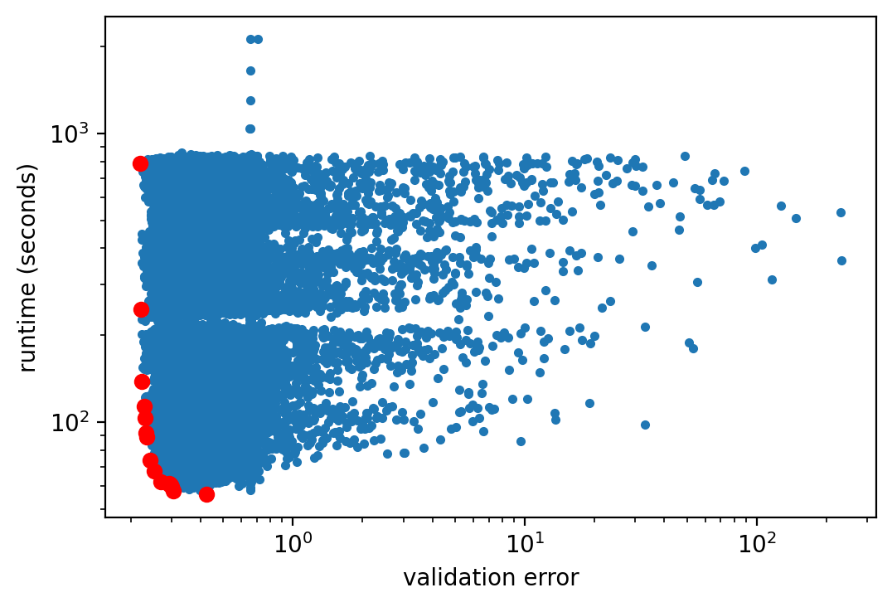

# What is Hyperparameter Optimization?


While weight parameters of a neural network model are automatically determined during training, e.g. by stochastic gradient descent, **hyperparameters** cannot be learned in this way. Without a different form of automation, the user has to set them manually by trial and error, in what amounts to a time-consuming and difficult part of machine learning workflows. We distinguish between hyperparameters that control the learning process (e.g., learning rate, batch size, momentum, optimizer choice) and hyperparameters that define model shape and capacity (e.g., type of activation function, number of units per layer). The choice of hyperparameters in general directly affects the final performance of our machine learning algorithm. For example, previous work beat the performance of advanced state-of-the-art models by optimizing the hyperparameter of much simpler models :cite:`snoek-nips12a`. 

Hyperparameters play a critical role in machine learning. Not only do they determine the generalization capabilities of trained models, they can even be critical for what constitutes the state-of-the-art. Indeed, results reported in an empirical study might look very differently for another choice of 
hyperparameters and so would be the conclusions drawn. Unfortunately, it is not uncommon that published results do not report the specific hyperparameters that were used to run experiments, for instance, to demonstrate that a proposed method  is superior to previously published ones, and are thus not reproducible, putting in 
question what actually is the state-of-the-art in machine learning today :cite:`haibe-kains:2020:transparency`.

The need to manually tune the training process and structure of a deep neural network constitutes a significant gap towards the promise of end to end learning and artificial intelligence. If we are willing to spend sufficient computational resources, our methods should be able to configure themselves. Hyperparameter optimization aims to automatically find a performant hyperparameter configuration of any machine learning method. The main idea is to cast the search for the right hyperparameters as an optimization problem, to maximize the validation performance of the algorithm.


In this chapter, we provide an overview of the basics of hyperparameter optimization and look at several state-of-the-art methods from the literature. As a running example, we will show how to automatically tune hyperparameters of a convolutional neural network. Any successful HPO method needs to provide solutions for two decision-making primitives, **scheduling** and **search**, and we will highlight the most prominent current solutions for either. Scheduling amounts to decisions of how much resources to spend on a hyperparameter configuration, e.g. when to stop, pause, or resume training, while search is about which configurations to evaluate in the first place. A specific focus in this chapter will lie on model-based approaches to search, which in practice are often more sample efficient than their random-search based counterparts. Since hyperparameter optimization requires us to train and validate several machine learning models, we will also see how we can distribute these methods. To avoid distracting boiler-plate code, we will use the Python framework **Syne Tune**, providing us with an simple interface for distributed hyperparameter optimization.

```{.python .input  n=1}
!pip install torch
!pip install torchvision
```

```{.json .output n=1}
[
 {
  "name": "stdout",
  "output_type": "stream",
  "text": "Requirement already satisfied: torch in /Users/kleiaaro/virtualenvs/d2l/lib/python3.8/site-packages (1.10.0)\nRequirement already satisfied: typing-extensions in /Users/kleiaaro/virtualenvs/d2l/lib/python3.8/site-packages (from torch) (3.10.0.2)\n\u001b[33mWARNING: You are using pip version 20.0.2; however, version 21.3.1 is available.\nYou should consider upgrading via the '/Users/kleiaaro/virtualenvs/d2l/bin/python -m pip install --upgrade pip' command.\u001b[0m\nRequirement already satisfied: torchvision in /Users/kleiaaro/virtualenvs/d2l/lib/python3.8/site-packages (0.11.1)\nRequirement already satisfied: numpy in /Users/kleiaaro/virtualenvs/d2l/lib/python3.8/site-packages (from torchvision) (1.21.2)\nRequirement already satisfied: torch==1.10.0 in /Users/kleiaaro/virtualenvs/d2l/lib/python3.8/site-packages (from torchvision) (1.10.0)\nRequirement already satisfied: pillow!=8.3.0,>=5.3.0 in /Users/kleiaaro/virtualenvs/d2l/lib/python3.8/site-packages (from torchvision) (8.4.0)\nRequirement already satisfied: typing-extensions in /Users/kleiaaro/virtualenvs/d2l/lib/python3.8/site-packages (from torch==1.10.0->torchvision) (3.10.0.2)\n\u001b[33mWARNING: You are using pip version 20.0.2; however, version 21.3.1 is available.\nYou should consider upgrading via the '/Users/kleiaaro/virtualenvs/d2l/bin/python -m pip install --upgrade pip' command.\u001b[0m\n"
 }
]
```

## Introduction to Syne Tune

Syne Tune can be installed as follows.

```{.python .input  n=23}
!git clone git@github.com:awslabs/syne-tune.git syne_tune
```

```{.json .output n=23}
[
 {
  "name": "stdout",
  "output_type": "stream",
  "text": "Cloning into 'sagemaker_tune'...\nremote: Enumerating objects: 1488, done.\u001b[K\nremote: Counting objects: 100% (1488/1488), done.\u001b[K\nremote: Compressing objects: 100% (750/750), done.\u001b[K\nremote: Total 1488 (delta 955), reused 1173 (delta 672), pack-reused 0\u001b[K\nReceiving objects: 100% (1488/1488), 1016.16 KiB | 2.98 MiB/s, done.\nResolving deltas: 100% (955/955), done.\n"
 }
]
```

```{.python .input  n=13}
!cd syne-tune
!ls
```

```{.json .output n=13}
[
 {
  "name": "stdout",
  "output_type": "stream",
  "text": "\u001b[1m\u001b[36mCIFAR10\u001b[m\u001b[m            bo.md              hyperopt-intro.md  lib.bib\r\n\u001b[1m\u001b[36m_build\u001b[m\u001b[m             config.ini         \u001b[1m\u001b[36mimg\u001b[m\u001b[m                rs.md\r\nadvanced-hpo.md    examples_hpo.ipynb index.md           \u001b[1m\u001b[36msagemaker-tune\u001b[m\u001b[m\r\n"
 }
]
```

```{.python .input  n=24}
!pip install -e .[extra]
```

```{.json .output n=24}
[
 {
  "name": "stdout",
  "output_type": "stream",
  "text": "Obtaining file:///Users/kleiaaro/git/d2l-en/chapter_hyperparameter_optimization/sagemaker_tune\nRequirement already satisfied: boto3 in /Users/kleiaaro/virtualenvs/d2l/lib/python3.8/site-packages (from sagemaker-tune==0.1) (1.20.4)\nRequirement already satisfied: sagemaker>=2.32.0 in /Users/kleiaaro/virtualenvs/d2l/lib/python3.8/site-packages (from sagemaker-tune==0.1) (2.68.0)\nRequirement already satisfied: dill in /Users/kleiaaro/virtualenvs/d2l/lib/python3.8/site-packages (from sagemaker-tune==0.1) (0.3.4)\nRequirement already satisfied: PyYaml in /Users/kleiaaro/virtualenvs/d2l/lib/python3.8/site-packages (from sagemaker-tune==0.1) (5.4.1)\nRequirement already satisfied: pandas in /Users/kleiaaro/virtualenvs/d2l/lib/python3.8/site-packages (from sagemaker-tune==0.1) (1.3.3)\nRequirement already satisfied: ujson in /Users/kleiaaro/virtualenvs/d2l/lib/python3.8/site-packages (from sagemaker-tune==0.1) (4.2.0)\nRequirement already satisfied: typing_extensions in /Users/kleiaaro/virtualenvs/d2l/lib/python3.8/site-packages (from sagemaker-tune==0.1) (3.10.0.2)\nRequirement already satisfied: pytest in /Users/kleiaaro/virtualenvs/d2l/lib/python3.8/site-packages (from sagemaker-tune==0.1) (6.2.5)\nRequirement already satisfied: ray[tune] in /Users/kleiaaro/virtualenvs/d2l/lib/python3.8/site-packages (from sagemaker-tune==0.1) (1.8.0)\nRequirement already satisfied: sklearn in /Users/kleiaaro/virtualenvs/d2l/lib/python3.8/site-packages (from sagemaker-tune==0.1) (0.0)\nRequirement already satisfied: scikit-optimize in /Users/kleiaaro/virtualenvs/d2l/lib/python3.8/site-packages (from sagemaker-tune==0.1) (0.9.0)\nRequirement already satisfied: scipy in /Users/kleiaaro/virtualenvs/d2l/lib/python3.8/site-packages (from sagemaker-tune==0.1) (1.7.1)\nRequirement already satisfied: autograd in /Users/kleiaaro/virtualenvs/d2l/lib/python3.8/site-packages (from sagemaker-tune==0.1) (1.3)\nRequirement already satisfied: requests in /Users/kleiaaro/virtualenvs/d2l/lib/python3.8/site-packages (from sagemaker-tune==0.1) (2.26.0)\nRequirement already satisfied: torch in /Users/kleiaaro/virtualenvs/d2l/lib/python3.8/site-packages (from sagemaker-tune==0.1) (1.10.0)\nRequirement already satisfied: torchvision in /Users/kleiaaro/virtualenvs/d2l/lib/python3.8/site-packages (from sagemaker-tune==0.1) (0.11.1)\nRequirement already satisfied: filelock in /Users/kleiaaro/virtualenvs/d2l/lib/python3.8/site-packages (from sagemaker-tune==0.1) (3.3.2)\nRequirement already satisfied: tqdm in /Users/kleiaaro/virtualenvs/d2l/lib/python3.8/site-packages (from sagemaker-tune==0.1) (4.62.3)\nRequirement already satisfied: s3transfer<0.6.0,>=0.5.0 in /Users/kleiaaro/virtualenvs/d2l/lib/python3.8/site-packages (from boto3->sagemaker-tune==0.1) (0.5.0)\nRequirement already satisfied: botocore<1.24.0,>=1.23.4 in /Users/kleiaaro/virtualenvs/d2l/lib/python3.8/site-packages (from boto3->sagemaker-tune==0.1) (1.23.4)\nRequirement already satisfied: jmespath<1.0.0,>=0.7.1 in /Users/kleiaaro/virtualenvs/d2l/lib/python3.8/site-packages (from boto3->sagemaker-tune==0.1) (0.10.0)\nRequirement already satisfied: importlib-metadata>=1.4.0 in /Users/kleiaaro/virtualenvs/d2l/lib/python3.8/site-packages (from sagemaker>=2.32.0->sagemaker-tune==0.1) (4.8.2)\nRequirement already satisfied: numpy>=1.9.0 in /Users/kleiaaro/virtualenvs/d2l/lib/python3.8/site-packages (from sagemaker>=2.32.0->sagemaker-tune==0.1) (1.21.2)\nRequirement already satisfied: google-pasta in /Users/kleiaaro/virtualenvs/d2l/lib/python3.8/site-packages (from sagemaker>=2.32.0->sagemaker-tune==0.1) (0.2.0)\nRequirement already satisfied: smdebug-rulesconfig==1.0.1 in /Users/kleiaaro/virtualenvs/d2l/lib/python3.8/site-packages (from sagemaker>=2.32.0->sagemaker-tune==0.1) (1.0.1)\nRequirement already satisfied: pathos in /Users/kleiaaro/virtualenvs/d2l/lib/python3.8/site-packages (from sagemaker>=2.32.0->sagemaker-tune==0.1) (0.2.8)\nRequirement already satisfied: protobuf>=3.1 in /Users/kleiaaro/virtualenvs/d2l/lib/python3.8/site-packages (from sagemaker>=2.32.0->sagemaker-tune==0.1) (3.19.1)\nRequirement already satisfied: protobuf3-to-dict>=0.1.5 in /Users/kleiaaro/virtualenvs/d2l/lib/python3.8/site-packages (from sagemaker>=2.32.0->sagemaker-tune==0.1) (0.1.5)\nRequirement already satisfied: packaging>=20.0 in /Users/kleiaaro/virtualenvs/d2l/lib/python3.8/site-packages (from sagemaker>=2.32.0->sagemaker-tune==0.1) (21.0)\nRequirement already satisfied: attrs in /Users/kleiaaro/virtualenvs/d2l/lib/python3.8/site-packages (from sagemaker>=2.32.0->sagemaker-tune==0.1) (21.2.0)\nRequirement already satisfied: python-dateutil>=2.7.3 in /Users/kleiaaro/virtualenvs/d2l/lib/python3.8/site-packages (from pandas->sagemaker-tune==0.1) (2.8.2)\nRequirement already satisfied: pytz>=2017.3 in /Users/kleiaaro/virtualenvs/d2l/lib/python3.8/site-packages (from pandas->sagemaker-tune==0.1) (2021.1)\nRequirement already satisfied: iniconfig in /Users/kleiaaro/virtualenvs/d2l/lib/python3.8/site-packages (from pytest->sagemaker-tune==0.1) (1.1.1)\nRequirement already satisfied: pluggy<2.0,>=0.12 in /Users/kleiaaro/virtualenvs/d2l/lib/python3.8/site-packages (from pytest->sagemaker-tune==0.1) (1.0.0)\nRequirement already satisfied: toml in /Users/kleiaaro/virtualenvs/d2l/lib/python3.8/site-packages (from pytest->sagemaker-tune==0.1) (0.10.2)\nRequirement already satisfied: py>=1.8.2 in /Users/kleiaaro/virtualenvs/d2l/lib/python3.8/site-packages (from pytest->sagemaker-tune==0.1) (1.11.0)\nRequirement already satisfied: msgpack<2.0.0,>=1.0.0 in /Users/kleiaaro/virtualenvs/d2l/lib/python3.8/site-packages (from ray[tune]->sagemaker-tune==0.1) (1.0.2)\nRequirement already satisfied: click>=7.0 in /Users/kleiaaro/virtualenvs/d2l/lib/python3.8/site-packages (from ray[tune]->sagemaker-tune==0.1) (8.0.3)\nRequirement already satisfied: jsonschema in /Users/kleiaaro/virtualenvs/d2l/lib/python3.8/site-packages (from ray[tune]->sagemaker-tune==0.1) (3.2.0)\nRequirement already satisfied: grpcio>=1.28.1 in /Users/kleiaaro/virtualenvs/d2l/lib/python3.8/site-packages (from ray[tune]->sagemaker-tune==0.1) (1.41.1)\nRequirement already satisfied: redis>=3.5.0 in /Users/kleiaaro/virtualenvs/d2l/lib/python3.8/site-packages (from ray[tune]->sagemaker-tune==0.1) (3.5.3)\nRequirement already satisfied: tabulate; extra == \"tune\" in /Users/kleiaaro/virtualenvs/d2l/lib/python3.8/site-packages (from ray[tune]->sagemaker-tune==0.1) (0.8.9)\nRequirement already satisfied: tensorboardX>=1.9; extra == \"tune\" in /Users/kleiaaro/virtualenvs/d2l/lib/python3.8/site-packages (from ray[tune]->sagemaker-tune==0.1) (2.4)\nRequirement already satisfied: scikit-learn in /Users/kleiaaro/virtualenvs/d2l/lib/python3.8/site-packages (from sklearn->sagemaker-tune==0.1) (1.0.1)\nRequirement already satisfied: joblib>=0.11 in /Users/kleiaaro/virtualenvs/d2l/lib/python3.8/site-packages (from scikit-optimize->sagemaker-tune==0.1) (1.1.0)\nRequirement already satisfied: pyaml>=16.9 in /Users/kleiaaro/virtualenvs/d2l/lib/python3.8/site-packages (from scikit-optimize->sagemaker-tune==0.1) (21.10.1)\nRequirement already satisfied: future>=0.15.2 in /Users/kleiaaro/virtualenvs/d2l/lib/python3.8/site-packages (from autograd->sagemaker-tune==0.1) (0.18.2)\nRequirement already satisfied: charset-normalizer~=2.0.0; python_version >= \"3\" in /Users/kleiaaro/virtualenvs/d2l/lib/python3.8/site-packages (from requests->sagemaker-tune==0.1) (2.0.4)\nRequirement already satisfied: certifi>=2017.4.17 in /Users/kleiaaro/virtualenvs/d2l/lib/python3.8/site-packages (from requests->sagemaker-tune==0.1) (2021.5.30)\nRequirement already satisfied: idna<4,>=2.5; python_version >= \"3\" in /Users/kleiaaro/virtualenvs/d2l/lib/python3.8/site-packages (from requests->sagemaker-tune==0.1) (3.2)\nRequirement already satisfied: urllib3<1.27,>=1.21.1 in /Users/kleiaaro/virtualenvs/d2l/lib/python3.8/site-packages (from requests->sagemaker-tune==0.1) (1.26.6)\nRequirement already satisfied: pillow!=8.3.0,>=5.3.0 in /Users/kleiaaro/virtualenvs/d2l/lib/python3.8/site-packages (from torchvision->sagemaker-tune==0.1) (8.4.0)\nRequirement already satisfied: zipp>=0.5 in /Users/kleiaaro/virtualenvs/d2l/lib/python3.8/site-packages (from importlib-metadata>=1.4.0->sagemaker>=2.32.0->sagemaker-tune==0.1) (3.6.0)\nRequirement already satisfied: six in /Users/kleiaaro/virtualenvs/d2l/lib/python3.8/site-packages (from google-pasta->sagemaker>=2.32.0->sagemaker-tune==0.1) (1.16.0)\nRequirement already satisfied: multiprocess>=0.70.12 in /Users/kleiaaro/virtualenvs/d2l/lib/python3.8/site-packages (from pathos->sagemaker>=2.32.0->sagemaker-tune==0.1) (0.70.12.2)\nRequirement already satisfied: ppft>=1.6.6.4 in /Users/kleiaaro/virtualenvs/d2l/lib/python3.8/site-packages (from pathos->sagemaker>=2.32.0->sagemaker-tune==0.1) (1.6.6.4)\nRequirement already satisfied: pox>=0.3.0 in /Users/kleiaaro/virtualenvs/d2l/lib/python3.8/site-packages (from pathos->sagemaker>=2.32.0->sagemaker-tune==0.1) (0.3.0)\nRequirement already satisfied: pyparsing>=2.0.2 in /Users/kleiaaro/virtualenvs/d2l/lib/python3.8/site-packages (from packaging>=20.0->sagemaker>=2.32.0->sagemaker-tune==0.1) (2.4.7)\nRequirement already satisfied: pyrsistent>=0.14.0 in /Users/kleiaaro/virtualenvs/d2l/lib/python3.8/site-packages (from jsonschema->ray[tune]->sagemaker-tune==0.1) (0.18.0)\nRequirement already satisfied: setuptools in /Users/kleiaaro/virtualenvs/d2l/lib/python3.8/site-packages (from jsonschema->ray[tune]->sagemaker-tune==0.1) (45.2.0)\nRequirement already satisfied: threadpoolctl>=2.0.0 in /Users/kleiaaro/virtualenvs/d2l/lib/python3.8/site-packages (from scikit-learn->sklearn->sagemaker-tune==0.1) (3.0.0)\nInstalling collected packages: sagemaker-tune\n  Attempting uninstall: sagemaker-tune\n    Found existing installation: sagemaker-tune 0.1\n    Uninstalling sagemaker-tune-0.1:\n      Successfully uninstalled sagemaker-tune-0.1\n  Running setup.py develop for sagemaker-tune\nSuccessfully installed sagemaker-tune\n\u001b[33mWARNING: You are using pip version 20.0.2; however, version 21.3.1 is available.\nYou should consider upgrading via the '/Users/kleiaaro/virtualenvs/d2l/bin/python -m pip install --upgrade pip' command.\u001b[0m\n"
 }
]
```

## How do we define Hyperparameter Optimization?


The performance of our machine learning algorithm can be seen as a function $f: \mathcal{X} \rightarrow \mathbb{R}$ that maps from our hyperparameter space $\mathbf{x} \in \mathcal{X}$ to the validation performance. For every evaluation of $f(\mathbf{x})$, we have to train and validate our machine learning algorithm, which can take a long time. We will see below how much cheaper surrogates can help with the optimization of $f$. Training is stochastic in general (e.g., weights are randomly initialized), so that our observations will be noisy: $y \sim f(\mathbf{x}) + \epsilon$, where we assume that $\epsilon \sim N(0, \sigma)$.

Now, given our objective function $f$, hyperparameter optimization aims to find $\mathbf{x}_{\star} \in argmin_{\mathbf{x} \in \mathcal{X}} f(\mathbf{x})$. Since $f$ is the validation performance after training, there is no efficient way to compute gradients with respect to $\mathbf{x}$. While there is recent work to drive HPO by approximate "hypergradients", none of the existing approaches are competitive with the state-of-the-art yet, and we will not discuss them here.

Here is code for the training problem we will use as running example in this chapter. We train a variant of ResNet18 on a part of the CIFAR10 training dataset, using the remainder as validation set,
the error on which we will minimize. The training loss is augmented by weight decay regularization, and we use SGD optimization with momentum.
While modern HPO methods really only shine on larger and more difficult problems than this one, its small size and simplicity makes it
feasible for a tutorial.

MS: Is training set size 100 what we want here?

MS: Should make epochs part of config as well.

```{.python .input  n=4}
import os
import torch
import torchvision

from torchvision import transforms
from torchvision import datasets
from torchvision import models


class Model(torch.nn.Module):
    def __init__(self):
        super().__init__()
        self.resnet = models.resnet18(pretrained=False, num_classes=10)
        self.resnet.conv1 = torch.nn.Conv2d(
            3, 64, kernel_size=3, stride=1, padding=1, bias=False)
        self.resnet.maxpool = torch.nn.Identity()

    def forward(self, x):
        x = self.resnet(x)
        x = torch.nn.functional.log_softmax(x, dim=1)
        return x

def get_CIFAR10(root):
    input_size = 32
    num_classes = 10
    normalize = [(0.4914, 0.4822, 0.4465), (0.2023, 0.1994, 0.2010)]
    train_transform = transforms.Compose(
        [
            transforms.RandomCrop(32, padding=4),
            transforms.RandomHorizontalFlip(),
            transforms.ToTensor(),
            transforms.Normalize(*normalize),
        ]
    )
    local_path = os.path.join(root, 'CIFAR10')
    train_dataset = datasets.CIFAR10(
        local_path, train=True, transform=train_transform, download=True)

    valid_transform = transforms.Compose(
        [
            transforms.ToTensor(),
            transforms.Normalize(*normalize),
        ]
    )
    valid_dataset = datasets.CIFAR10(
        local_path, train=True, transform=valid_transform, download=True)

    return input_size, num_classes, train_dataset, valid_dataset


def train(model, train_loader, optimizer):
    model.train()
    total_loss = []
    for data, target in train_loader:
        if torch.cuda.is_available():
            data = data.cuda()
            target = target.cuda()
        optimizer.zero_grad()
        prediction = model(data)
        loss = torch.nn.functional.nll_loss(prediction, target)
        loss.backward()
        optimizer.step()
        total_loss.append(loss.item())
    avg_loss = sum(total_loss) / len(total_loss)

def valid(model, valid_loader):
    model.eval()
    loss = 0
    correct = 0
    for data, target in valid_loader:
        with torch.no_grad():
            if torch.cuda.is_available():
                data = data.cuda()
                target = target.cuda()
            prediction = model(data)
            prediction = prediction.max(1)[1]
            correct += prediction.eq(
                target.view_as(prediction)).sum().item()
    n_valid = len(valid_loader.sampler)
    percentage_correct = 100.0 * correct / n_valid
    return 1 - percentage_correct / 100


def objective(config, epochs=3, path='./'):
    batch_size = config['batch_size']
    learning_rate = config['learning_rate']
    momentum = config['momentum']
    weight_decay = config['weight_decay']
    
    
    input_size, num_classes, train_dataset, valid_dataset = get_CIFAR10(
            root=path)

    indices = list(range(train_dataset.data.shape[0]))
    train_idx, valid_idx = indices[:100], indices[-100:]
    train_sampler = torch.utils.data.SubsetRandomSampler(train_idx)
    valid_sampler = torch.utils.data.SubsetRandomSampler(valid_idx)
    train_loader = torch.utils.data.DataLoader(train_dataset,
                                               batch_size=batch_size,
                                               # shuffle=True,
                                               num_workers=0,
                                               sampler=train_sampler,
                                               pin_memory=True)
    valid_loader = torch.utils.data.DataLoader(valid_dataset,
                                               batch_size=128,
                                               # shuffle=False,
                                               num_workers=0,
                                               sampler=valid_sampler,
                                               pin_memory=True)

    model = Model()
    if torch.cuda.is_available():
        model = model.cuda()
        device = torch.device("cuda")
        # print(device)
        model = torch.nn.DataParallel(
            model, device_ids=[i for i in range(num_gpus)]).to(device)
    milestones = [25, 40]
    optimizer = torch.optim.SGD(
        model.parameters(), lr=learning_rate, momentum=momentum,
        weight_decay=weight_decay)
    scheduler = torch.optim.lr_scheduler.MultiStepLR(
        optimizer, milestones=milestones, gamma=0.1)

    for epoch in range(epochs):
        train(model, train_loader, optimizer)
        validation_error = valid(model, valid_loader)
        scheduler.step()

    return validation_error
```

Note how `objective` is parameterized by the hyperparameter configuration `config`,
consisting of `batch_size`, `learning_rate`, `momentum`, `weight_decay`, and it returns the
validation error after training for `epochs` epochs.


## Which metrics are important?


MS: I think this is good for now, but we may want to check whether some basics here are already well explained in
early chapters, and if so, just refer to them.

### Objective Function

Arguably the most common way to estimate the validation performance of a machine learning algorithm is to compute its error (e.g classification error) on a hold out validation set. We cannot use the training loss to optimize the hyperparameters, as this would lead to overfitting. Unfortunately, in case of small datasets we often do not have access to a sufficient large validation dataset. In this case we can apply $k$-fold cross validation and use the average validation loss across all folds as metric to optimize. However, at least in the standard form of HPO, this makes the optimization process $k$ times slower. 

We can generalize the definition of HPO in order to deal with multiple objectives $f_0, ... f_k$ at the same time. For example, we might not only interested in optimize the validation performance, but also the cost or the latency of the model. However, this means we will not have a single $\mathbf{x}$ anymore that optimizes all objective functions at the same time.
We can resolve this situation by optimizing one of the objectives, subject to constraints formulated in terms of the others. In our example,
we could minimize validation error, subject to a bound on latency dictated by service level agreements. More ambitiously, we can aim
to sample the Pareto front of such configurations not strictly dominated by any other points.


:width:`400px`
:label:`pareto_front`


### Cost

Another relevant metric is the cost of evaluating $f(\mathbf{x})$ at a configuration $\mathbf{x}$. Different to validation error or prediction latency,
this metric is not a function of the final trained model, but a measure of training wall-clock time. For example, if we tune the number of layers or units per layer, larger networks are slower
to train than smaller ones. In our runnning example, training time does not depend on `learning_rate`, `momentum`, `weight_decay`, but does depend in general on `batch_size`, due to how GPUs
work. Counting cost in terms of wall-clock time is more relevant in practice than counting the number of evaluations. Some HPO algorithms explicitly model training cost and take it into
account for making decisions.

### Constraints

MS: Could be mentioned together with multi-objective.

In many scenarios we are not just interested in finding $\mathbf{x}_{\star}$, but a hyperparameter configuration that additionally full fills certain constraints. More formally, we seek to find $\mathbf{x}_{\star} \in argmin_{\mathbf{x} \in \mathcal{X}} f(\mathbf{x})$ s.t $c_1(\mathbf{x}) > 0, ..., c_m(\mathbf{x}) > 0$. Typical constraints could be, for example, the memory consumption of $\mathbf{x}$ or fairness constraints.

## Search Spaces

Along with the objective function $f(\mathbf{x})$, we also need to define the feasible set $\mathcal{X}$ to optimize over, the *search space* or *configuration space*.
In this chapter, we restrict ourselves to search spaces which decompose as product over the individual hyperparameters. Each
hyperparameter. Here is an example search space for our running example:

```{.python .input  n=31}
from syne_tune.syne_tune.search_space import loguniform, uniform, randint

search_space = {
   "learning_rate": loguniform(1e-5, 1e-1),
   "momentum": uniform(0.0, 0.99),
   "weight_decay": loguniform(1e-9, 1e-2),
   "batch_size": randint(8, 128)
}
```

Each parameter has a data type, such as `float` (for `learning_rate`, `momentum`, `weight_decay`) or `int` (for `batch_size`), as well as a closed bounded range
(lower and upper bounds). Some positive parameters (such as `learning_rate` or `weight_decay`) are best represented on a logarithmic scale
(optimal values can differ by orders of magnitude), while others (like `momentum`) come with linear scale. As suggested by the
naming in Syne Tune, another way to define hyperparameter types is as bounded distributions, often uniform or loguniform.
Methods driven by random search sample independent values from these distributions for every search decision.

One important data type missing from our running example is `categorical`. For example, we could extend it by
`activation` of type `categorical(['ReLU', 'LeakyReLU', 'Softplus'])`, in order to specify the
non-linear activation functions. This data type is for finite parameters, whose values have no ordering or distance
relations with each other.

It is tempting to try and "simplify" an HPO problem by turning numerical into categorical parameters. For example, why not specify
`batch_size` as `categorical([8, 32, 128])`. However, not only does this constitute another "choice by hand" we originally wanted to avoid,
for most competitive HPO methods, it either does not matter or makes things worse. Uniform random sampling just as effectively covers a
bounded range than a finite set. As we will see, many model-based HPO methods relax `int` to `float` and use
one-hot encoding for `categorical`, so turning `int` or `float` into `categorical` increases the dimension of the encoding
space. If you still insist on finite ranges for `float` variables, Syne Tune provides the `finrange` and `logfinrange` types.

HIER!

In general, the structure of the search space $\mathcal{X}$ can be complex and it can be quite different from $\mathbb{R}^d$. Some hyperparameters can encode choices (e.g., type of activation function used in a neural network) or depend on other hyperparameters (e.g., the number of units of the $l$-th layer of a neural network is 
only relevant if the network has at least $l+1$ layers). Hence, hyperparameter optimization consists in determining a small set of good hyperparameters to search 
over and probing the underlying machine learning algorithm at these values in the hope that 
one of them will be close to the best hyperparameters $\mathbf{x}_*$. 


## How can we evaluate hyperparameter optimization methods?

In the next section we will look at different hyperparameter optimization methods. To understand their difference better, we will described here how we can evaluate them. In practice, we usually run the hyperparameter optimization once and use the best found hyperparameters to train our final model. However, since the most hyperparameter optimization method come with an intrinsic randomness, we have to run them multiple times with a different seed for the random number generator and average the results to assess their performance.

Key requirement for any hyperparameter optimization methods is not just to return a well peforming configuration, but to find it as quickly as possible. Therefor, we will look at the anytime performance of an algorithm. We define the anytime performance as the validation performance of the best found configuration, i.e incumbent, at the current time step. Furthermore, we usually care less about the number of function evaluations, but rather the time (i.e wall-clock time) we have to wait until our optimizer returns a hyperparameter configuration. Hence, we will compare hyperparameter optimization algorithms by plotting the anytime performance over wall-clock time. 

## Summary

```{.python .input}

```
