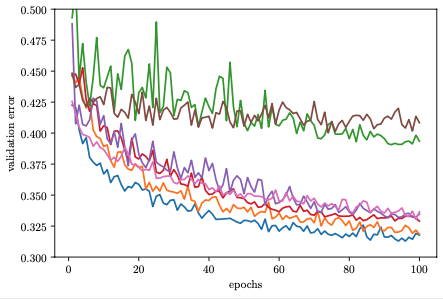
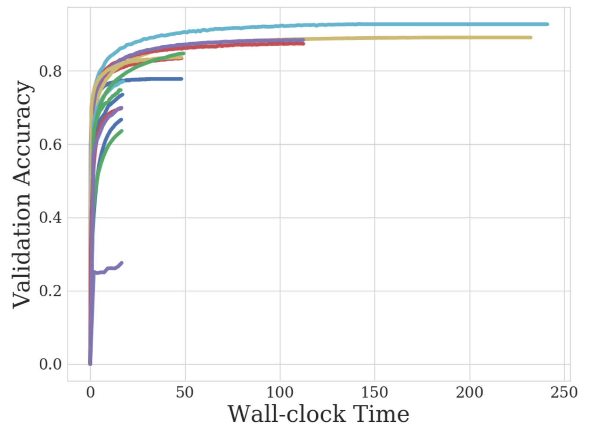
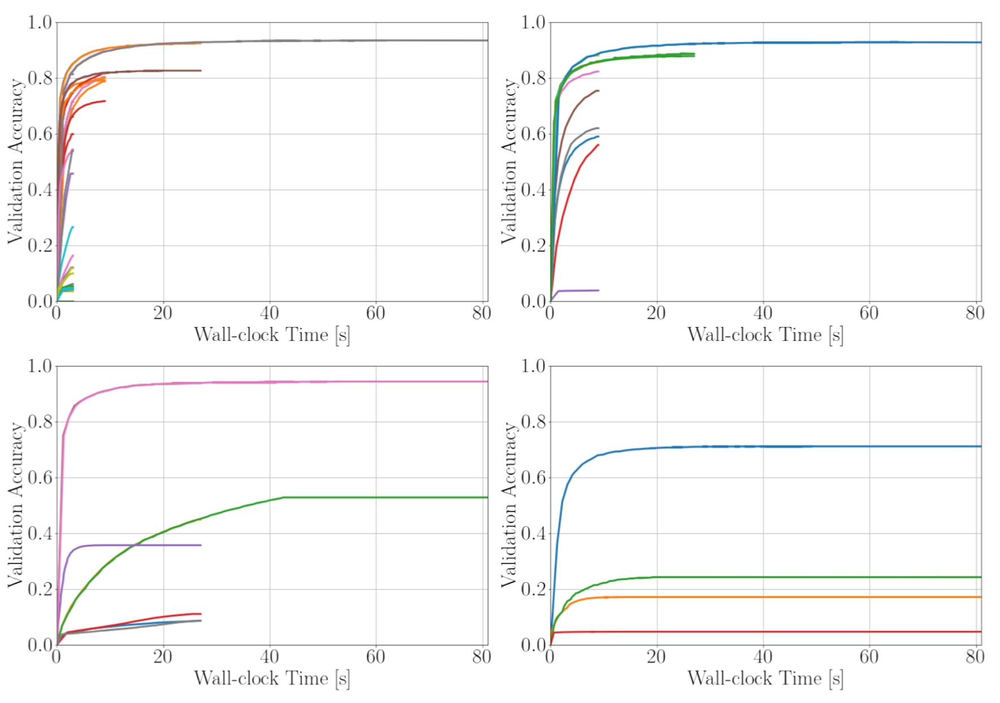

# Random Search

The first method we will look at is called random search. The idea is to first define a probability distribution for each hyperparameter individually. We then iteratively sample hyperparameter configurations from these probability distributions. Compared to grid search, which evaluate a user defined grid of hyperparameter configurations, random search does not suffer from the curse of dimensionality.

If we use probability distributions that assign non-zero probability to each point in the search space, random search will asymptotically converge to the global optimum. However, it does not maintain a history of the previous observed points, such as model-based approaches that we will describe in later chapters, which renders it less sample efficient in practice.

## Sampling Configurations from the Search Space

First, we implement a method that allows us to sample random configurations from our search space. Each hyperparameter will be sampled independently from the other hyperparameters.

```{.python .input  n=1}
def sample(search_space):
    config = {}
    for hyperparameter in search_space:
        config[hyperparameter] = search_space[hyperparameter].sample()
    return config

```

## The Random Search Loop

Now, we can implement the main optimization loop of random search, that iterates until we reach the final number of iterations specified by the users. In each iteration, we first sample a hyperparameter configuration from the subroutine that we implemented above and then train and validate the model with the new candidate. We also maintain the current incumbent, i.e the best configuration we have found so far. This will be the configuration we will later return as the final configuration.

```{.python .input  n=4}
num_iterations = 10

incumbent = None
incumbent_performance = None
incumbent_trajectory = []

for i in range(num_iterations):
    config = sample(search_space)
    performance = objective(config)
    
    # bookkeeping
    if incumbent is None or incumbent_performance < performance:
        incumbent = config
        incumbent_performance = performance
    incumbent_trajectory.append(incumbent_performance)
```

Now we can plot the optimization trajectory of the incumbent to get the anytime performance of random search:

```{.python .input  n=4}
%matplotlib inline
from IPython import display
from matplotlib import pyplot as plt

display.set_matplotlib_formats('svg')

plt.plot(incumbent_trajectory);

```

## Asynchronous Random Search with SyneTune

We can speed up the optimization process by parallelizing the evaluation of hyperparameter configurations across a set of workers. Since random search is stateless it can be trivially parallelized and thereby achieves a perfect linear scaling with the number of workers. Also, compared to model-based approaches which we will discuss in the next Section, we do not have to synchronize our workers but can asynchronously sample a new configuration once a worker becomes available.

To avoid implementing a distributed framework that allows for parallel HPO from scratch, we will utilize SyneTune to run asynchronous random search on  our neural network example.

### Prepare Training Script

For SyneTune we have to provide a training script, that gets as input arguments the hyperparameter. Additionally, we have to report the performance after each epoch back via the report() function. The training loop is the same as in our previous example

```python
from argparse import ArgumentParser
from sagemaker_tune.report import Reporter

if __name__ == '__main__':
    parser = ArgumentParser()
    parser.add_argument('--learning_rate', type=float)
    parser.add_argument('--momentum', type=float)
    parser.add_argument('--weight_decay', type=float)
    parser.add_argument('--batch_size', type=float)

    args, _ = parser.parse_known_args()
    report = Reporter()

    for epoch in range(args.epochs):
        # ... train model and get accuracy        
        accuracy = objective(vars(args))
        
        # Feed the score back to Sagemaker Tune.
        report(epoch=epoch, accuracy=accuracy)
```


### Asynchronous Scheduler

First, we define the number of workers that evaluate trials concurrently and how long the optimization should run in seconds. We also need to specify which metric we aim to optimize, which should match the argument in the report function and if we maximize or minimize this metric.

```{.python .input  n=6}
n_workers = 4
runtime = 600
entry_point = "train_script.py"
mode = "max"
metric = "accuracy"
```

Next define the backend that we want to use. The option we will use is the local backend which parallelizes the HPO across multiple python process on a single instance. Alternatively, we can select the Sagemaker backend, which spans for each hyperparameter configuration a sagemaker instance.

```{.python .input  n=7}
from sagemaker_tune.backend.local_backend import LocalBackend
backend = LocalBackend(entry_point=str(entry_point))
```

Next we define how we want to schedule hyperparameter configurations. For random search we will use a simple FIFO scheduler.

```{.python .input  n=4}
from sagemaker_tune.optimizer.schedulers.fifo import FIFOScheduler

scheduler = FIFOScheduler(
    config_space,
    searcher='random',
    metric=metric,
    random_seed=random_seed)
```

Now, we can start the optimization process:

```{.python .input  n=4}
stop_criterion = StoppingCriterion(max_wallclock_time=runtime)
tuner = Tuner(
    backend=backend,
    scheduler=scheduler,
    stop_criterion=stop_criterion,
    n_workers=n_workers,
)

tuner.run()
```

The logs of all evaluated hyperparameter configuratons are stored for further analysis. At any time during the tuning job, we can easily get the results obtained so far and plotting the incumbent trajectory

```{.python .input}
from syne_tune.experiments import load_experiment
tuning_experiment = load_experiment(tuner.name)
tuning_experiment.plot()
```

## Early Stopping Hyperparameter Configurations

In the example above every neural network will be trained for the same amount of epochs. However, there is a high correlation between a hyperparameter configuration's performance after a few epochs and its final performance (see Figure :numref:`img_samples_lc`). We can see that after a few epochs we are already able to visually distinguish between the well performing and the poorly performing configurations. However, the correlation is not perfect and we might still require the full amount of epochs to identify the best performing configuration.

<!--  -->

:width:`400px`
:label:`img_samples_lc`

Based on this observation, we can free up compute resources by early stopping the evaluation of poorly performing configuration and allocating more resources to more promising configurations. This will eventually speed up the optimization process, since we have a higher throughput of configurations that we can try. More formally, we expand our definition in Section :ref:`sec_definition_hpo`, such that our objective function $f(\mathbf{x}, r)$ gets an additional input $r \in [r_{min}, r_{max}]$ that specifies the amount of resource that we are willing to spend for the evaluation of $\mathbf{x}$. We assume that both, the correlation to $f(\mathbf{x}) = f(\mathbf{x})$ as well as the computational cost $c(\mathbf{x}, r)$ increases with $r$. Typically $r$ represents the number of epochs for training the neural network. But also other resources are possible, such as the training dataset size or the number of cross-validation folds.  

## Successive Halving

One simple extension to random search is successive halving which iteratively terminates the evaluation of poorly performing configurations. Given a set of $N$ randomly sampled hyperparameters configurations and a halving constant $\eta \in \mathbb{Z}_+$ and $\eta \geq 2$, where, due to simplicitly we assume that $\frac{r_{max}}{r_{min}} = \eta^K$, with $K \in \mathbb{Z}$. Successive halving starts with evaluating all $N$ configuration with $r_{min}$ amount of resources. It then sorts all configuration based on the their observed performances, and only continues the evaluation of the top $\frac{N}{\eta}$ for $\eta r_{min}$ amount of resources. Each decision points is called a rung, and the full set of rungs is given by $\mathcal{R} \in \{r_{min} \eta^k | k=0, ..., K  \}$. This step is iterated until we reach $r_{max}$.

```{.python .input  n=4}
def successive_halving(n, r, s, eta):
    """
    Run one iteration of successive halving
    :param n: initial number of hyperparameter configurations
    :param r: initial number of iterations 
    :param s: defines the tradeoff between r and n
    """
    X = [ sample(search_space) for i in range(n)] 
    
    for i in range(s+1):
        val_losses = []
        # compute the number of configs n_i and epochs r_i
        n_configs = len(X)
        
        n_iterations = int(r * eta ** ( i ))
        
        
        # run all n_i configuration for r_i epochs 
        val_losses = [objective(xi, epochs=n_iterations) for xi in X]
            
        # keep only the best n_i/eta configurations
        idx = np.argsort(val_losses)[:(n_configs // eta)]
        X = [X[i] for i in idx]
```

<!--  -->

:width:`400px`
:label:`img_samples_sh`


## Hyperband


While successive halving can substantially speed up random search, its performance mostly hinges on $r_{min}$. If we set $r_{min}$ too small we might miss configurations that would achieve a top performance with more resources. However, a too large $r_{min}$ will allocated too many resource to poorly performing configurations.

Instead of using a fixed $r_{min}$, Hyperband runs successive halving iteratively as a subroutine by blancing the number of configurations $N$ and $r_{min}$, such that each round of succesive halving, called a bracket, consumes roughly the same amount of resources.
Note that, the last bracket uses $r_{min} = r_{max}$, which means that we effectively perform random search. 

```{.python .input  n=4}
def hyperband(max_iter=100, eta=3, iters=20):
    
    max_iter = 100  # maximum iterations/epochs per configuration
    eta = 3 # defines downsampling rate (default=3)
    s_max = int(np.log(max_iter)/np.log(eta))  # number of unique executions of Successive Halving (minus one)
    B = (s_max+1)*max_iter  # total number of iterations (without reuse) per execution of Succesive Halving (n,r)


    for i in range(iters):
        s = s_max - (i % (s_max + 1)) 
        
        # compute initial number of configurations and initial number to run configurations for
        # initial number of configurations
        n = int( np.ceil(B / max_iter / ( s + 1 ) * eta ** s ))
        
        # initial number of iterations per config
        r = max_iter * eta ** ( -s )

        # run successive halving
        successive_halving(n, r, s, eta)

```


:width:`400px`
:label:`img_samples_hb`

## Synchronous Hyperband


## Asynchronous Hyperband

As

```{.python .input  n=4}
from sagemaker_tune.optimizer.schedulers.hyperband import HyperbandScheduler

entry_point = "train_script.py"
mode = "min"
metric = "mean_loss"

backend = LocalBackend(entry_point=str(entry_point))

scheduler = HyperbandScheduler(
    config_space,
    searcher=searcher,
    search_options=search_options,
    max_t=max_steps,
    resource_attr='epoch',
    mode=mode,
    metric=metric,
    random_seed=random_seed)

stop_criterion = StoppingCriterion(max_wallclock_time=30)
tuner = Tuner(
    backend=backend,
    scheduler=scheduler,
    stop_criterion=stop_criterion,
    n_workers=n_workers,
)

tuner.run()
```

## Summary


## Excercise
