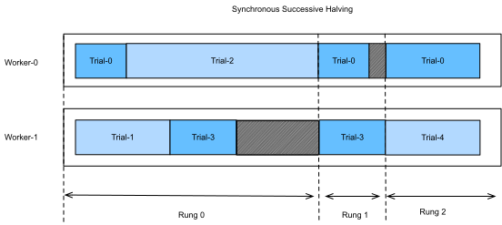

```{.python .input  n=1}
%load_ext d2lbook.tab
tab.interact_select(['mxnet', 'pytorch', 'tensorflow'])
```

# Asynchronous Successive Halving

:label:`sec_sh_async`

As we have seen in Section :numref:`sec_rs_async`, we can accelerate HPO by
distributing the evaluation of hyperparameter configurations across either
multiple instances or multiples CPUs / GPUs on a single instance. However, compared
to random search, it is not straightforward to run SH asynchronously in a
distributed setting. Before we can decide which configuration to run next, we first
have to collect all observations on the current rung level. This requires to
synchronize workers at each rung level. For example, for the lowest rung level
$r_{min}$, we first have to evaluate all $N = \eta^K$ configurations, before we
can promote the $\frac{1}{\eta}$ of them to the next rung level.

In any distributed system, synchronization typically implies idle time for workers.
First, we often observe high variations in training time across hyperparameter configurations.
For example, assuming the number of filter per layer is a hyperparameter, then
networks with smaller filter sizes finish training faster than networks with larger
filter sizes, which implies idle worker time due to stragglers. Moreover, the number
of slots in a rung level is not always a multiple of the number of workers, in which
case some workers may even sit idle for a full batch.

Figure :ref:`synchronous_sh` shows the scheduling of synchronous SH with $\eta=2$ for
four different trials with two workers. We start with evaluating Trial-0 and Trial-1
for one epoch and immediately continue with the next two trials once they are finished. Now, we first have to wait until Trial-2 finishes, which takes substantially more time than the other trials, before we can promote the best two trials, i.e. Trial-0 and Trial-3 to the next rung level. This causes an idiling time for Worker-1. Now, we continue with Rung 1. Also, here Trial-3 takes longer than Trial-0, which leads to an additional ideling time of Worker-0. Once, we reach Rung-2, only the best trial, Trial-0, remains which occupies only one worker. To avoid that Worker-1 idles during that time, most implementaitons of SH continue already with the next round, and start evaluating new trials (e.g Trial-4) on the first rung.


:width:`40px`
:label:`synchronous_sh`

Asynchronous successive halving (ASHA) :cite:`li-arxiv18` adapts SH to the asynchronous
parallel scenario. The main idea of ASHA is to promote configurations to the next rung
level as soon as we collected at least $\eta$ observations on the current rung level.
This rule may lead to suboptimal promotions: configurations can be promoted to the
next rung level, which in hindsight do not compare favourably against most others
at the same rung level. On the other hand, we get rid of all synchronization points
this way. In practice, such suboptimal initial promotions have only a modest impact on
performance, not only because the ranking of hyperparameter configurations is often
fairly consistent across rung levels, but also because rungs grow over time and
reflect the distribution of metric values at this level better and better. If a
worker is free, but no configuration can be promoted, we start a new configuration
with $r = r_{min}$, i.e the first rung level.

Figure :ref:`asha` shows the scheduling of the same configurations for ASHA. Once Trial-1
finishes, we collect the results of two trials (i.e Trial-0 and Trial-1) and
immediately promote the better of them (Trial-0) to the next rung level. After Trial-0
finishes on rung 1, there are too few trials there in order to support a further
promotion. Hence, we continue with rung 0 and evaluate Trial-3. Once Trial-3 finishes,
Trial-2 is still pending. At this point we have 3 trials evaluated on rung 0 and one
trial evaluated already on rung 1. Since Trial-3 performs worse than Trial-0 at rung 0,
and $\eta=2$, we cannot promote any new trial yet, and Worker-1 starts Trial-4 from
scratch instead. However, once Trial-2 finishes and
scores worse than Trial-3, the latter is promoted towards rung 1. Afterwards, we collected 2 evaluations on rung 1,
which means we can now promote Trial-0 towards rung 2. At the same time, Worker-1
continues with evaluating new trials (i.e., Trial-5) on rung 0.


:width:`40px`
:label:`asha`

As for asynchronous random search, we will use **Syne Tune** once more.

## Objective Function

Just as in Section :ref:`sec_rs_async`, we will use **Syne Tune** with the following
objective function.

```{.python .input  n=54}
def objective(learning_rate, batch_size, max_epochs):
    from d2l import torch as d2l    
    from syne_tune import Reporter
    model = d2l.AlexNet(lr=learning_rate)
    trainer = d2l.Trainer(max_epochs=1, num_gpus=1)
    data = d2l.FashionMNIST(batch_size=batch_size, resize=(224, 224))
    report = Reporter() 
    for epoch in range(1, max_epochs + 1):
        trainer.fit(model=model, data=data)
        validation_error = trainer.validate(model=model).cpu().numpy()
        report(epoch=epoch, validation_error=float(validation_error))
```

We also use the same configuration space as before

```{.python .input  n=55}
import logging

logging.basicConfig(level=logging.INFO)

from syne_tune import Tuner, StoppingCriterion
from syne_tune.backend.python_backend import PythonBackend
from syne_tune.config_space import randint, loguniform
from syne_tune.optimizer.baselines import ASHA

max_epochs = 4

config_space = {
   "learning_rate": loguniform(1e-5, 1e-1),
   "batch_size": randint(8, 128),
   "max_epochs": max_epochs,
}
```

```{.python .input}
# We have to set this number equal to the number of GPUs that are in the machine
# to run this notebook
n_workers = 4
max_wallclock_time = 15 * 60
```

## Asynchronous Scheduler

The code for running ASHA is a simple variation of what we did for asynchronous
random search.

```{.python .input  n=56}
scheduler = ASHA(
    config_space,
    metric="validation_error",
    mode="min",
    max_resource_attr="max_epochs",
    resource_attr="epoch",
    type="promotion",
    grace_period=1,  # this corresponds to r_min 
    reduction_factor=2,  # this corresponds to eta
)  
```

Here, `metric` and `resource_attr` specify the key names used with the `report`
callback, and `max_resource_attr` denotes which input to the objective function
corresponds to $r_{max}$. Moreover, `grace_period` provides $r_{min}$, and
`reduction_factor` is $\eta$.

Now, we can run Syne Tune as before:

```{.python .input  n=57}
trial_backend = PythonBackend(tune_function=objective, config_space=config_space)

stop_criterion = StoppingCriterion(
    max_wallclock_time=max_wallclock_time
)
tuner = Tuner(
    trial_backend=trial_backend,
    scheduler=scheduler,
    stop_criterion=stop_criterion,
    n_workers=num_workers,
)
tuner.run()
```

After the experiment has finished, we can retrieve and plot results.

```{.python .input  n=59}
from syne_tune.experiments import load_experiment
e = load_experiment(tuner.name)
e.plot()
```

## Visualize the Optimization Process

Once more, we visualize the learning curves of every trial. Compares this to
asynchronous random search in Section :ref:`sec_rs_async`. As we have seen for
successive halving in Section :ref:`sec_mf_hpo`, most of the trials are stopped
at 1 or 2 epochs ($r_{min}$ or $\eta * r_{min}$). However, trials do not stop
at the same point, because they require different amount of time per epoch. If
we ran standard successive halving instead of ASHA, we would need to synchronize
our workers, before we can promote configurations to the next rung level. 

```{.python .input  n=60}
import matplotlib.pyplot as plt

results = e.results
for trial_id in results.trial_id.unique():
    df = results[results['trial_id'] == trial_id]
    plt.plot(
        df['st_tuner_time'],
        df['validation_error'],
        marker='o',
        label=f'trial {trial_id}'
    )
plt.xlabel('wall-clock time')
plt.ylabel('objective function')
plt.legend()
```

## Summary

## Excercise
