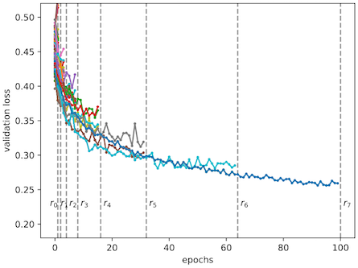

```{.python .input  n=1}
%load_ext d2lbook.tab
tab.interact_select(["pytorch"])
```

```{.json .output n=1}
[
 {
  "data": {
   "application/vnd.jupyter.widget-view+json": {
    "model_id": "82a2d950294441df9c27ae8ffd272f80",
    "version_major": 2,
    "version_minor": 0
   },
   "text/plain": "interactive(children=(Dropdown(description='tab', options=('pytorch',), value='pytorch'), Output()), _dom_clas\u2026"
  },
  "metadata": {},
  "output_type": "display_data"
 }
]
```

# Multi-fidelity Hyperparameter Optimization
:label:`sec_mf_hpo`

Training neural networks can be expensive even on moderate size datasets.
Depending on the configuration space (:numref:`sec_intro_config_spaces`),
hyperparameter optimization requires tens to hundreds of function evaluations
to find a well-performing hyperparameter configuration. As we have seen in
:numref:`sec_rs_async`, we can significantly speed up the overall wall-clock
time of HPO by exploiting parallel resources, but this does not reduce the total
amount of compute required.

In this section, we will show how the evaluation of hyperparameter configurations
can be sped up. Methods such as random search allocate the same amount of
resources (e.g., number of epochs, training data points) to each hyperparameter
evaluation. :numref:`img_samples_lc` depicts learning curves of a set of neural
networks trained with different hyperparameter configurations. After a few epochs we are
already able to visually distinguish between well-performing and suboptimal
configurations. However, the learning curves are noisy, and we might still require
the full amount of 100 epochs to identify the best performing one.


:label:`img_samples_lc`

Multi-fidelity hyperparameter optimization allocates more resources
to promising configurations and stop evaluations of poorly performing ones early.
This speeds up the optimization process, since we can try a larger number of
configurations for the same total amount of resources.

More formally, we expand our definition in :numref:`sec_definition_hpo`,
such that our objective function $f(\mathbf{x}, r)$ gets an additional input
$r \in [r_{\text{min}}, r_{max}]$, specifying the amount of resources that we are
willing to spend for the evaluation of configuration $\mathbf{x}$. We assume that
the error $f(\mathbf{x}, r)$ decreases with $r$, whereas the computational
cost $c(\mathbf{x}, r)$ increases. Typically, $r$ represents the number of
epochs for training the neural network, but it could also be the training
subset size or the number of cross-validation folds.

## Successive Halving
:label:`sec_mf_hpo_sh`

One of the simplest ways to adapt random search to the multi-fidelity setting is
*successive halving* :cite:`jamieson-aistats16,karnin-icml13`. The basic
idea is to start with $N$ configurations, for example randomly sampled from the
configuration space, and to train each of them for $r_{\text{min}}$ epochs only. We
then discard a fraction of the worst performing trials and train the remaining
ones for longer. Iterating this process, fewer trials run for longer, until at
least one trial reaches $r_{max}$ epochs.

More formally, consider a minimum budget $r_{\text{min}}$ (for example 1 epoch), a maximum
budget $r_{max}$, for example `max_epochs` in our previous example, and a halving
constant $\eta\in\{2, 3, \dots\}$. For simplicity, assume that
$r_{max} = r_{\text{min}} \eta^K$, with $K \in \mathbb{I}$ . The number of initial
configurations is then $N = \eta^K$. Let us define the set of rungs
$\mathcal{R} = \{ r_{\text{min}}, r_{\text{min}}\eta, r_{\text{min}}\eta^2, \dots, r_{max} \}$.

One round of successive halving proceeds as follows. We start with running $N$
trials until the first rung $r_{\text{min}}$. Sorting the validation errors, we keep
the top $1 / \eta$ fraction (which amounts to $\eta^{K-1}$ configurations) and
discard all the rest. The surviving trials are trained for the next rung
($r_{\text{min}}\eta$ epochs), and the process is repeated. At each rung, a
$1 / \eta$ fraction of trials survives and their training continues with a
$\eta$ times larger budget. With this particular choice of $N$, only a single
trial will be trained to the full budget $r_{max}$. Once such a round of
successive halving is done, we start the next one with a new set of initial
configurations, iterating until the total budget is spent.



We subclass the `HPOScheduler` base class from :numref:`sec_api_hpo` in order to
implement successive halving, allowing for a generic `HPOSearcher` object to
sample configurations (which, in our example below, will be a `RandomSearcher`).
Additionally, the user has to pass the minimum resource $r_{\text{min}}$, the maximum
resource $r_{max}$ and $\eta$ as input. Inside our scheduler, we maintain a
queue of configurations that still need to be evaluated for the current rung
$r_i$. We update the queue every time we jump to the next rung.

```{.python .input  n=2}
%%tab pytorch
from d2l import torch as d2l
import numpy as np
from scipy import stats
from collections import defaultdict
d2l.set_figsize()

class SuccessiveHalvingScheduler(d2l.HPOScheduler):  #@save
    def __init__(self, searcher, eta, r_min, r_max, prefact=1):
        self.save_hyperparameters()
        # Compute K, which is later used to determine the number of configurations
        self.K = int(np.log(r_max / r_min) / np.log(eta))
        # Define the rungs
        self.rung_levels = [r_min * eta ** k for k in range(self.K + 1)]
        if r_max not in self.rung_levels:
            # The final rung should be r_max
            self.rung_levels.append(r_max)
            self.K += 1
        # Bookkeeping
        self.observed_error_at_rungs = defaultdict(list)
        self.all_observed_error_at_rungs = defaultdict(list)
        # Our processing queue
        self.queue = []
```

In the beginning our queue is empty, and we fill it with
$n = \mathrm{prefact} \cdot \eta^{K}$ configurations, which are first evaluated on
the smallest rung $r_{\text{min}}$. Here, $\mathrm{prefact}$ allows us to reuse our
code in a different context. For the purpose of this section, we fix
$\mathrm{prefact} = 1$. Every time resources become available and the `HPOTuner`
object queries the `suggest` function, we return an element from the queue. Once
we finish one round of successive halving, which means that we evaluated all
surviving configurations on the highest resource level $r_{max}$ and our queue
is empty, we start the entire process again with a new, randomly sampled set
of configurations.

```{.python .input  n=3}
%%tab all
@d2l.add_to_class(SuccessiveHalvingScheduler)  #@save
def suggest(self):
    if len(self.queue) == 0:
        # Start a new round of successive halving
        # Number of configurations for the first rung:
        n0 = int(self.prefact * self.eta ** self.K)
        for _ in range(n0):
            config = self.searcher.sample_configuration()
            config["max_epochs"] = self.r_min  # Set r = r_min
            self.queue.append(config)
    # Return an element from the queue
    return self.queue.pop()
```

When we collected a new data point, we first update the searcher module.
Afterwards we check if we already collect all data points on the current rung.
If so, we sort all configurations and push the top $\frac{1}{\eta}$
configurations into the queue.

```{.python .input  n=4}
%%tab all
@d2l.add_to_class(SuccessiveHalvingScheduler)  #@save
def update(self, config: dict, error: float, info=None):
    ri = int(config["max_epochs"])  # Rung r_i
    # Update our searcher, e.g if we use Bayesian optimization later
    self.searcher.update(config, error, additional_info=info)
    self.all_observed_error_at_rungs[ri].append((config, error))
    if ri < self.r_max:
        # Bookkeeping
        self.observed_error_at_rungs[ri].append((config, error))
        # Determine how many configurations should be evaluated on this rung
        ki = self.K - self.rung_levels.index(ri)
        ni = int(self.prefact * self.eta ** ki)
        # If we observed all configuration on this rung r_i, we estimate the
        # top 1 / eta configuration, add them to queue and promote them for
        # the next rung r_{i+1}
        if len(self.observed_error_at_rungs[ri]) >= ni:
            kiplus1 = ki - 1
            niplus1 = int(self.prefact * self.eta ** kiplus1)
            best_performing_configurations = self.get_top_n_configurations(
                rung_level=ri, n=niplus1
            )
            riplus1 = self.rung_levels[self.K - kiplus1]  # r_{i+1}
            # Queue may not be empty: insert new entries at the beginning
            self.queue = [
                dict(config, max_epochs=riplus1)
                for config in best_performing_configurations
            ] + self.queue
            self.observed_error_at_rungs[ri] = []  # Reset
```

Configurations are sorted based on their observed performance on the current
rung.

```{.python .input  n=5}
%%tab all

@d2l.add_to_class(SuccessiveHalvingScheduler)  #@save
def get_top_n_configurations(self, rung_level, n):
    rung = self.observed_error_at_rungs[rung_level]
    if not rung:
        return []
    sorted_rung = sorted(rung, key=lambda x: x[1])
    return [x[0] for x in sorted_rung[:n]]
```

Let us see how successive halving is doing on our neural network example. We
will use $r_{\text{min}} = 2$, $\eta = 2$, $r_{max} = 10$, so that rung levels are
$2, 4, 8, 10$.

```{.python .input  n=6}
min_number_of_epochs = 2
max_number_of_epochs = 10
eta = 2
num_gpus=1

config_space = {
    "learning_rate": stats.loguniform(1e-2, 1),
    "batch_size": stats.randint(32, 256),
}
initial_config = {
    "learning_rate": 0.1,
    "batch_size": 128,
}
```

We just replace the scheduler with our new `SuccessiveHalvingScheduler`.

```{.python .input  n=7}
searcher = d2l.RandomSearcher(config_space, initial_config=initial_config)
scheduler = SuccessiveHalvingScheduler(
    searcher=searcher,
    eta=eta,
    r_min=min_number_of_epochs,
    r_max=max_number_of_epochs,
)
tuner = d2l.HPOTuner(
    scheduler=scheduler,
    objective=d2l.hpo_objective_lenet,
)
tuner.run(number_of_trials=30)
```

```{.json .output n=7}
[
 {
  "name": "stdout",
  "output_type": "stream",
  "text": "    error = 0.2068173885345459, runtime = 46.976895570755005\n"
 },
 {
  "data": {
   "image/svg+xml": "<?xml version=\"1.0\" encoding=\"utf-8\" standalone=\"no\"?>\n<!DOCTYPE svg PUBLIC \"-//W3C//DTD SVG 1.1//EN\"\n  \"http://www.w3.org/Graphics/SVG/1.1/DTD/svg11.dtd\">\n<svg xmlns:xlink=\"http://www.w3.org/1999/xlink\" width=\"240.554688pt\" height=\"180.65625pt\" viewBox=\"0 0 240.554688 180.65625\" xmlns=\"http://www.w3.org/2000/svg\" version=\"1.1\">\n <metadata>\n  <rdf:RDF xmlns:dc=\"http://purl.org/dc/elements/1.1/\" xmlns:cc=\"http://creativecommons.org/ns#\" xmlns:rdf=\"http://www.w3.org/1999/02/22-rdf-syntax-ns#\">\n   <cc:Work>\n    <dc:type rdf:resource=\"http://purl.org/dc/dcmitype/StillImage\"/>\n    <dc:date>2022-12-09T05:54:45.674647</dc:date>\n    <dc:format>image/svg+xml</dc:format>\n    <dc:creator>\n     <cc:Agent>\n      <dc:title>Matplotlib v3.5.2, https://matplotlib.org/</dc:title>\n     </cc:Agent>\n    </dc:creator>\n   </cc:Work>\n  </rdf:RDF>\n </metadata>\n <defs>\n  <style type=\"text/css\">*{stroke-linejoin: round; stroke-linecap: butt}</style>\n </defs>\n <g id=\"figure_1\">\n  <g id=\"patch_1\">\n   <path d=\"M 0 180.65625 \nL 240.554688 180.65625 \nL 240.554688 0 \nL 0 0 \nL 0 180.65625 \nz\n\" style=\"fill: none\"/>\n  </g>\n  <g id=\"axes_1\">\n   <g id=\"patch_2\">\n    <path d=\"M 30.103125 143.1 \nL 225.403125 143.1 \nL 225.403125 7.2 \nL 30.103125 7.2 \nz\n\" style=\"fill: #ffffff\"/>\n   </g>\n   <g id=\"matplotlib.axis_1\">\n    <g id=\"xtick_1\">\n     <g id=\"line2d_1\">\n      <defs>\n       <path id=\"m779275b2a5\" d=\"M 0 0 \nL 0 3.5 \n\" style=\"stroke: #000000; stroke-width: 0.8\"/>\n      </defs>\n      <g>\n       <use xlink:href=\"#m779275b2a5\" x=\"30.103125\" y=\"143.1\" style=\"stroke: #000000; stroke-width: 0.8\"/>\n      </g>\n     </g>\n     <g id=\"text_1\">\n      <!-- 0.0 -->\n      <g transform=\"translate(22.151563 157.698438)scale(0.1 -0.1)\">\n       <defs>\n        <path id=\"DejaVuSans-30\" d=\"M 2034 4250 \nQ 1547 4250 1301 3770 \nQ 1056 3291 1056 2328 \nQ 1056 1369 1301 889 \nQ 1547 409 2034 409 \nQ 2525 409 2770 889 \nQ 3016 1369 3016 2328 \nQ 3016 3291 2770 3770 \nQ 2525 4250 2034 4250 \nz\nM 2034 4750 \nQ 2819 4750 3233 4129 \nQ 3647 3509 3647 2328 \nQ 3647 1150 3233 529 \nQ 2819 -91 2034 -91 \nQ 1250 -91 836 529 \nQ 422 1150 422 2328 \nQ 422 3509 836 4129 \nQ 1250 4750 2034 4750 \nz\n\" transform=\"scale(0.015625)\"/>\n        <path id=\"DejaVuSans-2e\" d=\"M 684 794 \nL 1344 794 \nL 1344 0 \nL 684 0 \nL 684 794 \nz\n\" transform=\"scale(0.015625)\"/>\n       </defs>\n       <use xlink:href=\"#DejaVuSans-30\"/>\n       <use xlink:href=\"#DejaVuSans-2e\" x=\"63.623047\"/>\n       <use xlink:href=\"#DejaVuSans-30\" x=\"95.410156\"/>\n      </g>\n     </g>\n    </g>\n    <g id=\"xtick_2\">\n     <g id=\"line2d_2\">\n      <g>\n       <use xlink:href=\"#m779275b2a5\" x=\"78.928125\" y=\"143.1\" style=\"stroke: #000000; stroke-width: 0.8\"/>\n      </g>\n     </g>\n     <g id=\"text_2\">\n      <!-- 0.5 -->\n      <g transform=\"translate(70.976563 157.698438)scale(0.1 -0.1)\">\n       <defs>\n        <path id=\"DejaVuSans-35\" d=\"M 691 4666 \nL 3169 4666 \nL 3169 4134 \nL 1269 4134 \nL 1269 2991 \nQ 1406 3038 1543 3061 \nQ 1681 3084 1819 3084 \nQ 2600 3084 3056 2656 \nQ 3513 2228 3513 1497 \nQ 3513 744 3044 326 \nQ 2575 -91 1722 -91 \nQ 1428 -91 1123 -41 \nQ 819 9 494 109 \nL 494 744 \nQ 775 591 1075 516 \nQ 1375 441 1709 441 \nQ 2250 441 2565 725 \nQ 2881 1009 2881 1497 \nQ 2881 1984 2565 2268 \nQ 2250 2553 1709 2553 \nQ 1456 2553 1204 2497 \nQ 953 2441 691 2322 \nL 691 4666 \nz\n\" transform=\"scale(0.015625)\"/>\n       </defs>\n       <use xlink:href=\"#DejaVuSans-30\"/>\n       <use xlink:href=\"#DejaVuSans-2e\" x=\"63.623047\"/>\n       <use xlink:href=\"#DejaVuSans-35\" x=\"95.410156\"/>\n      </g>\n     </g>\n    </g>\n    <g id=\"xtick_3\">\n     <g id=\"line2d_3\">\n      <g>\n       <use xlink:href=\"#m779275b2a5\" x=\"127.753125\" y=\"143.1\" style=\"stroke: #000000; stroke-width: 0.8\"/>\n      </g>\n     </g>\n     <g id=\"text_3\">\n      <!-- 1.0 -->\n      <g transform=\"translate(119.801563 157.698438)scale(0.1 -0.1)\">\n       <defs>\n        <path id=\"DejaVuSans-31\" d=\"M 794 531 \nL 1825 531 \nL 1825 4091 \nL 703 3866 \nL 703 4441 \nL 1819 4666 \nL 2450 4666 \nL 2450 531 \nL 3481 531 \nL 3481 0 \nL 794 0 \nL 794 531 \nz\n\" transform=\"scale(0.015625)\"/>\n       </defs>\n       <use xlink:href=\"#DejaVuSans-31\"/>\n       <use xlink:href=\"#DejaVuSans-2e\" x=\"63.623047\"/>\n       <use xlink:href=\"#DejaVuSans-30\" x=\"95.410156\"/>\n      </g>\n     </g>\n    </g>\n    <g id=\"xtick_4\">\n     <g id=\"line2d_4\">\n      <g>\n       <use xlink:href=\"#m779275b2a5\" x=\"176.578125\" y=\"143.1\" style=\"stroke: #000000; stroke-width: 0.8\"/>\n      </g>\n     </g>\n     <g id=\"text_4\">\n      <!-- 1.5 -->\n      <g transform=\"translate(168.626563 157.698438)scale(0.1 -0.1)\">\n       <use xlink:href=\"#DejaVuSans-31\"/>\n       <use xlink:href=\"#DejaVuSans-2e\" x=\"63.623047\"/>\n       <use xlink:href=\"#DejaVuSans-35\" x=\"95.410156\"/>\n      </g>\n     </g>\n    </g>\n    <g id=\"xtick_5\">\n     <g id=\"line2d_5\">\n      <g>\n       <use xlink:href=\"#m779275b2a5\" x=\"225.403125\" y=\"143.1\" style=\"stroke: #000000; stroke-width: 0.8\"/>\n      </g>\n     </g>\n     <g id=\"text_5\">\n      <!-- 2.0 -->\n      <g transform=\"translate(217.451563 157.698438)scale(0.1 -0.1)\">\n       <defs>\n        <path id=\"DejaVuSans-32\" d=\"M 1228 531 \nL 3431 531 \nL 3431 0 \nL 469 0 \nL 469 531 \nQ 828 903 1448 1529 \nQ 2069 2156 2228 2338 \nQ 2531 2678 2651 2914 \nQ 2772 3150 2772 3378 \nQ 2772 3750 2511 3984 \nQ 2250 4219 1831 4219 \nQ 1534 4219 1204 4116 \nQ 875 4013 500 3803 \nL 500 4441 \nQ 881 4594 1212 4672 \nQ 1544 4750 1819 4750 \nQ 2544 4750 2975 4387 \nQ 3406 4025 3406 3419 \nQ 3406 3131 3298 2873 \nQ 3191 2616 2906 2266 \nQ 2828 2175 2409 1742 \nQ 1991 1309 1228 531 \nz\n\" transform=\"scale(0.015625)\"/>\n       </defs>\n       <use xlink:href=\"#DejaVuSans-32\"/>\n       <use xlink:href=\"#DejaVuSans-2e\" x=\"63.623047\"/>\n       <use xlink:href=\"#DejaVuSans-30\" x=\"95.410156\"/>\n      </g>\n     </g>\n    </g>\n    <g id=\"text_6\">\n     <!-- epoch -->\n     <g transform=\"translate(112.525 171.376563)scale(0.1 -0.1)\">\n      <defs>\n       <path id=\"DejaVuSans-65\" d=\"M 3597 1894 \nL 3597 1613 \nL 953 1613 \nQ 991 1019 1311 708 \nQ 1631 397 2203 397 \nQ 2534 397 2845 478 \nQ 3156 559 3463 722 \nL 3463 178 \nQ 3153 47 2828 -22 \nQ 2503 -91 2169 -91 \nQ 1331 -91 842 396 \nQ 353 884 353 1716 \nQ 353 2575 817 3079 \nQ 1281 3584 2069 3584 \nQ 2775 3584 3186 3129 \nQ 3597 2675 3597 1894 \nz\nM 3022 2063 \nQ 3016 2534 2758 2815 \nQ 2500 3097 2075 3097 \nQ 1594 3097 1305 2825 \nQ 1016 2553 972 2059 \nL 3022 2063 \nz\n\" transform=\"scale(0.015625)\"/>\n       <path id=\"DejaVuSans-70\" d=\"M 1159 525 \nL 1159 -1331 \nL 581 -1331 \nL 581 3500 \nL 1159 3500 \nL 1159 2969 \nQ 1341 3281 1617 3432 \nQ 1894 3584 2278 3584 \nQ 2916 3584 3314 3078 \nQ 3713 2572 3713 1747 \nQ 3713 922 3314 415 \nQ 2916 -91 2278 -91 \nQ 1894 -91 1617 61 \nQ 1341 213 1159 525 \nz\nM 3116 1747 \nQ 3116 2381 2855 2742 \nQ 2594 3103 2138 3103 \nQ 1681 3103 1420 2742 \nQ 1159 2381 1159 1747 \nQ 1159 1113 1420 752 \nQ 1681 391 2138 391 \nQ 2594 391 2855 752 \nQ 3116 1113 3116 1747 \nz\n\" transform=\"scale(0.015625)\"/>\n       <path id=\"DejaVuSans-6f\" d=\"M 1959 3097 \nQ 1497 3097 1228 2736 \nQ 959 2375 959 1747 \nQ 959 1119 1226 758 \nQ 1494 397 1959 397 \nQ 2419 397 2687 759 \nQ 2956 1122 2956 1747 \nQ 2956 2369 2687 2733 \nQ 2419 3097 1959 3097 \nz\nM 1959 3584 \nQ 2709 3584 3137 3096 \nQ 3566 2609 3566 1747 \nQ 3566 888 3137 398 \nQ 2709 -91 1959 -91 \nQ 1206 -91 779 398 \nQ 353 888 353 1747 \nQ 353 2609 779 3096 \nQ 1206 3584 1959 3584 \nz\n\" transform=\"scale(0.015625)\"/>\n       <path id=\"DejaVuSans-63\" d=\"M 3122 3366 \nL 3122 2828 \nQ 2878 2963 2633 3030 \nQ 2388 3097 2138 3097 \nQ 1578 3097 1268 2742 \nQ 959 2388 959 1747 \nQ 959 1106 1268 751 \nQ 1578 397 2138 397 \nQ 2388 397 2633 464 \nQ 2878 531 3122 666 \nL 3122 134 \nQ 2881 22 2623 -34 \nQ 2366 -91 2075 -91 \nQ 1284 -91 818 406 \nQ 353 903 353 1747 \nQ 353 2603 823 3093 \nQ 1294 3584 2113 3584 \nQ 2378 3584 2631 3529 \nQ 2884 3475 3122 3366 \nz\n\" transform=\"scale(0.015625)\"/>\n       <path id=\"DejaVuSans-68\" d=\"M 3513 2113 \nL 3513 0 \nL 2938 0 \nL 2938 2094 \nQ 2938 2591 2744 2837 \nQ 2550 3084 2163 3084 \nQ 1697 3084 1428 2787 \nQ 1159 2491 1159 1978 \nL 1159 0 \nL 581 0 \nL 581 4863 \nL 1159 4863 \nL 1159 2956 \nQ 1366 3272 1645 3428 \nQ 1925 3584 2291 3584 \nQ 2894 3584 3203 3211 \nQ 3513 2838 3513 2113 \nz\n\" transform=\"scale(0.015625)\"/>\n      </defs>\n      <use xlink:href=\"#DejaVuSans-65\"/>\n      <use xlink:href=\"#DejaVuSans-70\" x=\"61.523438\"/>\n      <use xlink:href=\"#DejaVuSans-6f\" x=\"125\"/>\n      <use xlink:href=\"#DejaVuSans-63\" x=\"186.181641\"/>\n      <use xlink:href=\"#DejaVuSans-68\" x=\"241.162109\"/>\n     </g>\n    </g>\n   </g>\n   <g id=\"matplotlib.axis_2\">\n    <g id=\"ytick_1\">\n     <g id=\"line2d_6\">\n      <defs>\n       <path id=\"m8bac14aa59\" d=\"M 0 0 \nL -3.5 0 \n\" style=\"stroke: #000000; stroke-width: 0.8\"/>\n      </defs>\n      <g>\n       <use xlink:href=\"#m8bac14aa59\" x=\"30.103125\" y=\"142.498738\" style=\"stroke: #000000; stroke-width: 0.8\"/>\n      </g>\n     </g>\n     <g id=\"text_7\">\n      <!-- 0.0 -->\n      <g transform=\"translate(7.2 146.297957)scale(0.1 -0.1)\">\n       <use xlink:href=\"#DejaVuSans-30\"/>\n       <use xlink:href=\"#DejaVuSans-2e\" x=\"63.623047\"/>\n       <use xlink:href=\"#DejaVuSans-30\" x=\"95.410156\"/>\n      </g>\n     </g>\n    </g>\n    <g id=\"ytick_2\">\n     <g id=\"line2d_7\">\n      <g>\n       <use xlink:href=\"#m8bac14aa59\" x=\"30.103125\" y=\"114.618686\" style=\"stroke: #000000; stroke-width: 0.8\"/>\n      </g>\n     </g>\n     <g id=\"text_8\">\n      <!-- 0.5 -->\n      <g transform=\"translate(7.2 118.417905)scale(0.1 -0.1)\">\n       <use xlink:href=\"#DejaVuSans-30\"/>\n       <use xlink:href=\"#DejaVuSans-2e\" x=\"63.623047\"/>\n       <use xlink:href=\"#DejaVuSans-35\" x=\"95.410156\"/>\n      </g>\n     </g>\n    </g>\n    <g id=\"ytick_3\">\n     <g id=\"line2d_8\">\n      <g>\n       <use xlink:href=\"#m8bac14aa59\" x=\"30.103125\" y=\"86.738635\" style=\"stroke: #000000; stroke-width: 0.8\"/>\n      </g>\n     </g>\n     <g id=\"text_9\">\n      <!-- 1.0 -->\n      <g transform=\"translate(7.2 90.537853)scale(0.1 -0.1)\">\n       <use xlink:href=\"#DejaVuSans-31\"/>\n       <use xlink:href=\"#DejaVuSans-2e\" x=\"63.623047\"/>\n       <use xlink:href=\"#DejaVuSans-30\" x=\"95.410156\"/>\n      </g>\n     </g>\n    </g>\n    <g id=\"ytick_4\">\n     <g id=\"line2d_9\">\n      <g>\n       <use xlink:href=\"#m8bac14aa59\" x=\"30.103125\" y=\"58.858583\" style=\"stroke: #000000; stroke-width: 0.8\"/>\n      </g>\n     </g>\n     <g id=\"text_10\">\n      <!-- 1.5 -->\n      <g transform=\"translate(7.2 62.657802)scale(0.1 -0.1)\">\n       <use xlink:href=\"#DejaVuSans-31\"/>\n       <use xlink:href=\"#DejaVuSans-2e\" x=\"63.623047\"/>\n       <use xlink:href=\"#DejaVuSans-35\" x=\"95.410156\"/>\n      </g>\n     </g>\n    </g>\n    <g id=\"ytick_5\">\n     <g id=\"line2d_10\">\n      <g>\n       <use xlink:href=\"#m8bac14aa59\" x=\"30.103125\" y=\"30.978532\" style=\"stroke: #000000; stroke-width: 0.8\"/>\n      </g>\n     </g>\n     <g id=\"text_11\">\n      <!-- 2.0 -->\n      <g transform=\"translate(7.2 34.77775)scale(0.1 -0.1)\">\n       <use xlink:href=\"#DejaVuSans-32\"/>\n       <use xlink:href=\"#DejaVuSans-2e\" x=\"63.623047\"/>\n       <use xlink:href=\"#DejaVuSans-30\" x=\"95.410156\"/>\n      </g>\n     </g>\n    </g>\n   </g>\n   <g id=\"line2d_11\">\n    <path d=\"M 54.413906 13.377273 \n\" clip-path=\"url(#p52559e409f)\" style=\"fill: none; stroke: #1f77b4; stroke-width: 1.5; stroke-linecap: square\"/>\n   </g>\n   <g id=\"line2d_12\">\n    <path d=\"M 54.413906 13.377273 \nL 103.238906 13.739223 \n\" clip-path=\"url(#p52559e409f)\" style=\"fill: none; stroke: #1f77b4; stroke-width: 1.5; stroke-linecap: square\"/>\n   </g>\n   <g id=\"line2d_13\">\n    <path d=\"M 54.413906 13.377273 \nL 103.238906 13.739223 \n\" clip-path=\"url(#p52559e409f)\" style=\"fill: none; stroke: #1f77b4; stroke-width: 1.5; stroke-linecap: square\"/>\n   </g>\n   <g id=\"line2d_14\">\n    <path d=\"M 127.753125 14.15849 \n\" clip-path=\"url(#p52559e409f)\" style=\"fill: none; stroke-dasharray: 5.55,2.4; stroke-dashoffset: 0; stroke: #ff7f0e; stroke-width: 1.5\"/>\n   </g>\n   <g id=\"line2d_15\"/>\n   <g id=\"line2d_16\">\n    <path d=\"M 54.413906 13.377273 \nL 103.238906 13.739223 \n\" clip-path=\"url(#p52559e409f)\" style=\"fill: none; stroke: #1f77b4; stroke-width: 1.5; stroke-linecap: square\"/>\n   </g>\n   <g id=\"line2d_17\">\n    <path d=\"M 127.753125 14.15849 \n\" clip-path=\"url(#p52559e409f)\" style=\"fill: none; stroke-dasharray: 5.55,2.4; stroke-dashoffset: 0; stroke: #ff7f0e; stroke-width: 1.5\"/>\n   </g>\n   <g id=\"line2d_18\">\n    <path d=\"M 127.753125 136.922727 \n\" clip-path=\"url(#p52559e409f)\" style=\"fill: none; stroke-dasharray: 9.6,2.4,1.5,2.4; stroke-dashoffset: 0; stroke: #2ca02c; stroke-width: 1.5\"/>\n   </g>\n   <g id=\"line2d_19\">\n    <path d=\"M 54.413906 13.377273 \nL 103.238906 13.739223 \nL 152.063906 14.178366 \n\" clip-path=\"url(#p52559e409f)\" style=\"fill: none; stroke: #1f77b4; stroke-width: 1.5; stroke-linecap: square\"/>\n   </g>\n   <g id=\"line2d_20\">\n    <path d=\"M 127.753125 14.15849 \n\" clip-path=\"url(#p52559e409f)\" style=\"fill: none; stroke-dasharray: 5.55,2.4; stroke-dashoffset: 0; stroke: #ff7f0e; stroke-width: 1.5\"/>\n   </g>\n   <g id=\"line2d_21\">\n    <path d=\"M 127.753125 136.922727 \n\" clip-path=\"url(#p52559e409f)\" style=\"fill: none; stroke-dasharray: 9.6,2.4,1.5,2.4; stroke-dashoffset: 0; stroke: #2ca02c; stroke-width: 1.5\"/>\n   </g>\n   <g id=\"line2d_22\">\n    <path d=\"M 54.413906 13.377273 \nL 103.238906 13.739223 \nL 152.063906 14.178366 \nL 200.888906 31.139173 \n\" clip-path=\"url(#p52559e409f)\" style=\"fill: none; stroke: #1f77b4; stroke-width: 1.5; stroke-linecap: square\"/>\n   </g>\n   <g id=\"line2d_23\">\n    <path d=\"M 127.753125 14.15849 \n\" clip-path=\"url(#p52559e409f)\" style=\"fill: none; stroke-dasharray: 5.55,2.4; stroke-dashoffset: 0; stroke: #ff7f0e; stroke-width: 1.5\"/>\n   </g>\n   <g id=\"line2d_24\">\n    <path d=\"M 127.753125 136.922727 \n\" clip-path=\"url(#p52559e409f)\" style=\"fill: none; stroke-dasharray: 9.6,2.4,1.5,2.4; stroke-dashoffset: 0; stroke: #2ca02c; stroke-width: 1.5\"/>\n   </g>\n   <g id=\"line2d_25\">\n    <path d=\"M 54.413906 13.377273 \nL 103.238906 13.739223 \nL 152.063906 14.178366 \nL 200.888906 31.139173 \n\" clip-path=\"url(#p52559e409f)\" style=\"fill: none; stroke: #1f77b4; stroke-width: 1.5; stroke-linecap: square\"/>\n   </g>\n   <g id=\"line2d_26\">\n    <path d=\"M 127.753125 14.15849 \nL 225.403125 61.076939 \n\" clip-path=\"url(#p52559e409f)\" style=\"fill: none; stroke-dasharray: 5.55,2.4; stroke-dashoffset: 0; stroke: #ff7f0e; stroke-width: 1.5\"/>\n   </g>\n   <g id=\"line2d_27\">\n    <path d=\"M 127.753125 136.922727 \n\" clip-path=\"url(#p52559e409f)\" style=\"fill: none; stroke-dasharray: 9.6,2.4,1.5,2.4; stroke-dashoffset: 0; stroke: #2ca02c; stroke-width: 1.5\"/>\n   </g>\n   <g id=\"line2d_28\">\n    <path d=\"M 54.413906 13.377273 \nL 103.238906 13.739223 \nL 152.063906 14.178366 \nL 200.888906 31.139173 \n\" clip-path=\"url(#p52559e409f)\" style=\"fill: none; stroke: #1f77b4; stroke-width: 1.5; stroke-linecap: square\"/>\n   </g>\n   <g id=\"line2d_29\">\n    <path d=\"M 127.753125 14.15849 \nL 225.403125 61.076939 \n\" clip-path=\"url(#p52559e409f)\" style=\"fill: none; stroke-dasharray: 5.55,2.4; stroke-dashoffset: 0; stroke: #ff7f0e; stroke-width: 1.5\"/>\n   </g>\n   <g id=\"line2d_30\">\n    <path d=\"M 127.753125 136.922727 \nL 225.403125 114.139148 \n\" clip-path=\"url(#p52559e409f)\" style=\"fill: none; stroke-dasharray: 9.6,2.4,1.5,2.4; stroke-dashoffset: 0; stroke: #2ca02c; stroke-width: 1.5\"/>\n   </g>\n   <g id=\"patch_3\">\n    <path d=\"M 30.103125 143.1 \nL 30.103125 7.2 \n\" style=\"fill: none; stroke: #000000; stroke-width: 0.8; stroke-linejoin: miter; stroke-linecap: square\"/>\n   </g>\n   <g id=\"patch_4\">\n    <path d=\"M 225.403125 143.1 \nL 225.403125 7.2 \n\" style=\"fill: none; stroke: #000000; stroke-width: 0.8; stroke-linejoin: miter; stroke-linecap: square\"/>\n   </g>\n   <g id=\"patch_5\">\n    <path d=\"M 30.103125 143.1 \nL 225.403125 143.1 \n\" style=\"fill: none; stroke: #000000; stroke-width: 0.8; stroke-linejoin: miter; stroke-linecap: square\"/>\n   </g>\n   <g id=\"patch_6\">\n    <path d=\"M 30.103125 7.2 \nL 225.403125 7.2 \n\" style=\"fill: none; stroke: #000000; stroke-width: 0.8; stroke-linejoin: miter; stroke-linecap: square\"/>\n   </g>\n   <g id=\"legend_1\">\n    <g id=\"patch_7\">\n     <path d=\"M 37.103125 138.1 \nL 116.69375 138.1 \nQ 118.69375 138.1 118.69375 136.1 \nL 118.69375 92.23125 \nQ 118.69375 90.23125 116.69375 90.23125 \nL 37.103125 90.23125 \nQ 35.103125 90.23125 35.103125 92.23125 \nL 35.103125 136.1 \nQ 35.103125 138.1 37.103125 138.1 \nz\n\" style=\"fill: #ffffff; opacity: 0.8; stroke: #cccccc; stroke-linejoin: miter\"/>\n    </g>\n    <g id=\"line2d_31\">\n     <path d=\"M 39.103125 98.329687 \nL 49.103125 98.329687 \nL 59.103125 98.329687 \n\" style=\"fill: none; stroke: #1f77b4; stroke-width: 1.5; stroke-linecap: square\"/>\n    </g>\n    <g id=\"text_12\">\n     <!-- train_loss -->\n     <g transform=\"translate(67.103125 101.829687)scale(0.1 -0.1)\">\n      <defs>\n       <path id=\"DejaVuSans-74\" d=\"M 1172 4494 \nL 1172 3500 \nL 2356 3500 \nL 2356 3053 \nL 1172 3053 \nL 1172 1153 \nQ 1172 725 1289 603 \nQ 1406 481 1766 481 \nL 2356 481 \nL 2356 0 \nL 1766 0 \nQ 1100 0 847 248 \nQ 594 497 594 1153 \nL 594 3053 \nL 172 3053 \nL 172 3500 \nL 594 3500 \nL 594 4494 \nL 1172 4494 \nz\n\" transform=\"scale(0.015625)\"/>\n       <path id=\"DejaVuSans-72\" d=\"M 2631 2963 \nQ 2534 3019 2420 3045 \nQ 2306 3072 2169 3072 \nQ 1681 3072 1420 2755 \nQ 1159 2438 1159 1844 \nL 1159 0 \nL 581 0 \nL 581 3500 \nL 1159 3500 \nL 1159 2956 \nQ 1341 3275 1631 3429 \nQ 1922 3584 2338 3584 \nQ 2397 3584 2469 3576 \nQ 2541 3569 2628 3553 \nL 2631 2963 \nz\n\" transform=\"scale(0.015625)\"/>\n       <path id=\"DejaVuSans-61\" d=\"M 2194 1759 \nQ 1497 1759 1228 1600 \nQ 959 1441 959 1056 \nQ 959 750 1161 570 \nQ 1363 391 1709 391 \nQ 2188 391 2477 730 \nQ 2766 1069 2766 1631 \nL 2766 1759 \nL 2194 1759 \nz\nM 3341 1997 \nL 3341 0 \nL 2766 0 \nL 2766 531 \nQ 2569 213 2275 61 \nQ 1981 -91 1556 -91 \nQ 1019 -91 701 211 \nQ 384 513 384 1019 \nQ 384 1609 779 1909 \nQ 1175 2209 1959 2209 \nL 2766 2209 \nL 2766 2266 \nQ 2766 2663 2505 2880 \nQ 2244 3097 1772 3097 \nQ 1472 3097 1187 3025 \nQ 903 2953 641 2809 \nL 641 3341 \nQ 956 3463 1253 3523 \nQ 1550 3584 1831 3584 \nQ 2591 3584 2966 3190 \nQ 3341 2797 3341 1997 \nz\n\" transform=\"scale(0.015625)\"/>\n       <path id=\"DejaVuSans-69\" d=\"M 603 3500 \nL 1178 3500 \nL 1178 0 \nL 603 0 \nL 603 3500 \nz\nM 603 4863 \nL 1178 4863 \nL 1178 4134 \nL 603 4134 \nL 603 4863 \nz\n\" transform=\"scale(0.015625)\"/>\n       <path id=\"DejaVuSans-6e\" d=\"M 3513 2113 \nL 3513 0 \nL 2938 0 \nL 2938 2094 \nQ 2938 2591 2744 2837 \nQ 2550 3084 2163 3084 \nQ 1697 3084 1428 2787 \nQ 1159 2491 1159 1978 \nL 1159 0 \nL 581 0 \nL 581 3500 \nL 1159 3500 \nL 1159 2956 \nQ 1366 3272 1645 3428 \nQ 1925 3584 2291 3584 \nQ 2894 3584 3203 3211 \nQ 3513 2838 3513 2113 \nz\n\" transform=\"scale(0.015625)\"/>\n       <path id=\"DejaVuSans-5f\" d=\"M 3263 -1063 \nL 3263 -1509 \nL -63 -1509 \nL -63 -1063 \nL 3263 -1063 \nz\n\" transform=\"scale(0.015625)\"/>\n       <path id=\"DejaVuSans-6c\" d=\"M 603 4863 \nL 1178 4863 \nL 1178 0 \nL 603 0 \nL 603 4863 \nz\n\" transform=\"scale(0.015625)\"/>\n       <path id=\"DejaVuSans-73\" d=\"M 2834 3397 \nL 2834 2853 \nQ 2591 2978 2328 3040 \nQ 2066 3103 1784 3103 \nQ 1356 3103 1142 2972 \nQ 928 2841 928 2578 \nQ 928 2378 1081 2264 \nQ 1234 2150 1697 2047 \nL 1894 2003 \nQ 2506 1872 2764 1633 \nQ 3022 1394 3022 966 \nQ 3022 478 2636 193 \nQ 2250 -91 1575 -91 \nQ 1294 -91 989 -36 \nQ 684 19 347 128 \nL 347 722 \nQ 666 556 975 473 \nQ 1284 391 1588 391 \nQ 1994 391 2212 530 \nQ 2431 669 2431 922 \nQ 2431 1156 2273 1281 \nQ 2116 1406 1581 1522 \nL 1381 1569 \nQ 847 1681 609 1914 \nQ 372 2147 372 2553 \nQ 372 3047 722 3315 \nQ 1072 3584 1716 3584 \nQ 2034 3584 2315 3537 \nQ 2597 3491 2834 3397 \nz\n\" transform=\"scale(0.015625)\"/>\n      </defs>\n      <use xlink:href=\"#DejaVuSans-74\"/>\n      <use xlink:href=\"#DejaVuSans-72\" x=\"39.208984\"/>\n      <use xlink:href=\"#DejaVuSans-61\" x=\"80.322266\"/>\n      <use xlink:href=\"#DejaVuSans-69\" x=\"141.601562\"/>\n      <use xlink:href=\"#DejaVuSans-6e\" x=\"169.384766\"/>\n      <use xlink:href=\"#DejaVuSans-5f\" x=\"232.763672\"/>\n      <use xlink:href=\"#DejaVuSans-6c\" x=\"282.763672\"/>\n      <use xlink:href=\"#DejaVuSans-6f\" x=\"310.546875\"/>\n      <use xlink:href=\"#DejaVuSans-73\" x=\"371.728516\"/>\n      <use xlink:href=\"#DejaVuSans-73\" x=\"423.828125\"/>\n     </g>\n    </g>\n    <g id=\"line2d_32\">\n     <path d=\"M 39.103125 113.285937 \nL 49.103125 113.285937 \nL 59.103125 113.285937 \n\" style=\"fill: none; stroke-dasharray: 5.55,2.4; stroke-dashoffset: 0; stroke: #ff7f0e; stroke-width: 1.5\"/>\n    </g>\n    <g id=\"text_13\">\n     <!-- val_loss -->\n     <g transform=\"translate(67.103125 116.785937)scale(0.1 -0.1)\">\n      <defs>\n       <path id=\"DejaVuSans-76\" d=\"M 191 3500 \nL 800 3500 \nL 1894 563 \nL 2988 3500 \nL 3597 3500 \nL 2284 0 \nL 1503 0 \nL 191 3500 \nz\n\" transform=\"scale(0.015625)\"/>\n      </defs>\n      <use xlink:href=\"#DejaVuSans-76\"/>\n      <use xlink:href=\"#DejaVuSans-61\" x=\"59.179688\"/>\n      <use xlink:href=\"#DejaVuSans-6c\" x=\"120.458984\"/>\n      <use xlink:href=\"#DejaVuSans-5f\" x=\"148.242188\"/>\n      <use xlink:href=\"#DejaVuSans-6c\" x=\"198.242188\"/>\n      <use xlink:href=\"#DejaVuSans-6f\" x=\"226.025391\"/>\n      <use xlink:href=\"#DejaVuSans-73\" x=\"287.207031\"/>\n      <use xlink:href=\"#DejaVuSans-73\" x=\"339.306641\"/>\n     </g>\n    </g>\n    <g id=\"line2d_33\">\n     <path d=\"M 39.103125 128.242188 \nL 49.103125 128.242188 \nL 59.103125 128.242188 \n\" style=\"fill: none; stroke-dasharray: 9.6,2.4,1.5,2.4; stroke-dashoffset: 0; stroke: #2ca02c; stroke-width: 1.5\"/>\n    </g>\n    <g id=\"text_14\">\n     <!-- val_acc -->\n     <g transform=\"translate(67.103125 131.742188)scale(0.1 -0.1)\">\n      <use xlink:href=\"#DejaVuSans-76\"/>\n      <use xlink:href=\"#DejaVuSans-61\" x=\"59.179688\"/>\n      <use xlink:href=\"#DejaVuSans-6c\" x=\"120.458984\"/>\n      <use xlink:href=\"#DejaVuSans-5f\" x=\"148.242188\"/>\n      <use xlink:href=\"#DejaVuSans-61\" x=\"198.242188\"/>\n      <use xlink:href=\"#DejaVuSans-63\" x=\"259.521484\"/>\n      <use xlink:href=\"#DejaVuSans-63\" x=\"314.501953\"/>\n     </g>\n    </g>\n   </g>\n  </g>\n </g>\n <defs>\n  <clipPath id=\"p52559e409f\">\n   <rect x=\"30.103125\" y=\"7.2\" width=\"195.3\" height=\"135.9\"/>\n  </clipPath>\n </defs>\n</svg>\n",
   "text/plain": "<Figure size 252x180 with 1 Axes>"
  },
  "metadata": {
   "needs_background": "light"
  },
  "output_type": "display_data"
 },
 {
  "data": {
   "image/svg+xml": "<?xml version=\"1.0\" encoding=\"utf-8\" standalone=\"no\"?>\n<!DOCTYPE svg PUBLIC \"-//W3C//DTD SVG 1.1//EN\"\n  \"http://www.w3.org/Graphics/SVG/1.1/DTD/svg11.dtd\">\n<svg xmlns:xlink=\"http://www.w3.org/1999/xlink\" width=\"240.554688pt\" height=\"180.65625pt\" viewBox=\"0 0 240.554688 180.65625\" xmlns=\"http://www.w3.org/2000/svg\" version=\"1.1\">\n <metadata>\n  <rdf:RDF xmlns:dc=\"http://purl.org/dc/elements/1.1/\" xmlns:cc=\"http://creativecommons.org/ns#\" xmlns:rdf=\"http://www.w3.org/1999/02/22-rdf-syntax-ns#\">\n   <cc:Work>\n    <dc:type rdf:resource=\"http://purl.org/dc/dcmitype/StillImage\"/>\n    <dc:date>2022-12-09T05:54:45.806138</dc:date>\n    <dc:format>image/svg+xml</dc:format>\n    <dc:creator>\n     <cc:Agent>\n      <dc:title>Matplotlib v3.5.2, https://matplotlib.org/</dc:title>\n     </cc:Agent>\n    </dc:creator>\n   </cc:Work>\n  </rdf:RDF>\n </metadata>\n <defs>\n  <style type=\"text/css\">*{stroke-linejoin: round; stroke-linecap: butt}</style>\n </defs>\n <g id=\"figure_1\">\n  <g id=\"patch_1\">\n   <path d=\"M 0 180.65625 \nL 240.554688 180.65625 \nL 240.554688 0 \nL 0 0 \nL 0 180.65625 \nz\n\" style=\"fill: none\"/>\n  </g>\n  <g id=\"axes_1\">\n   <g id=\"patch_2\">\n    <path d=\"M 30.103125 143.1 \nL 225.403125 143.1 \nL 225.403125 7.2 \nL 30.103125 7.2 \nz\n\" style=\"fill: #ffffff\"/>\n   </g>\n   <g id=\"matplotlib.axis_1\">\n    <g id=\"xtick_1\">\n     <g id=\"line2d_1\">\n      <defs>\n       <path id=\"mcf0497d425\" d=\"M 0 0 \nL 0 3.5 \n\" style=\"stroke: #000000; stroke-width: 0.8\"/>\n      </defs>\n      <g>\n       <use xlink:href=\"#mcf0497d425\" x=\"30.103125\" y=\"143.1\" style=\"stroke: #000000; stroke-width: 0.8\"/>\n      </g>\n     </g>\n     <g id=\"text_1\">\n      <!-- 0.0 -->\n      <g transform=\"translate(22.151563 157.698438)scale(0.1 -0.1)\">\n       <defs>\n        <path id=\"DejaVuSans-30\" d=\"M 2034 4250 \nQ 1547 4250 1301 3770 \nQ 1056 3291 1056 2328 \nQ 1056 1369 1301 889 \nQ 1547 409 2034 409 \nQ 2525 409 2770 889 \nQ 3016 1369 3016 2328 \nQ 3016 3291 2770 3770 \nQ 2525 4250 2034 4250 \nz\nM 2034 4750 \nQ 2819 4750 3233 4129 \nQ 3647 3509 3647 2328 \nQ 3647 1150 3233 529 \nQ 2819 -91 2034 -91 \nQ 1250 -91 836 529 \nQ 422 1150 422 2328 \nQ 422 3509 836 4129 \nQ 1250 4750 2034 4750 \nz\n\" transform=\"scale(0.015625)\"/>\n        <path id=\"DejaVuSans-2e\" d=\"M 684 794 \nL 1344 794 \nL 1344 0 \nL 684 0 \nL 684 794 \nz\n\" transform=\"scale(0.015625)\"/>\n       </defs>\n       <use xlink:href=\"#DejaVuSans-30\"/>\n       <use xlink:href=\"#DejaVuSans-2e\" x=\"63.623047\"/>\n       <use xlink:href=\"#DejaVuSans-30\" x=\"95.410156\"/>\n      </g>\n     </g>\n    </g>\n    <g id=\"xtick_2\">\n     <g id=\"line2d_2\">\n      <g>\n       <use xlink:href=\"#mcf0497d425\" x=\"78.928125\" y=\"143.1\" style=\"stroke: #000000; stroke-width: 0.8\"/>\n      </g>\n     </g>\n     <g id=\"text_2\">\n      <!-- 0.5 -->\n      <g transform=\"translate(70.976563 157.698438)scale(0.1 -0.1)\">\n       <defs>\n        <path id=\"DejaVuSans-35\" d=\"M 691 4666 \nL 3169 4666 \nL 3169 4134 \nL 1269 4134 \nL 1269 2991 \nQ 1406 3038 1543 3061 \nQ 1681 3084 1819 3084 \nQ 2600 3084 3056 2656 \nQ 3513 2228 3513 1497 \nQ 3513 744 3044 326 \nQ 2575 -91 1722 -91 \nQ 1428 -91 1123 -41 \nQ 819 9 494 109 \nL 494 744 \nQ 775 591 1075 516 \nQ 1375 441 1709 441 \nQ 2250 441 2565 725 \nQ 2881 1009 2881 1497 \nQ 2881 1984 2565 2268 \nQ 2250 2553 1709 2553 \nQ 1456 2553 1204 2497 \nQ 953 2441 691 2322 \nL 691 4666 \nz\n\" transform=\"scale(0.015625)\"/>\n       </defs>\n       <use xlink:href=\"#DejaVuSans-30\"/>\n       <use xlink:href=\"#DejaVuSans-2e\" x=\"63.623047\"/>\n       <use xlink:href=\"#DejaVuSans-35\" x=\"95.410156\"/>\n      </g>\n     </g>\n    </g>\n    <g id=\"xtick_3\">\n     <g id=\"line2d_3\">\n      <g>\n       <use xlink:href=\"#mcf0497d425\" x=\"127.753125\" y=\"143.1\" style=\"stroke: #000000; stroke-width: 0.8\"/>\n      </g>\n     </g>\n     <g id=\"text_3\">\n      <!-- 1.0 -->\n      <g transform=\"translate(119.801563 157.698438)scale(0.1 -0.1)\">\n       <defs>\n        <path id=\"DejaVuSans-31\" d=\"M 794 531 \nL 1825 531 \nL 1825 4091 \nL 703 3866 \nL 703 4441 \nL 1819 4666 \nL 2450 4666 \nL 2450 531 \nL 3481 531 \nL 3481 0 \nL 794 0 \nL 794 531 \nz\n\" transform=\"scale(0.015625)\"/>\n       </defs>\n       <use xlink:href=\"#DejaVuSans-31\"/>\n       <use xlink:href=\"#DejaVuSans-2e\" x=\"63.623047\"/>\n       <use xlink:href=\"#DejaVuSans-30\" x=\"95.410156\"/>\n      </g>\n     </g>\n    </g>\n    <g id=\"xtick_4\">\n     <g id=\"line2d_4\">\n      <g>\n       <use xlink:href=\"#mcf0497d425\" x=\"176.578125\" y=\"143.1\" style=\"stroke: #000000; stroke-width: 0.8\"/>\n      </g>\n     </g>\n     <g id=\"text_4\">\n      <!-- 1.5 -->\n      <g transform=\"translate(168.626563 157.698438)scale(0.1 -0.1)\">\n       <use xlink:href=\"#DejaVuSans-31\"/>\n       <use xlink:href=\"#DejaVuSans-2e\" x=\"63.623047\"/>\n       <use xlink:href=\"#DejaVuSans-35\" x=\"95.410156\"/>\n      </g>\n     </g>\n    </g>\n    <g id=\"xtick_5\">\n     <g id=\"line2d_5\">\n      <g>\n       <use xlink:href=\"#mcf0497d425\" x=\"225.403125\" y=\"143.1\" style=\"stroke: #000000; stroke-width: 0.8\"/>\n      </g>\n     </g>\n     <g id=\"text_5\">\n      <!-- 2.0 -->\n      <g transform=\"translate(217.451563 157.698438)scale(0.1 -0.1)\">\n       <defs>\n        <path id=\"DejaVuSans-32\" d=\"M 1228 531 \nL 3431 531 \nL 3431 0 \nL 469 0 \nL 469 531 \nQ 828 903 1448 1529 \nQ 2069 2156 2228 2338 \nQ 2531 2678 2651 2914 \nQ 2772 3150 2772 3378 \nQ 2772 3750 2511 3984 \nQ 2250 4219 1831 4219 \nQ 1534 4219 1204 4116 \nQ 875 4013 500 3803 \nL 500 4441 \nQ 881 4594 1212 4672 \nQ 1544 4750 1819 4750 \nQ 2544 4750 2975 4387 \nQ 3406 4025 3406 3419 \nQ 3406 3131 3298 2873 \nQ 3191 2616 2906 2266 \nQ 2828 2175 2409 1742 \nQ 1991 1309 1228 531 \nz\n\" transform=\"scale(0.015625)\"/>\n       </defs>\n       <use xlink:href=\"#DejaVuSans-32\"/>\n       <use xlink:href=\"#DejaVuSans-2e\" x=\"63.623047\"/>\n       <use xlink:href=\"#DejaVuSans-30\" x=\"95.410156\"/>\n      </g>\n     </g>\n    </g>\n    <g id=\"text_6\">\n     <!-- epoch -->\n     <g transform=\"translate(112.525 171.376563)scale(0.1 -0.1)\">\n      <defs>\n       <path id=\"DejaVuSans-65\" d=\"M 3597 1894 \nL 3597 1613 \nL 953 1613 \nQ 991 1019 1311 708 \nQ 1631 397 2203 397 \nQ 2534 397 2845 478 \nQ 3156 559 3463 722 \nL 3463 178 \nQ 3153 47 2828 -22 \nQ 2503 -91 2169 -91 \nQ 1331 -91 842 396 \nQ 353 884 353 1716 \nQ 353 2575 817 3079 \nQ 1281 3584 2069 3584 \nQ 2775 3584 3186 3129 \nQ 3597 2675 3597 1894 \nz\nM 3022 2063 \nQ 3016 2534 2758 2815 \nQ 2500 3097 2075 3097 \nQ 1594 3097 1305 2825 \nQ 1016 2553 972 2059 \nL 3022 2063 \nz\n\" transform=\"scale(0.015625)\"/>\n       <path id=\"DejaVuSans-70\" d=\"M 1159 525 \nL 1159 -1331 \nL 581 -1331 \nL 581 3500 \nL 1159 3500 \nL 1159 2969 \nQ 1341 3281 1617 3432 \nQ 1894 3584 2278 3584 \nQ 2916 3584 3314 3078 \nQ 3713 2572 3713 1747 \nQ 3713 922 3314 415 \nQ 2916 -91 2278 -91 \nQ 1894 -91 1617 61 \nQ 1341 213 1159 525 \nz\nM 3116 1747 \nQ 3116 2381 2855 2742 \nQ 2594 3103 2138 3103 \nQ 1681 3103 1420 2742 \nQ 1159 2381 1159 1747 \nQ 1159 1113 1420 752 \nQ 1681 391 2138 391 \nQ 2594 391 2855 752 \nQ 3116 1113 3116 1747 \nz\n\" transform=\"scale(0.015625)\"/>\n       <path id=\"DejaVuSans-6f\" d=\"M 1959 3097 \nQ 1497 3097 1228 2736 \nQ 959 2375 959 1747 \nQ 959 1119 1226 758 \nQ 1494 397 1959 397 \nQ 2419 397 2687 759 \nQ 2956 1122 2956 1747 \nQ 2956 2369 2687 2733 \nQ 2419 3097 1959 3097 \nz\nM 1959 3584 \nQ 2709 3584 3137 3096 \nQ 3566 2609 3566 1747 \nQ 3566 888 3137 398 \nQ 2709 -91 1959 -91 \nQ 1206 -91 779 398 \nQ 353 888 353 1747 \nQ 353 2609 779 3096 \nQ 1206 3584 1959 3584 \nz\n\" transform=\"scale(0.015625)\"/>\n       <path id=\"DejaVuSans-63\" d=\"M 3122 3366 \nL 3122 2828 \nQ 2878 2963 2633 3030 \nQ 2388 3097 2138 3097 \nQ 1578 3097 1268 2742 \nQ 959 2388 959 1747 \nQ 959 1106 1268 751 \nQ 1578 397 2138 397 \nQ 2388 397 2633 464 \nQ 2878 531 3122 666 \nL 3122 134 \nQ 2881 22 2623 -34 \nQ 2366 -91 2075 -91 \nQ 1284 -91 818 406 \nQ 353 903 353 1747 \nQ 353 2603 823 3093 \nQ 1294 3584 2113 3584 \nQ 2378 3584 2631 3529 \nQ 2884 3475 3122 3366 \nz\n\" transform=\"scale(0.015625)\"/>\n       <path id=\"DejaVuSans-68\" d=\"M 3513 2113 \nL 3513 0 \nL 2938 0 \nL 2938 2094 \nQ 2938 2591 2744 2837 \nQ 2550 3084 2163 3084 \nQ 1697 3084 1428 2787 \nQ 1159 2491 1159 1978 \nL 1159 0 \nL 581 0 \nL 581 4863 \nL 1159 4863 \nL 1159 2956 \nQ 1366 3272 1645 3428 \nQ 1925 3584 2291 3584 \nQ 2894 3584 3203 3211 \nQ 3513 2838 3513 2113 \nz\n\" transform=\"scale(0.015625)\"/>\n      </defs>\n      <use xlink:href=\"#DejaVuSans-65\"/>\n      <use xlink:href=\"#DejaVuSans-70\" x=\"61.523438\"/>\n      <use xlink:href=\"#DejaVuSans-6f\" x=\"125\"/>\n      <use xlink:href=\"#DejaVuSans-63\" x=\"186.181641\"/>\n      <use xlink:href=\"#DejaVuSans-68\" x=\"241.162109\"/>\n     </g>\n    </g>\n   </g>\n   <g id=\"matplotlib.axis_2\">\n    <g id=\"ytick_1\">\n     <g id=\"line2d_6\">\n      <defs>\n       <path id=\"m02a68173b5\" d=\"M 0 0 \nL -3.5 0 \n\" style=\"stroke: #000000; stroke-width: 0.8\"/>\n      </defs>\n      <g>\n       <use xlink:href=\"#m02a68173b5\" x=\"30.103125\" y=\"142.488016\" style=\"stroke: #000000; stroke-width: 0.8\"/>\n      </g>\n     </g>\n     <g id=\"text_7\">\n      <!-- 0.0 -->\n      <g transform=\"translate(7.2 146.287235)scale(0.1 -0.1)\">\n       <use xlink:href=\"#DejaVuSans-30\"/>\n       <use xlink:href=\"#DejaVuSans-2e\" x=\"63.623047\"/>\n       <use xlink:href=\"#DejaVuSans-30\" x=\"95.410156\"/>\n      </g>\n     </g>\n    </g>\n    <g id=\"ytick_2\">\n     <g id=\"line2d_7\">\n      <g>\n       <use xlink:href=\"#m02a68173b5\" x=\"30.103125\" y=\"114.659485\" style=\"stroke: #000000; stroke-width: 0.8\"/>\n      </g>\n     </g>\n     <g id=\"text_8\">\n      <!-- 0.5 -->\n      <g transform=\"translate(7.2 118.458703)scale(0.1 -0.1)\">\n       <use xlink:href=\"#DejaVuSans-30\"/>\n       <use xlink:href=\"#DejaVuSans-2e\" x=\"63.623047\"/>\n       <use xlink:href=\"#DejaVuSans-35\" x=\"95.410156\"/>\n      </g>\n     </g>\n    </g>\n    <g id=\"ytick_3\">\n     <g id=\"line2d_8\">\n      <g>\n       <use xlink:href=\"#m02a68173b5\" x=\"30.103125\" y=\"86.830953\" style=\"stroke: #000000; stroke-width: 0.8\"/>\n      </g>\n     </g>\n     <g id=\"text_9\">\n      <!-- 1.0 -->\n      <g transform=\"translate(7.2 90.630172)scale(0.1 -0.1)\">\n       <use xlink:href=\"#DejaVuSans-31\"/>\n       <use xlink:href=\"#DejaVuSans-2e\" x=\"63.623047\"/>\n       <use xlink:href=\"#DejaVuSans-30\" x=\"95.410156\"/>\n      </g>\n     </g>\n    </g>\n    <g id=\"ytick_4\">\n     <g id=\"line2d_9\">\n      <g>\n       <use xlink:href=\"#m02a68173b5\" x=\"30.103125\" y=\"59.002421\" style=\"stroke: #000000; stroke-width: 0.8\"/>\n      </g>\n     </g>\n     <g id=\"text_10\">\n      <!-- 1.5 -->\n      <g transform=\"translate(7.2 62.80164)scale(0.1 -0.1)\">\n       <use xlink:href=\"#DejaVuSans-31\"/>\n       <use xlink:href=\"#DejaVuSans-2e\" x=\"63.623047\"/>\n       <use xlink:href=\"#DejaVuSans-35\" x=\"95.410156\"/>\n      </g>\n     </g>\n    </g>\n    <g id=\"ytick_5\">\n     <g id=\"line2d_10\">\n      <g>\n       <use xlink:href=\"#m02a68173b5\" x=\"30.103125\" y=\"31.17389\" style=\"stroke: #000000; stroke-width: 0.8\"/>\n      </g>\n     </g>\n     <g id=\"text_11\">\n      <!-- 2.0 -->\n      <g transform=\"translate(7.2 34.973108)scale(0.1 -0.1)\">\n       <use xlink:href=\"#DejaVuSans-32\"/>\n       <use xlink:href=\"#DejaVuSans-2e\" x=\"63.623047\"/>\n       <use xlink:href=\"#DejaVuSans-30\" x=\"95.410156\"/>\n      </g>\n     </g>\n    </g>\n   </g>\n   <g id=\"line2d_11\">\n    <path d=\"M 54.382223 13.377273 \n\" clip-path=\"url(#p6d6f956fdc)\" style=\"fill: none; stroke: #1f77b4; stroke-width: 1.5; stroke-linecap: square\"/>\n   </g>\n   <g id=\"line2d_12\">\n    <path d=\"M 54.382223 13.377273 \nL 103.207223 13.812189 \n\" clip-path=\"url(#p6d6f956fdc)\" style=\"fill: none; stroke: #1f77b4; stroke-width: 1.5; stroke-linecap: square\"/>\n   </g>\n   <g id=\"line2d_13\">\n    <path d=\"M 54.382223 13.377273 \nL 103.207223 13.812189 \n\" clip-path=\"url(#p6d6f956fdc)\" style=\"fill: none; stroke: #1f77b4; stroke-width: 1.5; stroke-linecap: square\"/>\n   </g>\n   <g id=\"line2d_14\">\n    <path d=\"M 127.753125 13.80089 \n\" clip-path=\"url(#p6d6f956fdc)\" style=\"fill: none; stroke-dasharray: 5.55,2.4; stroke-dashoffset: 0; stroke: #ff7f0e; stroke-width: 1.5\"/>\n   </g>\n   <g id=\"line2d_15\"/>\n   <g id=\"line2d_16\">\n    <path d=\"M 54.382223 13.377273 \nL 103.207223 13.812189 \n\" clip-path=\"url(#p6d6f956fdc)\" style=\"fill: none; stroke: #1f77b4; stroke-width: 1.5; stroke-linecap: square\"/>\n   </g>\n   <g id=\"line2d_17\">\n    <path d=\"M 127.753125 13.80089 \n\" clip-path=\"url(#p6d6f956fdc)\" style=\"fill: none; stroke-dasharray: 5.55,2.4; stroke-dashoffset: 0; stroke: #ff7f0e; stroke-width: 1.5\"/>\n   </g>\n   <g id=\"line2d_18\">\n    <path d=\"M 127.753125 136.922727 \n\" clip-path=\"url(#p6d6f956fdc)\" style=\"fill: none; stroke-dasharray: 9.6,2.4,1.5,2.4; stroke-dashoffset: 0; stroke: #2ca02c; stroke-width: 1.5\"/>\n   </g>\n   <g id=\"line2d_19\">\n    <path d=\"M 54.382223 13.377273 \nL 103.207223 13.812189 \nL 152.032223 14.115994 \n\" clip-path=\"url(#p6d6f956fdc)\" style=\"fill: none; stroke: #1f77b4; stroke-width: 1.5; stroke-linecap: square\"/>\n   </g>\n   <g id=\"line2d_20\">\n    <path d=\"M 127.753125 13.80089 \n\" clip-path=\"url(#p6d6f956fdc)\" style=\"fill: none; stroke-dasharray: 5.55,2.4; stroke-dashoffset: 0; stroke: #ff7f0e; stroke-width: 1.5\"/>\n   </g>\n   <g id=\"line2d_21\">\n    <path d=\"M 127.753125 136.922727 \n\" clip-path=\"url(#p6d6f956fdc)\" style=\"fill: none; stroke-dasharray: 9.6,2.4,1.5,2.4; stroke-dashoffset: 0; stroke: #2ca02c; stroke-width: 1.5\"/>\n   </g>\n   <g id=\"line2d_22\">\n    <path d=\"M 54.382223 13.377273 \nL 103.207223 13.812189 \nL 152.032223 14.115994 \nL 200.857223 25.587487 \n\" clip-path=\"url(#p6d6f956fdc)\" style=\"fill: none; stroke: #1f77b4; stroke-width: 1.5; stroke-linecap: square\"/>\n   </g>\n   <g id=\"line2d_23\">\n    <path d=\"M 127.753125 13.80089 \n\" clip-path=\"url(#p6d6f956fdc)\" style=\"fill: none; stroke-dasharray: 5.55,2.4; stroke-dashoffset: 0; stroke: #ff7f0e; stroke-width: 1.5\"/>\n   </g>\n   <g id=\"line2d_24\">\n    <path d=\"M 127.753125 136.922727 \n\" clip-path=\"url(#p6d6f956fdc)\" style=\"fill: none; stroke-dasharray: 9.6,2.4,1.5,2.4; stroke-dashoffset: 0; stroke: #2ca02c; stroke-width: 1.5\"/>\n   </g>\n   <g id=\"line2d_25\">\n    <path d=\"M 54.382223 13.377273 \nL 103.207223 13.812189 \nL 152.032223 14.115994 \nL 200.857223 25.587487 \n\" clip-path=\"url(#p6d6f956fdc)\" style=\"fill: none; stroke: #1f77b4; stroke-width: 1.5; stroke-linecap: square\"/>\n   </g>\n   <g id=\"line2d_26\">\n    <path d=\"M 127.753125 13.80089 \nL 225.403125 60.526107 \n\" clip-path=\"url(#p6d6f956fdc)\" style=\"fill: none; stroke-dasharray: 5.55,2.4; stroke-dashoffset: 0; stroke: #ff7f0e; stroke-width: 1.5\"/>\n   </g>\n   <g id=\"line2d_27\">\n    <path d=\"M 127.753125 136.922727 \n\" clip-path=\"url(#p6d6f956fdc)\" style=\"fill: none; stroke-dasharray: 9.6,2.4,1.5,2.4; stroke-dashoffset: 0; stroke: #2ca02c; stroke-width: 1.5\"/>\n   </g>\n   <g id=\"line2d_28\">\n    <path d=\"M 54.382223 13.377273 \nL 103.207223 13.812189 \nL 152.032223 14.115994 \nL 200.857223 25.587487 \n\" clip-path=\"url(#p6d6f956fdc)\" style=\"fill: none; stroke: #1f77b4; stroke-width: 1.5; stroke-linecap: square\"/>\n   </g>\n   <g id=\"line2d_29\">\n    <path d=\"M 127.753125 13.80089 \nL 225.403125 60.526107 \n\" clip-path=\"url(#p6d6f956fdc)\" style=\"fill: none; stroke-dasharray: 5.55,2.4; stroke-dashoffset: 0; stroke: #ff7f0e; stroke-width: 1.5\"/>\n   </g>\n   <g id=\"line2d_30\">\n    <path d=\"M 127.753125 136.922727 \nL 225.403125 116.078034 \n\" clip-path=\"url(#p6d6f956fdc)\" style=\"fill: none; stroke-dasharray: 9.6,2.4,1.5,2.4; stroke-dashoffset: 0; stroke: #2ca02c; stroke-width: 1.5\"/>\n   </g>\n   <g id=\"patch_3\">\n    <path d=\"M 30.103125 143.1 \nL 30.103125 7.2 \n\" style=\"fill: none; stroke: #000000; stroke-width: 0.8; stroke-linejoin: miter; stroke-linecap: square\"/>\n   </g>\n   <g id=\"patch_4\">\n    <path d=\"M 225.403125 143.1 \nL 225.403125 7.2 \n\" style=\"fill: none; stroke: #000000; stroke-width: 0.8; stroke-linejoin: miter; stroke-linecap: square\"/>\n   </g>\n   <g id=\"patch_5\">\n    <path d=\"M 30.103125 143.1 \nL 225.403125 143.1 \n\" style=\"fill: none; stroke: #000000; stroke-width: 0.8; stroke-linejoin: miter; stroke-linecap: square\"/>\n   </g>\n   <g id=\"patch_6\">\n    <path d=\"M 30.103125 7.2 \nL 225.403125 7.2 \n\" style=\"fill: none; stroke: #000000; stroke-width: 0.8; stroke-linejoin: miter; stroke-linecap: square\"/>\n   </g>\n   <g id=\"legend_1\">\n    <g id=\"patch_7\">\n     <path d=\"M 37.103125 138.1 \nL 116.69375 138.1 \nQ 118.69375 138.1 118.69375 136.1 \nL 118.69375 92.23125 \nQ 118.69375 90.23125 116.69375 90.23125 \nL 37.103125 90.23125 \nQ 35.103125 90.23125 35.103125 92.23125 \nL 35.103125 136.1 \nQ 35.103125 138.1 37.103125 138.1 \nz\n\" style=\"fill: #ffffff; opacity: 0.8; stroke: #cccccc; stroke-linejoin: miter\"/>\n    </g>\n    <g id=\"line2d_31\">\n     <path d=\"M 39.103125 98.329687 \nL 49.103125 98.329687 \nL 59.103125 98.329687 \n\" style=\"fill: none; stroke: #1f77b4; stroke-width: 1.5; stroke-linecap: square\"/>\n    </g>\n    <g id=\"text_12\">\n     <!-- train_loss -->\n     <g transform=\"translate(67.103125 101.829687)scale(0.1 -0.1)\">\n      <defs>\n       <path id=\"DejaVuSans-74\" d=\"M 1172 4494 \nL 1172 3500 \nL 2356 3500 \nL 2356 3053 \nL 1172 3053 \nL 1172 1153 \nQ 1172 725 1289 603 \nQ 1406 481 1766 481 \nL 2356 481 \nL 2356 0 \nL 1766 0 \nQ 1100 0 847 248 \nQ 594 497 594 1153 \nL 594 3053 \nL 172 3053 \nL 172 3500 \nL 594 3500 \nL 594 4494 \nL 1172 4494 \nz\n\" transform=\"scale(0.015625)\"/>\n       <path id=\"DejaVuSans-72\" d=\"M 2631 2963 \nQ 2534 3019 2420 3045 \nQ 2306 3072 2169 3072 \nQ 1681 3072 1420 2755 \nQ 1159 2438 1159 1844 \nL 1159 0 \nL 581 0 \nL 581 3500 \nL 1159 3500 \nL 1159 2956 \nQ 1341 3275 1631 3429 \nQ 1922 3584 2338 3584 \nQ 2397 3584 2469 3576 \nQ 2541 3569 2628 3553 \nL 2631 2963 \nz\n\" transform=\"scale(0.015625)\"/>\n       <path id=\"DejaVuSans-61\" d=\"M 2194 1759 \nQ 1497 1759 1228 1600 \nQ 959 1441 959 1056 \nQ 959 750 1161 570 \nQ 1363 391 1709 391 \nQ 2188 391 2477 730 \nQ 2766 1069 2766 1631 \nL 2766 1759 \nL 2194 1759 \nz\nM 3341 1997 \nL 3341 0 \nL 2766 0 \nL 2766 531 \nQ 2569 213 2275 61 \nQ 1981 -91 1556 -91 \nQ 1019 -91 701 211 \nQ 384 513 384 1019 \nQ 384 1609 779 1909 \nQ 1175 2209 1959 2209 \nL 2766 2209 \nL 2766 2266 \nQ 2766 2663 2505 2880 \nQ 2244 3097 1772 3097 \nQ 1472 3097 1187 3025 \nQ 903 2953 641 2809 \nL 641 3341 \nQ 956 3463 1253 3523 \nQ 1550 3584 1831 3584 \nQ 2591 3584 2966 3190 \nQ 3341 2797 3341 1997 \nz\n\" transform=\"scale(0.015625)\"/>\n       <path id=\"DejaVuSans-69\" d=\"M 603 3500 \nL 1178 3500 \nL 1178 0 \nL 603 0 \nL 603 3500 \nz\nM 603 4863 \nL 1178 4863 \nL 1178 4134 \nL 603 4134 \nL 603 4863 \nz\n\" transform=\"scale(0.015625)\"/>\n       <path id=\"DejaVuSans-6e\" d=\"M 3513 2113 \nL 3513 0 \nL 2938 0 \nL 2938 2094 \nQ 2938 2591 2744 2837 \nQ 2550 3084 2163 3084 \nQ 1697 3084 1428 2787 \nQ 1159 2491 1159 1978 \nL 1159 0 \nL 581 0 \nL 581 3500 \nL 1159 3500 \nL 1159 2956 \nQ 1366 3272 1645 3428 \nQ 1925 3584 2291 3584 \nQ 2894 3584 3203 3211 \nQ 3513 2838 3513 2113 \nz\n\" transform=\"scale(0.015625)\"/>\n       <path id=\"DejaVuSans-5f\" d=\"M 3263 -1063 \nL 3263 -1509 \nL -63 -1509 \nL -63 -1063 \nL 3263 -1063 \nz\n\" transform=\"scale(0.015625)\"/>\n       <path id=\"DejaVuSans-6c\" d=\"M 603 4863 \nL 1178 4863 \nL 1178 0 \nL 603 0 \nL 603 4863 \nz\n\" transform=\"scale(0.015625)\"/>\n       <path id=\"DejaVuSans-73\" d=\"M 2834 3397 \nL 2834 2853 \nQ 2591 2978 2328 3040 \nQ 2066 3103 1784 3103 \nQ 1356 3103 1142 2972 \nQ 928 2841 928 2578 \nQ 928 2378 1081 2264 \nQ 1234 2150 1697 2047 \nL 1894 2003 \nQ 2506 1872 2764 1633 \nQ 3022 1394 3022 966 \nQ 3022 478 2636 193 \nQ 2250 -91 1575 -91 \nQ 1294 -91 989 -36 \nQ 684 19 347 128 \nL 347 722 \nQ 666 556 975 473 \nQ 1284 391 1588 391 \nQ 1994 391 2212 530 \nQ 2431 669 2431 922 \nQ 2431 1156 2273 1281 \nQ 2116 1406 1581 1522 \nL 1381 1569 \nQ 847 1681 609 1914 \nQ 372 2147 372 2553 \nQ 372 3047 722 3315 \nQ 1072 3584 1716 3584 \nQ 2034 3584 2315 3537 \nQ 2597 3491 2834 3397 \nz\n\" transform=\"scale(0.015625)\"/>\n      </defs>\n      <use xlink:href=\"#DejaVuSans-74\"/>\n      <use xlink:href=\"#DejaVuSans-72\" x=\"39.208984\"/>\n      <use xlink:href=\"#DejaVuSans-61\" x=\"80.322266\"/>\n      <use xlink:href=\"#DejaVuSans-69\" x=\"141.601562\"/>\n      <use xlink:href=\"#DejaVuSans-6e\" x=\"169.384766\"/>\n      <use xlink:href=\"#DejaVuSans-5f\" x=\"232.763672\"/>\n      <use xlink:href=\"#DejaVuSans-6c\" x=\"282.763672\"/>\n      <use xlink:href=\"#DejaVuSans-6f\" x=\"310.546875\"/>\n      <use xlink:href=\"#DejaVuSans-73\" x=\"371.728516\"/>\n      <use xlink:href=\"#DejaVuSans-73\" x=\"423.828125\"/>\n     </g>\n    </g>\n    <g id=\"line2d_32\">\n     <path d=\"M 39.103125 113.285937 \nL 49.103125 113.285937 \nL 59.103125 113.285937 \n\" style=\"fill: none; stroke-dasharray: 5.55,2.4; stroke-dashoffset: 0; stroke: #ff7f0e; stroke-width: 1.5\"/>\n    </g>\n    <g id=\"text_13\">\n     <!-- val_loss -->\n     <g transform=\"translate(67.103125 116.785937)scale(0.1 -0.1)\">\n      <defs>\n       <path id=\"DejaVuSans-76\" d=\"M 191 3500 \nL 800 3500 \nL 1894 563 \nL 2988 3500 \nL 3597 3500 \nL 2284 0 \nL 1503 0 \nL 191 3500 \nz\n\" transform=\"scale(0.015625)\"/>\n      </defs>\n      <use xlink:href=\"#DejaVuSans-76\"/>\n      <use xlink:href=\"#DejaVuSans-61\" x=\"59.179688\"/>\n      <use xlink:href=\"#DejaVuSans-6c\" x=\"120.458984\"/>\n      <use xlink:href=\"#DejaVuSans-5f\" x=\"148.242188\"/>\n      <use xlink:href=\"#DejaVuSans-6c\" x=\"198.242188\"/>\n      <use xlink:href=\"#DejaVuSans-6f\" x=\"226.025391\"/>\n      <use xlink:href=\"#DejaVuSans-73\" x=\"287.207031\"/>\n      <use xlink:href=\"#DejaVuSans-73\" x=\"339.306641\"/>\n     </g>\n    </g>\n    <g id=\"line2d_33\">\n     <path d=\"M 39.103125 128.242188 \nL 49.103125 128.242188 \nL 59.103125 128.242188 \n\" style=\"fill: none; stroke-dasharray: 9.6,2.4,1.5,2.4; stroke-dashoffset: 0; stroke: #2ca02c; stroke-width: 1.5\"/>\n    </g>\n    <g id=\"text_14\">\n     <!-- val_acc -->\n     <g transform=\"translate(67.103125 131.742188)scale(0.1 -0.1)\">\n      <use xlink:href=\"#DejaVuSans-76\"/>\n      <use xlink:href=\"#DejaVuSans-61\" x=\"59.179688\"/>\n      <use xlink:href=\"#DejaVuSans-6c\" x=\"120.458984\"/>\n      <use xlink:href=\"#DejaVuSans-5f\" x=\"148.242188\"/>\n      <use xlink:href=\"#DejaVuSans-61\" x=\"198.242188\"/>\n      <use xlink:href=\"#DejaVuSans-63\" x=\"259.521484\"/>\n      <use xlink:href=\"#DejaVuSans-63\" x=\"314.501953\"/>\n     </g>\n    </g>\n   </g>\n  </g>\n </g>\n <defs>\n  <clipPath id=\"p6d6f956fdc\">\n   <rect x=\"30.103125\" y=\"7.2\" width=\"195.3\" height=\"135.9\"/>\n  </clipPath>\n </defs>\n</svg>\n",
   "text/plain": "<Figure size 252x180 with 1 Axes>"
  },
  "metadata": {
   "needs_background": "light"
  },
  "output_type": "display_data"
 },
 {
  "data": {
   "image/svg+xml": "<?xml version=\"1.0\" encoding=\"utf-8\" standalone=\"no\"?>\n<!DOCTYPE svg PUBLIC \"-//W3C//DTD SVG 1.1//EN\"\n  \"http://www.w3.org/Graphics/SVG/1.1/DTD/svg11.dtd\">\n<svg xmlns:xlink=\"http://www.w3.org/1999/xlink\" width=\"240.554688pt\" height=\"180.65625pt\" viewBox=\"0 0 240.554688 180.65625\" xmlns=\"http://www.w3.org/2000/svg\" version=\"1.1\">\n <metadata>\n  <rdf:RDF xmlns:dc=\"http://purl.org/dc/elements/1.1/\" xmlns:cc=\"http://creativecommons.org/ns#\" xmlns:rdf=\"http://www.w3.org/1999/02/22-rdf-syntax-ns#\">\n   <cc:Work>\n    <dc:type rdf:resource=\"http://purl.org/dc/dcmitype/StillImage\"/>\n    <dc:date>2022-12-09T05:54:45.934802</dc:date>\n    <dc:format>image/svg+xml</dc:format>\n    <dc:creator>\n     <cc:Agent>\n      <dc:title>Matplotlib v3.5.2, https://matplotlib.org/</dc:title>\n     </cc:Agent>\n    </dc:creator>\n   </cc:Work>\n  </rdf:RDF>\n </metadata>\n <defs>\n  <style type=\"text/css\">*{stroke-linejoin: round; stroke-linecap: butt}</style>\n </defs>\n <g id=\"figure_1\">\n  <g id=\"patch_1\">\n   <path d=\"M 0 180.65625 \nL 240.554688 180.65625 \nL 240.554688 0 \nL 0 0 \nL 0 180.65625 \nz\n\" style=\"fill: none\"/>\n  </g>\n  <g id=\"axes_1\">\n   <g id=\"patch_2\">\n    <path d=\"M 30.103125 143.1 \nL 225.403125 143.1 \nL 225.403125 7.2 \nL 30.103125 7.2 \nz\n\" style=\"fill: #ffffff\"/>\n   </g>\n   <g id=\"matplotlib.axis_1\">\n    <g id=\"xtick_1\">\n     <g id=\"line2d_1\">\n      <defs>\n       <path id=\"ma9245cce94\" d=\"M 0 0 \nL 0 3.5 \n\" style=\"stroke: #000000; stroke-width: 0.8\"/>\n      </defs>\n      <g>\n       <use xlink:href=\"#ma9245cce94\" x=\"30.103125\" y=\"143.1\" style=\"stroke: #000000; stroke-width: 0.8\"/>\n      </g>\n     </g>\n     <g id=\"text_1\">\n      <!-- 0.0 -->\n      <g transform=\"translate(22.151563 157.698438)scale(0.1 -0.1)\">\n       <defs>\n        <path id=\"DejaVuSans-30\" d=\"M 2034 4250 \nQ 1547 4250 1301 3770 \nQ 1056 3291 1056 2328 \nQ 1056 1369 1301 889 \nQ 1547 409 2034 409 \nQ 2525 409 2770 889 \nQ 3016 1369 3016 2328 \nQ 3016 3291 2770 3770 \nQ 2525 4250 2034 4250 \nz\nM 2034 4750 \nQ 2819 4750 3233 4129 \nQ 3647 3509 3647 2328 \nQ 3647 1150 3233 529 \nQ 2819 -91 2034 -91 \nQ 1250 -91 836 529 \nQ 422 1150 422 2328 \nQ 422 3509 836 4129 \nQ 1250 4750 2034 4750 \nz\n\" transform=\"scale(0.015625)\"/>\n        <path id=\"DejaVuSans-2e\" d=\"M 684 794 \nL 1344 794 \nL 1344 0 \nL 684 0 \nL 684 794 \nz\n\" transform=\"scale(0.015625)\"/>\n       </defs>\n       <use xlink:href=\"#DejaVuSans-30\"/>\n       <use xlink:href=\"#DejaVuSans-2e\" x=\"63.623047\"/>\n       <use xlink:href=\"#DejaVuSans-30\" x=\"95.410156\"/>\n      </g>\n     </g>\n    </g>\n    <g id=\"xtick_2\">\n     <g id=\"line2d_2\">\n      <g>\n       <use xlink:href=\"#ma9245cce94\" x=\"78.928125\" y=\"143.1\" style=\"stroke: #000000; stroke-width: 0.8\"/>\n      </g>\n     </g>\n     <g id=\"text_2\">\n      <!-- 0.5 -->\n      <g transform=\"translate(70.976563 157.698438)scale(0.1 -0.1)\">\n       <defs>\n        <path id=\"DejaVuSans-35\" d=\"M 691 4666 \nL 3169 4666 \nL 3169 4134 \nL 1269 4134 \nL 1269 2991 \nQ 1406 3038 1543 3061 \nQ 1681 3084 1819 3084 \nQ 2600 3084 3056 2656 \nQ 3513 2228 3513 1497 \nQ 3513 744 3044 326 \nQ 2575 -91 1722 -91 \nQ 1428 -91 1123 -41 \nQ 819 9 494 109 \nL 494 744 \nQ 775 591 1075 516 \nQ 1375 441 1709 441 \nQ 2250 441 2565 725 \nQ 2881 1009 2881 1497 \nQ 2881 1984 2565 2268 \nQ 2250 2553 1709 2553 \nQ 1456 2553 1204 2497 \nQ 953 2441 691 2322 \nL 691 4666 \nz\n\" transform=\"scale(0.015625)\"/>\n       </defs>\n       <use xlink:href=\"#DejaVuSans-30\"/>\n       <use xlink:href=\"#DejaVuSans-2e\" x=\"63.623047\"/>\n       <use xlink:href=\"#DejaVuSans-35\" x=\"95.410156\"/>\n      </g>\n     </g>\n    </g>\n    <g id=\"xtick_3\">\n     <g id=\"line2d_3\">\n      <g>\n       <use xlink:href=\"#ma9245cce94\" x=\"127.753125\" y=\"143.1\" style=\"stroke: #000000; stroke-width: 0.8\"/>\n      </g>\n     </g>\n     <g id=\"text_3\">\n      <!-- 1.0 -->\n      <g transform=\"translate(119.801563 157.698438)scale(0.1 -0.1)\">\n       <defs>\n        <path id=\"DejaVuSans-31\" d=\"M 794 531 \nL 1825 531 \nL 1825 4091 \nL 703 3866 \nL 703 4441 \nL 1819 4666 \nL 2450 4666 \nL 2450 531 \nL 3481 531 \nL 3481 0 \nL 794 0 \nL 794 531 \nz\n\" transform=\"scale(0.015625)\"/>\n       </defs>\n       <use xlink:href=\"#DejaVuSans-31\"/>\n       <use xlink:href=\"#DejaVuSans-2e\" x=\"63.623047\"/>\n       <use xlink:href=\"#DejaVuSans-30\" x=\"95.410156\"/>\n      </g>\n     </g>\n    </g>\n    <g id=\"xtick_4\">\n     <g id=\"line2d_4\">\n      <g>\n       <use xlink:href=\"#ma9245cce94\" x=\"176.578125\" y=\"143.1\" style=\"stroke: #000000; stroke-width: 0.8\"/>\n      </g>\n     </g>\n     <g id=\"text_4\">\n      <!-- 1.5 -->\n      <g transform=\"translate(168.626563 157.698438)scale(0.1 -0.1)\">\n       <use xlink:href=\"#DejaVuSans-31\"/>\n       <use xlink:href=\"#DejaVuSans-2e\" x=\"63.623047\"/>\n       <use xlink:href=\"#DejaVuSans-35\" x=\"95.410156\"/>\n      </g>\n     </g>\n    </g>\n    <g id=\"xtick_5\">\n     <g id=\"line2d_5\">\n      <g>\n       <use xlink:href=\"#ma9245cce94\" x=\"225.403125\" y=\"143.1\" style=\"stroke: #000000; stroke-width: 0.8\"/>\n      </g>\n     </g>\n     <g id=\"text_5\">\n      <!-- 2.0 -->\n      <g transform=\"translate(217.451563 157.698438)scale(0.1 -0.1)\">\n       <defs>\n        <path id=\"DejaVuSans-32\" d=\"M 1228 531 \nL 3431 531 \nL 3431 0 \nL 469 0 \nL 469 531 \nQ 828 903 1448 1529 \nQ 2069 2156 2228 2338 \nQ 2531 2678 2651 2914 \nQ 2772 3150 2772 3378 \nQ 2772 3750 2511 3984 \nQ 2250 4219 1831 4219 \nQ 1534 4219 1204 4116 \nQ 875 4013 500 3803 \nL 500 4441 \nQ 881 4594 1212 4672 \nQ 1544 4750 1819 4750 \nQ 2544 4750 2975 4387 \nQ 3406 4025 3406 3419 \nQ 3406 3131 3298 2873 \nQ 3191 2616 2906 2266 \nQ 2828 2175 2409 1742 \nQ 1991 1309 1228 531 \nz\n\" transform=\"scale(0.015625)\"/>\n       </defs>\n       <use xlink:href=\"#DejaVuSans-32\"/>\n       <use xlink:href=\"#DejaVuSans-2e\" x=\"63.623047\"/>\n       <use xlink:href=\"#DejaVuSans-30\" x=\"95.410156\"/>\n      </g>\n     </g>\n    </g>\n    <g id=\"text_6\">\n     <!-- epoch -->\n     <g transform=\"translate(112.525 171.376563)scale(0.1 -0.1)\">\n      <defs>\n       <path id=\"DejaVuSans-65\" d=\"M 3597 1894 \nL 3597 1613 \nL 953 1613 \nQ 991 1019 1311 708 \nQ 1631 397 2203 397 \nQ 2534 397 2845 478 \nQ 3156 559 3463 722 \nL 3463 178 \nQ 3153 47 2828 -22 \nQ 2503 -91 2169 -91 \nQ 1331 -91 842 396 \nQ 353 884 353 1716 \nQ 353 2575 817 3079 \nQ 1281 3584 2069 3584 \nQ 2775 3584 3186 3129 \nQ 3597 2675 3597 1894 \nz\nM 3022 2063 \nQ 3016 2534 2758 2815 \nQ 2500 3097 2075 3097 \nQ 1594 3097 1305 2825 \nQ 1016 2553 972 2059 \nL 3022 2063 \nz\n\" transform=\"scale(0.015625)\"/>\n       <path id=\"DejaVuSans-70\" d=\"M 1159 525 \nL 1159 -1331 \nL 581 -1331 \nL 581 3500 \nL 1159 3500 \nL 1159 2969 \nQ 1341 3281 1617 3432 \nQ 1894 3584 2278 3584 \nQ 2916 3584 3314 3078 \nQ 3713 2572 3713 1747 \nQ 3713 922 3314 415 \nQ 2916 -91 2278 -91 \nQ 1894 -91 1617 61 \nQ 1341 213 1159 525 \nz\nM 3116 1747 \nQ 3116 2381 2855 2742 \nQ 2594 3103 2138 3103 \nQ 1681 3103 1420 2742 \nQ 1159 2381 1159 1747 \nQ 1159 1113 1420 752 \nQ 1681 391 2138 391 \nQ 2594 391 2855 752 \nQ 3116 1113 3116 1747 \nz\n\" transform=\"scale(0.015625)\"/>\n       <path id=\"DejaVuSans-6f\" d=\"M 1959 3097 \nQ 1497 3097 1228 2736 \nQ 959 2375 959 1747 \nQ 959 1119 1226 758 \nQ 1494 397 1959 397 \nQ 2419 397 2687 759 \nQ 2956 1122 2956 1747 \nQ 2956 2369 2687 2733 \nQ 2419 3097 1959 3097 \nz\nM 1959 3584 \nQ 2709 3584 3137 3096 \nQ 3566 2609 3566 1747 \nQ 3566 888 3137 398 \nQ 2709 -91 1959 -91 \nQ 1206 -91 779 398 \nQ 353 888 353 1747 \nQ 353 2609 779 3096 \nQ 1206 3584 1959 3584 \nz\n\" transform=\"scale(0.015625)\"/>\n       <path id=\"DejaVuSans-63\" d=\"M 3122 3366 \nL 3122 2828 \nQ 2878 2963 2633 3030 \nQ 2388 3097 2138 3097 \nQ 1578 3097 1268 2742 \nQ 959 2388 959 1747 \nQ 959 1106 1268 751 \nQ 1578 397 2138 397 \nQ 2388 397 2633 464 \nQ 2878 531 3122 666 \nL 3122 134 \nQ 2881 22 2623 -34 \nQ 2366 -91 2075 -91 \nQ 1284 -91 818 406 \nQ 353 903 353 1747 \nQ 353 2603 823 3093 \nQ 1294 3584 2113 3584 \nQ 2378 3584 2631 3529 \nQ 2884 3475 3122 3366 \nz\n\" transform=\"scale(0.015625)\"/>\n       <path id=\"DejaVuSans-68\" d=\"M 3513 2113 \nL 3513 0 \nL 2938 0 \nL 2938 2094 \nQ 2938 2591 2744 2837 \nQ 2550 3084 2163 3084 \nQ 1697 3084 1428 2787 \nQ 1159 2491 1159 1978 \nL 1159 0 \nL 581 0 \nL 581 4863 \nL 1159 4863 \nL 1159 2956 \nQ 1366 3272 1645 3428 \nQ 1925 3584 2291 3584 \nQ 2894 3584 3203 3211 \nQ 3513 2838 3513 2113 \nz\n\" transform=\"scale(0.015625)\"/>\n      </defs>\n      <use xlink:href=\"#DejaVuSans-65\"/>\n      <use xlink:href=\"#DejaVuSans-70\" x=\"61.523438\"/>\n      <use xlink:href=\"#DejaVuSans-6f\" x=\"125\"/>\n      <use xlink:href=\"#DejaVuSans-63\" x=\"186.181641\"/>\n      <use xlink:href=\"#DejaVuSans-68\" x=\"241.162109\"/>\n     </g>\n    </g>\n   </g>\n   <g id=\"matplotlib.axis_2\">\n    <g id=\"ytick_1\">\n     <g id=\"line2d_6\">\n      <defs>\n       <path id=\"m8c35b3eef6\" d=\"M 0 0 \nL -3.5 0 \n\" style=\"stroke: #000000; stroke-width: 0.8\"/>\n      </defs>\n      <g>\n       <use xlink:href=\"#m8c35b3eef6\" x=\"30.103125\" y=\"142.505706\" style=\"stroke: #000000; stroke-width: 0.8\"/>\n      </g>\n     </g>\n     <g id=\"text_7\">\n      <!-- 0.0 -->\n      <g transform=\"translate(7.2 146.304925)scale(0.1 -0.1)\">\n       <use xlink:href=\"#DejaVuSans-30\"/>\n       <use xlink:href=\"#DejaVuSans-2e\" x=\"63.623047\"/>\n       <use xlink:href=\"#DejaVuSans-30\" x=\"95.410156\"/>\n      </g>\n     </g>\n    </g>\n    <g id=\"ytick_2\">\n     <g id=\"line2d_7\">\n      <g>\n       <use xlink:href=\"#m8c35b3eef6\" x=\"30.103125\" y=\"114.540966\" style=\"stroke: #000000; stroke-width: 0.8\"/>\n      </g>\n     </g>\n     <g id=\"text_8\">\n      <!-- 0.5 -->\n      <g transform=\"translate(7.2 118.340185)scale(0.1 -0.1)\">\n       <use xlink:href=\"#DejaVuSans-30\"/>\n       <use xlink:href=\"#DejaVuSans-2e\" x=\"63.623047\"/>\n       <use xlink:href=\"#DejaVuSans-35\" x=\"95.410156\"/>\n      </g>\n     </g>\n    </g>\n    <g id=\"ytick_3\">\n     <g id=\"line2d_8\">\n      <g>\n       <use xlink:href=\"#m8c35b3eef6\" x=\"30.103125\" y=\"86.576226\" style=\"stroke: #000000; stroke-width: 0.8\"/>\n      </g>\n     </g>\n     <g id=\"text_9\">\n      <!-- 1.0 -->\n      <g transform=\"translate(7.2 90.375445)scale(0.1 -0.1)\">\n       <use xlink:href=\"#DejaVuSans-31\"/>\n       <use xlink:href=\"#DejaVuSans-2e\" x=\"63.623047\"/>\n       <use xlink:href=\"#DejaVuSans-30\" x=\"95.410156\"/>\n      </g>\n     </g>\n    </g>\n    <g id=\"ytick_4\">\n     <g id=\"line2d_9\">\n      <g>\n       <use xlink:href=\"#m8c35b3eef6\" x=\"30.103125\" y=\"58.611486\" style=\"stroke: #000000; stroke-width: 0.8\"/>\n      </g>\n     </g>\n     <g id=\"text_10\">\n      <!-- 1.5 -->\n      <g transform=\"translate(7.2 62.410704)scale(0.1 -0.1)\">\n       <use xlink:href=\"#DejaVuSans-31\"/>\n       <use xlink:href=\"#DejaVuSans-2e\" x=\"63.623047\"/>\n       <use xlink:href=\"#DejaVuSans-35\" x=\"95.410156\"/>\n      </g>\n     </g>\n    </g>\n    <g id=\"ytick_5\">\n     <g id=\"line2d_10\">\n      <g>\n       <use xlink:href=\"#m8c35b3eef6\" x=\"30.103125\" y=\"30.646746\" style=\"stroke: #000000; stroke-width: 0.8\"/>\n      </g>\n     </g>\n     <g id=\"text_11\">\n      <!-- 2.0 -->\n      <g transform=\"translate(7.2 34.445964)scale(0.1 -0.1)\">\n       <use xlink:href=\"#DejaVuSans-32\"/>\n       <use xlink:href=\"#DejaVuSans-2e\" x=\"63.623047\"/>\n       <use xlink:href=\"#DejaVuSans-30\" x=\"95.410156\"/>\n      </g>\n     </g>\n    </g>\n   </g>\n   <g id=\"line2d_11\">\n    <path d=\"M 54.308739 13.377273 \n\" clip-path=\"url(#p9b19b8d557)\" style=\"fill: none; stroke: #1f77b4; stroke-width: 1.5; stroke-linecap: square\"/>\n   </g>\n   <g id=\"line2d_12\">\n    <path d=\"M 54.308739 13.377273 \nL 103.133739 13.603195 \n\" clip-path=\"url(#p9b19b8d557)\" style=\"fill: none; stroke: #1f77b4; stroke-width: 1.5; stroke-linecap: square\"/>\n   </g>\n   <g id=\"line2d_13\">\n    <path d=\"M 54.308739 13.377273 \nL 103.133739 13.603195 \n\" clip-path=\"url(#p9b19b8d557)\" style=\"fill: none; stroke: #1f77b4; stroke-width: 1.5; stroke-linecap: square\"/>\n   </g>\n   <g id=\"line2d_14\">\n    <path d=\"M 127.753125 13.515615 \n\" clip-path=\"url(#p9b19b8d557)\" style=\"fill: none; stroke-dasharray: 5.55,2.4; stroke-dashoffset: 0; stroke: #ff7f0e; stroke-width: 1.5\"/>\n   </g>\n   <g id=\"line2d_15\"/>\n   <g id=\"line2d_16\">\n    <path d=\"M 54.308739 13.377273 \nL 103.133739 13.603195 \n\" clip-path=\"url(#p9b19b8d557)\" style=\"fill: none; stroke: #1f77b4; stroke-width: 1.5; stroke-linecap: square\"/>\n   </g>\n   <g id=\"line2d_17\">\n    <path d=\"M 127.753125 13.515615 \n\" clip-path=\"url(#p9b19b8d557)\" style=\"fill: none; stroke-dasharray: 5.55,2.4; stroke-dashoffset: 0; stroke: #ff7f0e; stroke-width: 1.5\"/>\n   </g>\n   <g id=\"line2d_18\">\n    <path d=\"M 127.753125 136.922727 \n\" clip-path=\"url(#p9b19b8d557)\" style=\"fill: none; stroke-dasharray: 9.6,2.4,1.5,2.4; stroke-dashoffset: 0; stroke: #2ca02c; stroke-width: 1.5\"/>\n   </g>\n   <g id=\"line2d_19\">\n    <path d=\"M 54.308739 13.377273 \nL 103.133739 13.603195 \nL 151.958739 13.624127 \n\" clip-path=\"url(#p9b19b8d557)\" style=\"fill: none; stroke: #1f77b4; stroke-width: 1.5; stroke-linecap: square\"/>\n   </g>\n   <g id=\"line2d_20\">\n    <path d=\"M 127.753125 13.515615 \n\" clip-path=\"url(#p9b19b8d557)\" style=\"fill: none; stroke-dasharray: 5.55,2.4; stroke-dashoffset: 0; stroke: #ff7f0e; stroke-width: 1.5\"/>\n   </g>\n   <g id=\"line2d_21\">\n    <path d=\"M 127.753125 136.922727 \n\" clip-path=\"url(#p9b19b8d557)\" style=\"fill: none; stroke-dasharray: 9.6,2.4,1.5,2.4; stroke-dashoffset: 0; stroke: #2ca02c; stroke-width: 1.5\"/>\n   </g>\n   <g id=\"line2d_22\">\n    <path d=\"M 54.308739 13.377273 \nL 103.133739 13.603195 \nL 151.958739 13.624127 \nL 200.783739 13.606693 \n\" clip-path=\"url(#p9b19b8d557)\" style=\"fill: none; stroke: #1f77b4; stroke-width: 1.5; stroke-linecap: square\"/>\n   </g>\n   <g id=\"line2d_23\">\n    <path d=\"M 127.753125 13.515615 \n\" clip-path=\"url(#p9b19b8d557)\" style=\"fill: none; stroke-dasharray: 5.55,2.4; stroke-dashoffset: 0; stroke: #ff7f0e; stroke-width: 1.5\"/>\n   </g>\n   <g id=\"line2d_24\">\n    <path d=\"M 127.753125 136.922727 \n\" clip-path=\"url(#p9b19b8d557)\" style=\"fill: none; stroke-dasharray: 9.6,2.4,1.5,2.4; stroke-dashoffset: 0; stroke: #2ca02c; stroke-width: 1.5\"/>\n   </g>\n   <g id=\"line2d_25\">\n    <path d=\"M 54.308739 13.377273 \nL 103.133739 13.603195 \nL 151.958739 13.624127 \nL 200.783739 13.606693 \n\" clip-path=\"url(#p9b19b8d557)\" style=\"fill: none; stroke: #1f77b4; stroke-width: 1.5; stroke-linecap: square\"/>\n   </g>\n   <g id=\"line2d_26\">\n    <path d=\"M 127.753125 13.515615 \nL 225.403125 13.650805 \n\" clip-path=\"url(#p9b19b8d557)\" style=\"fill: none; stroke-dasharray: 5.55,2.4; stroke-dashoffset: 0; stroke: #ff7f0e; stroke-width: 1.5\"/>\n   </g>\n   <g id=\"line2d_27\">\n    <path d=\"M 127.753125 136.922727 \n\" clip-path=\"url(#p9b19b8d557)\" style=\"fill: none; stroke-dasharray: 9.6,2.4,1.5,2.4; stroke-dashoffset: 0; stroke: #2ca02c; stroke-width: 1.5\"/>\n   </g>\n   <g id=\"line2d_28\">\n    <path d=\"M 54.308739 13.377273 \nL 103.133739 13.603195 \nL 151.958739 13.624127 \nL 200.783739 13.606693 \n\" clip-path=\"url(#p9b19b8d557)\" style=\"fill: none; stroke: #1f77b4; stroke-width: 1.5; stroke-linecap: square\"/>\n   </g>\n   <g id=\"line2d_29\">\n    <path d=\"M 127.753125 13.515615 \nL 225.403125 13.650805 \n\" clip-path=\"url(#p9b19b8d557)\" style=\"fill: none; stroke-dasharray: 5.55,2.4; stroke-dashoffset: 0; stroke: #ff7f0e; stroke-width: 1.5\"/>\n   </g>\n   <g id=\"line2d_30\">\n    <path d=\"M 127.753125 136.922727 \nL 225.403125 136.86291 \n\" clip-path=\"url(#p9b19b8d557)\" style=\"fill: none; stroke-dasharray: 9.6,2.4,1.5,2.4; stroke-dashoffset: 0; stroke: #2ca02c; stroke-width: 1.5\"/>\n   </g>\n   <g id=\"patch_3\">\n    <path d=\"M 30.103125 143.1 \nL 30.103125 7.2 \n\" style=\"fill: none; stroke: #000000; stroke-width: 0.8; stroke-linejoin: miter; stroke-linecap: square\"/>\n   </g>\n   <g id=\"patch_4\">\n    <path d=\"M 225.403125 143.1 \nL 225.403125 7.2 \n\" style=\"fill: none; stroke: #000000; stroke-width: 0.8; stroke-linejoin: miter; stroke-linecap: square\"/>\n   </g>\n   <g id=\"patch_5\">\n    <path d=\"M 30.103125 143.1 \nL 225.403125 143.1 \n\" style=\"fill: none; stroke: #000000; stroke-width: 0.8; stroke-linejoin: miter; stroke-linecap: square\"/>\n   </g>\n   <g id=\"patch_6\">\n    <path d=\"M 30.103125 7.2 \nL 225.403125 7.2 \n\" style=\"fill: none; stroke: #000000; stroke-width: 0.8; stroke-linejoin: miter; stroke-linecap: square\"/>\n   </g>\n   <g id=\"legend_1\">\n    <g id=\"patch_7\">\n     <path d=\"M 37.103125 138.1 \nL 116.69375 138.1 \nQ 118.69375 138.1 118.69375 136.1 \nL 118.69375 92.23125 \nQ 118.69375 90.23125 116.69375 90.23125 \nL 37.103125 90.23125 \nQ 35.103125 90.23125 35.103125 92.23125 \nL 35.103125 136.1 \nQ 35.103125 138.1 37.103125 138.1 \nz\n\" style=\"fill: #ffffff; opacity: 0.8; stroke: #cccccc; stroke-linejoin: miter\"/>\n    </g>\n    <g id=\"line2d_31\">\n     <path d=\"M 39.103125 98.329687 \nL 49.103125 98.329687 \nL 59.103125 98.329687 \n\" style=\"fill: none; stroke: #1f77b4; stroke-width: 1.5; stroke-linecap: square\"/>\n    </g>\n    <g id=\"text_12\">\n     <!-- train_loss -->\n     <g transform=\"translate(67.103125 101.829687)scale(0.1 -0.1)\">\n      <defs>\n       <path id=\"DejaVuSans-74\" d=\"M 1172 4494 \nL 1172 3500 \nL 2356 3500 \nL 2356 3053 \nL 1172 3053 \nL 1172 1153 \nQ 1172 725 1289 603 \nQ 1406 481 1766 481 \nL 2356 481 \nL 2356 0 \nL 1766 0 \nQ 1100 0 847 248 \nQ 594 497 594 1153 \nL 594 3053 \nL 172 3053 \nL 172 3500 \nL 594 3500 \nL 594 4494 \nL 1172 4494 \nz\n\" transform=\"scale(0.015625)\"/>\n       <path id=\"DejaVuSans-72\" d=\"M 2631 2963 \nQ 2534 3019 2420 3045 \nQ 2306 3072 2169 3072 \nQ 1681 3072 1420 2755 \nQ 1159 2438 1159 1844 \nL 1159 0 \nL 581 0 \nL 581 3500 \nL 1159 3500 \nL 1159 2956 \nQ 1341 3275 1631 3429 \nQ 1922 3584 2338 3584 \nQ 2397 3584 2469 3576 \nQ 2541 3569 2628 3553 \nL 2631 2963 \nz\n\" transform=\"scale(0.015625)\"/>\n       <path id=\"DejaVuSans-61\" d=\"M 2194 1759 \nQ 1497 1759 1228 1600 \nQ 959 1441 959 1056 \nQ 959 750 1161 570 \nQ 1363 391 1709 391 \nQ 2188 391 2477 730 \nQ 2766 1069 2766 1631 \nL 2766 1759 \nL 2194 1759 \nz\nM 3341 1997 \nL 3341 0 \nL 2766 0 \nL 2766 531 \nQ 2569 213 2275 61 \nQ 1981 -91 1556 -91 \nQ 1019 -91 701 211 \nQ 384 513 384 1019 \nQ 384 1609 779 1909 \nQ 1175 2209 1959 2209 \nL 2766 2209 \nL 2766 2266 \nQ 2766 2663 2505 2880 \nQ 2244 3097 1772 3097 \nQ 1472 3097 1187 3025 \nQ 903 2953 641 2809 \nL 641 3341 \nQ 956 3463 1253 3523 \nQ 1550 3584 1831 3584 \nQ 2591 3584 2966 3190 \nQ 3341 2797 3341 1997 \nz\n\" transform=\"scale(0.015625)\"/>\n       <path id=\"DejaVuSans-69\" d=\"M 603 3500 \nL 1178 3500 \nL 1178 0 \nL 603 0 \nL 603 3500 \nz\nM 603 4863 \nL 1178 4863 \nL 1178 4134 \nL 603 4134 \nL 603 4863 \nz\n\" transform=\"scale(0.015625)\"/>\n       <path id=\"DejaVuSans-6e\" d=\"M 3513 2113 \nL 3513 0 \nL 2938 0 \nL 2938 2094 \nQ 2938 2591 2744 2837 \nQ 2550 3084 2163 3084 \nQ 1697 3084 1428 2787 \nQ 1159 2491 1159 1978 \nL 1159 0 \nL 581 0 \nL 581 3500 \nL 1159 3500 \nL 1159 2956 \nQ 1366 3272 1645 3428 \nQ 1925 3584 2291 3584 \nQ 2894 3584 3203 3211 \nQ 3513 2838 3513 2113 \nz\n\" transform=\"scale(0.015625)\"/>\n       <path id=\"DejaVuSans-5f\" d=\"M 3263 -1063 \nL 3263 -1509 \nL -63 -1509 \nL -63 -1063 \nL 3263 -1063 \nz\n\" transform=\"scale(0.015625)\"/>\n       <path id=\"DejaVuSans-6c\" d=\"M 603 4863 \nL 1178 4863 \nL 1178 0 \nL 603 0 \nL 603 4863 \nz\n\" transform=\"scale(0.015625)\"/>\n       <path id=\"DejaVuSans-73\" d=\"M 2834 3397 \nL 2834 2853 \nQ 2591 2978 2328 3040 \nQ 2066 3103 1784 3103 \nQ 1356 3103 1142 2972 \nQ 928 2841 928 2578 \nQ 928 2378 1081 2264 \nQ 1234 2150 1697 2047 \nL 1894 2003 \nQ 2506 1872 2764 1633 \nQ 3022 1394 3022 966 \nQ 3022 478 2636 193 \nQ 2250 -91 1575 -91 \nQ 1294 -91 989 -36 \nQ 684 19 347 128 \nL 347 722 \nQ 666 556 975 473 \nQ 1284 391 1588 391 \nQ 1994 391 2212 530 \nQ 2431 669 2431 922 \nQ 2431 1156 2273 1281 \nQ 2116 1406 1581 1522 \nL 1381 1569 \nQ 847 1681 609 1914 \nQ 372 2147 372 2553 \nQ 372 3047 722 3315 \nQ 1072 3584 1716 3584 \nQ 2034 3584 2315 3537 \nQ 2597 3491 2834 3397 \nz\n\" transform=\"scale(0.015625)\"/>\n      </defs>\n      <use xlink:href=\"#DejaVuSans-74\"/>\n      <use xlink:href=\"#DejaVuSans-72\" x=\"39.208984\"/>\n      <use xlink:href=\"#DejaVuSans-61\" x=\"80.322266\"/>\n      <use xlink:href=\"#DejaVuSans-69\" x=\"141.601562\"/>\n      <use xlink:href=\"#DejaVuSans-6e\" x=\"169.384766\"/>\n      <use xlink:href=\"#DejaVuSans-5f\" x=\"232.763672\"/>\n      <use xlink:href=\"#DejaVuSans-6c\" x=\"282.763672\"/>\n      <use xlink:href=\"#DejaVuSans-6f\" x=\"310.546875\"/>\n      <use xlink:href=\"#DejaVuSans-73\" x=\"371.728516\"/>\n      <use xlink:href=\"#DejaVuSans-73\" x=\"423.828125\"/>\n     </g>\n    </g>\n    <g id=\"line2d_32\">\n     <path d=\"M 39.103125 113.285937 \nL 49.103125 113.285937 \nL 59.103125 113.285937 \n\" style=\"fill: none; stroke-dasharray: 5.55,2.4; stroke-dashoffset: 0; stroke: #ff7f0e; stroke-width: 1.5\"/>\n    </g>\n    <g id=\"text_13\">\n     <!-- val_loss -->\n     <g transform=\"translate(67.103125 116.785937)scale(0.1 -0.1)\">\n      <defs>\n       <path id=\"DejaVuSans-76\" d=\"M 191 3500 \nL 800 3500 \nL 1894 563 \nL 2988 3500 \nL 3597 3500 \nL 2284 0 \nL 1503 0 \nL 191 3500 \nz\n\" transform=\"scale(0.015625)\"/>\n      </defs>\n      <use xlink:href=\"#DejaVuSans-76\"/>\n      <use xlink:href=\"#DejaVuSans-61\" x=\"59.179688\"/>\n      <use xlink:href=\"#DejaVuSans-6c\" x=\"120.458984\"/>\n      <use xlink:href=\"#DejaVuSans-5f\" x=\"148.242188\"/>\n      <use xlink:href=\"#DejaVuSans-6c\" x=\"198.242188\"/>\n      <use xlink:href=\"#DejaVuSans-6f\" x=\"226.025391\"/>\n      <use xlink:href=\"#DejaVuSans-73\" x=\"287.207031\"/>\n      <use xlink:href=\"#DejaVuSans-73\" x=\"339.306641\"/>\n     </g>\n    </g>\n    <g id=\"line2d_33\">\n     <path d=\"M 39.103125 128.242188 \nL 49.103125 128.242188 \nL 59.103125 128.242188 \n\" style=\"fill: none; stroke-dasharray: 9.6,2.4,1.5,2.4; stroke-dashoffset: 0; stroke: #2ca02c; stroke-width: 1.5\"/>\n    </g>\n    <g id=\"text_14\">\n     <!-- val_acc -->\n     <g transform=\"translate(67.103125 131.742188)scale(0.1 -0.1)\">\n      <use xlink:href=\"#DejaVuSans-76\"/>\n      <use xlink:href=\"#DejaVuSans-61\" x=\"59.179688\"/>\n      <use xlink:href=\"#DejaVuSans-6c\" x=\"120.458984\"/>\n      <use xlink:href=\"#DejaVuSans-5f\" x=\"148.242188\"/>\n      <use xlink:href=\"#DejaVuSans-61\" x=\"198.242188\"/>\n      <use xlink:href=\"#DejaVuSans-63\" x=\"259.521484\"/>\n      <use xlink:href=\"#DejaVuSans-63\" x=\"314.501953\"/>\n     </g>\n    </g>\n   </g>\n  </g>\n </g>\n <defs>\n  <clipPath id=\"p9b19b8d557\">\n   <rect x=\"30.103125\" y=\"7.2\" width=\"195.3\" height=\"135.9\"/>\n  </clipPath>\n </defs>\n</svg>\n",
   "text/plain": "<Figure size 252x180 with 1 Axes>"
  },
  "metadata": {
   "needs_background": "light"
  },
  "output_type": "display_data"
 },
 {
  "data": {
   "image/svg+xml": "<?xml version=\"1.0\" encoding=\"utf-8\" standalone=\"no\"?>\n<!DOCTYPE svg PUBLIC \"-//W3C//DTD SVG 1.1//EN\"\n  \"http://www.w3.org/Graphics/SVG/1.1/DTD/svg11.dtd\">\n<svg xmlns:xlink=\"http://www.w3.org/1999/xlink\" width=\"240.554688pt\" height=\"180.65625pt\" viewBox=\"0 0 240.554688 180.65625\" xmlns=\"http://www.w3.org/2000/svg\" version=\"1.1\">\n <metadata>\n  <rdf:RDF xmlns:dc=\"http://purl.org/dc/elements/1.1/\" xmlns:cc=\"http://creativecommons.org/ns#\" xmlns:rdf=\"http://www.w3.org/1999/02/22-rdf-syntax-ns#\">\n   <cc:Work>\n    <dc:type rdf:resource=\"http://purl.org/dc/dcmitype/StillImage\"/>\n    <dc:date>2022-12-09T05:54:46.063569</dc:date>\n    <dc:format>image/svg+xml</dc:format>\n    <dc:creator>\n     <cc:Agent>\n      <dc:title>Matplotlib v3.5.2, https://matplotlib.org/</dc:title>\n     </cc:Agent>\n    </dc:creator>\n   </cc:Work>\n  </rdf:RDF>\n </metadata>\n <defs>\n  <style type=\"text/css\">*{stroke-linejoin: round; stroke-linecap: butt}</style>\n </defs>\n <g id=\"figure_1\">\n  <g id=\"patch_1\">\n   <path d=\"M 0 180.65625 \nL 240.554688 180.65625 \nL 240.554688 0 \nL 0 0 \nL 0 180.65625 \nz\n\" style=\"fill: none\"/>\n  </g>\n  <g id=\"axes_1\">\n   <g id=\"patch_2\">\n    <path d=\"M 30.103125 143.1 \nL 225.403125 143.1 \nL 225.403125 7.2 \nL 30.103125 7.2 \nz\n\" style=\"fill: #ffffff\"/>\n   </g>\n   <g id=\"matplotlib.axis_1\">\n    <g id=\"xtick_1\">\n     <g id=\"line2d_1\">\n      <defs>\n       <path id=\"m52ba5f710a\" d=\"M 0 0 \nL 0 3.5 \n\" style=\"stroke: #000000; stroke-width: 0.8\"/>\n      </defs>\n      <g>\n       <use xlink:href=\"#m52ba5f710a\" x=\"30.103125\" y=\"143.1\" style=\"stroke: #000000; stroke-width: 0.8\"/>\n      </g>\n     </g>\n     <g id=\"text_1\">\n      <!-- 0.0 -->\n      <g transform=\"translate(22.151563 157.698438)scale(0.1 -0.1)\">\n       <defs>\n        <path id=\"DejaVuSans-30\" d=\"M 2034 4250 \nQ 1547 4250 1301 3770 \nQ 1056 3291 1056 2328 \nQ 1056 1369 1301 889 \nQ 1547 409 2034 409 \nQ 2525 409 2770 889 \nQ 3016 1369 3016 2328 \nQ 3016 3291 2770 3770 \nQ 2525 4250 2034 4250 \nz\nM 2034 4750 \nQ 2819 4750 3233 4129 \nQ 3647 3509 3647 2328 \nQ 3647 1150 3233 529 \nQ 2819 -91 2034 -91 \nQ 1250 -91 836 529 \nQ 422 1150 422 2328 \nQ 422 3509 836 4129 \nQ 1250 4750 2034 4750 \nz\n\" transform=\"scale(0.015625)\"/>\n        <path id=\"DejaVuSans-2e\" d=\"M 684 794 \nL 1344 794 \nL 1344 0 \nL 684 0 \nL 684 794 \nz\n\" transform=\"scale(0.015625)\"/>\n       </defs>\n       <use xlink:href=\"#DejaVuSans-30\"/>\n       <use xlink:href=\"#DejaVuSans-2e\" x=\"63.623047\"/>\n       <use xlink:href=\"#DejaVuSans-30\" x=\"95.410156\"/>\n      </g>\n     </g>\n    </g>\n    <g id=\"xtick_2\">\n     <g id=\"line2d_2\">\n      <g>\n       <use xlink:href=\"#m52ba5f710a\" x=\"78.928125\" y=\"143.1\" style=\"stroke: #000000; stroke-width: 0.8\"/>\n      </g>\n     </g>\n     <g id=\"text_2\">\n      <!-- 0.5 -->\n      <g transform=\"translate(70.976563 157.698438)scale(0.1 -0.1)\">\n       <defs>\n        <path id=\"DejaVuSans-35\" d=\"M 691 4666 \nL 3169 4666 \nL 3169 4134 \nL 1269 4134 \nL 1269 2991 \nQ 1406 3038 1543 3061 \nQ 1681 3084 1819 3084 \nQ 2600 3084 3056 2656 \nQ 3513 2228 3513 1497 \nQ 3513 744 3044 326 \nQ 2575 -91 1722 -91 \nQ 1428 -91 1123 -41 \nQ 819 9 494 109 \nL 494 744 \nQ 775 591 1075 516 \nQ 1375 441 1709 441 \nQ 2250 441 2565 725 \nQ 2881 1009 2881 1497 \nQ 2881 1984 2565 2268 \nQ 2250 2553 1709 2553 \nQ 1456 2553 1204 2497 \nQ 953 2441 691 2322 \nL 691 4666 \nz\n\" transform=\"scale(0.015625)\"/>\n       </defs>\n       <use xlink:href=\"#DejaVuSans-30\"/>\n       <use xlink:href=\"#DejaVuSans-2e\" x=\"63.623047\"/>\n       <use xlink:href=\"#DejaVuSans-35\" x=\"95.410156\"/>\n      </g>\n     </g>\n    </g>\n    <g id=\"xtick_3\">\n     <g id=\"line2d_3\">\n      <g>\n       <use xlink:href=\"#m52ba5f710a\" x=\"127.753125\" y=\"143.1\" style=\"stroke: #000000; stroke-width: 0.8\"/>\n      </g>\n     </g>\n     <g id=\"text_3\">\n      <!-- 1.0 -->\n      <g transform=\"translate(119.801563 157.698438)scale(0.1 -0.1)\">\n       <defs>\n        <path id=\"DejaVuSans-31\" d=\"M 794 531 \nL 1825 531 \nL 1825 4091 \nL 703 3866 \nL 703 4441 \nL 1819 4666 \nL 2450 4666 \nL 2450 531 \nL 3481 531 \nL 3481 0 \nL 794 0 \nL 794 531 \nz\n\" transform=\"scale(0.015625)\"/>\n       </defs>\n       <use xlink:href=\"#DejaVuSans-31\"/>\n       <use xlink:href=\"#DejaVuSans-2e\" x=\"63.623047\"/>\n       <use xlink:href=\"#DejaVuSans-30\" x=\"95.410156\"/>\n      </g>\n     </g>\n    </g>\n    <g id=\"xtick_4\">\n     <g id=\"line2d_4\">\n      <g>\n       <use xlink:href=\"#m52ba5f710a\" x=\"176.578125\" y=\"143.1\" style=\"stroke: #000000; stroke-width: 0.8\"/>\n      </g>\n     </g>\n     <g id=\"text_4\">\n      <!-- 1.5 -->\n      <g transform=\"translate(168.626563 157.698438)scale(0.1 -0.1)\">\n       <use xlink:href=\"#DejaVuSans-31\"/>\n       <use xlink:href=\"#DejaVuSans-2e\" x=\"63.623047\"/>\n       <use xlink:href=\"#DejaVuSans-35\" x=\"95.410156\"/>\n      </g>\n     </g>\n    </g>\n    <g id=\"xtick_5\">\n     <g id=\"line2d_5\">\n      <g>\n       <use xlink:href=\"#m52ba5f710a\" x=\"225.403125\" y=\"143.1\" style=\"stroke: #000000; stroke-width: 0.8\"/>\n      </g>\n     </g>\n     <g id=\"text_5\">\n      <!-- 2.0 -->\n      <g transform=\"translate(217.451563 157.698438)scale(0.1 -0.1)\">\n       <defs>\n        <path id=\"DejaVuSans-32\" d=\"M 1228 531 \nL 3431 531 \nL 3431 0 \nL 469 0 \nL 469 531 \nQ 828 903 1448 1529 \nQ 2069 2156 2228 2338 \nQ 2531 2678 2651 2914 \nQ 2772 3150 2772 3378 \nQ 2772 3750 2511 3984 \nQ 2250 4219 1831 4219 \nQ 1534 4219 1204 4116 \nQ 875 4013 500 3803 \nL 500 4441 \nQ 881 4594 1212 4672 \nQ 1544 4750 1819 4750 \nQ 2544 4750 2975 4387 \nQ 3406 4025 3406 3419 \nQ 3406 3131 3298 2873 \nQ 3191 2616 2906 2266 \nQ 2828 2175 2409 1742 \nQ 1991 1309 1228 531 \nz\n\" transform=\"scale(0.015625)\"/>\n       </defs>\n       <use xlink:href=\"#DejaVuSans-32\"/>\n       <use xlink:href=\"#DejaVuSans-2e\" x=\"63.623047\"/>\n       <use xlink:href=\"#DejaVuSans-30\" x=\"95.410156\"/>\n      </g>\n     </g>\n    </g>\n    <g id=\"text_6\">\n     <!-- epoch -->\n     <g transform=\"translate(112.525 171.376563)scale(0.1 -0.1)\">\n      <defs>\n       <path id=\"DejaVuSans-65\" d=\"M 3597 1894 \nL 3597 1613 \nL 953 1613 \nQ 991 1019 1311 708 \nQ 1631 397 2203 397 \nQ 2534 397 2845 478 \nQ 3156 559 3463 722 \nL 3463 178 \nQ 3153 47 2828 -22 \nQ 2503 -91 2169 -91 \nQ 1331 -91 842 396 \nQ 353 884 353 1716 \nQ 353 2575 817 3079 \nQ 1281 3584 2069 3584 \nQ 2775 3584 3186 3129 \nQ 3597 2675 3597 1894 \nz\nM 3022 2063 \nQ 3016 2534 2758 2815 \nQ 2500 3097 2075 3097 \nQ 1594 3097 1305 2825 \nQ 1016 2553 972 2059 \nL 3022 2063 \nz\n\" transform=\"scale(0.015625)\"/>\n       <path id=\"DejaVuSans-70\" d=\"M 1159 525 \nL 1159 -1331 \nL 581 -1331 \nL 581 3500 \nL 1159 3500 \nL 1159 2969 \nQ 1341 3281 1617 3432 \nQ 1894 3584 2278 3584 \nQ 2916 3584 3314 3078 \nQ 3713 2572 3713 1747 \nQ 3713 922 3314 415 \nQ 2916 -91 2278 -91 \nQ 1894 -91 1617 61 \nQ 1341 213 1159 525 \nz\nM 3116 1747 \nQ 3116 2381 2855 2742 \nQ 2594 3103 2138 3103 \nQ 1681 3103 1420 2742 \nQ 1159 2381 1159 1747 \nQ 1159 1113 1420 752 \nQ 1681 391 2138 391 \nQ 2594 391 2855 752 \nQ 3116 1113 3116 1747 \nz\n\" transform=\"scale(0.015625)\"/>\n       <path id=\"DejaVuSans-6f\" d=\"M 1959 3097 \nQ 1497 3097 1228 2736 \nQ 959 2375 959 1747 \nQ 959 1119 1226 758 \nQ 1494 397 1959 397 \nQ 2419 397 2687 759 \nQ 2956 1122 2956 1747 \nQ 2956 2369 2687 2733 \nQ 2419 3097 1959 3097 \nz\nM 1959 3584 \nQ 2709 3584 3137 3096 \nQ 3566 2609 3566 1747 \nQ 3566 888 3137 398 \nQ 2709 -91 1959 -91 \nQ 1206 -91 779 398 \nQ 353 888 353 1747 \nQ 353 2609 779 3096 \nQ 1206 3584 1959 3584 \nz\n\" transform=\"scale(0.015625)\"/>\n       <path id=\"DejaVuSans-63\" d=\"M 3122 3366 \nL 3122 2828 \nQ 2878 2963 2633 3030 \nQ 2388 3097 2138 3097 \nQ 1578 3097 1268 2742 \nQ 959 2388 959 1747 \nQ 959 1106 1268 751 \nQ 1578 397 2138 397 \nQ 2388 397 2633 464 \nQ 2878 531 3122 666 \nL 3122 134 \nQ 2881 22 2623 -34 \nQ 2366 -91 2075 -91 \nQ 1284 -91 818 406 \nQ 353 903 353 1747 \nQ 353 2603 823 3093 \nQ 1294 3584 2113 3584 \nQ 2378 3584 2631 3529 \nQ 2884 3475 3122 3366 \nz\n\" transform=\"scale(0.015625)\"/>\n       <path id=\"DejaVuSans-68\" d=\"M 3513 2113 \nL 3513 0 \nL 2938 0 \nL 2938 2094 \nQ 2938 2591 2744 2837 \nQ 2550 3084 2163 3084 \nQ 1697 3084 1428 2787 \nQ 1159 2491 1159 1978 \nL 1159 0 \nL 581 0 \nL 581 4863 \nL 1159 4863 \nL 1159 2956 \nQ 1366 3272 1645 3428 \nQ 1925 3584 2291 3584 \nQ 2894 3584 3203 3211 \nQ 3513 2838 3513 2113 \nz\n\" transform=\"scale(0.015625)\"/>\n      </defs>\n      <use xlink:href=\"#DejaVuSans-65\"/>\n      <use xlink:href=\"#DejaVuSans-70\" x=\"61.523438\"/>\n      <use xlink:href=\"#DejaVuSans-6f\" x=\"125\"/>\n      <use xlink:href=\"#DejaVuSans-63\" x=\"186.181641\"/>\n      <use xlink:href=\"#DejaVuSans-68\" x=\"241.162109\"/>\n     </g>\n    </g>\n   </g>\n   <g id=\"matplotlib.axis_2\">\n    <g id=\"ytick_1\">\n     <g id=\"line2d_6\">\n      <defs>\n       <path id=\"m8a8291ef05\" d=\"M 0 0 \nL -3.5 0 \n\" style=\"stroke: #000000; stroke-width: 0.8\"/>\n      </defs>\n      <g>\n       <use xlink:href=\"#m8a8291ef05\" x=\"30.103125\" y=\"142.464878\" style=\"stroke: #000000; stroke-width: 0.8\"/>\n      </g>\n     </g>\n     <g id=\"text_7\">\n      <!-- 0.0 -->\n      <g transform=\"translate(7.2 146.264096)scale(0.1 -0.1)\">\n       <use xlink:href=\"#DejaVuSans-30\"/>\n       <use xlink:href=\"#DejaVuSans-2e\" x=\"63.623047\"/>\n       <use xlink:href=\"#DejaVuSans-30\" x=\"95.410156\"/>\n      </g>\n     </g>\n    </g>\n    <g id=\"ytick_2\">\n     <g id=\"line2d_7\">\n      <g>\n       <use xlink:href=\"#m8a8291ef05\" x=\"30.103125\" y=\"114.763244\" style=\"stroke: #000000; stroke-width: 0.8\"/>\n      </g>\n     </g>\n     <g id=\"text_8\">\n      <!-- 0.5 -->\n      <g transform=\"translate(7.2 118.562463)scale(0.1 -0.1)\">\n       <use xlink:href=\"#DejaVuSans-30\"/>\n       <use xlink:href=\"#DejaVuSans-2e\" x=\"63.623047\"/>\n       <use xlink:href=\"#DejaVuSans-35\" x=\"95.410156\"/>\n      </g>\n     </g>\n    </g>\n    <g id=\"ytick_3\">\n     <g id=\"line2d_8\">\n      <g>\n       <use xlink:href=\"#m8a8291ef05\" x=\"30.103125\" y=\"87.061611\" style=\"stroke: #000000; stroke-width: 0.8\"/>\n      </g>\n     </g>\n     <g id=\"text_9\">\n      <!-- 1.0 -->\n      <g transform=\"translate(7.2 90.860829)scale(0.1 -0.1)\">\n       <use xlink:href=\"#DejaVuSans-31\"/>\n       <use xlink:href=\"#DejaVuSans-2e\" x=\"63.623047\"/>\n       <use xlink:href=\"#DejaVuSans-30\" x=\"95.410156\"/>\n      </g>\n     </g>\n    </g>\n    <g id=\"ytick_4\">\n     <g id=\"line2d_9\">\n      <g>\n       <use xlink:href=\"#m8a8291ef05\" x=\"30.103125\" y=\"59.359977\" style=\"stroke: #000000; stroke-width: 0.8\"/>\n      </g>\n     </g>\n     <g id=\"text_10\">\n      <!-- 1.5 -->\n      <g transform=\"translate(7.2 63.159196)scale(0.1 -0.1)\">\n       <use xlink:href=\"#DejaVuSans-31\"/>\n       <use xlink:href=\"#DejaVuSans-2e\" x=\"63.623047\"/>\n       <use xlink:href=\"#DejaVuSans-35\" x=\"95.410156\"/>\n      </g>\n     </g>\n    </g>\n    <g id=\"ytick_5\">\n     <g id=\"line2d_10\">\n      <g>\n       <use xlink:href=\"#m8a8291ef05\" x=\"30.103125\" y=\"31.658344\" style=\"stroke: #000000; stroke-width: 0.8\"/>\n      </g>\n     </g>\n     <g id=\"text_11\">\n      <!-- 2.0 -->\n      <g transform=\"translate(7.2 35.457563)scale(0.1 -0.1)\">\n       <use xlink:href=\"#DejaVuSans-32\"/>\n       <use xlink:href=\"#DejaVuSans-2e\" x=\"63.623047\"/>\n       <use xlink:href=\"#DejaVuSans-30\" x=\"95.410156\"/>\n      </g>\n     </g>\n    </g>\n   </g>\n   <g id=\"line2d_11\">\n    <path d=\"M 54.358125 13.377273 \n\" clip-path=\"url(#pcda6e96cac)\" style=\"fill: none; stroke: #1f77b4; stroke-width: 1.5; stroke-linecap: square\"/>\n   </g>\n   <g id=\"line2d_12\">\n    <path d=\"M 54.358125 13.377273 \nL 103.183125 14.630814 \n\" clip-path=\"url(#pcda6e96cac)\" style=\"fill: none; stroke: #1f77b4; stroke-width: 1.5; stroke-linecap: square\"/>\n   </g>\n   <g id=\"line2d_13\">\n    <path d=\"M 54.358125 13.377273 \nL 103.183125 14.630814 \n\" clip-path=\"url(#pcda6e96cac)\" style=\"fill: none; stroke: #1f77b4; stroke-width: 1.5; stroke-linecap: square\"/>\n   </g>\n   <g id=\"line2d_14\">\n    <path d=\"M 127.753125 14.954893 \n\" clip-path=\"url(#pcda6e96cac)\" style=\"fill: none; stroke-dasharray: 5.55,2.4; stroke-dashoffset: 0; stroke: #ff7f0e; stroke-width: 1.5\"/>\n   </g>\n   <g id=\"line2d_15\"/>\n   <g id=\"line2d_16\">\n    <path d=\"M 54.358125 13.377273 \nL 103.183125 14.630814 \n\" clip-path=\"url(#pcda6e96cac)\" style=\"fill: none; stroke: #1f77b4; stroke-width: 1.5; stroke-linecap: square\"/>\n   </g>\n   <g id=\"line2d_17\">\n    <path d=\"M 127.753125 14.954893 \n\" clip-path=\"url(#pcda6e96cac)\" style=\"fill: none; stroke-dasharray: 5.55,2.4; stroke-dashoffset: 0; stroke: #ff7f0e; stroke-width: 1.5\"/>\n   </g>\n   <g id=\"line2d_18\">\n    <path d=\"M 127.753125 136.922727 \n\" clip-path=\"url(#pcda6e96cac)\" style=\"fill: none; stroke-dasharray: 9.6,2.4,1.5,2.4; stroke-dashoffset: 0; stroke: #2ca02c; stroke-width: 1.5\"/>\n   </g>\n   <g id=\"line2d_19\">\n    <path d=\"M 54.358125 13.377273 \nL 103.183125 14.630814 \nL 152.008125 34.520991 \n\" clip-path=\"url(#pcda6e96cac)\" style=\"fill: none; stroke: #1f77b4; stroke-width: 1.5; stroke-linecap: square\"/>\n   </g>\n   <g id=\"line2d_20\">\n    <path d=\"M 127.753125 14.954893 \n\" clip-path=\"url(#pcda6e96cac)\" style=\"fill: none; stroke-dasharray: 5.55,2.4; stroke-dashoffset: 0; stroke: #ff7f0e; stroke-width: 1.5\"/>\n   </g>\n   <g id=\"line2d_21\">\n    <path d=\"M 127.753125 136.922727 \n\" clip-path=\"url(#pcda6e96cac)\" style=\"fill: none; stroke-dasharray: 9.6,2.4,1.5,2.4; stroke-dashoffset: 0; stroke: #2ca02c; stroke-width: 1.5\"/>\n   </g>\n   <g id=\"line2d_22\">\n    <path d=\"M 54.358125 13.377273 \nL 103.183125 14.630814 \nL 152.008125 34.520991 \nL 200.833125 83.441574 \n\" clip-path=\"url(#pcda6e96cac)\" style=\"fill: none; stroke: #1f77b4; stroke-width: 1.5; stroke-linecap: square\"/>\n   </g>\n   <g id=\"line2d_23\">\n    <path d=\"M 127.753125 14.954893 \n\" clip-path=\"url(#pcda6e96cac)\" style=\"fill: none; stroke-dasharray: 5.55,2.4; stroke-dashoffset: 0; stroke: #ff7f0e; stroke-width: 1.5\"/>\n   </g>\n   <g id=\"line2d_24\">\n    <path d=\"M 127.753125 136.922727 \n\" clip-path=\"url(#pcda6e96cac)\" style=\"fill: none; stroke-dasharray: 9.6,2.4,1.5,2.4; stroke-dashoffset: 0; stroke: #2ca02c; stroke-width: 1.5\"/>\n   </g>\n   <g id=\"line2d_25\">\n    <path d=\"M 54.358125 13.377273 \nL 103.183125 14.630814 \nL 152.008125 34.520991 \nL 200.833125 83.441574 \n\" clip-path=\"url(#pcda6e96cac)\" style=\"fill: none; stroke: #1f77b4; stroke-width: 1.5; stroke-linecap: square\"/>\n   </g>\n   <g id=\"line2d_26\">\n    <path d=\"M 127.753125 14.954893 \nL 225.403125 87.995355 \n\" clip-path=\"url(#pcda6e96cac)\" style=\"fill: none; stroke-dasharray: 5.55,2.4; stroke-dashoffset: 0; stroke: #ff7f0e; stroke-width: 1.5\"/>\n   </g>\n   <g id=\"line2d_27\">\n    <path d=\"M 127.753125 136.922727 \n\" clip-path=\"url(#pcda6e96cac)\" style=\"fill: none; stroke-dasharray: 9.6,2.4,1.5,2.4; stroke-dashoffset: 0; stroke: #2ca02c; stroke-width: 1.5\"/>\n   </g>\n   <g id=\"line2d_28\">\n    <path d=\"M 54.358125 13.377273 \nL 103.183125 14.630814 \nL 152.008125 34.520991 \nL 200.833125 83.441574 \n\" clip-path=\"url(#pcda6e96cac)\" style=\"fill: none; stroke: #1f77b4; stroke-width: 1.5; stroke-linecap: square\"/>\n   </g>\n   <g id=\"line2d_29\">\n    <path d=\"M 127.753125 14.954893 \nL 225.403125 87.995355 \n\" clip-path=\"url(#pcda6e96cac)\" style=\"fill: none; stroke-dasharray: 5.55,2.4; stroke-dashoffset: 0; stroke: #ff7f0e; stroke-width: 1.5\"/>\n   </g>\n   <g id=\"line2d_30\">\n    <path d=\"M 127.753125 136.922727 \nL 225.403125 110.136496 \n\" clip-path=\"url(#pcda6e96cac)\" style=\"fill: none; stroke-dasharray: 9.6,2.4,1.5,2.4; stroke-dashoffset: 0; stroke: #2ca02c; stroke-width: 1.5\"/>\n   </g>\n   <g id=\"patch_3\">\n    <path d=\"M 30.103125 143.1 \nL 30.103125 7.2 \n\" style=\"fill: none; stroke: #000000; stroke-width: 0.8; stroke-linejoin: miter; stroke-linecap: square\"/>\n   </g>\n   <g id=\"patch_4\">\n    <path d=\"M 225.403125 143.1 \nL 225.403125 7.2 \n\" style=\"fill: none; stroke: #000000; stroke-width: 0.8; stroke-linejoin: miter; stroke-linecap: square\"/>\n   </g>\n   <g id=\"patch_5\">\n    <path d=\"M 30.103125 143.1 \nL 225.403125 143.1 \n\" style=\"fill: none; stroke: #000000; stroke-width: 0.8; stroke-linejoin: miter; stroke-linecap: square\"/>\n   </g>\n   <g id=\"patch_6\">\n    <path d=\"M 30.103125 7.2 \nL 225.403125 7.2 \n\" style=\"fill: none; stroke: #000000; stroke-width: 0.8; stroke-linejoin: miter; stroke-linecap: square\"/>\n   </g>\n   <g id=\"legend_1\">\n    <g id=\"patch_7\">\n     <path d=\"M 37.103125 138.1 \nL 116.69375 138.1 \nQ 118.69375 138.1 118.69375 136.1 \nL 118.69375 92.23125 \nQ 118.69375 90.23125 116.69375 90.23125 \nL 37.103125 90.23125 \nQ 35.103125 90.23125 35.103125 92.23125 \nL 35.103125 136.1 \nQ 35.103125 138.1 37.103125 138.1 \nz\n\" style=\"fill: #ffffff; opacity: 0.8; stroke: #cccccc; stroke-linejoin: miter\"/>\n    </g>\n    <g id=\"line2d_31\">\n     <path d=\"M 39.103125 98.329687 \nL 49.103125 98.329687 \nL 59.103125 98.329687 \n\" style=\"fill: none; stroke: #1f77b4; stroke-width: 1.5; stroke-linecap: square\"/>\n    </g>\n    <g id=\"text_12\">\n     <!-- train_loss -->\n     <g transform=\"translate(67.103125 101.829687)scale(0.1 -0.1)\">\n      <defs>\n       <path id=\"DejaVuSans-74\" d=\"M 1172 4494 \nL 1172 3500 \nL 2356 3500 \nL 2356 3053 \nL 1172 3053 \nL 1172 1153 \nQ 1172 725 1289 603 \nQ 1406 481 1766 481 \nL 2356 481 \nL 2356 0 \nL 1766 0 \nQ 1100 0 847 248 \nQ 594 497 594 1153 \nL 594 3053 \nL 172 3053 \nL 172 3500 \nL 594 3500 \nL 594 4494 \nL 1172 4494 \nz\n\" transform=\"scale(0.015625)\"/>\n       <path id=\"DejaVuSans-72\" d=\"M 2631 2963 \nQ 2534 3019 2420 3045 \nQ 2306 3072 2169 3072 \nQ 1681 3072 1420 2755 \nQ 1159 2438 1159 1844 \nL 1159 0 \nL 581 0 \nL 581 3500 \nL 1159 3500 \nL 1159 2956 \nQ 1341 3275 1631 3429 \nQ 1922 3584 2338 3584 \nQ 2397 3584 2469 3576 \nQ 2541 3569 2628 3553 \nL 2631 2963 \nz\n\" transform=\"scale(0.015625)\"/>\n       <path id=\"DejaVuSans-61\" d=\"M 2194 1759 \nQ 1497 1759 1228 1600 \nQ 959 1441 959 1056 \nQ 959 750 1161 570 \nQ 1363 391 1709 391 \nQ 2188 391 2477 730 \nQ 2766 1069 2766 1631 \nL 2766 1759 \nL 2194 1759 \nz\nM 3341 1997 \nL 3341 0 \nL 2766 0 \nL 2766 531 \nQ 2569 213 2275 61 \nQ 1981 -91 1556 -91 \nQ 1019 -91 701 211 \nQ 384 513 384 1019 \nQ 384 1609 779 1909 \nQ 1175 2209 1959 2209 \nL 2766 2209 \nL 2766 2266 \nQ 2766 2663 2505 2880 \nQ 2244 3097 1772 3097 \nQ 1472 3097 1187 3025 \nQ 903 2953 641 2809 \nL 641 3341 \nQ 956 3463 1253 3523 \nQ 1550 3584 1831 3584 \nQ 2591 3584 2966 3190 \nQ 3341 2797 3341 1997 \nz\n\" transform=\"scale(0.015625)\"/>\n       <path id=\"DejaVuSans-69\" d=\"M 603 3500 \nL 1178 3500 \nL 1178 0 \nL 603 0 \nL 603 3500 \nz\nM 603 4863 \nL 1178 4863 \nL 1178 4134 \nL 603 4134 \nL 603 4863 \nz\n\" transform=\"scale(0.015625)\"/>\n       <path id=\"DejaVuSans-6e\" d=\"M 3513 2113 \nL 3513 0 \nL 2938 0 \nL 2938 2094 \nQ 2938 2591 2744 2837 \nQ 2550 3084 2163 3084 \nQ 1697 3084 1428 2787 \nQ 1159 2491 1159 1978 \nL 1159 0 \nL 581 0 \nL 581 3500 \nL 1159 3500 \nL 1159 2956 \nQ 1366 3272 1645 3428 \nQ 1925 3584 2291 3584 \nQ 2894 3584 3203 3211 \nQ 3513 2838 3513 2113 \nz\n\" transform=\"scale(0.015625)\"/>\n       <path id=\"DejaVuSans-5f\" d=\"M 3263 -1063 \nL 3263 -1509 \nL -63 -1509 \nL -63 -1063 \nL 3263 -1063 \nz\n\" transform=\"scale(0.015625)\"/>\n       <path id=\"DejaVuSans-6c\" d=\"M 603 4863 \nL 1178 4863 \nL 1178 0 \nL 603 0 \nL 603 4863 \nz\n\" transform=\"scale(0.015625)\"/>\n       <path id=\"DejaVuSans-73\" d=\"M 2834 3397 \nL 2834 2853 \nQ 2591 2978 2328 3040 \nQ 2066 3103 1784 3103 \nQ 1356 3103 1142 2972 \nQ 928 2841 928 2578 \nQ 928 2378 1081 2264 \nQ 1234 2150 1697 2047 \nL 1894 2003 \nQ 2506 1872 2764 1633 \nQ 3022 1394 3022 966 \nQ 3022 478 2636 193 \nQ 2250 -91 1575 -91 \nQ 1294 -91 989 -36 \nQ 684 19 347 128 \nL 347 722 \nQ 666 556 975 473 \nQ 1284 391 1588 391 \nQ 1994 391 2212 530 \nQ 2431 669 2431 922 \nQ 2431 1156 2273 1281 \nQ 2116 1406 1581 1522 \nL 1381 1569 \nQ 847 1681 609 1914 \nQ 372 2147 372 2553 \nQ 372 3047 722 3315 \nQ 1072 3584 1716 3584 \nQ 2034 3584 2315 3537 \nQ 2597 3491 2834 3397 \nz\n\" transform=\"scale(0.015625)\"/>\n      </defs>\n      <use xlink:href=\"#DejaVuSans-74\"/>\n      <use xlink:href=\"#DejaVuSans-72\" x=\"39.208984\"/>\n      <use xlink:href=\"#DejaVuSans-61\" x=\"80.322266\"/>\n      <use xlink:href=\"#DejaVuSans-69\" x=\"141.601562\"/>\n      <use xlink:href=\"#DejaVuSans-6e\" x=\"169.384766\"/>\n      <use xlink:href=\"#DejaVuSans-5f\" x=\"232.763672\"/>\n      <use xlink:href=\"#DejaVuSans-6c\" x=\"282.763672\"/>\n      <use xlink:href=\"#DejaVuSans-6f\" x=\"310.546875\"/>\n      <use xlink:href=\"#DejaVuSans-73\" x=\"371.728516\"/>\n      <use xlink:href=\"#DejaVuSans-73\" x=\"423.828125\"/>\n     </g>\n    </g>\n    <g id=\"line2d_32\">\n     <path d=\"M 39.103125 113.285937 \nL 49.103125 113.285937 \nL 59.103125 113.285937 \n\" style=\"fill: none; stroke-dasharray: 5.55,2.4; stroke-dashoffset: 0; stroke: #ff7f0e; stroke-width: 1.5\"/>\n    </g>\n    <g id=\"text_13\">\n     <!-- val_loss -->\n     <g transform=\"translate(67.103125 116.785937)scale(0.1 -0.1)\">\n      <defs>\n       <path id=\"DejaVuSans-76\" d=\"M 191 3500 \nL 800 3500 \nL 1894 563 \nL 2988 3500 \nL 3597 3500 \nL 2284 0 \nL 1503 0 \nL 191 3500 \nz\n\" transform=\"scale(0.015625)\"/>\n      </defs>\n      <use xlink:href=\"#DejaVuSans-76\"/>\n      <use xlink:href=\"#DejaVuSans-61\" x=\"59.179688\"/>\n      <use xlink:href=\"#DejaVuSans-6c\" x=\"120.458984\"/>\n      <use xlink:href=\"#DejaVuSans-5f\" x=\"148.242188\"/>\n      <use xlink:href=\"#DejaVuSans-6c\" x=\"198.242188\"/>\n      <use xlink:href=\"#DejaVuSans-6f\" x=\"226.025391\"/>\n      <use xlink:href=\"#DejaVuSans-73\" x=\"287.207031\"/>\n      <use xlink:href=\"#DejaVuSans-73\" x=\"339.306641\"/>\n     </g>\n    </g>\n    <g id=\"line2d_33\">\n     <path d=\"M 39.103125 128.242188 \nL 49.103125 128.242188 \nL 59.103125 128.242188 \n\" style=\"fill: none; stroke-dasharray: 9.6,2.4,1.5,2.4; stroke-dashoffset: 0; stroke: #2ca02c; stroke-width: 1.5\"/>\n    </g>\n    <g id=\"text_14\">\n     <!-- val_acc -->\n     <g transform=\"translate(67.103125 131.742188)scale(0.1 -0.1)\">\n      <use xlink:href=\"#DejaVuSans-76\"/>\n      <use xlink:href=\"#DejaVuSans-61\" x=\"59.179688\"/>\n      <use xlink:href=\"#DejaVuSans-6c\" x=\"120.458984\"/>\n      <use xlink:href=\"#DejaVuSans-5f\" x=\"148.242188\"/>\n      <use xlink:href=\"#DejaVuSans-61\" x=\"198.242188\"/>\n      <use xlink:href=\"#DejaVuSans-63\" x=\"259.521484\"/>\n      <use xlink:href=\"#DejaVuSans-63\" x=\"314.501953\"/>\n     </g>\n    </g>\n   </g>\n  </g>\n </g>\n <defs>\n  <clipPath id=\"pcda6e96cac\">\n   <rect x=\"30.103125\" y=\"7.2\" width=\"195.3\" height=\"135.9\"/>\n  </clipPath>\n </defs>\n</svg>\n",
   "text/plain": "<Figure size 252x180 with 1 Axes>"
  },
  "metadata": {
   "needs_background": "light"
  },
  "output_type": "display_data"
 },
 {
  "data": {
   "image/svg+xml": "<?xml version=\"1.0\" encoding=\"utf-8\" standalone=\"no\"?>\n<!DOCTYPE svg PUBLIC \"-//W3C//DTD SVG 1.1//EN\"\n  \"http://www.w3.org/Graphics/SVG/1.1/DTD/svg11.dtd\">\n<svg xmlns:xlink=\"http://www.w3.org/1999/xlink\" width=\"240.554688pt\" height=\"180.65625pt\" viewBox=\"0 0 240.554688 180.65625\" xmlns=\"http://www.w3.org/2000/svg\" version=\"1.1\">\n <metadata>\n  <rdf:RDF xmlns:dc=\"http://purl.org/dc/elements/1.1/\" xmlns:cc=\"http://creativecommons.org/ns#\" xmlns:rdf=\"http://www.w3.org/1999/02/22-rdf-syntax-ns#\">\n   <cc:Work>\n    <dc:type rdf:resource=\"http://purl.org/dc/dcmitype/StillImage\"/>\n    <dc:date>2022-12-09T05:54:46.195131</dc:date>\n    <dc:format>image/svg+xml</dc:format>\n    <dc:creator>\n     <cc:Agent>\n      <dc:title>Matplotlib v3.5.2, https://matplotlib.org/</dc:title>\n     </cc:Agent>\n    </dc:creator>\n   </cc:Work>\n  </rdf:RDF>\n </metadata>\n <defs>\n  <style type=\"text/css\">*{stroke-linejoin: round; stroke-linecap: butt}</style>\n </defs>\n <g id=\"figure_1\">\n  <g id=\"patch_1\">\n   <path d=\"M 0 180.65625 \nL 240.554688 180.65625 \nL 240.554688 0 \nL 0 0 \nL 0 180.65625 \nz\n\" style=\"fill: none\"/>\n  </g>\n  <g id=\"axes_1\">\n   <g id=\"patch_2\">\n    <path d=\"M 30.103125 143.1 \nL 225.403125 143.1 \nL 225.403125 7.2 \nL 30.103125 7.2 \nz\n\" style=\"fill: #ffffff\"/>\n   </g>\n   <g id=\"matplotlib.axis_1\">\n    <g id=\"xtick_1\">\n     <g id=\"line2d_1\">\n      <defs>\n       <path id=\"m3828471ad7\" d=\"M 0 0 \nL 0 3.5 \n\" style=\"stroke: #000000; stroke-width: 0.8\"/>\n      </defs>\n      <g>\n       <use xlink:href=\"#m3828471ad7\" x=\"30.103125\" y=\"143.1\" style=\"stroke: #000000; stroke-width: 0.8\"/>\n      </g>\n     </g>\n     <g id=\"text_1\">\n      <!-- 0.0 -->\n      <g transform=\"translate(22.151563 157.698438)scale(0.1 -0.1)\">\n       <defs>\n        <path id=\"DejaVuSans-30\" d=\"M 2034 4250 \nQ 1547 4250 1301 3770 \nQ 1056 3291 1056 2328 \nQ 1056 1369 1301 889 \nQ 1547 409 2034 409 \nQ 2525 409 2770 889 \nQ 3016 1369 3016 2328 \nQ 3016 3291 2770 3770 \nQ 2525 4250 2034 4250 \nz\nM 2034 4750 \nQ 2819 4750 3233 4129 \nQ 3647 3509 3647 2328 \nQ 3647 1150 3233 529 \nQ 2819 -91 2034 -91 \nQ 1250 -91 836 529 \nQ 422 1150 422 2328 \nQ 422 3509 836 4129 \nQ 1250 4750 2034 4750 \nz\n\" transform=\"scale(0.015625)\"/>\n        <path id=\"DejaVuSans-2e\" d=\"M 684 794 \nL 1344 794 \nL 1344 0 \nL 684 0 \nL 684 794 \nz\n\" transform=\"scale(0.015625)\"/>\n       </defs>\n       <use xlink:href=\"#DejaVuSans-30\"/>\n       <use xlink:href=\"#DejaVuSans-2e\" x=\"63.623047\"/>\n       <use xlink:href=\"#DejaVuSans-30\" x=\"95.410156\"/>\n      </g>\n     </g>\n    </g>\n    <g id=\"xtick_2\">\n     <g id=\"line2d_2\">\n      <g>\n       <use xlink:href=\"#m3828471ad7\" x=\"78.928125\" y=\"143.1\" style=\"stroke: #000000; stroke-width: 0.8\"/>\n      </g>\n     </g>\n     <g id=\"text_2\">\n      <!-- 0.5 -->\n      <g transform=\"translate(70.976563 157.698438)scale(0.1 -0.1)\">\n       <defs>\n        <path id=\"DejaVuSans-35\" d=\"M 691 4666 \nL 3169 4666 \nL 3169 4134 \nL 1269 4134 \nL 1269 2991 \nQ 1406 3038 1543 3061 \nQ 1681 3084 1819 3084 \nQ 2600 3084 3056 2656 \nQ 3513 2228 3513 1497 \nQ 3513 744 3044 326 \nQ 2575 -91 1722 -91 \nQ 1428 -91 1123 -41 \nQ 819 9 494 109 \nL 494 744 \nQ 775 591 1075 516 \nQ 1375 441 1709 441 \nQ 2250 441 2565 725 \nQ 2881 1009 2881 1497 \nQ 2881 1984 2565 2268 \nQ 2250 2553 1709 2553 \nQ 1456 2553 1204 2497 \nQ 953 2441 691 2322 \nL 691 4666 \nz\n\" transform=\"scale(0.015625)\"/>\n       </defs>\n       <use xlink:href=\"#DejaVuSans-30\"/>\n       <use xlink:href=\"#DejaVuSans-2e\" x=\"63.623047\"/>\n       <use xlink:href=\"#DejaVuSans-35\" x=\"95.410156\"/>\n      </g>\n     </g>\n    </g>\n    <g id=\"xtick_3\">\n     <g id=\"line2d_3\">\n      <g>\n       <use xlink:href=\"#m3828471ad7\" x=\"127.753125\" y=\"143.1\" style=\"stroke: #000000; stroke-width: 0.8\"/>\n      </g>\n     </g>\n     <g id=\"text_3\">\n      <!-- 1.0 -->\n      <g transform=\"translate(119.801563 157.698438)scale(0.1 -0.1)\">\n       <defs>\n        <path id=\"DejaVuSans-31\" d=\"M 794 531 \nL 1825 531 \nL 1825 4091 \nL 703 3866 \nL 703 4441 \nL 1819 4666 \nL 2450 4666 \nL 2450 531 \nL 3481 531 \nL 3481 0 \nL 794 0 \nL 794 531 \nz\n\" transform=\"scale(0.015625)\"/>\n       </defs>\n       <use xlink:href=\"#DejaVuSans-31\"/>\n       <use xlink:href=\"#DejaVuSans-2e\" x=\"63.623047\"/>\n       <use xlink:href=\"#DejaVuSans-30\" x=\"95.410156\"/>\n      </g>\n     </g>\n    </g>\n    <g id=\"xtick_4\">\n     <g id=\"line2d_4\">\n      <g>\n       <use xlink:href=\"#m3828471ad7\" x=\"176.578125\" y=\"143.1\" style=\"stroke: #000000; stroke-width: 0.8\"/>\n      </g>\n     </g>\n     <g id=\"text_4\">\n      <!-- 1.5 -->\n      <g transform=\"translate(168.626563 157.698438)scale(0.1 -0.1)\">\n       <use xlink:href=\"#DejaVuSans-31\"/>\n       <use xlink:href=\"#DejaVuSans-2e\" x=\"63.623047\"/>\n       <use xlink:href=\"#DejaVuSans-35\" x=\"95.410156\"/>\n      </g>\n     </g>\n    </g>\n    <g id=\"xtick_5\">\n     <g id=\"line2d_5\">\n      <g>\n       <use xlink:href=\"#m3828471ad7\" x=\"225.403125\" y=\"143.1\" style=\"stroke: #000000; stroke-width: 0.8\"/>\n      </g>\n     </g>\n     <g id=\"text_5\">\n      <!-- 2.0 -->\n      <g transform=\"translate(217.451563 157.698438)scale(0.1 -0.1)\">\n       <defs>\n        <path id=\"DejaVuSans-32\" d=\"M 1228 531 \nL 3431 531 \nL 3431 0 \nL 469 0 \nL 469 531 \nQ 828 903 1448 1529 \nQ 2069 2156 2228 2338 \nQ 2531 2678 2651 2914 \nQ 2772 3150 2772 3378 \nQ 2772 3750 2511 3984 \nQ 2250 4219 1831 4219 \nQ 1534 4219 1204 4116 \nQ 875 4013 500 3803 \nL 500 4441 \nQ 881 4594 1212 4672 \nQ 1544 4750 1819 4750 \nQ 2544 4750 2975 4387 \nQ 3406 4025 3406 3419 \nQ 3406 3131 3298 2873 \nQ 3191 2616 2906 2266 \nQ 2828 2175 2409 1742 \nQ 1991 1309 1228 531 \nz\n\" transform=\"scale(0.015625)\"/>\n       </defs>\n       <use xlink:href=\"#DejaVuSans-32\"/>\n       <use xlink:href=\"#DejaVuSans-2e\" x=\"63.623047\"/>\n       <use xlink:href=\"#DejaVuSans-30\" x=\"95.410156\"/>\n      </g>\n     </g>\n    </g>\n    <g id=\"text_6\">\n     <!-- epoch -->\n     <g transform=\"translate(112.525 171.376563)scale(0.1 -0.1)\">\n      <defs>\n       <path id=\"DejaVuSans-65\" d=\"M 3597 1894 \nL 3597 1613 \nL 953 1613 \nQ 991 1019 1311 708 \nQ 1631 397 2203 397 \nQ 2534 397 2845 478 \nQ 3156 559 3463 722 \nL 3463 178 \nQ 3153 47 2828 -22 \nQ 2503 -91 2169 -91 \nQ 1331 -91 842 396 \nQ 353 884 353 1716 \nQ 353 2575 817 3079 \nQ 1281 3584 2069 3584 \nQ 2775 3584 3186 3129 \nQ 3597 2675 3597 1894 \nz\nM 3022 2063 \nQ 3016 2534 2758 2815 \nQ 2500 3097 2075 3097 \nQ 1594 3097 1305 2825 \nQ 1016 2553 972 2059 \nL 3022 2063 \nz\n\" transform=\"scale(0.015625)\"/>\n       <path id=\"DejaVuSans-70\" d=\"M 1159 525 \nL 1159 -1331 \nL 581 -1331 \nL 581 3500 \nL 1159 3500 \nL 1159 2969 \nQ 1341 3281 1617 3432 \nQ 1894 3584 2278 3584 \nQ 2916 3584 3314 3078 \nQ 3713 2572 3713 1747 \nQ 3713 922 3314 415 \nQ 2916 -91 2278 -91 \nQ 1894 -91 1617 61 \nQ 1341 213 1159 525 \nz\nM 3116 1747 \nQ 3116 2381 2855 2742 \nQ 2594 3103 2138 3103 \nQ 1681 3103 1420 2742 \nQ 1159 2381 1159 1747 \nQ 1159 1113 1420 752 \nQ 1681 391 2138 391 \nQ 2594 391 2855 752 \nQ 3116 1113 3116 1747 \nz\n\" transform=\"scale(0.015625)\"/>\n       <path id=\"DejaVuSans-6f\" d=\"M 1959 3097 \nQ 1497 3097 1228 2736 \nQ 959 2375 959 1747 \nQ 959 1119 1226 758 \nQ 1494 397 1959 397 \nQ 2419 397 2687 759 \nQ 2956 1122 2956 1747 \nQ 2956 2369 2687 2733 \nQ 2419 3097 1959 3097 \nz\nM 1959 3584 \nQ 2709 3584 3137 3096 \nQ 3566 2609 3566 1747 \nQ 3566 888 3137 398 \nQ 2709 -91 1959 -91 \nQ 1206 -91 779 398 \nQ 353 888 353 1747 \nQ 353 2609 779 3096 \nQ 1206 3584 1959 3584 \nz\n\" transform=\"scale(0.015625)\"/>\n       <path id=\"DejaVuSans-63\" d=\"M 3122 3366 \nL 3122 2828 \nQ 2878 2963 2633 3030 \nQ 2388 3097 2138 3097 \nQ 1578 3097 1268 2742 \nQ 959 2388 959 1747 \nQ 959 1106 1268 751 \nQ 1578 397 2138 397 \nQ 2388 397 2633 464 \nQ 2878 531 3122 666 \nL 3122 134 \nQ 2881 22 2623 -34 \nQ 2366 -91 2075 -91 \nQ 1284 -91 818 406 \nQ 353 903 353 1747 \nQ 353 2603 823 3093 \nQ 1294 3584 2113 3584 \nQ 2378 3584 2631 3529 \nQ 2884 3475 3122 3366 \nz\n\" transform=\"scale(0.015625)\"/>\n       <path id=\"DejaVuSans-68\" d=\"M 3513 2113 \nL 3513 0 \nL 2938 0 \nL 2938 2094 \nQ 2938 2591 2744 2837 \nQ 2550 3084 2163 3084 \nQ 1697 3084 1428 2787 \nQ 1159 2491 1159 1978 \nL 1159 0 \nL 581 0 \nL 581 4863 \nL 1159 4863 \nL 1159 2956 \nQ 1366 3272 1645 3428 \nQ 1925 3584 2291 3584 \nQ 2894 3584 3203 3211 \nQ 3513 2838 3513 2113 \nz\n\" transform=\"scale(0.015625)\"/>\n      </defs>\n      <use xlink:href=\"#DejaVuSans-65\"/>\n      <use xlink:href=\"#DejaVuSans-70\" x=\"61.523438\"/>\n      <use xlink:href=\"#DejaVuSans-6f\" x=\"125\"/>\n      <use xlink:href=\"#DejaVuSans-63\" x=\"186.181641\"/>\n      <use xlink:href=\"#DejaVuSans-68\" x=\"241.162109\"/>\n     </g>\n    </g>\n   </g>\n   <g id=\"matplotlib.axis_2\">\n    <g id=\"ytick_1\">\n     <g id=\"line2d_6\">\n      <defs>\n       <path id=\"m1b71fb6de1\" d=\"M 0 0 \nL -3.5 0 \n\" style=\"stroke: #000000; stroke-width: 0.8\"/>\n      </defs>\n      <g>\n       <use xlink:href=\"#m1b71fb6de1\" x=\"30.103125\" y=\"142.515667\" style=\"stroke: #000000; stroke-width: 0.8\"/>\n      </g>\n     </g>\n     <g id=\"text_7\">\n      <!-- 0.0 -->\n      <g transform=\"translate(7.2 146.314886)scale(0.1 -0.1)\">\n       <use xlink:href=\"#DejaVuSans-30\"/>\n       <use xlink:href=\"#DejaVuSans-2e\" x=\"63.623047\"/>\n       <use xlink:href=\"#DejaVuSans-30\" x=\"95.410156\"/>\n      </g>\n     </g>\n    </g>\n    <g id=\"ytick_2\">\n     <g id=\"line2d_7\">\n      <g>\n       <use xlink:href=\"#m1b71fb6de1\" x=\"30.103125\" y=\"114.552332\" style=\"stroke: #000000; stroke-width: 0.8\"/>\n      </g>\n     </g>\n     <g id=\"text_8\">\n      <!-- 0.5 -->\n      <g transform=\"translate(7.2 118.351551)scale(0.1 -0.1)\">\n       <use xlink:href=\"#DejaVuSans-30\"/>\n       <use xlink:href=\"#DejaVuSans-2e\" x=\"63.623047\"/>\n       <use xlink:href=\"#DejaVuSans-35\" x=\"95.410156\"/>\n      </g>\n     </g>\n    </g>\n    <g id=\"ytick_3\">\n     <g id=\"line2d_8\">\n      <g>\n       <use xlink:href=\"#m1b71fb6de1\" x=\"30.103125\" y=\"86.588997\" style=\"stroke: #000000; stroke-width: 0.8\"/>\n      </g>\n     </g>\n     <g id=\"text_9\">\n      <!-- 1.0 -->\n      <g transform=\"translate(7.2 90.388216)scale(0.1 -0.1)\">\n       <use xlink:href=\"#DejaVuSans-31\"/>\n       <use xlink:href=\"#DejaVuSans-2e\" x=\"63.623047\"/>\n       <use xlink:href=\"#DejaVuSans-30\" x=\"95.410156\"/>\n      </g>\n     </g>\n    </g>\n    <g id=\"ytick_4\">\n     <g id=\"line2d_9\">\n      <g>\n       <use xlink:href=\"#m1b71fb6de1\" x=\"30.103125\" y=\"58.625662\" style=\"stroke: #000000; stroke-width: 0.8\"/>\n      </g>\n     </g>\n     <g id=\"text_10\">\n      <!-- 1.5 -->\n      <g transform=\"translate(7.2 62.42488)scale(0.1 -0.1)\">\n       <use xlink:href=\"#DejaVuSans-31\"/>\n       <use xlink:href=\"#DejaVuSans-2e\" x=\"63.623047\"/>\n       <use xlink:href=\"#DejaVuSans-35\" x=\"95.410156\"/>\n      </g>\n     </g>\n    </g>\n    <g id=\"ytick_5\">\n     <g id=\"line2d_10\">\n      <g>\n       <use xlink:href=\"#m1b71fb6de1\" x=\"30.103125\" y=\"30.662327\" style=\"stroke: #000000; stroke-width: 0.8\"/>\n      </g>\n     </g>\n     <g id=\"text_11\">\n      <!-- 2.0 -->\n      <g transform=\"translate(7.2 34.461545)scale(0.1 -0.1)\">\n       <use xlink:href=\"#DejaVuSans-32\"/>\n       <use xlink:href=\"#DejaVuSans-2e\" x=\"63.623047\"/>\n       <use xlink:href=\"#DejaVuSans-30\" x=\"95.410156\"/>\n      </g>\n     </g>\n    </g>\n   </g>\n   <g id=\"line2d_11\">\n    <path d=\"M 54.444864 13.377273 \n\" clip-path=\"url(#p8ed123e021)\" style=\"fill: none; stroke: #1f77b4; stroke-width: 1.5; stroke-linecap: square\"/>\n   </g>\n   <g id=\"line2d_12\">\n    <path d=\"M 54.444864 13.377273 \nL 103.269864 13.553967 \n\" clip-path=\"url(#p8ed123e021)\" style=\"fill: none; stroke: #1f77b4; stroke-width: 1.5; stroke-linecap: square\"/>\n   </g>\n   <g id=\"line2d_13\">\n    <path d=\"M 54.444864 13.377273 \nL 103.269864 13.553967 \n\" clip-path=\"url(#p8ed123e021)\" style=\"fill: none; stroke: #1f77b4; stroke-width: 1.5; stroke-linecap: square\"/>\n   </g>\n   <g id=\"line2d_14\">\n    <path d=\"M 127.753125 13.633691 \n\" clip-path=\"url(#p8ed123e021)\" style=\"fill: none; stroke-dasharray: 5.55,2.4; stroke-dashoffset: 0; stroke: #ff7f0e; stroke-width: 1.5\"/>\n   </g>\n   <g id=\"line2d_15\"/>\n   <g id=\"line2d_16\">\n    <path d=\"M 54.444864 13.377273 \nL 103.269864 13.553967 \n\" clip-path=\"url(#p8ed123e021)\" style=\"fill: none; stroke: #1f77b4; stroke-width: 1.5; stroke-linecap: square\"/>\n   </g>\n   <g id=\"line2d_17\">\n    <path d=\"M 127.753125 13.633691 \n\" clip-path=\"url(#p8ed123e021)\" style=\"fill: none; stroke-dasharray: 5.55,2.4; stroke-dashoffset: 0; stroke: #ff7f0e; stroke-width: 1.5\"/>\n   </g>\n   <g id=\"line2d_18\">\n    <path d=\"M 127.753125 136.922727 \n\" clip-path=\"url(#p8ed123e021)\" style=\"fill: none; stroke-dasharray: 9.6,2.4,1.5,2.4; stroke-dashoffset: 0; stroke: #2ca02c; stroke-width: 1.5\"/>\n   </g>\n   <g id=\"line2d_19\">\n    <path d=\"M 54.444864 13.377273 \nL 103.269864 13.553967 \nL 152.094864 13.582324 \n\" clip-path=\"url(#p8ed123e021)\" style=\"fill: none; stroke: #1f77b4; stroke-width: 1.5; stroke-linecap: square\"/>\n   </g>\n   <g id=\"line2d_20\">\n    <path d=\"M 127.753125 13.633691 \n\" clip-path=\"url(#p8ed123e021)\" style=\"fill: none; stroke-dasharray: 5.55,2.4; stroke-dashoffset: 0; stroke: #ff7f0e; stroke-width: 1.5\"/>\n   </g>\n   <g id=\"line2d_21\">\n    <path d=\"M 127.753125 136.922727 \n\" clip-path=\"url(#p8ed123e021)\" style=\"fill: none; stroke-dasharray: 9.6,2.4,1.5,2.4; stroke-dashoffset: 0; stroke: #2ca02c; stroke-width: 1.5\"/>\n   </g>\n   <g id=\"line2d_22\">\n    <path d=\"M 54.444864 13.377273 \nL 103.269864 13.553967 \nL 152.094864 13.582324 \nL 200.919864 13.530805 \n\" clip-path=\"url(#p8ed123e021)\" style=\"fill: none; stroke: #1f77b4; stroke-width: 1.5; stroke-linecap: square\"/>\n   </g>\n   <g id=\"line2d_23\">\n    <path d=\"M 127.753125 13.633691 \n\" clip-path=\"url(#p8ed123e021)\" style=\"fill: none; stroke-dasharray: 5.55,2.4; stroke-dashoffset: 0; stroke: #ff7f0e; stroke-width: 1.5\"/>\n   </g>\n   <g id=\"line2d_24\">\n    <path d=\"M 127.753125 136.922727 \n\" clip-path=\"url(#p8ed123e021)\" style=\"fill: none; stroke-dasharray: 9.6,2.4,1.5,2.4; stroke-dashoffset: 0; stroke: #2ca02c; stroke-width: 1.5\"/>\n   </g>\n   <g id=\"line2d_25\">\n    <path d=\"M 54.444864 13.377273 \nL 103.269864 13.553967 \nL 152.094864 13.582324 \nL 200.919864 13.530805 \n\" clip-path=\"url(#p8ed123e021)\" style=\"fill: none; stroke: #1f77b4; stroke-width: 1.5; stroke-linecap: square\"/>\n   </g>\n   <g id=\"line2d_26\">\n    <path d=\"M 127.753125 13.633691 \nL 225.403125 13.521335 \n\" clip-path=\"url(#p8ed123e021)\" style=\"fill: none; stroke-dasharray: 5.55,2.4; stroke-dashoffset: 0; stroke: #ff7f0e; stroke-width: 1.5\"/>\n   </g>\n   <g id=\"line2d_27\">\n    <path d=\"M 127.753125 136.922727 \n\" clip-path=\"url(#p8ed123e021)\" style=\"fill: none; stroke-dasharray: 9.6,2.4,1.5,2.4; stroke-dashoffset: 0; stroke: #2ca02c; stroke-width: 1.5\"/>\n   </g>\n   <g id=\"line2d_28\">\n    <path d=\"M 54.444864 13.377273 \nL 103.269864 13.553967 \nL 152.094864 13.582324 \nL 200.919864 13.530805 \n\" clip-path=\"url(#p8ed123e021)\" style=\"fill: none; stroke: #1f77b4; stroke-width: 1.5; stroke-linecap: square\"/>\n   </g>\n   <g id=\"line2d_29\">\n    <path d=\"M 127.753125 13.633691 \nL 225.403125 13.521335 \n\" clip-path=\"url(#p8ed123e021)\" style=\"fill: none; stroke-dasharray: 5.55,2.4; stroke-dashoffset: 0; stroke: #ff7f0e; stroke-width: 1.5\"/>\n   </g>\n   <g id=\"line2d_30\">\n    <path d=\"M 127.753125 136.922727 \nL 225.403125 136.922046 \n\" clip-path=\"url(#p8ed123e021)\" style=\"fill: none; stroke-dasharray: 9.6,2.4,1.5,2.4; stroke-dashoffset: 0; stroke: #2ca02c; stroke-width: 1.5\"/>\n   </g>\n   <g id=\"patch_3\">\n    <path d=\"M 30.103125 143.1 \nL 30.103125 7.2 \n\" style=\"fill: none; stroke: #000000; stroke-width: 0.8; stroke-linejoin: miter; stroke-linecap: square\"/>\n   </g>\n   <g id=\"patch_4\">\n    <path d=\"M 225.403125 143.1 \nL 225.403125 7.2 \n\" style=\"fill: none; stroke: #000000; stroke-width: 0.8; stroke-linejoin: miter; stroke-linecap: square\"/>\n   </g>\n   <g id=\"patch_5\">\n    <path d=\"M 30.103125 143.1 \nL 225.403125 143.1 \n\" style=\"fill: none; stroke: #000000; stroke-width: 0.8; stroke-linejoin: miter; stroke-linecap: square\"/>\n   </g>\n   <g id=\"patch_6\">\n    <path d=\"M 30.103125 7.2 \nL 225.403125 7.2 \n\" style=\"fill: none; stroke: #000000; stroke-width: 0.8; stroke-linejoin: miter; stroke-linecap: square\"/>\n   </g>\n   <g id=\"legend_1\">\n    <g id=\"patch_7\">\n     <path d=\"M 37.103125 138.1 \nL 116.69375 138.1 \nQ 118.69375 138.1 118.69375 136.1 \nL 118.69375 92.23125 \nQ 118.69375 90.23125 116.69375 90.23125 \nL 37.103125 90.23125 \nQ 35.103125 90.23125 35.103125 92.23125 \nL 35.103125 136.1 \nQ 35.103125 138.1 37.103125 138.1 \nz\n\" style=\"fill: #ffffff; opacity: 0.8; stroke: #cccccc; stroke-linejoin: miter\"/>\n    </g>\n    <g id=\"line2d_31\">\n     <path d=\"M 39.103125 98.329687 \nL 49.103125 98.329687 \nL 59.103125 98.329687 \n\" style=\"fill: none; stroke: #1f77b4; stroke-width: 1.5; stroke-linecap: square\"/>\n    </g>\n    <g id=\"text_12\">\n     <!-- train_loss -->\n     <g transform=\"translate(67.103125 101.829687)scale(0.1 -0.1)\">\n      <defs>\n       <path id=\"DejaVuSans-74\" d=\"M 1172 4494 \nL 1172 3500 \nL 2356 3500 \nL 2356 3053 \nL 1172 3053 \nL 1172 1153 \nQ 1172 725 1289 603 \nQ 1406 481 1766 481 \nL 2356 481 \nL 2356 0 \nL 1766 0 \nQ 1100 0 847 248 \nQ 594 497 594 1153 \nL 594 3053 \nL 172 3053 \nL 172 3500 \nL 594 3500 \nL 594 4494 \nL 1172 4494 \nz\n\" transform=\"scale(0.015625)\"/>\n       <path id=\"DejaVuSans-72\" d=\"M 2631 2963 \nQ 2534 3019 2420 3045 \nQ 2306 3072 2169 3072 \nQ 1681 3072 1420 2755 \nQ 1159 2438 1159 1844 \nL 1159 0 \nL 581 0 \nL 581 3500 \nL 1159 3500 \nL 1159 2956 \nQ 1341 3275 1631 3429 \nQ 1922 3584 2338 3584 \nQ 2397 3584 2469 3576 \nQ 2541 3569 2628 3553 \nL 2631 2963 \nz\n\" transform=\"scale(0.015625)\"/>\n       <path id=\"DejaVuSans-61\" d=\"M 2194 1759 \nQ 1497 1759 1228 1600 \nQ 959 1441 959 1056 \nQ 959 750 1161 570 \nQ 1363 391 1709 391 \nQ 2188 391 2477 730 \nQ 2766 1069 2766 1631 \nL 2766 1759 \nL 2194 1759 \nz\nM 3341 1997 \nL 3341 0 \nL 2766 0 \nL 2766 531 \nQ 2569 213 2275 61 \nQ 1981 -91 1556 -91 \nQ 1019 -91 701 211 \nQ 384 513 384 1019 \nQ 384 1609 779 1909 \nQ 1175 2209 1959 2209 \nL 2766 2209 \nL 2766 2266 \nQ 2766 2663 2505 2880 \nQ 2244 3097 1772 3097 \nQ 1472 3097 1187 3025 \nQ 903 2953 641 2809 \nL 641 3341 \nQ 956 3463 1253 3523 \nQ 1550 3584 1831 3584 \nQ 2591 3584 2966 3190 \nQ 3341 2797 3341 1997 \nz\n\" transform=\"scale(0.015625)\"/>\n       <path id=\"DejaVuSans-69\" d=\"M 603 3500 \nL 1178 3500 \nL 1178 0 \nL 603 0 \nL 603 3500 \nz\nM 603 4863 \nL 1178 4863 \nL 1178 4134 \nL 603 4134 \nL 603 4863 \nz\n\" transform=\"scale(0.015625)\"/>\n       <path id=\"DejaVuSans-6e\" d=\"M 3513 2113 \nL 3513 0 \nL 2938 0 \nL 2938 2094 \nQ 2938 2591 2744 2837 \nQ 2550 3084 2163 3084 \nQ 1697 3084 1428 2787 \nQ 1159 2491 1159 1978 \nL 1159 0 \nL 581 0 \nL 581 3500 \nL 1159 3500 \nL 1159 2956 \nQ 1366 3272 1645 3428 \nQ 1925 3584 2291 3584 \nQ 2894 3584 3203 3211 \nQ 3513 2838 3513 2113 \nz\n\" transform=\"scale(0.015625)\"/>\n       <path id=\"DejaVuSans-5f\" d=\"M 3263 -1063 \nL 3263 -1509 \nL -63 -1509 \nL -63 -1063 \nL 3263 -1063 \nz\n\" transform=\"scale(0.015625)\"/>\n       <path id=\"DejaVuSans-6c\" d=\"M 603 4863 \nL 1178 4863 \nL 1178 0 \nL 603 0 \nL 603 4863 \nz\n\" transform=\"scale(0.015625)\"/>\n       <path id=\"DejaVuSans-73\" d=\"M 2834 3397 \nL 2834 2853 \nQ 2591 2978 2328 3040 \nQ 2066 3103 1784 3103 \nQ 1356 3103 1142 2972 \nQ 928 2841 928 2578 \nQ 928 2378 1081 2264 \nQ 1234 2150 1697 2047 \nL 1894 2003 \nQ 2506 1872 2764 1633 \nQ 3022 1394 3022 966 \nQ 3022 478 2636 193 \nQ 2250 -91 1575 -91 \nQ 1294 -91 989 -36 \nQ 684 19 347 128 \nL 347 722 \nQ 666 556 975 473 \nQ 1284 391 1588 391 \nQ 1994 391 2212 530 \nQ 2431 669 2431 922 \nQ 2431 1156 2273 1281 \nQ 2116 1406 1581 1522 \nL 1381 1569 \nQ 847 1681 609 1914 \nQ 372 2147 372 2553 \nQ 372 3047 722 3315 \nQ 1072 3584 1716 3584 \nQ 2034 3584 2315 3537 \nQ 2597 3491 2834 3397 \nz\n\" transform=\"scale(0.015625)\"/>\n      </defs>\n      <use xlink:href=\"#DejaVuSans-74\"/>\n      <use xlink:href=\"#DejaVuSans-72\" x=\"39.208984\"/>\n      <use xlink:href=\"#DejaVuSans-61\" x=\"80.322266\"/>\n      <use xlink:href=\"#DejaVuSans-69\" x=\"141.601562\"/>\n      <use xlink:href=\"#DejaVuSans-6e\" x=\"169.384766\"/>\n      <use xlink:href=\"#DejaVuSans-5f\" x=\"232.763672\"/>\n      <use xlink:href=\"#DejaVuSans-6c\" x=\"282.763672\"/>\n      <use xlink:href=\"#DejaVuSans-6f\" x=\"310.546875\"/>\n      <use xlink:href=\"#DejaVuSans-73\" x=\"371.728516\"/>\n      <use xlink:href=\"#DejaVuSans-73\" x=\"423.828125\"/>\n     </g>\n    </g>\n    <g id=\"line2d_32\">\n     <path d=\"M 39.103125 113.285937 \nL 49.103125 113.285937 \nL 59.103125 113.285937 \n\" style=\"fill: none; stroke-dasharray: 5.55,2.4; stroke-dashoffset: 0; stroke: #ff7f0e; stroke-width: 1.5\"/>\n    </g>\n    <g id=\"text_13\">\n     <!-- val_loss -->\n     <g transform=\"translate(67.103125 116.785937)scale(0.1 -0.1)\">\n      <defs>\n       <path id=\"DejaVuSans-76\" d=\"M 191 3500 \nL 800 3500 \nL 1894 563 \nL 2988 3500 \nL 3597 3500 \nL 2284 0 \nL 1503 0 \nL 191 3500 \nz\n\" transform=\"scale(0.015625)\"/>\n      </defs>\n      <use xlink:href=\"#DejaVuSans-76\"/>\n      <use xlink:href=\"#DejaVuSans-61\" x=\"59.179688\"/>\n      <use xlink:href=\"#DejaVuSans-6c\" x=\"120.458984\"/>\n      <use xlink:href=\"#DejaVuSans-5f\" x=\"148.242188\"/>\n      <use xlink:href=\"#DejaVuSans-6c\" x=\"198.242188\"/>\n      <use xlink:href=\"#DejaVuSans-6f\" x=\"226.025391\"/>\n      <use xlink:href=\"#DejaVuSans-73\" x=\"287.207031\"/>\n      <use xlink:href=\"#DejaVuSans-73\" x=\"339.306641\"/>\n     </g>\n    </g>\n    <g id=\"line2d_33\">\n     <path d=\"M 39.103125 128.242188 \nL 49.103125 128.242188 \nL 59.103125 128.242188 \n\" style=\"fill: none; stroke-dasharray: 9.6,2.4,1.5,2.4; stroke-dashoffset: 0; stroke: #2ca02c; stroke-width: 1.5\"/>\n    </g>\n    <g id=\"text_14\">\n     <!-- val_acc -->\n     <g transform=\"translate(67.103125 131.742188)scale(0.1 -0.1)\">\n      <use xlink:href=\"#DejaVuSans-76\"/>\n      <use xlink:href=\"#DejaVuSans-61\" x=\"59.179688\"/>\n      <use xlink:href=\"#DejaVuSans-6c\" x=\"120.458984\"/>\n      <use xlink:href=\"#DejaVuSans-5f\" x=\"148.242188\"/>\n      <use xlink:href=\"#DejaVuSans-61\" x=\"198.242188\"/>\n      <use xlink:href=\"#DejaVuSans-63\" x=\"259.521484\"/>\n      <use xlink:href=\"#DejaVuSans-63\" x=\"314.501953\"/>\n     </g>\n    </g>\n   </g>\n  </g>\n </g>\n <defs>\n  <clipPath id=\"p8ed123e021\">\n   <rect x=\"30.103125\" y=\"7.2\" width=\"195.3\" height=\"135.9\"/>\n  </clipPath>\n </defs>\n</svg>\n",
   "text/plain": "<Figure size 252x180 with 1 Axes>"
  },
  "metadata": {
   "needs_background": "light"
  },
  "output_type": "display_data"
 },
 {
  "data": {
   "image/svg+xml": "<?xml version=\"1.0\" encoding=\"utf-8\" standalone=\"no\"?>\n<!DOCTYPE svg PUBLIC \"-//W3C//DTD SVG 1.1//EN\"\n  \"http://www.w3.org/Graphics/SVG/1.1/DTD/svg11.dtd\">\n<svg xmlns:xlink=\"http://www.w3.org/1999/xlink\" width=\"240.554688pt\" height=\"180.65625pt\" viewBox=\"0 0 240.554688 180.65625\" xmlns=\"http://www.w3.org/2000/svg\" version=\"1.1\">\n <metadata>\n  <rdf:RDF xmlns:dc=\"http://purl.org/dc/elements/1.1/\" xmlns:cc=\"http://creativecommons.org/ns#\" xmlns:rdf=\"http://www.w3.org/1999/02/22-rdf-syntax-ns#\">\n   <cc:Work>\n    <dc:type rdf:resource=\"http://purl.org/dc/dcmitype/StillImage\"/>\n    <dc:date>2022-12-09T05:54:46.323830</dc:date>\n    <dc:format>image/svg+xml</dc:format>\n    <dc:creator>\n     <cc:Agent>\n      <dc:title>Matplotlib v3.5.2, https://matplotlib.org/</dc:title>\n     </cc:Agent>\n    </dc:creator>\n   </cc:Work>\n  </rdf:RDF>\n </metadata>\n <defs>\n  <style type=\"text/css\">*{stroke-linejoin: round; stroke-linecap: butt}</style>\n </defs>\n <g id=\"figure_1\">\n  <g id=\"patch_1\">\n   <path d=\"M 0 180.65625 \nL 240.554688 180.65625 \nL 240.554688 0 \nL 0 0 \nL 0 180.65625 \nz\n\" style=\"fill: none\"/>\n  </g>\n  <g id=\"axes_1\">\n   <g id=\"patch_2\">\n    <path d=\"M 30.103125 143.1 \nL 225.403125 143.1 \nL 225.403125 7.2 \nL 30.103125 7.2 \nz\n\" style=\"fill: #ffffff\"/>\n   </g>\n   <g id=\"matplotlib.axis_1\">\n    <g id=\"xtick_1\">\n     <g id=\"line2d_1\">\n      <defs>\n       <path id=\"m9a0b325a30\" d=\"M 0 0 \nL 0 3.5 \n\" style=\"stroke: #000000; stroke-width: 0.8\"/>\n      </defs>\n      <g>\n       <use xlink:href=\"#m9a0b325a30\" x=\"30.103125\" y=\"143.1\" style=\"stroke: #000000; stroke-width: 0.8\"/>\n      </g>\n     </g>\n     <g id=\"text_1\">\n      <!-- 0.0 -->\n      <g transform=\"translate(22.151563 157.698438)scale(0.1 -0.1)\">\n       <defs>\n        <path id=\"DejaVuSans-30\" d=\"M 2034 4250 \nQ 1547 4250 1301 3770 \nQ 1056 3291 1056 2328 \nQ 1056 1369 1301 889 \nQ 1547 409 2034 409 \nQ 2525 409 2770 889 \nQ 3016 1369 3016 2328 \nQ 3016 3291 2770 3770 \nQ 2525 4250 2034 4250 \nz\nM 2034 4750 \nQ 2819 4750 3233 4129 \nQ 3647 3509 3647 2328 \nQ 3647 1150 3233 529 \nQ 2819 -91 2034 -91 \nQ 1250 -91 836 529 \nQ 422 1150 422 2328 \nQ 422 3509 836 4129 \nQ 1250 4750 2034 4750 \nz\n\" transform=\"scale(0.015625)\"/>\n        <path id=\"DejaVuSans-2e\" d=\"M 684 794 \nL 1344 794 \nL 1344 0 \nL 684 0 \nL 684 794 \nz\n\" transform=\"scale(0.015625)\"/>\n       </defs>\n       <use xlink:href=\"#DejaVuSans-30\"/>\n       <use xlink:href=\"#DejaVuSans-2e\" x=\"63.623047\"/>\n       <use xlink:href=\"#DejaVuSans-30\" x=\"95.410156\"/>\n      </g>\n     </g>\n    </g>\n    <g id=\"xtick_2\">\n     <g id=\"line2d_2\">\n      <g>\n       <use xlink:href=\"#m9a0b325a30\" x=\"78.928125\" y=\"143.1\" style=\"stroke: #000000; stroke-width: 0.8\"/>\n      </g>\n     </g>\n     <g id=\"text_2\">\n      <!-- 0.5 -->\n      <g transform=\"translate(70.976563 157.698438)scale(0.1 -0.1)\">\n       <defs>\n        <path id=\"DejaVuSans-35\" d=\"M 691 4666 \nL 3169 4666 \nL 3169 4134 \nL 1269 4134 \nL 1269 2991 \nQ 1406 3038 1543 3061 \nQ 1681 3084 1819 3084 \nQ 2600 3084 3056 2656 \nQ 3513 2228 3513 1497 \nQ 3513 744 3044 326 \nQ 2575 -91 1722 -91 \nQ 1428 -91 1123 -41 \nQ 819 9 494 109 \nL 494 744 \nQ 775 591 1075 516 \nQ 1375 441 1709 441 \nQ 2250 441 2565 725 \nQ 2881 1009 2881 1497 \nQ 2881 1984 2565 2268 \nQ 2250 2553 1709 2553 \nQ 1456 2553 1204 2497 \nQ 953 2441 691 2322 \nL 691 4666 \nz\n\" transform=\"scale(0.015625)\"/>\n       </defs>\n       <use xlink:href=\"#DejaVuSans-30\"/>\n       <use xlink:href=\"#DejaVuSans-2e\" x=\"63.623047\"/>\n       <use xlink:href=\"#DejaVuSans-35\" x=\"95.410156\"/>\n      </g>\n     </g>\n    </g>\n    <g id=\"xtick_3\">\n     <g id=\"line2d_3\">\n      <g>\n       <use xlink:href=\"#m9a0b325a30\" x=\"127.753125\" y=\"143.1\" style=\"stroke: #000000; stroke-width: 0.8\"/>\n      </g>\n     </g>\n     <g id=\"text_3\">\n      <!-- 1.0 -->\n      <g transform=\"translate(119.801563 157.698438)scale(0.1 -0.1)\">\n       <defs>\n        <path id=\"DejaVuSans-31\" d=\"M 794 531 \nL 1825 531 \nL 1825 4091 \nL 703 3866 \nL 703 4441 \nL 1819 4666 \nL 2450 4666 \nL 2450 531 \nL 3481 531 \nL 3481 0 \nL 794 0 \nL 794 531 \nz\n\" transform=\"scale(0.015625)\"/>\n       </defs>\n       <use xlink:href=\"#DejaVuSans-31\"/>\n       <use xlink:href=\"#DejaVuSans-2e\" x=\"63.623047\"/>\n       <use xlink:href=\"#DejaVuSans-30\" x=\"95.410156\"/>\n      </g>\n     </g>\n    </g>\n    <g id=\"xtick_4\">\n     <g id=\"line2d_4\">\n      <g>\n       <use xlink:href=\"#m9a0b325a30\" x=\"176.578125\" y=\"143.1\" style=\"stroke: #000000; stroke-width: 0.8\"/>\n      </g>\n     </g>\n     <g id=\"text_4\">\n      <!-- 1.5 -->\n      <g transform=\"translate(168.626563 157.698438)scale(0.1 -0.1)\">\n       <use xlink:href=\"#DejaVuSans-31\"/>\n       <use xlink:href=\"#DejaVuSans-2e\" x=\"63.623047\"/>\n       <use xlink:href=\"#DejaVuSans-35\" x=\"95.410156\"/>\n      </g>\n     </g>\n    </g>\n    <g id=\"xtick_5\">\n     <g id=\"line2d_5\">\n      <g>\n       <use xlink:href=\"#m9a0b325a30\" x=\"225.403125\" y=\"143.1\" style=\"stroke: #000000; stroke-width: 0.8\"/>\n      </g>\n     </g>\n     <g id=\"text_5\">\n      <!-- 2.0 -->\n      <g transform=\"translate(217.451563 157.698438)scale(0.1 -0.1)\">\n       <defs>\n        <path id=\"DejaVuSans-32\" d=\"M 1228 531 \nL 3431 531 \nL 3431 0 \nL 469 0 \nL 469 531 \nQ 828 903 1448 1529 \nQ 2069 2156 2228 2338 \nQ 2531 2678 2651 2914 \nQ 2772 3150 2772 3378 \nQ 2772 3750 2511 3984 \nQ 2250 4219 1831 4219 \nQ 1534 4219 1204 4116 \nQ 875 4013 500 3803 \nL 500 4441 \nQ 881 4594 1212 4672 \nQ 1544 4750 1819 4750 \nQ 2544 4750 2975 4387 \nQ 3406 4025 3406 3419 \nQ 3406 3131 3298 2873 \nQ 3191 2616 2906 2266 \nQ 2828 2175 2409 1742 \nQ 1991 1309 1228 531 \nz\n\" transform=\"scale(0.015625)\"/>\n       </defs>\n       <use xlink:href=\"#DejaVuSans-32\"/>\n       <use xlink:href=\"#DejaVuSans-2e\" x=\"63.623047\"/>\n       <use xlink:href=\"#DejaVuSans-30\" x=\"95.410156\"/>\n      </g>\n     </g>\n    </g>\n    <g id=\"text_6\">\n     <!-- epoch -->\n     <g transform=\"translate(112.525 171.376563)scale(0.1 -0.1)\">\n      <defs>\n       <path id=\"DejaVuSans-65\" d=\"M 3597 1894 \nL 3597 1613 \nL 953 1613 \nQ 991 1019 1311 708 \nQ 1631 397 2203 397 \nQ 2534 397 2845 478 \nQ 3156 559 3463 722 \nL 3463 178 \nQ 3153 47 2828 -22 \nQ 2503 -91 2169 -91 \nQ 1331 -91 842 396 \nQ 353 884 353 1716 \nQ 353 2575 817 3079 \nQ 1281 3584 2069 3584 \nQ 2775 3584 3186 3129 \nQ 3597 2675 3597 1894 \nz\nM 3022 2063 \nQ 3016 2534 2758 2815 \nQ 2500 3097 2075 3097 \nQ 1594 3097 1305 2825 \nQ 1016 2553 972 2059 \nL 3022 2063 \nz\n\" transform=\"scale(0.015625)\"/>\n       <path id=\"DejaVuSans-70\" d=\"M 1159 525 \nL 1159 -1331 \nL 581 -1331 \nL 581 3500 \nL 1159 3500 \nL 1159 2969 \nQ 1341 3281 1617 3432 \nQ 1894 3584 2278 3584 \nQ 2916 3584 3314 3078 \nQ 3713 2572 3713 1747 \nQ 3713 922 3314 415 \nQ 2916 -91 2278 -91 \nQ 1894 -91 1617 61 \nQ 1341 213 1159 525 \nz\nM 3116 1747 \nQ 3116 2381 2855 2742 \nQ 2594 3103 2138 3103 \nQ 1681 3103 1420 2742 \nQ 1159 2381 1159 1747 \nQ 1159 1113 1420 752 \nQ 1681 391 2138 391 \nQ 2594 391 2855 752 \nQ 3116 1113 3116 1747 \nz\n\" transform=\"scale(0.015625)\"/>\n       <path id=\"DejaVuSans-6f\" d=\"M 1959 3097 \nQ 1497 3097 1228 2736 \nQ 959 2375 959 1747 \nQ 959 1119 1226 758 \nQ 1494 397 1959 397 \nQ 2419 397 2687 759 \nQ 2956 1122 2956 1747 \nQ 2956 2369 2687 2733 \nQ 2419 3097 1959 3097 \nz\nM 1959 3584 \nQ 2709 3584 3137 3096 \nQ 3566 2609 3566 1747 \nQ 3566 888 3137 398 \nQ 2709 -91 1959 -91 \nQ 1206 -91 779 398 \nQ 353 888 353 1747 \nQ 353 2609 779 3096 \nQ 1206 3584 1959 3584 \nz\n\" transform=\"scale(0.015625)\"/>\n       <path id=\"DejaVuSans-63\" d=\"M 3122 3366 \nL 3122 2828 \nQ 2878 2963 2633 3030 \nQ 2388 3097 2138 3097 \nQ 1578 3097 1268 2742 \nQ 959 2388 959 1747 \nQ 959 1106 1268 751 \nQ 1578 397 2138 397 \nQ 2388 397 2633 464 \nQ 2878 531 3122 666 \nL 3122 134 \nQ 2881 22 2623 -34 \nQ 2366 -91 2075 -91 \nQ 1284 -91 818 406 \nQ 353 903 353 1747 \nQ 353 2603 823 3093 \nQ 1294 3584 2113 3584 \nQ 2378 3584 2631 3529 \nQ 2884 3475 3122 3366 \nz\n\" transform=\"scale(0.015625)\"/>\n       <path id=\"DejaVuSans-68\" d=\"M 3513 2113 \nL 3513 0 \nL 2938 0 \nL 2938 2094 \nQ 2938 2591 2744 2837 \nQ 2550 3084 2163 3084 \nQ 1697 3084 1428 2787 \nQ 1159 2491 1159 1978 \nL 1159 0 \nL 581 0 \nL 581 4863 \nL 1159 4863 \nL 1159 2956 \nQ 1366 3272 1645 3428 \nQ 1925 3584 2291 3584 \nQ 2894 3584 3203 3211 \nQ 3513 2838 3513 2113 \nz\n\" transform=\"scale(0.015625)\"/>\n      </defs>\n      <use xlink:href=\"#DejaVuSans-65\"/>\n      <use xlink:href=\"#DejaVuSans-70\" x=\"61.523438\"/>\n      <use xlink:href=\"#DejaVuSans-6f\" x=\"125\"/>\n      <use xlink:href=\"#DejaVuSans-63\" x=\"186.181641\"/>\n      <use xlink:href=\"#DejaVuSans-68\" x=\"241.162109\"/>\n     </g>\n    </g>\n   </g>\n   <g id=\"matplotlib.axis_2\">\n    <g id=\"ytick_1\">\n     <g id=\"line2d_6\">\n      <defs>\n       <path id=\"mff33404a2c\" d=\"M 0 0 \nL -3.5 0 \n\" style=\"stroke: #000000; stroke-width: 0.8\"/>\n      </defs>\n      <g>\n       <use xlink:href=\"#mff33404a2c\" x=\"30.103125\" y=\"142.511984\" style=\"stroke: #000000; stroke-width: 0.8\"/>\n      </g>\n     </g>\n     <g id=\"text_7\">\n      <!-- 0.0 -->\n      <g transform=\"translate(7.2 146.311203)scale(0.1 -0.1)\">\n       <use xlink:href=\"#DejaVuSans-30\"/>\n       <use xlink:href=\"#DejaVuSans-2e\" x=\"63.623047\"/>\n       <use xlink:href=\"#DejaVuSans-30\" x=\"95.410156\"/>\n      </g>\n     </g>\n    </g>\n    <g id=\"ytick_2\">\n     <g id=\"line2d_7\">\n      <g>\n       <use xlink:href=\"#mff33404a2c\" x=\"30.103125\" y=\"114.5657\" style=\"stroke: #000000; stroke-width: 0.8\"/>\n      </g>\n     </g>\n     <g id=\"text_8\">\n      <!-- 0.5 -->\n      <g transform=\"translate(7.2 118.364919)scale(0.1 -0.1)\">\n       <use xlink:href=\"#DejaVuSans-30\"/>\n       <use xlink:href=\"#DejaVuSans-2e\" x=\"63.623047\"/>\n       <use xlink:href=\"#DejaVuSans-35\" x=\"95.410156\"/>\n      </g>\n     </g>\n    </g>\n    <g id=\"ytick_3\">\n     <g id=\"line2d_8\">\n      <g>\n       <use xlink:href=\"#mff33404a2c\" x=\"30.103125\" y=\"86.619416\" style=\"stroke: #000000; stroke-width: 0.8\"/>\n      </g>\n     </g>\n     <g id=\"text_9\">\n      <!-- 1.0 -->\n      <g transform=\"translate(7.2 90.418635)scale(0.1 -0.1)\">\n       <use xlink:href=\"#DejaVuSans-31\"/>\n       <use xlink:href=\"#DejaVuSans-2e\" x=\"63.623047\"/>\n       <use xlink:href=\"#DejaVuSans-30\" x=\"95.410156\"/>\n      </g>\n     </g>\n    </g>\n    <g id=\"ytick_4\">\n     <g id=\"line2d_9\">\n      <g>\n       <use xlink:href=\"#mff33404a2c\" x=\"30.103125\" y=\"58.673132\" style=\"stroke: #000000; stroke-width: 0.8\"/>\n      </g>\n     </g>\n     <g id=\"text_10\">\n      <!-- 1.5 -->\n      <g transform=\"translate(7.2 62.472351)scale(0.1 -0.1)\">\n       <use xlink:href=\"#DejaVuSans-31\"/>\n       <use xlink:href=\"#DejaVuSans-2e\" x=\"63.623047\"/>\n       <use xlink:href=\"#DejaVuSans-35\" x=\"95.410156\"/>\n      </g>\n     </g>\n    </g>\n    <g id=\"ytick_5\">\n     <g id=\"line2d_10\">\n      <g>\n       <use xlink:href=\"#mff33404a2c\" x=\"30.103125\" y=\"30.726848\" style=\"stroke: #000000; stroke-width: 0.8\"/>\n      </g>\n     </g>\n     <g id=\"text_11\">\n      <!-- 2.0 -->\n      <g transform=\"translate(7.2 34.526067)scale(0.1 -0.1)\">\n       <use xlink:href=\"#DejaVuSans-32\"/>\n       <use xlink:href=\"#DejaVuSans-2e\" x=\"63.623047\"/>\n       <use xlink:href=\"#DejaVuSans-30\" x=\"95.410156\"/>\n      </g>\n     </g>\n    </g>\n   </g>\n   <g id=\"line2d_11\">\n    <path d=\"M 54.474937 13.377273 \n\" clip-path=\"url(#p74f96e7f42)\" style=\"fill: none; stroke: #1f77b4; stroke-width: 1.5; stroke-linecap: square\"/>\n   </g>\n   <g id=\"line2d_12\">\n    <path d=\"M 54.474937 13.377273 \nL 103.299938 14.224501 \n\" clip-path=\"url(#p74f96e7f42)\" style=\"fill: none; stroke: #1f77b4; stroke-width: 1.5; stroke-linecap: square\"/>\n   </g>\n   <g id=\"line2d_13\">\n    <path d=\"M 54.474937 13.377273 \nL 103.299938 14.224501 \n\" clip-path=\"url(#p74f96e7f42)\" style=\"fill: none; stroke: #1f77b4; stroke-width: 1.5; stroke-linecap: square\"/>\n   </g>\n   <g id=\"line2d_14\">\n    <path d=\"M 127.753125 16.897963 \n\" clip-path=\"url(#p74f96e7f42)\" style=\"fill: none; stroke-dasharray: 5.55,2.4; stroke-dashoffset: 0; stroke: #ff7f0e; stroke-width: 1.5\"/>\n   </g>\n   <g id=\"line2d_15\"/>\n   <g id=\"line2d_16\">\n    <path d=\"M 54.474937 13.377273 \nL 103.299938 14.224501 \n\" clip-path=\"url(#p74f96e7f42)\" style=\"fill: none; stroke: #1f77b4; stroke-width: 1.5; stroke-linecap: square\"/>\n   </g>\n   <g id=\"line2d_17\">\n    <path d=\"M 127.753125 16.897963 \n\" clip-path=\"url(#p74f96e7f42)\" style=\"fill: none; stroke-dasharray: 5.55,2.4; stroke-dashoffset: 0; stroke: #ff7f0e; stroke-width: 1.5\"/>\n   </g>\n   <g id=\"line2d_18\">\n    <path d=\"M 127.753125 136.922727 \n\" clip-path=\"url(#p74f96e7f42)\" style=\"fill: none; stroke-dasharray: 9.6,2.4,1.5,2.4; stroke-dashoffset: 0; stroke: #2ca02c; stroke-width: 1.5\"/>\n   </g>\n   <g id=\"line2d_19\">\n    <path d=\"M 54.474937 13.377273 \nL 103.299938 14.224501 \nL 152.124937 45.640482 \n\" clip-path=\"url(#p74f96e7f42)\" style=\"fill: none; stroke: #1f77b4; stroke-width: 1.5; stroke-linecap: square\"/>\n   </g>\n   <g id=\"line2d_20\">\n    <path d=\"M 127.753125 16.897963 \n\" clip-path=\"url(#p74f96e7f42)\" style=\"fill: none; stroke-dasharray: 5.55,2.4; stroke-dashoffset: 0; stroke: #ff7f0e; stroke-width: 1.5\"/>\n   </g>\n   <g id=\"line2d_21\">\n    <path d=\"M 127.753125 136.922727 \n\" clip-path=\"url(#p74f96e7f42)\" style=\"fill: none; stroke-dasharray: 9.6,2.4,1.5,2.4; stroke-dashoffset: 0; stroke: #2ca02c; stroke-width: 1.5\"/>\n   </g>\n   <g id=\"line2d_22\">\n    <path d=\"M 54.474937 13.377273 \nL 103.299938 14.224501 \nL 152.124937 45.640482 \nL 200.949937 80.119591 \n\" clip-path=\"url(#p74f96e7f42)\" style=\"fill: none; stroke: #1f77b4; stroke-width: 1.5; stroke-linecap: square\"/>\n   </g>\n   <g id=\"line2d_23\">\n    <path d=\"M 127.753125 16.897963 \n\" clip-path=\"url(#p74f96e7f42)\" style=\"fill: none; stroke-dasharray: 5.55,2.4; stroke-dashoffset: 0; stroke: #ff7f0e; stroke-width: 1.5\"/>\n   </g>\n   <g id=\"line2d_24\">\n    <path d=\"M 127.753125 136.922727 \n\" clip-path=\"url(#p74f96e7f42)\" style=\"fill: none; stroke-dasharray: 9.6,2.4,1.5,2.4; stroke-dashoffset: 0; stroke: #2ca02c; stroke-width: 1.5\"/>\n   </g>\n   <g id=\"line2d_25\">\n    <path d=\"M 54.474937 13.377273 \nL 103.299938 14.224501 \nL 152.124937 45.640482 \nL 200.949937 80.119591 \n\" clip-path=\"url(#p74f96e7f42)\" style=\"fill: none; stroke: #1f77b4; stroke-width: 1.5; stroke-linecap: square\"/>\n   </g>\n   <g id=\"line2d_26\">\n    <path d=\"M 127.753125 16.897963 \nL 225.403125 85.816651 \n\" clip-path=\"url(#p74f96e7f42)\" style=\"fill: none; stroke-dasharray: 5.55,2.4; stroke-dashoffset: 0; stroke: #ff7f0e; stroke-width: 1.5\"/>\n   </g>\n   <g id=\"line2d_27\">\n    <path d=\"M 127.753125 136.922727 \n\" clip-path=\"url(#p74f96e7f42)\" style=\"fill: none; stroke-dasharray: 9.6,2.4,1.5,2.4; stroke-dashoffset: 0; stroke: #2ca02c; stroke-width: 1.5\"/>\n   </g>\n   <g id=\"line2d_28\">\n    <path d=\"M 54.474937 13.377273 \nL 103.299938 14.224501 \nL 152.124937 45.640482 \nL 200.949937 80.119591 \n\" clip-path=\"url(#p74f96e7f42)\" style=\"fill: none; stroke: #1f77b4; stroke-width: 1.5; stroke-linecap: square\"/>\n   </g>\n   <g id=\"line2d_29\">\n    <path d=\"M 127.753125 16.897963 \nL 225.403125 85.816651 \n\" clip-path=\"url(#p74f96e7f42)\" style=\"fill: none; stroke-dasharray: 5.55,2.4; stroke-dashoffset: 0; stroke: #ff7f0e; stroke-width: 1.5\"/>\n   </g>\n   <g id=\"line2d_30\">\n    <path d=\"M 127.753125 136.922727 \nL 225.403125 108.501357 \n\" clip-path=\"url(#p74f96e7f42)\" style=\"fill: none; stroke-dasharray: 9.6,2.4,1.5,2.4; stroke-dashoffset: 0; stroke: #2ca02c; stroke-width: 1.5\"/>\n   </g>\n   <g id=\"patch_3\">\n    <path d=\"M 30.103125 143.1 \nL 30.103125 7.2 \n\" style=\"fill: none; stroke: #000000; stroke-width: 0.8; stroke-linejoin: miter; stroke-linecap: square\"/>\n   </g>\n   <g id=\"patch_4\">\n    <path d=\"M 225.403125 143.1 \nL 225.403125 7.2 \n\" style=\"fill: none; stroke: #000000; stroke-width: 0.8; stroke-linejoin: miter; stroke-linecap: square\"/>\n   </g>\n   <g id=\"patch_5\">\n    <path d=\"M 30.103125 143.1 \nL 225.403125 143.1 \n\" style=\"fill: none; stroke: #000000; stroke-width: 0.8; stroke-linejoin: miter; stroke-linecap: square\"/>\n   </g>\n   <g id=\"patch_6\">\n    <path d=\"M 30.103125 7.2 \nL 225.403125 7.2 \n\" style=\"fill: none; stroke: #000000; stroke-width: 0.8; stroke-linejoin: miter; stroke-linecap: square\"/>\n   </g>\n   <g id=\"legend_1\">\n    <g id=\"patch_7\">\n     <path d=\"M 37.103125 138.1 \nL 116.69375 138.1 \nQ 118.69375 138.1 118.69375 136.1 \nL 118.69375 92.23125 \nQ 118.69375 90.23125 116.69375 90.23125 \nL 37.103125 90.23125 \nQ 35.103125 90.23125 35.103125 92.23125 \nL 35.103125 136.1 \nQ 35.103125 138.1 37.103125 138.1 \nz\n\" style=\"fill: #ffffff; opacity: 0.8; stroke: #cccccc; stroke-linejoin: miter\"/>\n    </g>\n    <g id=\"line2d_31\">\n     <path d=\"M 39.103125 98.329687 \nL 49.103125 98.329687 \nL 59.103125 98.329687 \n\" style=\"fill: none; stroke: #1f77b4; stroke-width: 1.5; stroke-linecap: square\"/>\n    </g>\n    <g id=\"text_12\">\n     <!-- train_loss -->\n     <g transform=\"translate(67.103125 101.829687)scale(0.1 -0.1)\">\n      <defs>\n       <path id=\"DejaVuSans-74\" d=\"M 1172 4494 \nL 1172 3500 \nL 2356 3500 \nL 2356 3053 \nL 1172 3053 \nL 1172 1153 \nQ 1172 725 1289 603 \nQ 1406 481 1766 481 \nL 2356 481 \nL 2356 0 \nL 1766 0 \nQ 1100 0 847 248 \nQ 594 497 594 1153 \nL 594 3053 \nL 172 3053 \nL 172 3500 \nL 594 3500 \nL 594 4494 \nL 1172 4494 \nz\n\" transform=\"scale(0.015625)\"/>\n       <path id=\"DejaVuSans-72\" d=\"M 2631 2963 \nQ 2534 3019 2420 3045 \nQ 2306 3072 2169 3072 \nQ 1681 3072 1420 2755 \nQ 1159 2438 1159 1844 \nL 1159 0 \nL 581 0 \nL 581 3500 \nL 1159 3500 \nL 1159 2956 \nQ 1341 3275 1631 3429 \nQ 1922 3584 2338 3584 \nQ 2397 3584 2469 3576 \nQ 2541 3569 2628 3553 \nL 2631 2963 \nz\n\" transform=\"scale(0.015625)\"/>\n       <path id=\"DejaVuSans-61\" d=\"M 2194 1759 \nQ 1497 1759 1228 1600 \nQ 959 1441 959 1056 \nQ 959 750 1161 570 \nQ 1363 391 1709 391 \nQ 2188 391 2477 730 \nQ 2766 1069 2766 1631 \nL 2766 1759 \nL 2194 1759 \nz\nM 3341 1997 \nL 3341 0 \nL 2766 0 \nL 2766 531 \nQ 2569 213 2275 61 \nQ 1981 -91 1556 -91 \nQ 1019 -91 701 211 \nQ 384 513 384 1019 \nQ 384 1609 779 1909 \nQ 1175 2209 1959 2209 \nL 2766 2209 \nL 2766 2266 \nQ 2766 2663 2505 2880 \nQ 2244 3097 1772 3097 \nQ 1472 3097 1187 3025 \nQ 903 2953 641 2809 \nL 641 3341 \nQ 956 3463 1253 3523 \nQ 1550 3584 1831 3584 \nQ 2591 3584 2966 3190 \nQ 3341 2797 3341 1997 \nz\n\" transform=\"scale(0.015625)\"/>\n       <path id=\"DejaVuSans-69\" d=\"M 603 3500 \nL 1178 3500 \nL 1178 0 \nL 603 0 \nL 603 3500 \nz\nM 603 4863 \nL 1178 4863 \nL 1178 4134 \nL 603 4134 \nL 603 4863 \nz\n\" transform=\"scale(0.015625)\"/>\n       <path id=\"DejaVuSans-6e\" d=\"M 3513 2113 \nL 3513 0 \nL 2938 0 \nL 2938 2094 \nQ 2938 2591 2744 2837 \nQ 2550 3084 2163 3084 \nQ 1697 3084 1428 2787 \nQ 1159 2491 1159 1978 \nL 1159 0 \nL 581 0 \nL 581 3500 \nL 1159 3500 \nL 1159 2956 \nQ 1366 3272 1645 3428 \nQ 1925 3584 2291 3584 \nQ 2894 3584 3203 3211 \nQ 3513 2838 3513 2113 \nz\n\" transform=\"scale(0.015625)\"/>\n       <path id=\"DejaVuSans-5f\" d=\"M 3263 -1063 \nL 3263 -1509 \nL -63 -1509 \nL -63 -1063 \nL 3263 -1063 \nz\n\" transform=\"scale(0.015625)\"/>\n       <path id=\"DejaVuSans-6c\" d=\"M 603 4863 \nL 1178 4863 \nL 1178 0 \nL 603 0 \nL 603 4863 \nz\n\" transform=\"scale(0.015625)\"/>\n       <path id=\"DejaVuSans-73\" d=\"M 2834 3397 \nL 2834 2853 \nQ 2591 2978 2328 3040 \nQ 2066 3103 1784 3103 \nQ 1356 3103 1142 2972 \nQ 928 2841 928 2578 \nQ 928 2378 1081 2264 \nQ 1234 2150 1697 2047 \nL 1894 2003 \nQ 2506 1872 2764 1633 \nQ 3022 1394 3022 966 \nQ 3022 478 2636 193 \nQ 2250 -91 1575 -91 \nQ 1294 -91 989 -36 \nQ 684 19 347 128 \nL 347 722 \nQ 666 556 975 473 \nQ 1284 391 1588 391 \nQ 1994 391 2212 530 \nQ 2431 669 2431 922 \nQ 2431 1156 2273 1281 \nQ 2116 1406 1581 1522 \nL 1381 1569 \nQ 847 1681 609 1914 \nQ 372 2147 372 2553 \nQ 372 3047 722 3315 \nQ 1072 3584 1716 3584 \nQ 2034 3584 2315 3537 \nQ 2597 3491 2834 3397 \nz\n\" transform=\"scale(0.015625)\"/>\n      </defs>\n      <use xlink:href=\"#DejaVuSans-74\"/>\n      <use xlink:href=\"#DejaVuSans-72\" x=\"39.208984\"/>\n      <use xlink:href=\"#DejaVuSans-61\" x=\"80.322266\"/>\n      <use xlink:href=\"#DejaVuSans-69\" x=\"141.601562\"/>\n      <use xlink:href=\"#DejaVuSans-6e\" x=\"169.384766\"/>\n      <use xlink:href=\"#DejaVuSans-5f\" x=\"232.763672\"/>\n      <use xlink:href=\"#DejaVuSans-6c\" x=\"282.763672\"/>\n      <use xlink:href=\"#DejaVuSans-6f\" x=\"310.546875\"/>\n      <use xlink:href=\"#DejaVuSans-73\" x=\"371.728516\"/>\n      <use xlink:href=\"#DejaVuSans-73\" x=\"423.828125\"/>\n     </g>\n    </g>\n    <g id=\"line2d_32\">\n     <path d=\"M 39.103125 113.285937 \nL 49.103125 113.285937 \nL 59.103125 113.285937 \n\" style=\"fill: none; stroke-dasharray: 5.55,2.4; stroke-dashoffset: 0; stroke: #ff7f0e; stroke-width: 1.5\"/>\n    </g>\n    <g id=\"text_13\">\n     <!-- val_loss -->\n     <g transform=\"translate(67.103125 116.785937)scale(0.1 -0.1)\">\n      <defs>\n       <path id=\"DejaVuSans-76\" d=\"M 191 3500 \nL 800 3500 \nL 1894 563 \nL 2988 3500 \nL 3597 3500 \nL 2284 0 \nL 1503 0 \nL 191 3500 \nz\n\" transform=\"scale(0.015625)\"/>\n      </defs>\n      <use xlink:href=\"#DejaVuSans-76\"/>\n      <use xlink:href=\"#DejaVuSans-61\" x=\"59.179688\"/>\n      <use xlink:href=\"#DejaVuSans-6c\" x=\"120.458984\"/>\n      <use xlink:href=\"#DejaVuSans-5f\" x=\"148.242188\"/>\n      <use xlink:href=\"#DejaVuSans-6c\" x=\"198.242188\"/>\n      <use xlink:href=\"#DejaVuSans-6f\" x=\"226.025391\"/>\n      <use xlink:href=\"#DejaVuSans-73\" x=\"287.207031\"/>\n      <use xlink:href=\"#DejaVuSans-73\" x=\"339.306641\"/>\n     </g>\n    </g>\n    <g id=\"line2d_33\">\n     <path d=\"M 39.103125 128.242188 \nL 49.103125 128.242188 \nL 59.103125 128.242188 \n\" style=\"fill: none; stroke-dasharray: 9.6,2.4,1.5,2.4; stroke-dashoffset: 0; stroke: #2ca02c; stroke-width: 1.5\"/>\n    </g>\n    <g id=\"text_14\">\n     <!-- val_acc -->\n     <g transform=\"translate(67.103125 131.742188)scale(0.1 -0.1)\">\n      <use xlink:href=\"#DejaVuSans-76\"/>\n      <use xlink:href=\"#DejaVuSans-61\" x=\"59.179688\"/>\n      <use xlink:href=\"#DejaVuSans-6c\" x=\"120.458984\"/>\n      <use xlink:href=\"#DejaVuSans-5f\" x=\"148.242188\"/>\n      <use xlink:href=\"#DejaVuSans-61\" x=\"198.242188\"/>\n      <use xlink:href=\"#DejaVuSans-63\" x=\"259.521484\"/>\n      <use xlink:href=\"#DejaVuSans-63\" x=\"314.501953\"/>\n     </g>\n    </g>\n   </g>\n  </g>\n </g>\n <defs>\n  <clipPath id=\"p74f96e7f42\">\n   <rect x=\"30.103125\" y=\"7.2\" width=\"195.3\" height=\"135.9\"/>\n  </clipPath>\n </defs>\n</svg>\n",
   "text/plain": "<Figure size 252x180 with 1 Axes>"
  },
  "metadata": {
   "needs_background": "light"
  },
  "output_type": "display_data"
 },
 {
  "data": {
   "image/svg+xml": "<?xml version=\"1.0\" encoding=\"utf-8\" standalone=\"no\"?>\n<!DOCTYPE svg PUBLIC \"-//W3C//DTD SVG 1.1//EN\"\n  \"http://www.w3.org/Graphics/SVG/1.1/DTD/svg11.dtd\">\n<svg xmlns:xlink=\"http://www.w3.org/1999/xlink\" width=\"240.554688pt\" height=\"180.65625pt\" viewBox=\"0 0 240.554688 180.65625\" xmlns=\"http://www.w3.org/2000/svg\" version=\"1.1\">\n <metadata>\n  <rdf:RDF xmlns:dc=\"http://purl.org/dc/elements/1.1/\" xmlns:cc=\"http://creativecommons.org/ns#\" xmlns:rdf=\"http://www.w3.org/1999/02/22-rdf-syntax-ns#\">\n   <cc:Work>\n    <dc:type rdf:resource=\"http://purl.org/dc/dcmitype/StillImage\"/>\n    <dc:date>2022-12-09T05:54:46.452613</dc:date>\n    <dc:format>image/svg+xml</dc:format>\n    <dc:creator>\n     <cc:Agent>\n      <dc:title>Matplotlib v3.5.2, https://matplotlib.org/</dc:title>\n     </cc:Agent>\n    </dc:creator>\n   </cc:Work>\n  </rdf:RDF>\n </metadata>\n <defs>\n  <style type=\"text/css\">*{stroke-linejoin: round; stroke-linecap: butt}</style>\n </defs>\n <g id=\"figure_1\">\n  <g id=\"patch_1\">\n   <path d=\"M 0 180.65625 \nL 240.554688 180.65625 \nL 240.554688 0 \nL 0 0 \nL 0 180.65625 \nz\n\" style=\"fill: none\"/>\n  </g>\n  <g id=\"axes_1\">\n   <g id=\"patch_2\">\n    <path d=\"M 30.103125 143.1 \nL 225.403125 143.1 \nL 225.403125 7.2 \nL 30.103125 7.2 \nz\n\" style=\"fill: #ffffff\"/>\n   </g>\n   <g id=\"matplotlib.axis_1\">\n    <g id=\"xtick_1\">\n     <g id=\"line2d_1\">\n      <defs>\n       <path id=\"m5ca3148fc1\" d=\"M 0 0 \nL 0 3.5 \n\" style=\"stroke: #000000; stroke-width: 0.8\"/>\n      </defs>\n      <g>\n       <use xlink:href=\"#m5ca3148fc1\" x=\"30.103125\" y=\"143.1\" style=\"stroke: #000000; stroke-width: 0.8\"/>\n      </g>\n     </g>\n     <g id=\"text_1\">\n      <!-- 0.0 -->\n      <g transform=\"translate(22.151563 157.698438)scale(0.1 -0.1)\">\n       <defs>\n        <path id=\"DejaVuSans-30\" d=\"M 2034 4250 \nQ 1547 4250 1301 3770 \nQ 1056 3291 1056 2328 \nQ 1056 1369 1301 889 \nQ 1547 409 2034 409 \nQ 2525 409 2770 889 \nQ 3016 1369 3016 2328 \nQ 3016 3291 2770 3770 \nQ 2525 4250 2034 4250 \nz\nM 2034 4750 \nQ 2819 4750 3233 4129 \nQ 3647 3509 3647 2328 \nQ 3647 1150 3233 529 \nQ 2819 -91 2034 -91 \nQ 1250 -91 836 529 \nQ 422 1150 422 2328 \nQ 422 3509 836 4129 \nQ 1250 4750 2034 4750 \nz\n\" transform=\"scale(0.015625)\"/>\n        <path id=\"DejaVuSans-2e\" d=\"M 684 794 \nL 1344 794 \nL 1344 0 \nL 684 0 \nL 684 794 \nz\n\" transform=\"scale(0.015625)\"/>\n       </defs>\n       <use xlink:href=\"#DejaVuSans-30\"/>\n       <use xlink:href=\"#DejaVuSans-2e\" x=\"63.623047\"/>\n       <use xlink:href=\"#DejaVuSans-30\" x=\"95.410156\"/>\n      </g>\n     </g>\n    </g>\n    <g id=\"xtick_2\">\n     <g id=\"line2d_2\">\n      <g>\n       <use xlink:href=\"#m5ca3148fc1\" x=\"78.928125\" y=\"143.1\" style=\"stroke: #000000; stroke-width: 0.8\"/>\n      </g>\n     </g>\n     <g id=\"text_2\">\n      <!-- 0.5 -->\n      <g transform=\"translate(70.976563 157.698438)scale(0.1 -0.1)\">\n       <defs>\n        <path id=\"DejaVuSans-35\" d=\"M 691 4666 \nL 3169 4666 \nL 3169 4134 \nL 1269 4134 \nL 1269 2991 \nQ 1406 3038 1543 3061 \nQ 1681 3084 1819 3084 \nQ 2600 3084 3056 2656 \nQ 3513 2228 3513 1497 \nQ 3513 744 3044 326 \nQ 2575 -91 1722 -91 \nQ 1428 -91 1123 -41 \nQ 819 9 494 109 \nL 494 744 \nQ 775 591 1075 516 \nQ 1375 441 1709 441 \nQ 2250 441 2565 725 \nQ 2881 1009 2881 1497 \nQ 2881 1984 2565 2268 \nQ 2250 2553 1709 2553 \nQ 1456 2553 1204 2497 \nQ 953 2441 691 2322 \nL 691 4666 \nz\n\" transform=\"scale(0.015625)\"/>\n       </defs>\n       <use xlink:href=\"#DejaVuSans-30\"/>\n       <use xlink:href=\"#DejaVuSans-2e\" x=\"63.623047\"/>\n       <use xlink:href=\"#DejaVuSans-35\" x=\"95.410156\"/>\n      </g>\n     </g>\n    </g>\n    <g id=\"xtick_3\">\n     <g id=\"line2d_3\">\n      <g>\n       <use xlink:href=\"#m5ca3148fc1\" x=\"127.753125\" y=\"143.1\" style=\"stroke: #000000; stroke-width: 0.8\"/>\n      </g>\n     </g>\n     <g id=\"text_3\">\n      <!-- 1.0 -->\n      <g transform=\"translate(119.801563 157.698438)scale(0.1 -0.1)\">\n       <defs>\n        <path id=\"DejaVuSans-31\" d=\"M 794 531 \nL 1825 531 \nL 1825 4091 \nL 703 3866 \nL 703 4441 \nL 1819 4666 \nL 2450 4666 \nL 2450 531 \nL 3481 531 \nL 3481 0 \nL 794 0 \nL 794 531 \nz\n\" transform=\"scale(0.015625)\"/>\n       </defs>\n       <use xlink:href=\"#DejaVuSans-31\"/>\n       <use xlink:href=\"#DejaVuSans-2e\" x=\"63.623047\"/>\n       <use xlink:href=\"#DejaVuSans-30\" x=\"95.410156\"/>\n      </g>\n     </g>\n    </g>\n    <g id=\"xtick_4\">\n     <g id=\"line2d_4\">\n      <g>\n       <use xlink:href=\"#m5ca3148fc1\" x=\"176.578125\" y=\"143.1\" style=\"stroke: #000000; stroke-width: 0.8\"/>\n      </g>\n     </g>\n     <g id=\"text_4\">\n      <!-- 1.5 -->\n      <g transform=\"translate(168.626563 157.698438)scale(0.1 -0.1)\">\n       <use xlink:href=\"#DejaVuSans-31\"/>\n       <use xlink:href=\"#DejaVuSans-2e\" x=\"63.623047\"/>\n       <use xlink:href=\"#DejaVuSans-35\" x=\"95.410156\"/>\n      </g>\n     </g>\n    </g>\n    <g id=\"xtick_5\">\n     <g id=\"line2d_5\">\n      <g>\n       <use xlink:href=\"#m5ca3148fc1\" x=\"225.403125\" y=\"143.1\" style=\"stroke: #000000; stroke-width: 0.8\"/>\n      </g>\n     </g>\n     <g id=\"text_5\">\n      <!-- 2.0 -->\n      <g transform=\"translate(217.451563 157.698438)scale(0.1 -0.1)\">\n       <defs>\n        <path id=\"DejaVuSans-32\" d=\"M 1228 531 \nL 3431 531 \nL 3431 0 \nL 469 0 \nL 469 531 \nQ 828 903 1448 1529 \nQ 2069 2156 2228 2338 \nQ 2531 2678 2651 2914 \nQ 2772 3150 2772 3378 \nQ 2772 3750 2511 3984 \nQ 2250 4219 1831 4219 \nQ 1534 4219 1204 4116 \nQ 875 4013 500 3803 \nL 500 4441 \nQ 881 4594 1212 4672 \nQ 1544 4750 1819 4750 \nQ 2544 4750 2975 4387 \nQ 3406 4025 3406 3419 \nQ 3406 3131 3298 2873 \nQ 3191 2616 2906 2266 \nQ 2828 2175 2409 1742 \nQ 1991 1309 1228 531 \nz\n\" transform=\"scale(0.015625)\"/>\n       </defs>\n       <use xlink:href=\"#DejaVuSans-32\"/>\n       <use xlink:href=\"#DejaVuSans-2e\" x=\"63.623047\"/>\n       <use xlink:href=\"#DejaVuSans-30\" x=\"95.410156\"/>\n      </g>\n     </g>\n    </g>\n    <g id=\"text_6\">\n     <!-- epoch -->\n     <g transform=\"translate(112.525 171.376563)scale(0.1 -0.1)\">\n      <defs>\n       <path id=\"DejaVuSans-65\" d=\"M 3597 1894 \nL 3597 1613 \nL 953 1613 \nQ 991 1019 1311 708 \nQ 1631 397 2203 397 \nQ 2534 397 2845 478 \nQ 3156 559 3463 722 \nL 3463 178 \nQ 3153 47 2828 -22 \nQ 2503 -91 2169 -91 \nQ 1331 -91 842 396 \nQ 353 884 353 1716 \nQ 353 2575 817 3079 \nQ 1281 3584 2069 3584 \nQ 2775 3584 3186 3129 \nQ 3597 2675 3597 1894 \nz\nM 3022 2063 \nQ 3016 2534 2758 2815 \nQ 2500 3097 2075 3097 \nQ 1594 3097 1305 2825 \nQ 1016 2553 972 2059 \nL 3022 2063 \nz\n\" transform=\"scale(0.015625)\"/>\n       <path id=\"DejaVuSans-70\" d=\"M 1159 525 \nL 1159 -1331 \nL 581 -1331 \nL 581 3500 \nL 1159 3500 \nL 1159 2969 \nQ 1341 3281 1617 3432 \nQ 1894 3584 2278 3584 \nQ 2916 3584 3314 3078 \nQ 3713 2572 3713 1747 \nQ 3713 922 3314 415 \nQ 2916 -91 2278 -91 \nQ 1894 -91 1617 61 \nQ 1341 213 1159 525 \nz\nM 3116 1747 \nQ 3116 2381 2855 2742 \nQ 2594 3103 2138 3103 \nQ 1681 3103 1420 2742 \nQ 1159 2381 1159 1747 \nQ 1159 1113 1420 752 \nQ 1681 391 2138 391 \nQ 2594 391 2855 752 \nQ 3116 1113 3116 1747 \nz\n\" transform=\"scale(0.015625)\"/>\n       <path id=\"DejaVuSans-6f\" d=\"M 1959 3097 \nQ 1497 3097 1228 2736 \nQ 959 2375 959 1747 \nQ 959 1119 1226 758 \nQ 1494 397 1959 397 \nQ 2419 397 2687 759 \nQ 2956 1122 2956 1747 \nQ 2956 2369 2687 2733 \nQ 2419 3097 1959 3097 \nz\nM 1959 3584 \nQ 2709 3584 3137 3096 \nQ 3566 2609 3566 1747 \nQ 3566 888 3137 398 \nQ 2709 -91 1959 -91 \nQ 1206 -91 779 398 \nQ 353 888 353 1747 \nQ 353 2609 779 3096 \nQ 1206 3584 1959 3584 \nz\n\" transform=\"scale(0.015625)\"/>\n       <path id=\"DejaVuSans-63\" d=\"M 3122 3366 \nL 3122 2828 \nQ 2878 2963 2633 3030 \nQ 2388 3097 2138 3097 \nQ 1578 3097 1268 2742 \nQ 959 2388 959 1747 \nQ 959 1106 1268 751 \nQ 1578 397 2138 397 \nQ 2388 397 2633 464 \nQ 2878 531 3122 666 \nL 3122 134 \nQ 2881 22 2623 -34 \nQ 2366 -91 2075 -91 \nQ 1284 -91 818 406 \nQ 353 903 353 1747 \nQ 353 2603 823 3093 \nQ 1294 3584 2113 3584 \nQ 2378 3584 2631 3529 \nQ 2884 3475 3122 3366 \nz\n\" transform=\"scale(0.015625)\"/>\n       <path id=\"DejaVuSans-68\" d=\"M 3513 2113 \nL 3513 0 \nL 2938 0 \nL 2938 2094 \nQ 2938 2591 2744 2837 \nQ 2550 3084 2163 3084 \nQ 1697 3084 1428 2787 \nQ 1159 2491 1159 1978 \nL 1159 0 \nL 581 0 \nL 581 4863 \nL 1159 4863 \nL 1159 2956 \nQ 1366 3272 1645 3428 \nQ 1925 3584 2291 3584 \nQ 2894 3584 3203 3211 \nQ 3513 2838 3513 2113 \nz\n\" transform=\"scale(0.015625)\"/>\n      </defs>\n      <use xlink:href=\"#DejaVuSans-65\"/>\n      <use xlink:href=\"#DejaVuSans-70\" x=\"61.523438\"/>\n      <use xlink:href=\"#DejaVuSans-6f\" x=\"125\"/>\n      <use xlink:href=\"#DejaVuSans-63\" x=\"186.181641\"/>\n      <use xlink:href=\"#DejaVuSans-68\" x=\"241.162109\"/>\n     </g>\n    </g>\n   </g>\n   <g id=\"matplotlib.axis_2\">\n    <g id=\"ytick_1\">\n     <g id=\"line2d_6\">\n      <defs>\n       <path id=\"m630633cec3\" d=\"M 0 0 \nL -3.5 0 \n\" style=\"stroke: #000000; stroke-width: 0.8\"/>\n      </defs>\n      <g>\n       <use xlink:href=\"#m630633cec3\" x=\"30.103125\" y=\"142.488976\" style=\"stroke: #000000; stroke-width: 0.8\"/>\n      </g>\n     </g>\n     <g id=\"text_7\">\n      <!-- 0.0 -->\n      <g transform=\"translate(7.2 146.288195)scale(0.1 -0.1)\">\n       <use xlink:href=\"#DejaVuSans-30\"/>\n       <use xlink:href=\"#DejaVuSans-2e\" x=\"63.623047\"/>\n       <use xlink:href=\"#DejaVuSans-30\" x=\"95.410156\"/>\n      </g>\n     </g>\n    </g>\n    <g id=\"ytick_2\">\n     <g id=\"line2d_7\">\n      <g>\n       <use xlink:href=\"#m630633cec3\" x=\"30.103125\" y=\"114.574406\" style=\"stroke: #000000; stroke-width: 0.8\"/>\n      </g>\n     </g>\n     <g id=\"text_8\">\n      <!-- 0.5 -->\n      <g transform=\"translate(7.2 118.373624)scale(0.1 -0.1)\">\n       <use xlink:href=\"#DejaVuSans-30\"/>\n       <use xlink:href=\"#DejaVuSans-2e\" x=\"63.623047\"/>\n       <use xlink:href=\"#DejaVuSans-35\" x=\"95.410156\"/>\n      </g>\n     </g>\n    </g>\n    <g id=\"ytick_3\">\n     <g id=\"line2d_8\">\n      <g>\n       <use xlink:href=\"#m630633cec3\" x=\"30.103125\" y=\"86.659835\" style=\"stroke: #000000; stroke-width: 0.8\"/>\n      </g>\n     </g>\n     <g id=\"text_9\">\n      <!-- 1.0 -->\n      <g transform=\"translate(7.2 90.459054)scale(0.1 -0.1)\">\n       <use xlink:href=\"#DejaVuSans-31\"/>\n       <use xlink:href=\"#DejaVuSans-2e\" x=\"63.623047\"/>\n       <use xlink:href=\"#DejaVuSans-30\" x=\"95.410156\"/>\n      </g>\n     </g>\n    </g>\n    <g id=\"ytick_4\">\n     <g id=\"line2d_9\">\n      <g>\n       <use xlink:href=\"#m630633cec3\" x=\"30.103125\" y=\"58.745265\" style=\"stroke: #000000; stroke-width: 0.8\"/>\n      </g>\n     </g>\n     <g id=\"text_10\">\n      <!-- 1.5 -->\n      <g transform=\"translate(7.2 62.544483)scale(0.1 -0.1)\">\n       <use xlink:href=\"#DejaVuSans-31\"/>\n       <use xlink:href=\"#DejaVuSans-2e\" x=\"63.623047\"/>\n       <use xlink:href=\"#DejaVuSans-35\" x=\"95.410156\"/>\n      </g>\n     </g>\n    </g>\n    <g id=\"ytick_5\">\n     <g id=\"line2d_10\">\n      <g>\n       <use xlink:href=\"#m630633cec3\" x=\"30.103125\" y=\"30.830694\" style=\"stroke: #000000; stroke-width: 0.8\"/>\n      </g>\n     </g>\n     <g id=\"text_11\">\n      <!-- 2.0 -->\n      <g transform=\"translate(7.2 34.629913)scale(0.1 -0.1)\">\n       <use xlink:href=\"#DejaVuSans-32\"/>\n       <use xlink:href=\"#DejaVuSans-2e\" x=\"63.623047\"/>\n       <use xlink:href=\"#DejaVuSans-30\" x=\"95.410156\"/>\n      </g>\n     </g>\n    </g>\n   </g>\n   <g id=\"line2d_11\">\n    <path d=\"M 54.454594 13.377273 \n\" clip-path=\"url(#pa578c948d1)\" style=\"fill: none; stroke: #1f77b4; stroke-width: 1.5; stroke-linecap: square\"/>\n   </g>\n   <g id=\"line2d_12\">\n    <path d=\"M 54.454594 13.377273 \nL 103.279594 13.578151 \n\" clip-path=\"url(#pa578c948d1)\" style=\"fill: none; stroke: #1f77b4; stroke-width: 1.5; stroke-linecap: square\"/>\n   </g>\n   <g id=\"line2d_13\">\n    <path d=\"M 54.454594 13.377273 \nL 103.279594 13.578151 \n\" clip-path=\"url(#pa578c948d1)\" style=\"fill: none; stroke: #1f77b4; stroke-width: 1.5; stroke-linecap: square\"/>\n   </g>\n   <g id=\"line2d_14\">\n    <path d=\"M 127.753125 13.794456 \n\" clip-path=\"url(#pa578c948d1)\" style=\"fill: none; stroke-dasharray: 5.55,2.4; stroke-dashoffset: 0; stroke: #ff7f0e; stroke-width: 1.5\"/>\n   </g>\n   <g id=\"line2d_15\"/>\n   <g id=\"line2d_16\">\n    <path d=\"M 54.454594 13.377273 \nL 103.279594 13.578151 \n\" clip-path=\"url(#pa578c948d1)\" style=\"fill: none; stroke: #1f77b4; stroke-width: 1.5; stroke-linecap: square\"/>\n   </g>\n   <g id=\"line2d_17\">\n    <path d=\"M 127.753125 13.794456 \n\" clip-path=\"url(#pa578c948d1)\" style=\"fill: none; stroke-dasharray: 5.55,2.4; stroke-dashoffset: 0; stroke: #ff7f0e; stroke-width: 1.5\"/>\n   </g>\n   <g id=\"line2d_18\">\n    <path d=\"M 127.753125 136.911617 \n\" clip-path=\"url(#pa578c948d1)\" style=\"fill: none; stroke-dasharray: 9.6,2.4,1.5,2.4; stroke-dashoffset: 0; stroke: #2ca02c; stroke-width: 1.5\"/>\n   </g>\n   <g id=\"line2d_19\">\n    <path d=\"M 54.454594 13.377273 \nL 103.279594 13.578151 \nL 152.104594 13.637594 \n\" clip-path=\"url(#pa578c948d1)\" style=\"fill: none; stroke: #1f77b4; stroke-width: 1.5; stroke-linecap: square\"/>\n   </g>\n   <g id=\"line2d_20\">\n    <path d=\"M 127.753125 13.794456 \n\" clip-path=\"url(#pa578c948d1)\" style=\"fill: none; stroke-dasharray: 5.55,2.4; stroke-dashoffset: 0; stroke: #ff7f0e; stroke-width: 1.5\"/>\n   </g>\n   <g id=\"line2d_21\">\n    <path d=\"M 127.753125 136.911617 \n\" clip-path=\"url(#pa578c948d1)\" style=\"fill: none; stroke-dasharray: 9.6,2.4,1.5,2.4; stroke-dashoffset: 0; stroke: #2ca02c; stroke-width: 1.5\"/>\n   </g>\n   <g id=\"line2d_22\">\n    <path d=\"M 54.454594 13.377273 \nL 103.279594 13.578151 \nL 152.104594 13.637594 \nL 200.929594 14.152786 \n\" clip-path=\"url(#pa578c948d1)\" style=\"fill: none; stroke: #1f77b4; stroke-width: 1.5; stroke-linecap: square\"/>\n   </g>\n   <g id=\"line2d_23\">\n    <path d=\"M 127.753125 13.794456 \n\" clip-path=\"url(#pa578c948d1)\" style=\"fill: none; stroke-dasharray: 5.55,2.4; stroke-dashoffset: 0; stroke: #ff7f0e; stroke-width: 1.5\"/>\n   </g>\n   <g id=\"line2d_24\">\n    <path d=\"M 127.753125 136.911617 \n\" clip-path=\"url(#pa578c948d1)\" style=\"fill: none; stroke-dasharray: 9.6,2.4,1.5,2.4; stroke-dashoffset: 0; stroke: #2ca02c; stroke-width: 1.5\"/>\n   </g>\n   <g id=\"line2d_25\">\n    <path d=\"M 54.454594 13.377273 \nL 103.279594 13.578151 \nL 152.104594 13.637594 \nL 200.929594 14.152786 \n\" clip-path=\"url(#pa578c948d1)\" style=\"fill: none; stroke: #1f77b4; stroke-width: 1.5; stroke-linecap: square\"/>\n   </g>\n   <g id=\"line2d_26\">\n    <path d=\"M 127.753125 13.794456 \nL 225.403125 14.978504 \n\" clip-path=\"url(#pa578c948d1)\" style=\"fill: none; stroke-dasharray: 5.55,2.4; stroke-dashoffset: 0; stroke: #ff7f0e; stroke-width: 1.5\"/>\n   </g>\n   <g id=\"line2d_27\">\n    <path d=\"M 127.753125 136.911617 \n\" clip-path=\"url(#pa578c948d1)\" style=\"fill: none; stroke-dasharray: 9.6,2.4,1.5,2.4; stroke-dashoffset: 0; stroke: #2ca02c; stroke-width: 1.5\"/>\n   </g>\n   <g id=\"line2d_28\">\n    <path d=\"M 54.454594 13.377273 \nL 103.279594 13.578151 \nL 152.104594 13.637594 \nL 200.929594 14.152786 \n\" clip-path=\"url(#pa578c948d1)\" style=\"fill: none; stroke: #1f77b4; stroke-width: 1.5; stroke-linecap: square\"/>\n   </g>\n   <g id=\"line2d_29\">\n    <path d=\"M 127.753125 13.794456 \nL 225.403125 14.978504 \n\" clip-path=\"url(#pa578c948d1)\" style=\"fill: none; stroke-dasharray: 5.55,2.4; stroke-dashoffset: 0; stroke: #ff7f0e; stroke-width: 1.5\"/>\n   </g>\n   <g id=\"line2d_30\">\n    <path d=\"M 127.753125 136.911617 \nL 225.403125 136.922727 \n\" clip-path=\"url(#pa578c948d1)\" style=\"fill: none; stroke-dasharray: 9.6,2.4,1.5,2.4; stroke-dashoffset: 0; stroke: #2ca02c; stroke-width: 1.5\"/>\n   </g>\n   <g id=\"patch_3\">\n    <path d=\"M 30.103125 143.1 \nL 30.103125 7.2 \n\" style=\"fill: none; stroke: #000000; stroke-width: 0.8; stroke-linejoin: miter; stroke-linecap: square\"/>\n   </g>\n   <g id=\"patch_4\">\n    <path d=\"M 225.403125 143.1 \nL 225.403125 7.2 \n\" style=\"fill: none; stroke: #000000; stroke-width: 0.8; stroke-linejoin: miter; stroke-linecap: square\"/>\n   </g>\n   <g id=\"patch_5\">\n    <path d=\"M 30.103125 143.1 \nL 225.403125 143.1 \n\" style=\"fill: none; stroke: #000000; stroke-width: 0.8; stroke-linejoin: miter; stroke-linecap: square\"/>\n   </g>\n   <g id=\"patch_6\">\n    <path d=\"M 30.103125 7.2 \nL 225.403125 7.2 \n\" style=\"fill: none; stroke: #000000; stroke-width: 0.8; stroke-linejoin: miter; stroke-linecap: square\"/>\n   </g>\n   <g id=\"legend_1\">\n    <g id=\"patch_7\">\n     <path d=\"M 37.103125 138.1 \nL 116.69375 138.1 \nQ 118.69375 138.1 118.69375 136.1 \nL 118.69375 92.23125 \nQ 118.69375 90.23125 116.69375 90.23125 \nL 37.103125 90.23125 \nQ 35.103125 90.23125 35.103125 92.23125 \nL 35.103125 136.1 \nQ 35.103125 138.1 37.103125 138.1 \nz\n\" style=\"fill: #ffffff; opacity: 0.8; stroke: #cccccc; stroke-linejoin: miter\"/>\n    </g>\n    <g id=\"line2d_31\">\n     <path d=\"M 39.103125 98.329687 \nL 49.103125 98.329687 \nL 59.103125 98.329687 \n\" style=\"fill: none; stroke: #1f77b4; stroke-width: 1.5; stroke-linecap: square\"/>\n    </g>\n    <g id=\"text_12\">\n     <!-- train_loss -->\n     <g transform=\"translate(67.103125 101.829687)scale(0.1 -0.1)\">\n      <defs>\n       <path id=\"DejaVuSans-74\" d=\"M 1172 4494 \nL 1172 3500 \nL 2356 3500 \nL 2356 3053 \nL 1172 3053 \nL 1172 1153 \nQ 1172 725 1289 603 \nQ 1406 481 1766 481 \nL 2356 481 \nL 2356 0 \nL 1766 0 \nQ 1100 0 847 248 \nQ 594 497 594 1153 \nL 594 3053 \nL 172 3053 \nL 172 3500 \nL 594 3500 \nL 594 4494 \nL 1172 4494 \nz\n\" transform=\"scale(0.015625)\"/>\n       <path id=\"DejaVuSans-72\" d=\"M 2631 2963 \nQ 2534 3019 2420 3045 \nQ 2306 3072 2169 3072 \nQ 1681 3072 1420 2755 \nQ 1159 2438 1159 1844 \nL 1159 0 \nL 581 0 \nL 581 3500 \nL 1159 3500 \nL 1159 2956 \nQ 1341 3275 1631 3429 \nQ 1922 3584 2338 3584 \nQ 2397 3584 2469 3576 \nQ 2541 3569 2628 3553 \nL 2631 2963 \nz\n\" transform=\"scale(0.015625)\"/>\n       <path id=\"DejaVuSans-61\" d=\"M 2194 1759 \nQ 1497 1759 1228 1600 \nQ 959 1441 959 1056 \nQ 959 750 1161 570 \nQ 1363 391 1709 391 \nQ 2188 391 2477 730 \nQ 2766 1069 2766 1631 \nL 2766 1759 \nL 2194 1759 \nz\nM 3341 1997 \nL 3341 0 \nL 2766 0 \nL 2766 531 \nQ 2569 213 2275 61 \nQ 1981 -91 1556 -91 \nQ 1019 -91 701 211 \nQ 384 513 384 1019 \nQ 384 1609 779 1909 \nQ 1175 2209 1959 2209 \nL 2766 2209 \nL 2766 2266 \nQ 2766 2663 2505 2880 \nQ 2244 3097 1772 3097 \nQ 1472 3097 1187 3025 \nQ 903 2953 641 2809 \nL 641 3341 \nQ 956 3463 1253 3523 \nQ 1550 3584 1831 3584 \nQ 2591 3584 2966 3190 \nQ 3341 2797 3341 1997 \nz\n\" transform=\"scale(0.015625)\"/>\n       <path id=\"DejaVuSans-69\" d=\"M 603 3500 \nL 1178 3500 \nL 1178 0 \nL 603 0 \nL 603 3500 \nz\nM 603 4863 \nL 1178 4863 \nL 1178 4134 \nL 603 4134 \nL 603 4863 \nz\n\" transform=\"scale(0.015625)\"/>\n       <path id=\"DejaVuSans-6e\" d=\"M 3513 2113 \nL 3513 0 \nL 2938 0 \nL 2938 2094 \nQ 2938 2591 2744 2837 \nQ 2550 3084 2163 3084 \nQ 1697 3084 1428 2787 \nQ 1159 2491 1159 1978 \nL 1159 0 \nL 581 0 \nL 581 3500 \nL 1159 3500 \nL 1159 2956 \nQ 1366 3272 1645 3428 \nQ 1925 3584 2291 3584 \nQ 2894 3584 3203 3211 \nQ 3513 2838 3513 2113 \nz\n\" transform=\"scale(0.015625)\"/>\n       <path id=\"DejaVuSans-5f\" d=\"M 3263 -1063 \nL 3263 -1509 \nL -63 -1509 \nL -63 -1063 \nL 3263 -1063 \nz\n\" transform=\"scale(0.015625)\"/>\n       <path id=\"DejaVuSans-6c\" d=\"M 603 4863 \nL 1178 4863 \nL 1178 0 \nL 603 0 \nL 603 4863 \nz\n\" transform=\"scale(0.015625)\"/>\n       <path id=\"DejaVuSans-73\" d=\"M 2834 3397 \nL 2834 2853 \nQ 2591 2978 2328 3040 \nQ 2066 3103 1784 3103 \nQ 1356 3103 1142 2972 \nQ 928 2841 928 2578 \nQ 928 2378 1081 2264 \nQ 1234 2150 1697 2047 \nL 1894 2003 \nQ 2506 1872 2764 1633 \nQ 3022 1394 3022 966 \nQ 3022 478 2636 193 \nQ 2250 -91 1575 -91 \nQ 1294 -91 989 -36 \nQ 684 19 347 128 \nL 347 722 \nQ 666 556 975 473 \nQ 1284 391 1588 391 \nQ 1994 391 2212 530 \nQ 2431 669 2431 922 \nQ 2431 1156 2273 1281 \nQ 2116 1406 1581 1522 \nL 1381 1569 \nQ 847 1681 609 1914 \nQ 372 2147 372 2553 \nQ 372 3047 722 3315 \nQ 1072 3584 1716 3584 \nQ 2034 3584 2315 3537 \nQ 2597 3491 2834 3397 \nz\n\" transform=\"scale(0.015625)\"/>\n      </defs>\n      <use xlink:href=\"#DejaVuSans-74\"/>\n      <use xlink:href=\"#DejaVuSans-72\" x=\"39.208984\"/>\n      <use xlink:href=\"#DejaVuSans-61\" x=\"80.322266\"/>\n      <use xlink:href=\"#DejaVuSans-69\" x=\"141.601562\"/>\n      <use xlink:href=\"#DejaVuSans-6e\" x=\"169.384766\"/>\n      <use xlink:href=\"#DejaVuSans-5f\" x=\"232.763672\"/>\n      <use xlink:href=\"#DejaVuSans-6c\" x=\"282.763672\"/>\n      <use xlink:href=\"#DejaVuSans-6f\" x=\"310.546875\"/>\n      <use xlink:href=\"#DejaVuSans-73\" x=\"371.728516\"/>\n      <use xlink:href=\"#DejaVuSans-73\" x=\"423.828125\"/>\n     </g>\n    </g>\n    <g id=\"line2d_32\">\n     <path d=\"M 39.103125 113.285937 \nL 49.103125 113.285937 \nL 59.103125 113.285937 \n\" style=\"fill: none; stroke-dasharray: 5.55,2.4; stroke-dashoffset: 0; stroke: #ff7f0e; stroke-width: 1.5\"/>\n    </g>\n    <g id=\"text_13\">\n     <!-- val_loss -->\n     <g transform=\"translate(67.103125 116.785937)scale(0.1 -0.1)\">\n      <defs>\n       <path id=\"DejaVuSans-76\" d=\"M 191 3500 \nL 800 3500 \nL 1894 563 \nL 2988 3500 \nL 3597 3500 \nL 2284 0 \nL 1503 0 \nL 191 3500 \nz\n\" transform=\"scale(0.015625)\"/>\n      </defs>\n      <use xlink:href=\"#DejaVuSans-76\"/>\n      <use xlink:href=\"#DejaVuSans-61\" x=\"59.179688\"/>\n      <use xlink:href=\"#DejaVuSans-6c\" x=\"120.458984\"/>\n      <use xlink:href=\"#DejaVuSans-5f\" x=\"148.242188\"/>\n      <use xlink:href=\"#DejaVuSans-6c\" x=\"198.242188\"/>\n      <use xlink:href=\"#DejaVuSans-6f\" x=\"226.025391\"/>\n      <use xlink:href=\"#DejaVuSans-73\" x=\"287.207031\"/>\n      <use xlink:href=\"#DejaVuSans-73\" x=\"339.306641\"/>\n     </g>\n    </g>\n    <g id=\"line2d_33\">\n     <path d=\"M 39.103125 128.242188 \nL 49.103125 128.242188 \nL 59.103125 128.242188 \n\" style=\"fill: none; stroke-dasharray: 9.6,2.4,1.5,2.4; stroke-dashoffset: 0; stroke: #2ca02c; stroke-width: 1.5\"/>\n    </g>\n    <g id=\"text_14\">\n     <!-- val_acc -->\n     <g transform=\"translate(67.103125 131.742188)scale(0.1 -0.1)\">\n      <use xlink:href=\"#DejaVuSans-76\"/>\n      <use xlink:href=\"#DejaVuSans-61\" x=\"59.179688\"/>\n      <use xlink:href=\"#DejaVuSans-6c\" x=\"120.458984\"/>\n      <use xlink:href=\"#DejaVuSans-5f\" x=\"148.242188\"/>\n      <use xlink:href=\"#DejaVuSans-61\" x=\"198.242188\"/>\n      <use xlink:href=\"#DejaVuSans-63\" x=\"259.521484\"/>\n      <use xlink:href=\"#DejaVuSans-63\" x=\"314.501953\"/>\n     </g>\n    </g>\n   </g>\n  </g>\n </g>\n <defs>\n  <clipPath id=\"pa578c948d1\">\n   <rect x=\"30.103125\" y=\"7.2\" width=\"195.3\" height=\"135.9\"/>\n  </clipPath>\n </defs>\n</svg>\n",
   "text/plain": "<Figure size 252x180 with 1 Axes>"
  },
  "metadata": {
   "needs_background": "light"
  },
  "output_type": "display_data"
 },
 {
  "data": {
   "image/svg+xml": "<?xml version=\"1.0\" encoding=\"utf-8\" standalone=\"no\"?>\n<!DOCTYPE svg PUBLIC \"-//W3C//DTD SVG 1.1//EN\"\n  \"http://www.w3.org/Graphics/SVG/1.1/DTD/svg11.dtd\">\n<svg xmlns:xlink=\"http://www.w3.org/1999/xlink\" width=\"240.554688pt\" height=\"180.65625pt\" viewBox=\"0 0 240.554688 180.65625\" xmlns=\"http://www.w3.org/2000/svg\" version=\"1.1\">\n <metadata>\n  <rdf:RDF xmlns:dc=\"http://purl.org/dc/elements/1.1/\" xmlns:cc=\"http://creativecommons.org/ns#\" xmlns:rdf=\"http://www.w3.org/1999/02/22-rdf-syntax-ns#\">\n   <cc:Work>\n    <dc:type rdf:resource=\"http://purl.org/dc/dcmitype/StillImage\"/>\n    <dc:date>2022-12-09T05:54:46.580964</dc:date>\n    <dc:format>image/svg+xml</dc:format>\n    <dc:creator>\n     <cc:Agent>\n      <dc:title>Matplotlib v3.5.2, https://matplotlib.org/</dc:title>\n     </cc:Agent>\n    </dc:creator>\n   </cc:Work>\n  </rdf:RDF>\n </metadata>\n <defs>\n  <style type=\"text/css\">*{stroke-linejoin: round; stroke-linecap: butt}</style>\n </defs>\n <g id=\"figure_1\">\n  <g id=\"patch_1\">\n   <path d=\"M 0 180.65625 \nL 240.554688 180.65625 \nL 240.554688 0 \nL 0 0 \nL 0 180.65625 \nz\n\" style=\"fill: none\"/>\n  </g>\n  <g id=\"axes_1\">\n   <g id=\"patch_2\">\n    <path d=\"M 30.103125 143.1 \nL 225.403125 143.1 \nL 225.403125 7.2 \nL 30.103125 7.2 \nz\n\" style=\"fill: #ffffff\"/>\n   </g>\n   <g id=\"matplotlib.axis_1\">\n    <g id=\"xtick_1\">\n     <g id=\"line2d_1\">\n      <defs>\n       <path id=\"mba860750a3\" d=\"M 0 0 \nL 0 3.5 \n\" style=\"stroke: #000000; stroke-width: 0.8\"/>\n      </defs>\n      <g>\n       <use xlink:href=\"#mba860750a3\" x=\"30.103125\" y=\"143.1\" style=\"stroke: #000000; stroke-width: 0.8\"/>\n      </g>\n     </g>\n     <g id=\"text_1\">\n      <!-- 0.0 -->\n      <g transform=\"translate(22.151563 157.698438)scale(0.1 -0.1)\">\n       <defs>\n        <path id=\"DejaVuSans-30\" d=\"M 2034 4250 \nQ 1547 4250 1301 3770 \nQ 1056 3291 1056 2328 \nQ 1056 1369 1301 889 \nQ 1547 409 2034 409 \nQ 2525 409 2770 889 \nQ 3016 1369 3016 2328 \nQ 3016 3291 2770 3770 \nQ 2525 4250 2034 4250 \nz\nM 2034 4750 \nQ 2819 4750 3233 4129 \nQ 3647 3509 3647 2328 \nQ 3647 1150 3233 529 \nQ 2819 -91 2034 -91 \nQ 1250 -91 836 529 \nQ 422 1150 422 2328 \nQ 422 3509 836 4129 \nQ 1250 4750 2034 4750 \nz\n\" transform=\"scale(0.015625)\"/>\n        <path id=\"DejaVuSans-2e\" d=\"M 684 794 \nL 1344 794 \nL 1344 0 \nL 684 0 \nL 684 794 \nz\n\" transform=\"scale(0.015625)\"/>\n       </defs>\n       <use xlink:href=\"#DejaVuSans-30\"/>\n       <use xlink:href=\"#DejaVuSans-2e\" x=\"63.623047\"/>\n       <use xlink:href=\"#DejaVuSans-30\" x=\"95.410156\"/>\n      </g>\n     </g>\n    </g>\n    <g id=\"xtick_2\">\n     <g id=\"line2d_2\">\n      <g>\n       <use xlink:href=\"#mba860750a3\" x=\"78.928125\" y=\"143.1\" style=\"stroke: #000000; stroke-width: 0.8\"/>\n      </g>\n     </g>\n     <g id=\"text_2\">\n      <!-- 0.5 -->\n      <g transform=\"translate(70.976563 157.698438)scale(0.1 -0.1)\">\n       <defs>\n        <path id=\"DejaVuSans-35\" d=\"M 691 4666 \nL 3169 4666 \nL 3169 4134 \nL 1269 4134 \nL 1269 2991 \nQ 1406 3038 1543 3061 \nQ 1681 3084 1819 3084 \nQ 2600 3084 3056 2656 \nQ 3513 2228 3513 1497 \nQ 3513 744 3044 326 \nQ 2575 -91 1722 -91 \nQ 1428 -91 1123 -41 \nQ 819 9 494 109 \nL 494 744 \nQ 775 591 1075 516 \nQ 1375 441 1709 441 \nQ 2250 441 2565 725 \nQ 2881 1009 2881 1497 \nQ 2881 1984 2565 2268 \nQ 2250 2553 1709 2553 \nQ 1456 2553 1204 2497 \nQ 953 2441 691 2322 \nL 691 4666 \nz\n\" transform=\"scale(0.015625)\"/>\n       </defs>\n       <use xlink:href=\"#DejaVuSans-30\"/>\n       <use xlink:href=\"#DejaVuSans-2e\" x=\"63.623047\"/>\n       <use xlink:href=\"#DejaVuSans-35\" x=\"95.410156\"/>\n      </g>\n     </g>\n    </g>\n    <g id=\"xtick_3\">\n     <g id=\"line2d_3\">\n      <g>\n       <use xlink:href=\"#mba860750a3\" x=\"127.753125\" y=\"143.1\" style=\"stroke: #000000; stroke-width: 0.8\"/>\n      </g>\n     </g>\n     <g id=\"text_3\">\n      <!-- 1.0 -->\n      <g transform=\"translate(119.801563 157.698438)scale(0.1 -0.1)\">\n       <defs>\n        <path id=\"DejaVuSans-31\" d=\"M 794 531 \nL 1825 531 \nL 1825 4091 \nL 703 3866 \nL 703 4441 \nL 1819 4666 \nL 2450 4666 \nL 2450 531 \nL 3481 531 \nL 3481 0 \nL 794 0 \nL 794 531 \nz\n\" transform=\"scale(0.015625)\"/>\n       </defs>\n       <use xlink:href=\"#DejaVuSans-31\"/>\n       <use xlink:href=\"#DejaVuSans-2e\" x=\"63.623047\"/>\n       <use xlink:href=\"#DejaVuSans-30\" x=\"95.410156\"/>\n      </g>\n     </g>\n    </g>\n    <g id=\"xtick_4\">\n     <g id=\"line2d_4\">\n      <g>\n       <use xlink:href=\"#mba860750a3\" x=\"176.578125\" y=\"143.1\" style=\"stroke: #000000; stroke-width: 0.8\"/>\n      </g>\n     </g>\n     <g id=\"text_4\">\n      <!-- 1.5 -->\n      <g transform=\"translate(168.626563 157.698438)scale(0.1 -0.1)\">\n       <use xlink:href=\"#DejaVuSans-31\"/>\n       <use xlink:href=\"#DejaVuSans-2e\" x=\"63.623047\"/>\n       <use xlink:href=\"#DejaVuSans-35\" x=\"95.410156\"/>\n      </g>\n     </g>\n    </g>\n    <g id=\"xtick_5\">\n     <g id=\"line2d_5\">\n      <g>\n       <use xlink:href=\"#mba860750a3\" x=\"225.403125\" y=\"143.1\" style=\"stroke: #000000; stroke-width: 0.8\"/>\n      </g>\n     </g>\n     <g id=\"text_5\">\n      <!-- 2.0 -->\n      <g transform=\"translate(217.451563 157.698438)scale(0.1 -0.1)\">\n       <defs>\n        <path id=\"DejaVuSans-32\" d=\"M 1228 531 \nL 3431 531 \nL 3431 0 \nL 469 0 \nL 469 531 \nQ 828 903 1448 1529 \nQ 2069 2156 2228 2338 \nQ 2531 2678 2651 2914 \nQ 2772 3150 2772 3378 \nQ 2772 3750 2511 3984 \nQ 2250 4219 1831 4219 \nQ 1534 4219 1204 4116 \nQ 875 4013 500 3803 \nL 500 4441 \nQ 881 4594 1212 4672 \nQ 1544 4750 1819 4750 \nQ 2544 4750 2975 4387 \nQ 3406 4025 3406 3419 \nQ 3406 3131 3298 2873 \nQ 3191 2616 2906 2266 \nQ 2828 2175 2409 1742 \nQ 1991 1309 1228 531 \nz\n\" transform=\"scale(0.015625)\"/>\n       </defs>\n       <use xlink:href=\"#DejaVuSans-32\"/>\n       <use xlink:href=\"#DejaVuSans-2e\" x=\"63.623047\"/>\n       <use xlink:href=\"#DejaVuSans-30\" x=\"95.410156\"/>\n      </g>\n     </g>\n    </g>\n    <g id=\"text_6\">\n     <!-- epoch -->\n     <g transform=\"translate(112.525 171.376563)scale(0.1 -0.1)\">\n      <defs>\n       <path id=\"DejaVuSans-65\" d=\"M 3597 1894 \nL 3597 1613 \nL 953 1613 \nQ 991 1019 1311 708 \nQ 1631 397 2203 397 \nQ 2534 397 2845 478 \nQ 3156 559 3463 722 \nL 3463 178 \nQ 3153 47 2828 -22 \nQ 2503 -91 2169 -91 \nQ 1331 -91 842 396 \nQ 353 884 353 1716 \nQ 353 2575 817 3079 \nQ 1281 3584 2069 3584 \nQ 2775 3584 3186 3129 \nQ 3597 2675 3597 1894 \nz\nM 3022 2063 \nQ 3016 2534 2758 2815 \nQ 2500 3097 2075 3097 \nQ 1594 3097 1305 2825 \nQ 1016 2553 972 2059 \nL 3022 2063 \nz\n\" transform=\"scale(0.015625)\"/>\n       <path id=\"DejaVuSans-70\" d=\"M 1159 525 \nL 1159 -1331 \nL 581 -1331 \nL 581 3500 \nL 1159 3500 \nL 1159 2969 \nQ 1341 3281 1617 3432 \nQ 1894 3584 2278 3584 \nQ 2916 3584 3314 3078 \nQ 3713 2572 3713 1747 \nQ 3713 922 3314 415 \nQ 2916 -91 2278 -91 \nQ 1894 -91 1617 61 \nQ 1341 213 1159 525 \nz\nM 3116 1747 \nQ 3116 2381 2855 2742 \nQ 2594 3103 2138 3103 \nQ 1681 3103 1420 2742 \nQ 1159 2381 1159 1747 \nQ 1159 1113 1420 752 \nQ 1681 391 2138 391 \nQ 2594 391 2855 752 \nQ 3116 1113 3116 1747 \nz\n\" transform=\"scale(0.015625)\"/>\n       <path id=\"DejaVuSans-6f\" d=\"M 1959 3097 \nQ 1497 3097 1228 2736 \nQ 959 2375 959 1747 \nQ 959 1119 1226 758 \nQ 1494 397 1959 397 \nQ 2419 397 2687 759 \nQ 2956 1122 2956 1747 \nQ 2956 2369 2687 2733 \nQ 2419 3097 1959 3097 \nz\nM 1959 3584 \nQ 2709 3584 3137 3096 \nQ 3566 2609 3566 1747 \nQ 3566 888 3137 398 \nQ 2709 -91 1959 -91 \nQ 1206 -91 779 398 \nQ 353 888 353 1747 \nQ 353 2609 779 3096 \nQ 1206 3584 1959 3584 \nz\n\" transform=\"scale(0.015625)\"/>\n       <path id=\"DejaVuSans-63\" d=\"M 3122 3366 \nL 3122 2828 \nQ 2878 2963 2633 3030 \nQ 2388 3097 2138 3097 \nQ 1578 3097 1268 2742 \nQ 959 2388 959 1747 \nQ 959 1106 1268 751 \nQ 1578 397 2138 397 \nQ 2388 397 2633 464 \nQ 2878 531 3122 666 \nL 3122 134 \nQ 2881 22 2623 -34 \nQ 2366 -91 2075 -91 \nQ 1284 -91 818 406 \nQ 353 903 353 1747 \nQ 353 2603 823 3093 \nQ 1294 3584 2113 3584 \nQ 2378 3584 2631 3529 \nQ 2884 3475 3122 3366 \nz\n\" transform=\"scale(0.015625)\"/>\n       <path id=\"DejaVuSans-68\" d=\"M 3513 2113 \nL 3513 0 \nL 2938 0 \nL 2938 2094 \nQ 2938 2591 2744 2837 \nQ 2550 3084 2163 3084 \nQ 1697 3084 1428 2787 \nQ 1159 2491 1159 1978 \nL 1159 0 \nL 581 0 \nL 581 4863 \nL 1159 4863 \nL 1159 2956 \nQ 1366 3272 1645 3428 \nQ 1925 3584 2291 3584 \nQ 2894 3584 3203 3211 \nQ 3513 2838 3513 2113 \nz\n\" transform=\"scale(0.015625)\"/>\n      </defs>\n      <use xlink:href=\"#DejaVuSans-65\"/>\n      <use xlink:href=\"#DejaVuSans-70\" x=\"61.523438\"/>\n      <use xlink:href=\"#DejaVuSans-6f\" x=\"125\"/>\n      <use xlink:href=\"#DejaVuSans-63\" x=\"186.181641\"/>\n      <use xlink:href=\"#DejaVuSans-68\" x=\"241.162109\"/>\n     </g>\n    </g>\n   </g>\n   <g id=\"matplotlib.axis_2\">\n    <g id=\"ytick_1\">\n     <g id=\"line2d_6\">\n      <defs>\n       <path id=\"m40ca9b40be\" d=\"M 0 0 \nL -3.5 0 \n\" style=\"stroke: #000000; stroke-width: 0.8\"/>\n      </defs>\n      <g>\n       <use xlink:href=\"#m40ca9b40be\" x=\"30.103125\" y=\"142.490857\" style=\"stroke: #000000; stroke-width: 0.8\"/>\n      </g>\n     </g>\n     <g id=\"text_7\">\n      <!-- 0.0 -->\n      <g transform=\"translate(7.2 146.290076)scale(0.1 -0.1)\">\n       <use xlink:href=\"#DejaVuSans-30\"/>\n       <use xlink:href=\"#DejaVuSans-2e\" x=\"63.623047\"/>\n       <use xlink:href=\"#DejaVuSans-30\" x=\"95.410156\"/>\n      </g>\n     </g>\n    </g>\n    <g id=\"ytick_2\">\n     <g id=\"line2d_7\">\n      <g>\n       <use xlink:href=\"#m40ca9b40be\" x=\"30.103125\" y=\"114.534091\" style=\"stroke: #000000; stroke-width: 0.8\"/>\n      </g>\n     </g>\n     <g id=\"text_8\">\n      <!-- 0.5 -->\n      <g transform=\"translate(7.2 118.33331)scale(0.1 -0.1)\">\n       <use xlink:href=\"#DejaVuSans-30\"/>\n       <use xlink:href=\"#DejaVuSans-2e\" x=\"63.623047\"/>\n       <use xlink:href=\"#DejaVuSans-35\" x=\"95.410156\"/>\n      </g>\n     </g>\n    </g>\n    <g id=\"ytick_3\">\n     <g id=\"line2d_8\">\n      <g>\n       <use xlink:href=\"#m40ca9b40be\" x=\"30.103125\" y=\"86.577325\" style=\"stroke: #000000; stroke-width: 0.8\"/>\n      </g>\n     </g>\n     <g id=\"text_9\">\n      <!-- 1.0 -->\n      <g transform=\"translate(7.2 90.376544)scale(0.1 -0.1)\">\n       <use xlink:href=\"#DejaVuSans-31\"/>\n       <use xlink:href=\"#DejaVuSans-2e\" x=\"63.623047\"/>\n       <use xlink:href=\"#DejaVuSans-30\" x=\"95.410156\"/>\n      </g>\n     </g>\n    </g>\n    <g id=\"ytick_4\">\n     <g id=\"line2d_9\">\n      <g>\n       <use xlink:href=\"#m40ca9b40be\" x=\"30.103125\" y=\"58.620559\" style=\"stroke: #000000; stroke-width: 0.8\"/>\n      </g>\n     </g>\n     <g id=\"text_10\">\n      <!-- 1.5 -->\n      <g transform=\"translate(7.2 62.419778)scale(0.1 -0.1)\">\n       <use xlink:href=\"#DejaVuSans-31\"/>\n       <use xlink:href=\"#DejaVuSans-2e\" x=\"63.623047\"/>\n       <use xlink:href=\"#DejaVuSans-35\" x=\"95.410156\"/>\n      </g>\n     </g>\n    </g>\n    <g id=\"ytick_5\">\n     <g id=\"line2d_10\">\n      <g>\n       <use xlink:href=\"#m40ca9b40be\" x=\"30.103125\" y=\"30.663794\" style=\"stroke: #000000; stroke-width: 0.8\"/>\n      </g>\n     </g>\n     <g id=\"text_11\">\n      <!-- 2.0 -->\n      <g transform=\"translate(7.2 34.463012)scale(0.1 -0.1)\">\n       <use xlink:href=\"#DejaVuSans-32\"/>\n       <use xlink:href=\"#DejaVuSans-2e\" x=\"63.623047\"/>\n       <use xlink:href=\"#DejaVuSans-30\" x=\"95.410156\"/>\n      </g>\n     </g>\n    </g>\n   </g>\n   <g id=\"line2d_11\">\n    <path d=\"M 54.359468 13.377273 \n\" clip-path=\"url(#pc5546c0ca3)\" style=\"fill: none; stroke: #1f77b4; stroke-width: 1.5; stroke-linecap: square\"/>\n   </g>\n   <g id=\"line2d_12\">\n    <path d=\"M 54.359468 13.377273 \nL 103.080364 13.504062 \n\" clip-path=\"url(#pc5546c0ca3)\" style=\"fill: none; stroke: #1f77b4; stroke-width: 1.5; stroke-linecap: square\"/>\n   </g>\n   <g id=\"line2d_13\">\n    <path d=\"M 54.359468 13.377273 \nL 103.080364 13.504062 \n\" clip-path=\"url(#pc5546c0ca3)\" style=\"fill: none; stroke: #1f77b4; stroke-width: 1.5; stroke-linecap: square\"/>\n   </g>\n   <g id=\"line2d_14\">\n    <path d=\"M 127.753125 13.57976 \n\" clip-path=\"url(#pc5546c0ca3)\" style=\"fill: none; stroke-dasharray: 5.55,2.4; stroke-dashoffset: 0; stroke: #ff7f0e; stroke-width: 1.5\"/>\n   </g>\n   <g id=\"line2d_15\"/>\n   <g id=\"line2d_16\">\n    <path d=\"M 54.359468 13.377273 \nL 103.080364 13.504062 \n\" clip-path=\"url(#pc5546c0ca3)\" style=\"fill: none; stroke: #1f77b4; stroke-width: 1.5; stroke-linecap: square\"/>\n   </g>\n   <g id=\"line2d_17\">\n    <path d=\"M 127.753125 13.57976 \n\" clip-path=\"url(#pc5546c0ca3)\" style=\"fill: none; stroke-dasharray: 5.55,2.4; stroke-dashoffset: 0; stroke: #ff7f0e; stroke-width: 1.5\"/>\n   </g>\n   <g id=\"line2d_18\">\n    <path d=\"M 127.753125 136.922727 \n\" clip-path=\"url(#pc5546c0ca3)\" style=\"fill: none; stroke-dasharray: 9.6,2.4,1.5,2.4; stroke-dashoffset: 0; stroke: #2ca02c; stroke-width: 1.5\"/>\n   </g>\n   <g id=\"line2d_19\">\n    <path d=\"M 54.359468 13.377273 \nL 103.080364 13.504062 \nL 151.801259 13.5983 \n\" clip-path=\"url(#pc5546c0ca3)\" style=\"fill: none; stroke: #1f77b4; stroke-width: 1.5; stroke-linecap: square\"/>\n   </g>\n   <g id=\"line2d_20\">\n    <path d=\"M 127.753125 13.57976 \n\" clip-path=\"url(#pc5546c0ca3)\" style=\"fill: none; stroke-dasharray: 5.55,2.4; stroke-dashoffset: 0; stroke: #ff7f0e; stroke-width: 1.5\"/>\n   </g>\n   <g id=\"line2d_21\">\n    <path d=\"M 127.753125 136.922727 \n\" clip-path=\"url(#pc5546c0ca3)\" style=\"fill: none; stroke-dasharray: 9.6,2.4,1.5,2.4; stroke-dashoffset: 0; stroke: #2ca02c; stroke-width: 1.5\"/>\n   </g>\n   <g id=\"line2d_22\">\n    <path d=\"M 54.359468 13.377273 \nL 103.080364 13.504062 \nL 151.801259 13.5983 \nL 200.522155 13.692118 \n\" clip-path=\"url(#pc5546c0ca3)\" style=\"fill: none; stroke: #1f77b4; stroke-width: 1.5; stroke-linecap: square\"/>\n   </g>\n   <g id=\"line2d_23\">\n    <path d=\"M 127.753125 13.57976 \n\" clip-path=\"url(#pc5546c0ca3)\" style=\"fill: none; stroke-dasharray: 5.55,2.4; stroke-dashoffset: 0; stroke: #ff7f0e; stroke-width: 1.5\"/>\n   </g>\n   <g id=\"line2d_24\">\n    <path d=\"M 127.753125 136.922727 \n\" clip-path=\"url(#pc5546c0ca3)\" style=\"fill: none; stroke-dasharray: 9.6,2.4,1.5,2.4; stroke-dashoffset: 0; stroke: #2ca02c; stroke-width: 1.5\"/>\n   </g>\n   <g id=\"line2d_25\">\n    <path d=\"M 54.359468 13.377273 \nL 103.080364 13.504062 \nL 151.801259 13.5983 \nL 200.522155 13.692118 \n\" clip-path=\"url(#pc5546c0ca3)\" style=\"fill: none; stroke: #1f77b4; stroke-width: 1.5; stroke-linecap: square\"/>\n   </g>\n   <g id=\"line2d_26\">\n    <path d=\"M 127.753125 13.57976 \nL 225.403125 13.801786 \n\" clip-path=\"url(#pc5546c0ca3)\" style=\"fill: none; stroke-dasharray: 5.55,2.4; stroke-dashoffset: 0; stroke: #ff7f0e; stroke-width: 1.5\"/>\n   </g>\n   <g id=\"line2d_27\">\n    <path d=\"M 127.753125 136.922727 \n\" clip-path=\"url(#pc5546c0ca3)\" style=\"fill: none; stroke-dasharray: 9.6,2.4,1.5,2.4; stroke-dashoffset: 0; stroke: #2ca02c; stroke-width: 1.5\"/>\n   </g>\n   <g id=\"line2d_28\">\n    <path d=\"M 54.359468 13.377273 \nL 103.080364 13.504062 \nL 151.801259 13.5983 \nL 200.522155 13.692118 \n\" clip-path=\"url(#pc5546c0ca3)\" style=\"fill: none; stroke: #1f77b4; stroke-width: 1.5; stroke-linecap: square\"/>\n   </g>\n   <g id=\"line2d_29\">\n    <path d=\"M 127.753125 13.57976 \nL 225.403125 13.801786 \n\" clip-path=\"url(#pc5546c0ca3)\" style=\"fill: none; stroke-dasharray: 5.55,2.4; stroke-dashoffset: 0; stroke: #ff7f0e; stroke-width: 1.5\"/>\n   </g>\n   <g id=\"line2d_30\">\n    <path d=\"M 127.753125 136.922727 \nL 225.403125 136.845315 \n\" clip-path=\"url(#pc5546c0ca3)\" style=\"fill: none; stroke-dasharray: 9.6,2.4,1.5,2.4; stroke-dashoffset: 0; stroke: #2ca02c; stroke-width: 1.5\"/>\n   </g>\n   <g id=\"patch_3\">\n    <path d=\"M 30.103125 143.1 \nL 30.103125 7.2 \n\" style=\"fill: none; stroke: #000000; stroke-width: 0.8; stroke-linejoin: miter; stroke-linecap: square\"/>\n   </g>\n   <g id=\"patch_4\">\n    <path d=\"M 225.403125 143.1 \nL 225.403125 7.2 \n\" style=\"fill: none; stroke: #000000; stroke-width: 0.8; stroke-linejoin: miter; stroke-linecap: square\"/>\n   </g>\n   <g id=\"patch_5\">\n    <path d=\"M 30.103125 143.1 \nL 225.403125 143.1 \n\" style=\"fill: none; stroke: #000000; stroke-width: 0.8; stroke-linejoin: miter; stroke-linecap: square\"/>\n   </g>\n   <g id=\"patch_6\">\n    <path d=\"M 30.103125 7.2 \nL 225.403125 7.2 \n\" style=\"fill: none; stroke: #000000; stroke-width: 0.8; stroke-linejoin: miter; stroke-linecap: square\"/>\n   </g>\n   <g id=\"legend_1\">\n    <g id=\"patch_7\">\n     <path d=\"M 37.103125 138.1 \nL 116.69375 138.1 \nQ 118.69375 138.1 118.69375 136.1 \nL 118.69375 92.23125 \nQ 118.69375 90.23125 116.69375 90.23125 \nL 37.103125 90.23125 \nQ 35.103125 90.23125 35.103125 92.23125 \nL 35.103125 136.1 \nQ 35.103125 138.1 37.103125 138.1 \nz\n\" style=\"fill: #ffffff; opacity: 0.8; stroke: #cccccc; stroke-linejoin: miter\"/>\n    </g>\n    <g id=\"line2d_31\">\n     <path d=\"M 39.103125 98.329687 \nL 49.103125 98.329687 \nL 59.103125 98.329687 \n\" style=\"fill: none; stroke: #1f77b4; stroke-width: 1.5; stroke-linecap: square\"/>\n    </g>\n    <g id=\"text_12\">\n     <!-- train_loss -->\n     <g transform=\"translate(67.103125 101.829687)scale(0.1 -0.1)\">\n      <defs>\n       <path id=\"DejaVuSans-74\" d=\"M 1172 4494 \nL 1172 3500 \nL 2356 3500 \nL 2356 3053 \nL 1172 3053 \nL 1172 1153 \nQ 1172 725 1289 603 \nQ 1406 481 1766 481 \nL 2356 481 \nL 2356 0 \nL 1766 0 \nQ 1100 0 847 248 \nQ 594 497 594 1153 \nL 594 3053 \nL 172 3053 \nL 172 3500 \nL 594 3500 \nL 594 4494 \nL 1172 4494 \nz\n\" transform=\"scale(0.015625)\"/>\n       <path id=\"DejaVuSans-72\" d=\"M 2631 2963 \nQ 2534 3019 2420 3045 \nQ 2306 3072 2169 3072 \nQ 1681 3072 1420 2755 \nQ 1159 2438 1159 1844 \nL 1159 0 \nL 581 0 \nL 581 3500 \nL 1159 3500 \nL 1159 2956 \nQ 1341 3275 1631 3429 \nQ 1922 3584 2338 3584 \nQ 2397 3584 2469 3576 \nQ 2541 3569 2628 3553 \nL 2631 2963 \nz\n\" transform=\"scale(0.015625)\"/>\n       <path id=\"DejaVuSans-61\" d=\"M 2194 1759 \nQ 1497 1759 1228 1600 \nQ 959 1441 959 1056 \nQ 959 750 1161 570 \nQ 1363 391 1709 391 \nQ 2188 391 2477 730 \nQ 2766 1069 2766 1631 \nL 2766 1759 \nL 2194 1759 \nz\nM 3341 1997 \nL 3341 0 \nL 2766 0 \nL 2766 531 \nQ 2569 213 2275 61 \nQ 1981 -91 1556 -91 \nQ 1019 -91 701 211 \nQ 384 513 384 1019 \nQ 384 1609 779 1909 \nQ 1175 2209 1959 2209 \nL 2766 2209 \nL 2766 2266 \nQ 2766 2663 2505 2880 \nQ 2244 3097 1772 3097 \nQ 1472 3097 1187 3025 \nQ 903 2953 641 2809 \nL 641 3341 \nQ 956 3463 1253 3523 \nQ 1550 3584 1831 3584 \nQ 2591 3584 2966 3190 \nQ 3341 2797 3341 1997 \nz\n\" transform=\"scale(0.015625)\"/>\n       <path id=\"DejaVuSans-69\" d=\"M 603 3500 \nL 1178 3500 \nL 1178 0 \nL 603 0 \nL 603 3500 \nz\nM 603 4863 \nL 1178 4863 \nL 1178 4134 \nL 603 4134 \nL 603 4863 \nz\n\" transform=\"scale(0.015625)\"/>\n       <path id=\"DejaVuSans-6e\" d=\"M 3513 2113 \nL 3513 0 \nL 2938 0 \nL 2938 2094 \nQ 2938 2591 2744 2837 \nQ 2550 3084 2163 3084 \nQ 1697 3084 1428 2787 \nQ 1159 2491 1159 1978 \nL 1159 0 \nL 581 0 \nL 581 3500 \nL 1159 3500 \nL 1159 2956 \nQ 1366 3272 1645 3428 \nQ 1925 3584 2291 3584 \nQ 2894 3584 3203 3211 \nQ 3513 2838 3513 2113 \nz\n\" transform=\"scale(0.015625)\"/>\n       <path id=\"DejaVuSans-5f\" d=\"M 3263 -1063 \nL 3263 -1509 \nL -63 -1509 \nL -63 -1063 \nL 3263 -1063 \nz\n\" transform=\"scale(0.015625)\"/>\n       <path id=\"DejaVuSans-6c\" d=\"M 603 4863 \nL 1178 4863 \nL 1178 0 \nL 603 0 \nL 603 4863 \nz\n\" transform=\"scale(0.015625)\"/>\n       <path id=\"DejaVuSans-73\" d=\"M 2834 3397 \nL 2834 2853 \nQ 2591 2978 2328 3040 \nQ 2066 3103 1784 3103 \nQ 1356 3103 1142 2972 \nQ 928 2841 928 2578 \nQ 928 2378 1081 2264 \nQ 1234 2150 1697 2047 \nL 1894 2003 \nQ 2506 1872 2764 1633 \nQ 3022 1394 3022 966 \nQ 3022 478 2636 193 \nQ 2250 -91 1575 -91 \nQ 1294 -91 989 -36 \nQ 684 19 347 128 \nL 347 722 \nQ 666 556 975 473 \nQ 1284 391 1588 391 \nQ 1994 391 2212 530 \nQ 2431 669 2431 922 \nQ 2431 1156 2273 1281 \nQ 2116 1406 1581 1522 \nL 1381 1569 \nQ 847 1681 609 1914 \nQ 372 2147 372 2553 \nQ 372 3047 722 3315 \nQ 1072 3584 1716 3584 \nQ 2034 3584 2315 3537 \nQ 2597 3491 2834 3397 \nz\n\" transform=\"scale(0.015625)\"/>\n      </defs>\n      <use xlink:href=\"#DejaVuSans-74\"/>\n      <use xlink:href=\"#DejaVuSans-72\" x=\"39.208984\"/>\n      <use xlink:href=\"#DejaVuSans-61\" x=\"80.322266\"/>\n      <use xlink:href=\"#DejaVuSans-69\" x=\"141.601562\"/>\n      <use xlink:href=\"#DejaVuSans-6e\" x=\"169.384766\"/>\n      <use xlink:href=\"#DejaVuSans-5f\" x=\"232.763672\"/>\n      <use xlink:href=\"#DejaVuSans-6c\" x=\"282.763672\"/>\n      <use xlink:href=\"#DejaVuSans-6f\" x=\"310.546875\"/>\n      <use xlink:href=\"#DejaVuSans-73\" x=\"371.728516\"/>\n      <use xlink:href=\"#DejaVuSans-73\" x=\"423.828125\"/>\n     </g>\n    </g>\n    <g id=\"line2d_32\">\n     <path d=\"M 39.103125 113.285937 \nL 49.103125 113.285937 \nL 59.103125 113.285937 \n\" style=\"fill: none; stroke-dasharray: 5.55,2.4; stroke-dashoffset: 0; stroke: #ff7f0e; stroke-width: 1.5\"/>\n    </g>\n    <g id=\"text_13\">\n     <!-- val_loss -->\n     <g transform=\"translate(67.103125 116.785937)scale(0.1 -0.1)\">\n      <defs>\n       <path id=\"DejaVuSans-76\" d=\"M 191 3500 \nL 800 3500 \nL 1894 563 \nL 2988 3500 \nL 3597 3500 \nL 2284 0 \nL 1503 0 \nL 191 3500 \nz\n\" transform=\"scale(0.015625)\"/>\n      </defs>\n      <use xlink:href=\"#DejaVuSans-76\"/>\n      <use xlink:href=\"#DejaVuSans-61\" x=\"59.179688\"/>\n      <use xlink:href=\"#DejaVuSans-6c\" x=\"120.458984\"/>\n      <use xlink:href=\"#DejaVuSans-5f\" x=\"148.242188\"/>\n      <use xlink:href=\"#DejaVuSans-6c\" x=\"198.242188\"/>\n      <use xlink:href=\"#DejaVuSans-6f\" x=\"226.025391\"/>\n      <use xlink:href=\"#DejaVuSans-73\" x=\"287.207031\"/>\n      <use xlink:href=\"#DejaVuSans-73\" x=\"339.306641\"/>\n     </g>\n    </g>\n    <g id=\"line2d_33\">\n     <path d=\"M 39.103125 128.242188 \nL 49.103125 128.242188 \nL 59.103125 128.242188 \n\" style=\"fill: none; stroke-dasharray: 9.6,2.4,1.5,2.4; stroke-dashoffset: 0; stroke: #2ca02c; stroke-width: 1.5\"/>\n    </g>\n    <g id=\"text_14\">\n     <!-- val_acc -->\n     <g transform=\"translate(67.103125 131.742188)scale(0.1 -0.1)\">\n      <use xlink:href=\"#DejaVuSans-76\"/>\n      <use xlink:href=\"#DejaVuSans-61\" x=\"59.179688\"/>\n      <use xlink:href=\"#DejaVuSans-6c\" x=\"120.458984\"/>\n      <use xlink:href=\"#DejaVuSans-5f\" x=\"148.242188\"/>\n      <use xlink:href=\"#DejaVuSans-61\" x=\"198.242188\"/>\n      <use xlink:href=\"#DejaVuSans-63\" x=\"259.521484\"/>\n      <use xlink:href=\"#DejaVuSans-63\" x=\"314.501953\"/>\n     </g>\n    </g>\n   </g>\n  </g>\n </g>\n <defs>\n  <clipPath id=\"pc5546c0ca3\">\n   <rect x=\"30.103125\" y=\"7.2\" width=\"195.3\" height=\"135.9\"/>\n  </clipPath>\n </defs>\n</svg>\n",
   "text/plain": "<Figure size 252x180 with 1 Axes>"
  },
  "metadata": {
   "needs_background": "light"
  },
  "output_type": "display_data"
 },
 {
  "data": {
   "image/svg+xml": "<?xml version=\"1.0\" encoding=\"utf-8\" standalone=\"no\"?>\n<!DOCTYPE svg PUBLIC \"-//W3C//DTD SVG 1.1//EN\"\n  \"http://www.w3.org/Graphics/SVG/1.1/DTD/svg11.dtd\">\n<svg xmlns:xlink=\"http://www.w3.org/1999/xlink\" width=\"235.784375pt\" height=\"180.65625pt\" viewBox=\"0 0 235.784375 180.65625\" xmlns=\"http://www.w3.org/2000/svg\" version=\"1.1\">\n <metadata>\n  <rdf:RDF xmlns:dc=\"http://purl.org/dc/elements/1.1/\" xmlns:cc=\"http://creativecommons.org/ns#\" xmlns:rdf=\"http://www.w3.org/1999/02/22-rdf-syntax-ns#\">\n   <cc:Work>\n    <dc:type rdf:resource=\"http://purl.org/dc/dcmitype/StillImage\"/>\n    <dc:date>2022-12-09T05:54:46.719593</dc:date>\n    <dc:format>image/svg+xml</dc:format>\n    <dc:creator>\n     <cc:Agent>\n      <dc:title>Matplotlib v3.5.2, https://matplotlib.org/</dc:title>\n     </cc:Agent>\n    </dc:creator>\n   </cc:Work>\n  </rdf:RDF>\n </metadata>\n <defs>\n  <style type=\"text/css\">*{stroke-linejoin: round; stroke-linecap: butt}</style>\n </defs>\n <g id=\"figure_1\">\n  <g id=\"patch_1\">\n   <path d=\"M 0 180.65625 \nL 235.784375 180.65625 \nL 235.784375 0 \nL 0 0 \nL 0 180.65625 \nz\n\" style=\"fill: none\"/>\n  </g>\n  <g id=\"axes_1\">\n   <g id=\"patch_2\">\n    <path d=\"M 30.103125 143.1 \nL 225.403125 143.1 \nL 225.403125 7.2 \nL 30.103125 7.2 \nz\n\" style=\"fill: #ffffff\"/>\n   </g>\n   <g id=\"matplotlib.axis_1\">\n    <g id=\"xtick_1\">\n     <g id=\"line2d_1\">\n      <defs>\n       <path id=\"m8a1093e21b\" d=\"M 0 0 \nL 0 3.5 \n\" style=\"stroke: #000000; stroke-width: 0.8\"/>\n      </defs>\n      <g>\n       <use xlink:href=\"#m8a1093e21b\" x=\"30.103125\" y=\"143.1\" style=\"stroke: #000000; stroke-width: 0.8\"/>\n      </g>\n     </g>\n     <g id=\"text_1\">\n      <!-- 0 -->\n      <g transform=\"translate(26.921875 157.698438)scale(0.1 -0.1)\">\n       <defs>\n        <path id=\"DejaVuSans-30\" d=\"M 2034 4250 \nQ 1547 4250 1301 3770 \nQ 1056 3291 1056 2328 \nQ 1056 1369 1301 889 \nQ 1547 409 2034 409 \nQ 2525 409 2770 889 \nQ 3016 1369 3016 2328 \nQ 3016 3291 2770 3770 \nQ 2525 4250 2034 4250 \nz\nM 2034 4750 \nQ 2819 4750 3233 4129 \nQ 3647 3509 3647 2328 \nQ 3647 1150 3233 529 \nQ 2819 -91 2034 -91 \nQ 1250 -91 836 529 \nQ 422 1150 422 2328 \nQ 422 3509 836 4129 \nQ 1250 4750 2034 4750 \nz\n\" transform=\"scale(0.015625)\"/>\n       </defs>\n       <use xlink:href=\"#DejaVuSans-30\"/>\n      </g>\n     </g>\n    </g>\n    <g id=\"xtick_2\">\n     <g id=\"line2d_2\">\n      <g>\n       <use xlink:href=\"#m8a1093e21b\" x=\"78.928125\" y=\"143.1\" style=\"stroke: #000000; stroke-width: 0.8\"/>\n      </g>\n     </g>\n     <g id=\"text_2\">\n      <!-- 1 -->\n      <g transform=\"translate(75.746875 157.698438)scale(0.1 -0.1)\">\n       <defs>\n        <path id=\"DejaVuSans-31\" d=\"M 794 531 \nL 1825 531 \nL 1825 4091 \nL 703 3866 \nL 703 4441 \nL 1819 4666 \nL 2450 4666 \nL 2450 531 \nL 3481 531 \nL 3481 0 \nL 794 0 \nL 794 531 \nz\n\" transform=\"scale(0.015625)\"/>\n       </defs>\n       <use xlink:href=\"#DejaVuSans-31\"/>\n      </g>\n     </g>\n    </g>\n    <g id=\"xtick_3\">\n     <g id=\"line2d_3\">\n      <g>\n       <use xlink:href=\"#m8a1093e21b\" x=\"127.753125\" y=\"143.1\" style=\"stroke: #000000; stroke-width: 0.8\"/>\n      </g>\n     </g>\n     <g id=\"text_3\">\n      <!-- 2 -->\n      <g transform=\"translate(124.571875 157.698438)scale(0.1 -0.1)\">\n       <defs>\n        <path id=\"DejaVuSans-32\" d=\"M 1228 531 \nL 3431 531 \nL 3431 0 \nL 469 0 \nL 469 531 \nQ 828 903 1448 1529 \nQ 2069 2156 2228 2338 \nQ 2531 2678 2651 2914 \nQ 2772 3150 2772 3378 \nQ 2772 3750 2511 3984 \nQ 2250 4219 1831 4219 \nQ 1534 4219 1204 4116 \nQ 875 4013 500 3803 \nL 500 4441 \nQ 881 4594 1212 4672 \nQ 1544 4750 1819 4750 \nQ 2544 4750 2975 4387 \nQ 3406 4025 3406 3419 \nQ 3406 3131 3298 2873 \nQ 3191 2616 2906 2266 \nQ 2828 2175 2409 1742 \nQ 1991 1309 1228 531 \nz\n\" transform=\"scale(0.015625)\"/>\n       </defs>\n       <use xlink:href=\"#DejaVuSans-32\"/>\n      </g>\n     </g>\n    </g>\n    <g id=\"xtick_4\">\n     <g id=\"line2d_4\">\n      <g>\n       <use xlink:href=\"#m8a1093e21b\" x=\"176.578125\" y=\"143.1\" style=\"stroke: #000000; stroke-width: 0.8\"/>\n      </g>\n     </g>\n     <g id=\"text_4\">\n      <!-- 3 -->\n      <g transform=\"translate(173.396875 157.698438)scale(0.1 -0.1)\">\n       <defs>\n        <path id=\"DejaVuSans-33\" d=\"M 2597 2516 \nQ 3050 2419 3304 2112 \nQ 3559 1806 3559 1356 \nQ 3559 666 3084 287 \nQ 2609 -91 1734 -91 \nQ 1441 -91 1130 -33 \nQ 819 25 488 141 \nL 488 750 \nQ 750 597 1062 519 \nQ 1375 441 1716 441 \nQ 2309 441 2620 675 \nQ 2931 909 2931 1356 \nQ 2931 1769 2642 2001 \nQ 2353 2234 1838 2234 \nL 1294 2234 \nL 1294 2753 \nL 1863 2753 \nQ 2328 2753 2575 2939 \nQ 2822 3125 2822 3475 \nQ 2822 3834 2567 4026 \nQ 2313 4219 1838 4219 \nQ 1578 4219 1281 4162 \nQ 984 4106 628 3988 \nL 628 4550 \nQ 988 4650 1302 4700 \nQ 1616 4750 1894 4750 \nQ 2613 4750 3031 4423 \nQ 3450 4097 3450 3541 \nQ 3450 3153 3228 2886 \nQ 3006 2619 2597 2516 \nz\n\" transform=\"scale(0.015625)\"/>\n       </defs>\n       <use xlink:href=\"#DejaVuSans-33\"/>\n      </g>\n     </g>\n    </g>\n    <g id=\"xtick_5\">\n     <g id=\"line2d_5\">\n      <g>\n       <use xlink:href=\"#m8a1093e21b\" x=\"225.403125\" y=\"143.1\" style=\"stroke: #000000; stroke-width: 0.8\"/>\n      </g>\n     </g>\n     <g id=\"text_5\">\n      <!-- 4 -->\n      <g transform=\"translate(222.221875 157.698438)scale(0.1 -0.1)\">\n       <defs>\n        <path id=\"DejaVuSans-34\" d=\"M 2419 4116 \nL 825 1625 \nL 2419 1625 \nL 2419 4116 \nz\nM 2253 4666 \nL 3047 4666 \nL 3047 1625 \nL 3713 1625 \nL 3713 1100 \nL 3047 1100 \nL 3047 0 \nL 2419 0 \nL 2419 1100 \nL 313 1100 \nL 313 1709 \nL 2253 4666 \nz\n\" transform=\"scale(0.015625)\"/>\n       </defs>\n       <use xlink:href=\"#DejaVuSans-34\"/>\n      </g>\n     </g>\n    </g>\n    <g id=\"text_6\">\n     <!-- epoch -->\n     <g transform=\"translate(112.525 171.376563)scale(0.1 -0.1)\">\n      <defs>\n       <path id=\"DejaVuSans-65\" d=\"M 3597 1894 \nL 3597 1613 \nL 953 1613 \nQ 991 1019 1311 708 \nQ 1631 397 2203 397 \nQ 2534 397 2845 478 \nQ 3156 559 3463 722 \nL 3463 178 \nQ 3153 47 2828 -22 \nQ 2503 -91 2169 -91 \nQ 1331 -91 842 396 \nQ 353 884 353 1716 \nQ 353 2575 817 3079 \nQ 1281 3584 2069 3584 \nQ 2775 3584 3186 3129 \nQ 3597 2675 3597 1894 \nz\nM 3022 2063 \nQ 3016 2534 2758 2815 \nQ 2500 3097 2075 3097 \nQ 1594 3097 1305 2825 \nQ 1016 2553 972 2059 \nL 3022 2063 \nz\n\" transform=\"scale(0.015625)\"/>\n       <path id=\"DejaVuSans-70\" d=\"M 1159 525 \nL 1159 -1331 \nL 581 -1331 \nL 581 3500 \nL 1159 3500 \nL 1159 2969 \nQ 1341 3281 1617 3432 \nQ 1894 3584 2278 3584 \nQ 2916 3584 3314 3078 \nQ 3713 2572 3713 1747 \nQ 3713 922 3314 415 \nQ 2916 -91 2278 -91 \nQ 1894 -91 1617 61 \nQ 1341 213 1159 525 \nz\nM 3116 1747 \nQ 3116 2381 2855 2742 \nQ 2594 3103 2138 3103 \nQ 1681 3103 1420 2742 \nQ 1159 2381 1159 1747 \nQ 1159 1113 1420 752 \nQ 1681 391 2138 391 \nQ 2594 391 2855 752 \nQ 3116 1113 3116 1747 \nz\n\" transform=\"scale(0.015625)\"/>\n       <path id=\"DejaVuSans-6f\" d=\"M 1959 3097 \nQ 1497 3097 1228 2736 \nQ 959 2375 959 1747 \nQ 959 1119 1226 758 \nQ 1494 397 1959 397 \nQ 2419 397 2687 759 \nQ 2956 1122 2956 1747 \nQ 2956 2369 2687 2733 \nQ 2419 3097 1959 3097 \nz\nM 1959 3584 \nQ 2709 3584 3137 3096 \nQ 3566 2609 3566 1747 \nQ 3566 888 3137 398 \nQ 2709 -91 1959 -91 \nQ 1206 -91 779 398 \nQ 353 888 353 1747 \nQ 353 2609 779 3096 \nQ 1206 3584 1959 3584 \nz\n\" transform=\"scale(0.015625)\"/>\n       <path id=\"DejaVuSans-63\" d=\"M 3122 3366 \nL 3122 2828 \nQ 2878 2963 2633 3030 \nQ 2388 3097 2138 3097 \nQ 1578 3097 1268 2742 \nQ 959 2388 959 1747 \nQ 959 1106 1268 751 \nQ 1578 397 2138 397 \nQ 2388 397 2633 464 \nQ 2878 531 3122 666 \nL 3122 134 \nQ 2881 22 2623 -34 \nQ 2366 -91 2075 -91 \nQ 1284 -91 818 406 \nQ 353 903 353 1747 \nQ 353 2603 823 3093 \nQ 1294 3584 2113 3584 \nQ 2378 3584 2631 3529 \nQ 2884 3475 3122 3366 \nz\n\" transform=\"scale(0.015625)\"/>\n       <path id=\"DejaVuSans-68\" d=\"M 3513 2113 \nL 3513 0 \nL 2938 0 \nL 2938 2094 \nQ 2938 2591 2744 2837 \nQ 2550 3084 2163 3084 \nQ 1697 3084 1428 2787 \nQ 1159 2491 1159 1978 \nL 1159 0 \nL 581 0 \nL 581 4863 \nL 1159 4863 \nL 1159 2956 \nQ 1366 3272 1645 3428 \nQ 1925 3584 2291 3584 \nQ 2894 3584 3203 3211 \nQ 3513 2838 3513 2113 \nz\n\" transform=\"scale(0.015625)\"/>\n      </defs>\n      <use xlink:href=\"#DejaVuSans-65\"/>\n      <use xlink:href=\"#DejaVuSans-70\" x=\"61.523438\"/>\n      <use xlink:href=\"#DejaVuSans-6f\" x=\"125\"/>\n      <use xlink:href=\"#DejaVuSans-63\" x=\"186.181641\"/>\n      <use xlink:href=\"#DejaVuSans-68\" x=\"241.162109\"/>\n     </g>\n    </g>\n   </g>\n   <g id=\"matplotlib.axis_2\">\n    <g id=\"ytick_1\">\n     <g id=\"line2d_6\">\n      <defs>\n       <path id=\"m7fc8be6eca\" d=\"M 0 0 \nL -3.5 0 \n\" style=\"stroke: #000000; stroke-width: 0.8\"/>\n      </defs>\n      <g>\n       <use xlink:href=\"#m7fc8be6eca\" x=\"30.103125\" y=\"142.48764\" style=\"stroke: #000000; stroke-width: 0.8\"/>\n      </g>\n     </g>\n     <g id=\"text_7\">\n      <!-- 0.0 -->\n      <g transform=\"translate(7.2 146.286859)scale(0.1 -0.1)\">\n       <defs>\n        <path id=\"DejaVuSans-2e\" d=\"M 684 794 \nL 1344 794 \nL 1344 0 \nL 684 0 \nL 684 794 \nz\n\" transform=\"scale(0.015625)\"/>\n       </defs>\n       <use xlink:href=\"#DejaVuSans-30\"/>\n       <use xlink:href=\"#DejaVuSans-2e\" x=\"63.623047\"/>\n       <use xlink:href=\"#DejaVuSans-30\" x=\"95.410156\"/>\n      </g>\n     </g>\n    </g>\n    <g id=\"ytick_2\">\n     <g id=\"line2d_7\">\n      <g>\n       <use xlink:href=\"#m7fc8be6eca\" x=\"30.103125\" y=\"114.665857\" style=\"stroke: #000000; stroke-width: 0.8\"/>\n      </g>\n     </g>\n     <g id=\"text_8\">\n      <!-- 0.5 -->\n      <g transform=\"translate(7.2 118.465076)scale(0.1 -0.1)\">\n       <defs>\n        <path id=\"DejaVuSans-35\" d=\"M 691 4666 \nL 3169 4666 \nL 3169 4134 \nL 1269 4134 \nL 1269 2991 \nQ 1406 3038 1543 3061 \nQ 1681 3084 1819 3084 \nQ 2600 3084 3056 2656 \nQ 3513 2228 3513 1497 \nQ 3513 744 3044 326 \nQ 2575 -91 1722 -91 \nQ 1428 -91 1123 -41 \nQ 819 9 494 109 \nL 494 744 \nQ 775 591 1075 516 \nQ 1375 441 1709 441 \nQ 2250 441 2565 725 \nQ 2881 1009 2881 1497 \nQ 2881 1984 2565 2268 \nQ 2250 2553 1709 2553 \nQ 1456 2553 1204 2497 \nQ 953 2441 691 2322 \nL 691 4666 \nz\n\" transform=\"scale(0.015625)\"/>\n       </defs>\n       <use xlink:href=\"#DejaVuSans-30\"/>\n       <use xlink:href=\"#DejaVuSans-2e\" x=\"63.623047\"/>\n       <use xlink:href=\"#DejaVuSans-35\" x=\"95.410156\"/>\n      </g>\n     </g>\n    </g>\n    <g id=\"ytick_3\">\n     <g id=\"line2d_8\">\n      <g>\n       <use xlink:href=\"#m7fc8be6eca\" x=\"30.103125\" y=\"86.844074\" style=\"stroke: #000000; stroke-width: 0.8\"/>\n      </g>\n     </g>\n     <g id=\"text_9\">\n      <!-- 1.0 -->\n      <g transform=\"translate(7.2 90.643293)scale(0.1 -0.1)\">\n       <use xlink:href=\"#DejaVuSans-31\"/>\n       <use xlink:href=\"#DejaVuSans-2e\" x=\"63.623047\"/>\n       <use xlink:href=\"#DejaVuSans-30\" x=\"95.410156\"/>\n      </g>\n     </g>\n    </g>\n    <g id=\"ytick_4\">\n     <g id=\"line2d_9\">\n      <g>\n       <use xlink:href=\"#m7fc8be6eca\" x=\"30.103125\" y=\"59.022291\" style=\"stroke: #000000; stroke-width: 0.8\"/>\n      </g>\n     </g>\n     <g id=\"text_10\">\n      <!-- 1.5 -->\n      <g transform=\"translate(7.2 62.82151)scale(0.1 -0.1)\">\n       <use xlink:href=\"#DejaVuSans-31\"/>\n       <use xlink:href=\"#DejaVuSans-2e\" x=\"63.623047\"/>\n       <use xlink:href=\"#DejaVuSans-35\" x=\"95.410156\"/>\n      </g>\n     </g>\n    </g>\n    <g id=\"ytick_5\">\n     <g id=\"line2d_10\">\n      <g>\n       <use xlink:href=\"#m7fc8be6eca\" x=\"30.103125\" y=\"31.200508\" style=\"stroke: #000000; stroke-width: 0.8\"/>\n      </g>\n     </g>\n     <g id=\"text_11\">\n      <!-- 2.0 -->\n      <g transform=\"translate(7.2 34.999727)scale(0.1 -0.1)\">\n       <use xlink:href=\"#DejaVuSans-32\"/>\n       <use xlink:href=\"#DejaVuSans-2e\" x=\"63.623047\"/>\n       <use xlink:href=\"#DejaVuSans-30\" x=\"95.410156\"/>\n      </g>\n     </g>\n    </g>\n   </g>\n   <g id=\"line2d_11\">\n    <path d=\"M 42.242674 13.377273 \n\" clip-path=\"url(#p1823514586)\" style=\"fill: none; stroke: #1f77b4; stroke-width: 1.5; stroke-linecap: square\"/>\n   </g>\n   <g id=\"line2d_12\">\n    <path d=\"M 42.242674 13.377273 \nL 66.655174 13.843719 \n\" clip-path=\"url(#p1823514586)\" style=\"fill: none; stroke: #1f77b4; stroke-width: 1.5; stroke-linecap: square\"/>\n   </g>\n   <g id=\"line2d_13\">\n    <path d=\"M 42.242674 13.377273 \nL 66.655174 13.843719 \n\" clip-path=\"url(#p1823514586)\" style=\"fill: none; stroke: #1f77b4; stroke-width: 1.5; stroke-linecap: square\"/>\n   </g>\n   <g id=\"line2d_14\">\n    <path d=\"M 78.928125 14.337574 \n\" clip-path=\"url(#p1823514586)\" style=\"fill: none; stroke-dasharray: 5.55,2.4; stroke-dashoffset: 0; stroke: #ff7f0e; stroke-width: 1.5\"/>\n   </g>\n   <g id=\"line2d_15\"/>\n   <g id=\"line2d_16\">\n    <path d=\"M 42.242674 13.377273 \nL 66.655174 13.843719 \n\" clip-path=\"url(#p1823514586)\" style=\"fill: none; stroke: #1f77b4; stroke-width: 1.5; stroke-linecap: square\"/>\n   </g>\n   <g id=\"line2d_17\">\n    <path d=\"M 78.928125 14.337574 \n\" clip-path=\"url(#p1823514586)\" style=\"fill: none; stroke-dasharray: 5.55,2.4; stroke-dashoffset: 0; stroke: #ff7f0e; stroke-width: 1.5\"/>\n   </g>\n   <g id=\"line2d_18\">\n    <path d=\"M 78.928125 136.922727 \n\" clip-path=\"url(#p1823514586)\" style=\"fill: none; stroke-dasharray: 9.6,2.4,1.5,2.4; stroke-dashoffset: 0; stroke: #2ca02c; stroke-width: 1.5\"/>\n   </g>\n   <g id=\"line2d_19\">\n    <path d=\"M 42.242674 13.377273 \nL 66.655174 13.843719 \nL 91.067674 15.799817 \n\" clip-path=\"url(#p1823514586)\" style=\"fill: none; stroke: #1f77b4; stroke-width: 1.5; stroke-linecap: square\"/>\n   </g>\n   <g id=\"line2d_20\">\n    <path d=\"M 78.928125 14.337574 \n\" clip-path=\"url(#p1823514586)\" style=\"fill: none; stroke-dasharray: 5.55,2.4; stroke-dashoffset: 0; stroke: #ff7f0e; stroke-width: 1.5\"/>\n   </g>\n   <g id=\"line2d_21\">\n    <path d=\"M 78.928125 136.922727 \n\" clip-path=\"url(#p1823514586)\" style=\"fill: none; stroke-dasharray: 9.6,2.4,1.5,2.4; stroke-dashoffset: 0; stroke: #2ca02c; stroke-width: 1.5\"/>\n   </g>\n   <g id=\"line2d_22\">\n    <path d=\"M 42.242674 13.377273 \nL 66.655174 13.843719 \nL 91.067674 15.799817 \nL 115.480174 60.236424 \n\" clip-path=\"url(#p1823514586)\" style=\"fill: none; stroke: #1f77b4; stroke-width: 1.5; stroke-linecap: square\"/>\n   </g>\n   <g id=\"line2d_23\">\n    <path d=\"M 78.928125 14.337574 \n\" clip-path=\"url(#p1823514586)\" style=\"fill: none; stroke-dasharray: 5.55,2.4; stroke-dashoffset: 0; stroke: #ff7f0e; stroke-width: 1.5\"/>\n   </g>\n   <g id=\"line2d_24\">\n    <path d=\"M 78.928125 136.922727 \n\" clip-path=\"url(#p1823514586)\" style=\"fill: none; stroke-dasharray: 9.6,2.4,1.5,2.4; stroke-dashoffset: 0; stroke: #2ca02c; stroke-width: 1.5\"/>\n   </g>\n   <g id=\"line2d_25\">\n    <path d=\"M 42.242674 13.377273 \nL 66.655174 13.843719 \nL 91.067674 15.799817 \nL 115.480174 60.236424 \n\" clip-path=\"url(#p1823514586)\" style=\"fill: none; stroke: #1f77b4; stroke-width: 1.5; stroke-linecap: square\"/>\n   </g>\n   <g id=\"line2d_26\">\n    <path d=\"M 78.928125 14.337574 \nL 127.753125 78.097923 \n\" clip-path=\"url(#p1823514586)\" style=\"fill: none; stroke-dasharray: 5.55,2.4; stroke-dashoffset: 0; stroke: #ff7f0e; stroke-width: 1.5\"/>\n   </g>\n   <g id=\"line2d_27\">\n    <path d=\"M 78.928125 136.922727 \n\" clip-path=\"url(#p1823514586)\" style=\"fill: none; stroke-dasharray: 9.6,2.4,1.5,2.4; stroke-dashoffset: 0; stroke: #2ca02c; stroke-width: 1.5\"/>\n   </g>\n   <g id=\"line2d_28\">\n    <path d=\"M 42.242674 13.377273 \nL 66.655174 13.843719 \nL 91.067674 15.799817 \nL 115.480174 60.236424 \n\" clip-path=\"url(#p1823514586)\" style=\"fill: none; stroke: #1f77b4; stroke-width: 1.5; stroke-linecap: square\"/>\n   </g>\n   <g id=\"line2d_29\">\n    <path d=\"M 78.928125 14.337574 \nL 127.753125 78.097923 \n\" clip-path=\"url(#p1823514586)\" style=\"fill: none; stroke-dasharray: 5.55,2.4; stroke-dashoffset: 0; stroke: #ff7f0e; stroke-width: 1.5\"/>\n   </g>\n   <g id=\"line2d_30\">\n    <path d=\"M 78.928125 136.922727 \nL 127.753125 110.73802 \n\" clip-path=\"url(#p1823514586)\" style=\"fill: none; stroke-dasharray: 9.6,2.4,1.5,2.4; stroke-dashoffset: 0; stroke: #2ca02c; stroke-width: 1.5\"/>\n   </g>\n   <g id=\"line2d_31\">\n    <path d=\"M 42.242674 13.377273 \nL 66.655174 13.843719 \nL 91.067674 15.799817 \nL 115.480174 60.236424 \nL 139.892674 85.234656 \n\" clip-path=\"url(#p1823514586)\" style=\"fill: none; stroke: #1f77b4; stroke-width: 1.5; stroke-linecap: square\"/>\n   </g>\n   <g id=\"line2d_32\">\n    <path d=\"M 78.928125 14.337574 \nL 127.753125 78.097923 \n\" clip-path=\"url(#p1823514586)\" style=\"fill: none; stroke-dasharray: 5.55,2.4; stroke-dashoffset: 0; stroke: #ff7f0e; stroke-width: 1.5\"/>\n   </g>\n   <g id=\"line2d_33\">\n    <path d=\"M 78.928125 136.922727 \nL 127.753125 110.73802 \n\" clip-path=\"url(#p1823514586)\" style=\"fill: none; stroke-dasharray: 9.6,2.4,1.5,2.4; stroke-dashoffset: 0; stroke: #2ca02c; stroke-width: 1.5\"/>\n   </g>\n   <g id=\"line2d_34\">\n    <path d=\"M 42.242674 13.377273 \nL 66.655174 13.843719 \nL 91.067674 15.799817 \nL 115.480174 60.236424 \nL 139.892674 85.234656 \nL 164.305174 93.594375 \n\" clip-path=\"url(#p1823514586)\" style=\"fill: none; stroke: #1f77b4; stroke-width: 1.5; stroke-linecap: square\"/>\n   </g>\n   <g id=\"line2d_35\">\n    <path d=\"M 78.928125 14.337574 \nL 127.753125 78.097923 \n\" clip-path=\"url(#p1823514586)\" style=\"fill: none; stroke-dasharray: 5.55,2.4; stroke-dashoffset: 0; stroke: #ff7f0e; stroke-width: 1.5\"/>\n   </g>\n   <g id=\"line2d_36\">\n    <path d=\"M 78.928125 136.922727 \nL 127.753125 110.73802 \n\" clip-path=\"url(#p1823514586)\" style=\"fill: none; stroke-dasharray: 9.6,2.4,1.5,2.4; stroke-dashoffset: 0; stroke: #2ca02c; stroke-width: 1.5\"/>\n   </g>\n   <g id=\"line2d_37\">\n    <path d=\"M 42.242674 13.377273 \nL 66.655174 13.843719 \nL 91.067674 15.799817 \nL 115.480174 60.236424 \nL 139.892674 85.234656 \nL 164.305174 93.594375 \n\" clip-path=\"url(#p1823514586)\" style=\"fill: none; stroke: #1f77b4; stroke-width: 1.5; stroke-linecap: square\"/>\n   </g>\n   <g id=\"line2d_38\">\n    <path d=\"M 78.928125 14.337574 \nL 127.753125 78.097923 \nL 176.578125 93.480387 \n\" clip-path=\"url(#p1823514586)\" style=\"fill: none; stroke-dasharray: 5.55,2.4; stroke-dashoffset: 0; stroke: #ff7f0e; stroke-width: 1.5\"/>\n   </g>\n   <g id=\"line2d_39\">\n    <path d=\"M 78.928125 136.922727 \nL 127.753125 110.73802 \n\" clip-path=\"url(#p1823514586)\" style=\"fill: none; stroke-dasharray: 9.6,2.4,1.5,2.4; stroke-dashoffset: 0; stroke: #2ca02c; stroke-width: 1.5\"/>\n   </g>\n   <g id=\"line2d_40\">\n    <path d=\"M 42.242674 13.377273 \nL 66.655174 13.843719 \nL 91.067674 15.799817 \nL 115.480174 60.236424 \nL 139.892674 85.234656 \nL 164.305174 93.594375 \n\" clip-path=\"url(#p1823514586)\" style=\"fill: none; stroke: #1f77b4; stroke-width: 1.5; stroke-linecap: square\"/>\n   </g>\n   <g id=\"line2d_41\">\n    <path d=\"M 78.928125 14.337574 \nL 127.753125 78.097923 \nL 176.578125 93.480387 \n\" clip-path=\"url(#p1823514586)\" style=\"fill: none; stroke-dasharray: 5.55,2.4; stroke-dashoffset: 0; stroke: #ff7f0e; stroke-width: 1.5\"/>\n   </g>\n   <g id=\"line2d_42\">\n    <path d=\"M 78.928125 136.922727 \nL 127.753125 110.73802 \nL 176.578125 104.466716 \n\" clip-path=\"url(#p1823514586)\" style=\"fill: none; stroke-dasharray: 9.6,2.4,1.5,2.4; stroke-dashoffset: 0; stroke: #2ca02c; stroke-width: 1.5\"/>\n   </g>\n   <g id=\"line2d_43\">\n    <path d=\"M 42.242674 13.377273 \nL 66.655174 13.843719 \nL 91.067674 15.799817 \nL 115.480174 60.236424 \nL 139.892674 85.234656 \nL 164.305174 93.594375 \nL 188.717674 97.647188 \n\" clip-path=\"url(#p1823514586)\" style=\"fill: none; stroke: #1f77b4; stroke-width: 1.5; stroke-linecap: square\"/>\n   </g>\n   <g id=\"line2d_44\">\n    <path d=\"M 78.928125 14.337574 \nL 127.753125 78.097923 \nL 176.578125 93.480387 \n\" clip-path=\"url(#p1823514586)\" style=\"fill: none; stroke-dasharray: 5.55,2.4; stroke-dashoffset: 0; stroke: #ff7f0e; stroke-width: 1.5\"/>\n   </g>\n   <g id=\"line2d_45\">\n    <path d=\"M 78.928125 136.922727 \nL 127.753125 110.73802 \nL 176.578125 104.466716 \n\" clip-path=\"url(#p1823514586)\" style=\"fill: none; stroke-dasharray: 9.6,2.4,1.5,2.4; stroke-dashoffset: 0; stroke: #2ca02c; stroke-width: 1.5\"/>\n   </g>\n   <g id=\"line2d_46\">\n    <path d=\"M 42.242674 13.377273 \nL 66.655174 13.843719 \nL 91.067674 15.799817 \nL 115.480174 60.236424 \nL 139.892674 85.234656 \nL 164.305174 93.594375 \nL 188.717674 97.647188 \nL 213.130174 100.826554 \n\" clip-path=\"url(#p1823514586)\" style=\"fill: none; stroke: #1f77b4; stroke-width: 1.5; stroke-linecap: square\"/>\n   </g>\n   <g id=\"line2d_47\">\n    <path d=\"M 78.928125 14.337574 \nL 127.753125 78.097923 \nL 176.578125 93.480387 \n\" clip-path=\"url(#p1823514586)\" style=\"fill: none; stroke-dasharray: 5.55,2.4; stroke-dashoffset: 0; stroke: #ff7f0e; stroke-width: 1.5\"/>\n   </g>\n   <g id=\"line2d_48\">\n    <path d=\"M 78.928125 136.922727 \nL 127.753125 110.73802 \nL 176.578125 104.466716 \n\" clip-path=\"url(#p1823514586)\" style=\"fill: none; stroke-dasharray: 9.6,2.4,1.5,2.4; stroke-dashoffset: 0; stroke: #2ca02c; stroke-width: 1.5\"/>\n   </g>\n   <g id=\"line2d_49\">\n    <path d=\"M 42.242674 13.377273 \nL 66.655174 13.843719 \nL 91.067674 15.799817 \nL 115.480174 60.236424 \nL 139.892674 85.234656 \nL 164.305174 93.594375 \nL 188.717674 97.647188 \nL 213.130174 100.826554 \n\" clip-path=\"url(#p1823514586)\" style=\"fill: none; stroke: #1f77b4; stroke-width: 1.5; stroke-linecap: square\"/>\n   </g>\n   <g id=\"line2d_50\">\n    <path d=\"M 78.928125 14.337574 \nL 127.753125 78.097923 \nL 176.578125 93.480387 \nL 225.403125 101.578175 \n\" clip-path=\"url(#p1823514586)\" style=\"fill: none; stroke-dasharray: 5.55,2.4; stroke-dashoffset: 0; stroke: #ff7f0e; stroke-width: 1.5\"/>\n   </g>\n   <g id=\"line2d_51\">\n    <path d=\"M 78.928125 136.922727 \nL 127.753125 110.73802 \nL 176.578125 104.466716 \n\" clip-path=\"url(#p1823514586)\" style=\"fill: none; stroke-dasharray: 9.6,2.4,1.5,2.4; stroke-dashoffset: 0; stroke: #2ca02c; stroke-width: 1.5\"/>\n   </g>\n   <g id=\"line2d_52\">\n    <path d=\"M 42.242674 13.377273 \nL 66.655174 13.843719 \nL 91.067674 15.799817 \nL 115.480174 60.236424 \nL 139.892674 85.234656 \nL 164.305174 93.594375 \nL 188.717674 97.647188 \nL 213.130174 100.826554 \n\" clip-path=\"url(#p1823514586)\" style=\"fill: none; stroke: #1f77b4; stroke-width: 1.5; stroke-linecap: square\"/>\n   </g>\n   <g id=\"line2d_53\">\n    <path d=\"M 78.928125 14.337574 \nL 127.753125 78.097923 \nL 176.578125 93.480387 \nL 225.403125 101.578175 \n\" clip-path=\"url(#p1823514586)\" style=\"fill: none; stroke-dasharray: 5.55,2.4; stroke-dashoffset: 0; stroke: #ff7f0e; stroke-width: 1.5\"/>\n   </g>\n   <g id=\"line2d_54\">\n    <path d=\"M 78.928125 136.922727 \nL 127.753125 110.73802 \nL 176.578125 104.466716 \nL 225.403125 102.318343 \n\" clip-path=\"url(#p1823514586)\" style=\"fill: none; stroke-dasharray: 9.6,2.4,1.5,2.4; stroke-dashoffset: 0; stroke: #2ca02c; stroke-width: 1.5\"/>\n   </g>\n   <g id=\"patch_3\">\n    <path d=\"M 30.103125 143.1 \nL 30.103125 7.2 \n\" style=\"fill: none; stroke: #000000; stroke-width: 0.8; stroke-linejoin: miter; stroke-linecap: square\"/>\n   </g>\n   <g id=\"patch_4\">\n    <path d=\"M 225.403125 143.1 \nL 225.403125 7.2 \n\" style=\"fill: none; stroke: #000000; stroke-width: 0.8; stroke-linejoin: miter; stroke-linecap: square\"/>\n   </g>\n   <g id=\"patch_5\">\n    <path d=\"M 30.103125 143.1 \nL 225.403125 143.1 \n\" style=\"fill: none; stroke: #000000; stroke-width: 0.8; stroke-linejoin: miter; stroke-linecap: square\"/>\n   </g>\n   <g id=\"patch_6\">\n    <path d=\"M 30.103125 7.2 \nL 225.403125 7.2 \n\" style=\"fill: none; stroke: #000000; stroke-width: 0.8; stroke-linejoin: miter; stroke-linecap: square\"/>\n   </g>\n   <g id=\"legend_1\">\n    <g id=\"patch_7\">\n     <path d=\"M 138.8125 60.06875 \nL 218.403125 60.06875 \nQ 220.403125 60.06875 220.403125 58.06875 \nL 220.403125 14.2 \nQ 220.403125 12.2 218.403125 12.2 \nL 138.8125 12.2 \nQ 136.8125 12.2 136.8125 14.2 \nL 136.8125 58.06875 \nQ 136.8125 60.06875 138.8125 60.06875 \nz\n\" style=\"fill: #ffffff; opacity: 0.8; stroke: #cccccc; stroke-linejoin: miter\"/>\n    </g>\n    <g id=\"line2d_55\">\n     <path d=\"M 140.8125 20.298437 \nL 150.8125 20.298437 \nL 160.8125 20.298437 \n\" style=\"fill: none; stroke: #1f77b4; stroke-width: 1.5; stroke-linecap: square\"/>\n    </g>\n    <g id=\"text_12\">\n     <!-- train_loss -->\n     <g transform=\"translate(168.8125 23.798437)scale(0.1 -0.1)\">\n      <defs>\n       <path id=\"DejaVuSans-74\" d=\"M 1172 4494 \nL 1172 3500 \nL 2356 3500 \nL 2356 3053 \nL 1172 3053 \nL 1172 1153 \nQ 1172 725 1289 603 \nQ 1406 481 1766 481 \nL 2356 481 \nL 2356 0 \nL 1766 0 \nQ 1100 0 847 248 \nQ 594 497 594 1153 \nL 594 3053 \nL 172 3053 \nL 172 3500 \nL 594 3500 \nL 594 4494 \nL 1172 4494 \nz\n\" transform=\"scale(0.015625)\"/>\n       <path id=\"DejaVuSans-72\" d=\"M 2631 2963 \nQ 2534 3019 2420 3045 \nQ 2306 3072 2169 3072 \nQ 1681 3072 1420 2755 \nQ 1159 2438 1159 1844 \nL 1159 0 \nL 581 0 \nL 581 3500 \nL 1159 3500 \nL 1159 2956 \nQ 1341 3275 1631 3429 \nQ 1922 3584 2338 3584 \nQ 2397 3584 2469 3576 \nQ 2541 3569 2628 3553 \nL 2631 2963 \nz\n\" transform=\"scale(0.015625)\"/>\n       <path id=\"DejaVuSans-61\" d=\"M 2194 1759 \nQ 1497 1759 1228 1600 \nQ 959 1441 959 1056 \nQ 959 750 1161 570 \nQ 1363 391 1709 391 \nQ 2188 391 2477 730 \nQ 2766 1069 2766 1631 \nL 2766 1759 \nL 2194 1759 \nz\nM 3341 1997 \nL 3341 0 \nL 2766 0 \nL 2766 531 \nQ 2569 213 2275 61 \nQ 1981 -91 1556 -91 \nQ 1019 -91 701 211 \nQ 384 513 384 1019 \nQ 384 1609 779 1909 \nQ 1175 2209 1959 2209 \nL 2766 2209 \nL 2766 2266 \nQ 2766 2663 2505 2880 \nQ 2244 3097 1772 3097 \nQ 1472 3097 1187 3025 \nQ 903 2953 641 2809 \nL 641 3341 \nQ 956 3463 1253 3523 \nQ 1550 3584 1831 3584 \nQ 2591 3584 2966 3190 \nQ 3341 2797 3341 1997 \nz\n\" transform=\"scale(0.015625)\"/>\n       <path id=\"DejaVuSans-69\" d=\"M 603 3500 \nL 1178 3500 \nL 1178 0 \nL 603 0 \nL 603 3500 \nz\nM 603 4863 \nL 1178 4863 \nL 1178 4134 \nL 603 4134 \nL 603 4863 \nz\n\" transform=\"scale(0.015625)\"/>\n       <path id=\"DejaVuSans-6e\" d=\"M 3513 2113 \nL 3513 0 \nL 2938 0 \nL 2938 2094 \nQ 2938 2591 2744 2837 \nQ 2550 3084 2163 3084 \nQ 1697 3084 1428 2787 \nQ 1159 2491 1159 1978 \nL 1159 0 \nL 581 0 \nL 581 3500 \nL 1159 3500 \nL 1159 2956 \nQ 1366 3272 1645 3428 \nQ 1925 3584 2291 3584 \nQ 2894 3584 3203 3211 \nQ 3513 2838 3513 2113 \nz\n\" transform=\"scale(0.015625)\"/>\n       <path id=\"DejaVuSans-5f\" d=\"M 3263 -1063 \nL 3263 -1509 \nL -63 -1509 \nL -63 -1063 \nL 3263 -1063 \nz\n\" transform=\"scale(0.015625)\"/>\n       <path id=\"DejaVuSans-6c\" d=\"M 603 4863 \nL 1178 4863 \nL 1178 0 \nL 603 0 \nL 603 4863 \nz\n\" transform=\"scale(0.015625)\"/>\n       <path id=\"DejaVuSans-73\" d=\"M 2834 3397 \nL 2834 2853 \nQ 2591 2978 2328 3040 \nQ 2066 3103 1784 3103 \nQ 1356 3103 1142 2972 \nQ 928 2841 928 2578 \nQ 928 2378 1081 2264 \nQ 1234 2150 1697 2047 \nL 1894 2003 \nQ 2506 1872 2764 1633 \nQ 3022 1394 3022 966 \nQ 3022 478 2636 193 \nQ 2250 -91 1575 -91 \nQ 1294 -91 989 -36 \nQ 684 19 347 128 \nL 347 722 \nQ 666 556 975 473 \nQ 1284 391 1588 391 \nQ 1994 391 2212 530 \nQ 2431 669 2431 922 \nQ 2431 1156 2273 1281 \nQ 2116 1406 1581 1522 \nL 1381 1569 \nQ 847 1681 609 1914 \nQ 372 2147 372 2553 \nQ 372 3047 722 3315 \nQ 1072 3584 1716 3584 \nQ 2034 3584 2315 3537 \nQ 2597 3491 2834 3397 \nz\n\" transform=\"scale(0.015625)\"/>\n      </defs>\n      <use xlink:href=\"#DejaVuSans-74\"/>\n      <use xlink:href=\"#DejaVuSans-72\" x=\"39.208984\"/>\n      <use xlink:href=\"#DejaVuSans-61\" x=\"80.322266\"/>\n      <use xlink:href=\"#DejaVuSans-69\" x=\"141.601562\"/>\n      <use xlink:href=\"#DejaVuSans-6e\" x=\"169.384766\"/>\n      <use xlink:href=\"#DejaVuSans-5f\" x=\"232.763672\"/>\n      <use xlink:href=\"#DejaVuSans-6c\" x=\"282.763672\"/>\n      <use xlink:href=\"#DejaVuSans-6f\" x=\"310.546875\"/>\n      <use xlink:href=\"#DejaVuSans-73\" x=\"371.728516\"/>\n      <use xlink:href=\"#DejaVuSans-73\" x=\"423.828125\"/>\n     </g>\n    </g>\n    <g id=\"line2d_56\">\n     <path d=\"M 140.8125 35.254687 \nL 150.8125 35.254687 \nL 160.8125 35.254687 \n\" style=\"fill: none; stroke-dasharray: 5.55,2.4; stroke-dashoffset: 0; stroke: #ff7f0e; stroke-width: 1.5\"/>\n    </g>\n    <g id=\"text_13\">\n     <!-- val_loss -->\n     <g transform=\"translate(168.8125 38.754687)scale(0.1 -0.1)\">\n      <defs>\n       <path id=\"DejaVuSans-76\" d=\"M 191 3500 \nL 800 3500 \nL 1894 563 \nL 2988 3500 \nL 3597 3500 \nL 2284 0 \nL 1503 0 \nL 191 3500 \nz\n\" transform=\"scale(0.015625)\"/>\n      </defs>\n      <use xlink:href=\"#DejaVuSans-76\"/>\n      <use xlink:href=\"#DejaVuSans-61\" x=\"59.179688\"/>\n      <use xlink:href=\"#DejaVuSans-6c\" x=\"120.458984\"/>\n      <use xlink:href=\"#DejaVuSans-5f\" x=\"148.242188\"/>\n      <use xlink:href=\"#DejaVuSans-6c\" x=\"198.242188\"/>\n      <use xlink:href=\"#DejaVuSans-6f\" x=\"226.025391\"/>\n      <use xlink:href=\"#DejaVuSans-73\" x=\"287.207031\"/>\n      <use xlink:href=\"#DejaVuSans-73\" x=\"339.306641\"/>\n     </g>\n    </g>\n    <g id=\"line2d_57\">\n     <path d=\"M 140.8125 50.210937 \nL 150.8125 50.210937 \nL 160.8125 50.210937 \n\" style=\"fill: none; stroke-dasharray: 9.6,2.4,1.5,2.4; stroke-dashoffset: 0; stroke: #2ca02c; stroke-width: 1.5\"/>\n    </g>\n    <g id=\"text_14\">\n     <!-- val_acc -->\n     <g transform=\"translate(168.8125 53.710937)scale(0.1 -0.1)\">\n      <use xlink:href=\"#DejaVuSans-76\"/>\n      <use xlink:href=\"#DejaVuSans-61\" x=\"59.179688\"/>\n      <use xlink:href=\"#DejaVuSans-6c\" x=\"120.458984\"/>\n      <use xlink:href=\"#DejaVuSans-5f\" x=\"148.242188\"/>\n      <use xlink:href=\"#DejaVuSans-61\" x=\"198.242188\"/>\n      <use xlink:href=\"#DejaVuSans-63\" x=\"259.521484\"/>\n      <use xlink:href=\"#DejaVuSans-63\" x=\"314.501953\"/>\n     </g>\n    </g>\n   </g>\n  </g>\n </g>\n <defs>\n  <clipPath id=\"p1823514586\">\n   <rect x=\"30.103125\" y=\"7.2\" width=\"195.3\" height=\"135.9\"/>\n  </clipPath>\n </defs>\n</svg>\n",
   "text/plain": "<Figure size 252x180 with 1 Axes>"
  },
  "metadata": {
   "needs_background": "light"
  },
  "output_type": "display_data"
 },
 {
  "data": {
   "image/svg+xml": "<?xml version=\"1.0\" encoding=\"utf-8\" standalone=\"no\"?>\n<!DOCTYPE svg PUBLIC \"-//W3C//DTD SVG 1.1//EN\"\n  \"http://www.w3.org/Graphics/SVG/1.1/DTD/svg11.dtd\">\n<svg xmlns:xlink=\"http://www.w3.org/1999/xlink\" width=\"235.784375pt\" height=\"180.65625pt\" viewBox=\"0 0 235.784375 180.65625\" xmlns=\"http://www.w3.org/2000/svg\" version=\"1.1\">\n <metadata>\n  <rdf:RDF xmlns:dc=\"http://purl.org/dc/elements/1.1/\" xmlns:cc=\"http://creativecommons.org/ns#\" xmlns:rdf=\"http://www.w3.org/1999/02/22-rdf-syntax-ns#\">\n   <cc:Work>\n    <dc:type rdf:resource=\"http://purl.org/dc/dcmitype/StillImage\"/>\n    <dc:date>2022-12-09T05:54:46.907610</dc:date>\n    <dc:format>image/svg+xml</dc:format>\n    <dc:creator>\n     <cc:Agent>\n      <dc:title>Matplotlib v3.5.2, https://matplotlib.org/</dc:title>\n     </cc:Agent>\n    </dc:creator>\n   </cc:Work>\n  </rdf:RDF>\n </metadata>\n <defs>\n  <style type=\"text/css\">*{stroke-linejoin: round; stroke-linecap: butt}</style>\n </defs>\n <g id=\"figure_1\">\n  <g id=\"patch_1\">\n   <path d=\"M 0 180.65625 \nL 235.784375 180.65625 \nL 235.784375 0 \nL 0 0 \nL 0 180.65625 \nz\n\" style=\"fill: none\"/>\n  </g>\n  <g id=\"axes_1\">\n   <g id=\"patch_2\">\n    <path d=\"M 30.103125 143.1 \nL 225.403125 143.1 \nL 225.403125 7.2 \nL 30.103125 7.2 \nz\n\" style=\"fill: #ffffff\"/>\n   </g>\n   <g id=\"matplotlib.axis_1\">\n    <g id=\"xtick_1\">\n     <g id=\"line2d_1\">\n      <defs>\n       <path id=\"m87240891ed\" d=\"M 0 0 \nL 0 3.5 \n\" style=\"stroke: #000000; stroke-width: 0.8\"/>\n      </defs>\n      <g>\n       <use xlink:href=\"#m87240891ed\" x=\"30.103125\" y=\"143.1\" style=\"stroke: #000000; stroke-width: 0.8\"/>\n      </g>\n     </g>\n     <g id=\"text_1\">\n      <!-- 0 -->\n      <g transform=\"translate(26.921875 157.698438)scale(0.1 -0.1)\">\n       <defs>\n        <path id=\"DejaVuSans-30\" d=\"M 2034 4250 \nQ 1547 4250 1301 3770 \nQ 1056 3291 1056 2328 \nQ 1056 1369 1301 889 \nQ 1547 409 2034 409 \nQ 2525 409 2770 889 \nQ 3016 1369 3016 2328 \nQ 3016 3291 2770 3770 \nQ 2525 4250 2034 4250 \nz\nM 2034 4750 \nQ 2819 4750 3233 4129 \nQ 3647 3509 3647 2328 \nQ 3647 1150 3233 529 \nQ 2819 -91 2034 -91 \nQ 1250 -91 836 529 \nQ 422 1150 422 2328 \nQ 422 3509 836 4129 \nQ 1250 4750 2034 4750 \nz\n\" transform=\"scale(0.015625)\"/>\n       </defs>\n       <use xlink:href=\"#DejaVuSans-30\"/>\n      </g>\n     </g>\n    </g>\n    <g id=\"xtick_2\">\n     <g id=\"line2d_2\">\n      <g>\n       <use xlink:href=\"#m87240891ed\" x=\"78.928125\" y=\"143.1\" style=\"stroke: #000000; stroke-width: 0.8\"/>\n      </g>\n     </g>\n     <g id=\"text_2\">\n      <!-- 1 -->\n      <g transform=\"translate(75.746875 157.698438)scale(0.1 -0.1)\">\n       <defs>\n        <path id=\"DejaVuSans-31\" d=\"M 794 531 \nL 1825 531 \nL 1825 4091 \nL 703 3866 \nL 703 4441 \nL 1819 4666 \nL 2450 4666 \nL 2450 531 \nL 3481 531 \nL 3481 0 \nL 794 0 \nL 794 531 \nz\n\" transform=\"scale(0.015625)\"/>\n       </defs>\n       <use xlink:href=\"#DejaVuSans-31\"/>\n      </g>\n     </g>\n    </g>\n    <g id=\"xtick_3\">\n     <g id=\"line2d_3\">\n      <g>\n       <use xlink:href=\"#m87240891ed\" x=\"127.753125\" y=\"143.1\" style=\"stroke: #000000; stroke-width: 0.8\"/>\n      </g>\n     </g>\n     <g id=\"text_3\">\n      <!-- 2 -->\n      <g transform=\"translate(124.571875 157.698438)scale(0.1 -0.1)\">\n       <defs>\n        <path id=\"DejaVuSans-32\" d=\"M 1228 531 \nL 3431 531 \nL 3431 0 \nL 469 0 \nL 469 531 \nQ 828 903 1448 1529 \nQ 2069 2156 2228 2338 \nQ 2531 2678 2651 2914 \nQ 2772 3150 2772 3378 \nQ 2772 3750 2511 3984 \nQ 2250 4219 1831 4219 \nQ 1534 4219 1204 4116 \nQ 875 4013 500 3803 \nL 500 4441 \nQ 881 4594 1212 4672 \nQ 1544 4750 1819 4750 \nQ 2544 4750 2975 4387 \nQ 3406 4025 3406 3419 \nQ 3406 3131 3298 2873 \nQ 3191 2616 2906 2266 \nQ 2828 2175 2409 1742 \nQ 1991 1309 1228 531 \nz\n\" transform=\"scale(0.015625)\"/>\n       </defs>\n       <use xlink:href=\"#DejaVuSans-32\"/>\n      </g>\n     </g>\n    </g>\n    <g id=\"xtick_4\">\n     <g id=\"line2d_4\">\n      <g>\n       <use xlink:href=\"#m87240891ed\" x=\"176.578125\" y=\"143.1\" style=\"stroke: #000000; stroke-width: 0.8\"/>\n      </g>\n     </g>\n     <g id=\"text_4\">\n      <!-- 3 -->\n      <g transform=\"translate(173.396875 157.698438)scale(0.1 -0.1)\">\n       <defs>\n        <path id=\"DejaVuSans-33\" d=\"M 2597 2516 \nQ 3050 2419 3304 2112 \nQ 3559 1806 3559 1356 \nQ 3559 666 3084 287 \nQ 2609 -91 1734 -91 \nQ 1441 -91 1130 -33 \nQ 819 25 488 141 \nL 488 750 \nQ 750 597 1062 519 \nQ 1375 441 1716 441 \nQ 2309 441 2620 675 \nQ 2931 909 2931 1356 \nQ 2931 1769 2642 2001 \nQ 2353 2234 1838 2234 \nL 1294 2234 \nL 1294 2753 \nL 1863 2753 \nQ 2328 2753 2575 2939 \nQ 2822 3125 2822 3475 \nQ 2822 3834 2567 4026 \nQ 2313 4219 1838 4219 \nQ 1578 4219 1281 4162 \nQ 984 4106 628 3988 \nL 628 4550 \nQ 988 4650 1302 4700 \nQ 1616 4750 1894 4750 \nQ 2613 4750 3031 4423 \nQ 3450 4097 3450 3541 \nQ 3450 3153 3228 2886 \nQ 3006 2619 2597 2516 \nz\n\" transform=\"scale(0.015625)\"/>\n       </defs>\n       <use xlink:href=\"#DejaVuSans-33\"/>\n      </g>\n     </g>\n    </g>\n    <g id=\"xtick_5\">\n     <g id=\"line2d_5\">\n      <g>\n       <use xlink:href=\"#m87240891ed\" x=\"225.403125\" y=\"143.1\" style=\"stroke: #000000; stroke-width: 0.8\"/>\n      </g>\n     </g>\n     <g id=\"text_5\">\n      <!-- 4 -->\n      <g transform=\"translate(222.221875 157.698438)scale(0.1 -0.1)\">\n       <defs>\n        <path id=\"DejaVuSans-34\" d=\"M 2419 4116 \nL 825 1625 \nL 2419 1625 \nL 2419 4116 \nz\nM 2253 4666 \nL 3047 4666 \nL 3047 1625 \nL 3713 1625 \nL 3713 1100 \nL 3047 1100 \nL 3047 0 \nL 2419 0 \nL 2419 1100 \nL 313 1100 \nL 313 1709 \nL 2253 4666 \nz\n\" transform=\"scale(0.015625)\"/>\n       </defs>\n       <use xlink:href=\"#DejaVuSans-34\"/>\n      </g>\n     </g>\n    </g>\n    <g id=\"text_6\">\n     <!-- epoch -->\n     <g transform=\"translate(112.525 171.376563)scale(0.1 -0.1)\">\n      <defs>\n       <path id=\"DejaVuSans-65\" d=\"M 3597 1894 \nL 3597 1613 \nL 953 1613 \nQ 991 1019 1311 708 \nQ 1631 397 2203 397 \nQ 2534 397 2845 478 \nQ 3156 559 3463 722 \nL 3463 178 \nQ 3153 47 2828 -22 \nQ 2503 -91 2169 -91 \nQ 1331 -91 842 396 \nQ 353 884 353 1716 \nQ 353 2575 817 3079 \nQ 1281 3584 2069 3584 \nQ 2775 3584 3186 3129 \nQ 3597 2675 3597 1894 \nz\nM 3022 2063 \nQ 3016 2534 2758 2815 \nQ 2500 3097 2075 3097 \nQ 1594 3097 1305 2825 \nQ 1016 2553 972 2059 \nL 3022 2063 \nz\n\" transform=\"scale(0.015625)\"/>\n       <path id=\"DejaVuSans-70\" d=\"M 1159 525 \nL 1159 -1331 \nL 581 -1331 \nL 581 3500 \nL 1159 3500 \nL 1159 2969 \nQ 1341 3281 1617 3432 \nQ 1894 3584 2278 3584 \nQ 2916 3584 3314 3078 \nQ 3713 2572 3713 1747 \nQ 3713 922 3314 415 \nQ 2916 -91 2278 -91 \nQ 1894 -91 1617 61 \nQ 1341 213 1159 525 \nz\nM 3116 1747 \nQ 3116 2381 2855 2742 \nQ 2594 3103 2138 3103 \nQ 1681 3103 1420 2742 \nQ 1159 2381 1159 1747 \nQ 1159 1113 1420 752 \nQ 1681 391 2138 391 \nQ 2594 391 2855 752 \nQ 3116 1113 3116 1747 \nz\n\" transform=\"scale(0.015625)\"/>\n       <path id=\"DejaVuSans-6f\" d=\"M 1959 3097 \nQ 1497 3097 1228 2736 \nQ 959 2375 959 1747 \nQ 959 1119 1226 758 \nQ 1494 397 1959 397 \nQ 2419 397 2687 759 \nQ 2956 1122 2956 1747 \nQ 2956 2369 2687 2733 \nQ 2419 3097 1959 3097 \nz\nM 1959 3584 \nQ 2709 3584 3137 3096 \nQ 3566 2609 3566 1747 \nQ 3566 888 3137 398 \nQ 2709 -91 1959 -91 \nQ 1206 -91 779 398 \nQ 353 888 353 1747 \nQ 353 2609 779 3096 \nQ 1206 3584 1959 3584 \nz\n\" transform=\"scale(0.015625)\"/>\n       <path id=\"DejaVuSans-63\" d=\"M 3122 3366 \nL 3122 2828 \nQ 2878 2963 2633 3030 \nQ 2388 3097 2138 3097 \nQ 1578 3097 1268 2742 \nQ 959 2388 959 1747 \nQ 959 1106 1268 751 \nQ 1578 397 2138 397 \nQ 2388 397 2633 464 \nQ 2878 531 3122 666 \nL 3122 134 \nQ 2881 22 2623 -34 \nQ 2366 -91 2075 -91 \nQ 1284 -91 818 406 \nQ 353 903 353 1747 \nQ 353 2603 823 3093 \nQ 1294 3584 2113 3584 \nQ 2378 3584 2631 3529 \nQ 2884 3475 3122 3366 \nz\n\" transform=\"scale(0.015625)\"/>\n       <path id=\"DejaVuSans-68\" d=\"M 3513 2113 \nL 3513 0 \nL 2938 0 \nL 2938 2094 \nQ 2938 2591 2744 2837 \nQ 2550 3084 2163 3084 \nQ 1697 3084 1428 2787 \nQ 1159 2491 1159 1978 \nL 1159 0 \nL 581 0 \nL 581 4863 \nL 1159 4863 \nL 1159 2956 \nQ 1366 3272 1645 3428 \nQ 1925 3584 2291 3584 \nQ 2894 3584 3203 3211 \nQ 3513 2838 3513 2113 \nz\n\" transform=\"scale(0.015625)\"/>\n      </defs>\n      <use xlink:href=\"#DejaVuSans-65\"/>\n      <use xlink:href=\"#DejaVuSans-70\" x=\"61.523438\"/>\n      <use xlink:href=\"#DejaVuSans-6f\" x=\"125\"/>\n      <use xlink:href=\"#DejaVuSans-63\" x=\"186.181641\"/>\n      <use xlink:href=\"#DejaVuSans-68\" x=\"241.162109\"/>\n     </g>\n    </g>\n   </g>\n   <g id=\"matplotlib.axis_2\">\n    <g id=\"ytick_1\">\n     <g id=\"line2d_6\">\n      <defs>\n       <path id=\"mdf1cf94912\" d=\"M 0 0 \nL -3.5 0 \n\" style=\"stroke: #000000; stroke-width: 0.8\"/>\n      </defs>\n      <g>\n       <use xlink:href=\"#mdf1cf94912\" x=\"30.103125\" y=\"142.501609\" style=\"stroke: #000000; stroke-width: 0.8\"/>\n      </g>\n     </g>\n     <g id=\"text_7\">\n      <!-- 0.0 -->\n      <g transform=\"translate(7.2 146.300828)scale(0.1 -0.1)\">\n       <defs>\n        <path id=\"DejaVuSans-2e\" d=\"M 684 794 \nL 1344 794 \nL 1344 0 \nL 684 0 \nL 684 794 \nz\n\" transform=\"scale(0.015625)\"/>\n       </defs>\n       <use xlink:href=\"#DejaVuSans-30\"/>\n       <use xlink:href=\"#DejaVuSans-2e\" x=\"63.623047\"/>\n       <use xlink:href=\"#DejaVuSans-30\" x=\"95.410156\"/>\n      </g>\n     </g>\n    </g>\n    <g id=\"ytick_2\">\n     <g id=\"line2d_7\">\n      <g>\n       <use xlink:href=\"#mdf1cf94912\" x=\"30.103125\" y=\"114.607202\" style=\"stroke: #000000; stroke-width: 0.8\"/>\n      </g>\n     </g>\n     <g id=\"text_8\">\n      <!-- 0.5 -->\n      <g transform=\"translate(7.2 118.40642)scale(0.1 -0.1)\">\n       <defs>\n        <path id=\"DejaVuSans-35\" d=\"M 691 4666 \nL 3169 4666 \nL 3169 4134 \nL 1269 4134 \nL 1269 2991 \nQ 1406 3038 1543 3061 \nQ 1681 3084 1819 3084 \nQ 2600 3084 3056 2656 \nQ 3513 2228 3513 1497 \nQ 3513 744 3044 326 \nQ 2575 -91 1722 -91 \nQ 1428 -91 1123 -41 \nQ 819 9 494 109 \nL 494 744 \nQ 775 591 1075 516 \nQ 1375 441 1709 441 \nQ 2250 441 2565 725 \nQ 2881 1009 2881 1497 \nQ 2881 1984 2565 2268 \nQ 2250 2553 1709 2553 \nQ 1456 2553 1204 2497 \nQ 953 2441 691 2322 \nL 691 4666 \nz\n\" transform=\"scale(0.015625)\"/>\n       </defs>\n       <use xlink:href=\"#DejaVuSans-30\"/>\n       <use xlink:href=\"#DejaVuSans-2e\" x=\"63.623047\"/>\n       <use xlink:href=\"#DejaVuSans-35\" x=\"95.410156\"/>\n      </g>\n     </g>\n    </g>\n    <g id=\"ytick_3\">\n     <g id=\"line2d_8\">\n      <g>\n       <use xlink:href=\"#mdf1cf94912\" x=\"30.103125\" y=\"86.712794\" style=\"stroke: #000000; stroke-width: 0.8\"/>\n      </g>\n     </g>\n     <g id=\"text_9\">\n      <!-- 1.0 -->\n      <g transform=\"translate(7.2 90.512013)scale(0.1 -0.1)\">\n       <use xlink:href=\"#DejaVuSans-31\"/>\n       <use xlink:href=\"#DejaVuSans-2e\" x=\"63.623047\"/>\n       <use xlink:href=\"#DejaVuSans-30\" x=\"95.410156\"/>\n      </g>\n     </g>\n    </g>\n    <g id=\"ytick_4\">\n     <g id=\"line2d_9\">\n      <g>\n       <use xlink:href=\"#mdf1cf94912\" x=\"30.103125\" y=\"58.818387\" style=\"stroke: #000000; stroke-width: 0.8\"/>\n      </g>\n     </g>\n     <g id=\"text_10\">\n      <!-- 1.5 -->\n      <g transform=\"translate(7.2 62.617606)scale(0.1 -0.1)\">\n       <use xlink:href=\"#DejaVuSans-31\"/>\n       <use xlink:href=\"#DejaVuSans-2e\" x=\"63.623047\"/>\n       <use xlink:href=\"#DejaVuSans-35\" x=\"95.410156\"/>\n      </g>\n     </g>\n    </g>\n    <g id=\"ytick_5\">\n     <g id=\"line2d_10\">\n      <g>\n       <use xlink:href=\"#mdf1cf94912\" x=\"30.103125\" y=\"30.92398\" style=\"stroke: #000000; stroke-width: 0.8\"/>\n      </g>\n     </g>\n     <g id=\"text_11\">\n      <!-- 2.0 -->\n      <g transform=\"translate(7.2 34.723199)scale(0.1 -0.1)\">\n       <use xlink:href=\"#DejaVuSans-32\"/>\n       <use xlink:href=\"#DejaVuSans-2e\" x=\"63.623047\"/>\n       <use xlink:href=\"#DejaVuSans-30\" x=\"95.410156\"/>\n      </g>\n     </g>\n    </g>\n   </g>\n   <g id=\"line2d_11\">\n    <path d=\"M 42.258516 13.377273 \n\" clip-path=\"url(#pb676ce787f)\" style=\"fill: none; stroke: #1f77b4; stroke-width: 1.5; stroke-linecap: square\"/>\n   </g>\n   <g id=\"line2d_12\">\n    <path d=\"M 42.258516 13.377273 \nL 66.671016 13.571576 \n\" clip-path=\"url(#pb676ce787f)\" style=\"fill: none; stroke: #1f77b4; stroke-width: 1.5; stroke-linecap: square\"/>\n   </g>\n   <g id=\"line2d_13\">\n    <path d=\"M 42.258516 13.377273 \nL 66.671016 13.571576 \n\" clip-path=\"url(#pb676ce787f)\" style=\"fill: none; stroke: #1f77b4; stroke-width: 1.5; stroke-linecap: square\"/>\n   </g>\n   <g id=\"line2d_14\">\n    <path d=\"M 78.928125 13.911559 \n\" clip-path=\"url(#pb676ce787f)\" style=\"fill: none; stroke-dasharray: 5.55,2.4; stroke-dashoffset: 0; stroke: #ff7f0e; stroke-width: 1.5\"/>\n   </g>\n   <g id=\"line2d_15\"/>\n   <g id=\"line2d_16\">\n    <path d=\"M 42.258516 13.377273 \nL 66.671016 13.571576 \n\" clip-path=\"url(#pb676ce787f)\" style=\"fill: none; stroke: #1f77b4; stroke-width: 1.5; stroke-linecap: square\"/>\n   </g>\n   <g id=\"line2d_17\">\n    <path d=\"M 78.928125 13.911559 \n\" clip-path=\"url(#pb676ce787f)\" style=\"fill: none; stroke-dasharray: 5.55,2.4; stroke-dashoffset: 0; stroke: #ff7f0e; stroke-width: 1.5\"/>\n   </g>\n   <g id=\"line2d_18\">\n    <path d=\"M 78.928125 136.922727 \n\" clip-path=\"url(#pb676ce787f)\" style=\"fill: none; stroke-dasharray: 9.6,2.4,1.5,2.4; stroke-dashoffset: 0; stroke: #2ca02c; stroke-width: 1.5\"/>\n   </g>\n   <g id=\"line2d_19\">\n    <path d=\"M 42.258516 13.377273 \nL 66.671016 13.571576 \nL 91.083516 13.760327 \n\" clip-path=\"url(#pb676ce787f)\" style=\"fill: none; stroke: #1f77b4; stroke-width: 1.5; stroke-linecap: square\"/>\n   </g>\n   <g id=\"line2d_20\">\n    <path d=\"M 78.928125 13.911559 \n\" clip-path=\"url(#pb676ce787f)\" style=\"fill: none; stroke-dasharray: 5.55,2.4; stroke-dashoffset: 0; stroke: #ff7f0e; stroke-width: 1.5\"/>\n   </g>\n   <g id=\"line2d_21\">\n    <path d=\"M 78.928125 136.922727 \n\" clip-path=\"url(#pb676ce787f)\" style=\"fill: none; stroke-dasharray: 9.6,2.4,1.5,2.4; stroke-dashoffset: 0; stroke: #2ca02c; stroke-width: 1.5\"/>\n   </g>\n   <g id=\"line2d_22\">\n    <path d=\"M 42.258516 13.377273 \nL 66.671016 13.571576 \nL 91.083516 13.760327 \nL 115.496016 14.329903 \n\" clip-path=\"url(#pb676ce787f)\" style=\"fill: none; stroke: #1f77b4; stroke-width: 1.5; stroke-linecap: square\"/>\n   </g>\n   <g id=\"line2d_23\">\n    <path d=\"M 78.928125 13.911559 \n\" clip-path=\"url(#pb676ce787f)\" style=\"fill: none; stroke-dasharray: 5.55,2.4; stroke-dashoffset: 0; stroke: #ff7f0e; stroke-width: 1.5\"/>\n   </g>\n   <g id=\"line2d_24\">\n    <path d=\"M 78.928125 136.922727 \n\" clip-path=\"url(#pb676ce787f)\" style=\"fill: none; stroke-dasharray: 9.6,2.4,1.5,2.4; stroke-dashoffset: 0; stroke: #2ca02c; stroke-width: 1.5\"/>\n   </g>\n   <g id=\"line2d_25\">\n    <path d=\"M 42.258516 13.377273 \nL 66.671016 13.571576 \nL 91.083516 13.760327 \nL 115.496016 14.329903 \n\" clip-path=\"url(#pb676ce787f)\" style=\"fill: none; stroke: #1f77b4; stroke-width: 1.5; stroke-linecap: square\"/>\n   </g>\n   <g id=\"line2d_26\">\n    <path d=\"M 78.928125 13.911559 \nL 127.753125 15.373736 \n\" clip-path=\"url(#pb676ce787f)\" style=\"fill: none; stroke-dasharray: 5.55,2.4; stroke-dashoffset: 0; stroke: #ff7f0e; stroke-width: 1.5\"/>\n   </g>\n   <g id=\"line2d_27\">\n    <path d=\"M 78.928125 136.922727 \n\" clip-path=\"url(#pb676ce787f)\" style=\"fill: none; stroke-dasharray: 9.6,2.4,1.5,2.4; stroke-dashoffset: 0; stroke: #2ca02c; stroke-width: 1.5\"/>\n   </g>\n   <g id=\"line2d_28\">\n    <path d=\"M 42.258516 13.377273 \nL 66.671016 13.571576 \nL 91.083516 13.760327 \nL 115.496016 14.329903 \n\" clip-path=\"url(#pb676ce787f)\" style=\"fill: none; stroke: #1f77b4; stroke-width: 1.5; stroke-linecap: square\"/>\n   </g>\n   <g id=\"line2d_29\">\n    <path d=\"M 78.928125 13.911559 \nL 127.753125 15.373736 \n\" clip-path=\"url(#pb676ce787f)\" style=\"fill: none; stroke-dasharray: 5.55,2.4; stroke-dashoffset: 0; stroke: #ff7f0e; stroke-width: 1.5\"/>\n   </g>\n   <g id=\"line2d_30\">\n    <path d=\"M 78.928125 136.922727 \nL 127.753125 136.922727 \n\" clip-path=\"url(#pb676ce787f)\" style=\"fill: none; stroke-dasharray: 9.6,2.4,1.5,2.4; stroke-dashoffset: 0; stroke: #2ca02c; stroke-width: 1.5\"/>\n   </g>\n   <g id=\"line2d_31\">\n    <path d=\"M 42.258516 13.377273 \nL 66.671016 13.571576 \nL 91.083516 13.760327 \nL 115.496016 14.329903 \nL 139.908516 35.2532 \n\" clip-path=\"url(#pb676ce787f)\" style=\"fill: none; stroke: #1f77b4; stroke-width: 1.5; stroke-linecap: square\"/>\n   </g>\n   <g id=\"line2d_32\">\n    <path d=\"M 78.928125 13.911559 \nL 127.753125 15.373736 \n\" clip-path=\"url(#pb676ce787f)\" style=\"fill: none; stroke-dasharray: 5.55,2.4; stroke-dashoffset: 0; stroke: #ff7f0e; stroke-width: 1.5\"/>\n   </g>\n   <g id=\"line2d_33\">\n    <path d=\"M 78.928125 136.922727 \nL 127.753125 136.922727 \n\" clip-path=\"url(#pb676ce787f)\" style=\"fill: none; stroke-dasharray: 9.6,2.4,1.5,2.4; stroke-dashoffset: 0; stroke: #2ca02c; stroke-width: 1.5\"/>\n   </g>\n   <g id=\"line2d_34\">\n    <path d=\"M 42.258516 13.377273 \nL 66.671016 13.571576 \nL 91.083516 13.760327 \nL 115.496016 14.329903 \nL 139.908516 35.2532 \nL 164.321016 75.02465 \n\" clip-path=\"url(#pb676ce787f)\" style=\"fill: none; stroke: #1f77b4; stroke-width: 1.5; stroke-linecap: square\"/>\n   </g>\n   <g id=\"line2d_35\">\n    <path d=\"M 78.928125 13.911559 \nL 127.753125 15.373736 \n\" clip-path=\"url(#pb676ce787f)\" style=\"fill: none; stroke-dasharray: 5.55,2.4; stroke-dashoffset: 0; stroke: #ff7f0e; stroke-width: 1.5\"/>\n   </g>\n   <g id=\"line2d_36\">\n    <path d=\"M 78.928125 136.922727 \nL 127.753125 136.922727 \n\" clip-path=\"url(#pb676ce787f)\" style=\"fill: none; stroke-dasharray: 9.6,2.4,1.5,2.4; stroke-dashoffset: 0; stroke: #2ca02c; stroke-width: 1.5\"/>\n   </g>\n   <g id=\"line2d_37\">\n    <path d=\"M 42.258516 13.377273 \nL 66.671016 13.571576 \nL 91.083516 13.760327 \nL 115.496016 14.329903 \nL 139.908516 35.2532 \nL 164.321016 75.02465 \n\" clip-path=\"url(#pb676ce787f)\" style=\"fill: none; stroke: #1f77b4; stroke-width: 1.5; stroke-linecap: square\"/>\n   </g>\n   <g id=\"line2d_38\">\n    <path d=\"M 78.928125 13.911559 \nL 127.753125 15.373736 \nL 176.578125 81.792204 \n\" clip-path=\"url(#pb676ce787f)\" style=\"fill: none; stroke-dasharray: 5.55,2.4; stroke-dashoffset: 0; stroke: #ff7f0e; stroke-width: 1.5\"/>\n   </g>\n   <g id=\"line2d_39\">\n    <path d=\"M 78.928125 136.922727 \nL 127.753125 136.922727 \n\" clip-path=\"url(#pb676ce787f)\" style=\"fill: none; stroke-dasharray: 9.6,2.4,1.5,2.4; stroke-dashoffset: 0; stroke: #2ca02c; stroke-width: 1.5\"/>\n   </g>\n   <g id=\"line2d_40\">\n    <path d=\"M 42.258516 13.377273 \nL 66.671016 13.571576 \nL 91.083516 13.760327 \nL 115.496016 14.329903 \nL 139.908516 35.2532 \nL 164.321016 75.02465 \n\" clip-path=\"url(#pb676ce787f)\" style=\"fill: none; stroke: #1f77b4; stroke-width: 1.5; stroke-linecap: square\"/>\n   </g>\n   <g id=\"line2d_41\">\n    <path d=\"M 78.928125 13.911559 \nL 127.753125 15.373736 \nL 176.578125 81.792204 \n\" clip-path=\"url(#pb676ce787f)\" style=\"fill: none; stroke-dasharray: 5.55,2.4; stroke-dashoffset: 0; stroke: #ff7f0e; stroke-width: 1.5\"/>\n   </g>\n   <g id=\"line2d_42\">\n    <path d=\"M 78.928125 136.922727 \nL 127.753125 136.922727 \nL 176.578125 108.358853 \n\" clip-path=\"url(#pb676ce787f)\" style=\"fill: none; stroke-dasharray: 9.6,2.4,1.5,2.4; stroke-dashoffset: 0; stroke: #2ca02c; stroke-width: 1.5\"/>\n   </g>\n   <g id=\"line2d_43\">\n    <path d=\"M 42.258516 13.377273 \nL 66.671016 13.571576 \nL 91.083516 13.760327 \nL 115.496016 14.329903 \nL 139.908516 35.2532 \nL 164.321016 75.02465 \nL 188.733516 85.824324 \n\" clip-path=\"url(#pb676ce787f)\" style=\"fill: none; stroke: #1f77b4; stroke-width: 1.5; stroke-linecap: square\"/>\n   </g>\n   <g id=\"line2d_44\">\n    <path d=\"M 78.928125 13.911559 \nL 127.753125 15.373736 \nL 176.578125 81.792204 \n\" clip-path=\"url(#pb676ce787f)\" style=\"fill: none; stroke-dasharray: 5.55,2.4; stroke-dashoffset: 0; stroke: #ff7f0e; stroke-width: 1.5\"/>\n   </g>\n   <g id=\"line2d_45\">\n    <path d=\"M 78.928125 136.922727 \nL 127.753125 136.922727 \nL 176.578125 108.358853 \n\" clip-path=\"url(#pb676ce787f)\" style=\"fill: none; stroke-dasharray: 9.6,2.4,1.5,2.4; stroke-dashoffset: 0; stroke: #2ca02c; stroke-width: 1.5\"/>\n   </g>\n   <g id=\"line2d_46\">\n    <path d=\"M 42.258516 13.377273 \nL 66.671016 13.571576 \nL 91.083516 13.760327 \nL 115.496016 14.329903 \nL 139.908516 35.2532 \nL 164.321016 75.02465 \nL 188.733516 85.824324 \nL 213.146016 92.353129 \n\" clip-path=\"url(#pb676ce787f)\" style=\"fill: none; stroke: #1f77b4; stroke-width: 1.5; stroke-linecap: square\"/>\n   </g>\n   <g id=\"line2d_47\">\n    <path d=\"M 78.928125 13.911559 \nL 127.753125 15.373736 \nL 176.578125 81.792204 \n\" clip-path=\"url(#pb676ce787f)\" style=\"fill: none; stroke-dasharray: 5.55,2.4; stroke-dashoffset: 0; stroke: #ff7f0e; stroke-width: 1.5\"/>\n   </g>\n   <g id=\"line2d_48\">\n    <path d=\"M 78.928125 136.922727 \nL 127.753125 136.922727 \nL 176.578125 108.358853 \n\" clip-path=\"url(#pb676ce787f)\" style=\"fill: none; stroke-dasharray: 9.6,2.4,1.5,2.4; stroke-dashoffset: 0; stroke: #2ca02c; stroke-width: 1.5\"/>\n   </g>\n   <g id=\"line2d_49\">\n    <path d=\"M 42.258516 13.377273 \nL 66.671016 13.571576 \nL 91.083516 13.760327 \nL 115.496016 14.329903 \nL 139.908516 35.2532 \nL 164.321016 75.02465 \nL 188.733516 85.824324 \nL 213.146016 92.353129 \n\" clip-path=\"url(#pb676ce787f)\" style=\"fill: none; stroke: #1f77b4; stroke-width: 1.5; stroke-linecap: square\"/>\n   </g>\n   <g id=\"line2d_50\">\n    <path d=\"M 78.928125 13.911559 \nL 127.753125 15.373736 \nL 176.578125 81.792204 \nL 225.403125 93.581287 \n\" clip-path=\"url(#pb676ce787f)\" style=\"fill: none; stroke-dasharray: 5.55,2.4; stroke-dashoffset: 0; stroke: #ff7f0e; stroke-width: 1.5\"/>\n   </g>\n   <g id=\"line2d_51\">\n    <path d=\"M 78.928125 136.922727 \nL 127.753125 136.922727 \nL 176.578125 108.358853 \n\" clip-path=\"url(#pb676ce787f)\" style=\"fill: none; stroke-dasharray: 9.6,2.4,1.5,2.4; stroke-dashoffset: 0; stroke: #2ca02c; stroke-width: 1.5\"/>\n   </g>\n   <g id=\"line2d_52\">\n    <path d=\"M 42.258516 13.377273 \nL 66.671016 13.571576 \nL 91.083516 13.760327 \nL 115.496016 14.329903 \nL 139.908516 35.2532 \nL 164.321016 75.02465 \nL 188.733516 85.824324 \nL 213.146016 92.353129 \n\" clip-path=\"url(#pb676ce787f)\" style=\"fill: none; stroke: #1f77b4; stroke-width: 1.5; stroke-linecap: square\"/>\n   </g>\n   <g id=\"line2d_53\">\n    <path d=\"M 78.928125 13.911559 \nL 127.753125 15.373736 \nL 176.578125 81.792204 \nL 225.403125 93.581287 \n\" clip-path=\"url(#pb676ce787f)\" style=\"fill: none; stroke-dasharray: 5.55,2.4; stroke-dashoffset: 0; stroke: #ff7f0e; stroke-width: 1.5\"/>\n   </g>\n   <g id=\"line2d_54\">\n    <path d=\"M 78.928125 136.922727 \nL 127.753125 136.922727 \nL 176.578125 108.358853 \nL 225.403125 105.273731 \n\" clip-path=\"url(#pb676ce787f)\" style=\"fill: none; stroke-dasharray: 9.6,2.4,1.5,2.4; stroke-dashoffset: 0; stroke: #2ca02c; stroke-width: 1.5\"/>\n   </g>\n   <g id=\"patch_3\">\n    <path d=\"M 30.103125 143.1 \nL 30.103125 7.2 \n\" style=\"fill: none; stroke: #000000; stroke-width: 0.8; stroke-linejoin: miter; stroke-linecap: square\"/>\n   </g>\n   <g id=\"patch_4\">\n    <path d=\"M 225.403125 143.1 \nL 225.403125 7.2 \n\" style=\"fill: none; stroke: #000000; stroke-width: 0.8; stroke-linejoin: miter; stroke-linecap: square\"/>\n   </g>\n   <g id=\"patch_5\">\n    <path d=\"M 30.103125 143.1 \nL 225.403125 143.1 \n\" style=\"fill: none; stroke: #000000; stroke-width: 0.8; stroke-linejoin: miter; stroke-linecap: square\"/>\n   </g>\n   <g id=\"patch_6\">\n    <path d=\"M 30.103125 7.2 \nL 225.403125 7.2 \n\" style=\"fill: none; stroke: #000000; stroke-width: 0.8; stroke-linejoin: miter; stroke-linecap: square\"/>\n   </g>\n   <g id=\"legend_1\">\n    <g id=\"patch_7\">\n     <path d=\"M 37.103125 99.084375 \nL 116.69375 99.084375 \nQ 118.69375 99.084375 118.69375 97.084375 \nL 118.69375 53.215625 \nQ 118.69375 51.215625 116.69375 51.215625 \nL 37.103125 51.215625 \nQ 35.103125 51.215625 35.103125 53.215625 \nL 35.103125 97.084375 \nQ 35.103125 99.084375 37.103125 99.084375 \nz\n\" style=\"fill: #ffffff; opacity: 0.8; stroke: #cccccc; stroke-linejoin: miter\"/>\n    </g>\n    <g id=\"line2d_55\">\n     <path d=\"M 39.103125 59.314062 \nL 49.103125 59.314062 \nL 59.103125 59.314062 \n\" style=\"fill: none; stroke: #1f77b4; stroke-width: 1.5; stroke-linecap: square\"/>\n    </g>\n    <g id=\"text_12\">\n     <!-- train_loss -->\n     <g transform=\"translate(67.103125 62.814062)scale(0.1 -0.1)\">\n      <defs>\n       <path id=\"DejaVuSans-74\" d=\"M 1172 4494 \nL 1172 3500 \nL 2356 3500 \nL 2356 3053 \nL 1172 3053 \nL 1172 1153 \nQ 1172 725 1289 603 \nQ 1406 481 1766 481 \nL 2356 481 \nL 2356 0 \nL 1766 0 \nQ 1100 0 847 248 \nQ 594 497 594 1153 \nL 594 3053 \nL 172 3053 \nL 172 3500 \nL 594 3500 \nL 594 4494 \nL 1172 4494 \nz\n\" transform=\"scale(0.015625)\"/>\n       <path id=\"DejaVuSans-72\" d=\"M 2631 2963 \nQ 2534 3019 2420 3045 \nQ 2306 3072 2169 3072 \nQ 1681 3072 1420 2755 \nQ 1159 2438 1159 1844 \nL 1159 0 \nL 581 0 \nL 581 3500 \nL 1159 3500 \nL 1159 2956 \nQ 1341 3275 1631 3429 \nQ 1922 3584 2338 3584 \nQ 2397 3584 2469 3576 \nQ 2541 3569 2628 3553 \nL 2631 2963 \nz\n\" transform=\"scale(0.015625)\"/>\n       <path id=\"DejaVuSans-61\" d=\"M 2194 1759 \nQ 1497 1759 1228 1600 \nQ 959 1441 959 1056 \nQ 959 750 1161 570 \nQ 1363 391 1709 391 \nQ 2188 391 2477 730 \nQ 2766 1069 2766 1631 \nL 2766 1759 \nL 2194 1759 \nz\nM 3341 1997 \nL 3341 0 \nL 2766 0 \nL 2766 531 \nQ 2569 213 2275 61 \nQ 1981 -91 1556 -91 \nQ 1019 -91 701 211 \nQ 384 513 384 1019 \nQ 384 1609 779 1909 \nQ 1175 2209 1959 2209 \nL 2766 2209 \nL 2766 2266 \nQ 2766 2663 2505 2880 \nQ 2244 3097 1772 3097 \nQ 1472 3097 1187 3025 \nQ 903 2953 641 2809 \nL 641 3341 \nQ 956 3463 1253 3523 \nQ 1550 3584 1831 3584 \nQ 2591 3584 2966 3190 \nQ 3341 2797 3341 1997 \nz\n\" transform=\"scale(0.015625)\"/>\n       <path id=\"DejaVuSans-69\" d=\"M 603 3500 \nL 1178 3500 \nL 1178 0 \nL 603 0 \nL 603 3500 \nz\nM 603 4863 \nL 1178 4863 \nL 1178 4134 \nL 603 4134 \nL 603 4863 \nz\n\" transform=\"scale(0.015625)\"/>\n       <path id=\"DejaVuSans-6e\" d=\"M 3513 2113 \nL 3513 0 \nL 2938 0 \nL 2938 2094 \nQ 2938 2591 2744 2837 \nQ 2550 3084 2163 3084 \nQ 1697 3084 1428 2787 \nQ 1159 2491 1159 1978 \nL 1159 0 \nL 581 0 \nL 581 3500 \nL 1159 3500 \nL 1159 2956 \nQ 1366 3272 1645 3428 \nQ 1925 3584 2291 3584 \nQ 2894 3584 3203 3211 \nQ 3513 2838 3513 2113 \nz\n\" transform=\"scale(0.015625)\"/>\n       <path id=\"DejaVuSans-5f\" d=\"M 3263 -1063 \nL 3263 -1509 \nL -63 -1509 \nL -63 -1063 \nL 3263 -1063 \nz\n\" transform=\"scale(0.015625)\"/>\n       <path id=\"DejaVuSans-6c\" d=\"M 603 4863 \nL 1178 4863 \nL 1178 0 \nL 603 0 \nL 603 4863 \nz\n\" transform=\"scale(0.015625)\"/>\n       <path id=\"DejaVuSans-73\" d=\"M 2834 3397 \nL 2834 2853 \nQ 2591 2978 2328 3040 \nQ 2066 3103 1784 3103 \nQ 1356 3103 1142 2972 \nQ 928 2841 928 2578 \nQ 928 2378 1081 2264 \nQ 1234 2150 1697 2047 \nL 1894 2003 \nQ 2506 1872 2764 1633 \nQ 3022 1394 3022 966 \nQ 3022 478 2636 193 \nQ 2250 -91 1575 -91 \nQ 1294 -91 989 -36 \nQ 684 19 347 128 \nL 347 722 \nQ 666 556 975 473 \nQ 1284 391 1588 391 \nQ 1994 391 2212 530 \nQ 2431 669 2431 922 \nQ 2431 1156 2273 1281 \nQ 2116 1406 1581 1522 \nL 1381 1569 \nQ 847 1681 609 1914 \nQ 372 2147 372 2553 \nQ 372 3047 722 3315 \nQ 1072 3584 1716 3584 \nQ 2034 3584 2315 3537 \nQ 2597 3491 2834 3397 \nz\n\" transform=\"scale(0.015625)\"/>\n      </defs>\n      <use xlink:href=\"#DejaVuSans-74\"/>\n      <use xlink:href=\"#DejaVuSans-72\" x=\"39.208984\"/>\n      <use xlink:href=\"#DejaVuSans-61\" x=\"80.322266\"/>\n      <use xlink:href=\"#DejaVuSans-69\" x=\"141.601562\"/>\n      <use xlink:href=\"#DejaVuSans-6e\" x=\"169.384766\"/>\n      <use xlink:href=\"#DejaVuSans-5f\" x=\"232.763672\"/>\n      <use xlink:href=\"#DejaVuSans-6c\" x=\"282.763672\"/>\n      <use xlink:href=\"#DejaVuSans-6f\" x=\"310.546875\"/>\n      <use xlink:href=\"#DejaVuSans-73\" x=\"371.728516\"/>\n      <use xlink:href=\"#DejaVuSans-73\" x=\"423.828125\"/>\n     </g>\n    </g>\n    <g id=\"line2d_56\">\n     <path d=\"M 39.103125 74.270312 \nL 49.103125 74.270312 \nL 59.103125 74.270312 \n\" style=\"fill: none; stroke-dasharray: 5.55,2.4; stroke-dashoffset: 0; stroke: #ff7f0e; stroke-width: 1.5\"/>\n    </g>\n    <g id=\"text_13\">\n     <!-- val_loss -->\n     <g transform=\"translate(67.103125 77.770312)scale(0.1 -0.1)\">\n      <defs>\n       <path id=\"DejaVuSans-76\" d=\"M 191 3500 \nL 800 3500 \nL 1894 563 \nL 2988 3500 \nL 3597 3500 \nL 2284 0 \nL 1503 0 \nL 191 3500 \nz\n\" transform=\"scale(0.015625)\"/>\n      </defs>\n      <use xlink:href=\"#DejaVuSans-76\"/>\n      <use xlink:href=\"#DejaVuSans-61\" x=\"59.179688\"/>\n      <use xlink:href=\"#DejaVuSans-6c\" x=\"120.458984\"/>\n      <use xlink:href=\"#DejaVuSans-5f\" x=\"148.242188\"/>\n      <use xlink:href=\"#DejaVuSans-6c\" x=\"198.242188\"/>\n      <use xlink:href=\"#DejaVuSans-6f\" x=\"226.025391\"/>\n      <use xlink:href=\"#DejaVuSans-73\" x=\"287.207031\"/>\n      <use xlink:href=\"#DejaVuSans-73\" x=\"339.306641\"/>\n     </g>\n    </g>\n    <g id=\"line2d_57\">\n     <path d=\"M 39.103125 89.226562 \nL 49.103125 89.226562 \nL 59.103125 89.226562 \n\" style=\"fill: none; stroke-dasharray: 9.6,2.4,1.5,2.4; stroke-dashoffset: 0; stroke: #2ca02c; stroke-width: 1.5\"/>\n    </g>\n    <g id=\"text_14\">\n     <!-- val_acc -->\n     <g transform=\"translate(67.103125 92.726562)scale(0.1 -0.1)\">\n      <use xlink:href=\"#DejaVuSans-76\"/>\n      <use xlink:href=\"#DejaVuSans-61\" x=\"59.179688\"/>\n      <use xlink:href=\"#DejaVuSans-6c\" x=\"120.458984\"/>\n      <use xlink:href=\"#DejaVuSans-5f\" x=\"148.242188\"/>\n      <use xlink:href=\"#DejaVuSans-61\" x=\"198.242188\"/>\n      <use xlink:href=\"#DejaVuSans-63\" x=\"259.521484\"/>\n      <use xlink:href=\"#DejaVuSans-63\" x=\"314.501953\"/>\n     </g>\n    </g>\n   </g>\n  </g>\n </g>\n <defs>\n  <clipPath id=\"pb676ce787f\">\n   <rect x=\"30.103125\" y=\"7.2\" width=\"195.3\" height=\"135.9\"/>\n  </clipPath>\n </defs>\n</svg>\n",
   "text/plain": "<Figure size 252x180 with 1 Axes>"
  },
  "metadata": {
   "needs_background": "light"
  },
  "output_type": "display_data"
 },
 {
  "data": {
   "image/svg+xml": "<?xml version=\"1.0\" encoding=\"utf-8\" standalone=\"no\"?>\n<!DOCTYPE svg PUBLIC \"-//W3C//DTD SVG 1.1//EN\"\n  \"http://www.w3.org/Graphics/SVG/1.1/DTD/svg11.dtd\">\n<svg xmlns:xlink=\"http://www.w3.org/1999/xlink\" width=\"235.784375pt\" height=\"180.65625pt\" viewBox=\"0 0 235.784375 180.65625\" xmlns=\"http://www.w3.org/2000/svg\" version=\"1.1\">\n <metadata>\n  <rdf:RDF xmlns:dc=\"http://purl.org/dc/elements/1.1/\" xmlns:cc=\"http://creativecommons.org/ns#\" xmlns:rdf=\"http://www.w3.org/1999/02/22-rdf-syntax-ns#\">\n   <cc:Work>\n    <dc:type rdf:resource=\"http://purl.org/dc/dcmitype/StillImage\"/>\n    <dc:date>2022-12-09T05:54:47.068388</dc:date>\n    <dc:format>image/svg+xml</dc:format>\n    <dc:creator>\n     <cc:Agent>\n      <dc:title>Matplotlib v3.5.2, https://matplotlib.org/</dc:title>\n     </cc:Agent>\n    </dc:creator>\n   </cc:Work>\n  </rdf:RDF>\n </metadata>\n <defs>\n  <style type=\"text/css\">*{stroke-linejoin: round; stroke-linecap: butt}</style>\n </defs>\n <g id=\"figure_1\">\n  <g id=\"patch_1\">\n   <path d=\"M 0 180.65625 \nL 235.784375 180.65625 \nL 235.784375 0 \nL 0 0 \nL 0 180.65625 \nz\n\" style=\"fill: none\"/>\n  </g>\n  <g id=\"axes_1\">\n   <g id=\"patch_2\">\n    <path d=\"M 30.103125 143.1 \nL 225.403125 143.1 \nL 225.403125 7.2 \nL 30.103125 7.2 \nz\n\" style=\"fill: #ffffff\"/>\n   </g>\n   <g id=\"matplotlib.axis_1\">\n    <g id=\"xtick_1\">\n     <g id=\"line2d_1\">\n      <defs>\n       <path id=\"mcb114ba981\" d=\"M 0 0 \nL 0 3.5 \n\" style=\"stroke: #000000; stroke-width: 0.8\"/>\n      </defs>\n      <g>\n       <use xlink:href=\"#mcb114ba981\" x=\"30.103125\" y=\"143.1\" style=\"stroke: #000000; stroke-width: 0.8\"/>\n      </g>\n     </g>\n     <g id=\"text_1\">\n      <!-- 0 -->\n      <g transform=\"translate(26.921875 157.698438)scale(0.1 -0.1)\">\n       <defs>\n        <path id=\"DejaVuSans-30\" d=\"M 2034 4250 \nQ 1547 4250 1301 3770 \nQ 1056 3291 1056 2328 \nQ 1056 1369 1301 889 \nQ 1547 409 2034 409 \nQ 2525 409 2770 889 \nQ 3016 1369 3016 2328 \nQ 3016 3291 2770 3770 \nQ 2525 4250 2034 4250 \nz\nM 2034 4750 \nQ 2819 4750 3233 4129 \nQ 3647 3509 3647 2328 \nQ 3647 1150 3233 529 \nQ 2819 -91 2034 -91 \nQ 1250 -91 836 529 \nQ 422 1150 422 2328 \nQ 422 3509 836 4129 \nQ 1250 4750 2034 4750 \nz\n\" transform=\"scale(0.015625)\"/>\n       </defs>\n       <use xlink:href=\"#DejaVuSans-30\"/>\n      </g>\n     </g>\n    </g>\n    <g id=\"xtick_2\">\n     <g id=\"line2d_2\">\n      <g>\n       <use xlink:href=\"#mcb114ba981\" x=\"78.928125\" y=\"143.1\" style=\"stroke: #000000; stroke-width: 0.8\"/>\n      </g>\n     </g>\n     <g id=\"text_2\">\n      <!-- 1 -->\n      <g transform=\"translate(75.746875 157.698438)scale(0.1 -0.1)\">\n       <defs>\n        <path id=\"DejaVuSans-31\" d=\"M 794 531 \nL 1825 531 \nL 1825 4091 \nL 703 3866 \nL 703 4441 \nL 1819 4666 \nL 2450 4666 \nL 2450 531 \nL 3481 531 \nL 3481 0 \nL 794 0 \nL 794 531 \nz\n\" transform=\"scale(0.015625)\"/>\n       </defs>\n       <use xlink:href=\"#DejaVuSans-31\"/>\n      </g>\n     </g>\n    </g>\n    <g id=\"xtick_3\">\n     <g id=\"line2d_3\">\n      <g>\n       <use xlink:href=\"#mcb114ba981\" x=\"127.753125\" y=\"143.1\" style=\"stroke: #000000; stroke-width: 0.8\"/>\n      </g>\n     </g>\n     <g id=\"text_3\">\n      <!-- 2 -->\n      <g transform=\"translate(124.571875 157.698438)scale(0.1 -0.1)\">\n       <defs>\n        <path id=\"DejaVuSans-32\" d=\"M 1228 531 \nL 3431 531 \nL 3431 0 \nL 469 0 \nL 469 531 \nQ 828 903 1448 1529 \nQ 2069 2156 2228 2338 \nQ 2531 2678 2651 2914 \nQ 2772 3150 2772 3378 \nQ 2772 3750 2511 3984 \nQ 2250 4219 1831 4219 \nQ 1534 4219 1204 4116 \nQ 875 4013 500 3803 \nL 500 4441 \nQ 881 4594 1212 4672 \nQ 1544 4750 1819 4750 \nQ 2544 4750 2975 4387 \nQ 3406 4025 3406 3419 \nQ 3406 3131 3298 2873 \nQ 3191 2616 2906 2266 \nQ 2828 2175 2409 1742 \nQ 1991 1309 1228 531 \nz\n\" transform=\"scale(0.015625)\"/>\n       </defs>\n       <use xlink:href=\"#DejaVuSans-32\"/>\n      </g>\n     </g>\n    </g>\n    <g id=\"xtick_4\">\n     <g id=\"line2d_4\">\n      <g>\n       <use xlink:href=\"#mcb114ba981\" x=\"176.578125\" y=\"143.1\" style=\"stroke: #000000; stroke-width: 0.8\"/>\n      </g>\n     </g>\n     <g id=\"text_4\">\n      <!-- 3 -->\n      <g transform=\"translate(173.396875 157.698438)scale(0.1 -0.1)\">\n       <defs>\n        <path id=\"DejaVuSans-33\" d=\"M 2597 2516 \nQ 3050 2419 3304 2112 \nQ 3559 1806 3559 1356 \nQ 3559 666 3084 287 \nQ 2609 -91 1734 -91 \nQ 1441 -91 1130 -33 \nQ 819 25 488 141 \nL 488 750 \nQ 750 597 1062 519 \nQ 1375 441 1716 441 \nQ 2309 441 2620 675 \nQ 2931 909 2931 1356 \nQ 2931 1769 2642 2001 \nQ 2353 2234 1838 2234 \nL 1294 2234 \nL 1294 2753 \nL 1863 2753 \nQ 2328 2753 2575 2939 \nQ 2822 3125 2822 3475 \nQ 2822 3834 2567 4026 \nQ 2313 4219 1838 4219 \nQ 1578 4219 1281 4162 \nQ 984 4106 628 3988 \nL 628 4550 \nQ 988 4650 1302 4700 \nQ 1616 4750 1894 4750 \nQ 2613 4750 3031 4423 \nQ 3450 4097 3450 3541 \nQ 3450 3153 3228 2886 \nQ 3006 2619 2597 2516 \nz\n\" transform=\"scale(0.015625)\"/>\n       </defs>\n       <use xlink:href=\"#DejaVuSans-33\"/>\n      </g>\n     </g>\n    </g>\n    <g id=\"xtick_5\">\n     <g id=\"line2d_5\">\n      <g>\n       <use xlink:href=\"#mcb114ba981\" x=\"225.403125\" y=\"143.1\" style=\"stroke: #000000; stroke-width: 0.8\"/>\n      </g>\n     </g>\n     <g id=\"text_5\">\n      <!-- 4 -->\n      <g transform=\"translate(222.221875 157.698438)scale(0.1 -0.1)\">\n       <defs>\n        <path id=\"DejaVuSans-34\" d=\"M 2419 4116 \nL 825 1625 \nL 2419 1625 \nL 2419 4116 \nz\nM 2253 4666 \nL 3047 4666 \nL 3047 1625 \nL 3713 1625 \nL 3713 1100 \nL 3047 1100 \nL 3047 0 \nL 2419 0 \nL 2419 1100 \nL 313 1100 \nL 313 1709 \nL 2253 4666 \nz\n\" transform=\"scale(0.015625)\"/>\n       </defs>\n       <use xlink:href=\"#DejaVuSans-34\"/>\n      </g>\n     </g>\n    </g>\n    <g id=\"text_6\">\n     <!-- epoch -->\n     <g transform=\"translate(112.525 171.376563)scale(0.1 -0.1)\">\n      <defs>\n       <path id=\"DejaVuSans-65\" d=\"M 3597 1894 \nL 3597 1613 \nL 953 1613 \nQ 991 1019 1311 708 \nQ 1631 397 2203 397 \nQ 2534 397 2845 478 \nQ 3156 559 3463 722 \nL 3463 178 \nQ 3153 47 2828 -22 \nQ 2503 -91 2169 -91 \nQ 1331 -91 842 396 \nQ 353 884 353 1716 \nQ 353 2575 817 3079 \nQ 1281 3584 2069 3584 \nQ 2775 3584 3186 3129 \nQ 3597 2675 3597 1894 \nz\nM 3022 2063 \nQ 3016 2534 2758 2815 \nQ 2500 3097 2075 3097 \nQ 1594 3097 1305 2825 \nQ 1016 2553 972 2059 \nL 3022 2063 \nz\n\" transform=\"scale(0.015625)\"/>\n       <path id=\"DejaVuSans-70\" d=\"M 1159 525 \nL 1159 -1331 \nL 581 -1331 \nL 581 3500 \nL 1159 3500 \nL 1159 2969 \nQ 1341 3281 1617 3432 \nQ 1894 3584 2278 3584 \nQ 2916 3584 3314 3078 \nQ 3713 2572 3713 1747 \nQ 3713 922 3314 415 \nQ 2916 -91 2278 -91 \nQ 1894 -91 1617 61 \nQ 1341 213 1159 525 \nz\nM 3116 1747 \nQ 3116 2381 2855 2742 \nQ 2594 3103 2138 3103 \nQ 1681 3103 1420 2742 \nQ 1159 2381 1159 1747 \nQ 1159 1113 1420 752 \nQ 1681 391 2138 391 \nQ 2594 391 2855 752 \nQ 3116 1113 3116 1747 \nz\n\" transform=\"scale(0.015625)\"/>\n       <path id=\"DejaVuSans-6f\" d=\"M 1959 3097 \nQ 1497 3097 1228 2736 \nQ 959 2375 959 1747 \nQ 959 1119 1226 758 \nQ 1494 397 1959 397 \nQ 2419 397 2687 759 \nQ 2956 1122 2956 1747 \nQ 2956 2369 2687 2733 \nQ 2419 3097 1959 3097 \nz\nM 1959 3584 \nQ 2709 3584 3137 3096 \nQ 3566 2609 3566 1747 \nQ 3566 888 3137 398 \nQ 2709 -91 1959 -91 \nQ 1206 -91 779 398 \nQ 353 888 353 1747 \nQ 353 2609 779 3096 \nQ 1206 3584 1959 3584 \nz\n\" transform=\"scale(0.015625)\"/>\n       <path id=\"DejaVuSans-63\" d=\"M 3122 3366 \nL 3122 2828 \nQ 2878 2963 2633 3030 \nQ 2388 3097 2138 3097 \nQ 1578 3097 1268 2742 \nQ 959 2388 959 1747 \nQ 959 1106 1268 751 \nQ 1578 397 2138 397 \nQ 2388 397 2633 464 \nQ 2878 531 3122 666 \nL 3122 134 \nQ 2881 22 2623 -34 \nQ 2366 -91 2075 -91 \nQ 1284 -91 818 406 \nQ 353 903 353 1747 \nQ 353 2603 823 3093 \nQ 1294 3584 2113 3584 \nQ 2378 3584 2631 3529 \nQ 2884 3475 3122 3366 \nz\n\" transform=\"scale(0.015625)\"/>\n       <path id=\"DejaVuSans-68\" d=\"M 3513 2113 \nL 3513 0 \nL 2938 0 \nL 2938 2094 \nQ 2938 2591 2744 2837 \nQ 2550 3084 2163 3084 \nQ 1697 3084 1428 2787 \nQ 1159 2491 1159 1978 \nL 1159 0 \nL 581 0 \nL 581 4863 \nL 1159 4863 \nL 1159 2956 \nQ 1366 3272 1645 3428 \nQ 1925 3584 2291 3584 \nQ 2894 3584 3203 3211 \nQ 3513 2838 3513 2113 \nz\n\" transform=\"scale(0.015625)\"/>\n      </defs>\n      <use xlink:href=\"#DejaVuSans-65\"/>\n      <use xlink:href=\"#DejaVuSans-70\" x=\"61.523438\"/>\n      <use xlink:href=\"#DejaVuSans-6f\" x=\"125\"/>\n      <use xlink:href=\"#DejaVuSans-63\" x=\"186.181641\"/>\n      <use xlink:href=\"#DejaVuSans-68\" x=\"241.162109\"/>\n     </g>\n    </g>\n   </g>\n   <g id=\"matplotlib.axis_2\">\n    <g id=\"ytick_1\">\n     <g id=\"line2d_6\">\n      <defs>\n       <path id=\"md086902543\" d=\"M 0 0 \nL -3.5 0 \n\" style=\"stroke: #000000; stroke-width: 0.8\"/>\n      </defs>\n      <g>\n       <use xlink:href=\"#md086902543\" x=\"30.103125\" y=\"118.855952\" style=\"stroke: #000000; stroke-width: 0.8\"/>\n      </g>\n     </g>\n     <g id=\"text_7\">\n      <!-- 0.5 -->\n      <g transform=\"translate(7.2 122.655171)scale(0.1 -0.1)\">\n       <defs>\n        <path id=\"DejaVuSans-2e\" d=\"M 684 794 \nL 1344 794 \nL 1344 0 \nL 684 0 \nL 684 794 \nz\n\" transform=\"scale(0.015625)\"/>\n        <path id=\"DejaVuSans-35\" d=\"M 691 4666 \nL 3169 4666 \nL 3169 4134 \nL 1269 4134 \nL 1269 2991 \nQ 1406 3038 1543 3061 \nQ 1681 3084 1819 3084 \nQ 2600 3084 3056 2656 \nQ 3513 2228 3513 1497 \nQ 3513 744 3044 326 \nQ 2575 -91 1722 -91 \nQ 1428 -91 1123 -41 \nQ 819 9 494 109 \nL 494 744 \nQ 775 591 1075 516 \nQ 1375 441 1709 441 \nQ 2250 441 2565 725 \nQ 2881 1009 2881 1497 \nQ 2881 1984 2565 2268 \nQ 2250 2553 1709 2553 \nQ 1456 2553 1204 2497 \nQ 953 2441 691 2322 \nL 691 4666 \nz\n\" transform=\"scale(0.015625)\"/>\n       </defs>\n       <use xlink:href=\"#DejaVuSans-30\"/>\n       <use xlink:href=\"#DejaVuSans-2e\" x=\"63.623047\"/>\n       <use xlink:href=\"#DejaVuSans-35\" x=\"95.410156\"/>\n      </g>\n     </g>\n    </g>\n    <g id=\"ytick_2\">\n     <g id=\"line2d_7\">\n      <g>\n       <use xlink:href=\"#md086902543\" x=\"30.103125\" y=\"89.99549\" style=\"stroke: #000000; stroke-width: 0.8\"/>\n      </g>\n     </g>\n     <g id=\"text_8\">\n      <!-- 1.0 -->\n      <g transform=\"translate(7.2 93.794709)scale(0.1 -0.1)\">\n       <use xlink:href=\"#DejaVuSans-31\"/>\n       <use xlink:href=\"#DejaVuSans-2e\" x=\"63.623047\"/>\n       <use xlink:href=\"#DejaVuSans-30\" x=\"95.410156\"/>\n      </g>\n     </g>\n    </g>\n    <g id=\"ytick_3\">\n     <g id=\"line2d_8\">\n      <g>\n       <use xlink:href=\"#md086902543\" x=\"30.103125\" y=\"61.135028\" style=\"stroke: #000000; stroke-width: 0.8\"/>\n      </g>\n     </g>\n     <g id=\"text_9\">\n      <!-- 1.5 -->\n      <g transform=\"translate(7.2 64.934247)scale(0.1 -0.1)\">\n       <use xlink:href=\"#DejaVuSans-31\"/>\n       <use xlink:href=\"#DejaVuSans-2e\" x=\"63.623047\"/>\n       <use xlink:href=\"#DejaVuSans-35\" x=\"95.410156\"/>\n      </g>\n     </g>\n    </g>\n    <g id=\"ytick_4\">\n     <g id=\"line2d_9\">\n      <g>\n       <use xlink:href=\"#md086902543\" x=\"30.103125\" y=\"32.274566\" style=\"stroke: #000000; stroke-width: 0.8\"/>\n      </g>\n     </g>\n     <g id=\"text_10\">\n      <!-- 2.0 -->\n      <g transform=\"translate(7.2 36.073785)scale(0.1 -0.1)\">\n       <use xlink:href=\"#DejaVuSans-32\"/>\n       <use xlink:href=\"#DejaVuSans-2e\" x=\"63.623047\"/>\n       <use xlink:href=\"#DejaVuSans-30\" x=\"95.410156\"/>\n      </g>\n     </g>\n    </g>\n   </g>\n   <g id=\"line2d_10\">\n    <path d=\"M 42.230625 13.377273 \n\" clip-path=\"url(#p9eebe5991c)\" style=\"fill: none; stroke: #1f77b4; stroke-width: 1.5; stroke-linecap: square\"/>\n   </g>\n   <g id=\"line2d_11\">\n    <path d=\"M 42.230625 13.377273 \nL 66.643125 14.896413 \n\" clip-path=\"url(#p9eebe5991c)\" style=\"fill: none; stroke: #1f77b4; stroke-width: 1.5; stroke-linecap: square\"/>\n   </g>\n   <g id=\"line2d_12\">\n    <path d=\"M 42.230625 13.377273 \nL 66.643125 14.896413 \n\" clip-path=\"url(#p9eebe5991c)\" style=\"fill: none; stroke: #1f77b4; stroke-width: 1.5; stroke-linecap: square\"/>\n   </g>\n   <g id=\"line2d_13\">\n    <path d=\"M 78.928125 17.80514 \n\" clip-path=\"url(#p9eebe5991c)\" style=\"fill: none; stroke-dasharray: 5.55,2.4; stroke-dashoffset: 0; stroke: #ff7f0e; stroke-width: 1.5\"/>\n   </g>\n   <g id=\"line2d_14\"/>\n   <g id=\"line2d_15\">\n    <path d=\"M 42.230625 13.377273 \nL 66.643125 14.896413 \n\" clip-path=\"url(#p9eebe5991c)\" style=\"fill: none; stroke: #1f77b4; stroke-width: 1.5; stroke-linecap: square\"/>\n   </g>\n   <g id=\"line2d_16\">\n    <path d=\"M 78.928125 17.80514 \n\" clip-path=\"url(#p9eebe5991c)\" style=\"fill: none; stroke-dasharray: 5.55,2.4; stroke-dashoffset: 0; stroke: #ff7f0e; stroke-width: 1.5\"/>\n   </g>\n   <g id=\"line2d_17\">\n    <path d=\"M 78.928125 136.922727 \n\" clip-path=\"url(#p9eebe5991c)\" style=\"fill: none; stroke-dasharray: 9.6,2.4,1.5,2.4; stroke-dashoffset: 0; stroke: #2ca02c; stroke-width: 1.5\"/>\n   </g>\n   <g id=\"line2d_18\">\n    <path d=\"M 42.230625 13.377273 \nL 66.643125 14.896413 \nL 91.055625 63.659959 \n\" clip-path=\"url(#p9eebe5991c)\" style=\"fill: none; stroke: #1f77b4; stroke-width: 1.5; stroke-linecap: square\"/>\n   </g>\n   <g id=\"line2d_19\">\n    <path d=\"M 78.928125 17.80514 \n\" clip-path=\"url(#p9eebe5991c)\" style=\"fill: none; stroke-dasharray: 5.55,2.4; stroke-dashoffset: 0; stroke: #ff7f0e; stroke-width: 1.5\"/>\n   </g>\n   <g id=\"line2d_20\">\n    <path d=\"M 78.928125 136.922727 \n\" clip-path=\"url(#p9eebe5991c)\" style=\"fill: none; stroke-dasharray: 9.6,2.4,1.5,2.4; stroke-dashoffset: 0; stroke: #2ca02c; stroke-width: 1.5\"/>\n   </g>\n   <g id=\"line2d_21\">\n    <path d=\"M 42.230625 13.377273 \nL 66.643125 14.896413 \nL 91.055625 63.659959 \nL 115.468125 90.245931 \n\" clip-path=\"url(#p9eebe5991c)\" style=\"fill: none; stroke: #1f77b4; stroke-width: 1.5; stroke-linecap: square\"/>\n   </g>\n   <g id=\"line2d_22\">\n    <path d=\"M 78.928125 17.80514 \n\" clip-path=\"url(#p9eebe5991c)\" style=\"fill: none; stroke-dasharray: 5.55,2.4; stroke-dashoffset: 0; stroke: #ff7f0e; stroke-width: 1.5\"/>\n   </g>\n   <g id=\"line2d_23\">\n    <path d=\"M 78.928125 136.922727 \n\" clip-path=\"url(#p9eebe5991c)\" style=\"fill: none; stroke-dasharray: 9.6,2.4,1.5,2.4; stroke-dashoffset: 0; stroke: #2ca02c; stroke-width: 1.5\"/>\n   </g>\n   <g id=\"line2d_24\">\n    <path d=\"M 42.230625 13.377273 \nL 66.643125 14.896413 \nL 91.055625 63.659959 \nL 115.468125 90.245931 \n\" clip-path=\"url(#p9eebe5991c)\" style=\"fill: none; stroke: #1f77b4; stroke-width: 1.5; stroke-linecap: square\"/>\n   </g>\n   <g id=\"line2d_25\">\n    <path d=\"M 78.928125 17.80514 \nL 127.753125 93.685636 \n\" clip-path=\"url(#p9eebe5991c)\" style=\"fill: none; stroke-dasharray: 5.55,2.4; stroke-dashoffset: 0; stroke: #ff7f0e; stroke-width: 1.5\"/>\n   </g>\n   <g id=\"line2d_26\">\n    <path d=\"M 78.928125 136.922727 \n\" clip-path=\"url(#p9eebe5991c)\" style=\"fill: none; stroke-dasharray: 9.6,2.4,1.5,2.4; stroke-dashoffset: 0; stroke: #2ca02c; stroke-width: 1.5\"/>\n   </g>\n   <g id=\"line2d_27\">\n    <path d=\"M 42.230625 13.377273 \nL 66.643125 14.896413 \nL 91.055625 63.659959 \nL 115.468125 90.245931 \n\" clip-path=\"url(#p9eebe5991c)\" style=\"fill: none; stroke: #1f77b4; stroke-width: 1.5; stroke-linecap: square\"/>\n   </g>\n   <g id=\"line2d_28\">\n    <path d=\"M 78.928125 17.80514 \nL 127.753125 93.685636 \n\" clip-path=\"url(#p9eebe5991c)\" style=\"fill: none; stroke-dasharray: 5.55,2.4; stroke-dashoffset: 0; stroke: #ff7f0e; stroke-width: 1.5\"/>\n   </g>\n   <g id=\"line2d_29\">\n    <path d=\"M 78.928125 136.922727 \nL 127.753125 109.033883 \n\" clip-path=\"url(#p9eebe5991c)\" style=\"fill: none; stroke-dasharray: 9.6,2.4,1.5,2.4; stroke-dashoffset: 0; stroke: #2ca02c; stroke-width: 1.5\"/>\n   </g>\n   <g id=\"line2d_30\">\n    <path d=\"M 42.230625 13.377273 \nL 66.643125 14.896413 \nL 91.055625 63.659959 \nL 115.468125 90.245931 \nL 139.880625 98.912705 \n\" clip-path=\"url(#p9eebe5991c)\" style=\"fill: none; stroke: #1f77b4; stroke-width: 1.5; stroke-linecap: square\"/>\n   </g>\n   <g id=\"line2d_31\">\n    <path d=\"M 78.928125 17.80514 \nL 127.753125 93.685636 \n\" clip-path=\"url(#p9eebe5991c)\" style=\"fill: none; stroke-dasharray: 5.55,2.4; stroke-dashoffset: 0; stroke: #ff7f0e; stroke-width: 1.5\"/>\n   </g>\n   <g id=\"line2d_32\">\n    <path d=\"M 78.928125 136.922727 \nL 127.753125 109.033883 \n\" clip-path=\"url(#p9eebe5991c)\" style=\"fill: none; stroke-dasharray: 9.6,2.4,1.5,2.4; stroke-dashoffset: 0; stroke: #2ca02c; stroke-width: 1.5\"/>\n   </g>\n   <g id=\"line2d_33\">\n    <path d=\"M 42.230625 13.377273 \nL 66.643125 14.896413 \nL 91.055625 63.659959 \nL 115.468125 90.245931 \nL 139.880625 98.912705 \nL 164.293125 104.977568 \n\" clip-path=\"url(#p9eebe5991c)\" style=\"fill: none; stroke: #1f77b4; stroke-width: 1.5; stroke-linecap: square\"/>\n   </g>\n   <g id=\"line2d_34\">\n    <path d=\"M 78.928125 17.80514 \nL 127.753125 93.685636 \n\" clip-path=\"url(#p9eebe5991c)\" style=\"fill: none; stroke-dasharray: 5.55,2.4; stroke-dashoffset: 0; stroke: #ff7f0e; stroke-width: 1.5\"/>\n   </g>\n   <g id=\"line2d_35\">\n    <path d=\"M 78.928125 136.922727 \nL 127.753125 109.033883 \n\" clip-path=\"url(#p9eebe5991c)\" style=\"fill: none; stroke-dasharray: 9.6,2.4,1.5,2.4; stroke-dashoffset: 0; stroke: #2ca02c; stroke-width: 1.5\"/>\n   </g>\n   <g id=\"line2d_36\">\n    <path d=\"M 42.230625 13.377273 \nL 66.643125 14.896413 \nL 91.055625 63.659959 \nL 115.468125 90.245931 \nL 139.880625 98.912705 \nL 164.293125 104.977568 \n\" clip-path=\"url(#p9eebe5991c)\" style=\"fill: none; stroke: #1f77b4; stroke-width: 1.5; stroke-linecap: square\"/>\n   </g>\n   <g id=\"line2d_37\">\n    <path d=\"M 78.928125 17.80514 \nL 127.753125 93.685636 \nL 176.578125 104.435186 \n\" clip-path=\"url(#p9eebe5991c)\" style=\"fill: none; stroke-dasharray: 5.55,2.4; stroke-dashoffset: 0; stroke: #ff7f0e; stroke-width: 1.5\"/>\n   </g>\n   <g id=\"line2d_38\">\n    <path d=\"M 78.928125 136.922727 \nL 127.753125 109.033883 \n\" clip-path=\"url(#p9eebe5991c)\" style=\"fill: none; stroke-dasharray: 9.6,2.4,1.5,2.4; stroke-dashoffset: 0; stroke: #2ca02c; stroke-width: 1.5\"/>\n   </g>\n   <g id=\"line2d_39\">\n    <path d=\"M 42.230625 13.377273 \nL 66.643125 14.896413 \nL 91.055625 63.659959 \nL 115.468125 90.245931 \nL 139.880625 98.912705 \nL 164.293125 104.977568 \n\" clip-path=\"url(#p9eebe5991c)\" style=\"fill: none; stroke: #1f77b4; stroke-width: 1.5; stroke-linecap: square\"/>\n   </g>\n   <g id=\"line2d_40\">\n    <path d=\"M 78.928125 17.80514 \nL 127.753125 93.685636 \nL 176.578125 104.435186 \n\" clip-path=\"url(#p9eebe5991c)\" style=\"fill: none; stroke-dasharray: 5.55,2.4; stroke-dashoffset: 0; stroke: #ff7f0e; stroke-width: 1.5\"/>\n   </g>\n   <g id=\"line2d_41\">\n    <path d=\"M 78.928125 136.922727 \nL 127.753125 109.033883 \nL 176.578125 107.831562 \n\" clip-path=\"url(#p9eebe5991c)\" style=\"fill: none; stroke-dasharray: 9.6,2.4,1.5,2.4; stroke-dashoffset: 0; stroke: #2ca02c; stroke-width: 1.5\"/>\n   </g>\n   <g id=\"line2d_42\">\n    <path d=\"M 42.230625 13.377273 \nL 66.643125 14.896413 \nL 91.055625 63.659959 \nL 115.468125 90.245931 \nL 139.880625 98.912705 \nL 164.293125 104.977568 \nL 188.705625 107.83323 \n\" clip-path=\"url(#p9eebe5991c)\" style=\"fill: none; stroke: #1f77b4; stroke-width: 1.5; stroke-linecap: square\"/>\n   </g>\n   <g id=\"line2d_43\">\n    <path d=\"M 78.928125 17.80514 \nL 127.753125 93.685636 \nL 176.578125 104.435186 \n\" clip-path=\"url(#p9eebe5991c)\" style=\"fill: none; stroke-dasharray: 5.55,2.4; stroke-dashoffset: 0; stroke: #ff7f0e; stroke-width: 1.5\"/>\n   </g>\n   <g id=\"line2d_44\">\n    <path d=\"M 78.928125 136.922727 \nL 127.753125 109.033883 \nL 176.578125 107.831562 \n\" clip-path=\"url(#p9eebe5991c)\" style=\"fill: none; stroke-dasharray: 9.6,2.4,1.5,2.4; stroke-dashoffset: 0; stroke: #2ca02c; stroke-width: 1.5\"/>\n   </g>\n   <g id=\"line2d_45\">\n    <path d=\"M 42.230625 13.377273 \nL 66.643125 14.896413 \nL 91.055625 63.659959 \nL 115.468125 90.245931 \nL 139.880625 98.912705 \nL 164.293125 104.977568 \nL 188.705625 107.83323 \nL 213.118125 110.269558 \n\" clip-path=\"url(#p9eebe5991c)\" style=\"fill: none; stroke: #1f77b4; stroke-width: 1.5; stroke-linecap: square\"/>\n   </g>\n   <g id=\"line2d_46\">\n    <path d=\"M 78.928125 17.80514 \nL 127.753125 93.685636 \nL 176.578125 104.435186 \n\" clip-path=\"url(#p9eebe5991c)\" style=\"fill: none; stroke-dasharray: 5.55,2.4; stroke-dashoffset: 0; stroke: #ff7f0e; stroke-width: 1.5\"/>\n   </g>\n   <g id=\"line2d_47\">\n    <path d=\"M 78.928125 136.922727 \nL 127.753125 109.033883 \nL 176.578125 107.831562 \n\" clip-path=\"url(#p9eebe5991c)\" style=\"fill: none; stroke-dasharray: 9.6,2.4,1.5,2.4; stroke-dashoffset: 0; stroke: #2ca02c; stroke-width: 1.5\"/>\n   </g>\n   <g id=\"line2d_48\">\n    <path d=\"M 42.230625 13.377273 \nL 66.643125 14.896413 \nL 91.055625 63.659959 \nL 115.468125 90.245931 \nL 139.880625 98.912705 \nL 164.293125 104.977568 \nL 188.705625 107.83323 \nL 213.118125 110.269558 \n\" clip-path=\"url(#p9eebe5991c)\" style=\"fill: none; stroke: #1f77b4; stroke-width: 1.5; stroke-linecap: square\"/>\n   </g>\n   <g id=\"line2d_49\">\n    <path d=\"M 78.928125 17.80514 \nL 127.753125 93.685636 \nL 176.578125 104.435186 \nL 225.403125 105.676618 \n\" clip-path=\"url(#p9eebe5991c)\" style=\"fill: none; stroke-dasharray: 5.55,2.4; stroke-dashoffset: 0; stroke: #ff7f0e; stroke-width: 1.5\"/>\n   </g>\n   <g id=\"line2d_50\">\n    <path d=\"M 78.928125 136.922727 \nL 127.753125 109.033883 \nL 176.578125 107.831562 \n\" clip-path=\"url(#p9eebe5991c)\" style=\"fill: none; stroke-dasharray: 9.6,2.4,1.5,2.4; stroke-dashoffset: 0; stroke: #2ca02c; stroke-width: 1.5\"/>\n   </g>\n   <g id=\"line2d_51\">\n    <path d=\"M 42.230625 13.377273 \nL 66.643125 14.896413 \nL 91.055625 63.659959 \nL 115.468125 90.245931 \nL 139.880625 98.912705 \nL 164.293125 104.977568 \nL 188.705625 107.83323 \nL 213.118125 110.269558 \n\" clip-path=\"url(#p9eebe5991c)\" style=\"fill: none; stroke: #1f77b4; stroke-width: 1.5; stroke-linecap: square\"/>\n   </g>\n   <g id=\"line2d_52\">\n    <path d=\"M 78.928125 17.80514 \nL 127.753125 93.685636 \nL 176.578125 104.435186 \nL 225.403125 105.676618 \n\" clip-path=\"url(#p9eebe5991c)\" style=\"fill: none; stroke-dasharray: 5.55,2.4; stroke-dashoffset: 0; stroke: #ff7f0e; stroke-width: 1.5\"/>\n   </g>\n   <g id=\"line2d_53\">\n    <path d=\"M 78.928125 136.922727 \nL 127.753125 109.033883 \nL 176.578125 107.831562 \nL 225.403125 105.762235 \n\" clip-path=\"url(#p9eebe5991c)\" style=\"fill: none; stroke-dasharray: 9.6,2.4,1.5,2.4; stroke-dashoffset: 0; stroke: #2ca02c; stroke-width: 1.5\"/>\n   </g>\n   <g id=\"patch_3\">\n    <path d=\"M 30.103125 143.1 \nL 30.103125 7.2 \n\" style=\"fill: none; stroke: #000000; stroke-width: 0.8; stroke-linejoin: miter; stroke-linecap: square\"/>\n   </g>\n   <g id=\"patch_4\">\n    <path d=\"M 225.403125 143.1 \nL 225.403125 7.2 \n\" style=\"fill: none; stroke: #000000; stroke-width: 0.8; stroke-linejoin: miter; stroke-linecap: square\"/>\n   </g>\n   <g id=\"patch_5\">\n    <path d=\"M 30.103125 143.1 \nL 225.403125 143.1 \n\" style=\"fill: none; stroke: #000000; stroke-width: 0.8; stroke-linejoin: miter; stroke-linecap: square\"/>\n   </g>\n   <g id=\"patch_6\">\n    <path d=\"M 30.103125 7.2 \nL 225.403125 7.2 \n\" style=\"fill: none; stroke: #000000; stroke-width: 0.8; stroke-linejoin: miter; stroke-linecap: square\"/>\n   </g>\n   <g id=\"legend_1\">\n    <g id=\"patch_7\">\n     <path d=\"M 138.8125 60.06875 \nL 218.403125 60.06875 \nQ 220.403125 60.06875 220.403125 58.06875 \nL 220.403125 14.2 \nQ 220.403125 12.2 218.403125 12.2 \nL 138.8125 12.2 \nQ 136.8125 12.2 136.8125 14.2 \nL 136.8125 58.06875 \nQ 136.8125 60.06875 138.8125 60.06875 \nz\n\" style=\"fill: #ffffff; opacity: 0.8; stroke: #cccccc; stroke-linejoin: miter\"/>\n    </g>\n    <g id=\"line2d_54\">\n     <path d=\"M 140.8125 20.298437 \nL 150.8125 20.298437 \nL 160.8125 20.298437 \n\" style=\"fill: none; stroke: #1f77b4; stroke-width: 1.5; stroke-linecap: square\"/>\n    </g>\n    <g id=\"text_11\">\n     <!-- train_loss -->\n     <g transform=\"translate(168.8125 23.798437)scale(0.1 -0.1)\">\n      <defs>\n       <path id=\"DejaVuSans-74\" d=\"M 1172 4494 \nL 1172 3500 \nL 2356 3500 \nL 2356 3053 \nL 1172 3053 \nL 1172 1153 \nQ 1172 725 1289 603 \nQ 1406 481 1766 481 \nL 2356 481 \nL 2356 0 \nL 1766 0 \nQ 1100 0 847 248 \nQ 594 497 594 1153 \nL 594 3053 \nL 172 3053 \nL 172 3500 \nL 594 3500 \nL 594 4494 \nL 1172 4494 \nz\n\" transform=\"scale(0.015625)\"/>\n       <path id=\"DejaVuSans-72\" d=\"M 2631 2963 \nQ 2534 3019 2420 3045 \nQ 2306 3072 2169 3072 \nQ 1681 3072 1420 2755 \nQ 1159 2438 1159 1844 \nL 1159 0 \nL 581 0 \nL 581 3500 \nL 1159 3500 \nL 1159 2956 \nQ 1341 3275 1631 3429 \nQ 1922 3584 2338 3584 \nQ 2397 3584 2469 3576 \nQ 2541 3569 2628 3553 \nL 2631 2963 \nz\n\" transform=\"scale(0.015625)\"/>\n       <path id=\"DejaVuSans-61\" d=\"M 2194 1759 \nQ 1497 1759 1228 1600 \nQ 959 1441 959 1056 \nQ 959 750 1161 570 \nQ 1363 391 1709 391 \nQ 2188 391 2477 730 \nQ 2766 1069 2766 1631 \nL 2766 1759 \nL 2194 1759 \nz\nM 3341 1997 \nL 3341 0 \nL 2766 0 \nL 2766 531 \nQ 2569 213 2275 61 \nQ 1981 -91 1556 -91 \nQ 1019 -91 701 211 \nQ 384 513 384 1019 \nQ 384 1609 779 1909 \nQ 1175 2209 1959 2209 \nL 2766 2209 \nL 2766 2266 \nQ 2766 2663 2505 2880 \nQ 2244 3097 1772 3097 \nQ 1472 3097 1187 3025 \nQ 903 2953 641 2809 \nL 641 3341 \nQ 956 3463 1253 3523 \nQ 1550 3584 1831 3584 \nQ 2591 3584 2966 3190 \nQ 3341 2797 3341 1997 \nz\n\" transform=\"scale(0.015625)\"/>\n       <path id=\"DejaVuSans-69\" d=\"M 603 3500 \nL 1178 3500 \nL 1178 0 \nL 603 0 \nL 603 3500 \nz\nM 603 4863 \nL 1178 4863 \nL 1178 4134 \nL 603 4134 \nL 603 4863 \nz\n\" transform=\"scale(0.015625)\"/>\n       <path id=\"DejaVuSans-6e\" d=\"M 3513 2113 \nL 3513 0 \nL 2938 0 \nL 2938 2094 \nQ 2938 2591 2744 2837 \nQ 2550 3084 2163 3084 \nQ 1697 3084 1428 2787 \nQ 1159 2491 1159 1978 \nL 1159 0 \nL 581 0 \nL 581 3500 \nL 1159 3500 \nL 1159 2956 \nQ 1366 3272 1645 3428 \nQ 1925 3584 2291 3584 \nQ 2894 3584 3203 3211 \nQ 3513 2838 3513 2113 \nz\n\" transform=\"scale(0.015625)\"/>\n       <path id=\"DejaVuSans-5f\" d=\"M 3263 -1063 \nL 3263 -1509 \nL -63 -1509 \nL -63 -1063 \nL 3263 -1063 \nz\n\" transform=\"scale(0.015625)\"/>\n       <path id=\"DejaVuSans-6c\" d=\"M 603 4863 \nL 1178 4863 \nL 1178 0 \nL 603 0 \nL 603 4863 \nz\n\" transform=\"scale(0.015625)\"/>\n       <path id=\"DejaVuSans-73\" d=\"M 2834 3397 \nL 2834 2853 \nQ 2591 2978 2328 3040 \nQ 2066 3103 1784 3103 \nQ 1356 3103 1142 2972 \nQ 928 2841 928 2578 \nQ 928 2378 1081 2264 \nQ 1234 2150 1697 2047 \nL 1894 2003 \nQ 2506 1872 2764 1633 \nQ 3022 1394 3022 966 \nQ 3022 478 2636 193 \nQ 2250 -91 1575 -91 \nQ 1294 -91 989 -36 \nQ 684 19 347 128 \nL 347 722 \nQ 666 556 975 473 \nQ 1284 391 1588 391 \nQ 1994 391 2212 530 \nQ 2431 669 2431 922 \nQ 2431 1156 2273 1281 \nQ 2116 1406 1581 1522 \nL 1381 1569 \nQ 847 1681 609 1914 \nQ 372 2147 372 2553 \nQ 372 3047 722 3315 \nQ 1072 3584 1716 3584 \nQ 2034 3584 2315 3537 \nQ 2597 3491 2834 3397 \nz\n\" transform=\"scale(0.015625)\"/>\n      </defs>\n      <use xlink:href=\"#DejaVuSans-74\"/>\n      <use xlink:href=\"#DejaVuSans-72\" x=\"39.208984\"/>\n      <use xlink:href=\"#DejaVuSans-61\" x=\"80.322266\"/>\n      <use xlink:href=\"#DejaVuSans-69\" x=\"141.601562\"/>\n      <use xlink:href=\"#DejaVuSans-6e\" x=\"169.384766\"/>\n      <use xlink:href=\"#DejaVuSans-5f\" x=\"232.763672\"/>\n      <use xlink:href=\"#DejaVuSans-6c\" x=\"282.763672\"/>\n      <use xlink:href=\"#DejaVuSans-6f\" x=\"310.546875\"/>\n      <use xlink:href=\"#DejaVuSans-73\" x=\"371.728516\"/>\n      <use xlink:href=\"#DejaVuSans-73\" x=\"423.828125\"/>\n     </g>\n    </g>\n    <g id=\"line2d_55\">\n     <path d=\"M 140.8125 35.254687 \nL 150.8125 35.254687 \nL 160.8125 35.254687 \n\" style=\"fill: none; stroke-dasharray: 5.55,2.4; stroke-dashoffset: 0; stroke: #ff7f0e; stroke-width: 1.5\"/>\n    </g>\n    <g id=\"text_12\">\n     <!-- val_loss -->\n     <g transform=\"translate(168.8125 38.754687)scale(0.1 -0.1)\">\n      <defs>\n       <path id=\"DejaVuSans-76\" d=\"M 191 3500 \nL 800 3500 \nL 1894 563 \nL 2988 3500 \nL 3597 3500 \nL 2284 0 \nL 1503 0 \nL 191 3500 \nz\n\" transform=\"scale(0.015625)\"/>\n      </defs>\n      <use xlink:href=\"#DejaVuSans-76\"/>\n      <use xlink:href=\"#DejaVuSans-61\" x=\"59.179688\"/>\n      <use xlink:href=\"#DejaVuSans-6c\" x=\"120.458984\"/>\n      <use xlink:href=\"#DejaVuSans-5f\" x=\"148.242188\"/>\n      <use xlink:href=\"#DejaVuSans-6c\" x=\"198.242188\"/>\n      <use xlink:href=\"#DejaVuSans-6f\" x=\"226.025391\"/>\n      <use xlink:href=\"#DejaVuSans-73\" x=\"287.207031\"/>\n      <use xlink:href=\"#DejaVuSans-73\" x=\"339.306641\"/>\n     </g>\n    </g>\n    <g id=\"line2d_56\">\n     <path d=\"M 140.8125 50.210937 \nL 150.8125 50.210937 \nL 160.8125 50.210937 \n\" style=\"fill: none; stroke-dasharray: 9.6,2.4,1.5,2.4; stroke-dashoffset: 0; stroke: #2ca02c; stroke-width: 1.5\"/>\n    </g>\n    <g id=\"text_13\">\n     <!-- val_acc -->\n     <g transform=\"translate(168.8125 53.710937)scale(0.1 -0.1)\">\n      <use xlink:href=\"#DejaVuSans-76\"/>\n      <use xlink:href=\"#DejaVuSans-61\" x=\"59.179688\"/>\n      <use xlink:href=\"#DejaVuSans-6c\" x=\"120.458984\"/>\n      <use xlink:href=\"#DejaVuSans-5f\" x=\"148.242188\"/>\n      <use xlink:href=\"#DejaVuSans-61\" x=\"198.242188\"/>\n      <use xlink:href=\"#DejaVuSans-63\" x=\"259.521484\"/>\n      <use xlink:href=\"#DejaVuSans-63\" x=\"314.501953\"/>\n     </g>\n    </g>\n   </g>\n  </g>\n </g>\n <defs>\n  <clipPath id=\"p9eebe5991c\">\n   <rect x=\"30.103125\" y=\"7.2\" width=\"195.3\" height=\"135.9\"/>\n  </clipPath>\n </defs>\n</svg>\n",
   "text/plain": "<Figure size 252x180 with 1 Axes>"
  },
  "metadata": {
   "needs_background": "light"
  },
  "output_type": "display_data"
 },
 {
  "data": {
   "image/svg+xml": "<?xml version=\"1.0\" encoding=\"utf-8\" standalone=\"no\"?>\n<!DOCTYPE svg PUBLIC \"-//W3C//DTD SVG 1.1//EN\"\n  \"http://www.w3.org/Graphics/SVG/1.1/DTD/svg11.dtd\">\n<svg xmlns:xlink=\"http://www.w3.org/1999/xlink\" width=\"235.784375pt\" height=\"180.65625pt\" viewBox=\"0 0 235.784375 180.65625\" xmlns=\"http://www.w3.org/2000/svg\" version=\"1.1\">\n <metadata>\n  <rdf:RDF xmlns:dc=\"http://purl.org/dc/elements/1.1/\" xmlns:cc=\"http://creativecommons.org/ns#\" xmlns:rdf=\"http://www.w3.org/1999/02/22-rdf-syntax-ns#\">\n   <cc:Work>\n    <dc:type rdf:resource=\"http://purl.org/dc/dcmitype/StillImage\"/>\n    <dc:date>2022-12-09T05:54:47.211713</dc:date>\n    <dc:format>image/svg+xml</dc:format>\n    <dc:creator>\n     <cc:Agent>\n      <dc:title>Matplotlib v3.5.2, https://matplotlib.org/</dc:title>\n     </cc:Agent>\n    </dc:creator>\n   </cc:Work>\n  </rdf:RDF>\n </metadata>\n <defs>\n  <style type=\"text/css\">*{stroke-linejoin: round; stroke-linecap: butt}</style>\n </defs>\n <g id=\"figure_1\">\n  <g id=\"patch_1\">\n   <path d=\"M 0 180.65625 \nL 235.784375 180.65625 \nL 235.784375 0 \nL 0 0 \nL 0 180.65625 \nz\n\" style=\"fill: none\"/>\n  </g>\n  <g id=\"axes_1\">\n   <g id=\"patch_2\">\n    <path d=\"M 30.103125 143.1 \nL 225.403125 143.1 \nL 225.403125 7.2 \nL 30.103125 7.2 \nz\n\" style=\"fill: #ffffff\"/>\n   </g>\n   <g id=\"matplotlib.axis_1\">\n    <g id=\"xtick_1\">\n     <g id=\"line2d_1\">\n      <defs>\n       <path id=\"m78666afbb1\" d=\"M 0 0 \nL 0 3.5 \n\" style=\"stroke: #000000; stroke-width: 0.8\"/>\n      </defs>\n      <g>\n       <use xlink:href=\"#m78666afbb1\" x=\"30.103125\" y=\"143.1\" style=\"stroke: #000000; stroke-width: 0.8\"/>\n      </g>\n     </g>\n     <g id=\"text_1\">\n      <!-- 0 -->\n      <g transform=\"translate(26.921875 157.698438)scale(0.1 -0.1)\">\n       <defs>\n        <path id=\"DejaVuSans-30\" d=\"M 2034 4250 \nQ 1547 4250 1301 3770 \nQ 1056 3291 1056 2328 \nQ 1056 1369 1301 889 \nQ 1547 409 2034 409 \nQ 2525 409 2770 889 \nQ 3016 1369 3016 2328 \nQ 3016 3291 2770 3770 \nQ 2525 4250 2034 4250 \nz\nM 2034 4750 \nQ 2819 4750 3233 4129 \nQ 3647 3509 3647 2328 \nQ 3647 1150 3233 529 \nQ 2819 -91 2034 -91 \nQ 1250 -91 836 529 \nQ 422 1150 422 2328 \nQ 422 3509 836 4129 \nQ 1250 4750 2034 4750 \nz\n\" transform=\"scale(0.015625)\"/>\n       </defs>\n       <use xlink:href=\"#DejaVuSans-30\"/>\n      </g>\n     </g>\n    </g>\n    <g id=\"xtick_2\">\n     <g id=\"line2d_2\">\n      <g>\n       <use xlink:href=\"#m78666afbb1\" x=\"78.928125\" y=\"143.1\" style=\"stroke: #000000; stroke-width: 0.8\"/>\n      </g>\n     </g>\n     <g id=\"text_2\">\n      <!-- 1 -->\n      <g transform=\"translate(75.746875 157.698438)scale(0.1 -0.1)\">\n       <defs>\n        <path id=\"DejaVuSans-31\" d=\"M 794 531 \nL 1825 531 \nL 1825 4091 \nL 703 3866 \nL 703 4441 \nL 1819 4666 \nL 2450 4666 \nL 2450 531 \nL 3481 531 \nL 3481 0 \nL 794 0 \nL 794 531 \nz\n\" transform=\"scale(0.015625)\"/>\n       </defs>\n       <use xlink:href=\"#DejaVuSans-31\"/>\n      </g>\n     </g>\n    </g>\n    <g id=\"xtick_3\">\n     <g id=\"line2d_3\">\n      <g>\n       <use xlink:href=\"#m78666afbb1\" x=\"127.753125\" y=\"143.1\" style=\"stroke: #000000; stroke-width: 0.8\"/>\n      </g>\n     </g>\n     <g id=\"text_3\">\n      <!-- 2 -->\n      <g transform=\"translate(124.571875 157.698438)scale(0.1 -0.1)\">\n       <defs>\n        <path id=\"DejaVuSans-32\" d=\"M 1228 531 \nL 3431 531 \nL 3431 0 \nL 469 0 \nL 469 531 \nQ 828 903 1448 1529 \nQ 2069 2156 2228 2338 \nQ 2531 2678 2651 2914 \nQ 2772 3150 2772 3378 \nQ 2772 3750 2511 3984 \nQ 2250 4219 1831 4219 \nQ 1534 4219 1204 4116 \nQ 875 4013 500 3803 \nL 500 4441 \nQ 881 4594 1212 4672 \nQ 1544 4750 1819 4750 \nQ 2544 4750 2975 4387 \nQ 3406 4025 3406 3419 \nQ 3406 3131 3298 2873 \nQ 3191 2616 2906 2266 \nQ 2828 2175 2409 1742 \nQ 1991 1309 1228 531 \nz\n\" transform=\"scale(0.015625)\"/>\n       </defs>\n       <use xlink:href=\"#DejaVuSans-32\"/>\n      </g>\n     </g>\n    </g>\n    <g id=\"xtick_4\">\n     <g id=\"line2d_4\">\n      <g>\n       <use xlink:href=\"#m78666afbb1\" x=\"176.578125\" y=\"143.1\" style=\"stroke: #000000; stroke-width: 0.8\"/>\n      </g>\n     </g>\n     <g id=\"text_4\">\n      <!-- 3 -->\n      <g transform=\"translate(173.396875 157.698438)scale(0.1 -0.1)\">\n       <defs>\n        <path id=\"DejaVuSans-33\" d=\"M 2597 2516 \nQ 3050 2419 3304 2112 \nQ 3559 1806 3559 1356 \nQ 3559 666 3084 287 \nQ 2609 -91 1734 -91 \nQ 1441 -91 1130 -33 \nQ 819 25 488 141 \nL 488 750 \nQ 750 597 1062 519 \nQ 1375 441 1716 441 \nQ 2309 441 2620 675 \nQ 2931 909 2931 1356 \nQ 2931 1769 2642 2001 \nQ 2353 2234 1838 2234 \nL 1294 2234 \nL 1294 2753 \nL 1863 2753 \nQ 2328 2753 2575 2939 \nQ 2822 3125 2822 3475 \nQ 2822 3834 2567 4026 \nQ 2313 4219 1838 4219 \nQ 1578 4219 1281 4162 \nQ 984 4106 628 3988 \nL 628 4550 \nQ 988 4650 1302 4700 \nQ 1616 4750 1894 4750 \nQ 2613 4750 3031 4423 \nQ 3450 4097 3450 3541 \nQ 3450 3153 3228 2886 \nQ 3006 2619 2597 2516 \nz\n\" transform=\"scale(0.015625)\"/>\n       </defs>\n       <use xlink:href=\"#DejaVuSans-33\"/>\n      </g>\n     </g>\n    </g>\n    <g id=\"xtick_5\">\n     <g id=\"line2d_5\">\n      <g>\n       <use xlink:href=\"#m78666afbb1\" x=\"225.403125\" y=\"143.1\" style=\"stroke: #000000; stroke-width: 0.8\"/>\n      </g>\n     </g>\n     <g id=\"text_5\">\n      <!-- 4 -->\n      <g transform=\"translate(222.221875 157.698438)scale(0.1 -0.1)\">\n       <defs>\n        <path id=\"DejaVuSans-34\" d=\"M 2419 4116 \nL 825 1625 \nL 2419 1625 \nL 2419 4116 \nz\nM 2253 4666 \nL 3047 4666 \nL 3047 1625 \nL 3713 1625 \nL 3713 1100 \nL 3047 1100 \nL 3047 0 \nL 2419 0 \nL 2419 1100 \nL 313 1100 \nL 313 1709 \nL 2253 4666 \nz\n\" transform=\"scale(0.015625)\"/>\n       </defs>\n       <use xlink:href=\"#DejaVuSans-34\"/>\n      </g>\n     </g>\n    </g>\n    <g id=\"text_6\">\n     <!-- epoch -->\n     <g transform=\"translate(112.525 171.376563)scale(0.1 -0.1)\">\n      <defs>\n       <path id=\"DejaVuSans-65\" d=\"M 3597 1894 \nL 3597 1613 \nL 953 1613 \nQ 991 1019 1311 708 \nQ 1631 397 2203 397 \nQ 2534 397 2845 478 \nQ 3156 559 3463 722 \nL 3463 178 \nQ 3153 47 2828 -22 \nQ 2503 -91 2169 -91 \nQ 1331 -91 842 396 \nQ 353 884 353 1716 \nQ 353 2575 817 3079 \nQ 1281 3584 2069 3584 \nQ 2775 3584 3186 3129 \nQ 3597 2675 3597 1894 \nz\nM 3022 2063 \nQ 3016 2534 2758 2815 \nQ 2500 3097 2075 3097 \nQ 1594 3097 1305 2825 \nQ 1016 2553 972 2059 \nL 3022 2063 \nz\n\" transform=\"scale(0.015625)\"/>\n       <path id=\"DejaVuSans-70\" d=\"M 1159 525 \nL 1159 -1331 \nL 581 -1331 \nL 581 3500 \nL 1159 3500 \nL 1159 2969 \nQ 1341 3281 1617 3432 \nQ 1894 3584 2278 3584 \nQ 2916 3584 3314 3078 \nQ 3713 2572 3713 1747 \nQ 3713 922 3314 415 \nQ 2916 -91 2278 -91 \nQ 1894 -91 1617 61 \nQ 1341 213 1159 525 \nz\nM 3116 1747 \nQ 3116 2381 2855 2742 \nQ 2594 3103 2138 3103 \nQ 1681 3103 1420 2742 \nQ 1159 2381 1159 1747 \nQ 1159 1113 1420 752 \nQ 1681 391 2138 391 \nQ 2594 391 2855 752 \nQ 3116 1113 3116 1747 \nz\n\" transform=\"scale(0.015625)\"/>\n       <path id=\"DejaVuSans-6f\" d=\"M 1959 3097 \nQ 1497 3097 1228 2736 \nQ 959 2375 959 1747 \nQ 959 1119 1226 758 \nQ 1494 397 1959 397 \nQ 2419 397 2687 759 \nQ 2956 1122 2956 1747 \nQ 2956 2369 2687 2733 \nQ 2419 3097 1959 3097 \nz\nM 1959 3584 \nQ 2709 3584 3137 3096 \nQ 3566 2609 3566 1747 \nQ 3566 888 3137 398 \nQ 2709 -91 1959 -91 \nQ 1206 -91 779 398 \nQ 353 888 353 1747 \nQ 353 2609 779 3096 \nQ 1206 3584 1959 3584 \nz\n\" transform=\"scale(0.015625)\"/>\n       <path id=\"DejaVuSans-63\" d=\"M 3122 3366 \nL 3122 2828 \nQ 2878 2963 2633 3030 \nQ 2388 3097 2138 3097 \nQ 1578 3097 1268 2742 \nQ 959 2388 959 1747 \nQ 959 1106 1268 751 \nQ 1578 397 2138 397 \nQ 2388 397 2633 464 \nQ 2878 531 3122 666 \nL 3122 134 \nQ 2881 22 2623 -34 \nQ 2366 -91 2075 -91 \nQ 1284 -91 818 406 \nQ 353 903 353 1747 \nQ 353 2603 823 3093 \nQ 1294 3584 2113 3584 \nQ 2378 3584 2631 3529 \nQ 2884 3475 3122 3366 \nz\n\" transform=\"scale(0.015625)\"/>\n       <path id=\"DejaVuSans-68\" d=\"M 3513 2113 \nL 3513 0 \nL 2938 0 \nL 2938 2094 \nQ 2938 2591 2744 2837 \nQ 2550 3084 2163 3084 \nQ 1697 3084 1428 2787 \nQ 1159 2491 1159 1978 \nL 1159 0 \nL 581 0 \nL 581 4863 \nL 1159 4863 \nL 1159 2956 \nQ 1366 3272 1645 3428 \nQ 1925 3584 2291 3584 \nQ 2894 3584 3203 3211 \nQ 3513 2838 3513 2113 \nz\n\" transform=\"scale(0.015625)\"/>\n      </defs>\n      <use xlink:href=\"#DejaVuSans-65\"/>\n      <use xlink:href=\"#DejaVuSans-70\" x=\"61.523438\"/>\n      <use xlink:href=\"#DejaVuSans-6f\" x=\"125\"/>\n      <use xlink:href=\"#DejaVuSans-63\" x=\"186.181641\"/>\n      <use xlink:href=\"#DejaVuSans-68\" x=\"241.162109\"/>\n     </g>\n    </g>\n   </g>\n   <g id=\"matplotlib.axis_2\">\n    <g id=\"ytick_1\">\n     <g id=\"line2d_6\">\n      <defs>\n       <path id=\"md94fdc1acf\" d=\"M 0 0 \nL -3.5 0 \n\" style=\"stroke: #000000; stroke-width: 0.8\"/>\n      </defs>\n      <g>\n       <use xlink:href=\"#md94fdc1acf\" x=\"30.103125\" y=\"142.504537\" style=\"stroke: #000000; stroke-width: 0.8\"/>\n      </g>\n     </g>\n     <g id=\"text_7\">\n      <!-- 0.0 -->\n      <g transform=\"translate(7.2 146.303755)scale(0.1 -0.1)\">\n       <defs>\n        <path id=\"DejaVuSans-2e\" d=\"M 684 794 \nL 1344 794 \nL 1344 0 \nL 684 0 \nL 684 794 \nz\n\" transform=\"scale(0.015625)\"/>\n       </defs>\n       <use xlink:href=\"#DejaVuSans-30\"/>\n       <use xlink:href=\"#DejaVuSans-2e\" x=\"63.623047\"/>\n       <use xlink:href=\"#DejaVuSans-30\" x=\"95.410156\"/>\n      </g>\n     </g>\n    </g>\n    <g id=\"ytick_2\">\n     <g id=\"line2d_7\">\n      <g>\n       <use xlink:href=\"#md94fdc1acf\" x=\"30.103125\" y=\"114.595489\" style=\"stroke: #000000; stroke-width: 0.8\"/>\n      </g>\n     </g>\n     <g id=\"text_8\">\n      <!-- 0.5 -->\n      <g transform=\"translate(7.2 118.394708)scale(0.1 -0.1)\">\n       <defs>\n        <path id=\"DejaVuSans-35\" d=\"M 691 4666 \nL 3169 4666 \nL 3169 4134 \nL 1269 4134 \nL 1269 2991 \nQ 1406 3038 1543 3061 \nQ 1681 3084 1819 3084 \nQ 2600 3084 3056 2656 \nQ 3513 2228 3513 1497 \nQ 3513 744 3044 326 \nQ 2575 -91 1722 -91 \nQ 1428 -91 1123 -41 \nQ 819 9 494 109 \nL 494 744 \nQ 775 591 1075 516 \nQ 1375 441 1709 441 \nQ 2250 441 2565 725 \nQ 2881 1009 2881 1497 \nQ 2881 1984 2565 2268 \nQ 2250 2553 1709 2553 \nQ 1456 2553 1204 2497 \nQ 953 2441 691 2322 \nL 691 4666 \nz\n\" transform=\"scale(0.015625)\"/>\n       </defs>\n       <use xlink:href=\"#DejaVuSans-30\"/>\n       <use xlink:href=\"#DejaVuSans-2e\" x=\"63.623047\"/>\n       <use xlink:href=\"#DejaVuSans-35\" x=\"95.410156\"/>\n      </g>\n     </g>\n    </g>\n    <g id=\"ytick_3\">\n     <g id=\"line2d_8\">\n      <g>\n       <use xlink:href=\"#md94fdc1acf\" x=\"30.103125\" y=\"86.686442\" style=\"stroke: #000000; stroke-width: 0.8\"/>\n      </g>\n     </g>\n     <g id=\"text_9\">\n      <!-- 1.0 -->\n      <g transform=\"translate(7.2 90.485661)scale(0.1 -0.1)\">\n       <use xlink:href=\"#DejaVuSans-31\"/>\n       <use xlink:href=\"#DejaVuSans-2e\" x=\"63.623047\"/>\n       <use xlink:href=\"#DejaVuSans-30\" x=\"95.410156\"/>\n      </g>\n     </g>\n    </g>\n    <g id=\"ytick_4\">\n     <g id=\"line2d_9\">\n      <g>\n       <use xlink:href=\"#md94fdc1acf\" x=\"30.103125\" y=\"58.777395\" style=\"stroke: #000000; stroke-width: 0.8\"/>\n      </g>\n     </g>\n     <g id=\"text_10\">\n      <!-- 1.5 -->\n      <g transform=\"translate(7.2 62.576614)scale(0.1 -0.1)\">\n       <use xlink:href=\"#DejaVuSans-31\"/>\n       <use xlink:href=\"#DejaVuSans-2e\" x=\"63.623047\"/>\n       <use xlink:href=\"#DejaVuSans-35\" x=\"95.410156\"/>\n      </g>\n     </g>\n    </g>\n    <g id=\"ytick_5\">\n     <g id=\"line2d_10\">\n      <g>\n       <use xlink:href=\"#md94fdc1acf\" x=\"30.103125\" y=\"30.868348\" style=\"stroke: #000000; stroke-width: 0.8\"/>\n      </g>\n     </g>\n     <g id=\"text_11\">\n      <!-- 2.0 -->\n      <g transform=\"translate(7.2 34.667566)scale(0.1 -0.1)\">\n       <use xlink:href=\"#DejaVuSans-32\"/>\n       <use xlink:href=\"#DejaVuSans-2e\" x=\"63.623047\"/>\n       <use xlink:href=\"#DejaVuSans-30\" x=\"95.410156\"/>\n      </g>\n     </g>\n    </g>\n   </g>\n   <g id=\"line2d_11\">\n    <path d=\"M 42.289031 13.377273 \n\" clip-path=\"url(#p89e0cd50b2)\" style=\"fill: none; stroke: #1f77b4; stroke-width: 1.5; stroke-linecap: square\"/>\n   </g>\n   <g id=\"line2d_12\">\n    <path d=\"M 42.289031 13.377273 \nL 66.701531 13.570102 \n\" clip-path=\"url(#p89e0cd50b2)\" style=\"fill: none; stroke: #1f77b4; stroke-width: 1.5; stroke-linecap: square\"/>\n   </g>\n   <g id=\"line2d_13\">\n    <path d=\"M 42.289031 13.377273 \nL 66.701531 13.570102 \n\" clip-path=\"url(#p89e0cd50b2)\" style=\"fill: none; stroke: #1f77b4; stroke-width: 1.5; stroke-linecap: square\"/>\n   </g>\n   <g id=\"line2d_14\">\n    <path d=\"M 78.928125 13.457297 \n\" clip-path=\"url(#p89e0cd50b2)\" style=\"fill: none; stroke-dasharray: 5.55,2.4; stroke-dashoffset: 0; stroke: #ff7f0e; stroke-width: 1.5\"/>\n   </g>\n   <g id=\"line2d_15\"/>\n   <g id=\"line2d_16\">\n    <path d=\"M 42.289031 13.377273 \nL 66.701531 13.570102 \n\" clip-path=\"url(#p89e0cd50b2)\" style=\"fill: none; stroke: #1f77b4; stroke-width: 1.5; stroke-linecap: square\"/>\n   </g>\n   <g id=\"line2d_17\">\n    <path d=\"M 78.928125 13.457297 \n\" clip-path=\"url(#p89e0cd50b2)\" style=\"fill: none; stroke-dasharray: 5.55,2.4; stroke-dashoffset: 0; stroke: #ff7f0e; stroke-width: 1.5\"/>\n   </g>\n   <g id=\"line2d_18\">\n    <path d=\"M 78.928125 136.922727 \n\" clip-path=\"url(#p89e0cd50b2)\" style=\"fill: none; stroke-dasharray: 9.6,2.4,1.5,2.4; stroke-dashoffset: 0; stroke: #2ca02c; stroke-width: 1.5\"/>\n   </g>\n   <g id=\"line2d_19\">\n    <path d=\"M 42.289031 13.377273 \nL 66.701531 13.570102 \nL 91.114031 14.52302 \n\" clip-path=\"url(#p89e0cd50b2)\" style=\"fill: none; stroke: #1f77b4; stroke-width: 1.5; stroke-linecap: square\"/>\n   </g>\n   <g id=\"line2d_20\">\n    <path d=\"M 78.928125 13.457297 \n\" clip-path=\"url(#p89e0cd50b2)\" style=\"fill: none; stroke-dasharray: 5.55,2.4; stroke-dashoffset: 0; stroke: #ff7f0e; stroke-width: 1.5\"/>\n   </g>\n   <g id=\"line2d_21\">\n    <path d=\"M 78.928125 136.922727 \n\" clip-path=\"url(#p89e0cd50b2)\" style=\"fill: none; stroke-dasharray: 9.6,2.4,1.5,2.4; stroke-dashoffset: 0; stroke: #2ca02c; stroke-width: 1.5\"/>\n   </g>\n   <g id=\"line2d_22\">\n    <path d=\"M 42.289031 13.377273 \nL 66.701531 13.570102 \nL 91.114031 14.52302 \nL 115.526531 47.235497 \n\" clip-path=\"url(#p89e0cd50b2)\" style=\"fill: none; stroke: #1f77b4; stroke-width: 1.5; stroke-linecap: square\"/>\n   </g>\n   <g id=\"line2d_23\">\n    <path d=\"M 78.928125 13.457297 \n\" clip-path=\"url(#p89e0cd50b2)\" style=\"fill: none; stroke-dasharray: 5.55,2.4; stroke-dashoffset: 0; stroke: #ff7f0e; stroke-width: 1.5\"/>\n   </g>\n   <g id=\"line2d_24\">\n    <path d=\"M 78.928125 136.922727 \n\" clip-path=\"url(#p89e0cd50b2)\" style=\"fill: none; stroke-dasharray: 9.6,2.4,1.5,2.4; stroke-dashoffset: 0; stroke: #2ca02c; stroke-width: 1.5\"/>\n   </g>\n   <g id=\"line2d_25\">\n    <path d=\"M 42.289031 13.377273 \nL 66.701531 13.570102 \nL 91.114031 14.52302 \nL 115.526531 47.235497 \n\" clip-path=\"url(#p89e0cd50b2)\" style=\"fill: none; stroke: #1f77b4; stroke-width: 1.5; stroke-linecap: square\"/>\n   </g>\n   <g id=\"line2d_26\">\n    <path d=\"M 78.928125 13.457297 \nL 127.753125 72.528492 \n\" clip-path=\"url(#p89e0cd50b2)\" style=\"fill: none; stroke-dasharray: 5.55,2.4; stroke-dashoffset: 0; stroke: #ff7f0e; stroke-width: 1.5\"/>\n   </g>\n   <g id=\"line2d_27\">\n    <path d=\"M 78.928125 136.922727 \n\" clip-path=\"url(#p89e0cd50b2)\" style=\"fill: none; stroke-dasharray: 9.6,2.4,1.5,2.4; stroke-dashoffset: 0; stroke: #2ca02c; stroke-width: 1.5\"/>\n   </g>\n   <g id=\"line2d_28\">\n    <path d=\"M 42.289031 13.377273 \nL 66.701531 13.570102 \nL 91.114031 14.52302 \nL 115.526531 47.235497 \n\" clip-path=\"url(#p89e0cd50b2)\" style=\"fill: none; stroke: #1f77b4; stroke-width: 1.5; stroke-linecap: square\"/>\n   </g>\n   <g id=\"line2d_29\">\n    <path d=\"M 78.928125 13.457297 \nL 127.753125 72.528492 \n\" clip-path=\"url(#p89e0cd50b2)\" style=\"fill: none; stroke-dasharray: 5.55,2.4; stroke-dashoffset: 0; stroke: #ff7f0e; stroke-width: 1.5\"/>\n   </g>\n   <g id=\"line2d_30\">\n    <path d=\"M 78.928125 136.922727 \nL 127.753125 111.112441 \n\" clip-path=\"url(#p89e0cd50b2)\" style=\"fill: none; stroke-dasharray: 9.6,2.4,1.5,2.4; stroke-dashoffset: 0; stroke: #2ca02c; stroke-width: 1.5\"/>\n   </g>\n   <g id=\"line2d_31\">\n    <path d=\"M 42.289031 13.377273 \nL 66.701531 13.570102 \nL 91.114031 14.52302 \nL 115.526531 47.235497 \nL 139.939031 79.655246 \n\" clip-path=\"url(#p89e0cd50b2)\" style=\"fill: none; stroke: #1f77b4; stroke-width: 1.5; stroke-linecap: square\"/>\n   </g>\n   <g id=\"line2d_32\">\n    <path d=\"M 78.928125 13.457297 \nL 127.753125 72.528492 \n\" clip-path=\"url(#p89e0cd50b2)\" style=\"fill: none; stroke-dasharray: 5.55,2.4; stroke-dashoffset: 0; stroke: #ff7f0e; stroke-width: 1.5\"/>\n   </g>\n   <g id=\"line2d_33\">\n    <path d=\"M 78.928125 136.922727 \nL 127.753125 111.112441 \n\" clip-path=\"url(#p89e0cd50b2)\" style=\"fill: none; stroke-dasharray: 9.6,2.4,1.5,2.4; stroke-dashoffset: 0; stroke: #2ca02c; stroke-width: 1.5\"/>\n   </g>\n   <g id=\"line2d_34\">\n    <path d=\"M 42.289031 13.377273 \nL 66.701531 13.570102 \nL 91.114031 14.52302 \nL 115.526531 47.235497 \nL 139.939031 79.655246 \nL 164.351531 89.45871 \n\" clip-path=\"url(#p89e0cd50b2)\" style=\"fill: none; stroke: #1f77b4; stroke-width: 1.5; stroke-linecap: square\"/>\n   </g>\n   <g id=\"line2d_35\">\n    <path d=\"M 78.928125 13.457297 \nL 127.753125 72.528492 \n\" clip-path=\"url(#p89e0cd50b2)\" style=\"fill: none; stroke-dasharray: 5.55,2.4; stroke-dashoffset: 0; stroke: #ff7f0e; stroke-width: 1.5\"/>\n   </g>\n   <g id=\"line2d_36\">\n    <path d=\"M 78.928125 136.922727 \nL 127.753125 111.112441 \n\" clip-path=\"url(#p89e0cd50b2)\" style=\"fill: none; stroke-dasharray: 9.6,2.4,1.5,2.4; stroke-dashoffset: 0; stroke: #2ca02c; stroke-width: 1.5\"/>\n   </g>\n   <g id=\"line2d_37\">\n    <path d=\"M 42.289031 13.377273 \nL 66.701531 13.570102 \nL 91.114031 14.52302 \nL 115.526531 47.235497 \nL 139.939031 79.655246 \nL 164.351531 89.45871 \n\" clip-path=\"url(#p89e0cd50b2)\" style=\"fill: none; stroke: #1f77b4; stroke-width: 1.5; stroke-linecap: square\"/>\n   </g>\n   <g id=\"line2d_38\">\n    <path d=\"M 78.928125 13.457297 \nL 127.753125 72.528492 \nL 176.578125 92.014054 \n\" clip-path=\"url(#p89e0cd50b2)\" style=\"fill: none; stroke-dasharray: 5.55,2.4; stroke-dashoffset: 0; stroke: #ff7f0e; stroke-width: 1.5\"/>\n   </g>\n   <g id=\"line2d_39\">\n    <path d=\"M 78.928125 136.922727 \nL 127.753125 111.112441 \n\" clip-path=\"url(#p89e0cd50b2)\" style=\"fill: none; stroke-dasharray: 9.6,2.4,1.5,2.4; stroke-dashoffset: 0; stroke: #2ca02c; stroke-width: 1.5\"/>\n   </g>\n   <g id=\"line2d_40\">\n    <path d=\"M 42.289031 13.377273 \nL 66.701531 13.570102 \nL 91.114031 14.52302 \nL 115.526531 47.235497 \nL 139.939031 79.655246 \nL 164.351531 89.45871 \n\" clip-path=\"url(#p89e0cd50b2)\" style=\"fill: none; stroke: #1f77b4; stroke-width: 1.5; stroke-linecap: square\"/>\n   </g>\n   <g id=\"line2d_41\">\n    <path d=\"M 78.928125 13.457297 \nL 127.753125 72.528492 \nL 176.578125 92.014054 \n\" clip-path=\"url(#p89e0cd50b2)\" style=\"fill: none; stroke-dasharray: 5.55,2.4; stroke-dashoffset: 0; stroke: #ff7f0e; stroke-width: 1.5\"/>\n   </g>\n   <g id=\"line2d_42\">\n    <path d=\"M 78.928125 136.922727 \nL 127.753125 111.112441 \nL 176.578125 105.899031 \n\" clip-path=\"url(#p89e0cd50b2)\" style=\"fill: none; stroke-dasharray: 9.6,2.4,1.5,2.4; stroke-dashoffset: 0; stroke: #2ca02c; stroke-width: 1.5\"/>\n   </g>\n   <g id=\"line2d_43\">\n    <path d=\"M 42.289031 13.377273 \nL 66.701531 13.570102 \nL 91.114031 14.52302 \nL 115.526531 47.235497 \nL 139.939031 79.655246 \nL 164.351531 89.45871 \nL 188.764031 93.872443 \n\" clip-path=\"url(#p89e0cd50b2)\" style=\"fill: none; stroke: #1f77b4; stroke-width: 1.5; stroke-linecap: square\"/>\n   </g>\n   <g id=\"line2d_44\">\n    <path d=\"M 78.928125 13.457297 \nL 127.753125 72.528492 \nL 176.578125 92.014054 \n\" clip-path=\"url(#p89e0cd50b2)\" style=\"fill: none; stroke-dasharray: 5.55,2.4; stroke-dashoffset: 0; stroke: #ff7f0e; stroke-width: 1.5\"/>\n   </g>\n   <g id=\"line2d_45\">\n    <path d=\"M 78.928125 136.922727 \nL 127.753125 111.112441 \nL 176.578125 105.899031 \n\" clip-path=\"url(#p89e0cd50b2)\" style=\"fill: none; stroke-dasharray: 9.6,2.4,1.5,2.4; stroke-dashoffset: 0; stroke: #2ca02c; stroke-width: 1.5\"/>\n   </g>\n   <g id=\"line2d_46\">\n    <path d=\"M 42.289031 13.377273 \nL 66.701531 13.570102 \nL 91.114031 14.52302 \nL 115.526531 47.235497 \nL 139.939031 79.655246 \nL 164.351531 89.45871 \nL 188.764031 93.872443 \nL 213.176531 97.919183 \n\" clip-path=\"url(#p89e0cd50b2)\" style=\"fill: none; stroke: #1f77b4; stroke-width: 1.5; stroke-linecap: square\"/>\n   </g>\n   <g id=\"line2d_47\">\n    <path d=\"M 78.928125 13.457297 \nL 127.753125 72.528492 \nL 176.578125 92.014054 \n\" clip-path=\"url(#p89e0cd50b2)\" style=\"fill: none; stroke-dasharray: 5.55,2.4; stroke-dashoffset: 0; stroke: #ff7f0e; stroke-width: 1.5\"/>\n   </g>\n   <g id=\"line2d_48\">\n    <path d=\"M 78.928125 136.922727 \nL 127.753125 111.112441 \nL 176.578125 105.899031 \n\" clip-path=\"url(#p89e0cd50b2)\" style=\"fill: none; stroke-dasharray: 9.6,2.4,1.5,2.4; stroke-dashoffset: 0; stroke: #2ca02c; stroke-width: 1.5\"/>\n   </g>\n   <g id=\"line2d_49\">\n    <path d=\"M 42.289031 13.377273 \nL 66.701531 13.570102 \nL 91.114031 14.52302 \nL 115.526531 47.235497 \nL 139.939031 79.655246 \nL 164.351531 89.45871 \nL 188.764031 93.872443 \nL 213.176531 97.919183 \n\" clip-path=\"url(#p89e0cd50b2)\" style=\"fill: none; stroke: #1f77b4; stroke-width: 1.5; stroke-linecap: square\"/>\n   </g>\n   <g id=\"line2d_50\">\n    <path d=\"M 78.928125 13.457297 \nL 127.753125 72.528492 \nL 176.578125 92.014054 \nL 225.403125 98.748843 \n\" clip-path=\"url(#p89e0cd50b2)\" style=\"fill: none; stroke-dasharray: 5.55,2.4; stroke-dashoffset: 0; stroke: #ff7f0e; stroke-width: 1.5\"/>\n   </g>\n   <g id=\"line2d_51\">\n    <path d=\"M 78.928125 136.922727 \nL 127.753125 111.112441 \nL 176.578125 105.899031 \n\" clip-path=\"url(#p89e0cd50b2)\" style=\"fill: none; stroke-dasharray: 9.6,2.4,1.5,2.4; stroke-dashoffset: 0; stroke: #2ca02c; stroke-width: 1.5\"/>\n   </g>\n   <g id=\"line2d_52\">\n    <path d=\"M 42.289031 13.377273 \nL 66.701531 13.570102 \nL 91.114031 14.52302 \nL 115.526531 47.235497 \nL 139.939031 79.655246 \nL 164.351531 89.45871 \nL 188.764031 93.872443 \nL 213.176531 97.919183 \n\" clip-path=\"url(#p89e0cd50b2)\" style=\"fill: none; stroke: #1f77b4; stroke-width: 1.5; stroke-linecap: square\"/>\n   </g>\n   <g id=\"line2d_53\">\n    <path d=\"M 78.928125 13.457297 \nL 127.753125 72.528492 \nL 176.578125 92.014054 \nL 225.403125 98.748843 \n\" clip-path=\"url(#p89e0cd50b2)\" style=\"fill: none; stroke-dasharray: 5.55,2.4; stroke-dashoffset: 0; stroke: #ff7f0e; stroke-width: 1.5\"/>\n   </g>\n   <g id=\"line2d_54\">\n    <path d=\"M 78.928125 136.922727 \nL 127.753125 111.112441 \nL 176.578125 105.899031 \nL 225.403125 102.907181 \n\" clip-path=\"url(#p89e0cd50b2)\" style=\"fill: none; stroke-dasharray: 9.6,2.4,1.5,2.4; stroke-dashoffset: 0; stroke: #2ca02c; stroke-width: 1.5\"/>\n   </g>\n   <g id=\"patch_3\">\n    <path d=\"M 30.103125 143.1 \nL 30.103125 7.2 \n\" style=\"fill: none; stroke: #000000; stroke-width: 0.8; stroke-linejoin: miter; stroke-linecap: square\"/>\n   </g>\n   <g id=\"patch_4\">\n    <path d=\"M 225.403125 143.1 \nL 225.403125 7.2 \n\" style=\"fill: none; stroke: #000000; stroke-width: 0.8; stroke-linejoin: miter; stroke-linecap: square\"/>\n   </g>\n   <g id=\"patch_5\">\n    <path d=\"M 30.103125 143.1 \nL 225.403125 143.1 \n\" style=\"fill: none; stroke: #000000; stroke-width: 0.8; stroke-linejoin: miter; stroke-linecap: square\"/>\n   </g>\n   <g id=\"patch_6\">\n    <path d=\"M 30.103125 7.2 \nL 225.403125 7.2 \n\" style=\"fill: none; stroke: #000000; stroke-width: 0.8; stroke-linejoin: miter; stroke-linecap: square\"/>\n   </g>\n   <g id=\"legend_1\">\n    <g id=\"patch_7\">\n     <path d=\"M 138.8125 60.06875 \nL 218.403125 60.06875 \nQ 220.403125 60.06875 220.403125 58.06875 \nL 220.403125 14.2 \nQ 220.403125 12.2 218.403125 12.2 \nL 138.8125 12.2 \nQ 136.8125 12.2 136.8125 14.2 \nL 136.8125 58.06875 \nQ 136.8125 60.06875 138.8125 60.06875 \nz\n\" style=\"fill: #ffffff; opacity: 0.8; stroke: #cccccc; stroke-linejoin: miter\"/>\n    </g>\n    <g id=\"line2d_55\">\n     <path d=\"M 140.8125 20.298437 \nL 150.8125 20.298437 \nL 160.8125 20.298437 \n\" style=\"fill: none; stroke: #1f77b4; stroke-width: 1.5; stroke-linecap: square\"/>\n    </g>\n    <g id=\"text_12\">\n     <!-- train_loss -->\n     <g transform=\"translate(168.8125 23.798437)scale(0.1 -0.1)\">\n      <defs>\n       <path id=\"DejaVuSans-74\" d=\"M 1172 4494 \nL 1172 3500 \nL 2356 3500 \nL 2356 3053 \nL 1172 3053 \nL 1172 1153 \nQ 1172 725 1289 603 \nQ 1406 481 1766 481 \nL 2356 481 \nL 2356 0 \nL 1766 0 \nQ 1100 0 847 248 \nQ 594 497 594 1153 \nL 594 3053 \nL 172 3053 \nL 172 3500 \nL 594 3500 \nL 594 4494 \nL 1172 4494 \nz\n\" transform=\"scale(0.015625)\"/>\n       <path id=\"DejaVuSans-72\" d=\"M 2631 2963 \nQ 2534 3019 2420 3045 \nQ 2306 3072 2169 3072 \nQ 1681 3072 1420 2755 \nQ 1159 2438 1159 1844 \nL 1159 0 \nL 581 0 \nL 581 3500 \nL 1159 3500 \nL 1159 2956 \nQ 1341 3275 1631 3429 \nQ 1922 3584 2338 3584 \nQ 2397 3584 2469 3576 \nQ 2541 3569 2628 3553 \nL 2631 2963 \nz\n\" transform=\"scale(0.015625)\"/>\n       <path id=\"DejaVuSans-61\" d=\"M 2194 1759 \nQ 1497 1759 1228 1600 \nQ 959 1441 959 1056 \nQ 959 750 1161 570 \nQ 1363 391 1709 391 \nQ 2188 391 2477 730 \nQ 2766 1069 2766 1631 \nL 2766 1759 \nL 2194 1759 \nz\nM 3341 1997 \nL 3341 0 \nL 2766 0 \nL 2766 531 \nQ 2569 213 2275 61 \nQ 1981 -91 1556 -91 \nQ 1019 -91 701 211 \nQ 384 513 384 1019 \nQ 384 1609 779 1909 \nQ 1175 2209 1959 2209 \nL 2766 2209 \nL 2766 2266 \nQ 2766 2663 2505 2880 \nQ 2244 3097 1772 3097 \nQ 1472 3097 1187 3025 \nQ 903 2953 641 2809 \nL 641 3341 \nQ 956 3463 1253 3523 \nQ 1550 3584 1831 3584 \nQ 2591 3584 2966 3190 \nQ 3341 2797 3341 1997 \nz\n\" transform=\"scale(0.015625)\"/>\n       <path id=\"DejaVuSans-69\" d=\"M 603 3500 \nL 1178 3500 \nL 1178 0 \nL 603 0 \nL 603 3500 \nz\nM 603 4863 \nL 1178 4863 \nL 1178 4134 \nL 603 4134 \nL 603 4863 \nz\n\" transform=\"scale(0.015625)\"/>\n       <path id=\"DejaVuSans-6e\" d=\"M 3513 2113 \nL 3513 0 \nL 2938 0 \nL 2938 2094 \nQ 2938 2591 2744 2837 \nQ 2550 3084 2163 3084 \nQ 1697 3084 1428 2787 \nQ 1159 2491 1159 1978 \nL 1159 0 \nL 581 0 \nL 581 3500 \nL 1159 3500 \nL 1159 2956 \nQ 1366 3272 1645 3428 \nQ 1925 3584 2291 3584 \nQ 2894 3584 3203 3211 \nQ 3513 2838 3513 2113 \nz\n\" transform=\"scale(0.015625)\"/>\n       <path id=\"DejaVuSans-5f\" d=\"M 3263 -1063 \nL 3263 -1509 \nL -63 -1509 \nL -63 -1063 \nL 3263 -1063 \nz\n\" transform=\"scale(0.015625)\"/>\n       <path id=\"DejaVuSans-6c\" d=\"M 603 4863 \nL 1178 4863 \nL 1178 0 \nL 603 0 \nL 603 4863 \nz\n\" transform=\"scale(0.015625)\"/>\n       <path id=\"DejaVuSans-73\" d=\"M 2834 3397 \nL 2834 2853 \nQ 2591 2978 2328 3040 \nQ 2066 3103 1784 3103 \nQ 1356 3103 1142 2972 \nQ 928 2841 928 2578 \nQ 928 2378 1081 2264 \nQ 1234 2150 1697 2047 \nL 1894 2003 \nQ 2506 1872 2764 1633 \nQ 3022 1394 3022 966 \nQ 3022 478 2636 193 \nQ 2250 -91 1575 -91 \nQ 1294 -91 989 -36 \nQ 684 19 347 128 \nL 347 722 \nQ 666 556 975 473 \nQ 1284 391 1588 391 \nQ 1994 391 2212 530 \nQ 2431 669 2431 922 \nQ 2431 1156 2273 1281 \nQ 2116 1406 1581 1522 \nL 1381 1569 \nQ 847 1681 609 1914 \nQ 372 2147 372 2553 \nQ 372 3047 722 3315 \nQ 1072 3584 1716 3584 \nQ 2034 3584 2315 3537 \nQ 2597 3491 2834 3397 \nz\n\" transform=\"scale(0.015625)\"/>\n      </defs>\n      <use xlink:href=\"#DejaVuSans-74\"/>\n      <use xlink:href=\"#DejaVuSans-72\" x=\"39.208984\"/>\n      <use xlink:href=\"#DejaVuSans-61\" x=\"80.322266\"/>\n      <use xlink:href=\"#DejaVuSans-69\" x=\"141.601562\"/>\n      <use xlink:href=\"#DejaVuSans-6e\" x=\"169.384766\"/>\n      <use xlink:href=\"#DejaVuSans-5f\" x=\"232.763672\"/>\n      <use xlink:href=\"#DejaVuSans-6c\" x=\"282.763672\"/>\n      <use xlink:href=\"#DejaVuSans-6f\" x=\"310.546875\"/>\n      <use xlink:href=\"#DejaVuSans-73\" x=\"371.728516\"/>\n      <use xlink:href=\"#DejaVuSans-73\" x=\"423.828125\"/>\n     </g>\n    </g>\n    <g id=\"line2d_56\">\n     <path d=\"M 140.8125 35.254687 \nL 150.8125 35.254687 \nL 160.8125 35.254687 \n\" style=\"fill: none; stroke-dasharray: 5.55,2.4; stroke-dashoffset: 0; stroke: #ff7f0e; stroke-width: 1.5\"/>\n    </g>\n    <g id=\"text_13\">\n     <!-- val_loss -->\n     <g transform=\"translate(168.8125 38.754687)scale(0.1 -0.1)\">\n      <defs>\n       <path id=\"DejaVuSans-76\" d=\"M 191 3500 \nL 800 3500 \nL 1894 563 \nL 2988 3500 \nL 3597 3500 \nL 2284 0 \nL 1503 0 \nL 191 3500 \nz\n\" transform=\"scale(0.015625)\"/>\n      </defs>\n      <use xlink:href=\"#DejaVuSans-76\"/>\n      <use xlink:href=\"#DejaVuSans-61\" x=\"59.179688\"/>\n      <use xlink:href=\"#DejaVuSans-6c\" x=\"120.458984\"/>\n      <use xlink:href=\"#DejaVuSans-5f\" x=\"148.242188\"/>\n      <use xlink:href=\"#DejaVuSans-6c\" x=\"198.242188\"/>\n      <use xlink:href=\"#DejaVuSans-6f\" x=\"226.025391\"/>\n      <use xlink:href=\"#DejaVuSans-73\" x=\"287.207031\"/>\n      <use xlink:href=\"#DejaVuSans-73\" x=\"339.306641\"/>\n     </g>\n    </g>\n    <g id=\"line2d_57\">\n     <path d=\"M 140.8125 50.210937 \nL 150.8125 50.210937 \nL 160.8125 50.210937 \n\" style=\"fill: none; stroke-dasharray: 9.6,2.4,1.5,2.4; stroke-dashoffset: 0; stroke: #2ca02c; stroke-width: 1.5\"/>\n    </g>\n    <g id=\"text_14\">\n     <!-- val_acc -->\n     <g transform=\"translate(168.8125 53.710937)scale(0.1 -0.1)\">\n      <use xlink:href=\"#DejaVuSans-76\"/>\n      <use xlink:href=\"#DejaVuSans-61\" x=\"59.179688\"/>\n      <use xlink:href=\"#DejaVuSans-6c\" x=\"120.458984\"/>\n      <use xlink:href=\"#DejaVuSans-5f\" x=\"148.242188\"/>\n      <use xlink:href=\"#DejaVuSans-61\" x=\"198.242188\"/>\n      <use xlink:href=\"#DejaVuSans-63\" x=\"259.521484\"/>\n      <use xlink:href=\"#DejaVuSans-63\" x=\"314.501953\"/>\n     </g>\n    </g>\n   </g>\n  </g>\n </g>\n <defs>\n  <clipPath id=\"p89e0cd50b2\">\n   <rect x=\"30.103125\" y=\"7.2\" width=\"195.3\" height=\"135.9\"/>\n  </clipPath>\n </defs>\n</svg>\n",
   "text/plain": "<Figure size 252x180 with 1 Axes>"
  },
  "metadata": {
   "needs_background": "light"
  },
  "output_type": "display_data"
 },
 {
  "data": {
   "image/svg+xml": "<?xml version=\"1.0\" encoding=\"utf-8\" standalone=\"no\"?>\n<!DOCTYPE svg PUBLIC \"-//W3C//DTD SVG 1.1//EN\"\n  \"http://www.w3.org/Graphics/SVG/1.1/DTD/svg11.dtd\">\n<svg xmlns:xlink=\"http://www.w3.org/1999/xlink\" width=\"235.784375pt\" height=\"180.65625pt\" viewBox=\"0 0 235.784375 180.65625\" xmlns=\"http://www.w3.org/2000/svg\" version=\"1.1\">\n <metadata>\n  <rdf:RDF xmlns:dc=\"http://purl.org/dc/elements/1.1/\" xmlns:cc=\"http://creativecommons.org/ns#\" xmlns:rdf=\"http://www.w3.org/1999/02/22-rdf-syntax-ns#\">\n   <cc:Work>\n    <dc:type rdf:resource=\"http://purl.org/dc/dcmitype/StillImage\"/>\n    <dc:date>2022-12-09T05:54:47.391746</dc:date>\n    <dc:format>image/svg+xml</dc:format>\n    <dc:creator>\n     <cc:Agent>\n      <dc:title>Matplotlib v3.5.2, https://matplotlib.org/</dc:title>\n     </cc:Agent>\n    </dc:creator>\n   </cc:Work>\n  </rdf:RDF>\n </metadata>\n <defs>\n  <style type=\"text/css\">*{stroke-linejoin: round; stroke-linecap: butt}</style>\n </defs>\n <g id=\"figure_1\">\n  <g id=\"patch_1\">\n   <path d=\"M 0 180.65625 \nL 235.784375 180.65625 \nL 235.784375 0 \nL 0 0 \nL 0 180.65625 \nz\n\" style=\"fill: none\"/>\n  </g>\n  <g id=\"axes_1\">\n   <g id=\"patch_2\">\n    <path d=\"M 30.103125 143.1 \nL 225.403125 143.1 \nL 225.403125 7.2 \nL 30.103125 7.2 \nz\n\" style=\"fill: #ffffff\"/>\n   </g>\n   <g id=\"matplotlib.axis_1\">\n    <g id=\"xtick_1\">\n     <g id=\"line2d_1\">\n      <defs>\n       <path id=\"m98607d984a\" d=\"M 0 0 \nL 0 3.5 \n\" style=\"stroke: #000000; stroke-width: 0.8\"/>\n      </defs>\n      <g>\n       <use xlink:href=\"#m98607d984a\" x=\"30.103125\" y=\"143.1\" style=\"stroke: #000000; stroke-width: 0.8\"/>\n      </g>\n     </g>\n     <g id=\"text_1\">\n      <!-- 0 -->\n      <g transform=\"translate(26.921875 157.698438)scale(0.1 -0.1)\">\n       <defs>\n        <path id=\"DejaVuSans-30\" d=\"M 2034 4250 \nQ 1547 4250 1301 3770 \nQ 1056 3291 1056 2328 \nQ 1056 1369 1301 889 \nQ 1547 409 2034 409 \nQ 2525 409 2770 889 \nQ 3016 1369 3016 2328 \nQ 3016 3291 2770 3770 \nQ 2525 4250 2034 4250 \nz\nM 2034 4750 \nQ 2819 4750 3233 4129 \nQ 3647 3509 3647 2328 \nQ 3647 1150 3233 529 \nQ 2819 -91 2034 -91 \nQ 1250 -91 836 529 \nQ 422 1150 422 2328 \nQ 422 3509 836 4129 \nQ 1250 4750 2034 4750 \nz\n\" transform=\"scale(0.015625)\"/>\n       </defs>\n       <use xlink:href=\"#DejaVuSans-30\"/>\n      </g>\n     </g>\n    </g>\n    <g id=\"xtick_2\">\n     <g id=\"line2d_2\">\n      <g>\n       <use xlink:href=\"#m98607d984a\" x=\"78.928125\" y=\"143.1\" style=\"stroke: #000000; stroke-width: 0.8\"/>\n      </g>\n     </g>\n     <g id=\"text_2\">\n      <!-- 2 -->\n      <g transform=\"translate(75.746875 157.698438)scale(0.1 -0.1)\">\n       <defs>\n        <path id=\"DejaVuSans-32\" d=\"M 1228 531 \nL 3431 531 \nL 3431 0 \nL 469 0 \nL 469 531 \nQ 828 903 1448 1529 \nQ 2069 2156 2228 2338 \nQ 2531 2678 2651 2914 \nQ 2772 3150 2772 3378 \nQ 2772 3750 2511 3984 \nQ 2250 4219 1831 4219 \nQ 1534 4219 1204 4116 \nQ 875 4013 500 3803 \nL 500 4441 \nQ 881 4594 1212 4672 \nQ 1544 4750 1819 4750 \nQ 2544 4750 2975 4387 \nQ 3406 4025 3406 3419 \nQ 3406 3131 3298 2873 \nQ 3191 2616 2906 2266 \nQ 2828 2175 2409 1742 \nQ 1991 1309 1228 531 \nz\n\" transform=\"scale(0.015625)\"/>\n       </defs>\n       <use xlink:href=\"#DejaVuSans-32\"/>\n      </g>\n     </g>\n    </g>\n    <g id=\"xtick_3\">\n     <g id=\"line2d_3\">\n      <g>\n       <use xlink:href=\"#m98607d984a\" x=\"127.753125\" y=\"143.1\" style=\"stroke: #000000; stroke-width: 0.8\"/>\n      </g>\n     </g>\n     <g id=\"text_3\">\n      <!-- 4 -->\n      <g transform=\"translate(124.571875 157.698438)scale(0.1 -0.1)\">\n       <defs>\n        <path id=\"DejaVuSans-34\" d=\"M 2419 4116 \nL 825 1625 \nL 2419 1625 \nL 2419 4116 \nz\nM 2253 4666 \nL 3047 4666 \nL 3047 1625 \nL 3713 1625 \nL 3713 1100 \nL 3047 1100 \nL 3047 0 \nL 2419 0 \nL 2419 1100 \nL 313 1100 \nL 313 1709 \nL 2253 4666 \nz\n\" transform=\"scale(0.015625)\"/>\n       </defs>\n       <use xlink:href=\"#DejaVuSans-34\"/>\n      </g>\n     </g>\n    </g>\n    <g id=\"xtick_4\">\n     <g id=\"line2d_4\">\n      <g>\n       <use xlink:href=\"#m98607d984a\" x=\"176.578125\" y=\"143.1\" style=\"stroke: #000000; stroke-width: 0.8\"/>\n      </g>\n     </g>\n     <g id=\"text_4\">\n      <!-- 6 -->\n      <g transform=\"translate(173.396875 157.698438)scale(0.1 -0.1)\">\n       <defs>\n        <path id=\"DejaVuSans-36\" d=\"M 2113 2584 \nQ 1688 2584 1439 2293 \nQ 1191 2003 1191 1497 \nQ 1191 994 1439 701 \nQ 1688 409 2113 409 \nQ 2538 409 2786 701 \nQ 3034 994 3034 1497 \nQ 3034 2003 2786 2293 \nQ 2538 2584 2113 2584 \nz\nM 3366 4563 \nL 3366 3988 \nQ 3128 4100 2886 4159 \nQ 2644 4219 2406 4219 \nQ 1781 4219 1451 3797 \nQ 1122 3375 1075 2522 \nQ 1259 2794 1537 2939 \nQ 1816 3084 2150 3084 \nQ 2853 3084 3261 2657 \nQ 3669 2231 3669 1497 \nQ 3669 778 3244 343 \nQ 2819 -91 2113 -91 \nQ 1303 -91 875 529 \nQ 447 1150 447 2328 \nQ 447 3434 972 4092 \nQ 1497 4750 2381 4750 \nQ 2619 4750 2861 4703 \nQ 3103 4656 3366 4563 \nz\n\" transform=\"scale(0.015625)\"/>\n       </defs>\n       <use xlink:href=\"#DejaVuSans-36\"/>\n      </g>\n     </g>\n    </g>\n    <g id=\"xtick_5\">\n     <g id=\"line2d_5\">\n      <g>\n       <use xlink:href=\"#m98607d984a\" x=\"225.403125\" y=\"143.1\" style=\"stroke: #000000; stroke-width: 0.8\"/>\n      </g>\n     </g>\n     <g id=\"text_5\">\n      <!-- 8 -->\n      <g transform=\"translate(222.221875 157.698438)scale(0.1 -0.1)\">\n       <defs>\n        <path id=\"DejaVuSans-38\" d=\"M 2034 2216 \nQ 1584 2216 1326 1975 \nQ 1069 1734 1069 1313 \nQ 1069 891 1326 650 \nQ 1584 409 2034 409 \nQ 2484 409 2743 651 \nQ 3003 894 3003 1313 \nQ 3003 1734 2745 1975 \nQ 2488 2216 2034 2216 \nz\nM 1403 2484 \nQ 997 2584 770 2862 \nQ 544 3141 544 3541 \nQ 544 4100 942 4425 \nQ 1341 4750 2034 4750 \nQ 2731 4750 3128 4425 \nQ 3525 4100 3525 3541 \nQ 3525 3141 3298 2862 \nQ 3072 2584 2669 2484 \nQ 3125 2378 3379 2068 \nQ 3634 1759 3634 1313 \nQ 3634 634 3220 271 \nQ 2806 -91 2034 -91 \nQ 1263 -91 848 271 \nQ 434 634 434 1313 \nQ 434 1759 690 2068 \nQ 947 2378 1403 2484 \nz\nM 1172 3481 \nQ 1172 3119 1398 2916 \nQ 1625 2713 2034 2713 \nQ 2441 2713 2670 2916 \nQ 2900 3119 2900 3481 \nQ 2900 3844 2670 4047 \nQ 2441 4250 2034 4250 \nQ 1625 4250 1398 4047 \nQ 1172 3844 1172 3481 \nz\n\" transform=\"scale(0.015625)\"/>\n       </defs>\n       <use xlink:href=\"#DejaVuSans-38\"/>\n      </g>\n     </g>\n    </g>\n    <g id=\"text_6\">\n     <!-- epoch -->\n     <g transform=\"translate(112.525 171.376563)scale(0.1 -0.1)\">\n      <defs>\n       <path id=\"DejaVuSans-65\" d=\"M 3597 1894 \nL 3597 1613 \nL 953 1613 \nQ 991 1019 1311 708 \nQ 1631 397 2203 397 \nQ 2534 397 2845 478 \nQ 3156 559 3463 722 \nL 3463 178 \nQ 3153 47 2828 -22 \nQ 2503 -91 2169 -91 \nQ 1331 -91 842 396 \nQ 353 884 353 1716 \nQ 353 2575 817 3079 \nQ 1281 3584 2069 3584 \nQ 2775 3584 3186 3129 \nQ 3597 2675 3597 1894 \nz\nM 3022 2063 \nQ 3016 2534 2758 2815 \nQ 2500 3097 2075 3097 \nQ 1594 3097 1305 2825 \nQ 1016 2553 972 2059 \nL 3022 2063 \nz\n\" transform=\"scale(0.015625)\"/>\n       <path id=\"DejaVuSans-70\" d=\"M 1159 525 \nL 1159 -1331 \nL 581 -1331 \nL 581 3500 \nL 1159 3500 \nL 1159 2969 \nQ 1341 3281 1617 3432 \nQ 1894 3584 2278 3584 \nQ 2916 3584 3314 3078 \nQ 3713 2572 3713 1747 \nQ 3713 922 3314 415 \nQ 2916 -91 2278 -91 \nQ 1894 -91 1617 61 \nQ 1341 213 1159 525 \nz\nM 3116 1747 \nQ 3116 2381 2855 2742 \nQ 2594 3103 2138 3103 \nQ 1681 3103 1420 2742 \nQ 1159 2381 1159 1747 \nQ 1159 1113 1420 752 \nQ 1681 391 2138 391 \nQ 2594 391 2855 752 \nQ 3116 1113 3116 1747 \nz\n\" transform=\"scale(0.015625)\"/>\n       <path id=\"DejaVuSans-6f\" d=\"M 1959 3097 \nQ 1497 3097 1228 2736 \nQ 959 2375 959 1747 \nQ 959 1119 1226 758 \nQ 1494 397 1959 397 \nQ 2419 397 2687 759 \nQ 2956 1122 2956 1747 \nQ 2956 2369 2687 2733 \nQ 2419 3097 1959 3097 \nz\nM 1959 3584 \nQ 2709 3584 3137 3096 \nQ 3566 2609 3566 1747 \nQ 3566 888 3137 398 \nQ 2709 -91 1959 -91 \nQ 1206 -91 779 398 \nQ 353 888 353 1747 \nQ 353 2609 779 3096 \nQ 1206 3584 1959 3584 \nz\n\" transform=\"scale(0.015625)\"/>\n       <path id=\"DejaVuSans-63\" d=\"M 3122 3366 \nL 3122 2828 \nQ 2878 2963 2633 3030 \nQ 2388 3097 2138 3097 \nQ 1578 3097 1268 2742 \nQ 959 2388 959 1747 \nQ 959 1106 1268 751 \nQ 1578 397 2138 397 \nQ 2388 397 2633 464 \nQ 2878 531 3122 666 \nL 3122 134 \nQ 2881 22 2623 -34 \nQ 2366 -91 2075 -91 \nQ 1284 -91 818 406 \nQ 353 903 353 1747 \nQ 353 2603 823 3093 \nQ 1294 3584 2113 3584 \nQ 2378 3584 2631 3529 \nQ 2884 3475 3122 3366 \nz\n\" transform=\"scale(0.015625)\"/>\n       <path id=\"DejaVuSans-68\" d=\"M 3513 2113 \nL 3513 0 \nL 2938 0 \nL 2938 2094 \nQ 2938 2591 2744 2837 \nQ 2550 3084 2163 3084 \nQ 1697 3084 1428 2787 \nQ 1159 2491 1159 1978 \nL 1159 0 \nL 581 0 \nL 581 4863 \nL 1159 4863 \nL 1159 2956 \nQ 1366 3272 1645 3428 \nQ 1925 3584 2291 3584 \nQ 2894 3584 3203 3211 \nQ 3513 2838 3513 2113 \nz\n\" transform=\"scale(0.015625)\"/>\n      </defs>\n      <use xlink:href=\"#DejaVuSans-65\"/>\n      <use xlink:href=\"#DejaVuSans-70\" x=\"61.523438\"/>\n      <use xlink:href=\"#DejaVuSans-6f\" x=\"125\"/>\n      <use xlink:href=\"#DejaVuSans-63\" x=\"186.181641\"/>\n      <use xlink:href=\"#DejaVuSans-68\" x=\"241.162109\"/>\n     </g>\n    </g>\n   </g>\n   <g id=\"matplotlib.axis_2\">\n    <g id=\"ytick_1\">\n     <g id=\"line2d_6\">\n      <defs>\n       <path id=\"m87dca5398c\" d=\"M 0 0 \nL -3.5 0 \n\" style=\"stroke: #000000; stroke-width: 0.8\"/>\n      </defs>\n      <g>\n       <use xlink:href=\"#m87dca5398c\" x=\"30.103125\" y=\"142.492868\" style=\"stroke: #000000; stroke-width: 0.8\"/>\n      </g>\n     </g>\n     <g id=\"text_7\">\n      <!-- 0.0 -->\n      <g transform=\"translate(7.2 146.292086)scale(0.1 -0.1)\">\n       <defs>\n        <path id=\"DejaVuSans-2e\" d=\"M 684 794 \nL 1344 794 \nL 1344 0 \nL 684 0 \nL 684 794 \nz\n\" transform=\"scale(0.015625)\"/>\n       </defs>\n       <use xlink:href=\"#DejaVuSans-30\"/>\n       <use xlink:href=\"#DejaVuSans-2e\" x=\"63.623047\"/>\n       <use xlink:href=\"#DejaVuSans-30\" x=\"95.410156\"/>\n      </g>\n     </g>\n    </g>\n    <g id=\"ytick_2\">\n     <g id=\"line2d_7\">\n      <g>\n       <use xlink:href=\"#m87dca5398c\" x=\"30.103125\" y=\"114.642165\" style=\"stroke: #000000; stroke-width: 0.8\"/>\n      </g>\n     </g>\n     <g id=\"text_8\">\n      <!-- 0.5 -->\n      <g transform=\"translate(7.2 118.441383)scale(0.1 -0.1)\">\n       <defs>\n        <path id=\"DejaVuSans-35\" d=\"M 691 4666 \nL 3169 4666 \nL 3169 4134 \nL 1269 4134 \nL 1269 2991 \nQ 1406 3038 1543 3061 \nQ 1681 3084 1819 3084 \nQ 2600 3084 3056 2656 \nQ 3513 2228 3513 1497 \nQ 3513 744 3044 326 \nQ 2575 -91 1722 -91 \nQ 1428 -91 1123 -41 \nQ 819 9 494 109 \nL 494 744 \nQ 775 591 1075 516 \nQ 1375 441 1709 441 \nQ 2250 441 2565 725 \nQ 2881 1009 2881 1497 \nQ 2881 1984 2565 2268 \nQ 2250 2553 1709 2553 \nQ 1456 2553 1204 2497 \nQ 953 2441 691 2322 \nL 691 4666 \nz\n\" transform=\"scale(0.015625)\"/>\n       </defs>\n       <use xlink:href=\"#DejaVuSans-30\"/>\n       <use xlink:href=\"#DejaVuSans-2e\" x=\"63.623047\"/>\n       <use xlink:href=\"#DejaVuSans-35\" x=\"95.410156\"/>\n      </g>\n     </g>\n    </g>\n    <g id=\"ytick_3\">\n     <g id=\"line2d_8\">\n      <g>\n       <use xlink:href=\"#m87dca5398c\" x=\"30.103125\" y=\"86.791462\" style=\"stroke: #000000; stroke-width: 0.8\"/>\n      </g>\n     </g>\n     <g id=\"text_9\">\n      <!-- 1.0 -->\n      <g transform=\"translate(7.2 90.59068)scale(0.1 -0.1)\">\n       <defs>\n        <path id=\"DejaVuSans-31\" d=\"M 794 531 \nL 1825 531 \nL 1825 4091 \nL 703 3866 \nL 703 4441 \nL 1819 4666 \nL 2450 4666 \nL 2450 531 \nL 3481 531 \nL 3481 0 \nL 794 0 \nL 794 531 \nz\n\" transform=\"scale(0.015625)\"/>\n       </defs>\n       <use xlink:href=\"#DejaVuSans-31\"/>\n       <use xlink:href=\"#DejaVuSans-2e\" x=\"63.623047\"/>\n       <use xlink:href=\"#DejaVuSans-30\" x=\"95.410156\"/>\n      </g>\n     </g>\n    </g>\n    <g id=\"ytick_4\">\n     <g id=\"line2d_9\">\n      <g>\n       <use xlink:href=\"#m87dca5398c\" x=\"30.103125\" y=\"58.940758\" style=\"stroke: #000000; stroke-width: 0.8\"/>\n      </g>\n     </g>\n     <g id=\"text_10\">\n      <!-- 1.5 -->\n      <g transform=\"translate(7.2 62.739977)scale(0.1 -0.1)\">\n       <use xlink:href=\"#DejaVuSans-31\"/>\n       <use xlink:href=\"#DejaVuSans-2e\" x=\"63.623047\"/>\n       <use xlink:href=\"#DejaVuSans-35\" x=\"95.410156\"/>\n      </g>\n     </g>\n    </g>\n    <g id=\"ytick_5\">\n     <g id=\"line2d_10\">\n      <g>\n       <use xlink:href=\"#m87dca5398c\" x=\"30.103125\" y=\"31.090055\" style=\"stroke: #000000; stroke-width: 0.8\"/>\n      </g>\n     </g>\n     <g id=\"text_11\">\n      <!-- 2.0 -->\n      <g transform=\"translate(7.2 34.889274)scale(0.1 -0.1)\">\n       <use xlink:href=\"#DejaVuSans-32\"/>\n       <use xlink:href=\"#DejaVuSans-2e\" x=\"63.623047\"/>\n       <use xlink:href=\"#DejaVuSans-30\" x=\"95.410156\"/>\n      </g>\n     </g>\n    </g>\n   </g>\n   <g id=\"line2d_11\">\n    <path d=\"M 36.1729 13.377273 \n\" clip-path=\"url(#p864ab2ac09)\" style=\"fill: none; stroke: #1f77b4; stroke-width: 1.5; stroke-linecap: square\"/>\n   </g>\n   <g id=\"line2d_12\">\n    <path d=\"M 36.1729 13.377273 \nL 48.37915 13.783079 \n\" clip-path=\"url(#p864ab2ac09)\" style=\"fill: none; stroke: #1f77b4; stroke-width: 1.5; stroke-linecap: square\"/>\n   </g>\n   <g id=\"line2d_13\">\n    <path d=\"M 36.1729 13.377273 \nL 48.37915 13.783079 \n\" clip-path=\"url(#p864ab2ac09)\" style=\"fill: none; stroke: #1f77b4; stroke-width: 1.5; stroke-linecap: square\"/>\n   </g>\n   <g id=\"line2d_14\">\n    <path d=\"M 54.515625 14.412093 \n\" clip-path=\"url(#p864ab2ac09)\" style=\"fill: none; stroke-dasharray: 5.55,2.4; stroke-dashoffset: 0; stroke: #ff7f0e; stroke-width: 1.5\"/>\n   </g>\n   <g id=\"line2d_15\"/>\n   <g id=\"line2d_16\">\n    <path d=\"M 36.1729 13.377273 \nL 48.37915 13.783079 \n\" clip-path=\"url(#p864ab2ac09)\" style=\"fill: none; stroke: #1f77b4; stroke-width: 1.5; stroke-linecap: square\"/>\n   </g>\n   <g id=\"line2d_17\">\n    <path d=\"M 54.515625 14.412093 \n\" clip-path=\"url(#p864ab2ac09)\" style=\"fill: none; stroke-dasharray: 5.55,2.4; stroke-dashoffset: 0; stroke: #ff7f0e; stroke-width: 1.5\"/>\n   </g>\n   <g id=\"line2d_18\">\n    <path d=\"M 54.515625 136.922727 \n\" clip-path=\"url(#p864ab2ac09)\" style=\"fill: none; stroke-dasharray: 9.6,2.4,1.5,2.4; stroke-dashoffset: 0; stroke: #2ca02c; stroke-width: 1.5\"/>\n   </g>\n   <g id=\"line2d_19\">\n    <path d=\"M 36.1729 13.377273 \nL 48.37915 13.783079 \nL 60.5854 23.481786 \n\" clip-path=\"url(#p864ab2ac09)\" style=\"fill: none; stroke: #1f77b4; stroke-width: 1.5; stroke-linecap: square\"/>\n   </g>\n   <g id=\"line2d_20\">\n    <path d=\"M 54.515625 14.412093 \n\" clip-path=\"url(#p864ab2ac09)\" style=\"fill: none; stroke-dasharray: 5.55,2.4; stroke-dashoffset: 0; stroke: #ff7f0e; stroke-width: 1.5\"/>\n   </g>\n   <g id=\"line2d_21\">\n    <path d=\"M 54.515625 136.922727 \n\" clip-path=\"url(#p864ab2ac09)\" style=\"fill: none; stroke-dasharray: 9.6,2.4,1.5,2.4; stroke-dashoffset: 0; stroke: #2ca02c; stroke-width: 1.5\"/>\n   </g>\n   <g id=\"line2d_22\">\n    <path d=\"M 36.1729 13.377273 \nL 48.37915 13.783079 \nL 60.5854 23.481786 \nL 72.79165 72.258968 \n\" clip-path=\"url(#p864ab2ac09)\" style=\"fill: none; stroke: #1f77b4; stroke-width: 1.5; stroke-linecap: square\"/>\n   </g>\n   <g id=\"line2d_23\">\n    <path d=\"M 54.515625 14.412093 \n\" clip-path=\"url(#p864ab2ac09)\" style=\"fill: none; stroke-dasharray: 5.55,2.4; stroke-dashoffset: 0; stroke: #ff7f0e; stroke-width: 1.5\"/>\n   </g>\n   <g id=\"line2d_24\">\n    <path d=\"M 54.515625 136.922727 \n\" clip-path=\"url(#p864ab2ac09)\" style=\"fill: none; stroke-dasharray: 9.6,2.4,1.5,2.4; stroke-dashoffset: 0; stroke: #2ca02c; stroke-width: 1.5\"/>\n   </g>\n   <g id=\"line2d_25\">\n    <path d=\"M 36.1729 13.377273 \nL 48.37915 13.783079 \nL 60.5854 23.481786 \nL 72.79165 72.258968 \n\" clip-path=\"url(#p864ab2ac09)\" style=\"fill: none; stroke: #1f77b4; stroke-width: 1.5; stroke-linecap: square\"/>\n   </g>\n   <g id=\"line2d_26\">\n    <path d=\"M 54.515625 14.412093 \nL 78.928125 80.766498 \n\" clip-path=\"url(#p864ab2ac09)\" style=\"fill: none; stroke-dasharray: 5.55,2.4; stroke-dashoffset: 0; stroke: #ff7f0e; stroke-width: 1.5\"/>\n   </g>\n   <g id=\"line2d_27\">\n    <path d=\"M 54.515625 136.922727 \n\" clip-path=\"url(#p864ab2ac09)\" style=\"fill: none; stroke-dasharray: 9.6,2.4,1.5,2.4; stroke-dashoffset: 0; stroke: #2ca02c; stroke-width: 1.5\"/>\n   </g>\n   <g id=\"line2d_28\">\n    <path d=\"M 36.1729 13.377273 \nL 48.37915 13.783079 \nL 60.5854 23.481786 \nL 72.79165 72.258968 \n\" clip-path=\"url(#p864ab2ac09)\" style=\"fill: none; stroke: #1f77b4; stroke-width: 1.5; stroke-linecap: square\"/>\n   </g>\n   <g id=\"line2d_29\">\n    <path d=\"M 54.515625 14.412093 \nL 78.928125 80.766498 \n\" clip-path=\"url(#p864ab2ac09)\" style=\"fill: none; stroke-dasharray: 5.55,2.4; stroke-dashoffset: 0; stroke: #ff7f0e; stroke-width: 1.5\"/>\n   </g>\n   <g id=\"line2d_30\">\n    <path d=\"M 54.515625 136.922727 \nL 78.928125 111.674329 \n\" clip-path=\"url(#p864ab2ac09)\" style=\"fill: none; stroke-dasharray: 9.6,2.4,1.5,2.4; stroke-dashoffset: 0; stroke: #2ca02c; stroke-width: 1.5\"/>\n   </g>\n   <g id=\"line2d_31\">\n    <path d=\"M 36.1729 13.377273 \nL 48.37915 13.783079 \nL 60.5854 23.481786 \nL 72.79165 72.258968 \nL 84.9979 86.304763 \n\" clip-path=\"url(#p864ab2ac09)\" style=\"fill: none; stroke: #1f77b4; stroke-width: 1.5; stroke-linecap: square\"/>\n   </g>\n   <g id=\"line2d_32\">\n    <path d=\"M 54.515625 14.412093 \nL 78.928125 80.766498 \n\" clip-path=\"url(#p864ab2ac09)\" style=\"fill: none; stroke-dasharray: 5.55,2.4; stroke-dashoffset: 0; stroke: #ff7f0e; stroke-width: 1.5\"/>\n   </g>\n   <g id=\"line2d_33\">\n    <path d=\"M 54.515625 136.922727 \nL 78.928125 111.674329 \n\" clip-path=\"url(#p864ab2ac09)\" style=\"fill: none; stroke-dasharray: 9.6,2.4,1.5,2.4; stroke-dashoffset: 0; stroke: #2ca02c; stroke-width: 1.5\"/>\n   </g>\n   <g id=\"line2d_34\">\n    <path d=\"M 36.1729 13.377273 \nL 48.37915 13.783079 \nL 60.5854 23.481786 \nL 72.79165 72.258968 \nL 84.9979 86.304763 \nL 97.20415 91.981063 \n\" clip-path=\"url(#p864ab2ac09)\" style=\"fill: none; stroke: #1f77b4; stroke-width: 1.5; stroke-linecap: square\"/>\n   </g>\n   <g id=\"line2d_35\">\n    <path d=\"M 54.515625 14.412093 \nL 78.928125 80.766498 \n\" clip-path=\"url(#p864ab2ac09)\" style=\"fill: none; stroke-dasharray: 5.55,2.4; stroke-dashoffset: 0; stroke: #ff7f0e; stroke-width: 1.5\"/>\n   </g>\n   <g id=\"line2d_36\">\n    <path d=\"M 54.515625 136.922727 \nL 78.928125 111.674329 \n\" clip-path=\"url(#p864ab2ac09)\" style=\"fill: none; stroke-dasharray: 9.6,2.4,1.5,2.4; stroke-dashoffset: 0; stroke: #2ca02c; stroke-width: 1.5\"/>\n   </g>\n   <g id=\"line2d_37\">\n    <path d=\"M 36.1729 13.377273 \nL 48.37915 13.783079 \nL 60.5854 23.481786 \nL 72.79165 72.258968 \nL 84.9979 86.304763 \nL 97.20415 91.981063 \n\" clip-path=\"url(#p864ab2ac09)\" style=\"fill: none; stroke: #1f77b4; stroke-width: 1.5; stroke-linecap: square\"/>\n   </g>\n   <g id=\"line2d_38\">\n    <path d=\"M 54.515625 14.412093 \nL 78.928125 80.766498 \nL 103.340625 93.842995 \n\" clip-path=\"url(#p864ab2ac09)\" style=\"fill: none; stroke-dasharray: 5.55,2.4; stroke-dashoffset: 0; stroke: #ff7f0e; stroke-width: 1.5\"/>\n   </g>\n   <g id=\"line2d_39\">\n    <path d=\"M 54.515625 136.922727 \nL 78.928125 111.674329 \n\" clip-path=\"url(#p864ab2ac09)\" style=\"fill: none; stroke-dasharray: 9.6,2.4,1.5,2.4; stroke-dashoffset: 0; stroke: #2ca02c; stroke-width: 1.5\"/>\n   </g>\n   <g id=\"line2d_40\">\n    <path d=\"M 36.1729 13.377273 \nL 48.37915 13.783079 \nL 60.5854 23.481786 \nL 72.79165 72.258968 \nL 84.9979 86.304763 \nL 97.20415 91.981063 \n\" clip-path=\"url(#p864ab2ac09)\" style=\"fill: none; stroke: #1f77b4; stroke-width: 1.5; stroke-linecap: square\"/>\n   </g>\n   <g id=\"line2d_41\">\n    <path d=\"M 54.515625 14.412093 \nL 78.928125 80.766498 \nL 103.340625 93.842995 \n\" clip-path=\"url(#p864ab2ac09)\" style=\"fill: none; stroke-dasharray: 5.55,2.4; stroke-dashoffset: 0; stroke: #ff7f0e; stroke-width: 1.5\"/>\n   </g>\n   <g id=\"line2d_42\">\n    <path d=\"M 54.515625 136.922727 \nL 78.928125 111.674329 \nL 103.340625 104.398458 \n\" clip-path=\"url(#p864ab2ac09)\" style=\"fill: none; stroke-dasharray: 9.6,2.4,1.5,2.4; stroke-dashoffset: 0; stroke: #2ca02c; stroke-width: 1.5\"/>\n   </g>\n   <g id=\"line2d_43\">\n    <path d=\"M 36.1729 13.377273 \nL 48.37915 13.783079 \nL 60.5854 23.481786 \nL 72.79165 72.258968 \nL 84.9979 86.304763 \nL 97.20415 91.981063 \nL 109.4104 96.152937 \n\" clip-path=\"url(#p864ab2ac09)\" style=\"fill: none; stroke: #1f77b4; stroke-width: 1.5; stroke-linecap: square\"/>\n   </g>\n   <g id=\"line2d_44\">\n    <path d=\"M 54.515625 14.412093 \nL 78.928125 80.766498 \nL 103.340625 93.842995 \n\" clip-path=\"url(#p864ab2ac09)\" style=\"fill: none; stroke-dasharray: 5.55,2.4; stroke-dashoffset: 0; stroke: #ff7f0e; stroke-width: 1.5\"/>\n   </g>\n   <g id=\"line2d_45\">\n    <path d=\"M 54.515625 136.922727 \nL 78.928125 111.674329 \nL 103.340625 104.398458 \n\" clip-path=\"url(#p864ab2ac09)\" style=\"fill: none; stroke-dasharray: 9.6,2.4,1.5,2.4; stroke-dashoffset: 0; stroke: #2ca02c; stroke-width: 1.5\"/>\n   </g>\n   <g id=\"line2d_46\">\n    <path d=\"M 36.1729 13.377273 \nL 48.37915 13.783079 \nL 60.5854 23.481786 \nL 72.79165 72.258968 \nL 84.9979 86.304763 \nL 97.20415 91.981063 \nL 109.4104 96.152937 \nL 121.61665 99.473507 \n\" clip-path=\"url(#p864ab2ac09)\" style=\"fill: none; stroke: #1f77b4; stroke-width: 1.5; stroke-linecap: square\"/>\n   </g>\n   <g id=\"line2d_47\">\n    <path d=\"M 54.515625 14.412093 \nL 78.928125 80.766498 \nL 103.340625 93.842995 \n\" clip-path=\"url(#p864ab2ac09)\" style=\"fill: none; stroke-dasharray: 5.55,2.4; stroke-dashoffset: 0; stroke: #ff7f0e; stroke-width: 1.5\"/>\n   </g>\n   <g id=\"line2d_48\">\n    <path d=\"M 54.515625 136.922727 \nL 78.928125 111.674329 \nL 103.340625 104.398458 \n\" clip-path=\"url(#p864ab2ac09)\" style=\"fill: none; stroke-dasharray: 9.6,2.4,1.5,2.4; stroke-dashoffset: 0; stroke: #2ca02c; stroke-width: 1.5\"/>\n   </g>\n   <g id=\"line2d_49\">\n    <path d=\"M 36.1729 13.377273 \nL 48.37915 13.783079 \nL 60.5854 23.481786 \nL 72.79165 72.258968 \nL 84.9979 86.304763 \nL 97.20415 91.981063 \nL 109.4104 96.152937 \nL 121.61665 99.473507 \n\" clip-path=\"url(#p864ab2ac09)\" style=\"fill: none; stroke: #1f77b4; stroke-width: 1.5; stroke-linecap: square\"/>\n   </g>\n   <g id=\"line2d_50\">\n    <path d=\"M 54.515625 14.412093 \nL 78.928125 80.766498 \nL 103.340625 93.842995 \nL 127.753125 100.244634 \n\" clip-path=\"url(#p864ab2ac09)\" style=\"fill: none; stroke-dasharray: 5.55,2.4; stroke-dashoffset: 0; stroke: #ff7f0e; stroke-width: 1.5\"/>\n   </g>\n   <g id=\"line2d_51\">\n    <path d=\"M 54.515625 136.922727 \nL 78.928125 111.674329 \nL 103.340625 104.398458 \n\" clip-path=\"url(#p864ab2ac09)\" style=\"fill: none; stroke-dasharray: 9.6,2.4,1.5,2.4; stroke-dashoffset: 0; stroke: #2ca02c; stroke-width: 1.5\"/>\n   </g>\n   <g id=\"line2d_52\">\n    <path d=\"M 36.1729 13.377273 \nL 48.37915 13.783079 \nL 60.5854 23.481786 \nL 72.79165 72.258968 \nL 84.9979 86.304763 \nL 97.20415 91.981063 \nL 109.4104 96.152937 \nL 121.61665 99.473507 \n\" clip-path=\"url(#p864ab2ac09)\" style=\"fill: none; stroke: #1f77b4; stroke-width: 1.5; stroke-linecap: square\"/>\n   </g>\n   <g id=\"line2d_53\">\n    <path d=\"M 54.515625 14.412093 \nL 78.928125 80.766498 \nL 103.340625 93.842995 \nL 127.753125 100.244634 \n\" clip-path=\"url(#p864ab2ac09)\" style=\"fill: none; stroke-dasharray: 5.55,2.4; stroke-dashoffset: 0; stroke: #ff7f0e; stroke-width: 1.5\"/>\n   </g>\n   <g id=\"line2d_54\">\n    <path d=\"M 54.515625 136.922727 \nL 78.928125 111.674329 \nL 103.340625 104.398458 \nL 127.753125 103.145121 \n\" clip-path=\"url(#p864ab2ac09)\" style=\"fill: none; stroke-dasharray: 9.6,2.4,1.5,2.4; stroke-dashoffset: 0; stroke: #2ca02c; stroke-width: 1.5\"/>\n   </g>\n   <g id=\"line2d_55\">\n    <path d=\"M 36.1729 13.377273 \nL 48.37915 13.783079 \nL 60.5854 23.481786 \nL 72.79165 72.258968 \nL 84.9979 86.304763 \nL 97.20415 91.981063 \nL 109.4104 96.152937 \nL 121.61665 99.473507 \nL 133.8229 101.693735 \n\" clip-path=\"url(#p864ab2ac09)\" style=\"fill: none; stroke: #1f77b4; stroke-width: 1.5; stroke-linecap: square\"/>\n   </g>\n   <g id=\"line2d_56\">\n    <path d=\"M 54.515625 14.412093 \nL 78.928125 80.766498 \nL 103.340625 93.842995 \nL 127.753125 100.244634 \n\" clip-path=\"url(#p864ab2ac09)\" style=\"fill: none; stroke-dasharray: 5.55,2.4; stroke-dashoffset: 0; stroke: #ff7f0e; stroke-width: 1.5\"/>\n   </g>\n   <g id=\"line2d_57\">\n    <path d=\"M 54.515625 136.922727 \nL 78.928125 111.674329 \nL 103.340625 104.398458 \nL 127.753125 103.145121 \n\" clip-path=\"url(#p864ab2ac09)\" style=\"fill: none; stroke-dasharray: 9.6,2.4,1.5,2.4; stroke-dashoffset: 0; stroke: #2ca02c; stroke-width: 1.5\"/>\n   </g>\n   <g id=\"line2d_58\">\n    <path d=\"M 36.1729 13.377273 \nL 48.37915 13.783079 \nL 60.5854 23.481786 \nL 72.79165 72.258968 \nL 84.9979 86.304763 \nL 97.20415 91.981063 \nL 109.4104 96.152937 \nL 121.61665 99.473507 \nL 133.8229 101.693735 \nL 146.02915 103.815894 \n\" clip-path=\"url(#p864ab2ac09)\" style=\"fill: none; stroke: #1f77b4; stroke-width: 1.5; stroke-linecap: square\"/>\n   </g>\n   <g id=\"line2d_59\">\n    <path d=\"M 54.515625 14.412093 \nL 78.928125 80.766498 \nL 103.340625 93.842995 \nL 127.753125 100.244634 \n\" clip-path=\"url(#p864ab2ac09)\" style=\"fill: none; stroke-dasharray: 5.55,2.4; stroke-dashoffset: 0; stroke: #ff7f0e; stroke-width: 1.5\"/>\n   </g>\n   <g id=\"line2d_60\">\n    <path d=\"M 54.515625 136.922727 \nL 78.928125 111.674329 \nL 103.340625 104.398458 \nL 127.753125 103.145121 \n\" clip-path=\"url(#p864ab2ac09)\" style=\"fill: none; stroke-dasharray: 9.6,2.4,1.5,2.4; stroke-dashoffset: 0; stroke: #2ca02c; stroke-width: 1.5\"/>\n   </g>\n   <g id=\"line2d_61\">\n    <path d=\"M 36.1729 13.377273 \nL 48.37915 13.783079 \nL 60.5854 23.481786 \nL 72.79165 72.258968 \nL 84.9979 86.304763 \nL 97.20415 91.981063 \nL 109.4104 96.152937 \nL 121.61665 99.473507 \nL 133.8229 101.693735 \nL 146.02915 103.815894 \n\" clip-path=\"url(#p864ab2ac09)\" style=\"fill: none; stroke: #1f77b4; stroke-width: 1.5; stroke-linecap: square\"/>\n   </g>\n   <g id=\"line2d_62\">\n    <path d=\"M 54.515625 14.412093 \nL 78.928125 80.766498 \nL 103.340625 93.842995 \nL 127.753125 100.244634 \nL 152.165625 100.487111 \n\" clip-path=\"url(#p864ab2ac09)\" style=\"fill: none; stroke-dasharray: 5.55,2.4; stroke-dashoffset: 0; stroke: #ff7f0e; stroke-width: 1.5\"/>\n   </g>\n   <g id=\"line2d_63\">\n    <path d=\"M 54.515625 136.922727 \nL 78.928125 111.674329 \nL 103.340625 104.398458 \nL 127.753125 103.145121 \n\" clip-path=\"url(#p864ab2ac09)\" style=\"fill: none; stroke-dasharray: 9.6,2.4,1.5,2.4; stroke-dashoffset: 0; stroke: #2ca02c; stroke-width: 1.5\"/>\n   </g>\n   <g id=\"line2d_64\">\n    <path d=\"M 36.1729 13.377273 \nL 48.37915 13.783079 \nL 60.5854 23.481786 \nL 72.79165 72.258968 \nL 84.9979 86.304763 \nL 97.20415 91.981063 \nL 109.4104 96.152937 \nL 121.61665 99.473507 \nL 133.8229 101.693735 \nL 146.02915 103.815894 \n\" clip-path=\"url(#p864ab2ac09)\" style=\"fill: none; stroke: #1f77b4; stroke-width: 1.5; stroke-linecap: square\"/>\n   </g>\n   <g id=\"line2d_65\">\n    <path d=\"M 54.515625 14.412093 \nL 78.928125 80.766498 \nL 103.340625 93.842995 \nL 127.753125 100.244634 \nL 152.165625 100.487111 \n\" clip-path=\"url(#p864ab2ac09)\" style=\"fill: none; stroke-dasharray: 5.55,2.4; stroke-dashoffset: 0; stroke: #ff7f0e; stroke-width: 1.5\"/>\n   </g>\n   <g id=\"line2d_66\">\n    <path d=\"M 54.515625 136.922727 \nL 78.928125 111.674329 \nL 103.340625 104.398458 \nL 127.753125 103.145121 \nL 152.165625 103.112688 \n\" clip-path=\"url(#p864ab2ac09)\" style=\"fill: none; stroke-dasharray: 9.6,2.4,1.5,2.4; stroke-dashoffset: 0; stroke: #2ca02c; stroke-width: 1.5\"/>\n   </g>\n   <g id=\"line2d_67\">\n    <path d=\"M 36.1729 13.377273 \nL 48.37915 13.783079 \nL 60.5854 23.481786 \nL 72.79165 72.258968 \nL 84.9979 86.304763 \nL 97.20415 91.981063 \nL 109.4104 96.152937 \nL 121.61665 99.473507 \nL 133.8229 101.693735 \nL 146.02915 103.815894 \nL 158.2354 104.934356 \n\" clip-path=\"url(#p864ab2ac09)\" style=\"fill: none; stroke: #1f77b4; stroke-width: 1.5; stroke-linecap: square\"/>\n   </g>\n   <g id=\"line2d_68\">\n    <path d=\"M 54.515625 14.412093 \nL 78.928125 80.766498 \nL 103.340625 93.842995 \nL 127.753125 100.244634 \nL 152.165625 100.487111 \n\" clip-path=\"url(#p864ab2ac09)\" style=\"fill: none; stroke-dasharray: 5.55,2.4; stroke-dashoffset: 0; stroke: #ff7f0e; stroke-width: 1.5\"/>\n   </g>\n   <g id=\"line2d_69\">\n    <path d=\"M 54.515625 136.922727 \nL 78.928125 111.674329 \nL 103.340625 104.398458 \nL 127.753125 103.145121 \nL 152.165625 103.112688 \n\" clip-path=\"url(#p864ab2ac09)\" style=\"fill: none; stroke-dasharray: 9.6,2.4,1.5,2.4; stroke-dashoffset: 0; stroke: #2ca02c; stroke-width: 1.5\"/>\n   </g>\n   <g id=\"line2d_70\">\n    <path d=\"M 36.1729 13.377273 \nL 48.37915 13.783079 \nL 60.5854 23.481786 \nL 72.79165 72.258968 \nL 84.9979 86.304763 \nL 97.20415 91.981063 \nL 109.4104 96.152937 \nL 121.61665 99.473507 \nL 133.8229 101.693735 \nL 146.02915 103.815894 \nL 158.2354 104.934356 \nL 170.44165 106.48737 \n\" clip-path=\"url(#p864ab2ac09)\" style=\"fill: none; stroke: #1f77b4; stroke-width: 1.5; stroke-linecap: square\"/>\n   </g>\n   <g id=\"line2d_71\">\n    <path d=\"M 54.515625 14.412093 \nL 78.928125 80.766498 \nL 103.340625 93.842995 \nL 127.753125 100.244634 \nL 152.165625 100.487111 \n\" clip-path=\"url(#p864ab2ac09)\" style=\"fill: none; stroke-dasharray: 5.55,2.4; stroke-dashoffset: 0; stroke: #ff7f0e; stroke-width: 1.5\"/>\n   </g>\n   <g id=\"line2d_72\">\n    <path d=\"M 54.515625 136.922727 \nL 78.928125 111.674329 \nL 103.340625 104.398458 \nL 127.753125 103.145121 \nL 152.165625 103.112688 \n\" clip-path=\"url(#p864ab2ac09)\" style=\"fill: none; stroke-dasharray: 9.6,2.4,1.5,2.4; stroke-dashoffset: 0; stroke: #2ca02c; stroke-width: 1.5\"/>\n   </g>\n   <g id=\"line2d_73\">\n    <path d=\"M 36.1729 13.377273 \nL 48.37915 13.783079 \nL 60.5854 23.481786 \nL 72.79165 72.258968 \nL 84.9979 86.304763 \nL 97.20415 91.981063 \nL 109.4104 96.152937 \nL 121.61665 99.473507 \nL 133.8229 101.693735 \nL 146.02915 103.815894 \nL 158.2354 104.934356 \nL 170.44165 106.48737 \n\" clip-path=\"url(#p864ab2ac09)\" style=\"fill: none; stroke: #1f77b4; stroke-width: 1.5; stroke-linecap: square\"/>\n   </g>\n   <g id=\"line2d_74\">\n    <path d=\"M 54.515625 14.412093 \nL 78.928125 80.766498 \nL 103.340625 93.842995 \nL 127.753125 100.244634 \nL 152.165625 100.487111 \nL 176.578125 106.724858 \n\" clip-path=\"url(#p864ab2ac09)\" style=\"fill: none; stroke-dasharray: 5.55,2.4; stroke-dashoffset: 0; stroke: #ff7f0e; stroke-width: 1.5\"/>\n   </g>\n   <g id=\"line2d_75\">\n    <path d=\"M 54.515625 136.922727 \nL 78.928125 111.674329 \nL 103.340625 104.398458 \nL 127.753125 103.145121 \nL 152.165625 103.112688 \n\" clip-path=\"url(#p864ab2ac09)\" style=\"fill: none; stroke-dasharray: 9.6,2.4,1.5,2.4; stroke-dashoffset: 0; stroke: #2ca02c; stroke-width: 1.5\"/>\n   </g>\n   <g id=\"line2d_76\">\n    <path d=\"M 36.1729 13.377273 \nL 48.37915 13.783079 \nL 60.5854 23.481786 \nL 72.79165 72.258968 \nL 84.9979 86.304763 \nL 97.20415 91.981063 \nL 109.4104 96.152937 \nL 121.61665 99.473507 \nL 133.8229 101.693735 \nL 146.02915 103.815894 \nL 158.2354 104.934356 \nL 170.44165 106.48737 \n\" clip-path=\"url(#p864ab2ac09)\" style=\"fill: none; stroke: #1f77b4; stroke-width: 1.5; stroke-linecap: square\"/>\n   </g>\n   <g id=\"line2d_77\">\n    <path d=\"M 54.515625 14.412093 \nL 78.928125 80.766498 \nL 103.340625 93.842995 \nL 127.753125 100.244634 \nL 152.165625 100.487111 \nL 176.578125 106.724858 \n\" clip-path=\"url(#p864ab2ac09)\" style=\"fill: none; stroke-dasharray: 5.55,2.4; stroke-dashoffset: 0; stroke: #ff7f0e; stroke-width: 1.5\"/>\n   </g>\n   <g id=\"line2d_78\">\n    <path d=\"M 54.515625 136.922727 \nL 78.928125 111.674329 \nL 103.340625 104.398458 \nL 127.753125 103.145121 \nL 152.165625 103.112688 \nL 176.578125 100.432573 \n\" clip-path=\"url(#p864ab2ac09)\" style=\"fill: none; stroke-dasharray: 9.6,2.4,1.5,2.4; stroke-dashoffset: 0; stroke: #2ca02c; stroke-width: 1.5\"/>\n   </g>\n   <g id=\"line2d_79\">\n    <path d=\"M 36.1729 13.377273 \nL 48.37915 13.783079 \nL 60.5854 23.481786 \nL 72.79165 72.258968 \nL 84.9979 86.304763 \nL 97.20415 91.981063 \nL 109.4104 96.152937 \nL 121.61665 99.473507 \nL 133.8229 101.693735 \nL 146.02915 103.815894 \nL 158.2354 104.934356 \nL 170.44165 106.48737 \nL 182.6479 106.746622 \n\" clip-path=\"url(#p864ab2ac09)\" style=\"fill: none; stroke: #1f77b4; stroke-width: 1.5; stroke-linecap: square\"/>\n   </g>\n   <g id=\"line2d_80\">\n    <path d=\"M 54.515625 14.412093 \nL 78.928125 80.766498 \nL 103.340625 93.842995 \nL 127.753125 100.244634 \nL 152.165625 100.487111 \nL 176.578125 106.724858 \n\" clip-path=\"url(#p864ab2ac09)\" style=\"fill: none; stroke-dasharray: 5.55,2.4; stroke-dashoffset: 0; stroke: #ff7f0e; stroke-width: 1.5\"/>\n   </g>\n   <g id=\"line2d_81\">\n    <path d=\"M 54.515625 136.922727 \nL 78.928125 111.674329 \nL 103.340625 104.398458 \nL 127.753125 103.145121 \nL 152.165625 103.112688 \nL 176.578125 100.432573 \n\" clip-path=\"url(#p864ab2ac09)\" style=\"fill: none; stroke-dasharray: 9.6,2.4,1.5,2.4; stroke-dashoffset: 0; stroke: #2ca02c; stroke-width: 1.5\"/>\n   </g>\n   <g id=\"line2d_82\">\n    <path d=\"M 36.1729 13.377273 \nL 48.37915 13.783079 \nL 60.5854 23.481786 \nL 72.79165 72.258968 \nL 84.9979 86.304763 \nL 97.20415 91.981063 \nL 109.4104 96.152937 \nL 121.61665 99.473507 \nL 133.8229 101.693735 \nL 146.02915 103.815894 \nL 158.2354 104.934356 \nL 170.44165 106.48737 \nL 182.6479 106.746622 \nL 194.85415 107.858878 \n\" clip-path=\"url(#p864ab2ac09)\" style=\"fill: none; stroke: #1f77b4; stroke-width: 1.5; stroke-linecap: square\"/>\n   </g>\n   <g id=\"line2d_83\">\n    <path d=\"M 54.515625 14.412093 \nL 78.928125 80.766498 \nL 103.340625 93.842995 \nL 127.753125 100.244634 \nL 152.165625 100.487111 \nL 176.578125 106.724858 \n\" clip-path=\"url(#p864ab2ac09)\" style=\"fill: none; stroke-dasharray: 5.55,2.4; stroke-dashoffset: 0; stroke: #ff7f0e; stroke-width: 1.5\"/>\n   </g>\n   <g id=\"line2d_84\">\n    <path d=\"M 54.515625 136.922727 \nL 78.928125 111.674329 \nL 103.340625 104.398458 \nL 127.753125 103.145121 \nL 152.165625 103.112688 \nL 176.578125 100.432573 \n\" clip-path=\"url(#p864ab2ac09)\" style=\"fill: none; stroke-dasharray: 9.6,2.4,1.5,2.4; stroke-dashoffset: 0; stroke: #2ca02c; stroke-width: 1.5\"/>\n   </g>\n   <g id=\"line2d_85\">\n    <path d=\"M 36.1729 13.377273 \nL 48.37915 13.783079 \nL 60.5854 23.481786 \nL 72.79165 72.258968 \nL 84.9979 86.304763 \nL 97.20415 91.981063 \nL 109.4104 96.152937 \nL 121.61665 99.473507 \nL 133.8229 101.693735 \nL 146.02915 103.815894 \nL 158.2354 104.934356 \nL 170.44165 106.48737 \nL 182.6479 106.746622 \nL 194.85415 107.858878 \n\" clip-path=\"url(#p864ab2ac09)\" style=\"fill: none; stroke: #1f77b4; stroke-width: 1.5; stroke-linecap: square\"/>\n   </g>\n   <g id=\"line2d_86\">\n    <path d=\"M 54.515625 14.412093 \nL 78.928125 80.766498 \nL 103.340625 93.842995 \nL 127.753125 100.244634 \nL 152.165625 100.487111 \nL 176.578125 106.724858 \nL 200.990625 106.129972 \n\" clip-path=\"url(#p864ab2ac09)\" style=\"fill: none; stroke-dasharray: 5.55,2.4; stroke-dashoffset: 0; stroke: #ff7f0e; stroke-width: 1.5\"/>\n   </g>\n   <g id=\"line2d_87\">\n    <path d=\"M 54.515625 136.922727 \nL 78.928125 111.674329 \nL 103.340625 104.398458 \nL 127.753125 103.145121 \nL 152.165625 103.112688 \nL 176.578125 100.432573 \n\" clip-path=\"url(#p864ab2ac09)\" style=\"fill: none; stroke-dasharray: 9.6,2.4,1.5,2.4; stroke-dashoffset: 0; stroke: #2ca02c; stroke-width: 1.5\"/>\n   </g>\n   <g id=\"line2d_88\">\n    <path d=\"M 36.1729 13.377273 \nL 48.37915 13.783079 \nL 60.5854 23.481786 \nL 72.79165 72.258968 \nL 84.9979 86.304763 \nL 97.20415 91.981063 \nL 109.4104 96.152937 \nL 121.61665 99.473507 \nL 133.8229 101.693735 \nL 146.02915 103.815894 \nL 158.2354 104.934356 \nL 170.44165 106.48737 \nL 182.6479 106.746622 \nL 194.85415 107.858878 \n\" clip-path=\"url(#p864ab2ac09)\" style=\"fill: none; stroke: #1f77b4; stroke-width: 1.5; stroke-linecap: square\"/>\n   </g>\n   <g id=\"line2d_89\">\n    <path d=\"M 54.515625 14.412093 \nL 78.928125 80.766498 \nL 103.340625 93.842995 \nL 127.753125 100.244634 \nL 152.165625 100.487111 \nL 176.578125 106.724858 \nL 200.990625 106.129972 \n\" clip-path=\"url(#p864ab2ac09)\" style=\"fill: none; stroke-dasharray: 5.55,2.4; stroke-dashoffset: 0; stroke: #ff7f0e; stroke-width: 1.5\"/>\n   </g>\n   <g id=\"line2d_90\">\n    <path d=\"M 54.515625 136.922727 \nL 78.928125 111.674329 \nL 103.340625 104.398458 \nL 127.753125 103.145121 \nL 152.165625 103.112688 \nL 176.578125 100.432573 \nL 200.990625 100.744375 \n\" clip-path=\"url(#p864ab2ac09)\" style=\"fill: none; stroke-dasharray: 9.6,2.4,1.5,2.4; stroke-dashoffset: 0; stroke: #2ca02c; stroke-width: 1.5\"/>\n   </g>\n   <g id=\"line2d_91\">\n    <path d=\"M 36.1729 13.377273 \nL 48.37915 13.783079 \nL 60.5854 23.481786 \nL 72.79165 72.258968 \nL 84.9979 86.304763 \nL 97.20415 91.981063 \nL 109.4104 96.152937 \nL 121.61665 99.473507 \nL 133.8229 101.693735 \nL 146.02915 103.815894 \nL 158.2354 104.934356 \nL 170.44165 106.48737 \nL 182.6479 106.746622 \nL 194.85415 107.858878 \nL 207.0604 108.487673 \n\" clip-path=\"url(#p864ab2ac09)\" style=\"fill: none; stroke: #1f77b4; stroke-width: 1.5; stroke-linecap: square\"/>\n   </g>\n   <g id=\"line2d_92\">\n    <path d=\"M 54.515625 14.412093 \nL 78.928125 80.766498 \nL 103.340625 93.842995 \nL 127.753125 100.244634 \nL 152.165625 100.487111 \nL 176.578125 106.724858 \nL 200.990625 106.129972 \n\" clip-path=\"url(#p864ab2ac09)\" style=\"fill: none; stroke-dasharray: 5.55,2.4; stroke-dashoffset: 0; stroke: #ff7f0e; stroke-width: 1.5\"/>\n   </g>\n   <g id=\"line2d_93\">\n    <path d=\"M 54.515625 136.922727 \nL 78.928125 111.674329 \nL 103.340625 104.398458 \nL 127.753125 103.145121 \nL 152.165625 103.112688 \nL 176.578125 100.432573 \nL 200.990625 100.744375 \n\" clip-path=\"url(#p864ab2ac09)\" style=\"fill: none; stroke-dasharray: 9.6,2.4,1.5,2.4; stroke-dashoffset: 0; stroke: #2ca02c; stroke-width: 1.5\"/>\n   </g>\n   <g id=\"line2d_94\">\n    <path d=\"M 36.1729 13.377273 \nL 48.37915 13.783079 \nL 60.5854 23.481786 \nL 72.79165 72.258968 \nL 84.9979 86.304763 \nL 97.20415 91.981063 \nL 109.4104 96.152937 \nL 121.61665 99.473507 \nL 133.8229 101.693735 \nL 146.02915 103.815894 \nL 158.2354 104.934356 \nL 170.44165 106.48737 \nL 182.6479 106.746622 \nL 194.85415 107.858878 \nL 207.0604 108.487673 \nL 219.26665 109.659435 \n\" clip-path=\"url(#p864ab2ac09)\" style=\"fill: none; stroke: #1f77b4; stroke-width: 1.5; stroke-linecap: square\"/>\n   </g>\n   <g id=\"line2d_95\">\n    <path d=\"M 54.515625 14.412093 \nL 78.928125 80.766498 \nL 103.340625 93.842995 \nL 127.753125 100.244634 \nL 152.165625 100.487111 \nL 176.578125 106.724858 \nL 200.990625 106.129972 \n\" clip-path=\"url(#p864ab2ac09)\" style=\"fill: none; stroke-dasharray: 5.55,2.4; stroke-dashoffset: 0; stroke: #ff7f0e; stroke-width: 1.5\"/>\n   </g>\n   <g id=\"line2d_96\">\n    <path d=\"M 54.515625 136.922727 \nL 78.928125 111.674329 \nL 103.340625 104.398458 \nL 127.753125 103.145121 \nL 152.165625 103.112688 \nL 176.578125 100.432573 \nL 200.990625 100.744375 \n\" clip-path=\"url(#p864ab2ac09)\" style=\"fill: none; stroke-dasharray: 9.6,2.4,1.5,2.4; stroke-dashoffset: 0; stroke: #2ca02c; stroke-width: 1.5\"/>\n   </g>\n   <g id=\"line2d_97\">\n    <path d=\"M 36.1729 13.377273 \nL 48.37915 13.783079 \nL 60.5854 23.481786 \nL 72.79165 72.258968 \nL 84.9979 86.304763 \nL 97.20415 91.981063 \nL 109.4104 96.152937 \nL 121.61665 99.473507 \nL 133.8229 101.693735 \nL 146.02915 103.815894 \nL 158.2354 104.934356 \nL 170.44165 106.48737 \nL 182.6479 106.746622 \nL 194.85415 107.858878 \nL 207.0604 108.487673 \nL 219.26665 109.659435 \n\" clip-path=\"url(#p864ab2ac09)\" style=\"fill: none; stroke: #1f77b4; stroke-width: 1.5; stroke-linecap: square\"/>\n   </g>\n   <g id=\"line2d_98\">\n    <path d=\"M 54.515625 14.412093 \nL 78.928125 80.766498 \nL 103.340625 93.842995 \nL 127.753125 100.244634 \nL 152.165625 100.487111 \nL 176.578125 106.724858 \nL 200.990625 106.129972 \nL 225.403125 108.757692 \n\" clip-path=\"url(#p864ab2ac09)\" style=\"fill: none; stroke-dasharray: 5.55,2.4; stroke-dashoffset: 0; stroke: #ff7f0e; stroke-width: 1.5\"/>\n   </g>\n   <g id=\"line2d_99\">\n    <path d=\"M 54.515625 136.922727 \nL 78.928125 111.674329 \nL 103.340625 104.398458 \nL 127.753125 103.145121 \nL 152.165625 103.112688 \nL 176.578125 100.432573 \nL 200.990625 100.744375 \n\" clip-path=\"url(#p864ab2ac09)\" style=\"fill: none; stroke-dasharray: 9.6,2.4,1.5,2.4; stroke-dashoffset: 0; stroke: #2ca02c; stroke-width: 1.5\"/>\n   </g>\n   <g id=\"line2d_100\">\n    <path d=\"M 36.1729 13.377273 \nL 48.37915 13.783079 \nL 60.5854 23.481786 \nL 72.79165 72.258968 \nL 84.9979 86.304763 \nL 97.20415 91.981063 \nL 109.4104 96.152937 \nL 121.61665 99.473507 \nL 133.8229 101.693735 \nL 146.02915 103.815894 \nL 158.2354 104.934356 \nL 170.44165 106.48737 \nL 182.6479 106.746622 \nL 194.85415 107.858878 \nL 207.0604 108.487673 \nL 219.26665 109.659435 \n\" clip-path=\"url(#p864ab2ac09)\" style=\"fill: none; stroke: #1f77b4; stroke-width: 1.5; stroke-linecap: square\"/>\n   </g>\n   <g id=\"line2d_101\">\n    <path d=\"M 54.515625 14.412093 \nL 78.928125 80.766498 \nL 103.340625 93.842995 \nL 127.753125 100.244634 \nL 152.165625 100.487111 \nL 176.578125 106.724858 \nL 200.990625 106.129972 \nL 225.403125 108.757692 \n\" clip-path=\"url(#p864ab2ac09)\" style=\"fill: none; stroke-dasharray: 5.55,2.4; stroke-dashoffset: 0; stroke: #ff7f0e; stroke-width: 1.5\"/>\n   </g>\n   <g id=\"line2d_102\">\n    <path d=\"M 54.515625 136.922727 \nL 78.928125 111.674329 \nL 103.340625 104.398458 \nL 127.753125 103.145121 \nL 152.165625 103.112688 \nL 176.578125 100.432573 \nL 200.990625 100.744375 \nL 225.403125 99.735748 \n\" clip-path=\"url(#p864ab2ac09)\" style=\"fill: none; stroke-dasharray: 9.6,2.4,1.5,2.4; stroke-dashoffset: 0; stroke: #2ca02c; stroke-width: 1.5\"/>\n   </g>\n   <g id=\"patch_3\">\n    <path d=\"M 30.103125 143.1 \nL 30.103125 7.2 \n\" style=\"fill: none; stroke: #000000; stroke-width: 0.8; stroke-linejoin: miter; stroke-linecap: square\"/>\n   </g>\n   <g id=\"patch_4\">\n    <path d=\"M 225.403125 143.1 \nL 225.403125 7.2 \n\" style=\"fill: none; stroke: #000000; stroke-width: 0.8; stroke-linejoin: miter; stroke-linecap: square\"/>\n   </g>\n   <g id=\"patch_5\">\n    <path d=\"M 30.103125 143.1 \nL 225.403125 143.1 \n\" style=\"fill: none; stroke: #000000; stroke-width: 0.8; stroke-linejoin: miter; stroke-linecap: square\"/>\n   </g>\n   <g id=\"patch_6\">\n    <path d=\"M 30.103125 7.2 \nL 225.403125 7.2 \n\" style=\"fill: none; stroke: #000000; stroke-width: 0.8; stroke-linejoin: miter; stroke-linecap: square\"/>\n   </g>\n   <g id=\"legend_1\">\n    <g id=\"patch_7\">\n     <path d=\"M 138.8125 60.06875 \nL 218.403125 60.06875 \nQ 220.403125 60.06875 220.403125 58.06875 \nL 220.403125 14.2 \nQ 220.403125 12.2 218.403125 12.2 \nL 138.8125 12.2 \nQ 136.8125 12.2 136.8125 14.2 \nL 136.8125 58.06875 \nQ 136.8125 60.06875 138.8125 60.06875 \nz\n\" style=\"fill: #ffffff; opacity: 0.8; stroke: #cccccc; stroke-linejoin: miter\"/>\n    </g>\n    <g id=\"line2d_103\">\n     <path d=\"M 140.8125 20.298437 \nL 150.8125 20.298437 \nL 160.8125 20.298437 \n\" style=\"fill: none; stroke: #1f77b4; stroke-width: 1.5; stroke-linecap: square\"/>\n    </g>\n    <g id=\"text_12\">\n     <!-- train_loss -->\n     <g transform=\"translate(168.8125 23.798437)scale(0.1 -0.1)\">\n      <defs>\n       <path id=\"DejaVuSans-74\" d=\"M 1172 4494 \nL 1172 3500 \nL 2356 3500 \nL 2356 3053 \nL 1172 3053 \nL 1172 1153 \nQ 1172 725 1289 603 \nQ 1406 481 1766 481 \nL 2356 481 \nL 2356 0 \nL 1766 0 \nQ 1100 0 847 248 \nQ 594 497 594 1153 \nL 594 3053 \nL 172 3053 \nL 172 3500 \nL 594 3500 \nL 594 4494 \nL 1172 4494 \nz\n\" transform=\"scale(0.015625)\"/>\n       <path id=\"DejaVuSans-72\" d=\"M 2631 2963 \nQ 2534 3019 2420 3045 \nQ 2306 3072 2169 3072 \nQ 1681 3072 1420 2755 \nQ 1159 2438 1159 1844 \nL 1159 0 \nL 581 0 \nL 581 3500 \nL 1159 3500 \nL 1159 2956 \nQ 1341 3275 1631 3429 \nQ 1922 3584 2338 3584 \nQ 2397 3584 2469 3576 \nQ 2541 3569 2628 3553 \nL 2631 2963 \nz\n\" transform=\"scale(0.015625)\"/>\n       <path id=\"DejaVuSans-61\" d=\"M 2194 1759 \nQ 1497 1759 1228 1600 \nQ 959 1441 959 1056 \nQ 959 750 1161 570 \nQ 1363 391 1709 391 \nQ 2188 391 2477 730 \nQ 2766 1069 2766 1631 \nL 2766 1759 \nL 2194 1759 \nz\nM 3341 1997 \nL 3341 0 \nL 2766 0 \nL 2766 531 \nQ 2569 213 2275 61 \nQ 1981 -91 1556 -91 \nQ 1019 -91 701 211 \nQ 384 513 384 1019 \nQ 384 1609 779 1909 \nQ 1175 2209 1959 2209 \nL 2766 2209 \nL 2766 2266 \nQ 2766 2663 2505 2880 \nQ 2244 3097 1772 3097 \nQ 1472 3097 1187 3025 \nQ 903 2953 641 2809 \nL 641 3341 \nQ 956 3463 1253 3523 \nQ 1550 3584 1831 3584 \nQ 2591 3584 2966 3190 \nQ 3341 2797 3341 1997 \nz\n\" transform=\"scale(0.015625)\"/>\n       <path id=\"DejaVuSans-69\" d=\"M 603 3500 \nL 1178 3500 \nL 1178 0 \nL 603 0 \nL 603 3500 \nz\nM 603 4863 \nL 1178 4863 \nL 1178 4134 \nL 603 4134 \nL 603 4863 \nz\n\" transform=\"scale(0.015625)\"/>\n       <path id=\"DejaVuSans-6e\" d=\"M 3513 2113 \nL 3513 0 \nL 2938 0 \nL 2938 2094 \nQ 2938 2591 2744 2837 \nQ 2550 3084 2163 3084 \nQ 1697 3084 1428 2787 \nQ 1159 2491 1159 1978 \nL 1159 0 \nL 581 0 \nL 581 3500 \nL 1159 3500 \nL 1159 2956 \nQ 1366 3272 1645 3428 \nQ 1925 3584 2291 3584 \nQ 2894 3584 3203 3211 \nQ 3513 2838 3513 2113 \nz\n\" transform=\"scale(0.015625)\"/>\n       <path id=\"DejaVuSans-5f\" d=\"M 3263 -1063 \nL 3263 -1509 \nL -63 -1509 \nL -63 -1063 \nL 3263 -1063 \nz\n\" transform=\"scale(0.015625)\"/>\n       <path id=\"DejaVuSans-6c\" d=\"M 603 4863 \nL 1178 4863 \nL 1178 0 \nL 603 0 \nL 603 4863 \nz\n\" transform=\"scale(0.015625)\"/>\n       <path id=\"DejaVuSans-73\" d=\"M 2834 3397 \nL 2834 2853 \nQ 2591 2978 2328 3040 \nQ 2066 3103 1784 3103 \nQ 1356 3103 1142 2972 \nQ 928 2841 928 2578 \nQ 928 2378 1081 2264 \nQ 1234 2150 1697 2047 \nL 1894 2003 \nQ 2506 1872 2764 1633 \nQ 3022 1394 3022 966 \nQ 3022 478 2636 193 \nQ 2250 -91 1575 -91 \nQ 1294 -91 989 -36 \nQ 684 19 347 128 \nL 347 722 \nQ 666 556 975 473 \nQ 1284 391 1588 391 \nQ 1994 391 2212 530 \nQ 2431 669 2431 922 \nQ 2431 1156 2273 1281 \nQ 2116 1406 1581 1522 \nL 1381 1569 \nQ 847 1681 609 1914 \nQ 372 2147 372 2553 \nQ 372 3047 722 3315 \nQ 1072 3584 1716 3584 \nQ 2034 3584 2315 3537 \nQ 2597 3491 2834 3397 \nz\n\" transform=\"scale(0.015625)\"/>\n      </defs>\n      <use xlink:href=\"#DejaVuSans-74\"/>\n      <use xlink:href=\"#DejaVuSans-72\" x=\"39.208984\"/>\n      <use xlink:href=\"#DejaVuSans-61\" x=\"80.322266\"/>\n      <use xlink:href=\"#DejaVuSans-69\" x=\"141.601562\"/>\n      <use xlink:href=\"#DejaVuSans-6e\" x=\"169.384766\"/>\n      <use xlink:href=\"#DejaVuSans-5f\" x=\"232.763672\"/>\n      <use xlink:href=\"#DejaVuSans-6c\" x=\"282.763672\"/>\n      <use xlink:href=\"#DejaVuSans-6f\" x=\"310.546875\"/>\n      <use xlink:href=\"#DejaVuSans-73\" x=\"371.728516\"/>\n      <use xlink:href=\"#DejaVuSans-73\" x=\"423.828125\"/>\n     </g>\n    </g>\n    <g id=\"line2d_104\">\n     <path d=\"M 140.8125 35.254687 \nL 150.8125 35.254687 \nL 160.8125 35.254687 \n\" style=\"fill: none; stroke-dasharray: 5.55,2.4; stroke-dashoffset: 0; stroke: #ff7f0e; stroke-width: 1.5\"/>\n    </g>\n    <g id=\"text_13\">\n     <!-- val_loss -->\n     <g transform=\"translate(168.8125 38.754687)scale(0.1 -0.1)\">\n      <defs>\n       <path id=\"DejaVuSans-76\" d=\"M 191 3500 \nL 800 3500 \nL 1894 563 \nL 2988 3500 \nL 3597 3500 \nL 2284 0 \nL 1503 0 \nL 191 3500 \nz\n\" transform=\"scale(0.015625)\"/>\n      </defs>\n      <use xlink:href=\"#DejaVuSans-76\"/>\n      <use xlink:href=\"#DejaVuSans-61\" x=\"59.179688\"/>\n      <use xlink:href=\"#DejaVuSans-6c\" x=\"120.458984\"/>\n      <use xlink:href=\"#DejaVuSans-5f\" x=\"148.242188\"/>\n      <use xlink:href=\"#DejaVuSans-6c\" x=\"198.242188\"/>\n      <use xlink:href=\"#DejaVuSans-6f\" x=\"226.025391\"/>\n      <use xlink:href=\"#DejaVuSans-73\" x=\"287.207031\"/>\n      <use xlink:href=\"#DejaVuSans-73\" x=\"339.306641\"/>\n     </g>\n    </g>\n    <g id=\"line2d_105\">\n     <path d=\"M 140.8125 50.210937 \nL 150.8125 50.210937 \nL 160.8125 50.210937 \n\" style=\"fill: none; stroke-dasharray: 9.6,2.4,1.5,2.4; stroke-dashoffset: 0; stroke: #2ca02c; stroke-width: 1.5\"/>\n    </g>\n    <g id=\"text_14\">\n     <!-- val_acc -->\n     <g transform=\"translate(168.8125 53.710937)scale(0.1 -0.1)\">\n      <use xlink:href=\"#DejaVuSans-76\"/>\n      <use xlink:href=\"#DejaVuSans-61\" x=\"59.179688\"/>\n      <use xlink:href=\"#DejaVuSans-6c\" x=\"120.458984\"/>\n      <use xlink:href=\"#DejaVuSans-5f\" x=\"148.242188\"/>\n      <use xlink:href=\"#DejaVuSans-61\" x=\"198.242188\"/>\n      <use xlink:href=\"#DejaVuSans-63\" x=\"259.521484\"/>\n      <use xlink:href=\"#DejaVuSans-63\" x=\"314.501953\"/>\n     </g>\n    </g>\n   </g>\n  </g>\n </g>\n <defs>\n  <clipPath id=\"p864ab2ac09\">\n   <rect x=\"30.103125\" y=\"7.2\" width=\"195.3\" height=\"135.9\"/>\n  </clipPath>\n </defs>\n</svg>\n",
   "text/plain": "<Figure size 252x180 with 1 Axes>"
  },
  "metadata": {
   "needs_background": "light"
  },
  "output_type": "display_data"
 },
 {
  "data": {
   "image/svg+xml": "<?xml version=\"1.0\" encoding=\"utf-8\" standalone=\"no\"?>\n<!DOCTYPE svg PUBLIC \"-//W3C//DTD SVG 1.1//EN\"\n  \"http://www.w3.org/Graphics/SVG/1.1/DTD/svg11.dtd\">\n<svg xmlns:xlink=\"http://www.w3.org/1999/xlink\" width=\"235.784375pt\" height=\"180.65625pt\" viewBox=\"0 0 235.784375 180.65625\" xmlns=\"http://www.w3.org/2000/svg\" version=\"1.1\">\n <metadata>\n  <rdf:RDF xmlns:dc=\"http://purl.org/dc/elements/1.1/\" xmlns:cc=\"http://creativecommons.org/ns#\" xmlns:rdf=\"http://www.w3.org/1999/02/22-rdf-syntax-ns#\">\n   <cc:Work>\n    <dc:type rdf:resource=\"http://purl.org/dc/dcmitype/StillImage\"/>\n    <dc:date>2022-12-09T05:54:47.592328</dc:date>\n    <dc:format>image/svg+xml</dc:format>\n    <dc:creator>\n     <cc:Agent>\n      <dc:title>Matplotlib v3.5.2, https://matplotlib.org/</dc:title>\n     </cc:Agent>\n    </dc:creator>\n   </cc:Work>\n  </rdf:RDF>\n </metadata>\n <defs>\n  <style type=\"text/css\">*{stroke-linejoin: round; stroke-linecap: butt}</style>\n </defs>\n <g id=\"figure_1\">\n  <g id=\"patch_1\">\n   <path d=\"M 0 180.65625 \nL 235.784375 180.65625 \nL 235.784375 0 \nL 0 0 \nL 0 180.65625 \nz\n\" style=\"fill: none\"/>\n  </g>\n  <g id=\"axes_1\">\n   <g id=\"patch_2\">\n    <path d=\"M 30.103125 143.1 \nL 225.403125 143.1 \nL 225.403125 7.2 \nL 30.103125 7.2 \nz\n\" style=\"fill: #ffffff\"/>\n   </g>\n   <g id=\"matplotlib.axis_1\">\n    <g id=\"xtick_1\">\n     <g id=\"line2d_1\">\n      <defs>\n       <path id=\"m8a5f15072c\" d=\"M 0 0 \nL 0 3.5 \n\" style=\"stroke: #000000; stroke-width: 0.8\"/>\n      </defs>\n      <g>\n       <use xlink:href=\"#m8a5f15072c\" x=\"30.103125\" y=\"143.1\" style=\"stroke: #000000; stroke-width: 0.8\"/>\n      </g>\n     </g>\n     <g id=\"text_1\">\n      <!-- 0 -->\n      <g transform=\"translate(26.921875 157.698438)scale(0.1 -0.1)\">\n       <defs>\n        <path id=\"DejaVuSans-30\" d=\"M 2034 4250 \nQ 1547 4250 1301 3770 \nQ 1056 3291 1056 2328 \nQ 1056 1369 1301 889 \nQ 1547 409 2034 409 \nQ 2525 409 2770 889 \nQ 3016 1369 3016 2328 \nQ 3016 3291 2770 3770 \nQ 2525 4250 2034 4250 \nz\nM 2034 4750 \nQ 2819 4750 3233 4129 \nQ 3647 3509 3647 2328 \nQ 3647 1150 3233 529 \nQ 2819 -91 2034 -91 \nQ 1250 -91 836 529 \nQ 422 1150 422 2328 \nQ 422 3509 836 4129 \nQ 1250 4750 2034 4750 \nz\n\" transform=\"scale(0.015625)\"/>\n       </defs>\n       <use xlink:href=\"#DejaVuSans-30\"/>\n      </g>\n     </g>\n    </g>\n    <g id=\"xtick_2\">\n     <g id=\"line2d_2\">\n      <g>\n       <use xlink:href=\"#m8a5f15072c\" x=\"78.928125\" y=\"143.1\" style=\"stroke: #000000; stroke-width: 0.8\"/>\n      </g>\n     </g>\n     <g id=\"text_2\">\n      <!-- 2 -->\n      <g transform=\"translate(75.746875 157.698438)scale(0.1 -0.1)\">\n       <defs>\n        <path id=\"DejaVuSans-32\" d=\"M 1228 531 \nL 3431 531 \nL 3431 0 \nL 469 0 \nL 469 531 \nQ 828 903 1448 1529 \nQ 2069 2156 2228 2338 \nQ 2531 2678 2651 2914 \nQ 2772 3150 2772 3378 \nQ 2772 3750 2511 3984 \nQ 2250 4219 1831 4219 \nQ 1534 4219 1204 4116 \nQ 875 4013 500 3803 \nL 500 4441 \nQ 881 4594 1212 4672 \nQ 1544 4750 1819 4750 \nQ 2544 4750 2975 4387 \nQ 3406 4025 3406 3419 \nQ 3406 3131 3298 2873 \nQ 3191 2616 2906 2266 \nQ 2828 2175 2409 1742 \nQ 1991 1309 1228 531 \nz\n\" transform=\"scale(0.015625)\"/>\n       </defs>\n       <use xlink:href=\"#DejaVuSans-32\"/>\n      </g>\n     </g>\n    </g>\n    <g id=\"xtick_3\">\n     <g id=\"line2d_3\">\n      <g>\n       <use xlink:href=\"#m8a5f15072c\" x=\"127.753125\" y=\"143.1\" style=\"stroke: #000000; stroke-width: 0.8\"/>\n      </g>\n     </g>\n     <g id=\"text_3\">\n      <!-- 4 -->\n      <g transform=\"translate(124.571875 157.698438)scale(0.1 -0.1)\">\n       <defs>\n        <path id=\"DejaVuSans-34\" d=\"M 2419 4116 \nL 825 1625 \nL 2419 1625 \nL 2419 4116 \nz\nM 2253 4666 \nL 3047 4666 \nL 3047 1625 \nL 3713 1625 \nL 3713 1100 \nL 3047 1100 \nL 3047 0 \nL 2419 0 \nL 2419 1100 \nL 313 1100 \nL 313 1709 \nL 2253 4666 \nz\n\" transform=\"scale(0.015625)\"/>\n       </defs>\n       <use xlink:href=\"#DejaVuSans-34\"/>\n      </g>\n     </g>\n    </g>\n    <g id=\"xtick_4\">\n     <g id=\"line2d_4\">\n      <g>\n       <use xlink:href=\"#m8a5f15072c\" x=\"176.578125\" y=\"143.1\" style=\"stroke: #000000; stroke-width: 0.8\"/>\n      </g>\n     </g>\n     <g id=\"text_4\">\n      <!-- 6 -->\n      <g transform=\"translate(173.396875 157.698438)scale(0.1 -0.1)\">\n       <defs>\n        <path id=\"DejaVuSans-36\" d=\"M 2113 2584 \nQ 1688 2584 1439 2293 \nQ 1191 2003 1191 1497 \nQ 1191 994 1439 701 \nQ 1688 409 2113 409 \nQ 2538 409 2786 701 \nQ 3034 994 3034 1497 \nQ 3034 2003 2786 2293 \nQ 2538 2584 2113 2584 \nz\nM 3366 4563 \nL 3366 3988 \nQ 3128 4100 2886 4159 \nQ 2644 4219 2406 4219 \nQ 1781 4219 1451 3797 \nQ 1122 3375 1075 2522 \nQ 1259 2794 1537 2939 \nQ 1816 3084 2150 3084 \nQ 2853 3084 3261 2657 \nQ 3669 2231 3669 1497 \nQ 3669 778 3244 343 \nQ 2819 -91 2113 -91 \nQ 1303 -91 875 529 \nQ 447 1150 447 2328 \nQ 447 3434 972 4092 \nQ 1497 4750 2381 4750 \nQ 2619 4750 2861 4703 \nQ 3103 4656 3366 4563 \nz\n\" transform=\"scale(0.015625)\"/>\n       </defs>\n       <use xlink:href=\"#DejaVuSans-36\"/>\n      </g>\n     </g>\n    </g>\n    <g id=\"xtick_5\">\n     <g id=\"line2d_5\">\n      <g>\n       <use xlink:href=\"#m8a5f15072c\" x=\"225.403125\" y=\"143.1\" style=\"stroke: #000000; stroke-width: 0.8\"/>\n      </g>\n     </g>\n     <g id=\"text_5\">\n      <!-- 8 -->\n      <g transform=\"translate(222.221875 157.698438)scale(0.1 -0.1)\">\n       <defs>\n        <path id=\"DejaVuSans-38\" d=\"M 2034 2216 \nQ 1584 2216 1326 1975 \nQ 1069 1734 1069 1313 \nQ 1069 891 1326 650 \nQ 1584 409 2034 409 \nQ 2484 409 2743 651 \nQ 3003 894 3003 1313 \nQ 3003 1734 2745 1975 \nQ 2488 2216 2034 2216 \nz\nM 1403 2484 \nQ 997 2584 770 2862 \nQ 544 3141 544 3541 \nQ 544 4100 942 4425 \nQ 1341 4750 2034 4750 \nQ 2731 4750 3128 4425 \nQ 3525 4100 3525 3541 \nQ 3525 3141 3298 2862 \nQ 3072 2584 2669 2484 \nQ 3125 2378 3379 2068 \nQ 3634 1759 3634 1313 \nQ 3634 634 3220 271 \nQ 2806 -91 2034 -91 \nQ 1263 -91 848 271 \nQ 434 634 434 1313 \nQ 434 1759 690 2068 \nQ 947 2378 1403 2484 \nz\nM 1172 3481 \nQ 1172 3119 1398 2916 \nQ 1625 2713 2034 2713 \nQ 2441 2713 2670 2916 \nQ 2900 3119 2900 3481 \nQ 2900 3844 2670 4047 \nQ 2441 4250 2034 4250 \nQ 1625 4250 1398 4047 \nQ 1172 3844 1172 3481 \nz\n\" transform=\"scale(0.015625)\"/>\n       </defs>\n       <use xlink:href=\"#DejaVuSans-38\"/>\n      </g>\n     </g>\n    </g>\n    <g id=\"text_6\">\n     <!-- epoch -->\n     <g transform=\"translate(112.525 171.376563)scale(0.1 -0.1)\">\n      <defs>\n       <path id=\"DejaVuSans-65\" d=\"M 3597 1894 \nL 3597 1613 \nL 953 1613 \nQ 991 1019 1311 708 \nQ 1631 397 2203 397 \nQ 2534 397 2845 478 \nQ 3156 559 3463 722 \nL 3463 178 \nQ 3153 47 2828 -22 \nQ 2503 -91 2169 -91 \nQ 1331 -91 842 396 \nQ 353 884 353 1716 \nQ 353 2575 817 3079 \nQ 1281 3584 2069 3584 \nQ 2775 3584 3186 3129 \nQ 3597 2675 3597 1894 \nz\nM 3022 2063 \nQ 3016 2534 2758 2815 \nQ 2500 3097 2075 3097 \nQ 1594 3097 1305 2825 \nQ 1016 2553 972 2059 \nL 3022 2063 \nz\n\" transform=\"scale(0.015625)\"/>\n       <path id=\"DejaVuSans-70\" d=\"M 1159 525 \nL 1159 -1331 \nL 581 -1331 \nL 581 3500 \nL 1159 3500 \nL 1159 2969 \nQ 1341 3281 1617 3432 \nQ 1894 3584 2278 3584 \nQ 2916 3584 3314 3078 \nQ 3713 2572 3713 1747 \nQ 3713 922 3314 415 \nQ 2916 -91 2278 -91 \nQ 1894 -91 1617 61 \nQ 1341 213 1159 525 \nz\nM 3116 1747 \nQ 3116 2381 2855 2742 \nQ 2594 3103 2138 3103 \nQ 1681 3103 1420 2742 \nQ 1159 2381 1159 1747 \nQ 1159 1113 1420 752 \nQ 1681 391 2138 391 \nQ 2594 391 2855 752 \nQ 3116 1113 3116 1747 \nz\n\" transform=\"scale(0.015625)\"/>\n       <path id=\"DejaVuSans-6f\" d=\"M 1959 3097 \nQ 1497 3097 1228 2736 \nQ 959 2375 959 1747 \nQ 959 1119 1226 758 \nQ 1494 397 1959 397 \nQ 2419 397 2687 759 \nQ 2956 1122 2956 1747 \nQ 2956 2369 2687 2733 \nQ 2419 3097 1959 3097 \nz\nM 1959 3584 \nQ 2709 3584 3137 3096 \nQ 3566 2609 3566 1747 \nQ 3566 888 3137 398 \nQ 2709 -91 1959 -91 \nQ 1206 -91 779 398 \nQ 353 888 353 1747 \nQ 353 2609 779 3096 \nQ 1206 3584 1959 3584 \nz\n\" transform=\"scale(0.015625)\"/>\n       <path id=\"DejaVuSans-63\" d=\"M 3122 3366 \nL 3122 2828 \nQ 2878 2963 2633 3030 \nQ 2388 3097 2138 3097 \nQ 1578 3097 1268 2742 \nQ 959 2388 959 1747 \nQ 959 1106 1268 751 \nQ 1578 397 2138 397 \nQ 2388 397 2633 464 \nQ 2878 531 3122 666 \nL 3122 134 \nQ 2881 22 2623 -34 \nQ 2366 -91 2075 -91 \nQ 1284 -91 818 406 \nQ 353 903 353 1747 \nQ 353 2603 823 3093 \nQ 1294 3584 2113 3584 \nQ 2378 3584 2631 3529 \nQ 2884 3475 3122 3366 \nz\n\" transform=\"scale(0.015625)\"/>\n       <path id=\"DejaVuSans-68\" d=\"M 3513 2113 \nL 3513 0 \nL 2938 0 \nL 2938 2094 \nQ 2938 2591 2744 2837 \nQ 2550 3084 2163 3084 \nQ 1697 3084 1428 2787 \nQ 1159 2491 1159 1978 \nL 1159 0 \nL 581 0 \nL 581 4863 \nL 1159 4863 \nL 1159 2956 \nQ 1366 3272 1645 3428 \nQ 1925 3584 2291 3584 \nQ 2894 3584 3203 3211 \nQ 3513 2838 3513 2113 \nz\n\" transform=\"scale(0.015625)\"/>\n      </defs>\n      <use xlink:href=\"#DejaVuSans-65\"/>\n      <use xlink:href=\"#DejaVuSans-70\" x=\"61.523438\"/>\n      <use xlink:href=\"#DejaVuSans-6f\" x=\"125\"/>\n      <use xlink:href=\"#DejaVuSans-63\" x=\"186.181641\"/>\n      <use xlink:href=\"#DejaVuSans-68\" x=\"241.162109\"/>\n     </g>\n    </g>\n   </g>\n   <g id=\"matplotlib.axis_2\">\n    <g id=\"ytick_1\">\n     <g id=\"line2d_6\">\n      <defs>\n       <path id=\"me6bbc730bc\" d=\"M 0 0 \nL -3.5 0 \n\" style=\"stroke: #000000; stroke-width: 0.8\"/>\n      </defs>\n      <g>\n       <use xlink:href=\"#me6bbc730bc\" x=\"30.103125\" y=\"142.464272\" style=\"stroke: #000000; stroke-width: 0.8\"/>\n      </g>\n     </g>\n     <g id=\"text_7\">\n      <!-- 0.0 -->\n      <g transform=\"translate(7.2 146.26349)scale(0.1 -0.1)\">\n       <defs>\n        <path id=\"DejaVuSans-2e\" d=\"M 684 794 \nL 1344 794 \nL 1344 0 \nL 684 0 \nL 684 794 \nz\n\" transform=\"scale(0.015625)\"/>\n       </defs>\n       <use xlink:href=\"#DejaVuSans-30\"/>\n       <use xlink:href=\"#DejaVuSans-2e\" x=\"63.623047\"/>\n       <use xlink:href=\"#DejaVuSans-30\" x=\"95.410156\"/>\n      </g>\n     </g>\n    </g>\n    <g id=\"ytick_2\">\n     <g id=\"line2d_7\">\n      <g>\n       <use xlink:href=\"#me6bbc730bc\" x=\"30.103125\" y=\"114.720018\" style=\"stroke: #000000; stroke-width: 0.8\"/>\n      </g>\n     </g>\n     <g id=\"text_8\">\n      <!-- 0.5 -->\n      <g transform=\"translate(7.2 118.519237)scale(0.1 -0.1)\">\n       <defs>\n        <path id=\"DejaVuSans-35\" d=\"M 691 4666 \nL 3169 4666 \nL 3169 4134 \nL 1269 4134 \nL 1269 2991 \nQ 1406 3038 1543 3061 \nQ 1681 3084 1819 3084 \nQ 2600 3084 3056 2656 \nQ 3513 2228 3513 1497 \nQ 3513 744 3044 326 \nQ 2575 -91 1722 -91 \nQ 1428 -91 1123 -41 \nQ 819 9 494 109 \nL 494 744 \nQ 775 591 1075 516 \nQ 1375 441 1709 441 \nQ 2250 441 2565 725 \nQ 2881 1009 2881 1497 \nQ 2881 1984 2565 2268 \nQ 2250 2553 1709 2553 \nQ 1456 2553 1204 2497 \nQ 953 2441 691 2322 \nL 691 4666 \nz\n\" transform=\"scale(0.015625)\"/>\n       </defs>\n       <use xlink:href=\"#DejaVuSans-30\"/>\n       <use xlink:href=\"#DejaVuSans-2e\" x=\"63.623047\"/>\n       <use xlink:href=\"#DejaVuSans-35\" x=\"95.410156\"/>\n      </g>\n     </g>\n    </g>\n    <g id=\"ytick_3\">\n     <g id=\"line2d_8\">\n      <g>\n       <use xlink:href=\"#me6bbc730bc\" x=\"30.103125\" y=\"86.975764\" style=\"stroke: #000000; stroke-width: 0.8\"/>\n      </g>\n     </g>\n     <g id=\"text_9\">\n      <!-- 1.0 -->\n      <g transform=\"translate(7.2 90.774983)scale(0.1 -0.1)\">\n       <defs>\n        <path id=\"DejaVuSans-31\" d=\"M 794 531 \nL 1825 531 \nL 1825 4091 \nL 703 3866 \nL 703 4441 \nL 1819 4666 \nL 2450 4666 \nL 2450 531 \nL 3481 531 \nL 3481 0 \nL 794 0 \nL 794 531 \nz\n\" transform=\"scale(0.015625)\"/>\n       </defs>\n       <use xlink:href=\"#DejaVuSans-31\"/>\n       <use xlink:href=\"#DejaVuSans-2e\" x=\"63.623047\"/>\n       <use xlink:href=\"#DejaVuSans-30\" x=\"95.410156\"/>\n      </g>\n     </g>\n    </g>\n    <g id=\"ytick_4\">\n     <g id=\"line2d_9\">\n      <g>\n       <use xlink:href=\"#me6bbc730bc\" x=\"30.103125\" y=\"59.231511\" style=\"stroke: #000000; stroke-width: 0.8\"/>\n      </g>\n     </g>\n     <g id=\"text_10\">\n      <!-- 1.5 -->\n      <g transform=\"translate(7.2 63.030729)scale(0.1 -0.1)\">\n       <use xlink:href=\"#DejaVuSans-31\"/>\n       <use xlink:href=\"#DejaVuSans-2e\" x=\"63.623047\"/>\n       <use xlink:href=\"#DejaVuSans-35\" x=\"95.410156\"/>\n      </g>\n     </g>\n    </g>\n    <g id=\"ytick_5\">\n     <g id=\"line2d_10\">\n      <g>\n       <use xlink:href=\"#me6bbc730bc\" x=\"30.103125\" y=\"31.487257\" style=\"stroke: #000000; stroke-width: 0.8\"/>\n      </g>\n     </g>\n     <g id=\"text_11\">\n      <!-- 2.0 -->\n      <g transform=\"translate(7.2 35.286476)scale(0.1 -0.1)\">\n       <use xlink:href=\"#DejaVuSans-32\"/>\n       <use xlink:href=\"#DejaVuSans-2e\" x=\"63.623047\"/>\n       <use xlink:href=\"#DejaVuSans-30\" x=\"95.410156\"/>\n      </g>\n     </g>\n    </g>\n   </g>\n   <g id=\"line2d_11\">\n    <path d=\"M 36.166875 13.377273 \n\" clip-path=\"url(#pe5c0fa07db)\" style=\"fill: none; stroke: #1f77b4; stroke-width: 1.5; stroke-linecap: square\"/>\n   </g>\n   <g id=\"line2d_12\">\n    <path d=\"M 36.166875 13.377273 \nL 48.373125 14.433101 \n\" clip-path=\"url(#pe5c0fa07db)\" style=\"fill: none; stroke: #1f77b4; stroke-width: 1.5; stroke-linecap: square\"/>\n   </g>\n   <g id=\"line2d_13\">\n    <path d=\"M 36.166875 13.377273 \nL 48.373125 14.433101 \n\" clip-path=\"url(#pe5c0fa07db)\" style=\"fill: none; stroke: #1f77b4; stroke-width: 1.5; stroke-linecap: square\"/>\n   </g>\n   <g id=\"line2d_14\">\n    <path d=\"M 54.515625 14.262925 \n\" clip-path=\"url(#pe5c0fa07db)\" style=\"fill: none; stroke-dasharray: 5.55,2.4; stroke-dashoffset: 0; stroke: #ff7f0e; stroke-width: 1.5\"/>\n   </g>\n   <g id=\"line2d_15\"/>\n   <g id=\"line2d_16\">\n    <path d=\"M 36.166875 13.377273 \nL 48.373125 14.433101 \n\" clip-path=\"url(#pe5c0fa07db)\" style=\"fill: none; stroke: #1f77b4; stroke-width: 1.5; stroke-linecap: square\"/>\n   </g>\n   <g id=\"line2d_17\">\n    <path d=\"M 54.515625 14.262925 \n\" clip-path=\"url(#pe5c0fa07db)\" style=\"fill: none; stroke-dasharray: 5.55,2.4; stroke-dashoffset: 0; stroke: #ff7f0e; stroke-width: 1.5\"/>\n   </g>\n   <g id=\"line2d_18\">\n    <path d=\"M 54.515625 136.922727 \n\" clip-path=\"url(#pe5c0fa07db)\" style=\"fill: none; stroke-dasharray: 9.6,2.4,1.5,2.4; stroke-dashoffset: 0; stroke: #2ca02c; stroke-width: 1.5\"/>\n   </g>\n   <g id=\"line2d_19\">\n    <path d=\"M 36.166875 13.377273 \nL 48.373125 14.433101 \nL 60.579375 21.12947 \n\" clip-path=\"url(#pe5c0fa07db)\" style=\"fill: none; stroke: #1f77b4; stroke-width: 1.5; stroke-linecap: square\"/>\n   </g>\n   <g id=\"line2d_20\">\n    <path d=\"M 54.515625 14.262925 \n\" clip-path=\"url(#pe5c0fa07db)\" style=\"fill: none; stroke-dasharray: 5.55,2.4; stroke-dashoffset: 0; stroke: #ff7f0e; stroke-width: 1.5\"/>\n   </g>\n   <g id=\"line2d_21\">\n    <path d=\"M 54.515625 136.922727 \n\" clip-path=\"url(#pe5c0fa07db)\" style=\"fill: none; stroke-dasharray: 9.6,2.4,1.5,2.4; stroke-dashoffset: 0; stroke: #2ca02c; stroke-width: 1.5\"/>\n   </g>\n   <g id=\"line2d_22\">\n    <path d=\"M 36.166875 13.377273 \nL 48.373125 14.433101 \nL 60.579375 21.12947 \nL 72.785625 77.888458 \n\" clip-path=\"url(#pe5c0fa07db)\" style=\"fill: none; stroke: #1f77b4; stroke-width: 1.5; stroke-linecap: square\"/>\n   </g>\n   <g id=\"line2d_23\">\n    <path d=\"M 54.515625 14.262925 \n\" clip-path=\"url(#pe5c0fa07db)\" style=\"fill: none; stroke-dasharray: 5.55,2.4; stroke-dashoffset: 0; stroke: #ff7f0e; stroke-width: 1.5\"/>\n   </g>\n   <g id=\"line2d_24\">\n    <path d=\"M 54.515625 136.922727 \n\" clip-path=\"url(#pe5c0fa07db)\" style=\"fill: none; stroke-dasharray: 9.6,2.4,1.5,2.4; stroke-dashoffset: 0; stroke: #2ca02c; stroke-width: 1.5\"/>\n   </g>\n   <g id=\"line2d_25\">\n    <path d=\"M 36.166875 13.377273 \nL 48.373125 14.433101 \nL 60.579375 21.12947 \nL 72.785625 77.888458 \n\" clip-path=\"url(#pe5c0fa07db)\" style=\"fill: none; stroke: #1f77b4; stroke-width: 1.5; stroke-linecap: square\"/>\n   </g>\n   <g id=\"line2d_26\">\n    <path d=\"M 54.515625 14.262925 \nL 78.928125 75.715659 \n\" clip-path=\"url(#pe5c0fa07db)\" style=\"fill: none; stroke-dasharray: 5.55,2.4; stroke-dashoffset: 0; stroke: #ff7f0e; stroke-width: 1.5\"/>\n   </g>\n   <g id=\"line2d_27\">\n    <path d=\"M 54.515625 136.922727 \n\" clip-path=\"url(#pe5c0fa07db)\" style=\"fill: none; stroke-dasharray: 9.6,2.4,1.5,2.4; stroke-dashoffset: 0; stroke: #2ca02c; stroke-width: 1.5\"/>\n   </g>\n   <g id=\"line2d_28\">\n    <path d=\"M 36.166875 13.377273 \nL 48.373125 14.433101 \nL 60.579375 21.12947 \nL 72.785625 77.888458 \n\" clip-path=\"url(#pe5c0fa07db)\" style=\"fill: none; stroke: #1f77b4; stroke-width: 1.5; stroke-linecap: square\"/>\n   </g>\n   <g id=\"line2d_29\">\n    <path d=\"M 54.515625 14.262925 \nL 78.928125 75.715659 \n\" clip-path=\"url(#pe5c0fa07db)\" style=\"fill: none; stroke-dasharray: 5.55,2.4; stroke-dashoffset: 0; stroke: #ff7f0e; stroke-width: 1.5\"/>\n   </g>\n   <g id=\"line2d_30\">\n    <path d=\"M 54.515625 136.922727 \nL 78.928125 115.093115 \n\" clip-path=\"url(#pe5c0fa07db)\" style=\"fill: none; stroke-dasharray: 9.6,2.4,1.5,2.4; stroke-dashoffset: 0; stroke: #2ca02c; stroke-width: 1.5\"/>\n   </g>\n   <g id=\"line2d_31\">\n    <path d=\"M 36.166875 13.377273 \nL 48.373125 14.433101 \nL 60.579375 21.12947 \nL 72.785625 77.888458 \nL 84.991875 91.886324 \n\" clip-path=\"url(#pe5c0fa07db)\" style=\"fill: none; stroke: #1f77b4; stroke-width: 1.5; stroke-linecap: square\"/>\n   </g>\n   <g id=\"line2d_32\">\n    <path d=\"M 54.515625 14.262925 \nL 78.928125 75.715659 \n\" clip-path=\"url(#pe5c0fa07db)\" style=\"fill: none; stroke-dasharray: 5.55,2.4; stroke-dashoffset: 0; stroke: #ff7f0e; stroke-width: 1.5\"/>\n   </g>\n   <g id=\"line2d_33\">\n    <path d=\"M 54.515625 136.922727 \nL 78.928125 115.093115 \n\" clip-path=\"url(#pe5c0fa07db)\" style=\"fill: none; stroke-dasharray: 9.6,2.4,1.5,2.4; stroke-dashoffset: 0; stroke: #2ca02c; stroke-width: 1.5\"/>\n   </g>\n   <g id=\"line2d_34\">\n    <path d=\"M 36.166875 13.377273 \nL 48.373125 14.433101 \nL 60.579375 21.12947 \nL 72.785625 77.888458 \nL 84.991875 91.886324 \nL 97.198125 98.813225 \n\" clip-path=\"url(#pe5c0fa07db)\" style=\"fill: none; stroke: #1f77b4; stroke-width: 1.5; stroke-linecap: square\"/>\n   </g>\n   <g id=\"line2d_35\">\n    <path d=\"M 54.515625 14.262925 \nL 78.928125 75.715659 \n\" clip-path=\"url(#pe5c0fa07db)\" style=\"fill: none; stroke-dasharray: 5.55,2.4; stroke-dashoffset: 0; stroke: #ff7f0e; stroke-width: 1.5\"/>\n   </g>\n   <g id=\"line2d_36\">\n    <path d=\"M 54.515625 136.922727 \nL 78.928125 115.093115 \n\" clip-path=\"url(#pe5c0fa07db)\" style=\"fill: none; stroke-dasharray: 9.6,2.4,1.5,2.4; stroke-dashoffset: 0; stroke: #2ca02c; stroke-width: 1.5\"/>\n   </g>\n   <g id=\"line2d_37\">\n    <path d=\"M 36.166875 13.377273 \nL 48.373125 14.433101 \nL 60.579375 21.12947 \nL 72.785625 77.888458 \nL 84.991875 91.886324 \nL 97.198125 98.813225 \n\" clip-path=\"url(#pe5c0fa07db)\" style=\"fill: none; stroke: #1f77b4; stroke-width: 1.5; stroke-linecap: square\"/>\n   </g>\n   <g id=\"line2d_38\">\n    <path d=\"M 54.515625 14.262925 \nL 78.928125 75.715659 \nL 103.340625 92.830391 \n\" clip-path=\"url(#pe5c0fa07db)\" style=\"fill: none; stroke-dasharray: 5.55,2.4; stroke-dashoffset: 0; stroke: #ff7f0e; stroke-width: 1.5\"/>\n   </g>\n   <g id=\"line2d_39\">\n    <path d=\"M 54.515625 136.922727 \nL 78.928125 115.093115 \n\" clip-path=\"url(#pe5c0fa07db)\" style=\"fill: none; stroke-dasharray: 9.6,2.4,1.5,2.4; stroke-dashoffset: 0; stroke: #2ca02c; stroke-width: 1.5\"/>\n   </g>\n   <g id=\"line2d_40\">\n    <path d=\"M 36.166875 13.377273 \nL 48.373125 14.433101 \nL 60.579375 21.12947 \nL 72.785625 77.888458 \nL 84.991875 91.886324 \nL 97.198125 98.813225 \n\" clip-path=\"url(#pe5c0fa07db)\" style=\"fill: none; stroke: #1f77b4; stroke-width: 1.5; stroke-linecap: square\"/>\n   </g>\n   <g id=\"line2d_41\">\n    <path d=\"M 54.515625 14.262925 \nL 78.928125 75.715659 \nL 103.340625 92.830391 \n\" clip-path=\"url(#pe5c0fa07db)\" style=\"fill: none; stroke-dasharray: 5.55,2.4; stroke-dashoffset: 0; stroke: #ff7f0e; stroke-width: 1.5\"/>\n   </g>\n   <g id=\"line2d_42\">\n    <path d=\"M 54.515625 136.922727 \nL 78.928125 115.093115 \nL 103.340625 104.884701 \n\" clip-path=\"url(#pe5c0fa07db)\" style=\"fill: none; stroke-dasharray: 9.6,2.4,1.5,2.4; stroke-dashoffset: 0; stroke: #2ca02c; stroke-width: 1.5\"/>\n   </g>\n   <g id=\"line2d_43\">\n    <path d=\"M 36.166875 13.377273 \nL 48.373125 14.433101 \nL 60.579375 21.12947 \nL 72.785625 77.888458 \nL 84.991875 91.886324 \nL 97.198125 98.813225 \nL 109.404375 102.914128 \n\" clip-path=\"url(#pe5c0fa07db)\" style=\"fill: none; stroke: #1f77b4; stroke-width: 1.5; stroke-linecap: square\"/>\n   </g>\n   <g id=\"line2d_44\">\n    <path d=\"M 54.515625 14.262925 \nL 78.928125 75.715659 \nL 103.340625 92.830391 \n\" clip-path=\"url(#pe5c0fa07db)\" style=\"fill: none; stroke-dasharray: 5.55,2.4; stroke-dashoffset: 0; stroke: #ff7f0e; stroke-width: 1.5\"/>\n   </g>\n   <g id=\"line2d_45\">\n    <path d=\"M 54.515625 136.922727 \nL 78.928125 115.093115 \nL 103.340625 104.884701 \n\" clip-path=\"url(#pe5c0fa07db)\" style=\"fill: none; stroke-dasharray: 9.6,2.4,1.5,2.4; stroke-dashoffset: 0; stroke: #2ca02c; stroke-width: 1.5\"/>\n   </g>\n   <g id=\"line2d_46\">\n    <path d=\"M 36.166875 13.377273 \nL 48.373125 14.433101 \nL 60.579375 21.12947 \nL 72.785625 77.888458 \nL 84.991875 91.886324 \nL 97.198125 98.813225 \nL 109.404375 102.914128 \nL 121.610625 104.669889 \n\" clip-path=\"url(#pe5c0fa07db)\" style=\"fill: none; stroke: #1f77b4; stroke-width: 1.5; stroke-linecap: square\"/>\n   </g>\n   <g id=\"line2d_47\">\n    <path d=\"M 54.515625 14.262925 \nL 78.928125 75.715659 \nL 103.340625 92.830391 \n\" clip-path=\"url(#pe5c0fa07db)\" style=\"fill: none; stroke-dasharray: 5.55,2.4; stroke-dashoffset: 0; stroke: #ff7f0e; stroke-width: 1.5\"/>\n   </g>\n   <g id=\"line2d_48\">\n    <path d=\"M 54.515625 136.922727 \nL 78.928125 115.093115 \nL 103.340625 104.884701 \n\" clip-path=\"url(#pe5c0fa07db)\" style=\"fill: none; stroke-dasharray: 9.6,2.4,1.5,2.4; stroke-dashoffset: 0; stroke: #2ca02c; stroke-width: 1.5\"/>\n   </g>\n   <g id=\"line2d_49\">\n    <path d=\"M 36.166875 13.377273 \nL 48.373125 14.433101 \nL 60.579375 21.12947 \nL 72.785625 77.888458 \nL 84.991875 91.886324 \nL 97.198125 98.813225 \nL 109.404375 102.914128 \nL 121.610625 104.669889 \n\" clip-path=\"url(#pe5c0fa07db)\" style=\"fill: none; stroke: #1f77b4; stroke-width: 1.5; stroke-linecap: square\"/>\n   </g>\n   <g id=\"line2d_50\">\n    <path d=\"M 54.515625 14.262925 \nL 78.928125 75.715659 \nL 103.340625 92.830391 \nL 127.753125 99.831875 \n\" clip-path=\"url(#pe5c0fa07db)\" style=\"fill: none; stroke-dasharray: 5.55,2.4; stroke-dashoffset: 0; stroke: #ff7f0e; stroke-width: 1.5\"/>\n   </g>\n   <g id=\"line2d_51\">\n    <path d=\"M 54.515625 136.922727 \nL 78.928125 115.093115 \nL 103.340625 104.884701 \n\" clip-path=\"url(#pe5c0fa07db)\" style=\"fill: none; stroke-dasharray: 9.6,2.4,1.5,2.4; stroke-dashoffset: 0; stroke: #2ca02c; stroke-width: 1.5\"/>\n   </g>\n   <g id=\"line2d_52\">\n    <path d=\"M 36.166875 13.377273 \nL 48.373125 14.433101 \nL 60.579375 21.12947 \nL 72.785625 77.888458 \nL 84.991875 91.886324 \nL 97.198125 98.813225 \nL 109.404375 102.914128 \nL 121.610625 104.669889 \n\" clip-path=\"url(#pe5c0fa07db)\" style=\"fill: none; stroke: #1f77b4; stroke-width: 1.5; stroke-linecap: square\"/>\n   </g>\n   <g id=\"line2d_53\">\n    <path d=\"M 54.515625 14.262925 \nL 78.928125 75.715659 \nL 103.340625 92.830391 \nL 127.753125 99.831875 \n\" clip-path=\"url(#pe5c0fa07db)\" style=\"fill: none; stroke-dasharray: 5.55,2.4; stroke-dashoffset: 0; stroke: #ff7f0e; stroke-width: 1.5\"/>\n   </g>\n   <g id=\"line2d_54\">\n    <path d=\"M 54.515625 136.922727 \nL 78.928125 115.093115 \nL 103.340625 104.884701 \nL 127.753125 103.523289 \n\" clip-path=\"url(#pe5c0fa07db)\" style=\"fill: none; stroke-dasharray: 9.6,2.4,1.5,2.4; stroke-dashoffset: 0; stroke: #2ca02c; stroke-width: 1.5\"/>\n   </g>\n   <g id=\"line2d_55\">\n    <path d=\"M 36.166875 13.377273 \nL 48.373125 14.433101 \nL 60.579375 21.12947 \nL 72.785625 77.888458 \nL 84.991875 91.886324 \nL 97.198125 98.813225 \nL 109.404375 102.914128 \nL 121.610625 104.669889 \nL 133.816875 106.388991 \n\" clip-path=\"url(#pe5c0fa07db)\" style=\"fill: none; stroke: #1f77b4; stroke-width: 1.5; stroke-linecap: square\"/>\n   </g>\n   <g id=\"line2d_56\">\n    <path d=\"M 54.515625 14.262925 \nL 78.928125 75.715659 \nL 103.340625 92.830391 \nL 127.753125 99.831875 \n\" clip-path=\"url(#pe5c0fa07db)\" style=\"fill: none; stroke-dasharray: 5.55,2.4; stroke-dashoffset: 0; stroke: #ff7f0e; stroke-width: 1.5\"/>\n   </g>\n   <g id=\"line2d_57\">\n    <path d=\"M 54.515625 136.922727 \nL 78.928125 115.093115 \nL 103.340625 104.884701 \nL 127.753125 103.523289 \n\" clip-path=\"url(#pe5c0fa07db)\" style=\"fill: none; stroke-dasharray: 9.6,2.4,1.5,2.4; stroke-dashoffset: 0; stroke: #2ca02c; stroke-width: 1.5\"/>\n   </g>\n   <g id=\"line2d_58\">\n    <path d=\"M 36.166875 13.377273 \nL 48.373125 14.433101 \nL 60.579375 21.12947 \nL 72.785625 77.888458 \nL 84.991875 91.886324 \nL 97.198125 98.813225 \nL 109.404375 102.914128 \nL 121.610625 104.669889 \nL 133.816875 106.388991 \nL 146.023125 108.253595 \n\" clip-path=\"url(#pe5c0fa07db)\" style=\"fill: none; stroke: #1f77b4; stroke-width: 1.5; stroke-linecap: square\"/>\n   </g>\n   <g id=\"line2d_59\">\n    <path d=\"M 54.515625 14.262925 \nL 78.928125 75.715659 \nL 103.340625 92.830391 \nL 127.753125 99.831875 \n\" clip-path=\"url(#pe5c0fa07db)\" style=\"fill: none; stroke-dasharray: 5.55,2.4; stroke-dashoffset: 0; stroke: #ff7f0e; stroke-width: 1.5\"/>\n   </g>\n   <g id=\"line2d_60\">\n    <path d=\"M 54.515625 136.922727 \nL 78.928125 115.093115 \nL 103.340625 104.884701 \nL 127.753125 103.523289 \n\" clip-path=\"url(#pe5c0fa07db)\" style=\"fill: none; stroke-dasharray: 9.6,2.4,1.5,2.4; stroke-dashoffset: 0; stroke: #2ca02c; stroke-width: 1.5\"/>\n   </g>\n   <g id=\"line2d_61\">\n    <path d=\"M 36.166875 13.377273 \nL 48.373125 14.433101 \nL 60.579375 21.12947 \nL 72.785625 77.888458 \nL 84.991875 91.886324 \nL 97.198125 98.813225 \nL 109.404375 102.914128 \nL 121.610625 104.669889 \nL 133.816875 106.388991 \nL 146.023125 108.253595 \n\" clip-path=\"url(#pe5c0fa07db)\" style=\"fill: none; stroke: #1f77b4; stroke-width: 1.5; stroke-linecap: square\"/>\n   </g>\n   <g id=\"line2d_62\">\n    <path d=\"M 54.515625 14.262925 \nL 78.928125 75.715659 \nL 103.340625 92.830391 \nL 127.753125 99.831875 \nL 152.165625 107.507689 \n\" clip-path=\"url(#pe5c0fa07db)\" style=\"fill: none; stroke-dasharray: 5.55,2.4; stroke-dashoffset: 0; stroke: #ff7f0e; stroke-width: 1.5\"/>\n   </g>\n   <g id=\"line2d_63\">\n    <path d=\"M 54.515625 136.922727 \nL 78.928125 115.093115 \nL 103.340625 104.884701 \nL 127.753125 103.523289 \n\" clip-path=\"url(#pe5c0fa07db)\" style=\"fill: none; stroke-dasharray: 9.6,2.4,1.5,2.4; stroke-dashoffset: 0; stroke: #2ca02c; stroke-width: 1.5\"/>\n   </g>\n   <g id=\"line2d_64\">\n    <path d=\"M 36.166875 13.377273 \nL 48.373125 14.433101 \nL 60.579375 21.12947 \nL 72.785625 77.888458 \nL 84.991875 91.886324 \nL 97.198125 98.813225 \nL 109.404375 102.914128 \nL 121.610625 104.669889 \nL 133.816875 106.388991 \nL 146.023125 108.253595 \n\" clip-path=\"url(#pe5c0fa07db)\" style=\"fill: none; stroke: #1f77b4; stroke-width: 1.5; stroke-linecap: square\"/>\n   </g>\n   <g id=\"line2d_65\">\n    <path d=\"M 54.515625 14.262925 \nL 78.928125 75.715659 \nL 103.340625 92.830391 \nL 127.753125 99.831875 \nL 152.165625 107.507689 \n\" clip-path=\"url(#pe5c0fa07db)\" style=\"fill: none; stroke-dasharray: 5.55,2.4; stroke-dashoffset: 0; stroke: #ff7f0e; stroke-width: 1.5\"/>\n   </g>\n   <g id=\"line2d_66\">\n    <path d=\"M 54.515625 136.922727 \nL 78.928125 115.093115 \nL 103.340625 104.884701 \nL 127.753125 103.523289 \nL 152.165625 100.013278 \n\" clip-path=\"url(#pe5c0fa07db)\" style=\"fill: none; stroke-dasharray: 9.6,2.4,1.5,2.4; stroke-dashoffset: 0; stroke: #2ca02c; stroke-width: 1.5\"/>\n   </g>\n   <g id=\"line2d_67\">\n    <path d=\"M 36.166875 13.377273 \nL 48.373125 14.433101 \nL 60.579375 21.12947 \nL 72.785625 77.888458 \nL 84.991875 91.886324 \nL 97.198125 98.813225 \nL 109.404375 102.914128 \nL 121.610625 104.669889 \nL 133.816875 106.388991 \nL 146.023125 108.253595 \nL 158.229375 109.460547 \n\" clip-path=\"url(#pe5c0fa07db)\" style=\"fill: none; stroke: #1f77b4; stroke-width: 1.5; stroke-linecap: square\"/>\n   </g>\n   <g id=\"line2d_68\">\n    <path d=\"M 54.515625 14.262925 \nL 78.928125 75.715659 \nL 103.340625 92.830391 \nL 127.753125 99.831875 \nL 152.165625 107.507689 \n\" clip-path=\"url(#pe5c0fa07db)\" style=\"fill: none; stroke-dasharray: 5.55,2.4; stroke-dashoffset: 0; stroke: #ff7f0e; stroke-width: 1.5\"/>\n   </g>\n   <g id=\"line2d_69\">\n    <path d=\"M 54.515625 136.922727 \nL 78.928125 115.093115 \nL 103.340625 104.884701 \nL 127.753125 103.523289 \nL 152.165625 100.013278 \n\" clip-path=\"url(#pe5c0fa07db)\" style=\"fill: none; stroke-dasharray: 9.6,2.4,1.5,2.4; stroke-dashoffset: 0; stroke: #2ca02c; stroke-width: 1.5\"/>\n   </g>\n   <g id=\"line2d_70\">\n    <path d=\"M 36.166875 13.377273 \nL 48.373125 14.433101 \nL 60.579375 21.12947 \nL 72.785625 77.888458 \nL 84.991875 91.886324 \nL 97.198125 98.813225 \nL 109.404375 102.914128 \nL 121.610625 104.669889 \nL 133.816875 106.388991 \nL 146.023125 108.253595 \nL 158.229375 109.460547 \nL 170.435625 110.3139 \n\" clip-path=\"url(#pe5c0fa07db)\" style=\"fill: none; stroke: #1f77b4; stroke-width: 1.5; stroke-linecap: square\"/>\n   </g>\n   <g id=\"line2d_71\">\n    <path d=\"M 54.515625 14.262925 \nL 78.928125 75.715659 \nL 103.340625 92.830391 \nL 127.753125 99.831875 \nL 152.165625 107.507689 \n\" clip-path=\"url(#pe5c0fa07db)\" style=\"fill: none; stroke-dasharray: 5.55,2.4; stroke-dashoffset: 0; stroke: #ff7f0e; stroke-width: 1.5\"/>\n   </g>\n   <g id=\"line2d_72\">\n    <path d=\"M 54.515625 136.922727 \nL 78.928125 115.093115 \nL 103.340625 104.884701 \nL 127.753125 103.523289 \nL 152.165625 100.013278 \n\" clip-path=\"url(#pe5c0fa07db)\" style=\"fill: none; stroke-dasharray: 9.6,2.4,1.5,2.4; stroke-dashoffset: 0; stroke: #2ca02c; stroke-width: 1.5\"/>\n   </g>\n   <g id=\"line2d_73\">\n    <path d=\"M 36.166875 13.377273 \nL 48.373125 14.433101 \nL 60.579375 21.12947 \nL 72.785625 77.888458 \nL 84.991875 91.886324 \nL 97.198125 98.813225 \nL 109.404375 102.914128 \nL 121.610625 104.669889 \nL 133.816875 106.388991 \nL 146.023125 108.253595 \nL 158.229375 109.460547 \nL 170.435625 110.3139 \n\" clip-path=\"url(#pe5c0fa07db)\" style=\"fill: none; stroke: #1f77b4; stroke-width: 1.5; stroke-linecap: square\"/>\n   </g>\n   <g id=\"line2d_74\">\n    <path d=\"M 54.515625 14.262925 \nL 78.928125 75.715659 \nL 103.340625 92.830391 \nL 127.753125 99.831875 \nL 152.165625 107.507689 \nL 176.578125 108.509139 \n\" clip-path=\"url(#pe5c0fa07db)\" style=\"fill: none; stroke-dasharray: 5.55,2.4; stroke-dashoffset: 0; stroke: #ff7f0e; stroke-width: 1.5\"/>\n   </g>\n   <g id=\"line2d_75\">\n    <path d=\"M 54.515625 136.922727 \nL 78.928125 115.093115 \nL 103.340625 104.884701 \nL 127.753125 103.523289 \nL 152.165625 100.013278 \n\" clip-path=\"url(#pe5c0fa07db)\" style=\"fill: none; stroke-dasharray: 9.6,2.4,1.5,2.4; stroke-dashoffset: 0; stroke: #2ca02c; stroke-width: 1.5\"/>\n   </g>\n   <g id=\"line2d_76\">\n    <path d=\"M 36.166875 13.377273 \nL 48.373125 14.433101 \nL 60.579375 21.12947 \nL 72.785625 77.888458 \nL 84.991875 91.886324 \nL 97.198125 98.813225 \nL 109.404375 102.914128 \nL 121.610625 104.669889 \nL 133.816875 106.388991 \nL 146.023125 108.253595 \nL 158.229375 109.460547 \nL 170.435625 110.3139 \n\" clip-path=\"url(#pe5c0fa07db)\" style=\"fill: none; stroke: #1f77b4; stroke-width: 1.5; stroke-linecap: square\"/>\n   </g>\n   <g id=\"line2d_77\">\n    <path d=\"M 54.515625 14.262925 \nL 78.928125 75.715659 \nL 103.340625 92.830391 \nL 127.753125 99.831875 \nL 152.165625 107.507689 \nL 176.578125 108.509139 \n\" clip-path=\"url(#pe5c0fa07db)\" style=\"fill: none; stroke-dasharray: 5.55,2.4; stroke-dashoffset: 0; stroke: #ff7f0e; stroke-width: 1.5\"/>\n   </g>\n   <g id=\"line2d_78\">\n    <path d=\"M 54.515625 136.922727 \nL 78.928125 115.093115 \nL 103.340625 104.884701 \nL 127.753125 103.523289 \nL 152.165625 100.013278 \nL 176.578125 100.168224 \n\" clip-path=\"url(#pe5c0fa07db)\" style=\"fill: none; stroke-dasharray: 9.6,2.4,1.5,2.4; stroke-dashoffset: 0; stroke: #2ca02c; stroke-width: 1.5\"/>\n   </g>\n   <g id=\"line2d_79\">\n    <path d=\"M 36.166875 13.377273 \nL 48.373125 14.433101 \nL 60.579375 21.12947 \nL 72.785625 77.888458 \nL 84.991875 91.886324 \nL 97.198125 98.813225 \nL 109.404375 102.914128 \nL 121.610625 104.669889 \nL 133.816875 106.388991 \nL 146.023125 108.253595 \nL 158.229375 109.460547 \nL 170.435625 110.3139 \nL 182.641875 111.425474 \n\" clip-path=\"url(#pe5c0fa07db)\" style=\"fill: none; stroke: #1f77b4; stroke-width: 1.5; stroke-linecap: square\"/>\n   </g>\n   <g id=\"line2d_80\">\n    <path d=\"M 54.515625 14.262925 \nL 78.928125 75.715659 \nL 103.340625 92.830391 \nL 127.753125 99.831875 \nL 152.165625 107.507689 \nL 176.578125 108.509139 \n\" clip-path=\"url(#pe5c0fa07db)\" style=\"fill: none; stroke-dasharray: 5.55,2.4; stroke-dashoffset: 0; stroke: #ff7f0e; stroke-width: 1.5\"/>\n   </g>\n   <g id=\"line2d_81\">\n    <path d=\"M 54.515625 136.922727 \nL 78.928125 115.093115 \nL 103.340625 104.884701 \nL 127.753125 103.523289 \nL 152.165625 100.013278 \nL 176.578125 100.168224 \n\" clip-path=\"url(#pe5c0fa07db)\" style=\"fill: none; stroke-dasharray: 9.6,2.4,1.5,2.4; stroke-dashoffset: 0; stroke: #2ca02c; stroke-width: 1.5\"/>\n   </g>\n   <g id=\"line2d_82\">\n    <path d=\"M 36.166875 13.377273 \nL 48.373125 14.433101 \nL 60.579375 21.12947 \nL 72.785625 77.888458 \nL 84.991875 91.886324 \nL 97.198125 98.813225 \nL 109.404375 102.914128 \nL 121.610625 104.669889 \nL 133.816875 106.388991 \nL 146.023125 108.253595 \nL 158.229375 109.460547 \nL 170.435625 110.3139 \nL 182.641875 111.425474 \nL 194.848125 112.201884 \n\" clip-path=\"url(#pe5c0fa07db)\" style=\"fill: none; stroke: #1f77b4; stroke-width: 1.5; stroke-linecap: square\"/>\n   </g>\n   <g id=\"line2d_83\">\n    <path d=\"M 54.515625 14.262925 \nL 78.928125 75.715659 \nL 103.340625 92.830391 \nL 127.753125 99.831875 \nL 152.165625 107.507689 \nL 176.578125 108.509139 \n\" clip-path=\"url(#pe5c0fa07db)\" style=\"fill: none; stroke-dasharray: 5.55,2.4; stroke-dashoffset: 0; stroke: #ff7f0e; stroke-width: 1.5\"/>\n   </g>\n   <g id=\"line2d_84\">\n    <path d=\"M 54.515625 136.922727 \nL 78.928125 115.093115 \nL 103.340625 104.884701 \nL 127.753125 103.523289 \nL 152.165625 100.013278 \nL 176.578125 100.168224 \n\" clip-path=\"url(#pe5c0fa07db)\" style=\"fill: none; stroke-dasharray: 9.6,2.4,1.5,2.4; stroke-dashoffset: 0; stroke: #2ca02c; stroke-width: 1.5\"/>\n   </g>\n   <g id=\"line2d_85\">\n    <path d=\"M 36.166875 13.377273 \nL 48.373125 14.433101 \nL 60.579375 21.12947 \nL 72.785625 77.888458 \nL 84.991875 91.886324 \nL 97.198125 98.813225 \nL 109.404375 102.914128 \nL 121.610625 104.669889 \nL 133.816875 106.388991 \nL 146.023125 108.253595 \nL 158.229375 109.460547 \nL 170.435625 110.3139 \nL 182.641875 111.425474 \nL 194.848125 112.201884 \n\" clip-path=\"url(#pe5c0fa07db)\" style=\"fill: none; stroke: #1f77b4; stroke-width: 1.5; stroke-linecap: square\"/>\n   </g>\n   <g id=\"line2d_86\">\n    <path d=\"M 54.515625 14.262925 \nL 78.928125 75.715659 \nL 103.340625 92.830391 \nL 127.753125 99.831875 \nL 152.165625 107.507689 \nL 176.578125 108.509139 \nL 200.990625 109.754077 \n\" clip-path=\"url(#pe5c0fa07db)\" style=\"fill: none; stroke-dasharray: 5.55,2.4; stroke-dashoffset: 0; stroke: #ff7f0e; stroke-width: 1.5\"/>\n   </g>\n   <g id=\"line2d_87\">\n    <path d=\"M 54.515625 136.922727 \nL 78.928125 115.093115 \nL 103.340625 104.884701 \nL 127.753125 103.523289 \nL 152.165625 100.013278 \nL 176.578125 100.168224 \n\" clip-path=\"url(#pe5c0fa07db)\" style=\"fill: none; stroke-dasharray: 9.6,2.4,1.5,2.4; stroke-dashoffset: 0; stroke: #2ca02c; stroke-width: 1.5\"/>\n   </g>\n   <g id=\"line2d_88\">\n    <path d=\"M 36.166875 13.377273 \nL 48.373125 14.433101 \nL 60.579375 21.12947 \nL 72.785625 77.888458 \nL 84.991875 91.886324 \nL 97.198125 98.813225 \nL 109.404375 102.914128 \nL 121.610625 104.669889 \nL 133.816875 106.388991 \nL 146.023125 108.253595 \nL 158.229375 109.460547 \nL 170.435625 110.3139 \nL 182.641875 111.425474 \nL 194.848125 112.201884 \n\" clip-path=\"url(#pe5c0fa07db)\" style=\"fill: none; stroke: #1f77b4; stroke-width: 1.5; stroke-linecap: square\"/>\n   </g>\n   <g id=\"line2d_89\">\n    <path d=\"M 54.515625 14.262925 \nL 78.928125 75.715659 \nL 103.340625 92.830391 \nL 127.753125 99.831875 \nL 152.165625 107.507689 \nL 176.578125 108.509139 \nL 200.990625 109.754077 \n\" clip-path=\"url(#pe5c0fa07db)\" style=\"fill: none; stroke-dasharray: 5.55,2.4; stroke-dashoffset: 0; stroke: #ff7f0e; stroke-width: 1.5\"/>\n   </g>\n   <g id=\"line2d_90\">\n    <path d=\"M 54.515625 136.922727 \nL 78.928125 115.093115 \nL 103.340625 104.884701 \nL 127.753125 103.523289 \nL 152.165625 100.013278 \nL 176.578125 100.168224 \nL 200.990625 99.574176 \n\" clip-path=\"url(#pe5c0fa07db)\" style=\"fill: none; stroke-dasharray: 9.6,2.4,1.5,2.4; stroke-dashoffset: 0; stroke: #2ca02c; stroke-width: 1.5\"/>\n   </g>\n   <g id=\"line2d_91\">\n    <path d=\"M 36.166875 13.377273 \nL 48.373125 14.433101 \nL 60.579375 21.12947 \nL 72.785625 77.888458 \nL 84.991875 91.886324 \nL 97.198125 98.813225 \nL 109.404375 102.914128 \nL 121.610625 104.669889 \nL 133.816875 106.388991 \nL 146.023125 108.253595 \nL 158.229375 109.460547 \nL 170.435625 110.3139 \nL 182.641875 111.425474 \nL 194.848125 112.201884 \nL 207.054375 113.500365 \n\" clip-path=\"url(#pe5c0fa07db)\" style=\"fill: none; stroke: #1f77b4; stroke-width: 1.5; stroke-linecap: square\"/>\n   </g>\n   <g id=\"line2d_92\">\n    <path d=\"M 54.515625 14.262925 \nL 78.928125 75.715659 \nL 103.340625 92.830391 \nL 127.753125 99.831875 \nL 152.165625 107.507689 \nL 176.578125 108.509139 \nL 200.990625 109.754077 \n\" clip-path=\"url(#pe5c0fa07db)\" style=\"fill: none; stroke-dasharray: 5.55,2.4; stroke-dashoffset: 0; stroke: #ff7f0e; stroke-width: 1.5\"/>\n   </g>\n   <g id=\"line2d_93\">\n    <path d=\"M 54.515625 136.922727 \nL 78.928125 115.093115 \nL 103.340625 104.884701 \nL 127.753125 103.523289 \nL 152.165625 100.013278 \nL 176.578125 100.168224 \nL 200.990625 99.574176 \n\" clip-path=\"url(#pe5c0fa07db)\" style=\"fill: none; stroke-dasharray: 9.6,2.4,1.5,2.4; stroke-dashoffset: 0; stroke: #2ca02c; stroke-width: 1.5\"/>\n   </g>\n   <g id=\"line2d_94\">\n    <path d=\"M 36.166875 13.377273 \nL 48.373125 14.433101 \nL 60.579375 21.12947 \nL 72.785625 77.888458 \nL 84.991875 91.886324 \nL 97.198125 98.813225 \nL 109.404375 102.914128 \nL 121.610625 104.669889 \nL 133.816875 106.388991 \nL 146.023125 108.253595 \nL 158.229375 109.460547 \nL 170.435625 110.3139 \nL 182.641875 111.425474 \nL 194.848125 112.201884 \nL 207.054375 113.500365 \nL 219.260625 113.895437 \n\" clip-path=\"url(#pe5c0fa07db)\" style=\"fill: none; stroke: #1f77b4; stroke-width: 1.5; stroke-linecap: square\"/>\n   </g>\n   <g id=\"line2d_95\">\n    <path d=\"M 54.515625 14.262925 \nL 78.928125 75.715659 \nL 103.340625 92.830391 \nL 127.753125 99.831875 \nL 152.165625 107.507689 \nL 176.578125 108.509139 \nL 200.990625 109.754077 \n\" clip-path=\"url(#pe5c0fa07db)\" style=\"fill: none; stroke-dasharray: 5.55,2.4; stroke-dashoffset: 0; stroke: #ff7f0e; stroke-width: 1.5\"/>\n   </g>\n   <g id=\"line2d_96\">\n    <path d=\"M 54.515625 136.922727 \nL 78.928125 115.093115 \nL 103.340625 104.884701 \nL 127.753125 103.523289 \nL 152.165625 100.013278 \nL 176.578125 100.168224 \nL 200.990625 99.574176 \n\" clip-path=\"url(#pe5c0fa07db)\" style=\"fill: none; stroke-dasharray: 9.6,2.4,1.5,2.4; stroke-dashoffset: 0; stroke: #2ca02c; stroke-width: 1.5\"/>\n   </g>\n   <g id=\"line2d_97\">\n    <path d=\"M 36.166875 13.377273 \nL 48.373125 14.433101 \nL 60.579375 21.12947 \nL 72.785625 77.888458 \nL 84.991875 91.886324 \nL 97.198125 98.813225 \nL 109.404375 102.914128 \nL 121.610625 104.669889 \nL 133.816875 106.388991 \nL 146.023125 108.253595 \nL 158.229375 109.460547 \nL 170.435625 110.3139 \nL 182.641875 111.425474 \nL 194.848125 112.201884 \nL 207.054375 113.500365 \nL 219.260625 113.895437 \n\" clip-path=\"url(#pe5c0fa07db)\" style=\"fill: none; stroke: #1f77b4; stroke-width: 1.5; stroke-linecap: square\"/>\n   </g>\n   <g id=\"line2d_98\">\n    <path d=\"M 54.515625 14.262925 \nL 78.928125 75.715659 \nL 103.340625 92.830391 \nL 127.753125 99.831875 \nL 152.165625 107.507689 \nL 176.578125 108.509139 \nL 200.990625 109.754077 \nL 225.403125 106.840308 \n\" clip-path=\"url(#pe5c0fa07db)\" style=\"fill: none; stroke-dasharray: 5.55,2.4; stroke-dashoffset: 0; stroke: #ff7f0e; stroke-width: 1.5\"/>\n   </g>\n   <g id=\"line2d_99\">\n    <path d=\"M 54.515625 136.922727 \nL 78.928125 115.093115 \nL 103.340625 104.884701 \nL 127.753125 103.523289 \nL 152.165625 100.013278 \nL 176.578125 100.168224 \nL 200.990625 99.574176 \n\" clip-path=\"url(#pe5c0fa07db)\" style=\"fill: none; stroke-dasharray: 9.6,2.4,1.5,2.4; stroke-dashoffset: 0; stroke: #2ca02c; stroke-width: 1.5\"/>\n   </g>\n   <g id=\"line2d_100\">\n    <path d=\"M 36.166875 13.377273 \nL 48.373125 14.433101 \nL 60.579375 21.12947 \nL 72.785625 77.888458 \nL 84.991875 91.886324 \nL 97.198125 98.813225 \nL 109.404375 102.914128 \nL 121.610625 104.669889 \nL 133.816875 106.388991 \nL 146.023125 108.253595 \nL 158.229375 109.460547 \nL 170.435625 110.3139 \nL 182.641875 111.425474 \nL 194.848125 112.201884 \nL 207.054375 113.500365 \nL 219.260625 113.895437 \n\" clip-path=\"url(#pe5c0fa07db)\" style=\"fill: none; stroke: #1f77b4; stroke-width: 1.5; stroke-linecap: square\"/>\n   </g>\n   <g id=\"line2d_101\">\n    <path d=\"M 54.515625 14.262925 \nL 78.928125 75.715659 \nL 103.340625 92.830391 \nL 127.753125 99.831875 \nL 152.165625 107.507689 \nL 176.578125 108.509139 \nL 200.990625 109.754077 \nL 225.403125 106.840308 \n\" clip-path=\"url(#pe5c0fa07db)\" style=\"fill: none; stroke-dasharray: 5.55,2.4; stroke-dashoffset: 0; stroke: #ff7f0e; stroke-width: 1.5\"/>\n   </g>\n   <g id=\"line2d_102\">\n    <path d=\"M 54.515625 136.922727 \nL 78.928125 115.093115 \nL 103.340625 104.884701 \nL 127.753125 103.523289 \nL 152.165625 100.013278 \nL 176.578125 100.168224 \nL 200.990625 99.574176 \nL 225.403125 100.33687 \n\" clip-path=\"url(#pe5c0fa07db)\" style=\"fill: none; stroke-dasharray: 9.6,2.4,1.5,2.4; stroke-dashoffset: 0; stroke: #2ca02c; stroke-width: 1.5\"/>\n   </g>\n   <g id=\"patch_3\">\n    <path d=\"M 30.103125 143.1 \nL 30.103125 7.2 \n\" style=\"fill: none; stroke: #000000; stroke-width: 0.8; stroke-linejoin: miter; stroke-linecap: square\"/>\n   </g>\n   <g id=\"patch_4\">\n    <path d=\"M 225.403125 143.1 \nL 225.403125 7.2 \n\" style=\"fill: none; stroke: #000000; stroke-width: 0.8; stroke-linejoin: miter; stroke-linecap: square\"/>\n   </g>\n   <g id=\"patch_5\">\n    <path d=\"M 30.103125 143.1 \nL 225.403125 143.1 \n\" style=\"fill: none; stroke: #000000; stroke-width: 0.8; stroke-linejoin: miter; stroke-linecap: square\"/>\n   </g>\n   <g id=\"patch_6\">\n    <path d=\"M 30.103125 7.2 \nL 225.403125 7.2 \n\" style=\"fill: none; stroke: #000000; stroke-width: 0.8; stroke-linejoin: miter; stroke-linecap: square\"/>\n   </g>\n   <g id=\"legend_1\">\n    <g id=\"patch_7\">\n     <path d=\"M 138.8125 60.06875 \nL 218.403125 60.06875 \nQ 220.403125 60.06875 220.403125 58.06875 \nL 220.403125 14.2 \nQ 220.403125 12.2 218.403125 12.2 \nL 138.8125 12.2 \nQ 136.8125 12.2 136.8125 14.2 \nL 136.8125 58.06875 \nQ 136.8125 60.06875 138.8125 60.06875 \nz\n\" style=\"fill: #ffffff; opacity: 0.8; stroke: #cccccc; stroke-linejoin: miter\"/>\n    </g>\n    <g id=\"line2d_103\">\n     <path d=\"M 140.8125 20.298437 \nL 150.8125 20.298437 \nL 160.8125 20.298437 \n\" style=\"fill: none; stroke: #1f77b4; stroke-width: 1.5; stroke-linecap: square\"/>\n    </g>\n    <g id=\"text_12\">\n     <!-- train_loss -->\n     <g transform=\"translate(168.8125 23.798437)scale(0.1 -0.1)\">\n      <defs>\n       <path id=\"DejaVuSans-74\" d=\"M 1172 4494 \nL 1172 3500 \nL 2356 3500 \nL 2356 3053 \nL 1172 3053 \nL 1172 1153 \nQ 1172 725 1289 603 \nQ 1406 481 1766 481 \nL 2356 481 \nL 2356 0 \nL 1766 0 \nQ 1100 0 847 248 \nQ 594 497 594 1153 \nL 594 3053 \nL 172 3053 \nL 172 3500 \nL 594 3500 \nL 594 4494 \nL 1172 4494 \nz\n\" transform=\"scale(0.015625)\"/>\n       <path id=\"DejaVuSans-72\" d=\"M 2631 2963 \nQ 2534 3019 2420 3045 \nQ 2306 3072 2169 3072 \nQ 1681 3072 1420 2755 \nQ 1159 2438 1159 1844 \nL 1159 0 \nL 581 0 \nL 581 3500 \nL 1159 3500 \nL 1159 2956 \nQ 1341 3275 1631 3429 \nQ 1922 3584 2338 3584 \nQ 2397 3584 2469 3576 \nQ 2541 3569 2628 3553 \nL 2631 2963 \nz\n\" transform=\"scale(0.015625)\"/>\n       <path id=\"DejaVuSans-61\" d=\"M 2194 1759 \nQ 1497 1759 1228 1600 \nQ 959 1441 959 1056 \nQ 959 750 1161 570 \nQ 1363 391 1709 391 \nQ 2188 391 2477 730 \nQ 2766 1069 2766 1631 \nL 2766 1759 \nL 2194 1759 \nz\nM 3341 1997 \nL 3341 0 \nL 2766 0 \nL 2766 531 \nQ 2569 213 2275 61 \nQ 1981 -91 1556 -91 \nQ 1019 -91 701 211 \nQ 384 513 384 1019 \nQ 384 1609 779 1909 \nQ 1175 2209 1959 2209 \nL 2766 2209 \nL 2766 2266 \nQ 2766 2663 2505 2880 \nQ 2244 3097 1772 3097 \nQ 1472 3097 1187 3025 \nQ 903 2953 641 2809 \nL 641 3341 \nQ 956 3463 1253 3523 \nQ 1550 3584 1831 3584 \nQ 2591 3584 2966 3190 \nQ 3341 2797 3341 1997 \nz\n\" transform=\"scale(0.015625)\"/>\n       <path id=\"DejaVuSans-69\" d=\"M 603 3500 \nL 1178 3500 \nL 1178 0 \nL 603 0 \nL 603 3500 \nz\nM 603 4863 \nL 1178 4863 \nL 1178 4134 \nL 603 4134 \nL 603 4863 \nz\n\" transform=\"scale(0.015625)\"/>\n       <path id=\"DejaVuSans-6e\" d=\"M 3513 2113 \nL 3513 0 \nL 2938 0 \nL 2938 2094 \nQ 2938 2591 2744 2837 \nQ 2550 3084 2163 3084 \nQ 1697 3084 1428 2787 \nQ 1159 2491 1159 1978 \nL 1159 0 \nL 581 0 \nL 581 3500 \nL 1159 3500 \nL 1159 2956 \nQ 1366 3272 1645 3428 \nQ 1925 3584 2291 3584 \nQ 2894 3584 3203 3211 \nQ 3513 2838 3513 2113 \nz\n\" transform=\"scale(0.015625)\"/>\n       <path id=\"DejaVuSans-5f\" d=\"M 3263 -1063 \nL 3263 -1509 \nL -63 -1509 \nL -63 -1063 \nL 3263 -1063 \nz\n\" transform=\"scale(0.015625)\"/>\n       <path id=\"DejaVuSans-6c\" d=\"M 603 4863 \nL 1178 4863 \nL 1178 0 \nL 603 0 \nL 603 4863 \nz\n\" transform=\"scale(0.015625)\"/>\n       <path id=\"DejaVuSans-73\" d=\"M 2834 3397 \nL 2834 2853 \nQ 2591 2978 2328 3040 \nQ 2066 3103 1784 3103 \nQ 1356 3103 1142 2972 \nQ 928 2841 928 2578 \nQ 928 2378 1081 2264 \nQ 1234 2150 1697 2047 \nL 1894 2003 \nQ 2506 1872 2764 1633 \nQ 3022 1394 3022 966 \nQ 3022 478 2636 193 \nQ 2250 -91 1575 -91 \nQ 1294 -91 989 -36 \nQ 684 19 347 128 \nL 347 722 \nQ 666 556 975 473 \nQ 1284 391 1588 391 \nQ 1994 391 2212 530 \nQ 2431 669 2431 922 \nQ 2431 1156 2273 1281 \nQ 2116 1406 1581 1522 \nL 1381 1569 \nQ 847 1681 609 1914 \nQ 372 2147 372 2553 \nQ 372 3047 722 3315 \nQ 1072 3584 1716 3584 \nQ 2034 3584 2315 3537 \nQ 2597 3491 2834 3397 \nz\n\" transform=\"scale(0.015625)\"/>\n      </defs>\n      <use xlink:href=\"#DejaVuSans-74\"/>\n      <use xlink:href=\"#DejaVuSans-72\" x=\"39.208984\"/>\n      <use xlink:href=\"#DejaVuSans-61\" x=\"80.322266\"/>\n      <use xlink:href=\"#DejaVuSans-69\" x=\"141.601562\"/>\n      <use xlink:href=\"#DejaVuSans-6e\" x=\"169.384766\"/>\n      <use xlink:href=\"#DejaVuSans-5f\" x=\"232.763672\"/>\n      <use xlink:href=\"#DejaVuSans-6c\" x=\"282.763672\"/>\n      <use xlink:href=\"#DejaVuSans-6f\" x=\"310.546875\"/>\n      <use xlink:href=\"#DejaVuSans-73\" x=\"371.728516\"/>\n      <use xlink:href=\"#DejaVuSans-73\" x=\"423.828125\"/>\n     </g>\n    </g>\n    <g id=\"line2d_104\">\n     <path d=\"M 140.8125 35.254687 \nL 150.8125 35.254687 \nL 160.8125 35.254687 \n\" style=\"fill: none; stroke-dasharray: 5.55,2.4; stroke-dashoffset: 0; stroke: #ff7f0e; stroke-width: 1.5\"/>\n    </g>\n    <g id=\"text_13\">\n     <!-- val_loss -->\n     <g transform=\"translate(168.8125 38.754687)scale(0.1 -0.1)\">\n      <defs>\n       <path id=\"DejaVuSans-76\" d=\"M 191 3500 \nL 800 3500 \nL 1894 563 \nL 2988 3500 \nL 3597 3500 \nL 2284 0 \nL 1503 0 \nL 191 3500 \nz\n\" transform=\"scale(0.015625)\"/>\n      </defs>\n      <use xlink:href=\"#DejaVuSans-76\"/>\n      <use xlink:href=\"#DejaVuSans-61\" x=\"59.179688\"/>\n      <use xlink:href=\"#DejaVuSans-6c\" x=\"120.458984\"/>\n      <use xlink:href=\"#DejaVuSans-5f\" x=\"148.242188\"/>\n      <use xlink:href=\"#DejaVuSans-6c\" x=\"198.242188\"/>\n      <use xlink:href=\"#DejaVuSans-6f\" x=\"226.025391\"/>\n      <use xlink:href=\"#DejaVuSans-73\" x=\"287.207031\"/>\n      <use xlink:href=\"#DejaVuSans-73\" x=\"339.306641\"/>\n     </g>\n    </g>\n    <g id=\"line2d_105\">\n     <path d=\"M 140.8125 50.210937 \nL 150.8125 50.210937 \nL 160.8125 50.210937 \n\" style=\"fill: none; stroke-dasharray: 9.6,2.4,1.5,2.4; stroke-dashoffset: 0; stroke: #2ca02c; stroke-width: 1.5\"/>\n    </g>\n    <g id=\"text_14\">\n     <!-- val_acc -->\n     <g transform=\"translate(168.8125 53.710937)scale(0.1 -0.1)\">\n      <use xlink:href=\"#DejaVuSans-76\"/>\n      <use xlink:href=\"#DejaVuSans-61\" x=\"59.179688\"/>\n      <use xlink:href=\"#DejaVuSans-6c\" x=\"120.458984\"/>\n      <use xlink:href=\"#DejaVuSans-5f\" x=\"148.242188\"/>\n      <use xlink:href=\"#DejaVuSans-61\" x=\"198.242188\"/>\n      <use xlink:href=\"#DejaVuSans-63\" x=\"259.521484\"/>\n      <use xlink:href=\"#DejaVuSans-63\" x=\"314.501953\"/>\n     </g>\n    </g>\n   </g>\n  </g>\n </g>\n <defs>\n  <clipPath id=\"pe5c0fa07db\">\n   <rect x=\"30.103125\" y=\"7.2\" width=\"195.3\" height=\"135.9\"/>\n  </clipPath>\n </defs>\n</svg>\n",
   "text/plain": "<Figure size 252x180 with 1 Axes>"
  },
  "metadata": {
   "needs_background": "light"
  },
  "output_type": "display_data"
 },
 {
  "data": {
   "image/svg+xml": "<?xml version=\"1.0\" encoding=\"utf-8\" standalone=\"no\"?>\n<!DOCTYPE svg PUBLIC \"-//W3C//DTD SVG 1.1//EN\"\n  \"http://www.w3.org/Graphics/SVG/1.1/DTD/svg11.dtd\">\n<svg xmlns:xlink=\"http://www.w3.org/1999/xlink\" width=\"238.965625pt\" height=\"180.65625pt\" viewBox=\"0 0 238.965625 180.65625\" xmlns=\"http://www.w3.org/2000/svg\" version=\"1.1\">\n <metadata>\n  <rdf:RDF xmlns:dc=\"http://purl.org/dc/elements/1.1/\" xmlns:cc=\"http://creativecommons.org/ns#\" xmlns:rdf=\"http://www.w3.org/1999/02/22-rdf-syntax-ns#\">\n   <cc:Work>\n    <dc:type rdf:resource=\"http://purl.org/dc/dcmitype/StillImage\"/>\n    <dc:date>2022-12-09T05:54:47.810692</dc:date>\n    <dc:format>image/svg+xml</dc:format>\n    <dc:creator>\n     <cc:Agent>\n      <dc:title>Matplotlib v3.5.2, https://matplotlib.org/</dc:title>\n     </cc:Agent>\n    </dc:creator>\n   </cc:Work>\n  </rdf:RDF>\n </metadata>\n <defs>\n  <style type=\"text/css\">*{stroke-linejoin: round; stroke-linecap: butt}</style>\n </defs>\n <g id=\"figure_1\">\n  <g id=\"patch_1\">\n   <path d=\"M 0 180.65625 \nL 238.965625 180.65625 \nL 238.965625 0 \nL 0 0 \nL 0 180.65625 \nz\n\" style=\"fill: none\"/>\n  </g>\n  <g id=\"axes_1\">\n   <g id=\"patch_2\">\n    <path d=\"M 30.103125 143.1 \nL 225.403125 143.1 \nL 225.403125 7.2 \nL 30.103125 7.2 \nz\n\" style=\"fill: #ffffff\"/>\n   </g>\n   <g id=\"matplotlib.axis_1\">\n    <g id=\"xtick_1\">\n     <g id=\"line2d_1\">\n      <defs>\n       <path id=\"maf992f8f21\" d=\"M 0 0 \nL 0 3.5 \n\" style=\"stroke: #000000; stroke-width: 0.8\"/>\n      </defs>\n      <g>\n       <use xlink:href=\"#maf992f8f21\" x=\"30.103125\" y=\"143.1\" style=\"stroke: #000000; stroke-width: 0.8\"/>\n      </g>\n     </g>\n     <g id=\"text_1\">\n      <!-- 0 -->\n      <g transform=\"translate(26.921875 157.698438)scale(0.1 -0.1)\">\n       <defs>\n        <path id=\"DejaVuSans-30\" d=\"M 2034 4250 \nQ 1547 4250 1301 3770 \nQ 1056 3291 1056 2328 \nQ 1056 1369 1301 889 \nQ 1547 409 2034 409 \nQ 2525 409 2770 889 \nQ 3016 1369 3016 2328 \nQ 3016 3291 2770 3770 \nQ 2525 4250 2034 4250 \nz\nM 2034 4750 \nQ 2819 4750 3233 4129 \nQ 3647 3509 3647 2328 \nQ 3647 1150 3233 529 \nQ 2819 -91 2034 -91 \nQ 1250 -91 836 529 \nQ 422 1150 422 2328 \nQ 422 3509 836 4129 \nQ 1250 4750 2034 4750 \nz\n\" transform=\"scale(0.015625)\"/>\n       </defs>\n       <use xlink:href=\"#DejaVuSans-30\"/>\n      </g>\n     </g>\n    </g>\n    <g id=\"xtick_2\">\n     <g id=\"line2d_2\">\n      <g>\n       <use xlink:href=\"#maf992f8f21\" x=\"69.163125\" y=\"143.1\" style=\"stroke: #000000; stroke-width: 0.8\"/>\n      </g>\n     </g>\n     <g id=\"text_2\">\n      <!-- 2 -->\n      <g transform=\"translate(65.981875 157.698438)scale(0.1 -0.1)\">\n       <defs>\n        <path id=\"DejaVuSans-32\" d=\"M 1228 531 \nL 3431 531 \nL 3431 0 \nL 469 0 \nL 469 531 \nQ 828 903 1448 1529 \nQ 2069 2156 2228 2338 \nQ 2531 2678 2651 2914 \nQ 2772 3150 2772 3378 \nQ 2772 3750 2511 3984 \nQ 2250 4219 1831 4219 \nQ 1534 4219 1204 4116 \nQ 875 4013 500 3803 \nL 500 4441 \nQ 881 4594 1212 4672 \nQ 1544 4750 1819 4750 \nQ 2544 4750 2975 4387 \nQ 3406 4025 3406 3419 \nQ 3406 3131 3298 2873 \nQ 3191 2616 2906 2266 \nQ 2828 2175 2409 1742 \nQ 1991 1309 1228 531 \nz\n\" transform=\"scale(0.015625)\"/>\n       </defs>\n       <use xlink:href=\"#DejaVuSans-32\"/>\n      </g>\n     </g>\n    </g>\n    <g id=\"xtick_3\">\n     <g id=\"line2d_3\">\n      <g>\n       <use xlink:href=\"#maf992f8f21\" x=\"108.223125\" y=\"143.1\" style=\"stroke: #000000; stroke-width: 0.8\"/>\n      </g>\n     </g>\n     <g id=\"text_3\">\n      <!-- 4 -->\n      <g transform=\"translate(105.041875 157.698438)scale(0.1 -0.1)\">\n       <defs>\n        <path id=\"DejaVuSans-34\" d=\"M 2419 4116 \nL 825 1625 \nL 2419 1625 \nL 2419 4116 \nz\nM 2253 4666 \nL 3047 4666 \nL 3047 1625 \nL 3713 1625 \nL 3713 1100 \nL 3047 1100 \nL 3047 0 \nL 2419 0 \nL 2419 1100 \nL 313 1100 \nL 313 1709 \nL 2253 4666 \nz\n\" transform=\"scale(0.015625)\"/>\n       </defs>\n       <use xlink:href=\"#DejaVuSans-34\"/>\n      </g>\n     </g>\n    </g>\n    <g id=\"xtick_4\">\n     <g id=\"line2d_4\">\n      <g>\n       <use xlink:href=\"#maf992f8f21\" x=\"147.283125\" y=\"143.1\" style=\"stroke: #000000; stroke-width: 0.8\"/>\n      </g>\n     </g>\n     <g id=\"text_4\">\n      <!-- 6 -->\n      <g transform=\"translate(144.101875 157.698438)scale(0.1 -0.1)\">\n       <defs>\n        <path id=\"DejaVuSans-36\" d=\"M 2113 2584 \nQ 1688 2584 1439 2293 \nQ 1191 2003 1191 1497 \nQ 1191 994 1439 701 \nQ 1688 409 2113 409 \nQ 2538 409 2786 701 \nQ 3034 994 3034 1497 \nQ 3034 2003 2786 2293 \nQ 2538 2584 2113 2584 \nz\nM 3366 4563 \nL 3366 3988 \nQ 3128 4100 2886 4159 \nQ 2644 4219 2406 4219 \nQ 1781 4219 1451 3797 \nQ 1122 3375 1075 2522 \nQ 1259 2794 1537 2939 \nQ 1816 3084 2150 3084 \nQ 2853 3084 3261 2657 \nQ 3669 2231 3669 1497 \nQ 3669 778 3244 343 \nQ 2819 -91 2113 -91 \nQ 1303 -91 875 529 \nQ 447 1150 447 2328 \nQ 447 3434 972 4092 \nQ 1497 4750 2381 4750 \nQ 2619 4750 2861 4703 \nQ 3103 4656 3366 4563 \nz\n\" transform=\"scale(0.015625)\"/>\n       </defs>\n       <use xlink:href=\"#DejaVuSans-36\"/>\n      </g>\n     </g>\n    </g>\n    <g id=\"xtick_5\">\n     <g id=\"line2d_5\">\n      <g>\n       <use xlink:href=\"#maf992f8f21\" x=\"186.343125\" y=\"143.1\" style=\"stroke: #000000; stroke-width: 0.8\"/>\n      </g>\n     </g>\n     <g id=\"text_5\">\n      <!-- 8 -->\n      <g transform=\"translate(183.161875 157.698438)scale(0.1 -0.1)\">\n       <defs>\n        <path id=\"DejaVuSans-38\" d=\"M 2034 2216 \nQ 1584 2216 1326 1975 \nQ 1069 1734 1069 1313 \nQ 1069 891 1326 650 \nQ 1584 409 2034 409 \nQ 2484 409 2743 651 \nQ 3003 894 3003 1313 \nQ 3003 1734 2745 1975 \nQ 2488 2216 2034 2216 \nz\nM 1403 2484 \nQ 997 2584 770 2862 \nQ 544 3141 544 3541 \nQ 544 4100 942 4425 \nQ 1341 4750 2034 4750 \nQ 2731 4750 3128 4425 \nQ 3525 4100 3525 3541 \nQ 3525 3141 3298 2862 \nQ 3072 2584 2669 2484 \nQ 3125 2378 3379 2068 \nQ 3634 1759 3634 1313 \nQ 3634 634 3220 271 \nQ 2806 -91 2034 -91 \nQ 1263 -91 848 271 \nQ 434 634 434 1313 \nQ 434 1759 690 2068 \nQ 947 2378 1403 2484 \nz\nM 1172 3481 \nQ 1172 3119 1398 2916 \nQ 1625 2713 2034 2713 \nQ 2441 2713 2670 2916 \nQ 2900 3119 2900 3481 \nQ 2900 3844 2670 4047 \nQ 2441 4250 2034 4250 \nQ 1625 4250 1398 4047 \nQ 1172 3844 1172 3481 \nz\n\" transform=\"scale(0.015625)\"/>\n       </defs>\n       <use xlink:href=\"#DejaVuSans-38\"/>\n      </g>\n     </g>\n    </g>\n    <g id=\"xtick_6\">\n     <g id=\"line2d_6\">\n      <g>\n       <use xlink:href=\"#maf992f8f21\" x=\"225.403125\" y=\"143.1\" style=\"stroke: #000000; stroke-width: 0.8\"/>\n      </g>\n     </g>\n     <g id=\"text_6\">\n      <!-- 10 -->\n      <g transform=\"translate(219.040625 157.698438)scale(0.1 -0.1)\">\n       <defs>\n        <path id=\"DejaVuSans-31\" d=\"M 794 531 \nL 1825 531 \nL 1825 4091 \nL 703 3866 \nL 703 4441 \nL 1819 4666 \nL 2450 4666 \nL 2450 531 \nL 3481 531 \nL 3481 0 \nL 794 0 \nL 794 531 \nz\n\" transform=\"scale(0.015625)\"/>\n       </defs>\n       <use xlink:href=\"#DejaVuSans-31\"/>\n       <use xlink:href=\"#DejaVuSans-30\" x=\"63.623047\"/>\n      </g>\n     </g>\n    </g>\n    <g id=\"text_7\">\n     <!-- epoch -->\n     <g transform=\"translate(112.525 171.376563)scale(0.1 -0.1)\">\n      <defs>\n       <path id=\"DejaVuSans-65\" d=\"M 3597 1894 \nL 3597 1613 \nL 953 1613 \nQ 991 1019 1311 708 \nQ 1631 397 2203 397 \nQ 2534 397 2845 478 \nQ 3156 559 3463 722 \nL 3463 178 \nQ 3153 47 2828 -22 \nQ 2503 -91 2169 -91 \nQ 1331 -91 842 396 \nQ 353 884 353 1716 \nQ 353 2575 817 3079 \nQ 1281 3584 2069 3584 \nQ 2775 3584 3186 3129 \nQ 3597 2675 3597 1894 \nz\nM 3022 2063 \nQ 3016 2534 2758 2815 \nQ 2500 3097 2075 3097 \nQ 1594 3097 1305 2825 \nQ 1016 2553 972 2059 \nL 3022 2063 \nz\n\" transform=\"scale(0.015625)\"/>\n       <path id=\"DejaVuSans-70\" d=\"M 1159 525 \nL 1159 -1331 \nL 581 -1331 \nL 581 3500 \nL 1159 3500 \nL 1159 2969 \nQ 1341 3281 1617 3432 \nQ 1894 3584 2278 3584 \nQ 2916 3584 3314 3078 \nQ 3713 2572 3713 1747 \nQ 3713 922 3314 415 \nQ 2916 -91 2278 -91 \nQ 1894 -91 1617 61 \nQ 1341 213 1159 525 \nz\nM 3116 1747 \nQ 3116 2381 2855 2742 \nQ 2594 3103 2138 3103 \nQ 1681 3103 1420 2742 \nQ 1159 2381 1159 1747 \nQ 1159 1113 1420 752 \nQ 1681 391 2138 391 \nQ 2594 391 2855 752 \nQ 3116 1113 3116 1747 \nz\n\" transform=\"scale(0.015625)\"/>\n       <path id=\"DejaVuSans-6f\" d=\"M 1959 3097 \nQ 1497 3097 1228 2736 \nQ 959 2375 959 1747 \nQ 959 1119 1226 758 \nQ 1494 397 1959 397 \nQ 2419 397 2687 759 \nQ 2956 1122 2956 1747 \nQ 2956 2369 2687 2733 \nQ 2419 3097 1959 3097 \nz\nM 1959 3584 \nQ 2709 3584 3137 3096 \nQ 3566 2609 3566 1747 \nQ 3566 888 3137 398 \nQ 2709 -91 1959 -91 \nQ 1206 -91 779 398 \nQ 353 888 353 1747 \nQ 353 2609 779 3096 \nQ 1206 3584 1959 3584 \nz\n\" transform=\"scale(0.015625)\"/>\n       <path id=\"DejaVuSans-63\" d=\"M 3122 3366 \nL 3122 2828 \nQ 2878 2963 2633 3030 \nQ 2388 3097 2138 3097 \nQ 1578 3097 1268 2742 \nQ 959 2388 959 1747 \nQ 959 1106 1268 751 \nQ 1578 397 2138 397 \nQ 2388 397 2633 464 \nQ 2878 531 3122 666 \nL 3122 134 \nQ 2881 22 2623 -34 \nQ 2366 -91 2075 -91 \nQ 1284 -91 818 406 \nQ 353 903 353 1747 \nQ 353 2603 823 3093 \nQ 1294 3584 2113 3584 \nQ 2378 3584 2631 3529 \nQ 2884 3475 3122 3366 \nz\n\" transform=\"scale(0.015625)\"/>\n       <path id=\"DejaVuSans-68\" d=\"M 3513 2113 \nL 3513 0 \nL 2938 0 \nL 2938 2094 \nQ 2938 2591 2744 2837 \nQ 2550 3084 2163 3084 \nQ 1697 3084 1428 2787 \nQ 1159 2491 1159 1978 \nL 1159 0 \nL 581 0 \nL 581 4863 \nL 1159 4863 \nL 1159 2956 \nQ 1366 3272 1645 3428 \nQ 1925 3584 2291 3584 \nQ 2894 3584 3203 3211 \nQ 3513 2838 3513 2113 \nz\n\" transform=\"scale(0.015625)\"/>\n      </defs>\n      <use xlink:href=\"#DejaVuSans-65\"/>\n      <use xlink:href=\"#DejaVuSans-70\" x=\"61.523438\"/>\n      <use xlink:href=\"#DejaVuSans-6f\" x=\"125\"/>\n      <use xlink:href=\"#DejaVuSans-63\" x=\"186.181641\"/>\n      <use xlink:href=\"#DejaVuSans-68\" x=\"241.162109\"/>\n     </g>\n    </g>\n   </g>\n   <g id=\"matplotlib.axis_2\">\n    <g id=\"ytick_1\">\n     <g id=\"line2d_7\">\n      <defs>\n       <path id=\"mc09dc503e0\" d=\"M 0 0 \nL -3.5 0 \n\" style=\"stroke: #000000; stroke-width: 0.8\"/>\n      </defs>\n      <g>\n       <use xlink:href=\"#mc09dc503e0\" x=\"30.103125\" y=\"116.70292\" style=\"stroke: #000000; stroke-width: 0.8\"/>\n      </g>\n     </g>\n     <g id=\"text_8\">\n      <!-- 0.5 -->\n      <g transform=\"translate(7.2 120.502139)scale(0.1 -0.1)\">\n       <defs>\n        <path id=\"DejaVuSans-2e\" d=\"M 684 794 \nL 1344 794 \nL 1344 0 \nL 684 0 \nL 684 794 \nz\n\" transform=\"scale(0.015625)\"/>\n        <path id=\"DejaVuSans-35\" d=\"M 691 4666 \nL 3169 4666 \nL 3169 4134 \nL 1269 4134 \nL 1269 2991 \nQ 1406 3038 1543 3061 \nQ 1681 3084 1819 3084 \nQ 2600 3084 3056 2656 \nQ 3513 2228 3513 1497 \nQ 3513 744 3044 326 \nQ 2575 -91 1722 -91 \nQ 1428 -91 1123 -41 \nQ 819 9 494 109 \nL 494 744 \nQ 775 591 1075 516 \nQ 1375 441 1709 441 \nQ 2250 441 2565 725 \nQ 2881 1009 2881 1497 \nQ 2881 1984 2565 2268 \nQ 2250 2553 1709 2553 \nQ 1456 2553 1204 2497 \nQ 953 2441 691 2322 \nL 691 4666 \nz\n\" transform=\"scale(0.015625)\"/>\n       </defs>\n       <use xlink:href=\"#DejaVuSans-30\"/>\n       <use xlink:href=\"#DejaVuSans-2e\" x=\"63.623047\"/>\n       <use xlink:href=\"#DejaVuSans-35\" x=\"95.410156\"/>\n      </g>\n     </g>\n    </g>\n    <g id=\"ytick_2\">\n     <g id=\"line2d_8\">\n      <g>\n       <use xlink:href=\"#mc09dc503e0\" x=\"30.103125\" y=\"88.296347\" style=\"stroke: #000000; stroke-width: 0.8\"/>\n      </g>\n     </g>\n     <g id=\"text_9\">\n      <!-- 1.0 -->\n      <g transform=\"translate(7.2 92.095565)scale(0.1 -0.1)\">\n       <use xlink:href=\"#DejaVuSans-31\"/>\n       <use xlink:href=\"#DejaVuSans-2e\" x=\"63.623047\"/>\n       <use xlink:href=\"#DejaVuSans-30\" x=\"95.410156\"/>\n      </g>\n     </g>\n    </g>\n    <g id=\"ytick_3\">\n     <g id=\"line2d_9\">\n      <g>\n       <use xlink:href=\"#mc09dc503e0\" x=\"30.103125\" y=\"59.889773\" style=\"stroke: #000000; stroke-width: 0.8\"/>\n      </g>\n     </g>\n     <g id=\"text_10\">\n      <!-- 1.5 -->\n      <g transform=\"translate(7.2 63.688992)scale(0.1 -0.1)\">\n       <use xlink:href=\"#DejaVuSans-31\"/>\n       <use xlink:href=\"#DejaVuSans-2e\" x=\"63.623047\"/>\n       <use xlink:href=\"#DejaVuSans-35\" x=\"95.410156\"/>\n      </g>\n     </g>\n    </g>\n    <g id=\"ytick_4\">\n     <g id=\"line2d_10\">\n      <g>\n       <use xlink:href=\"#mc09dc503e0\" x=\"30.103125\" y=\"31.4832\" style=\"stroke: #000000; stroke-width: 0.8\"/>\n      </g>\n     </g>\n     <g id=\"text_11\">\n      <!-- 2.0 -->\n      <g transform=\"translate(7.2 35.282419)scale(0.1 -0.1)\">\n       <use xlink:href=\"#DejaVuSans-32\"/>\n       <use xlink:href=\"#DejaVuSans-2e\" x=\"63.623047\"/>\n       <use xlink:href=\"#DejaVuSans-30\" x=\"95.410156\"/>\n      </g>\n     </g>\n    </g>\n   </g>\n   <g id=\"line2d_11\">\n    <path d=\"M 34.958945 13.377273 \n\" clip-path=\"url(#pa10e11ead6)\" style=\"fill: none; stroke: #1f77b4; stroke-width: 1.5; stroke-linecap: square\"/>\n   </g>\n   <g id=\"line2d_12\">\n    <path d=\"M 34.958945 13.377273 \nL 44.723945 13.827381 \n\" clip-path=\"url(#pa10e11ead6)\" style=\"fill: none; stroke: #1f77b4; stroke-width: 1.5; stroke-linecap: square\"/>\n   </g>\n   <g id=\"line2d_13\">\n    <path d=\"M 34.958945 13.377273 \nL 44.723945 13.827381 \n\" clip-path=\"url(#pa10e11ead6)\" style=\"fill: none; stroke: #1f77b4; stroke-width: 1.5; stroke-linecap: square\"/>\n   </g>\n   <g id=\"line2d_14\">\n    <path d=\"M 49.633125 14.13879 \n\" clip-path=\"url(#pa10e11ead6)\" style=\"fill: none; stroke-dasharray: 5.55,2.4; stroke-dashoffset: 0; stroke: #ff7f0e; stroke-width: 1.5\"/>\n   </g>\n   <g id=\"line2d_15\"/>\n   <g id=\"line2d_16\">\n    <path d=\"M 34.958945 13.377273 \nL 44.723945 13.827381 \n\" clip-path=\"url(#pa10e11ead6)\" style=\"fill: none; stroke: #1f77b4; stroke-width: 1.5; stroke-linecap: square\"/>\n   </g>\n   <g id=\"line2d_17\">\n    <path d=\"M 49.633125 14.13879 \n\" clip-path=\"url(#pa10e11ead6)\" style=\"fill: none; stroke-dasharray: 5.55,2.4; stroke-dashoffset: 0; stroke: #ff7f0e; stroke-width: 1.5\"/>\n   </g>\n   <g id=\"line2d_18\">\n    <path d=\"M 49.633125 136.922727 \n\" clip-path=\"url(#pa10e11ead6)\" style=\"fill: none; stroke-dasharray: 9.6,2.4,1.5,2.4; stroke-dashoffset: 0; stroke: #2ca02c; stroke-width: 1.5\"/>\n   </g>\n   <g id=\"line2d_19\">\n    <path d=\"M 34.958945 13.377273 \nL 44.723945 13.827381 \nL 54.488945 16.516403 \n\" clip-path=\"url(#pa10e11ead6)\" style=\"fill: none; stroke: #1f77b4; stroke-width: 1.5; stroke-linecap: square\"/>\n   </g>\n   <g id=\"line2d_20\">\n    <path d=\"M 49.633125 14.13879 \n\" clip-path=\"url(#pa10e11ead6)\" style=\"fill: none; stroke-dasharray: 5.55,2.4; stroke-dashoffset: 0; stroke: #ff7f0e; stroke-width: 1.5\"/>\n   </g>\n   <g id=\"line2d_21\">\n    <path d=\"M 49.633125 136.922727 \n\" clip-path=\"url(#pa10e11ead6)\" style=\"fill: none; stroke-dasharray: 9.6,2.4,1.5,2.4; stroke-dashoffset: 0; stroke: #2ca02c; stroke-width: 1.5\"/>\n   </g>\n   <g id=\"line2d_22\">\n    <path d=\"M 34.958945 13.377273 \nL 44.723945 13.827381 \nL 54.488945 16.516403 \nL 64.253945 64.69073 \n\" clip-path=\"url(#pa10e11ead6)\" style=\"fill: none; stroke: #1f77b4; stroke-width: 1.5; stroke-linecap: square\"/>\n   </g>\n   <g id=\"line2d_23\">\n    <path d=\"M 49.633125 14.13879 \n\" clip-path=\"url(#pa10e11ead6)\" style=\"fill: none; stroke-dasharray: 5.55,2.4; stroke-dashoffset: 0; stroke: #ff7f0e; stroke-width: 1.5\"/>\n   </g>\n   <g id=\"line2d_24\">\n    <path d=\"M 49.633125 136.922727 \n\" clip-path=\"url(#pa10e11ead6)\" style=\"fill: none; stroke-dasharray: 9.6,2.4,1.5,2.4; stroke-dashoffset: 0; stroke: #2ca02c; stroke-width: 1.5\"/>\n   </g>\n   <g id=\"line2d_25\">\n    <path d=\"M 34.958945 13.377273 \nL 44.723945 13.827381 \nL 54.488945 16.516403 \nL 64.253945 64.69073 \n\" clip-path=\"url(#pa10e11ead6)\" style=\"fill: none; stroke: #1f77b4; stroke-width: 1.5; stroke-linecap: square\"/>\n   </g>\n   <g id=\"line2d_26\">\n    <path d=\"M 49.633125 14.13879 \nL 69.163125 81.138167 \n\" clip-path=\"url(#pa10e11ead6)\" style=\"fill: none; stroke-dasharray: 5.55,2.4; stroke-dashoffset: 0; stroke: #ff7f0e; stroke-width: 1.5\"/>\n   </g>\n   <g id=\"line2d_27\">\n    <path d=\"M 49.633125 136.922727 \n\" clip-path=\"url(#pa10e11ead6)\" style=\"fill: none; stroke-dasharray: 9.6,2.4,1.5,2.4; stroke-dashoffset: 0; stroke: #2ca02c; stroke-width: 1.5\"/>\n   </g>\n   <g id=\"line2d_28\">\n    <path d=\"M 34.958945 13.377273 \nL 44.723945 13.827381 \nL 54.488945 16.516403 \nL 64.253945 64.69073 \n\" clip-path=\"url(#pa10e11ead6)\" style=\"fill: none; stroke: #1f77b4; stroke-width: 1.5; stroke-linecap: square\"/>\n   </g>\n   <g id=\"line2d_29\">\n    <path d=\"M 49.633125 14.13879 \nL 69.163125 81.138167 \n\" clip-path=\"url(#pa10e11ead6)\" style=\"fill: none; stroke-dasharray: 5.55,2.4; stroke-dashoffset: 0; stroke: #ff7f0e; stroke-width: 1.5\"/>\n   </g>\n   <g id=\"line2d_30\">\n    <path d=\"M 49.633125 136.922727 \nL 69.163125 113.27789 \n\" clip-path=\"url(#pa10e11ead6)\" style=\"fill: none; stroke-dasharray: 9.6,2.4,1.5,2.4; stroke-dashoffset: 0; stroke: #2ca02c; stroke-width: 1.5\"/>\n   </g>\n   <g id=\"line2d_31\">\n    <path d=\"M 34.958945 13.377273 \nL 44.723945 13.827381 \nL 54.488945 16.516403 \nL 64.253945 64.69073 \nL 74.018945 86.60434 \n\" clip-path=\"url(#pa10e11ead6)\" style=\"fill: none; stroke: #1f77b4; stroke-width: 1.5; stroke-linecap: square\"/>\n   </g>\n   <g id=\"line2d_32\">\n    <path d=\"M 49.633125 14.13879 \nL 69.163125 81.138167 \n\" clip-path=\"url(#pa10e11ead6)\" style=\"fill: none; stroke-dasharray: 5.55,2.4; stroke-dashoffset: 0; stroke: #ff7f0e; stroke-width: 1.5\"/>\n   </g>\n   <g id=\"line2d_33\">\n    <path d=\"M 49.633125 136.922727 \nL 69.163125 113.27789 \n\" clip-path=\"url(#pa10e11ead6)\" style=\"fill: none; stroke-dasharray: 9.6,2.4,1.5,2.4; stroke-dashoffset: 0; stroke: #2ca02c; stroke-width: 1.5\"/>\n   </g>\n   <g id=\"line2d_34\">\n    <path d=\"M 34.958945 13.377273 \nL 44.723945 13.827381 \nL 54.488945 16.516403 \nL 64.253945 64.69073 \nL 74.018945 86.60434 \nL 83.783945 93.294477 \n\" clip-path=\"url(#pa10e11ead6)\" style=\"fill: none; stroke: #1f77b4; stroke-width: 1.5; stroke-linecap: square\"/>\n   </g>\n   <g id=\"line2d_35\">\n    <path d=\"M 49.633125 14.13879 \nL 69.163125 81.138167 \n\" clip-path=\"url(#pa10e11ead6)\" style=\"fill: none; stroke-dasharray: 5.55,2.4; stroke-dashoffset: 0; stroke: #ff7f0e; stroke-width: 1.5\"/>\n   </g>\n   <g id=\"line2d_36\">\n    <path d=\"M 49.633125 136.922727 \nL 69.163125 113.27789 \n\" clip-path=\"url(#pa10e11ead6)\" style=\"fill: none; stroke-dasharray: 9.6,2.4,1.5,2.4; stroke-dashoffset: 0; stroke: #2ca02c; stroke-width: 1.5\"/>\n   </g>\n   <g id=\"line2d_37\">\n    <path d=\"M 34.958945 13.377273 \nL 44.723945 13.827381 \nL 54.488945 16.516403 \nL 64.253945 64.69073 \nL 74.018945 86.60434 \nL 83.783945 93.294477 \n\" clip-path=\"url(#pa10e11ead6)\" style=\"fill: none; stroke: #1f77b4; stroke-width: 1.5; stroke-linecap: square\"/>\n   </g>\n   <g id=\"line2d_38\">\n    <path d=\"M 49.633125 14.13879 \nL 69.163125 81.138167 \nL 88.693125 94.776509 \n\" clip-path=\"url(#pa10e11ead6)\" style=\"fill: none; stroke-dasharray: 5.55,2.4; stroke-dashoffset: 0; stroke: #ff7f0e; stroke-width: 1.5\"/>\n   </g>\n   <g id=\"line2d_39\">\n    <path d=\"M 49.633125 136.922727 \nL 69.163125 113.27789 \n\" clip-path=\"url(#pa10e11ead6)\" style=\"fill: none; stroke-dasharray: 9.6,2.4,1.5,2.4; stroke-dashoffset: 0; stroke: #2ca02c; stroke-width: 1.5\"/>\n   </g>\n   <g id=\"line2d_40\">\n    <path d=\"M 34.958945 13.377273 \nL 44.723945 13.827381 \nL 54.488945 16.516403 \nL 64.253945 64.69073 \nL 74.018945 86.60434 \nL 83.783945 93.294477 \n\" clip-path=\"url(#pa10e11ead6)\" style=\"fill: none; stroke: #1f77b4; stroke-width: 1.5; stroke-linecap: square\"/>\n   </g>\n   <g id=\"line2d_41\">\n    <path d=\"M 49.633125 14.13879 \nL 69.163125 81.138167 \nL 88.693125 94.776509 \n\" clip-path=\"url(#pa10e11ead6)\" style=\"fill: none; stroke-dasharray: 5.55,2.4; stroke-dashoffset: 0; stroke: #ff7f0e; stroke-width: 1.5\"/>\n   </g>\n   <g id=\"line2d_42\">\n    <path d=\"M 49.633125 136.922727 \nL 69.163125 113.27789 \nL 88.693125 107.198191 \n\" clip-path=\"url(#pa10e11ead6)\" style=\"fill: none; stroke-dasharray: 9.6,2.4,1.5,2.4; stroke-dashoffset: 0; stroke: #2ca02c; stroke-width: 1.5\"/>\n   </g>\n   <g id=\"line2d_43\">\n    <path d=\"M 34.958945 13.377273 \nL 44.723945 13.827381 \nL 54.488945 16.516403 \nL 64.253945 64.69073 \nL 74.018945 86.60434 \nL 83.783945 93.294477 \nL 93.548945 97.708836 \n\" clip-path=\"url(#pa10e11ead6)\" style=\"fill: none; stroke: #1f77b4; stroke-width: 1.5; stroke-linecap: square\"/>\n   </g>\n   <g id=\"line2d_44\">\n    <path d=\"M 49.633125 14.13879 \nL 69.163125 81.138167 \nL 88.693125 94.776509 \n\" clip-path=\"url(#pa10e11ead6)\" style=\"fill: none; stroke-dasharray: 5.55,2.4; stroke-dashoffset: 0; stroke: #ff7f0e; stroke-width: 1.5\"/>\n   </g>\n   <g id=\"line2d_45\">\n    <path d=\"M 49.633125 136.922727 \nL 69.163125 113.27789 \nL 88.693125 107.198191 \n\" clip-path=\"url(#pa10e11ead6)\" style=\"fill: none; stroke-dasharray: 9.6,2.4,1.5,2.4; stroke-dashoffset: 0; stroke: #2ca02c; stroke-width: 1.5\"/>\n   </g>\n   <g id=\"line2d_46\">\n    <path d=\"M 34.958945 13.377273 \nL 44.723945 13.827381 \nL 54.488945 16.516403 \nL 64.253945 64.69073 \nL 74.018945 86.60434 \nL 83.783945 93.294477 \nL 93.548945 97.708836 \nL 103.313945 100.230297 \n\" clip-path=\"url(#pa10e11ead6)\" style=\"fill: none; stroke: #1f77b4; stroke-width: 1.5; stroke-linecap: square\"/>\n   </g>\n   <g id=\"line2d_47\">\n    <path d=\"M 49.633125 14.13879 \nL 69.163125 81.138167 \nL 88.693125 94.776509 \n\" clip-path=\"url(#pa10e11ead6)\" style=\"fill: none; stroke-dasharray: 5.55,2.4; stroke-dashoffset: 0; stroke: #ff7f0e; stroke-width: 1.5\"/>\n   </g>\n   <g id=\"line2d_48\">\n    <path d=\"M 49.633125 136.922727 \nL 69.163125 113.27789 \nL 88.693125 107.198191 \n\" clip-path=\"url(#pa10e11ead6)\" style=\"fill: none; stroke-dasharray: 9.6,2.4,1.5,2.4; stroke-dashoffset: 0; stroke: #2ca02c; stroke-width: 1.5\"/>\n   </g>\n   <g id=\"line2d_49\">\n    <path d=\"M 34.958945 13.377273 \nL 44.723945 13.827381 \nL 54.488945 16.516403 \nL 64.253945 64.69073 \nL 74.018945 86.60434 \nL 83.783945 93.294477 \nL 93.548945 97.708836 \nL 103.313945 100.230297 \n\" clip-path=\"url(#pa10e11ead6)\" style=\"fill: none; stroke: #1f77b4; stroke-width: 1.5; stroke-linecap: square\"/>\n   </g>\n   <g id=\"line2d_50\">\n    <path d=\"M 49.633125 14.13879 \nL 69.163125 81.138167 \nL 88.693125 94.776509 \nL 108.223125 101.915016 \n\" clip-path=\"url(#pa10e11ead6)\" style=\"fill: none; stroke-dasharray: 5.55,2.4; stroke-dashoffset: 0; stroke: #ff7f0e; stroke-width: 1.5\"/>\n   </g>\n   <g id=\"line2d_51\">\n    <path d=\"M 49.633125 136.922727 \nL 69.163125 113.27789 \nL 88.693125 107.198191 \n\" clip-path=\"url(#pa10e11ead6)\" style=\"fill: none; stroke-dasharray: 9.6,2.4,1.5,2.4; stroke-dashoffset: 0; stroke: #2ca02c; stroke-width: 1.5\"/>\n   </g>\n   <g id=\"line2d_52\">\n    <path d=\"M 34.958945 13.377273 \nL 44.723945 13.827381 \nL 54.488945 16.516403 \nL 64.253945 64.69073 \nL 74.018945 86.60434 \nL 83.783945 93.294477 \nL 93.548945 97.708836 \nL 103.313945 100.230297 \n\" clip-path=\"url(#pa10e11ead6)\" style=\"fill: none; stroke: #1f77b4; stroke-width: 1.5; stroke-linecap: square\"/>\n   </g>\n   <g id=\"line2d_53\">\n    <path d=\"M 49.633125 14.13879 \nL 69.163125 81.138167 \nL 88.693125 94.776509 \nL 108.223125 101.915016 \n\" clip-path=\"url(#pa10e11ead6)\" style=\"fill: none; stroke-dasharray: 5.55,2.4; stroke-dashoffset: 0; stroke: #ff7f0e; stroke-width: 1.5\"/>\n   </g>\n   <g id=\"line2d_54\">\n    <path d=\"M 49.633125 136.922727 \nL 69.163125 113.27789 \nL 88.693125 107.198191 \nL 108.223125 105.073377 \n\" clip-path=\"url(#pa10e11ead6)\" style=\"fill: none; stroke-dasharray: 9.6,2.4,1.5,2.4; stroke-dashoffset: 0; stroke: #2ca02c; stroke-width: 1.5\"/>\n   </g>\n   <g id=\"line2d_55\">\n    <path d=\"M 34.958945 13.377273 \nL 44.723945 13.827381 \nL 54.488945 16.516403 \nL 64.253945 64.69073 \nL 74.018945 86.60434 \nL 83.783945 93.294477 \nL 93.548945 97.708836 \nL 103.313945 100.230297 \nL 113.078945 103.142054 \n\" clip-path=\"url(#pa10e11ead6)\" style=\"fill: none; stroke: #1f77b4; stroke-width: 1.5; stroke-linecap: square\"/>\n   </g>\n   <g id=\"line2d_56\">\n    <path d=\"M 49.633125 14.13879 \nL 69.163125 81.138167 \nL 88.693125 94.776509 \nL 108.223125 101.915016 \n\" clip-path=\"url(#pa10e11ead6)\" style=\"fill: none; stroke-dasharray: 5.55,2.4; stroke-dashoffset: 0; stroke: #ff7f0e; stroke-width: 1.5\"/>\n   </g>\n   <g id=\"line2d_57\">\n    <path d=\"M 49.633125 136.922727 \nL 69.163125 113.27789 \nL 88.693125 107.198191 \nL 108.223125 105.073377 \n\" clip-path=\"url(#pa10e11ead6)\" style=\"fill: none; stroke-dasharray: 9.6,2.4,1.5,2.4; stroke-dashoffset: 0; stroke: #2ca02c; stroke-width: 1.5\"/>\n   </g>\n   <g id=\"line2d_58\">\n    <path d=\"M 34.958945 13.377273 \nL 44.723945 13.827381 \nL 54.488945 16.516403 \nL 64.253945 64.69073 \nL 74.018945 86.60434 \nL 83.783945 93.294477 \nL 93.548945 97.708836 \nL 103.313945 100.230297 \nL 113.078945 103.142054 \nL 122.843945 105.859357 \n\" clip-path=\"url(#pa10e11ead6)\" style=\"fill: none; stroke: #1f77b4; stroke-width: 1.5; stroke-linecap: square\"/>\n   </g>\n   <g id=\"line2d_59\">\n    <path d=\"M 49.633125 14.13879 \nL 69.163125 81.138167 \nL 88.693125 94.776509 \nL 108.223125 101.915016 \n\" clip-path=\"url(#pa10e11ead6)\" style=\"fill: none; stroke-dasharray: 5.55,2.4; stroke-dashoffset: 0; stroke: #ff7f0e; stroke-width: 1.5\"/>\n   </g>\n   <g id=\"line2d_60\">\n    <path d=\"M 49.633125 136.922727 \nL 69.163125 113.27789 \nL 88.693125 107.198191 \nL 108.223125 105.073377 \n\" clip-path=\"url(#pa10e11ead6)\" style=\"fill: none; stroke-dasharray: 9.6,2.4,1.5,2.4; stroke-dashoffset: 0; stroke: #2ca02c; stroke-width: 1.5\"/>\n   </g>\n   <g id=\"line2d_61\">\n    <path d=\"M 34.958945 13.377273 \nL 44.723945 13.827381 \nL 54.488945 16.516403 \nL 64.253945 64.69073 \nL 74.018945 86.60434 \nL 83.783945 93.294477 \nL 93.548945 97.708836 \nL 103.313945 100.230297 \nL 113.078945 103.142054 \nL 122.843945 105.859357 \n\" clip-path=\"url(#pa10e11ead6)\" style=\"fill: none; stroke: #1f77b4; stroke-width: 1.5; stroke-linecap: square\"/>\n   </g>\n   <g id=\"line2d_62\">\n    <path d=\"M 49.633125 14.13879 \nL 69.163125 81.138167 \nL 88.693125 94.776509 \nL 108.223125 101.915016 \nL 127.753125 105.294551 \n\" clip-path=\"url(#pa10e11ead6)\" style=\"fill: none; stroke-dasharray: 5.55,2.4; stroke-dashoffset: 0; stroke: #ff7f0e; stroke-width: 1.5\"/>\n   </g>\n   <g id=\"line2d_63\">\n    <path d=\"M 49.633125 136.922727 \nL 69.163125 113.27789 \nL 88.693125 107.198191 \nL 108.223125 105.073377 \n\" clip-path=\"url(#pa10e11ead6)\" style=\"fill: none; stroke-dasharray: 9.6,2.4,1.5,2.4; stroke-dashoffset: 0; stroke: #2ca02c; stroke-width: 1.5\"/>\n   </g>\n   <g id=\"line2d_64\">\n    <path d=\"M 34.958945 13.377273 \nL 44.723945 13.827381 \nL 54.488945 16.516403 \nL 64.253945 64.69073 \nL 74.018945 86.60434 \nL 83.783945 93.294477 \nL 93.548945 97.708836 \nL 103.313945 100.230297 \nL 113.078945 103.142054 \nL 122.843945 105.859357 \n\" clip-path=\"url(#pa10e11ead6)\" style=\"fill: none; stroke: #1f77b4; stroke-width: 1.5; stroke-linecap: square\"/>\n   </g>\n   <g id=\"line2d_65\">\n    <path d=\"M 49.633125 14.13879 \nL 69.163125 81.138167 \nL 88.693125 94.776509 \nL 108.223125 101.915016 \nL 127.753125 105.294551 \n\" clip-path=\"url(#pa10e11ead6)\" style=\"fill: none; stroke-dasharray: 5.55,2.4; stroke-dashoffset: 0; stroke: #ff7f0e; stroke-width: 1.5\"/>\n   </g>\n   <g id=\"line2d_66\">\n    <path d=\"M 49.633125 136.922727 \nL 69.163125 113.27789 \nL 88.693125 107.198191 \nL 108.223125 105.073377 \nL 127.753125 103.232799 \n\" clip-path=\"url(#pa10e11ead6)\" style=\"fill: none; stroke-dasharray: 9.6,2.4,1.5,2.4; stroke-dashoffset: 0; stroke: #2ca02c; stroke-width: 1.5\"/>\n   </g>\n   <g id=\"line2d_67\">\n    <path d=\"M 34.958945 13.377273 \nL 44.723945 13.827381 \nL 54.488945 16.516403 \nL 64.253945 64.69073 \nL 74.018945 86.60434 \nL 83.783945 93.294477 \nL 93.548945 97.708836 \nL 103.313945 100.230297 \nL 113.078945 103.142054 \nL 122.843945 105.859357 \nL 132.608945 106.609757 \n\" clip-path=\"url(#pa10e11ead6)\" style=\"fill: none; stroke: #1f77b4; stroke-width: 1.5; stroke-linecap: square\"/>\n   </g>\n   <g id=\"line2d_68\">\n    <path d=\"M 49.633125 14.13879 \nL 69.163125 81.138167 \nL 88.693125 94.776509 \nL 108.223125 101.915016 \nL 127.753125 105.294551 \n\" clip-path=\"url(#pa10e11ead6)\" style=\"fill: none; stroke-dasharray: 5.55,2.4; stroke-dashoffset: 0; stroke: #ff7f0e; stroke-width: 1.5\"/>\n   </g>\n   <g id=\"line2d_69\">\n    <path d=\"M 49.633125 136.922727 \nL 69.163125 113.27789 \nL 88.693125 107.198191 \nL 108.223125 105.073377 \nL 127.753125 103.232799 \n\" clip-path=\"url(#pa10e11ead6)\" style=\"fill: none; stroke-dasharray: 9.6,2.4,1.5,2.4; stroke-dashoffset: 0; stroke: #2ca02c; stroke-width: 1.5\"/>\n   </g>\n   <g id=\"line2d_70\">\n    <path d=\"M 34.958945 13.377273 \nL 44.723945 13.827381 \nL 54.488945 16.516403 \nL 64.253945 64.69073 \nL 74.018945 86.60434 \nL 83.783945 93.294477 \nL 93.548945 97.708836 \nL 103.313945 100.230297 \nL 113.078945 103.142054 \nL 122.843945 105.859357 \nL 132.608945 106.609757 \nL 142.373945 108.473039 \n\" clip-path=\"url(#pa10e11ead6)\" style=\"fill: none; stroke: #1f77b4; stroke-width: 1.5; stroke-linecap: square\"/>\n   </g>\n   <g id=\"line2d_71\">\n    <path d=\"M 49.633125 14.13879 \nL 69.163125 81.138167 \nL 88.693125 94.776509 \nL 108.223125 101.915016 \nL 127.753125 105.294551 \n\" clip-path=\"url(#pa10e11ead6)\" style=\"fill: none; stroke-dasharray: 5.55,2.4; stroke-dashoffset: 0; stroke: #ff7f0e; stroke-width: 1.5\"/>\n   </g>\n   <g id=\"line2d_72\">\n    <path d=\"M 49.633125 136.922727 \nL 69.163125 113.27789 \nL 88.693125 107.198191 \nL 108.223125 105.073377 \nL 127.753125 103.232799 \n\" clip-path=\"url(#pa10e11ead6)\" style=\"fill: none; stroke-dasharray: 9.6,2.4,1.5,2.4; stroke-dashoffset: 0; stroke: #2ca02c; stroke-width: 1.5\"/>\n   </g>\n   <g id=\"line2d_73\">\n    <path d=\"M 34.958945 13.377273 \nL 44.723945 13.827381 \nL 54.488945 16.516403 \nL 64.253945 64.69073 \nL 74.018945 86.60434 \nL 83.783945 93.294477 \nL 93.548945 97.708836 \nL 103.313945 100.230297 \nL 113.078945 103.142054 \nL 122.843945 105.859357 \nL 132.608945 106.609757 \nL 142.373945 108.473039 \n\" clip-path=\"url(#pa10e11ead6)\" style=\"fill: none; stroke: #1f77b4; stroke-width: 1.5; stroke-linecap: square\"/>\n   </g>\n   <g id=\"line2d_74\">\n    <path d=\"M 49.633125 14.13879 \nL 69.163125 81.138167 \nL 88.693125 94.776509 \nL 108.223125 101.915016 \nL 127.753125 105.294551 \nL 147.283125 104.422528 \n\" clip-path=\"url(#pa10e11ead6)\" style=\"fill: none; stroke-dasharray: 5.55,2.4; stroke-dashoffset: 0; stroke: #ff7f0e; stroke-width: 1.5\"/>\n   </g>\n   <g id=\"line2d_75\">\n    <path d=\"M 49.633125 136.922727 \nL 69.163125 113.27789 \nL 88.693125 107.198191 \nL 108.223125 105.073377 \nL 127.753125 103.232799 \n\" clip-path=\"url(#pa10e11ead6)\" style=\"fill: none; stroke-dasharray: 9.6,2.4,1.5,2.4; stroke-dashoffset: 0; stroke: #2ca02c; stroke-width: 1.5\"/>\n   </g>\n   <g id=\"line2d_76\">\n    <path d=\"M 34.958945 13.377273 \nL 44.723945 13.827381 \nL 54.488945 16.516403 \nL 64.253945 64.69073 \nL 74.018945 86.60434 \nL 83.783945 93.294477 \nL 93.548945 97.708836 \nL 103.313945 100.230297 \nL 113.078945 103.142054 \nL 122.843945 105.859357 \nL 132.608945 106.609757 \nL 142.373945 108.473039 \n\" clip-path=\"url(#pa10e11ead6)\" style=\"fill: none; stroke: #1f77b4; stroke-width: 1.5; stroke-linecap: square\"/>\n   </g>\n   <g id=\"line2d_77\">\n    <path d=\"M 49.633125 14.13879 \nL 69.163125 81.138167 \nL 88.693125 94.776509 \nL 108.223125 101.915016 \nL 127.753125 105.294551 \nL 147.283125 104.422528 \n\" clip-path=\"url(#pa10e11ead6)\" style=\"fill: none; stroke-dasharray: 5.55,2.4; stroke-dashoffset: 0; stroke: #ff7f0e; stroke-width: 1.5\"/>\n   </g>\n   <g id=\"line2d_78\">\n    <path d=\"M 49.633125 136.922727 \nL 69.163125 113.27789 \nL 88.693125 107.198191 \nL 108.223125 105.073377 \nL 127.753125 103.232799 \nL 147.283125 103.722049 \n\" clip-path=\"url(#pa10e11ead6)\" style=\"fill: none; stroke-dasharray: 9.6,2.4,1.5,2.4; stroke-dashoffset: 0; stroke: #2ca02c; stroke-width: 1.5\"/>\n   </g>\n   <g id=\"line2d_79\">\n    <path d=\"M 34.958945 13.377273 \nL 44.723945 13.827381 \nL 54.488945 16.516403 \nL 64.253945 64.69073 \nL 74.018945 86.60434 \nL 83.783945 93.294477 \nL 93.548945 97.708836 \nL 103.313945 100.230297 \nL 113.078945 103.142054 \nL 122.843945 105.859357 \nL 132.608945 106.609757 \nL 142.373945 108.473039 \nL 152.138945 109.243588 \n\" clip-path=\"url(#pa10e11ead6)\" style=\"fill: none; stroke: #1f77b4; stroke-width: 1.5; stroke-linecap: square\"/>\n   </g>\n   <g id=\"line2d_80\">\n    <path d=\"M 49.633125 14.13879 \nL 69.163125 81.138167 \nL 88.693125 94.776509 \nL 108.223125 101.915016 \nL 127.753125 105.294551 \nL 147.283125 104.422528 \n\" clip-path=\"url(#pa10e11ead6)\" style=\"fill: none; stroke-dasharray: 5.55,2.4; stroke-dashoffset: 0; stroke: #ff7f0e; stroke-width: 1.5\"/>\n   </g>\n   <g id=\"line2d_81\">\n    <path d=\"M 49.633125 136.922727 \nL 69.163125 113.27789 \nL 88.693125 107.198191 \nL 108.223125 105.073377 \nL 127.753125 103.232799 \nL 147.283125 103.722049 \n\" clip-path=\"url(#pa10e11ead6)\" style=\"fill: none; stroke-dasharray: 9.6,2.4,1.5,2.4; stroke-dashoffset: 0; stroke: #2ca02c; stroke-width: 1.5\"/>\n   </g>\n   <g id=\"line2d_82\">\n    <path d=\"M 34.958945 13.377273 \nL 44.723945 13.827381 \nL 54.488945 16.516403 \nL 64.253945 64.69073 \nL 74.018945 86.60434 \nL 83.783945 93.294477 \nL 93.548945 97.708836 \nL 103.313945 100.230297 \nL 113.078945 103.142054 \nL 122.843945 105.859357 \nL 132.608945 106.609757 \nL 142.373945 108.473039 \nL 152.138945 109.243588 \nL 161.903945 110.122577 \n\" clip-path=\"url(#pa10e11ead6)\" style=\"fill: none; stroke: #1f77b4; stroke-width: 1.5; stroke-linecap: square\"/>\n   </g>\n   <g id=\"line2d_83\">\n    <path d=\"M 49.633125 14.13879 \nL 69.163125 81.138167 \nL 88.693125 94.776509 \nL 108.223125 101.915016 \nL 127.753125 105.294551 \nL 147.283125 104.422528 \n\" clip-path=\"url(#pa10e11ead6)\" style=\"fill: none; stroke-dasharray: 5.55,2.4; stroke-dashoffset: 0; stroke: #ff7f0e; stroke-width: 1.5\"/>\n   </g>\n   <g id=\"line2d_84\">\n    <path d=\"M 49.633125 136.922727 \nL 69.163125 113.27789 \nL 88.693125 107.198191 \nL 108.223125 105.073377 \nL 127.753125 103.232799 \nL 147.283125 103.722049 \n\" clip-path=\"url(#pa10e11ead6)\" style=\"fill: none; stroke-dasharray: 9.6,2.4,1.5,2.4; stroke-dashoffset: 0; stroke: #2ca02c; stroke-width: 1.5\"/>\n   </g>\n   <g id=\"line2d_85\">\n    <path d=\"M 34.958945 13.377273 \nL 44.723945 13.827381 \nL 54.488945 16.516403 \nL 64.253945 64.69073 \nL 74.018945 86.60434 \nL 83.783945 93.294477 \nL 93.548945 97.708836 \nL 103.313945 100.230297 \nL 113.078945 103.142054 \nL 122.843945 105.859357 \nL 132.608945 106.609757 \nL 142.373945 108.473039 \nL 152.138945 109.243588 \nL 161.903945 110.122577 \n\" clip-path=\"url(#pa10e11ead6)\" style=\"fill: none; stroke: #1f77b4; stroke-width: 1.5; stroke-linecap: square\"/>\n   </g>\n   <g id=\"line2d_86\">\n    <path d=\"M 49.633125 14.13879 \nL 69.163125 81.138167 \nL 88.693125 94.776509 \nL 108.223125 101.915016 \nL 127.753125 105.294551 \nL 147.283125 104.422528 \nL 166.813125 107.44915 \n\" clip-path=\"url(#pa10e11ead6)\" style=\"fill: none; stroke-dasharray: 5.55,2.4; stroke-dashoffset: 0; stroke: #ff7f0e; stroke-width: 1.5\"/>\n   </g>\n   <g id=\"line2d_87\">\n    <path d=\"M 49.633125 136.922727 \nL 69.163125 113.27789 \nL 88.693125 107.198191 \nL 108.223125 105.073377 \nL 127.753125 103.232799 \nL 147.283125 103.722049 \n\" clip-path=\"url(#pa10e11ead6)\" style=\"fill: none; stroke-dasharray: 9.6,2.4,1.5,2.4; stroke-dashoffset: 0; stroke: #2ca02c; stroke-width: 1.5\"/>\n   </g>\n   <g id=\"line2d_88\">\n    <path d=\"M 34.958945 13.377273 \nL 44.723945 13.827381 \nL 54.488945 16.516403 \nL 64.253945 64.69073 \nL 74.018945 86.60434 \nL 83.783945 93.294477 \nL 93.548945 97.708836 \nL 103.313945 100.230297 \nL 113.078945 103.142054 \nL 122.843945 105.859357 \nL 132.608945 106.609757 \nL 142.373945 108.473039 \nL 152.138945 109.243588 \nL 161.903945 110.122577 \n\" clip-path=\"url(#pa10e11ead6)\" style=\"fill: none; stroke: #1f77b4; stroke-width: 1.5; stroke-linecap: square\"/>\n   </g>\n   <g id=\"line2d_89\">\n    <path d=\"M 49.633125 14.13879 \nL 69.163125 81.138167 \nL 88.693125 94.776509 \nL 108.223125 101.915016 \nL 127.753125 105.294551 \nL 147.283125 104.422528 \nL 166.813125 107.44915 \n\" clip-path=\"url(#pa10e11ead6)\" style=\"fill: none; stroke-dasharray: 5.55,2.4; stroke-dashoffset: 0; stroke: #ff7f0e; stroke-width: 1.5\"/>\n   </g>\n   <g id=\"line2d_90\">\n    <path d=\"M 49.633125 136.922727 \nL 69.163125 113.27789 \nL 88.693125 107.198191 \nL 108.223125 105.073377 \nL 127.753125 103.232799 \nL 147.283125 103.722049 \nL 166.813125 103.419782 \n\" clip-path=\"url(#pa10e11ead6)\" style=\"fill: none; stroke-dasharray: 9.6,2.4,1.5,2.4; stroke-dashoffset: 0; stroke: #2ca02c; stroke-width: 1.5\"/>\n   </g>\n   <g id=\"line2d_91\">\n    <path d=\"M 34.958945 13.377273 \nL 44.723945 13.827381 \nL 54.488945 16.516403 \nL 64.253945 64.69073 \nL 74.018945 86.60434 \nL 83.783945 93.294477 \nL 93.548945 97.708836 \nL 103.313945 100.230297 \nL 113.078945 103.142054 \nL 122.843945 105.859357 \nL 132.608945 106.609757 \nL 142.373945 108.473039 \nL 152.138945 109.243588 \nL 161.903945 110.122577 \nL 171.668945 111.091792 \n\" clip-path=\"url(#pa10e11ead6)\" style=\"fill: none; stroke: #1f77b4; stroke-width: 1.5; stroke-linecap: square\"/>\n   </g>\n   <g id=\"line2d_92\">\n    <path d=\"M 49.633125 14.13879 \nL 69.163125 81.138167 \nL 88.693125 94.776509 \nL 108.223125 101.915016 \nL 127.753125 105.294551 \nL 147.283125 104.422528 \nL 166.813125 107.44915 \n\" clip-path=\"url(#pa10e11ead6)\" style=\"fill: none; stroke-dasharray: 5.55,2.4; stroke-dashoffset: 0; stroke: #ff7f0e; stroke-width: 1.5\"/>\n   </g>\n   <g id=\"line2d_93\">\n    <path d=\"M 49.633125 136.922727 \nL 69.163125 113.27789 \nL 88.693125 107.198191 \nL 108.223125 105.073377 \nL 127.753125 103.232799 \nL 147.283125 103.722049 \nL 166.813125 103.419782 \n\" clip-path=\"url(#pa10e11ead6)\" style=\"fill: none; stroke-dasharray: 9.6,2.4,1.5,2.4; stroke-dashoffset: 0; stroke: #2ca02c; stroke-width: 1.5\"/>\n   </g>\n   <g id=\"line2d_94\">\n    <path d=\"M 34.958945 13.377273 \nL 44.723945 13.827381 \nL 54.488945 16.516403 \nL 64.253945 64.69073 \nL 74.018945 86.60434 \nL 83.783945 93.294477 \nL 93.548945 97.708836 \nL 103.313945 100.230297 \nL 113.078945 103.142054 \nL 122.843945 105.859357 \nL 132.608945 106.609757 \nL 142.373945 108.473039 \nL 152.138945 109.243588 \nL 161.903945 110.122577 \nL 171.668945 111.091792 \nL 181.433945 111.652537 \n\" clip-path=\"url(#pa10e11ead6)\" style=\"fill: none; stroke: #1f77b4; stroke-width: 1.5; stroke-linecap: square\"/>\n   </g>\n   <g id=\"line2d_95\">\n    <path d=\"M 49.633125 14.13879 \nL 69.163125 81.138167 \nL 88.693125 94.776509 \nL 108.223125 101.915016 \nL 127.753125 105.294551 \nL 147.283125 104.422528 \nL 166.813125 107.44915 \n\" clip-path=\"url(#pa10e11ead6)\" style=\"fill: none; stroke-dasharray: 5.55,2.4; stroke-dashoffset: 0; stroke: #ff7f0e; stroke-width: 1.5\"/>\n   </g>\n   <g id=\"line2d_96\">\n    <path d=\"M 49.633125 136.922727 \nL 69.163125 113.27789 \nL 88.693125 107.198191 \nL 108.223125 105.073377 \nL 127.753125 103.232799 \nL 147.283125 103.722049 \nL 166.813125 103.419782 \n\" clip-path=\"url(#pa10e11ead6)\" style=\"fill: none; stroke-dasharray: 9.6,2.4,1.5,2.4; stroke-dashoffset: 0; stroke: #2ca02c; stroke-width: 1.5\"/>\n   </g>\n   <g id=\"line2d_97\">\n    <path d=\"M 34.958945 13.377273 \nL 44.723945 13.827381 \nL 54.488945 16.516403 \nL 64.253945 64.69073 \nL 74.018945 86.60434 \nL 83.783945 93.294477 \nL 93.548945 97.708836 \nL 103.313945 100.230297 \nL 113.078945 103.142054 \nL 122.843945 105.859357 \nL 132.608945 106.609757 \nL 142.373945 108.473039 \nL 152.138945 109.243588 \nL 161.903945 110.122577 \nL 171.668945 111.091792 \nL 181.433945 111.652537 \n\" clip-path=\"url(#pa10e11ead6)\" style=\"fill: none; stroke: #1f77b4; stroke-width: 1.5; stroke-linecap: square\"/>\n   </g>\n   <g id=\"line2d_98\">\n    <path d=\"M 49.633125 14.13879 \nL 69.163125 81.138167 \nL 88.693125 94.776509 \nL 108.223125 101.915016 \nL 127.753125 105.294551 \nL 147.283125 104.422528 \nL 166.813125 107.44915 \nL 186.343125 111.664951 \n\" clip-path=\"url(#pa10e11ead6)\" style=\"fill: none; stroke-dasharray: 5.55,2.4; stroke-dashoffset: 0; stroke: #ff7f0e; stroke-width: 1.5\"/>\n   </g>\n   <g id=\"line2d_99\">\n    <path d=\"M 49.633125 136.922727 \nL 69.163125 113.27789 \nL 88.693125 107.198191 \nL 108.223125 105.073377 \nL 127.753125 103.232799 \nL 147.283125 103.722049 \nL 166.813125 103.419782 \n\" clip-path=\"url(#pa10e11ead6)\" style=\"fill: none; stroke-dasharray: 9.6,2.4,1.5,2.4; stroke-dashoffset: 0; stroke: #2ca02c; stroke-width: 1.5\"/>\n   </g>\n   <g id=\"line2d_100\">\n    <path d=\"M 34.958945 13.377273 \nL 44.723945 13.827381 \nL 54.488945 16.516403 \nL 64.253945 64.69073 \nL 74.018945 86.60434 \nL 83.783945 93.294477 \nL 93.548945 97.708836 \nL 103.313945 100.230297 \nL 113.078945 103.142054 \nL 122.843945 105.859357 \nL 132.608945 106.609757 \nL 142.373945 108.473039 \nL 152.138945 109.243588 \nL 161.903945 110.122577 \nL 171.668945 111.091792 \nL 181.433945 111.652537 \n\" clip-path=\"url(#pa10e11ead6)\" style=\"fill: none; stroke: #1f77b4; stroke-width: 1.5; stroke-linecap: square\"/>\n   </g>\n   <g id=\"line2d_101\">\n    <path d=\"M 49.633125 14.13879 \nL 69.163125 81.138167 \nL 88.693125 94.776509 \nL 108.223125 101.915016 \nL 127.753125 105.294551 \nL 147.283125 104.422528 \nL 166.813125 107.44915 \nL 186.343125 111.664951 \n\" clip-path=\"url(#pa10e11ead6)\" style=\"fill: none; stroke-dasharray: 5.55,2.4; stroke-dashoffset: 0; stroke: #ff7f0e; stroke-width: 1.5\"/>\n   </g>\n   <g id=\"line2d_102\">\n    <path d=\"M 49.633125 136.922727 \nL 69.163125 113.27789 \nL 88.693125 107.198191 \nL 108.223125 105.073377 \nL 127.753125 103.232799 \nL 147.283125 103.722049 \nL 166.813125 103.419782 \nL 186.343125 101.107276 \n\" clip-path=\"url(#pa10e11ead6)\" style=\"fill: none; stroke-dasharray: 9.6,2.4,1.5,2.4; stroke-dashoffset: 0; stroke: #2ca02c; stroke-width: 1.5\"/>\n   </g>\n   <g id=\"line2d_103\">\n    <path d=\"M 34.958945 13.377273 \nL 44.723945 13.827381 \nL 54.488945 16.516403 \nL 64.253945 64.69073 \nL 74.018945 86.60434 \nL 83.783945 93.294477 \nL 93.548945 97.708836 \nL 103.313945 100.230297 \nL 113.078945 103.142054 \nL 122.843945 105.859357 \nL 132.608945 106.609757 \nL 142.373945 108.473039 \nL 152.138945 109.243588 \nL 161.903945 110.122577 \nL 171.668945 111.091792 \nL 181.433945 111.652537 \nL 191.198945 112.788458 \n\" clip-path=\"url(#pa10e11ead6)\" style=\"fill: none; stroke: #1f77b4; stroke-width: 1.5; stroke-linecap: square\"/>\n   </g>\n   <g id=\"line2d_104\">\n    <path d=\"M 49.633125 14.13879 \nL 69.163125 81.138167 \nL 88.693125 94.776509 \nL 108.223125 101.915016 \nL 127.753125 105.294551 \nL 147.283125 104.422528 \nL 166.813125 107.44915 \nL 186.343125 111.664951 \n\" clip-path=\"url(#pa10e11ead6)\" style=\"fill: none; stroke-dasharray: 5.55,2.4; stroke-dashoffset: 0; stroke: #ff7f0e; stroke-width: 1.5\"/>\n   </g>\n   <g id=\"line2d_105\">\n    <path d=\"M 49.633125 136.922727 \nL 69.163125 113.27789 \nL 88.693125 107.198191 \nL 108.223125 105.073377 \nL 127.753125 103.232799 \nL 147.283125 103.722049 \nL 166.813125 103.419782 \nL 186.343125 101.107276 \n\" clip-path=\"url(#pa10e11ead6)\" style=\"fill: none; stroke-dasharray: 9.6,2.4,1.5,2.4; stroke-dashoffset: 0; stroke: #2ca02c; stroke-width: 1.5\"/>\n   </g>\n   <g id=\"line2d_106\">\n    <path d=\"M 34.958945 13.377273 \nL 44.723945 13.827381 \nL 54.488945 16.516403 \nL 64.253945 64.69073 \nL 74.018945 86.60434 \nL 83.783945 93.294477 \nL 93.548945 97.708836 \nL 103.313945 100.230297 \nL 113.078945 103.142054 \nL 122.843945 105.859357 \nL 132.608945 106.609757 \nL 142.373945 108.473039 \nL 152.138945 109.243588 \nL 161.903945 110.122577 \nL 171.668945 111.091792 \nL 181.433945 111.652537 \nL 191.198945 112.788458 \nL 200.963945 112.993049 \n\" clip-path=\"url(#pa10e11ead6)\" style=\"fill: none; stroke: #1f77b4; stroke-width: 1.5; stroke-linecap: square\"/>\n   </g>\n   <g id=\"line2d_107\">\n    <path d=\"M 49.633125 14.13879 \nL 69.163125 81.138167 \nL 88.693125 94.776509 \nL 108.223125 101.915016 \nL 127.753125 105.294551 \nL 147.283125 104.422528 \nL 166.813125 107.44915 \nL 186.343125 111.664951 \n\" clip-path=\"url(#pa10e11ead6)\" style=\"fill: none; stroke-dasharray: 5.55,2.4; stroke-dashoffset: 0; stroke: #ff7f0e; stroke-width: 1.5\"/>\n   </g>\n   <g id=\"line2d_108\">\n    <path d=\"M 49.633125 136.922727 \nL 69.163125 113.27789 \nL 88.693125 107.198191 \nL 108.223125 105.073377 \nL 127.753125 103.232799 \nL 147.283125 103.722049 \nL 166.813125 103.419782 \nL 186.343125 101.107276 \n\" clip-path=\"url(#pa10e11ead6)\" style=\"fill: none; stroke-dasharray: 9.6,2.4,1.5,2.4; stroke-dashoffset: 0; stroke: #2ca02c; stroke-width: 1.5\"/>\n   </g>\n   <g id=\"line2d_109\">\n    <path d=\"M 34.958945 13.377273 \nL 44.723945 13.827381 \nL 54.488945 16.516403 \nL 64.253945 64.69073 \nL 74.018945 86.60434 \nL 83.783945 93.294477 \nL 93.548945 97.708836 \nL 103.313945 100.230297 \nL 113.078945 103.142054 \nL 122.843945 105.859357 \nL 132.608945 106.609757 \nL 142.373945 108.473039 \nL 152.138945 109.243588 \nL 161.903945 110.122577 \nL 171.668945 111.091792 \nL 181.433945 111.652537 \nL 191.198945 112.788458 \nL 200.963945 112.993049 \n\" clip-path=\"url(#pa10e11ead6)\" style=\"fill: none; stroke: #1f77b4; stroke-width: 1.5; stroke-linecap: square\"/>\n   </g>\n   <g id=\"line2d_110\">\n    <path d=\"M 49.633125 14.13879 \nL 69.163125 81.138167 \nL 88.693125 94.776509 \nL 108.223125 101.915016 \nL 127.753125 105.294551 \nL 147.283125 104.422528 \nL 166.813125 107.44915 \nL 186.343125 111.664951 \nL 205.873125 112.262381 \n\" clip-path=\"url(#pa10e11ead6)\" style=\"fill: none; stroke-dasharray: 5.55,2.4; stroke-dashoffset: 0; stroke: #ff7f0e; stroke-width: 1.5\"/>\n   </g>\n   <g id=\"line2d_111\">\n    <path d=\"M 49.633125 136.922727 \nL 69.163125 113.27789 \nL 88.693125 107.198191 \nL 108.223125 105.073377 \nL 127.753125 103.232799 \nL 147.283125 103.722049 \nL 166.813125 103.419782 \nL 186.343125 101.107276 \n\" clip-path=\"url(#pa10e11ead6)\" style=\"fill: none; stroke-dasharray: 9.6,2.4,1.5,2.4; stroke-dashoffset: 0; stroke: #2ca02c; stroke-width: 1.5\"/>\n   </g>\n   <g id=\"line2d_112\">\n    <path d=\"M 34.958945 13.377273 \nL 44.723945 13.827381 \nL 54.488945 16.516403 \nL 64.253945 64.69073 \nL 74.018945 86.60434 \nL 83.783945 93.294477 \nL 93.548945 97.708836 \nL 103.313945 100.230297 \nL 113.078945 103.142054 \nL 122.843945 105.859357 \nL 132.608945 106.609757 \nL 142.373945 108.473039 \nL 152.138945 109.243588 \nL 161.903945 110.122577 \nL 171.668945 111.091792 \nL 181.433945 111.652537 \nL 191.198945 112.788458 \nL 200.963945 112.993049 \n\" clip-path=\"url(#pa10e11ead6)\" style=\"fill: none; stroke: #1f77b4; stroke-width: 1.5; stroke-linecap: square\"/>\n   </g>\n   <g id=\"line2d_113\">\n    <path d=\"M 49.633125 14.13879 \nL 69.163125 81.138167 \nL 88.693125 94.776509 \nL 108.223125 101.915016 \nL 127.753125 105.294551 \nL 147.283125 104.422528 \nL 166.813125 107.44915 \nL 186.343125 111.664951 \nL 205.873125 112.262381 \n\" clip-path=\"url(#pa10e11ead6)\" style=\"fill: none; stroke-dasharray: 5.55,2.4; stroke-dashoffset: 0; stroke: #ff7f0e; stroke-width: 1.5\"/>\n   </g>\n   <g id=\"line2d_114\">\n    <path d=\"M 49.633125 136.922727 \nL 69.163125 113.27789 \nL 88.693125 107.198191 \nL 108.223125 105.073377 \nL 127.753125 103.232799 \nL 147.283125 103.722049 \nL 166.813125 103.419782 \nL 186.343125 101.107276 \nL 205.873125 100.862793 \n\" clip-path=\"url(#pa10e11ead6)\" style=\"fill: none; stroke-dasharray: 9.6,2.4,1.5,2.4; stroke-dashoffset: 0; stroke: #2ca02c; stroke-width: 1.5\"/>\n   </g>\n   <g id=\"line2d_115\">\n    <path d=\"M 34.958945 13.377273 \nL 44.723945 13.827381 \nL 54.488945 16.516403 \nL 64.253945 64.69073 \nL 74.018945 86.60434 \nL 83.783945 93.294477 \nL 93.548945 97.708836 \nL 103.313945 100.230297 \nL 113.078945 103.142054 \nL 122.843945 105.859357 \nL 132.608945 106.609757 \nL 142.373945 108.473039 \nL 152.138945 109.243588 \nL 161.903945 110.122577 \nL 171.668945 111.091792 \nL 181.433945 111.652537 \nL 191.198945 112.788458 \nL 200.963945 112.993049 \nL 210.728945 114.139287 \n\" clip-path=\"url(#pa10e11ead6)\" style=\"fill: none; stroke: #1f77b4; stroke-width: 1.5; stroke-linecap: square\"/>\n   </g>\n   <g id=\"line2d_116\">\n    <path d=\"M 49.633125 14.13879 \nL 69.163125 81.138167 \nL 88.693125 94.776509 \nL 108.223125 101.915016 \nL 127.753125 105.294551 \nL 147.283125 104.422528 \nL 166.813125 107.44915 \nL 186.343125 111.664951 \nL 205.873125 112.262381 \n\" clip-path=\"url(#pa10e11ead6)\" style=\"fill: none; stroke-dasharray: 5.55,2.4; stroke-dashoffset: 0; stroke: #ff7f0e; stroke-width: 1.5\"/>\n   </g>\n   <g id=\"line2d_117\">\n    <path d=\"M 49.633125 136.922727 \nL 69.163125 113.27789 \nL 88.693125 107.198191 \nL 108.223125 105.073377 \nL 127.753125 103.232799 \nL 147.283125 103.722049 \nL 166.813125 103.419782 \nL 186.343125 101.107276 \nL 205.873125 100.862793 \n\" clip-path=\"url(#pa10e11ead6)\" style=\"fill: none; stroke-dasharray: 9.6,2.4,1.5,2.4; stroke-dashoffset: 0; stroke: #2ca02c; stroke-width: 1.5\"/>\n   </g>\n   <g id=\"line2d_118\">\n    <path d=\"M 34.958945 13.377273 \nL 44.723945 13.827381 \nL 54.488945 16.516403 \nL 64.253945 64.69073 \nL 74.018945 86.60434 \nL 83.783945 93.294477 \nL 93.548945 97.708836 \nL 103.313945 100.230297 \nL 113.078945 103.142054 \nL 122.843945 105.859357 \nL 132.608945 106.609757 \nL 142.373945 108.473039 \nL 152.138945 109.243588 \nL 161.903945 110.122577 \nL 171.668945 111.091792 \nL 181.433945 111.652537 \nL 191.198945 112.788458 \nL 200.963945 112.993049 \nL 210.728945 114.139287 \nL 220.493945 114.501457 \n\" clip-path=\"url(#pa10e11ead6)\" style=\"fill: none; stroke: #1f77b4; stroke-width: 1.5; stroke-linecap: square\"/>\n   </g>\n   <g id=\"line2d_119\">\n    <path d=\"M 49.633125 14.13879 \nL 69.163125 81.138167 \nL 88.693125 94.776509 \nL 108.223125 101.915016 \nL 127.753125 105.294551 \nL 147.283125 104.422528 \nL 166.813125 107.44915 \nL 186.343125 111.664951 \nL 205.873125 112.262381 \n\" clip-path=\"url(#pa10e11ead6)\" style=\"fill: none; stroke-dasharray: 5.55,2.4; stroke-dashoffset: 0; stroke: #ff7f0e; stroke-width: 1.5\"/>\n   </g>\n   <g id=\"line2d_120\">\n    <path d=\"M 49.633125 136.922727 \nL 69.163125 113.27789 \nL 88.693125 107.198191 \nL 108.223125 105.073377 \nL 127.753125 103.232799 \nL 147.283125 103.722049 \nL 166.813125 103.419782 \nL 186.343125 101.107276 \nL 205.873125 100.862793 \n\" clip-path=\"url(#pa10e11ead6)\" style=\"fill: none; stroke-dasharray: 9.6,2.4,1.5,2.4; stroke-dashoffset: 0; stroke: #2ca02c; stroke-width: 1.5\"/>\n   </g>\n   <g id=\"line2d_121\">\n    <path d=\"M 34.958945 13.377273 \nL 44.723945 13.827381 \nL 54.488945 16.516403 \nL 64.253945 64.69073 \nL 74.018945 86.60434 \nL 83.783945 93.294477 \nL 93.548945 97.708836 \nL 103.313945 100.230297 \nL 113.078945 103.142054 \nL 122.843945 105.859357 \nL 132.608945 106.609757 \nL 142.373945 108.473039 \nL 152.138945 109.243588 \nL 161.903945 110.122577 \nL 171.668945 111.091792 \nL 181.433945 111.652537 \nL 191.198945 112.788458 \nL 200.963945 112.993049 \nL 210.728945 114.139287 \nL 220.493945 114.501457 \n\" clip-path=\"url(#pa10e11ead6)\" style=\"fill: none; stroke: #1f77b4; stroke-width: 1.5; stroke-linecap: square\"/>\n   </g>\n   <g id=\"line2d_122\">\n    <path d=\"M 49.633125 14.13879 \nL 69.163125 81.138167 \nL 88.693125 94.776509 \nL 108.223125 101.915016 \nL 127.753125 105.294551 \nL 147.283125 104.422528 \nL 166.813125 107.44915 \nL 186.343125 111.664951 \nL 205.873125 112.262381 \nL 225.403125 112.58819 \n\" clip-path=\"url(#pa10e11ead6)\" style=\"fill: none; stroke-dasharray: 5.55,2.4; stroke-dashoffset: 0; stroke: #ff7f0e; stroke-width: 1.5\"/>\n   </g>\n   <g id=\"line2d_123\">\n    <path d=\"M 49.633125 136.922727 \nL 69.163125 113.27789 \nL 88.693125 107.198191 \nL 108.223125 105.073377 \nL 127.753125 103.232799 \nL 147.283125 103.722049 \nL 166.813125 103.419782 \nL 186.343125 101.107276 \nL 205.873125 100.862793 \n\" clip-path=\"url(#pa10e11ead6)\" style=\"fill: none; stroke-dasharray: 9.6,2.4,1.5,2.4; stroke-dashoffset: 0; stroke: #2ca02c; stroke-width: 1.5\"/>\n   </g>\n   <g id=\"line2d_124\">\n    <path d=\"M 34.958945 13.377273 \nL 44.723945 13.827381 \nL 54.488945 16.516403 \nL 64.253945 64.69073 \nL 74.018945 86.60434 \nL 83.783945 93.294477 \nL 93.548945 97.708836 \nL 103.313945 100.230297 \nL 113.078945 103.142054 \nL 122.843945 105.859357 \nL 132.608945 106.609757 \nL 142.373945 108.473039 \nL 152.138945 109.243588 \nL 161.903945 110.122577 \nL 171.668945 111.091792 \nL 181.433945 111.652537 \nL 191.198945 112.788458 \nL 200.963945 112.993049 \nL 210.728945 114.139287 \nL 220.493945 114.501457 \n\" clip-path=\"url(#pa10e11ead6)\" style=\"fill: none; stroke: #1f77b4; stroke-width: 1.5; stroke-linecap: square\"/>\n   </g>\n   <g id=\"line2d_125\">\n    <path d=\"M 49.633125 14.13879 \nL 69.163125 81.138167 \nL 88.693125 94.776509 \nL 108.223125 101.915016 \nL 127.753125 105.294551 \nL 147.283125 104.422528 \nL 166.813125 107.44915 \nL 186.343125 111.664951 \nL 205.873125 112.262381 \nL 225.403125 112.58819 \n\" clip-path=\"url(#pa10e11ead6)\" style=\"fill: none; stroke-dasharray: 5.55,2.4; stroke-dashoffset: 0; stroke: #ff7f0e; stroke-width: 1.5\"/>\n   </g>\n   <g id=\"line2d_126\">\n    <path d=\"M 49.633125 136.922727 \nL 69.163125 113.27789 \nL 88.693125 107.198191 \nL 108.223125 105.073377 \nL 127.753125 103.232799 \nL 147.283125 103.722049 \nL 166.813125 103.419782 \nL 186.343125 101.107276 \nL 205.873125 100.862793 \nL 225.403125 101.26061 \n\" clip-path=\"url(#pa10e11ead6)\" style=\"fill: none; stroke-dasharray: 9.6,2.4,1.5,2.4; stroke-dashoffset: 0; stroke: #2ca02c; stroke-width: 1.5\"/>\n   </g>\n   <g id=\"patch_3\">\n    <path d=\"M 30.103125 143.1 \nL 30.103125 7.2 \n\" style=\"fill: none; stroke: #000000; stroke-width: 0.8; stroke-linejoin: miter; stroke-linecap: square\"/>\n   </g>\n   <g id=\"patch_4\">\n    <path d=\"M 225.403125 143.1 \nL 225.403125 7.2 \n\" style=\"fill: none; stroke: #000000; stroke-width: 0.8; stroke-linejoin: miter; stroke-linecap: square\"/>\n   </g>\n   <g id=\"patch_5\">\n    <path d=\"M 30.103125 143.1 \nL 225.403125 143.1 \n\" style=\"fill: none; stroke: #000000; stroke-width: 0.8; stroke-linejoin: miter; stroke-linecap: square\"/>\n   </g>\n   <g id=\"patch_6\">\n    <path d=\"M 30.103125 7.2 \nL 225.403125 7.2 \n\" style=\"fill: none; stroke: #000000; stroke-width: 0.8; stroke-linejoin: miter; stroke-linecap: square\"/>\n   </g>\n   <g id=\"legend_1\">\n    <g id=\"patch_7\">\n     <path d=\"M 138.8125 60.06875 \nL 218.403125 60.06875 \nQ 220.403125 60.06875 220.403125 58.06875 \nL 220.403125 14.2 \nQ 220.403125 12.2 218.403125 12.2 \nL 138.8125 12.2 \nQ 136.8125 12.2 136.8125 14.2 \nL 136.8125 58.06875 \nQ 136.8125 60.06875 138.8125 60.06875 \nz\n\" style=\"fill: #ffffff; opacity: 0.8; stroke: #cccccc; stroke-linejoin: miter\"/>\n    </g>\n    <g id=\"line2d_127\">\n     <path d=\"M 140.8125 20.298437 \nL 150.8125 20.298437 \nL 160.8125 20.298437 \n\" style=\"fill: none; stroke: #1f77b4; stroke-width: 1.5; stroke-linecap: square\"/>\n    </g>\n    <g id=\"text_12\">\n     <!-- train_loss -->\n     <g transform=\"translate(168.8125 23.798437)scale(0.1 -0.1)\">\n      <defs>\n       <path id=\"DejaVuSans-74\" d=\"M 1172 4494 \nL 1172 3500 \nL 2356 3500 \nL 2356 3053 \nL 1172 3053 \nL 1172 1153 \nQ 1172 725 1289 603 \nQ 1406 481 1766 481 \nL 2356 481 \nL 2356 0 \nL 1766 0 \nQ 1100 0 847 248 \nQ 594 497 594 1153 \nL 594 3053 \nL 172 3053 \nL 172 3500 \nL 594 3500 \nL 594 4494 \nL 1172 4494 \nz\n\" transform=\"scale(0.015625)\"/>\n       <path id=\"DejaVuSans-72\" d=\"M 2631 2963 \nQ 2534 3019 2420 3045 \nQ 2306 3072 2169 3072 \nQ 1681 3072 1420 2755 \nQ 1159 2438 1159 1844 \nL 1159 0 \nL 581 0 \nL 581 3500 \nL 1159 3500 \nL 1159 2956 \nQ 1341 3275 1631 3429 \nQ 1922 3584 2338 3584 \nQ 2397 3584 2469 3576 \nQ 2541 3569 2628 3553 \nL 2631 2963 \nz\n\" transform=\"scale(0.015625)\"/>\n       <path id=\"DejaVuSans-61\" d=\"M 2194 1759 \nQ 1497 1759 1228 1600 \nQ 959 1441 959 1056 \nQ 959 750 1161 570 \nQ 1363 391 1709 391 \nQ 2188 391 2477 730 \nQ 2766 1069 2766 1631 \nL 2766 1759 \nL 2194 1759 \nz\nM 3341 1997 \nL 3341 0 \nL 2766 0 \nL 2766 531 \nQ 2569 213 2275 61 \nQ 1981 -91 1556 -91 \nQ 1019 -91 701 211 \nQ 384 513 384 1019 \nQ 384 1609 779 1909 \nQ 1175 2209 1959 2209 \nL 2766 2209 \nL 2766 2266 \nQ 2766 2663 2505 2880 \nQ 2244 3097 1772 3097 \nQ 1472 3097 1187 3025 \nQ 903 2953 641 2809 \nL 641 3341 \nQ 956 3463 1253 3523 \nQ 1550 3584 1831 3584 \nQ 2591 3584 2966 3190 \nQ 3341 2797 3341 1997 \nz\n\" transform=\"scale(0.015625)\"/>\n       <path id=\"DejaVuSans-69\" d=\"M 603 3500 \nL 1178 3500 \nL 1178 0 \nL 603 0 \nL 603 3500 \nz\nM 603 4863 \nL 1178 4863 \nL 1178 4134 \nL 603 4134 \nL 603 4863 \nz\n\" transform=\"scale(0.015625)\"/>\n       <path id=\"DejaVuSans-6e\" d=\"M 3513 2113 \nL 3513 0 \nL 2938 0 \nL 2938 2094 \nQ 2938 2591 2744 2837 \nQ 2550 3084 2163 3084 \nQ 1697 3084 1428 2787 \nQ 1159 2491 1159 1978 \nL 1159 0 \nL 581 0 \nL 581 3500 \nL 1159 3500 \nL 1159 2956 \nQ 1366 3272 1645 3428 \nQ 1925 3584 2291 3584 \nQ 2894 3584 3203 3211 \nQ 3513 2838 3513 2113 \nz\n\" transform=\"scale(0.015625)\"/>\n       <path id=\"DejaVuSans-5f\" d=\"M 3263 -1063 \nL 3263 -1509 \nL -63 -1509 \nL -63 -1063 \nL 3263 -1063 \nz\n\" transform=\"scale(0.015625)\"/>\n       <path id=\"DejaVuSans-6c\" d=\"M 603 4863 \nL 1178 4863 \nL 1178 0 \nL 603 0 \nL 603 4863 \nz\n\" transform=\"scale(0.015625)\"/>\n       <path id=\"DejaVuSans-73\" d=\"M 2834 3397 \nL 2834 2853 \nQ 2591 2978 2328 3040 \nQ 2066 3103 1784 3103 \nQ 1356 3103 1142 2972 \nQ 928 2841 928 2578 \nQ 928 2378 1081 2264 \nQ 1234 2150 1697 2047 \nL 1894 2003 \nQ 2506 1872 2764 1633 \nQ 3022 1394 3022 966 \nQ 3022 478 2636 193 \nQ 2250 -91 1575 -91 \nQ 1294 -91 989 -36 \nQ 684 19 347 128 \nL 347 722 \nQ 666 556 975 473 \nQ 1284 391 1588 391 \nQ 1994 391 2212 530 \nQ 2431 669 2431 922 \nQ 2431 1156 2273 1281 \nQ 2116 1406 1581 1522 \nL 1381 1569 \nQ 847 1681 609 1914 \nQ 372 2147 372 2553 \nQ 372 3047 722 3315 \nQ 1072 3584 1716 3584 \nQ 2034 3584 2315 3537 \nQ 2597 3491 2834 3397 \nz\n\" transform=\"scale(0.015625)\"/>\n      </defs>\n      <use xlink:href=\"#DejaVuSans-74\"/>\n      <use xlink:href=\"#DejaVuSans-72\" x=\"39.208984\"/>\n      <use xlink:href=\"#DejaVuSans-61\" x=\"80.322266\"/>\n      <use xlink:href=\"#DejaVuSans-69\" x=\"141.601562\"/>\n      <use xlink:href=\"#DejaVuSans-6e\" x=\"169.384766\"/>\n      <use xlink:href=\"#DejaVuSans-5f\" x=\"232.763672\"/>\n      <use xlink:href=\"#DejaVuSans-6c\" x=\"282.763672\"/>\n      <use xlink:href=\"#DejaVuSans-6f\" x=\"310.546875\"/>\n      <use xlink:href=\"#DejaVuSans-73\" x=\"371.728516\"/>\n      <use xlink:href=\"#DejaVuSans-73\" x=\"423.828125\"/>\n     </g>\n    </g>\n    <g id=\"line2d_128\">\n     <path d=\"M 140.8125 35.254687 \nL 150.8125 35.254687 \nL 160.8125 35.254687 \n\" style=\"fill: none; stroke-dasharray: 5.55,2.4; stroke-dashoffset: 0; stroke: #ff7f0e; stroke-width: 1.5\"/>\n    </g>\n    <g id=\"text_13\">\n     <!-- val_loss -->\n     <g transform=\"translate(168.8125 38.754687)scale(0.1 -0.1)\">\n      <defs>\n       <path id=\"DejaVuSans-76\" d=\"M 191 3500 \nL 800 3500 \nL 1894 563 \nL 2988 3500 \nL 3597 3500 \nL 2284 0 \nL 1503 0 \nL 191 3500 \nz\n\" transform=\"scale(0.015625)\"/>\n      </defs>\n      <use xlink:href=\"#DejaVuSans-76\"/>\n      <use xlink:href=\"#DejaVuSans-61\" x=\"59.179688\"/>\n      <use xlink:href=\"#DejaVuSans-6c\" x=\"120.458984\"/>\n      <use xlink:href=\"#DejaVuSans-5f\" x=\"148.242188\"/>\n      <use xlink:href=\"#DejaVuSans-6c\" x=\"198.242188\"/>\n      <use xlink:href=\"#DejaVuSans-6f\" x=\"226.025391\"/>\n      <use xlink:href=\"#DejaVuSans-73\" x=\"287.207031\"/>\n      <use xlink:href=\"#DejaVuSans-73\" x=\"339.306641\"/>\n     </g>\n    </g>\n    <g id=\"line2d_129\">\n     <path d=\"M 140.8125 50.210937 \nL 150.8125 50.210937 \nL 160.8125 50.210937 \n\" style=\"fill: none; stroke-dasharray: 9.6,2.4,1.5,2.4; stroke-dashoffset: 0; stroke: #2ca02c; stroke-width: 1.5\"/>\n    </g>\n    <g id=\"text_14\">\n     <!-- val_acc -->\n     <g transform=\"translate(168.8125 53.710937)scale(0.1 -0.1)\">\n      <use xlink:href=\"#DejaVuSans-76\"/>\n      <use xlink:href=\"#DejaVuSans-61\" x=\"59.179688\"/>\n      <use xlink:href=\"#DejaVuSans-6c\" x=\"120.458984\"/>\n      <use xlink:href=\"#DejaVuSans-5f\" x=\"148.242188\"/>\n      <use xlink:href=\"#DejaVuSans-61\" x=\"198.242188\"/>\n      <use xlink:href=\"#DejaVuSans-63\" x=\"259.521484\"/>\n      <use xlink:href=\"#DejaVuSans-63\" x=\"314.501953\"/>\n     </g>\n    </g>\n   </g>\n  </g>\n </g>\n <defs>\n  <clipPath id=\"pa10e11ead6\">\n   <rect x=\"30.103125\" y=\"7.2\" width=\"195.3\" height=\"135.9\"/>\n  </clipPath>\n </defs>\n</svg>\n",
   "text/plain": "<Figure size 252x180 with 1 Axes>"
  },
  "metadata": {
   "needs_background": "light"
  },
  "output_type": "display_data"
 },
 {
  "data": {
   "image/svg+xml": "<?xml version=\"1.0\" encoding=\"utf-8\" standalone=\"no\"?>\n<!DOCTYPE svg PUBLIC \"-//W3C//DTD SVG 1.1//EN\"\n  \"http://www.w3.org/Graphics/SVG/1.1/DTD/svg11.dtd\">\n<svg xmlns:xlink=\"http://www.w3.org/1999/xlink\" width=\"240.554688pt\" height=\"180.65625pt\" viewBox=\"0 0 240.554688 180.65625\" xmlns=\"http://www.w3.org/2000/svg\" version=\"1.1\">\n <metadata>\n  <rdf:RDF xmlns:dc=\"http://purl.org/dc/elements/1.1/\" xmlns:cc=\"http://creativecommons.org/ns#\" xmlns:rdf=\"http://www.w3.org/1999/02/22-rdf-syntax-ns#\">\n   <cc:Work>\n    <dc:type rdf:resource=\"http://purl.org/dc/dcmitype/StillImage\"/>\n    <dc:date>2022-12-09T05:54:47.976747</dc:date>\n    <dc:format>image/svg+xml</dc:format>\n    <dc:creator>\n     <cc:Agent>\n      <dc:title>Matplotlib v3.5.2, https://matplotlib.org/</dc:title>\n     </cc:Agent>\n    </dc:creator>\n   </cc:Work>\n  </rdf:RDF>\n </metadata>\n <defs>\n  <style type=\"text/css\">*{stroke-linejoin: round; stroke-linecap: butt}</style>\n </defs>\n <g id=\"figure_1\">\n  <g id=\"patch_1\">\n   <path d=\"M 0 180.65625 \nL 240.554688 180.65625 \nL 240.554688 0 \nL 0 0 \nL 0 180.65625 \nz\n\" style=\"fill: none\"/>\n  </g>\n  <g id=\"axes_1\">\n   <g id=\"patch_2\">\n    <path d=\"M 30.103125 143.1 \nL 225.403125 143.1 \nL 225.403125 7.2 \nL 30.103125 7.2 \nz\n\" style=\"fill: #ffffff\"/>\n   </g>\n   <g id=\"matplotlib.axis_1\">\n    <g id=\"xtick_1\">\n     <g id=\"line2d_1\">\n      <defs>\n       <path id=\"m853b3315eb\" d=\"M 0 0 \nL 0 3.5 \n\" style=\"stroke: #000000; stroke-width: 0.8\"/>\n      </defs>\n      <g>\n       <use xlink:href=\"#m853b3315eb\" x=\"30.103125\" y=\"143.1\" style=\"stroke: #000000; stroke-width: 0.8\"/>\n      </g>\n     </g>\n     <g id=\"text_1\">\n      <!-- 0.0 -->\n      <g transform=\"translate(22.151563 157.698438)scale(0.1 -0.1)\">\n       <defs>\n        <path id=\"DejaVuSans-30\" d=\"M 2034 4250 \nQ 1547 4250 1301 3770 \nQ 1056 3291 1056 2328 \nQ 1056 1369 1301 889 \nQ 1547 409 2034 409 \nQ 2525 409 2770 889 \nQ 3016 1369 3016 2328 \nQ 3016 3291 2770 3770 \nQ 2525 4250 2034 4250 \nz\nM 2034 4750 \nQ 2819 4750 3233 4129 \nQ 3647 3509 3647 2328 \nQ 3647 1150 3233 529 \nQ 2819 -91 2034 -91 \nQ 1250 -91 836 529 \nQ 422 1150 422 2328 \nQ 422 3509 836 4129 \nQ 1250 4750 2034 4750 \nz\n\" transform=\"scale(0.015625)\"/>\n        <path id=\"DejaVuSans-2e\" d=\"M 684 794 \nL 1344 794 \nL 1344 0 \nL 684 0 \nL 684 794 \nz\n\" transform=\"scale(0.015625)\"/>\n       </defs>\n       <use xlink:href=\"#DejaVuSans-30\"/>\n       <use xlink:href=\"#DejaVuSans-2e\" x=\"63.623047\"/>\n       <use xlink:href=\"#DejaVuSans-30\" x=\"95.410156\"/>\n      </g>\n     </g>\n    </g>\n    <g id=\"xtick_2\">\n     <g id=\"line2d_2\">\n      <g>\n       <use xlink:href=\"#m853b3315eb\" x=\"78.928125\" y=\"143.1\" style=\"stroke: #000000; stroke-width: 0.8\"/>\n      </g>\n     </g>\n     <g id=\"text_2\">\n      <!-- 0.5 -->\n      <g transform=\"translate(70.976563 157.698438)scale(0.1 -0.1)\">\n       <defs>\n        <path id=\"DejaVuSans-35\" d=\"M 691 4666 \nL 3169 4666 \nL 3169 4134 \nL 1269 4134 \nL 1269 2991 \nQ 1406 3038 1543 3061 \nQ 1681 3084 1819 3084 \nQ 2600 3084 3056 2656 \nQ 3513 2228 3513 1497 \nQ 3513 744 3044 326 \nQ 2575 -91 1722 -91 \nQ 1428 -91 1123 -41 \nQ 819 9 494 109 \nL 494 744 \nQ 775 591 1075 516 \nQ 1375 441 1709 441 \nQ 2250 441 2565 725 \nQ 2881 1009 2881 1497 \nQ 2881 1984 2565 2268 \nQ 2250 2553 1709 2553 \nQ 1456 2553 1204 2497 \nQ 953 2441 691 2322 \nL 691 4666 \nz\n\" transform=\"scale(0.015625)\"/>\n       </defs>\n       <use xlink:href=\"#DejaVuSans-30\"/>\n       <use xlink:href=\"#DejaVuSans-2e\" x=\"63.623047\"/>\n       <use xlink:href=\"#DejaVuSans-35\" x=\"95.410156\"/>\n      </g>\n     </g>\n    </g>\n    <g id=\"xtick_3\">\n     <g id=\"line2d_3\">\n      <g>\n       <use xlink:href=\"#m853b3315eb\" x=\"127.753125\" y=\"143.1\" style=\"stroke: #000000; stroke-width: 0.8\"/>\n      </g>\n     </g>\n     <g id=\"text_3\">\n      <!-- 1.0 -->\n      <g transform=\"translate(119.801563 157.698438)scale(0.1 -0.1)\">\n       <defs>\n        <path id=\"DejaVuSans-31\" d=\"M 794 531 \nL 1825 531 \nL 1825 4091 \nL 703 3866 \nL 703 4441 \nL 1819 4666 \nL 2450 4666 \nL 2450 531 \nL 3481 531 \nL 3481 0 \nL 794 0 \nL 794 531 \nz\n\" transform=\"scale(0.015625)\"/>\n       </defs>\n       <use xlink:href=\"#DejaVuSans-31\"/>\n       <use xlink:href=\"#DejaVuSans-2e\" x=\"63.623047\"/>\n       <use xlink:href=\"#DejaVuSans-30\" x=\"95.410156\"/>\n      </g>\n     </g>\n    </g>\n    <g id=\"xtick_4\">\n     <g id=\"line2d_4\">\n      <g>\n       <use xlink:href=\"#m853b3315eb\" x=\"176.578125\" y=\"143.1\" style=\"stroke: #000000; stroke-width: 0.8\"/>\n      </g>\n     </g>\n     <g id=\"text_4\">\n      <!-- 1.5 -->\n      <g transform=\"translate(168.626563 157.698438)scale(0.1 -0.1)\">\n       <use xlink:href=\"#DejaVuSans-31\"/>\n       <use xlink:href=\"#DejaVuSans-2e\" x=\"63.623047\"/>\n       <use xlink:href=\"#DejaVuSans-35\" x=\"95.410156\"/>\n      </g>\n     </g>\n    </g>\n    <g id=\"xtick_5\">\n     <g id=\"line2d_5\">\n      <g>\n       <use xlink:href=\"#m853b3315eb\" x=\"225.403125\" y=\"143.1\" style=\"stroke: #000000; stroke-width: 0.8\"/>\n      </g>\n     </g>\n     <g id=\"text_5\">\n      <!-- 2.0 -->\n      <g transform=\"translate(217.451563 157.698438)scale(0.1 -0.1)\">\n       <defs>\n        <path id=\"DejaVuSans-32\" d=\"M 1228 531 \nL 3431 531 \nL 3431 0 \nL 469 0 \nL 469 531 \nQ 828 903 1448 1529 \nQ 2069 2156 2228 2338 \nQ 2531 2678 2651 2914 \nQ 2772 3150 2772 3378 \nQ 2772 3750 2511 3984 \nQ 2250 4219 1831 4219 \nQ 1534 4219 1204 4116 \nQ 875 4013 500 3803 \nL 500 4441 \nQ 881 4594 1212 4672 \nQ 1544 4750 1819 4750 \nQ 2544 4750 2975 4387 \nQ 3406 4025 3406 3419 \nQ 3406 3131 3298 2873 \nQ 3191 2616 2906 2266 \nQ 2828 2175 2409 1742 \nQ 1991 1309 1228 531 \nz\n\" transform=\"scale(0.015625)\"/>\n       </defs>\n       <use xlink:href=\"#DejaVuSans-32\"/>\n       <use xlink:href=\"#DejaVuSans-2e\" x=\"63.623047\"/>\n       <use xlink:href=\"#DejaVuSans-30\" x=\"95.410156\"/>\n      </g>\n     </g>\n    </g>\n    <g id=\"text_6\">\n     <!-- epoch -->\n     <g transform=\"translate(112.525 171.376563)scale(0.1 -0.1)\">\n      <defs>\n       <path id=\"DejaVuSans-65\" d=\"M 3597 1894 \nL 3597 1613 \nL 953 1613 \nQ 991 1019 1311 708 \nQ 1631 397 2203 397 \nQ 2534 397 2845 478 \nQ 3156 559 3463 722 \nL 3463 178 \nQ 3153 47 2828 -22 \nQ 2503 -91 2169 -91 \nQ 1331 -91 842 396 \nQ 353 884 353 1716 \nQ 353 2575 817 3079 \nQ 1281 3584 2069 3584 \nQ 2775 3584 3186 3129 \nQ 3597 2675 3597 1894 \nz\nM 3022 2063 \nQ 3016 2534 2758 2815 \nQ 2500 3097 2075 3097 \nQ 1594 3097 1305 2825 \nQ 1016 2553 972 2059 \nL 3022 2063 \nz\n\" transform=\"scale(0.015625)\"/>\n       <path id=\"DejaVuSans-70\" d=\"M 1159 525 \nL 1159 -1331 \nL 581 -1331 \nL 581 3500 \nL 1159 3500 \nL 1159 2969 \nQ 1341 3281 1617 3432 \nQ 1894 3584 2278 3584 \nQ 2916 3584 3314 3078 \nQ 3713 2572 3713 1747 \nQ 3713 922 3314 415 \nQ 2916 -91 2278 -91 \nQ 1894 -91 1617 61 \nQ 1341 213 1159 525 \nz\nM 3116 1747 \nQ 3116 2381 2855 2742 \nQ 2594 3103 2138 3103 \nQ 1681 3103 1420 2742 \nQ 1159 2381 1159 1747 \nQ 1159 1113 1420 752 \nQ 1681 391 2138 391 \nQ 2594 391 2855 752 \nQ 3116 1113 3116 1747 \nz\n\" transform=\"scale(0.015625)\"/>\n       <path id=\"DejaVuSans-6f\" d=\"M 1959 3097 \nQ 1497 3097 1228 2736 \nQ 959 2375 959 1747 \nQ 959 1119 1226 758 \nQ 1494 397 1959 397 \nQ 2419 397 2687 759 \nQ 2956 1122 2956 1747 \nQ 2956 2369 2687 2733 \nQ 2419 3097 1959 3097 \nz\nM 1959 3584 \nQ 2709 3584 3137 3096 \nQ 3566 2609 3566 1747 \nQ 3566 888 3137 398 \nQ 2709 -91 1959 -91 \nQ 1206 -91 779 398 \nQ 353 888 353 1747 \nQ 353 2609 779 3096 \nQ 1206 3584 1959 3584 \nz\n\" transform=\"scale(0.015625)\"/>\n       <path id=\"DejaVuSans-63\" d=\"M 3122 3366 \nL 3122 2828 \nQ 2878 2963 2633 3030 \nQ 2388 3097 2138 3097 \nQ 1578 3097 1268 2742 \nQ 959 2388 959 1747 \nQ 959 1106 1268 751 \nQ 1578 397 2138 397 \nQ 2388 397 2633 464 \nQ 2878 531 3122 666 \nL 3122 134 \nQ 2881 22 2623 -34 \nQ 2366 -91 2075 -91 \nQ 1284 -91 818 406 \nQ 353 903 353 1747 \nQ 353 2603 823 3093 \nQ 1294 3584 2113 3584 \nQ 2378 3584 2631 3529 \nQ 2884 3475 3122 3366 \nz\n\" transform=\"scale(0.015625)\"/>\n       <path id=\"DejaVuSans-68\" d=\"M 3513 2113 \nL 3513 0 \nL 2938 0 \nL 2938 2094 \nQ 2938 2591 2744 2837 \nQ 2550 3084 2163 3084 \nQ 1697 3084 1428 2787 \nQ 1159 2491 1159 1978 \nL 1159 0 \nL 581 0 \nL 581 4863 \nL 1159 4863 \nL 1159 2956 \nQ 1366 3272 1645 3428 \nQ 1925 3584 2291 3584 \nQ 2894 3584 3203 3211 \nQ 3513 2838 3513 2113 \nz\n\" transform=\"scale(0.015625)\"/>\n      </defs>\n      <use xlink:href=\"#DejaVuSans-65\"/>\n      <use xlink:href=\"#DejaVuSans-70\" x=\"61.523438\"/>\n      <use xlink:href=\"#DejaVuSans-6f\" x=\"125\"/>\n      <use xlink:href=\"#DejaVuSans-63\" x=\"186.181641\"/>\n      <use xlink:href=\"#DejaVuSans-68\" x=\"241.162109\"/>\n     </g>\n    </g>\n   </g>\n   <g id=\"matplotlib.axis_2\">\n    <g id=\"ytick_1\">\n     <g id=\"line2d_6\">\n      <defs>\n       <path id=\"m6b9caee987\" d=\"M 0 0 \nL -3.5 0 \n\" style=\"stroke: #000000; stroke-width: 0.8\"/>\n      </defs>\n      <g>\n       <use xlink:href=\"#m6b9caee987\" x=\"30.103125\" y=\"142.481937\" style=\"stroke: #000000; stroke-width: 0.8\"/>\n      </g>\n     </g>\n     <g id=\"text_7\">\n      <!-- 0.0 -->\n      <g transform=\"translate(7.2 146.281156)scale(0.1 -0.1)\">\n       <use xlink:href=\"#DejaVuSans-30\"/>\n       <use xlink:href=\"#DejaVuSans-2e\" x=\"63.623047\"/>\n       <use xlink:href=\"#DejaVuSans-30\" x=\"95.410156\"/>\n      </g>\n     </g>\n    </g>\n    <g id=\"ytick_2\">\n     <g id=\"line2d_7\">\n      <g>\n       <use xlink:href=\"#m6b9caee987\" x=\"30.103125\" y=\"114.552895\" style=\"stroke: #000000; stroke-width: 0.8\"/>\n      </g>\n     </g>\n     <g id=\"text_8\">\n      <!-- 0.5 -->\n      <g transform=\"translate(7.2 118.352114)scale(0.1 -0.1)\">\n       <use xlink:href=\"#DejaVuSans-30\"/>\n       <use xlink:href=\"#DejaVuSans-2e\" x=\"63.623047\"/>\n       <use xlink:href=\"#DejaVuSans-35\" x=\"95.410156\"/>\n      </g>\n     </g>\n    </g>\n    <g id=\"ytick_3\">\n     <g id=\"line2d_8\">\n      <g>\n       <use xlink:href=\"#m6b9caee987\" x=\"30.103125\" y=\"86.623853\" style=\"stroke: #000000; stroke-width: 0.8\"/>\n      </g>\n     </g>\n     <g id=\"text_9\">\n      <!-- 1.0 -->\n      <g transform=\"translate(7.2 90.423071)scale(0.1 -0.1)\">\n       <use xlink:href=\"#DejaVuSans-31\"/>\n       <use xlink:href=\"#DejaVuSans-2e\" x=\"63.623047\"/>\n       <use xlink:href=\"#DejaVuSans-30\" x=\"95.410156\"/>\n      </g>\n     </g>\n    </g>\n    <g id=\"ytick_4\">\n     <g id=\"line2d_9\">\n      <g>\n       <use xlink:href=\"#m6b9caee987\" x=\"30.103125\" y=\"58.694811\" style=\"stroke: #000000; stroke-width: 0.8\"/>\n      </g>\n     </g>\n     <g id=\"text_10\">\n      <!-- 1.5 -->\n      <g transform=\"translate(7.2 62.494029)scale(0.1 -0.1)\">\n       <use xlink:href=\"#DejaVuSans-31\"/>\n       <use xlink:href=\"#DejaVuSans-2e\" x=\"63.623047\"/>\n       <use xlink:href=\"#DejaVuSans-35\" x=\"95.410156\"/>\n      </g>\n     </g>\n    </g>\n    <g id=\"ytick_5\">\n     <g id=\"line2d_10\">\n      <g>\n       <use xlink:href=\"#m6b9caee987\" x=\"30.103125\" y=\"30.765769\" style=\"stroke: #000000; stroke-width: 0.8\"/>\n      </g>\n     </g>\n     <g id=\"text_11\">\n      <!-- 2.0 -->\n      <g transform=\"translate(7.2 34.564987)scale(0.1 -0.1)\">\n       <use xlink:href=\"#DejaVuSans-32\"/>\n       <use xlink:href=\"#DejaVuSans-2e\" x=\"63.623047\"/>\n       <use xlink:href=\"#DejaVuSans-30\" x=\"95.410156\"/>\n      </g>\n     </g>\n    </g>\n   </g>\n   <g id=\"line2d_11\">\n    <path d=\"M 54.430267 13.377273 \n\" clip-path=\"url(#pea5bd0cf56)\" style=\"fill: none; stroke: #1f77b4; stroke-width: 1.5; stroke-linecap: square\"/>\n   </g>\n   <g id=\"line2d_12\">\n    <path d=\"M 54.430267 13.377273 \nL 103.255267 13.814111 \n\" clip-path=\"url(#pea5bd0cf56)\" style=\"fill: none; stroke: #1f77b4; stroke-width: 1.5; stroke-linecap: square\"/>\n   </g>\n   <g id=\"line2d_13\">\n    <path d=\"M 54.430267 13.377273 \nL 103.255267 13.814111 \n\" clip-path=\"url(#pea5bd0cf56)\" style=\"fill: none; stroke: #1f77b4; stroke-width: 1.5; stroke-linecap: square\"/>\n   </g>\n   <g id=\"line2d_14\">\n    <path d=\"M 127.753125 13.797176 \n\" clip-path=\"url(#pea5bd0cf56)\" style=\"fill: none; stroke-dasharray: 5.55,2.4; stroke-dashoffset: 0; stroke: #ff7f0e; stroke-width: 1.5\"/>\n   </g>\n   <g id=\"line2d_15\"/>\n   <g id=\"line2d_16\">\n    <path d=\"M 54.430267 13.377273 \nL 103.255267 13.814111 \n\" clip-path=\"url(#pea5bd0cf56)\" style=\"fill: none; stroke: #1f77b4; stroke-width: 1.5; stroke-linecap: square\"/>\n   </g>\n   <g id=\"line2d_17\">\n    <path d=\"M 127.753125 13.797176 \n\" clip-path=\"url(#pea5bd0cf56)\" style=\"fill: none; stroke-dasharray: 5.55,2.4; stroke-dashoffset: 0; stroke: #ff7f0e; stroke-width: 1.5\"/>\n   </g>\n   <g id=\"line2d_18\">\n    <path d=\"M 127.753125 136.922727 \n\" clip-path=\"url(#pea5bd0cf56)\" style=\"fill: none; stroke-dasharray: 9.6,2.4,1.5,2.4; stroke-dashoffset: 0; stroke: #2ca02c; stroke-width: 1.5\"/>\n   </g>\n   <g id=\"line2d_19\">\n    <path d=\"M 54.430267 13.377273 \nL 103.255267 13.814111 \nL 152.080267 13.802852 \n\" clip-path=\"url(#pea5bd0cf56)\" style=\"fill: none; stroke: #1f77b4; stroke-width: 1.5; stroke-linecap: square\"/>\n   </g>\n   <g id=\"line2d_20\">\n    <path d=\"M 127.753125 13.797176 \n\" clip-path=\"url(#pea5bd0cf56)\" style=\"fill: none; stroke-dasharray: 5.55,2.4; stroke-dashoffset: 0; stroke: #ff7f0e; stroke-width: 1.5\"/>\n   </g>\n   <g id=\"line2d_21\">\n    <path d=\"M 127.753125 136.922727 \n\" clip-path=\"url(#pea5bd0cf56)\" style=\"fill: none; stroke-dasharray: 9.6,2.4,1.5,2.4; stroke-dashoffset: 0; stroke: #2ca02c; stroke-width: 1.5\"/>\n   </g>\n   <g id=\"line2d_22\">\n    <path d=\"M 54.430267 13.377273 \nL 103.255267 13.814111 \nL 152.080267 13.802852 \nL 200.905267 13.815721 \n\" clip-path=\"url(#pea5bd0cf56)\" style=\"fill: none; stroke: #1f77b4; stroke-width: 1.5; stroke-linecap: square\"/>\n   </g>\n   <g id=\"line2d_23\">\n    <path d=\"M 127.753125 13.797176 \n\" clip-path=\"url(#pea5bd0cf56)\" style=\"fill: none; stroke-dasharray: 5.55,2.4; stroke-dashoffset: 0; stroke: #ff7f0e; stroke-width: 1.5\"/>\n   </g>\n   <g id=\"line2d_24\">\n    <path d=\"M 127.753125 136.922727 \n\" clip-path=\"url(#pea5bd0cf56)\" style=\"fill: none; stroke-dasharray: 9.6,2.4,1.5,2.4; stroke-dashoffset: 0; stroke: #2ca02c; stroke-width: 1.5\"/>\n   </g>\n   <g id=\"line2d_25\">\n    <path d=\"M 54.430267 13.377273 \nL 103.255267 13.814111 \nL 152.080267 13.802852 \nL 200.905267 13.815721 \n\" clip-path=\"url(#pea5bd0cf56)\" style=\"fill: none; stroke: #1f77b4; stroke-width: 1.5; stroke-linecap: square\"/>\n   </g>\n   <g id=\"line2d_26\">\n    <path d=\"M 127.753125 13.797176 \nL 225.403125 13.830251 \n\" clip-path=\"url(#pea5bd0cf56)\" style=\"fill: none; stroke-dasharray: 5.55,2.4; stroke-dashoffset: 0; stroke: #ff7f0e; stroke-width: 1.5\"/>\n   </g>\n   <g id=\"line2d_27\">\n    <path d=\"M 127.753125 136.922727 \n\" clip-path=\"url(#pea5bd0cf56)\" style=\"fill: none; stroke-dasharray: 9.6,2.4,1.5,2.4; stroke-dashoffset: 0; stroke: #2ca02c; stroke-width: 1.5\"/>\n   </g>\n   <g id=\"line2d_28\">\n    <path d=\"M 54.430267 13.377273 \nL 103.255267 13.814111 \nL 152.080267 13.802852 \nL 200.905267 13.815721 \n\" clip-path=\"url(#pea5bd0cf56)\" style=\"fill: none; stroke: #1f77b4; stroke-width: 1.5; stroke-linecap: square\"/>\n   </g>\n   <g id=\"line2d_29\">\n    <path d=\"M 127.753125 13.797176 \nL 225.403125 13.830251 \n\" clip-path=\"url(#pea5bd0cf56)\" style=\"fill: none; stroke-dasharray: 5.55,2.4; stroke-dashoffset: 0; stroke: #ff7f0e; stroke-width: 1.5\"/>\n   </g>\n   <g id=\"line2d_30\">\n    <path d=\"M 127.753125 136.922727 \nL 225.403125 136.922727 \n\" clip-path=\"url(#pea5bd0cf56)\" style=\"fill: none; stroke-dasharray: 9.6,2.4,1.5,2.4; stroke-dashoffset: 0; stroke: #2ca02c; stroke-width: 1.5\"/>\n   </g>\n   <g id=\"patch_3\">\n    <path d=\"M 30.103125 143.1 \nL 30.103125 7.2 \n\" style=\"fill: none; stroke: #000000; stroke-width: 0.8; stroke-linejoin: miter; stroke-linecap: square\"/>\n   </g>\n   <g id=\"patch_4\">\n    <path d=\"M 225.403125 143.1 \nL 225.403125 7.2 \n\" style=\"fill: none; stroke: #000000; stroke-width: 0.8; stroke-linejoin: miter; stroke-linecap: square\"/>\n   </g>\n   <g id=\"patch_5\">\n    <path d=\"M 30.103125 143.1 \nL 225.403125 143.1 \n\" style=\"fill: none; stroke: #000000; stroke-width: 0.8; stroke-linejoin: miter; stroke-linecap: square\"/>\n   </g>\n   <g id=\"patch_6\">\n    <path d=\"M 30.103125 7.2 \nL 225.403125 7.2 \n\" style=\"fill: none; stroke: #000000; stroke-width: 0.8; stroke-linejoin: miter; stroke-linecap: square\"/>\n   </g>\n   <g id=\"legend_1\">\n    <g id=\"patch_7\">\n     <path d=\"M 37.103125 138.1 \nL 116.69375 138.1 \nQ 118.69375 138.1 118.69375 136.1 \nL 118.69375 92.23125 \nQ 118.69375 90.23125 116.69375 90.23125 \nL 37.103125 90.23125 \nQ 35.103125 90.23125 35.103125 92.23125 \nL 35.103125 136.1 \nQ 35.103125 138.1 37.103125 138.1 \nz\n\" style=\"fill: #ffffff; opacity: 0.8; stroke: #cccccc; stroke-linejoin: miter\"/>\n    </g>\n    <g id=\"line2d_31\">\n     <path d=\"M 39.103125 98.329687 \nL 49.103125 98.329687 \nL 59.103125 98.329687 \n\" style=\"fill: none; stroke: #1f77b4; stroke-width: 1.5; stroke-linecap: square\"/>\n    </g>\n    <g id=\"text_12\">\n     <!-- train_loss -->\n     <g transform=\"translate(67.103125 101.829687)scale(0.1 -0.1)\">\n      <defs>\n       <path id=\"DejaVuSans-74\" d=\"M 1172 4494 \nL 1172 3500 \nL 2356 3500 \nL 2356 3053 \nL 1172 3053 \nL 1172 1153 \nQ 1172 725 1289 603 \nQ 1406 481 1766 481 \nL 2356 481 \nL 2356 0 \nL 1766 0 \nQ 1100 0 847 248 \nQ 594 497 594 1153 \nL 594 3053 \nL 172 3053 \nL 172 3500 \nL 594 3500 \nL 594 4494 \nL 1172 4494 \nz\n\" transform=\"scale(0.015625)\"/>\n       <path id=\"DejaVuSans-72\" d=\"M 2631 2963 \nQ 2534 3019 2420 3045 \nQ 2306 3072 2169 3072 \nQ 1681 3072 1420 2755 \nQ 1159 2438 1159 1844 \nL 1159 0 \nL 581 0 \nL 581 3500 \nL 1159 3500 \nL 1159 2956 \nQ 1341 3275 1631 3429 \nQ 1922 3584 2338 3584 \nQ 2397 3584 2469 3576 \nQ 2541 3569 2628 3553 \nL 2631 2963 \nz\n\" transform=\"scale(0.015625)\"/>\n       <path id=\"DejaVuSans-61\" d=\"M 2194 1759 \nQ 1497 1759 1228 1600 \nQ 959 1441 959 1056 \nQ 959 750 1161 570 \nQ 1363 391 1709 391 \nQ 2188 391 2477 730 \nQ 2766 1069 2766 1631 \nL 2766 1759 \nL 2194 1759 \nz\nM 3341 1997 \nL 3341 0 \nL 2766 0 \nL 2766 531 \nQ 2569 213 2275 61 \nQ 1981 -91 1556 -91 \nQ 1019 -91 701 211 \nQ 384 513 384 1019 \nQ 384 1609 779 1909 \nQ 1175 2209 1959 2209 \nL 2766 2209 \nL 2766 2266 \nQ 2766 2663 2505 2880 \nQ 2244 3097 1772 3097 \nQ 1472 3097 1187 3025 \nQ 903 2953 641 2809 \nL 641 3341 \nQ 956 3463 1253 3523 \nQ 1550 3584 1831 3584 \nQ 2591 3584 2966 3190 \nQ 3341 2797 3341 1997 \nz\n\" transform=\"scale(0.015625)\"/>\n       <path id=\"DejaVuSans-69\" d=\"M 603 3500 \nL 1178 3500 \nL 1178 0 \nL 603 0 \nL 603 3500 \nz\nM 603 4863 \nL 1178 4863 \nL 1178 4134 \nL 603 4134 \nL 603 4863 \nz\n\" transform=\"scale(0.015625)\"/>\n       <path id=\"DejaVuSans-6e\" d=\"M 3513 2113 \nL 3513 0 \nL 2938 0 \nL 2938 2094 \nQ 2938 2591 2744 2837 \nQ 2550 3084 2163 3084 \nQ 1697 3084 1428 2787 \nQ 1159 2491 1159 1978 \nL 1159 0 \nL 581 0 \nL 581 3500 \nL 1159 3500 \nL 1159 2956 \nQ 1366 3272 1645 3428 \nQ 1925 3584 2291 3584 \nQ 2894 3584 3203 3211 \nQ 3513 2838 3513 2113 \nz\n\" transform=\"scale(0.015625)\"/>\n       <path id=\"DejaVuSans-5f\" d=\"M 3263 -1063 \nL 3263 -1509 \nL -63 -1509 \nL -63 -1063 \nL 3263 -1063 \nz\n\" transform=\"scale(0.015625)\"/>\n       <path id=\"DejaVuSans-6c\" d=\"M 603 4863 \nL 1178 4863 \nL 1178 0 \nL 603 0 \nL 603 4863 \nz\n\" transform=\"scale(0.015625)\"/>\n       <path id=\"DejaVuSans-73\" d=\"M 2834 3397 \nL 2834 2853 \nQ 2591 2978 2328 3040 \nQ 2066 3103 1784 3103 \nQ 1356 3103 1142 2972 \nQ 928 2841 928 2578 \nQ 928 2378 1081 2264 \nQ 1234 2150 1697 2047 \nL 1894 2003 \nQ 2506 1872 2764 1633 \nQ 3022 1394 3022 966 \nQ 3022 478 2636 193 \nQ 2250 -91 1575 -91 \nQ 1294 -91 989 -36 \nQ 684 19 347 128 \nL 347 722 \nQ 666 556 975 473 \nQ 1284 391 1588 391 \nQ 1994 391 2212 530 \nQ 2431 669 2431 922 \nQ 2431 1156 2273 1281 \nQ 2116 1406 1581 1522 \nL 1381 1569 \nQ 847 1681 609 1914 \nQ 372 2147 372 2553 \nQ 372 3047 722 3315 \nQ 1072 3584 1716 3584 \nQ 2034 3584 2315 3537 \nQ 2597 3491 2834 3397 \nz\n\" transform=\"scale(0.015625)\"/>\n      </defs>\n      <use xlink:href=\"#DejaVuSans-74\"/>\n      <use xlink:href=\"#DejaVuSans-72\" x=\"39.208984\"/>\n      <use xlink:href=\"#DejaVuSans-61\" x=\"80.322266\"/>\n      <use xlink:href=\"#DejaVuSans-69\" x=\"141.601562\"/>\n      <use xlink:href=\"#DejaVuSans-6e\" x=\"169.384766\"/>\n      <use xlink:href=\"#DejaVuSans-5f\" x=\"232.763672\"/>\n      <use xlink:href=\"#DejaVuSans-6c\" x=\"282.763672\"/>\n      <use xlink:href=\"#DejaVuSans-6f\" x=\"310.546875\"/>\n      <use xlink:href=\"#DejaVuSans-73\" x=\"371.728516\"/>\n      <use xlink:href=\"#DejaVuSans-73\" x=\"423.828125\"/>\n     </g>\n    </g>\n    <g id=\"line2d_32\">\n     <path d=\"M 39.103125 113.285937 \nL 49.103125 113.285937 \nL 59.103125 113.285937 \n\" style=\"fill: none; stroke-dasharray: 5.55,2.4; stroke-dashoffset: 0; stroke: #ff7f0e; stroke-width: 1.5\"/>\n    </g>\n    <g id=\"text_13\">\n     <!-- val_loss -->\n     <g transform=\"translate(67.103125 116.785937)scale(0.1 -0.1)\">\n      <defs>\n       <path id=\"DejaVuSans-76\" d=\"M 191 3500 \nL 800 3500 \nL 1894 563 \nL 2988 3500 \nL 3597 3500 \nL 2284 0 \nL 1503 0 \nL 191 3500 \nz\n\" transform=\"scale(0.015625)\"/>\n      </defs>\n      <use xlink:href=\"#DejaVuSans-76\"/>\n      <use xlink:href=\"#DejaVuSans-61\" x=\"59.179688\"/>\n      <use xlink:href=\"#DejaVuSans-6c\" x=\"120.458984\"/>\n      <use xlink:href=\"#DejaVuSans-5f\" x=\"148.242188\"/>\n      <use xlink:href=\"#DejaVuSans-6c\" x=\"198.242188\"/>\n      <use xlink:href=\"#DejaVuSans-6f\" x=\"226.025391\"/>\n      <use xlink:href=\"#DejaVuSans-73\" x=\"287.207031\"/>\n      <use xlink:href=\"#DejaVuSans-73\" x=\"339.306641\"/>\n     </g>\n    </g>\n    <g id=\"line2d_33\">\n     <path d=\"M 39.103125 128.242188 \nL 49.103125 128.242188 \nL 59.103125 128.242188 \n\" style=\"fill: none; stroke-dasharray: 9.6,2.4,1.5,2.4; stroke-dashoffset: 0; stroke: #2ca02c; stroke-width: 1.5\"/>\n    </g>\n    <g id=\"text_14\">\n     <!-- val_acc -->\n     <g transform=\"translate(67.103125 131.742188)scale(0.1 -0.1)\">\n      <use xlink:href=\"#DejaVuSans-76\"/>\n      <use xlink:href=\"#DejaVuSans-61\" x=\"59.179688\"/>\n      <use xlink:href=\"#DejaVuSans-6c\" x=\"120.458984\"/>\n      <use xlink:href=\"#DejaVuSans-5f\" x=\"148.242188\"/>\n      <use xlink:href=\"#DejaVuSans-61\" x=\"198.242188\"/>\n      <use xlink:href=\"#DejaVuSans-63\" x=\"259.521484\"/>\n      <use xlink:href=\"#DejaVuSans-63\" x=\"314.501953\"/>\n     </g>\n    </g>\n   </g>\n  </g>\n </g>\n <defs>\n  <clipPath id=\"pea5bd0cf56\">\n   <rect x=\"30.103125\" y=\"7.2\" width=\"195.3\" height=\"135.9\"/>\n  </clipPath>\n </defs>\n</svg>\n",
   "text/plain": "<Figure size 252x180 with 1 Axes>"
  },
  "metadata": {
   "needs_background": "light"
  },
  "output_type": "display_data"
 },
 {
  "data": {
   "image/svg+xml": "<?xml version=\"1.0\" encoding=\"utf-8\" standalone=\"no\"?>\n<!DOCTYPE svg PUBLIC \"-//W3C//DTD SVG 1.1//EN\"\n  \"http://www.w3.org/Graphics/SVG/1.1/DTD/svg11.dtd\">\n<svg xmlns:xlink=\"http://www.w3.org/1999/xlink\" width=\"240.554688pt\" height=\"180.65625pt\" viewBox=\"0 0 240.554688 180.65625\" xmlns=\"http://www.w3.org/2000/svg\" version=\"1.1\">\n <metadata>\n  <rdf:RDF xmlns:dc=\"http://purl.org/dc/elements/1.1/\" xmlns:cc=\"http://creativecommons.org/ns#\" xmlns:rdf=\"http://www.w3.org/1999/02/22-rdf-syntax-ns#\">\n   <cc:Work>\n    <dc:type rdf:resource=\"http://purl.org/dc/dcmitype/StillImage\"/>\n    <dc:date>2022-12-09T05:54:48.105123</dc:date>\n    <dc:format>image/svg+xml</dc:format>\n    <dc:creator>\n     <cc:Agent>\n      <dc:title>Matplotlib v3.5.2, https://matplotlib.org/</dc:title>\n     </cc:Agent>\n    </dc:creator>\n   </cc:Work>\n  </rdf:RDF>\n </metadata>\n <defs>\n  <style type=\"text/css\">*{stroke-linejoin: round; stroke-linecap: butt}</style>\n </defs>\n <g id=\"figure_1\">\n  <g id=\"patch_1\">\n   <path d=\"M 0 180.65625 \nL 240.554688 180.65625 \nL 240.554688 0 \nL 0 0 \nL 0 180.65625 \nz\n\" style=\"fill: none\"/>\n  </g>\n  <g id=\"axes_1\">\n   <g id=\"patch_2\">\n    <path d=\"M 30.103125 143.1 \nL 225.403125 143.1 \nL 225.403125 7.2 \nL 30.103125 7.2 \nz\n\" style=\"fill: #ffffff\"/>\n   </g>\n   <g id=\"matplotlib.axis_1\">\n    <g id=\"xtick_1\">\n     <g id=\"line2d_1\">\n      <defs>\n       <path id=\"m1a4e1ed75a\" d=\"M 0 0 \nL 0 3.5 \n\" style=\"stroke: #000000; stroke-width: 0.8\"/>\n      </defs>\n      <g>\n       <use xlink:href=\"#m1a4e1ed75a\" x=\"30.103125\" y=\"143.1\" style=\"stroke: #000000; stroke-width: 0.8\"/>\n      </g>\n     </g>\n     <g id=\"text_1\">\n      <!-- 0.0 -->\n      <g transform=\"translate(22.151563 157.698438)scale(0.1 -0.1)\">\n       <defs>\n        <path id=\"DejaVuSans-30\" d=\"M 2034 4250 \nQ 1547 4250 1301 3770 \nQ 1056 3291 1056 2328 \nQ 1056 1369 1301 889 \nQ 1547 409 2034 409 \nQ 2525 409 2770 889 \nQ 3016 1369 3016 2328 \nQ 3016 3291 2770 3770 \nQ 2525 4250 2034 4250 \nz\nM 2034 4750 \nQ 2819 4750 3233 4129 \nQ 3647 3509 3647 2328 \nQ 3647 1150 3233 529 \nQ 2819 -91 2034 -91 \nQ 1250 -91 836 529 \nQ 422 1150 422 2328 \nQ 422 3509 836 4129 \nQ 1250 4750 2034 4750 \nz\n\" transform=\"scale(0.015625)\"/>\n        <path id=\"DejaVuSans-2e\" d=\"M 684 794 \nL 1344 794 \nL 1344 0 \nL 684 0 \nL 684 794 \nz\n\" transform=\"scale(0.015625)\"/>\n       </defs>\n       <use xlink:href=\"#DejaVuSans-30\"/>\n       <use xlink:href=\"#DejaVuSans-2e\" x=\"63.623047\"/>\n       <use xlink:href=\"#DejaVuSans-30\" x=\"95.410156\"/>\n      </g>\n     </g>\n    </g>\n    <g id=\"xtick_2\">\n     <g id=\"line2d_2\">\n      <g>\n       <use xlink:href=\"#m1a4e1ed75a\" x=\"78.928125\" y=\"143.1\" style=\"stroke: #000000; stroke-width: 0.8\"/>\n      </g>\n     </g>\n     <g id=\"text_2\">\n      <!-- 0.5 -->\n      <g transform=\"translate(70.976563 157.698438)scale(0.1 -0.1)\">\n       <defs>\n        <path id=\"DejaVuSans-35\" d=\"M 691 4666 \nL 3169 4666 \nL 3169 4134 \nL 1269 4134 \nL 1269 2991 \nQ 1406 3038 1543 3061 \nQ 1681 3084 1819 3084 \nQ 2600 3084 3056 2656 \nQ 3513 2228 3513 1497 \nQ 3513 744 3044 326 \nQ 2575 -91 1722 -91 \nQ 1428 -91 1123 -41 \nQ 819 9 494 109 \nL 494 744 \nQ 775 591 1075 516 \nQ 1375 441 1709 441 \nQ 2250 441 2565 725 \nQ 2881 1009 2881 1497 \nQ 2881 1984 2565 2268 \nQ 2250 2553 1709 2553 \nQ 1456 2553 1204 2497 \nQ 953 2441 691 2322 \nL 691 4666 \nz\n\" transform=\"scale(0.015625)\"/>\n       </defs>\n       <use xlink:href=\"#DejaVuSans-30\"/>\n       <use xlink:href=\"#DejaVuSans-2e\" x=\"63.623047\"/>\n       <use xlink:href=\"#DejaVuSans-35\" x=\"95.410156\"/>\n      </g>\n     </g>\n    </g>\n    <g id=\"xtick_3\">\n     <g id=\"line2d_3\">\n      <g>\n       <use xlink:href=\"#m1a4e1ed75a\" x=\"127.753125\" y=\"143.1\" style=\"stroke: #000000; stroke-width: 0.8\"/>\n      </g>\n     </g>\n     <g id=\"text_3\">\n      <!-- 1.0 -->\n      <g transform=\"translate(119.801563 157.698438)scale(0.1 -0.1)\">\n       <defs>\n        <path id=\"DejaVuSans-31\" d=\"M 794 531 \nL 1825 531 \nL 1825 4091 \nL 703 3866 \nL 703 4441 \nL 1819 4666 \nL 2450 4666 \nL 2450 531 \nL 3481 531 \nL 3481 0 \nL 794 0 \nL 794 531 \nz\n\" transform=\"scale(0.015625)\"/>\n       </defs>\n       <use xlink:href=\"#DejaVuSans-31\"/>\n       <use xlink:href=\"#DejaVuSans-2e\" x=\"63.623047\"/>\n       <use xlink:href=\"#DejaVuSans-30\" x=\"95.410156\"/>\n      </g>\n     </g>\n    </g>\n    <g id=\"xtick_4\">\n     <g id=\"line2d_4\">\n      <g>\n       <use xlink:href=\"#m1a4e1ed75a\" x=\"176.578125\" y=\"143.1\" style=\"stroke: #000000; stroke-width: 0.8\"/>\n      </g>\n     </g>\n     <g id=\"text_4\">\n      <!-- 1.5 -->\n      <g transform=\"translate(168.626563 157.698438)scale(0.1 -0.1)\">\n       <use xlink:href=\"#DejaVuSans-31\"/>\n       <use xlink:href=\"#DejaVuSans-2e\" x=\"63.623047\"/>\n       <use xlink:href=\"#DejaVuSans-35\" x=\"95.410156\"/>\n      </g>\n     </g>\n    </g>\n    <g id=\"xtick_5\">\n     <g id=\"line2d_5\">\n      <g>\n       <use xlink:href=\"#m1a4e1ed75a\" x=\"225.403125\" y=\"143.1\" style=\"stroke: #000000; stroke-width: 0.8\"/>\n      </g>\n     </g>\n     <g id=\"text_5\">\n      <!-- 2.0 -->\n      <g transform=\"translate(217.451563 157.698438)scale(0.1 -0.1)\">\n       <defs>\n        <path id=\"DejaVuSans-32\" d=\"M 1228 531 \nL 3431 531 \nL 3431 0 \nL 469 0 \nL 469 531 \nQ 828 903 1448 1529 \nQ 2069 2156 2228 2338 \nQ 2531 2678 2651 2914 \nQ 2772 3150 2772 3378 \nQ 2772 3750 2511 3984 \nQ 2250 4219 1831 4219 \nQ 1534 4219 1204 4116 \nQ 875 4013 500 3803 \nL 500 4441 \nQ 881 4594 1212 4672 \nQ 1544 4750 1819 4750 \nQ 2544 4750 2975 4387 \nQ 3406 4025 3406 3419 \nQ 3406 3131 3298 2873 \nQ 3191 2616 2906 2266 \nQ 2828 2175 2409 1742 \nQ 1991 1309 1228 531 \nz\n\" transform=\"scale(0.015625)\"/>\n       </defs>\n       <use xlink:href=\"#DejaVuSans-32\"/>\n       <use xlink:href=\"#DejaVuSans-2e\" x=\"63.623047\"/>\n       <use xlink:href=\"#DejaVuSans-30\" x=\"95.410156\"/>\n      </g>\n     </g>\n    </g>\n    <g id=\"text_6\">\n     <!-- epoch -->\n     <g transform=\"translate(112.525 171.376563)scale(0.1 -0.1)\">\n      <defs>\n       <path id=\"DejaVuSans-65\" d=\"M 3597 1894 \nL 3597 1613 \nL 953 1613 \nQ 991 1019 1311 708 \nQ 1631 397 2203 397 \nQ 2534 397 2845 478 \nQ 3156 559 3463 722 \nL 3463 178 \nQ 3153 47 2828 -22 \nQ 2503 -91 2169 -91 \nQ 1331 -91 842 396 \nQ 353 884 353 1716 \nQ 353 2575 817 3079 \nQ 1281 3584 2069 3584 \nQ 2775 3584 3186 3129 \nQ 3597 2675 3597 1894 \nz\nM 3022 2063 \nQ 3016 2534 2758 2815 \nQ 2500 3097 2075 3097 \nQ 1594 3097 1305 2825 \nQ 1016 2553 972 2059 \nL 3022 2063 \nz\n\" transform=\"scale(0.015625)\"/>\n       <path id=\"DejaVuSans-70\" d=\"M 1159 525 \nL 1159 -1331 \nL 581 -1331 \nL 581 3500 \nL 1159 3500 \nL 1159 2969 \nQ 1341 3281 1617 3432 \nQ 1894 3584 2278 3584 \nQ 2916 3584 3314 3078 \nQ 3713 2572 3713 1747 \nQ 3713 922 3314 415 \nQ 2916 -91 2278 -91 \nQ 1894 -91 1617 61 \nQ 1341 213 1159 525 \nz\nM 3116 1747 \nQ 3116 2381 2855 2742 \nQ 2594 3103 2138 3103 \nQ 1681 3103 1420 2742 \nQ 1159 2381 1159 1747 \nQ 1159 1113 1420 752 \nQ 1681 391 2138 391 \nQ 2594 391 2855 752 \nQ 3116 1113 3116 1747 \nz\n\" transform=\"scale(0.015625)\"/>\n       <path id=\"DejaVuSans-6f\" d=\"M 1959 3097 \nQ 1497 3097 1228 2736 \nQ 959 2375 959 1747 \nQ 959 1119 1226 758 \nQ 1494 397 1959 397 \nQ 2419 397 2687 759 \nQ 2956 1122 2956 1747 \nQ 2956 2369 2687 2733 \nQ 2419 3097 1959 3097 \nz\nM 1959 3584 \nQ 2709 3584 3137 3096 \nQ 3566 2609 3566 1747 \nQ 3566 888 3137 398 \nQ 2709 -91 1959 -91 \nQ 1206 -91 779 398 \nQ 353 888 353 1747 \nQ 353 2609 779 3096 \nQ 1206 3584 1959 3584 \nz\n\" transform=\"scale(0.015625)\"/>\n       <path id=\"DejaVuSans-63\" d=\"M 3122 3366 \nL 3122 2828 \nQ 2878 2963 2633 3030 \nQ 2388 3097 2138 3097 \nQ 1578 3097 1268 2742 \nQ 959 2388 959 1747 \nQ 959 1106 1268 751 \nQ 1578 397 2138 397 \nQ 2388 397 2633 464 \nQ 2878 531 3122 666 \nL 3122 134 \nQ 2881 22 2623 -34 \nQ 2366 -91 2075 -91 \nQ 1284 -91 818 406 \nQ 353 903 353 1747 \nQ 353 2603 823 3093 \nQ 1294 3584 2113 3584 \nQ 2378 3584 2631 3529 \nQ 2884 3475 3122 3366 \nz\n\" transform=\"scale(0.015625)\"/>\n       <path id=\"DejaVuSans-68\" d=\"M 3513 2113 \nL 3513 0 \nL 2938 0 \nL 2938 2094 \nQ 2938 2591 2744 2837 \nQ 2550 3084 2163 3084 \nQ 1697 3084 1428 2787 \nQ 1159 2491 1159 1978 \nL 1159 0 \nL 581 0 \nL 581 4863 \nL 1159 4863 \nL 1159 2956 \nQ 1366 3272 1645 3428 \nQ 1925 3584 2291 3584 \nQ 2894 3584 3203 3211 \nQ 3513 2838 3513 2113 \nz\n\" transform=\"scale(0.015625)\"/>\n      </defs>\n      <use xlink:href=\"#DejaVuSans-65\"/>\n      <use xlink:href=\"#DejaVuSans-70\" x=\"61.523438\"/>\n      <use xlink:href=\"#DejaVuSans-6f\" x=\"125\"/>\n      <use xlink:href=\"#DejaVuSans-63\" x=\"186.181641\"/>\n      <use xlink:href=\"#DejaVuSans-68\" x=\"241.162109\"/>\n     </g>\n    </g>\n   </g>\n   <g id=\"matplotlib.axis_2\">\n    <g id=\"ytick_1\">\n     <g id=\"line2d_6\">\n      <defs>\n       <path id=\"md7e8e58b58\" d=\"M 0 0 \nL -3.5 0 \n\" style=\"stroke: #000000; stroke-width: 0.8\"/>\n      </defs>\n      <g>\n       <use xlink:href=\"#md7e8e58b58\" x=\"30.103125\" y=\"142.418808\" style=\"stroke: #000000; stroke-width: 0.8\"/>\n      </g>\n     </g>\n     <g id=\"text_7\">\n      <!-- 0.0 -->\n      <g transform=\"translate(7.2 146.218027)scale(0.1 -0.1)\">\n       <use xlink:href=\"#DejaVuSans-30\"/>\n       <use xlink:href=\"#DejaVuSans-2e\" x=\"63.623047\"/>\n       <use xlink:href=\"#DejaVuSans-30\" x=\"95.410156\"/>\n      </g>\n     </g>\n    </g>\n    <g id=\"ytick_2\">\n     <g id=\"line2d_7\">\n      <g>\n       <use xlink:href=\"#md7e8e58b58\" x=\"30.103125\" y=\"114.62238\" style=\"stroke: #000000; stroke-width: 0.8\"/>\n      </g>\n     </g>\n     <g id=\"text_8\">\n      <!-- 0.5 -->\n      <g transform=\"translate(7.2 118.421598)scale(0.1 -0.1)\">\n       <use xlink:href=\"#DejaVuSans-30\"/>\n       <use xlink:href=\"#DejaVuSans-2e\" x=\"63.623047\"/>\n       <use xlink:href=\"#DejaVuSans-35\" x=\"95.410156\"/>\n      </g>\n     </g>\n    </g>\n    <g id=\"ytick_3\">\n     <g id=\"line2d_8\">\n      <g>\n       <use xlink:href=\"#md7e8e58b58\" x=\"30.103125\" y=\"86.825951\" style=\"stroke: #000000; stroke-width: 0.8\"/>\n      </g>\n     </g>\n     <g id=\"text_9\">\n      <!-- 1.0 -->\n      <g transform=\"translate(7.2 90.62517)scale(0.1 -0.1)\">\n       <use xlink:href=\"#DejaVuSans-31\"/>\n       <use xlink:href=\"#DejaVuSans-2e\" x=\"63.623047\"/>\n       <use xlink:href=\"#DejaVuSans-30\" x=\"95.410156\"/>\n      </g>\n     </g>\n    </g>\n    <g id=\"ytick_4\">\n     <g id=\"line2d_9\">\n      <g>\n       <use xlink:href=\"#md7e8e58b58\" x=\"30.103125\" y=\"59.029522\" style=\"stroke: #000000; stroke-width: 0.8\"/>\n      </g>\n     </g>\n     <g id=\"text_10\">\n      <!-- 1.5 -->\n      <g transform=\"translate(7.2 62.828741)scale(0.1 -0.1)\">\n       <use xlink:href=\"#DejaVuSans-31\"/>\n       <use xlink:href=\"#DejaVuSans-2e\" x=\"63.623047\"/>\n       <use xlink:href=\"#DejaVuSans-35\" x=\"95.410156\"/>\n      </g>\n     </g>\n    </g>\n    <g id=\"ytick_5\">\n     <g id=\"line2d_10\">\n      <g>\n       <use xlink:href=\"#md7e8e58b58\" x=\"30.103125\" y=\"31.233093\" style=\"stroke: #000000; stroke-width: 0.8\"/>\n      </g>\n     </g>\n     <g id=\"text_11\">\n      <!-- 2.0 -->\n      <g transform=\"translate(7.2 35.032312)scale(0.1 -0.1)\">\n       <use xlink:href=\"#DejaVuSans-32\"/>\n       <use xlink:href=\"#DejaVuSans-2e\" x=\"63.623047\"/>\n       <use xlink:href=\"#DejaVuSans-30\" x=\"95.410156\"/>\n      </g>\n     </g>\n    </g>\n   </g>\n   <g id=\"line2d_11\">\n    <path d=\"M 54.3706 13.377273 \n\" clip-path=\"url(#pc56b6b689a)\" style=\"fill: none; stroke: #1f77b4; stroke-width: 1.5; stroke-linecap: square\"/>\n   </g>\n   <g id=\"line2d_12\">\n    <path d=\"M 54.3706 13.377273 \nL 103.098917 14.280461 \n\" clip-path=\"url(#pc56b6b689a)\" style=\"fill: none; stroke: #1f77b4; stroke-width: 1.5; stroke-linecap: square\"/>\n   </g>\n   <g id=\"line2d_13\">\n    <path d=\"M 54.3706 13.377273 \nL 103.098917 14.280461 \n\" clip-path=\"url(#pc56b6b689a)\" style=\"fill: none; stroke: #1f77b4; stroke-width: 1.5; stroke-linecap: square\"/>\n   </g>\n   <g id=\"line2d_14\">\n    <path d=\"M 127.753125 13.987188 \n\" clip-path=\"url(#pc56b6b689a)\" style=\"fill: none; stroke-dasharray: 5.55,2.4; stroke-dashoffset: 0; stroke: #ff7f0e; stroke-width: 1.5\"/>\n   </g>\n   <g id=\"line2d_15\"/>\n   <g id=\"line2d_16\">\n    <path d=\"M 54.3706 13.377273 \nL 103.098917 14.280461 \n\" clip-path=\"url(#pc56b6b689a)\" style=\"fill: none; stroke: #1f77b4; stroke-width: 1.5; stroke-linecap: square\"/>\n   </g>\n   <g id=\"line2d_17\">\n    <path d=\"M 127.753125 13.987188 \n\" clip-path=\"url(#pc56b6b689a)\" style=\"fill: none; stroke-dasharray: 5.55,2.4; stroke-dashoffset: 0; stroke: #ff7f0e; stroke-width: 1.5\"/>\n   </g>\n   <g id=\"line2d_18\">\n    <path d=\"M 127.753125 136.922727 \n\" clip-path=\"url(#pc56b6b689a)\" style=\"fill: none; stroke-dasharray: 9.6,2.4,1.5,2.4; stroke-dashoffset: 0; stroke: #2ca02c; stroke-width: 1.5\"/>\n   </g>\n   <g id=\"line2d_19\">\n    <path d=\"M 54.3706 13.377273 \nL 103.098917 14.280461 \nL 151.827234 14.280251 \n\" clip-path=\"url(#pc56b6b689a)\" style=\"fill: none; stroke: #1f77b4; stroke-width: 1.5; stroke-linecap: square\"/>\n   </g>\n   <g id=\"line2d_20\">\n    <path d=\"M 127.753125 13.987188 \n\" clip-path=\"url(#pc56b6b689a)\" style=\"fill: none; stroke-dasharray: 5.55,2.4; stroke-dashoffset: 0; stroke: #ff7f0e; stroke-width: 1.5\"/>\n   </g>\n   <g id=\"line2d_21\">\n    <path d=\"M 127.753125 136.922727 \n\" clip-path=\"url(#pc56b6b689a)\" style=\"fill: none; stroke-dasharray: 9.6,2.4,1.5,2.4; stroke-dashoffset: 0; stroke: #2ca02c; stroke-width: 1.5\"/>\n   </g>\n   <g id=\"line2d_22\">\n    <path d=\"M 54.3706 13.377273 \nL 103.098917 14.280461 \nL 151.827234 14.280251 \nL 200.555551 14.287204 \n\" clip-path=\"url(#pc56b6b689a)\" style=\"fill: none; stroke: #1f77b4; stroke-width: 1.5; stroke-linecap: square\"/>\n   </g>\n   <g id=\"line2d_23\">\n    <path d=\"M 127.753125 13.987188 \n\" clip-path=\"url(#pc56b6b689a)\" style=\"fill: none; stroke-dasharray: 5.55,2.4; stroke-dashoffset: 0; stroke: #ff7f0e; stroke-width: 1.5\"/>\n   </g>\n   <g id=\"line2d_24\">\n    <path d=\"M 127.753125 136.922727 \n\" clip-path=\"url(#pc56b6b689a)\" style=\"fill: none; stroke-dasharray: 9.6,2.4,1.5,2.4; stroke-dashoffset: 0; stroke: #2ca02c; stroke-width: 1.5\"/>\n   </g>\n   <g id=\"line2d_25\">\n    <path d=\"M 54.3706 13.377273 \nL 103.098917 14.280461 \nL 151.827234 14.280251 \nL 200.555551 14.287204 \n\" clip-path=\"url(#pc56b6b689a)\" style=\"fill: none; stroke: #1f77b4; stroke-width: 1.5; stroke-linecap: square\"/>\n   </g>\n   <g id=\"line2d_26\">\n    <path d=\"M 127.753125 13.987188 \nL 225.403125 14.17885 \n\" clip-path=\"url(#pc56b6b689a)\" style=\"fill: none; stroke-dasharray: 5.55,2.4; stroke-dashoffset: 0; stroke: #ff7f0e; stroke-width: 1.5\"/>\n   </g>\n   <g id=\"line2d_27\">\n    <path d=\"M 127.753125 136.922727 \n\" clip-path=\"url(#pc56b6b689a)\" style=\"fill: none; stroke-dasharray: 9.6,2.4,1.5,2.4; stroke-dashoffset: 0; stroke: #2ca02c; stroke-width: 1.5\"/>\n   </g>\n   <g id=\"line2d_28\">\n    <path d=\"M 54.3706 13.377273 \nL 103.098917 14.280461 \nL 151.827234 14.280251 \nL 200.555551 14.287204 \n\" clip-path=\"url(#pc56b6b689a)\" style=\"fill: none; stroke: #1f77b4; stroke-width: 1.5; stroke-linecap: square\"/>\n   </g>\n   <g id=\"line2d_29\">\n    <path d=\"M 127.753125 13.987188 \nL 225.403125 14.17885 \n\" clip-path=\"url(#pc56b6b689a)\" style=\"fill: none; stroke-dasharray: 5.55,2.4; stroke-dashoffset: 0; stroke: #ff7f0e; stroke-width: 1.5\"/>\n   </g>\n   <g id=\"line2d_30\">\n    <path d=\"M 127.753125 136.922727 \nL 225.403125 136.922727 \n\" clip-path=\"url(#pc56b6b689a)\" style=\"fill: none; stroke-dasharray: 9.6,2.4,1.5,2.4; stroke-dashoffset: 0; stroke: #2ca02c; stroke-width: 1.5\"/>\n   </g>\n   <g id=\"patch_3\">\n    <path d=\"M 30.103125 143.1 \nL 30.103125 7.2 \n\" style=\"fill: none; stroke: #000000; stroke-width: 0.8; stroke-linejoin: miter; stroke-linecap: square\"/>\n   </g>\n   <g id=\"patch_4\">\n    <path d=\"M 225.403125 143.1 \nL 225.403125 7.2 \n\" style=\"fill: none; stroke: #000000; stroke-width: 0.8; stroke-linejoin: miter; stroke-linecap: square\"/>\n   </g>\n   <g id=\"patch_5\">\n    <path d=\"M 30.103125 143.1 \nL 225.403125 143.1 \n\" style=\"fill: none; stroke: #000000; stroke-width: 0.8; stroke-linejoin: miter; stroke-linecap: square\"/>\n   </g>\n   <g id=\"patch_6\">\n    <path d=\"M 30.103125 7.2 \nL 225.403125 7.2 \n\" style=\"fill: none; stroke: #000000; stroke-width: 0.8; stroke-linejoin: miter; stroke-linecap: square\"/>\n   </g>\n   <g id=\"legend_1\">\n    <g id=\"patch_7\">\n     <path d=\"M 37.103125 138.1 \nL 116.69375 138.1 \nQ 118.69375 138.1 118.69375 136.1 \nL 118.69375 92.23125 \nQ 118.69375 90.23125 116.69375 90.23125 \nL 37.103125 90.23125 \nQ 35.103125 90.23125 35.103125 92.23125 \nL 35.103125 136.1 \nQ 35.103125 138.1 37.103125 138.1 \nz\n\" style=\"fill: #ffffff; opacity: 0.8; stroke: #cccccc; stroke-linejoin: miter\"/>\n    </g>\n    <g id=\"line2d_31\">\n     <path d=\"M 39.103125 98.329687 \nL 49.103125 98.329687 \nL 59.103125 98.329687 \n\" style=\"fill: none; stroke: #1f77b4; stroke-width: 1.5; stroke-linecap: square\"/>\n    </g>\n    <g id=\"text_12\">\n     <!-- train_loss -->\n     <g transform=\"translate(67.103125 101.829687)scale(0.1 -0.1)\">\n      <defs>\n       <path id=\"DejaVuSans-74\" d=\"M 1172 4494 \nL 1172 3500 \nL 2356 3500 \nL 2356 3053 \nL 1172 3053 \nL 1172 1153 \nQ 1172 725 1289 603 \nQ 1406 481 1766 481 \nL 2356 481 \nL 2356 0 \nL 1766 0 \nQ 1100 0 847 248 \nQ 594 497 594 1153 \nL 594 3053 \nL 172 3053 \nL 172 3500 \nL 594 3500 \nL 594 4494 \nL 1172 4494 \nz\n\" transform=\"scale(0.015625)\"/>\n       <path id=\"DejaVuSans-72\" d=\"M 2631 2963 \nQ 2534 3019 2420 3045 \nQ 2306 3072 2169 3072 \nQ 1681 3072 1420 2755 \nQ 1159 2438 1159 1844 \nL 1159 0 \nL 581 0 \nL 581 3500 \nL 1159 3500 \nL 1159 2956 \nQ 1341 3275 1631 3429 \nQ 1922 3584 2338 3584 \nQ 2397 3584 2469 3576 \nQ 2541 3569 2628 3553 \nL 2631 2963 \nz\n\" transform=\"scale(0.015625)\"/>\n       <path id=\"DejaVuSans-61\" d=\"M 2194 1759 \nQ 1497 1759 1228 1600 \nQ 959 1441 959 1056 \nQ 959 750 1161 570 \nQ 1363 391 1709 391 \nQ 2188 391 2477 730 \nQ 2766 1069 2766 1631 \nL 2766 1759 \nL 2194 1759 \nz\nM 3341 1997 \nL 3341 0 \nL 2766 0 \nL 2766 531 \nQ 2569 213 2275 61 \nQ 1981 -91 1556 -91 \nQ 1019 -91 701 211 \nQ 384 513 384 1019 \nQ 384 1609 779 1909 \nQ 1175 2209 1959 2209 \nL 2766 2209 \nL 2766 2266 \nQ 2766 2663 2505 2880 \nQ 2244 3097 1772 3097 \nQ 1472 3097 1187 3025 \nQ 903 2953 641 2809 \nL 641 3341 \nQ 956 3463 1253 3523 \nQ 1550 3584 1831 3584 \nQ 2591 3584 2966 3190 \nQ 3341 2797 3341 1997 \nz\n\" transform=\"scale(0.015625)\"/>\n       <path id=\"DejaVuSans-69\" d=\"M 603 3500 \nL 1178 3500 \nL 1178 0 \nL 603 0 \nL 603 3500 \nz\nM 603 4863 \nL 1178 4863 \nL 1178 4134 \nL 603 4134 \nL 603 4863 \nz\n\" transform=\"scale(0.015625)\"/>\n       <path id=\"DejaVuSans-6e\" d=\"M 3513 2113 \nL 3513 0 \nL 2938 0 \nL 2938 2094 \nQ 2938 2591 2744 2837 \nQ 2550 3084 2163 3084 \nQ 1697 3084 1428 2787 \nQ 1159 2491 1159 1978 \nL 1159 0 \nL 581 0 \nL 581 3500 \nL 1159 3500 \nL 1159 2956 \nQ 1366 3272 1645 3428 \nQ 1925 3584 2291 3584 \nQ 2894 3584 3203 3211 \nQ 3513 2838 3513 2113 \nz\n\" transform=\"scale(0.015625)\"/>\n       <path id=\"DejaVuSans-5f\" d=\"M 3263 -1063 \nL 3263 -1509 \nL -63 -1509 \nL -63 -1063 \nL 3263 -1063 \nz\n\" transform=\"scale(0.015625)\"/>\n       <path id=\"DejaVuSans-6c\" d=\"M 603 4863 \nL 1178 4863 \nL 1178 0 \nL 603 0 \nL 603 4863 \nz\n\" transform=\"scale(0.015625)\"/>\n       <path id=\"DejaVuSans-73\" d=\"M 2834 3397 \nL 2834 2853 \nQ 2591 2978 2328 3040 \nQ 2066 3103 1784 3103 \nQ 1356 3103 1142 2972 \nQ 928 2841 928 2578 \nQ 928 2378 1081 2264 \nQ 1234 2150 1697 2047 \nL 1894 2003 \nQ 2506 1872 2764 1633 \nQ 3022 1394 3022 966 \nQ 3022 478 2636 193 \nQ 2250 -91 1575 -91 \nQ 1294 -91 989 -36 \nQ 684 19 347 128 \nL 347 722 \nQ 666 556 975 473 \nQ 1284 391 1588 391 \nQ 1994 391 2212 530 \nQ 2431 669 2431 922 \nQ 2431 1156 2273 1281 \nQ 2116 1406 1581 1522 \nL 1381 1569 \nQ 847 1681 609 1914 \nQ 372 2147 372 2553 \nQ 372 3047 722 3315 \nQ 1072 3584 1716 3584 \nQ 2034 3584 2315 3537 \nQ 2597 3491 2834 3397 \nz\n\" transform=\"scale(0.015625)\"/>\n      </defs>\n      <use xlink:href=\"#DejaVuSans-74\"/>\n      <use xlink:href=\"#DejaVuSans-72\" x=\"39.208984\"/>\n      <use xlink:href=\"#DejaVuSans-61\" x=\"80.322266\"/>\n      <use xlink:href=\"#DejaVuSans-69\" x=\"141.601562\"/>\n      <use xlink:href=\"#DejaVuSans-6e\" x=\"169.384766\"/>\n      <use xlink:href=\"#DejaVuSans-5f\" x=\"232.763672\"/>\n      <use xlink:href=\"#DejaVuSans-6c\" x=\"282.763672\"/>\n      <use xlink:href=\"#DejaVuSans-6f\" x=\"310.546875\"/>\n      <use xlink:href=\"#DejaVuSans-73\" x=\"371.728516\"/>\n      <use xlink:href=\"#DejaVuSans-73\" x=\"423.828125\"/>\n     </g>\n    </g>\n    <g id=\"line2d_32\">\n     <path d=\"M 39.103125 113.285937 \nL 49.103125 113.285937 \nL 59.103125 113.285937 \n\" style=\"fill: none; stroke-dasharray: 5.55,2.4; stroke-dashoffset: 0; stroke: #ff7f0e; stroke-width: 1.5\"/>\n    </g>\n    <g id=\"text_13\">\n     <!-- val_loss -->\n     <g transform=\"translate(67.103125 116.785937)scale(0.1 -0.1)\">\n      <defs>\n       <path id=\"DejaVuSans-76\" d=\"M 191 3500 \nL 800 3500 \nL 1894 563 \nL 2988 3500 \nL 3597 3500 \nL 2284 0 \nL 1503 0 \nL 191 3500 \nz\n\" transform=\"scale(0.015625)\"/>\n      </defs>\n      <use xlink:href=\"#DejaVuSans-76\"/>\n      <use xlink:href=\"#DejaVuSans-61\" x=\"59.179688\"/>\n      <use xlink:href=\"#DejaVuSans-6c\" x=\"120.458984\"/>\n      <use xlink:href=\"#DejaVuSans-5f\" x=\"148.242188\"/>\n      <use xlink:href=\"#DejaVuSans-6c\" x=\"198.242188\"/>\n      <use xlink:href=\"#DejaVuSans-6f\" x=\"226.025391\"/>\n      <use xlink:href=\"#DejaVuSans-73\" x=\"287.207031\"/>\n      <use xlink:href=\"#DejaVuSans-73\" x=\"339.306641\"/>\n     </g>\n    </g>\n    <g id=\"line2d_33\">\n     <path d=\"M 39.103125 128.242188 \nL 49.103125 128.242188 \nL 59.103125 128.242188 \n\" style=\"fill: none; stroke-dasharray: 9.6,2.4,1.5,2.4; stroke-dashoffset: 0; stroke: #2ca02c; stroke-width: 1.5\"/>\n    </g>\n    <g id=\"text_14\">\n     <!-- val_acc -->\n     <g transform=\"translate(67.103125 131.742188)scale(0.1 -0.1)\">\n      <use xlink:href=\"#DejaVuSans-76\"/>\n      <use xlink:href=\"#DejaVuSans-61\" x=\"59.179688\"/>\n      <use xlink:href=\"#DejaVuSans-6c\" x=\"120.458984\"/>\n      <use xlink:href=\"#DejaVuSans-5f\" x=\"148.242188\"/>\n      <use xlink:href=\"#DejaVuSans-61\" x=\"198.242188\"/>\n      <use xlink:href=\"#DejaVuSans-63\" x=\"259.521484\"/>\n      <use xlink:href=\"#DejaVuSans-63\" x=\"314.501953\"/>\n     </g>\n    </g>\n   </g>\n  </g>\n </g>\n <defs>\n  <clipPath id=\"pc56b6b689a\">\n   <rect x=\"30.103125\" y=\"7.2\" width=\"195.3\" height=\"135.9\"/>\n  </clipPath>\n </defs>\n</svg>\n",
   "text/plain": "<Figure size 252x180 with 1 Axes>"
  },
  "metadata": {
   "needs_background": "light"
  },
  "output_type": "display_data"
 },
 {
  "data": {
   "image/svg+xml": "<?xml version=\"1.0\" encoding=\"utf-8\" standalone=\"no\"?>\n<!DOCTYPE svg PUBLIC \"-//W3C//DTD SVG 1.1//EN\"\n  \"http://www.w3.org/Graphics/SVG/1.1/DTD/svg11.dtd\">\n<svg xmlns:xlink=\"http://www.w3.org/1999/xlink\" width=\"240.554688pt\" height=\"180.65625pt\" viewBox=\"0 0 240.554688 180.65625\" xmlns=\"http://www.w3.org/2000/svg\" version=\"1.1\">\n <metadata>\n  <rdf:RDF xmlns:dc=\"http://purl.org/dc/elements/1.1/\" xmlns:cc=\"http://creativecommons.org/ns#\" xmlns:rdf=\"http://www.w3.org/1999/02/22-rdf-syntax-ns#\">\n   <cc:Work>\n    <dc:type rdf:resource=\"http://purl.org/dc/dcmitype/StillImage\"/>\n    <dc:date>2022-12-09T05:54:48.232667</dc:date>\n    <dc:format>image/svg+xml</dc:format>\n    <dc:creator>\n     <cc:Agent>\n      <dc:title>Matplotlib v3.5.2, https://matplotlib.org/</dc:title>\n     </cc:Agent>\n    </dc:creator>\n   </cc:Work>\n  </rdf:RDF>\n </metadata>\n <defs>\n  <style type=\"text/css\">*{stroke-linejoin: round; stroke-linecap: butt}</style>\n </defs>\n <g id=\"figure_1\">\n  <g id=\"patch_1\">\n   <path d=\"M 0 180.65625 \nL 240.554688 180.65625 \nL 240.554688 0 \nL 0 0 \nL 0 180.65625 \nz\n\" style=\"fill: none\"/>\n  </g>\n  <g id=\"axes_1\">\n   <g id=\"patch_2\">\n    <path d=\"M 30.103125 143.1 \nL 225.403125 143.1 \nL 225.403125 7.2 \nL 30.103125 7.2 \nz\n\" style=\"fill: #ffffff\"/>\n   </g>\n   <g id=\"matplotlib.axis_1\">\n    <g id=\"xtick_1\">\n     <g id=\"line2d_1\">\n      <defs>\n       <path id=\"m15e1295761\" d=\"M 0 0 \nL 0 3.5 \n\" style=\"stroke: #000000; stroke-width: 0.8\"/>\n      </defs>\n      <g>\n       <use xlink:href=\"#m15e1295761\" x=\"30.103125\" y=\"143.1\" style=\"stroke: #000000; stroke-width: 0.8\"/>\n      </g>\n     </g>\n     <g id=\"text_1\">\n      <!-- 0.0 -->\n      <g transform=\"translate(22.151563 157.698438)scale(0.1 -0.1)\">\n       <defs>\n        <path id=\"DejaVuSans-30\" d=\"M 2034 4250 \nQ 1547 4250 1301 3770 \nQ 1056 3291 1056 2328 \nQ 1056 1369 1301 889 \nQ 1547 409 2034 409 \nQ 2525 409 2770 889 \nQ 3016 1369 3016 2328 \nQ 3016 3291 2770 3770 \nQ 2525 4250 2034 4250 \nz\nM 2034 4750 \nQ 2819 4750 3233 4129 \nQ 3647 3509 3647 2328 \nQ 3647 1150 3233 529 \nQ 2819 -91 2034 -91 \nQ 1250 -91 836 529 \nQ 422 1150 422 2328 \nQ 422 3509 836 4129 \nQ 1250 4750 2034 4750 \nz\n\" transform=\"scale(0.015625)\"/>\n        <path id=\"DejaVuSans-2e\" d=\"M 684 794 \nL 1344 794 \nL 1344 0 \nL 684 0 \nL 684 794 \nz\n\" transform=\"scale(0.015625)\"/>\n       </defs>\n       <use xlink:href=\"#DejaVuSans-30\"/>\n       <use xlink:href=\"#DejaVuSans-2e\" x=\"63.623047\"/>\n       <use xlink:href=\"#DejaVuSans-30\" x=\"95.410156\"/>\n      </g>\n     </g>\n    </g>\n    <g id=\"xtick_2\">\n     <g id=\"line2d_2\">\n      <g>\n       <use xlink:href=\"#m15e1295761\" x=\"78.928125\" y=\"143.1\" style=\"stroke: #000000; stroke-width: 0.8\"/>\n      </g>\n     </g>\n     <g id=\"text_2\">\n      <!-- 0.5 -->\n      <g transform=\"translate(70.976563 157.698438)scale(0.1 -0.1)\">\n       <defs>\n        <path id=\"DejaVuSans-35\" d=\"M 691 4666 \nL 3169 4666 \nL 3169 4134 \nL 1269 4134 \nL 1269 2991 \nQ 1406 3038 1543 3061 \nQ 1681 3084 1819 3084 \nQ 2600 3084 3056 2656 \nQ 3513 2228 3513 1497 \nQ 3513 744 3044 326 \nQ 2575 -91 1722 -91 \nQ 1428 -91 1123 -41 \nQ 819 9 494 109 \nL 494 744 \nQ 775 591 1075 516 \nQ 1375 441 1709 441 \nQ 2250 441 2565 725 \nQ 2881 1009 2881 1497 \nQ 2881 1984 2565 2268 \nQ 2250 2553 1709 2553 \nQ 1456 2553 1204 2497 \nQ 953 2441 691 2322 \nL 691 4666 \nz\n\" transform=\"scale(0.015625)\"/>\n       </defs>\n       <use xlink:href=\"#DejaVuSans-30\"/>\n       <use xlink:href=\"#DejaVuSans-2e\" x=\"63.623047\"/>\n       <use xlink:href=\"#DejaVuSans-35\" x=\"95.410156\"/>\n      </g>\n     </g>\n    </g>\n    <g id=\"xtick_3\">\n     <g id=\"line2d_3\">\n      <g>\n       <use xlink:href=\"#m15e1295761\" x=\"127.753125\" y=\"143.1\" style=\"stroke: #000000; stroke-width: 0.8\"/>\n      </g>\n     </g>\n     <g id=\"text_3\">\n      <!-- 1.0 -->\n      <g transform=\"translate(119.801563 157.698438)scale(0.1 -0.1)\">\n       <defs>\n        <path id=\"DejaVuSans-31\" d=\"M 794 531 \nL 1825 531 \nL 1825 4091 \nL 703 3866 \nL 703 4441 \nL 1819 4666 \nL 2450 4666 \nL 2450 531 \nL 3481 531 \nL 3481 0 \nL 794 0 \nL 794 531 \nz\n\" transform=\"scale(0.015625)\"/>\n       </defs>\n       <use xlink:href=\"#DejaVuSans-31\"/>\n       <use xlink:href=\"#DejaVuSans-2e\" x=\"63.623047\"/>\n       <use xlink:href=\"#DejaVuSans-30\" x=\"95.410156\"/>\n      </g>\n     </g>\n    </g>\n    <g id=\"xtick_4\">\n     <g id=\"line2d_4\">\n      <g>\n       <use xlink:href=\"#m15e1295761\" x=\"176.578125\" y=\"143.1\" style=\"stroke: #000000; stroke-width: 0.8\"/>\n      </g>\n     </g>\n     <g id=\"text_4\">\n      <!-- 1.5 -->\n      <g transform=\"translate(168.626563 157.698438)scale(0.1 -0.1)\">\n       <use xlink:href=\"#DejaVuSans-31\"/>\n       <use xlink:href=\"#DejaVuSans-2e\" x=\"63.623047\"/>\n       <use xlink:href=\"#DejaVuSans-35\" x=\"95.410156\"/>\n      </g>\n     </g>\n    </g>\n    <g id=\"xtick_5\">\n     <g id=\"line2d_5\">\n      <g>\n       <use xlink:href=\"#m15e1295761\" x=\"225.403125\" y=\"143.1\" style=\"stroke: #000000; stroke-width: 0.8\"/>\n      </g>\n     </g>\n     <g id=\"text_5\">\n      <!-- 2.0 -->\n      <g transform=\"translate(217.451563 157.698438)scale(0.1 -0.1)\">\n       <defs>\n        <path id=\"DejaVuSans-32\" d=\"M 1228 531 \nL 3431 531 \nL 3431 0 \nL 469 0 \nL 469 531 \nQ 828 903 1448 1529 \nQ 2069 2156 2228 2338 \nQ 2531 2678 2651 2914 \nQ 2772 3150 2772 3378 \nQ 2772 3750 2511 3984 \nQ 2250 4219 1831 4219 \nQ 1534 4219 1204 4116 \nQ 875 4013 500 3803 \nL 500 4441 \nQ 881 4594 1212 4672 \nQ 1544 4750 1819 4750 \nQ 2544 4750 2975 4387 \nQ 3406 4025 3406 3419 \nQ 3406 3131 3298 2873 \nQ 3191 2616 2906 2266 \nQ 2828 2175 2409 1742 \nQ 1991 1309 1228 531 \nz\n\" transform=\"scale(0.015625)\"/>\n       </defs>\n       <use xlink:href=\"#DejaVuSans-32\"/>\n       <use xlink:href=\"#DejaVuSans-2e\" x=\"63.623047\"/>\n       <use xlink:href=\"#DejaVuSans-30\" x=\"95.410156\"/>\n      </g>\n     </g>\n    </g>\n    <g id=\"text_6\">\n     <!-- epoch -->\n     <g transform=\"translate(112.525 171.376563)scale(0.1 -0.1)\">\n      <defs>\n       <path id=\"DejaVuSans-65\" d=\"M 3597 1894 \nL 3597 1613 \nL 953 1613 \nQ 991 1019 1311 708 \nQ 1631 397 2203 397 \nQ 2534 397 2845 478 \nQ 3156 559 3463 722 \nL 3463 178 \nQ 3153 47 2828 -22 \nQ 2503 -91 2169 -91 \nQ 1331 -91 842 396 \nQ 353 884 353 1716 \nQ 353 2575 817 3079 \nQ 1281 3584 2069 3584 \nQ 2775 3584 3186 3129 \nQ 3597 2675 3597 1894 \nz\nM 3022 2063 \nQ 3016 2534 2758 2815 \nQ 2500 3097 2075 3097 \nQ 1594 3097 1305 2825 \nQ 1016 2553 972 2059 \nL 3022 2063 \nz\n\" transform=\"scale(0.015625)\"/>\n       <path id=\"DejaVuSans-70\" d=\"M 1159 525 \nL 1159 -1331 \nL 581 -1331 \nL 581 3500 \nL 1159 3500 \nL 1159 2969 \nQ 1341 3281 1617 3432 \nQ 1894 3584 2278 3584 \nQ 2916 3584 3314 3078 \nQ 3713 2572 3713 1747 \nQ 3713 922 3314 415 \nQ 2916 -91 2278 -91 \nQ 1894 -91 1617 61 \nQ 1341 213 1159 525 \nz\nM 3116 1747 \nQ 3116 2381 2855 2742 \nQ 2594 3103 2138 3103 \nQ 1681 3103 1420 2742 \nQ 1159 2381 1159 1747 \nQ 1159 1113 1420 752 \nQ 1681 391 2138 391 \nQ 2594 391 2855 752 \nQ 3116 1113 3116 1747 \nz\n\" transform=\"scale(0.015625)\"/>\n       <path id=\"DejaVuSans-6f\" d=\"M 1959 3097 \nQ 1497 3097 1228 2736 \nQ 959 2375 959 1747 \nQ 959 1119 1226 758 \nQ 1494 397 1959 397 \nQ 2419 397 2687 759 \nQ 2956 1122 2956 1747 \nQ 2956 2369 2687 2733 \nQ 2419 3097 1959 3097 \nz\nM 1959 3584 \nQ 2709 3584 3137 3096 \nQ 3566 2609 3566 1747 \nQ 3566 888 3137 398 \nQ 2709 -91 1959 -91 \nQ 1206 -91 779 398 \nQ 353 888 353 1747 \nQ 353 2609 779 3096 \nQ 1206 3584 1959 3584 \nz\n\" transform=\"scale(0.015625)\"/>\n       <path id=\"DejaVuSans-63\" d=\"M 3122 3366 \nL 3122 2828 \nQ 2878 2963 2633 3030 \nQ 2388 3097 2138 3097 \nQ 1578 3097 1268 2742 \nQ 959 2388 959 1747 \nQ 959 1106 1268 751 \nQ 1578 397 2138 397 \nQ 2388 397 2633 464 \nQ 2878 531 3122 666 \nL 3122 134 \nQ 2881 22 2623 -34 \nQ 2366 -91 2075 -91 \nQ 1284 -91 818 406 \nQ 353 903 353 1747 \nQ 353 2603 823 3093 \nQ 1294 3584 2113 3584 \nQ 2378 3584 2631 3529 \nQ 2884 3475 3122 3366 \nz\n\" transform=\"scale(0.015625)\"/>\n       <path id=\"DejaVuSans-68\" d=\"M 3513 2113 \nL 3513 0 \nL 2938 0 \nL 2938 2094 \nQ 2938 2591 2744 2837 \nQ 2550 3084 2163 3084 \nQ 1697 3084 1428 2787 \nQ 1159 2491 1159 1978 \nL 1159 0 \nL 581 0 \nL 581 4863 \nL 1159 4863 \nL 1159 2956 \nQ 1366 3272 1645 3428 \nQ 1925 3584 2291 3584 \nQ 2894 3584 3203 3211 \nQ 3513 2838 3513 2113 \nz\n\" transform=\"scale(0.015625)\"/>\n      </defs>\n      <use xlink:href=\"#DejaVuSans-65\"/>\n      <use xlink:href=\"#DejaVuSans-70\" x=\"61.523438\"/>\n      <use xlink:href=\"#DejaVuSans-6f\" x=\"125\"/>\n      <use xlink:href=\"#DejaVuSans-63\" x=\"186.181641\"/>\n      <use xlink:href=\"#DejaVuSans-68\" x=\"241.162109\"/>\n     </g>\n    </g>\n   </g>\n   <g id=\"matplotlib.axis_2\">\n    <g id=\"ytick_1\">\n     <g id=\"line2d_6\">\n      <defs>\n       <path id=\"mc306d1228b\" d=\"M 0 0 \nL -3.5 0 \n\" style=\"stroke: #000000; stroke-width: 0.8\"/>\n      </defs>\n      <g>\n       <use xlink:href=\"#mc306d1228b\" x=\"30.103125\" y=\"142.489527\" style=\"stroke: #000000; stroke-width: 0.8\"/>\n      </g>\n     </g>\n     <g id=\"text_7\">\n      <!-- 0.0 -->\n      <g transform=\"translate(7.2 146.288746)scale(0.1 -0.1)\">\n       <use xlink:href=\"#DejaVuSans-30\"/>\n       <use xlink:href=\"#DejaVuSans-2e\" x=\"63.623047\"/>\n       <use xlink:href=\"#DejaVuSans-30\" x=\"95.410156\"/>\n      </g>\n     </g>\n    </g>\n    <g id=\"ytick_2\">\n     <g id=\"line2d_7\">\n      <g>\n       <use xlink:href=\"#mc306d1228b\" x=\"30.103125\" y=\"114.557707\" style=\"stroke: #000000; stroke-width: 0.8\"/>\n      </g>\n     </g>\n     <g id=\"text_8\">\n      <!-- 0.5 -->\n      <g transform=\"translate(7.2 118.356926)scale(0.1 -0.1)\">\n       <use xlink:href=\"#DejaVuSans-30\"/>\n       <use xlink:href=\"#DejaVuSans-2e\" x=\"63.623047\"/>\n       <use xlink:href=\"#DejaVuSans-35\" x=\"95.410156\"/>\n      </g>\n     </g>\n    </g>\n    <g id=\"ytick_3\">\n     <g id=\"line2d_8\">\n      <g>\n       <use xlink:href=\"#mc306d1228b\" x=\"30.103125\" y=\"86.625888\" style=\"stroke: #000000; stroke-width: 0.8\"/>\n      </g>\n     </g>\n     <g id=\"text_9\">\n      <!-- 1.0 -->\n      <g transform=\"translate(7.2 90.425107)scale(0.1 -0.1)\">\n       <use xlink:href=\"#DejaVuSans-31\"/>\n       <use xlink:href=\"#DejaVuSans-2e\" x=\"63.623047\"/>\n       <use xlink:href=\"#DejaVuSans-30\" x=\"95.410156\"/>\n      </g>\n     </g>\n    </g>\n    <g id=\"ytick_4\">\n     <g id=\"line2d_9\">\n      <g>\n       <use xlink:href=\"#mc306d1228b\" x=\"30.103125\" y=\"58.694068\" style=\"stroke: #000000; stroke-width: 0.8\"/>\n      </g>\n     </g>\n     <g id=\"text_10\">\n      <!-- 1.5 -->\n      <g transform=\"translate(7.2 62.493287)scale(0.1 -0.1)\">\n       <use xlink:href=\"#DejaVuSans-31\"/>\n       <use xlink:href=\"#DejaVuSans-2e\" x=\"63.623047\"/>\n       <use xlink:href=\"#DejaVuSans-35\" x=\"95.410156\"/>\n      </g>\n     </g>\n    </g>\n    <g id=\"ytick_5\">\n     <g id=\"line2d_10\">\n      <g>\n       <use xlink:href=\"#mc306d1228b\" x=\"30.103125\" y=\"30.762249\" style=\"stroke: #000000; stroke-width: 0.8\"/>\n      </g>\n     </g>\n     <g id=\"text_11\">\n      <!-- 2.0 -->\n      <g transform=\"translate(7.2 34.561467)scale(0.1 -0.1)\">\n       <use xlink:href=\"#DejaVuSans-32\"/>\n       <use xlink:href=\"#DejaVuSans-2e\" x=\"63.623047\"/>\n       <use xlink:href=\"#DejaVuSans-30\" x=\"95.410156\"/>\n      </g>\n     </g>\n    </g>\n   </g>\n   <g id=\"line2d_11\">\n    <path d=\"M 54.258651 13.377273 \n\" clip-path=\"url(#p8258a4c8a2)\" style=\"fill: none; stroke: #1f77b4; stroke-width: 1.5; stroke-linecap: square\"/>\n   </g>\n   <g id=\"line2d_12\">\n    <path d=\"M 54.258651 13.377273 \nL 102.912336 13.785123 \n\" clip-path=\"url(#p8258a4c8a2)\" style=\"fill: none; stroke: #1f77b4; stroke-width: 1.5; stroke-linecap: square\"/>\n   </g>\n   <g id=\"line2d_13\">\n    <path d=\"M 54.258651 13.377273 \nL 102.912336 13.785123 \n\" clip-path=\"url(#p8258a4c8a2)\" style=\"fill: none; stroke: #1f77b4; stroke-width: 1.5; stroke-linecap: square\"/>\n   </g>\n   <g id=\"line2d_14\">\n    <path d=\"M 127.753125 13.788826 \n\" clip-path=\"url(#p8258a4c8a2)\" style=\"fill: none; stroke-dasharray: 5.55,2.4; stroke-dashoffset: 0; stroke: #ff7f0e; stroke-width: 1.5\"/>\n   </g>\n   <g id=\"line2d_15\"/>\n   <g id=\"line2d_16\">\n    <path d=\"M 54.258651 13.377273 \nL 102.912336 13.785123 \n\" clip-path=\"url(#p8258a4c8a2)\" style=\"fill: none; stroke: #1f77b4; stroke-width: 1.5; stroke-linecap: square\"/>\n   </g>\n   <g id=\"line2d_17\">\n    <path d=\"M 127.753125 13.788826 \n\" clip-path=\"url(#p8258a4c8a2)\" style=\"fill: none; stroke-dasharray: 5.55,2.4; stroke-dashoffset: 0; stroke: #ff7f0e; stroke-width: 1.5\"/>\n   </g>\n   <g id=\"line2d_18\">\n    <path d=\"M 127.753125 136.922727 \n\" clip-path=\"url(#p8258a4c8a2)\" style=\"fill: none; stroke-dasharray: 9.6,2.4,1.5,2.4; stroke-dashoffset: 0; stroke: #2ca02c; stroke-width: 1.5\"/>\n   </g>\n   <g id=\"line2d_19\">\n    <path d=\"M 54.258651 13.377273 \nL 102.912336 13.785123 \nL 151.56602 13.800223 \n\" clip-path=\"url(#p8258a4c8a2)\" style=\"fill: none; stroke: #1f77b4; stroke-width: 1.5; stroke-linecap: square\"/>\n   </g>\n   <g id=\"line2d_20\">\n    <path d=\"M 127.753125 13.788826 \n\" clip-path=\"url(#p8258a4c8a2)\" style=\"fill: none; stroke-dasharray: 5.55,2.4; stroke-dashoffset: 0; stroke: #ff7f0e; stroke-width: 1.5\"/>\n   </g>\n   <g id=\"line2d_21\">\n    <path d=\"M 127.753125 136.922727 \n\" clip-path=\"url(#p8258a4c8a2)\" style=\"fill: none; stroke-dasharray: 9.6,2.4,1.5,2.4; stroke-dashoffset: 0; stroke: #2ca02c; stroke-width: 1.5\"/>\n   </g>\n   <g id=\"line2d_22\">\n    <path d=\"M 54.258651 13.377273 \nL 102.912336 13.785123 \nL 151.56602 13.800223 \nL 200.219704 13.776591 \n\" clip-path=\"url(#p8258a4c8a2)\" style=\"fill: none; stroke: #1f77b4; stroke-width: 1.5; stroke-linecap: square\"/>\n   </g>\n   <g id=\"line2d_23\">\n    <path d=\"M 127.753125 13.788826 \n\" clip-path=\"url(#p8258a4c8a2)\" style=\"fill: none; stroke-dasharray: 5.55,2.4; stroke-dashoffset: 0; stroke: #ff7f0e; stroke-width: 1.5\"/>\n   </g>\n   <g id=\"line2d_24\">\n    <path d=\"M 127.753125 136.922727 \n\" clip-path=\"url(#p8258a4c8a2)\" style=\"fill: none; stroke-dasharray: 9.6,2.4,1.5,2.4; stroke-dashoffset: 0; stroke: #2ca02c; stroke-width: 1.5\"/>\n   </g>\n   <g id=\"line2d_25\">\n    <path d=\"M 54.258651 13.377273 \nL 102.912336 13.785123 \nL 151.56602 13.800223 \nL 200.219704 13.776591 \n\" clip-path=\"url(#p8258a4c8a2)\" style=\"fill: none; stroke: #1f77b4; stroke-width: 1.5; stroke-linecap: square\"/>\n   </g>\n   <g id=\"line2d_26\">\n    <path d=\"M 127.753125 13.788826 \nL 225.403125 13.76641 \n\" clip-path=\"url(#p8258a4c8a2)\" style=\"fill: none; stroke-dasharray: 5.55,2.4; stroke-dashoffset: 0; stroke: #ff7f0e; stroke-width: 1.5\"/>\n   </g>\n   <g id=\"line2d_27\">\n    <path d=\"M 127.753125 136.922727 \n\" clip-path=\"url(#p8258a4c8a2)\" style=\"fill: none; stroke-dasharray: 9.6,2.4,1.5,2.4; stroke-dashoffset: 0; stroke: #2ca02c; stroke-width: 1.5\"/>\n   </g>\n   <g id=\"line2d_28\">\n    <path d=\"M 54.258651 13.377273 \nL 102.912336 13.785123 \nL 151.56602 13.800223 \nL 200.219704 13.776591 \n\" clip-path=\"url(#p8258a4c8a2)\" style=\"fill: none; stroke: #1f77b4; stroke-width: 1.5; stroke-linecap: square\"/>\n   </g>\n   <g id=\"line2d_29\">\n    <path d=\"M 127.753125 13.788826 \nL 225.403125 13.76641 \n\" clip-path=\"url(#p8258a4c8a2)\" style=\"fill: none; stroke-dasharray: 5.55,2.4; stroke-dashoffset: 0; stroke: #ff7f0e; stroke-width: 1.5\"/>\n   </g>\n   <g id=\"line2d_30\">\n    <path d=\"M 127.753125 136.922727 \nL 225.403125 134.220668 \n\" clip-path=\"url(#p8258a4c8a2)\" style=\"fill: none; stroke-dasharray: 9.6,2.4,1.5,2.4; stroke-dashoffset: 0; stroke: #2ca02c; stroke-width: 1.5\"/>\n   </g>\n   <g id=\"patch_3\">\n    <path d=\"M 30.103125 143.1 \nL 30.103125 7.2 \n\" style=\"fill: none; stroke: #000000; stroke-width: 0.8; stroke-linejoin: miter; stroke-linecap: square\"/>\n   </g>\n   <g id=\"patch_4\">\n    <path d=\"M 225.403125 143.1 \nL 225.403125 7.2 \n\" style=\"fill: none; stroke: #000000; stroke-width: 0.8; stroke-linejoin: miter; stroke-linecap: square\"/>\n   </g>\n   <g id=\"patch_5\">\n    <path d=\"M 30.103125 143.1 \nL 225.403125 143.1 \n\" style=\"fill: none; stroke: #000000; stroke-width: 0.8; stroke-linejoin: miter; stroke-linecap: square\"/>\n   </g>\n   <g id=\"patch_6\">\n    <path d=\"M 30.103125 7.2 \nL 225.403125 7.2 \n\" style=\"fill: none; stroke: #000000; stroke-width: 0.8; stroke-linejoin: miter; stroke-linecap: square\"/>\n   </g>\n   <g id=\"legend_1\">\n    <g id=\"patch_7\">\n     <path d=\"M 37.103125 138.1 \nL 116.69375 138.1 \nQ 118.69375 138.1 118.69375 136.1 \nL 118.69375 92.23125 \nQ 118.69375 90.23125 116.69375 90.23125 \nL 37.103125 90.23125 \nQ 35.103125 90.23125 35.103125 92.23125 \nL 35.103125 136.1 \nQ 35.103125 138.1 37.103125 138.1 \nz\n\" style=\"fill: #ffffff; opacity: 0.8; stroke: #cccccc; stroke-linejoin: miter\"/>\n    </g>\n    <g id=\"line2d_31\">\n     <path d=\"M 39.103125 98.329687 \nL 49.103125 98.329687 \nL 59.103125 98.329687 \n\" style=\"fill: none; stroke: #1f77b4; stroke-width: 1.5; stroke-linecap: square\"/>\n    </g>\n    <g id=\"text_12\">\n     <!-- train_loss -->\n     <g transform=\"translate(67.103125 101.829687)scale(0.1 -0.1)\">\n      <defs>\n       <path id=\"DejaVuSans-74\" d=\"M 1172 4494 \nL 1172 3500 \nL 2356 3500 \nL 2356 3053 \nL 1172 3053 \nL 1172 1153 \nQ 1172 725 1289 603 \nQ 1406 481 1766 481 \nL 2356 481 \nL 2356 0 \nL 1766 0 \nQ 1100 0 847 248 \nQ 594 497 594 1153 \nL 594 3053 \nL 172 3053 \nL 172 3500 \nL 594 3500 \nL 594 4494 \nL 1172 4494 \nz\n\" transform=\"scale(0.015625)\"/>\n       <path id=\"DejaVuSans-72\" d=\"M 2631 2963 \nQ 2534 3019 2420 3045 \nQ 2306 3072 2169 3072 \nQ 1681 3072 1420 2755 \nQ 1159 2438 1159 1844 \nL 1159 0 \nL 581 0 \nL 581 3500 \nL 1159 3500 \nL 1159 2956 \nQ 1341 3275 1631 3429 \nQ 1922 3584 2338 3584 \nQ 2397 3584 2469 3576 \nQ 2541 3569 2628 3553 \nL 2631 2963 \nz\n\" transform=\"scale(0.015625)\"/>\n       <path id=\"DejaVuSans-61\" d=\"M 2194 1759 \nQ 1497 1759 1228 1600 \nQ 959 1441 959 1056 \nQ 959 750 1161 570 \nQ 1363 391 1709 391 \nQ 2188 391 2477 730 \nQ 2766 1069 2766 1631 \nL 2766 1759 \nL 2194 1759 \nz\nM 3341 1997 \nL 3341 0 \nL 2766 0 \nL 2766 531 \nQ 2569 213 2275 61 \nQ 1981 -91 1556 -91 \nQ 1019 -91 701 211 \nQ 384 513 384 1019 \nQ 384 1609 779 1909 \nQ 1175 2209 1959 2209 \nL 2766 2209 \nL 2766 2266 \nQ 2766 2663 2505 2880 \nQ 2244 3097 1772 3097 \nQ 1472 3097 1187 3025 \nQ 903 2953 641 2809 \nL 641 3341 \nQ 956 3463 1253 3523 \nQ 1550 3584 1831 3584 \nQ 2591 3584 2966 3190 \nQ 3341 2797 3341 1997 \nz\n\" transform=\"scale(0.015625)\"/>\n       <path id=\"DejaVuSans-69\" d=\"M 603 3500 \nL 1178 3500 \nL 1178 0 \nL 603 0 \nL 603 3500 \nz\nM 603 4863 \nL 1178 4863 \nL 1178 4134 \nL 603 4134 \nL 603 4863 \nz\n\" transform=\"scale(0.015625)\"/>\n       <path id=\"DejaVuSans-6e\" d=\"M 3513 2113 \nL 3513 0 \nL 2938 0 \nL 2938 2094 \nQ 2938 2591 2744 2837 \nQ 2550 3084 2163 3084 \nQ 1697 3084 1428 2787 \nQ 1159 2491 1159 1978 \nL 1159 0 \nL 581 0 \nL 581 3500 \nL 1159 3500 \nL 1159 2956 \nQ 1366 3272 1645 3428 \nQ 1925 3584 2291 3584 \nQ 2894 3584 3203 3211 \nQ 3513 2838 3513 2113 \nz\n\" transform=\"scale(0.015625)\"/>\n       <path id=\"DejaVuSans-5f\" d=\"M 3263 -1063 \nL 3263 -1509 \nL -63 -1509 \nL -63 -1063 \nL 3263 -1063 \nz\n\" transform=\"scale(0.015625)\"/>\n       <path id=\"DejaVuSans-6c\" d=\"M 603 4863 \nL 1178 4863 \nL 1178 0 \nL 603 0 \nL 603 4863 \nz\n\" transform=\"scale(0.015625)\"/>\n       <path id=\"DejaVuSans-73\" d=\"M 2834 3397 \nL 2834 2853 \nQ 2591 2978 2328 3040 \nQ 2066 3103 1784 3103 \nQ 1356 3103 1142 2972 \nQ 928 2841 928 2578 \nQ 928 2378 1081 2264 \nQ 1234 2150 1697 2047 \nL 1894 2003 \nQ 2506 1872 2764 1633 \nQ 3022 1394 3022 966 \nQ 3022 478 2636 193 \nQ 2250 -91 1575 -91 \nQ 1294 -91 989 -36 \nQ 684 19 347 128 \nL 347 722 \nQ 666 556 975 473 \nQ 1284 391 1588 391 \nQ 1994 391 2212 530 \nQ 2431 669 2431 922 \nQ 2431 1156 2273 1281 \nQ 2116 1406 1581 1522 \nL 1381 1569 \nQ 847 1681 609 1914 \nQ 372 2147 372 2553 \nQ 372 3047 722 3315 \nQ 1072 3584 1716 3584 \nQ 2034 3584 2315 3537 \nQ 2597 3491 2834 3397 \nz\n\" transform=\"scale(0.015625)\"/>\n      </defs>\n      <use xlink:href=\"#DejaVuSans-74\"/>\n      <use xlink:href=\"#DejaVuSans-72\" x=\"39.208984\"/>\n      <use xlink:href=\"#DejaVuSans-61\" x=\"80.322266\"/>\n      <use xlink:href=\"#DejaVuSans-69\" x=\"141.601562\"/>\n      <use xlink:href=\"#DejaVuSans-6e\" x=\"169.384766\"/>\n      <use xlink:href=\"#DejaVuSans-5f\" x=\"232.763672\"/>\n      <use xlink:href=\"#DejaVuSans-6c\" x=\"282.763672\"/>\n      <use xlink:href=\"#DejaVuSans-6f\" x=\"310.546875\"/>\n      <use xlink:href=\"#DejaVuSans-73\" x=\"371.728516\"/>\n      <use xlink:href=\"#DejaVuSans-73\" x=\"423.828125\"/>\n     </g>\n    </g>\n    <g id=\"line2d_32\">\n     <path d=\"M 39.103125 113.285937 \nL 49.103125 113.285937 \nL 59.103125 113.285937 \n\" style=\"fill: none; stroke-dasharray: 5.55,2.4; stroke-dashoffset: 0; stroke: #ff7f0e; stroke-width: 1.5\"/>\n    </g>\n    <g id=\"text_13\">\n     <!-- val_loss -->\n     <g transform=\"translate(67.103125 116.785937)scale(0.1 -0.1)\">\n      <defs>\n       <path id=\"DejaVuSans-76\" d=\"M 191 3500 \nL 800 3500 \nL 1894 563 \nL 2988 3500 \nL 3597 3500 \nL 2284 0 \nL 1503 0 \nL 191 3500 \nz\n\" transform=\"scale(0.015625)\"/>\n      </defs>\n      <use xlink:href=\"#DejaVuSans-76\"/>\n      <use xlink:href=\"#DejaVuSans-61\" x=\"59.179688\"/>\n      <use xlink:href=\"#DejaVuSans-6c\" x=\"120.458984\"/>\n      <use xlink:href=\"#DejaVuSans-5f\" x=\"148.242188\"/>\n      <use xlink:href=\"#DejaVuSans-6c\" x=\"198.242188\"/>\n      <use xlink:href=\"#DejaVuSans-6f\" x=\"226.025391\"/>\n      <use xlink:href=\"#DejaVuSans-73\" x=\"287.207031\"/>\n      <use xlink:href=\"#DejaVuSans-73\" x=\"339.306641\"/>\n     </g>\n    </g>\n    <g id=\"line2d_33\">\n     <path d=\"M 39.103125 128.242188 \nL 49.103125 128.242188 \nL 59.103125 128.242188 \n\" style=\"fill: none; stroke-dasharray: 9.6,2.4,1.5,2.4; stroke-dashoffset: 0; stroke: #2ca02c; stroke-width: 1.5\"/>\n    </g>\n    <g id=\"text_14\">\n     <!-- val_acc -->\n     <g transform=\"translate(67.103125 131.742188)scale(0.1 -0.1)\">\n      <use xlink:href=\"#DejaVuSans-76\"/>\n      <use xlink:href=\"#DejaVuSans-61\" x=\"59.179688\"/>\n      <use xlink:href=\"#DejaVuSans-6c\" x=\"120.458984\"/>\n      <use xlink:href=\"#DejaVuSans-5f\" x=\"148.242188\"/>\n      <use xlink:href=\"#DejaVuSans-61\" x=\"198.242188\"/>\n      <use xlink:href=\"#DejaVuSans-63\" x=\"259.521484\"/>\n      <use xlink:href=\"#DejaVuSans-63\" x=\"314.501953\"/>\n     </g>\n    </g>\n   </g>\n  </g>\n </g>\n <defs>\n  <clipPath id=\"p8258a4c8a2\">\n   <rect x=\"30.103125\" y=\"7.2\" width=\"195.3\" height=\"135.9\"/>\n  </clipPath>\n </defs>\n</svg>\n",
   "text/plain": "<Figure size 252x180 with 1 Axes>"
  },
  "metadata": {
   "needs_background": "light"
  },
  "output_type": "display_data"
 },
 {
  "data": {
   "image/svg+xml": "<?xml version=\"1.0\" encoding=\"utf-8\" standalone=\"no\"?>\n<!DOCTYPE svg PUBLIC \"-//W3C//DTD SVG 1.1//EN\"\n  \"http://www.w3.org/Graphics/SVG/1.1/DTD/svg11.dtd\">\n<svg xmlns:xlink=\"http://www.w3.org/1999/xlink\" width=\"240.554688pt\" height=\"180.65625pt\" viewBox=\"0 0 240.554688 180.65625\" xmlns=\"http://www.w3.org/2000/svg\" version=\"1.1\">\n <metadata>\n  <rdf:RDF xmlns:dc=\"http://purl.org/dc/elements/1.1/\" xmlns:cc=\"http://creativecommons.org/ns#\" xmlns:rdf=\"http://www.w3.org/1999/02/22-rdf-syntax-ns#\">\n   <cc:Work>\n    <dc:type rdf:resource=\"http://purl.org/dc/dcmitype/StillImage\"/>\n    <dc:date>2022-12-09T05:54:48.361721</dc:date>\n    <dc:format>image/svg+xml</dc:format>\n    <dc:creator>\n     <cc:Agent>\n      <dc:title>Matplotlib v3.5.2, https://matplotlib.org/</dc:title>\n     </cc:Agent>\n    </dc:creator>\n   </cc:Work>\n  </rdf:RDF>\n </metadata>\n <defs>\n  <style type=\"text/css\">*{stroke-linejoin: round; stroke-linecap: butt}</style>\n </defs>\n <g id=\"figure_1\">\n  <g id=\"patch_1\">\n   <path d=\"M 0 180.65625 \nL 240.554688 180.65625 \nL 240.554688 0 \nL 0 0 \nL 0 180.65625 \nz\n\" style=\"fill: none\"/>\n  </g>\n  <g id=\"axes_1\">\n   <g id=\"patch_2\">\n    <path d=\"M 30.103125 143.1 \nL 225.403125 143.1 \nL 225.403125 7.2 \nL 30.103125 7.2 \nz\n\" style=\"fill: #ffffff\"/>\n   </g>\n   <g id=\"matplotlib.axis_1\">\n    <g id=\"xtick_1\">\n     <g id=\"line2d_1\">\n      <defs>\n       <path id=\"m1110def51a\" d=\"M 0 0 \nL 0 3.5 \n\" style=\"stroke: #000000; stroke-width: 0.8\"/>\n      </defs>\n      <g>\n       <use xlink:href=\"#m1110def51a\" x=\"30.103125\" y=\"143.1\" style=\"stroke: #000000; stroke-width: 0.8\"/>\n      </g>\n     </g>\n     <g id=\"text_1\">\n      <!-- 0.0 -->\n      <g transform=\"translate(22.151563 157.698438)scale(0.1 -0.1)\">\n       <defs>\n        <path id=\"DejaVuSans-30\" d=\"M 2034 4250 \nQ 1547 4250 1301 3770 \nQ 1056 3291 1056 2328 \nQ 1056 1369 1301 889 \nQ 1547 409 2034 409 \nQ 2525 409 2770 889 \nQ 3016 1369 3016 2328 \nQ 3016 3291 2770 3770 \nQ 2525 4250 2034 4250 \nz\nM 2034 4750 \nQ 2819 4750 3233 4129 \nQ 3647 3509 3647 2328 \nQ 3647 1150 3233 529 \nQ 2819 -91 2034 -91 \nQ 1250 -91 836 529 \nQ 422 1150 422 2328 \nQ 422 3509 836 4129 \nQ 1250 4750 2034 4750 \nz\n\" transform=\"scale(0.015625)\"/>\n        <path id=\"DejaVuSans-2e\" d=\"M 684 794 \nL 1344 794 \nL 1344 0 \nL 684 0 \nL 684 794 \nz\n\" transform=\"scale(0.015625)\"/>\n       </defs>\n       <use xlink:href=\"#DejaVuSans-30\"/>\n       <use xlink:href=\"#DejaVuSans-2e\" x=\"63.623047\"/>\n       <use xlink:href=\"#DejaVuSans-30\" x=\"95.410156\"/>\n      </g>\n     </g>\n    </g>\n    <g id=\"xtick_2\">\n     <g id=\"line2d_2\">\n      <g>\n       <use xlink:href=\"#m1110def51a\" x=\"78.928125\" y=\"143.1\" style=\"stroke: #000000; stroke-width: 0.8\"/>\n      </g>\n     </g>\n     <g id=\"text_2\">\n      <!-- 0.5 -->\n      <g transform=\"translate(70.976563 157.698438)scale(0.1 -0.1)\">\n       <defs>\n        <path id=\"DejaVuSans-35\" d=\"M 691 4666 \nL 3169 4666 \nL 3169 4134 \nL 1269 4134 \nL 1269 2991 \nQ 1406 3038 1543 3061 \nQ 1681 3084 1819 3084 \nQ 2600 3084 3056 2656 \nQ 3513 2228 3513 1497 \nQ 3513 744 3044 326 \nQ 2575 -91 1722 -91 \nQ 1428 -91 1123 -41 \nQ 819 9 494 109 \nL 494 744 \nQ 775 591 1075 516 \nQ 1375 441 1709 441 \nQ 2250 441 2565 725 \nQ 2881 1009 2881 1497 \nQ 2881 1984 2565 2268 \nQ 2250 2553 1709 2553 \nQ 1456 2553 1204 2497 \nQ 953 2441 691 2322 \nL 691 4666 \nz\n\" transform=\"scale(0.015625)\"/>\n       </defs>\n       <use xlink:href=\"#DejaVuSans-30\"/>\n       <use xlink:href=\"#DejaVuSans-2e\" x=\"63.623047\"/>\n       <use xlink:href=\"#DejaVuSans-35\" x=\"95.410156\"/>\n      </g>\n     </g>\n    </g>\n    <g id=\"xtick_3\">\n     <g id=\"line2d_3\">\n      <g>\n       <use xlink:href=\"#m1110def51a\" x=\"127.753125\" y=\"143.1\" style=\"stroke: #000000; stroke-width: 0.8\"/>\n      </g>\n     </g>\n     <g id=\"text_3\">\n      <!-- 1.0 -->\n      <g transform=\"translate(119.801563 157.698438)scale(0.1 -0.1)\">\n       <defs>\n        <path id=\"DejaVuSans-31\" d=\"M 794 531 \nL 1825 531 \nL 1825 4091 \nL 703 3866 \nL 703 4441 \nL 1819 4666 \nL 2450 4666 \nL 2450 531 \nL 3481 531 \nL 3481 0 \nL 794 0 \nL 794 531 \nz\n\" transform=\"scale(0.015625)\"/>\n       </defs>\n       <use xlink:href=\"#DejaVuSans-31\"/>\n       <use xlink:href=\"#DejaVuSans-2e\" x=\"63.623047\"/>\n       <use xlink:href=\"#DejaVuSans-30\" x=\"95.410156\"/>\n      </g>\n     </g>\n    </g>\n    <g id=\"xtick_4\">\n     <g id=\"line2d_4\">\n      <g>\n       <use xlink:href=\"#m1110def51a\" x=\"176.578125\" y=\"143.1\" style=\"stroke: #000000; stroke-width: 0.8\"/>\n      </g>\n     </g>\n     <g id=\"text_4\">\n      <!-- 1.5 -->\n      <g transform=\"translate(168.626563 157.698438)scale(0.1 -0.1)\">\n       <use xlink:href=\"#DejaVuSans-31\"/>\n       <use xlink:href=\"#DejaVuSans-2e\" x=\"63.623047\"/>\n       <use xlink:href=\"#DejaVuSans-35\" x=\"95.410156\"/>\n      </g>\n     </g>\n    </g>\n    <g id=\"xtick_5\">\n     <g id=\"line2d_5\">\n      <g>\n       <use xlink:href=\"#m1110def51a\" x=\"225.403125\" y=\"143.1\" style=\"stroke: #000000; stroke-width: 0.8\"/>\n      </g>\n     </g>\n     <g id=\"text_5\">\n      <!-- 2.0 -->\n      <g transform=\"translate(217.451563 157.698438)scale(0.1 -0.1)\">\n       <defs>\n        <path id=\"DejaVuSans-32\" d=\"M 1228 531 \nL 3431 531 \nL 3431 0 \nL 469 0 \nL 469 531 \nQ 828 903 1448 1529 \nQ 2069 2156 2228 2338 \nQ 2531 2678 2651 2914 \nQ 2772 3150 2772 3378 \nQ 2772 3750 2511 3984 \nQ 2250 4219 1831 4219 \nQ 1534 4219 1204 4116 \nQ 875 4013 500 3803 \nL 500 4441 \nQ 881 4594 1212 4672 \nQ 1544 4750 1819 4750 \nQ 2544 4750 2975 4387 \nQ 3406 4025 3406 3419 \nQ 3406 3131 3298 2873 \nQ 3191 2616 2906 2266 \nQ 2828 2175 2409 1742 \nQ 1991 1309 1228 531 \nz\n\" transform=\"scale(0.015625)\"/>\n       </defs>\n       <use xlink:href=\"#DejaVuSans-32\"/>\n       <use xlink:href=\"#DejaVuSans-2e\" x=\"63.623047\"/>\n       <use xlink:href=\"#DejaVuSans-30\" x=\"95.410156\"/>\n      </g>\n     </g>\n    </g>\n    <g id=\"text_6\">\n     <!-- epoch -->\n     <g transform=\"translate(112.525 171.376563)scale(0.1 -0.1)\">\n      <defs>\n       <path id=\"DejaVuSans-65\" d=\"M 3597 1894 \nL 3597 1613 \nL 953 1613 \nQ 991 1019 1311 708 \nQ 1631 397 2203 397 \nQ 2534 397 2845 478 \nQ 3156 559 3463 722 \nL 3463 178 \nQ 3153 47 2828 -22 \nQ 2503 -91 2169 -91 \nQ 1331 -91 842 396 \nQ 353 884 353 1716 \nQ 353 2575 817 3079 \nQ 1281 3584 2069 3584 \nQ 2775 3584 3186 3129 \nQ 3597 2675 3597 1894 \nz\nM 3022 2063 \nQ 3016 2534 2758 2815 \nQ 2500 3097 2075 3097 \nQ 1594 3097 1305 2825 \nQ 1016 2553 972 2059 \nL 3022 2063 \nz\n\" transform=\"scale(0.015625)\"/>\n       <path id=\"DejaVuSans-70\" d=\"M 1159 525 \nL 1159 -1331 \nL 581 -1331 \nL 581 3500 \nL 1159 3500 \nL 1159 2969 \nQ 1341 3281 1617 3432 \nQ 1894 3584 2278 3584 \nQ 2916 3584 3314 3078 \nQ 3713 2572 3713 1747 \nQ 3713 922 3314 415 \nQ 2916 -91 2278 -91 \nQ 1894 -91 1617 61 \nQ 1341 213 1159 525 \nz\nM 3116 1747 \nQ 3116 2381 2855 2742 \nQ 2594 3103 2138 3103 \nQ 1681 3103 1420 2742 \nQ 1159 2381 1159 1747 \nQ 1159 1113 1420 752 \nQ 1681 391 2138 391 \nQ 2594 391 2855 752 \nQ 3116 1113 3116 1747 \nz\n\" transform=\"scale(0.015625)\"/>\n       <path id=\"DejaVuSans-6f\" d=\"M 1959 3097 \nQ 1497 3097 1228 2736 \nQ 959 2375 959 1747 \nQ 959 1119 1226 758 \nQ 1494 397 1959 397 \nQ 2419 397 2687 759 \nQ 2956 1122 2956 1747 \nQ 2956 2369 2687 2733 \nQ 2419 3097 1959 3097 \nz\nM 1959 3584 \nQ 2709 3584 3137 3096 \nQ 3566 2609 3566 1747 \nQ 3566 888 3137 398 \nQ 2709 -91 1959 -91 \nQ 1206 -91 779 398 \nQ 353 888 353 1747 \nQ 353 2609 779 3096 \nQ 1206 3584 1959 3584 \nz\n\" transform=\"scale(0.015625)\"/>\n       <path id=\"DejaVuSans-63\" d=\"M 3122 3366 \nL 3122 2828 \nQ 2878 2963 2633 3030 \nQ 2388 3097 2138 3097 \nQ 1578 3097 1268 2742 \nQ 959 2388 959 1747 \nQ 959 1106 1268 751 \nQ 1578 397 2138 397 \nQ 2388 397 2633 464 \nQ 2878 531 3122 666 \nL 3122 134 \nQ 2881 22 2623 -34 \nQ 2366 -91 2075 -91 \nQ 1284 -91 818 406 \nQ 353 903 353 1747 \nQ 353 2603 823 3093 \nQ 1294 3584 2113 3584 \nQ 2378 3584 2631 3529 \nQ 2884 3475 3122 3366 \nz\n\" transform=\"scale(0.015625)\"/>\n       <path id=\"DejaVuSans-68\" d=\"M 3513 2113 \nL 3513 0 \nL 2938 0 \nL 2938 2094 \nQ 2938 2591 2744 2837 \nQ 2550 3084 2163 3084 \nQ 1697 3084 1428 2787 \nQ 1159 2491 1159 1978 \nL 1159 0 \nL 581 0 \nL 581 4863 \nL 1159 4863 \nL 1159 2956 \nQ 1366 3272 1645 3428 \nQ 1925 3584 2291 3584 \nQ 2894 3584 3203 3211 \nQ 3513 2838 3513 2113 \nz\n\" transform=\"scale(0.015625)\"/>\n      </defs>\n      <use xlink:href=\"#DejaVuSans-65\"/>\n      <use xlink:href=\"#DejaVuSans-70\" x=\"61.523438\"/>\n      <use xlink:href=\"#DejaVuSans-6f\" x=\"125\"/>\n      <use xlink:href=\"#DejaVuSans-63\" x=\"186.181641\"/>\n      <use xlink:href=\"#DejaVuSans-68\" x=\"241.162109\"/>\n     </g>\n    </g>\n   </g>\n   <g id=\"matplotlib.axis_2\">\n    <g id=\"ytick_1\">\n     <g id=\"line2d_6\">\n      <defs>\n       <path id=\"mc373d6f7e5\" d=\"M 0 0 \nL -3.5 0 \n\" style=\"stroke: #000000; stroke-width: 0.8\"/>\n      </defs>\n      <g>\n       <use xlink:href=\"#mc373d6f7e5\" x=\"30.103125\" y=\"142.49379\" style=\"stroke: #000000; stroke-width: 0.8\"/>\n      </g>\n     </g>\n     <g id=\"text_7\">\n      <!-- 0.0 -->\n      <g transform=\"translate(7.2 146.293008)scale(0.1 -0.1)\">\n       <use xlink:href=\"#DejaVuSans-30\"/>\n       <use xlink:href=\"#DejaVuSans-2e\" x=\"63.623047\"/>\n       <use xlink:href=\"#DejaVuSans-30\" x=\"95.410156\"/>\n      </g>\n     </g>\n    </g>\n    <g id=\"ytick_2\">\n     <g id=\"line2d_7\">\n      <g>\n       <use xlink:href=\"#mc373d6f7e5\" x=\"30.103125\" y=\"114.796464\" style=\"stroke: #000000; stroke-width: 0.8\"/>\n      </g>\n     </g>\n     <g id=\"text_8\">\n      <!-- 0.5 -->\n      <g transform=\"translate(7.2 118.595683)scale(0.1 -0.1)\">\n       <use xlink:href=\"#DejaVuSans-30\"/>\n       <use xlink:href=\"#DejaVuSans-2e\" x=\"63.623047\"/>\n       <use xlink:href=\"#DejaVuSans-35\" x=\"95.410156\"/>\n      </g>\n     </g>\n    </g>\n    <g id=\"ytick_3\">\n     <g id=\"line2d_8\">\n      <g>\n       <use xlink:href=\"#mc373d6f7e5\" x=\"30.103125\" y=\"87.099139\" style=\"stroke: #000000; stroke-width: 0.8\"/>\n      </g>\n     </g>\n     <g id=\"text_9\">\n      <!-- 1.0 -->\n      <g transform=\"translate(7.2 90.898357)scale(0.1 -0.1)\">\n       <use xlink:href=\"#DejaVuSans-31\"/>\n       <use xlink:href=\"#DejaVuSans-2e\" x=\"63.623047\"/>\n       <use xlink:href=\"#DejaVuSans-30\" x=\"95.410156\"/>\n      </g>\n     </g>\n    </g>\n    <g id=\"ytick_4\">\n     <g id=\"line2d_9\">\n      <g>\n       <use xlink:href=\"#mc373d6f7e5\" x=\"30.103125\" y=\"59.401813\" style=\"stroke: #000000; stroke-width: 0.8\"/>\n      </g>\n     </g>\n     <g id=\"text_10\">\n      <!-- 1.5 -->\n      <g transform=\"translate(7.2 63.201032)scale(0.1 -0.1)\">\n       <use xlink:href=\"#DejaVuSans-31\"/>\n       <use xlink:href=\"#DejaVuSans-2e\" x=\"63.623047\"/>\n       <use xlink:href=\"#DejaVuSans-35\" x=\"95.410156\"/>\n      </g>\n     </g>\n    </g>\n    <g id=\"ytick_5\">\n     <g id=\"line2d_10\">\n      <g>\n       <use xlink:href=\"#mc373d6f7e5\" x=\"30.103125\" y=\"31.704487\" style=\"stroke: #000000; stroke-width: 0.8\"/>\n      </g>\n     </g>\n     <g id=\"text_11\">\n      <!-- 2.0 -->\n      <g transform=\"translate(7.2 35.503706)scale(0.1 -0.1)\">\n       <use xlink:href=\"#DejaVuSans-32\"/>\n       <use xlink:href=\"#DejaVuSans-2e\" x=\"63.623047\"/>\n       <use xlink:href=\"#DejaVuSans-30\" x=\"95.410156\"/>\n      </g>\n     </g>\n    </g>\n   </g>\n   <g id=\"line2d_11\">\n    <path d=\"M 54.323401 13.377273 \n\" clip-path=\"url(#pacc86a6bf1)\" style=\"fill: none; stroke: #1f77b4; stroke-width: 1.5; stroke-linecap: square\"/>\n   </g>\n   <g id=\"line2d_12\">\n    <path d=\"M 54.323401 13.377273 \nL 103.148401 15.077151 \n\" clip-path=\"url(#pacc86a6bf1)\" style=\"fill: none; stroke: #1f77b4; stroke-width: 1.5; stroke-linecap: square\"/>\n   </g>\n   <g id=\"line2d_13\">\n    <path d=\"M 54.323401 13.377273 \nL 103.148401 15.077151 \n\" clip-path=\"url(#pacc86a6bf1)\" style=\"fill: none; stroke: #1f77b4; stroke-width: 1.5; stroke-linecap: square\"/>\n   </g>\n   <g id=\"line2d_14\">\n    <path d=\"M 127.753125 14.875378 \n\" clip-path=\"url(#pacc86a6bf1)\" style=\"fill: none; stroke-dasharray: 5.55,2.4; stroke-dashoffset: 0; stroke: #ff7f0e; stroke-width: 1.5\"/>\n   </g>\n   <g id=\"line2d_15\"/>\n   <g id=\"line2d_16\">\n    <path d=\"M 54.323401 13.377273 \nL 103.148401 15.077151 \n\" clip-path=\"url(#pacc86a6bf1)\" style=\"fill: none; stroke: #1f77b4; stroke-width: 1.5; stroke-linecap: square\"/>\n   </g>\n   <g id=\"line2d_17\">\n    <path d=\"M 127.753125 14.875378 \n\" clip-path=\"url(#pacc86a6bf1)\" style=\"fill: none; stroke-dasharray: 5.55,2.4; stroke-dashoffset: 0; stroke: #ff7f0e; stroke-width: 1.5\"/>\n   </g>\n   <g id=\"line2d_18\">\n    <path d=\"M 127.753125 136.922727 \n\" clip-path=\"url(#pacc86a6bf1)\" style=\"fill: none; stroke-dasharray: 9.6,2.4,1.5,2.4; stroke-dashoffset: 0; stroke: #2ca02c; stroke-width: 1.5\"/>\n   </g>\n   <g id=\"line2d_19\">\n    <path d=\"M 54.323401 13.377273 \nL 103.148401 15.077151 \nL 151.973401 56.338463 \n\" clip-path=\"url(#pacc86a6bf1)\" style=\"fill: none; stroke: #1f77b4; stroke-width: 1.5; stroke-linecap: square\"/>\n   </g>\n   <g id=\"line2d_20\">\n    <path d=\"M 127.753125 14.875378 \n\" clip-path=\"url(#pacc86a6bf1)\" style=\"fill: none; stroke-dasharray: 5.55,2.4; stroke-dashoffset: 0; stroke: #ff7f0e; stroke-width: 1.5\"/>\n   </g>\n   <g id=\"line2d_21\">\n    <path d=\"M 127.753125 136.922727 \n\" clip-path=\"url(#pacc86a6bf1)\" style=\"fill: none; stroke-dasharray: 9.6,2.4,1.5,2.4; stroke-dashoffset: 0; stroke: #2ca02c; stroke-width: 1.5\"/>\n   </g>\n   <g id=\"line2d_22\">\n    <path d=\"M 54.323401 13.377273 \nL 103.148401 15.077151 \nL 151.973401 56.338463 \nL 200.798401 87.625961 \n\" clip-path=\"url(#pacc86a6bf1)\" style=\"fill: none; stroke: #1f77b4; stroke-width: 1.5; stroke-linecap: square\"/>\n   </g>\n   <g id=\"line2d_23\">\n    <path d=\"M 127.753125 14.875378 \n\" clip-path=\"url(#pacc86a6bf1)\" style=\"fill: none; stroke-dasharray: 5.55,2.4; stroke-dashoffset: 0; stroke: #ff7f0e; stroke-width: 1.5\"/>\n   </g>\n   <g id=\"line2d_24\">\n    <path d=\"M 127.753125 136.922727 \n\" clip-path=\"url(#pacc86a6bf1)\" style=\"fill: none; stroke-dasharray: 9.6,2.4,1.5,2.4; stroke-dashoffset: 0; stroke: #2ca02c; stroke-width: 1.5\"/>\n   </g>\n   <g id=\"line2d_25\">\n    <path d=\"M 54.323401 13.377273 \nL 103.148401 15.077151 \nL 151.973401 56.338463 \nL 200.798401 87.625961 \n\" clip-path=\"url(#pacc86a6bf1)\" style=\"fill: none; stroke: #1f77b4; stroke-width: 1.5; stroke-linecap: square\"/>\n   </g>\n   <g id=\"line2d_26\">\n    <path d=\"M 127.753125 14.875378 \nL 225.403125 91.612881 \n\" clip-path=\"url(#pacc86a6bf1)\" style=\"fill: none; stroke-dasharray: 5.55,2.4; stroke-dashoffset: 0; stroke: #ff7f0e; stroke-width: 1.5\"/>\n   </g>\n   <g id=\"line2d_27\">\n    <path d=\"M 127.753125 136.922727 \n\" clip-path=\"url(#pacc86a6bf1)\" style=\"fill: none; stroke-dasharray: 9.6,2.4,1.5,2.4; stroke-dashoffset: 0; stroke: #2ca02c; stroke-width: 1.5\"/>\n   </g>\n   <g id=\"line2d_28\">\n    <path d=\"M 54.323401 13.377273 \nL 103.148401 15.077151 \nL 151.973401 56.338463 \nL 200.798401 87.625961 \n\" clip-path=\"url(#pacc86a6bf1)\" style=\"fill: none; stroke: #1f77b4; stroke-width: 1.5; stroke-linecap: square\"/>\n   </g>\n   <g id=\"line2d_29\">\n    <path d=\"M 127.753125 14.875378 \nL 225.403125 91.612881 \n\" clip-path=\"url(#pacc86a6bf1)\" style=\"fill: none; stroke-dasharray: 5.55,2.4; stroke-dashoffset: 0; stroke: #ff7f0e; stroke-width: 1.5\"/>\n   </g>\n   <g id=\"line2d_30\">\n    <path d=\"M 127.753125 136.922727 \nL 225.403125 109.859719 \n\" clip-path=\"url(#pacc86a6bf1)\" style=\"fill: none; stroke-dasharray: 9.6,2.4,1.5,2.4; stroke-dashoffset: 0; stroke: #2ca02c; stroke-width: 1.5\"/>\n   </g>\n   <g id=\"patch_3\">\n    <path d=\"M 30.103125 143.1 \nL 30.103125 7.2 \n\" style=\"fill: none; stroke: #000000; stroke-width: 0.8; stroke-linejoin: miter; stroke-linecap: square\"/>\n   </g>\n   <g id=\"patch_4\">\n    <path d=\"M 225.403125 143.1 \nL 225.403125 7.2 \n\" style=\"fill: none; stroke: #000000; stroke-width: 0.8; stroke-linejoin: miter; stroke-linecap: square\"/>\n   </g>\n   <g id=\"patch_5\">\n    <path d=\"M 30.103125 143.1 \nL 225.403125 143.1 \n\" style=\"fill: none; stroke: #000000; stroke-width: 0.8; stroke-linejoin: miter; stroke-linecap: square\"/>\n   </g>\n   <g id=\"patch_6\">\n    <path d=\"M 30.103125 7.2 \nL 225.403125 7.2 \n\" style=\"fill: none; stroke: #000000; stroke-width: 0.8; stroke-linejoin: miter; stroke-linecap: square\"/>\n   </g>\n   <g id=\"legend_1\">\n    <g id=\"patch_7\">\n     <path d=\"M 37.103125 138.1 \nL 116.69375 138.1 \nQ 118.69375 138.1 118.69375 136.1 \nL 118.69375 92.23125 \nQ 118.69375 90.23125 116.69375 90.23125 \nL 37.103125 90.23125 \nQ 35.103125 90.23125 35.103125 92.23125 \nL 35.103125 136.1 \nQ 35.103125 138.1 37.103125 138.1 \nz\n\" style=\"fill: #ffffff; opacity: 0.8; stroke: #cccccc; stroke-linejoin: miter\"/>\n    </g>\n    <g id=\"line2d_31\">\n     <path d=\"M 39.103125 98.329687 \nL 49.103125 98.329687 \nL 59.103125 98.329687 \n\" style=\"fill: none; stroke: #1f77b4; stroke-width: 1.5; stroke-linecap: square\"/>\n    </g>\n    <g id=\"text_12\">\n     <!-- train_loss -->\n     <g transform=\"translate(67.103125 101.829687)scale(0.1 -0.1)\">\n      <defs>\n       <path id=\"DejaVuSans-74\" d=\"M 1172 4494 \nL 1172 3500 \nL 2356 3500 \nL 2356 3053 \nL 1172 3053 \nL 1172 1153 \nQ 1172 725 1289 603 \nQ 1406 481 1766 481 \nL 2356 481 \nL 2356 0 \nL 1766 0 \nQ 1100 0 847 248 \nQ 594 497 594 1153 \nL 594 3053 \nL 172 3053 \nL 172 3500 \nL 594 3500 \nL 594 4494 \nL 1172 4494 \nz\n\" transform=\"scale(0.015625)\"/>\n       <path id=\"DejaVuSans-72\" d=\"M 2631 2963 \nQ 2534 3019 2420 3045 \nQ 2306 3072 2169 3072 \nQ 1681 3072 1420 2755 \nQ 1159 2438 1159 1844 \nL 1159 0 \nL 581 0 \nL 581 3500 \nL 1159 3500 \nL 1159 2956 \nQ 1341 3275 1631 3429 \nQ 1922 3584 2338 3584 \nQ 2397 3584 2469 3576 \nQ 2541 3569 2628 3553 \nL 2631 2963 \nz\n\" transform=\"scale(0.015625)\"/>\n       <path id=\"DejaVuSans-61\" d=\"M 2194 1759 \nQ 1497 1759 1228 1600 \nQ 959 1441 959 1056 \nQ 959 750 1161 570 \nQ 1363 391 1709 391 \nQ 2188 391 2477 730 \nQ 2766 1069 2766 1631 \nL 2766 1759 \nL 2194 1759 \nz\nM 3341 1997 \nL 3341 0 \nL 2766 0 \nL 2766 531 \nQ 2569 213 2275 61 \nQ 1981 -91 1556 -91 \nQ 1019 -91 701 211 \nQ 384 513 384 1019 \nQ 384 1609 779 1909 \nQ 1175 2209 1959 2209 \nL 2766 2209 \nL 2766 2266 \nQ 2766 2663 2505 2880 \nQ 2244 3097 1772 3097 \nQ 1472 3097 1187 3025 \nQ 903 2953 641 2809 \nL 641 3341 \nQ 956 3463 1253 3523 \nQ 1550 3584 1831 3584 \nQ 2591 3584 2966 3190 \nQ 3341 2797 3341 1997 \nz\n\" transform=\"scale(0.015625)\"/>\n       <path id=\"DejaVuSans-69\" d=\"M 603 3500 \nL 1178 3500 \nL 1178 0 \nL 603 0 \nL 603 3500 \nz\nM 603 4863 \nL 1178 4863 \nL 1178 4134 \nL 603 4134 \nL 603 4863 \nz\n\" transform=\"scale(0.015625)\"/>\n       <path id=\"DejaVuSans-6e\" d=\"M 3513 2113 \nL 3513 0 \nL 2938 0 \nL 2938 2094 \nQ 2938 2591 2744 2837 \nQ 2550 3084 2163 3084 \nQ 1697 3084 1428 2787 \nQ 1159 2491 1159 1978 \nL 1159 0 \nL 581 0 \nL 581 3500 \nL 1159 3500 \nL 1159 2956 \nQ 1366 3272 1645 3428 \nQ 1925 3584 2291 3584 \nQ 2894 3584 3203 3211 \nQ 3513 2838 3513 2113 \nz\n\" transform=\"scale(0.015625)\"/>\n       <path id=\"DejaVuSans-5f\" d=\"M 3263 -1063 \nL 3263 -1509 \nL -63 -1509 \nL -63 -1063 \nL 3263 -1063 \nz\n\" transform=\"scale(0.015625)\"/>\n       <path id=\"DejaVuSans-6c\" d=\"M 603 4863 \nL 1178 4863 \nL 1178 0 \nL 603 0 \nL 603 4863 \nz\n\" transform=\"scale(0.015625)\"/>\n       <path id=\"DejaVuSans-73\" d=\"M 2834 3397 \nL 2834 2853 \nQ 2591 2978 2328 3040 \nQ 2066 3103 1784 3103 \nQ 1356 3103 1142 2972 \nQ 928 2841 928 2578 \nQ 928 2378 1081 2264 \nQ 1234 2150 1697 2047 \nL 1894 2003 \nQ 2506 1872 2764 1633 \nQ 3022 1394 3022 966 \nQ 3022 478 2636 193 \nQ 2250 -91 1575 -91 \nQ 1294 -91 989 -36 \nQ 684 19 347 128 \nL 347 722 \nQ 666 556 975 473 \nQ 1284 391 1588 391 \nQ 1994 391 2212 530 \nQ 2431 669 2431 922 \nQ 2431 1156 2273 1281 \nQ 2116 1406 1581 1522 \nL 1381 1569 \nQ 847 1681 609 1914 \nQ 372 2147 372 2553 \nQ 372 3047 722 3315 \nQ 1072 3584 1716 3584 \nQ 2034 3584 2315 3537 \nQ 2597 3491 2834 3397 \nz\n\" transform=\"scale(0.015625)\"/>\n      </defs>\n      <use xlink:href=\"#DejaVuSans-74\"/>\n      <use xlink:href=\"#DejaVuSans-72\" x=\"39.208984\"/>\n      <use xlink:href=\"#DejaVuSans-61\" x=\"80.322266\"/>\n      <use xlink:href=\"#DejaVuSans-69\" x=\"141.601562\"/>\n      <use xlink:href=\"#DejaVuSans-6e\" x=\"169.384766\"/>\n      <use xlink:href=\"#DejaVuSans-5f\" x=\"232.763672\"/>\n      <use xlink:href=\"#DejaVuSans-6c\" x=\"282.763672\"/>\n      <use xlink:href=\"#DejaVuSans-6f\" x=\"310.546875\"/>\n      <use xlink:href=\"#DejaVuSans-73\" x=\"371.728516\"/>\n      <use xlink:href=\"#DejaVuSans-73\" x=\"423.828125\"/>\n     </g>\n    </g>\n    <g id=\"line2d_32\">\n     <path d=\"M 39.103125 113.285937 \nL 49.103125 113.285937 \nL 59.103125 113.285937 \n\" style=\"fill: none; stroke-dasharray: 5.55,2.4; stroke-dashoffset: 0; stroke: #ff7f0e; stroke-width: 1.5\"/>\n    </g>\n    <g id=\"text_13\">\n     <!-- val_loss -->\n     <g transform=\"translate(67.103125 116.785937)scale(0.1 -0.1)\">\n      <defs>\n       <path id=\"DejaVuSans-76\" d=\"M 191 3500 \nL 800 3500 \nL 1894 563 \nL 2988 3500 \nL 3597 3500 \nL 2284 0 \nL 1503 0 \nL 191 3500 \nz\n\" transform=\"scale(0.015625)\"/>\n      </defs>\n      <use xlink:href=\"#DejaVuSans-76\"/>\n      <use xlink:href=\"#DejaVuSans-61\" x=\"59.179688\"/>\n      <use xlink:href=\"#DejaVuSans-6c\" x=\"120.458984\"/>\n      <use xlink:href=\"#DejaVuSans-5f\" x=\"148.242188\"/>\n      <use xlink:href=\"#DejaVuSans-6c\" x=\"198.242188\"/>\n      <use xlink:href=\"#DejaVuSans-6f\" x=\"226.025391\"/>\n      <use xlink:href=\"#DejaVuSans-73\" x=\"287.207031\"/>\n      <use xlink:href=\"#DejaVuSans-73\" x=\"339.306641\"/>\n     </g>\n    </g>\n    <g id=\"line2d_33\">\n     <path d=\"M 39.103125 128.242188 \nL 49.103125 128.242188 \nL 59.103125 128.242188 \n\" style=\"fill: none; stroke-dasharray: 9.6,2.4,1.5,2.4; stroke-dashoffset: 0; stroke: #2ca02c; stroke-width: 1.5\"/>\n    </g>\n    <g id=\"text_14\">\n     <!-- val_acc -->\n     <g transform=\"translate(67.103125 131.742188)scale(0.1 -0.1)\">\n      <use xlink:href=\"#DejaVuSans-76\"/>\n      <use xlink:href=\"#DejaVuSans-61\" x=\"59.179688\"/>\n      <use xlink:href=\"#DejaVuSans-6c\" x=\"120.458984\"/>\n      <use xlink:href=\"#DejaVuSans-5f\" x=\"148.242188\"/>\n      <use xlink:href=\"#DejaVuSans-61\" x=\"198.242188\"/>\n      <use xlink:href=\"#DejaVuSans-63\" x=\"259.521484\"/>\n      <use xlink:href=\"#DejaVuSans-63\" x=\"314.501953\"/>\n     </g>\n    </g>\n   </g>\n  </g>\n </g>\n <defs>\n  <clipPath id=\"pacc86a6bf1\">\n   <rect x=\"30.103125\" y=\"7.2\" width=\"195.3\" height=\"135.9\"/>\n  </clipPath>\n </defs>\n</svg>\n",
   "text/plain": "<Figure size 252x180 with 1 Axes>"
  },
  "metadata": {
   "needs_background": "light"
  },
  "output_type": "display_data"
 },
 {
  "data": {
   "image/svg+xml": "<?xml version=\"1.0\" encoding=\"utf-8\" standalone=\"no\"?>\n<!DOCTYPE svg PUBLIC \"-//W3C//DTD SVG 1.1//EN\"\n  \"http://www.w3.org/Graphics/SVG/1.1/DTD/svg11.dtd\">\n<svg xmlns:xlink=\"http://www.w3.org/1999/xlink\" width=\"240.554688pt\" height=\"180.65625pt\" viewBox=\"0 0 240.554688 180.65625\" xmlns=\"http://www.w3.org/2000/svg\" version=\"1.1\">\n <metadata>\n  <rdf:RDF xmlns:dc=\"http://purl.org/dc/elements/1.1/\" xmlns:cc=\"http://creativecommons.org/ns#\" xmlns:rdf=\"http://www.w3.org/1999/02/22-rdf-syntax-ns#\">\n   <cc:Work>\n    <dc:type rdf:resource=\"http://purl.org/dc/dcmitype/StillImage\"/>\n    <dc:date>2022-12-09T05:54:48.489673</dc:date>\n    <dc:format>image/svg+xml</dc:format>\n    <dc:creator>\n     <cc:Agent>\n      <dc:title>Matplotlib v3.5.2, https://matplotlib.org/</dc:title>\n     </cc:Agent>\n    </dc:creator>\n   </cc:Work>\n  </rdf:RDF>\n </metadata>\n <defs>\n  <style type=\"text/css\">*{stroke-linejoin: round; stroke-linecap: butt}</style>\n </defs>\n <g id=\"figure_1\">\n  <g id=\"patch_1\">\n   <path d=\"M 0 180.65625 \nL 240.554688 180.65625 \nL 240.554688 0 \nL 0 0 \nL 0 180.65625 \nz\n\" style=\"fill: none\"/>\n  </g>\n  <g id=\"axes_1\">\n   <g id=\"patch_2\">\n    <path d=\"M 30.103125 143.1 \nL 225.403125 143.1 \nL 225.403125 7.2 \nL 30.103125 7.2 \nz\n\" style=\"fill: #ffffff\"/>\n   </g>\n   <g id=\"matplotlib.axis_1\">\n    <g id=\"xtick_1\">\n     <g id=\"line2d_1\">\n      <defs>\n       <path id=\"m26752088fc\" d=\"M 0 0 \nL 0 3.5 \n\" style=\"stroke: #000000; stroke-width: 0.8\"/>\n      </defs>\n      <g>\n       <use xlink:href=\"#m26752088fc\" x=\"30.103125\" y=\"143.1\" style=\"stroke: #000000; stroke-width: 0.8\"/>\n      </g>\n     </g>\n     <g id=\"text_1\">\n      <!-- 0.0 -->\n      <g transform=\"translate(22.151563 157.698438)scale(0.1 -0.1)\">\n       <defs>\n        <path id=\"DejaVuSans-30\" d=\"M 2034 4250 \nQ 1547 4250 1301 3770 \nQ 1056 3291 1056 2328 \nQ 1056 1369 1301 889 \nQ 1547 409 2034 409 \nQ 2525 409 2770 889 \nQ 3016 1369 3016 2328 \nQ 3016 3291 2770 3770 \nQ 2525 4250 2034 4250 \nz\nM 2034 4750 \nQ 2819 4750 3233 4129 \nQ 3647 3509 3647 2328 \nQ 3647 1150 3233 529 \nQ 2819 -91 2034 -91 \nQ 1250 -91 836 529 \nQ 422 1150 422 2328 \nQ 422 3509 836 4129 \nQ 1250 4750 2034 4750 \nz\n\" transform=\"scale(0.015625)\"/>\n        <path id=\"DejaVuSans-2e\" d=\"M 684 794 \nL 1344 794 \nL 1344 0 \nL 684 0 \nL 684 794 \nz\n\" transform=\"scale(0.015625)\"/>\n       </defs>\n       <use xlink:href=\"#DejaVuSans-30\"/>\n       <use xlink:href=\"#DejaVuSans-2e\" x=\"63.623047\"/>\n       <use xlink:href=\"#DejaVuSans-30\" x=\"95.410156\"/>\n      </g>\n     </g>\n    </g>\n    <g id=\"xtick_2\">\n     <g id=\"line2d_2\">\n      <g>\n       <use xlink:href=\"#m26752088fc\" x=\"78.928125\" y=\"143.1\" style=\"stroke: #000000; stroke-width: 0.8\"/>\n      </g>\n     </g>\n     <g id=\"text_2\">\n      <!-- 0.5 -->\n      <g transform=\"translate(70.976563 157.698438)scale(0.1 -0.1)\">\n       <defs>\n        <path id=\"DejaVuSans-35\" d=\"M 691 4666 \nL 3169 4666 \nL 3169 4134 \nL 1269 4134 \nL 1269 2991 \nQ 1406 3038 1543 3061 \nQ 1681 3084 1819 3084 \nQ 2600 3084 3056 2656 \nQ 3513 2228 3513 1497 \nQ 3513 744 3044 326 \nQ 2575 -91 1722 -91 \nQ 1428 -91 1123 -41 \nQ 819 9 494 109 \nL 494 744 \nQ 775 591 1075 516 \nQ 1375 441 1709 441 \nQ 2250 441 2565 725 \nQ 2881 1009 2881 1497 \nQ 2881 1984 2565 2268 \nQ 2250 2553 1709 2553 \nQ 1456 2553 1204 2497 \nQ 953 2441 691 2322 \nL 691 4666 \nz\n\" transform=\"scale(0.015625)\"/>\n       </defs>\n       <use xlink:href=\"#DejaVuSans-30\"/>\n       <use xlink:href=\"#DejaVuSans-2e\" x=\"63.623047\"/>\n       <use xlink:href=\"#DejaVuSans-35\" x=\"95.410156\"/>\n      </g>\n     </g>\n    </g>\n    <g id=\"xtick_3\">\n     <g id=\"line2d_3\">\n      <g>\n       <use xlink:href=\"#m26752088fc\" x=\"127.753125\" y=\"143.1\" style=\"stroke: #000000; stroke-width: 0.8\"/>\n      </g>\n     </g>\n     <g id=\"text_3\">\n      <!-- 1.0 -->\n      <g transform=\"translate(119.801563 157.698438)scale(0.1 -0.1)\">\n       <defs>\n        <path id=\"DejaVuSans-31\" d=\"M 794 531 \nL 1825 531 \nL 1825 4091 \nL 703 3866 \nL 703 4441 \nL 1819 4666 \nL 2450 4666 \nL 2450 531 \nL 3481 531 \nL 3481 0 \nL 794 0 \nL 794 531 \nz\n\" transform=\"scale(0.015625)\"/>\n       </defs>\n       <use xlink:href=\"#DejaVuSans-31\"/>\n       <use xlink:href=\"#DejaVuSans-2e\" x=\"63.623047\"/>\n       <use xlink:href=\"#DejaVuSans-30\" x=\"95.410156\"/>\n      </g>\n     </g>\n    </g>\n    <g id=\"xtick_4\">\n     <g id=\"line2d_4\">\n      <g>\n       <use xlink:href=\"#m26752088fc\" x=\"176.578125\" y=\"143.1\" style=\"stroke: #000000; stroke-width: 0.8\"/>\n      </g>\n     </g>\n     <g id=\"text_4\">\n      <!-- 1.5 -->\n      <g transform=\"translate(168.626563 157.698438)scale(0.1 -0.1)\">\n       <use xlink:href=\"#DejaVuSans-31\"/>\n       <use xlink:href=\"#DejaVuSans-2e\" x=\"63.623047\"/>\n       <use xlink:href=\"#DejaVuSans-35\" x=\"95.410156\"/>\n      </g>\n     </g>\n    </g>\n    <g id=\"xtick_5\">\n     <g id=\"line2d_5\">\n      <g>\n       <use xlink:href=\"#m26752088fc\" x=\"225.403125\" y=\"143.1\" style=\"stroke: #000000; stroke-width: 0.8\"/>\n      </g>\n     </g>\n     <g id=\"text_5\">\n      <!-- 2.0 -->\n      <g transform=\"translate(217.451563 157.698438)scale(0.1 -0.1)\">\n       <defs>\n        <path id=\"DejaVuSans-32\" d=\"M 1228 531 \nL 3431 531 \nL 3431 0 \nL 469 0 \nL 469 531 \nQ 828 903 1448 1529 \nQ 2069 2156 2228 2338 \nQ 2531 2678 2651 2914 \nQ 2772 3150 2772 3378 \nQ 2772 3750 2511 3984 \nQ 2250 4219 1831 4219 \nQ 1534 4219 1204 4116 \nQ 875 4013 500 3803 \nL 500 4441 \nQ 881 4594 1212 4672 \nQ 1544 4750 1819 4750 \nQ 2544 4750 2975 4387 \nQ 3406 4025 3406 3419 \nQ 3406 3131 3298 2873 \nQ 3191 2616 2906 2266 \nQ 2828 2175 2409 1742 \nQ 1991 1309 1228 531 \nz\n\" transform=\"scale(0.015625)\"/>\n       </defs>\n       <use xlink:href=\"#DejaVuSans-32\"/>\n       <use xlink:href=\"#DejaVuSans-2e\" x=\"63.623047\"/>\n       <use xlink:href=\"#DejaVuSans-30\" x=\"95.410156\"/>\n      </g>\n     </g>\n    </g>\n    <g id=\"text_6\">\n     <!-- epoch -->\n     <g transform=\"translate(112.525 171.376563)scale(0.1 -0.1)\">\n      <defs>\n       <path id=\"DejaVuSans-65\" d=\"M 3597 1894 \nL 3597 1613 \nL 953 1613 \nQ 991 1019 1311 708 \nQ 1631 397 2203 397 \nQ 2534 397 2845 478 \nQ 3156 559 3463 722 \nL 3463 178 \nQ 3153 47 2828 -22 \nQ 2503 -91 2169 -91 \nQ 1331 -91 842 396 \nQ 353 884 353 1716 \nQ 353 2575 817 3079 \nQ 1281 3584 2069 3584 \nQ 2775 3584 3186 3129 \nQ 3597 2675 3597 1894 \nz\nM 3022 2063 \nQ 3016 2534 2758 2815 \nQ 2500 3097 2075 3097 \nQ 1594 3097 1305 2825 \nQ 1016 2553 972 2059 \nL 3022 2063 \nz\n\" transform=\"scale(0.015625)\"/>\n       <path id=\"DejaVuSans-70\" d=\"M 1159 525 \nL 1159 -1331 \nL 581 -1331 \nL 581 3500 \nL 1159 3500 \nL 1159 2969 \nQ 1341 3281 1617 3432 \nQ 1894 3584 2278 3584 \nQ 2916 3584 3314 3078 \nQ 3713 2572 3713 1747 \nQ 3713 922 3314 415 \nQ 2916 -91 2278 -91 \nQ 1894 -91 1617 61 \nQ 1341 213 1159 525 \nz\nM 3116 1747 \nQ 3116 2381 2855 2742 \nQ 2594 3103 2138 3103 \nQ 1681 3103 1420 2742 \nQ 1159 2381 1159 1747 \nQ 1159 1113 1420 752 \nQ 1681 391 2138 391 \nQ 2594 391 2855 752 \nQ 3116 1113 3116 1747 \nz\n\" transform=\"scale(0.015625)\"/>\n       <path id=\"DejaVuSans-6f\" d=\"M 1959 3097 \nQ 1497 3097 1228 2736 \nQ 959 2375 959 1747 \nQ 959 1119 1226 758 \nQ 1494 397 1959 397 \nQ 2419 397 2687 759 \nQ 2956 1122 2956 1747 \nQ 2956 2369 2687 2733 \nQ 2419 3097 1959 3097 \nz\nM 1959 3584 \nQ 2709 3584 3137 3096 \nQ 3566 2609 3566 1747 \nQ 3566 888 3137 398 \nQ 2709 -91 1959 -91 \nQ 1206 -91 779 398 \nQ 353 888 353 1747 \nQ 353 2609 779 3096 \nQ 1206 3584 1959 3584 \nz\n\" transform=\"scale(0.015625)\"/>\n       <path id=\"DejaVuSans-63\" d=\"M 3122 3366 \nL 3122 2828 \nQ 2878 2963 2633 3030 \nQ 2388 3097 2138 3097 \nQ 1578 3097 1268 2742 \nQ 959 2388 959 1747 \nQ 959 1106 1268 751 \nQ 1578 397 2138 397 \nQ 2388 397 2633 464 \nQ 2878 531 3122 666 \nL 3122 134 \nQ 2881 22 2623 -34 \nQ 2366 -91 2075 -91 \nQ 1284 -91 818 406 \nQ 353 903 353 1747 \nQ 353 2603 823 3093 \nQ 1294 3584 2113 3584 \nQ 2378 3584 2631 3529 \nQ 2884 3475 3122 3366 \nz\n\" transform=\"scale(0.015625)\"/>\n       <path id=\"DejaVuSans-68\" d=\"M 3513 2113 \nL 3513 0 \nL 2938 0 \nL 2938 2094 \nQ 2938 2591 2744 2837 \nQ 2550 3084 2163 3084 \nQ 1697 3084 1428 2787 \nQ 1159 2491 1159 1978 \nL 1159 0 \nL 581 0 \nL 581 4863 \nL 1159 4863 \nL 1159 2956 \nQ 1366 3272 1645 3428 \nQ 1925 3584 2291 3584 \nQ 2894 3584 3203 3211 \nQ 3513 2838 3513 2113 \nz\n\" transform=\"scale(0.015625)\"/>\n      </defs>\n      <use xlink:href=\"#DejaVuSans-65\"/>\n      <use xlink:href=\"#DejaVuSans-70\" x=\"61.523438\"/>\n      <use xlink:href=\"#DejaVuSans-6f\" x=\"125\"/>\n      <use xlink:href=\"#DejaVuSans-63\" x=\"186.181641\"/>\n      <use xlink:href=\"#DejaVuSans-68\" x=\"241.162109\"/>\n     </g>\n    </g>\n   </g>\n   <g id=\"matplotlib.axis_2\">\n    <g id=\"ytick_1\">\n     <g id=\"line2d_6\">\n      <defs>\n       <path id=\"m89408a1bac\" d=\"M 0 0 \nL -3.5 0 \n\" style=\"stroke: #000000; stroke-width: 0.8\"/>\n      </defs>\n      <g>\n       <use xlink:href=\"#m89408a1bac\" x=\"30.103125\" y=\"142.504128\" style=\"stroke: #000000; stroke-width: 0.8\"/>\n      </g>\n     </g>\n     <g id=\"text_7\">\n      <!-- 0.0 -->\n      <g transform=\"translate(7.2 146.303347)scale(0.1 -0.1)\">\n       <use xlink:href=\"#DejaVuSans-30\"/>\n       <use xlink:href=\"#DejaVuSans-2e\" x=\"63.623047\"/>\n       <use xlink:href=\"#DejaVuSans-30\" x=\"95.410156\"/>\n      </g>\n     </g>\n    </g>\n    <g id=\"ytick_2\">\n     <g id=\"line2d_7\">\n      <g>\n       <use xlink:href=\"#m89408a1bac\" x=\"30.103125\" y=\"114.596127\" style=\"stroke: #000000; stroke-width: 0.8\"/>\n      </g>\n     </g>\n     <g id=\"text_8\">\n      <!-- 0.5 -->\n      <g transform=\"translate(7.2 118.395346)scale(0.1 -0.1)\">\n       <use xlink:href=\"#DejaVuSans-30\"/>\n       <use xlink:href=\"#DejaVuSans-2e\" x=\"63.623047\"/>\n       <use xlink:href=\"#DejaVuSans-35\" x=\"95.410156\"/>\n      </g>\n     </g>\n    </g>\n    <g id=\"ytick_3\">\n     <g id=\"line2d_8\">\n      <g>\n       <use xlink:href=\"#m89408a1bac\" x=\"30.103125\" y=\"86.688126\" style=\"stroke: #000000; stroke-width: 0.8\"/>\n      </g>\n     </g>\n     <g id=\"text_9\">\n      <!-- 1.0 -->\n      <g transform=\"translate(7.2 90.487345)scale(0.1 -0.1)\">\n       <use xlink:href=\"#DejaVuSans-31\"/>\n       <use xlink:href=\"#DejaVuSans-2e\" x=\"63.623047\"/>\n       <use xlink:href=\"#DejaVuSans-30\" x=\"95.410156\"/>\n      </g>\n     </g>\n    </g>\n    <g id=\"ytick_4\">\n     <g id=\"line2d_9\">\n      <g>\n       <use xlink:href=\"#m89408a1bac\" x=\"30.103125\" y=\"58.780126\" style=\"stroke: #000000; stroke-width: 0.8\"/>\n      </g>\n     </g>\n     <g id=\"text_10\">\n      <!-- 1.5 -->\n      <g transform=\"translate(7.2 62.579344)scale(0.1 -0.1)\">\n       <use xlink:href=\"#DejaVuSans-31\"/>\n       <use xlink:href=\"#DejaVuSans-2e\" x=\"63.623047\"/>\n       <use xlink:href=\"#DejaVuSans-35\" x=\"95.410156\"/>\n      </g>\n     </g>\n    </g>\n    <g id=\"ytick_5\">\n     <g id=\"line2d_10\">\n      <g>\n       <use xlink:href=\"#m89408a1bac\" x=\"30.103125\" y=\"30.872125\" style=\"stroke: #000000; stroke-width: 0.8\"/>\n      </g>\n     </g>\n     <g id=\"text_11\">\n      <!-- 2.0 -->\n      <g transform=\"translate(7.2 34.671343)scale(0.1 -0.1)\">\n       <use xlink:href=\"#DejaVuSans-32\"/>\n       <use xlink:href=\"#DejaVuSans-2e\" x=\"63.623047\"/>\n       <use xlink:href=\"#DejaVuSans-30\" x=\"95.410156\"/>\n      </g>\n     </g>\n    </g>\n   </g>\n   <g id=\"line2d_11\">\n    <path d=\"M 54.39769 13.377273 \n\" clip-path=\"url(#p370a2c3173)\" style=\"fill: none; stroke: #1f77b4; stroke-width: 1.5; stroke-linecap: square\"/>\n   </g>\n   <g id=\"line2d_12\">\n    <path d=\"M 54.39769 13.377273 \nL 103.22269 13.930047 \n\" clip-path=\"url(#p370a2c3173)\" style=\"fill: none; stroke: #1f77b4; stroke-width: 1.5; stroke-linecap: square\"/>\n   </g>\n   <g id=\"line2d_13\">\n    <path d=\"M 54.39769 13.377273 \nL 103.22269 13.930047 \n\" clip-path=\"url(#p370a2c3173)\" style=\"fill: none; stroke: #1f77b4; stroke-width: 1.5; stroke-linecap: square\"/>\n   </g>\n   <g id=\"line2d_14\">\n    <path d=\"M 127.753125 13.940944 \n\" clip-path=\"url(#p370a2c3173)\" style=\"fill: none; stroke-dasharray: 5.55,2.4; stroke-dashoffset: 0; stroke: #ff7f0e; stroke-width: 1.5\"/>\n   </g>\n   <g id=\"line2d_15\"/>\n   <g id=\"line2d_16\">\n    <path d=\"M 54.39769 13.377273 \nL 103.22269 13.930047 \n\" clip-path=\"url(#p370a2c3173)\" style=\"fill: none; stroke: #1f77b4; stroke-width: 1.5; stroke-linecap: square\"/>\n   </g>\n   <g id=\"line2d_17\">\n    <path d=\"M 127.753125 13.940944 \n\" clip-path=\"url(#p370a2c3173)\" style=\"fill: none; stroke-dasharray: 5.55,2.4; stroke-dashoffset: 0; stroke: #ff7f0e; stroke-width: 1.5\"/>\n   </g>\n   <g id=\"line2d_18\">\n    <path d=\"M 127.753125 136.922727 \n\" clip-path=\"url(#p370a2c3173)\" style=\"fill: none; stroke-dasharray: 9.6,2.4,1.5,2.4; stroke-dashoffset: 0; stroke: #2ca02c; stroke-width: 1.5\"/>\n   </g>\n   <g id=\"line2d_19\">\n    <path d=\"M 54.39769 13.377273 \nL 103.22269 13.930047 \nL 152.04769 13.931776 \n\" clip-path=\"url(#p370a2c3173)\" style=\"fill: none; stroke: #1f77b4; stroke-width: 1.5; stroke-linecap: square\"/>\n   </g>\n   <g id=\"line2d_20\">\n    <path d=\"M 127.753125 13.940944 \n\" clip-path=\"url(#p370a2c3173)\" style=\"fill: none; stroke-dasharray: 5.55,2.4; stroke-dashoffset: 0; stroke: #ff7f0e; stroke-width: 1.5\"/>\n   </g>\n   <g id=\"line2d_21\">\n    <path d=\"M 127.753125 136.922727 \n\" clip-path=\"url(#p370a2c3173)\" style=\"fill: none; stroke-dasharray: 9.6,2.4,1.5,2.4; stroke-dashoffset: 0; stroke: #2ca02c; stroke-width: 1.5\"/>\n   </g>\n   <g id=\"line2d_22\">\n    <path d=\"M 54.39769 13.377273 \nL 103.22269 13.930047 \nL 152.04769 13.931776 \nL 200.87269 13.931917 \n\" clip-path=\"url(#p370a2c3173)\" style=\"fill: none; stroke: #1f77b4; stroke-width: 1.5; stroke-linecap: square\"/>\n   </g>\n   <g id=\"line2d_23\">\n    <path d=\"M 127.753125 13.940944 \n\" clip-path=\"url(#p370a2c3173)\" style=\"fill: none; stroke-dasharray: 5.55,2.4; stroke-dashoffset: 0; stroke: #ff7f0e; stroke-width: 1.5\"/>\n   </g>\n   <g id=\"line2d_24\">\n    <path d=\"M 127.753125 136.922727 \n\" clip-path=\"url(#p370a2c3173)\" style=\"fill: none; stroke-dasharray: 9.6,2.4,1.5,2.4; stroke-dashoffset: 0; stroke: #2ca02c; stroke-width: 1.5\"/>\n   </g>\n   <g id=\"line2d_25\">\n    <path d=\"M 54.39769 13.377273 \nL 103.22269 13.930047 \nL 152.04769 13.931776 \nL 200.87269 13.931917 \n\" clip-path=\"url(#p370a2c3173)\" style=\"fill: none; stroke: #1f77b4; stroke-width: 1.5; stroke-linecap: square\"/>\n   </g>\n   <g id=\"line2d_26\">\n    <path d=\"M 127.753125 13.940944 \nL 225.403125 13.936505 \n\" clip-path=\"url(#p370a2c3173)\" style=\"fill: none; stroke-dasharray: 5.55,2.4; stroke-dashoffset: 0; stroke: #ff7f0e; stroke-width: 1.5\"/>\n   </g>\n   <g id=\"line2d_27\">\n    <path d=\"M 127.753125 136.922727 \n\" clip-path=\"url(#p370a2c3173)\" style=\"fill: none; stroke-dasharray: 9.6,2.4,1.5,2.4; stroke-dashoffset: 0; stroke: #2ca02c; stroke-width: 1.5\"/>\n   </g>\n   <g id=\"line2d_28\">\n    <path d=\"M 54.39769 13.377273 \nL 103.22269 13.930047 \nL 152.04769 13.931776 \nL 200.87269 13.931917 \n\" clip-path=\"url(#p370a2c3173)\" style=\"fill: none; stroke: #1f77b4; stroke-width: 1.5; stroke-linecap: square\"/>\n   </g>\n   <g id=\"line2d_29\">\n    <path d=\"M 127.753125 13.940944 \nL 225.403125 13.936505 \n\" clip-path=\"url(#p370a2c3173)\" style=\"fill: none; stroke-dasharray: 5.55,2.4; stroke-dashoffset: 0; stroke: #ff7f0e; stroke-width: 1.5\"/>\n   </g>\n   <g id=\"line2d_30\">\n    <path d=\"M 127.753125 136.922727 \nL 225.403125 136.922727 \n\" clip-path=\"url(#p370a2c3173)\" style=\"fill: none; stroke-dasharray: 9.6,2.4,1.5,2.4; stroke-dashoffset: 0; stroke: #2ca02c; stroke-width: 1.5\"/>\n   </g>\n   <g id=\"patch_3\">\n    <path d=\"M 30.103125 143.1 \nL 30.103125 7.2 \n\" style=\"fill: none; stroke: #000000; stroke-width: 0.8; stroke-linejoin: miter; stroke-linecap: square\"/>\n   </g>\n   <g id=\"patch_4\">\n    <path d=\"M 225.403125 143.1 \nL 225.403125 7.2 \n\" style=\"fill: none; stroke: #000000; stroke-width: 0.8; stroke-linejoin: miter; stroke-linecap: square\"/>\n   </g>\n   <g id=\"patch_5\">\n    <path d=\"M 30.103125 143.1 \nL 225.403125 143.1 \n\" style=\"fill: none; stroke: #000000; stroke-width: 0.8; stroke-linejoin: miter; stroke-linecap: square\"/>\n   </g>\n   <g id=\"patch_6\">\n    <path d=\"M 30.103125 7.2 \nL 225.403125 7.2 \n\" style=\"fill: none; stroke: #000000; stroke-width: 0.8; stroke-linejoin: miter; stroke-linecap: square\"/>\n   </g>\n   <g id=\"legend_1\">\n    <g id=\"patch_7\">\n     <path d=\"M 37.103125 138.1 \nL 116.69375 138.1 \nQ 118.69375 138.1 118.69375 136.1 \nL 118.69375 92.23125 \nQ 118.69375 90.23125 116.69375 90.23125 \nL 37.103125 90.23125 \nQ 35.103125 90.23125 35.103125 92.23125 \nL 35.103125 136.1 \nQ 35.103125 138.1 37.103125 138.1 \nz\n\" style=\"fill: #ffffff; opacity: 0.8; stroke: #cccccc; stroke-linejoin: miter\"/>\n    </g>\n    <g id=\"line2d_31\">\n     <path d=\"M 39.103125 98.329687 \nL 49.103125 98.329687 \nL 59.103125 98.329687 \n\" style=\"fill: none; stroke: #1f77b4; stroke-width: 1.5; stroke-linecap: square\"/>\n    </g>\n    <g id=\"text_12\">\n     <!-- train_loss -->\n     <g transform=\"translate(67.103125 101.829687)scale(0.1 -0.1)\">\n      <defs>\n       <path id=\"DejaVuSans-74\" d=\"M 1172 4494 \nL 1172 3500 \nL 2356 3500 \nL 2356 3053 \nL 1172 3053 \nL 1172 1153 \nQ 1172 725 1289 603 \nQ 1406 481 1766 481 \nL 2356 481 \nL 2356 0 \nL 1766 0 \nQ 1100 0 847 248 \nQ 594 497 594 1153 \nL 594 3053 \nL 172 3053 \nL 172 3500 \nL 594 3500 \nL 594 4494 \nL 1172 4494 \nz\n\" transform=\"scale(0.015625)\"/>\n       <path id=\"DejaVuSans-72\" d=\"M 2631 2963 \nQ 2534 3019 2420 3045 \nQ 2306 3072 2169 3072 \nQ 1681 3072 1420 2755 \nQ 1159 2438 1159 1844 \nL 1159 0 \nL 581 0 \nL 581 3500 \nL 1159 3500 \nL 1159 2956 \nQ 1341 3275 1631 3429 \nQ 1922 3584 2338 3584 \nQ 2397 3584 2469 3576 \nQ 2541 3569 2628 3553 \nL 2631 2963 \nz\n\" transform=\"scale(0.015625)\"/>\n       <path id=\"DejaVuSans-61\" d=\"M 2194 1759 \nQ 1497 1759 1228 1600 \nQ 959 1441 959 1056 \nQ 959 750 1161 570 \nQ 1363 391 1709 391 \nQ 2188 391 2477 730 \nQ 2766 1069 2766 1631 \nL 2766 1759 \nL 2194 1759 \nz\nM 3341 1997 \nL 3341 0 \nL 2766 0 \nL 2766 531 \nQ 2569 213 2275 61 \nQ 1981 -91 1556 -91 \nQ 1019 -91 701 211 \nQ 384 513 384 1019 \nQ 384 1609 779 1909 \nQ 1175 2209 1959 2209 \nL 2766 2209 \nL 2766 2266 \nQ 2766 2663 2505 2880 \nQ 2244 3097 1772 3097 \nQ 1472 3097 1187 3025 \nQ 903 2953 641 2809 \nL 641 3341 \nQ 956 3463 1253 3523 \nQ 1550 3584 1831 3584 \nQ 2591 3584 2966 3190 \nQ 3341 2797 3341 1997 \nz\n\" transform=\"scale(0.015625)\"/>\n       <path id=\"DejaVuSans-69\" d=\"M 603 3500 \nL 1178 3500 \nL 1178 0 \nL 603 0 \nL 603 3500 \nz\nM 603 4863 \nL 1178 4863 \nL 1178 4134 \nL 603 4134 \nL 603 4863 \nz\n\" transform=\"scale(0.015625)\"/>\n       <path id=\"DejaVuSans-6e\" d=\"M 3513 2113 \nL 3513 0 \nL 2938 0 \nL 2938 2094 \nQ 2938 2591 2744 2837 \nQ 2550 3084 2163 3084 \nQ 1697 3084 1428 2787 \nQ 1159 2491 1159 1978 \nL 1159 0 \nL 581 0 \nL 581 3500 \nL 1159 3500 \nL 1159 2956 \nQ 1366 3272 1645 3428 \nQ 1925 3584 2291 3584 \nQ 2894 3584 3203 3211 \nQ 3513 2838 3513 2113 \nz\n\" transform=\"scale(0.015625)\"/>\n       <path id=\"DejaVuSans-5f\" d=\"M 3263 -1063 \nL 3263 -1509 \nL -63 -1509 \nL -63 -1063 \nL 3263 -1063 \nz\n\" transform=\"scale(0.015625)\"/>\n       <path id=\"DejaVuSans-6c\" d=\"M 603 4863 \nL 1178 4863 \nL 1178 0 \nL 603 0 \nL 603 4863 \nz\n\" transform=\"scale(0.015625)\"/>\n       <path id=\"DejaVuSans-73\" d=\"M 2834 3397 \nL 2834 2853 \nQ 2591 2978 2328 3040 \nQ 2066 3103 1784 3103 \nQ 1356 3103 1142 2972 \nQ 928 2841 928 2578 \nQ 928 2378 1081 2264 \nQ 1234 2150 1697 2047 \nL 1894 2003 \nQ 2506 1872 2764 1633 \nQ 3022 1394 3022 966 \nQ 3022 478 2636 193 \nQ 2250 -91 1575 -91 \nQ 1294 -91 989 -36 \nQ 684 19 347 128 \nL 347 722 \nQ 666 556 975 473 \nQ 1284 391 1588 391 \nQ 1994 391 2212 530 \nQ 2431 669 2431 922 \nQ 2431 1156 2273 1281 \nQ 2116 1406 1581 1522 \nL 1381 1569 \nQ 847 1681 609 1914 \nQ 372 2147 372 2553 \nQ 372 3047 722 3315 \nQ 1072 3584 1716 3584 \nQ 2034 3584 2315 3537 \nQ 2597 3491 2834 3397 \nz\n\" transform=\"scale(0.015625)\"/>\n      </defs>\n      <use xlink:href=\"#DejaVuSans-74\"/>\n      <use xlink:href=\"#DejaVuSans-72\" x=\"39.208984\"/>\n      <use xlink:href=\"#DejaVuSans-61\" x=\"80.322266\"/>\n      <use xlink:href=\"#DejaVuSans-69\" x=\"141.601562\"/>\n      <use xlink:href=\"#DejaVuSans-6e\" x=\"169.384766\"/>\n      <use xlink:href=\"#DejaVuSans-5f\" x=\"232.763672\"/>\n      <use xlink:href=\"#DejaVuSans-6c\" x=\"282.763672\"/>\n      <use xlink:href=\"#DejaVuSans-6f\" x=\"310.546875\"/>\n      <use xlink:href=\"#DejaVuSans-73\" x=\"371.728516\"/>\n      <use xlink:href=\"#DejaVuSans-73\" x=\"423.828125\"/>\n     </g>\n    </g>\n    <g id=\"line2d_32\">\n     <path d=\"M 39.103125 113.285937 \nL 49.103125 113.285937 \nL 59.103125 113.285937 \n\" style=\"fill: none; stroke-dasharray: 5.55,2.4; stroke-dashoffset: 0; stroke: #ff7f0e; stroke-width: 1.5\"/>\n    </g>\n    <g id=\"text_13\">\n     <!-- val_loss -->\n     <g transform=\"translate(67.103125 116.785937)scale(0.1 -0.1)\">\n      <defs>\n       <path id=\"DejaVuSans-76\" d=\"M 191 3500 \nL 800 3500 \nL 1894 563 \nL 2988 3500 \nL 3597 3500 \nL 2284 0 \nL 1503 0 \nL 191 3500 \nz\n\" transform=\"scale(0.015625)\"/>\n      </defs>\n      <use xlink:href=\"#DejaVuSans-76\"/>\n      <use xlink:href=\"#DejaVuSans-61\" x=\"59.179688\"/>\n      <use xlink:href=\"#DejaVuSans-6c\" x=\"120.458984\"/>\n      <use xlink:href=\"#DejaVuSans-5f\" x=\"148.242188\"/>\n      <use xlink:href=\"#DejaVuSans-6c\" x=\"198.242188\"/>\n      <use xlink:href=\"#DejaVuSans-6f\" x=\"226.025391\"/>\n      <use xlink:href=\"#DejaVuSans-73\" x=\"287.207031\"/>\n      <use xlink:href=\"#DejaVuSans-73\" x=\"339.306641\"/>\n     </g>\n    </g>\n    <g id=\"line2d_33\">\n     <path d=\"M 39.103125 128.242188 \nL 49.103125 128.242188 \nL 59.103125 128.242188 \n\" style=\"fill: none; stroke-dasharray: 9.6,2.4,1.5,2.4; stroke-dashoffset: 0; stroke: #2ca02c; stroke-width: 1.5\"/>\n    </g>\n    <g id=\"text_14\">\n     <!-- val_acc -->\n     <g transform=\"translate(67.103125 131.742188)scale(0.1 -0.1)\">\n      <use xlink:href=\"#DejaVuSans-76\"/>\n      <use xlink:href=\"#DejaVuSans-61\" x=\"59.179688\"/>\n      <use xlink:href=\"#DejaVuSans-6c\" x=\"120.458984\"/>\n      <use xlink:href=\"#DejaVuSans-5f\" x=\"148.242188\"/>\n      <use xlink:href=\"#DejaVuSans-61\" x=\"198.242188\"/>\n      <use xlink:href=\"#DejaVuSans-63\" x=\"259.521484\"/>\n      <use xlink:href=\"#DejaVuSans-63\" x=\"314.501953\"/>\n     </g>\n    </g>\n   </g>\n  </g>\n </g>\n <defs>\n  <clipPath id=\"p370a2c3173\">\n   <rect x=\"30.103125\" y=\"7.2\" width=\"195.3\" height=\"135.9\"/>\n  </clipPath>\n </defs>\n</svg>\n",
   "text/plain": "<Figure size 252x180 with 1 Axes>"
  },
  "metadata": {
   "needs_background": "light"
  },
  "output_type": "display_data"
 },
 {
  "data": {
   "image/svg+xml": "<?xml version=\"1.0\" encoding=\"utf-8\" standalone=\"no\"?>\n<!DOCTYPE svg PUBLIC \"-//W3C//DTD SVG 1.1//EN\"\n  \"http://www.w3.org/Graphics/SVG/1.1/DTD/svg11.dtd\">\n<svg xmlns:xlink=\"http://www.w3.org/1999/xlink\" width=\"240.554688pt\" height=\"180.65625pt\" viewBox=\"0 0 240.554688 180.65625\" xmlns=\"http://www.w3.org/2000/svg\" version=\"1.1\">\n <metadata>\n  <rdf:RDF xmlns:dc=\"http://purl.org/dc/elements/1.1/\" xmlns:cc=\"http://creativecommons.org/ns#\" xmlns:rdf=\"http://www.w3.org/1999/02/22-rdf-syntax-ns#\">\n   <cc:Work>\n    <dc:type rdf:resource=\"http://purl.org/dc/dcmitype/StillImage\"/>\n    <dc:date>2022-12-09T05:54:48.617654</dc:date>\n    <dc:format>image/svg+xml</dc:format>\n    <dc:creator>\n     <cc:Agent>\n      <dc:title>Matplotlib v3.5.2, https://matplotlib.org/</dc:title>\n     </cc:Agent>\n    </dc:creator>\n   </cc:Work>\n  </rdf:RDF>\n </metadata>\n <defs>\n  <style type=\"text/css\">*{stroke-linejoin: round; stroke-linecap: butt}</style>\n </defs>\n <g id=\"figure_1\">\n  <g id=\"patch_1\">\n   <path d=\"M 0 180.65625 \nL 240.554688 180.65625 \nL 240.554688 0 \nL 0 0 \nL 0 180.65625 \nz\n\" style=\"fill: none\"/>\n  </g>\n  <g id=\"axes_1\">\n   <g id=\"patch_2\">\n    <path d=\"M 30.103125 143.1 \nL 225.403125 143.1 \nL 225.403125 7.2 \nL 30.103125 7.2 \nz\n\" style=\"fill: #ffffff\"/>\n   </g>\n   <g id=\"matplotlib.axis_1\">\n    <g id=\"xtick_1\">\n     <g id=\"line2d_1\">\n      <defs>\n       <path id=\"mc9bbf442b6\" d=\"M 0 0 \nL 0 3.5 \n\" style=\"stroke: #000000; stroke-width: 0.8\"/>\n      </defs>\n      <g>\n       <use xlink:href=\"#mc9bbf442b6\" x=\"30.103125\" y=\"143.1\" style=\"stroke: #000000; stroke-width: 0.8\"/>\n      </g>\n     </g>\n     <g id=\"text_1\">\n      <!-- 0.0 -->\n      <g transform=\"translate(22.151563 157.698438)scale(0.1 -0.1)\">\n       <defs>\n        <path id=\"DejaVuSans-30\" d=\"M 2034 4250 \nQ 1547 4250 1301 3770 \nQ 1056 3291 1056 2328 \nQ 1056 1369 1301 889 \nQ 1547 409 2034 409 \nQ 2525 409 2770 889 \nQ 3016 1369 3016 2328 \nQ 3016 3291 2770 3770 \nQ 2525 4250 2034 4250 \nz\nM 2034 4750 \nQ 2819 4750 3233 4129 \nQ 3647 3509 3647 2328 \nQ 3647 1150 3233 529 \nQ 2819 -91 2034 -91 \nQ 1250 -91 836 529 \nQ 422 1150 422 2328 \nQ 422 3509 836 4129 \nQ 1250 4750 2034 4750 \nz\n\" transform=\"scale(0.015625)\"/>\n        <path id=\"DejaVuSans-2e\" d=\"M 684 794 \nL 1344 794 \nL 1344 0 \nL 684 0 \nL 684 794 \nz\n\" transform=\"scale(0.015625)\"/>\n       </defs>\n       <use xlink:href=\"#DejaVuSans-30\"/>\n       <use xlink:href=\"#DejaVuSans-2e\" x=\"63.623047\"/>\n       <use xlink:href=\"#DejaVuSans-30\" x=\"95.410156\"/>\n      </g>\n     </g>\n    </g>\n    <g id=\"xtick_2\">\n     <g id=\"line2d_2\">\n      <g>\n       <use xlink:href=\"#mc9bbf442b6\" x=\"78.928125\" y=\"143.1\" style=\"stroke: #000000; stroke-width: 0.8\"/>\n      </g>\n     </g>\n     <g id=\"text_2\">\n      <!-- 0.5 -->\n      <g transform=\"translate(70.976563 157.698438)scale(0.1 -0.1)\">\n       <defs>\n        <path id=\"DejaVuSans-35\" d=\"M 691 4666 \nL 3169 4666 \nL 3169 4134 \nL 1269 4134 \nL 1269 2991 \nQ 1406 3038 1543 3061 \nQ 1681 3084 1819 3084 \nQ 2600 3084 3056 2656 \nQ 3513 2228 3513 1497 \nQ 3513 744 3044 326 \nQ 2575 -91 1722 -91 \nQ 1428 -91 1123 -41 \nQ 819 9 494 109 \nL 494 744 \nQ 775 591 1075 516 \nQ 1375 441 1709 441 \nQ 2250 441 2565 725 \nQ 2881 1009 2881 1497 \nQ 2881 1984 2565 2268 \nQ 2250 2553 1709 2553 \nQ 1456 2553 1204 2497 \nQ 953 2441 691 2322 \nL 691 4666 \nz\n\" transform=\"scale(0.015625)\"/>\n       </defs>\n       <use xlink:href=\"#DejaVuSans-30\"/>\n       <use xlink:href=\"#DejaVuSans-2e\" x=\"63.623047\"/>\n       <use xlink:href=\"#DejaVuSans-35\" x=\"95.410156\"/>\n      </g>\n     </g>\n    </g>\n    <g id=\"xtick_3\">\n     <g id=\"line2d_3\">\n      <g>\n       <use xlink:href=\"#mc9bbf442b6\" x=\"127.753125\" y=\"143.1\" style=\"stroke: #000000; stroke-width: 0.8\"/>\n      </g>\n     </g>\n     <g id=\"text_3\">\n      <!-- 1.0 -->\n      <g transform=\"translate(119.801563 157.698438)scale(0.1 -0.1)\">\n       <defs>\n        <path id=\"DejaVuSans-31\" d=\"M 794 531 \nL 1825 531 \nL 1825 4091 \nL 703 3866 \nL 703 4441 \nL 1819 4666 \nL 2450 4666 \nL 2450 531 \nL 3481 531 \nL 3481 0 \nL 794 0 \nL 794 531 \nz\n\" transform=\"scale(0.015625)\"/>\n       </defs>\n       <use xlink:href=\"#DejaVuSans-31\"/>\n       <use xlink:href=\"#DejaVuSans-2e\" x=\"63.623047\"/>\n       <use xlink:href=\"#DejaVuSans-30\" x=\"95.410156\"/>\n      </g>\n     </g>\n    </g>\n    <g id=\"xtick_4\">\n     <g id=\"line2d_4\">\n      <g>\n       <use xlink:href=\"#mc9bbf442b6\" x=\"176.578125\" y=\"143.1\" style=\"stroke: #000000; stroke-width: 0.8\"/>\n      </g>\n     </g>\n     <g id=\"text_4\">\n      <!-- 1.5 -->\n      <g transform=\"translate(168.626563 157.698438)scale(0.1 -0.1)\">\n       <use xlink:href=\"#DejaVuSans-31\"/>\n       <use xlink:href=\"#DejaVuSans-2e\" x=\"63.623047\"/>\n       <use xlink:href=\"#DejaVuSans-35\" x=\"95.410156\"/>\n      </g>\n     </g>\n    </g>\n    <g id=\"xtick_5\">\n     <g id=\"line2d_5\">\n      <g>\n       <use xlink:href=\"#mc9bbf442b6\" x=\"225.403125\" y=\"143.1\" style=\"stroke: #000000; stroke-width: 0.8\"/>\n      </g>\n     </g>\n     <g id=\"text_5\">\n      <!-- 2.0 -->\n      <g transform=\"translate(217.451563 157.698438)scale(0.1 -0.1)\">\n       <defs>\n        <path id=\"DejaVuSans-32\" d=\"M 1228 531 \nL 3431 531 \nL 3431 0 \nL 469 0 \nL 469 531 \nQ 828 903 1448 1529 \nQ 2069 2156 2228 2338 \nQ 2531 2678 2651 2914 \nQ 2772 3150 2772 3378 \nQ 2772 3750 2511 3984 \nQ 2250 4219 1831 4219 \nQ 1534 4219 1204 4116 \nQ 875 4013 500 3803 \nL 500 4441 \nQ 881 4594 1212 4672 \nQ 1544 4750 1819 4750 \nQ 2544 4750 2975 4387 \nQ 3406 4025 3406 3419 \nQ 3406 3131 3298 2873 \nQ 3191 2616 2906 2266 \nQ 2828 2175 2409 1742 \nQ 1991 1309 1228 531 \nz\n\" transform=\"scale(0.015625)\"/>\n       </defs>\n       <use xlink:href=\"#DejaVuSans-32\"/>\n       <use xlink:href=\"#DejaVuSans-2e\" x=\"63.623047\"/>\n       <use xlink:href=\"#DejaVuSans-30\" x=\"95.410156\"/>\n      </g>\n     </g>\n    </g>\n    <g id=\"text_6\">\n     <!-- epoch -->\n     <g transform=\"translate(112.525 171.376563)scale(0.1 -0.1)\">\n      <defs>\n       <path id=\"DejaVuSans-65\" d=\"M 3597 1894 \nL 3597 1613 \nL 953 1613 \nQ 991 1019 1311 708 \nQ 1631 397 2203 397 \nQ 2534 397 2845 478 \nQ 3156 559 3463 722 \nL 3463 178 \nQ 3153 47 2828 -22 \nQ 2503 -91 2169 -91 \nQ 1331 -91 842 396 \nQ 353 884 353 1716 \nQ 353 2575 817 3079 \nQ 1281 3584 2069 3584 \nQ 2775 3584 3186 3129 \nQ 3597 2675 3597 1894 \nz\nM 3022 2063 \nQ 3016 2534 2758 2815 \nQ 2500 3097 2075 3097 \nQ 1594 3097 1305 2825 \nQ 1016 2553 972 2059 \nL 3022 2063 \nz\n\" transform=\"scale(0.015625)\"/>\n       <path id=\"DejaVuSans-70\" d=\"M 1159 525 \nL 1159 -1331 \nL 581 -1331 \nL 581 3500 \nL 1159 3500 \nL 1159 2969 \nQ 1341 3281 1617 3432 \nQ 1894 3584 2278 3584 \nQ 2916 3584 3314 3078 \nQ 3713 2572 3713 1747 \nQ 3713 922 3314 415 \nQ 2916 -91 2278 -91 \nQ 1894 -91 1617 61 \nQ 1341 213 1159 525 \nz\nM 3116 1747 \nQ 3116 2381 2855 2742 \nQ 2594 3103 2138 3103 \nQ 1681 3103 1420 2742 \nQ 1159 2381 1159 1747 \nQ 1159 1113 1420 752 \nQ 1681 391 2138 391 \nQ 2594 391 2855 752 \nQ 3116 1113 3116 1747 \nz\n\" transform=\"scale(0.015625)\"/>\n       <path id=\"DejaVuSans-6f\" d=\"M 1959 3097 \nQ 1497 3097 1228 2736 \nQ 959 2375 959 1747 \nQ 959 1119 1226 758 \nQ 1494 397 1959 397 \nQ 2419 397 2687 759 \nQ 2956 1122 2956 1747 \nQ 2956 2369 2687 2733 \nQ 2419 3097 1959 3097 \nz\nM 1959 3584 \nQ 2709 3584 3137 3096 \nQ 3566 2609 3566 1747 \nQ 3566 888 3137 398 \nQ 2709 -91 1959 -91 \nQ 1206 -91 779 398 \nQ 353 888 353 1747 \nQ 353 2609 779 3096 \nQ 1206 3584 1959 3584 \nz\n\" transform=\"scale(0.015625)\"/>\n       <path id=\"DejaVuSans-63\" d=\"M 3122 3366 \nL 3122 2828 \nQ 2878 2963 2633 3030 \nQ 2388 3097 2138 3097 \nQ 1578 3097 1268 2742 \nQ 959 2388 959 1747 \nQ 959 1106 1268 751 \nQ 1578 397 2138 397 \nQ 2388 397 2633 464 \nQ 2878 531 3122 666 \nL 3122 134 \nQ 2881 22 2623 -34 \nQ 2366 -91 2075 -91 \nQ 1284 -91 818 406 \nQ 353 903 353 1747 \nQ 353 2603 823 3093 \nQ 1294 3584 2113 3584 \nQ 2378 3584 2631 3529 \nQ 2884 3475 3122 3366 \nz\n\" transform=\"scale(0.015625)\"/>\n       <path id=\"DejaVuSans-68\" d=\"M 3513 2113 \nL 3513 0 \nL 2938 0 \nL 2938 2094 \nQ 2938 2591 2744 2837 \nQ 2550 3084 2163 3084 \nQ 1697 3084 1428 2787 \nQ 1159 2491 1159 1978 \nL 1159 0 \nL 581 0 \nL 581 4863 \nL 1159 4863 \nL 1159 2956 \nQ 1366 3272 1645 3428 \nQ 1925 3584 2291 3584 \nQ 2894 3584 3203 3211 \nQ 3513 2838 3513 2113 \nz\n\" transform=\"scale(0.015625)\"/>\n      </defs>\n      <use xlink:href=\"#DejaVuSans-65\"/>\n      <use xlink:href=\"#DejaVuSans-70\" x=\"61.523438\"/>\n      <use xlink:href=\"#DejaVuSans-6f\" x=\"125\"/>\n      <use xlink:href=\"#DejaVuSans-63\" x=\"186.181641\"/>\n      <use xlink:href=\"#DejaVuSans-68\" x=\"241.162109\"/>\n     </g>\n    </g>\n   </g>\n   <g id=\"matplotlib.axis_2\">\n    <g id=\"ytick_1\">\n     <g id=\"line2d_6\">\n      <defs>\n       <path id=\"mb9dd7549d5\" d=\"M 0 0 \nL -3.5 0 \n\" style=\"stroke: #000000; stroke-width: 0.8\"/>\n      </defs>\n      <g>\n       <use xlink:href=\"#mb9dd7549d5\" x=\"30.103125\" y=\"142.496177\" style=\"stroke: #000000; stroke-width: 0.8\"/>\n      </g>\n     </g>\n     <g id=\"text_7\">\n      <!-- 0.0 -->\n      <g transform=\"translate(7.2 146.295395)scale(0.1 -0.1)\">\n       <use xlink:href=\"#DejaVuSans-30\"/>\n       <use xlink:href=\"#DejaVuSans-2e\" x=\"63.623047\"/>\n       <use xlink:href=\"#DejaVuSans-30\" x=\"95.410156\"/>\n      </g>\n     </g>\n    </g>\n    <g id=\"ytick_2\">\n     <g id=\"line2d_7\">\n      <g>\n       <use xlink:href=\"#mb9dd7549d5\" x=\"30.103125\" y=\"114.525335\" style=\"stroke: #000000; stroke-width: 0.8\"/>\n      </g>\n     </g>\n     <g id=\"text_8\">\n      <!-- 0.5 -->\n      <g transform=\"translate(7.2 118.324553)scale(0.1 -0.1)\">\n       <use xlink:href=\"#DejaVuSans-30\"/>\n       <use xlink:href=\"#DejaVuSans-2e\" x=\"63.623047\"/>\n       <use xlink:href=\"#DejaVuSans-35\" x=\"95.410156\"/>\n      </g>\n     </g>\n    </g>\n    <g id=\"ytick_3\">\n     <g id=\"line2d_8\">\n      <g>\n       <use xlink:href=\"#mb9dd7549d5\" x=\"30.103125\" y=\"86.554493\" style=\"stroke: #000000; stroke-width: 0.8\"/>\n      </g>\n     </g>\n     <g id=\"text_9\">\n      <!-- 1.0 -->\n      <g transform=\"translate(7.2 90.353711)scale(0.1 -0.1)\">\n       <use xlink:href=\"#DejaVuSans-31\"/>\n       <use xlink:href=\"#DejaVuSans-2e\" x=\"63.623047\"/>\n       <use xlink:href=\"#DejaVuSans-30\" x=\"95.410156\"/>\n      </g>\n     </g>\n    </g>\n    <g id=\"ytick_4\">\n     <g id=\"line2d_9\">\n      <g>\n       <use xlink:href=\"#mb9dd7549d5\" x=\"30.103125\" y=\"58.583651\" style=\"stroke: #000000; stroke-width: 0.8\"/>\n      </g>\n     </g>\n     <g id=\"text_10\">\n      <!-- 1.5 -->\n      <g transform=\"translate(7.2 62.382869)scale(0.1 -0.1)\">\n       <use xlink:href=\"#DejaVuSans-31\"/>\n       <use xlink:href=\"#DejaVuSans-2e\" x=\"63.623047\"/>\n       <use xlink:href=\"#DejaVuSans-35\" x=\"95.410156\"/>\n      </g>\n     </g>\n    </g>\n    <g id=\"ytick_5\">\n     <g id=\"line2d_10\">\n      <g>\n       <use xlink:href=\"#mb9dd7549d5\" x=\"30.103125\" y=\"30.612809\" style=\"stroke: #000000; stroke-width: 0.8\"/>\n      </g>\n     </g>\n     <g id=\"text_11\">\n      <!-- 2.0 -->\n      <g transform=\"translate(7.2 34.412027)scale(0.1 -0.1)\">\n       <use xlink:href=\"#DejaVuSans-32\"/>\n       <use xlink:href=\"#DejaVuSans-2e\" x=\"63.623047\"/>\n       <use xlink:href=\"#DejaVuSans-30\" x=\"95.410156\"/>\n      </g>\n     </g>\n    </g>\n   </g>\n   <g id=\"line2d_11\">\n    <path d=\"M 54.241327 13.377273 \n\" clip-path=\"url(#pa581a5bee3)\" style=\"fill: none; stroke: #1f77b4; stroke-width: 1.5; stroke-linecap: square\"/>\n   </g>\n   <g id=\"line2d_12\">\n    <path d=\"M 54.241327 13.377273 \nL 102.883462 13.545542 \n\" clip-path=\"url(#pa581a5bee3)\" style=\"fill: none; stroke: #1f77b4; stroke-width: 1.5; stroke-linecap: square\"/>\n   </g>\n   <g id=\"line2d_13\">\n    <path d=\"M 54.241327 13.377273 \nL 102.883462 13.545542 \n\" clip-path=\"url(#pa581a5bee3)\" style=\"fill: none; stroke: #1f77b4; stroke-width: 1.5; stroke-linecap: square\"/>\n   </g>\n   <g id=\"line2d_14\">\n    <path d=\"M 127.753125 13.57826 \n\" clip-path=\"url(#pa581a5bee3)\" style=\"fill: none; stroke-dasharray: 5.55,2.4; stroke-dashoffset: 0; stroke: #ff7f0e; stroke-width: 1.5\"/>\n   </g>\n   <g id=\"line2d_15\"/>\n   <g id=\"line2d_16\">\n    <path d=\"M 54.241327 13.377273 \nL 102.883462 13.545542 \n\" clip-path=\"url(#pa581a5bee3)\" style=\"fill: none; stroke: #1f77b4; stroke-width: 1.5; stroke-linecap: square\"/>\n   </g>\n   <g id=\"line2d_17\">\n    <path d=\"M 127.753125 13.57826 \n\" clip-path=\"url(#pa581a5bee3)\" style=\"fill: none; stroke-dasharray: 5.55,2.4; stroke-dashoffset: 0; stroke: #ff7f0e; stroke-width: 1.5\"/>\n   </g>\n   <g id=\"line2d_18\">\n    <path d=\"M 127.753125 136.922727 \n\" clip-path=\"url(#pa581a5bee3)\" style=\"fill: none; stroke-dasharray: 9.6,2.4,1.5,2.4; stroke-dashoffset: 0; stroke: #2ca02c; stroke-width: 1.5\"/>\n   </g>\n   <g id=\"line2d_19\">\n    <path d=\"M 54.241327 13.377273 \nL 102.883462 13.545542 \nL 151.525597 13.543513 \n\" clip-path=\"url(#pa581a5bee3)\" style=\"fill: none; stroke: #1f77b4; stroke-width: 1.5; stroke-linecap: square\"/>\n   </g>\n   <g id=\"line2d_20\">\n    <path d=\"M 127.753125 13.57826 \n\" clip-path=\"url(#pa581a5bee3)\" style=\"fill: none; stroke-dasharray: 5.55,2.4; stroke-dashoffset: 0; stroke: #ff7f0e; stroke-width: 1.5\"/>\n   </g>\n   <g id=\"line2d_21\">\n    <path d=\"M 127.753125 136.922727 \n\" clip-path=\"url(#pa581a5bee3)\" style=\"fill: none; stroke-dasharray: 9.6,2.4,1.5,2.4; stroke-dashoffset: 0; stroke: #2ca02c; stroke-width: 1.5\"/>\n   </g>\n   <g id=\"line2d_22\">\n    <path d=\"M 54.241327 13.377273 \nL 102.883462 13.545542 \nL 151.525597 13.543513 \nL 200.167732 13.558328 \n\" clip-path=\"url(#pa581a5bee3)\" style=\"fill: none; stroke: #1f77b4; stroke-width: 1.5; stroke-linecap: square\"/>\n   </g>\n   <g id=\"line2d_23\">\n    <path d=\"M 127.753125 13.57826 \n\" clip-path=\"url(#pa581a5bee3)\" style=\"fill: none; stroke-dasharray: 5.55,2.4; stroke-dashoffset: 0; stroke: #ff7f0e; stroke-width: 1.5\"/>\n   </g>\n   <g id=\"line2d_24\">\n    <path d=\"M 127.753125 136.922727 \n\" clip-path=\"url(#pa581a5bee3)\" style=\"fill: none; stroke-dasharray: 9.6,2.4,1.5,2.4; stroke-dashoffset: 0; stroke: #2ca02c; stroke-width: 1.5\"/>\n   </g>\n   <g id=\"line2d_25\">\n    <path d=\"M 54.241327 13.377273 \nL 102.883462 13.545542 \nL 151.525597 13.543513 \nL 200.167732 13.558328 \n\" clip-path=\"url(#pa581a5bee3)\" style=\"fill: none; stroke: #1f77b4; stroke-width: 1.5; stroke-linecap: square\"/>\n   </g>\n   <g id=\"line2d_26\">\n    <path d=\"M 127.753125 13.57826 \nL 225.403125 13.6081 \n\" clip-path=\"url(#pa581a5bee3)\" style=\"fill: none; stroke-dasharray: 5.55,2.4; stroke-dashoffset: 0; stroke: #ff7f0e; stroke-width: 1.5\"/>\n   </g>\n   <g id=\"line2d_27\">\n    <path d=\"M 127.753125 136.922727 \n\" clip-path=\"url(#pa581a5bee3)\" style=\"fill: none; stroke-dasharray: 9.6,2.4,1.5,2.4; stroke-dashoffset: 0; stroke: #2ca02c; stroke-width: 1.5\"/>\n   </g>\n   <g id=\"line2d_28\">\n    <path d=\"M 54.241327 13.377273 \nL 102.883462 13.545542 \nL 151.525597 13.543513 \nL 200.167732 13.558328 \n\" clip-path=\"url(#pa581a5bee3)\" style=\"fill: none; stroke: #1f77b4; stroke-width: 1.5; stroke-linecap: square\"/>\n   </g>\n   <g id=\"line2d_29\">\n    <path d=\"M 127.753125 13.57826 \nL 225.403125 13.6081 \n\" clip-path=\"url(#pa581a5bee3)\" style=\"fill: none; stroke-dasharray: 5.55,2.4; stroke-dashoffset: 0; stroke: #ff7f0e; stroke-width: 1.5\"/>\n   </g>\n   <g id=\"line2d_30\">\n    <path d=\"M 127.753125 136.922727 \nL 225.403125 136.922727 \n\" clip-path=\"url(#pa581a5bee3)\" style=\"fill: none; stroke-dasharray: 9.6,2.4,1.5,2.4; stroke-dashoffset: 0; stroke: #2ca02c; stroke-width: 1.5\"/>\n   </g>\n   <g id=\"patch_3\">\n    <path d=\"M 30.103125 143.1 \nL 30.103125 7.2 \n\" style=\"fill: none; stroke: #000000; stroke-width: 0.8; stroke-linejoin: miter; stroke-linecap: square\"/>\n   </g>\n   <g id=\"patch_4\">\n    <path d=\"M 225.403125 143.1 \nL 225.403125 7.2 \n\" style=\"fill: none; stroke: #000000; stroke-width: 0.8; stroke-linejoin: miter; stroke-linecap: square\"/>\n   </g>\n   <g id=\"patch_5\">\n    <path d=\"M 30.103125 143.1 \nL 225.403125 143.1 \n\" style=\"fill: none; stroke: #000000; stroke-width: 0.8; stroke-linejoin: miter; stroke-linecap: square\"/>\n   </g>\n   <g id=\"patch_6\">\n    <path d=\"M 30.103125 7.2 \nL 225.403125 7.2 \n\" style=\"fill: none; stroke: #000000; stroke-width: 0.8; stroke-linejoin: miter; stroke-linecap: square\"/>\n   </g>\n   <g id=\"legend_1\">\n    <g id=\"patch_7\">\n     <path d=\"M 37.103125 138.1 \nL 116.69375 138.1 \nQ 118.69375 138.1 118.69375 136.1 \nL 118.69375 92.23125 \nQ 118.69375 90.23125 116.69375 90.23125 \nL 37.103125 90.23125 \nQ 35.103125 90.23125 35.103125 92.23125 \nL 35.103125 136.1 \nQ 35.103125 138.1 37.103125 138.1 \nz\n\" style=\"fill: #ffffff; opacity: 0.8; stroke: #cccccc; stroke-linejoin: miter\"/>\n    </g>\n    <g id=\"line2d_31\">\n     <path d=\"M 39.103125 98.329687 \nL 49.103125 98.329687 \nL 59.103125 98.329687 \n\" style=\"fill: none; stroke: #1f77b4; stroke-width: 1.5; stroke-linecap: square\"/>\n    </g>\n    <g id=\"text_12\">\n     <!-- train_loss -->\n     <g transform=\"translate(67.103125 101.829687)scale(0.1 -0.1)\">\n      <defs>\n       <path id=\"DejaVuSans-74\" d=\"M 1172 4494 \nL 1172 3500 \nL 2356 3500 \nL 2356 3053 \nL 1172 3053 \nL 1172 1153 \nQ 1172 725 1289 603 \nQ 1406 481 1766 481 \nL 2356 481 \nL 2356 0 \nL 1766 0 \nQ 1100 0 847 248 \nQ 594 497 594 1153 \nL 594 3053 \nL 172 3053 \nL 172 3500 \nL 594 3500 \nL 594 4494 \nL 1172 4494 \nz\n\" transform=\"scale(0.015625)\"/>\n       <path id=\"DejaVuSans-72\" d=\"M 2631 2963 \nQ 2534 3019 2420 3045 \nQ 2306 3072 2169 3072 \nQ 1681 3072 1420 2755 \nQ 1159 2438 1159 1844 \nL 1159 0 \nL 581 0 \nL 581 3500 \nL 1159 3500 \nL 1159 2956 \nQ 1341 3275 1631 3429 \nQ 1922 3584 2338 3584 \nQ 2397 3584 2469 3576 \nQ 2541 3569 2628 3553 \nL 2631 2963 \nz\n\" transform=\"scale(0.015625)\"/>\n       <path id=\"DejaVuSans-61\" d=\"M 2194 1759 \nQ 1497 1759 1228 1600 \nQ 959 1441 959 1056 \nQ 959 750 1161 570 \nQ 1363 391 1709 391 \nQ 2188 391 2477 730 \nQ 2766 1069 2766 1631 \nL 2766 1759 \nL 2194 1759 \nz\nM 3341 1997 \nL 3341 0 \nL 2766 0 \nL 2766 531 \nQ 2569 213 2275 61 \nQ 1981 -91 1556 -91 \nQ 1019 -91 701 211 \nQ 384 513 384 1019 \nQ 384 1609 779 1909 \nQ 1175 2209 1959 2209 \nL 2766 2209 \nL 2766 2266 \nQ 2766 2663 2505 2880 \nQ 2244 3097 1772 3097 \nQ 1472 3097 1187 3025 \nQ 903 2953 641 2809 \nL 641 3341 \nQ 956 3463 1253 3523 \nQ 1550 3584 1831 3584 \nQ 2591 3584 2966 3190 \nQ 3341 2797 3341 1997 \nz\n\" transform=\"scale(0.015625)\"/>\n       <path id=\"DejaVuSans-69\" d=\"M 603 3500 \nL 1178 3500 \nL 1178 0 \nL 603 0 \nL 603 3500 \nz\nM 603 4863 \nL 1178 4863 \nL 1178 4134 \nL 603 4134 \nL 603 4863 \nz\n\" transform=\"scale(0.015625)\"/>\n       <path id=\"DejaVuSans-6e\" d=\"M 3513 2113 \nL 3513 0 \nL 2938 0 \nL 2938 2094 \nQ 2938 2591 2744 2837 \nQ 2550 3084 2163 3084 \nQ 1697 3084 1428 2787 \nQ 1159 2491 1159 1978 \nL 1159 0 \nL 581 0 \nL 581 3500 \nL 1159 3500 \nL 1159 2956 \nQ 1366 3272 1645 3428 \nQ 1925 3584 2291 3584 \nQ 2894 3584 3203 3211 \nQ 3513 2838 3513 2113 \nz\n\" transform=\"scale(0.015625)\"/>\n       <path id=\"DejaVuSans-5f\" d=\"M 3263 -1063 \nL 3263 -1509 \nL -63 -1509 \nL -63 -1063 \nL 3263 -1063 \nz\n\" transform=\"scale(0.015625)\"/>\n       <path id=\"DejaVuSans-6c\" d=\"M 603 4863 \nL 1178 4863 \nL 1178 0 \nL 603 0 \nL 603 4863 \nz\n\" transform=\"scale(0.015625)\"/>\n       <path id=\"DejaVuSans-73\" d=\"M 2834 3397 \nL 2834 2853 \nQ 2591 2978 2328 3040 \nQ 2066 3103 1784 3103 \nQ 1356 3103 1142 2972 \nQ 928 2841 928 2578 \nQ 928 2378 1081 2264 \nQ 1234 2150 1697 2047 \nL 1894 2003 \nQ 2506 1872 2764 1633 \nQ 3022 1394 3022 966 \nQ 3022 478 2636 193 \nQ 2250 -91 1575 -91 \nQ 1294 -91 989 -36 \nQ 684 19 347 128 \nL 347 722 \nQ 666 556 975 473 \nQ 1284 391 1588 391 \nQ 1994 391 2212 530 \nQ 2431 669 2431 922 \nQ 2431 1156 2273 1281 \nQ 2116 1406 1581 1522 \nL 1381 1569 \nQ 847 1681 609 1914 \nQ 372 2147 372 2553 \nQ 372 3047 722 3315 \nQ 1072 3584 1716 3584 \nQ 2034 3584 2315 3537 \nQ 2597 3491 2834 3397 \nz\n\" transform=\"scale(0.015625)\"/>\n      </defs>\n      <use xlink:href=\"#DejaVuSans-74\"/>\n      <use xlink:href=\"#DejaVuSans-72\" x=\"39.208984\"/>\n      <use xlink:href=\"#DejaVuSans-61\" x=\"80.322266\"/>\n      <use xlink:href=\"#DejaVuSans-69\" x=\"141.601562\"/>\n      <use xlink:href=\"#DejaVuSans-6e\" x=\"169.384766\"/>\n      <use xlink:href=\"#DejaVuSans-5f\" x=\"232.763672\"/>\n      <use xlink:href=\"#DejaVuSans-6c\" x=\"282.763672\"/>\n      <use xlink:href=\"#DejaVuSans-6f\" x=\"310.546875\"/>\n      <use xlink:href=\"#DejaVuSans-73\" x=\"371.728516\"/>\n      <use xlink:href=\"#DejaVuSans-73\" x=\"423.828125\"/>\n     </g>\n    </g>\n    <g id=\"line2d_32\">\n     <path d=\"M 39.103125 113.285937 \nL 49.103125 113.285937 \nL 59.103125 113.285937 \n\" style=\"fill: none; stroke-dasharray: 5.55,2.4; stroke-dashoffset: 0; stroke: #ff7f0e; stroke-width: 1.5\"/>\n    </g>\n    <g id=\"text_13\">\n     <!-- val_loss -->\n     <g transform=\"translate(67.103125 116.785937)scale(0.1 -0.1)\">\n      <defs>\n       <path id=\"DejaVuSans-76\" d=\"M 191 3500 \nL 800 3500 \nL 1894 563 \nL 2988 3500 \nL 3597 3500 \nL 2284 0 \nL 1503 0 \nL 191 3500 \nz\n\" transform=\"scale(0.015625)\"/>\n      </defs>\n      <use xlink:href=\"#DejaVuSans-76\"/>\n      <use xlink:href=\"#DejaVuSans-61\" x=\"59.179688\"/>\n      <use xlink:href=\"#DejaVuSans-6c\" x=\"120.458984\"/>\n      <use xlink:href=\"#DejaVuSans-5f\" x=\"148.242188\"/>\n      <use xlink:href=\"#DejaVuSans-6c\" x=\"198.242188\"/>\n      <use xlink:href=\"#DejaVuSans-6f\" x=\"226.025391\"/>\n      <use xlink:href=\"#DejaVuSans-73\" x=\"287.207031\"/>\n      <use xlink:href=\"#DejaVuSans-73\" x=\"339.306641\"/>\n     </g>\n    </g>\n    <g id=\"line2d_33\">\n     <path d=\"M 39.103125 128.242188 \nL 49.103125 128.242188 \nL 59.103125 128.242188 \n\" style=\"fill: none; stroke-dasharray: 9.6,2.4,1.5,2.4; stroke-dashoffset: 0; stroke: #2ca02c; stroke-width: 1.5\"/>\n    </g>\n    <g id=\"text_14\">\n     <!-- val_acc -->\n     <g transform=\"translate(67.103125 131.742188)scale(0.1 -0.1)\">\n      <use xlink:href=\"#DejaVuSans-76\"/>\n      <use xlink:href=\"#DejaVuSans-61\" x=\"59.179688\"/>\n      <use xlink:href=\"#DejaVuSans-6c\" x=\"120.458984\"/>\n      <use xlink:href=\"#DejaVuSans-5f\" x=\"148.242188\"/>\n      <use xlink:href=\"#DejaVuSans-61\" x=\"198.242188\"/>\n      <use xlink:href=\"#DejaVuSans-63\" x=\"259.521484\"/>\n      <use xlink:href=\"#DejaVuSans-63\" x=\"314.501953\"/>\n     </g>\n    </g>\n   </g>\n  </g>\n </g>\n <defs>\n  <clipPath id=\"pa581a5bee3\">\n   <rect x=\"30.103125\" y=\"7.2\" width=\"195.3\" height=\"135.9\"/>\n  </clipPath>\n </defs>\n</svg>\n",
   "text/plain": "<Figure size 252x180 with 1 Axes>"
  },
  "metadata": {
   "needs_background": "light"
  },
  "output_type": "display_data"
 },
 {
  "data": {
   "image/svg+xml": "<?xml version=\"1.0\" encoding=\"utf-8\" standalone=\"no\"?>\n<!DOCTYPE svg PUBLIC \"-//W3C//DTD SVG 1.1//EN\"\n  \"http://www.w3.org/Graphics/SVG/1.1/DTD/svg11.dtd\">\n<svg xmlns:xlink=\"http://www.w3.org/1999/xlink\" width=\"240.554688pt\" height=\"180.65625pt\" viewBox=\"0 0 240.554688 180.65625\" xmlns=\"http://www.w3.org/2000/svg\" version=\"1.1\">\n <metadata>\n  <rdf:RDF xmlns:dc=\"http://purl.org/dc/elements/1.1/\" xmlns:cc=\"http://creativecommons.org/ns#\" xmlns:rdf=\"http://www.w3.org/1999/02/22-rdf-syntax-ns#\">\n   <cc:Work>\n    <dc:type rdf:resource=\"http://purl.org/dc/dcmitype/StillImage\"/>\n    <dc:date>2022-12-09T05:54:48.746387</dc:date>\n    <dc:format>image/svg+xml</dc:format>\n    <dc:creator>\n     <cc:Agent>\n      <dc:title>Matplotlib v3.5.2, https://matplotlib.org/</dc:title>\n     </cc:Agent>\n    </dc:creator>\n   </cc:Work>\n  </rdf:RDF>\n </metadata>\n <defs>\n  <style type=\"text/css\">*{stroke-linejoin: round; stroke-linecap: butt}</style>\n </defs>\n <g id=\"figure_1\">\n  <g id=\"patch_1\">\n   <path d=\"M 0 180.65625 \nL 240.554688 180.65625 \nL 240.554688 0 \nL 0 0 \nL 0 180.65625 \nz\n\" style=\"fill: none\"/>\n  </g>\n  <g id=\"axes_1\">\n   <g id=\"patch_2\">\n    <path d=\"M 30.103125 143.1 \nL 225.403125 143.1 \nL 225.403125 7.2 \nL 30.103125 7.2 \nz\n\" style=\"fill: #ffffff\"/>\n   </g>\n   <g id=\"matplotlib.axis_1\">\n    <g id=\"xtick_1\">\n     <g id=\"line2d_1\">\n      <defs>\n       <path id=\"m2d0dac69e0\" d=\"M 0 0 \nL 0 3.5 \n\" style=\"stroke: #000000; stroke-width: 0.8\"/>\n      </defs>\n      <g>\n       <use xlink:href=\"#m2d0dac69e0\" x=\"30.103125\" y=\"143.1\" style=\"stroke: #000000; stroke-width: 0.8\"/>\n      </g>\n     </g>\n     <g id=\"text_1\">\n      <!-- 0.0 -->\n      <g transform=\"translate(22.151563 157.698438)scale(0.1 -0.1)\">\n       <defs>\n        <path id=\"DejaVuSans-30\" d=\"M 2034 4250 \nQ 1547 4250 1301 3770 \nQ 1056 3291 1056 2328 \nQ 1056 1369 1301 889 \nQ 1547 409 2034 409 \nQ 2525 409 2770 889 \nQ 3016 1369 3016 2328 \nQ 3016 3291 2770 3770 \nQ 2525 4250 2034 4250 \nz\nM 2034 4750 \nQ 2819 4750 3233 4129 \nQ 3647 3509 3647 2328 \nQ 3647 1150 3233 529 \nQ 2819 -91 2034 -91 \nQ 1250 -91 836 529 \nQ 422 1150 422 2328 \nQ 422 3509 836 4129 \nQ 1250 4750 2034 4750 \nz\n\" transform=\"scale(0.015625)\"/>\n        <path id=\"DejaVuSans-2e\" d=\"M 684 794 \nL 1344 794 \nL 1344 0 \nL 684 0 \nL 684 794 \nz\n\" transform=\"scale(0.015625)\"/>\n       </defs>\n       <use xlink:href=\"#DejaVuSans-30\"/>\n       <use xlink:href=\"#DejaVuSans-2e\" x=\"63.623047\"/>\n       <use xlink:href=\"#DejaVuSans-30\" x=\"95.410156\"/>\n      </g>\n     </g>\n    </g>\n    <g id=\"xtick_2\">\n     <g id=\"line2d_2\">\n      <g>\n       <use xlink:href=\"#m2d0dac69e0\" x=\"78.928125\" y=\"143.1\" style=\"stroke: #000000; stroke-width: 0.8\"/>\n      </g>\n     </g>\n     <g id=\"text_2\">\n      <!-- 0.5 -->\n      <g transform=\"translate(70.976563 157.698438)scale(0.1 -0.1)\">\n       <defs>\n        <path id=\"DejaVuSans-35\" d=\"M 691 4666 \nL 3169 4666 \nL 3169 4134 \nL 1269 4134 \nL 1269 2991 \nQ 1406 3038 1543 3061 \nQ 1681 3084 1819 3084 \nQ 2600 3084 3056 2656 \nQ 3513 2228 3513 1497 \nQ 3513 744 3044 326 \nQ 2575 -91 1722 -91 \nQ 1428 -91 1123 -41 \nQ 819 9 494 109 \nL 494 744 \nQ 775 591 1075 516 \nQ 1375 441 1709 441 \nQ 2250 441 2565 725 \nQ 2881 1009 2881 1497 \nQ 2881 1984 2565 2268 \nQ 2250 2553 1709 2553 \nQ 1456 2553 1204 2497 \nQ 953 2441 691 2322 \nL 691 4666 \nz\n\" transform=\"scale(0.015625)\"/>\n       </defs>\n       <use xlink:href=\"#DejaVuSans-30\"/>\n       <use xlink:href=\"#DejaVuSans-2e\" x=\"63.623047\"/>\n       <use xlink:href=\"#DejaVuSans-35\" x=\"95.410156\"/>\n      </g>\n     </g>\n    </g>\n    <g id=\"xtick_3\">\n     <g id=\"line2d_3\">\n      <g>\n       <use xlink:href=\"#m2d0dac69e0\" x=\"127.753125\" y=\"143.1\" style=\"stroke: #000000; stroke-width: 0.8\"/>\n      </g>\n     </g>\n     <g id=\"text_3\">\n      <!-- 1.0 -->\n      <g transform=\"translate(119.801563 157.698438)scale(0.1 -0.1)\">\n       <defs>\n        <path id=\"DejaVuSans-31\" d=\"M 794 531 \nL 1825 531 \nL 1825 4091 \nL 703 3866 \nL 703 4441 \nL 1819 4666 \nL 2450 4666 \nL 2450 531 \nL 3481 531 \nL 3481 0 \nL 794 0 \nL 794 531 \nz\n\" transform=\"scale(0.015625)\"/>\n       </defs>\n       <use xlink:href=\"#DejaVuSans-31\"/>\n       <use xlink:href=\"#DejaVuSans-2e\" x=\"63.623047\"/>\n       <use xlink:href=\"#DejaVuSans-30\" x=\"95.410156\"/>\n      </g>\n     </g>\n    </g>\n    <g id=\"xtick_4\">\n     <g id=\"line2d_4\">\n      <g>\n       <use xlink:href=\"#m2d0dac69e0\" x=\"176.578125\" y=\"143.1\" style=\"stroke: #000000; stroke-width: 0.8\"/>\n      </g>\n     </g>\n     <g id=\"text_4\">\n      <!-- 1.5 -->\n      <g transform=\"translate(168.626563 157.698438)scale(0.1 -0.1)\">\n       <use xlink:href=\"#DejaVuSans-31\"/>\n       <use xlink:href=\"#DejaVuSans-2e\" x=\"63.623047\"/>\n       <use xlink:href=\"#DejaVuSans-35\" x=\"95.410156\"/>\n      </g>\n     </g>\n    </g>\n    <g id=\"xtick_5\">\n     <g id=\"line2d_5\">\n      <g>\n       <use xlink:href=\"#m2d0dac69e0\" x=\"225.403125\" y=\"143.1\" style=\"stroke: #000000; stroke-width: 0.8\"/>\n      </g>\n     </g>\n     <g id=\"text_5\">\n      <!-- 2.0 -->\n      <g transform=\"translate(217.451563 157.698438)scale(0.1 -0.1)\">\n       <defs>\n        <path id=\"DejaVuSans-32\" d=\"M 1228 531 \nL 3431 531 \nL 3431 0 \nL 469 0 \nL 469 531 \nQ 828 903 1448 1529 \nQ 2069 2156 2228 2338 \nQ 2531 2678 2651 2914 \nQ 2772 3150 2772 3378 \nQ 2772 3750 2511 3984 \nQ 2250 4219 1831 4219 \nQ 1534 4219 1204 4116 \nQ 875 4013 500 3803 \nL 500 4441 \nQ 881 4594 1212 4672 \nQ 1544 4750 1819 4750 \nQ 2544 4750 2975 4387 \nQ 3406 4025 3406 3419 \nQ 3406 3131 3298 2873 \nQ 3191 2616 2906 2266 \nQ 2828 2175 2409 1742 \nQ 1991 1309 1228 531 \nz\n\" transform=\"scale(0.015625)\"/>\n       </defs>\n       <use xlink:href=\"#DejaVuSans-32\"/>\n       <use xlink:href=\"#DejaVuSans-2e\" x=\"63.623047\"/>\n       <use xlink:href=\"#DejaVuSans-30\" x=\"95.410156\"/>\n      </g>\n     </g>\n    </g>\n    <g id=\"text_6\">\n     <!-- epoch -->\n     <g transform=\"translate(112.525 171.376563)scale(0.1 -0.1)\">\n      <defs>\n       <path id=\"DejaVuSans-65\" d=\"M 3597 1894 \nL 3597 1613 \nL 953 1613 \nQ 991 1019 1311 708 \nQ 1631 397 2203 397 \nQ 2534 397 2845 478 \nQ 3156 559 3463 722 \nL 3463 178 \nQ 3153 47 2828 -22 \nQ 2503 -91 2169 -91 \nQ 1331 -91 842 396 \nQ 353 884 353 1716 \nQ 353 2575 817 3079 \nQ 1281 3584 2069 3584 \nQ 2775 3584 3186 3129 \nQ 3597 2675 3597 1894 \nz\nM 3022 2063 \nQ 3016 2534 2758 2815 \nQ 2500 3097 2075 3097 \nQ 1594 3097 1305 2825 \nQ 1016 2553 972 2059 \nL 3022 2063 \nz\n\" transform=\"scale(0.015625)\"/>\n       <path id=\"DejaVuSans-70\" d=\"M 1159 525 \nL 1159 -1331 \nL 581 -1331 \nL 581 3500 \nL 1159 3500 \nL 1159 2969 \nQ 1341 3281 1617 3432 \nQ 1894 3584 2278 3584 \nQ 2916 3584 3314 3078 \nQ 3713 2572 3713 1747 \nQ 3713 922 3314 415 \nQ 2916 -91 2278 -91 \nQ 1894 -91 1617 61 \nQ 1341 213 1159 525 \nz\nM 3116 1747 \nQ 3116 2381 2855 2742 \nQ 2594 3103 2138 3103 \nQ 1681 3103 1420 2742 \nQ 1159 2381 1159 1747 \nQ 1159 1113 1420 752 \nQ 1681 391 2138 391 \nQ 2594 391 2855 752 \nQ 3116 1113 3116 1747 \nz\n\" transform=\"scale(0.015625)\"/>\n       <path id=\"DejaVuSans-6f\" d=\"M 1959 3097 \nQ 1497 3097 1228 2736 \nQ 959 2375 959 1747 \nQ 959 1119 1226 758 \nQ 1494 397 1959 397 \nQ 2419 397 2687 759 \nQ 2956 1122 2956 1747 \nQ 2956 2369 2687 2733 \nQ 2419 3097 1959 3097 \nz\nM 1959 3584 \nQ 2709 3584 3137 3096 \nQ 3566 2609 3566 1747 \nQ 3566 888 3137 398 \nQ 2709 -91 1959 -91 \nQ 1206 -91 779 398 \nQ 353 888 353 1747 \nQ 353 2609 779 3096 \nQ 1206 3584 1959 3584 \nz\n\" transform=\"scale(0.015625)\"/>\n       <path id=\"DejaVuSans-63\" d=\"M 3122 3366 \nL 3122 2828 \nQ 2878 2963 2633 3030 \nQ 2388 3097 2138 3097 \nQ 1578 3097 1268 2742 \nQ 959 2388 959 1747 \nQ 959 1106 1268 751 \nQ 1578 397 2138 397 \nQ 2388 397 2633 464 \nQ 2878 531 3122 666 \nL 3122 134 \nQ 2881 22 2623 -34 \nQ 2366 -91 2075 -91 \nQ 1284 -91 818 406 \nQ 353 903 353 1747 \nQ 353 2603 823 3093 \nQ 1294 3584 2113 3584 \nQ 2378 3584 2631 3529 \nQ 2884 3475 3122 3366 \nz\n\" transform=\"scale(0.015625)\"/>\n       <path id=\"DejaVuSans-68\" d=\"M 3513 2113 \nL 3513 0 \nL 2938 0 \nL 2938 2094 \nQ 2938 2591 2744 2837 \nQ 2550 3084 2163 3084 \nQ 1697 3084 1428 2787 \nQ 1159 2491 1159 1978 \nL 1159 0 \nL 581 0 \nL 581 4863 \nL 1159 4863 \nL 1159 2956 \nQ 1366 3272 1645 3428 \nQ 1925 3584 2291 3584 \nQ 2894 3584 3203 3211 \nQ 3513 2838 3513 2113 \nz\n\" transform=\"scale(0.015625)\"/>\n      </defs>\n      <use xlink:href=\"#DejaVuSans-65\"/>\n      <use xlink:href=\"#DejaVuSans-70\" x=\"61.523438\"/>\n      <use xlink:href=\"#DejaVuSans-6f\" x=\"125\"/>\n      <use xlink:href=\"#DejaVuSans-63\" x=\"186.181641\"/>\n      <use xlink:href=\"#DejaVuSans-68\" x=\"241.162109\"/>\n     </g>\n    </g>\n   </g>\n   <g id=\"matplotlib.axis_2\">\n    <g id=\"ytick_1\">\n     <g id=\"line2d_6\">\n      <defs>\n       <path id=\"madeab6cce2\" d=\"M 0 0 \nL -3.5 0 \n\" style=\"stroke: #000000; stroke-width: 0.8\"/>\n      </defs>\n      <g>\n       <use xlink:href=\"#madeab6cce2\" x=\"30.103125\" y=\"142.488263\" style=\"stroke: #000000; stroke-width: 0.8\"/>\n      </g>\n     </g>\n     <g id=\"text_7\">\n      <!-- 0.0 -->\n      <g transform=\"translate(7.2 146.287482)scale(0.1 -0.1)\">\n       <use xlink:href=\"#DejaVuSans-30\"/>\n       <use xlink:href=\"#DejaVuSans-2e\" x=\"63.623047\"/>\n       <use xlink:href=\"#DejaVuSans-30\" x=\"95.410156\"/>\n      </g>\n     </g>\n    </g>\n    <g id=\"ytick_2\">\n     <g id=\"line2d_7\">\n      <g>\n       <use xlink:href=\"#madeab6cce2\" x=\"30.103125\" y=\"114.588769\" style=\"stroke: #000000; stroke-width: 0.8\"/>\n      </g>\n     </g>\n     <g id=\"text_8\">\n      <!-- 0.5 -->\n      <g transform=\"translate(7.2 118.387988)scale(0.1 -0.1)\">\n       <use xlink:href=\"#DejaVuSans-30\"/>\n       <use xlink:href=\"#DejaVuSans-2e\" x=\"63.623047\"/>\n       <use xlink:href=\"#DejaVuSans-35\" x=\"95.410156\"/>\n      </g>\n     </g>\n    </g>\n    <g id=\"ytick_3\">\n     <g id=\"line2d_8\">\n      <g>\n       <use xlink:href=\"#madeab6cce2\" x=\"30.103125\" y=\"86.689276\" style=\"stroke: #000000; stroke-width: 0.8\"/>\n      </g>\n     </g>\n     <g id=\"text_9\">\n      <!-- 1.0 -->\n      <g transform=\"translate(7.2 90.488495)scale(0.1 -0.1)\">\n       <use xlink:href=\"#DejaVuSans-31\"/>\n       <use xlink:href=\"#DejaVuSans-2e\" x=\"63.623047\"/>\n       <use xlink:href=\"#DejaVuSans-30\" x=\"95.410156\"/>\n      </g>\n     </g>\n    </g>\n    <g id=\"ytick_4\">\n     <g id=\"line2d_9\">\n      <g>\n       <use xlink:href=\"#madeab6cce2\" x=\"30.103125\" y=\"58.789783\" style=\"stroke: #000000; stroke-width: 0.8\"/>\n      </g>\n     </g>\n     <g id=\"text_10\">\n      <!-- 1.5 -->\n      <g transform=\"translate(7.2 62.589001)scale(0.1 -0.1)\">\n       <use xlink:href=\"#DejaVuSans-31\"/>\n       <use xlink:href=\"#DejaVuSans-2e\" x=\"63.623047\"/>\n       <use xlink:href=\"#DejaVuSans-35\" x=\"95.410156\"/>\n      </g>\n     </g>\n    </g>\n    <g id=\"ytick_5\">\n     <g id=\"line2d_10\">\n      <g>\n       <use xlink:href=\"#madeab6cce2\" x=\"30.103125\" y=\"30.890289\" style=\"stroke: #000000; stroke-width: 0.8\"/>\n      </g>\n     </g>\n     <g id=\"text_11\">\n      <!-- 2.0 -->\n      <g transform=\"translate(7.2 34.689508)scale(0.1 -0.1)\">\n       <use xlink:href=\"#DejaVuSans-32\"/>\n       <use xlink:href=\"#DejaVuSans-2e\" x=\"63.623047\"/>\n       <use xlink:href=\"#DejaVuSans-30\" x=\"95.410156\"/>\n      </g>\n     </g>\n    </g>\n   </g>\n   <g id=\"line2d_11\">\n    <path d=\"M 54.451382 13.377273 \n\" clip-path=\"url(#pb076618b96)\" style=\"fill: none; stroke: #1f77b4; stroke-width: 1.5; stroke-linecap: square\"/>\n   </g>\n   <g id=\"line2d_12\">\n    <path d=\"M 54.451382 13.377273 \nL 103.276382 13.951384 \n\" clip-path=\"url(#pb076618b96)\" style=\"fill: none; stroke: #1f77b4; stroke-width: 1.5; stroke-linecap: square\"/>\n   </g>\n   <g id=\"line2d_13\">\n    <path d=\"M 54.451382 13.377273 \nL 103.276382 13.951384 \n\" clip-path=\"url(#pb076618b96)\" style=\"fill: none; stroke: #1f77b4; stroke-width: 1.5; stroke-linecap: square\"/>\n   </g>\n   <g id=\"line2d_14\">\n    <path d=\"M 127.753125 13.9864 \n\" clip-path=\"url(#pb076618b96)\" style=\"fill: none; stroke-dasharray: 5.55,2.4; stroke-dashoffset: 0; stroke: #ff7f0e; stroke-width: 1.5\"/>\n   </g>\n   <g id=\"line2d_15\"/>\n   <g id=\"line2d_16\">\n    <path d=\"M 54.451382 13.377273 \nL 103.276382 13.951384 \n\" clip-path=\"url(#pb076618b96)\" style=\"fill: none; stroke: #1f77b4; stroke-width: 1.5; stroke-linecap: square\"/>\n   </g>\n   <g id=\"line2d_17\">\n    <path d=\"M 127.753125 13.9864 \n\" clip-path=\"url(#pb076618b96)\" style=\"fill: none; stroke-dasharray: 5.55,2.4; stroke-dashoffset: 0; stroke: #ff7f0e; stroke-width: 1.5\"/>\n   </g>\n   <g id=\"line2d_18\">\n    <path d=\"M 127.753125 136.922727 \n\" clip-path=\"url(#pb076618b96)\" style=\"fill: none; stroke-dasharray: 9.6,2.4,1.5,2.4; stroke-dashoffset: 0; stroke: #2ca02c; stroke-width: 1.5\"/>\n   </g>\n   <g id=\"line2d_19\">\n    <path d=\"M 54.451382 13.377273 \nL 103.276382 13.951384 \nL 152.101382 13.965684 \n\" clip-path=\"url(#pb076618b96)\" style=\"fill: none; stroke: #1f77b4; stroke-width: 1.5; stroke-linecap: square\"/>\n   </g>\n   <g id=\"line2d_20\">\n    <path d=\"M 127.753125 13.9864 \n\" clip-path=\"url(#pb076618b96)\" style=\"fill: none; stroke-dasharray: 5.55,2.4; stroke-dashoffset: 0; stroke: #ff7f0e; stroke-width: 1.5\"/>\n   </g>\n   <g id=\"line2d_21\">\n    <path d=\"M 127.753125 136.922727 \n\" clip-path=\"url(#pb076618b96)\" style=\"fill: none; stroke-dasharray: 9.6,2.4,1.5,2.4; stroke-dashoffset: 0; stroke: #2ca02c; stroke-width: 1.5\"/>\n   </g>\n   <g id=\"line2d_22\">\n    <path d=\"M 54.451382 13.377273 \nL 103.276382 13.951384 \nL 152.101382 13.965684 \nL 200.926382 13.961739 \n\" clip-path=\"url(#pb076618b96)\" style=\"fill: none; stroke: #1f77b4; stroke-width: 1.5; stroke-linecap: square\"/>\n   </g>\n   <g id=\"line2d_23\">\n    <path d=\"M 127.753125 13.9864 \n\" clip-path=\"url(#pb076618b96)\" style=\"fill: none; stroke-dasharray: 5.55,2.4; stroke-dashoffset: 0; stroke: #ff7f0e; stroke-width: 1.5\"/>\n   </g>\n   <g id=\"line2d_24\">\n    <path d=\"M 127.753125 136.922727 \n\" clip-path=\"url(#pb076618b96)\" style=\"fill: none; stroke-dasharray: 9.6,2.4,1.5,2.4; stroke-dashoffset: 0; stroke: #2ca02c; stroke-width: 1.5\"/>\n   </g>\n   <g id=\"line2d_25\">\n    <path d=\"M 54.451382 13.377273 \nL 103.276382 13.951384 \nL 152.101382 13.965684 \nL 200.926382 13.961739 \n\" clip-path=\"url(#pb076618b96)\" style=\"fill: none; stroke: #1f77b4; stroke-width: 1.5; stroke-linecap: square\"/>\n   </g>\n   <g id=\"line2d_26\">\n    <path d=\"M 127.753125 13.9864 \nL 225.403125 13.982083 \n\" clip-path=\"url(#pb076618b96)\" style=\"fill: none; stroke-dasharray: 5.55,2.4; stroke-dashoffset: 0; stroke: #ff7f0e; stroke-width: 1.5\"/>\n   </g>\n   <g id=\"line2d_27\">\n    <path d=\"M 127.753125 136.922727 \n\" clip-path=\"url(#pb076618b96)\" style=\"fill: none; stroke-dasharray: 9.6,2.4,1.5,2.4; stroke-dashoffset: 0; stroke: #2ca02c; stroke-width: 1.5\"/>\n   </g>\n   <g id=\"line2d_28\">\n    <path d=\"M 54.451382 13.377273 \nL 103.276382 13.951384 \nL 152.101382 13.965684 \nL 200.926382 13.961739 \n\" clip-path=\"url(#pb076618b96)\" style=\"fill: none; stroke: #1f77b4; stroke-width: 1.5; stroke-linecap: square\"/>\n   </g>\n   <g id=\"line2d_29\">\n    <path d=\"M 127.753125 13.9864 \nL 225.403125 13.982083 \n\" clip-path=\"url(#pb076618b96)\" style=\"fill: none; stroke-dasharray: 5.55,2.4; stroke-dashoffset: 0; stroke: #ff7f0e; stroke-width: 1.5\"/>\n   </g>\n   <g id=\"line2d_30\">\n    <path d=\"M 127.753125 136.922727 \nL 225.403125 136.914748 \n\" clip-path=\"url(#pb076618b96)\" style=\"fill: none; stroke-dasharray: 9.6,2.4,1.5,2.4; stroke-dashoffset: 0; stroke: #2ca02c; stroke-width: 1.5\"/>\n   </g>\n   <g id=\"patch_3\">\n    <path d=\"M 30.103125 143.1 \nL 30.103125 7.2 \n\" style=\"fill: none; stroke: #000000; stroke-width: 0.8; stroke-linejoin: miter; stroke-linecap: square\"/>\n   </g>\n   <g id=\"patch_4\">\n    <path d=\"M 225.403125 143.1 \nL 225.403125 7.2 \n\" style=\"fill: none; stroke: #000000; stroke-width: 0.8; stroke-linejoin: miter; stroke-linecap: square\"/>\n   </g>\n   <g id=\"patch_5\">\n    <path d=\"M 30.103125 143.1 \nL 225.403125 143.1 \n\" style=\"fill: none; stroke: #000000; stroke-width: 0.8; stroke-linejoin: miter; stroke-linecap: square\"/>\n   </g>\n   <g id=\"patch_6\">\n    <path d=\"M 30.103125 7.2 \nL 225.403125 7.2 \n\" style=\"fill: none; stroke: #000000; stroke-width: 0.8; stroke-linejoin: miter; stroke-linecap: square\"/>\n   </g>\n   <g id=\"legend_1\">\n    <g id=\"patch_7\">\n     <path d=\"M 37.103125 138.1 \nL 116.69375 138.1 \nQ 118.69375 138.1 118.69375 136.1 \nL 118.69375 92.23125 \nQ 118.69375 90.23125 116.69375 90.23125 \nL 37.103125 90.23125 \nQ 35.103125 90.23125 35.103125 92.23125 \nL 35.103125 136.1 \nQ 35.103125 138.1 37.103125 138.1 \nz\n\" style=\"fill: #ffffff; opacity: 0.8; stroke: #cccccc; stroke-linejoin: miter\"/>\n    </g>\n    <g id=\"line2d_31\">\n     <path d=\"M 39.103125 98.329687 \nL 49.103125 98.329687 \nL 59.103125 98.329687 \n\" style=\"fill: none; stroke: #1f77b4; stroke-width: 1.5; stroke-linecap: square\"/>\n    </g>\n    <g id=\"text_12\">\n     <!-- train_loss -->\n     <g transform=\"translate(67.103125 101.829687)scale(0.1 -0.1)\">\n      <defs>\n       <path id=\"DejaVuSans-74\" d=\"M 1172 4494 \nL 1172 3500 \nL 2356 3500 \nL 2356 3053 \nL 1172 3053 \nL 1172 1153 \nQ 1172 725 1289 603 \nQ 1406 481 1766 481 \nL 2356 481 \nL 2356 0 \nL 1766 0 \nQ 1100 0 847 248 \nQ 594 497 594 1153 \nL 594 3053 \nL 172 3053 \nL 172 3500 \nL 594 3500 \nL 594 4494 \nL 1172 4494 \nz\n\" transform=\"scale(0.015625)\"/>\n       <path id=\"DejaVuSans-72\" d=\"M 2631 2963 \nQ 2534 3019 2420 3045 \nQ 2306 3072 2169 3072 \nQ 1681 3072 1420 2755 \nQ 1159 2438 1159 1844 \nL 1159 0 \nL 581 0 \nL 581 3500 \nL 1159 3500 \nL 1159 2956 \nQ 1341 3275 1631 3429 \nQ 1922 3584 2338 3584 \nQ 2397 3584 2469 3576 \nQ 2541 3569 2628 3553 \nL 2631 2963 \nz\n\" transform=\"scale(0.015625)\"/>\n       <path id=\"DejaVuSans-61\" d=\"M 2194 1759 \nQ 1497 1759 1228 1600 \nQ 959 1441 959 1056 \nQ 959 750 1161 570 \nQ 1363 391 1709 391 \nQ 2188 391 2477 730 \nQ 2766 1069 2766 1631 \nL 2766 1759 \nL 2194 1759 \nz\nM 3341 1997 \nL 3341 0 \nL 2766 0 \nL 2766 531 \nQ 2569 213 2275 61 \nQ 1981 -91 1556 -91 \nQ 1019 -91 701 211 \nQ 384 513 384 1019 \nQ 384 1609 779 1909 \nQ 1175 2209 1959 2209 \nL 2766 2209 \nL 2766 2266 \nQ 2766 2663 2505 2880 \nQ 2244 3097 1772 3097 \nQ 1472 3097 1187 3025 \nQ 903 2953 641 2809 \nL 641 3341 \nQ 956 3463 1253 3523 \nQ 1550 3584 1831 3584 \nQ 2591 3584 2966 3190 \nQ 3341 2797 3341 1997 \nz\n\" transform=\"scale(0.015625)\"/>\n       <path id=\"DejaVuSans-69\" d=\"M 603 3500 \nL 1178 3500 \nL 1178 0 \nL 603 0 \nL 603 3500 \nz\nM 603 4863 \nL 1178 4863 \nL 1178 4134 \nL 603 4134 \nL 603 4863 \nz\n\" transform=\"scale(0.015625)\"/>\n       <path id=\"DejaVuSans-6e\" d=\"M 3513 2113 \nL 3513 0 \nL 2938 0 \nL 2938 2094 \nQ 2938 2591 2744 2837 \nQ 2550 3084 2163 3084 \nQ 1697 3084 1428 2787 \nQ 1159 2491 1159 1978 \nL 1159 0 \nL 581 0 \nL 581 3500 \nL 1159 3500 \nL 1159 2956 \nQ 1366 3272 1645 3428 \nQ 1925 3584 2291 3584 \nQ 2894 3584 3203 3211 \nQ 3513 2838 3513 2113 \nz\n\" transform=\"scale(0.015625)\"/>\n       <path id=\"DejaVuSans-5f\" d=\"M 3263 -1063 \nL 3263 -1509 \nL -63 -1509 \nL -63 -1063 \nL 3263 -1063 \nz\n\" transform=\"scale(0.015625)\"/>\n       <path id=\"DejaVuSans-6c\" d=\"M 603 4863 \nL 1178 4863 \nL 1178 0 \nL 603 0 \nL 603 4863 \nz\n\" transform=\"scale(0.015625)\"/>\n       <path id=\"DejaVuSans-73\" d=\"M 2834 3397 \nL 2834 2853 \nQ 2591 2978 2328 3040 \nQ 2066 3103 1784 3103 \nQ 1356 3103 1142 2972 \nQ 928 2841 928 2578 \nQ 928 2378 1081 2264 \nQ 1234 2150 1697 2047 \nL 1894 2003 \nQ 2506 1872 2764 1633 \nQ 3022 1394 3022 966 \nQ 3022 478 2636 193 \nQ 2250 -91 1575 -91 \nQ 1294 -91 989 -36 \nQ 684 19 347 128 \nL 347 722 \nQ 666 556 975 473 \nQ 1284 391 1588 391 \nQ 1994 391 2212 530 \nQ 2431 669 2431 922 \nQ 2431 1156 2273 1281 \nQ 2116 1406 1581 1522 \nL 1381 1569 \nQ 847 1681 609 1914 \nQ 372 2147 372 2553 \nQ 372 3047 722 3315 \nQ 1072 3584 1716 3584 \nQ 2034 3584 2315 3537 \nQ 2597 3491 2834 3397 \nz\n\" transform=\"scale(0.015625)\"/>\n      </defs>\n      <use xlink:href=\"#DejaVuSans-74\"/>\n      <use xlink:href=\"#DejaVuSans-72\" x=\"39.208984\"/>\n      <use xlink:href=\"#DejaVuSans-61\" x=\"80.322266\"/>\n      <use xlink:href=\"#DejaVuSans-69\" x=\"141.601562\"/>\n      <use xlink:href=\"#DejaVuSans-6e\" x=\"169.384766\"/>\n      <use xlink:href=\"#DejaVuSans-5f\" x=\"232.763672\"/>\n      <use xlink:href=\"#DejaVuSans-6c\" x=\"282.763672\"/>\n      <use xlink:href=\"#DejaVuSans-6f\" x=\"310.546875\"/>\n      <use xlink:href=\"#DejaVuSans-73\" x=\"371.728516\"/>\n      <use xlink:href=\"#DejaVuSans-73\" x=\"423.828125\"/>\n     </g>\n    </g>\n    <g id=\"line2d_32\">\n     <path d=\"M 39.103125 113.285937 \nL 49.103125 113.285937 \nL 59.103125 113.285937 \n\" style=\"fill: none; stroke-dasharray: 5.55,2.4; stroke-dashoffset: 0; stroke: #ff7f0e; stroke-width: 1.5\"/>\n    </g>\n    <g id=\"text_13\">\n     <!-- val_loss -->\n     <g transform=\"translate(67.103125 116.785937)scale(0.1 -0.1)\">\n      <defs>\n       <path id=\"DejaVuSans-76\" d=\"M 191 3500 \nL 800 3500 \nL 1894 563 \nL 2988 3500 \nL 3597 3500 \nL 2284 0 \nL 1503 0 \nL 191 3500 \nz\n\" transform=\"scale(0.015625)\"/>\n      </defs>\n      <use xlink:href=\"#DejaVuSans-76\"/>\n      <use xlink:href=\"#DejaVuSans-61\" x=\"59.179688\"/>\n      <use xlink:href=\"#DejaVuSans-6c\" x=\"120.458984\"/>\n      <use xlink:href=\"#DejaVuSans-5f\" x=\"148.242188\"/>\n      <use xlink:href=\"#DejaVuSans-6c\" x=\"198.242188\"/>\n      <use xlink:href=\"#DejaVuSans-6f\" x=\"226.025391\"/>\n      <use xlink:href=\"#DejaVuSans-73\" x=\"287.207031\"/>\n      <use xlink:href=\"#DejaVuSans-73\" x=\"339.306641\"/>\n     </g>\n    </g>\n    <g id=\"line2d_33\">\n     <path d=\"M 39.103125 128.242188 \nL 49.103125 128.242188 \nL 59.103125 128.242188 \n\" style=\"fill: none; stroke-dasharray: 9.6,2.4,1.5,2.4; stroke-dashoffset: 0; stroke: #2ca02c; stroke-width: 1.5\"/>\n    </g>\n    <g id=\"text_14\">\n     <!-- val_acc -->\n     <g transform=\"translate(67.103125 131.742188)scale(0.1 -0.1)\">\n      <use xlink:href=\"#DejaVuSans-76\"/>\n      <use xlink:href=\"#DejaVuSans-61\" x=\"59.179688\"/>\n      <use xlink:href=\"#DejaVuSans-6c\" x=\"120.458984\"/>\n      <use xlink:href=\"#DejaVuSans-5f\" x=\"148.242188\"/>\n      <use xlink:href=\"#DejaVuSans-61\" x=\"198.242188\"/>\n      <use xlink:href=\"#DejaVuSans-63\" x=\"259.521484\"/>\n      <use xlink:href=\"#DejaVuSans-63\" x=\"314.501953\"/>\n     </g>\n    </g>\n   </g>\n  </g>\n </g>\n <defs>\n  <clipPath id=\"pb076618b96\">\n   <rect x=\"30.103125\" y=\"7.2\" width=\"195.3\" height=\"135.9\"/>\n  </clipPath>\n </defs>\n</svg>\n",
   "text/plain": "<Figure size 252x180 with 1 Axes>"
  },
  "metadata": {
   "needs_background": "light"
  },
  "output_type": "display_data"
 },
 {
  "data": {
   "image/svg+xml": "<?xml version=\"1.0\" encoding=\"utf-8\" standalone=\"no\"?>\n<!DOCTYPE svg PUBLIC \"-//W3C//DTD SVG 1.1//EN\"\n  \"http://www.w3.org/Graphics/SVG/1.1/DTD/svg11.dtd\">\n<svg xmlns:xlink=\"http://www.w3.org/1999/xlink\" width=\"240.554688pt\" height=\"180.65625pt\" viewBox=\"0 0 240.554688 180.65625\" xmlns=\"http://www.w3.org/2000/svg\" version=\"1.1\">\n <metadata>\n  <rdf:RDF xmlns:dc=\"http://purl.org/dc/elements/1.1/\" xmlns:cc=\"http://creativecommons.org/ns#\" xmlns:rdf=\"http://www.w3.org/1999/02/22-rdf-syntax-ns#\">\n   <cc:Work>\n    <dc:type rdf:resource=\"http://purl.org/dc/dcmitype/StillImage\"/>\n    <dc:date>2022-12-09T05:54:48.875080</dc:date>\n    <dc:format>image/svg+xml</dc:format>\n    <dc:creator>\n     <cc:Agent>\n      <dc:title>Matplotlib v3.5.2, https://matplotlib.org/</dc:title>\n     </cc:Agent>\n    </dc:creator>\n   </cc:Work>\n  </rdf:RDF>\n </metadata>\n <defs>\n  <style type=\"text/css\">*{stroke-linejoin: round; stroke-linecap: butt}</style>\n </defs>\n <g id=\"figure_1\">\n  <g id=\"patch_1\">\n   <path d=\"M 0 180.65625 \nL 240.554688 180.65625 \nL 240.554688 0 \nL 0 0 \nL 0 180.65625 \nz\n\" style=\"fill: none\"/>\n  </g>\n  <g id=\"axes_1\">\n   <g id=\"patch_2\">\n    <path d=\"M 30.103125 143.1 \nL 225.403125 143.1 \nL 225.403125 7.2 \nL 30.103125 7.2 \nz\n\" style=\"fill: #ffffff\"/>\n   </g>\n   <g id=\"matplotlib.axis_1\">\n    <g id=\"xtick_1\">\n     <g id=\"line2d_1\">\n      <defs>\n       <path id=\"m140efab643\" d=\"M 0 0 \nL 0 3.5 \n\" style=\"stroke: #000000; stroke-width: 0.8\"/>\n      </defs>\n      <g>\n       <use xlink:href=\"#m140efab643\" x=\"30.103125\" y=\"143.1\" style=\"stroke: #000000; stroke-width: 0.8\"/>\n      </g>\n     </g>\n     <g id=\"text_1\">\n      <!-- 0.0 -->\n      <g transform=\"translate(22.151563 157.698438)scale(0.1 -0.1)\">\n       <defs>\n        <path id=\"DejaVuSans-30\" d=\"M 2034 4250 \nQ 1547 4250 1301 3770 \nQ 1056 3291 1056 2328 \nQ 1056 1369 1301 889 \nQ 1547 409 2034 409 \nQ 2525 409 2770 889 \nQ 3016 1369 3016 2328 \nQ 3016 3291 2770 3770 \nQ 2525 4250 2034 4250 \nz\nM 2034 4750 \nQ 2819 4750 3233 4129 \nQ 3647 3509 3647 2328 \nQ 3647 1150 3233 529 \nQ 2819 -91 2034 -91 \nQ 1250 -91 836 529 \nQ 422 1150 422 2328 \nQ 422 3509 836 4129 \nQ 1250 4750 2034 4750 \nz\n\" transform=\"scale(0.015625)\"/>\n        <path id=\"DejaVuSans-2e\" d=\"M 684 794 \nL 1344 794 \nL 1344 0 \nL 684 0 \nL 684 794 \nz\n\" transform=\"scale(0.015625)\"/>\n       </defs>\n       <use xlink:href=\"#DejaVuSans-30\"/>\n       <use xlink:href=\"#DejaVuSans-2e\" x=\"63.623047\"/>\n       <use xlink:href=\"#DejaVuSans-30\" x=\"95.410156\"/>\n      </g>\n     </g>\n    </g>\n    <g id=\"xtick_2\">\n     <g id=\"line2d_2\">\n      <g>\n       <use xlink:href=\"#m140efab643\" x=\"78.928125\" y=\"143.1\" style=\"stroke: #000000; stroke-width: 0.8\"/>\n      </g>\n     </g>\n     <g id=\"text_2\">\n      <!-- 0.5 -->\n      <g transform=\"translate(70.976563 157.698438)scale(0.1 -0.1)\">\n       <defs>\n        <path id=\"DejaVuSans-35\" d=\"M 691 4666 \nL 3169 4666 \nL 3169 4134 \nL 1269 4134 \nL 1269 2991 \nQ 1406 3038 1543 3061 \nQ 1681 3084 1819 3084 \nQ 2600 3084 3056 2656 \nQ 3513 2228 3513 1497 \nQ 3513 744 3044 326 \nQ 2575 -91 1722 -91 \nQ 1428 -91 1123 -41 \nQ 819 9 494 109 \nL 494 744 \nQ 775 591 1075 516 \nQ 1375 441 1709 441 \nQ 2250 441 2565 725 \nQ 2881 1009 2881 1497 \nQ 2881 1984 2565 2268 \nQ 2250 2553 1709 2553 \nQ 1456 2553 1204 2497 \nQ 953 2441 691 2322 \nL 691 4666 \nz\n\" transform=\"scale(0.015625)\"/>\n       </defs>\n       <use xlink:href=\"#DejaVuSans-30\"/>\n       <use xlink:href=\"#DejaVuSans-2e\" x=\"63.623047\"/>\n       <use xlink:href=\"#DejaVuSans-35\" x=\"95.410156\"/>\n      </g>\n     </g>\n    </g>\n    <g id=\"xtick_3\">\n     <g id=\"line2d_3\">\n      <g>\n       <use xlink:href=\"#m140efab643\" x=\"127.753125\" y=\"143.1\" style=\"stroke: #000000; stroke-width: 0.8\"/>\n      </g>\n     </g>\n     <g id=\"text_3\">\n      <!-- 1.0 -->\n      <g transform=\"translate(119.801563 157.698438)scale(0.1 -0.1)\">\n       <defs>\n        <path id=\"DejaVuSans-31\" d=\"M 794 531 \nL 1825 531 \nL 1825 4091 \nL 703 3866 \nL 703 4441 \nL 1819 4666 \nL 2450 4666 \nL 2450 531 \nL 3481 531 \nL 3481 0 \nL 794 0 \nL 794 531 \nz\n\" transform=\"scale(0.015625)\"/>\n       </defs>\n       <use xlink:href=\"#DejaVuSans-31\"/>\n       <use xlink:href=\"#DejaVuSans-2e\" x=\"63.623047\"/>\n       <use xlink:href=\"#DejaVuSans-30\" x=\"95.410156\"/>\n      </g>\n     </g>\n    </g>\n    <g id=\"xtick_4\">\n     <g id=\"line2d_4\">\n      <g>\n       <use xlink:href=\"#m140efab643\" x=\"176.578125\" y=\"143.1\" style=\"stroke: #000000; stroke-width: 0.8\"/>\n      </g>\n     </g>\n     <g id=\"text_4\">\n      <!-- 1.5 -->\n      <g transform=\"translate(168.626563 157.698438)scale(0.1 -0.1)\">\n       <use xlink:href=\"#DejaVuSans-31\"/>\n       <use xlink:href=\"#DejaVuSans-2e\" x=\"63.623047\"/>\n       <use xlink:href=\"#DejaVuSans-35\" x=\"95.410156\"/>\n      </g>\n     </g>\n    </g>\n    <g id=\"xtick_5\">\n     <g id=\"line2d_5\">\n      <g>\n       <use xlink:href=\"#m140efab643\" x=\"225.403125\" y=\"143.1\" style=\"stroke: #000000; stroke-width: 0.8\"/>\n      </g>\n     </g>\n     <g id=\"text_5\">\n      <!-- 2.0 -->\n      <g transform=\"translate(217.451563 157.698438)scale(0.1 -0.1)\">\n       <defs>\n        <path id=\"DejaVuSans-32\" d=\"M 1228 531 \nL 3431 531 \nL 3431 0 \nL 469 0 \nL 469 531 \nQ 828 903 1448 1529 \nQ 2069 2156 2228 2338 \nQ 2531 2678 2651 2914 \nQ 2772 3150 2772 3378 \nQ 2772 3750 2511 3984 \nQ 2250 4219 1831 4219 \nQ 1534 4219 1204 4116 \nQ 875 4013 500 3803 \nL 500 4441 \nQ 881 4594 1212 4672 \nQ 1544 4750 1819 4750 \nQ 2544 4750 2975 4387 \nQ 3406 4025 3406 3419 \nQ 3406 3131 3298 2873 \nQ 3191 2616 2906 2266 \nQ 2828 2175 2409 1742 \nQ 1991 1309 1228 531 \nz\n\" transform=\"scale(0.015625)\"/>\n       </defs>\n       <use xlink:href=\"#DejaVuSans-32\"/>\n       <use xlink:href=\"#DejaVuSans-2e\" x=\"63.623047\"/>\n       <use xlink:href=\"#DejaVuSans-30\" x=\"95.410156\"/>\n      </g>\n     </g>\n    </g>\n    <g id=\"text_6\">\n     <!-- epoch -->\n     <g transform=\"translate(112.525 171.376563)scale(0.1 -0.1)\">\n      <defs>\n       <path id=\"DejaVuSans-65\" d=\"M 3597 1894 \nL 3597 1613 \nL 953 1613 \nQ 991 1019 1311 708 \nQ 1631 397 2203 397 \nQ 2534 397 2845 478 \nQ 3156 559 3463 722 \nL 3463 178 \nQ 3153 47 2828 -22 \nQ 2503 -91 2169 -91 \nQ 1331 -91 842 396 \nQ 353 884 353 1716 \nQ 353 2575 817 3079 \nQ 1281 3584 2069 3584 \nQ 2775 3584 3186 3129 \nQ 3597 2675 3597 1894 \nz\nM 3022 2063 \nQ 3016 2534 2758 2815 \nQ 2500 3097 2075 3097 \nQ 1594 3097 1305 2825 \nQ 1016 2553 972 2059 \nL 3022 2063 \nz\n\" transform=\"scale(0.015625)\"/>\n       <path id=\"DejaVuSans-70\" d=\"M 1159 525 \nL 1159 -1331 \nL 581 -1331 \nL 581 3500 \nL 1159 3500 \nL 1159 2969 \nQ 1341 3281 1617 3432 \nQ 1894 3584 2278 3584 \nQ 2916 3584 3314 3078 \nQ 3713 2572 3713 1747 \nQ 3713 922 3314 415 \nQ 2916 -91 2278 -91 \nQ 1894 -91 1617 61 \nQ 1341 213 1159 525 \nz\nM 3116 1747 \nQ 3116 2381 2855 2742 \nQ 2594 3103 2138 3103 \nQ 1681 3103 1420 2742 \nQ 1159 2381 1159 1747 \nQ 1159 1113 1420 752 \nQ 1681 391 2138 391 \nQ 2594 391 2855 752 \nQ 3116 1113 3116 1747 \nz\n\" transform=\"scale(0.015625)\"/>\n       <path id=\"DejaVuSans-6f\" d=\"M 1959 3097 \nQ 1497 3097 1228 2736 \nQ 959 2375 959 1747 \nQ 959 1119 1226 758 \nQ 1494 397 1959 397 \nQ 2419 397 2687 759 \nQ 2956 1122 2956 1747 \nQ 2956 2369 2687 2733 \nQ 2419 3097 1959 3097 \nz\nM 1959 3584 \nQ 2709 3584 3137 3096 \nQ 3566 2609 3566 1747 \nQ 3566 888 3137 398 \nQ 2709 -91 1959 -91 \nQ 1206 -91 779 398 \nQ 353 888 353 1747 \nQ 353 2609 779 3096 \nQ 1206 3584 1959 3584 \nz\n\" transform=\"scale(0.015625)\"/>\n       <path id=\"DejaVuSans-63\" d=\"M 3122 3366 \nL 3122 2828 \nQ 2878 2963 2633 3030 \nQ 2388 3097 2138 3097 \nQ 1578 3097 1268 2742 \nQ 959 2388 959 1747 \nQ 959 1106 1268 751 \nQ 1578 397 2138 397 \nQ 2388 397 2633 464 \nQ 2878 531 3122 666 \nL 3122 134 \nQ 2881 22 2623 -34 \nQ 2366 -91 2075 -91 \nQ 1284 -91 818 406 \nQ 353 903 353 1747 \nQ 353 2603 823 3093 \nQ 1294 3584 2113 3584 \nQ 2378 3584 2631 3529 \nQ 2884 3475 3122 3366 \nz\n\" transform=\"scale(0.015625)\"/>\n       <path id=\"DejaVuSans-68\" d=\"M 3513 2113 \nL 3513 0 \nL 2938 0 \nL 2938 2094 \nQ 2938 2591 2744 2837 \nQ 2550 3084 2163 3084 \nQ 1697 3084 1428 2787 \nQ 1159 2491 1159 1978 \nL 1159 0 \nL 581 0 \nL 581 4863 \nL 1159 4863 \nL 1159 2956 \nQ 1366 3272 1645 3428 \nQ 1925 3584 2291 3584 \nQ 2894 3584 3203 3211 \nQ 3513 2838 3513 2113 \nz\n\" transform=\"scale(0.015625)\"/>\n      </defs>\n      <use xlink:href=\"#DejaVuSans-65\"/>\n      <use xlink:href=\"#DejaVuSans-70\" x=\"61.523438\"/>\n      <use xlink:href=\"#DejaVuSans-6f\" x=\"125\"/>\n      <use xlink:href=\"#DejaVuSans-63\" x=\"186.181641\"/>\n      <use xlink:href=\"#DejaVuSans-68\" x=\"241.162109\"/>\n     </g>\n    </g>\n   </g>\n   <g id=\"matplotlib.axis_2\">\n    <g id=\"ytick_1\">\n     <g id=\"line2d_6\">\n      <defs>\n       <path id=\"m417a648e00\" d=\"M 0 0 \nL -3.5 0 \n\" style=\"stroke: #000000; stroke-width: 0.8\"/>\n      </defs>\n      <g>\n       <use xlink:href=\"#m417a648e00\" x=\"30.103125\" y=\"142.502637\" style=\"stroke: #000000; stroke-width: 0.8\"/>\n      </g>\n     </g>\n     <g id=\"text_7\">\n      <!-- 0.0 -->\n      <g transform=\"translate(7.2 146.301856)scale(0.1 -0.1)\">\n       <use xlink:href=\"#DejaVuSans-30\"/>\n       <use xlink:href=\"#DejaVuSans-2e\" x=\"63.623047\"/>\n       <use xlink:href=\"#DejaVuSans-30\" x=\"95.410156\"/>\n      </g>\n     </g>\n    </g>\n    <g id=\"ytick_2\">\n     <g id=\"line2d_7\">\n      <g>\n       <use xlink:href=\"#m417a648e00\" x=\"30.103125\" y=\"114.811561\" style=\"stroke: #000000; stroke-width: 0.8\"/>\n      </g>\n     </g>\n     <g id=\"text_8\">\n      <!-- 0.5 -->\n      <g transform=\"translate(7.2 118.61078)scale(0.1 -0.1)\">\n       <use xlink:href=\"#DejaVuSans-30\"/>\n       <use xlink:href=\"#DejaVuSans-2e\" x=\"63.623047\"/>\n       <use xlink:href=\"#DejaVuSans-35\" x=\"95.410156\"/>\n      </g>\n     </g>\n    </g>\n    <g id=\"ytick_3\">\n     <g id=\"line2d_8\">\n      <g>\n       <use xlink:href=\"#m417a648e00\" x=\"30.103125\" y=\"87.120484\" style=\"stroke: #000000; stroke-width: 0.8\"/>\n      </g>\n     </g>\n     <g id=\"text_9\">\n      <!-- 1.0 -->\n      <g transform=\"translate(7.2 90.919703)scale(0.1 -0.1)\">\n       <use xlink:href=\"#DejaVuSans-31\"/>\n       <use xlink:href=\"#DejaVuSans-2e\" x=\"63.623047\"/>\n       <use xlink:href=\"#DejaVuSans-30\" x=\"95.410156\"/>\n      </g>\n     </g>\n    </g>\n    <g id=\"ytick_4\">\n     <g id=\"line2d_9\">\n      <g>\n       <use xlink:href=\"#m417a648e00\" x=\"30.103125\" y=\"59.429408\" style=\"stroke: #000000; stroke-width: 0.8\"/>\n      </g>\n     </g>\n     <g id=\"text_10\">\n      <!-- 1.5 -->\n      <g transform=\"translate(7.2 63.228626)scale(0.1 -0.1)\">\n       <use xlink:href=\"#DejaVuSans-31\"/>\n       <use xlink:href=\"#DejaVuSans-2e\" x=\"63.623047\"/>\n       <use xlink:href=\"#DejaVuSans-35\" x=\"95.410156\"/>\n      </g>\n     </g>\n    </g>\n    <g id=\"ytick_5\">\n     <g id=\"line2d_10\">\n      <g>\n       <use xlink:href=\"#m417a648e00\" x=\"30.103125\" y=\"31.738331\" style=\"stroke: #000000; stroke-width: 0.8\"/>\n      </g>\n     </g>\n     <g id=\"text_11\">\n      <!-- 2.0 -->\n      <g transform=\"translate(7.2 35.53755)scale(0.1 -0.1)\">\n       <use xlink:href=\"#DejaVuSans-32\"/>\n       <use xlink:href=\"#DejaVuSans-2e\" x=\"63.623047\"/>\n       <use xlink:href=\"#DejaVuSans-30\" x=\"95.410156\"/>\n      </g>\n     </g>\n    </g>\n   </g>\n   <g id=\"line2d_11\">\n    <path d=\"M 54.350676 13.377273 \n\" clip-path=\"url(#p275cdf7175)\" style=\"fill: none; stroke: #1f77b4; stroke-width: 1.5; stroke-linecap: square\"/>\n   </g>\n   <g id=\"line2d_12\">\n    <path d=\"M 54.350676 13.377273 \nL 103.175676 14.944583 \n\" clip-path=\"url(#p275cdf7175)\" style=\"fill: none; stroke: #1f77b4; stroke-width: 1.5; stroke-linecap: square\"/>\n   </g>\n   <g id=\"line2d_13\">\n    <path d=\"M 54.350676 13.377273 \nL 103.175676 14.944583 \n\" clip-path=\"url(#p275cdf7175)\" style=\"fill: none; stroke: #1f77b4; stroke-width: 1.5; stroke-linecap: square\"/>\n   </g>\n   <g id=\"line2d_14\">\n    <path d=\"M 127.753125 14.97186 \n\" clip-path=\"url(#p275cdf7175)\" style=\"fill: none; stroke-dasharray: 5.55,2.4; stroke-dashoffset: 0; stroke: #ff7f0e; stroke-width: 1.5\"/>\n   </g>\n   <g id=\"line2d_15\"/>\n   <g id=\"line2d_16\">\n    <path d=\"M 54.350676 13.377273 \nL 103.175676 14.944583 \n\" clip-path=\"url(#p275cdf7175)\" style=\"fill: none; stroke: #1f77b4; stroke-width: 1.5; stroke-linecap: square\"/>\n   </g>\n   <g id=\"line2d_17\">\n    <path d=\"M 127.753125 14.97186 \n\" clip-path=\"url(#p275cdf7175)\" style=\"fill: none; stroke-dasharray: 5.55,2.4; stroke-dashoffset: 0; stroke: #ff7f0e; stroke-width: 1.5\"/>\n   </g>\n   <g id=\"line2d_18\">\n    <path d=\"M 127.753125 136.922727 \n\" clip-path=\"url(#p275cdf7175)\" style=\"fill: none; stroke-dasharray: 9.6,2.4,1.5,2.4; stroke-dashoffset: 0; stroke: #2ca02c; stroke-width: 1.5\"/>\n   </g>\n   <g id=\"line2d_19\">\n    <path d=\"M 54.350676 13.377273 \nL 103.175676 14.944583 \nL 152.000676 14.949289 \n\" clip-path=\"url(#p275cdf7175)\" style=\"fill: none; stroke: #1f77b4; stroke-width: 1.5; stroke-linecap: square\"/>\n   </g>\n   <g id=\"line2d_20\">\n    <path d=\"M 127.753125 14.97186 \n\" clip-path=\"url(#p275cdf7175)\" style=\"fill: none; stroke-dasharray: 5.55,2.4; stroke-dashoffset: 0; stroke: #ff7f0e; stroke-width: 1.5\"/>\n   </g>\n   <g id=\"line2d_21\">\n    <path d=\"M 127.753125 136.922727 \n\" clip-path=\"url(#p275cdf7175)\" style=\"fill: none; stroke-dasharray: 9.6,2.4,1.5,2.4; stroke-dashoffset: 0; stroke: #2ca02c; stroke-width: 1.5\"/>\n   </g>\n   <g id=\"line2d_22\">\n    <path d=\"M 54.350676 13.377273 \nL 103.175676 14.944583 \nL 152.000676 14.949289 \nL 200.825676 14.947511 \n\" clip-path=\"url(#p275cdf7175)\" style=\"fill: none; stroke: #1f77b4; stroke-width: 1.5; stroke-linecap: square\"/>\n   </g>\n   <g id=\"line2d_23\">\n    <path d=\"M 127.753125 14.97186 \n\" clip-path=\"url(#p275cdf7175)\" style=\"fill: none; stroke-dasharray: 5.55,2.4; stroke-dashoffset: 0; stroke: #ff7f0e; stroke-width: 1.5\"/>\n   </g>\n   <g id=\"line2d_24\">\n    <path d=\"M 127.753125 136.922727 \n\" clip-path=\"url(#p275cdf7175)\" style=\"fill: none; stroke-dasharray: 9.6,2.4,1.5,2.4; stroke-dashoffset: 0; stroke: #2ca02c; stroke-width: 1.5\"/>\n   </g>\n   <g id=\"line2d_25\">\n    <path d=\"M 54.350676 13.377273 \nL 103.175676 14.944583 \nL 152.000676 14.949289 \nL 200.825676 14.947511 \n\" clip-path=\"url(#p275cdf7175)\" style=\"fill: none; stroke: #1f77b4; stroke-width: 1.5; stroke-linecap: square\"/>\n   </g>\n   <g id=\"line2d_26\">\n    <path d=\"M 127.753125 14.97186 \nL 225.403125 14.974303 \n\" clip-path=\"url(#p275cdf7175)\" style=\"fill: none; stroke-dasharray: 5.55,2.4; stroke-dashoffset: 0; stroke: #ff7f0e; stroke-width: 1.5\"/>\n   </g>\n   <g id=\"line2d_27\">\n    <path d=\"M 127.753125 136.922727 \n\" clip-path=\"url(#p275cdf7175)\" style=\"fill: none; stroke-dasharray: 9.6,2.4,1.5,2.4; stroke-dashoffset: 0; stroke: #2ca02c; stroke-width: 1.5\"/>\n   </g>\n   <g id=\"line2d_28\">\n    <path d=\"M 54.350676 13.377273 \nL 103.175676 14.944583 \nL 152.000676 14.949289 \nL 200.825676 14.947511 \n\" clip-path=\"url(#p275cdf7175)\" style=\"fill: none; stroke: #1f77b4; stroke-width: 1.5; stroke-linecap: square\"/>\n   </g>\n   <g id=\"line2d_29\">\n    <path d=\"M 127.753125 14.97186 \nL 225.403125 14.974303 \n\" clip-path=\"url(#p275cdf7175)\" style=\"fill: none; stroke-dasharray: 5.55,2.4; stroke-dashoffset: 0; stroke: #ff7f0e; stroke-width: 1.5\"/>\n   </g>\n   <g id=\"line2d_30\">\n    <path d=\"M 127.753125 136.922727 \nL 225.403125 136.922727 \n\" clip-path=\"url(#p275cdf7175)\" style=\"fill: none; stroke-dasharray: 9.6,2.4,1.5,2.4; stroke-dashoffset: 0; stroke: #2ca02c; stroke-width: 1.5\"/>\n   </g>\n   <g id=\"patch_3\">\n    <path d=\"M 30.103125 143.1 \nL 30.103125 7.2 \n\" style=\"fill: none; stroke: #000000; stroke-width: 0.8; stroke-linejoin: miter; stroke-linecap: square\"/>\n   </g>\n   <g id=\"patch_4\">\n    <path d=\"M 225.403125 143.1 \nL 225.403125 7.2 \n\" style=\"fill: none; stroke: #000000; stroke-width: 0.8; stroke-linejoin: miter; stroke-linecap: square\"/>\n   </g>\n   <g id=\"patch_5\">\n    <path d=\"M 30.103125 143.1 \nL 225.403125 143.1 \n\" style=\"fill: none; stroke: #000000; stroke-width: 0.8; stroke-linejoin: miter; stroke-linecap: square\"/>\n   </g>\n   <g id=\"patch_6\">\n    <path d=\"M 30.103125 7.2 \nL 225.403125 7.2 \n\" style=\"fill: none; stroke: #000000; stroke-width: 0.8; stroke-linejoin: miter; stroke-linecap: square\"/>\n   </g>\n   <g id=\"legend_1\">\n    <g id=\"patch_7\">\n     <path d=\"M 37.103125 138.1 \nL 116.69375 138.1 \nQ 118.69375 138.1 118.69375 136.1 \nL 118.69375 92.23125 \nQ 118.69375 90.23125 116.69375 90.23125 \nL 37.103125 90.23125 \nQ 35.103125 90.23125 35.103125 92.23125 \nL 35.103125 136.1 \nQ 35.103125 138.1 37.103125 138.1 \nz\n\" style=\"fill: #ffffff; opacity: 0.8; stroke: #cccccc; stroke-linejoin: miter\"/>\n    </g>\n    <g id=\"line2d_31\">\n     <path d=\"M 39.103125 98.329687 \nL 49.103125 98.329687 \nL 59.103125 98.329687 \n\" style=\"fill: none; stroke: #1f77b4; stroke-width: 1.5; stroke-linecap: square\"/>\n    </g>\n    <g id=\"text_12\">\n     <!-- train_loss -->\n     <g transform=\"translate(67.103125 101.829687)scale(0.1 -0.1)\">\n      <defs>\n       <path id=\"DejaVuSans-74\" d=\"M 1172 4494 \nL 1172 3500 \nL 2356 3500 \nL 2356 3053 \nL 1172 3053 \nL 1172 1153 \nQ 1172 725 1289 603 \nQ 1406 481 1766 481 \nL 2356 481 \nL 2356 0 \nL 1766 0 \nQ 1100 0 847 248 \nQ 594 497 594 1153 \nL 594 3053 \nL 172 3053 \nL 172 3500 \nL 594 3500 \nL 594 4494 \nL 1172 4494 \nz\n\" transform=\"scale(0.015625)\"/>\n       <path id=\"DejaVuSans-72\" d=\"M 2631 2963 \nQ 2534 3019 2420 3045 \nQ 2306 3072 2169 3072 \nQ 1681 3072 1420 2755 \nQ 1159 2438 1159 1844 \nL 1159 0 \nL 581 0 \nL 581 3500 \nL 1159 3500 \nL 1159 2956 \nQ 1341 3275 1631 3429 \nQ 1922 3584 2338 3584 \nQ 2397 3584 2469 3576 \nQ 2541 3569 2628 3553 \nL 2631 2963 \nz\n\" transform=\"scale(0.015625)\"/>\n       <path id=\"DejaVuSans-61\" d=\"M 2194 1759 \nQ 1497 1759 1228 1600 \nQ 959 1441 959 1056 \nQ 959 750 1161 570 \nQ 1363 391 1709 391 \nQ 2188 391 2477 730 \nQ 2766 1069 2766 1631 \nL 2766 1759 \nL 2194 1759 \nz\nM 3341 1997 \nL 3341 0 \nL 2766 0 \nL 2766 531 \nQ 2569 213 2275 61 \nQ 1981 -91 1556 -91 \nQ 1019 -91 701 211 \nQ 384 513 384 1019 \nQ 384 1609 779 1909 \nQ 1175 2209 1959 2209 \nL 2766 2209 \nL 2766 2266 \nQ 2766 2663 2505 2880 \nQ 2244 3097 1772 3097 \nQ 1472 3097 1187 3025 \nQ 903 2953 641 2809 \nL 641 3341 \nQ 956 3463 1253 3523 \nQ 1550 3584 1831 3584 \nQ 2591 3584 2966 3190 \nQ 3341 2797 3341 1997 \nz\n\" transform=\"scale(0.015625)\"/>\n       <path id=\"DejaVuSans-69\" d=\"M 603 3500 \nL 1178 3500 \nL 1178 0 \nL 603 0 \nL 603 3500 \nz\nM 603 4863 \nL 1178 4863 \nL 1178 4134 \nL 603 4134 \nL 603 4863 \nz\n\" transform=\"scale(0.015625)\"/>\n       <path id=\"DejaVuSans-6e\" d=\"M 3513 2113 \nL 3513 0 \nL 2938 0 \nL 2938 2094 \nQ 2938 2591 2744 2837 \nQ 2550 3084 2163 3084 \nQ 1697 3084 1428 2787 \nQ 1159 2491 1159 1978 \nL 1159 0 \nL 581 0 \nL 581 3500 \nL 1159 3500 \nL 1159 2956 \nQ 1366 3272 1645 3428 \nQ 1925 3584 2291 3584 \nQ 2894 3584 3203 3211 \nQ 3513 2838 3513 2113 \nz\n\" transform=\"scale(0.015625)\"/>\n       <path id=\"DejaVuSans-5f\" d=\"M 3263 -1063 \nL 3263 -1509 \nL -63 -1509 \nL -63 -1063 \nL 3263 -1063 \nz\n\" transform=\"scale(0.015625)\"/>\n       <path id=\"DejaVuSans-6c\" d=\"M 603 4863 \nL 1178 4863 \nL 1178 0 \nL 603 0 \nL 603 4863 \nz\n\" transform=\"scale(0.015625)\"/>\n       <path id=\"DejaVuSans-73\" d=\"M 2834 3397 \nL 2834 2853 \nQ 2591 2978 2328 3040 \nQ 2066 3103 1784 3103 \nQ 1356 3103 1142 2972 \nQ 928 2841 928 2578 \nQ 928 2378 1081 2264 \nQ 1234 2150 1697 2047 \nL 1894 2003 \nQ 2506 1872 2764 1633 \nQ 3022 1394 3022 966 \nQ 3022 478 2636 193 \nQ 2250 -91 1575 -91 \nQ 1294 -91 989 -36 \nQ 684 19 347 128 \nL 347 722 \nQ 666 556 975 473 \nQ 1284 391 1588 391 \nQ 1994 391 2212 530 \nQ 2431 669 2431 922 \nQ 2431 1156 2273 1281 \nQ 2116 1406 1581 1522 \nL 1381 1569 \nQ 847 1681 609 1914 \nQ 372 2147 372 2553 \nQ 372 3047 722 3315 \nQ 1072 3584 1716 3584 \nQ 2034 3584 2315 3537 \nQ 2597 3491 2834 3397 \nz\n\" transform=\"scale(0.015625)\"/>\n      </defs>\n      <use xlink:href=\"#DejaVuSans-74\"/>\n      <use xlink:href=\"#DejaVuSans-72\" x=\"39.208984\"/>\n      <use xlink:href=\"#DejaVuSans-61\" x=\"80.322266\"/>\n      <use xlink:href=\"#DejaVuSans-69\" x=\"141.601562\"/>\n      <use xlink:href=\"#DejaVuSans-6e\" x=\"169.384766\"/>\n      <use xlink:href=\"#DejaVuSans-5f\" x=\"232.763672\"/>\n      <use xlink:href=\"#DejaVuSans-6c\" x=\"282.763672\"/>\n      <use xlink:href=\"#DejaVuSans-6f\" x=\"310.546875\"/>\n      <use xlink:href=\"#DejaVuSans-73\" x=\"371.728516\"/>\n      <use xlink:href=\"#DejaVuSans-73\" x=\"423.828125\"/>\n     </g>\n    </g>\n    <g id=\"line2d_32\">\n     <path d=\"M 39.103125 113.285937 \nL 49.103125 113.285937 \nL 59.103125 113.285937 \n\" style=\"fill: none; stroke-dasharray: 5.55,2.4; stroke-dashoffset: 0; stroke: #ff7f0e; stroke-width: 1.5\"/>\n    </g>\n    <g id=\"text_13\">\n     <!-- val_loss -->\n     <g transform=\"translate(67.103125 116.785937)scale(0.1 -0.1)\">\n      <defs>\n       <path id=\"DejaVuSans-76\" d=\"M 191 3500 \nL 800 3500 \nL 1894 563 \nL 2988 3500 \nL 3597 3500 \nL 2284 0 \nL 1503 0 \nL 191 3500 \nz\n\" transform=\"scale(0.015625)\"/>\n      </defs>\n      <use xlink:href=\"#DejaVuSans-76\"/>\n      <use xlink:href=\"#DejaVuSans-61\" x=\"59.179688\"/>\n      <use xlink:href=\"#DejaVuSans-6c\" x=\"120.458984\"/>\n      <use xlink:href=\"#DejaVuSans-5f\" x=\"148.242188\"/>\n      <use xlink:href=\"#DejaVuSans-6c\" x=\"198.242188\"/>\n      <use xlink:href=\"#DejaVuSans-6f\" x=\"226.025391\"/>\n      <use xlink:href=\"#DejaVuSans-73\" x=\"287.207031\"/>\n      <use xlink:href=\"#DejaVuSans-73\" x=\"339.306641\"/>\n     </g>\n    </g>\n    <g id=\"line2d_33\">\n     <path d=\"M 39.103125 128.242188 \nL 49.103125 128.242188 \nL 59.103125 128.242188 \n\" style=\"fill: none; stroke-dasharray: 9.6,2.4,1.5,2.4; stroke-dashoffset: 0; stroke: #2ca02c; stroke-width: 1.5\"/>\n    </g>\n    <g id=\"text_14\">\n     <!-- val_acc -->\n     <g transform=\"translate(67.103125 131.742188)scale(0.1 -0.1)\">\n      <use xlink:href=\"#DejaVuSans-76\"/>\n      <use xlink:href=\"#DejaVuSans-61\" x=\"59.179688\"/>\n      <use xlink:href=\"#DejaVuSans-6c\" x=\"120.458984\"/>\n      <use xlink:href=\"#DejaVuSans-5f\" x=\"148.242188\"/>\n      <use xlink:href=\"#DejaVuSans-61\" x=\"198.242188\"/>\n      <use xlink:href=\"#DejaVuSans-63\" x=\"259.521484\"/>\n      <use xlink:href=\"#DejaVuSans-63\" x=\"314.501953\"/>\n     </g>\n    </g>\n   </g>\n  </g>\n </g>\n <defs>\n  <clipPath id=\"p275cdf7175\">\n   <rect x=\"30.103125\" y=\"7.2\" width=\"195.3\" height=\"135.9\"/>\n  </clipPath>\n </defs>\n</svg>\n",
   "text/plain": "<Figure size 252x180 with 1 Axes>"
  },
  "metadata": {
   "needs_background": "light"
  },
  "output_type": "display_data"
 },
 {
  "data": {
   "image/svg+xml": "<?xml version=\"1.0\" encoding=\"utf-8\" standalone=\"no\"?>\n<!DOCTYPE svg PUBLIC \"-//W3C//DTD SVG 1.1//EN\"\n  \"http://www.w3.org/Graphics/SVG/1.1/DTD/svg11.dtd\">\n<svg xmlns:xlink=\"http://www.w3.org/1999/xlink\" width=\"235.784375pt\" height=\"180.65625pt\" viewBox=\"0 0 235.784375 180.65625\" xmlns=\"http://www.w3.org/2000/svg\" version=\"1.1\">\n <metadata>\n  <rdf:RDF xmlns:dc=\"http://purl.org/dc/elements/1.1/\" xmlns:cc=\"http://creativecommons.org/ns#\" xmlns:rdf=\"http://www.w3.org/1999/02/22-rdf-syntax-ns#\">\n   <cc:Work>\n    <dc:type rdf:resource=\"http://purl.org/dc/dcmitype/StillImage\"/>\n    <dc:date>2022-12-09T05:54:49.046998</dc:date>\n    <dc:format>image/svg+xml</dc:format>\n    <dc:creator>\n     <cc:Agent>\n      <dc:title>Matplotlib v3.5.2, https://matplotlib.org/</dc:title>\n     </cc:Agent>\n    </dc:creator>\n   </cc:Work>\n  </rdf:RDF>\n </metadata>\n <defs>\n  <style type=\"text/css\">*{stroke-linejoin: round; stroke-linecap: butt}</style>\n </defs>\n <g id=\"figure_1\">\n  <g id=\"patch_1\">\n   <path d=\"M 0 180.65625 \nL 235.784375 180.65625 \nL 235.784375 0 \nL 0 0 \nL 0 180.65625 \nz\n\" style=\"fill: none\"/>\n  </g>\n  <g id=\"axes_1\">\n   <g id=\"patch_2\">\n    <path d=\"M 30.103125 143.1 \nL 225.403125 143.1 \nL 225.403125 7.2 \nL 30.103125 7.2 \nz\n\" style=\"fill: #ffffff\"/>\n   </g>\n   <g id=\"matplotlib.axis_1\">\n    <g id=\"xtick_1\">\n     <g id=\"line2d_1\">\n      <defs>\n       <path id=\"m791eade977\" d=\"M 0 0 \nL 0 3.5 \n\" style=\"stroke: #000000; stroke-width: 0.8\"/>\n      </defs>\n      <g>\n       <use xlink:href=\"#m791eade977\" x=\"30.103125\" y=\"143.1\" style=\"stroke: #000000; stroke-width: 0.8\"/>\n      </g>\n     </g>\n     <g id=\"text_1\">\n      <!-- 0 -->\n      <g transform=\"translate(26.921875 157.698438)scale(0.1 -0.1)\">\n       <defs>\n        <path id=\"DejaVuSans-30\" d=\"M 2034 4250 \nQ 1547 4250 1301 3770 \nQ 1056 3291 1056 2328 \nQ 1056 1369 1301 889 \nQ 1547 409 2034 409 \nQ 2525 409 2770 889 \nQ 3016 1369 3016 2328 \nQ 3016 3291 2770 3770 \nQ 2525 4250 2034 4250 \nz\nM 2034 4750 \nQ 2819 4750 3233 4129 \nQ 3647 3509 3647 2328 \nQ 3647 1150 3233 529 \nQ 2819 -91 2034 -91 \nQ 1250 -91 836 529 \nQ 422 1150 422 2328 \nQ 422 3509 836 4129 \nQ 1250 4750 2034 4750 \nz\n\" transform=\"scale(0.015625)\"/>\n       </defs>\n       <use xlink:href=\"#DejaVuSans-30\"/>\n      </g>\n     </g>\n    </g>\n    <g id=\"xtick_2\">\n     <g id=\"line2d_2\">\n      <g>\n       <use xlink:href=\"#m791eade977\" x=\"78.928125\" y=\"143.1\" style=\"stroke: #000000; stroke-width: 0.8\"/>\n      </g>\n     </g>\n     <g id=\"text_2\">\n      <!-- 1 -->\n      <g transform=\"translate(75.746875 157.698438)scale(0.1 -0.1)\">\n       <defs>\n        <path id=\"DejaVuSans-31\" d=\"M 794 531 \nL 1825 531 \nL 1825 4091 \nL 703 3866 \nL 703 4441 \nL 1819 4666 \nL 2450 4666 \nL 2450 531 \nL 3481 531 \nL 3481 0 \nL 794 0 \nL 794 531 \nz\n\" transform=\"scale(0.015625)\"/>\n       </defs>\n       <use xlink:href=\"#DejaVuSans-31\"/>\n      </g>\n     </g>\n    </g>\n    <g id=\"xtick_3\">\n     <g id=\"line2d_3\">\n      <g>\n       <use xlink:href=\"#m791eade977\" x=\"127.753125\" y=\"143.1\" style=\"stroke: #000000; stroke-width: 0.8\"/>\n      </g>\n     </g>\n     <g id=\"text_3\">\n      <!-- 2 -->\n      <g transform=\"translate(124.571875 157.698438)scale(0.1 -0.1)\">\n       <defs>\n        <path id=\"DejaVuSans-32\" d=\"M 1228 531 \nL 3431 531 \nL 3431 0 \nL 469 0 \nL 469 531 \nQ 828 903 1448 1529 \nQ 2069 2156 2228 2338 \nQ 2531 2678 2651 2914 \nQ 2772 3150 2772 3378 \nQ 2772 3750 2511 3984 \nQ 2250 4219 1831 4219 \nQ 1534 4219 1204 4116 \nQ 875 4013 500 3803 \nL 500 4441 \nQ 881 4594 1212 4672 \nQ 1544 4750 1819 4750 \nQ 2544 4750 2975 4387 \nQ 3406 4025 3406 3419 \nQ 3406 3131 3298 2873 \nQ 3191 2616 2906 2266 \nQ 2828 2175 2409 1742 \nQ 1991 1309 1228 531 \nz\n\" transform=\"scale(0.015625)\"/>\n       </defs>\n       <use xlink:href=\"#DejaVuSans-32\"/>\n      </g>\n     </g>\n    </g>\n    <g id=\"xtick_4\">\n     <g id=\"line2d_4\">\n      <g>\n       <use xlink:href=\"#m791eade977\" x=\"176.578125\" y=\"143.1\" style=\"stroke: #000000; stroke-width: 0.8\"/>\n      </g>\n     </g>\n     <g id=\"text_4\">\n      <!-- 3 -->\n      <g transform=\"translate(173.396875 157.698438)scale(0.1 -0.1)\">\n       <defs>\n        <path id=\"DejaVuSans-33\" d=\"M 2597 2516 \nQ 3050 2419 3304 2112 \nQ 3559 1806 3559 1356 \nQ 3559 666 3084 287 \nQ 2609 -91 1734 -91 \nQ 1441 -91 1130 -33 \nQ 819 25 488 141 \nL 488 750 \nQ 750 597 1062 519 \nQ 1375 441 1716 441 \nQ 2309 441 2620 675 \nQ 2931 909 2931 1356 \nQ 2931 1769 2642 2001 \nQ 2353 2234 1838 2234 \nL 1294 2234 \nL 1294 2753 \nL 1863 2753 \nQ 2328 2753 2575 2939 \nQ 2822 3125 2822 3475 \nQ 2822 3834 2567 4026 \nQ 2313 4219 1838 4219 \nQ 1578 4219 1281 4162 \nQ 984 4106 628 3988 \nL 628 4550 \nQ 988 4650 1302 4700 \nQ 1616 4750 1894 4750 \nQ 2613 4750 3031 4423 \nQ 3450 4097 3450 3541 \nQ 3450 3153 3228 2886 \nQ 3006 2619 2597 2516 \nz\n\" transform=\"scale(0.015625)\"/>\n       </defs>\n       <use xlink:href=\"#DejaVuSans-33\"/>\n      </g>\n     </g>\n    </g>\n    <g id=\"xtick_5\">\n     <g id=\"line2d_5\">\n      <g>\n       <use xlink:href=\"#m791eade977\" x=\"225.403125\" y=\"143.1\" style=\"stroke: #000000; stroke-width: 0.8\"/>\n      </g>\n     </g>\n     <g id=\"text_5\">\n      <!-- 4 -->\n      <g transform=\"translate(222.221875 157.698438)scale(0.1 -0.1)\">\n       <defs>\n        <path id=\"DejaVuSans-34\" d=\"M 2419 4116 \nL 825 1625 \nL 2419 1625 \nL 2419 4116 \nz\nM 2253 4666 \nL 3047 4666 \nL 3047 1625 \nL 3713 1625 \nL 3713 1100 \nL 3047 1100 \nL 3047 0 \nL 2419 0 \nL 2419 1100 \nL 313 1100 \nL 313 1709 \nL 2253 4666 \nz\n\" transform=\"scale(0.015625)\"/>\n       </defs>\n       <use xlink:href=\"#DejaVuSans-34\"/>\n      </g>\n     </g>\n    </g>\n    <g id=\"text_6\">\n     <!-- epoch -->\n     <g transform=\"translate(112.525 171.376563)scale(0.1 -0.1)\">\n      <defs>\n       <path id=\"DejaVuSans-65\" d=\"M 3597 1894 \nL 3597 1613 \nL 953 1613 \nQ 991 1019 1311 708 \nQ 1631 397 2203 397 \nQ 2534 397 2845 478 \nQ 3156 559 3463 722 \nL 3463 178 \nQ 3153 47 2828 -22 \nQ 2503 -91 2169 -91 \nQ 1331 -91 842 396 \nQ 353 884 353 1716 \nQ 353 2575 817 3079 \nQ 1281 3584 2069 3584 \nQ 2775 3584 3186 3129 \nQ 3597 2675 3597 1894 \nz\nM 3022 2063 \nQ 3016 2534 2758 2815 \nQ 2500 3097 2075 3097 \nQ 1594 3097 1305 2825 \nQ 1016 2553 972 2059 \nL 3022 2063 \nz\n\" transform=\"scale(0.015625)\"/>\n       <path id=\"DejaVuSans-70\" d=\"M 1159 525 \nL 1159 -1331 \nL 581 -1331 \nL 581 3500 \nL 1159 3500 \nL 1159 2969 \nQ 1341 3281 1617 3432 \nQ 1894 3584 2278 3584 \nQ 2916 3584 3314 3078 \nQ 3713 2572 3713 1747 \nQ 3713 922 3314 415 \nQ 2916 -91 2278 -91 \nQ 1894 -91 1617 61 \nQ 1341 213 1159 525 \nz\nM 3116 1747 \nQ 3116 2381 2855 2742 \nQ 2594 3103 2138 3103 \nQ 1681 3103 1420 2742 \nQ 1159 2381 1159 1747 \nQ 1159 1113 1420 752 \nQ 1681 391 2138 391 \nQ 2594 391 2855 752 \nQ 3116 1113 3116 1747 \nz\n\" transform=\"scale(0.015625)\"/>\n       <path id=\"DejaVuSans-6f\" d=\"M 1959 3097 \nQ 1497 3097 1228 2736 \nQ 959 2375 959 1747 \nQ 959 1119 1226 758 \nQ 1494 397 1959 397 \nQ 2419 397 2687 759 \nQ 2956 1122 2956 1747 \nQ 2956 2369 2687 2733 \nQ 2419 3097 1959 3097 \nz\nM 1959 3584 \nQ 2709 3584 3137 3096 \nQ 3566 2609 3566 1747 \nQ 3566 888 3137 398 \nQ 2709 -91 1959 -91 \nQ 1206 -91 779 398 \nQ 353 888 353 1747 \nQ 353 2609 779 3096 \nQ 1206 3584 1959 3584 \nz\n\" transform=\"scale(0.015625)\"/>\n       <path id=\"DejaVuSans-63\" d=\"M 3122 3366 \nL 3122 2828 \nQ 2878 2963 2633 3030 \nQ 2388 3097 2138 3097 \nQ 1578 3097 1268 2742 \nQ 959 2388 959 1747 \nQ 959 1106 1268 751 \nQ 1578 397 2138 397 \nQ 2388 397 2633 464 \nQ 2878 531 3122 666 \nL 3122 134 \nQ 2881 22 2623 -34 \nQ 2366 -91 2075 -91 \nQ 1284 -91 818 406 \nQ 353 903 353 1747 \nQ 353 2603 823 3093 \nQ 1294 3584 2113 3584 \nQ 2378 3584 2631 3529 \nQ 2884 3475 3122 3366 \nz\n\" transform=\"scale(0.015625)\"/>\n       <path id=\"DejaVuSans-68\" d=\"M 3513 2113 \nL 3513 0 \nL 2938 0 \nL 2938 2094 \nQ 2938 2591 2744 2837 \nQ 2550 3084 2163 3084 \nQ 1697 3084 1428 2787 \nQ 1159 2491 1159 1978 \nL 1159 0 \nL 581 0 \nL 581 4863 \nL 1159 4863 \nL 1159 2956 \nQ 1366 3272 1645 3428 \nQ 1925 3584 2291 3584 \nQ 2894 3584 3203 3211 \nQ 3513 2838 3513 2113 \nz\n\" transform=\"scale(0.015625)\"/>\n      </defs>\n      <use xlink:href=\"#DejaVuSans-65\"/>\n      <use xlink:href=\"#DejaVuSans-70\" x=\"61.523438\"/>\n      <use xlink:href=\"#DejaVuSans-6f\" x=\"125\"/>\n      <use xlink:href=\"#DejaVuSans-63\" x=\"186.181641\"/>\n      <use xlink:href=\"#DejaVuSans-68\" x=\"241.162109\"/>\n     </g>\n    </g>\n   </g>\n   <g id=\"matplotlib.axis_2\">\n    <g id=\"ytick_1\">\n     <g id=\"line2d_6\">\n      <defs>\n       <path id=\"m5510e33285\" d=\"M 0 0 \nL -3.5 0 \n\" style=\"stroke: #000000; stroke-width: 0.8\"/>\n      </defs>\n      <g>\n       <use xlink:href=\"#m5510e33285\" x=\"30.103125\" y=\"142.512299\" style=\"stroke: #000000; stroke-width: 0.8\"/>\n      </g>\n     </g>\n     <g id=\"text_7\">\n      <!-- 0.0 -->\n      <g transform=\"translate(7.2 146.311518)scale(0.1 -0.1)\">\n       <defs>\n        <path id=\"DejaVuSans-2e\" d=\"M 684 794 \nL 1344 794 \nL 1344 0 \nL 684 0 \nL 684 794 \nz\n\" transform=\"scale(0.015625)\"/>\n       </defs>\n       <use xlink:href=\"#DejaVuSans-30\"/>\n       <use xlink:href=\"#DejaVuSans-2e\" x=\"63.623047\"/>\n       <use xlink:href=\"#DejaVuSans-30\" x=\"95.410156\"/>\n      </g>\n     </g>\n    </g>\n    <g id=\"ytick_2\">\n     <g id=\"line2d_7\">\n      <g>\n       <use xlink:href=\"#m5510e33285\" x=\"30.103125\" y=\"114.558452\" style=\"stroke: #000000; stroke-width: 0.8\"/>\n      </g>\n     </g>\n     <g id=\"text_8\">\n      <!-- 0.5 -->\n      <g transform=\"translate(7.2 118.357671)scale(0.1 -0.1)\">\n       <defs>\n        <path id=\"DejaVuSans-35\" d=\"M 691 4666 \nL 3169 4666 \nL 3169 4134 \nL 1269 4134 \nL 1269 2991 \nQ 1406 3038 1543 3061 \nQ 1681 3084 1819 3084 \nQ 2600 3084 3056 2656 \nQ 3513 2228 3513 1497 \nQ 3513 744 3044 326 \nQ 2575 -91 1722 -91 \nQ 1428 -91 1123 -41 \nQ 819 9 494 109 \nL 494 744 \nQ 775 591 1075 516 \nQ 1375 441 1709 441 \nQ 2250 441 2565 725 \nQ 2881 1009 2881 1497 \nQ 2881 1984 2565 2268 \nQ 2250 2553 1709 2553 \nQ 1456 2553 1204 2497 \nQ 953 2441 691 2322 \nL 691 4666 \nz\n\" transform=\"scale(0.015625)\"/>\n       </defs>\n       <use xlink:href=\"#DejaVuSans-30\"/>\n       <use xlink:href=\"#DejaVuSans-2e\" x=\"63.623047\"/>\n       <use xlink:href=\"#DejaVuSans-35\" x=\"95.410156\"/>\n      </g>\n     </g>\n    </g>\n    <g id=\"ytick_3\">\n     <g id=\"line2d_8\">\n      <g>\n       <use xlink:href=\"#m5510e33285\" x=\"30.103125\" y=\"86.604605\" style=\"stroke: #000000; stroke-width: 0.8\"/>\n      </g>\n     </g>\n     <g id=\"text_9\">\n      <!-- 1.0 -->\n      <g transform=\"translate(7.2 90.403824)scale(0.1 -0.1)\">\n       <use xlink:href=\"#DejaVuSans-31\"/>\n       <use xlink:href=\"#DejaVuSans-2e\" x=\"63.623047\"/>\n       <use xlink:href=\"#DejaVuSans-30\" x=\"95.410156\"/>\n      </g>\n     </g>\n    </g>\n    <g id=\"ytick_4\">\n     <g id=\"line2d_9\">\n      <g>\n       <use xlink:href=\"#m5510e33285\" x=\"30.103125\" y=\"58.650758\" style=\"stroke: #000000; stroke-width: 0.8\"/>\n      </g>\n     </g>\n     <g id=\"text_10\">\n      <!-- 1.5 -->\n      <g transform=\"translate(7.2 62.449977)scale(0.1 -0.1)\">\n       <use xlink:href=\"#DejaVuSans-31\"/>\n       <use xlink:href=\"#DejaVuSans-2e\" x=\"63.623047\"/>\n       <use xlink:href=\"#DejaVuSans-35\" x=\"95.410156\"/>\n      </g>\n     </g>\n    </g>\n    <g id=\"ytick_5\">\n     <g id=\"line2d_10\">\n      <g>\n       <use xlink:href=\"#m5510e33285\" x=\"30.103125\" y=\"30.696911\" style=\"stroke: #000000; stroke-width: 0.8\"/>\n      </g>\n     </g>\n     <g id=\"text_11\">\n      <!-- 2.0 -->\n      <g transform=\"translate(7.2 34.49613)scale(0.1 -0.1)\">\n       <use xlink:href=\"#DejaVuSans-32\"/>\n       <use xlink:href=\"#DejaVuSans-2e\" x=\"63.623047\"/>\n       <use xlink:href=\"#DejaVuSans-30\" x=\"95.410156\"/>\n      </g>\n     </g>\n    </g>\n   </g>\n   <g id=\"line2d_11\">\n    <path d=\"M 42.250408 13.377273 \n\" clip-path=\"url(#p8a7aeb98f9)\" style=\"fill: none; stroke: #1f77b4; stroke-width: 1.5; stroke-linecap: square\"/>\n   </g>\n   <g id=\"line2d_12\">\n    <path d=\"M 42.250408 13.377273 \nL 66.662908 13.710152 \n\" clip-path=\"url(#p8a7aeb98f9)\" style=\"fill: none; stroke: #1f77b4; stroke-width: 1.5; stroke-linecap: square\"/>\n   </g>\n   <g id=\"line2d_13\">\n    <path d=\"M 42.250408 13.377273 \nL 66.662908 13.710152 \n\" clip-path=\"url(#p8a7aeb98f9)\" style=\"fill: none; stroke: #1f77b4; stroke-width: 1.5; stroke-linecap: square\"/>\n   </g>\n   <g id=\"line2d_14\">\n    <path d=\"M 78.928125 13.775804 \n\" clip-path=\"url(#p8a7aeb98f9)\" style=\"fill: none; stroke-dasharray: 5.55,2.4; stroke-dashoffset: 0; stroke: #ff7f0e; stroke-width: 1.5\"/>\n   </g>\n   <g id=\"line2d_15\"/>\n   <g id=\"line2d_16\">\n    <path d=\"M 42.250408 13.377273 \nL 66.662908 13.710152 \n\" clip-path=\"url(#p8a7aeb98f9)\" style=\"fill: none; stroke: #1f77b4; stroke-width: 1.5; stroke-linecap: square\"/>\n   </g>\n   <g id=\"line2d_17\">\n    <path d=\"M 78.928125 13.775804 \n\" clip-path=\"url(#p8a7aeb98f9)\" style=\"fill: none; stroke-dasharray: 5.55,2.4; stroke-dashoffset: 0; stroke: #ff7f0e; stroke-width: 1.5\"/>\n   </g>\n   <g id=\"line2d_18\">\n    <path d=\"M 78.928125 136.921729 \n\" clip-path=\"url(#p8a7aeb98f9)\" style=\"fill: none; stroke-dasharray: 9.6,2.4,1.5,2.4; stroke-dashoffset: 0; stroke: #2ca02c; stroke-width: 1.5\"/>\n   </g>\n   <g id=\"line2d_19\">\n    <path d=\"M 42.250408 13.377273 \nL 66.662908 13.710152 \nL 91.075408 13.729935 \n\" clip-path=\"url(#p8a7aeb98f9)\" style=\"fill: none; stroke: #1f77b4; stroke-width: 1.5; stroke-linecap: square\"/>\n   </g>\n   <g id=\"line2d_20\">\n    <path d=\"M 78.928125 13.775804 \n\" clip-path=\"url(#p8a7aeb98f9)\" style=\"fill: none; stroke-dasharray: 5.55,2.4; stroke-dashoffset: 0; stroke: #ff7f0e; stroke-width: 1.5\"/>\n   </g>\n   <g id=\"line2d_21\">\n    <path d=\"M 78.928125 136.921729 \n\" clip-path=\"url(#p8a7aeb98f9)\" style=\"fill: none; stroke-dasharray: 9.6,2.4,1.5,2.4; stroke-dashoffset: 0; stroke: #2ca02c; stroke-width: 1.5\"/>\n   </g>\n   <g id=\"line2d_22\">\n    <path d=\"M 42.250408 13.377273 \nL 66.662908 13.710152 \nL 91.075408 13.729935 \nL 115.487908 13.744376 \n\" clip-path=\"url(#p8a7aeb98f9)\" style=\"fill: none; stroke: #1f77b4; stroke-width: 1.5; stroke-linecap: square\"/>\n   </g>\n   <g id=\"line2d_23\">\n    <path d=\"M 78.928125 13.775804 \n\" clip-path=\"url(#p8a7aeb98f9)\" style=\"fill: none; stroke-dasharray: 5.55,2.4; stroke-dashoffset: 0; stroke: #ff7f0e; stroke-width: 1.5\"/>\n   </g>\n   <g id=\"line2d_24\">\n    <path d=\"M 78.928125 136.921729 \n\" clip-path=\"url(#p8a7aeb98f9)\" style=\"fill: none; stroke-dasharray: 9.6,2.4,1.5,2.4; stroke-dashoffset: 0; stroke: #2ca02c; stroke-width: 1.5\"/>\n   </g>\n   <g id=\"line2d_25\">\n    <path d=\"M 42.250408 13.377273 \nL 66.662908 13.710152 \nL 91.075408 13.729935 \nL 115.487908 13.744376 \n\" clip-path=\"url(#p8a7aeb98f9)\" style=\"fill: none; stroke: #1f77b4; stroke-width: 1.5; stroke-linecap: square\"/>\n   </g>\n   <g id=\"line2d_26\">\n    <path d=\"M 78.928125 13.775804 \nL 127.753125 13.76761 \n\" clip-path=\"url(#p8a7aeb98f9)\" style=\"fill: none; stroke-dasharray: 5.55,2.4; stroke-dashoffset: 0; stroke: #ff7f0e; stroke-width: 1.5\"/>\n   </g>\n   <g id=\"line2d_27\">\n    <path d=\"M 78.928125 136.921729 \n\" clip-path=\"url(#p8a7aeb98f9)\" style=\"fill: none; stroke-dasharray: 9.6,2.4,1.5,2.4; stroke-dashoffset: 0; stroke: #2ca02c; stroke-width: 1.5\"/>\n   </g>\n   <g id=\"line2d_28\">\n    <path d=\"M 42.250408 13.377273 \nL 66.662908 13.710152 \nL 91.075408 13.729935 \nL 115.487908 13.744376 \n\" clip-path=\"url(#p8a7aeb98f9)\" style=\"fill: none; stroke: #1f77b4; stroke-width: 1.5; stroke-linecap: square\"/>\n   </g>\n   <g id=\"line2d_29\">\n    <path d=\"M 78.928125 13.775804 \nL 127.753125 13.76761 \n\" clip-path=\"url(#p8a7aeb98f9)\" style=\"fill: none; stroke-dasharray: 5.55,2.4; stroke-dashoffset: 0; stroke: #ff7f0e; stroke-width: 1.5\"/>\n   </g>\n   <g id=\"line2d_30\">\n    <path d=\"M 78.928125 136.921729 \nL 127.753125 136.922727 \n\" clip-path=\"url(#p8a7aeb98f9)\" style=\"fill: none; stroke-dasharray: 9.6,2.4,1.5,2.4; stroke-dashoffset: 0; stroke: #2ca02c; stroke-width: 1.5\"/>\n   </g>\n   <g id=\"line2d_31\">\n    <path d=\"M 42.250408 13.377273 \nL 66.662908 13.710152 \nL 91.075408 13.729935 \nL 115.487908 13.744376 \nL 139.900408 13.749751 \n\" clip-path=\"url(#p8a7aeb98f9)\" style=\"fill: none; stroke: #1f77b4; stroke-width: 1.5; stroke-linecap: square\"/>\n   </g>\n   <g id=\"line2d_32\">\n    <path d=\"M 78.928125 13.775804 \nL 127.753125 13.76761 \n\" clip-path=\"url(#p8a7aeb98f9)\" style=\"fill: none; stroke-dasharray: 5.55,2.4; stroke-dashoffset: 0; stroke: #ff7f0e; stroke-width: 1.5\"/>\n   </g>\n   <g id=\"line2d_33\">\n    <path d=\"M 78.928125 136.921729 \nL 127.753125 136.922727 \n\" clip-path=\"url(#p8a7aeb98f9)\" style=\"fill: none; stroke-dasharray: 9.6,2.4,1.5,2.4; stroke-dashoffset: 0; stroke: #2ca02c; stroke-width: 1.5\"/>\n   </g>\n   <g id=\"line2d_34\">\n    <path d=\"M 42.250408 13.377273 \nL 66.662908 13.710152 \nL 91.075408 13.729935 \nL 115.487908 13.744376 \nL 139.900408 13.749751 \nL 164.312908 13.742299 \n\" clip-path=\"url(#p8a7aeb98f9)\" style=\"fill: none; stroke: #1f77b4; stroke-width: 1.5; stroke-linecap: square\"/>\n   </g>\n   <g id=\"line2d_35\">\n    <path d=\"M 78.928125 13.775804 \nL 127.753125 13.76761 \n\" clip-path=\"url(#p8a7aeb98f9)\" style=\"fill: none; stroke-dasharray: 5.55,2.4; stroke-dashoffset: 0; stroke: #ff7f0e; stroke-width: 1.5\"/>\n   </g>\n   <g id=\"line2d_36\">\n    <path d=\"M 78.928125 136.921729 \nL 127.753125 136.922727 \n\" clip-path=\"url(#p8a7aeb98f9)\" style=\"fill: none; stroke-dasharray: 9.6,2.4,1.5,2.4; stroke-dashoffset: 0; stroke: #2ca02c; stroke-width: 1.5\"/>\n   </g>\n   <g id=\"line2d_37\">\n    <path d=\"M 42.250408 13.377273 \nL 66.662908 13.710152 \nL 91.075408 13.729935 \nL 115.487908 13.744376 \nL 139.900408 13.749751 \nL 164.312908 13.742299 \n\" clip-path=\"url(#p8a7aeb98f9)\" style=\"fill: none; stroke: #1f77b4; stroke-width: 1.5; stroke-linecap: square\"/>\n   </g>\n   <g id=\"line2d_38\">\n    <path d=\"M 78.928125 13.775804 \nL 127.753125 13.76761 \nL 176.578125 13.754532 \n\" clip-path=\"url(#p8a7aeb98f9)\" style=\"fill: none; stroke-dasharray: 5.55,2.4; stroke-dashoffset: 0; stroke: #ff7f0e; stroke-width: 1.5\"/>\n   </g>\n   <g id=\"line2d_39\">\n    <path d=\"M 78.928125 136.921729 \nL 127.753125 136.922727 \n\" clip-path=\"url(#p8a7aeb98f9)\" style=\"fill: none; stroke-dasharray: 9.6,2.4,1.5,2.4; stroke-dashoffset: 0; stroke: #2ca02c; stroke-width: 1.5\"/>\n   </g>\n   <g id=\"line2d_40\">\n    <path d=\"M 42.250408 13.377273 \nL 66.662908 13.710152 \nL 91.075408 13.729935 \nL 115.487908 13.744376 \nL 139.900408 13.749751 \nL 164.312908 13.742299 \n\" clip-path=\"url(#p8a7aeb98f9)\" style=\"fill: none; stroke: #1f77b4; stroke-width: 1.5; stroke-linecap: square\"/>\n   </g>\n   <g id=\"line2d_41\">\n    <path d=\"M 78.928125 13.775804 \nL 127.753125 13.76761 \nL 176.578125 13.754532 \n\" clip-path=\"url(#p8a7aeb98f9)\" style=\"fill: none; stroke-dasharray: 5.55,2.4; stroke-dashoffset: 0; stroke: #ff7f0e; stroke-width: 1.5\"/>\n   </g>\n   <g id=\"line2d_42\">\n    <path d=\"M 78.928125 136.921729 \nL 127.753125 136.922727 \nL 176.578125 136.921729 \n\" clip-path=\"url(#p8a7aeb98f9)\" style=\"fill: none; stroke-dasharray: 9.6,2.4,1.5,2.4; stroke-dashoffset: 0; stroke: #2ca02c; stroke-width: 1.5\"/>\n   </g>\n   <g id=\"line2d_43\">\n    <path d=\"M 42.250408 13.377273 \nL 66.662908 13.710152 \nL 91.075408 13.729935 \nL 115.487908 13.744376 \nL 139.900408 13.749751 \nL 164.312908 13.742299 \nL 188.725408 13.759945 \n\" clip-path=\"url(#p8a7aeb98f9)\" style=\"fill: none; stroke: #1f77b4; stroke-width: 1.5; stroke-linecap: square\"/>\n   </g>\n   <g id=\"line2d_44\">\n    <path d=\"M 78.928125 13.775804 \nL 127.753125 13.76761 \nL 176.578125 13.754532 \n\" clip-path=\"url(#p8a7aeb98f9)\" style=\"fill: none; stroke-dasharray: 5.55,2.4; stroke-dashoffset: 0; stroke: #ff7f0e; stroke-width: 1.5\"/>\n   </g>\n   <g id=\"line2d_45\">\n    <path d=\"M 78.928125 136.921729 \nL 127.753125 136.922727 \nL 176.578125 136.921729 \n\" clip-path=\"url(#p8a7aeb98f9)\" style=\"fill: none; stroke-dasharray: 9.6,2.4,1.5,2.4; stroke-dashoffset: 0; stroke: #2ca02c; stroke-width: 1.5\"/>\n   </g>\n   <g id=\"line2d_46\">\n    <path d=\"M 42.250408 13.377273 \nL 66.662908 13.710152 \nL 91.075408 13.729935 \nL 115.487908 13.744376 \nL 139.900408 13.749751 \nL 164.312908 13.742299 \nL 188.725408 13.759945 \nL 213.137908 13.766441 \n\" clip-path=\"url(#p8a7aeb98f9)\" style=\"fill: none; stroke: #1f77b4; stroke-width: 1.5; stroke-linecap: square\"/>\n   </g>\n   <g id=\"line2d_47\">\n    <path d=\"M 78.928125 13.775804 \nL 127.753125 13.76761 \nL 176.578125 13.754532 \n\" clip-path=\"url(#p8a7aeb98f9)\" style=\"fill: none; stroke-dasharray: 5.55,2.4; stroke-dashoffset: 0; stroke: #ff7f0e; stroke-width: 1.5\"/>\n   </g>\n   <g id=\"line2d_48\">\n    <path d=\"M 78.928125 136.921729 \nL 127.753125 136.922727 \nL 176.578125 136.921729 \n\" clip-path=\"url(#p8a7aeb98f9)\" style=\"fill: none; stroke-dasharray: 9.6,2.4,1.5,2.4; stroke-dashoffset: 0; stroke: #2ca02c; stroke-width: 1.5\"/>\n   </g>\n   <g id=\"line2d_49\">\n    <path d=\"M 42.250408 13.377273 \nL 66.662908 13.710152 \nL 91.075408 13.729935 \nL 115.487908 13.744376 \nL 139.900408 13.749751 \nL 164.312908 13.742299 \nL 188.725408 13.759945 \nL 213.137908 13.766441 \n\" clip-path=\"url(#p8a7aeb98f9)\" style=\"fill: none; stroke: #1f77b4; stroke-width: 1.5; stroke-linecap: square\"/>\n   </g>\n   <g id=\"line2d_50\">\n    <path d=\"M 78.928125 13.775804 \nL 127.753125 13.76761 \nL 176.578125 13.754532 \nL 225.403125 13.763852 \n\" clip-path=\"url(#p8a7aeb98f9)\" style=\"fill: none; stroke-dasharray: 5.55,2.4; stroke-dashoffset: 0; stroke: #ff7f0e; stroke-width: 1.5\"/>\n   </g>\n   <g id=\"line2d_51\">\n    <path d=\"M 78.928125 136.921729 \nL 127.753125 136.922727 \nL 176.578125 136.921729 \n\" clip-path=\"url(#p8a7aeb98f9)\" style=\"fill: none; stroke-dasharray: 9.6,2.4,1.5,2.4; stroke-dashoffset: 0; stroke: #2ca02c; stroke-width: 1.5\"/>\n   </g>\n   <g id=\"line2d_52\">\n    <path d=\"M 42.250408 13.377273 \nL 66.662908 13.710152 \nL 91.075408 13.729935 \nL 115.487908 13.744376 \nL 139.900408 13.749751 \nL 164.312908 13.742299 \nL 188.725408 13.759945 \nL 213.137908 13.766441 \n\" clip-path=\"url(#p8a7aeb98f9)\" style=\"fill: none; stroke: #1f77b4; stroke-width: 1.5; stroke-linecap: square\"/>\n   </g>\n   <g id=\"line2d_53\">\n    <path d=\"M 78.928125 13.775804 \nL 127.753125 13.76761 \nL 176.578125 13.754532 \nL 225.403125 13.763852 \n\" clip-path=\"url(#p8a7aeb98f9)\" style=\"fill: none; stroke-dasharray: 5.55,2.4; stroke-dashoffset: 0; stroke: #ff7f0e; stroke-width: 1.5\"/>\n   </g>\n   <g id=\"line2d_54\">\n    <path d=\"M 78.928125 136.921729 \nL 127.753125 136.922727 \nL 176.578125 136.921729 \nL 225.403125 136.921729 \n\" clip-path=\"url(#p8a7aeb98f9)\" style=\"fill: none; stroke-dasharray: 9.6,2.4,1.5,2.4; stroke-dashoffset: 0; stroke: #2ca02c; stroke-width: 1.5\"/>\n   </g>\n   <g id=\"patch_3\">\n    <path d=\"M 30.103125 143.1 \nL 30.103125 7.2 \n\" style=\"fill: none; stroke: #000000; stroke-width: 0.8; stroke-linejoin: miter; stroke-linecap: square\"/>\n   </g>\n   <g id=\"patch_4\">\n    <path d=\"M 225.403125 143.1 \nL 225.403125 7.2 \n\" style=\"fill: none; stroke: #000000; stroke-width: 0.8; stroke-linejoin: miter; stroke-linecap: square\"/>\n   </g>\n   <g id=\"patch_5\">\n    <path d=\"M 30.103125 143.1 \nL 225.403125 143.1 \n\" style=\"fill: none; stroke: #000000; stroke-width: 0.8; stroke-linejoin: miter; stroke-linecap: square\"/>\n   </g>\n   <g id=\"patch_6\">\n    <path d=\"M 30.103125 7.2 \nL 225.403125 7.2 \n\" style=\"fill: none; stroke: #000000; stroke-width: 0.8; stroke-linejoin: miter; stroke-linecap: square\"/>\n   </g>\n   <g id=\"legend_1\">\n    <g id=\"patch_7\">\n     <path d=\"M 138.8125 99.084375 \nL 218.403125 99.084375 \nQ 220.403125 99.084375 220.403125 97.084375 \nL 220.403125 53.215625 \nQ 220.403125 51.215625 218.403125 51.215625 \nL 138.8125 51.215625 \nQ 136.8125 51.215625 136.8125 53.215625 \nL 136.8125 97.084375 \nQ 136.8125 99.084375 138.8125 99.084375 \nz\n\" style=\"fill: #ffffff; opacity: 0.8; stroke: #cccccc; stroke-linejoin: miter\"/>\n    </g>\n    <g id=\"line2d_55\">\n     <path d=\"M 140.8125 59.314062 \nL 150.8125 59.314062 \nL 160.8125 59.314062 \n\" style=\"fill: none; stroke: #1f77b4; stroke-width: 1.5; stroke-linecap: square\"/>\n    </g>\n    <g id=\"text_12\">\n     <!-- train_loss -->\n     <g transform=\"translate(168.8125 62.814062)scale(0.1 -0.1)\">\n      <defs>\n       <path id=\"DejaVuSans-74\" d=\"M 1172 4494 \nL 1172 3500 \nL 2356 3500 \nL 2356 3053 \nL 1172 3053 \nL 1172 1153 \nQ 1172 725 1289 603 \nQ 1406 481 1766 481 \nL 2356 481 \nL 2356 0 \nL 1766 0 \nQ 1100 0 847 248 \nQ 594 497 594 1153 \nL 594 3053 \nL 172 3053 \nL 172 3500 \nL 594 3500 \nL 594 4494 \nL 1172 4494 \nz\n\" transform=\"scale(0.015625)\"/>\n       <path id=\"DejaVuSans-72\" d=\"M 2631 2963 \nQ 2534 3019 2420 3045 \nQ 2306 3072 2169 3072 \nQ 1681 3072 1420 2755 \nQ 1159 2438 1159 1844 \nL 1159 0 \nL 581 0 \nL 581 3500 \nL 1159 3500 \nL 1159 2956 \nQ 1341 3275 1631 3429 \nQ 1922 3584 2338 3584 \nQ 2397 3584 2469 3576 \nQ 2541 3569 2628 3553 \nL 2631 2963 \nz\n\" transform=\"scale(0.015625)\"/>\n       <path id=\"DejaVuSans-61\" d=\"M 2194 1759 \nQ 1497 1759 1228 1600 \nQ 959 1441 959 1056 \nQ 959 750 1161 570 \nQ 1363 391 1709 391 \nQ 2188 391 2477 730 \nQ 2766 1069 2766 1631 \nL 2766 1759 \nL 2194 1759 \nz\nM 3341 1997 \nL 3341 0 \nL 2766 0 \nL 2766 531 \nQ 2569 213 2275 61 \nQ 1981 -91 1556 -91 \nQ 1019 -91 701 211 \nQ 384 513 384 1019 \nQ 384 1609 779 1909 \nQ 1175 2209 1959 2209 \nL 2766 2209 \nL 2766 2266 \nQ 2766 2663 2505 2880 \nQ 2244 3097 1772 3097 \nQ 1472 3097 1187 3025 \nQ 903 2953 641 2809 \nL 641 3341 \nQ 956 3463 1253 3523 \nQ 1550 3584 1831 3584 \nQ 2591 3584 2966 3190 \nQ 3341 2797 3341 1997 \nz\n\" transform=\"scale(0.015625)\"/>\n       <path id=\"DejaVuSans-69\" d=\"M 603 3500 \nL 1178 3500 \nL 1178 0 \nL 603 0 \nL 603 3500 \nz\nM 603 4863 \nL 1178 4863 \nL 1178 4134 \nL 603 4134 \nL 603 4863 \nz\n\" transform=\"scale(0.015625)\"/>\n       <path id=\"DejaVuSans-6e\" d=\"M 3513 2113 \nL 3513 0 \nL 2938 0 \nL 2938 2094 \nQ 2938 2591 2744 2837 \nQ 2550 3084 2163 3084 \nQ 1697 3084 1428 2787 \nQ 1159 2491 1159 1978 \nL 1159 0 \nL 581 0 \nL 581 3500 \nL 1159 3500 \nL 1159 2956 \nQ 1366 3272 1645 3428 \nQ 1925 3584 2291 3584 \nQ 2894 3584 3203 3211 \nQ 3513 2838 3513 2113 \nz\n\" transform=\"scale(0.015625)\"/>\n       <path id=\"DejaVuSans-5f\" d=\"M 3263 -1063 \nL 3263 -1509 \nL -63 -1509 \nL -63 -1063 \nL 3263 -1063 \nz\n\" transform=\"scale(0.015625)\"/>\n       <path id=\"DejaVuSans-6c\" d=\"M 603 4863 \nL 1178 4863 \nL 1178 0 \nL 603 0 \nL 603 4863 \nz\n\" transform=\"scale(0.015625)\"/>\n       <path id=\"DejaVuSans-73\" d=\"M 2834 3397 \nL 2834 2853 \nQ 2591 2978 2328 3040 \nQ 2066 3103 1784 3103 \nQ 1356 3103 1142 2972 \nQ 928 2841 928 2578 \nQ 928 2378 1081 2264 \nQ 1234 2150 1697 2047 \nL 1894 2003 \nQ 2506 1872 2764 1633 \nQ 3022 1394 3022 966 \nQ 3022 478 2636 193 \nQ 2250 -91 1575 -91 \nQ 1294 -91 989 -36 \nQ 684 19 347 128 \nL 347 722 \nQ 666 556 975 473 \nQ 1284 391 1588 391 \nQ 1994 391 2212 530 \nQ 2431 669 2431 922 \nQ 2431 1156 2273 1281 \nQ 2116 1406 1581 1522 \nL 1381 1569 \nQ 847 1681 609 1914 \nQ 372 2147 372 2553 \nQ 372 3047 722 3315 \nQ 1072 3584 1716 3584 \nQ 2034 3584 2315 3537 \nQ 2597 3491 2834 3397 \nz\n\" transform=\"scale(0.015625)\"/>\n      </defs>\n      <use xlink:href=\"#DejaVuSans-74\"/>\n      <use xlink:href=\"#DejaVuSans-72\" x=\"39.208984\"/>\n      <use xlink:href=\"#DejaVuSans-61\" x=\"80.322266\"/>\n      <use xlink:href=\"#DejaVuSans-69\" x=\"141.601562\"/>\n      <use xlink:href=\"#DejaVuSans-6e\" x=\"169.384766\"/>\n      <use xlink:href=\"#DejaVuSans-5f\" x=\"232.763672\"/>\n      <use xlink:href=\"#DejaVuSans-6c\" x=\"282.763672\"/>\n      <use xlink:href=\"#DejaVuSans-6f\" x=\"310.546875\"/>\n      <use xlink:href=\"#DejaVuSans-73\" x=\"371.728516\"/>\n      <use xlink:href=\"#DejaVuSans-73\" x=\"423.828125\"/>\n     </g>\n    </g>\n    <g id=\"line2d_56\">\n     <path d=\"M 140.8125 74.270312 \nL 150.8125 74.270312 \nL 160.8125 74.270312 \n\" style=\"fill: none; stroke-dasharray: 5.55,2.4; stroke-dashoffset: 0; stroke: #ff7f0e; stroke-width: 1.5\"/>\n    </g>\n    <g id=\"text_13\">\n     <!-- val_loss -->\n     <g transform=\"translate(168.8125 77.770312)scale(0.1 -0.1)\">\n      <defs>\n       <path id=\"DejaVuSans-76\" d=\"M 191 3500 \nL 800 3500 \nL 1894 563 \nL 2988 3500 \nL 3597 3500 \nL 2284 0 \nL 1503 0 \nL 191 3500 \nz\n\" transform=\"scale(0.015625)\"/>\n      </defs>\n      <use xlink:href=\"#DejaVuSans-76\"/>\n      <use xlink:href=\"#DejaVuSans-61\" x=\"59.179688\"/>\n      <use xlink:href=\"#DejaVuSans-6c\" x=\"120.458984\"/>\n      <use xlink:href=\"#DejaVuSans-5f\" x=\"148.242188\"/>\n      <use xlink:href=\"#DejaVuSans-6c\" x=\"198.242188\"/>\n      <use xlink:href=\"#DejaVuSans-6f\" x=\"226.025391\"/>\n      <use xlink:href=\"#DejaVuSans-73\" x=\"287.207031\"/>\n      <use xlink:href=\"#DejaVuSans-73\" x=\"339.306641\"/>\n     </g>\n    </g>\n    <g id=\"line2d_57\">\n     <path d=\"M 140.8125 89.226562 \nL 150.8125 89.226562 \nL 160.8125 89.226562 \n\" style=\"fill: none; stroke-dasharray: 9.6,2.4,1.5,2.4; stroke-dashoffset: 0; stroke: #2ca02c; stroke-width: 1.5\"/>\n    </g>\n    <g id=\"text_14\">\n     <!-- val_acc -->\n     <g transform=\"translate(168.8125 92.726562)scale(0.1 -0.1)\">\n      <use xlink:href=\"#DejaVuSans-76\"/>\n      <use xlink:href=\"#DejaVuSans-61\" x=\"59.179688\"/>\n      <use xlink:href=\"#DejaVuSans-6c\" x=\"120.458984\"/>\n      <use xlink:href=\"#DejaVuSans-5f\" x=\"148.242188\"/>\n      <use xlink:href=\"#DejaVuSans-61\" x=\"198.242188\"/>\n      <use xlink:href=\"#DejaVuSans-63\" x=\"259.521484\"/>\n      <use xlink:href=\"#DejaVuSans-63\" x=\"314.501953\"/>\n     </g>\n    </g>\n   </g>\n  </g>\n </g>\n <defs>\n  <clipPath id=\"p8a7aeb98f9\">\n   <rect x=\"30.103125\" y=\"7.2\" width=\"195.3\" height=\"135.9\"/>\n  </clipPath>\n </defs>\n</svg>\n",
   "text/plain": "<Figure size 252x180 with 1 Axes>"
  },
  "metadata": {
   "needs_background": "light"
  },
  "output_type": "display_data"
 },
 {
  "data": {
   "image/svg+xml": "<?xml version=\"1.0\" encoding=\"utf-8\" standalone=\"no\"?>\n<!DOCTYPE svg PUBLIC \"-//W3C//DTD SVG 1.1//EN\"\n  \"http://www.w3.org/Graphics/SVG/1.1/DTD/svg11.dtd\">\n<svg xmlns:xlink=\"http://www.w3.org/1999/xlink\" width=\"235.784375pt\" height=\"180.65625pt\" viewBox=\"0 0 235.784375 180.65625\" xmlns=\"http://www.w3.org/2000/svg\" version=\"1.1\">\n <metadata>\n  <rdf:RDF xmlns:dc=\"http://purl.org/dc/elements/1.1/\" xmlns:cc=\"http://creativecommons.org/ns#\" xmlns:rdf=\"http://www.w3.org/1999/02/22-rdf-syntax-ns#\">\n   <cc:Work>\n    <dc:type rdf:resource=\"http://purl.org/dc/dcmitype/StillImage\"/>\n    <dc:date>2022-12-09T05:54:49.239243</dc:date>\n    <dc:format>image/svg+xml</dc:format>\n    <dc:creator>\n     <cc:Agent>\n      <dc:title>Matplotlib v3.5.2, https://matplotlib.org/</dc:title>\n     </cc:Agent>\n    </dc:creator>\n   </cc:Work>\n  </rdf:RDF>\n </metadata>\n <defs>\n  <style type=\"text/css\">*{stroke-linejoin: round; stroke-linecap: butt}</style>\n </defs>\n <g id=\"figure_1\">\n  <g id=\"patch_1\">\n   <path d=\"M 0 180.65625 \nL 235.784375 180.65625 \nL 235.784375 0 \nL 0 0 \nL 0 180.65625 \nz\n\" style=\"fill: none\"/>\n  </g>\n  <g id=\"axes_1\">\n   <g id=\"patch_2\">\n    <path d=\"M 30.103125 143.1 \nL 225.403125 143.1 \nL 225.403125 7.2 \nL 30.103125 7.2 \nz\n\" style=\"fill: #ffffff\"/>\n   </g>\n   <g id=\"matplotlib.axis_1\">\n    <g id=\"xtick_1\">\n     <g id=\"line2d_1\">\n      <defs>\n       <path id=\"m8af97038c0\" d=\"M 0 0 \nL 0 3.5 \n\" style=\"stroke: #000000; stroke-width: 0.8\"/>\n      </defs>\n      <g>\n       <use xlink:href=\"#m8af97038c0\" x=\"30.103125\" y=\"143.1\" style=\"stroke: #000000; stroke-width: 0.8\"/>\n      </g>\n     </g>\n     <g id=\"text_1\">\n      <!-- 0 -->\n      <g transform=\"translate(26.921875 157.698438)scale(0.1 -0.1)\">\n       <defs>\n        <path id=\"DejaVuSans-30\" d=\"M 2034 4250 \nQ 1547 4250 1301 3770 \nQ 1056 3291 1056 2328 \nQ 1056 1369 1301 889 \nQ 1547 409 2034 409 \nQ 2525 409 2770 889 \nQ 3016 1369 3016 2328 \nQ 3016 3291 2770 3770 \nQ 2525 4250 2034 4250 \nz\nM 2034 4750 \nQ 2819 4750 3233 4129 \nQ 3647 3509 3647 2328 \nQ 3647 1150 3233 529 \nQ 2819 -91 2034 -91 \nQ 1250 -91 836 529 \nQ 422 1150 422 2328 \nQ 422 3509 836 4129 \nQ 1250 4750 2034 4750 \nz\n\" transform=\"scale(0.015625)\"/>\n       </defs>\n       <use xlink:href=\"#DejaVuSans-30\"/>\n      </g>\n     </g>\n    </g>\n    <g id=\"xtick_2\">\n     <g id=\"line2d_2\">\n      <g>\n       <use xlink:href=\"#m8af97038c0\" x=\"78.928125\" y=\"143.1\" style=\"stroke: #000000; stroke-width: 0.8\"/>\n      </g>\n     </g>\n     <g id=\"text_2\">\n      <!-- 1 -->\n      <g transform=\"translate(75.746875 157.698438)scale(0.1 -0.1)\">\n       <defs>\n        <path id=\"DejaVuSans-31\" d=\"M 794 531 \nL 1825 531 \nL 1825 4091 \nL 703 3866 \nL 703 4441 \nL 1819 4666 \nL 2450 4666 \nL 2450 531 \nL 3481 531 \nL 3481 0 \nL 794 0 \nL 794 531 \nz\n\" transform=\"scale(0.015625)\"/>\n       </defs>\n       <use xlink:href=\"#DejaVuSans-31\"/>\n      </g>\n     </g>\n    </g>\n    <g id=\"xtick_3\">\n     <g id=\"line2d_3\">\n      <g>\n       <use xlink:href=\"#m8af97038c0\" x=\"127.753125\" y=\"143.1\" style=\"stroke: #000000; stroke-width: 0.8\"/>\n      </g>\n     </g>\n     <g id=\"text_3\">\n      <!-- 2 -->\n      <g transform=\"translate(124.571875 157.698438)scale(0.1 -0.1)\">\n       <defs>\n        <path id=\"DejaVuSans-32\" d=\"M 1228 531 \nL 3431 531 \nL 3431 0 \nL 469 0 \nL 469 531 \nQ 828 903 1448 1529 \nQ 2069 2156 2228 2338 \nQ 2531 2678 2651 2914 \nQ 2772 3150 2772 3378 \nQ 2772 3750 2511 3984 \nQ 2250 4219 1831 4219 \nQ 1534 4219 1204 4116 \nQ 875 4013 500 3803 \nL 500 4441 \nQ 881 4594 1212 4672 \nQ 1544 4750 1819 4750 \nQ 2544 4750 2975 4387 \nQ 3406 4025 3406 3419 \nQ 3406 3131 3298 2873 \nQ 3191 2616 2906 2266 \nQ 2828 2175 2409 1742 \nQ 1991 1309 1228 531 \nz\n\" transform=\"scale(0.015625)\"/>\n       </defs>\n       <use xlink:href=\"#DejaVuSans-32\"/>\n      </g>\n     </g>\n    </g>\n    <g id=\"xtick_4\">\n     <g id=\"line2d_4\">\n      <g>\n       <use xlink:href=\"#m8af97038c0\" x=\"176.578125\" y=\"143.1\" style=\"stroke: #000000; stroke-width: 0.8\"/>\n      </g>\n     </g>\n     <g id=\"text_4\">\n      <!-- 3 -->\n      <g transform=\"translate(173.396875 157.698438)scale(0.1 -0.1)\">\n       <defs>\n        <path id=\"DejaVuSans-33\" d=\"M 2597 2516 \nQ 3050 2419 3304 2112 \nQ 3559 1806 3559 1356 \nQ 3559 666 3084 287 \nQ 2609 -91 1734 -91 \nQ 1441 -91 1130 -33 \nQ 819 25 488 141 \nL 488 750 \nQ 750 597 1062 519 \nQ 1375 441 1716 441 \nQ 2309 441 2620 675 \nQ 2931 909 2931 1356 \nQ 2931 1769 2642 2001 \nQ 2353 2234 1838 2234 \nL 1294 2234 \nL 1294 2753 \nL 1863 2753 \nQ 2328 2753 2575 2939 \nQ 2822 3125 2822 3475 \nQ 2822 3834 2567 4026 \nQ 2313 4219 1838 4219 \nQ 1578 4219 1281 4162 \nQ 984 4106 628 3988 \nL 628 4550 \nQ 988 4650 1302 4700 \nQ 1616 4750 1894 4750 \nQ 2613 4750 3031 4423 \nQ 3450 4097 3450 3541 \nQ 3450 3153 3228 2886 \nQ 3006 2619 2597 2516 \nz\n\" transform=\"scale(0.015625)\"/>\n       </defs>\n       <use xlink:href=\"#DejaVuSans-33\"/>\n      </g>\n     </g>\n    </g>\n    <g id=\"xtick_5\">\n     <g id=\"line2d_5\">\n      <g>\n       <use xlink:href=\"#m8af97038c0\" x=\"225.403125\" y=\"143.1\" style=\"stroke: #000000; stroke-width: 0.8\"/>\n      </g>\n     </g>\n     <g id=\"text_5\">\n      <!-- 4 -->\n      <g transform=\"translate(222.221875 157.698438)scale(0.1 -0.1)\">\n       <defs>\n        <path id=\"DejaVuSans-34\" d=\"M 2419 4116 \nL 825 1625 \nL 2419 1625 \nL 2419 4116 \nz\nM 2253 4666 \nL 3047 4666 \nL 3047 1625 \nL 3713 1625 \nL 3713 1100 \nL 3047 1100 \nL 3047 0 \nL 2419 0 \nL 2419 1100 \nL 313 1100 \nL 313 1709 \nL 2253 4666 \nz\n\" transform=\"scale(0.015625)\"/>\n       </defs>\n       <use xlink:href=\"#DejaVuSans-34\"/>\n      </g>\n     </g>\n    </g>\n    <g id=\"text_6\">\n     <!-- epoch -->\n     <g transform=\"translate(112.525 171.376563)scale(0.1 -0.1)\">\n      <defs>\n       <path id=\"DejaVuSans-65\" d=\"M 3597 1894 \nL 3597 1613 \nL 953 1613 \nQ 991 1019 1311 708 \nQ 1631 397 2203 397 \nQ 2534 397 2845 478 \nQ 3156 559 3463 722 \nL 3463 178 \nQ 3153 47 2828 -22 \nQ 2503 -91 2169 -91 \nQ 1331 -91 842 396 \nQ 353 884 353 1716 \nQ 353 2575 817 3079 \nQ 1281 3584 2069 3584 \nQ 2775 3584 3186 3129 \nQ 3597 2675 3597 1894 \nz\nM 3022 2063 \nQ 3016 2534 2758 2815 \nQ 2500 3097 2075 3097 \nQ 1594 3097 1305 2825 \nQ 1016 2553 972 2059 \nL 3022 2063 \nz\n\" transform=\"scale(0.015625)\"/>\n       <path id=\"DejaVuSans-70\" d=\"M 1159 525 \nL 1159 -1331 \nL 581 -1331 \nL 581 3500 \nL 1159 3500 \nL 1159 2969 \nQ 1341 3281 1617 3432 \nQ 1894 3584 2278 3584 \nQ 2916 3584 3314 3078 \nQ 3713 2572 3713 1747 \nQ 3713 922 3314 415 \nQ 2916 -91 2278 -91 \nQ 1894 -91 1617 61 \nQ 1341 213 1159 525 \nz\nM 3116 1747 \nQ 3116 2381 2855 2742 \nQ 2594 3103 2138 3103 \nQ 1681 3103 1420 2742 \nQ 1159 2381 1159 1747 \nQ 1159 1113 1420 752 \nQ 1681 391 2138 391 \nQ 2594 391 2855 752 \nQ 3116 1113 3116 1747 \nz\n\" transform=\"scale(0.015625)\"/>\n       <path id=\"DejaVuSans-6f\" d=\"M 1959 3097 \nQ 1497 3097 1228 2736 \nQ 959 2375 959 1747 \nQ 959 1119 1226 758 \nQ 1494 397 1959 397 \nQ 2419 397 2687 759 \nQ 2956 1122 2956 1747 \nQ 2956 2369 2687 2733 \nQ 2419 3097 1959 3097 \nz\nM 1959 3584 \nQ 2709 3584 3137 3096 \nQ 3566 2609 3566 1747 \nQ 3566 888 3137 398 \nQ 2709 -91 1959 -91 \nQ 1206 -91 779 398 \nQ 353 888 353 1747 \nQ 353 2609 779 3096 \nQ 1206 3584 1959 3584 \nz\n\" transform=\"scale(0.015625)\"/>\n       <path id=\"DejaVuSans-63\" d=\"M 3122 3366 \nL 3122 2828 \nQ 2878 2963 2633 3030 \nQ 2388 3097 2138 3097 \nQ 1578 3097 1268 2742 \nQ 959 2388 959 1747 \nQ 959 1106 1268 751 \nQ 1578 397 2138 397 \nQ 2388 397 2633 464 \nQ 2878 531 3122 666 \nL 3122 134 \nQ 2881 22 2623 -34 \nQ 2366 -91 2075 -91 \nQ 1284 -91 818 406 \nQ 353 903 353 1747 \nQ 353 2603 823 3093 \nQ 1294 3584 2113 3584 \nQ 2378 3584 2631 3529 \nQ 2884 3475 3122 3366 \nz\n\" transform=\"scale(0.015625)\"/>\n       <path id=\"DejaVuSans-68\" d=\"M 3513 2113 \nL 3513 0 \nL 2938 0 \nL 2938 2094 \nQ 2938 2591 2744 2837 \nQ 2550 3084 2163 3084 \nQ 1697 3084 1428 2787 \nQ 1159 2491 1159 1978 \nL 1159 0 \nL 581 0 \nL 581 4863 \nL 1159 4863 \nL 1159 2956 \nQ 1366 3272 1645 3428 \nQ 1925 3584 2291 3584 \nQ 2894 3584 3203 3211 \nQ 3513 2838 3513 2113 \nz\n\" transform=\"scale(0.015625)\"/>\n      </defs>\n      <use xlink:href=\"#DejaVuSans-65\"/>\n      <use xlink:href=\"#DejaVuSans-70\" x=\"61.523438\"/>\n      <use xlink:href=\"#DejaVuSans-6f\" x=\"125\"/>\n      <use xlink:href=\"#DejaVuSans-63\" x=\"186.181641\"/>\n      <use xlink:href=\"#DejaVuSans-68\" x=\"241.162109\"/>\n     </g>\n    </g>\n   </g>\n   <g id=\"matplotlib.axis_2\">\n    <g id=\"ytick_1\">\n     <g id=\"line2d_6\">\n      <defs>\n       <path id=\"m9a6137ae2f\" d=\"M 0 0 \nL -3.5 0 \n\" style=\"stroke: #000000; stroke-width: 0.8\"/>\n      </defs>\n      <g>\n       <use xlink:href=\"#m9a6137ae2f\" x=\"30.103125\" y=\"142.430281\" style=\"stroke: #000000; stroke-width: 0.8\"/>\n      </g>\n     </g>\n     <g id=\"text_7\">\n      <!-- 0.0 -->\n      <g transform=\"translate(7.2 146.2295)scale(0.1 -0.1)\">\n       <defs>\n        <path id=\"DejaVuSans-2e\" d=\"M 684 794 \nL 1344 794 \nL 1344 0 \nL 684 0 \nL 684 794 \nz\n\" transform=\"scale(0.015625)\"/>\n       </defs>\n       <use xlink:href=\"#DejaVuSans-30\"/>\n       <use xlink:href=\"#DejaVuSans-2e\" x=\"63.623047\"/>\n       <use xlink:href=\"#DejaVuSans-30\" x=\"95.410156\"/>\n      </g>\n     </g>\n    </g>\n    <g id=\"ytick_2\">\n     <g id=\"line2d_7\">\n      <g>\n       <use xlink:href=\"#m9a6137ae2f\" x=\"30.103125\" y=\"114.714765\" style=\"stroke: #000000; stroke-width: 0.8\"/>\n      </g>\n     </g>\n     <g id=\"text_8\">\n      <!-- 0.5 -->\n      <g transform=\"translate(7.2 118.513984)scale(0.1 -0.1)\">\n       <defs>\n        <path id=\"DejaVuSans-35\" d=\"M 691 4666 \nL 3169 4666 \nL 3169 4134 \nL 1269 4134 \nL 1269 2991 \nQ 1406 3038 1543 3061 \nQ 1681 3084 1819 3084 \nQ 2600 3084 3056 2656 \nQ 3513 2228 3513 1497 \nQ 3513 744 3044 326 \nQ 2575 -91 1722 -91 \nQ 1428 -91 1123 -41 \nQ 819 9 494 109 \nL 494 744 \nQ 775 591 1075 516 \nQ 1375 441 1709 441 \nQ 2250 441 2565 725 \nQ 2881 1009 2881 1497 \nQ 2881 1984 2565 2268 \nQ 2250 2553 1709 2553 \nQ 1456 2553 1204 2497 \nQ 953 2441 691 2322 \nL 691 4666 \nz\n\" transform=\"scale(0.015625)\"/>\n       </defs>\n       <use xlink:href=\"#DejaVuSans-30\"/>\n       <use xlink:href=\"#DejaVuSans-2e\" x=\"63.623047\"/>\n       <use xlink:href=\"#DejaVuSans-35\" x=\"95.410156\"/>\n      </g>\n     </g>\n    </g>\n    <g id=\"ytick_3\">\n     <g id=\"line2d_8\">\n      <g>\n       <use xlink:href=\"#m9a6137ae2f\" x=\"30.103125\" y=\"86.999249\" style=\"stroke: #000000; stroke-width: 0.8\"/>\n      </g>\n     </g>\n     <g id=\"text_9\">\n      <!-- 1.0 -->\n      <g transform=\"translate(7.2 90.798468)scale(0.1 -0.1)\">\n       <use xlink:href=\"#DejaVuSans-31\"/>\n       <use xlink:href=\"#DejaVuSans-2e\" x=\"63.623047\"/>\n       <use xlink:href=\"#DejaVuSans-30\" x=\"95.410156\"/>\n      </g>\n     </g>\n    </g>\n    <g id=\"ytick_4\">\n     <g id=\"line2d_9\">\n      <g>\n       <use xlink:href=\"#m9a6137ae2f\" x=\"30.103125\" y=\"59.283733\" style=\"stroke: #000000; stroke-width: 0.8\"/>\n      </g>\n     </g>\n     <g id=\"text_10\">\n      <!-- 1.5 -->\n      <g transform=\"translate(7.2 63.082952)scale(0.1 -0.1)\">\n       <use xlink:href=\"#DejaVuSans-31\"/>\n       <use xlink:href=\"#DejaVuSans-2e\" x=\"63.623047\"/>\n       <use xlink:href=\"#DejaVuSans-35\" x=\"95.410156\"/>\n      </g>\n     </g>\n    </g>\n    <g id=\"ytick_5\">\n     <g id=\"line2d_10\">\n      <g>\n       <use xlink:href=\"#m9a6137ae2f\" x=\"30.103125\" y=\"31.568217\" style=\"stroke: #000000; stroke-width: 0.8\"/>\n      </g>\n     </g>\n     <g id=\"text_11\">\n      <!-- 2.0 -->\n      <g transform=\"translate(7.2 35.367436)scale(0.1 -0.1)\">\n       <use xlink:href=\"#DejaVuSans-32\"/>\n       <use xlink:href=\"#DejaVuSans-2e\" x=\"63.623047\"/>\n       <use xlink:href=\"#DejaVuSans-30\" x=\"95.410156\"/>\n      </g>\n     </g>\n    </g>\n   </g>\n   <g id=\"line2d_11\">\n    <path d=\"M 42.2269 13.377273 \n\" clip-path=\"url(#pa261f05d42)\" style=\"fill: none; stroke: #1f77b4; stroke-width: 1.5; stroke-linecap: square\"/>\n   </g>\n   <g id=\"line2d_12\">\n    <path d=\"M 42.2269 13.377273 \nL 66.6394 14.76094 \n\" clip-path=\"url(#pa261f05d42)\" style=\"fill: none; stroke: #1f77b4; stroke-width: 1.5; stroke-linecap: square\"/>\n   </g>\n   <g id=\"line2d_13\">\n    <path d=\"M 42.2269 13.377273 \nL 66.6394 14.76094 \n\" clip-path=\"url(#pa261f05d42)\" style=\"fill: none; stroke: #1f77b4; stroke-width: 1.5; stroke-linecap: square\"/>\n   </g>\n   <g id=\"line2d_14\">\n    <path d=\"M 78.928125 14.743616 \n\" clip-path=\"url(#pa261f05d42)\" style=\"fill: none; stroke-dasharray: 5.55,2.4; stroke-dashoffset: 0; stroke: #ff7f0e; stroke-width: 1.5\"/>\n   </g>\n   <g id=\"line2d_15\"/>\n   <g id=\"line2d_16\">\n    <path d=\"M 42.2269 13.377273 \nL 66.6394 14.76094 \n\" clip-path=\"url(#pa261f05d42)\" style=\"fill: none; stroke: #1f77b4; stroke-width: 1.5; stroke-linecap: square\"/>\n   </g>\n   <g id=\"line2d_17\">\n    <path d=\"M 78.928125 14.743616 \n\" clip-path=\"url(#pa261f05d42)\" style=\"fill: none; stroke-dasharray: 5.55,2.4; stroke-dashoffset: 0; stroke: #ff7f0e; stroke-width: 1.5\"/>\n   </g>\n   <g id=\"line2d_18\">\n    <path d=\"M 78.928125 136.845446 \n\" clip-path=\"url(#pa261f05d42)\" style=\"fill: none; stroke-dasharray: 9.6,2.4,1.5,2.4; stroke-dashoffset: 0; stroke: #2ca02c; stroke-width: 1.5\"/>\n   </g>\n   <g id=\"line2d_19\">\n    <path d=\"M 42.2269 13.377273 \nL 66.6394 14.76094 \nL 91.0519 14.750956 \n\" clip-path=\"url(#pa261f05d42)\" style=\"fill: none; stroke: #1f77b4; stroke-width: 1.5; stroke-linecap: square\"/>\n   </g>\n   <g id=\"line2d_20\">\n    <path d=\"M 78.928125 14.743616 \n\" clip-path=\"url(#pa261f05d42)\" style=\"fill: none; stroke-dasharray: 5.55,2.4; stroke-dashoffset: 0; stroke: #ff7f0e; stroke-width: 1.5\"/>\n   </g>\n   <g id=\"line2d_21\">\n    <path d=\"M 78.928125 136.845446 \n\" clip-path=\"url(#pa261f05d42)\" style=\"fill: none; stroke-dasharray: 9.6,2.4,1.5,2.4; stroke-dashoffset: 0; stroke: #2ca02c; stroke-width: 1.5\"/>\n   </g>\n   <g id=\"line2d_22\">\n    <path d=\"M 42.2269 13.377273 \nL 66.6394 14.76094 \nL 91.0519 14.750956 \nL 115.4644 14.750632 \n\" clip-path=\"url(#pa261f05d42)\" style=\"fill: none; stroke: #1f77b4; stroke-width: 1.5; stroke-linecap: square\"/>\n   </g>\n   <g id=\"line2d_23\">\n    <path d=\"M 78.928125 14.743616 \n\" clip-path=\"url(#pa261f05d42)\" style=\"fill: none; stroke-dasharray: 5.55,2.4; stroke-dashoffset: 0; stroke: #ff7f0e; stroke-width: 1.5\"/>\n   </g>\n   <g id=\"line2d_24\">\n    <path d=\"M 78.928125 136.845446 \n\" clip-path=\"url(#pa261f05d42)\" style=\"fill: none; stroke-dasharray: 9.6,2.4,1.5,2.4; stroke-dashoffset: 0; stroke: #2ca02c; stroke-width: 1.5\"/>\n   </g>\n   <g id=\"line2d_25\">\n    <path d=\"M 42.2269 13.377273 \nL 66.6394 14.76094 \nL 91.0519 14.750956 \nL 115.4644 14.750632 \n\" clip-path=\"url(#pa261f05d42)\" style=\"fill: none; stroke: #1f77b4; stroke-width: 1.5; stroke-linecap: square\"/>\n   </g>\n   <g id=\"line2d_26\">\n    <path d=\"M 78.928125 14.743616 \nL 127.753125 14.768579 \n\" clip-path=\"url(#pa261f05d42)\" style=\"fill: none; stroke-dasharray: 5.55,2.4; stroke-dashoffset: 0; stroke: #ff7f0e; stroke-width: 1.5\"/>\n   </g>\n   <g id=\"line2d_27\">\n    <path d=\"M 78.928125 136.845446 \n\" clip-path=\"url(#pa261f05d42)\" style=\"fill: none; stroke-dasharray: 9.6,2.4,1.5,2.4; stroke-dashoffset: 0; stroke: #2ca02c; stroke-width: 1.5\"/>\n   </g>\n   <g id=\"line2d_28\">\n    <path d=\"M 42.2269 13.377273 \nL 66.6394 14.76094 \nL 91.0519 14.750956 \nL 115.4644 14.750632 \n\" clip-path=\"url(#pa261f05d42)\" style=\"fill: none; stroke: #1f77b4; stroke-width: 1.5; stroke-linecap: square\"/>\n   </g>\n   <g id=\"line2d_29\">\n    <path d=\"M 78.928125 14.743616 \nL 127.753125 14.768579 \n\" clip-path=\"url(#pa261f05d42)\" style=\"fill: none; stroke-dasharray: 5.55,2.4; stroke-dashoffset: 0; stroke: #ff7f0e; stroke-width: 1.5\"/>\n   </g>\n   <g id=\"line2d_30\">\n    <path d=\"M 78.928125 136.845446 \nL 127.753125 136.922727 \n\" clip-path=\"url(#pa261f05d42)\" style=\"fill: none; stroke-dasharray: 9.6,2.4,1.5,2.4; stroke-dashoffset: 0; stroke: #2ca02c; stroke-width: 1.5\"/>\n   </g>\n   <g id=\"line2d_31\">\n    <path d=\"M 42.2269 13.377273 \nL 66.6394 14.76094 \nL 91.0519 14.750956 \nL 115.4644 14.750632 \nL 139.8769 14.754754 \n\" clip-path=\"url(#pa261f05d42)\" style=\"fill: none; stroke: #1f77b4; stroke-width: 1.5; stroke-linecap: square\"/>\n   </g>\n   <g id=\"line2d_32\">\n    <path d=\"M 78.928125 14.743616 \nL 127.753125 14.768579 \n\" clip-path=\"url(#pa261f05d42)\" style=\"fill: none; stroke-dasharray: 5.55,2.4; stroke-dashoffset: 0; stroke: #ff7f0e; stroke-width: 1.5\"/>\n   </g>\n   <g id=\"line2d_33\">\n    <path d=\"M 78.928125 136.845446 \nL 127.753125 136.922727 \n\" clip-path=\"url(#pa261f05d42)\" style=\"fill: none; stroke-dasharray: 9.6,2.4,1.5,2.4; stroke-dashoffset: 0; stroke: #2ca02c; stroke-width: 1.5\"/>\n   </g>\n   <g id=\"line2d_34\">\n    <path d=\"M 42.2269 13.377273 \nL 66.6394 14.76094 \nL 91.0519 14.750956 \nL 115.4644 14.750632 \nL 139.8769 14.754754 \nL 164.2894 14.751104 \n\" clip-path=\"url(#pa261f05d42)\" style=\"fill: none; stroke: #1f77b4; stroke-width: 1.5; stroke-linecap: square\"/>\n   </g>\n   <g id=\"line2d_35\">\n    <path d=\"M 78.928125 14.743616 \nL 127.753125 14.768579 \n\" clip-path=\"url(#pa261f05d42)\" style=\"fill: none; stroke-dasharray: 5.55,2.4; stroke-dashoffset: 0; stroke: #ff7f0e; stroke-width: 1.5\"/>\n   </g>\n   <g id=\"line2d_36\">\n    <path d=\"M 78.928125 136.845446 \nL 127.753125 136.922727 \n\" clip-path=\"url(#pa261f05d42)\" style=\"fill: none; stroke-dasharray: 9.6,2.4,1.5,2.4; stroke-dashoffset: 0; stroke: #2ca02c; stroke-width: 1.5\"/>\n   </g>\n   <g id=\"line2d_37\">\n    <path d=\"M 42.2269 13.377273 \nL 66.6394 14.76094 \nL 91.0519 14.750956 \nL 115.4644 14.750632 \nL 139.8769 14.754754 \nL 164.2894 14.751104 \n\" clip-path=\"url(#pa261f05d42)\" style=\"fill: none; stroke: #1f77b4; stroke-width: 1.5; stroke-linecap: square\"/>\n   </g>\n   <g id=\"line2d_38\">\n    <path d=\"M 78.928125 14.743616 \nL 127.753125 14.768579 \nL 176.578125 14.779555 \n\" clip-path=\"url(#pa261f05d42)\" style=\"fill: none; stroke-dasharray: 5.55,2.4; stroke-dashoffset: 0; stroke: #ff7f0e; stroke-width: 1.5\"/>\n   </g>\n   <g id=\"line2d_39\">\n    <path d=\"M 78.928125 136.845446 \nL 127.753125 136.922727 \n\" clip-path=\"url(#pa261f05d42)\" style=\"fill: none; stroke-dasharray: 9.6,2.4,1.5,2.4; stroke-dashoffset: 0; stroke: #2ca02c; stroke-width: 1.5\"/>\n   </g>\n   <g id=\"line2d_40\">\n    <path d=\"M 42.2269 13.377273 \nL 66.6394 14.76094 \nL 91.0519 14.750956 \nL 115.4644 14.750632 \nL 139.8769 14.754754 \nL 164.2894 14.751104 \n\" clip-path=\"url(#pa261f05d42)\" style=\"fill: none; stroke: #1f77b4; stroke-width: 1.5; stroke-linecap: square\"/>\n   </g>\n   <g id=\"line2d_41\">\n    <path d=\"M 78.928125 14.743616 \nL 127.753125 14.768579 \nL 176.578125 14.779555 \n\" clip-path=\"url(#pa261f05d42)\" style=\"fill: none; stroke-dasharray: 5.55,2.4; stroke-dashoffset: 0; stroke: #ff7f0e; stroke-width: 1.5\"/>\n   </g>\n   <g id=\"line2d_42\">\n    <path d=\"M 78.928125 136.845446 \nL 127.753125 136.922727 \nL 176.578125 136.922727 \n\" clip-path=\"url(#pa261f05d42)\" style=\"fill: none; stroke-dasharray: 9.6,2.4,1.5,2.4; stroke-dashoffset: 0; stroke: #2ca02c; stroke-width: 1.5\"/>\n   </g>\n   <g id=\"line2d_43\">\n    <path d=\"M 42.2269 13.377273 \nL 66.6394 14.76094 \nL 91.0519 14.750956 \nL 115.4644 14.750632 \nL 139.8769 14.754754 \nL 164.2894 14.751104 \nL 188.7019 14.757157 \n\" clip-path=\"url(#pa261f05d42)\" style=\"fill: none; stroke: #1f77b4; stroke-width: 1.5; stroke-linecap: square\"/>\n   </g>\n   <g id=\"line2d_44\">\n    <path d=\"M 78.928125 14.743616 \nL 127.753125 14.768579 \nL 176.578125 14.779555 \n\" clip-path=\"url(#pa261f05d42)\" style=\"fill: none; stroke-dasharray: 5.55,2.4; stroke-dashoffset: 0; stroke: #ff7f0e; stroke-width: 1.5\"/>\n   </g>\n   <g id=\"line2d_45\">\n    <path d=\"M 78.928125 136.845446 \nL 127.753125 136.922727 \nL 176.578125 136.922727 \n\" clip-path=\"url(#pa261f05d42)\" style=\"fill: none; stroke-dasharray: 9.6,2.4,1.5,2.4; stroke-dashoffset: 0; stroke: #2ca02c; stroke-width: 1.5\"/>\n   </g>\n   <g id=\"line2d_46\">\n    <path d=\"M 42.2269 13.377273 \nL 66.6394 14.76094 \nL 91.0519 14.750956 \nL 115.4644 14.750632 \nL 139.8769 14.754754 \nL 164.2894 14.751104 \nL 188.7019 14.757157 \nL 213.1144 14.757543 \n\" clip-path=\"url(#pa261f05d42)\" style=\"fill: none; stroke: #1f77b4; stroke-width: 1.5; stroke-linecap: square\"/>\n   </g>\n   <g id=\"line2d_47\">\n    <path d=\"M 78.928125 14.743616 \nL 127.753125 14.768579 \nL 176.578125 14.779555 \n\" clip-path=\"url(#pa261f05d42)\" style=\"fill: none; stroke-dasharray: 5.55,2.4; stroke-dashoffset: 0; stroke: #ff7f0e; stroke-width: 1.5\"/>\n   </g>\n   <g id=\"line2d_48\">\n    <path d=\"M 78.928125 136.845446 \nL 127.753125 136.922727 \nL 176.578125 136.922727 \n\" clip-path=\"url(#pa261f05d42)\" style=\"fill: none; stroke-dasharray: 9.6,2.4,1.5,2.4; stroke-dashoffset: 0; stroke: #2ca02c; stroke-width: 1.5\"/>\n   </g>\n   <g id=\"line2d_49\">\n    <path d=\"M 42.2269 13.377273 \nL 66.6394 14.76094 \nL 91.0519 14.750956 \nL 115.4644 14.750632 \nL 139.8769 14.754754 \nL 164.2894 14.751104 \nL 188.7019 14.757157 \nL 213.1144 14.757543 \n\" clip-path=\"url(#pa261f05d42)\" style=\"fill: none; stroke: #1f77b4; stroke-width: 1.5; stroke-linecap: square\"/>\n   </g>\n   <g id=\"line2d_50\">\n    <path d=\"M 78.928125 14.743616 \nL 127.753125 14.768579 \nL 176.578125 14.779555 \nL 225.403125 14.770728 \n\" clip-path=\"url(#pa261f05d42)\" style=\"fill: none; stroke-dasharray: 5.55,2.4; stroke-dashoffset: 0; stroke: #ff7f0e; stroke-width: 1.5\"/>\n   </g>\n   <g id=\"line2d_51\">\n    <path d=\"M 78.928125 136.845446 \nL 127.753125 136.922727 \nL 176.578125 136.922727 \n\" clip-path=\"url(#pa261f05d42)\" style=\"fill: none; stroke-dasharray: 9.6,2.4,1.5,2.4; stroke-dashoffset: 0; stroke: #2ca02c; stroke-width: 1.5\"/>\n   </g>\n   <g id=\"line2d_52\">\n    <path d=\"M 42.2269 13.377273 \nL 66.6394 14.76094 \nL 91.0519 14.750956 \nL 115.4644 14.750632 \nL 139.8769 14.754754 \nL 164.2894 14.751104 \nL 188.7019 14.757157 \nL 213.1144 14.757543 \n\" clip-path=\"url(#pa261f05d42)\" style=\"fill: none; stroke: #1f77b4; stroke-width: 1.5; stroke-linecap: square\"/>\n   </g>\n   <g id=\"line2d_53\">\n    <path d=\"M 78.928125 14.743616 \nL 127.753125 14.768579 \nL 176.578125 14.779555 \nL 225.403125 14.770728 \n\" clip-path=\"url(#pa261f05d42)\" style=\"fill: none; stroke-dasharray: 5.55,2.4; stroke-dashoffset: 0; stroke: #ff7f0e; stroke-width: 1.5\"/>\n   </g>\n   <g id=\"line2d_54\">\n    <path d=\"M 78.928125 136.845446 \nL 127.753125 136.922727 \nL 176.578125 136.922727 \nL 225.403125 136.860903 \n\" clip-path=\"url(#pa261f05d42)\" style=\"fill: none; stroke-dasharray: 9.6,2.4,1.5,2.4; stroke-dashoffset: 0; stroke: #2ca02c; stroke-width: 1.5\"/>\n   </g>\n   <g id=\"patch_3\">\n    <path d=\"M 30.103125 143.1 \nL 30.103125 7.2 \n\" style=\"fill: none; stroke: #000000; stroke-width: 0.8; stroke-linejoin: miter; stroke-linecap: square\"/>\n   </g>\n   <g id=\"patch_4\">\n    <path d=\"M 225.403125 143.1 \nL 225.403125 7.2 \n\" style=\"fill: none; stroke: #000000; stroke-width: 0.8; stroke-linejoin: miter; stroke-linecap: square\"/>\n   </g>\n   <g id=\"patch_5\">\n    <path d=\"M 30.103125 143.1 \nL 225.403125 143.1 \n\" style=\"fill: none; stroke: #000000; stroke-width: 0.8; stroke-linejoin: miter; stroke-linecap: square\"/>\n   </g>\n   <g id=\"patch_6\">\n    <path d=\"M 30.103125 7.2 \nL 225.403125 7.2 \n\" style=\"fill: none; stroke: #000000; stroke-width: 0.8; stroke-linejoin: miter; stroke-linecap: square\"/>\n   </g>\n   <g id=\"legend_1\">\n    <g id=\"patch_7\">\n     <path d=\"M 138.8125 99.084375 \nL 218.403125 99.084375 \nQ 220.403125 99.084375 220.403125 97.084375 \nL 220.403125 53.215625 \nQ 220.403125 51.215625 218.403125 51.215625 \nL 138.8125 51.215625 \nQ 136.8125 51.215625 136.8125 53.215625 \nL 136.8125 97.084375 \nQ 136.8125 99.084375 138.8125 99.084375 \nz\n\" style=\"fill: #ffffff; opacity: 0.8; stroke: #cccccc; stroke-linejoin: miter\"/>\n    </g>\n    <g id=\"line2d_55\">\n     <path d=\"M 140.8125 59.314062 \nL 150.8125 59.314062 \nL 160.8125 59.314062 \n\" style=\"fill: none; stroke: #1f77b4; stroke-width: 1.5; stroke-linecap: square\"/>\n    </g>\n    <g id=\"text_12\">\n     <!-- train_loss -->\n     <g transform=\"translate(168.8125 62.814062)scale(0.1 -0.1)\">\n      <defs>\n       <path id=\"DejaVuSans-74\" d=\"M 1172 4494 \nL 1172 3500 \nL 2356 3500 \nL 2356 3053 \nL 1172 3053 \nL 1172 1153 \nQ 1172 725 1289 603 \nQ 1406 481 1766 481 \nL 2356 481 \nL 2356 0 \nL 1766 0 \nQ 1100 0 847 248 \nQ 594 497 594 1153 \nL 594 3053 \nL 172 3053 \nL 172 3500 \nL 594 3500 \nL 594 4494 \nL 1172 4494 \nz\n\" transform=\"scale(0.015625)\"/>\n       <path id=\"DejaVuSans-72\" d=\"M 2631 2963 \nQ 2534 3019 2420 3045 \nQ 2306 3072 2169 3072 \nQ 1681 3072 1420 2755 \nQ 1159 2438 1159 1844 \nL 1159 0 \nL 581 0 \nL 581 3500 \nL 1159 3500 \nL 1159 2956 \nQ 1341 3275 1631 3429 \nQ 1922 3584 2338 3584 \nQ 2397 3584 2469 3576 \nQ 2541 3569 2628 3553 \nL 2631 2963 \nz\n\" transform=\"scale(0.015625)\"/>\n       <path id=\"DejaVuSans-61\" d=\"M 2194 1759 \nQ 1497 1759 1228 1600 \nQ 959 1441 959 1056 \nQ 959 750 1161 570 \nQ 1363 391 1709 391 \nQ 2188 391 2477 730 \nQ 2766 1069 2766 1631 \nL 2766 1759 \nL 2194 1759 \nz\nM 3341 1997 \nL 3341 0 \nL 2766 0 \nL 2766 531 \nQ 2569 213 2275 61 \nQ 1981 -91 1556 -91 \nQ 1019 -91 701 211 \nQ 384 513 384 1019 \nQ 384 1609 779 1909 \nQ 1175 2209 1959 2209 \nL 2766 2209 \nL 2766 2266 \nQ 2766 2663 2505 2880 \nQ 2244 3097 1772 3097 \nQ 1472 3097 1187 3025 \nQ 903 2953 641 2809 \nL 641 3341 \nQ 956 3463 1253 3523 \nQ 1550 3584 1831 3584 \nQ 2591 3584 2966 3190 \nQ 3341 2797 3341 1997 \nz\n\" transform=\"scale(0.015625)\"/>\n       <path id=\"DejaVuSans-69\" d=\"M 603 3500 \nL 1178 3500 \nL 1178 0 \nL 603 0 \nL 603 3500 \nz\nM 603 4863 \nL 1178 4863 \nL 1178 4134 \nL 603 4134 \nL 603 4863 \nz\n\" transform=\"scale(0.015625)\"/>\n       <path id=\"DejaVuSans-6e\" d=\"M 3513 2113 \nL 3513 0 \nL 2938 0 \nL 2938 2094 \nQ 2938 2591 2744 2837 \nQ 2550 3084 2163 3084 \nQ 1697 3084 1428 2787 \nQ 1159 2491 1159 1978 \nL 1159 0 \nL 581 0 \nL 581 3500 \nL 1159 3500 \nL 1159 2956 \nQ 1366 3272 1645 3428 \nQ 1925 3584 2291 3584 \nQ 2894 3584 3203 3211 \nQ 3513 2838 3513 2113 \nz\n\" transform=\"scale(0.015625)\"/>\n       <path id=\"DejaVuSans-5f\" d=\"M 3263 -1063 \nL 3263 -1509 \nL -63 -1509 \nL -63 -1063 \nL 3263 -1063 \nz\n\" transform=\"scale(0.015625)\"/>\n       <path id=\"DejaVuSans-6c\" d=\"M 603 4863 \nL 1178 4863 \nL 1178 0 \nL 603 0 \nL 603 4863 \nz\n\" transform=\"scale(0.015625)\"/>\n       <path id=\"DejaVuSans-73\" d=\"M 2834 3397 \nL 2834 2853 \nQ 2591 2978 2328 3040 \nQ 2066 3103 1784 3103 \nQ 1356 3103 1142 2972 \nQ 928 2841 928 2578 \nQ 928 2378 1081 2264 \nQ 1234 2150 1697 2047 \nL 1894 2003 \nQ 2506 1872 2764 1633 \nQ 3022 1394 3022 966 \nQ 3022 478 2636 193 \nQ 2250 -91 1575 -91 \nQ 1294 -91 989 -36 \nQ 684 19 347 128 \nL 347 722 \nQ 666 556 975 473 \nQ 1284 391 1588 391 \nQ 1994 391 2212 530 \nQ 2431 669 2431 922 \nQ 2431 1156 2273 1281 \nQ 2116 1406 1581 1522 \nL 1381 1569 \nQ 847 1681 609 1914 \nQ 372 2147 372 2553 \nQ 372 3047 722 3315 \nQ 1072 3584 1716 3584 \nQ 2034 3584 2315 3537 \nQ 2597 3491 2834 3397 \nz\n\" transform=\"scale(0.015625)\"/>\n      </defs>\n      <use xlink:href=\"#DejaVuSans-74\"/>\n      <use xlink:href=\"#DejaVuSans-72\" x=\"39.208984\"/>\n      <use xlink:href=\"#DejaVuSans-61\" x=\"80.322266\"/>\n      <use xlink:href=\"#DejaVuSans-69\" x=\"141.601562\"/>\n      <use xlink:href=\"#DejaVuSans-6e\" x=\"169.384766\"/>\n      <use xlink:href=\"#DejaVuSans-5f\" x=\"232.763672\"/>\n      <use xlink:href=\"#DejaVuSans-6c\" x=\"282.763672\"/>\n      <use xlink:href=\"#DejaVuSans-6f\" x=\"310.546875\"/>\n      <use xlink:href=\"#DejaVuSans-73\" x=\"371.728516\"/>\n      <use xlink:href=\"#DejaVuSans-73\" x=\"423.828125\"/>\n     </g>\n    </g>\n    <g id=\"line2d_56\">\n     <path d=\"M 140.8125 74.270312 \nL 150.8125 74.270312 \nL 160.8125 74.270312 \n\" style=\"fill: none; stroke-dasharray: 5.55,2.4; stroke-dashoffset: 0; stroke: #ff7f0e; stroke-width: 1.5\"/>\n    </g>\n    <g id=\"text_13\">\n     <!-- val_loss -->\n     <g transform=\"translate(168.8125 77.770312)scale(0.1 -0.1)\">\n      <defs>\n       <path id=\"DejaVuSans-76\" d=\"M 191 3500 \nL 800 3500 \nL 1894 563 \nL 2988 3500 \nL 3597 3500 \nL 2284 0 \nL 1503 0 \nL 191 3500 \nz\n\" transform=\"scale(0.015625)\"/>\n      </defs>\n      <use xlink:href=\"#DejaVuSans-76\"/>\n      <use xlink:href=\"#DejaVuSans-61\" x=\"59.179688\"/>\n      <use xlink:href=\"#DejaVuSans-6c\" x=\"120.458984\"/>\n      <use xlink:href=\"#DejaVuSans-5f\" x=\"148.242188\"/>\n      <use xlink:href=\"#DejaVuSans-6c\" x=\"198.242188\"/>\n      <use xlink:href=\"#DejaVuSans-6f\" x=\"226.025391\"/>\n      <use xlink:href=\"#DejaVuSans-73\" x=\"287.207031\"/>\n      <use xlink:href=\"#DejaVuSans-73\" x=\"339.306641\"/>\n     </g>\n    </g>\n    <g id=\"line2d_57\">\n     <path d=\"M 140.8125 89.226562 \nL 150.8125 89.226562 \nL 160.8125 89.226562 \n\" style=\"fill: none; stroke-dasharray: 9.6,2.4,1.5,2.4; stroke-dashoffset: 0; stroke: #2ca02c; stroke-width: 1.5\"/>\n    </g>\n    <g id=\"text_14\">\n     <!-- val_acc -->\n     <g transform=\"translate(168.8125 92.726562)scale(0.1 -0.1)\">\n      <use xlink:href=\"#DejaVuSans-76\"/>\n      <use xlink:href=\"#DejaVuSans-61\" x=\"59.179688\"/>\n      <use xlink:href=\"#DejaVuSans-6c\" x=\"120.458984\"/>\n      <use xlink:href=\"#DejaVuSans-5f\" x=\"148.242188\"/>\n      <use xlink:href=\"#DejaVuSans-61\" x=\"198.242188\"/>\n      <use xlink:href=\"#DejaVuSans-63\" x=\"259.521484\"/>\n      <use xlink:href=\"#DejaVuSans-63\" x=\"314.501953\"/>\n     </g>\n    </g>\n   </g>\n  </g>\n </g>\n <defs>\n  <clipPath id=\"pa261f05d42\">\n   <rect x=\"30.103125\" y=\"7.2\" width=\"195.3\" height=\"135.9\"/>\n  </clipPath>\n </defs>\n</svg>\n",
   "text/plain": "<Figure size 252x180 with 1 Axes>"
  },
  "metadata": {
   "needs_background": "light"
  },
  "output_type": "display_data"
 },
 {
  "data": {
   "image/svg+xml": "<?xml version=\"1.0\" encoding=\"utf-8\" standalone=\"no\"?>\n<!DOCTYPE svg PUBLIC \"-//W3C//DTD SVG 1.1//EN\"\n  \"http://www.w3.org/Graphics/SVG/1.1/DTD/svg11.dtd\">\n<svg xmlns:xlink=\"http://www.w3.org/1999/xlink\" width=\"235.784375pt\" height=\"180.65625pt\" viewBox=\"0 0 235.784375 180.65625\" xmlns=\"http://www.w3.org/2000/svg\" version=\"1.1\">\n <metadata>\n  <rdf:RDF xmlns:dc=\"http://purl.org/dc/elements/1.1/\" xmlns:cc=\"http://creativecommons.org/ns#\" xmlns:rdf=\"http://www.w3.org/1999/02/22-rdf-syntax-ns#\">\n   <cc:Work>\n    <dc:type rdf:resource=\"http://purl.org/dc/dcmitype/StillImage\"/>\n    <dc:date>2022-12-09T05:54:49.431462</dc:date>\n    <dc:format>image/svg+xml</dc:format>\n    <dc:creator>\n     <cc:Agent>\n      <dc:title>Matplotlib v3.5.2, https://matplotlib.org/</dc:title>\n     </cc:Agent>\n    </dc:creator>\n   </cc:Work>\n  </rdf:RDF>\n </metadata>\n <defs>\n  <style type=\"text/css\">*{stroke-linejoin: round; stroke-linecap: butt}</style>\n </defs>\n <g id=\"figure_1\">\n  <g id=\"patch_1\">\n   <path d=\"M 0 180.65625 \nL 235.784375 180.65625 \nL 235.784375 0 \nL 0 0 \nL 0 180.65625 \nz\n\" style=\"fill: none\"/>\n  </g>\n  <g id=\"axes_1\">\n   <g id=\"patch_2\">\n    <path d=\"M 30.103125 143.1 \nL 225.403125 143.1 \nL 225.403125 7.2 \nL 30.103125 7.2 \nz\n\" style=\"fill: #ffffff\"/>\n   </g>\n   <g id=\"matplotlib.axis_1\">\n    <g id=\"xtick_1\">\n     <g id=\"line2d_1\">\n      <defs>\n       <path id=\"m4b7cb5dc02\" d=\"M 0 0 \nL 0 3.5 \n\" style=\"stroke: #000000; stroke-width: 0.8\"/>\n      </defs>\n      <g>\n       <use xlink:href=\"#m4b7cb5dc02\" x=\"30.103125\" y=\"143.1\" style=\"stroke: #000000; stroke-width: 0.8\"/>\n      </g>\n     </g>\n     <g id=\"text_1\">\n      <!-- 0 -->\n      <g transform=\"translate(26.921875 157.698438)scale(0.1 -0.1)\">\n       <defs>\n        <path id=\"DejaVuSans-30\" d=\"M 2034 4250 \nQ 1547 4250 1301 3770 \nQ 1056 3291 1056 2328 \nQ 1056 1369 1301 889 \nQ 1547 409 2034 409 \nQ 2525 409 2770 889 \nQ 3016 1369 3016 2328 \nQ 3016 3291 2770 3770 \nQ 2525 4250 2034 4250 \nz\nM 2034 4750 \nQ 2819 4750 3233 4129 \nQ 3647 3509 3647 2328 \nQ 3647 1150 3233 529 \nQ 2819 -91 2034 -91 \nQ 1250 -91 836 529 \nQ 422 1150 422 2328 \nQ 422 3509 836 4129 \nQ 1250 4750 2034 4750 \nz\n\" transform=\"scale(0.015625)\"/>\n       </defs>\n       <use xlink:href=\"#DejaVuSans-30\"/>\n      </g>\n     </g>\n    </g>\n    <g id=\"xtick_2\">\n     <g id=\"line2d_2\">\n      <g>\n       <use xlink:href=\"#m4b7cb5dc02\" x=\"78.928125\" y=\"143.1\" style=\"stroke: #000000; stroke-width: 0.8\"/>\n      </g>\n     </g>\n     <g id=\"text_2\">\n      <!-- 1 -->\n      <g transform=\"translate(75.746875 157.698438)scale(0.1 -0.1)\">\n       <defs>\n        <path id=\"DejaVuSans-31\" d=\"M 794 531 \nL 1825 531 \nL 1825 4091 \nL 703 3866 \nL 703 4441 \nL 1819 4666 \nL 2450 4666 \nL 2450 531 \nL 3481 531 \nL 3481 0 \nL 794 0 \nL 794 531 \nz\n\" transform=\"scale(0.015625)\"/>\n       </defs>\n       <use xlink:href=\"#DejaVuSans-31\"/>\n      </g>\n     </g>\n    </g>\n    <g id=\"xtick_3\">\n     <g id=\"line2d_3\">\n      <g>\n       <use xlink:href=\"#m4b7cb5dc02\" x=\"127.753125\" y=\"143.1\" style=\"stroke: #000000; stroke-width: 0.8\"/>\n      </g>\n     </g>\n     <g id=\"text_3\">\n      <!-- 2 -->\n      <g transform=\"translate(124.571875 157.698438)scale(0.1 -0.1)\">\n       <defs>\n        <path id=\"DejaVuSans-32\" d=\"M 1228 531 \nL 3431 531 \nL 3431 0 \nL 469 0 \nL 469 531 \nQ 828 903 1448 1529 \nQ 2069 2156 2228 2338 \nQ 2531 2678 2651 2914 \nQ 2772 3150 2772 3378 \nQ 2772 3750 2511 3984 \nQ 2250 4219 1831 4219 \nQ 1534 4219 1204 4116 \nQ 875 4013 500 3803 \nL 500 4441 \nQ 881 4594 1212 4672 \nQ 1544 4750 1819 4750 \nQ 2544 4750 2975 4387 \nQ 3406 4025 3406 3419 \nQ 3406 3131 3298 2873 \nQ 3191 2616 2906 2266 \nQ 2828 2175 2409 1742 \nQ 1991 1309 1228 531 \nz\n\" transform=\"scale(0.015625)\"/>\n       </defs>\n       <use xlink:href=\"#DejaVuSans-32\"/>\n      </g>\n     </g>\n    </g>\n    <g id=\"xtick_4\">\n     <g id=\"line2d_4\">\n      <g>\n       <use xlink:href=\"#m4b7cb5dc02\" x=\"176.578125\" y=\"143.1\" style=\"stroke: #000000; stroke-width: 0.8\"/>\n      </g>\n     </g>\n     <g id=\"text_4\">\n      <!-- 3 -->\n      <g transform=\"translate(173.396875 157.698438)scale(0.1 -0.1)\">\n       <defs>\n        <path id=\"DejaVuSans-33\" d=\"M 2597 2516 \nQ 3050 2419 3304 2112 \nQ 3559 1806 3559 1356 \nQ 3559 666 3084 287 \nQ 2609 -91 1734 -91 \nQ 1441 -91 1130 -33 \nQ 819 25 488 141 \nL 488 750 \nQ 750 597 1062 519 \nQ 1375 441 1716 441 \nQ 2309 441 2620 675 \nQ 2931 909 2931 1356 \nQ 2931 1769 2642 2001 \nQ 2353 2234 1838 2234 \nL 1294 2234 \nL 1294 2753 \nL 1863 2753 \nQ 2328 2753 2575 2939 \nQ 2822 3125 2822 3475 \nQ 2822 3834 2567 4026 \nQ 2313 4219 1838 4219 \nQ 1578 4219 1281 4162 \nQ 984 4106 628 3988 \nL 628 4550 \nQ 988 4650 1302 4700 \nQ 1616 4750 1894 4750 \nQ 2613 4750 3031 4423 \nQ 3450 4097 3450 3541 \nQ 3450 3153 3228 2886 \nQ 3006 2619 2597 2516 \nz\n\" transform=\"scale(0.015625)\"/>\n       </defs>\n       <use xlink:href=\"#DejaVuSans-33\"/>\n      </g>\n     </g>\n    </g>\n    <g id=\"xtick_5\">\n     <g id=\"line2d_5\">\n      <g>\n       <use xlink:href=\"#m4b7cb5dc02\" x=\"225.403125\" y=\"143.1\" style=\"stroke: #000000; stroke-width: 0.8\"/>\n      </g>\n     </g>\n     <g id=\"text_5\">\n      <!-- 4 -->\n      <g transform=\"translate(222.221875 157.698438)scale(0.1 -0.1)\">\n       <defs>\n        <path id=\"DejaVuSans-34\" d=\"M 2419 4116 \nL 825 1625 \nL 2419 1625 \nL 2419 4116 \nz\nM 2253 4666 \nL 3047 4666 \nL 3047 1625 \nL 3713 1625 \nL 3713 1100 \nL 3047 1100 \nL 3047 0 \nL 2419 0 \nL 2419 1100 \nL 313 1100 \nL 313 1709 \nL 2253 4666 \nz\n\" transform=\"scale(0.015625)\"/>\n       </defs>\n       <use xlink:href=\"#DejaVuSans-34\"/>\n      </g>\n     </g>\n    </g>\n    <g id=\"text_6\">\n     <!-- epoch -->\n     <g transform=\"translate(112.525 171.376563)scale(0.1 -0.1)\">\n      <defs>\n       <path id=\"DejaVuSans-65\" d=\"M 3597 1894 \nL 3597 1613 \nL 953 1613 \nQ 991 1019 1311 708 \nQ 1631 397 2203 397 \nQ 2534 397 2845 478 \nQ 3156 559 3463 722 \nL 3463 178 \nQ 3153 47 2828 -22 \nQ 2503 -91 2169 -91 \nQ 1331 -91 842 396 \nQ 353 884 353 1716 \nQ 353 2575 817 3079 \nQ 1281 3584 2069 3584 \nQ 2775 3584 3186 3129 \nQ 3597 2675 3597 1894 \nz\nM 3022 2063 \nQ 3016 2534 2758 2815 \nQ 2500 3097 2075 3097 \nQ 1594 3097 1305 2825 \nQ 1016 2553 972 2059 \nL 3022 2063 \nz\n\" transform=\"scale(0.015625)\"/>\n       <path id=\"DejaVuSans-70\" d=\"M 1159 525 \nL 1159 -1331 \nL 581 -1331 \nL 581 3500 \nL 1159 3500 \nL 1159 2969 \nQ 1341 3281 1617 3432 \nQ 1894 3584 2278 3584 \nQ 2916 3584 3314 3078 \nQ 3713 2572 3713 1747 \nQ 3713 922 3314 415 \nQ 2916 -91 2278 -91 \nQ 1894 -91 1617 61 \nQ 1341 213 1159 525 \nz\nM 3116 1747 \nQ 3116 2381 2855 2742 \nQ 2594 3103 2138 3103 \nQ 1681 3103 1420 2742 \nQ 1159 2381 1159 1747 \nQ 1159 1113 1420 752 \nQ 1681 391 2138 391 \nQ 2594 391 2855 752 \nQ 3116 1113 3116 1747 \nz\n\" transform=\"scale(0.015625)\"/>\n       <path id=\"DejaVuSans-6f\" d=\"M 1959 3097 \nQ 1497 3097 1228 2736 \nQ 959 2375 959 1747 \nQ 959 1119 1226 758 \nQ 1494 397 1959 397 \nQ 2419 397 2687 759 \nQ 2956 1122 2956 1747 \nQ 2956 2369 2687 2733 \nQ 2419 3097 1959 3097 \nz\nM 1959 3584 \nQ 2709 3584 3137 3096 \nQ 3566 2609 3566 1747 \nQ 3566 888 3137 398 \nQ 2709 -91 1959 -91 \nQ 1206 -91 779 398 \nQ 353 888 353 1747 \nQ 353 2609 779 3096 \nQ 1206 3584 1959 3584 \nz\n\" transform=\"scale(0.015625)\"/>\n       <path id=\"DejaVuSans-63\" d=\"M 3122 3366 \nL 3122 2828 \nQ 2878 2963 2633 3030 \nQ 2388 3097 2138 3097 \nQ 1578 3097 1268 2742 \nQ 959 2388 959 1747 \nQ 959 1106 1268 751 \nQ 1578 397 2138 397 \nQ 2388 397 2633 464 \nQ 2878 531 3122 666 \nL 3122 134 \nQ 2881 22 2623 -34 \nQ 2366 -91 2075 -91 \nQ 1284 -91 818 406 \nQ 353 903 353 1747 \nQ 353 2603 823 3093 \nQ 1294 3584 2113 3584 \nQ 2378 3584 2631 3529 \nQ 2884 3475 3122 3366 \nz\n\" transform=\"scale(0.015625)\"/>\n       <path id=\"DejaVuSans-68\" d=\"M 3513 2113 \nL 3513 0 \nL 2938 0 \nL 2938 2094 \nQ 2938 2591 2744 2837 \nQ 2550 3084 2163 3084 \nQ 1697 3084 1428 2787 \nQ 1159 2491 1159 1978 \nL 1159 0 \nL 581 0 \nL 581 4863 \nL 1159 4863 \nL 1159 2956 \nQ 1366 3272 1645 3428 \nQ 1925 3584 2291 3584 \nQ 2894 3584 3203 3211 \nQ 3513 2838 3513 2113 \nz\n\" transform=\"scale(0.015625)\"/>\n      </defs>\n      <use xlink:href=\"#DejaVuSans-65\"/>\n      <use xlink:href=\"#DejaVuSans-70\" x=\"61.523438\"/>\n      <use xlink:href=\"#DejaVuSans-6f\" x=\"125\"/>\n      <use xlink:href=\"#DejaVuSans-63\" x=\"186.181641\"/>\n      <use xlink:href=\"#DejaVuSans-68\" x=\"241.162109\"/>\n     </g>\n    </g>\n   </g>\n   <g id=\"matplotlib.axis_2\">\n    <g id=\"ytick_1\">\n     <g id=\"line2d_6\">\n      <defs>\n       <path id=\"m491d06b49b\" d=\"M 0 0 \nL -3.5 0 \n\" style=\"stroke: #000000; stroke-width: 0.8\"/>\n      </defs>\n      <g>\n       <use xlink:href=\"#m491d06b49b\" x=\"30.103125\" y=\"142.494494\" style=\"stroke: #000000; stroke-width: 0.8\"/>\n      </g>\n     </g>\n     <g id=\"text_7\">\n      <!-- 0.0 -->\n      <g transform=\"translate(7.2 146.293713)scale(0.1 -0.1)\">\n       <defs>\n        <path id=\"DejaVuSans-2e\" d=\"M 684 794 \nL 1344 794 \nL 1344 0 \nL 684 0 \nL 684 794 \nz\n\" transform=\"scale(0.015625)\"/>\n       </defs>\n       <use xlink:href=\"#DejaVuSans-30\"/>\n       <use xlink:href=\"#DejaVuSans-2e\" x=\"63.623047\"/>\n       <use xlink:href=\"#DejaVuSans-30\" x=\"95.410156\"/>\n      </g>\n     </g>\n    </g>\n    <g id=\"ytick_2\">\n     <g id=\"line2d_7\">\n      <g>\n       <use xlink:href=\"#m491d06b49b\" x=\"30.103125\" y=\"114.537751\" style=\"stroke: #000000; stroke-width: 0.8\"/>\n      </g>\n     </g>\n     <g id=\"text_8\">\n      <!-- 0.5 -->\n      <g transform=\"translate(7.2 118.336969)scale(0.1 -0.1)\">\n       <defs>\n        <path id=\"DejaVuSans-35\" d=\"M 691 4666 \nL 3169 4666 \nL 3169 4134 \nL 1269 4134 \nL 1269 2991 \nQ 1406 3038 1543 3061 \nQ 1681 3084 1819 3084 \nQ 2600 3084 3056 2656 \nQ 3513 2228 3513 1497 \nQ 3513 744 3044 326 \nQ 2575 -91 1722 -91 \nQ 1428 -91 1123 -41 \nQ 819 9 494 109 \nL 494 744 \nQ 775 591 1075 516 \nQ 1375 441 1709 441 \nQ 2250 441 2565 725 \nQ 2881 1009 2881 1497 \nQ 2881 1984 2565 2268 \nQ 2250 2553 1709 2553 \nQ 1456 2553 1204 2497 \nQ 953 2441 691 2322 \nL 691 4666 \nz\n\" transform=\"scale(0.015625)\"/>\n       </defs>\n       <use xlink:href=\"#DejaVuSans-30\"/>\n       <use xlink:href=\"#DejaVuSans-2e\" x=\"63.623047\"/>\n       <use xlink:href=\"#DejaVuSans-35\" x=\"95.410156\"/>\n      </g>\n     </g>\n    </g>\n    <g id=\"ytick_3\">\n     <g id=\"line2d_8\">\n      <g>\n       <use xlink:href=\"#m491d06b49b\" x=\"30.103125\" y=\"86.581007\" style=\"stroke: #000000; stroke-width: 0.8\"/>\n      </g>\n     </g>\n     <g id=\"text_9\">\n      <!-- 1.0 -->\n      <g transform=\"translate(7.2 90.380226)scale(0.1 -0.1)\">\n       <use xlink:href=\"#DejaVuSans-31\"/>\n       <use xlink:href=\"#DejaVuSans-2e\" x=\"63.623047\"/>\n       <use xlink:href=\"#DejaVuSans-30\" x=\"95.410156\"/>\n      </g>\n     </g>\n    </g>\n    <g id=\"ytick_4\">\n     <g id=\"line2d_9\">\n      <g>\n       <use xlink:href=\"#m491d06b49b\" x=\"30.103125\" y=\"58.624263\" style=\"stroke: #000000; stroke-width: 0.8\"/>\n      </g>\n     </g>\n     <g id=\"text_10\">\n      <!-- 1.5 -->\n      <g transform=\"translate(7.2 62.423482)scale(0.1 -0.1)\">\n       <use xlink:href=\"#DejaVuSans-31\"/>\n       <use xlink:href=\"#DejaVuSans-2e\" x=\"63.623047\"/>\n       <use xlink:href=\"#DejaVuSans-35\" x=\"95.410156\"/>\n      </g>\n     </g>\n    </g>\n    <g id=\"ytick_5\">\n     <g id=\"line2d_10\">\n      <g>\n       <use xlink:href=\"#m491d06b49b\" x=\"30.103125\" y=\"30.66752\" style=\"stroke: #000000; stroke-width: 0.8\"/>\n      </g>\n     </g>\n     <g id=\"text_11\">\n      <!-- 2.0 -->\n      <g transform=\"translate(7.2 34.466738)scale(0.1 -0.1)\">\n       <use xlink:href=\"#DejaVuSans-32\"/>\n       <use xlink:href=\"#DejaVuSans-2e\" x=\"63.623047\"/>\n       <use xlink:href=\"#DejaVuSans-30\" x=\"95.410156\"/>\n      </g>\n     </g>\n    </g>\n   </g>\n   <g id=\"line2d_11\">\n    <path d=\"M 42.180888 13.377273 \n\" clip-path=\"url(#pe2e3c51ad6)\" style=\"fill: none; stroke: #1f77b4; stroke-width: 1.5; stroke-linecap: square\"/>\n   </g>\n   <g id=\"line2d_12\">\n    <path d=\"M 42.180888 13.377273 \nL 66.50773 13.661784 \n\" clip-path=\"url(#pe2e3c51ad6)\" style=\"fill: none; stroke: #1f77b4; stroke-width: 1.5; stroke-linecap: square\"/>\n   </g>\n   <g id=\"line2d_13\">\n    <path d=\"M 42.180888 13.377273 \nL 66.50773 13.661784 \n\" clip-path=\"url(#pe2e3c51ad6)\" style=\"fill: none; stroke: #1f77b4; stroke-width: 1.5; stroke-linecap: square\"/>\n   </g>\n   <g id=\"line2d_14\">\n    <path d=\"M 78.928125 13.658008 \n\" clip-path=\"url(#pe2e3c51ad6)\" style=\"fill: none; stroke-dasharray: 5.55,2.4; stroke-dashoffset: 0; stroke: #ff7f0e; stroke-width: 1.5\"/>\n   </g>\n   <g id=\"line2d_15\"/>\n   <g id=\"line2d_16\">\n    <path d=\"M 42.180888 13.377273 \nL 66.50773 13.661784 \n\" clip-path=\"url(#pe2e3c51ad6)\" style=\"fill: none; stroke: #1f77b4; stroke-width: 1.5; stroke-linecap: square\"/>\n   </g>\n   <g id=\"line2d_17\">\n    <path d=\"M 78.928125 13.658008 \n\" clip-path=\"url(#pe2e3c51ad6)\" style=\"fill: none; stroke-dasharray: 5.55,2.4; stroke-dashoffset: 0; stroke: #ff7f0e; stroke-width: 1.5\"/>\n   </g>\n   <g id=\"line2d_18\">\n    <path d=\"M 78.928125 136.880158 \n\" clip-path=\"url(#pe2e3c51ad6)\" style=\"fill: none; stroke-dasharray: 9.6,2.4,1.5,2.4; stroke-dashoffset: 0; stroke: #2ca02c; stroke-width: 1.5\"/>\n   </g>\n   <g id=\"line2d_19\">\n    <path d=\"M 42.180888 13.377273 \nL 66.50773 13.661784 \nL 90.834572 13.67799 \n\" clip-path=\"url(#pe2e3c51ad6)\" style=\"fill: none; stroke: #1f77b4; stroke-width: 1.5; stroke-linecap: square\"/>\n   </g>\n   <g id=\"line2d_20\">\n    <path d=\"M 78.928125 13.658008 \n\" clip-path=\"url(#pe2e3c51ad6)\" style=\"fill: none; stroke-dasharray: 5.55,2.4; stroke-dashoffset: 0; stroke: #ff7f0e; stroke-width: 1.5\"/>\n   </g>\n   <g id=\"line2d_21\">\n    <path d=\"M 78.928125 136.880158 \n\" clip-path=\"url(#pe2e3c51ad6)\" style=\"fill: none; stroke-dasharray: 9.6,2.4,1.5,2.4; stroke-dashoffset: 0; stroke: #2ca02c; stroke-width: 1.5\"/>\n   </g>\n   <g id=\"line2d_22\">\n    <path d=\"M 42.180888 13.377273 \nL 66.50773 13.661784 \nL 90.834572 13.67799 \nL 115.161414 13.698584 \n\" clip-path=\"url(#pe2e3c51ad6)\" style=\"fill: none; stroke: #1f77b4; stroke-width: 1.5; stroke-linecap: square\"/>\n   </g>\n   <g id=\"line2d_23\">\n    <path d=\"M 78.928125 13.658008 \n\" clip-path=\"url(#pe2e3c51ad6)\" style=\"fill: none; stroke-dasharray: 5.55,2.4; stroke-dashoffset: 0; stroke: #ff7f0e; stroke-width: 1.5\"/>\n   </g>\n   <g id=\"line2d_24\">\n    <path d=\"M 78.928125 136.880158 \n\" clip-path=\"url(#pe2e3c51ad6)\" style=\"fill: none; stroke-dasharray: 9.6,2.4,1.5,2.4; stroke-dashoffset: 0; stroke: #2ca02c; stroke-width: 1.5\"/>\n   </g>\n   <g id=\"line2d_25\">\n    <path d=\"M 42.180888 13.377273 \nL 66.50773 13.661784 \nL 90.834572 13.67799 \nL 115.161414 13.698584 \n\" clip-path=\"url(#pe2e3c51ad6)\" style=\"fill: none; stroke: #1f77b4; stroke-width: 1.5; stroke-linecap: square\"/>\n   </g>\n   <g id=\"line2d_26\">\n    <path d=\"M 78.928125 13.658008 \nL 127.753125 13.583311 \n\" clip-path=\"url(#pe2e3c51ad6)\" style=\"fill: none; stroke-dasharray: 5.55,2.4; stroke-dashoffset: 0; stroke: #ff7f0e; stroke-width: 1.5\"/>\n   </g>\n   <g id=\"line2d_27\">\n    <path d=\"M 78.928125 136.880158 \n\" clip-path=\"url(#pe2e3c51ad6)\" style=\"fill: none; stroke-dasharray: 9.6,2.4,1.5,2.4; stroke-dashoffset: 0; stroke: #2ca02c; stroke-width: 1.5\"/>\n   </g>\n   <g id=\"line2d_28\">\n    <path d=\"M 42.180888 13.377273 \nL 66.50773 13.661784 \nL 90.834572 13.67799 \nL 115.161414 13.698584 \n\" clip-path=\"url(#pe2e3c51ad6)\" style=\"fill: none; stroke: #1f77b4; stroke-width: 1.5; stroke-linecap: square\"/>\n   </g>\n   <g id=\"line2d_29\">\n    <path d=\"M 78.928125 13.658008 \nL 127.753125 13.583311 \n\" clip-path=\"url(#pe2e3c51ad6)\" style=\"fill: none; stroke-dasharray: 5.55,2.4; stroke-dashoffset: 0; stroke: #ff7f0e; stroke-width: 1.5\"/>\n   </g>\n   <g id=\"line2d_30\">\n    <path d=\"M 78.928125 136.880158 \nL 127.753125 136.897186 \n\" clip-path=\"url(#pe2e3c51ad6)\" style=\"fill: none; stroke-dasharray: 9.6,2.4,1.5,2.4; stroke-dashoffset: 0; stroke: #2ca02c; stroke-width: 1.5\"/>\n   </g>\n   <g id=\"line2d_31\">\n    <path d=\"M 42.180888 13.377273 \nL 66.50773 13.661784 \nL 90.834572 13.67799 \nL 115.161414 13.698584 \nL 139.488257 13.688926 \n\" clip-path=\"url(#pe2e3c51ad6)\" style=\"fill: none; stroke: #1f77b4; stroke-width: 1.5; stroke-linecap: square\"/>\n   </g>\n   <g id=\"line2d_32\">\n    <path d=\"M 78.928125 13.658008 \nL 127.753125 13.583311 \n\" clip-path=\"url(#pe2e3c51ad6)\" style=\"fill: none; stroke-dasharray: 5.55,2.4; stroke-dashoffset: 0; stroke: #ff7f0e; stroke-width: 1.5\"/>\n   </g>\n   <g id=\"line2d_33\">\n    <path d=\"M 78.928125 136.880158 \nL 127.753125 136.897186 \n\" clip-path=\"url(#pe2e3c51ad6)\" style=\"fill: none; stroke-dasharray: 9.6,2.4,1.5,2.4; stroke-dashoffset: 0; stroke: #2ca02c; stroke-width: 1.5\"/>\n   </g>\n   <g id=\"line2d_34\">\n    <path d=\"M 42.180888 13.377273 \nL 66.50773 13.661784 \nL 90.834572 13.67799 \nL 115.161414 13.698584 \nL 139.488257 13.688926 \nL 163.815099 13.693709 \n\" clip-path=\"url(#pe2e3c51ad6)\" style=\"fill: none; stroke: #1f77b4; stroke-width: 1.5; stroke-linecap: square\"/>\n   </g>\n   <g id=\"line2d_35\">\n    <path d=\"M 78.928125 13.658008 \nL 127.753125 13.583311 \n\" clip-path=\"url(#pe2e3c51ad6)\" style=\"fill: none; stroke-dasharray: 5.55,2.4; stroke-dashoffset: 0; stroke: #ff7f0e; stroke-width: 1.5\"/>\n   </g>\n   <g id=\"line2d_36\">\n    <path d=\"M 78.928125 136.880158 \nL 127.753125 136.897186 \n\" clip-path=\"url(#pe2e3c51ad6)\" style=\"fill: none; stroke-dasharray: 9.6,2.4,1.5,2.4; stroke-dashoffset: 0; stroke: #2ca02c; stroke-width: 1.5\"/>\n   </g>\n   <g id=\"line2d_37\">\n    <path d=\"M 42.180888 13.377273 \nL 66.50773 13.661784 \nL 90.834572 13.67799 \nL 115.161414 13.698584 \nL 139.488257 13.688926 \nL 163.815099 13.693709 \n\" clip-path=\"url(#pe2e3c51ad6)\" style=\"fill: none; stroke: #1f77b4; stroke-width: 1.5; stroke-linecap: square\"/>\n   </g>\n   <g id=\"line2d_38\">\n    <path d=\"M 78.928125 13.658008 \nL 127.753125 13.583311 \nL 176.578125 13.695834 \n\" clip-path=\"url(#pe2e3c51ad6)\" style=\"fill: none; stroke-dasharray: 5.55,2.4; stroke-dashoffset: 0; stroke: #ff7f0e; stroke-width: 1.5\"/>\n   </g>\n   <g id=\"line2d_39\">\n    <path d=\"M 78.928125 136.880158 \nL 127.753125 136.897186 \n\" clip-path=\"url(#pe2e3c51ad6)\" style=\"fill: none; stroke-dasharray: 9.6,2.4,1.5,2.4; stroke-dashoffset: 0; stroke: #2ca02c; stroke-width: 1.5\"/>\n   </g>\n   <g id=\"line2d_40\">\n    <path d=\"M 42.180888 13.377273 \nL 66.50773 13.661784 \nL 90.834572 13.67799 \nL 115.161414 13.698584 \nL 139.488257 13.688926 \nL 163.815099 13.693709 \n\" clip-path=\"url(#pe2e3c51ad6)\" style=\"fill: none; stroke: #1f77b4; stroke-width: 1.5; stroke-linecap: square\"/>\n   </g>\n   <g id=\"line2d_41\">\n    <path d=\"M 78.928125 13.658008 \nL 127.753125 13.583311 \nL 176.578125 13.695834 \n\" clip-path=\"url(#pe2e3c51ad6)\" style=\"fill: none; stroke-dasharray: 5.55,2.4; stroke-dashoffset: 0; stroke: #ff7f0e; stroke-width: 1.5\"/>\n   </g>\n   <g id=\"line2d_42\">\n    <path d=\"M 78.928125 136.880158 \nL 127.753125 136.897186 \nL 176.578125 136.888672 \n\" clip-path=\"url(#pe2e3c51ad6)\" style=\"fill: none; stroke-dasharray: 9.6,2.4,1.5,2.4; stroke-dashoffset: 0; stroke: #2ca02c; stroke-width: 1.5\"/>\n   </g>\n   <g id=\"line2d_43\">\n    <path d=\"M 42.180888 13.377273 \nL 66.50773 13.661784 \nL 90.834572 13.67799 \nL 115.161414 13.698584 \nL 139.488257 13.688926 \nL 163.815099 13.693709 \nL 188.141941 13.6875 \n\" clip-path=\"url(#pe2e3c51ad6)\" style=\"fill: none; stroke: #1f77b4; stroke-width: 1.5; stroke-linecap: square\"/>\n   </g>\n   <g id=\"line2d_44\">\n    <path d=\"M 78.928125 13.658008 \nL 127.753125 13.583311 \nL 176.578125 13.695834 \n\" clip-path=\"url(#pe2e3c51ad6)\" style=\"fill: none; stroke-dasharray: 5.55,2.4; stroke-dashoffset: 0; stroke: #ff7f0e; stroke-width: 1.5\"/>\n   </g>\n   <g id=\"line2d_45\">\n    <path d=\"M 78.928125 136.880158 \nL 127.753125 136.897186 \nL 176.578125 136.888672 \n\" clip-path=\"url(#pe2e3c51ad6)\" style=\"fill: none; stroke-dasharray: 9.6,2.4,1.5,2.4; stroke-dashoffset: 0; stroke: #2ca02c; stroke-width: 1.5\"/>\n   </g>\n   <g id=\"line2d_46\">\n    <path d=\"M 42.180888 13.377273 \nL 66.50773 13.661784 \nL 90.834572 13.67799 \nL 115.161414 13.698584 \nL 139.488257 13.688926 \nL 163.815099 13.693709 \nL 188.141941 13.6875 \nL 212.468783 13.711109 \n\" clip-path=\"url(#pe2e3c51ad6)\" style=\"fill: none; stroke: #1f77b4; stroke-width: 1.5; stroke-linecap: square\"/>\n   </g>\n   <g id=\"line2d_47\">\n    <path d=\"M 78.928125 13.658008 \nL 127.753125 13.583311 \nL 176.578125 13.695834 \n\" clip-path=\"url(#pe2e3c51ad6)\" style=\"fill: none; stroke-dasharray: 5.55,2.4; stroke-dashoffset: 0; stroke: #ff7f0e; stroke-width: 1.5\"/>\n   </g>\n   <g id=\"line2d_48\">\n    <path d=\"M 78.928125 136.880158 \nL 127.753125 136.897186 \nL 176.578125 136.888672 \n\" clip-path=\"url(#pe2e3c51ad6)\" style=\"fill: none; stroke-dasharray: 9.6,2.4,1.5,2.4; stroke-dashoffset: 0; stroke: #2ca02c; stroke-width: 1.5\"/>\n   </g>\n   <g id=\"line2d_49\">\n    <path d=\"M 42.180888 13.377273 \nL 66.50773 13.661784 \nL 90.834572 13.67799 \nL 115.161414 13.698584 \nL 139.488257 13.688926 \nL 163.815099 13.693709 \nL 188.141941 13.6875 \nL 212.468783 13.711109 \n\" clip-path=\"url(#pe2e3c51ad6)\" style=\"fill: none; stroke: #1f77b4; stroke-width: 1.5; stroke-linecap: square\"/>\n   </g>\n   <g id=\"line2d_50\">\n    <path d=\"M 78.928125 13.658008 \nL 127.753125 13.583311 \nL 176.578125 13.695834 \nL 225.403125 13.719682 \n\" clip-path=\"url(#pe2e3c51ad6)\" style=\"fill: none; stroke-dasharray: 5.55,2.4; stroke-dashoffset: 0; stroke: #ff7f0e; stroke-width: 1.5\"/>\n   </g>\n   <g id=\"line2d_51\">\n    <path d=\"M 78.928125 136.880158 \nL 127.753125 136.897186 \nL 176.578125 136.888672 \n\" clip-path=\"url(#pe2e3c51ad6)\" style=\"fill: none; stroke-dasharray: 9.6,2.4,1.5,2.4; stroke-dashoffset: 0; stroke: #2ca02c; stroke-width: 1.5\"/>\n   </g>\n   <g id=\"line2d_52\">\n    <path d=\"M 42.180888 13.377273 \nL 66.50773 13.661784 \nL 90.834572 13.67799 \nL 115.161414 13.698584 \nL 139.488257 13.688926 \nL 163.815099 13.693709 \nL 188.141941 13.6875 \nL 212.468783 13.711109 \n\" clip-path=\"url(#pe2e3c51ad6)\" style=\"fill: none; stroke: #1f77b4; stroke-width: 1.5; stroke-linecap: square\"/>\n   </g>\n   <g id=\"line2d_53\">\n    <path d=\"M 78.928125 13.658008 \nL 127.753125 13.583311 \nL 176.578125 13.695834 \nL 225.403125 13.719682 \n\" clip-path=\"url(#pe2e3c51ad6)\" style=\"fill: none; stroke-dasharray: 5.55,2.4; stroke-dashoffset: 0; stroke: #ff7f0e; stroke-width: 1.5\"/>\n   </g>\n   <g id=\"line2d_54\">\n    <path d=\"M 78.928125 136.880158 \nL 127.753125 136.897186 \nL 176.578125 136.888672 \nL 225.403125 136.922727 \n\" clip-path=\"url(#pe2e3c51ad6)\" style=\"fill: none; stroke-dasharray: 9.6,2.4,1.5,2.4; stroke-dashoffset: 0; stroke: #2ca02c; stroke-width: 1.5\"/>\n   </g>\n   <g id=\"patch_3\">\n    <path d=\"M 30.103125 143.1 \nL 30.103125 7.2 \n\" style=\"fill: none; stroke: #000000; stroke-width: 0.8; stroke-linejoin: miter; stroke-linecap: square\"/>\n   </g>\n   <g id=\"patch_4\">\n    <path d=\"M 225.403125 143.1 \nL 225.403125 7.2 \n\" style=\"fill: none; stroke: #000000; stroke-width: 0.8; stroke-linejoin: miter; stroke-linecap: square\"/>\n   </g>\n   <g id=\"patch_5\">\n    <path d=\"M 30.103125 143.1 \nL 225.403125 143.1 \n\" style=\"fill: none; stroke: #000000; stroke-width: 0.8; stroke-linejoin: miter; stroke-linecap: square\"/>\n   </g>\n   <g id=\"patch_6\">\n    <path d=\"M 30.103125 7.2 \nL 225.403125 7.2 \n\" style=\"fill: none; stroke: #000000; stroke-width: 0.8; stroke-linejoin: miter; stroke-linecap: square\"/>\n   </g>\n   <g id=\"legend_1\">\n    <g id=\"patch_7\">\n     <path d=\"M 138.8125 99.084375 \nL 218.403125 99.084375 \nQ 220.403125 99.084375 220.403125 97.084375 \nL 220.403125 53.215625 \nQ 220.403125 51.215625 218.403125 51.215625 \nL 138.8125 51.215625 \nQ 136.8125 51.215625 136.8125 53.215625 \nL 136.8125 97.084375 \nQ 136.8125 99.084375 138.8125 99.084375 \nz\n\" style=\"fill: #ffffff; opacity: 0.8; stroke: #cccccc; stroke-linejoin: miter\"/>\n    </g>\n    <g id=\"line2d_55\">\n     <path d=\"M 140.8125 59.314062 \nL 150.8125 59.314062 \nL 160.8125 59.314062 \n\" style=\"fill: none; stroke: #1f77b4; stroke-width: 1.5; stroke-linecap: square\"/>\n    </g>\n    <g id=\"text_12\">\n     <!-- train_loss -->\n     <g transform=\"translate(168.8125 62.814062)scale(0.1 -0.1)\">\n      <defs>\n       <path id=\"DejaVuSans-74\" d=\"M 1172 4494 \nL 1172 3500 \nL 2356 3500 \nL 2356 3053 \nL 1172 3053 \nL 1172 1153 \nQ 1172 725 1289 603 \nQ 1406 481 1766 481 \nL 2356 481 \nL 2356 0 \nL 1766 0 \nQ 1100 0 847 248 \nQ 594 497 594 1153 \nL 594 3053 \nL 172 3053 \nL 172 3500 \nL 594 3500 \nL 594 4494 \nL 1172 4494 \nz\n\" transform=\"scale(0.015625)\"/>\n       <path id=\"DejaVuSans-72\" d=\"M 2631 2963 \nQ 2534 3019 2420 3045 \nQ 2306 3072 2169 3072 \nQ 1681 3072 1420 2755 \nQ 1159 2438 1159 1844 \nL 1159 0 \nL 581 0 \nL 581 3500 \nL 1159 3500 \nL 1159 2956 \nQ 1341 3275 1631 3429 \nQ 1922 3584 2338 3584 \nQ 2397 3584 2469 3576 \nQ 2541 3569 2628 3553 \nL 2631 2963 \nz\n\" transform=\"scale(0.015625)\"/>\n       <path id=\"DejaVuSans-61\" d=\"M 2194 1759 \nQ 1497 1759 1228 1600 \nQ 959 1441 959 1056 \nQ 959 750 1161 570 \nQ 1363 391 1709 391 \nQ 2188 391 2477 730 \nQ 2766 1069 2766 1631 \nL 2766 1759 \nL 2194 1759 \nz\nM 3341 1997 \nL 3341 0 \nL 2766 0 \nL 2766 531 \nQ 2569 213 2275 61 \nQ 1981 -91 1556 -91 \nQ 1019 -91 701 211 \nQ 384 513 384 1019 \nQ 384 1609 779 1909 \nQ 1175 2209 1959 2209 \nL 2766 2209 \nL 2766 2266 \nQ 2766 2663 2505 2880 \nQ 2244 3097 1772 3097 \nQ 1472 3097 1187 3025 \nQ 903 2953 641 2809 \nL 641 3341 \nQ 956 3463 1253 3523 \nQ 1550 3584 1831 3584 \nQ 2591 3584 2966 3190 \nQ 3341 2797 3341 1997 \nz\n\" transform=\"scale(0.015625)\"/>\n       <path id=\"DejaVuSans-69\" d=\"M 603 3500 \nL 1178 3500 \nL 1178 0 \nL 603 0 \nL 603 3500 \nz\nM 603 4863 \nL 1178 4863 \nL 1178 4134 \nL 603 4134 \nL 603 4863 \nz\n\" transform=\"scale(0.015625)\"/>\n       <path id=\"DejaVuSans-6e\" d=\"M 3513 2113 \nL 3513 0 \nL 2938 0 \nL 2938 2094 \nQ 2938 2591 2744 2837 \nQ 2550 3084 2163 3084 \nQ 1697 3084 1428 2787 \nQ 1159 2491 1159 1978 \nL 1159 0 \nL 581 0 \nL 581 3500 \nL 1159 3500 \nL 1159 2956 \nQ 1366 3272 1645 3428 \nQ 1925 3584 2291 3584 \nQ 2894 3584 3203 3211 \nQ 3513 2838 3513 2113 \nz\n\" transform=\"scale(0.015625)\"/>\n       <path id=\"DejaVuSans-5f\" d=\"M 3263 -1063 \nL 3263 -1509 \nL -63 -1509 \nL -63 -1063 \nL 3263 -1063 \nz\n\" transform=\"scale(0.015625)\"/>\n       <path id=\"DejaVuSans-6c\" d=\"M 603 4863 \nL 1178 4863 \nL 1178 0 \nL 603 0 \nL 603 4863 \nz\n\" transform=\"scale(0.015625)\"/>\n       <path id=\"DejaVuSans-73\" d=\"M 2834 3397 \nL 2834 2853 \nQ 2591 2978 2328 3040 \nQ 2066 3103 1784 3103 \nQ 1356 3103 1142 2972 \nQ 928 2841 928 2578 \nQ 928 2378 1081 2264 \nQ 1234 2150 1697 2047 \nL 1894 2003 \nQ 2506 1872 2764 1633 \nQ 3022 1394 3022 966 \nQ 3022 478 2636 193 \nQ 2250 -91 1575 -91 \nQ 1294 -91 989 -36 \nQ 684 19 347 128 \nL 347 722 \nQ 666 556 975 473 \nQ 1284 391 1588 391 \nQ 1994 391 2212 530 \nQ 2431 669 2431 922 \nQ 2431 1156 2273 1281 \nQ 2116 1406 1581 1522 \nL 1381 1569 \nQ 847 1681 609 1914 \nQ 372 2147 372 2553 \nQ 372 3047 722 3315 \nQ 1072 3584 1716 3584 \nQ 2034 3584 2315 3537 \nQ 2597 3491 2834 3397 \nz\n\" transform=\"scale(0.015625)\"/>\n      </defs>\n      <use xlink:href=\"#DejaVuSans-74\"/>\n      <use xlink:href=\"#DejaVuSans-72\" x=\"39.208984\"/>\n      <use xlink:href=\"#DejaVuSans-61\" x=\"80.322266\"/>\n      <use xlink:href=\"#DejaVuSans-69\" x=\"141.601562\"/>\n      <use xlink:href=\"#DejaVuSans-6e\" x=\"169.384766\"/>\n      <use xlink:href=\"#DejaVuSans-5f\" x=\"232.763672\"/>\n      <use xlink:href=\"#DejaVuSans-6c\" x=\"282.763672\"/>\n      <use xlink:href=\"#DejaVuSans-6f\" x=\"310.546875\"/>\n      <use xlink:href=\"#DejaVuSans-73\" x=\"371.728516\"/>\n      <use xlink:href=\"#DejaVuSans-73\" x=\"423.828125\"/>\n     </g>\n    </g>\n    <g id=\"line2d_56\">\n     <path d=\"M 140.8125 74.270312 \nL 150.8125 74.270312 \nL 160.8125 74.270312 \n\" style=\"fill: none; stroke-dasharray: 5.55,2.4; stroke-dashoffset: 0; stroke: #ff7f0e; stroke-width: 1.5\"/>\n    </g>\n    <g id=\"text_13\">\n     <!-- val_loss -->\n     <g transform=\"translate(168.8125 77.770312)scale(0.1 -0.1)\">\n      <defs>\n       <path id=\"DejaVuSans-76\" d=\"M 191 3500 \nL 800 3500 \nL 1894 563 \nL 2988 3500 \nL 3597 3500 \nL 2284 0 \nL 1503 0 \nL 191 3500 \nz\n\" transform=\"scale(0.015625)\"/>\n      </defs>\n      <use xlink:href=\"#DejaVuSans-76\"/>\n      <use xlink:href=\"#DejaVuSans-61\" x=\"59.179688\"/>\n      <use xlink:href=\"#DejaVuSans-6c\" x=\"120.458984\"/>\n      <use xlink:href=\"#DejaVuSans-5f\" x=\"148.242188\"/>\n      <use xlink:href=\"#DejaVuSans-6c\" x=\"198.242188\"/>\n      <use xlink:href=\"#DejaVuSans-6f\" x=\"226.025391\"/>\n      <use xlink:href=\"#DejaVuSans-73\" x=\"287.207031\"/>\n      <use xlink:href=\"#DejaVuSans-73\" x=\"339.306641\"/>\n     </g>\n    </g>\n    <g id=\"line2d_57\">\n     <path d=\"M 140.8125 89.226562 \nL 150.8125 89.226562 \nL 160.8125 89.226562 \n\" style=\"fill: none; stroke-dasharray: 9.6,2.4,1.5,2.4; stroke-dashoffset: 0; stroke: #2ca02c; stroke-width: 1.5\"/>\n    </g>\n    <g id=\"text_14\">\n     <!-- val_acc -->\n     <g transform=\"translate(168.8125 92.726562)scale(0.1 -0.1)\">\n      <use xlink:href=\"#DejaVuSans-76\"/>\n      <use xlink:href=\"#DejaVuSans-61\" x=\"59.179688\"/>\n      <use xlink:href=\"#DejaVuSans-6c\" x=\"120.458984\"/>\n      <use xlink:href=\"#DejaVuSans-5f\" x=\"148.242188\"/>\n      <use xlink:href=\"#DejaVuSans-61\" x=\"198.242188\"/>\n      <use xlink:href=\"#DejaVuSans-63\" x=\"259.521484\"/>\n      <use xlink:href=\"#DejaVuSans-63\" x=\"314.501953\"/>\n     </g>\n    </g>\n   </g>\n  </g>\n </g>\n <defs>\n  <clipPath id=\"pe2e3c51ad6\">\n   <rect x=\"30.103125\" y=\"7.2\" width=\"195.3\" height=\"135.9\"/>\n  </clipPath>\n </defs>\n</svg>\n",
   "text/plain": "<Figure size 252x180 with 1 Axes>"
  },
  "metadata": {
   "needs_background": "light"
  },
  "output_type": "display_data"
 },
 {
  "data": {
   "image/svg+xml": "<?xml version=\"1.0\" encoding=\"utf-8\" standalone=\"no\"?>\n<!DOCTYPE svg PUBLIC \"-//W3C//DTD SVG 1.1//EN\"\n  \"http://www.w3.org/Graphics/SVG/1.1/DTD/svg11.dtd\">\n<svg xmlns:xlink=\"http://www.w3.org/1999/xlink\" width=\"235.784375pt\" height=\"180.65625pt\" viewBox=\"0 0 235.784375 180.65625\" xmlns=\"http://www.w3.org/2000/svg\" version=\"1.1\">\n <metadata>\n  <rdf:RDF xmlns:dc=\"http://purl.org/dc/elements/1.1/\" xmlns:cc=\"http://creativecommons.org/ns#\" xmlns:rdf=\"http://www.w3.org/1999/02/22-rdf-syntax-ns#\">\n   <cc:Work>\n    <dc:type rdf:resource=\"http://purl.org/dc/dcmitype/StillImage\"/>\n    <dc:date>2022-12-09T05:54:49.590343</dc:date>\n    <dc:format>image/svg+xml</dc:format>\n    <dc:creator>\n     <cc:Agent>\n      <dc:title>Matplotlib v3.5.2, https://matplotlib.org/</dc:title>\n     </cc:Agent>\n    </dc:creator>\n   </cc:Work>\n  </rdf:RDF>\n </metadata>\n <defs>\n  <style type=\"text/css\">*{stroke-linejoin: round; stroke-linecap: butt}</style>\n </defs>\n <g id=\"figure_1\">\n  <g id=\"patch_1\">\n   <path d=\"M 0 180.65625 \nL 235.784375 180.65625 \nL 235.784375 0 \nL 0 0 \nL 0 180.65625 \nz\n\" style=\"fill: none\"/>\n  </g>\n  <g id=\"axes_1\">\n   <g id=\"patch_2\">\n    <path d=\"M 30.103125 143.1 \nL 225.403125 143.1 \nL 225.403125 7.2 \nL 30.103125 7.2 \nz\n\" style=\"fill: #ffffff\"/>\n   </g>\n   <g id=\"matplotlib.axis_1\">\n    <g id=\"xtick_1\">\n     <g id=\"line2d_1\">\n      <defs>\n       <path id=\"mf6b0ad5b30\" d=\"M 0 0 \nL 0 3.5 \n\" style=\"stroke: #000000; stroke-width: 0.8\"/>\n      </defs>\n      <g>\n       <use xlink:href=\"#mf6b0ad5b30\" x=\"30.103125\" y=\"143.1\" style=\"stroke: #000000; stroke-width: 0.8\"/>\n      </g>\n     </g>\n     <g id=\"text_1\">\n      <!-- 0 -->\n      <g transform=\"translate(26.921875 157.698438)scale(0.1 -0.1)\">\n       <defs>\n        <path id=\"DejaVuSans-30\" d=\"M 2034 4250 \nQ 1547 4250 1301 3770 \nQ 1056 3291 1056 2328 \nQ 1056 1369 1301 889 \nQ 1547 409 2034 409 \nQ 2525 409 2770 889 \nQ 3016 1369 3016 2328 \nQ 3016 3291 2770 3770 \nQ 2525 4250 2034 4250 \nz\nM 2034 4750 \nQ 2819 4750 3233 4129 \nQ 3647 3509 3647 2328 \nQ 3647 1150 3233 529 \nQ 2819 -91 2034 -91 \nQ 1250 -91 836 529 \nQ 422 1150 422 2328 \nQ 422 3509 836 4129 \nQ 1250 4750 2034 4750 \nz\n\" transform=\"scale(0.015625)\"/>\n       </defs>\n       <use xlink:href=\"#DejaVuSans-30\"/>\n      </g>\n     </g>\n    </g>\n    <g id=\"xtick_2\">\n     <g id=\"line2d_2\">\n      <g>\n       <use xlink:href=\"#mf6b0ad5b30\" x=\"78.928125\" y=\"143.1\" style=\"stroke: #000000; stroke-width: 0.8\"/>\n      </g>\n     </g>\n     <g id=\"text_2\">\n      <!-- 1 -->\n      <g transform=\"translate(75.746875 157.698438)scale(0.1 -0.1)\">\n       <defs>\n        <path id=\"DejaVuSans-31\" d=\"M 794 531 \nL 1825 531 \nL 1825 4091 \nL 703 3866 \nL 703 4441 \nL 1819 4666 \nL 2450 4666 \nL 2450 531 \nL 3481 531 \nL 3481 0 \nL 794 0 \nL 794 531 \nz\n\" transform=\"scale(0.015625)\"/>\n       </defs>\n       <use xlink:href=\"#DejaVuSans-31\"/>\n      </g>\n     </g>\n    </g>\n    <g id=\"xtick_3\">\n     <g id=\"line2d_3\">\n      <g>\n       <use xlink:href=\"#mf6b0ad5b30\" x=\"127.753125\" y=\"143.1\" style=\"stroke: #000000; stroke-width: 0.8\"/>\n      </g>\n     </g>\n     <g id=\"text_3\">\n      <!-- 2 -->\n      <g transform=\"translate(124.571875 157.698438)scale(0.1 -0.1)\">\n       <defs>\n        <path id=\"DejaVuSans-32\" d=\"M 1228 531 \nL 3431 531 \nL 3431 0 \nL 469 0 \nL 469 531 \nQ 828 903 1448 1529 \nQ 2069 2156 2228 2338 \nQ 2531 2678 2651 2914 \nQ 2772 3150 2772 3378 \nQ 2772 3750 2511 3984 \nQ 2250 4219 1831 4219 \nQ 1534 4219 1204 4116 \nQ 875 4013 500 3803 \nL 500 4441 \nQ 881 4594 1212 4672 \nQ 1544 4750 1819 4750 \nQ 2544 4750 2975 4387 \nQ 3406 4025 3406 3419 \nQ 3406 3131 3298 2873 \nQ 3191 2616 2906 2266 \nQ 2828 2175 2409 1742 \nQ 1991 1309 1228 531 \nz\n\" transform=\"scale(0.015625)\"/>\n       </defs>\n       <use xlink:href=\"#DejaVuSans-32\"/>\n      </g>\n     </g>\n    </g>\n    <g id=\"xtick_4\">\n     <g id=\"line2d_4\">\n      <g>\n       <use xlink:href=\"#mf6b0ad5b30\" x=\"176.578125\" y=\"143.1\" style=\"stroke: #000000; stroke-width: 0.8\"/>\n      </g>\n     </g>\n     <g id=\"text_4\">\n      <!-- 3 -->\n      <g transform=\"translate(173.396875 157.698438)scale(0.1 -0.1)\">\n       <defs>\n        <path id=\"DejaVuSans-33\" d=\"M 2597 2516 \nQ 3050 2419 3304 2112 \nQ 3559 1806 3559 1356 \nQ 3559 666 3084 287 \nQ 2609 -91 1734 -91 \nQ 1441 -91 1130 -33 \nQ 819 25 488 141 \nL 488 750 \nQ 750 597 1062 519 \nQ 1375 441 1716 441 \nQ 2309 441 2620 675 \nQ 2931 909 2931 1356 \nQ 2931 1769 2642 2001 \nQ 2353 2234 1838 2234 \nL 1294 2234 \nL 1294 2753 \nL 1863 2753 \nQ 2328 2753 2575 2939 \nQ 2822 3125 2822 3475 \nQ 2822 3834 2567 4026 \nQ 2313 4219 1838 4219 \nQ 1578 4219 1281 4162 \nQ 984 4106 628 3988 \nL 628 4550 \nQ 988 4650 1302 4700 \nQ 1616 4750 1894 4750 \nQ 2613 4750 3031 4423 \nQ 3450 4097 3450 3541 \nQ 3450 3153 3228 2886 \nQ 3006 2619 2597 2516 \nz\n\" transform=\"scale(0.015625)\"/>\n       </defs>\n       <use xlink:href=\"#DejaVuSans-33\"/>\n      </g>\n     </g>\n    </g>\n    <g id=\"xtick_5\">\n     <g id=\"line2d_5\">\n      <g>\n       <use xlink:href=\"#mf6b0ad5b30\" x=\"225.403125\" y=\"143.1\" style=\"stroke: #000000; stroke-width: 0.8\"/>\n      </g>\n     </g>\n     <g id=\"text_5\">\n      <!-- 4 -->\n      <g transform=\"translate(222.221875 157.698438)scale(0.1 -0.1)\">\n       <defs>\n        <path id=\"DejaVuSans-34\" d=\"M 2419 4116 \nL 825 1625 \nL 2419 1625 \nL 2419 4116 \nz\nM 2253 4666 \nL 3047 4666 \nL 3047 1625 \nL 3713 1625 \nL 3713 1100 \nL 3047 1100 \nL 3047 0 \nL 2419 0 \nL 2419 1100 \nL 313 1100 \nL 313 1709 \nL 2253 4666 \nz\n\" transform=\"scale(0.015625)\"/>\n       </defs>\n       <use xlink:href=\"#DejaVuSans-34\"/>\n      </g>\n     </g>\n    </g>\n    <g id=\"text_6\">\n     <!-- epoch -->\n     <g transform=\"translate(112.525 171.376563)scale(0.1 -0.1)\">\n      <defs>\n       <path id=\"DejaVuSans-65\" d=\"M 3597 1894 \nL 3597 1613 \nL 953 1613 \nQ 991 1019 1311 708 \nQ 1631 397 2203 397 \nQ 2534 397 2845 478 \nQ 3156 559 3463 722 \nL 3463 178 \nQ 3153 47 2828 -22 \nQ 2503 -91 2169 -91 \nQ 1331 -91 842 396 \nQ 353 884 353 1716 \nQ 353 2575 817 3079 \nQ 1281 3584 2069 3584 \nQ 2775 3584 3186 3129 \nQ 3597 2675 3597 1894 \nz\nM 3022 2063 \nQ 3016 2534 2758 2815 \nQ 2500 3097 2075 3097 \nQ 1594 3097 1305 2825 \nQ 1016 2553 972 2059 \nL 3022 2063 \nz\n\" transform=\"scale(0.015625)\"/>\n       <path id=\"DejaVuSans-70\" d=\"M 1159 525 \nL 1159 -1331 \nL 581 -1331 \nL 581 3500 \nL 1159 3500 \nL 1159 2969 \nQ 1341 3281 1617 3432 \nQ 1894 3584 2278 3584 \nQ 2916 3584 3314 3078 \nQ 3713 2572 3713 1747 \nQ 3713 922 3314 415 \nQ 2916 -91 2278 -91 \nQ 1894 -91 1617 61 \nQ 1341 213 1159 525 \nz\nM 3116 1747 \nQ 3116 2381 2855 2742 \nQ 2594 3103 2138 3103 \nQ 1681 3103 1420 2742 \nQ 1159 2381 1159 1747 \nQ 1159 1113 1420 752 \nQ 1681 391 2138 391 \nQ 2594 391 2855 752 \nQ 3116 1113 3116 1747 \nz\n\" transform=\"scale(0.015625)\"/>\n       <path id=\"DejaVuSans-6f\" d=\"M 1959 3097 \nQ 1497 3097 1228 2736 \nQ 959 2375 959 1747 \nQ 959 1119 1226 758 \nQ 1494 397 1959 397 \nQ 2419 397 2687 759 \nQ 2956 1122 2956 1747 \nQ 2956 2369 2687 2733 \nQ 2419 3097 1959 3097 \nz\nM 1959 3584 \nQ 2709 3584 3137 3096 \nQ 3566 2609 3566 1747 \nQ 3566 888 3137 398 \nQ 2709 -91 1959 -91 \nQ 1206 -91 779 398 \nQ 353 888 353 1747 \nQ 353 2609 779 3096 \nQ 1206 3584 1959 3584 \nz\n\" transform=\"scale(0.015625)\"/>\n       <path id=\"DejaVuSans-63\" d=\"M 3122 3366 \nL 3122 2828 \nQ 2878 2963 2633 3030 \nQ 2388 3097 2138 3097 \nQ 1578 3097 1268 2742 \nQ 959 2388 959 1747 \nQ 959 1106 1268 751 \nQ 1578 397 2138 397 \nQ 2388 397 2633 464 \nQ 2878 531 3122 666 \nL 3122 134 \nQ 2881 22 2623 -34 \nQ 2366 -91 2075 -91 \nQ 1284 -91 818 406 \nQ 353 903 353 1747 \nQ 353 2603 823 3093 \nQ 1294 3584 2113 3584 \nQ 2378 3584 2631 3529 \nQ 2884 3475 3122 3366 \nz\n\" transform=\"scale(0.015625)\"/>\n       <path id=\"DejaVuSans-68\" d=\"M 3513 2113 \nL 3513 0 \nL 2938 0 \nL 2938 2094 \nQ 2938 2591 2744 2837 \nQ 2550 3084 2163 3084 \nQ 1697 3084 1428 2787 \nQ 1159 2491 1159 1978 \nL 1159 0 \nL 581 0 \nL 581 4863 \nL 1159 4863 \nL 1159 2956 \nQ 1366 3272 1645 3428 \nQ 1925 3584 2291 3584 \nQ 2894 3584 3203 3211 \nQ 3513 2838 3513 2113 \nz\n\" transform=\"scale(0.015625)\"/>\n      </defs>\n      <use xlink:href=\"#DejaVuSans-65\"/>\n      <use xlink:href=\"#DejaVuSans-70\" x=\"61.523438\"/>\n      <use xlink:href=\"#DejaVuSans-6f\" x=\"125\"/>\n      <use xlink:href=\"#DejaVuSans-63\" x=\"186.181641\"/>\n      <use xlink:href=\"#DejaVuSans-68\" x=\"241.162109\"/>\n     </g>\n    </g>\n   </g>\n   <g id=\"matplotlib.axis_2\">\n    <g id=\"ytick_1\">\n     <g id=\"line2d_6\">\n      <defs>\n       <path id=\"m7baf3587a7\" d=\"M 0 0 \nL -3.5 0 \n\" style=\"stroke: #000000; stroke-width: 0.8\"/>\n      </defs>\n      <g>\n       <use xlink:href=\"#m7baf3587a7\" x=\"30.103125\" y=\"142.424152\" style=\"stroke: #000000; stroke-width: 0.8\"/>\n      </g>\n     </g>\n     <g id=\"text_7\">\n      <!-- 0.0 -->\n      <g transform=\"translate(7.2 146.22337)scale(0.1 -0.1)\">\n       <defs>\n        <path id=\"DejaVuSans-2e\" d=\"M 684 794 \nL 1344 794 \nL 1344 0 \nL 684 0 \nL 684 794 \nz\n\" transform=\"scale(0.015625)\"/>\n       </defs>\n       <use xlink:href=\"#DejaVuSans-30\"/>\n       <use xlink:href=\"#DejaVuSans-2e\" x=\"63.623047\"/>\n       <use xlink:href=\"#DejaVuSans-30\" x=\"95.410156\"/>\n      </g>\n     </g>\n    </g>\n    <g id=\"ytick_2\">\n     <g id=\"line2d_7\">\n      <g>\n       <use xlink:href=\"#m7baf3587a7\" x=\"30.103125\" y=\"114.763854\" style=\"stroke: #000000; stroke-width: 0.8\"/>\n      </g>\n     </g>\n     <g id=\"text_8\">\n      <!-- 0.5 -->\n      <g transform=\"translate(7.2 118.563073)scale(0.1 -0.1)\">\n       <defs>\n        <path id=\"DejaVuSans-35\" d=\"M 691 4666 \nL 3169 4666 \nL 3169 4134 \nL 1269 4134 \nL 1269 2991 \nQ 1406 3038 1543 3061 \nQ 1681 3084 1819 3084 \nQ 2600 3084 3056 2656 \nQ 3513 2228 3513 1497 \nQ 3513 744 3044 326 \nQ 2575 -91 1722 -91 \nQ 1428 -91 1123 -41 \nQ 819 9 494 109 \nL 494 744 \nQ 775 591 1075 516 \nQ 1375 441 1709 441 \nQ 2250 441 2565 725 \nQ 2881 1009 2881 1497 \nQ 2881 1984 2565 2268 \nQ 2250 2553 1709 2553 \nQ 1456 2553 1204 2497 \nQ 953 2441 691 2322 \nL 691 4666 \nz\n\" transform=\"scale(0.015625)\"/>\n       </defs>\n       <use xlink:href=\"#DejaVuSans-30\"/>\n       <use xlink:href=\"#DejaVuSans-2e\" x=\"63.623047\"/>\n       <use xlink:href=\"#DejaVuSans-35\" x=\"95.410156\"/>\n      </g>\n     </g>\n    </g>\n    <g id=\"ytick_3\">\n     <g id=\"line2d_8\">\n      <g>\n       <use xlink:href=\"#m7baf3587a7\" x=\"30.103125\" y=\"87.103557\" style=\"stroke: #000000; stroke-width: 0.8\"/>\n      </g>\n     </g>\n     <g id=\"text_9\">\n      <!-- 1.0 -->\n      <g transform=\"translate(7.2 90.902776)scale(0.1 -0.1)\">\n       <use xlink:href=\"#DejaVuSans-31\"/>\n       <use xlink:href=\"#DejaVuSans-2e\" x=\"63.623047\"/>\n       <use xlink:href=\"#DejaVuSans-30\" x=\"95.410156\"/>\n      </g>\n     </g>\n    </g>\n    <g id=\"ytick_4\">\n     <g id=\"line2d_9\">\n      <g>\n       <use xlink:href=\"#m7baf3587a7\" x=\"30.103125\" y=\"59.44326\" style=\"stroke: #000000; stroke-width: 0.8\"/>\n      </g>\n     </g>\n     <g id=\"text_10\">\n      <!-- 1.5 -->\n      <g transform=\"translate(7.2 63.242478)scale(0.1 -0.1)\">\n       <use xlink:href=\"#DejaVuSans-31\"/>\n       <use xlink:href=\"#DejaVuSans-2e\" x=\"63.623047\"/>\n       <use xlink:href=\"#DejaVuSans-35\" x=\"95.410156\"/>\n      </g>\n     </g>\n    </g>\n    <g id=\"ytick_5\">\n     <g id=\"line2d_10\">\n      <g>\n       <use xlink:href=\"#m7baf3587a7\" x=\"30.103125\" y=\"31.782962\" style=\"stroke: #000000; stroke-width: 0.8\"/>\n      </g>\n     </g>\n     <g id=\"text_11\">\n      <!-- 2.0 -->\n      <g transform=\"translate(7.2 35.582181)scale(0.1 -0.1)\">\n       <use xlink:href=\"#DejaVuSans-32\"/>\n       <use xlink:href=\"#DejaVuSans-2e\" x=\"63.623047\"/>\n       <use xlink:href=\"#DejaVuSans-30\" x=\"95.410156\"/>\n      </g>\n     </g>\n    </g>\n   </g>\n   <g id=\"line2d_11\">\n    <path d=\"M 42.213263 13.377273 \n\" clip-path=\"url(#pef5b90268c)\" style=\"fill: none; stroke: #1f77b4; stroke-width: 1.5; stroke-linecap: square\"/>\n   </g>\n   <g id=\"line2d_12\">\n    <path d=\"M 42.213263 13.377273 \nL 66.625763 14.856633 \n\" clip-path=\"url(#pef5b90268c)\" style=\"fill: none; stroke: #1f77b4; stroke-width: 1.5; stroke-linecap: square\"/>\n   </g>\n   <g id=\"line2d_13\">\n    <path d=\"M 42.213263 13.377273 \nL 66.625763 14.856633 \n\" clip-path=\"url(#pef5b90268c)\" style=\"fill: none; stroke: #1f77b4; stroke-width: 1.5; stroke-linecap: square\"/>\n   </g>\n   <g id=\"line2d_14\">\n    <path d=\"M 78.928125 14.80352 \n\" clip-path=\"url(#pef5b90268c)\" style=\"fill: none; stroke-dasharray: 5.55,2.4; stroke-dashoffset: 0; stroke: #ff7f0e; stroke-width: 1.5\"/>\n   </g>\n   <g id=\"line2d_15\"/>\n   <g id=\"line2d_16\">\n    <path d=\"M 42.213263 13.377273 \nL 66.625763 14.856633 \n\" clip-path=\"url(#pef5b90268c)\" style=\"fill: none; stroke: #1f77b4; stroke-width: 1.5; stroke-linecap: square\"/>\n   </g>\n   <g id=\"line2d_17\">\n    <path d=\"M 78.928125 14.80352 \n\" clip-path=\"url(#pef5b90268c)\" style=\"fill: none; stroke-dasharray: 5.55,2.4; stroke-dashoffset: 0; stroke: #ff7f0e; stroke-width: 1.5\"/>\n   </g>\n   <g id=\"line2d_18\">\n    <path d=\"M 78.928125 136.922727 \n\" clip-path=\"url(#pef5b90268c)\" style=\"fill: none; stroke-dasharray: 9.6,2.4,1.5,2.4; stroke-dashoffset: 0; stroke: #2ca02c; stroke-width: 1.5\"/>\n   </g>\n   <g id=\"line2d_19\">\n    <path d=\"M 42.213263 13.377273 \nL 66.625763 14.856633 \nL 91.038263 15.148875 \n\" clip-path=\"url(#pef5b90268c)\" style=\"fill: none; stroke: #1f77b4; stroke-width: 1.5; stroke-linecap: square\"/>\n   </g>\n   <g id=\"line2d_20\">\n    <path d=\"M 78.928125 14.80352 \n\" clip-path=\"url(#pef5b90268c)\" style=\"fill: none; stroke-dasharray: 5.55,2.4; stroke-dashoffset: 0; stroke: #ff7f0e; stroke-width: 1.5\"/>\n   </g>\n   <g id=\"line2d_21\">\n    <path d=\"M 78.928125 136.922727 \n\" clip-path=\"url(#pef5b90268c)\" style=\"fill: none; stroke-dasharray: 9.6,2.4,1.5,2.4; stroke-dashoffset: 0; stroke: #2ca02c; stroke-width: 1.5\"/>\n   </g>\n   <g id=\"line2d_22\">\n    <path d=\"M 42.213263 13.377273 \nL 66.625763 14.856633 \nL 91.038263 15.148875 \nL 115.450763 52.612881 \n\" clip-path=\"url(#pef5b90268c)\" style=\"fill: none; stroke: #1f77b4; stroke-width: 1.5; stroke-linecap: square\"/>\n   </g>\n   <g id=\"line2d_23\">\n    <path d=\"M 78.928125 14.80352 \n\" clip-path=\"url(#pef5b90268c)\" style=\"fill: none; stroke-dasharray: 5.55,2.4; stroke-dashoffset: 0; stroke: #ff7f0e; stroke-width: 1.5\"/>\n   </g>\n   <g id=\"line2d_24\">\n    <path d=\"M 78.928125 136.922727 \n\" clip-path=\"url(#pef5b90268c)\" style=\"fill: none; stroke-dasharray: 9.6,2.4,1.5,2.4; stroke-dashoffset: 0; stroke: #2ca02c; stroke-width: 1.5\"/>\n   </g>\n   <g id=\"line2d_25\">\n    <path d=\"M 42.213263 13.377273 \nL 66.625763 14.856633 \nL 91.038263 15.148875 \nL 115.450763 52.612881 \n\" clip-path=\"url(#pef5b90268c)\" style=\"fill: none; stroke: #1f77b4; stroke-width: 1.5; stroke-linecap: square\"/>\n   </g>\n   <g id=\"line2d_26\">\n    <path d=\"M 78.928125 14.80352 \nL 127.753125 72.767255 \n\" clip-path=\"url(#pef5b90268c)\" style=\"fill: none; stroke-dasharray: 5.55,2.4; stroke-dashoffset: 0; stroke: #ff7f0e; stroke-width: 1.5\"/>\n   </g>\n   <g id=\"line2d_27\">\n    <path d=\"M 78.928125 136.922727 \n\" clip-path=\"url(#pef5b90268c)\" style=\"fill: none; stroke-dasharray: 9.6,2.4,1.5,2.4; stroke-dashoffset: 0; stroke: #2ca02c; stroke-width: 1.5\"/>\n   </g>\n   <g id=\"line2d_28\">\n    <path d=\"M 42.213263 13.377273 \nL 66.625763 14.856633 \nL 91.038263 15.148875 \nL 115.450763 52.612881 \n\" clip-path=\"url(#pef5b90268c)\" style=\"fill: none; stroke: #1f77b4; stroke-width: 1.5; stroke-linecap: square\"/>\n   </g>\n   <g id=\"line2d_29\">\n    <path d=\"M 78.928125 14.80352 \nL 127.753125 72.767255 \n\" clip-path=\"url(#pef5b90268c)\" style=\"fill: none; stroke-dasharray: 5.55,2.4; stroke-dashoffset: 0; stroke: #ff7f0e; stroke-width: 1.5\"/>\n   </g>\n   <g id=\"line2d_30\">\n    <path d=\"M 78.928125 136.922727 \nL 127.753125 114.890007 \n\" clip-path=\"url(#pef5b90268c)\" style=\"fill: none; stroke-dasharray: 9.6,2.4,1.5,2.4; stroke-dashoffset: 0; stroke: #2ca02c; stroke-width: 1.5\"/>\n   </g>\n   <g id=\"line2d_31\">\n    <path d=\"M 42.213263 13.377273 \nL 66.625763 14.856633 \nL 91.038263 15.148875 \nL 115.450763 52.612881 \nL 139.863263 85.623118 \n\" clip-path=\"url(#pef5b90268c)\" style=\"fill: none; stroke: #1f77b4; stroke-width: 1.5; stroke-linecap: square\"/>\n   </g>\n   <g id=\"line2d_32\">\n    <path d=\"M 78.928125 14.80352 \nL 127.753125 72.767255 \n\" clip-path=\"url(#pef5b90268c)\" style=\"fill: none; stroke-dasharray: 5.55,2.4; stroke-dashoffset: 0; stroke: #ff7f0e; stroke-width: 1.5\"/>\n   </g>\n   <g id=\"line2d_33\">\n    <path d=\"M 78.928125 136.922727 \nL 127.753125 114.890007 \n\" clip-path=\"url(#pef5b90268c)\" style=\"fill: none; stroke-dasharray: 9.6,2.4,1.5,2.4; stroke-dashoffset: 0; stroke: #2ca02c; stroke-width: 1.5\"/>\n   </g>\n   <g id=\"line2d_34\">\n    <path d=\"M 42.213263 13.377273 \nL 66.625763 14.856633 \nL 91.038263 15.148875 \nL 115.450763 52.612881 \nL 139.863263 85.623118 \nL 164.275763 95.007454 \n\" clip-path=\"url(#pef5b90268c)\" style=\"fill: none; stroke: #1f77b4; stroke-width: 1.5; stroke-linecap: square\"/>\n   </g>\n   <g id=\"line2d_35\">\n    <path d=\"M 78.928125 14.80352 \nL 127.753125 72.767255 \n\" clip-path=\"url(#pef5b90268c)\" style=\"fill: none; stroke-dasharray: 5.55,2.4; stroke-dashoffset: 0; stroke: #ff7f0e; stroke-width: 1.5\"/>\n   </g>\n   <g id=\"line2d_36\">\n    <path d=\"M 78.928125 136.922727 \nL 127.753125 114.890007 \n\" clip-path=\"url(#pef5b90268c)\" style=\"fill: none; stroke-dasharray: 9.6,2.4,1.5,2.4; stroke-dashoffset: 0; stroke: #2ca02c; stroke-width: 1.5\"/>\n   </g>\n   <g id=\"line2d_37\">\n    <path d=\"M 42.213263 13.377273 \nL 66.625763 14.856633 \nL 91.038263 15.148875 \nL 115.450763 52.612881 \nL 139.863263 85.623118 \nL 164.275763 95.007454 \n\" clip-path=\"url(#pef5b90268c)\" style=\"fill: none; stroke: #1f77b4; stroke-width: 1.5; stroke-linecap: square\"/>\n   </g>\n   <g id=\"line2d_38\">\n    <path d=\"M 78.928125 14.80352 \nL 127.753125 72.767255 \nL 176.578125 90.816912 \n\" clip-path=\"url(#pef5b90268c)\" style=\"fill: none; stroke-dasharray: 5.55,2.4; stroke-dashoffset: 0; stroke: #ff7f0e; stroke-width: 1.5\"/>\n   </g>\n   <g id=\"line2d_39\">\n    <path d=\"M 78.928125 136.922727 \nL 127.753125 114.890007 \n\" clip-path=\"url(#pef5b90268c)\" style=\"fill: none; stroke-dasharray: 9.6,2.4,1.5,2.4; stroke-dashoffset: 0; stroke: #2ca02c; stroke-width: 1.5\"/>\n   </g>\n   <g id=\"line2d_40\">\n    <path d=\"M 42.213263 13.377273 \nL 66.625763 14.856633 \nL 91.038263 15.148875 \nL 115.450763 52.612881 \nL 139.863263 85.623118 \nL 164.275763 95.007454 \n\" clip-path=\"url(#pef5b90268c)\" style=\"fill: none; stroke: #1f77b4; stroke-width: 1.5; stroke-linecap: square\"/>\n   </g>\n   <g id=\"line2d_41\">\n    <path d=\"M 78.928125 14.80352 \nL 127.753125 72.767255 \nL 176.578125 90.816912 \n\" clip-path=\"url(#pef5b90268c)\" style=\"fill: none; stroke-dasharray: 5.55,2.4; stroke-dashoffset: 0; stroke: #ff7f0e; stroke-width: 1.5\"/>\n   </g>\n   <g id=\"line2d_42\">\n    <path d=\"M 78.928125 136.922727 \nL 127.753125 114.890007 \nL 176.578125 107.246025 \n\" clip-path=\"url(#pef5b90268c)\" style=\"fill: none; stroke-dasharray: 9.6,2.4,1.5,2.4; stroke-dashoffset: 0; stroke: #2ca02c; stroke-width: 1.5\"/>\n   </g>\n   <g id=\"line2d_43\">\n    <path d=\"M 42.213263 13.377273 \nL 66.625763 14.856633 \nL 91.038263 15.148875 \nL 115.450763 52.612881 \nL 139.863263 85.623118 \nL 164.275763 95.007454 \nL 188.688263 100.581099 \n\" clip-path=\"url(#pef5b90268c)\" style=\"fill: none; stroke: #1f77b4; stroke-width: 1.5; stroke-linecap: square\"/>\n   </g>\n   <g id=\"line2d_44\">\n    <path d=\"M 78.928125 14.80352 \nL 127.753125 72.767255 \nL 176.578125 90.816912 \n\" clip-path=\"url(#pef5b90268c)\" style=\"fill: none; stroke-dasharray: 5.55,2.4; stroke-dashoffset: 0; stroke: #ff7f0e; stroke-width: 1.5\"/>\n   </g>\n   <g id=\"line2d_45\">\n    <path d=\"M 78.928125 136.922727 \nL 127.753125 114.890007 \nL 176.578125 107.246025 \n\" clip-path=\"url(#pef5b90268c)\" style=\"fill: none; stroke-dasharray: 9.6,2.4,1.5,2.4; stroke-dashoffset: 0; stroke: #2ca02c; stroke-width: 1.5\"/>\n   </g>\n   <g id=\"line2d_46\">\n    <path d=\"M 42.213263 13.377273 \nL 66.625763 14.856633 \nL 91.038263 15.148875 \nL 115.450763 52.612881 \nL 139.863263 85.623118 \nL 164.275763 95.007454 \nL 188.688263 100.581099 \nL 213.100763 103.963005 \n\" clip-path=\"url(#pef5b90268c)\" style=\"fill: none; stroke: #1f77b4; stroke-width: 1.5; stroke-linecap: square\"/>\n   </g>\n   <g id=\"line2d_47\">\n    <path d=\"M 78.928125 14.80352 \nL 127.753125 72.767255 \nL 176.578125 90.816912 \n\" clip-path=\"url(#pef5b90268c)\" style=\"fill: none; stroke-dasharray: 5.55,2.4; stroke-dashoffset: 0; stroke: #ff7f0e; stroke-width: 1.5\"/>\n   </g>\n   <g id=\"line2d_48\">\n    <path d=\"M 78.928125 136.922727 \nL 127.753125 114.890007 \nL 176.578125 107.246025 \n\" clip-path=\"url(#pef5b90268c)\" style=\"fill: none; stroke-dasharray: 9.6,2.4,1.5,2.4; stroke-dashoffset: 0; stroke: #2ca02c; stroke-width: 1.5\"/>\n   </g>\n   <g id=\"line2d_49\">\n    <path d=\"M 42.213263 13.377273 \nL 66.625763 14.856633 \nL 91.038263 15.148875 \nL 115.450763 52.612881 \nL 139.863263 85.623118 \nL 164.275763 95.007454 \nL 188.688263 100.581099 \nL 213.100763 103.963005 \n\" clip-path=\"url(#pef5b90268c)\" style=\"fill: none; stroke: #1f77b4; stroke-width: 1.5; stroke-linecap: square\"/>\n   </g>\n   <g id=\"line2d_50\">\n    <path d=\"M 78.928125 14.80352 \nL 127.753125 72.767255 \nL 176.578125 90.816912 \nL 225.403125 97.706273 \n\" clip-path=\"url(#pef5b90268c)\" style=\"fill: none; stroke-dasharray: 5.55,2.4; stroke-dashoffset: 0; stroke: #ff7f0e; stroke-width: 1.5\"/>\n   </g>\n   <g id=\"line2d_51\">\n    <path d=\"M 78.928125 136.922727 \nL 127.753125 114.890007 \nL 176.578125 107.246025 \n\" clip-path=\"url(#pef5b90268c)\" style=\"fill: none; stroke-dasharray: 9.6,2.4,1.5,2.4; stroke-dashoffset: 0; stroke: #2ca02c; stroke-width: 1.5\"/>\n   </g>\n   <g id=\"line2d_52\">\n    <path d=\"M 42.213263 13.377273 \nL 66.625763 14.856633 \nL 91.038263 15.148875 \nL 115.450763 52.612881 \nL 139.863263 85.623118 \nL 164.275763 95.007454 \nL 188.688263 100.581099 \nL 213.100763 103.963005 \n\" clip-path=\"url(#pef5b90268c)\" style=\"fill: none; stroke: #1f77b4; stroke-width: 1.5; stroke-linecap: square\"/>\n   </g>\n   <g id=\"line2d_53\">\n    <path d=\"M 78.928125 14.80352 \nL 127.753125 72.767255 \nL 176.578125 90.816912 \nL 225.403125 97.706273 \n\" clip-path=\"url(#pef5b90268c)\" style=\"fill: none; stroke-dasharray: 5.55,2.4; stroke-dashoffset: 0; stroke: #ff7f0e; stroke-width: 1.5\"/>\n   </g>\n   <g id=\"line2d_54\">\n    <path d=\"M 78.928125 136.922727 \nL 127.753125 114.890007 \nL 176.578125 107.246025 \nL 225.403125 105.116449 \n\" clip-path=\"url(#pef5b90268c)\" style=\"fill: none; stroke-dasharray: 9.6,2.4,1.5,2.4; stroke-dashoffset: 0; stroke: #2ca02c; stroke-width: 1.5\"/>\n   </g>\n   <g id=\"patch_3\">\n    <path d=\"M 30.103125 143.1 \nL 30.103125 7.2 \n\" style=\"fill: none; stroke: #000000; stroke-width: 0.8; stroke-linejoin: miter; stroke-linecap: square\"/>\n   </g>\n   <g id=\"patch_4\">\n    <path d=\"M 225.403125 143.1 \nL 225.403125 7.2 \n\" style=\"fill: none; stroke: #000000; stroke-width: 0.8; stroke-linejoin: miter; stroke-linecap: square\"/>\n   </g>\n   <g id=\"patch_5\">\n    <path d=\"M 30.103125 143.1 \nL 225.403125 143.1 \n\" style=\"fill: none; stroke: #000000; stroke-width: 0.8; stroke-linejoin: miter; stroke-linecap: square\"/>\n   </g>\n   <g id=\"patch_6\">\n    <path d=\"M 30.103125 7.2 \nL 225.403125 7.2 \n\" style=\"fill: none; stroke: #000000; stroke-width: 0.8; stroke-linejoin: miter; stroke-linecap: square\"/>\n   </g>\n   <g id=\"legend_1\">\n    <g id=\"patch_7\">\n     <path d=\"M 138.8125 60.06875 \nL 218.403125 60.06875 \nQ 220.403125 60.06875 220.403125 58.06875 \nL 220.403125 14.2 \nQ 220.403125 12.2 218.403125 12.2 \nL 138.8125 12.2 \nQ 136.8125 12.2 136.8125 14.2 \nL 136.8125 58.06875 \nQ 136.8125 60.06875 138.8125 60.06875 \nz\n\" style=\"fill: #ffffff; opacity: 0.8; stroke: #cccccc; stroke-linejoin: miter\"/>\n    </g>\n    <g id=\"line2d_55\">\n     <path d=\"M 140.8125 20.298437 \nL 150.8125 20.298437 \nL 160.8125 20.298437 \n\" style=\"fill: none; stroke: #1f77b4; stroke-width: 1.5; stroke-linecap: square\"/>\n    </g>\n    <g id=\"text_12\">\n     <!-- train_loss -->\n     <g transform=\"translate(168.8125 23.798437)scale(0.1 -0.1)\">\n      <defs>\n       <path id=\"DejaVuSans-74\" d=\"M 1172 4494 \nL 1172 3500 \nL 2356 3500 \nL 2356 3053 \nL 1172 3053 \nL 1172 1153 \nQ 1172 725 1289 603 \nQ 1406 481 1766 481 \nL 2356 481 \nL 2356 0 \nL 1766 0 \nQ 1100 0 847 248 \nQ 594 497 594 1153 \nL 594 3053 \nL 172 3053 \nL 172 3500 \nL 594 3500 \nL 594 4494 \nL 1172 4494 \nz\n\" transform=\"scale(0.015625)\"/>\n       <path id=\"DejaVuSans-72\" d=\"M 2631 2963 \nQ 2534 3019 2420 3045 \nQ 2306 3072 2169 3072 \nQ 1681 3072 1420 2755 \nQ 1159 2438 1159 1844 \nL 1159 0 \nL 581 0 \nL 581 3500 \nL 1159 3500 \nL 1159 2956 \nQ 1341 3275 1631 3429 \nQ 1922 3584 2338 3584 \nQ 2397 3584 2469 3576 \nQ 2541 3569 2628 3553 \nL 2631 2963 \nz\n\" transform=\"scale(0.015625)\"/>\n       <path id=\"DejaVuSans-61\" d=\"M 2194 1759 \nQ 1497 1759 1228 1600 \nQ 959 1441 959 1056 \nQ 959 750 1161 570 \nQ 1363 391 1709 391 \nQ 2188 391 2477 730 \nQ 2766 1069 2766 1631 \nL 2766 1759 \nL 2194 1759 \nz\nM 3341 1997 \nL 3341 0 \nL 2766 0 \nL 2766 531 \nQ 2569 213 2275 61 \nQ 1981 -91 1556 -91 \nQ 1019 -91 701 211 \nQ 384 513 384 1019 \nQ 384 1609 779 1909 \nQ 1175 2209 1959 2209 \nL 2766 2209 \nL 2766 2266 \nQ 2766 2663 2505 2880 \nQ 2244 3097 1772 3097 \nQ 1472 3097 1187 3025 \nQ 903 2953 641 2809 \nL 641 3341 \nQ 956 3463 1253 3523 \nQ 1550 3584 1831 3584 \nQ 2591 3584 2966 3190 \nQ 3341 2797 3341 1997 \nz\n\" transform=\"scale(0.015625)\"/>\n       <path id=\"DejaVuSans-69\" d=\"M 603 3500 \nL 1178 3500 \nL 1178 0 \nL 603 0 \nL 603 3500 \nz\nM 603 4863 \nL 1178 4863 \nL 1178 4134 \nL 603 4134 \nL 603 4863 \nz\n\" transform=\"scale(0.015625)\"/>\n       <path id=\"DejaVuSans-6e\" d=\"M 3513 2113 \nL 3513 0 \nL 2938 0 \nL 2938 2094 \nQ 2938 2591 2744 2837 \nQ 2550 3084 2163 3084 \nQ 1697 3084 1428 2787 \nQ 1159 2491 1159 1978 \nL 1159 0 \nL 581 0 \nL 581 3500 \nL 1159 3500 \nL 1159 2956 \nQ 1366 3272 1645 3428 \nQ 1925 3584 2291 3584 \nQ 2894 3584 3203 3211 \nQ 3513 2838 3513 2113 \nz\n\" transform=\"scale(0.015625)\"/>\n       <path id=\"DejaVuSans-5f\" d=\"M 3263 -1063 \nL 3263 -1509 \nL -63 -1509 \nL -63 -1063 \nL 3263 -1063 \nz\n\" transform=\"scale(0.015625)\"/>\n       <path id=\"DejaVuSans-6c\" d=\"M 603 4863 \nL 1178 4863 \nL 1178 0 \nL 603 0 \nL 603 4863 \nz\n\" transform=\"scale(0.015625)\"/>\n       <path id=\"DejaVuSans-73\" d=\"M 2834 3397 \nL 2834 2853 \nQ 2591 2978 2328 3040 \nQ 2066 3103 1784 3103 \nQ 1356 3103 1142 2972 \nQ 928 2841 928 2578 \nQ 928 2378 1081 2264 \nQ 1234 2150 1697 2047 \nL 1894 2003 \nQ 2506 1872 2764 1633 \nQ 3022 1394 3022 966 \nQ 3022 478 2636 193 \nQ 2250 -91 1575 -91 \nQ 1294 -91 989 -36 \nQ 684 19 347 128 \nL 347 722 \nQ 666 556 975 473 \nQ 1284 391 1588 391 \nQ 1994 391 2212 530 \nQ 2431 669 2431 922 \nQ 2431 1156 2273 1281 \nQ 2116 1406 1581 1522 \nL 1381 1569 \nQ 847 1681 609 1914 \nQ 372 2147 372 2553 \nQ 372 3047 722 3315 \nQ 1072 3584 1716 3584 \nQ 2034 3584 2315 3537 \nQ 2597 3491 2834 3397 \nz\n\" transform=\"scale(0.015625)\"/>\n      </defs>\n      <use xlink:href=\"#DejaVuSans-74\"/>\n      <use xlink:href=\"#DejaVuSans-72\" x=\"39.208984\"/>\n      <use xlink:href=\"#DejaVuSans-61\" x=\"80.322266\"/>\n      <use xlink:href=\"#DejaVuSans-69\" x=\"141.601562\"/>\n      <use xlink:href=\"#DejaVuSans-6e\" x=\"169.384766\"/>\n      <use xlink:href=\"#DejaVuSans-5f\" x=\"232.763672\"/>\n      <use xlink:href=\"#DejaVuSans-6c\" x=\"282.763672\"/>\n      <use xlink:href=\"#DejaVuSans-6f\" x=\"310.546875\"/>\n      <use xlink:href=\"#DejaVuSans-73\" x=\"371.728516\"/>\n      <use xlink:href=\"#DejaVuSans-73\" x=\"423.828125\"/>\n     </g>\n    </g>\n    <g id=\"line2d_56\">\n     <path d=\"M 140.8125 35.254687 \nL 150.8125 35.254687 \nL 160.8125 35.254687 \n\" style=\"fill: none; stroke-dasharray: 5.55,2.4; stroke-dashoffset: 0; stroke: #ff7f0e; stroke-width: 1.5\"/>\n    </g>\n    <g id=\"text_13\">\n     <!-- val_loss -->\n     <g transform=\"translate(168.8125 38.754687)scale(0.1 -0.1)\">\n      <defs>\n       <path id=\"DejaVuSans-76\" d=\"M 191 3500 \nL 800 3500 \nL 1894 563 \nL 2988 3500 \nL 3597 3500 \nL 2284 0 \nL 1503 0 \nL 191 3500 \nz\n\" transform=\"scale(0.015625)\"/>\n      </defs>\n      <use xlink:href=\"#DejaVuSans-76\"/>\n      <use xlink:href=\"#DejaVuSans-61\" x=\"59.179688\"/>\n      <use xlink:href=\"#DejaVuSans-6c\" x=\"120.458984\"/>\n      <use xlink:href=\"#DejaVuSans-5f\" x=\"148.242188\"/>\n      <use xlink:href=\"#DejaVuSans-6c\" x=\"198.242188\"/>\n      <use xlink:href=\"#DejaVuSans-6f\" x=\"226.025391\"/>\n      <use xlink:href=\"#DejaVuSans-73\" x=\"287.207031\"/>\n      <use xlink:href=\"#DejaVuSans-73\" x=\"339.306641\"/>\n     </g>\n    </g>\n    <g id=\"line2d_57\">\n     <path d=\"M 140.8125 50.210937 \nL 150.8125 50.210937 \nL 160.8125 50.210937 \n\" style=\"fill: none; stroke-dasharray: 9.6,2.4,1.5,2.4; stroke-dashoffset: 0; stroke: #2ca02c; stroke-width: 1.5\"/>\n    </g>\n    <g id=\"text_14\">\n     <!-- val_acc -->\n     <g transform=\"translate(168.8125 53.710937)scale(0.1 -0.1)\">\n      <use xlink:href=\"#DejaVuSans-76\"/>\n      <use xlink:href=\"#DejaVuSans-61\" x=\"59.179688\"/>\n      <use xlink:href=\"#DejaVuSans-6c\" x=\"120.458984\"/>\n      <use xlink:href=\"#DejaVuSans-5f\" x=\"148.242188\"/>\n      <use xlink:href=\"#DejaVuSans-61\" x=\"198.242188\"/>\n      <use xlink:href=\"#DejaVuSans-63\" x=\"259.521484\"/>\n      <use xlink:href=\"#DejaVuSans-63\" x=\"314.501953\"/>\n     </g>\n    </g>\n   </g>\n  </g>\n </g>\n <defs>\n  <clipPath id=\"pef5b90268c\">\n   <rect x=\"30.103125\" y=\"7.2\" width=\"195.3\" height=\"135.9\"/>\n  </clipPath>\n </defs>\n</svg>\n",
   "text/plain": "<Figure size 252x180 with 1 Axes>"
  },
  "metadata": {
   "needs_background": "light"
  },
  "output_type": "display_data"
 },
 {
  "data": {
   "image/svg+xml": "<?xml version=\"1.0\" encoding=\"utf-8\" standalone=\"no\"?>\n<!DOCTYPE svg PUBLIC \"-//W3C//DTD SVG 1.1//EN\"\n  \"http://www.w3.org/Graphics/SVG/1.1/DTD/svg11.dtd\">\n<svg xmlns:xlink=\"http://www.w3.org/1999/xlink\" width=\"235.784375pt\" height=\"180.65625pt\" viewBox=\"0 0 235.784375 180.65625\" xmlns=\"http://www.w3.org/2000/svg\" version=\"1.1\">\n <metadata>\n  <rdf:RDF xmlns:dc=\"http://purl.org/dc/elements/1.1/\" xmlns:cc=\"http://creativecommons.org/ns#\" xmlns:rdf=\"http://www.w3.org/1999/02/22-rdf-syntax-ns#\">\n   <cc:Work>\n    <dc:type rdf:resource=\"http://purl.org/dc/dcmitype/StillImage\"/>\n    <dc:date>2022-12-09T05:54:49.840432</dc:date>\n    <dc:format>image/svg+xml</dc:format>\n    <dc:creator>\n     <cc:Agent>\n      <dc:title>Matplotlib v3.5.2, https://matplotlib.org/</dc:title>\n     </cc:Agent>\n    </dc:creator>\n   </cc:Work>\n  </rdf:RDF>\n </metadata>\n <defs>\n  <style type=\"text/css\">*{stroke-linejoin: round; stroke-linecap: butt}</style>\n </defs>\n <g id=\"figure_1\">\n  <g id=\"patch_1\">\n   <path d=\"M 0 180.65625 \nL 235.784375 180.65625 \nL 235.784375 0 \nL 0 0 \nL 0 180.65625 \nz\n\" style=\"fill: none\"/>\n  </g>\n  <g id=\"axes_1\">\n   <g id=\"patch_2\">\n    <path d=\"M 30.103125 143.1 \nL 225.403125 143.1 \nL 225.403125 7.2 \nL 30.103125 7.2 \nz\n\" style=\"fill: #ffffff\"/>\n   </g>\n   <g id=\"matplotlib.axis_1\">\n    <g id=\"xtick_1\">\n     <g id=\"line2d_1\">\n      <defs>\n       <path id=\"m4b3cd7ad97\" d=\"M 0 0 \nL 0 3.5 \n\" style=\"stroke: #000000; stroke-width: 0.8\"/>\n      </defs>\n      <g>\n       <use xlink:href=\"#m4b3cd7ad97\" x=\"30.103125\" y=\"143.1\" style=\"stroke: #000000; stroke-width: 0.8\"/>\n      </g>\n     </g>\n     <g id=\"text_1\">\n      <!-- 0 -->\n      <g transform=\"translate(26.921875 157.698438)scale(0.1 -0.1)\">\n       <defs>\n        <path id=\"DejaVuSans-30\" d=\"M 2034 4250 \nQ 1547 4250 1301 3770 \nQ 1056 3291 1056 2328 \nQ 1056 1369 1301 889 \nQ 1547 409 2034 409 \nQ 2525 409 2770 889 \nQ 3016 1369 3016 2328 \nQ 3016 3291 2770 3770 \nQ 2525 4250 2034 4250 \nz\nM 2034 4750 \nQ 2819 4750 3233 4129 \nQ 3647 3509 3647 2328 \nQ 3647 1150 3233 529 \nQ 2819 -91 2034 -91 \nQ 1250 -91 836 529 \nQ 422 1150 422 2328 \nQ 422 3509 836 4129 \nQ 1250 4750 2034 4750 \nz\n\" transform=\"scale(0.015625)\"/>\n       </defs>\n       <use xlink:href=\"#DejaVuSans-30\"/>\n      </g>\n     </g>\n    </g>\n    <g id=\"xtick_2\">\n     <g id=\"line2d_2\">\n      <g>\n       <use xlink:href=\"#m4b3cd7ad97\" x=\"78.928125\" y=\"143.1\" style=\"stroke: #000000; stroke-width: 0.8\"/>\n      </g>\n     </g>\n     <g id=\"text_2\">\n      <!-- 2 -->\n      <g transform=\"translate(75.746875 157.698438)scale(0.1 -0.1)\">\n       <defs>\n        <path id=\"DejaVuSans-32\" d=\"M 1228 531 \nL 3431 531 \nL 3431 0 \nL 469 0 \nL 469 531 \nQ 828 903 1448 1529 \nQ 2069 2156 2228 2338 \nQ 2531 2678 2651 2914 \nQ 2772 3150 2772 3378 \nQ 2772 3750 2511 3984 \nQ 2250 4219 1831 4219 \nQ 1534 4219 1204 4116 \nQ 875 4013 500 3803 \nL 500 4441 \nQ 881 4594 1212 4672 \nQ 1544 4750 1819 4750 \nQ 2544 4750 2975 4387 \nQ 3406 4025 3406 3419 \nQ 3406 3131 3298 2873 \nQ 3191 2616 2906 2266 \nQ 2828 2175 2409 1742 \nQ 1991 1309 1228 531 \nz\n\" transform=\"scale(0.015625)\"/>\n       </defs>\n       <use xlink:href=\"#DejaVuSans-32\"/>\n      </g>\n     </g>\n    </g>\n    <g id=\"xtick_3\">\n     <g id=\"line2d_3\">\n      <g>\n       <use xlink:href=\"#m4b3cd7ad97\" x=\"127.753125\" y=\"143.1\" style=\"stroke: #000000; stroke-width: 0.8\"/>\n      </g>\n     </g>\n     <g id=\"text_3\">\n      <!-- 4 -->\n      <g transform=\"translate(124.571875 157.698438)scale(0.1 -0.1)\">\n       <defs>\n        <path id=\"DejaVuSans-34\" d=\"M 2419 4116 \nL 825 1625 \nL 2419 1625 \nL 2419 4116 \nz\nM 2253 4666 \nL 3047 4666 \nL 3047 1625 \nL 3713 1625 \nL 3713 1100 \nL 3047 1100 \nL 3047 0 \nL 2419 0 \nL 2419 1100 \nL 313 1100 \nL 313 1709 \nL 2253 4666 \nz\n\" transform=\"scale(0.015625)\"/>\n       </defs>\n       <use xlink:href=\"#DejaVuSans-34\"/>\n      </g>\n     </g>\n    </g>\n    <g id=\"xtick_4\">\n     <g id=\"line2d_4\">\n      <g>\n       <use xlink:href=\"#m4b3cd7ad97\" x=\"176.578125\" y=\"143.1\" style=\"stroke: #000000; stroke-width: 0.8\"/>\n      </g>\n     </g>\n     <g id=\"text_4\">\n      <!-- 6 -->\n      <g transform=\"translate(173.396875 157.698438)scale(0.1 -0.1)\">\n       <defs>\n        <path id=\"DejaVuSans-36\" d=\"M 2113 2584 \nQ 1688 2584 1439 2293 \nQ 1191 2003 1191 1497 \nQ 1191 994 1439 701 \nQ 1688 409 2113 409 \nQ 2538 409 2786 701 \nQ 3034 994 3034 1497 \nQ 3034 2003 2786 2293 \nQ 2538 2584 2113 2584 \nz\nM 3366 4563 \nL 3366 3988 \nQ 3128 4100 2886 4159 \nQ 2644 4219 2406 4219 \nQ 1781 4219 1451 3797 \nQ 1122 3375 1075 2522 \nQ 1259 2794 1537 2939 \nQ 1816 3084 2150 3084 \nQ 2853 3084 3261 2657 \nQ 3669 2231 3669 1497 \nQ 3669 778 3244 343 \nQ 2819 -91 2113 -91 \nQ 1303 -91 875 529 \nQ 447 1150 447 2328 \nQ 447 3434 972 4092 \nQ 1497 4750 2381 4750 \nQ 2619 4750 2861 4703 \nQ 3103 4656 3366 4563 \nz\n\" transform=\"scale(0.015625)\"/>\n       </defs>\n       <use xlink:href=\"#DejaVuSans-36\"/>\n      </g>\n     </g>\n    </g>\n    <g id=\"xtick_5\">\n     <g id=\"line2d_5\">\n      <g>\n       <use xlink:href=\"#m4b3cd7ad97\" x=\"225.403125\" y=\"143.1\" style=\"stroke: #000000; stroke-width: 0.8\"/>\n      </g>\n     </g>\n     <g id=\"text_5\">\n      <!-- 8 -->\n      <g transform=\"translate(222.221875 157.698438)scale(0.1 -0.1)\">\n       <defs>\n        <path id=\"DejaVuSans-38\" d=\"M 2034 2216 \nQ 1584 2216 1326 1975 \nQ 1069 1734 1069 1313 \nQ 1069 891 1326 650 \nQ 1584 409 2034 409 \nQ 2484 409 2743 651 \nQ 3003 894 3003 1313 \nQ 3003 1734 2745 1975 \nQ 2488 2216 2034 2216 \nz\nM 1403 2484 \nQ 997 2584 770 2862 \nQ 544 3141 544 3541 \nQ 544 4100 942 4425 \nQ 1341 4750 2034 4750 \nQ 2731 4750 3128 4425 \nQ 3525 4100 3525 3541 \nQ 3525 3141 3298 2862 \nQ 3072 2584 2669 2484 \nQ 3125 2378 3379 2068 \nQ 3634 1759 3634 1313 \nQ 3634 634 3220 271 \nQ 2806 -91 2034 -91 \nQ 1263 -91 848 271 \nQ 434 634 434 1313 \nQ 434 1759 690 2068 \nQ 947 2378 1403 2484 \nz\nM 1172 3481 \nQ 1172 3119 1398 2916 \nQ 1625 2713 2034 2713 \nQ 2441 2713 2670 2916 \nQ 2900 3119 2900 3481 \nQ 2900 3844 2670 4047 \nQ 2441 4250 2034 4250 \nQ 1625 4250 1398 4047 \nQ 1172 3844 1172 3481 \nz\n\" transform=\"scale(0.015625)\"/>\n       </defs>\n       <use xlink:href=\"#DejaVuSans-38\"/>\n      </g>\n     </g>\n    </g>\n    <g id=\"text_6\">\n     <!-- epoch -->\n     <g transform=\"translate(112.525 171.376563)scale(0.1 -0.1)\">\n      <defs>\n       <path id=\"DejaVuSans-65\" d=\"M 3597 1894 \nL 3597 1613 \nL 953 1613 \nQ 991 1019 1311 708 \nQ 1631 397 2203 397 \nQ 2534 397 2845 478 \nQ 3156 559 3463 722 \nL 3463 178 \nQ 3153 47 2828 -22 \nQ 2503 -91 2169 -91 \nQ 1331 -91 842 396 \nQ 353 884 353 1716 \nQ 353 2575 817 3079 \nQ 1281 3584 2069 3584 \nQ 2775 3584 3186 3129 \nQ 3597 2675 3597 1894 \nz\nM 3022 2063 \nQ 3016 2534 2758 2815 \nQ 2500 3097 2075 3097 \nQ 1594 3097 1305 2825 \nQ 1016 2553 972 2059 \nL 3022 2063 \nz\n\" transform=\"scale(0.015625)\"/>\n       <path id=\"DejaVuSans-70\" d=\"M 1159 525 \nL 1159 -1331 \nL 581 -1331 \nL 581 3500 \nL 1159 3500 \nL 1159 2969 \nQ 1341 3281 1617 3432 \nQ 1894 3584 2278 3584 \nQ 2916 3584 3314 3078 \nQ 3713 2572 3713 1747 \nQ 3713 922 3314 415 \nQ 2916 -91 2278 -91 \nQ 1894 -91 1617 61 \nQ 1341 213 1159 525 \nz\nM 3116 1747 \nQ 3116 2381 2855 2742 \nQ 2594 3103 2138 3103 \nQ 1681 3103 1420 2742 \nQ 1159 2381 1159 1747 \nQ 1159 1113 1420 752 \nQ 1681 391 2138 391 \nQ 2594 391 2855 752 \nQ 3116 1113 3116 1747 \nz\n\" transform=\"scale(0.015625)\"/>\n       <path id=\"DejaVuSans-6f\" d=\"M 1959 3097 \nQ 1497 3097 1228 2736 \nQ 959 2375 959 1747 \nQ 959 1119 1226 758 \nQ 1494 397 1959 397 \nQ 2419 397 2687 759 \nQ 2956 1122 2956 1747 \nQ 2956 2369 2687 2733 \nQ 2419 3097 1959 3097 \nz\nM 1959 3584 \nQ 2709 3584 3137 3096 \nQ 3566 2609 3566 1747 \nQ 3566 888 3137 398 \nQ 2709 -91 1959 -91 \nQ 1206 -91 779 398 \nQ 353 888 353 1747 \nQ 353 2609 779 3096 \nQ 1206 3584 1959 3584 \nz\n\" transform=\"scale(0.015625)\"/>\n       <path id=\"DejaVuSans-63\" d=\"M 3122 3366 \nL 3122 2828 \nQ 2878 2963 2633 3030 \nQ 2388 3097 2138 3097 \nQ 1578 3097 1268 2742 \nQ 959 2388 959 1747 \nQ 959 1106 1268 751 \nQ 1578 397 2138 397 \nQ 2388 397 2633 464 \nQ 2878 531 3122 666 \nL 3122 134 \nQ 2881 22 2623 -34 \nQ 2366 -91 2075 -91 \nQ 1284 -91 818 406 \nQ 353 903 353 1747 \nQ 353 2603 823 3093 \nQ 1294 3584 2113 3584 \nQ 2378 3584 2631 3529 \nQ 2884 3475 3122 3366 \nz\n\" transform=\"scale(0.015625)\"/>\n       <path id=\"DejaVuSans-68\" d=\"M 3513 2113 \nL 3513 0 \nL 2938 0 \nL 2938 2094 \nQ 2938 2591 2744 2837 \nQ 2550 3084 2163 3084 \nQ 1697 3084 1428 2787 \nQ 1159 2491 1159 1978 \nL 1159 0 \nL 581 0 \nL 581 4863 \nL 1159 4863 \nL 1159 2956 \nQ 1366 3272 1645 3428 \nQ 1925 3584 2291 3584 \nQ 2894 3584 3203 3211 \nQ 3513 2838 3513 2113 \nz\n\" transform=\"scale(0.015625)\"/>\n      </defs>\n      <use xlink:href=\"#DejaVuSans-65\"/>\n      <use xlink:href=\"#DejaVuSans-70\" x=\"61.523438\"/>\n      <use xlink:href=\"#DejaVuSans-6f\" x=\"125\"/>\n      <use xlink:href=\"#DejaVuSans-63\" x=\"186.181641\"/>\n      <use xlink:href=\"#DejaVuSans-68\" x=\"241.162109\"/>\n     </g>\n    </g>\n   </g>\n   <g id=\"matplotlib.axis_2\">\n    <g id=\"ytick_1\">\n     <g id=\"line2d_6\">\n      <defs>\n       <path id=\"m76e9d27277\" d=\"M 0 0 \nL -3.5 0 \n\" style=\"stroke: #000000; stroke-width: 0.8\"/>\n      </defs>\n      <g>\n       <use xlink:href=\"#m76e9d27277\" x=\"30.103125\" y=\"142.465602\" style=\"stroke: #000000; stroke-width: 0.8\"/>\n      </g>\n     </g>\n     <g id=\"text_7\">\n      <!-- 0.0 -->\n      <g transform=\"translate(7.2 146.264821)scale(0.1 -0.1)\">\n       <defs>\n        <path id=\"DejaVuSans-2e\" d=\"M 684 794 \nL 1344 794 \nL 1344 0 \nL 684 0 \nL 684 794 \nz\n\" transform=\"scale(0.015625)\"/>\n       </defs>\n       <use xlink:href=\"#DejaVuSans-30\"/>\n       <use xlink:href=\"#DejaVuSans-2e\" x=\"63.623047\"/>\n       <use xlink:href=\"#DejaVuSans-30\" x=\"95.410156\"/>\n      </g>\n     </g>\n    </g>\n    <g id=\"ytick_2\">\n     <g id=\"line2d_7\">\n      <g>\n       <use xlink:href=\"#m76e9d27277\" x=\"30.103125\" y=\"114.6504\" style=\"stroke: #000000; stroke-width: 0.8\"/>\n      </g>\n     </g>\n     <g id=\"text_8\">\n      <!-- 0.5 -->\n      <g transform=\"translate(7.2 118.449619)scale(0.1 -0.1)\">\n       <defs>\n        <path id=\"DejaVuSans-35\" d=\"M 691 4666 \nL 3169 4666 \nL 3169 4134 \nL 1269 4134 \nL 1269 2991 \nQ 1406 3038 1543 3061 \nQ 1681 3084 1819 3084 \nQ 2600 3084 3056 2656 \nQ 3513 2228 3513 1497 \nQ 3513 744 3044 326 \nQ 2575 -91 1722 -91 \nQ 1428 -91 1123 -41 \nQ 819 9 494 109 \nL 494 744 \nQ 775 591 1075 516 \nQ 1375 441 1709 441 \nQ 2250 441 2565 725 \nQ 2881 1009 2881 1497 \nQ 2881 1984 2565 2268 \nQ 2250 2553 1709 2553 \nQ 1456 2553 1204 2497 \nQ 953 2441 691 2322 \nL 691 4666 \nz\n\" transform=\"scale(0.015625)\"/>\n       </defs>\n       <use xlink:href=\"#DejaVuSans-30\"/>\n       <use xlink:href=\"#DejaVuSans-2e\" x=\"63.623047\"/>\n       <use xlink:href=\"#DejaVuSans-35\" x=\"95.410156\"/>\n      </g>\n     </g>\n    </g>\n    <g id=\"ytick_3\">\n     <g id=\"line2d_8\">\n      <g>\n       <use xlink:href=\"#m76e9d27277\" x=\"30.103125\" y=\"86.835197\" style=\"stroke: #000000; stroke-width: 0.8\"/>\n      </g>\n     </g>\n     <g id=\"text_9\">\n      <!-- 1.0 -->\n      <g transform=\"translate(7.2 90.634416)scale(0.1 -0.1)\">\n       <defs>\n        <path id=\"DejaVuSans-31\" d=\"M 794 531 \nL 1825 531 \nL 1825 4091 \nL 703 3866 \nL 703 4441 \nL 1819 4666 \nL 2450 4666 \nL 2450 531 \nL 3481 531 \nL 3481 0 \nL 794 0 \nL 794 531 \nz\n\" transform=\"scale(0.015625)\"/>\n       </defs>\n       <use xlink:href=\"#DejaVuSans-31\"/>\n       <use xlink:href=\"#DejaVuSans-2e\" x=\"63.623047\"/>\n       <use xlink:href=\"#DejaVuSans-30\" x=\"95.410156\"/>\n      </g>\n     </g>\n    </g>\n    <g id=\"ytick_4\">\n     <g id=\"line2d_9\">\n      <g>\n       <use xlink:href=\"#m76e9d27277\" x=\"30.103125\" y=\"59.019995\" style=\"stroke: #000000; stroke-width: 0.8\"/>\n      </g>\n     </g>\n     <g id=\"text_10\">\n      <!-- 1.5 -->\n      <g transform=\"translate(7.2 62.819213)scale(0.1 -0.1)\">\n       <use xlink:href=\"#DejaVuSans-31\"/>\n       <use xlink:href=\"#DejaVuSans-2e\" x=\"63.623047\"/>\n       <use xlink:href=\"#DejaVuSans-35\" x=\"95.410156\"/>\n      </g>\n     </g>\n    </g>\n    <g id=\"ytick_5\">\n     <g id=\"line2d_10\">\n      <g>\n       <use xlink:href=\"#m76e9d27277\" x=\"30.103125\" y=\"31.204792\" style=\"stroke: #000000; stroke-width: 0.8\"/>\n      </g>\n     </g>\n     <g id=\"text_11\">\n      <!-- 2.0 -->\n      <g transform=\"translate(7.2 35.004011)scale(0.1 -0.1)\">\n       <use xlink:href=\"#DejaVuSans-32\"/>\n       <use xlink:href=\"#DejaVuSans-2e\" x=\"63.623047\"/>\n       <use xlink:href=\"#DejaVuSans-30\" x=\"95.410156\"/>\n      </g>\n     </g>\n    </g>\n   </g>\n   <g id=\"line2d_11\">\n    <path d=\"M 36.165013 13.377273 \n\" clip-path=\"url(#peadbb90e8f)\" style=\"fill: none; stroke: #1f77b4; stroke-width: 1.5; stroke-linecap: square\"/>\n   </g>\n   <g id=\"line2d_12\">\n    <path d=\"M 36.165013 13.377273 \nL 48.371263 14.341997 \n\" clip-path=\"url(#peadbb90e8f)\" style=\"fill: none; stroke: #1f77b4; stroke-width: 1.5; stroke-linecap: square\"/>\n   </g>\n   <g id=\"line2d_13\">\n    <path d=\"M 36.165013 13.377273 \nL 48.371263 14.341997 \n\" clip-path=\"url(#peadbb90e8f)\" style=\"fill: none; stroke: #1f77b4; stroke-width: 1.5; stroke-linecap: square\"/>\n   </g>\n   <g id=\"line2d_14\">\n    <path d=\"M 54.515625 14.340371 \n\" clip-path=\"url(#peadbb90e8f)\" style=\"fill: none; stroke-dasharray: 5.55,2.4; stroke-dashoffset: 0; stroke: #ff7f0e; stroke-width: 1.5\"/>\n   </g>\n   <g id=\"line2d_15\"/>\n   <g id=\"line2d_16\">\n    <path d=\"M 36.165013 13.377273 \nL 48.371263 14.341997 \n\" clip-path=\"url(#peadbb90e8f)\" style=\"fill: none; stroke: #1f77b4; stroke-width: 1.5; stroke-linecap: square\"/>\n   </g>\n   <g id=\"line2d_17\">\n    <path d=\"M 54.515625 14.340371 \n\" clip-path=\"url(#peadbb90e8f)\" style=\"fill: none; stroke-dasharray: 5.55,2.4; stroke-dashoffset: 0; stroke: #ff7f0e; stroke-width: 1.5\"/>\n   </g>\n   <g id=\"line2d_18\">\n    <path d=\"M 54.515625 136.86068 \n\" clip-path=\"url(#peadbb90e8f)\" style=\"fill: none; stroke-dasharray: 9.6,2.4,1.5,2.4; stroke-dashoffset: 0; stroke: #2ca02c; stroke-width: 1.5\"/>\n   </g>\n   <g id=\"line2d_19\">\n    <path d=\"M 36.165013 13.377273 \nL 48.371263 14.341997 \nL 60.577513 14.344703 \n\" clip-path=\"url(#peadbb90e8f)\" style=\"fill: none; stroke: #1f77b4; stroke-width: 1.5; stroke-linecap: square\"/>\n   </g>\n   <g id=\"line2d_20\">\n    <path d=\"M 54.515625 14.340371 \n\" clip-path=\"url(#peadbb90e8f)\" style=\"fill: none; stroke-dasharray: 5.55,2.4; stroke-dashoffset: 0; stroke: #ff7f0e; stroke-width: 1.5\"/>\n   </g>\n   <g id=\"line2d_21\">\n    <path d=\"M 54.515625 136.86068 \n\" clip-path=\"url(#peadbb90e8f)\" style=\"fill: none; stroke-dasharray: 9.6,2.4,1.5,2.4; stroke-dashoffset: 0; stroke: #2ca02c; stroke-width: 1.5\"/>\n   </g>\n   <g id=\"line2d_22\">\n    <path d=\"M 36.165013 13.377273 \nL 48.371263 14.341997 \nL 60.577513 14.344703 \nL 72.783763 14.343277 \n\" clip-path=\"url(#peadbb90e8f)\" style=\"fill: none; stroke: #1f77b4; stroke-width: 1.5; stroke-linecap: square\"/>\n   </g>\n   <g id=\"line2d_23\">\n    <path d=\"M 54.515625 14.340371 \n\" clip-path=\"url(#peadbb90e8f)\" style=\"fill: none; stroke-dasharray: 5.55,2.4; stroke-dashoffset: 0; stroke: #ff7f0e; stroke-width: 1.5\"/>\n   </g>\n   <g id=\"line2d_24\">\n    <path d=\"M 54.515625 136.86068 \n\" clip-path=\"url(#peadbb90e8f)\" style=\"fill: none; stroke-dasharray: 9.6,2.4,1.5,2.4; stroke-dashoffset: 0; stroke: #2ca02c; stroke-width: 1.5\"/>\n   </g>\n   <g id=\"line2d_25\">\n    <path d=\"M 36.165013 13.377273 \nL 48.371263 14.341997 \nL 60.577513 14.344703 \nL 72.783763 14.343277 \n\" clip-path=\"url(#peadbb90e8f)\" style=\"fill: none; stroke: #1f77b4; stroke-width: 1.5; stroke-linecap: square\"/>\n   </g>\n   <g id=\"line2d_26\">\n    <path d=\"M 54.515625 14.340371 \nL 78.928125 14.344032 \n\" clip-path=\"url(#peadbb90e8f)\" style=\"fill: none; stroke-dasharray: 5.55,2.4; stroke-dashoffset: 0; stroke: #ff7f0e; stroke-width: 1.5\"/>\n   </g>\n   <g id=\"line2d_27\">\n    <path d=\"M 54.515625 136.86068 \n\" clip-path=\"url(#peadbb90e8f)\" style=\"fill: none; stroke-dasharray: 9.6,2.4,1.5,2.4; stroke-dashoffset: 0; stroke: #2ca02c; stroke-width: 1.5\"/>\n   </g>\n   <g id=\"line2d_28\">\n    <path d=\"M 36.165013 13.377273 \nL 48.371263 14.341997 \nL 60.577513 14.344703 \nL 72.783763 14.343277 \n\" clip-path=\"url(#peadbb90e8f)\" style=\"fill: none; stroke: #1f77b4; stroke-width: 1.5; stroke-linecap: square\"/>\n   </g>\n   <g id=\"line2d_29\">\n    <path d=\"M 54.515625 14.340371 \nL 78.928125 14.344032 \n\" clip-path=\"url(#peadbb90e8f)\" style=\"fill: none; stroke-dasharray: 5.55,2.4; stroke-dashoffset: 0; stroke: #ff7f0e; stroke-width: 1.5\"/>\n   </g>\n   <g id=\"line2d_30\">\n    <path d=\"M 54.515625 136.86068 \nL 78.928125 136.86068 \n\" clip-path=\"url(#peadbb90e8f)\" style=\"fill: none; stroke-dasharray: 9.6,2.4,1.5,2.4; stroke-dashoffset: 0; stroke: #2ca02c; stroke-width: 1.5\"/>\n   </g>\n   <g id=\"line2d_31\">\n    <path d=\"M 36.165013 13.377273 \nL 48.371263 14.341997 \nL 60.577513 14.344703 \nL 72.783763 14.343277 \nL 84.990013 14.344136 \n\" clip-path=\"url(#peadbb90e8f)\" style=\"fill: none; stroke: #1f77b4; stroke-width: 1.5; stroke-linecap: square\"/>\n   </g>\n   <g id=\"line2d_32\">\n    <path d=\"M 54.515625 14.340371 \nL 78.928125 14.344032 \n\" clip-path=\"url(#peadbb90e8f)\" style=\"fill: none; stroke-dasharray: 5.55,2.4; stroke-dashoffset: 0; stroke: #ff7f0e; stroke-width: 1.5\"/>\n   </g>\n   <g id=\"line2d_33\">\n    <path d=\"M 54.515625 136.86068 \nL 78.928125 136.86068 \n\" clip-path=\"url(#peadbb90e8f)\" style=\"fill: none; stroke-dasharray: 9.6,2.4,1.5,2.4; stroke-dashoffset: 0; stroke: #2ca02c; stroke-width: 1.5\"/>\n   </g>\n   <g id=\"line2d_34\">\n    <path d=\"M 36.165013 13.377273 \nL 48.371263 14.341997 \nL 60.577513 14.344703 \nL 72.783763 14.343277 \nL 84.990013 14.344136 \nL 97.196263 14.346089 \n\" clip-path=\"url(#peadbb90e8f)\" style=\"fill: none; stroke: #1f77b4; stroke-width: 1.5; stroke-linecap: square\"/>\n   </g>\n   <g id=\"line2d_35\">\n    <path d=\"M 54.515625 14.340371 \nL 78.928125 14.344032 \n\" clip-path=\"url(#peadbb90e8f)\" style=\"fill: none; stroke-dasharray: 5.55,2.4; stroke-dashoffset: 0; stroke: #ff7f0e; stroke-width: 1.5\"/>\n   </g>\n   <g id=\"line2d_36\">\n    <path d=\"M 54.515625 136.86068 \nL 78.928125 136.86068 \n\" clip-path=\"url(#peadbb90e8f)\" style=\"fill: none; stroke-dasharray: 9.6,2.4,1.5,2.4; stroke-dashoffset: 0; stroke: #2ca02c; stroke-width: 1.5\"/>\n   </g>\n   <g id=\"line2d_37\">\n    <path d=\"M 36.165013 13.377273 \nL 48.371263 14.341997 \nL 60.577513 14.344703 \nL 72.783763 14.343277 \nL 84.990013 14.344136 \nL 97.196263 14.346089 \n\" clip-path=\"url(#peadbb90e8f)\" style=\"fill: none; stroke: #1f77b4; stroke-width: 1.5; stroke-linecap: square\"/>\n   </g>\n   <g id=\"line2d_38\">\n    <path d=\"M 54.515625 14.340371 \nL 78.928125 14.344032 \nL 103.340625 14.357807 \n\" clip-path=\"url(#peadbb90e8f)\" style=\"fill: none; stroke-dasharray: 5.55,2.4; stroke-dashoffset: 0; stroke: #ff7f0e; stroke-width: 1.5\"/>\n   </g>\n   <g id=\"line2d_39\">\n    <path d=\"M 54.515625 136.86068 \nL 78.928125 136.86068 \n\" clip-path=\"url(#peadbb90e8f)\" style=\"fill: none; stroke-dasharray: 9.6,2.4,1.5,2.4; stroke-dashoffset: 0; stroke: #2ca02c; stroke-width: 1.5\"/>\n   </g>\n   <g id=\"line2d_40\">\n    <path d=\"M 36.165013 13.377273 \nL 48.371263 14.341997 \nL 60.577513 14.344703 \nL 72.783763 14.343277 \nL 84.990013 14.344136 \nL 97.196263 14.346089 \n\" clip-path=\"url(#peadbb90e8f)\" style=\"fill: none; stroke: #1f77b4; stroke-width: 1.5; stroke-linecap: square\"/>\n   </g>\n   <g id=\"line2d_41\">\n    <path d=\"M 54.515625 14.340371 \nL 78.928125 14.344032 \nL 103.340625 14.357807 \n\" clip-path=\"url(#peadbb90e8f)\" style=\"fill: none; stroke-dasharray: 5.55,2.4; stroke-dashoffset: 0; stroke: #ff7f0e; stroke-width: 1.5\"/>\n   </g>\n   <g id=\"line2d_42\">\n    <path d=\"M 54.515625 136.86068 \nL 78.928125 136.86068 \nL 103.340625 136.86068 \n\" clip-path=\"url(#peadbb90e8f)\" style=\"fill: none; stroke-dasharray: 9.6,2.4,1.5,2.4; stroke-dashoffset: 0; stroke: #2ca02c; stroke-width: 1.5\"/>\n   </g>\n   <g id=\"line2d_43\">\n    <path d=\"M 36.165013 13.377273 \nL 48.371263 14.341997 \nL 60.577513 14.344703 \nL 72.783763 14.343277 \nL 84.990013 14.344136 \nL 97.196263 14.346089 \nL 109.402513 14.342919 \n\" clip-path=\"url(#peadbb90e8f)\" style=\"fill: none; stroke: #1f77b4; stroke-width: 1.5; stroke-linecap: square\"/>\n   </g>\n   <g id=\"line2d_44\">\n    <path d=\"M 54.515625 14.340371 \nL 78.928125 14.344032 \nL 103.340625 14.357807 \n\" clip-path=\"url(#peadbb90e8f)\" style=\"fill: none; stroke-dasharray: 5.55,2.4; stroke-dashoffset: 0; stroke: #ff7f0e; stroke-width: 1.5\"/>\n   </g>\n   <g id=\"line2d_45\">\n    <path d=\"M 54.515625 136.86068 \nL 78.928125 136.86068 \nL 103.340625 136.86068 \n\" clip-path=\"url(#peadbb90e8f)\" style=\"fill: none; stroke-dasharray: 9.6,2.4,1.5,2.4; stroke-dashoffset: 0; stroke: #2ca02c; stroke-width: 1.5\"/>\n   </g>\n   <g id=\"line2d_46\">\n    <path d=\"M 36.165013 13.377273 \nL 48.371263 14.341997 \nL 60.577513 14.344703 \nL 72.783763 14.343277 \nL 84.990013 14.344136 \nL 97.196263 14.346089 \nL 109.402513 14.342919 \nL 121.608763 14.345646 \n\" clip-path=\"url(#peadbb90e8f)\" style=\"fill: none; stroke: #1f77b4; stroke-width: 1.5; stroke-linecap: square\"/>\n   </g>\n   <g id=\"line2d_47\">\n    <path d=\"M 54.515625 14.340371 \nL 78.928125 14.344032 \nL 103.340625 14.357807 \n\" clip-path=\"url(#peadbb90e8f)\" style=\"fill: none; stroke-dasharray: 5.55,2.4; stroke-dashoffset: 0; stroke: #ff7f0e; stroke-width: 1.5\"/>\n   </g>\n   <g id=\"line2d_48\">\n    <path d=\"M 54.515625 136.86068 \nL 78.928125 136.86068 \nL 103.340625 136.86068 \n\" clip-path=\"url(#peadbb90e8f)\" style=\"fill: none; stroke-dasharray: 9.6,2.4,1.5,2.4; stroke-dashoffset: 0; stroke: #2ca02c; stroke-width: 1.5\"/>\n   </g>\n   <g id=\"line2d_49\">\n    <path d=\"M 36.165013 13.377273 \nL 48.371263 14.341997 \nL 60.577513 14.344703 \nL 72.783763 14.343277 \nL 84.990013 14.344136 \nL 97.196263 14.346089 \nL 109.402513 14.342919 \nL 121.608763 14.345646 \n\" clip-path=\"url(#peadbb90e8f)\" style=\"fill: none; stroke: #1f77b4; stroke-width: 1.5; stroke-linecap: square\"/>\n   </g>\n   <g id=\"line2d_50\">\n    <path d=\"M 54.515625 14.340371 \nL 78.928125 14.344032 \nL 103.340625 14.357807 \nL 127.753125 14.365511 \n\" clip-path=\"url(#peadbb90e8f)\" style=\"fill: none; stroke-dasharray: 5.55,2.4; stroke-dashoffset: 0; stroke: #ff7f0e; stroke-width: 1.5\"/>\n   </g>\n   <g id=\"line2d_51\">\n    <path d=\"M 54.515625 136.86068 \nL 78.928125 136.86068 \nL 103.340625 136.86068 \n\" clip-path=\"url(#peadbb90e8f)\" style=\"fill: none; stroke-dasharray: 9.6,2.4,1.5,2.4; stroke-dashoffset: 0; stroke: #2ca02c; stroke-width: 1.5\"/>\n   </g>\n   <g id=\"line2d_52\">\n    <path d=\"M 36.165013 13.377273 \nL 48.371263 14.341997 \nL 60.577513 14.344703 \nL 72.783763 14.343277 \nL 84.990013 14.344136 \nL 97.196263 14.346089 \nL 109.402513 14.342919 \nL 121.608763 14.345646 \n\" clip-path=\"url(#peadbb90e8f)\" style=\"fill: none; stroke: #1f77b4; stroke-width: 1.5; stroke-linecap: square\"/>\n   </g>\n   <g id=\"line2d_53\">\n    <path d=\"M 54.515625 14.340371 \nL 78.928125 14.344032 \nL 103.340625 14.357807 \nL 127.753125 14.365511 \n\" clip-path=\"url(#peadbb90e8f)\" style=\"fill: none; stroke-dasharray: 5.55,2.4; stroke-dashoffset: 0; stroke: #ff7f0e; stroke-width: 1.5\"/>\n   </g>\n   <g id=\"line2d_54\">\n    <path d=\"M 54.515625 136.86068 \nL 78.928125 136.86068 \nL 103.340625 136.86068 \nL 127.753125 136.829657 \n\" clip-path=\"url(#peadbb90e8f)\" style=\"fill: none; stroke-dasharray: 9.6,2.4,1.5,2.4; stroke-dashoffset: 0; stroke: #2ca02c; stroke-width: 1.5\"/>\n   </g>\n   <g id=\"line2d_55\">\n    <path d=\"M 36.165013 13.377273 \nL 48.371263 14.341997 \nL 60.577513 14.344703 \nL 72.783763 14.343277 \nL 84.990013 14.344136 \nL 97.196263 14.346089 \nL 109.402513 14.342919 \nL 121.608763 14.345646 \nL 133.815013 14.350716 \n\" clip-path=\"url(#peadbb90e8f)\" style=\"fill: none; stroke: #1f77b4; stroke-width: 1.5; stroke-linecap: square\"/>\n   </g>\n   <g id=\"line2d_56\">\n    <path d=\"M 54.515625 14.340371 \nL 78.928125 14.344032 \nL 103.340625 14.357807 \nL 127.753125 14.365511 \n\" clip-path=\"url(#peadbb90e8f)\" style=\"fill: none; stroke-dasharray: 5.55,2.4; stroke-dashoffset: 0; stroke: #ff7f0e; stroke-width: 1.5\"/>\n   </g>\n   <g id=\"line2d_57\">\n    <path d=\"M 54.515625 136.86068 \nL 78.928125 136.86068 \nL 103.340625 136.86068 \nL 127.753125 136.829657 \n\" clip-path=\"url(#peadbb90e8f)\" style=\"fill: none; stroke-dasharray: 9.6,2.4,1.5,2.4; stroke-dashoffset: 0; stroke: #2ca02c; stroke-width: 1.5\"/>\n   </g>\n   <g id=\"line2d_58\">\n    <path d=\"M 36.165013 13.377273 \nL 48.371263 14.341997 \nL 60.577513 14.344703 \nL 72.783763 14.343277 \nL 84.990013 14.344136 \nL 97.196263 14.346089 \nL 109.402513 14.342919 \nL 121.608763 14.345646 \nL 133.815013 14.350716 \nL 146.021263 14.352389 \n\" clip-path=\"url(#peadbb90e8f)\" style=\"fill: none; stroke: #1f77b4; stroke-width: 1.5; stroke-linecap: square\"/>\n   </g>\n   <g id=\"line2d_59\">\n    <path d=\"M 54.515625 14.340371 \nL 78.928125 14.344032 \nL 103.340625 14.357807 \nL 127.753125 14.365511 \n\" clip-path=\"url(#peadbb90e8f)\" style=\"fill: none; stroke-dasharray: 5.55,2.4; stroke-dashoffset: 0; stroke: #ff7f0e; stroke-width: 1.5\"/>\n   </g>\n   <g id=\"line2d_60\">\n    <path d=\"M 54.515625 136.86068 \nL 78.928125 136.86068 \nL 103.340625 136.86068 \nL 127.753125 136.829657 \n\" clip-path=\"url(#peadbb90e8f)\" style=\"fill: none; stroke-dasharray: 9.6,2.4,1.5,2.4; stroke-dashoffset: 0; stroke: #2ca02c; stroke-width: 1.5\"/>\n   </g>\n   <g id=\"line2d_61\">\n    <path d=\"M 36.165013 13.377273 \nL 48.371263 14.341997 \nL 60.577513 14.344703 \nL 72.783763 14.343277 \nL 84.990013 14.344136 \nL 97.196263 14.346089 \nL 109.402513 14.342919 \nL 121.608763 14.345646 \nL 133.815013 14.350716 \nL 146.021263 14.352389 \n\" clip-path=\"url(#peadbb90e8f)\" style=\"fill: none; stroke: #1f77b4; stroke-width: 1.5; stroke-linecap: square\"/>\n   </g>\n   <g id=\"line2d_62\">\n    <path d=\"M 54.515625 14.340371 \nL 78.928125 14.344032 \nL 103.340625 14.357807 \nL 127.753125 14.365511 \nL 152.165625 14.357966 \n\" clip-path=\"url(#peadbb90e8f)\" style=\"fill: none; stroke-dasharray: 5.55,2.4; stroke-dashoffset: 0; stroke: #ff7f0e; stroke-width: 1.5\"/>\n   </g>\n   <g id=\"line2d_63\">\n    <path d=\"M 54.515625 136.86068 \nL 78.928125 136.86068 \nL 103.340625 136.86068 \nL 127.753125 136.829657 \n\" clip-path=\"url(#peadbb90e8f)\" style=\"fill: none; stroke-dasharray: 9.6,2.4,1.5,2.4; stroke-dashoffset: 0; stroke: #2ca02c; stroke-width: 1.5\"/>\n   </g>\n   <g id=\"line2d_64\">\n    <path d=\"M 36.165013 13.377273 \nL 48.371263 14.341997 \nL 60.577513 14.344703 \nL 72.783763 14.343277 \nL 84.990013 14.344136 \nL 97.196263 14.346089 \nL 109.402513 14.342919 \nL 121.608763 14.345646 \nL 133.815013 14.350716 \nL 146.021263 14.352389 \n\" clip-path=\"url(#peadbb90e8f)\" style=\"fill: none; stroke: #1f77b4; stroke-width: 1.5; stroke-linecap: square\"/>\n   </g>\n   <g id=\"line2d_65\">\n    <path d=\"M 54.515625 14.340371 \nL 78.928125 14.344032 \nL 103.340625 14.357807 \nL 127.753125 14.365511 \nL 152.165625 14.357966 \n\" clip-path=\"url(#peadbb90e8f)\" style=\"fill: none; stroke-dasharray: 5.55,2.4; stroke-dashoffset: 0; stroke: #ff7f0e; stroke-width: 1.5\"/>\n   </g>\n   <g id=\"line2d_66\">\n    <path d=\"M 54.515625 136.86068 \nL 78.928125 136.86068 \nL 103.340625 136.86068 \nL 127.753125 136.829657 \nL 152.165625 136.86068 \n\" clip-path=\"url(#peadbb90e8f)\" style=\"fill: none; stroke-dasharray: 9.6,2.4,1.5,2.4; stroke-dashoffset: 0; stroke: #2ca02c; stroke-width: 1.5\"/>\n   </g>\n   <g id=\"line2d_67\">\n    <path d=\"M 36.165013 13.377273 \nL 48.371263 14.341997 \nL 60.577513 14.344703 \nL 72.783763 14.343277 \nL 84.990013 14.344136 \nL 97.196263 14.346089 \nL 109.402513 14.342919 \nL 121.608763 14.345646 \nL 133.815013 14.350716 \nL 146.021263 14.352389 \nL 158.227513 14.355716 \n\" clip-path=\"url(#peadbb90e8f)\" style=\"fill: none; stroke: #1f77b4; stroke-width: 1.5; stroke-linecap: square\"/>\n   </g>\n   <g id=\"line2d_68\">\n    <path d=\"M 54.515625 14.340371 \nL 78.928125 14.344032 \nL 103.340625 14.357807 \nL 127.753125 14.365511 \nL 152.165625 14.357966 \n\" clip-path=\"url(#peadbb90e8f)\" style=\"fill: none; stroke-dasharray: 5.55,2.4; stroke-dashoffset: 0; stroke: #ff7f0e; stroke-width: 1.5\"/>\n   </g>\n   <g id=\"line2d_69\">\n    <path d=\"M 54.515625 136.86068 \nL 78.928125 136.86068 \nL 103.340625 136.86068 \nL 127.753125 136.829657 \nL 152.165625 136.86068 \n\" clip-path=\"url(#peadbb90e8f)\" style=\"fill: none; stroke-dasharray: 9.6,2.4,1.5,2.4; stroke-dashoffset: 0; stroke: #2ca02c; stroke-width: 1.5\"/>\n   </g>\n   <g id=\"line2d_70\">\n    <path d=\"M 36.165013 13.377273 \nL 48.371263 14.341997 \nL 60.577513 14.344703 \nL 72.783763 14.343277 \nL 84.990013 14.344136 \nL 97.196263 14.346089 \nL 109.402513 14.342919 \nL 121.608763 14.345646 \nL 133.815013 14.350716 \nL 146.021263 14.352389 \nL 158.227513 14.355716 \nL 170.433763 14.357154 \n\" clip-path=\"url(#peadbb90e8f)\" style=\"fill: none; stroke: #1f77b4; stroke-width: 1.5; stroke-linecap: square\"/>\n   </g>\n   <g id=\"line2d_71\">\n    <path d=\"M 54.515625 14.340371 \nL 78.928125 14.344032 \nL 103.340625 14.357807 \nL 127.753125 14.365511 \nL 152.165625 14.357966 \n\" clip-path=\"url(#peadbb90e8f)\" style=\"fill: none; stroke-dasharray: 5.55,2.4; stroke-dashoffset: 0; stroke: #ff7f0e; stroke-width: 1.5\"/>\n   </g>\n   <g id=\"line2d_72\">\n    <path d=\"M 54.515625 136.86068 \nL 78.928125 136.86068 \nL 103.340625 136.86068 \nL 127.753125 136.829657 \nL 152.165625 136.86068 \n\" clip-path=\"url(#peadbb90e8f)\" style=\"fill: none; stroke-dasharray: 9.6,2.4,1.5,2.4; stroke-dashoffset: 0; stroke: #2ca02c; stroke-width: 1.5\"/>\n   </g>\n   <g id=\"line2d_73\">\n    <path d=\"M 36.165013 13.377273 \nL 48.371263 14.341997 \nL 60.577513 14.344703 \nL 72.783763 14.343277 \nL 84.990013 14.344136 \nL 97.196263 14.346089 \nL 109.402513 14.342919 \nL 121.608763 14.345646 \nL 133.815013 14.350716 \nL 146.021263 14.352389 \nL 158.227513 14.355716 \nL 170.433763 14.357154 \n\" clip-path=\"url(#peadbb90e8f)\" style=\"fill: none; stroke: #1f77b4; stroke-width: 1.5; stroke-linecap: square\"/>\n   </g>\n   <g id=\"line2d_74\">\n    <path d=\"M 54.515625 14.340371 \nL 78.928125 14.344032 \nL 103.340625 14.357807 \nL 127.753125 14.365511 \nL 152.165625 14.357966 \nL 176.578125 14.372736 \n\" clip-path=\"url(#peadbb90e8f)\" style=\"fill: none; stroke-dasharray: 5.55,2.4; stroke-dashoffset: 0; stroke: #ff7f0e; stroke-width: 1.5\"/>\n   </g>\n   <g id=\"line2d_75\">\n    <path d=\"M 54.515625 136.86068 \nL 78.928125 136.86068 \nL 103.340625 136.86068 \nL 127.753125 136.829657 \nL 152.165625 136.86068 \n\" clip-path=\"url(#peadbb90e8f)\" style=\"fill: none; stroke-dasharray: 9.6,2.4,1.5,2.4; stroke-dashoffset: 0; stroke: #2ca02c; stroke-width: 1.5\"/>\n   </g>\n   <g id=\"line2d_76\">\n    <path d=\"M 36.165013 13.377273 \nL 48.371263 14.341997 \nL 60.577513 14.344703 \nL 72.783763 14.343277 \nL 84.990013 14.344136 \nL 97.196263 14.346089 \nL 109.402513 14.342919 \nL 121.608763 14.345646 \nL 133.815013 14.350716 \nL 146.021263 14.352389 \nL 158.227513 14.355716 \nL 170.433763 14.357154 \n\" clip-path=\"url(#peadbb90e8f)\" style=\"fill: none; stroke: #1f77b4; stroke-width: 1.5; stroke-linecap: square\"/>\n   </g>\n   <g id=\"line2d_77\">\n    <path d=\"M 54.515625 14.340371 \nL 78.928125 14.344032 \nL 103.340625 14.357807 \nL 127.753125 14.365511 \nL 152.165625 14.357966 \nL 176.578125 14.372736 \n\" clip-path=\"url(#peadbb90e8f)\" style=\"fill: none; stroke-dasharray: 5.55,2.4; stroke-dashoffset: 0; stroke: #ff7f0e; stroke-width: 1.5\"/>\n   </g>\n   <g id=\"line2d_78\">\n    <path d=\"M 54.515625 136.86068 \nL 78.928125 136.86068 \nL 103.340625 136.86068 \nL 127.753125 136.829657 \nL 152.165625 136.86068 \nL 176.578125 136.922727 \n\" clip-path=\"url(#peadbb90e8f)\" style=\"fill: none; stroke-dasharray: 9.6,2.4,1.5,2.4; stroke-dashoffset: 0; stroke: #2ca02c; stroke-width: 1.5\"/>\n   </g>\n   <g id=\"line2d_79\">\n    <path d=\"M 36.165013 13.377273 \nL 48.371263 14.341997 \nL 60.577513 14.344703 \nL 72.783763 14.343277 \nL 84.990013 14.344136 \nL 97.196263 14.346089 \nL 109.402513 14.342919 \nL 121.608763 14.345646 \nL 133.815013 14.350716 \nL 146.021263 14.352389 \nL 158.227513 14.355716 \nL 170.433763 14.357154 \nL 182.640013 14.360425 \n\" clip-path=\"url(#peadbb90e8f)\" style=\"fill: none; stroke: #1f77b4; stroke-width: 1.5; stroke-linecap: square\"/>\n   </g>\n   <g id=\"line2d_80\">\n    <path d=\"M 54.515625 14.340371 \nL 78.928125 14.344032 \nL 103.340625 14.357807 \nL 127.753125 14.365511 \nL 152.165625 14.357966 \nL 176.578125 14.372736 \n\" clip-path=\"url(#peadbb90e8f)\" style=\"fill: none; stroke-dasharray: 5.55,2.4; stroke-dashoffset: 0; stroke: #ff7f0e; stroke-width: 1.5\"/>\n   </g>\n   <g id=\"line2d_81\">\n    <path d=\"M 54.515625 136.86068 \nL 78.928125 136.86068 \nL 103.340625 136.86068 \nL 127.753125 136.829657 \nL 152.165625 136.86068 \nL 176.578125 136.922727 \n\" clip-path=\"url(#peadbb90e8f)\" style=\"fill: none; stroke-dasharray: 9.6,2.4,1.5,2.4; stroke-dashoffset: 0; stroke: #2ca02c; stroke-width: 1.5\"/>\n   </g>\n   <g id=\"line2d_82\">\n    <path d=\"M 36.165013 13.377273 \nL 48.371263 14.341997 \nL 60.577513 14.344703 \nL 72.783763 14.343277 \nL 84.990013 14.344136 \nL 97.196263 14.346089 \nL 109.402513 14.342919 \nL 121.608763 14.345646 \nL 133.815013 14.350716 \nL 146.021263 14.352389 \nL 158.227513 14.355716 \nL 170.433763 14.357154 \nL 182.640013 14.360425 \nL 194.846263 14.36118 \n\" clip-path=\"url(#peadbb90e8f)\" style=\"fill: none; stroke: #1f77b4; stroke-width: 1.5; stroke-linecap: square\"/>\n   </g>\n   <g id=\"line2d_83\">\n    <path d=\"M 54.515625 14.340371 \nL 78.928125 14.344032 \nL 103.340625 14.357807 \nL 127.753125 14.365511 \nL 152.165625 14.357966 \nL 176.578125 14.372736 \n\" clip-path=\"url(#peadbb90e8f)\" style=\"fill: none; stroke-dasharray: 5.55,2.4; stroke-dashoffset: 0; stroke: #ff7f0e; stroke-width: 1.5\"/>\n   </g>\n   <g id=\"line2d_84\">\n    <path d=\"M 54.515625 136.86068 \nL 78.928125 136.86068 \nL 103.340625 136.86068 \nL 127.753125 136.829657 \nL 152.165625 136.86068 \nL 176.578125 136.922727 \n\" clip-path=\"url(#peadbb90e8f)\" style=\"fill: none; stroke-dasharray: 9.6,2.4,1.5,2.4; stroke-dashoffset: 0; stroke: #2ca02c; stroke-width: 1.5\"/>\n   </g>\n   <g id=\"line2d_85\">\n    <path d=\"M 36.165013 13.377273 \nL 48.371263 14.341997 \nL 60.577513 14.344703 \nL 72.783763 14.343277 \nL 84.990013 14.344136 \nL 97.196263 14.346089 \nL 109.402513 14.342919 \nL 121.608763 14.345646 \nL 133.815013 14.350716 \nL 146.021263 14.352389 \nL 158.227513 14.355716 \nL 170.433763 14.357154 \nL 182.640013 14.360425 \nL 194.846263 14.36118 \n\" clip-path=\"url(#peadbb90e8f)\" style=\"fill: none; stroke: #1f77b4; stroke-width: 1.5; stroke-linecap: square\"/>\n   </g>\n   <g id=\"line2d_86\">\n    <path d=\"M 54.515625 14.340371 \nL 78.928125 14.344032 \nL 103.340625 14.357807 \nL 127.753125 14.365511 \nL 152.165625 14.357966 \nL 176.578125 14.372736 \nL 200.990625 14.360387 \n\" clip-path=\"url(#peadbb90e8f)\" style=\"fill: none; stroke-dasharray: 5.55,2.4; stroke-dashoffset: 0; stroke: #ff7f0e; stroke-width: 1.5\"/>\n   </g>\n   <g id=\"line2d_87\">\n    <path d=\"M 54.515625 136.86068 \nL 78.928125 136.86068 \nL 103.340625 136.86068 \nL 127.753125 136.829657 \nL 152.165625 136.86068 \nL 176.578125 136.922727 \n\" clip-path=\"url(#peadbb90e8f)\" style=\"fill: none; stroke-dasharray: 9.6,2.4,1.5,2.4; stroke-dashoffset: 0; stroke: #2ca02c; stroke-width: 1.5\"/>\n   </g>\n   <g id=\"line2d_88\">\n    <path d=\"M 36.165013 13.377273 \nL 48.371263 14.341997 \nL 60.577513 14.344703 \nL 72.783763 14.343277 \nL 84.990013 14.344136 \nL 97.196263 14.346089 \nL 109.402513 14.342919 \nL 121.608763 14.345646 \nL 133.815013 14.350716 \nL 146.021263 14.352389 \nL 158.227513 14.355716 \nL 170.433763 14.357154 \nL 182.640013 14.360425 \nL 194.846263 14.36118 \n\" clip-path=\"url(#peadbb90e8f)\" style=\"fill: none; stroke: #1f77b4; stroke-width: 1.5; stroke-linecap: square\"/>\n   </g>\n   <g id=\"line2d_89\">\n    <path d=\"M 54.515625 14.340371 \nL 78.928125 14.344032 \nL 103.340625 14.357807 \nL 127.753125 14.365511 \nL 152.165625 14.357966 \nL 176.578125 14.372736 \nL 200.990625 14.360387 \n\" clip-path=\"url(#peadbb90e8f)\" style=\"fill: none; stroke-dasharray: 5.55,2.4; stroke-dashoffset: 0; stroke: #ff7f0e; stroke-width: 1.5\"/>\n   </g>\n   <g id=\"line2d_90\">\n    <path d=\"M 54.515625 136.86068 \nL 78.928125 136.86068 \nL 103.340625 136.86068 \nL 127.753125 136.829657 \nL 152.165625 136.86068 \nL 176.578125 136.922727 \nL 200.990625 136.922727 \n\" clip-path=\"url(#peadbb90e8f)\" style=\"fill: none; stroke-dasharray: 9.6,2.4,1.5,2.4; stroke-dashoffset: 0; stroke: #2ca02c; stroke-width: 1.5\"/>\n   </g>\n   <g id=\"line2d_91\">\n    <path d=\"M 36.165013 13.377273 \nL 48.371263 14.341997 \nL 60.577513 14.344703 \nL 72.783763 14.343277 \nL 84.990013 14.344136 \nL 97.196263 14.346089 \nL 109.402513 14.342919 \nL 121.608763 14.345646 \nL 133.815013 14.350716 \nL 146.021263 14.352389 \nL 158.227513 14.355716 \nL 170.433763 14.357154 \nL 182.640013 14.360425 \nL 194.846263 14.36118 \nL 207.052513 14.369735 \n\" clip-path=\"url(#peadbb90e8f)\" style=\"fill: none; stroke: #1f77b4; stroke-width: 1.5; stroke-linecap: square\"/>\n   </g>\n   <g id=\"line2d_92\">\n    <path d=\"M 54.515625 14.340371 \nL 78.928125 14.344032 \nL 103.340625 14.357807 \nL 127.753125 14.365511 \nL 152.165625 14.357966 \nL 176.578125 14.372736 \nL 200.990625 14.360387 \n\" clip-path=\"url(#peadbb90e8f)\" style=\"fill: none; stroke-dasharray: 5.55,2.4; stroke-dashoffset: 0; stroke: #ff7f0e; stroke-width: 1.5\"/>\n   </g>\n   <g id=\"line2d_93\">\n    <path d=\"M 54.515625 136.86068 \nL 78.928125 136.86068 \nL 103.340625 136.86068 \nL 127.753125 136.829657 \nL 152.165625 136.86068 \nL 176.578125 136.922727 \nL 200.990625 136.922727 \n\" clip-path=\"url(#peadbb90e8f)\" style=\"fill: none; stroke-dasharray: 9.6,2.4,1.5,2.4; stroke-dashoffset: 0; stroke: #2ca02c; stroke-width: 1.5\"/>\n   </g>\n   <g id=\"line2d_94\">\n    <path d=\"M 36.165013 13.377273 \nL 48.371263 14.341997 \nL 60.577513 14.344703 \nL 72.783763 14.343277 \nL 84.990013 14.344136 \nL 97.196263 14.346089 \nL 109.402513 14.342919 \nL 121.608763 14.345646 \nL 133.815013 14.350716 \nL 146.021263 14.352389 \nL 158.227513 14.355716 \nL 170.433763 14.357154 \nL 182.640013 14.360425 \nL 194.846263 14.36118 \nL 207.052513 14.369735 \nL 219.258763 14.371746 \n\" clip-path=\"url(#peadbb90e8f)\" style=\"fill: none; stroke: #1f77b4; stroke-width: 1.5; stroke-linecap: square\"/>\n   </g>\n   <g id=\"line2d_95\">\n    <path d=\"M 54.515625 14.340371 \nL 78.928125 14.344032 \nL 103.340625 14.357807 \nL 127.753125 14.365511 \nL 152.165625 14.357966 \nL 176.578125 14.372736 \nL 200.990625 14.360387 \n\" clip-path=\"url(#peadbb90e8f)\" style=\"fill: none; stroke-dasharray: 5.55,2.4; stroke-dashoffset: 0; stroke: #ff7f0e; stroke-width: 1.5\"/>\n   </g>\n   <g id=\"line2d_96\">\n    <path d=\"M 54.515625 136.86068 \nL 78.928125 136.86068 \nL 103.340625 136.86068 \nL 127.753125 136.829657 \nL 152.165625 136.86068 \nL 176.578125 136.922727 \nL 200.990625 136.922727 \n\" clip-path=\"url(#peadbb90e8f)\" style=\"fill: none; stroke-dasharray: 9.6,2.4,1.5,2.4; stroke-dashoffset: 0; stroke: #2ca02c; stroke-width: 1.5\"/>\n   </g>\n   <g id=\"line2d_97\">\n    <path d=\"M 36.165013 13.377273 \nL 48.371263 14.341997 \nL 60.577513 14.344703 \nL 72.783763 14.343277 \nL 84.990013 14.344136 \nL 97.196263 14.346089 \nL 109.402513 14.342919 \nL 121.608763 14.345646 \nL 133.815013 14.350716 \nL 146.021263 14.352389 \nL 158.227513 14.355716 \nL 170.433763 14.357154 \nL 182.640013 14.360425 \nL 194.846263 14.36118 \nL 207.052513 14.369735 \nL 219.258763 14.371746 \n\" clip-path=\"url(#peadbb90e8f)\" style=\"fill: none; stroke: #1f77b4; stroke-width: 1.5; stroke-linecap: square\"/>\n   </g>\n   <g id=\"line2d_98\">\n    <path d=\"M 54.515625 14.340371 \nL 78.928125 14.344032 \nL 103.340625 14.357807 \nL 127.753125 14.365511 \nL 152.165625 14.357966 \nL 176.578125 14.372736 \nL 200.990625 14.360387 \nL 225.403125 14.378704 \n\" clip-path=\"url(#peadbb90e8f)\" style=\"fill: none; stroke-dasharray: 5.55,2.4; stroke-dashoffset: 0; stroke: #ff7f0e; stroke-width: 1.5\"/>\n   </g>\n   <g id=\"line2d_99\">\n    <path d=\"M 54.515625 136.86068 \nL 78.928125 136.86068 \nL 103.340625 136.86068 \nL 127.753125 136.829657 \nL 152.165625 136.86068 \nL 176.578125 136.922727 \nL 200.990625 136.922727 \n\" clip-path=\"url(#peadbb90e8f)\" style=\"fill: none; stroke-dasharray: 9.6,2.4,1.5,2.4; stroke-dashoffset: 0; stroke: #2ca02c; stroke-width: 1.5\"/>\n   </g>\n   <g id=\"line2d_100\">\n    <path d=\"M 36.165013 13.377273 \nL 48.371263 14.341997 \nL 60.577513 14.344703 \nL 72.783763 14.343277 \nL 84.990013 14.344136 \nL 97.196263 14.346089 \nL 109.402513 14.342919 \nL 121.608763 14.345646 \nL 133.815013 14.350716 \nL 146.021263 14.352389 \nL 158.227513 14.355716 \nL 170.433763 14.357154 \nL 182.640013 14.360425 \nL 194.846263 14.36118 \nL 207.052513 14.369735 \nL 219.258763 14.371746 \n\" clip-path=\"url(#peadbb90e8f)\" style=\"fill: none; stroke: #1f77b4; stroke-width: 1.5; stroke-linecap: square\"/>\n   </g>\n   <g id=\"line2d_101\">\n    <path d=\"M 54.515625 14.340371 \nL 78.928125 14.344032 \nL 103.340625 14.357807 \nL 127.753125 14.365511 \nL 152.165625 14.357966 \nL 176.578125 14.372736 \nL 200.990625 14.360387 \nL 225.403125 14.378704 \n\" clip-path=\"url(#peadbb90e8f)\" style=\"fill: none; stroke-dasharray: 5.55,2.4; stroke-dashoffset: 0; stroke: #ff7f0e; stroke-width: 1.5\"/>\n   </g>\n   <g id=\"line2d_102\">\n    <path d=\"M 54.515625 136.86068 \nL 78.928125 136.86068 \nL 103.340625 136.86068 \nL 127.753125 136.829657 \nL 152.165625 136.86068 \nL 176.578125 136.922727 \nL 200.990625 136.922727 \nL 225.403125 136.907216 \n\" clip-path=\"url(#peadbb90e8f)\" style=\"fill: none; stroke-dasharray: 9.6,2.4,1.5,2.4; stroke-dashoffset: 0; stroke: #2ca02c; stroke-width: 1.5\"/>\n   </g>\n   <g id=\"patch_3\">\n    <path d=\"M 30.103125 143.1 \nL 30.103125 7.2 \n\" style=\"fill: none; stroke: #000000; stroke-width: 0.8; stroke-linejoin: miter; stroke-linecap: square\"/>\n   </g>\n   <g id=\"patch_4\">\n    <path d=\"M 225.403125 143.1 \nL 225.403125 7.2 \n\" style=\"fill: none; stroke: #000000; stroke-width: 0.8; stroke-linejoin: miter; stroke-linecap: square\"/>\n   </g>\n   <g id=\"patch_5\">\n    <path d=\"M 30.103125 143.1 \nL 225.403125 143.1 \n\" style=\"fill: none; stroke: #000000; stroke-width: 0.8; stroke-linejoin: miter; stroke-linecap: square\"/>\n   </g>\n   <g id=\"patch_6\">\n    <path d=\"M 30.103125 7.2 \nL 225.403125 7.2 \n\" style=\"fill: none; stroke: #000000; stroke-width: 0.8; stroke-linejoin: miter; stroke-linecap: square\"/>\n   </g>\n   <g id=\"legend_1\">\n    <g id=\"patch_7\">\n     <path d=\"M 138.8125 99.084375 \nL 218.403125 99.084375 \nQ 220.403125 99.084375 220.403125 97.084375 \nL 220.403125 53.215625 \nQ 220.403125 51.215625 218.403125 51.215625 \nL 138.8125 51.215625 \nQ 136.8125 51.215625 136.8125 53.215625 \nL 136.8125 97.084375 \nQ 136.8125 99.084375 138.8125 99.084375 \nz\n\" style=\"fill: #ffffff; opacity: 0.8; stroke: #cccccc; stroke-linejoin: miter\"/>\n    </g>\n    <g id=\"line2d_103\">\n     <path d=\"M 140.8125 59.314062 \nL 150.8125 59.314062 \nL 160.8125 59.314062 \n\" style=\"fill: none; stroke: #1f77b4; stroke-width: 1.5; stroke-linecap: square\"/>\n    </g>\n    <g id=\"text_12\">\n     <!-- train_loss -->\n     <g transform=\"translate(168.8125 62.814062)scale(0.1 -0.1)\">\n      <defs>\n       <path id=\"DejaVuSans-74\" d=\"M 1172 4494 \nL 1172 3500 \nL 2356 3500 \nL 2356 3053 \nL 1172 3053 \nL 1172 1153 \nQ 1172 725 1289 603 \nQ 1406 481 1766 481 \nL 2356 481 \nL 2356 0 \nL 1766 0 \nQ 1100 0 847 248 \nQ 594 497 594 1153 \nL 594 3053 \nL 172 3053 \nL 172 3500 \nL 594 3500 \nL 594 4494 \nL 1172 4494 \nz\n\" transform=\"scale(0.015625)\"/>\n       <path id=\"DejaVuSans-72\" d=\"M 2631 2963 \nQ 2534 3019 2420 3045 \nQ 2306 3072 2169 3072 \nQ 1681 3072 1420 2755 \nQ 1159 2438 1159 1844 \nL 1159 0 \nL 581 0 \nL 581 3500 \nL 1159 3500 \nL 1159 2956 \nQ 1341 3275 1631 3429 \nQ 1922 3584 2338 3584 \nQ 2397 3584 2469 3576 \nQ 2541 3569 2628 3553 \nL 2631 2963 \nz\n\" transform=\"scale(0.015625)\"/>\n       <path id=\"DejaVuSans-61\" d=\"M 2194 1759 \nQ 1497 1759 1228 1600 \nQ 959 1441 959 1056 \nQ 959 750 1161 570 \nQ 1363 391 1709 391 \nQ 2188 391 2477 730 \nQ 2766 1069 2766 1631 \nL 2766 1759 \nL 2194 1759 \nz\nM 3341 1997 \nL 3341 0 \nL 2766 0 \nL 2766 531 \nQ 2569 213 2275 61 \nQ 1981 -91 1556 -91 \nQ 1019 -91 701 211 \nQ 384 513 384 1019 \nQ 384 1609 779 1909 \nQ 1175 2209 1959 2209 \nL 2766 2209 \nL 2766 2266 \nQ 2766 2663 2505 2880 \nQ 2244 3097 1772 3097 \nQ 1472 3097 1187 3025 \nQ 903 2953 641 2809 \nL 641 3341 \nQ 956 3463 1253 3523 \nQ 1550 3584 1831 3584 \nQ 2591 3584 2966 3190 \nQ 3341 2797 3341 1997 \nz\n\" transform=\"scale(0.015625)\"/>\n       <path id=\"DejaVuSans-69\" d=\"M 603 3500 \nL 1178 3500 \nL 1178 0 \nL 603 0 \nL 603 3500 \nz\nM 603 4863 \nL 1178 4863 \nL 1178 4134 \nL 603 4134 \nL 603 4863 \nz\n\" transform=\"scale(0.015625)\"/>\n       <path id=\"DejaVuSans-6e\" d=\"M 3513 2113 \nL 3513 0 \nL 2938 0 \nL 2938 2094 \nQ 2938 2591 2744 2837 \nQ 2550 3084 2163 3084 \nQ 1697 3084 1428 2787 \nQ 1159 2491 1159 1978 \nL 1159 0 \nL 581 0 \nL 581 3500 \nL 1159 3500 \nL 1159 2956 \nQ 1366 3272 1645 3428 \nQ 1925 3584 2291 3584 \nQ 2894 3584 3203 3211 \nQ 3513 2838 3513 2113 \nz\n\" transform=\"scale(0.015625)\"/>\n       <path id=\"DejaVuSans-5f\" d=\"M 3263 -1063 \nL 3263 -1509 \nL -63 -1509 \nL -63 -1063 \nL 3263 -1063 \nz\n\" transform=\"scale(0.015625)\"/>\n       <path id=\"DejaVuSans-6c\" d=\"M 603 4863 \nL 1178 4863 \nL 1178 0 \nL 603 0 \nL 603 4863 \nz\n\" transform=\"scale(0.015625)\"/>\n       <path id=\"DejaVuSans-73\" d=\"M 2834 3397 \nL 2834 2853 \nQ 2591 2978 2328 3040 \nQ 2066 3103 1784 3103 \nQ 1356 3103 1142 2972 \nQ 928 2841 928 2578 \nQ 928 2378 1081 2264 \nQ 1234 2150 1697 2047 \nL 1894 2003 \nQ 2506 1872 2764 1633 \nQ 3022 1394 3022 966 \nQ 3022 478 2636 193 \nQ 2250 -91 1575 -91 \nQ 1294 -91 989 -36 \nQ 684 19 347 128 \nL 347 722 \nQ 666 556 975 473 \nQ 1284 391 1588 391 \nQ 1994 391 2212 530 \nQ 2431 669 2431 922 \nQ 2431 1156 2273 1281 \nQ 2116 1406 1581 1522 \nL 1381 1569 \nQ 847 1681 609 1914 \nQ 372 2147 372 2553 \nQ 372 3047 722 3315 \nQ 1072 3584 1716 3584 \nQ 2034 3584 2315 3537 \nQ 2597 3491 2834 3397 \nz\n\" transform=\"scale(0.015625)\"/>\n      </defs>\n      <use xlink:href=\"#DejaVuSans-74\"/>\n      <use xlink:href=\"#DejaVuSans-72\" x=\"39.208984\"/>\n      <use xlink:href=\"#DejaVuSans-61\" x=\"80.322266\"/>\n      <use xlink:href=\"#DejaVuSans-69\" x=\"141.601562\"/>\n      <use xlink:href=\"#DejaVuSans-6e\" x=\"169.384766\"/>\n      <use xlink:href=\"#DejaVuSans-5f\" x=\"232.763672\"/>\n      <use xlink:href=\"#DejaVuSans-6c\" x=\"282.763672\"/>\n      <use xlink:href=\"#DejaVuSans-6f\" x=\"310.546875\"/>\n      <use xlink:href=\"#DejaVuSans-73\" x=\"371.728516\"/>\n      <use xlink:href=\"#DejaVuSans-73\" x=\"423.828125\"/>\n     </g>\n    </g>\n    <g id=\"line2d_104\">\n     <path d=\"M 140.8125 74.270312 \nL 150.8125 74.270312 \nL 160.8125 74.270312 \n\" style=\"fill: none; stroke-dasharray: 5.55,2.4; stroke-dashoffset: 0; stroke: #ff7f0e; stroke-width: 1.5\"/>\n    </g>\n    <g id=\"text_13\">\n     <!-- val_loss -->\n     <g transform=\"translate(168.8125 77.770312)scale(0.1 -0.1)\">\n      <defs>\n       <path id=\"DejaVuSans-76\" d=\"M 191 3500 \nL 800 3500 \nL 1894 563 \nL 2988 3500 \nL 3597 3500 \nL 2284 0 \nL 1503 0 \nL 191 3500 \nz\n\" transform=\"scale(0.015625)\"/>\n      </defs>\n      <use xlink:href=\"#DejaVuSans-76\"/>\n      <use xlink:href=\"#DejaVuSans-61\" x=\"59.179688\"/>\n      <use xlink:href=\"#DejaVuSans-6c\" x=\"120.458984\"/>\n      <use xlink:href=\"#DejaVuSans-5f\" x=\"148.242188\"/>\n      <use xlink:href=\"#DejaVuSans-6c\" x=\"198.242188\"/>\n      <use xlink:href=\"#DejaVuSans-6f\" x=\"226.025391\"/>\n      <use xlink:href=\"#DejaVuSans-73\" x=\"287.207031\"/>\n      <use xlink:href=\"#DejaVuSans-73\" x=\"339.306641\"/>\n     </g>\n    </g>\n    <g id=\"line2d_105\">\n     <path d=\"M 140.8125 89.226562 \nL 150.8125 89.226562 \nL 160.8125 89.226562 \n\" style=\"fill: none; stroke-dasharray: 9.6,2.4,1.5,2.4; stroke-dashoffset: 0; stroke: #2ca02c; stroke-width: 1.5\"/>\n    </g>\n    <g id=\"text_14\">\n     <!-- val_acc -->\n     <g transform=\"translate(168.8125 92.726562)scale(0.1 -0.1)\">\n      <use xlink:href=\"#DejaVuSans-76\"/>\n      <use xlink:href=\"#DejaVuSans-61\" x=\"59.179688\"/>\n      <use xlink:href=\"#DejaVuSans-6c\" x=\"120.458984\"/>\n      <use xlink:href=\"#DejaVuSans-5f\" x=\"148.242188\"/>\n      <use xlink:href=\"#DejaVuSans-61\" x=\"198.242188\"/>\n      <use xlink:href=\"#DejaVuSans-63\" x=\"259.521484\"/>\n      <use xlink:href=\"#DejaVuSans-63\" x=\"314.501953\"/>\n     </g>\n    </g>\n   </g>\n  </g>\n </g>\n <defs>\n  <clipPath id=\"peadbb90e8f\">\n   <rect x=\"30.103125\" y=\"7.2\" width=\"195.3\" height=\"135.9\"/>\n  </clipPath>\n </defs>\n</svg>\n",
   "text/plain": "<Figure size 252x180 with 1 Axes>"
  },
  "metadata": {
   "needs_background": "light"
  },
  "output_type": "display_data"
 },
 {
  "data": {
   "image/svg+xml": "<?xml version=\"1.0\" encoding=\"utf-8\" standalone=\"no\"?>\n<!DOCTYPE svg PUBLIC \"-//W3C//DTD SVG 1.1//EN\"\n  \"http://www.w3.org/Graphics/SVG/1.1/DTD/svg11.dtd\">\n<svg xmlns:xlink=\"http://www.w3.org/1999/xlink\" width=\"235.784375pt\" height=\"180.65625pt\" viewBox=\"0 0 235.784375 180.65625\" xmlns=\"http://www.w3.org/2000/svg\" version=\"1.1\">\n <metadata>\n  <rdf:RDF xmlns:dc=\"http://purl.org/dc/elements/1.1/\" xmlns:cc=\"http://creativecommons.org/ns#\" xmlns:rdf=\"http://www.w3.org/1999/02/22-rdf-syntax-ns#\">\n   <cc:Work>\n    <dc:type rdf:resource=\"http://purl.org/dc/dcmitype/StillImage\"/>\n    <dc:date>2022-12-09T05:54:50.067347</dc:date>\n    <dc:format>image/svg+xml</dc:format>\n    <dc:creator>\n     <cc:Agent>\n      <dc:title>Matplotlib v3.5.2, https://matplotlib.org/</dc:title>\n     </cc:Agent>\n    </dc:creator>\n   </cc:Work>\n  </rdf:RDF>\n </metadata>\n <defs>\n  <style type=\"text/css\">*{stroke-linejoin: round; stroke-linecap: butt}</style>\n </defs>\n <g id=\"figure_1\">\n  <g id=\"patch_1\">\n   <path d=\"M 0 180.65625 \nL 235.784375 180.65625 \nL 235.784375 0 \nL 0 0 \nL 0 180.65625 \nz\n\" style=\"fill: none\"/>\n  </g>\n  <g id=\"axes_1\">\n   <g id=\"patch_2\">\n    <path d=\"M 30.103125 143.1 \nL 225.403125 143.1 \nL 225.403125 7.2 \nL 30.103125 7.2 \nz\n\" style=\"fill: #ffffff\"/>\n   </g>\n   <g id=\"matplotlib.axis_1\">\n    <g id=\"xtick_1\">\n     <g id=\"line2d_1\">\n      <defs>\n       <path id=\"m6be86a05ba\" d=\"M 0 0 \nL 0 3.5 \n\" style=\"stroke: #000000; stroke-width: 0.8\"/>\n      </defs>\n      <g>\n       <use xlink:href=\"#m6be86a05ba\" x=\"30.103125\" y=\"143.1\" style=\"stroke: #000000; stroke-width: 0.8\"/>\n      </g>\n     </g>\n     <g id=\"text_1\">\n      <!-- 0 -->\n      <g transform=\"translate(26.921875 157.698438)scale(0.1 -0.1)\">\n       <defs>\n        <path id=\"DejaVuSans-30\" d=\"M 2034 4250 \nQ 1547 4250 1301 3770 \nQ 1056 3291 1056 2328 \nQ 1056 1369 1301 889 \nQ 1547 409 2034 409 \nQ 2525 409 2770 889 \nQ 3016 1369 3016 2328 \nQ 3016 3291 2770 3770 \nQ 2525 4250 2034 4250 \nz\nM 2034 4750 \nQ 2819 4750 3233 4129 \nQ 3647 3509 3647 2328 \nQ 3647 1150 3233 529 \nQ 2819 -91 2034 -91 \nQ 1250 -91 836 529 \nQ 422 1150 422 2328 \nQ 422 3509 836 4129 \nQ 1250 4750 2034 4750 \nz\n\" transform=\"scale(0.015625)\"/>\n       </defs>\n       <use xlink:href=\"#DejaVuSans-30\"/>\n      </g>\n     </g>\n    </g>\n    <g id=\"xtick_2\">\n     <g id=\"line2d_2\">\n      <g>\n       <use xlink:href=\"#m6be86a05ba\" x=\"78.928125\" y=\"143.1\" style=\"stroke: #000000; stroke-width: 0.8\"/>\n      </g>\n     </g>\n     <g id=\"text_2\">\n      <!-- 2 -->\n      <g transform=\"translate(75.746875 157.698438)scale(0.1 -0.1)\">\n       <defs>\n        <path id=\"DejaVuSans-32\" d=\"M 1228 531 \nL 3431 531 \nL 3431 0 \nL 469 0 \nL 469 531 \nQ 828 903 1448 1529 \nQ 2069 2156 2228 2338 \nQ 2531 2678 2651 2914 \nQ 2772 3150 2772 3378 \nQ 2772 3750 2511 3984 \nQ 2250 4219 1831 4219 \nQ 1534 4219 1204 4116 \nQ 875 4013 500 3803 \nL 500 4441 \nQ 881 4594 1212 4672 \nQ 1544 4750 1819 4750 \nQ 2544 4750 2975 4387 \nQ 3406 4025 3406 3419 \nQ 3406 3131 3298 2873 \nQ 3191 2616 2906 2266 \nQ 2828 2175 2409 1742 \nQ 1991 1309 1228 531 \nz\n\" transform=\"scale(0.015625)\"/>\n       </defs>\n       <use xlink:href=\"#DejaVuSans-32\"/>\n      </g>\n     </g>\n    </g>\n    <g id=\"xtick_3\">\n     <g id=\"line2d_3\">\n      <g>\n       <use xlink:href=\"#m6be86a05ba\" x=\"127.753125\" y=\"143.1\" style=\"stroke: #000000; stroke-width: 0.8\"/>\n      </g>\n     </g>\n     <g id=\"text_3\">\n      <!-- 4 -->\n      <g transform=\"translate(124.571875 157.698438)scale(0.1 -0.1)\">\n       <defs>\n        <path id=\"DejaVuSans-34\" d=\"M 2419 4116 \nL 825 1625 \nL 2419 1625 \nL 2419 4116 \nz\nM 2253 4666 \nL 3047 4666 \nL 3047 1625 \nL 3713 1625 \nL 3713 1100 \nL 3047 1100 \nL 3047 0 \nL 2419 0 \nL 2419 1100 \nL 313 1100 \nL 313 1709 \nL 2253 4666 \nz\n\" transform=\"scale(0.015625)\"/>\n       </defs>\n       <use xlink:href=\"#DejaVuSans-34\"/>\n      </g>\n     </g>\n    </g>\n    <g id=\"xtick_4\">\n     <g id=\"line2d_4\">\n      <g>\n       <use xlink:href=\"#m6be86a05ba\" x=\"176.578125\" y=\"143.1\" style=\"stroke: #000000; stroke-width: 0.8\"/>\n      </g>\n     </g>\n     <g id=\"text_4\">\n      <!-- 6 -->\n      <g transform=\"translate(173.396875 157.698438)scale(0.1 -0.1)\">\n       <defs>\n        <path id=\"DejaVuSans-36\" d=\"M 2113 2584 \nQ 1688 2584 1439 2293 \nQ 1191 2003 1191 1497 \nQ 1191 994 1439 701 \nQ 1688 409 2113 409 \nQ 2538 409 2786 701 \nQ 3034 994 3034 1497 \nQ 3034 2003 2786 2293 \nQ 2538 2584 2113 2584 \nz\nM 3366 4563 \nL 3366 3988 \nQ 3128 4100 2886 4159 \nQ 2644 4219 2406 4219 \nQ 1781 4219 1451 3797 \nQ 1122 3375 1075 2522 \nQ 1259 2794 1537 2939 \nQ 1816 3084 2150 3084 \nQ 2853 3084 3261 2657 \nQ 3669 2231 3669 1497 \nQ 3669 778 3244 343 \nQ 2819 -91 2113 -91 \nQ 1303 -91 875 529 \nQ 447 1150 447 2328 \nQ 447 3434 972 4092 \nQ 1497 4750 2381 4750 \nQ 2619 4750 2861 4703 \nQ 3103 4656 3366 4563 \nz\n\" transform=\"scale(0.015625)\"/>\n       </defs>\n       <use xlink:href=\"#DejaVuSans-36\"/>\n      </g>\n     </g>\n    </g>\n    <g id=\"xtick_5\">\n     <g id=\"line2d_5\">\n      <g>\n       <use xlink:href=\"#m6be86a05ba\" x=\"225.403125\" y=\"143.1\" style=\"stroke: #000000; stroke-width: 0.8\"/>\n      </g>\n     </g>\n     <g id=\"text_5\">\n      <!-- 8 -->\n      <g transform=\"translate(222.221875 157.698438)scale(0.1 -0.1)\">\n       <defs>\n        <path id=\"DejaVuSans-38\" d=\"M 2034 2216 \nQ 1584 2216 1326 1975 \nQ 1069 1734 1069 1313 \nQ 1069 891 1326 650 \nQ 1584 409 2034 409 \nQ 2484 409 2743 651 \nQ 3003 894 3003 1313 \nQ 3003 1734 2745 1975 \nQ 2488 2216 2034 2216 \nz\nM 1403 2484 \nQ 997 2584 770 2862 \nQ 544 3141 544 3541 \nQ 544 4100 942 4425 \nQ 1341 4750 2034 4750 \nQ 2731 4750 3128 4425 \nQ 3525 4100 3525 3541 \nQ 3525 3141 3298 2862 \nQ 3072 2584 2669 2484 \nQ 3125 2378 3379 2068 \nQ 3634 1759 3634 1313 \nQ 3634 634 3220 271 \nQ 2806 -91 2034 -91 \nQ 1263 -91 848 271 \nQ 434 634 434 1313 \nQ 434 1759 690 2068 \nQ 947 2378 1403 2484 \nz\nM 1172 3481 \nQ 1172 3119 1398 2916 \nQ 1625 2713 2034 2713 \nQ 2441 2713 2670 2916 \nQ 2900 3119 2900 3481 \nQ 2900 3844 2670 4047 \nQ 2441 4250 2034 4250 \nQ 1625 4250 1398 4047 \nQ 1172 3844 1172 3481 \nz\n\" transform=\"scale(0.015625)\"/>\n       </defs>\n       <use xlink:href=\"#DejaVuSans-38\"/>\n      </g>\n     </g>\n    </g>\n    <g id=\"text_6\">\n     <!-- epoch -->\n     <g transform=\"translate(112.525 171.376563)scale(0.1 -0.1)\">\n      <defs>\n       <path id=\"DejaVuSans-65\" d=\"M 3597 1894 \nL 3597 1613 \nL 953 1613 \nQ 991 1019 1311 708 \nQ 1631 397 2203 397 \nQ 2534 397 2845 478 \nQ 3156 559 3463 722 \nL 3463 178 \nQ 3153 47 2828 -22 \nQ 2503 -91 2169 -91 \nQ 1331 -91 842 396 \nQ 353 884 353 1716 \nQ 353 2575 817 3079 \nQ 1281 3584 2069 3584 \nQ 2775 3584 3186 3129 \nQ 3597 2675 3597 1894 \nz\nM 3022 2063 \nQ 3016 2534 2758 2815 \nQ 2500 3097 2075 3097 \nQ 1594 3097 1305 2825 \nQ 1016 2553 972 2059 \nL 3022 2063 \nz\n\" transform=\"scale(0.015625)\"/>\n       <path id=\"DejaVuSans-70\" d=\"M 1159 525 \nL 1159 -1331 \nL 581 -1331 \nL 581 3500 \nL 1159 3500 \nL 1159 2969 \nQ 1341 3281 1617 3432 \nQ 1894 3584 2278 3584 \nQ 2916 3584 3314 3078 \nQ 3713 2572 3713 1747 \nQ 3713 922 3314 415 \nQ 2916 -91 2278 -91 \nQ 1894 -91 1617 61 \nQ 1341 213 1159 525 \nz\nM 3116 1747 \nQ 3116 2381 2855 2742 \nQ 2594 3103 2138 3103 \nQ 1681 3103 1420 2742 \nQ 1159 2381 1159 1747 \nQ 1159 1113 1420 752 \nQ 1681 391 2138 391 \nQ 2594 391 2855 752 \nQ 3116 1113 3116 1747 \nz\n\" transform=\"scale(0.015625)\"/>\n       <path id=\"DejaVuSans-6f\" d=\"M 1959 3097 \nQ 1497 3097 1228 2736 \nQ 959 2375 959 1747 \nQ 959 1119 1226 758 \nQ 1494 397 1959 397 \nQ 2419 397 2687 759 \nQ 2956 1122 2956 1747 \nQ 2956 2369 2687 2733 \nQ 2419 3097 1959 3097 \nz\nM 1959 3584 \nQ 2709 3584 3137 3096 \nQ 3566 2609 3566 1747 \nQ 3566 888 3137 398 \nQ 2709 -91 1959 -91 \nQ 1206 -91 779 398 \nQ 353 888 353 1747 \nQ 353 2609 779 3096 \nQ 1206 3584 1959 3584 \nz\n\" transform=\"scale(0.015625)\"/>\n       <path id=\"DejaVuSans-63\" d=\"M 3122 3366 \nL 3122 2828 \nQ 2878 2963 2633 3030 \nQ 2388 3097 2138 3097 \nQ 1578 3097 1268 2742 \nQ 959 2388 959 1747 \nQ 959 1106 1268 751 \nQ 1578 397 2138 397 \nQ 2388 397 2633 464 \nQ 2878 531 3122 666 \nL 3122 134 \nQ 2881 22 2623 -34 \nQ 2366 -91 2075 -91 \nQ 1284 -91 818 406 \nQ 353 903 353 1747 \nQ 353 2603 823 3093 \nQ 1294 3584 2113 3584 \nQ 2378 3584 2631 3529 \nQ 2884 3475 3122 3366 \nz\n\" transform=\"scale(0.015625)\"/>\n       <path id=\"DejaVuSans-68\" d=\"M 3513 2113 \nL 3513 0 \nL 2938 0 \nL 2938 2094 \nQ 2938 2591 2744 2837 \nQ 2550 3084 2163 3084 \nQ 1697 3084 1428 2787 \nQ 1159 2491 1159 1978 \nL 1159 0 \nL 581 0 \nL 581 4863 \nL 1159 4863 \nL 1159 2956 \nQ 1366 3272 1645 3428 \nQ 1925 3584 2291 3584 \nQ 2894 3584 3203 3211 \nQ 3513 2838 3513 2113 \nz\n\" transform=\"scale(0.015625)\"/>\n      </defs>\n      <use xlink:href=\"#DejaVuSans-65\"/>\n      <use xlink:href=\"#DejaVuSans-70\" x=\"61.523438\"/>\n      <use xlink:href=\"#DejaVuSans-6f\" x=\"125\"/>\n      <use xlink:href=\"#DejaVuSans-63\" x=\"186.181641\"/>\n      <use xlink:href=\"#DejaVuSans-68\" x=\"241.162109\"/>\n     </g>\n    </g>\n   </g>\n   <g id=\"matplotlib.axis_2\">\n    <g id=\"ytick_1\">\n     <g id=\"line2d_6\">\n      <defs>\n       <path id=\"m510b5cc83f\" d=\"M 0 0 \nL -3.5 0 \n\" style=\"stroke: #000000; stroke-width: 0.8\"/>\n      </defs>\n      <g>\n       <use xlink:href=\"#m510b5cc83f\" x=\"30.103125\" y=\"135.193294\" style=\"stroke: #000000; stroke-width: 0.8\"/>\n      </g>\n     </g>\n     <g id=\"text_7\">\n      <!-- 0.5 -->\n      <g transform=\"translate(7.2 138.992513)scale(0.1 -0.1)\">\n       <defs>\n        <path id=\"DejaVuSans-2e\" d=\"M 684 794 \nL 1344 794 \nL 1344 0 \nL 684 0 \nL 684 794 \nz\n\" transform=\"scale(0.015625)\"/>\n        <path id=\"DejaVuSans-35\" d=\"M 691 4666 \nL 3169 4666 \nL 3169 4134 \nL 1269 4134 \nL 1269 2991 \nQ 1406 3038 1543 3061 \nQ 1681 3084 1819 3084 \nQ 2600 3084 3056 2656 \nQ 3513 2228 3513 1497 \nQ 3513 744 3044 326 \nQ 2575 -91 1722 -91 \nQ 1428 -91 1123 -41 \nQ 819 9 494 109 \nL 494 744 \nQ 775 591 1075 516 \nQ 1375 441 1709 441 \nQ 2250 441 2565 725 \nQ 2881 1009 2881 1497 \nQ 2881 1984 2565 2268 \nQ 2250 2553 1709 2553 \nQ 1456 2553 1204 2497 \nQ 953 2441 691 2322 \nL 691 4666 \nz\n\" transform=\"scale(0.015625)\"/>\n       </defs>\n       <use xlink:href=\"#DejaVuSans-30\"/>\n       <use xlink:href=\"#DejaVuSans-2e\" x=\"63.623047\"/>\n       <use xlink:href=\"#DejaVuSans-35\" x=\"95.410156\"/>\n      </g>\n     </g>\n    </g>\n    <g id=\"ytick_2\">\n     <g id=\"line2d_7\">\n      <g>\n       <use xlink:href=\"#m510b5cc83f\" x=\"30.103125\" y=\"101.808185\" style=\"stroke: #000000; stroke-width: 0.8\"/>\n      </g>\n     </g>\n     <g id=\"text_8\">\n      <!-- 1.0 -->\n      <g transform=\"translate(7.2 105.607404)scale(0.1 -0.1)\">\n       <defs>\n        <path id=\"DejaVuSans-31\" d=\"M 794 531 \nL 1825 531 \nL 1825 4091 \nL 703 3866 \nL 703 4441 \nL 1819 4666 \nL 2450 4666 \nL 2450 531 \nL 3481 531 \nL 3481 0 \nL 794 0 \nL 794 531 \nz\n\" transform=\"scale(0.015625)\"/>\n       </defs>\n       <use xlink:href=\"#DejaVuSans-31\"/>\n       <use xlink:href=\"#DejaVuSans-2e\" x=\"63.623047\"/>\n       <use xlink:href=\"#DejaVuSans-30\" x=\"95.410156\"/>\n      </g>\n     </g>\n    </g>\n    <g id=\"ytick_3\">\n     <g id=\"line2d_8\">\n      <g>\n       <use xlink:href=\"#m510b5cc83f\" x=\"30.103125\" y=\"68.423076\" style=\"stroke: #000000; stroke-width: 0.8\"/>\n      </g>\n     </g>\n     <g id=\"text_9\">\n      <!-- 1.5 -->\n      <g transform=\"translate(7.2 72.222295)scale(0.1 -0.1)\">\n       <use xlink:href=\"#DejaVuSans-31\"/>\n       <use xlink:href=\"#DejaVuSans-2e\" x=\"63.623047\"/>\n       <use xlink:href=\"#DejaVuSans-35\" x=\"95.410156\"/>\n      </g>\n     </g>\n    </g>\n    <g id=\"ytick_4\">\n     <g id=\"line2d_9\">\n      <g>\n       <use xlink:href=\"#m510b5cc83f\" x=\"30.103125\" y=\"35.037967\" style=\"stroke: #000000; stroke-width: 0.8\"/>\n      </g>\n     </g>\n     <g id=\"text_10\">\n      <!-- 2.0 -->\n      <g transform=\"translate(7.2 38.837186)scale(0.1 -0.1)\">\n       <use xlink:href=\"#DejaVuSans-32\"/>\n       <use xlink:href=\"#DejaVuSans-2e\" x=\"63.623047\"/>\n       <use xlink:href=\"#DejaVuSans-30\" x=\"95.410156\"/>\n      </g>\n     </g>\n    </g>\n   </g>\n   <g id=\"line2d_10\">\n    <path d=\"M 36.158194 13.377273 \n\" clip-path=\"url(#p57c84ae535)\" style=\"fill: none; stroke: #1f77b4; stroke-width: 1.5; stroke-linecap: square\"/>\n   </g>\n   <g id=\"line2d_11\">\n    <path d=\"M 36.158194 13.377273 \nL 48.364444 36.231682 \n\" clip-path=\"url(#p57c84ae535)\" style=\"fill: none; stroke: #1f77b4; stroke-width: 1.5; stroke-linecap: square\"/>\n   </g>\n   <g id=\"line2d_12\">\n    <path d=\"M 36.158194 13.377273 \nL 48.364444 36.231682 \n\" clip-path=\"url(#p57c84ae535)\" style=\"fill: none; stroke: #1f77b4; stroke-width: 1.5; stroke-linecap: square\"/>\n   </g>\n   <g id=\"line2d_13\">\n    <path d=\"M 54.515625 85.372617 \n\" clip-path=\"url(#p57c84ae535)\" style=\"fill: none; stroke-dasharray: 5.55,2.4; stroke-dashoffset: 0; stroke: #ff7f0e; stroke-width: 1.5\"/>\n   </g>\n   <g id=\"line2d_14\"/>\n   <g id=\"line2d_15\">\n    <path d=\"M 36.158194 13.377273 \nL 48.364444 36.231682 \n\" clip-path=\"url(#p57c84ae535)\" style=\"fill: none; stroke: #1f77b4; stroke-width: 1.5; stroke-linecap: square\"/>\n   </g>\n   <g id=\"line2d_16\">\n    <path d=\"M 54.515625 85.372617 \n\" clip-path=\"url(#p57c84ae535)\" style=\"fill: none; stroke-dasharray: 5.55,2.4; stroke-dashoffset: 0; stroke: #ff7f0e; stroke-width: 1.5\"/>\n   </g>\n   <g id=\"line2d_17\">\n    <path d=\"M 54.515625 134.311356 \n\" clip-path=\"url(#p57c84ae535)\" style=\"fill: none; stroke-dasharray: 9.6,2.4,1.5,2.4; stroke-dashoffset: 0; stroke: #2ca02c; stroke-width: 1.5\"/>\n   </g>\n   <g id=\"line2d_18\">\n    <path d=\"M 36.158194 13.377273 \nL 48.364444 36.231682 \nL 60.570694 95.359374 \n\" clip-path=\"url(#p57c84ae535)\" style=\"fill: none; stroke: #1f77b4; stroke-width: 1.5; stroke-linecap: square\"/>\n   </g>\n   <g id=\"line2d_19\">\n    <path d=\"M 54.515625 85.372617 \n\" clip-path=\"url(#p57c84ae535)\" style=\"fill: none; stroke-dasharray: 5.55,2.4; stroke-dashoffset: 0; stroke: #ff7f0e; stroke-width: 1.5\"/>\n   </g>\n   <g id=\"line2d_20\">\n    <path d=\"M 54.515625 134.311356 \n\" clip-path=\"url(#p57c84ae535)\" style=\"fill: none; stroke-dasharray: 9.6,2.4,1.5,2.4; stroke-dashoffset: 0; stroke: #2ca02c; stroke-width: 1.5\"/>\n   </g>\n   <g id=\"line2d_21\">\n    <path d=\"M 36.158194 13.377273 \nL 48.364444 36.231682 \nL 60.570694 95.359374 \nL 72.776944 108.044548 \n\" clip-path=\"url(#p57c84ae535)\" style=\"fill: none; stroke: #1f77b4; stroke-width: 1.5; stroke-linecap: square\"/>\n   </g>\n   <g id=\"line2d_22\">\n    <path d=\"M 54.515625 85.372617 \n\" clip-path=\"url(#p57c84ae535)\" style=\"fill: none; stroke-dasharray: 5.55,2.4; stroke-dashoffset: 0; stroke: #ff7f0e; stroke-width: 1.5\"/>\n   </g>\n   <g id=\"line2d_23\">\n    <path d=\"M 54.515625 134.311356 \n\" clip-path=\"url(#p57c84ae535)\" style=\"fill: none; stroke-dasharray: 9.6,2.4,1.5,2.4; stroke-dashoffset: 0; stroke: #2ca02c; stroke-width: 1.5\"/>\n   </g>\n   <g id=\"line2d_24\">\n    <path d=\"M 36.158194 13.377273 \nL 48.364444 36.231682 \nL 60.570694 95.359374 \nL 72.776944 108.044548 \n\" clip-path=\"url(#p57c84ae535)\" style=\"fill: none; stroke: #1f77b4; stroke-width: 1.5; stroke-linecap: square\"/>\n   </g>\n   <g id=\"line2d_25\">\n    <path d=\"M 54.515625 85.372617 \nL 78.928125 94.550094 \n\" clip-path=\"url(#p57c84ae535)\" style=\"fill: none; stroke-dasharray: 5.55,2.4; stroke-dashoffset: 0; stroke: #ff7f0e; stroke-width: 1.5\"/>\n   </g>\n   <g id=\"line2d_26\">\n    <path d=\"M 54.515625 134.311356 \n\" clip-path=\"url(#p57c84ae535)\" style=\"fill: none; stroke-dasharray: 9.6,2.4,1.5,2.4; stroke-dashoffset: 0; stroke: #2ca02c; stroke-width: 1.5\"/>\n   </g>\n   <g id=\"line2d_27\">\n    <path d=\"M 36.158194 13.377273 \nL 48.364444 36.231682 \nL 60.570694 95.359374 \nL 72.776944 108.044548 \n\" clip-path=\"url(#p57c84ae535)\" style=\"fill: none; stroke: #1f77b4; stroke-width: 1.5; stroke-linecap: square\"/>\n   </g>\n   <g id=\"line2d_28\">\n    <path d=\"M 54.515625 85.372617 \nL 78.928125 94.550094 \n\" clip-path=\"url(#p57c84ae535)\" style=\"fill: none; stroke-dasharray: 5.55,2.4; stroke-dashoffset: 0; stroke: #ff7f0e; stroke-width: 1.5\"/>\n   </g>\n   <g id=\"line2d_29\">\n    <path d=\"M 54.515625 134.311356 \nL 78.928125 127.419347 \n\" clip-path=\"url(#p57c84ae535)\" style=\"fill: none; stroke-dasharray: 9.6,2.4,1.5,2.4; stroke-dashoffset: 0; stroke: #2ca02c; stroke-width: 1.5\"/>\n   </g>\n   <g id=\"line2d_30\">\n    <path d=\"M 36.158194 13.377273 \nL 48.364444 36.231682 \nL 60.570694 95.359374 \nL 72.776944 108.044548 \nL 84.983194 115.887172 \n\" clip-path=\"url(#p57c84ae535)\" style=\"fill: none; stroke: #1f77b4; stroke-width: 1.5; stroke-linecap: square\"/>\n   </g>\n   <g id=\"line2d_31\">\n    <path d=\"M 54.515625 85.372617 \nL 78.928125 94.550094 \n\" clip-path=\"url(#p57c84ae535)\" style=\"fill: none; stroke-dasharray: 5.55,2.4; stroke-dashoffset: 0; stroke: #ff7f0e; stroke-width: 1.5\"/>\n   </g>\n   <g id=\"line2d_32\">\n    <path d=\"M 54.515625 134.311356 \nL 78.928125 127.419347 \n\" clip-path=\"url(#p57c84ae535)\" style=\"fill: none; stroke-dasharray: 9.6,2.4,1.5,2.4; stroke-dashoffset: 0; stroke: #2ca02c; stroke-width: 1.5\"/>\n   </g>\n   <g id=\"line2d_33\">\n    <path d=\"M 36.158194 13.377273 \nL 48.364444 36.231682 \nL 60.570694 95.359374 \nL 72.776944 108.044548 \nL 84.983194 115.887172 \nL 97.189444 121.47118 \n\" clip-path=\"url(#p57c84ae535)\" style=\"fill: none; stroke: #1f77b4; stroke-width: 1.5; stroke-linecap: square\"/>\n   </g>\n   <g id=\"line2d_34\">\n    <path d=\"M 54.515625 85.372617 \nL 78.928125 94.550094 \n\" clip-path=\"url(#p57c84ae535)\" style=\"fill: none; stroke-dasharray: 5.55,2.4; stroke-dashoffset: 0; stroke: #ff7f0e; stroke-width: 1.5\"/>\n   </g>\n   <g id=\"line2d_35\">\n    <path d=\"M 54.515625 134.311356 \nL 78.928125 127.419347 \n\" clip-path=\"url(#p57c84ae535)\" style=\"fill: none; stroke-dasharray: 9.6,2.4,1.5,2.4; stroke-dashoffset: 0; stroke: #2ca02c; stroke-width: 1.5\"/>\n   </g>\n   <g id=\"line2d_36\">\n    <path d=\"M 36.158194 13.377273 \nL 48.364444 36.231682 \nL 60.570694 95.359374 \nL 72.776944 108.044548 \nL 84.983194 115.887172 \nL 97.189444 121.47118 \n\" clip-path=\"url(#p57c84ae535)\" style=\"fill: none; stroke: #1f77b4; stroke-width: 1.5; stroke-linecap: square\"/>\n   </g>\n   <g id=\"line2d_37\">\n    <path d=\"M 54.515625 85.372617 \nL 78.928125 94.550094 \nL 103.340625 113.40859 \n\" clip-path=\"url(#p57c84ae535)\" style=\"fill: none; stroke-dasharray: 5.55,2.4; stroke-dashoffset: 0; stroke: #ff7f0e; stroke-width: 1.5\"/>\n   </g>\n   <g id=\"line2d_38\">\n    <path d=\"M 54.515625 134.311356 \nL 78.928125 127.419347 \n\" clip-path=\"url(#p57c84ae535)\" style=\"fill: none; stroke-dasharray: 9.6,2.4,1.5,2.4; stroke-dashoffset: 0; stroke: #2ca02c; stroke-width: 1.5\"/>\n   </g>\n   <g id=\"line2d_39\">\n    <path d=\"M 36.158194 13.377273 \nL 48.364444 36.231682 \nL 60.570694 95.359374 \nL 72.776944 108.044548 \nL 84.983194 115.887172 \nL 97.189444 121.47118 \n\" clip-path=\"url(#p57c84ae535)\" style=\"fill: none; stroke: #1f77b4; stroke-width: 1.5; stroke-linecap: square\"/>\n   </g>\n   <g id=\"line2d_40\">\n    <path d=\"M 54.515625 85.372617 \nL 78.928125 94.550094 \nL 103.340625 113.40859 \n\" clip-path=\"url(#p57c84ae535)\" style=\"fill: none; stroke-dasharray: 5.55,2.4; stroke-dashoffset: 0; stroke: #ff7f0e; stroke-width: 1.5\"/>\n   </g>\n   <g id=\"line2d_41\">\n    <path d=\"M 54.515625 134.311356 \nL 78.928125 127.419347 \nL 103.340625 125.863988 \n\" clip-path=\"url(#p57c84ae535)\" style=\"fill: none; stroke-dasharray: 9.6,2.4,1.5,2.4; stroke-dashoffset: 0; stroke: #2ca02c; stroke-width: 1.5\"/>\n   </g>\n   <g id=\"line2d_42\">\n    <path d=\"M 36.158194 13.377273 \nL 48.364444 36.231682 \nL 60.570694 95.359374 \nL 72.776944 108.044548 \nL 84.983194 115.887172 \nL 97.189444 121.47118 \nL 109.395694 124.481197 \n\" clip-path=\"url(#p57c84ae535)\" style=\"fill: none; stroke: #1f77b4; stroke-width: 1.5; stroke-linecap: square\"/>\n   </g>\n   <g id=\"line2d_43\">\n    <path d=\"M 54.515625 85.372617 \nL 78.928125 94.550094 \nL 103.340625 113.40859 \n\" clip-path=\"url(#p57c84ae535)\" style=\"fill: none; stroke-dasharray: 5.55,2.4; stroke-dashoffset: 0; stroke: #ff7f0e; stroke-width: 1.5\"/>\n   </g>\n   <g id=\"line2d_44\">\n    <path d=\"M 54.515625 134.311356 \nL 78.928125 127.419347 \nL 103.340625 125.863988 \n\" clip-path=\"url(#p57c84ae535)\" style=\"fill: none; stroke-dasharray: 9.6,2.4,1.5,2.4; stroke-dashoffset: 0; stroke: #2ca02c; stroke-width: 1.5\"/>\n   </g>\n   <g id=\"line2d_45\">\n    <path d=\"M 36.158194 13.377273 \nL 48.364444 36.231682 \nL 60.570694 95.359374 \nL 72.776944 108.044548 \nL 84.983194 115.887172 \nL 97.189444 121.47118 \nL 109.395694 124.481197 \nL 121.601944 126.447129 \n\" clip-path=\"url(#p57c84ae535)\" style=\"fill: none; stroke: #1f77b4; stroke-width: 1.5; stroke-linecap: square\"/>\n   </g>\n   <g id=\"line2d_46\">\n    <path d=\"M 54.515625 85.372617 \nL 78.928125 94.550094 \nL 103.340625 113.40859 \n\" clip-path=\"url(#p57c84ae535)\" style=\"fill: none; stroke-dasharray: 5.55,2.4; stroke-dashoffset: 0; stroke: #ff7f0e; stroke-width: 1.5\"/>\n   </g>\n   <g id=\"line2d_47\">\n    <path d=\"M 54.515625 134.311356 \nL 78.928125 127.419347 \nL 103.340625 125.863988 \n\" clip-path=\"url(#p57c84ae535)\" style=\"fill: none; stroke-dasharray: 9.6,2.4,1.5,2.4; stroke-dashoffset: 0; stroke: #2ca02c; stroke-width: 1.5\"/>\n   </g>\n   <g id=\"line2d_48\">\n    <path d=\"M 36.158194 13.377273 \nL 48.364444 36.231682 \nL 60.570694 95.359374 \nL 72.776944 108.044548 \nL 84.983194 115.887172 \nL 97.189444 121.47118 \nL 109.395694 124.481197 \nL 121.601944 126.447129 \n\" clip-path=\"url(#p57c84ae535)\" style=\"fill: none; stroke: #1f77b4; stroke-width: 1.5; stroke-linecap: square\"/>\n   </g>\n   <g id=\"line2d_49\">\n    <path d=\"M 54.515625 85.372617 \nL 78.928125 94.550094 \nL 103.340625 113.40859 \nL 127.753125 119.971305 \n\" clip-path=\"url(#p57c84ae535)\" style=\"fill: none; stroke-dasharray: 5.55,2.4; stroke-dashoffset: 0; stroke: #ff7f0e; stroke-width: 1.5\"/>\n   </g>\n   <g id=\"line2d_50\">\n    <path d=\"M 54.515625 134.311356 \nL 78.928125 127.419347 \nL 103.340625 125.863988 \n\" clip-path=\"url(#p57c84ae535)\" style=\"fill: none; stroke-dasharray: 9.6,2.4,1.5,2.4; stroke-dashoffset: 0; stroke: #2ca02c; stroke-width: 1.5\"/>\n   </g>\n   <g id=\"line2d_51\">\n    <path d=\"M 36.158194 13.377273 \nL 48.364444 36.231682 \nL 60.570694 95.359374 \nL 72.776944 108.044548 \nL 84.983194 115.887172 \nL 97.189444 121.47118 \nL 109.395694 124.481197 \nL 121.601944 126.447129 \n\" clip-path=\"url(#p57c84ae535)\" style=\"fill: none; stroke: #1f77b4; stroke-width: 1.5; stroke-linecap: square\"/>\n   </g>\n   <g id=\"line2d_52\">\n    <path d=\"M 54.515625 85.372617 \nL 78.928125 94.550094 \nL 103.340625 113.40859 \nL 127.753125 119.971305 \n\" clip-path=\"url(#p57c84ae535)\" style=\"fill: none; stroke-dasharray: 5.55,2.4; stroke-dashoffset: 0; stroke: #ff7f0e; stroke-width: 1.5\"/>\n   </g>\n   <g id=\"line2d_53\">\n    <path d=\"M 54.515625 134.311356 \nL 78.928125 127.419347 \nL 103.340625 125.863988 \nL 127.753125 120.071698 \n\" clip-path=\"url(#p57c84ae535)\" style=\"fill: none; stroke-dasharray: 9.6,2.4,1.5,2.4; stroke-dashoffset: 0; stroke: #2ca02c; stroke-width: 1.5\"/>\n   </g>\n   <g id=\"line2d_54\">\n    <path d=\"M 36.158194 13.377273 \nL 48.364444 36.231682 \nL 60.570694 95.359374 \nL 72.776944 108.044548 \nL 84.983194 115.887172 \nL 97.189444 121.47118 \nL 109.395694 124.481197 \nL 121.601944 126.447129 \nL 133.808194 128.28971 \n\" clip-path=\"url(#p57c84ae535)\" style=\"fill: none; stroke: #1f77b4; stroke-width: 1.5; stroke-linecap: square\"/>\n   </g>\n   <g id=\"line2d_55\">\n    <path d=\"M 54.515625 85.372617 \nL 78.928125 94.550094 \nL 103.340625 113.40859 \nL 127.753125 119.971305 \n\" clip-path=\"url(#p57c84ae535)\" style=\"fill: none; stroke-dasharray: 5.55,2.4; stroke-dashoffset: 0; stroke: #ff7f0e; stroke-width: 1.5\"/>\n   </g>\n   <g id=\"line2d_56\">\n    <path d=\"M 54.515625 134.311356 \nL 78.928125 127.419347 \nL 103.340625 125.863988 \nL 127.753125 120.071698 \n\" clip-path=\"url(#p57c84ae535)\" style=\"fill: none; stroke-dasharray: 9.6,2.4,1.5,2.4; stroke-dashoffset: 0; stroke: #2ca02c; stroke-width: 1.5\"/>\n   </g>\n   <g id=\"line2d_57\">\n    <path d=\"M 36.158194 13.377273 \nL 48.364444 36.231682 \nL 60.570694 95.359374 \nL 72.776944 108.044548 \nL 84.983194 115.887172 \nL 97.189444 121.47118 \nL 109.395694 124.481197 \nL 121.601944 126.447129 \nL 133.808194 128.28971 \nL 146.014444 130.438535 \n\" clip-path=\"url(#p57c84ae535)\" style=\"fill: none; stroke: #1f77b4; stroke-width: 1.5; stroke-linecap: square\"/>\n   </g>\n   <g id=\"line2d_58\">\n    <path d=\"M 54.515625 85.372617 \nL 78.928125 94.550094 \nL 103.340625 113.40859 \nL 127.753125 119.971305 \n\" clip-path=\"url(#p57c84ae535)\" style=\"fill: none; stroke-dasharray: 5.55,2.4; stroke-dashoffset: 0; stroke: #ff7f0e; stroke-width: 1.5\"/>\n   </g>\n   <g id=\"line2d_59\">\n    <path d=\"M 54.515625 134.311356 \nL 78.928125 127.419347 \nL 103.340625 125.863988 \nL 127.753125 120.071698 \n\" clip-path=\"url(#p57c84ae535)\" style=\"fill: none; stroke-dasharray: 9.6,2.4,1.5,2.4; stroke-dashoffset: 0; stroke: #2ca02c; stroke-width: 1.5\"/>\n   </g>\n   <g id=\"line2d_60\">\n    <path d=\"M 36.158194 13.377273 \nL 48.364444 36.231682 \nL 60.570694 95.359374 \nL 72.776944 108.044548 \nL 84.983194 115.887172 \nL 97.189444 121.47118 \nL 109.395694 124.481197 \nL 121.601944 126.447129 \nL 133.808194 128.28971 \nL 146.014444 130.438535 \n\" clip-path=\"url(#p57c84ae535)\" style=\"fill: none; stroke: #1f77b4; stroke-width: 1.5; stroke-linecap: square\"/>\n   </g>\n   <g id=\"line2d_61\">\n    <path d=\"M 54.515625 85.372617 \nL 78.928125 94.550094 \nL 103.340625 113.40859 \nL 127.753125 119.971305 \nL 152.165625 122.684774 \n\" clip-path=\"url(#p57c84ae535)\" style=\"fill: none; stroke-dasharray: 5.55,2.4; stroke-dashoffset: 0; stroke: #ff7f0e; stroke-width: 1.5\"/>\n   </g>\n   <g id=\"line2d_62\">\n    <path d=\"M 54.515625 134.311356 \nL 78.928125 127.419347 \nL 103.340625 125.863988 \nL 127.753125 120.071698 \n\" clip-path=\"url(#p57c84ae535)\" style=\"fill: none; stroke-dasharray: 9.6,2.4,1.5,2.4; stroke-dashoffset: 0; stroke: #2ca02c; stroke-width: 1.5\"/>\n   </g>\n   <g id=\"line2d_63\">\n    <path d=\"M 36.158194 13.377273 \nL 48.364444 36.231682 \nL 60.570694 95.359374 \nL 72.776944 108.044548 \nL 84.983194 115.887172 \nL 97.189444 121.47118 \nL 109.395694 124.481197 \nL 121.601944 126.447129 \nL 133.808194 128.28971 \nL 146.014444 130.438535 \n\" clip-path=\"url(#p57c84ae535)\" style=\"fill: none; stroke: #1f77b4; stroke-width: 1.5; stroke-linecap: square\"/>\n   </g>\n   <g id=\"line2d_64\">\n    <path d=\"M 54.515625 85.372617 \nL 78.928125 94.550094 \nL 103.340625 113.40859 \nL 127.753125 119.971305 \nL 152.165625 122.684774 \n\" clip-path=\"url(#p57c84ae535)\" style=\"fill: none; stroke-dasharray: 5.55,2.4; stroke-dashoffset: 0; stroke: #ff7f0e; stroke-width: 1.5\"/>\n   </g>\n   <g id=\"line2d_65\">\n    <path d=\"M 54.515625 134.311356 \nL 78.928125 127.419347 \nL 103.340625 125.863988 \nL 127.753125 120.071698 \nL 152.165625 120.761639 \n\" clip-path=\"url(#p57c84ae535)\" style=\"fill: none; stroke-dasharray: 9.6,2.4,1.5,2.4; stroke-dashoffset: 0; stroke: #2ca02c; stroke-width: 1.5\"/>\n   </g>\n   <g id=\"line2d_66\">\n    <path d=\"M 36.158194 13.377273 \nL 48.364444 36.231682 \nL 60.570694 95.359374 \nL 72.776944 108.044548 \nL 84.983194 115.887172 \nL 97.189444 121.47118 \nL 109.395694 124.481197 \nL 121.601944 126.447129 \nL 133.808194 128.28971 \nL 146.014444 130.438535 \nL 158.220694 132.490043 \n\" clip-path=\"url(#p57c84ae535)\" style=\"fill: none; stroke: #1f77b4; stroke-width: 1.5; stroke-linecap: square\"/>\n   </g>\n   <g id=\"line2d_67\">\n    <path d=\"M 54.515625 85.372617 \nL 78.928125 94.550094 \nL 103.340625 113.40859 \nL 127.753125 119.971305 \nL 152.165625 122.684774 \n\" clip-path=\"url(#p57c84ae535)\" style=\"fill: none; stroke-dasharray: 5.55,2.4; stroke-dashoffset: 0; stroke: #ff7f0e; stroke-width: 1.5\"/>\n   </g>\n   <g id=\"line2d_68\">\n    <path d=\"M 54.515625 134.311356 \nL 78.928125 127.419347 \nL 103.340625 125.863988 \nL 127.753125 120.071698 \nL 152.165625 120.761639 \n\" clip-path=\"url(#p57c84ae535)\" style=\"fill: none; stroke-dasharray: 9.6,2.4,1.5,2.4; stroke-dashoffset: 0; stroke: #2ca02c; stroke-width: 1.5\"/>\n   </g>\n   <g id=\"line2d_69\">\n    <path d=\"M 36.158194 13.377273 \nL 48.364444 36.231682 \nL 60.570694 95.359374 \nL 72.776944 108.044548 \nL 84.983194 115.887172 \nL 97.189444 121.47118 \nL 109.395694 124.481197 \nL 121.601944 126.447129 \nL 133.808194 128.28971 \nL 146.014444 130.438535 \nL 158.220694 132.490043 \nL 170.426944 132.274157 \n\" clip-path=\"url(#p57c84ae535)\" style=\"fill: none; stroke: #1f77b4; stroke-width: 1.5; stroke-linecap: square\"/>\n   </g>\n   <g id=\"line2d_70\">\n    <path d=\"M 54.515625 85.372617 \nL 78.928125 94.550094 \nL 103.340625 113.40859 \nL 127.753125 119.971305 \nL 152.165625 122.684774 \n\" clip-path=\"url(#p57c84ae535)\" style=\"fill: none; stroke-dasharray: 5.55,2.4; stroke-dashoffset: 0; stroke: #ff7f0e; stroke-width: 1.5\"/>\n   </g>\n   <g id=\"line2d_71\">\n    <path d=\"M 54.515625 134.311356 \nL 78.928125 127.419347 \nL 103.340625 125.863988 \nL 127.753125 120.071698 \nL 152.165625 120.761639 \n\" clip-path=\"url(#p57c84ae535)\" style=\"fill: none; stroke-dasharray: 9.6,2.4,1.5,2.4; stroke-dashoffset: 0; stroke: #2ca02c; stroke-width: 1.5\"/>\n   </g>\n   <g id=\"line2d_72\">\n    <path d=\"M 36.158194 13.377273 \nL 48.364444 36.231682 \nL 60.570694 95.359374 \nL 72.776944 108.044548 \nL 84.983194 115.887172 \nL 97.189444 121.47118 \nL 109.395694 124.481197 \nL 121.601944 126.447129 \nL 133.808194 128.28971 \nL 146.014444 130.438535 \nL 158.220694 132.490043 \nL 170.426944 132.274157 \n\" clip-path=\"url(#p57c84ae535)\" style=\"fill: none; stroke: #1f77b4; stroke-width: 1.5; stroke-linecap: square\"/>\n   </g>\n   <g id=\"line2d_73\">\n    <path d=\"M 54.515625 85.372617 \nL 78.928125 94.550094 \nL 103.340625 113.40859 \nL 127.753125 119.971305 \nL 152.165625 122.684774 \nL 176.578125 130.61479 \n\" clip-path=\"url(#p57c84ae535)\" style=\"fill: none; stroke-dasharray: 5.55,2.4; stroke-dashoffset: 0; stroke: #ff7f0e; stroke-width: 1.5\"/>\n   </g>\n   <g id=\"line2d_74\">\n    <path d=\"M 54.515625 134.311356 \nL 78.928125 127.419347 \nL 103.340625 125.863988 \nL 127.753125 120.071698 \nL 152.165625 120.761639 \n\" clip-path=\"url(#p57c84ae535)\" style=\"fill: none; stroke-dasharray: 9.6,2.4,1.5,2.4; stroke-dashoffset: 0; stroke: #2ca02c; stroke-width: 1.5\"/>\n   </g>\n   <g id=\"line2d_75\">\n    <path d=\"M 36.158194 13.377273 \nL 48.364444 36.231682 \nL 60.570694 95.359374 \nL 72.776944 108.044548 \nL 84.983194 115.887172 \nL 97.189444 121.47118 \nL 109.395694 124.481197 \nL 121.601944 126.447129 \nL 133.808194 128.28971 \nL 146.014444 130.438535 \nL 158.220694 132.490043 \nL 170.426944 132.274157 \n\" clip-path=\"url(#p57c84ae535)\" style=\"fill: none; stroke: #1f77b4; stroke-width: 1.5; stroke-linecap: square\"/>\n   </g>\n   <g id=\"line2d_76\">\n    <path d=\"M 54.515625 85.372617 \nL 78.928125 94.550094 \nL 103.340625 113.40859 \nL 127.753125 119.971305 \nL 152.165625 122.684774 \nL 176.578125 130.61479 \n\" clip-path=\"url(#p57c84ae535)\" style=\"fill: none; stroke-dasharray: 5.55,2.4; stroke-dashoffset: 0; stroke: #ff7f0e; stroke-width: 1.5\"/>\n   </g>\n   <g id=\"line2d_77\">\n    <path d=\"M 54.515625 134.311356 \nL 78.928125 127.419347 \nL 103.340625 125.863988 \nL 127.753125 120.071698 \nL 152.165625 120.761639 \nL 176.578125 117.203968 \n\" clip-path=\"url(#p57c84ae535)\" style=\"fill: none; stroke-dasharray: 9.6,2.4,1.5,2.4; stroke-dashoffset: 0; stroke: #2ca02c; stroke-width: 1.5\"/>\n   </g>\n   <g id=\"line2d_78\">\n    <path d=\"M 36.158194 13.377273 \nL 48.364444 36.231682 \nL 60.570694 95.359374 \nL 72.776944 108.044548 \nL 84.983194 115.887172 \nL 97.189444 121.47118 \nL 109.395694 124.481197 \nL 121.601944 126.447129 \nL 133.808194 128.28971 \nL 146.014444 130.438535 \nL 158.220694 132.490043 \nL 170.426944 132.274157 \nL 182.633194 133.995618 \n\" clip-path=\"url(#p57c84ae535)\" style=\"fill: none; stroke: #1f77b4; stroke-width: 1.5; stroke-linecap: square\"/>\n   </g>\n   <g id=\"line2d_79\">\n    <path d=\"M 54.515625 85.372617 \nL 78.928125 94.550094 \nL 103.340625 113.40859 \nL 127.753125 119.971305 \nL 152.165625 122.684774 \nL 176.578125 130.61479 \n\" clip-path=\"url(#p57c84ae535)\" style=\"fill: none; stroke-dasharray: 5.55,2.4; stroke-dashoffset: 0; stroke: #ff7f0e; stroke-width: 1.5\"/>\n   </g>\n   <g id=\"line2d_80\">\n    <path d=\"M 54.515625 134.311356 \nL 78.928125 127.419347 \nL 103.340625 125.863988 \nL 127.753125 120.071698 \nL 152.165625 120.761639 \nL 176.578125 117.203968 \n\" clip-path=\"url(#p57c84ae535)\" style=\"fill: none; stroke-dasharray: 9.6,2.4,1.5,2.4; stroke-dashoffset: 0; stroke: #2ca02c; stroke-width: 1.5\"/>\n   </g>\n   <g id=\"line2d_81\">\n    <path d=\"M 36.158194 13.377273 \nL 48.364444 36.231682 \nL 60.570694 95.359374 \nL 72.776944 108.044548 \nL 84.983194 115.887172 \nL 97.189444 121.47118 \nL 109.395694 124.481197 \nL 121.601944 126.447129 \nL 133.808194 128.28971 \nL 146.014444 130.438535 \nL 158.220694 132.490043 \nL 170.426944 132.274157 \nL 182.633194 133.995618 \nL 194.839444 135.355037 \n\" clip-path=\"url(#p57c84ae535)\" style=\"fill: none; stroke: #1f77b4; stroke-width: 1.5; stroke-linecap: square\"/>\n   </g>\n   <g id=\"line2d_82\">\n    <path d=\"M 54.515625 85.372617 \nL 78.928125 94.550094 \nL 103.340625 113.40859 \nL 127.753125 119.971305 \nL 152.165625 122.684774 \nL 176.578125 130.61479 \n\" clip-path=\"url(#p57c84ae535)\" style=\"fill: none; stroke-dasharray: 5.55,2.4; stroke-dashoffset: 0; stroke: #ff7f0e; stroke-width: 1.5\"/>\n   </g>\n   <g id=\"line2d_83\">\n    <path d=\"M 54.515625 134.311356 \nL 78.928125 127.419347 \nL 103.340625 125.863988 \nL 127.753125 120.071698 \nL 152.165625 120.761639 \nL 176.578125 117.203968 \n\" clip-path=\"url(#p57c84ae535)\" style=\"fill: none; stroke-dasharray: 9.6,2.4,1.5,2.4; stroke-dashoffset: 0; stroke: #2ca02c; stroke-width: 1.5\"/>\n   </g>\n   <g id=\"line2d_84\">\n    <path d=\"M 36.158194 13.377273 \nL 48.364444 36.231682 \nL 60.570694 95.359374 \nL 72.776944 108.044548 \nL 84.983194 115.887172 \nL 97.189444 121.47118 \nL 109.395694 124.481197 \nL 121.601944 126.447129 \nL 133.808194 128.28971 \nL 146.014444 130.438535 \nL 158.220694 132.490043 \nL 170.426944 132.274157 \nL 182.633194 133.995618 \nL 194.839444 135.355037 \n\" clip-path=\"url(#p57c84ae535)\" style=\"fill: none; stroke: #1f77b4; stroke-width: 1.5; stroke-linecap: square\"/>\n   </g>\n   <g id=\"line2d_85\">\n    <path d=\"M 54.515625 85.372617 \nL 78.928125 94.550094 \nL 103.340625 113.40859 \nL 127.753125 119.971305 \nL 152.165625 122.684774 \nL 176.578125 130.61479 \nL 200.990625 128.121928 \n\" clip-path=\"url(#p57c84ae535)\" style=\"fill: none; stroke-dasharray: 5.55,2.4; stroke-dashoffset: 0; stroke: #ff7f0e; stroke-width: 1.5\"/>\n   </g>\n   <g id=\"line2d_86\">\n    <path d=\"M 54.515625 134.311356 \nL 78.928125 127.419347 \nL 103.340625 125.863988 \nL 127.753125 120.071698 \nL 152.165625 120.761639 \nL 176.578125 117.203968 \n\" clip-path=\"url(#p57c84ae535)\" style=\"fill: none; stroke-dasharray: 9.6,2.4,1.5,2.4; stroke-dashoffset: 0; stroke: #2ca02c; stroke-width: 1.5\"/>\n   </g>\n   <g id=\"line2d_87\">\n    <path d=\"M 36.158194 13.377273 \nL 48.364444 36.231682 \nL 60.570694 95.359374 \nL 72.776944 108.044548 \nL 84.983194 115.887172 \nL 97.189444 121.47118 \nL 109.395694 124.481197 \nL 121.601944 126.447129 \nL 133.808194 128.28971 \nL 146.014444 130.438535 \nL 158.220694 132.490043 \nL 170.426944 132.274157 \nL 182.633194 133.995618 \nL 194.839444 135.355037 \n\" clip-path=\"url(#p57c84ae535)\" style=\"fill: none; stroke: #1f77b4; stroke-width: 1.5; stroke-linecap: square\"/>\n   </g>\n   <g id=\"line2d_88\">\n    <path d=\"M 54.515625 85.372617 \nL 78.928125 94.550094 \nL 103.340625 113.40859 \nL 127.753125 119.971305 \nL 152.165625 122.684774 \nL 176.578125 130.61479 \nL 200.990625 128.121928 \n\" clip-path=\"url(#p57c84ae535)\" style=\"fill: none; stroke-dasharray: 5.55,2.4; stroke-dashoffset: 0; stroke: #ff7f0e; stroke-width: 1.5\"/>\n   </g>\n   <g id=\"line2d_89\">\n    <path d=\"M 54.515625 134.311356 \nL 78.928125 127.419347 \nL 103.340625 125.863988 \nL 127.753125 120.071698 \nL 152.165625 120.761639 \nL 176.578125 117.203968 \nL 200.990625 116.690927 \n\" clip-path=\"url(#p57c84ae535)\" style=\"fill: none; stroke-dasharray: 9.6,2.4,1.5,2.4; stroke-dashoffset: 0; stroke: #2ca02c; stroke-width: 1.5\"/>\n   </g>\n   <g id=\"line2d_90\">\n    <path d=\"M 36.158194 13.377273 \nL 48.364444 36.231682 \nL 60.570694 95.359374 \nL 72.776944 108.044548 \nL 84.983194 115.887172 \nL 97.189444 121.47118 \nL 109.395694 124.481197 \nL 121.601944 126.447129 \nL 133.808194 128.28971 \nL 146.014444 130.438535 \nL 158.220694 132.490043 \nL 170.426944 132.274157 \nL 182.633194 133.995618 \nL 194.839444 135.355037 \nL 207.045694 136.065164 \n\" clip-path=\"url(#p57c84ae535)\" style=\"fill: none; stroke: #1f77b4; stroke-width: 1.5; stroke-linecap: square\"/>\n   </g>\n   <g id=\"line2d_91\">\n    <path d=\"M 54.515625 85.372617 \nL 78.928125 94.550094 \nL 103.340625 113.40859 \nL 127.753125 119.971305 \nL 152.165625 122.684774 \nL 176.578125 130.61479 \nL 200.990625 128.121928 \n\" clip-path=\"url(#p57c84ae535)\" style=\"fill: none; stroke-dasharray: 5.55,2.4; stroke-dashoffset: 0; stroke: #ff7f0e; stroke-width: 1.5\"/>\n   </g>\n   <g id=\"line2d_92\">\n    <path d=\"M 54.515625 134.311356 \nL 78.928125 127.419347 \nL 103.340625 125.863988 \nL 127.753125 120.071698 \nL 152.165625 120.761639 \nL 176.578125 117.203968 \nL 200.990625 116.690927 \n\" clip-path=\"url(#p57c84ae535)\" style=\"fill: none; stroke-dasharray: 9.6,2.4,1.5,2.4; stroke-dashoffset: 0; stroke: #2ca02c; stroke-width: 1.5\"/>\n   </g>\n   <g id=\"line2d_93\">\n    <path d=\"M 36.158194 13.377273 \nL 48.364444 36.231682 \nL 60.570694 95.359374 \nL 72.776944 108.044548 \nL 84.983194 115.887172 \nL 97.189444 121.47118 \nL 109.395694 124.481197 \nL 121.601944 126.447129 \nL 133.808194 128.28971 \nL 146.014444 130.438535 \nL 158.220694 132.490043 \nL 170.426944 132.274157 \nL 182.633194 133.995618 \nL 194.839444 135.355037 \nL 207.045694 136.065164 \nL 219.251944 136.922727 \n\" clip-path=\"url(#p57c84ae535)\" style=\"fill: none; stroke: #1f77b4; stroke-width: 1.5; stroke-linecap: square\"/>\n   </g>\n   <g id=\"line2d_94\">\n    <path d=\"M 54.515625 85.372617 \nL 78.928125 94.550094 \nL 103.340625 113.40859 \nL 127.753125 119.971305 \nL 152.165625 122.684774 \nL 176.578125 130.61479 \nL 200.990625 128.121928 \n\" clip-path=\"url(#p57c84ae535)\" style=\"fill: none; stroke-dasharray: 5.55,2.4; stroke-dashoffset: 0; stroke: #ff7f0e; stroke-width: 1.5\"/>\n   </g>\n   <g id=\"line2d_95\">\n    <path d=\"M 54.515625 134.311356 \nL 78.928125 127.419347 \nL 103.340625 125.863988 \nL 127.753125 120.071698 \nL 152.165625 120.761639 \nL 176.578125 117.203968 \nL 200.990625 116.690927 \n\" clip-path=\"url(#p57c84ae535)\" style=\"fill: none; stroke-dasharray: 9.6,2.4,1.5,2.4; stroke-dashoffset: 0; stroke: #2ca02c; stroke-width: 1.5\"/>\n   </g>\n   <g id=\"line2d_96\">\n    <path d=\"M 36.158194 13.377273 \nL 48.364444 36.231682 \nL 60.570694 95.359374 \nL 72.776944 108.044548 \nL 84.983194 115.887172 \nL 97.189444 121.47118 \nL 109.395694 124.481197 \nL 121.601944 126.447129 \nL 133.808194 128.28971 \nL 146.014444 130.438535 \nL 158.220694 132.490043 \nL 170.426944 132.274157 \nL 182.633194 133.995618 \nL 194.839444 135.355037 \nL 207.045694 136.065164 \nL 219.251944 136.922727 \n\" clip-path=\"url(#p57c84ae535)\" style=\"fill: none; stroke: #1f77b4; stroke-width: 1.5; stroke-linecap: square\"/>\n   </g>\n   <g id=\"line2d_97\">\n    <path d=\"M 54.515625 85.372617 \nL 78.928125 94.550094 \nL 103.340625 113.40859 \nL 127.753125 119.971305 \nL 152.165625 122.684774 \nL 176.578125 130.61479 \nL 200.990625 128.121928 \nL 225.403125 126.324785 \n\" clip-path=\"url(#p57c84ae535)\" style=\"fill: none; stroke-dasharray: 5.55,2.4; stroke-dashoffset: 0; stroke: #ff7f0e; stroke-width: 1.5\"/>\n   </g>\n   <g id=\"line2d_98\">\n    <path d=\"M 54.515625 134.311356 \nL 78.928125 127.419347 \nL 103.340625 125.863988 \nL 127.753125 120.071698 \nL 152.165625 120.761639 \nL 176.578125 117.203968 \nL 200.990625 116.690927 \n\" clip-path=\"url(#p57c84ae535)\" style=\"fill: none; stroke-dasharray: 9.6,2.4,1.5,2.4; stroke-dashoffset: 0; stroke: #2ca02c; stroke-width: 1.5\"/>\n   </g>\n   <g id=\"line2d_99\">\n    <path d=\"M 36.158194 13.377273 \nL 48.364444 36.231682 \nL 60.570694 95.359374 \nL 72.776944 108.044548 \nL 84.983194 115.887172 \nL 97.189444 121.47118 \nL 109.395694 124.481197 \nL 121.601944 126.447129 \nL 133.808194 128.28971 \nL 146.014444 130.438535 \nL 158.220694 132.490043 \nL 170.426944 132.274157 \nL 182.633194 133.995618 \nL 194.839444 135.355037 \nL 207.045694 136.065164 \nL 219.251944 136.922727 \n\" clip-path=\"url(#p57c84ae535)\" style=\"fill: none; stroke: #1f77b4; stroke-width: 1.5; stroke-linecap: square\"/>\n   </g>\n   <g id=\"line2d_100\">\n    <path d=\"M 54.515625 85.372617 \nL 78.928125 94.550094 \nL 103.340625 113.40859 \nL 127.753125 119.971305 \nL 152.165625 122.684774 \nL 176.578125 130.61479 \nL 200.990625 128.121928 \nL 225.403125 126.324785 \n\" clip-path=\"url(#p57c84ae535)\" style=\"fill: none; stroke-dasharray: 5.55,2.4; stroke-dashoffset: 0; stroke: #ff7f0e; stroke-width: 1.5\"/>\n   </g>\n   <g id=\"line2d_101\">\n    <path d=\"M 54.515625 134.311356 \nL 78.928125 127.419347 \nL 103.340625 125.863988 \nL 127.753125 120.071698 \nL 152.165625 120.761639 \nL 176.578125 117.203968 \nL 200.990625 116.690927 \nL 225.403125 119.470919 \n\" clip-path=\"url(#p57c84ae535)\" style=\"fill: none; stroke-dasharray: 9.6,2.4,1.5,2.4; stroke-dashoffset: 0; stroke: #2ca02c; stroke-width: 1.5\"/>\n   </g>\n   <g id=\"patch_3\">\n    <path d=\"M 30.103125 143.1 \nL 30.103125 7.2 \n\" style=\"fill: none; stroke: #000000; stroke-width: 0.8; stroke-linejoin: miter; stroke-linecap: square\"/>\n   </g>\n   <g id=\"patch_4\">\n    <path d=\"M 225.403125 143.1 \nL 225.403125 7.2 \n\" style=\"fill: none; stroke: #000000; stroke-width: 0.8; stroke-linejoin: miter; stroke-linecap: square\"/>\n   </g>\n   <g id=\"patch_5\">\n    <path d=\"M 30.103125 143.1 \nL 225.403125 143.1 \n\" style=\"fill: none; stroke: #000000; stroke-width: 0.8; stroke-linejoin: miter; stroke-linecap: square\"/>\n   </g>\n   <g id=\"patch_6\">\n    <path d=\"M 30.103125 7.2 \nL 225.403125 7.2 \n\" style=\"fill: none; stroke: #000000; stroke-width: 0.8; stroke-linejoin: miter; stroke-linecap: square\"/>\n   </g>\n   <g id=\"legend_1\">\n    <g id=\"patch_7\">\n     <path d=\"M 138.8125 60.06875 \nL 218.403125 60.06875 \nQ 220.403125 60.06875 220.403125 58.06875 \nL 220.403125 14.2 \nQ 220.403125 12.2 218.403125 12.2 \nL 138.8125 12.2 \nQ 136.8125 12.2 136.8125 14.2 \nL 136.8125 58.06875 \nQ 136.8125 60.06875 138.8125 60.06875 \nz\n\" style=\"fill: #ffffff; opacity: 0.8; stroke: #cccccc; stroke-linejoin: miter\"/>\n    </g>\n    <g id=\"line2d_102\">\n     <path d=\"M 140.8125 20.298437 \nL 150.8125 20.298437 \nL 160.8125 20.298437 \n\" style=\"fill: none; stroke: #1f77b4; stroke-width: 1.5; stroke-linecap: square\"/>\n    </g>\n    <g id=\"text_11\">\n     <!-- train_loss -->\n     <g transform=\"translate(168.8125 23.798437)scale(0.1 -0.1)\">\n      <defs>\n       <path id=\"DejaVuSans-74\" d=\"M 1172 4494 \nL 1172 3500 \nL 2356 3500 \nL 2356 3053 \nL 1172 3053 \nL 1172 1153 \nQ 1172 725 1289 603 \nQ 1406 481 1766 481 \nL 2356 481 \nL 2356 0 \nL 1766 0 \nQ 1100 0 847 248 \nQ 594 497 594 1153 \nL 594 3053 \nL 172 3053 \nL 172 3500 \nL 594 3500 \nL 594 4494 \nL 1172 4494 \nz\n\" transform=\"scale(0.015625)\"/>\n       <path id=\"DejaVuSans-72\" d=\"M 2631 2963 \nQ 2534 3019 2420 3045 \nQ 2306 3072 2169 3072 \nQ 1681 3072 1420 2755 \nQ 1159 2438 1159 1844 \nL 1159 0 \nL 581 0 \nL 581 3500 \nL 1159 3500 \nL 1159 2956 \nQ 1341 3275 1631 3429 \nQ 1922 3584 2338 3584 \nQ 2397 3584 2469 3576 \nQ 2541 3569 2628 3553 \nL 2631 2963 \nz\n\" transform=\"scale(0.015625)\"/>\n       <path id=\"DejaVuSans-61\" d=\"M 2194 1759 \nQ 1497 1759 1228 1600 \nQ 959 1441 959 1056 \nQ 959 750 1161 570 \nQ 1363 391 1709 391 \nQ 2188 391 2477 730 \nQ 2766 1069 2766 1631 \nL 2766 1759 \nL 2194 1759 \nz\nM 3341 1997 \nL 3341 0 \nL 2766 0 \nL 2766 531 \nQ 2569 213 2275 61 \nQ 1981 -91 1556 -91 \nQ 1019 -91 701 211 \nQ 384 513 384 1019 \nQ 384 1609 779 1909 \nQ 1175 2209 1959 2209 \nL 2766 2209 \nL 2766 2266 \nQ 2766 2663 2505 2880 \nQ 2244 3097 1772 3097 \nQ 1472 3097 1187 3025 \nQ 903 2953 641 2809 \nL 641 3341 \nQ 956 3463 1253 3523 \nQ 1550 3584 1831 3584 \nQ 2591 3584 2966 3190 \nQ 3341 2797 3341 1997 \nz\n\" transform=\"scale(0.015625)\"/>\n       <path id=\"DejaVuSans-69\" d=\"M 603 3500 \nL 1178 3500 \nL 1178 0 \nL 603 0 \nL 603 3500 \nz\nM 603 4863 \nL 1178 4863 \nL 1178 4134 \nL 603 4134 \nL 603 4863 \nz\n\" transform=\"scale(0.015625)\"/>\n       <path id=\"DejaVuSans-6e\" d=\"M 3513 2113 \nL 3513 0 \nL 2938 0 \nL 2938 2094 \nQ 2938 2591 2744 2837 \nQ 2550 3084 2163 3084 \nQ 1697 3084 1428 2787 \nQ 1159 2491 1159 1978 \nL 1159 0 \nL 581 0 \nL 581 3500 \nL 1159 3500 \nL 1159 2956 \nQ 1366 3272 1645 3428 \nQ 1925 3584 2291 3584 \nQ 2894 3584 3203 3211 \nQ 3513 2838 3513 2113 \nz\n\" transform=\"scale(0.015625)\"/>\n       <path id=\"DejaVuSans-5f\" d=\"M 3263 -1063 \nL 3263 -1509 \nL -63 -1509 \nL -63 -1063 \nL 3263 -1063 \nz\n\" transform=\"scale(0.015625)\"/>\n       <path id=\"DejaVuSans-6c\" d=\"M 603 4863 \nL 1178 4863 \nL 1178 0 \nL 603 0 \nL 603 4863 \nz\n\" transform=\"scale(0.015625)\"/>\n       <path id=\"DejaVuSans-73\" d=\"M 2834 3397 \nL 2834 2853 \nQ 2591 2978 2328 3040 \nQ 2066 3103 1784 3103 \nQ 1356 3103 1142 2972 \nQ 928 2841 928 2578 \nQ 928 2378 1081 2264 \nQ 1234 2150 1697 2047 \nL 1894 2003 \nQ 2506 1872 2764 1633 \nQ 3022 1394 3022 966 \nQ 3022 478 2636 193 \nQ 2250 -91 1575 -91 \nQ 1294 -91 989 -36 \nQ 684 19 347 128 \nL 347 722 \nQ 666 556 975 473 \nQ 1284 391 1588 391 \nQ 1994 391 2212 530 \nQ 2431 669 2431 922 \nQ 2431 1156 2273 1281 \nQ 2116 1406 1581 1522 \nL 1381 1569 \nQ 847 1681 609 1914 \nQ 372 2147 372 2553 \nQ 372 3047 722 3315 \nQ 1072 3584 1716 3584 \nQ 2034 3584 2315 3537 \nQ 2597 3491 2834 3397 \nz\n\" transform=\"scale(0.015625)\"/>\n      </defs>\n      <use xlink:href=\"#DejaVuSans-74\"/>\n      <use xlink:href=\"#DejaVuSans-72\" x=\"39.208984\"/>\n      <use xlink:href=\"#DejaVuSans-61\" x=\"80.322266\"/>\n      <use xlink:href=\"#DejaVuSans-69\" x=\"141.601562\"/>\n      <use xlink:href=\"#DejaVuSans-6e\" x=\"169.384766\"/>\n      <use xlink:href=\"#DejaVuSans-5f\" x=\"232.763672\"/>\n      <use xlink:href=\"#DejaVuSans-6c\" x=\"282.763672\"/>\n      <use xlink:href=\"#DejaVuSans-6f\" x=\"310.546875\"/>\n      <use xlink:href=\"#DejaVuSans-73\" x=\"371.728516\"/>\n      <use xlink:href=\"#DejaVuSans-73\" x=\"423.828125\"/>\n     </g>\n    </g>\n    <g id=\"line2d_103\">\n     <path d=\"M 140.8125 35.254687 \nL 150.8125 35.254687 \nL 160.8125 35.254687 \n\" style=\"fill: none; stroke-dasharray: 5.55,2.4; stroke-dashoffset: 0; stroke: #ff7f0e; stroke-width: 1.5\"/>\n    </g>\n    <g id=\"text_12\">\n     <!-- val_loss -->\n     <g transform=\"translate(168.8125 38.754687)scale(0.1 -0.1)\">\n      <defs>\n       <path id=\"DejaVuSans-76\" d=\"M 191 3500 \nL 800 3500 \nL 1894 563 \nL 2988 3500 \nL 3597 3500 \nL 2284 0 \nL 1503 0 \nL 191 3500 \nz\n\" transform=\"scale(0.015625)\"/>\n      </defs>\n      <use xlink:href=\"#DejaVuSans-76\"/>\n      <use xlink:href=\"#DejaVuSans-61\" x=\"59.179688\"/>\n      <use xlink:href=\"#DejaVuSans-6c\" x=\"120.458984\"/>\n      <use xlink:href=\"#DejaVuSans-5f\" x=\"148.242188\"/>\n      <use xlink:href=\"#DejaVuSans-6c\" x=\"198.242188\"/>\n      <use xlink:href=\"#DejaVuSans-6f\" x=\"226.025391\"/>\n      <use xlink:href=\"#DejaVuSans-73\" x=\"287.207031\"/>\n      <use xlink:href=\"#DejaVuSans-73\" x=\"339.306641\"/>\n     </g>\n    </g>\n    <g id=\"line2d_104\">\n     <path d=\"M 140.8125 50.210937 \nL 150.8125 50.210937 \nL 160.8125 50.210937 \n\" style=\"fill: none; stroke-dasharray: 9.6,2.4,1.5,2.4; stroke-dashoffset: 0; stroke: #2ca02c; stroke-width: 1.5\"/>\n    </g>\n    <g id=\"text_13\">\n     <!-- val_acc -->\n     <g transform=\"translate(168.8125 53.710937)scale(0.1 -0.1)\">\n      <use xlink:href=\"#DejaVuSans-76\"/>\n      <use xlink:href=\"#DejaVuSans-61\" x=\"59.179688\"/>\n      <use xlink:href=\"#DejaVuSans-6c\" x=\"120.458984\"/>\n      <use xlink:href=\"#DejaVuSans-5f\" x=\"148.242188\"/>\n      <use xlink:href=\"#DejaVuSans-61\" x=\"198.242188\"/>\n      <use xlink:href=\"#DejaVuSans-63\" x=\"259.521484\"/>\n      <use xlink:href=\"#DejaVuSans-63\" x=\"314.501953\"/>\n     </g>\n    </g>\n   </g>\n  </g>\n </g>\n <defs>\n  <clipPath id=\"p57c84ae535\">\n   <rect x=\"30.103125\" y=\"7.2\" width=\"195.3\" height=\"135.9\"/>\n  </clipPath>\n </defs>\n</svg>\n",
   "text/plain": "<Figure size 252x180 with 1 Axes>"
  },
  "metadata": {
   "needs_background": "light"
  },
  "output_type": "display_data"
 },
 {
  "data": {
   "image/svg+xml": "<?xml version=\"1.0\" encoding=\"utf-8\" standalone=\"no\"?>\n<!DOCTYPE svg PUBLIC \"-//W3C//DTD SVG 1.1//EN\"\n  \"http://www.w3.org/Graphics/SVG/1.1/DTD/svg11.dtd\">\n<svg xmlns:xlink=\"http://www.w3.org/1999/xlink\" width=\"238.965625pt\" height=\"180.65625pt\" viewBox=\"0 0 238.965625 180.65625\" xmlns=\"http://www.w3.org/2000/svg\" version=\"1.1\">\n <metadata>\n  <rdf:RDF xmlns:dc=\"http://purl.org/dc/elements/1.1/\" xmlns:cc=\"http://creativecommons.org/ns#\" xmlns:rdf=\"http://www.w3.org/1999/02/22-rdf-syntax-ns#\">\n   <cc:Work>\n    <dc:type rdf:resource=\"http://purl.org/dc/dcmitype/StillImage\"/>\n    <dc:date>2022-12-09T05:54:50.283607</dc:date>\n    <dc:format>image/svg+xml</dc:format>\n    <dc:creator>\n     <cc:Agent>\n      <dc:title>Matplotlib v3.5.2, https://matplotlib.org/</dc:title>\n     </cc:Agent>\n    </dc:creator>\n   </cc:Work>\n  </rdf:RDF>\n </metadata>\n <defs>\n  <style type=\"text/css\">*{stroke-linejoin: round; stroke-linecap: butt}</style>\n </defs>\n <g id=\"figure_1\">\n  <g id=\"patch_1\">\n   <path d=\"M 0 180.65625 \nL 238.965625 180.65625 \nL 238.965625 0 \nL 0 0 \nL 0 180.65625 \nz\n\" style=\"fill: none\"/>\n  </g>\n  <g id=\"axes_1\">\n   <g id=\"patch_2\">\n    <path d=\"M 30.103125 143.1 \nL 225.403125 143.1 \nL 225.403125 7.2 \nL 30.103125 7.2 \nz\n\" style=\"fill: #ffffff\"/>\n   </g>\n   <g id=\"matplotlib.axis_1\">\n    <g id=\"xtick_1\">\n     <g id=\"line2d_1\">\n      <defs>\n       <path id=\"m0d3d187660\" d=\"M 0 0 \nL 0 3.5 \n\" style=\"stroke: #000000; stroke-width: 0.8\"/>\n      </defs>\n      <g>\n       <use xlink:href=\"#m0d3d187660\" x=\"30.103125\" y=\"143.1\" style=\"stroke: #000000; stroke-width: 0.8\"/>\n      </g>\n     </g>\n     <g id=\"text_1\">\n      <!-- 0 -->\n      <g transform=\"translate(26.921875 157.698438)scale(0.1 -0.1)\">\n       <defs>\n        <path id=\"DejaVuSans-30\" d=\"M 2034 4250 \nQ 1547 4250 1301 3770 \nQ 1056 3291 1056 2328 \nQ 1056 1369 1301 889 \nQ 1547 409 2034 409 \nQ 2525 409 2770 889 \nQ 3016 1369 3016 2328 \nQ 3016 3291 2770 3770 \nQ 2525 4250 2034 4250 \nz\nM 2034 4750 \nQ 2819 4750 3233 4129 \nQ 3647 3509 3647 2328 \nQ 3647 1150 3233 529 \nQ 2819 -91 2034 -91 \nQ 1250 -91 836 529 \nQ 422 1150 422 2328 \nQ 422 3509 836 4129 \nQ 1250 4750 2034 4750 \nz\n\" transform=\"scale(0.015625)\"/>\n       </defs>\n       <use xlink:href=\"#DejaVuSans-30\"/>\n      </g>\n     </g>\n    </g>\n    <g id=\"xtick_2\">\n     <g id=\"line2d_2\">\n      <g>\n       <use xlink:href=\"#m0d3d187660\" x=\"69.163125\" y=\"143.1\" style=\"stroke: #000000; stroke-width: 0.8\"/>\n      </g>\n     </g>\n     <g id=\"text_2\">\n      <!-- 2 -->\n      <g transform=\"translate(65.981875 157.698438)scale(0.1 -0.1)\">\n       <defs>\n        <path id=\"DejaVuSans-32\" d=\"M 1228 531 \nL 3431 531 \nL 3431 0 \nL 469 0 \nL 469 531 \nQ 828 903 1448 1529 \nQ 2069 2156 2228 2338 \nQ 2531 2678 2651 2914 \nQ 2772 3150 2772 3378 \nQ 2772 3750 2511 3984 \nQ 2250 4219 1831 4219 \nQ 1534 4219 1204 4116 \nQ 875 4013 500 3803 \nL 500 4441 \nQ 881 4594 1212 4672 \nQ 1544 4750 1819 4750 \nQ 2544 4750 2975 4387 \nQ 3406 4025 3406 3419 \nQ 3406 3131 3298 2873 \nQ 3191 2616 2906 2266 \nQ 2828 2175 2409 1742 \nQ 1991 1309 1228 531 \nz\n\" transform=\"scale(0.015625)\"/>\n       </defs>\n       <use xlink:href=\"#DejaVuSans-32\"/>\n      </g>\n     </g>\n    </g>\n    <g id=\"xtick_3\">\n     <g id=\"line2d_3\">\n      <g>\n       <use xlink:href=\"#m0d3d187660\" x=\"108.223125\" y=\"143.1\" style=\"stroke: #000000; stroke-width: 0.8\"/>\n      </g>\n     </g>\n     <g id=\"text_3\">\n      <!-- 4 -->\n      <g transform=\"translate(105.041875 157.698438)scale(0.1 -0.1)\">\n       <defs>\n        <path id=\"DejaVuSans-34\" d=\"M 2419 4116 \nL 825 1625 \nL 2419 1625 \nL 2419 4116 \nz\nM 2253 4666 \nL 3047 4666 \nL 3047 1625 \nL 3713 1625 \nL 3713 1100 \nL 3047 1100 \nL 3047 0 \nL 2419 0 \nL 2419 1100 \nL 313 1100 \nL 313 1709 \nL 2253 4666 \nz\n\" transform=\"scale(0.015625)\"/>\n       </defs>\n       <use xlink:href=\"#DejaVuSans-34\"/>\n      </g>\n     </g>\n    </g>\n    <g id=\"xtick_4\">\n     <g id=\"line2d_4\">\n      <g>\n       <use xlink:href=\"#m0d3d187660\" x=\"147.283125\" y=\"143.1\" style=\"stroke: #000000; stroke-width: 0.8\"/>\n      </g>\n     </g>\n     <g id=\"text_4\">\n      <!-- 6 -->\n      <g transform=\"translate(144.101875 157.698438)scale(0.1 -0.1)\">\n       <defs>\n        <path id=\"DejaVuSans-36\" d=\"M 2113 2584 \nQ 1688 2584 1439 2293 \nQ 1191 2003 1191 1497 \nQ 1191 994 1439 701 \nQ 1688 409 2113 409 \nQ 2538 409 2786 701 \nQ 3034 994 3034 1497 \nQ 3034 2003 2786 2293 \nQ 2538 2584 2113 2584 \nz\nM 3366 4563 \nL 3366 3988 \nQ 3128 4100 2886 4159 \nQ 2644 4219 2406 4219 \nQ 1781 4219 1451 3797 \nQ 1122 3375 1075 2522 \nQ 1259 2794 1537 2939 \nQ 1816 3084 2150 3084 \nQ 2853 3084 3261 2657 \nQ 3669 2231 3669 1497 \nQ 3669 778 3244 343 \nQ 2819 -91 2113 -91 \nQ 1303 -91 875 529 \nQ 447 1150 447 2328 \nQ 447 3434 972 4092 \nQ 1497 4750 2381 4750 \nQ 2619 4750 2861 4703 \nQ 3103 4656 3366 4563 \nz\n\" transform=\"scale(0.015625)\"/>\n       </defs>\n       <use xlink:href=\"#DejaVuSans-36\"/>\n      </g>\n     </g>\n    </g>\n    <g id=\"xtick_5\">\n     <g id=\"line2d_5\">\n      <g>\n       <use xlink:href=\"#m0d3d187660\" x=\"186.343125\" y=\"143.1\" style=\"stroke: #000000; stroke-width: 0.8\"/>\n      </g>\n     </g>\n     <g id=\"text_5\">\n      <!-- 8 -->\n      <g transform=\"translate(183.161875 157.698438)scale(0.1 -0.1)\">\n       <defs>\n        <path id=\"DejaVuSans-38\" d=\"M 2034 2216 \nQ 1584 2216 1326 1975 \nQ 1069 1734 1069 1313 \nQ 1069 891 1326 650 \nQ 1584 409 2034 409 \nQ 2484 409 2743 651 \nQ 3003 894 3003 1313 \nQ 3003 1734 2745 1975 \nQ 2488 2216 2034 2216 \nz\nM 1403 2484 \nQ 997 2584 770 2862 \nQ 544 3141 544 3541 \nQ 544 4100 942 4425 \nQ 1341 4750 2034 4750 \nQ 2731 4750 3128 4425 \nQ 3525 4100 3525 3541 \nQ 3525 3141 3298 2862 \nQ 3072 2584 2669 2484 \nQ 3125 2378 3379 2068 \nQ 3634 1759 3634 1313 \nQ 3634 634 3220 271 \nQ 2806 -91 2034 -91 \nQ 1263 -91 848 271 \nQ 434 634 434 1313 \nQ 434 1759 690 2068 \nQ 947 2378 1403 2484 \nz\nM 1172 3481 \nQ 1172 3119 1398 2916 \nQ 1625 2713 2034 2713 \nQ 2441 2713 2670 2916 \nQ 2900 3119 2900 3481 \nQ 2900 3844 2670 4047 \nQ 2441 4250 2034 4250 \nQ 1625 4250 1398 4047 \nQ 1172 3844 1172 3481 \nz\n\" transform=\"scale(0.015625)\"/>\n       </defs>\n       <use xlink:href=\"#DejaVuSans-38\"/>\n      </g>\n     </g>\n    </g>\n    <g id=\"xtick_6\">\n     <g id=\"line2d_6\">\n      <g>\n       <use xlink:href=\"#m0d3d187660\" x=\"225.403125\" y=\"143.1\" style=\"stroke: #000000; stroke-width: 0.8\"/>\n      </g>\n     </g>\n     <g id=\"text_6\">\n      <!-- 10 -->\n      <g transform=\"translate(219.040625 157.698438)scale(0.1 -0.1)\">\n       <defs>\n        <path id=\"DejaVuSans-31\" d=\"M 794 531 \nL 1825 531 \nL 1825 4091 \nL 703 3866 \nL 703 4441 \nL 1819 4666 \nL 2450 4666 \nL 2450 531 \nL 3481 531 \nL 3481 0 \nL 794 0 \nL 794 531 \nz\n\" transform=\"scale(0.015625)\"/>\n       </defs>\n       <use xlink:href=\"#DejaVuSans-31\"/>\n       <use xlink:href=\"#DejaVuSans-30\" x=\"63.623047\"/>\n      </g>\n     </g>\n    </g>\n    <g id=\"text_7\">\n     <!-- epoch -->\n     <g transform=\"translate(112.525 171.376563)scale(0.1 -0.1)\">\n      <defs>\n       <path id=\"DejaVuSans-65\" d=\"M 3597 1894 \nL 3597 1613 \nL 953 1613 \nQ 991 1019 1311 708 \nQ 1631 397 2203 397 \nQ 2534 397 2845 478 \nQ 3156 559 3463 722 \nL 3463 178 \nQ 3153 47 2828 -22 \nQ 2503 -91 2169 -91 \nQ 1331 -91 842 396 \nQ 353 884 353 1716 \nQ 353 2575 817 3079 \nQ 1281 3584 2069 3584 \nQ 2775 3584 3186 3129 \nQ 3597 2675 3597 1894 \nz\nM 3022 2063 \nQ 3016 2534 2758 2815 \nQ 2500 3097 2075 3097 \nQ 1594 3097 1305 2825 \nQ 1016 2553 972 2059 \nL 3022 2063 \nz\n\" transform=\"scale(0.015625)\"/>\n       <path id=\"DejaVuSans-70\" d=\"M 1159 525 \nL 1159 -1331 \nL 581 -1331 \nL 581 3500 \nL 1159 3500 \nL 1159 2969 \nQ 1341 3281 1617 3432 \nQ 1894 3584 2278 3584 \nQ 2916 3584 3314 3078 \nQ 3713 2572 3713 1747 \nQ 3713 922 3314 415 \nQ 2916 -91 2278 -91 \nQ 1894 -91 1617 61 \nQ 1341 213 1159 525 \nz\nM 3116 1747 \nQ 3116 2381 2855 2742 \nQ 2594 3103 2138 3103 \nQ 1681 3103 1420 2742 \nQ 1159 2381 1159 1747 \nQ 1159 1113 1420 752 \nQ 1681 391 2138 391 \nQ 2594 391 2855 752 \nQ 3116 1113 3116 1747 \nz\n\" transform=\"scale(0.015625)\"/>\n       <path id=\"DejaVuSans-6f\" d=\"M 1959 3097 \nQ 1497 3097 1228 2736 \nQ 959 2375 959 1747 \nQ 959 1119 1226 758 \nQ 1494 397 1959 397 \nQ 2419 397 2687 759 \nQ 2956 1122 2956 1747 \nQ 2956 2369 2687 2733 \nQ 2419 3097 1959 3097 \nz\nM 1959 3584 \nQ 2709 3584 3137 3096 \nQ 3566 2609 3566 1747 \nQ 3566 888 3137 398 \nQ 2709 -91 1959 -91 \nQ 1206 -91 779 398 \nQ 353 888 353 1747 \nQ 353 2609 779 3096 \nQ 1206 3584 1959 3584 \nz\n\" transform=\"scale(0.015625)\"/>\n       <path id=\"DejaVuSans-63\" d=\"M 3122 3366 \nL 3122 2828 \nQ 2878 2963 2633 3030 \nQ 2388 3097 2138 3097 \nQ 1578 3097 1268 2742 \nQ 959 2388 959 1747 \nQ 959 1106 1268 751 \nQ 1578 397 2138 397 \nQ 2388 397 2633 464 \nQ 2878 531 3122 666 \nL 3122 134 \nQ 2881 22 2623 -34 \nQ 2366 -91 2075 -91 \nQ 1284 -91 818 406 \nQ 353 903 353 1747 \nQ 353 2603 823 3093 \nQ 1294 3584 2113 3584 \nQ 2378 3584 2631 3529 \nQ 2884 3475 3122 3366 \nz\n\" transform=\"scale(0.015625)\"/>\n       <path id=\"DejaVuSans-68\" d=\"M 3513 2113 \nL 3513 0 \nL 2938 0 \nL 2938 2094 \nQ 2938 2591 2744 2837 \nQ 2550 3084 2163 3084 \nQ 1697 3084 1428 2787 \nQ 1159 2491 1159 1978 \nL 1159 0 \nL 581 0 \nL 581 4863 \nL 1159 4863 \nL 1159 2956 \nQ 1366 3272 1645 3428 \nQ 1925 3584 2291 3584 \nQ 2894 3584 3203 3211 \nQ 3513 2838 3513 2113 \nz\n\" transform=\"scale(0.015625)\"/>\n      </defs>\n      <use xlink:href=\"#DejaVuSans-65\"/>\n      <use xlink:href=\"#DejaVuSans-70\" x=\"61.523438\"/>\n      <use xlink:href=\"#DejaVuSans-6f\" x=\"125\"/>\n      <use xlink:href=\"#DejaVuSans-63\" x=\"186.181641\"/>\n      <use xlink:href=\"#DejaVuSans-68\" x=\"241.162109\"/>\n     </g>\n    </g>\n   </g>\n   <g id=\"matplotlib.axis_2\">\n    <g id=\"ytick_1\">\n     <g id=\"line2d_7\">\n      <defs>\n       <path id=\"mb55e008fd8\" d=\"M 0 0 \nL -3.5 0 \n\" style=\"stroke: #000000; stroke-width: 0.8\"/>\n      </defs>\n      <g>\n       <use xlink:href=\"#mb55e008fd8\" x=\"30.103125\" y=\"124.011672\" style=\"stroke: #000000; stroke-width: 0.8\"/>\n      </g>\n     </g>\n     <g id=\"text_8\">\n      <!-- 0.5 -->\n      <g transform=\"translate(7.2 127.810891)scale(0.1 -0.1)\">\n       <defs>\n        <path id=\"DejaVuSans-2e\" d=\"M 684 794 \nL 1344 794 \nL 1344 0 \nL 684 0 \nL 684 794 \nz\n\" transform=\"scale(0.015625)\"/>\n        <path id=\"DejaVuSans-35\" d=\"M 691 4666 \nL 3169 4666 \nL 3169 4134 \nL 1269 4134 \nL 1269 2991 \nQ 1406 3038 1543 3061 \nQ 1681 3084 1819 3084 \nQ 2600 3084 3056 2656 \nQ 3513 2228 3513 1497 \nQ 3513 744 3044 326 \nQ 2575 -91 1722 -91 \nQ 1428 -91 1123 -41 \nQ 819 9 494 109 \nL 494 744 \nQ 775 591 1075 516 \nQ 1375 441 1709 441 \nQ 2250 441 2565 725 \nQ 2881 1009 2881 1497 \nQ 2881 1984 2565 2268 \nQ 2250 2553 1709 2553 \nQ 1456 2553 1204 2497 \nQ 953 2441 691 2322 \nL 691 4666 \nz\n\" transform=\"scale(0.015625)\"/>\n       </defs>\n       <use xlink:href=\"#DejaVuSans-30\"/>\n       <use xlink:href=\"#DejaVuSans-2e\" x=\"63.623047\"/>\n       <use xlink:href=\"#DejaVuSans-35\" x=\"95.410156\"/>\n      </g>\n     </g>\n    </g>\n    <g id=\"ytick_2\">\n     <g id=\"line2d_8\">\n      <g>\n       <use xlink:href=\"#mb55e008fd8\" x=\"30.103125\" y=\"93.840784\" style=\"stroke: #000000; stroke-width: 0.8\"/>\n      </g>\n     </g>\n     <g id=\"text_9\">\n      <!-- 1.0 -->\n      <g transform=\"translate(7.2 97.640003)scale(0.1 -0.1)\">\n       <use xlink:href=\"#DejaVuSans-31\"/>\n       <use xlink:href=\"#DejaVuSans-2e\" x=\"63.623047\"/>\n       <use xlink:href=\"#DejaVuSans-30\" x=\"95.410156\"/>\n      </g>\n     </g>\n    </g>\n    <g id=\"ytick_3\">\n     <g id=\"line2d_9\">\n      <g>\n       <use xlink:href=\"#mb55e008fd8\" x=\"30.103125\" y=\"63.669896\" style=\"stroke: #000000; stroke-width: 0.8\"/>\n      </g>\n     </g>\n     <g id=\"text_10\">\n      <!-- 1.5 -->\n      <g transform=\"translate(7.2 67.469115)scale(0.1 -0.1)\">\n       <use xlink:href=\"#DejaVuSans-31\"/>\n       <use xlink:href=\"#DejaVuSans-2e\" x=\"63.623047\"/>\n       <use xlink:href=\"#DejaVuSans-35\" x=\"95.410156\"/>\n      </g>\n     </g>\n    </g>\n    <g id=\"ytick_4\">\n     <g id=\"line2d_10\">\n      <g>\n       <use xlink:href=\"#mb55e008fd8\" x=\"30.103125\" y=\"33.499008\" style=\"stroke: #000000; stroke-width: 0.8\"/>\n      </g>\n     </g>\n     <g id=\"text_11\">\n      <!-- 2.0 -->\n      <g transform=\"translate(7.2 37.298227)scale(0.1 -0.1)\">\n       <use xlink:href=\"#DejaVuSans-32\"/>\n       <use xlink:href=\"#DejaVuSans-2e\" x=\"63.623047\"/>\n       <use xlink:href=\"#DejaVuSans-30\" x=\"95.410156\"/>\n      </g>\n     </g>\n    </g>\n   </g>\n   <g id=\"line2d_11\">\n    <path d=\"M 34.94718 13.377273 \n\" clip-path=\"url(#p735d904023)\" style=\"fill: none; stroke: #1f77b4; stroke-width: 1.5; stroke-linecap: square\"/>\n   </g>\n   <g id=\"line2d_12\">\n    <path d=\"M 34.94718 13.377273 \nL 44.71218 21.591353 \n\" clip-path=\"url(#p735d904023)\" style=\"fill: none; stroke: #1f77b4; stroke-width: 1.5; stroke-linecap: square\"/>\n   </g>\n   <g id=\"line2d_13\">\n    <path d=\"M 34.94718 13.377273 \nL 44.71218 21.591353 \n\" clip-path=\"url(#p735d904023)\" style=\"fill: none; stroke: #1f77b4; stroke-width: 1.5; stroke-linecap: square\"/>\n   </g>\n   <g id=\"line2d_14\">\n    <path d=\"M 49.633125 57.555131 \n\" clip-path=\"url(#p735d904023)\" style=\"fill: none; stroke-dasharray: 5.55,2.4; stroke-dashoffset: 0; stroke: #ff7f0e; stroke-width: 1.5\"/>\n   </g>\n   <g id=\"line2d_15\"/>\n   <g id=\"line2d_16\">\n    <path d=\"M 34.94718 13.377273 \nL 44.71218 21.591353 \n\" clip-path=\"url(#p735d904023)\" style=\"fill: none; stroke: #1f77b4; stroke-width: 1.5; stroke-linecap: square\"/>\n   </g>\n   <g id=\"line2d_17\">\n    <path d=\"M 49.633125 57.555131 \n\" clip-path=\"url(#p735d904023)\" style=\"fill: none; stroke-dasharray: 5.55,2.4; stroke-dashoffset: 0; stroke: #ff7f0e; stroke-width: 1.5\"/>\n   </g>\n   <g id=\"line2d_18\">\n    <path d=\"M 49.633125 136.922727 \n\" clip-path=\"url(#p735d904023)\" style=\"fill: none; stroke-dasharray: 9.6,2.4,1.5,2.4; stroke-dashoffset: 0; stroke: #2ca02c; stroke-width: 1.5\"/>\n   </g>\n   <g id=\"line2d_19\">\n    <path d=\"M 34.94718 13.377273 \nL 44.71218 21.591353 \nL 54.47718 80.274274 \n\" clip-path=\"url(#p735d904023)\" style=\"fill: none; stroke: #1f77b4; stroke-width: 1.5; stroke-linecap: square\"/>\n   </g>\n   <g id=\"line2d_20\">\n    <path d=\"M 49.633125 57.555131 \n\" clip-path=\"url(#p735d904023)\" style=\"fill: none; stroke-dasharray: 5.55,2.4; stroke-dashoffset: 0; stroke: #ff7f0e; stroke-width: 1.5\"/>\n   </g>\n   <g id=\"line2d_21\">\n    <path d=\"M 49.633125 136.922727 \n\" clip-path=\"url(#p735d904023)\" style=\"fill: none; stroke-dasharray: 9.6,2.4,1.5,2.4; stroke-dashoffset: 0; stroke: #2ca02c; stroke-width: 1.5\"/>\n   </g>\n   <g id=\"line2d_22\">\n    <path d=\"M 34.94718 13.377273 \nL 44.71218 21.591353 \nL 54.47718 80.274274 \nL 64.24218 96.544417 \n\" clip-path=\"url(#p735d904023)\" style=\"fill: none; stroke: #1f77b4; stroke-width: 1.5; stroke-linecap: square\"/>\n   </g>\n   <g id=\"line2d_23\">\n    <path d=\"M 49.633125 57.555131 \n\" clip-path=\"url(#p735d904023)\" style=\"fill: none; stroke-dasharray: 5.55,2.4; stroke-dashoffset: 0; stroke: #ff7f0e; stroke-width: 1.5\"/>\n   </g>\n   <g id=\"line2d_24\">\n    <path d=\"M 49.633125 136.922727 \n\" clip-path=\"url(#p735d904023)\" style=\"fill: none; stroke-dasharray: 9.6,2.4,1.5,2.4; stroke-dashoffset: 0; stroke: #2ca02c; stroke-width: 1.5\"/>\n   </g>\n   <g id=\"line2d_25\">\n    <path d=\"M 34.94718 13.377273 \nL 44.71218 21.591353 \nL 54.47718 80.274274 \nL 64.24218 96.544417 \n\" clip-path=\"url(#p735d904023)\" style=\"fill: none; stroke: #1f77b4; stroke-width: 1.5; stroke-linecap: square\"/>\n   </g>\n   <g id=\"line2d_26\">\n    <path d=\"M 49.633125 57.555131 \nL 69.163125 89.558872 \n\" clip-path=\"url(#p735d904023)\" style=\"fill: none; stroke-dasharray: 5.55,2.4; stroke-dashoffset: 0; stroke: #ff7f0e; stroke-width: 1.5\"/>\n   </g>\n   <g id=\"line2d_27\">\n    <path d=\"M 49.633125 136.922727 \n\" clip-path=\"url(#p735d904023)\" style=\"fill: none; stroke-dasharray: 9.6,2.4,1.5,2.4; stroke-dashoffset: 0; stroke: #2ca02c; stroke-width: 1.5\"/>\n   </g>\n   <g id=\"line2d_28\">\n    <path d=\"M 34.94718 13.377273 \nL 44.71218 21.591353 \nL 54.47718 80.274274 \nL 64.24218 96.544417 \n\" clip-path=\"url(#p735d904023)\" style=\"fill: none; stroke: #1f77b4; stroke-width: 1.5; stroke-linecap: square\"/>\n   </g>\n   <g id=\"line2d_29\">\n    <path d=\"M 49.633125 57.555131 \nL 69.163125 89.558872 \n\" clip-path=\"url(#p735d904023)\" style=\"fill: none; stroke-dasharray: 5.55,2.4; stroke-dashoffset: 0; stroke: #ff7f0e; stroke-width: 1.5\"/>\n   </g>\n   <g id=\"line2d_30\">\n    <path d=\"M 49.633125 136.922727 \nL 69.163125 118.835358 \n\" clip-path=\"url(#p735d904023)\" style=\"fill: none; stroke-dasharray: 9.6,2.4,1.5,2.4; stroke-dashoffset: 0; stroke: #2ca02c; stroke-width: 1.5\"/>\n   </g>\n   <g id=\"line2d_31\">\n    <path d=\"M 34.94718 13.377273 \nL 44.71218 21.591353 \nL 54.47718 80.274274 \nL 64.24218 96.544417 \nL 74.00718 103.249031 \n\" clip-path=\"url(#p735d904023)\" style=\"fill: none; stroke: #1f77b4; stroke-width: 1.5; stroke-linecap: square\"/>\n   </g>\n   <g id=\"line2d_32\">\n    <path d=\"M 49.633125 57.555131 \nL 69.163125 89.558872 \n\" clip-path=\"url(#p735d904023)\" style=\"fill: none; stroke-dasharray: 5.55,2.4; stroke-dashoffset: 0; stroke: #ff7f0e; stroke-width: 1.5\"/>\n   </g>\n   <g id=\"line2d_33\">\n    <path d=\"M 49.633125 136.922727 \nL 69.163125 118.835358 \n\" clip-path=\"url(#p735d904023)\" style=\"fill: none; stroke-dasharray: 9.6,2.4,1.5,2.4; stroke-dashoffset: 0; stroke: #2ca02c; stroke-width: 1.5\"/>\n   </g>\n   <g id=\"line2d_34\">\n    <path d=\"M 34.94718 13.377273 \nL 44.71218 21.591353 \nL 54.47718 80.274274 \nL 64.24218 96.544417 \nL 74.00718 103.249031 \nL 83.77218 109.125126 \n\" clip-path=\"url(#p735d904023)\" style=\"fill: none; stroke: #1f77b4; stroke-width: 1.5; stroke-linecap: square\"/>\n   </g>\n   <g id=\"line2d_35\">\n    <path d=\"M 49.633125 57.555131 \nL 69.163125 89.558872 \n\" clip-path=\"url(#p735d904023)\" style=\"fill: none; stroke-dasharray: 5.55,2.4; stroke-dashoffset: 0; stroke: #ff7f0e; stroke-width: 1.5\"/>\n   </g>\n   <g id=\"line2d_36\">\n    <path d=\"M 49.633125 136.922727 \nL 69.163125 118.835358 \n\" clip-path=\"url(#p735d904023)\" style=\"fill: none; stroke-dasharray: 9.6,2.4,1.5,2.4; stroke-dashoffset: 0; stroke: #2ca02c; stroke-width: 1.5\"/>\n   </g>\n   <g id=\"line2d_37\">\n    <path d=\"M 34.94718 13.377273 \nL 44.71218 21.591353 \nL 54.47718 80.274274 \nL 64.24218 96.544417 \nL 74.00718 103.249031 \nL 83.77218 109.125126 \n\" clip-path=\"url(#p735d904023)\" style=\"fill: none; stroke: #1f77b4; stroke-width: 1.5; stroke-linecap: square\"/>\n   </g>\n   <g id=\"line2d_38\">\n    <path d=\"M 49.633125 57.555131 \nL 69.163125 89.558872 \nL 88.693125 105.223344 \n\" clip-path=\"url(#p735d904023)\" style=\"fill: none; stroke-dasharray: 5.55,2.4; stroke-dashoffset: 0; stroke: #ff7f0e; stroke-width: 1.5\"/>\n   </g>\n   <g id=\"line2d_39\">\n    <path d=\"M 49.633125 136.922727 \nL 69.163125 118.835358 \n\" clip-path=\"url(#p735d904023)\" style=\"fill: none; stroke-dasharray: 9.6,2.4,1.5,2.4; stroke-dashoffset: 0; stroke: #2ca02c; stroke-width: 1.5\"/>\n   </g>\n   <g id=\"line2d_40\">\n    <path d=\"M 34.94718 13.377273 \nL 44.71218 21.591353 \nL 54.47718 80.274274 \nL 64.24218 96.544417 \nL 74.00718 103.249031 \nL 83.77218 109.125126 \n\" clip-path=\"url(#p735d904023)\" style=\"fill: none; stroke: #1f77b4; stroke-width: 1.5; stroke-linecap: square\"/>\n   </g>\n   <g id=\"line2d_41\">\n    <path d=\"M 49.633125 57.555131 \nL 69.163125 89.558872 \nL 88.693125 105.223344 \n\" clip-path=\"url(#p735d904023)\" style=\"fill: none; stroke-dasharray: 5.55,2.4; stroke-dashoffset: 0; stroke: #ff7f0e; stroke-width: 1.5\"/>\n   </g>\n   <g id=\"line2d_42\">\n    <path d=\"M 49.633125 136.922727 \nL 69.163125 118.835358 \nL 88.693125 112.19512 \n\" clip-path=\"url(#p735d904023)\" style=\"fill: none; stroke-dasharray: 9.6,2.4,1.5,2.4; stroke-dashoffset: 0; stroke: #2ca02c; stroke-width: 1.5\"/>\n   </g>\n   <g id=\"line2d_43\">\n    <path d=\"M 34.94718 13.377273 \nL 44.71218 21.591353 \nL 54.47718 80.274274 \nL 64.24218 96.544417 \nL 74.00718 103.249031 \nL 83.77218 109.125126 \nL 93.53718 112.070232 \n\" clip-path=\"url(#p735d904023)\" style=\"fill: none; stroke: #1f77b4; stroke-width: 1.5; stroke-linecap: square\"/>\n   </g>\n   <g id=\"line2d_44\">\n    <path d=\"M 49.633125 57.555131 \nL 69.163125 89.558872 \nL 88.693125 105.223344 \n\" clip-path=\"url(#p735d904023)\" style=\"fill: none; stroke-dasharray: 5.55,2.4; stroke-dashoffset: 0; stroke: #ff7f0e; stroke-width: 1.5\"/>\n   </g>\n   <g id=\"line2d_45\">\n    <path d=\"M 49.633125 136.922727 \nL 69.163125 118.835358 \nL 88.693125 112.19512 \n\" clip-path=\"url(#p735d904023)\" style=\"fill: none; stroke-dasharray: 9.6,2.4,1.5,2.4; stroke-dashoffset: 0; stroke: #2ca02c; stroke-width: 1.5\"/>\n   </g>\n   <g id=\"line2d_46\">\n    <path d=\"M 34.94718 13.377273 \nL 44.71218 21.591353 \nL 54.47718 80.274274 \nL 64.24218 96.544417 \nL 74.00718 103.249031 \nL 83.77218 109.125126 \nL 93.53718 112.070232 \nL 103.30218 114.834125 \n\" clip-path=\"url(#p735d904023)\" style=\"fill: none; stroke: #1f77b4; stroke-width: 1.5; stroke-linecap: square\"/>\n   </g>\n   <g id=\"line2d_47\">\n    <path d=\"M 49.633125 57.555131 \nL 69.163125 89.558872 \nL 88.693125 105.223344 \n\" clip-path=\"url(#p735d904023)\" style=\"fill: none; stroke-dasharray: 5.55,2.4; stroke-dashoffset: 0; stroke: #ff7f0e; stroke-width: 1.5\"/>\n   </g>\n   <g id=\"line2d_48\">\n    <path d=\"M 49.633125 136.922727 \nL 69.163125 118.835358 \nL 88.693125 112.19512 \n\" clip-path=\"url(#p735d904023)\" style=\"fill: none; stroke-dasharray: 9.6,2.4,1.5,2.4; stroke-dashoffset: 0; stroke: #2ca02c; stroke-width: 1.5\"/>\n   </g>\n   <g id=\"line2d_49\">\n    <path d=\"M 34.94718 13.377273 \nL 44.71218 21.591353 \nL 54.47718 80.274274 \nL 64.24218 96.544417 \nL 74.00718 103.249031 \nL 83.77218 109.125126 \nL 93.53718 112.070232 \nL 103.30218 114.834125 \n\" clip-path=\"url(#p735d904023)\" style=\"fill: none; stroke: #1f77b4; stroke-width: 1.5; stroke-linecap: square\"/>\n   </g>\n   <g id=\"line2d_50\">\n    <path d=\"M 49.633125 57.555131 \nL 69.163125 89.558872 \nL 88.693125 105.223344 \nL 108.223125 106.860387 \n\" clip-path=\"url(#p735d904023)\" style=\"fill: none; stroke-dasharray: 5.55,2.4; stroke-dashoffset: 0; stroke: #ff7f0e; stroke-width: 1.5\"/>\n   </g>\n   <g id=\"line2d_51\">\n    <path d=\"M 49.633125 136.922727 \nL 69.163125 118.835358 \nL 88.693125 112.19512 \n\" clip-path=\"url(#p735d904023)\" style=\"fill: none; stroke-dasharray: 9.6,2.4,1.5,2.4; stroke-dashoffset: 0; stroke: #2ca02c; stroke-width: 1.5\"/>\n   </g>\n   <g id=\"line2d_52\">\n    <path d=\"M 34.94718 13.377273 \nL 44.71218 21.591353 \nL 54.47718 80.274274 \nL 64.24218 96.544417 \nL 74.00718 103.249031 \nL 83.77218 109.125126 \nL 93.53718 112.070232 \nL 103.30218 114.834125 \n\" clip-path=\"url(#p735d904023)\" style=\"fill: none; stroke: #1f77b4; stroke-width: 1.5; stroke-linecap: square\"/>\n   </g>\n   <g id=\"line2d_53\">\n    <path d=\"M 49.633125 57.555131 \nL 69.163125 89.558872 \nL 88.693125 105.223344 \nL 108.223125 106.860387 \n\" clip-path=\"url(#p735d904023)\" style=\"fill: none; stroke-dasharray: 5.55,2.4; stroke-dashoffset: 0; stroke: #ff7f0e; stroke-width: 1.5\"/>\n   </g>\n   <g id=\"line2d_54\">\n    <path d=\"M 49.633125 136.922727 \nL 69.163125 118.835358 \nL 88.693125 112.19512 \nL 108.223125 113.589278 \n\" clip-path=\"url(#p735d904023)\" style=\"fill: none; stroke-dasharray: 9.6,2.4,1.5,2.4; stroke-dashoffset: 0; stroke: #2ca02c; stroke-width: 1.5\"/>\n   </g>\n   <g id=\"line2d_55\">\n    <path d=\"M 34.94718 13.377273 \nL 44.71218 21.591353 \nL 54.47718 80.274274 \nL 64.24218 96.544417 \nL 74.00718 103.249031 \nL 83.77218 109.125126 \nL 93.53718 112.070232 \nL 103.30218 114.834125 \nL 113.06718 115.894888 \n\" clip-path=\"url(#p735d904023)\" style=\"fill: none; stroke: #1f77b4; stroke-width: 1.5; stroke-linecap: square\"/>\n   </g>\n   <g id=\"line2d_56\">\n    <path d=\"M 49.633125 57.555131 \nL 69.163125 89.558872 \nL 88.693125 105.223344 \nL 108.223125 106.860387 \n\" clip-path=\"url(#p735d904023)\" style=\"fill: none; stroke-dasharray: 5.55,2.4; stroke-dashoffset: 0; stroke: #ff7f0e; stroke-width: 1.5\"/>\n   </g>\n   <g id=\"line2d_57\">\n    <path d=\"M 49.633125 136.922727 \nL 69.163125 118.835358 \nL 88.693125 112.19512 \nL 108.223125 113.589278 \n\" clip-path=\"url(#p735d904023)\" style=\"fill: none; stroke-dasharray: 9.6,2.4,1.5,2.4; stroke-dashoffset: 0; stroke: #2ca02c; stroke-width: 1.5\"/>\n   </g>\n   <g id=\"line2d_58\">\n    <path d=\"M 34.94718 13.377273 \nL 44.71218 21.591353 \nL 54.47718 80.274274 \nL 64.24218 96.544417 \nL 74.00718 103.249031 \nL 83.77218 109.125126 \nL 93.53718 112.070232 \nL 103.30218 114.834125 \nL 113.06718 115.894888 \nL 122.83218 118.578819 \n\" clip-path=\"url(#p735d904023)\" style=\"fill: none; stroke: #1f77b4; stroke-width: 1.5; stroke-linecap: square\"/>\n   </g>\n   <g id=\"line2d_59\">\n    <path d=\"M 49.633125 57.555131 \nL 69.163125 89.558872 \nL 88.693125 105.223344 \nL 108.223125 106.860387 \n\" clip-path=\"url(#p735d904023)\" style=\"fill: none; stroke-dasharray: 5.55,2.4; stroke-dashoffset: 0; stroke: #ff7f0e; stroke-width: 1.5\"/>\n   </g>\n   <g id=\"line2d_60\">\n    <path d=\"M 49.633125 136.922727 \nL 69.163125 118.835358 \nL 88.693125 112.19512 \nL 108.223125 113.589278 \n\" clip-path=\"url(#p735d904023)\" style=\"fill: none; stroke-dasharray: 9.6,2.4,1.5,2.4; stroke-dashoffset: 0; stroke: #2ca02c; stroke-width: 1.5\"/>\n   </g>\n   <g id=\"line2d_61\">\n    <path d=\"M 34.94718 13.377273 \nL 44.71218 21.591353 \nL 54.47718 80.274274 \nL 64.24218 96.544417 \nL 74.00718 103.249031 \nL 83.77218 109.125126 \nL 93.53718 112.070232 \nL 103.30218 114.834125 \nL 113.06718 115.894888 \nL 122.83218 118.578819 \n\" clip-path=\"url(#p735d904023)\" style=\"fill: none; stroke: #1f77b4; stroke-width: 1.5; stroke-linecap: square\"/>\n   </g>\n   <g id=\"line2d_62\">\n    <path d=\"M 49.633125 57.555131 \nL 69.163125 89.558872 \nL 88.693125 105.223344 \nL 108.223125 106.860387 \nL 127.753125 115.935932 \n\" clip-path=\"url(#p735d904023)\" style=\"fill: none; stroke-dasharray: 5.55,2.4; stroke-dashoffset: 0; stroke: #ff7f0e; stroke-width: 1.5\"/>\n   </g>\n   <g id=\"line2d_63\">\n    <path d=\"M 49.633125 136.922727 \nL 69.163125 118.835358 \nL 88.693125 112.19512 \nL 108.223125 113.589278 \n\" clip-path=\"url(#p735d904023)\" style=\"fill: none; stroke-dasharray: 9.6,2.4,1.5,2.4; stroke-dashoffset: 0; stroke: #2ca02c; stroke-width: 1.5\"/>\n   </g>\n   <g id=\"line2d_64\">\n    <path d=\"M 34.94718 13.377273 \nL 44.71218 21.591353 \nL 54.47718 80.274274 \nL 64.24218 96.544417 \nL 74.00718 103.249031 \nL 83.77218 109.125126 \nL 93.53718 112.070232 \nL 103.30218 114.834125 \nL 113.06718 115.894888 \nL 122.83218 118.578819 \n\" clip-path=\"url(#p735d904023)\" style=\"fill: none; stroke: #1f77b4; stroke-width: 1.5; stroke-linecap: square\"/>\n   </g>\n   <g id=\"line2d_65\">\n    <path d=\"M 49.633125 57.555131 \nL 69.163125 89.558872 \nL 88.693125 105.223344 \nL 108.223125 106.860387 \nL 127.753125 115.935932 \n\" clip-path=\"url(#p735d904023)\" style=\"fill: none; stroke-dasharray: 5.55,2.4; stroke-dashoffset: 0; stroke: #ff7f0e; stroke-width: 1.5\"/>\n   </g>\n   <g id=\"line2d_66\">\n    <path d=\"M 49.633125 136.922727 \nL 69.163125 118.835358 \nL 88.693125 112.19512 \nL 108.223125 113.589278 \nL 127.753125 108.636548 \n\" clip-path=\"url(#p735d904023)\" style=\"fill: none; stroke-dasharray: 9.6,2.4,1.5,2.4; stroke-dashoffset: 0; stroke: #2ca02c; stroke-width: 1.5\"/>\n   </g>\n   <g id=\"line2d_67\">\n    <path d=\"M 34.94718 13.377273 \nL 44.71218 21.591353 \nL 54.47718 80.274274 \nL 64.24218 96.544417 \nL 74.00718 103.249031 \nL 83.77218 109.125126 \nL 93.53718 112.070232 \nL 103.30218 114.834125 \nL 113.06718 115.894888 \nL 122.83218 118.578819 \nL 132.59718 119.62528 \n\" clip-path=\"url(#p735d904023)\" style=\"fill: none; stroke: #1f77b4; stroke-width: 1.5; stroke-linecap: square\"/>\n   </g>\n   <g id=\"line2d_68\">\n    <path d=\"M 49.633125 57.555131 \nL 69.163125 89.558872 \nL 88.693125 105.223344 \nL 108.223125 106.860387 \nL 127.753125 115.935932 \n\" clip-path=\"url(#p735d904023)\" style=\"fill: none; stroke-dasharray: 5.55,2.4; stroke-dashoffset: 0; stroke: #ff7f0e; stroke-width: 1.5\"/>\n   </g>\n   <g id=\"line2d_69\">\n    <path d=\"M 49.633125 136.922727 \nL 69.163125 118.835358 \nL 88.693125 112.19512 \nL 108.223125 113.589278 \nL 127.753125 108.636548 \n\" clip-path=\"url(#p735d904023)\" style=\"fill: none; stroke-dasharray: 9.6,2.4,1.5,2.4; stroke-dashoffset: 0; stroke: #2ca02c; stroke-width: 1.5\"/>\n   </g>\n   <g id=\"line2d_70\">\n    <path d=\"M 34.94718 13.377273 \nL 44.71218 21.591353 \nL 54.47718 80.274274 \nL 64.24218 96.544417 \nL 74.00718 103.249031 \nL 83.77218 109.125126 \nL 93.53718 112.070232 \nL 103.30218 114.834125 \nL 113.06718 115.894888 \nL 122.83218 118.578819 \nL 132.59718 119.62528 \nL 142.36218 120.793355 \n\" clip-path=\"url(#p735d904023)\" style=\"fill: none; stroke: #1f77b4; stroke-width: 1.5; stroke-linecap: square\"/>\n   </g>\n   <g id=\"line2d_71\">\n    <path d=\"M 49.633125 57.555131 \nL 69.163125 89.558872 \nL 88.693125 105.223344 \nL 108.223125 106.860387 \nL 127.753125 115.935932 \n\" clip-path=\"url(#p735d904023)\" style=\"fill: none; stroke-dasharray: 5.55,2.4; stroke-dashoffset: 0; stroke: #ff7f0e; stroke-width: 1.5\"/>\n   </g>\n   <g id=\"line2d_72\">\n    <path d=\"M 49.633125 136.922727 \nL 69.163125 118.835358 \nL 88.693125 112.19512 \nL 108.223125 113.589278 \nL 127.753125 108.636548 \n\" clip-path=\"url(#p735d904023)\" style=\"fill: none; stroke-dasharray: 9.6,2.4,1.5,2.4; stroke-dashoffset: 0; stroke: #2ca02c; stroke-width: 1.5\"/>\n   </g>\n   <g id=\"line2d_73\">\n    <path d=\"M 34.94718 13.377273 \nL 44.71218 21.591353 \nL 54.47718 80.274274 \nL 64.24218 96.544417 \nL 74.00718 103.249031 \nL 83.77218 109.125126 \nL 93.53718 112.070232 \nL 103.30218 114.834125 \nL 113.06718 115.894888 \nL 122.83218 118.578819 \nL 132.59718 119.62528 \nL 142.36218 120.793355 \n\" clip-path=\"url(#p735d904023)\" style=\"fill: none; stroke: #1f77b4; stroke-width: 1.5; stroke-linecap: square\"/>\n   </g>\n   <g id=\"line2d_74\">\n    <path d=\"M 49.633125 57.555131 \nL 69.163125 89.558872 \nL 88.693125 105.223344 \nL 108.223125 106.860387 \nL 127.753125 115.935932 \nL 147.283125 114.501716 \n\" clip-path=\"url(#p735d904023)\" style=\"fill: none; stroke-dasharray: 5.55,2.4; stroke-dashoffset: 0; stroke: #ff7f0e; stroke-width: 1.5\"/>\n   </g>\n   <g id=\"line2d_75\">\n    <path d=\"M 49.633125 136.922727 \nL 69.163125 118.835358 \nL 88.693125 112.19512 \nL 108.223125 113.589278 \nL 127.753125 108.636548 \n\" clip-path=\"url(#p735d904023)\" style=\"fill: none; stroke-dasharray: 9.6,2.4,1.5,2.4; stroke-dashoffset: 0; stroke: #2ca02c; stroke-width: 1.5\"/>\n   </g>\n   <g id=\"line2d_76\">\n    <path d=\"M 34.94718 13.377273 \nL 44.71218 21.591353 \nL 54.47718 80.274274 \nL 64.24218 96.544417 \nL 74.00718 103.249031 \nL 83.77218 109.125126 \nL 93.53718 112.070232 \nL 103.30218 114.834125 \nL 113.06718 115.894888 \nL 122.83218 118.578819 \nL 132.59718 119.62528 \nL 142.36218 120.793355 \n\" clip-path=\"url(#p735d904023)\" style=\"fill: none; stroke: #1f77b4; stroke-width: 1.5; stroke-linecap: square\"/>\n   </g>\n   <g id=\"line2d_77\">\n    <path d=\"M 49.633125 57.555131 \nL 69.163125 89.558872 \nL 88.693125 105.223344 \nL 108.223125 106.860387 \nL 127.753125 115.935932 \nL 147.283125 114.501716 \n\" clip-path=\"url(#p735d904023)\" style=\"fill: none; stroke-dasharray: 5.55,2.4; stroke-dashoffset: 0; stroke: #ff7f0e; stroke-width: 1.5\"/>\n   </g>\n   <g id=\"line2d_78\">\n    <path d=\"M 49.633125 136.922727 \nL 69.163125 118.835358 \nL 88.693125 112.19512 \nL 108.223125 113.589278 \nL 127.753125 108.636548 \nL 147.283125 109.397664 \n\" clip-path=\"url(#p735d904023)\" style=\"fill: none; stroke-dasharray: 9.6,2.4,1.5,2.4; stroke-dashoffset: 0; stroke: #2ca02c; stroke-width: 1.5\"/>\n   </g>\n   <g id=\"line2d_79\">\n    <path d=\"M 34.94718 13.377273 \nL 44.71218 21.591353 \nL 54.47718 80.274274 \nL 64.24218 96.544417 \nL 74.00718 103.249031 \nL 83.77218 109.125126 \nL 93.53718 112.070232 \nL 103.30218 114.834125 \nL 113.06718 115.894888 \nL 122.83218 118.578819 \nL 132.59718 119.62528 \nL 142.36218 120.793355 \nL 152.12718 122.122255 \n\" clip-path=\"url(#p735d904023)\" style=\"fill: none; stroke: #1f77b4; stroke-width: 1.5; stroke-linecap: square\"/>\n   </g>\n   <g id=\"line2d_80\">\n    <path d=\"M 49.633125 57.555131 \nL 69.163125 89.558872 \nL 88.693125 105.223344 \nL 108.223125 106.860387 \nL 127.753125 115.935932 \nL 147.283125 114.501716 \n\" clip-path=\"url(#p735d904023)\" style=\"fill: none; stroke-dasharray: 5.55,2.4; stroke-dashoffset: 0; stroke: #ff7f0e; stroke-width: 1.5\"/>\n   </g>\n   <g id=\"line2d_81\">\n    <path d=\"M 49.633125 136.922727 \nL 69.163125 118.835358 \nL 88.693125 112.19512 \nL 108.223125 113.589278 \nL 127.753125 108.636548 \nL 147.283125 109.397664 \n\" clip-path=\"url(#p735d904023)\" style=\"fill: none; stroke-dasharray: 9.6,2.4,1.5,2.4; stroke-dashoffset: 0; stroke: #2ca02c; stroke-width: 1.5\"/>\n   </g>\n   <g id=\"line2d_82\">\n    <path d=\"M 34.94718 13.377273 \nL 44.71218 21.591353 \nL 54.47718 80.274274 \nL 64.24218 96.544417 \nL 74.00718 103.249031 \nL 83.77218 109.125126 \nL 93.53718 112.070232 \nL 103.30218 114.834125 \nL 113.06718 115.894888 \nL 122.83218 118.578819 \nL 132.59718 119.62528 \nL 142.36218 120.793355 \nL 152.12718 122.122255 \nL 161.89218 123.064707 \n\" clip-path=\"url(#p735d904023)\" style=\"fill: none; stroke: #1f77b4; stroke-width: 1.5; stroke-linecap: square\"/>\n   </g>\n   <g id=\"line2d_83\">\n    <path d=\"M 49.633125 57.555131 \nL 69.163125 89.558872 \nL 88.693125 105.223344 \nL 108.223125 106.860387 \nL 127.753125 115.935932 \nL 147.283125 114.501716 \n\" clip-path=\"url(#p735d904023)\" style=\"fill: none; stroke-dasharray: 5.55,2.4; stroke-dashoffset: 0; stroke: #ff7f0e; stroke-width: 1.5\"/>\n   </g>\n   <g id=\"line2d_84\">\n    <path d=\"M 49.633125 136.922727 \nL 69.163125 118.835358 \nL 88.693125 112.19512 \nL 108.223125 113.589278 \nL 127.753125 108.636548 \nL 147.283125 109.397664 \n\" clip-path=\"url(#p735d904023)\" style=\"fill: none; stroke-dasharray: 9.6,2.4,1.5,2.4; stroke-dashoffset: 0; stroke: #2ca02c; stroke-width: 1.5\"/>\n   </g>\n   <g id=\"line2d_85\">\n    <path d=\"M 34.94718 13.377273 \nL 44.71218 21.591353 \nL 54.47718 80.274274 \nL 64.24218 96.544417 \nL 74.00718 103.249031 \nL 83.77218 109.125126 \nL 93.53718 112.070232 \nL 103.30218 114.834125 \nL 113.06718 115.894888 \nL 122.83218 118.578819 \nL 132.59718 119.62528 \nL 142.36218 120.793355 \nL 152.12718 122.122255 \nL 161.89218 123.064707 \n\" clip-path=\"url(#p735d904023)\" style=\"fill: none; stroke: #1f77b4; stroke-width: 1.5; stroke-linecap: square\"/>\n   </g>\n   <g id=\"line2d_86\">\n    <path d=\"M 49.633125 57.555131 \nL 69.163125 89.558872 \nL 88.693125 105.223344 \nL 108.223125 106.860387 \nL 127.753125 115.935932 \nL 147.283125 114.501716 \nL 166.813125 110.137931 \n\" clip-path=\"url(#p735d904023)\" style=\"fill: none; stroke-dasharray: 5.55,2.4; stroke-dashoffset: 0; stroke: #ff7f0e; stroke-width: 1.5\"/>\n   </g>\n   <g id=\"line2d_87\">\n    <path d=\"M 49.633125 136.922727 \nL 69.163125 118.835358 \nL 88.693125 112.19512 \nL 108.223125 113.589278 \nL 127.753125 108.636548 \nL 147.283125 109.397664 \n\" clip-path=\"url(#p735d904023)\" style=\"fill: none; stroke-dasharray: 9.6,2.4,1.5,2.4; stroke-dashoffset: 0; stroke: #2ca02c; stroke-width: 1.5\"/>\n   </g>\n   <g id=\"line2d_88\">\n    <path d=\"M 34.94718 13.377273 \nL 44.71218 21.591353 \nL 54.47718 80.274274 \nL 64.24218 96.544417 \nL 74.00718 103.249031 \nL 83.77218 109.125126 \nL 93.53718 112.070232 \nL 103.30218 114.834125 \nL 113.06718 115.894888 \nL 122.83218 118.578819 \nL 132.59718 119.62528 \nL 142.36218 120.793355 \nL 152.12718 122.122255 \nL 161.89218 123.064707 \n\" clip-path=\"url(#p735d904023)\" style=\"fill: none; stroke: #1f77b4; stroke-width: 1.5; stroke-linecap: square\"/>\n   </g>\n   <g id=\"line2d_89\">\n    <path d=\"M 49.633125 57.555131 \nL 69.163125 89.558872 \nL 88.693125 105.223344 \nL 108.223125 106.860387 \nL 127.753125 115.935932 \nL 147.283125 114.501716 \nL 166.813125 110.137931 \n\" clip-path=\"url(#p735d904023)\" style=\"fill: none; stroke-dasharray: 5.55,2.4; stroke-dashoffset: 0; stroke: #ff7f0e; stroke-width: 1.5\"/>\n   </g>\n   <g id=\"line2d_90\">\n    <path d=\"M 49.633125 136.922727 \nL 69.163125 118.835358 \nL 88.693125 112.19512 \nL 108.223125 113.589278 \nL 127.753125 108.636548 \nL 147.283125 109.397664 \nL 166.813125 109.973812 \n\" clip-path=\"url(#p735d904023)\" style=\"fill: none; stroke-dasharray: 9.6,2.4,1.5,2.4; stroke-dashoffset: 0; stroke: #2ca02c; stroke-width: 1.5\"/>\n   </g>\n   <g id=\"line2d_91\">\n    <path d=\"M 34.94718 13.377273 \nL 44.71218 21.591353 \nL 54.47718 80.274274 \nL 64.24218 96.544417 \nL 74.00718 103.249031 \nL 83.77218 109.125126 \nL 93.53718 112.070232 \nL 103.30218 114.834125 \nL 113.06718 115.894888 \nL 122.83218 118.578819 \nL 132.59718 119.62528 \nL 142.36218 120.793355 \nL 152.12718 122.122255 \nL 161.89218 123.064707 \nL 171.65718 124.58488 \n\" clip-path=\"url(#p735d904023)\" style=\"fill: none; stroke: #1f77b4; stroke-width: 1.5; stroke-linecap: square\"/>\n   </g>\n   <g id=\"line2d_92\">\n    <path d=\"M 49.633125 57.555131 \nL 69.163125 89.558872 \nL 88.693125 105.223344 \nL 108.223125 106.860387 \nL 127.753125 115.935932 \nL 147.283125 114.501716 \nL 166.813125 110.137931 \n\" clip-path=\"url(#p735d904023)\" style=\"fill: none; stroke-dasharray: 5.55,2.4; stroke-dashoffset: 0; stroke: #ff7f0e; stroke-width: 1.5\"/>\n   </g>\n   <g id=\"line2d_93\">\n    <path d=\"M 49.633125 136.922727 \nL 69.163125 118.835358 \nL 88.693125 112.19512 \nL 108.223125 113.589278 \nL 127.753125 108.636548 \nL 147.283125 109.397664 \nL 166.813125 109.973812 \n\" clip-path=\"url(#p735d904023)\" style=\"fill: none; stroke-dasharray: 9.6,2.4,1.5,2.4; stroke-dashoffset: 0; stroke: #2ca02c; stroke-width: 1.5\"/>\n   </g>\n   <g id=\"line2d_94\">\n    <path d=\"M 34.94718 13.377273 \nL 44.71218 21.591353 \nL 54.47718 80.274274 \nL 64.24218 96.544417 \nL 74.00718 103.249031 \nL 83.77218 109.125126 \nL 93.53718 112.070232 \nL 103.30218 114.834125 \nL 113.06718 115.894888 \nL 122.83218 118.578819 \nL 132.59718 119.62528 \nL 142.36218 120.793355 \nL 152.12718 122.122255 \nL 161.89218 123.064707 \nL 171.65718 124.58488 \nL 181.42218 124.50586 \n\" clip-path=\"url(#p735d904023)\" style=\"fill: none; stroke: #1f77b4; stroke-width: 1.5; stroke-linecap: square\"/>\n   </g>\n   <g id=\"line2d_95\">\n    <path d=\"M 49.633125 57.555131 \nL 69.163125 89.558872 \nL 88.693125 105.223344 \nL 108.223125 106.860387 \nL 127.753125 115.935932 \nL 147.283125 114.501716 \nL 166.813125 110.137931 \n\" clip-path=\"url(#p735d904023)\" style=\"fill: none; stroke-dasharray: 5.55,2.4; stroke-dashoffset: 0; stroke: #ff7f0e; stroke-width: 1.5\"/>\n   </g>\n   <g id=\"line2d_96\">\n    <path d=\"M 49.633125 136.922727 \nL 69.163125 118.835358 \nL 88.693125 112.19512 \nL 108.223125 113.589278 \nL 127.753125 108.636548 \nL 147.283125 109.397664 \nL 166.813125 109.973812 \n\" clip-path=\"url(#p735d904023)\" style=\"fill: none; stroke-dasharray: 9.6,2.4,1.5,2.4; stroke-dashoffset: 0; stroke: #2ca02c; stroke-width: 1.5\"/>\n   </g>\n   <g id=\"line2d_97\">\n    <path d=\"M 34.94718 13.377273 \nL 44.71218 21.591353 \nL 54.47718 80.274274 \nL 64.24218 96.544417 \nL 74.00718 103.249031 \nL 83.77218 109.125126 \nL 93.53718 112.070232 \nL 103.30218 114.834125 \nL 113.06718 115.894888 \nL 122.83218 118.578819 \nL 132.59718 119.62528 \nL 142.36218 120.793355 \nL 152.12718 122.122255 \nL 161.89218 123.064707 \nL 171.65718 124.58488 \nL 181.42218 124.50586 \n\" clip-path=\"url(#p735d904023)\" style=\"fill: none; stroke: #1f77b4; stroke-width: 1.5; stroke-linecap: square\"/>\n   </g>\n   <g id=\"line2d_98\">\n    <path d=\"M 49.633125 57.555131 \nL 69.163125 89.558872 \nL 88.693125 105.223344 \nL 108.223125 106.860387 \nL 127.753125 115.935932 \nL 147.283125 114.501716 \nL 166.813125 110.137931 \nL 186.343125 119.34346 \n\" clip-path=\"url(#p735d904023)\" style=\"fill: none; stroke-dasharray: 5.55,2.4; stroke-dashoffset: 0; stroke: #ff7f0e; stroke-width: 1.5\"/>\n   </g>\n   <g id=\"line2d_99\">\n    <path d=\"M 49.633125 136.922727 \nL 69.163125 118.835358 \nL 88.693125 112.19512 \nL 108.223125 113.589278 \nL 127.753125 108.636548 \nL 147.283125 109.397664 \nL 166.813125 109.973812 \n\" clip-path=\"url(#p735d904023)\" style=\"fill: none; stroke-dasharray: 9.6,2.4,1.5,2.4; stroke-dashoffset: 0; stroke: #2ca02c; stroke-width: 1.5\"/>\n   </g>\n   <g id=\"line2d_100\">\n    <path d=\"M 34.94718 13.377273 \nL 44.71218 21.591353 \nL 54.47718 80.274274 \nL 64.24218 96.544417 \nL 74.00718 103.249031 \nL 83.77218 109.125126 \nL 93.53718 112.070232 \nL 103.30218 114.834125 \nL 113.06718 115.894888 \nL 122.83218 118.578819 \nL 132.59718 119.62528 \nL 142.36218 120.793355 \nL 152.12718 122.122255 \nL 161.89218 123.064707 \nL 171.65718 124.58488 \nL 181.42218 124.50586 \n\" clip-path=\"url(#p735d904023)\" style=\"fill: none; stroke: #1f77b4; stroke-width: 1.5; stroke-linecap: square\"/>\n   </g>\n   <g id=\"line2d_101\">\n    <path d=\"M 49.633125 57.555131 \nL 69.163125 89.558872 \nL 88.693125 105.223344 \nL 108.223125 106.860387 \nL 127.753125 115.935932 \nL 147.283125 114.501716 \nL 166.813125 110.137931 \nL 186.343125 119.34346 \n\" clip-path=\"url(#p735d904023)\" style=\"fill: none; stroke-dasharray: 5.55,2.4; stroke-dashoffset: 0; stroke: #ff7f0e; stroke-width: 1.5\"/>\n   </g>\n   <g id=\"line2d_102\">\n    <path d=\"M 49.633125 136.922727 \nL 69.163125 118.835358 \nL 88.693125 112.19512 \nL 108.223125 113.589278 \nL 127.753125 108.636548 \nL 147.283125 109.397664 \nL 166.813125 109.973812 \nL 186.343125 107.020091 \n\" clip-path=\"url(#p735d904023)\" style=\"fill: none; stroke-dasharray: 9.6,2.4,1.5,2.4; stroke-dashoffset: 0; stroke: #2ca02c; stroke-width: 1.5\"/>\n   </g>\n   <g id=\"line2d_103\">\n    <path d=\"M 34.94718 13.377273 \nL 44.71218 21.591353 \nL 54.47718 80.274274 \nL 64.24218 96.544417 \nL 74.00718 103.249031 \nL 83.77218 109.125126 \nL 93.53718 112.070232 \nL 103.30218 114.834125 \nL 113.06718 115.894888 \nL 122.83218 118.578819 \nL 132.59718 119.62528 \nL 142.36218 120.793355 \nL 152.12718 122.122255 \nL 161.89218 123.064707 \nL 171.65718 124.58488 \nL 181.42218 124.50586 \nL 191.18718 125.714034 \n\" clip-path=\"url(#p735d904023)\" style=\"fill: none; stroke: #1f77b4; stroke-width: 1.5; stroke-linecap: square\"/>\n   </g>\n   <g id=\"line2d_104\">\n    <path d=\"M 49.633125 57.555131 \nL 69.163125 89.558872 \nL 88.693125 105.223344 \nL 108.223125 106.860387 \nL 127.753125 115.935932 \nL 147.283125 114.501716 \nL 166.813125 110.137931 \nL 186.343125 119.34346 \n\" clip-path=\"url(#p735d904023)\" style=\"fill: none; stroke-dasharray: 5.55,2.4; stroke-dashoffset: 0; stroke: #ff7f0e; stroke-width: 1.5\"/>\n   </g>\n   <g id=\"line2d_105\">\n    <path d=\"M 49.633125 136.922727 \nL 69.163125 118.835358 \nL 88.693125 112.19512 \nL 108.223125 113.589278 \nL 127.753125 108.636548 \nL 147.283125 109.397664 \nL 166.813125 109.973812 \nL 186.343125 107.020091 \n\" clip-path=\"url(#p735d904023)\" style=\"fill: none; stroke-dasharray: 9.6,2.4,1.5,2.4; stroke-dashoffset: 0; stroke: #2ca02c; stroke-width: 1.5\"/>\n   </g>\n   <g id=\"line2d_106\">\n    <path d=\"M 34.94718 13.377273 \nL 44.71218 21.591353 \nL 54.47718 80.274274 \nL 64.24218 96.544417 \nL 74.00718 103.249031 \nL 83.77218 109.125126 \nL 93.53718 112.070232 \nL 103.30218 114.834125 \nL 113.06718 115.894888 \nL 122.83218 118.578819 \nL 132.59718 119.62528 \nL 142.36218 120.793355 \nL 152.12718 122.122255 \nL 161.89218 123.064707 \nL 171.65718 124.58488 \nL 181.42218 124.50586 \nL 191.18718 125.714034 \nL 200.95218 126.348517 \n\" clip-path=\"url(#p735d904023)\" style=\"fill: none; stroke: #1f77b4; stroke-width: 1.5; stroke-linecap: square\"/>\n   </g>\n   <g id=\"line2d_107\">\n    <path d=\"M 49.633125 57.555131 \nL 69.163125 89.558872 \nL 88.693125 105.223344 \nL 108.223125 106.860387 \nL 127.753125 115.935932 \nL 147.283125 114.501716 \nL 166.813125 110.137931 \nL 186.343125 119.34346 \n\" clip-path=\"url(#p735d904023)\" style=\"fill: none; stroke-dasharray: 5.55,2.4; stroke-dashoffset: 0; stroke: #ff7f0e; stroke-width: 1.5\"/>\n   </g>\n   <g id=\"line2d_108\">\n    <path d=\"M 49.633125 136.922727 \nL 69.163125 118.835358 \nL 88.693125 112.19512 \nL 108.223125 113.589278 \nL 127.753125 108.636548 \nL 147.283125 109.397664 \nL 166.813125 109.973812 \nL 186.343125 107.020091 \n\" clip-path=\"url(#p735d904023)\" style=\"fill: none; stroke-dasharray: 9.6,2.4,1.5,2.4; stroke-dashoffset: 0; stroke: #2ca02c; stroke-width: 1.5\"/>\n   </g>\n   <g id=\"line2d_109\">\n    <path d=\"M 34.94718 13.377273 \nL 44.71218 21.591353 \nL 54.47718 80.274274 \nL 64.24218 96.544417 \nL 74.00718 103.249031 \nL 83.77218 109.125126 \nL 93.53718 112.070232 \nL 103.30218 114.834125 \nL 113.06718 115.894888 \nL 122.83218 118.578819 \nL 132.59718 119.62528 \nL 142.36218 120.793355 \nL 152.12718 122.122255 \nL 161.89218 123.064707 \nL 171.65718 124.58488 \nL 181.42218 124.50586 \nL 191.18718 125.714034 \nL 200.95218 126.348517 \n\" clip-path=\"url(#p735d904023)\" style=\"fill: none; stroke: #1f77b4; stroke-width: 1.5; stroke-linecap: square\"/>\n   </g>\n   <g id=\"line2d_110\">\n    <path d=\"M 49.633125 57.555131 \nL 69.163125 89.558872 \nL 88.693125 105.223344 \nL 108.223125 106.860387 \nL 127.753125 115.935932 \nL 147.283125 114.501716 \nL 166.813125 110.137931 \nL 186.343125 119.34346 \nL 205.873125 121.92288 \n\" clip-path=\"url(#p735d904023)\" style=\"fill: none; stroke-dasharray: 5.55,2.4; stroke-dashoffset: 0; stroke: #ff7f0e; stroke-width: 1.5\"/>\n   </g>\n   <g id=\"line2d_111\">\n    <path d=\"M 49.633125 136.922727 \nL 69.163125 118.835358 \nL 88.693125 112.19512 \nL 108.223125 113.589278 \nL 127.753125 108.636548 \nL 147.283125 109.397664 \nL 166.813125 109.973812 \nL 186.343125 107.020091 \n\" clip-path=\"url(#p735d904023)\" style=\"fill: none; stroke-dasharray: 9.6,2.4,1.5,2.4; stroke-dashoffset: 0; stroke: #2ca02c; stroke-width: 1.5\"/>\n   </g>\n   <g id=\"line2d_112\">\n    <path d=\"M 34.94718 13.377273 \nL 44.71218 21.591353 \nL 54.47718 80.274274 \nL 64.24218 96.544417 \nL 74.00718 103.249031 \nL 83.77218 109.125126 \nL 93.53718 112.070232 \nL 103.30218 114.834125 \nL 113.06718 115.894888 \nL 122.83218 118.578819 \nL 132.59718 119.62528 \nL 142.36218 120.793355 \nL 152.12718 122.122255 \nL 161.89218 123.064707 \nL 171.65718 124.58488 \nL 181.42218 124.50586 \nL 191.18718 125.714034 \nL 200.95218 126.348517 \n\" clip-path=\"url(#p735d904023)\" style=\"fill: none; stroke: #1f77b4; stroke-width: 1.5; stroke-linecap: square\"/>\n   </g>\n   <g id=\"line2d_113\">\n    <path d=\"M 49.633125 57.555131 \nL 69.163125 89.558872 \nL 88.693125 105.223344 \nL 108.223125 106.860387 \nL 127.753125 115.935932 \nL 147.283125 114.501716 \nL 166.813125 110.137931 \nL 186.343125 119.34346 \nL 205.873125 121.92288 \n\" clip-path=\"url(#p735d904023)\" style=\"fill: none; stroke-dasharray: 5.55,2.4; stroke-dashoffset: 0; stroke: #ff7f0e; stroke-width: 1.5\"/>\n   </g>\n   <g id=\"line2d_114\">\n    <path d=\"M 49.633125 136.922727 \nL 69.163125 118.835358 \nL 88.693125 112.19512 \nL 108.223125 113.589278 \nL 127.753125 108.636548 \nL 147.283125 109.397664 \nL 166.813125 109.973812 \nL 186.343125 107.020091 \nL 205.873125 106.070916 \n\" clip-path=\"url(#p735d904023)\" style=\"fill: none; stroke-dasharray: 9.6,2.4,1.5,2.4; stroke-dashoffset: 0; stroke: #2ca02c; stroke-width: 1.5\"/>\n   </g>\n   <g id=\"line2d_115\">\n    <path d=\"M 34.94718 13.377273 \nL 44.71218 21.591353 \nL 54.47718 80.274274 \nL 64.24218 96.544417 \nL 74.00718 103.249031 \nL 83.77218 109.125126 \nL 93.53718 112.070232 \nL 103.30218 114.834125 \nL 113.06718 115.894888 \nL 122.83218 118.578819 \nL 132.59718 119.62528 \nL 142.36218 120.793355 \nL 152.12718 122.122255 \nL 161.89218 123.064707 \nL 171.65718 124.58488 \nL 181.42218 124.50586 \nL 191.18718 125.714034 \nL 200.95218 126.348517 \nL 210.71718 127.186254 \n\" clip-path=\"url(#p735d904023)\" style=\"fill: none; stroke: #1f77b4; stroke-width: 1.5; stroke-linecap: square\"/>\n   </g>\n   <g id=\"line2d_116\">\n    <path d=\"M 49.633125 57.555131 \nL 69.163125 89.558872 \nL 88.693125 105.223344 \nL 108.223125 106.860387 \nL 127.753125 115.935932 \nL 147.283125 114.501716 \nL 166.813125 110.137931 \nL 186.343125 119.34346 \nL 205.873125 121.92288 \n\" clip-path=\"url(#p735d904023)\" style=\"fill: none; stroke-dasharray: 5.55,2.4; stroke-dashoffset: 0; stroke: #ff7f0e; stroke-width: 1.5\"/>\n   </g>\n   <g id=\"line2d_117\">\n    <path d=\"M 49.633125 136.922727 \nL 69.163125 118.835358 \nL 88.693125 112.19512 \nL 108.223125 113.589278 \nL 127.753125 108.636548 \nL 147.283125 109.397664 \nL 166.813125 109.973812 \nL 186.343125 107.020091 \nL 205.873125 106.070916 \n\" clip-path=\"url(#p735d904023)\" style=\"fill: none; stroke-dasharray: 9.6,2.4,1.5,2.4; stroke-dashoffset: 0; stroke: #2ca02c; stroke-width: 1.5\"/>\n   </g>\n   <g id=\"line2d_118\">\n    <path d=\"M 34.94718 13.377273 \nL 44.71218 21.591353 \nL 54.47718 80.274274 \nL 64.24218 96.544417 \nL 74.00718 103.249031 \nL 83.77218 109.125126 \nL 93.53718 112.070232 \nL 103.30218 114.834125 \nL 113.06718 115.894888 \nL 122.83218 118.578819 \nL 132.59718 119.62528 \nL 142.36218 120.793355 \nL 152.12718 122.122255 \nL 161.89218 123.064707 \nL 171.65718 124.58488 \nL 181.42218 124.50586 \nL 191.18718 125.714034 \nL 200.95218 126.348517 \nL 210.71718 127.186254 \nL 220.48218 127.408681 \n\" clip-path=\"url(#p735d904023)\" style=\"fill: none; stroke: #1f77b4; stroke-width: 1.5; stroke-linecap: square\"/>\n   </g>\n   <g id=\"line2d_119\">\n    <path d=\"M 49.633125 57.555131 \nL 69.163125 89.558872 \nL 88.693125 105.223344 \nL 108.223125 106.860387 \nL 127.753125 115.935932 \nL 147.283125 114.501716 \nL 166.813125 110.137931 \nL 186.343125 119.34346 \nL 205.873125 121.92288 \n\" clip-path=\"url(#p735d904023)\" style=\"fill: none; stroke-dasharray: 5.55,2.4; stroke-dashoffset: 0; stroke: #ff7f0e; stroke-width: 1.5\"/>\n   </g>\n   <g id=\"line2d_120\">\n    <path d=\"M 49.633125 136.922727 \nL 69.163125 118.835358 \nL 88.693125 112.19512 \nL 108.223125 113.589278 \nL 127.753125 108.636548 \nL 147.283125 109.397664 \nL 166.813125 109.973812 \nL 186.343125 107.020091 \nL 205.873125 106.070916 \n\" clip-path=\"url(#p735d904023)\" style=\"fill: none; stroke-dasharray: 9.6,2.4,1.5,2.4; stroke-dashoffset: 0; stroke: #2ca02c; stroke-width: 1.5\"/>\n   </g>\n   <g id=\"line2d_121\">\n    <path d=\"M 34.94718 13.377273 \nL 44.71218 21.591353 \nL 54.47718 80.274274 \nL 64.24218 96.544417 \nL 74.00718 103.249031 \nL 83.77218 109.125126 \nL 93.53718 112.070232 \nL 103.30218 114.834125 \nL 113.06718 115.894888 \nL 122.83218 118.578819 \nL 132.59718 119.62528 \nL 142.36218 120.793355 \nL 152.12718 122.122255 \nL 161.89218 123.064707 \nL 171.65718 124.58488 \nL 181.42218 124.50586 \nL 191.18718 125.714034 \nL 200.95218 126.348517 \nL 210.71718 127.186254 \nL 220.48218 127.408681 \n\" clip-path=\"url(#p735d904023)\" style=\"fill: none; stroke: #1f77b4; stroke-width: 1.5; stroke-linecap: square\"/>\n   </g>\n   <g id=\"line2d_122\">\n    <path d=\"M 49.633125 57.555131 \nL 69.163125 89.558872 \nL 88.693125 105.223344 \nL 108.223125 106.860387 \nL 127.753125 115.935932 \nL 147.283125 114.501716 \nL 166.813125 110.137931 \nL 186.343125 119.34346 \nL 205.873125 121.92288 \nL 225.403125 121.986237 \n\" clip-path=\"url(#p735d904023)\" style=\"fill: none; stroke-dasharray: 5.55,2.4; stroke-dashoffset: 0; stroke: #ff7f0e; stroke-width: 1.5\"/>\n   </g>\n   <g id=\"line2d_123\">\n    <path d=\"M 49.633125 136.922727 \nL 69.163125 118.835358 \nL 88.693125 112.19512 \nL 108.223125 113.589278 \nL 127.753125 108.636548 \nL 147.283125 109.397664 \nL 166.813125 109.973812 \nL 186.343125 107.020091 \nL 205.873125 106.070916 \n\" clip-path=\"url(#p735d904023)\" style=\"fill: none; stroke-dasharray: 9.6,2.4,1.5,2.4; stroke-dashoffset: 0; stroke: #2ca02c; stroke-width: 1.5\"/>\n   </g>\n   <g id=\"line2d_124\">\n    <path d=\"M 34.94718 13.377273 \nL 44.71218 21.591353 \nL 54.47718 80.274274 \nL 64.24218 96.544417 \nL 74.00718 103.249031 \nL 83.77218 109.125126 \nL 93.53718 112.070232 \nL 103.30218 114.834125 \nL 113.06718 115.894888 \nL 122.83218 118.578819 \nL 132.59718 119.62528 \nL 142.36218 120.793355 \nL 152.12718 122.122255 \nL 161.89218 123.064707 \nL 171.65718 124.58488 \nL 181.42218 124.50586 \nL 191.18718 125.714034 \nL 200.95218 126.348517 \nL 210.71718 127.186254 \nL 220.48218 127.408681 \n\" clip-path=\"url(#p735d904023)\" style=\"fill: none; stroke: #1f77b4; stroke-width: 1.5; stroke-linecap: square\"/>\n   </g>\n   <g id=\"line2d_125\">\n    <path d=\"M 49.633125 57.555131 \nL 69.163125 89.558872 \nL 88.693125 105.223344 \nL 108.223125 106.860387 \nL 127.753125 115.935932 \nL 147.283125 114.501716 \nL 166.813125 110.137931 \nL 186.343125 119.34346 \nL 205.873125 121.92288 \nL 225.403125 121.986237 \n\" clip-path=\"url(#p735d904023)\" style=\"fill: none; stroke-dasharray: 5.55,2.4; stroke-dashoffset: 0; stroke: #ff7f0e; stroke-width: 1.5\"/>\n   </g>\n   <g id=\"line2d_126\">\n    <path d=\"M 49.633125 136.922727 \nL 69.163125 118.835358 \nL 88.693125 112.19512 \nL 108.223125 113.589278 \nL 127.753125 108.636548 \nL 147.283125 109.397664 \nL 166.813125 109.973812 \nL 186.343125 107.020091 \nL 205.873125 106.070916 \nL 225.403125 106.320503 \n\" clip-path=\"url(#p735d904023)\" style=\"fill: none; stroke-dasharray: 9.6,2.4,1.5,2.4; stroke-dashoffset: 0; stroke: #2ca02c; stroke-width: 1.5\"/>\n   </g>\n   <g id=\"patch_3\">\n    <path d=\"M 30.103125 143.1 \nL 30.103125 7.2 \n\" style=\"fill: none; stroke: #000000; stroke-width: 0.8; stroke-linejoin: miter; stroke-linecap: square\"/>\n   </g>\n   <g id=\"patch_4\">\n    <path d=\"M 225.403125 143.1 \nL 225.403125 7.2 \n\" style=\"fill: none; stroke: #000000; stroke-width: 0.8; stroke-linejoin: miter; stroke-linecap: square\"/>\n   </g>\n   <g id=\"patch_5\">\n    <path d=\"M 30.103125 143.1 \nL 225.403125 143.1 \n\" style=\"fill: none; stroke: #000000; stroke-width: 0.8; stroke-linejoin: miter; stroke-linecap: square\"/>\n   </g>\n   <g id=\"patch_6\">\n    <path d=\"M 30.103125 7.2 \nL 225.403125 7.2 \n\" style=\"fill: none; stroke: #000000; stroke-width: 0.8; stroke-linejoin: miter; stroke-linecap: square\"/>\n   </g>\n   <g id=\"legend_1\">\n    <g id=\"patch_7\">\n     <path d=\"M 138.8125 60.06875 \nL 218.403125 60.06875 \nQ 220.403125 60.06875 220.403125 58.06875 \nL 220.403125 14.2 \nQ 220.403125 12.2 218.403125 12.2 \nL 138.8125 12.2 \nQ 136.8125 12.2 136.8125 14.2 \nL 136.8125 58.06875 \nQ 136.8125 60.06875 138.8125 60.06875 \nz\n\" style=\"fill: #ffffff; opacity: 0.8; stroke: #cccccc; stroke-linejoin: miter\"/>\n    </g>\n    <g id=\"line2d_127\">\n     <path d=\"M 140.8125 20.298437 \nL 150.8125 20.298437 \nL 160.8125 20.298437 \n\" style=\"fill: none; stroke: #1f77b4; stroke-width: 1.5; stroke-linecap: square\"/>\n    </g>\n    <g id=\"text_12\">\n     <!-- train_loss -->\n     <g transform=\"translate(168.8125 23.798437)scale(0.1 -0.1)\">\n      <defs>\n       <path id=\"DejaVuSans-74\" d=\"M 1172 4494 \nL 1172 3500 \nL 2356 3500 \nL 2356 3053 \nL 1172 3053 \nL 1172 1153 \nQ 1172 725 1289 603 \nQ 1406 481 1766 481 \nL 2356 481 \nL 2356 0 \nL 1766 0 \nQ 1100 0 847 248 \nQ 594 497 594 1153 \nL 594 3053 \nL 172 3053 \nL 172 3500 \nL 594 3500 \nL 594 4494 \nL 1172 4494 \nz\n\" transform=\"scale(0.015625)\"/>\n       <path id=\"DejaVuSans-72\" d=\"M 2631 2963 \nQ 2534 3019 2420 3045 \nQ 2306 3072 2169 3072 \nQ 1681 3072 1420 2755 \nQ 1159 2438 1159 1844 \nL 1159 0 \nL 581 0 \nL 581 3500 \nL 1159 3500 \nL 1159 2956 \nQ 1341 3275 1631 3429 \nQ 1922 3584 2338 3584 \nQ 2397 3584 2469 3576 \nQ 2541 3569 2628 3553 \nL 2631 2963 \nz\n\" transform=\"scale(0.015625)\"/>\n       <path id=\"DejaVuSans-61\" d=\"M 2194 1759 \nQ 1497 1759 1228 1600 \nQ 959 1441 959 1056 \nQ 959 750 1161 570 \nQ 1363 391 1709 391 \nQ 2188 391 2477 730 \nQ 2766 1069 2766 1631 \nL 2766 1759 \nL 2194 1759 \nz\nM 3341 1997 \nL 3341 0 \nL 2766 0 \nL 2766 531 \nQ 2569 213 2275 61 \nQ 1981 -91 1556 -91 \nQ 1019 -91 701 211 \nQ 384 513 384 1019 \nQ 384 1609 779 1909 \nQ 1175 2209 1959 2209 \nL 2766 2209 \nL 2766 2266 \nQ 2766 2663 2505 2880 \nQ 2244 3097 1772 3097 \nQ 1472 3097 1187 3025 \nQ 903 2953 641 2809 \nL 641 3341 \nQ 956 3463 1253 3523 \nQ 1550 3584 1831 3584 \nQ 2591 3584 2966 3190 \nQ 3341 2797 3341 1997 \nz\n\" transform=\"scale(0.015625)\"/>\n       <path id=\"DejaVuSans-69\" d=\"M 603 3500 \nL 1178 3500 \nL 1178 0 \nL 603 0 \nL 603 3500 \nz\nM 603 4863 \nL 1178 4863 \nL 1178 4134 \nL 603 4134 \nL 603 4863 \nz\n\" transform=\"scale(0.015625)\"/>\n       <path id=\"DejaVuSans-6e\" d=\"M 3513 2113 \nL 3513 0 \nL 2938 0 \nL 2938 2094 \nQ 2938 2591 2744 2837 \nQ 2550 3084 2163 3084 \nQ 1697 3084 1428 2787 \nQ 1159 2491 1159 1978 \nL 1159 0 \nL 581 0 \nL 581 3500 \nL 1159 3500 \nL 1159 2956 \nQ 1366 3272 1645 3428 \nQ 1925 3584 2291 3584 \nQ 2894 3584 3203 3211 \nQ 3513 2838 3513 2113 \nz\n\" transform=\"scale(0.015625)\"/>\n       <path id=\"DejaVuSans-5f\" d=\"M 3263 -1063 \nL 3263 -1509 \nL -63 -1509 \nL -63 -1063 \nL 3263 -1063 \nz\n\" transform=\"scale(0.015625)\"/>\n       <path id=\"DejaVuSans-6c\" d=\"M 603 4863 \nL 1178 4863 \nL 1178 0 \nL 603 0 \nL 603 4863 \nz\n\" transform=\"scale(0.015625)\"/>\n       <path id=\"DejaVuSans-73\" d=\"M 2834 3397 \nL 2834 2853 \nQ 2591 2978 2328 3040 \nQ 2066 3103 1784 3103 \nQ 1356 3103 1142 2972 \nQ 928 2841 928 2578 \nQ 928 2378 1081 2264 \nQ 1234 2150 1697 2047 \nL 1894 2003 \nQ 2506 1872 2764 1633 \nQ 3022 1394 3022 966 \nQ 3022 478 2636 193 \nQ 2250 -91 1575 -91 \nQ 1294 -91 989 -36 \nQ 684 19 347 128 \nL 347 722 \nQ 666 556 975 473 \nQ 1284 391 1588 391 \nQ 1994 391 2212 530 \nQ 2431 669 2431 922 \nQ 2431 1156 2273 1281 \nQ 2116 1406 1581 1522 \nL 1381 1569 \nQ 847 1681 609 1914 \nQ 372 2147 372 2553 \nQ 372 3047 722 3315 \nQ 1072 3584 1716 3584 \nQ 2034 3584 2315 3537 \nQ 2597 3491 2834 3397 \nz\n\" transform=\"scale(0.015625)\"/>\n      </defs>\n      <use xlink:href=\"#DejaVuSans-74\"/>\n      <use xlink:href=\"#DejaVuSans-72\" x=\"39.208984\"/>\n      <use xlink:href=\"#DejaVuSans-61\" x=\"80.322266\"/>\n      <use xlink:href=\"#DejaVuSans-69\" x=\"141.601562\"/>\n      <use xlink:href=\"#DejaVuSans-6e\" x=\"169.384766\"/>\n      <use xlink:href=\"#DejaVuSans-5f\" x=\"232.763672\"/>\n      <use xlink:href=\"#DejaVuSans-6c\" x=\"282.763672\"/>\n      <use xlink:href=\"#DejaVuSans-6f\" x=\"310.546875\"/>\n      <use xlink:href=\"#DejaVuSans-73\" x=\"371.728516\"/>\n      <use xlink:href=\"#DejaVuSans-73\" x=\"423.828125\"/>\n     </g>\n    </g>\n    <g id=\"line2d_128\">\n     <path d=\"M 140.8125 35.254687 \nL 150.8125 35.254687 \nL 160.8125 35.254687 \n\" style=\"fill: none; stroke-dasharray: 5.55,2.4; stroke-dashoffset: 0; stroke: #ff7f0e; stroke-width: 1.5\"/>\n    </g>\n    <g id=\"text_13\">\n     <!-- val_loss -->\n     <g transform=\"translate(168.8125 38.754687)scale(0.1 -0.1)\">\n      <defs>\n       <path id=\"DejaVuSans-76\" d=\"M 191 3500 \nL 800 3500 \nL 1894 563 \nL 2988 3500 \nL 3597 3500 \nL 2284 0 \nL 1503 0 \nL 191 3500 \nz\n\" transform=\"scale(0.015625)\"/>\n      </defs>\n      <use xlink:href=\"#DejaVuSans-76\"/>\n      <use xlink:href=\"#DejaVuSans-61\" x=\"59.179688\"/>\n      <use xlink:href=\"#DejaVuSans-6c\" x=\"120.458984\"/>\n      <use xlink:href=\"#DejaVuSans-5f\" x=\"148.242188\"/>\n      <use xlink:href=\"#DejaVuSans-6c\" x=\"198.242188\"/>\n      <use xlink:href=\"#DejaVuSans-6f\" x=\"226.025391\"/>\n      <use xlink:href=\"#DejaVuSans-73\" x=\"287.207031\"/>\n      <use xlink:href=\"#DejaVuSans-73\" x=\"339.306641\"/>\n     </g>\n    </g>\n    <g id=\"line2d_129\">\n     <path d=\"M 140.8125 50.210937 \nL 150.8125 50.210937 \nL 160.8125 50.210937 \n\" style=\"fill: none; stroke-dasharray: 9.6,2.4,1.5,2.4; stroke-dashoffset: 0; stroke: #2ca02c; stroke-width: 1.5\"/>\n    </g>\n    <g id=\"text_14\">\n     <!-- val_acc -->\n     <g transform=\"translate(168.8125 53.710937)scale(0.1 -0.1)\">\n      <use xlink:href=\"#DejaVuSans-76\"/>\n      <use xlink:href=\"#DejaVuSans-61\" x=\"59.179688\"/>\n      <use xlink:href=\"#DejaVuSans-6c\" x=\"120.458984\"/>\n      <use xlink:href=\"#DejaVuSans-5f\" x=\"148.242188\"/>\n      <use xlink:href=\"#DejaVuSans-61\" x=\"198.242188\"/>\n      <use xlink:href=\"#DejaVuSans-63\" x=\"259.521484\"/>\n      <use xlink:href=\"#DejaVuSans-63\" x=\"314.501953\"/>\n     </g>\n    </g>\n   </g>\n  </g>\n </g>\n <defs>\n  <clipPath id=\"p735d904023\">\n   <rect x=\"30.103125\" y=\"7.2\" width=\"195.3\" height=\"135.9\"/>\n  </clipPath>\n </defs>\n</svg>\n",
   "text/plain": "<Figure size 252x180 with 1 Axes>"
  },
  "metadata": {
   "needs_background": "light"
  },
  "output_type": "display_data"
 }
]
```

We can visualize the learning curves of all configurations that we evaluated.
Most of the configurations are stopped early and only the better performing
configurations survive until $r_{max}$. Compare this to vanilla random search,
which would allocate $r_{max}$ to every configuration.

```{.python .input  n=8}
for rung_index, rung in scheduler.all_observed_error_at_rungs.items():
    errors = [xi[1] for xi in rung]
    d2l.plt.scatter([rung_index] * len(errors), errors)
d2l.plt.xlim(min_number_of_epochs - 0.5, max_number_of_epochs + 0.5)
d2l.plt.xticks(
    np.arange(min_number_of_epochs, max_number_of_epochs + 1),
    np.arange(min_number_of_epochs, max_number_of_epochs + 1)
)
d2l.plt.ylabel("validation error")
d2l.plt.xlabel("epochs")
```

```{.json .output n=8}
[
 {
  "data": {
   "text/plain": "Text(0.5, 0, 'epochs')"
  },
  "execution_count": 8,
  "metadata": {},
  "output_type": "execute_result"
 },
 {
  "data": {
   "image/svg+xml": "<?xml version=\"1.0\" encoding=\"utf-8\" standalone=\"no\"?>\n<!DOCTYPE svg PUBLIC \"-//W3C//DTD SVG 1.1//EN\"\n  \"http://www.w3.org/Graphics/SVG/1.1/DTD/svg11.dtd\">\n<svg xmlns:xlink=\"http://www.w3.org/1999/xlink\" width=\"246.28125pt\" height=\"180.65625pt\" viewBox=\"0 0 246.28125 180.65625\" xmlns=\"http://www.w3.org/2000/svg\" version=\"1.1\">\n <metadata>\n  <rdf:RDF xmlns:dc=\"http://purl.org/dc/elements/1.1/\" xmlns:cc=\"http://creativecommons.org/ns#\" xmlns:rdf=\"http://www.w3.org/1999/02/22-rdf-syntax-ns#\">\n   <cc:Work>\n    <dc:type rdf:resource=\"http://purl.org/dc/dcmitype/StillImage\"/>\n    <dc:date>2022-12-09T05:54:50.565168</dc:date>\n    <dc:format>image/svg+xml</dc:format>\n    <dc:creator>\n     <cc:Agent>\n      <dc:title>Matplotlib v3.5.2, https://matplotlib.org/</dc:title>\n     </cc:Agent>\n    </dc:creator>\n   </cc:Work>\n  </rdf:RDF>\n </metadata>\n <defs>\n  <style type=\"text/css\">*{stroke-linejoin: round; stroke-linecap: butt}</style>\n </defs>\n <g id=\"figure_1\">\n  <g id=\"patch_1\">\n   <path d=\"M 0 180.65625 \nL 246.28125 180.65625 \nL 246.28125 0 \nL 0 0 \nL 0 180.65625 \nz\n\" style=\"fill: none\"/>\n  </g>\n  <g id=\"axes_1\">\n   <g id=\"patch_2\">\n    <path d=\"M 43.78125 143.1 \nL 239.08125 143.1 \nL 239.08125 7.2 \nL 43.78125 7.2 \nz\n\" style=\"fill: #ffffff\"/>\n   </g>\n   <g id=\"PathCollection_1\">\n    <defs>\n     <path id=\"mcd4a460ebc\" d=\"M 0 3 \nC 0.795609 3 1.55874 2.683901 2.12132 2.12132 \nC 2.683901 1.55874 3 0.795609 3 0 \nC 3 -0.795609 2.683901 -1.55874 2.12132 -2.12132 \nC 1.55874 -2.683901 0.795609 -3 0 -3 \nC -0.795609 -3 -1.55874 -2.683901 -2.12132 -2.12132 \nC -2.683901 -1.55874 -3 -0.795609 -3 0 \nC -3 0.795609 -2.683901 1.55874 -2.12132 2.12132 \nC -1.55874 2.683901 -0.795609 3 0 3 \nz\n\" style=\"stroke: #1f77b4\"/>\n    </defs>\n    <g clip-path=\"url(#p51c74ded57)\">\n     <use xlink:href=\"#mcd4a460ebc\" x=\"54.63125\" y=\"86.28482\" style=\"fill: #1f77b4; stroke: #1f77b4\"/>\n     <use xlink:href=\"#mcd4a460ebc\" x=\"54.63125\" y=\"80.219392\" style=\"fill: #1f77b4; stroke: #1f77b4\"/>\n     <use xlink:href=\"#mcd4a460ebc\" x=\"54.63125\" y=\"13.73817\" style=\"fill: #1f77b4; stroke: #1f77b4\"/>\n     <use xlink:href=\"#mcd4a460ebc\" x=\"54.63125\" y=\"99.614187\" style=\"fill: #1f77b4; stroke: #1f77b4\"/>\n     <use xlink:href=\"#mcd4a460ebc\" x=\"54.63125\" y=\"13.582614\" style=\"fill: #1f77b4; stroke: #1f77b4\"/>\n     <use xlink:href=\"#mcd4a460ebc\" x=\"54.63125\" y=\"104.060816\" style=\"fill: #1f77b4; stroke: #1f77b4\"/>\n     <use xlink:href=\"#mcd4a460ebc\" x=\"54.63125\" y=\"13.526445\" style=\"fill: #1f77b4; stroke: #1f77b4\"/>\n     <use xlink:href=\"#mcd4a460ebc\" x=\"54.63125\" y=\"13.752022\" style=\"fill: #1f77b4; stroke: #1f77b4\"/>\n     <use xlink:href=\"#mcd4a460ebc\" x=\"54.63125\" y=\"13.49485\" style=\"fill: #1f77b4; stroke: #1f77b4\"/>\n     <use xlink:href=\"#mcd4a460ebc\" x=\"54.63125\" y=\"13.377273\" style=\"fill: #1f77b4; stroke: #1f77b4\"/>\n     <use xlink:href=\"#mcd4a460ebc\" x=\"54.63125\" y=\"22.123883\" style=\"fill: #1f77b4; stroke: #1f77b4\"/>\n     <use xlink:href=\"#mcd4a460ebc\" x=\"54.63125\" y=\"100.612244\" style=\"fill: #1f77b4; stroke: #1f77b4\"/>\n     <use xlink:href=\"#mcd4a460ebc\" x=\"54.63125\" y=\"13.578944\" style=\"fill: #1f77b4; stroke: #1f77b4\"/>\n     <use xlink:href=\"#mcd4a460ebc\" x=\"54.63125\" y=\"13.513675\" style=\"fill: #1f77b4; stroke: #1f77b4\"/>\n     <use xlink:href=\"#mcd4a460ebc\" x=\"54.63125\" y=\"13.559217\" style=\"fill: #1f77b4; stroke: #1f77b4\"/>\n     <use xlink:href=\"#mcd4a460ebc\" x=\"54.63125\" y=\"13.713533\" style=\"fill: #1f77b4; stroke: #1f77b4\"/>\n    </g>\n   </g>\n   <g id=\"PathCollection_2\">\n    <defs>\n     <path id=\"m3793923b1b\" d=\"M 0 3 \nC 0.795609 3 1.55874 2.683901 2.12132 2.12132 \nC 2.683901 1.55874 3 0.795609 3 0 \nC 3 -0.795609 2.683901 -1.55874 2.12132 -2.12132 \nC 1.55874 -2.683901 0.795609 -3 0 -3 \nC -0.795609 -3 -1.55874 -2.683901 -2.12132 -2.12132 \nC -2.683901 -1.55874 -3 -0.795609 -3 0 \nC -3 0.795609 -2.683901 1.55874 -2.12132 2.12132 \nC -1.55874 2.683901 -0.795609 3 0 3 \nz\n\" style=\"stroke: #ff7f0e\"/>\n    </defs>\n    <g clip-path=\"url(#p51c74ded57)\">\n     <use xlink:href=\"#m3793923b1b\" x=\"98.03125\" y=\"124.239515\" style=\"fill: #ff7f0e; stroke: #ff7f0e\"/>\n     <use xlink:href=\"#m3793923b1b\" x=\"98.03125\" y=\"114.523493\" style=\"fill: #ff7f0e; stroke: #ff7f0e\"/>\n     <use xlink:href=\"#m3793923b1b\" x=\"98.03125\" y=\"125.11885\" style=\"fill: #ff7f0e; stroke: #ff7f0e\"/>\n     <use xlink:href=\"#m3793923b1b\" x=\"98.03125\" y=\"122.014652\" style=\"fill: #ff7f0e; stroke: #ff7f0e\"/>\n     <use xlink:href=\"#m3793923b1b\" x=\"98.03125\" y=\"13.578944\" style=\"fill: #ff7f0e; stroke: #ff7f0e\"/>\n     <use xlink:href=\"#m3793923b1b\" x=\"98.03125\" y=\"13.663918\" style=\"fill: #ff7f0e; stroke: #ff7f0e\"/>\n     <use xlink:href=\"#m3793923b1b\" x=\"98.03125\" y=\"13.51726\" style=\"fill: #ff7f0e; stroke: #ff7f0e\"/>\n     <use xlink:href=\"#m3793923b1b\" x=\"98.03125\" y=\"115.785224\" style=\"fill: #ff7f0e; stroke: #ff7f0e\"/>\n    </g>\n   </g>\n   <g id=\"PathCollection_3\">\n    <defs>\n     <path id=\"ma402c8295b\" d=\"M 0 3 \nC 0.795609 3 1.55874 2.683901 2.12132 2.12132 \nC 2.683901 1.55874 3 0.795609 3 0 \nC 3 -0.795609 2.683901 -1.55874 2.12132 -2.12132 \nC 1.55874 -2.683901 0.795609 -3 0 -3 \nC -0.795609 -3 -1.55874 -2.683901 -2.12132 -2.12132 \nC -2.683901 -1.55874 -3 -0.795609 -3 0 \nC -3 0.795609 -2.683901 1.55874 -2.12132 2.12132 \nC -1.55874 2.683901 -0.795609 3 0 3 \nz\n\" style=\"stroke: #2ca02c\"/>\n    </defs>\n    <g clip-path=\"url(#p51c74ded57)\">\n     <use xlink:href=\"#ma402c8295b\" x=\"184.83125\" y=\"132.372903\" style=\"fill: #2ca02c; stroke: #2ca02c\"/>\n     <use xlink:href=\"#ma402c8295b\" x=\"184.83125\" y=\"130.87763\" style=\"fill: #2ca02c; stroke: #2ca02c\"/>\n     <use xlink:href=\"#ma402c8295b\" x=\"184.83125\" y=\"13.56469\" style=\"fill: #2ca02c; stroke: #2ca02c\"/>\n     <use xlink:href=\"#ma402c8295b\" x=\"184.83125\" y=\"126.65346\" style=\"fill: #2ca02c; stroke: #2ca02c\"/>\n    </g>\n   </g>\n   <g id=\"PathCollection_4\">\n    <defs>\n     <path id=\"m73d7a1071e\" d=\"M 0 3 \nC 0.795609 3 1.55874 2.683901 2.12132 2.12132 \nC 2.683901 1.55874 3 0.795609 3 0 \nC 3 -0.795609 2.683901 -1.55874 2.12132 -2.12132 \nC 1.55874 -2.683901 0.795609 -3 0 -3 \nC -0.795609 -3 -1.55874 -2.683901 -2.12132 -2.12132 \nC -2.683901 -1.55874 -3 -0.795609 -3 0 \nC -3 0.795609 -2.683901 1.55874 -2.12132 2.12132 \nC -1.55874 2.683901 -0.795609 3 0 3 \nz\n\" style=\"stroke: #d62728\"/>\n    </defs>\n    <g clip-path=\"url(#p51c74ded57)\">\n     <use xlink:href=\"#m73d7a1071e\" x=\"228.23125\" y=\"133.119484\" style=\"fill: #d62728; stroke: #d62728\"/>\n     <use xlink:href=\"#m73d7a1071e\" x=\"228.23125\" y=\"136.922727\" style=\"fill: #d62728; stroke: #d62728\"/>\n    </g>\n   </g>\n   <g id=\"matplotlib.axis_1\">\n    <g id=\"xtick_1\">\n     <g id=\"line2d_1\">\n      <defs>\n       <path id=\"m6ac915e231\" d=\"M 0 0 \nL 0 3.5 \n\" style=\"stroke: #000000; stroke-width: 0.8\"/>\n      </defs>\n      <g>\n       <use xlink:href=\"#m6ac915e231\" x=\"54.63125\" y=\"143.1\" style=\"stroke: #000000; stroke-width: 0.8\"/>\n      </g>\n     </g>\n     <g id=\"text_1\">\n      <!-- 2 -->\n      <g transform=\"translate(51.45 157.698438)scale(0.1 -0.1)\">\n       <defs>\n        <path id=\"DejaVuSans-32\" d=\"M 1228 531 \nL 3431 531 \nL 3431 0 \nL 469 0 \nL 469 531 \nQ 828 903 1448 1529 \nQ 2069 2156 2228 2338 \nQ 2531 2678 2651 2914 \nQ 2772 3150 2772 3378 \nQ 2772 3750 2511 3984 \nQ 2250 4219 1831 4219 \nQ 1534 4219 1204 4116 \nQ 875 4013 500 3803 \nL 500 4441 \nQ 881 4594 1212 4672 \nQ 1544 4750 1819 4750 \nQ 2544 4750 2975 4387 \nQ 3406 4025 3406 3419 \nQ 3406 3131 3298 2873 \nQ 3191 2616 2906 2266 \nQ 2828 2175 2409 1742 \nQ 1991 1309 1228 531 \nz\n\" transform=\"scale(0.015625)\"/>\n       </defs>\n       <use xlink:href=\"#DejaVuSans-32\"/>\n      </g>\n     </g>\n    </g>\n    <g id=\"xtick_2\">\n     <g id=\"line2d_2\">\n      <g>\n       <use xlink:href=\"#m6ac915e231\" x=\"76.33125\" y=\"143.1\" style=\"stroke: #000000; stroke-width: 0.8\"/>\n      </g>\n     </g>\n     <g id=\"text_2\">\n      <!-- 3 -->\n      <g transform=\"translate(73.15 157.698438)scale(0.1 -0.1)\">\n       <defs>\n        <path id=\"DejaVuSans-33\" d=\"M 2597 2516 \nQ 3050 2419 3304 2112 \nQ 3559 1806 3559 1356 \nQ 3559 666 3084 287 \nQ 2609 -91 1734 -91 \nQ 1441 -91 1130 -33 \nQ 819 25 488 141 \nL 488 750 \nQ 750 597 1062 519 \nQ 1375 441 1716 441 \nQ 2309 441 2620 675 \nQ 2931 909 2931 1356 \nQ 2931 1769 2642 2001 \nQ 2353 2234 1838 2234 \nL 1294 2234 \nL 1294 2753 \nL 1863 2753 \nQ 2328 2753 2575 2939 \nQ 2822 3125 2822 3475 \nQ 2822 3834 2567 4026 \nQ 2313 4219 1838 4219 \nQ 1578 4219 1281 4162 \nQ 984 4106 628 3988 \nL 628 4550 \nQ 988 4650 1302 4700 \nQ 1616 4750 1894 4750 \nQ 2613 4750 3031 4423 \nQ 3450 4097 3450 3541 \nQ 3450 3153 3228 2886 \nQ 3006 2619 2597 2516 \nz\n\" transform=\"scale(0.015625)\"/>\n       </defs>\n       <use xlink:href=\"#DejaVuSans-33\"/>\n      </g>\n     </g>\n    </g>\n    <g id=\"xtick_3\">\n     <g id=\"line2d_3\">\n      <g>\n       <use xlink:href=\"#m6ac915e231\" x=\"98.03125\" y=\"143.1\" style=\"stroke: #000000; stroke-width: 0.8\"/>\n      </g>\n     </g>\n     <g id=\"text_3\">\n      <!-- 4 -->\n      <g transform=\"translate(94.85 157.698438)scale(0.1 -0.1)\">\n       <defs>\n        <path id=\"DejaVuSans-34\" d=\"M 2419 4116 \nL 825 1625 \nL 2419 1625 \nL 2419 4116 \nz\nM 2253 4666 \nL 3047 4666 \nL 3047 1625 \nL 3713 1625 \nL 3713 1100 \nL 3047 1100 \nL 3047 0 \nL 2419 0 \nL 2419 1100 \nL 313 1100 \nL 313 1709 \nL 2253 4666 \nz\n\" transform=\"scale(0.015625)\"/>\n       </defs>\n       <use xlink:href=\"#DejaVuSans-34\"/>\n      </g>\n     </g>\n    </g>\n    <g id=\"xtick_4\">\n     <g id=\"line2d_4\">\n      <g>\n       <use xlink:href=\"#m6ac915e231\" x=\"119.73125\" y=\"143.1\" style=\"stroke: #000000; stroke-width: 0.8\"/>\n      </g>\n     </g>\n     <g id=\"text_4\">\n      <!-- 5 -->\n      <g transform=\"translate(116.55 157.698438)scale(0.1 -0.1)\">\n       <defs>\n        <path id=\"DejaVuSans-35\" d=\"M 691 4666 \nL 3169 4666 \nL 3169 4134 \nL 1269 4134 \nL 1269 2991 \nQ 1406 3038 1543 3061 \nQ 1681 3084 1819 3084 \nQ 2600 3084 3056 2656 \nQ 3513 2228 3513 1497 \nQ 3513 744 3044 326 \nQ 2575 -91 1722 -91 \nQ 1428 -91 1123 -41 \nQ 819 9 494 109 \nL 494 744 \nQ 775 591 1075 516 \nQ 1375 441 1709 441 \nQ 2250 441 2565 725 \nQ 2881 1009 2881 1497 \nQ 2881 1984 2565 2268 \nQ 2250 2553 1709 2553 \nQ 1456 2553 1204 2497 \nQ 953 2441 691 2322 \nL 691 4666 \nz\n\" transform=\"scale(0.015625)\"/>\n       </defs>\n       <use xlink:href=\"#DejaVuSans-35\"/>\n      </g>\n     </g>\n    </g>\n    <g id=\"xtick_5\">\n     <g id=\"line2d_5\">\n      <g>\n       <use xlink:href=\"#m6ac915e231\" x=\"141.43125\" y=\"143.1\" style=\"stroke: #000000; stroke-width: 0.8\"/>\n      </g>\n     </g>\n     <g id=\"text_5\">\n      <!-- 6 -->\n      <g transform=\"translate(138.25 157.698438)scale(0.1 -0.1)\">\n       <defs>\n        <path id=\"DejaVuSans-36\" d=\"M 2113 2584 \nQ 1688 2584 1439 2293 \nQ 1191 2003 1191 1497 \nQ 1191 994 1439 701 \nQ 1688 409 2113 409 \nQ 2538 409 2786 701 \nQ 3034 994 3034 1497 \nQ 3034 2003 2786 2293 \nQ 2538 2584 2113 2584 \nz\nM 3366 4563 \nL 3366 3988 \nQ 3128 4100 2886 4159 \nQ 2644 4219 2406 4219 \nQ 1781 4219 1451 3797 \nQ 1122 3375 1075 2522 \nQ 1259 2794 1537 2939 \nQ 1816 3084 2150 3084 \nQ 2853 3084 3261 2657 \nQ 3669 2231 3669 1497 \nQ 3669 778 3244 343 \nQ 2819 -91 2113 -91 \nQ 1303 -91 875 529 \nQ 447 1150 447 2328 \nQ 447 3434 972 4092 \nQ 1497 4750 2381 4750 \nQ 2619 4750 2861 4703 \nQ 3103 4656 3366 4563 \nz\n\" transform=\"scale(0.015625)\"/>\n       </defs>\n       <use xlink:href=\"#DejaVuSans-36\"/>\n      </g>\n     </g>\n    </g>\n    <g id=\"xtick_6\">\n     <g id=\"line2d_6\">\n      <g>\n       <use xlink:href=\"#m6ac915e231\" x=\"163.13125\" y=\"143.1\" style=\"stroke: #000000; stroke-width: 0.8\"/>\n      </g>\n     </g>\n     <g id=\"text_6\">\n      <!-- 7 -->\n      <g transform=\"translate(159.95 157.698438)scale(0.1 -0.1)\">\n       <defs>\n        <path id=\"DejaVuSans-37\" d=\"M 525 4666 \nL 3525 4666 \nL 3525 4397 \nL 1831 0 \nL 1172 0 \nL 2766 4134 \nL 525 4134 \nL 525 4666 \nz\n\" transform=\"scale(0.015625)\"/>\n       </defs>\n       <use xlink:href=\"#DejaVuSans-37\"/>\n      </g>\n     </g>\n    </g>\n    <g id=\"xtick_7\">\n     <g id=\"line2d_7\">\n      <g>\n       <use xlink:href=\"#m6ac915e231\" x=\"184.83125\" y=\"143.1\" style=\"stroke: #000000; stroke-width: 0.8\"/>\n      </g>\n     </g>\n     <g id=\"text_7\">\n      <!-- 8 -->\n      <g transform=\"translate(181.65 157.698438)scale(0.1 -0.1)\">\n       <defs>\n        <path id=\"DejaVuSans-38\" d=\"M 2034 2216 \nQ 1584 2216 1326 1975 \nQ 1069 1734 1069 1313 \nQ 1069 891 1326 650 \nQ 1584 409 2034 409 \nQ 2484 409 2743 651 \nQ 3003 894 3003 1313 \nQ 3003 1734 2745 1975 \nQ 2488 2216 2034 2216 \nz\nM 1403 2484 \nQ 997 2584 770 2862 \nQ 544 3141 544 3541 \nQ 544 4100 942 4425 \nQ 1341 4750 2034 4750 \nQ 2731 4750 3128 4425 \nQ 3525 4100 3525 3541 \nQ 3525 3141 3298 2862 \nQ 3072 2584 2669 2484 \nQ 3125 2378 3379 2068 \nQ 3634 1759 3634 1313 \nQ 3634 634 3220 271 \nQ 2806 -91 2034 -91 \nQ 1263 -91 848 271 \nQ 434 634 434 1313 \nQ 434 1759 690 2068 \nQ 947 2378 1403 2484 \nz\nM 1172 3481 \nQ 1172 3119 1398 2916 \nQ 1625 2713 2034 2713 \nQ 2441 2713 2670 2916 \nQ 2900 3119 2900 3481 \nQ 2900 3844 2670 4047 \nQ 2441 4250 2034 4250 \nQ 1625 4250 1398 4047 \nQ 1172 3844 1172 3481 \nz\n\" transform=\"scale(0.015625)\"/>\n       </defs>\n       <use xlink:href=\"#DejaVuSans-38\"/>\n      </g>\n     </g>\n    </g>\n    <g id=\"xtick_8\">\n     <g id=\"line2d_8\">\n      <g>\n       <use xlink:href=\"#m6ac915e231\" x=\"206.53125\" y=\"143.1\" style=\"stroke: #000000; stroke-width: 0.8\"/>\n      </g>\n     </g>\n     <g id=\"text_8\">\n      <!-- 9 -->\n      <g transform=\"translate(203.35 157.698438)scale(0.1 -0.1)\">\n       <defs>\n        <path id=\"DejaVuSans-39\" d=\"M 703 97 \nL 703 672 \nQ 941 559 1184 500 \nQ 1428 441 1663 441 \nQ 2288 441 2617 861 \nQ 2947 1281 2994 2138 \nQ 2813 1869 2534 1725 \nQ 2256 1581 1919 1581 \nQ 1219 1581 811 2004 \nQ 403 2428 403 3163 \nQ 403 3881 828 4315 \nQ 1253 4750 1959 4750 \nQ 2769 4750 3195 4129 \nQ 3622 3509 3622 2328 \nQ 3622 1225 3098 567 \nQ 2575 -91 1691 -91 \nQ 1453 -91 1209 -44 \nQ 966 3 703 97 \nz\nM 1959 2075 \nQ 2384 2075 2632 2365 \nQ 2881 2656 2881 3163 \nQ 2881 3666 2632 3958 \nQ 2384 4250 1959 4250 \nQ 1534 4250 1286 3958 \nQ 1038 3666 1038 3163 \nQ 1038 2656 1286 2365 \nQ 1534 2075 1959 2075 \nz\n\" transform=\"scale(0.015625)\"/>\n       </defs>\n       <use xlink:href=\"#DejaVuSans-39\"/>\n      </g>\n     </g>\n    </g>\n    <g id=\"xtick_9\">\n     <g id=\"line2d_9\">\n      <g>\n       <use xlink:href=\"#m6ac915e231\" x=\"228.23125\" y=\"143.1\" style=\"stroke: #000000; stroke-width: 0.8\"/>\n      </g>\n     </g>\n     <g id=\"text_9\">\n      <!-- 10 -->\n      <g transform=\"translate(221.86875 157.698438)scale(0.1 -0.1)\">\n       <defs>\n        <path id=\"DejaVuSans-31\" d=\"M 794 531 \nL 1825 531 \nL 1825 4091 \nL 703 3866 \nL 703 4441 \nL 1819 4666 \nL 2450 4666 \nL 2450 531 \nL 3481 531 \nL 3481 0 \nL 794 0 \nL 794 531 \nz\n\" transform=\"scale(0.015625)\"/>\n        <path id=\"DejaVuSans-30\" d=\"M 2034 4250 \nQ 1547 4250 1301 3770 \nQ 1056 3291 1056 2328 \nQ 1056 1369 1301 889 \nQ 1547 409 2034 409 \nQ 2525 409 2770 889 \nQ 3016 1369 3016 2328 \nQ 3016 3291 2770 3770 \nQ 2525 4250 2034 4250 \nz\nM 2034 4750 \nQ 2819 4750 3233 4129 \nQ 3647 3509 3647 2328 \nQ 3647 1150 3233 529 \nQ 2819 -91 2034 -91 \nQ 1250 -91 836 529 \nQ 422 1150 422 2328 \nQ 422 3509 836 4129 \nQ 1250 4750 2034 4750 \nz\n\" transform=\"scale(0.015625)\"/>\n       </defs>\n       <use xlink:href=\"#DejaVuSans-31\"/>\n       <use xlink:href=\"#DejaVuSans-30\" x=\"63.623047\"/>\n      </g>\n     </g>\n    </g>\n    <g id=\"text_10\">\n     <!-- epochs -->\n     <g transform=\"translate(123.598438 171.376563)scale(0.1 -0.1)\">\n      <defs>\n       <path id=\"DejaVuSans-65\" d=\"M 3597 1894 \nL 3597 1613 \nL 953 1613 \nQ 991 1019 1311 708 \nQ 1631 397 2203 397 \nQ 2534 397 2845 478 \nQ 3156 559 3463 722 \nL 3463 178 \nQ 3153 47 2828 -22 \nQ 2503 -91 2169 -91 \nQ 1331 -91 842 396 \nQ 353 884 353 1716 \nQ 353 2575 817 3079 \nQ 1281 3584 2069 3584 \nQ 2775 3584 3186 3129 \nQ 3597 2675 3597 1894 \nz\nM 3022 2063 \nQ 3016 2534 2758 2815 \nQ 2500 3097 2075 3097 \nQ 1594 3097 1305 2825 \nQ 1016 2553 972 2059 \nL 3022 2063 \nz\n\" transform=\"scale(0.015625)\"/>\n       <path id=\"DejaVuSans-70\" d=\"M 1159 525 \nL 1159 -1331 \nL 581 -1331 \nL 581 3500 \nL 1159 3500 \nL 1159 2969 \nQ 1341 3281 1617 3432 \nQ 1894 3584 2278 3584 \nQ 2916 3584 3314 3078 \nQ 3713 2572 3713 1747 \nQ 3713 922 3314 415 \nQ 2916 -91 2278 -91 \nQ 1894 -91 1617 61 \nQ 1341 213 1159 525 \nz\nM 3116 1747 \nQ 3116 2381 2855 2742 \nQ 2594 3103 2138 3103 \nQ 1681 3103 1420 2742 \nQ 1159 2381 1159 1747 \nQ 1159 1113 1420 752 \nQ 1681 391 2138 391 \nQ 2594 391 2855 752 \nQ 3116 1113 3116 1747 \nz\n\" transform=\"scale(0.015625)\"/>\n       <path id=\"DejaVuSans-6f\" d=\"M 1959 3097 \nQ 1497 3097 1228 2736 \nQ 959 2375 959 1747 \nQ 959 1119 1226 758 \nQ 1494 397 1959 397 \nQ 2419 397 2687 759 \nQ 2956 1122 2956 1747 \nQ 2956 2369 2687 2733 \nQ 2419 3097 1959 3097 \nz\nM 1959 3584 \nQ 2709 3584 3137 3096 \nQ 3566 2609 3566 1747 \nQ 3566 888 3137 398 \nQ 2709 -91 1959 -91 \nQ 1206 -91 779 398 \nQ 353 888 353 1747 \nQ 353 2609 779 3096 \nQ 1206 3584 1959 3584 \nz\n\" transform=\"scale(0.015625)\"/>\n       <path id=\"DejaVuSans-63\" d=\"M 3122 3366 \nL 3122 2828 \nQ 2878 2963 2633 3030 \nQ 2388 3097 2138 3097 \nQ 1578 3097 1268 2742 \nQ 959 2388 959 1747 \nQ 959 1106 1268 751 \nQ 1578 397 2138 397 \nQ 2388 397 2633 464 \nQ 2878 531 3122 666 \nL 3122 134 \nQ 2881 22 2623 -34 \nQ 2366 -91 2075 -91 \nQ 1284 -91 818 406 \nQ 353 903 353 1747 \nQ 353 2603 823 3093 \nQ 1294 3584 2113 3584 \nQ 2378 3584 2631 3529 \nQ 2884 3475 3122 3366 \nz\n\" transform=\"scale(0.015625)\"/>\n       <path id=\"DejaVuSans-68\" d=\"M 3513 2113 \nL 3513 0 \nL 2938 0 \nL 2938 2094 \nQ 2938 2591 2744 2837 \nQ 2550 3084 2163 3084 \nQ 1697 3084 1428 2787 \nQ 1159 2491 1159 1978 \nL 1159 0 \nL 581 0 \nL 581 4863 \nL 1159 4863 \nL 1159 2956 \nQ 1366 3272 1645 3428 \nQ 1925 3584 2291 3584 \nQ 2894 3584 3203 3211 \nQ 3513 2838 3513 2113 \nz\n\" transform=\"scale(0.015625)\"/>\n       <path id=\"DejaVuSans-73\" d=\"M 2834 3397 \nL 2834 2853 \nQ 2591 2978 2328 3040 \nQ 2066 3103 1784 3103 \nQ 1356 3103 1142 2972 \nQ 928 2841 928 2578 \nQ 928 2378 1081 2264 \nQ 1234 2150 1697 2047 \nL 1894 2003 \nQ 2506 1872 2764 1633 \nQ 3022 1394 3022 966 \nQ 3022 478 2636 193 \nQ 2250 -91 1575 -91 \nQ 1294 -91 989 -36 \nQ 684 19 347 128 \nL 347 722 \nQ 666 556 975 473 \nQ 1284 391 1588 391 \nQ 1994 391 2212 530 \nQ 2431 669 2431 922 \nQ 2431 1156 2273 1281 \nQ 2116 1406 1581 1522 \nL 1381 1569 \nQ 847 1681 609 1914 \nQ 372 2147 372 2553 \nQ 372 3047 722 3315 \nQ 1072 3584 1716 3584 \nQ 2034 3584 2315 3537 \nQ 2597 3491 2834 3397 \nz\n\" transform=\"scale(0.015625)\"/>\n      </defs>\n      <use xlink:href=\"#DejaVuSans-65\"/>\n      <use xlink:href=\"#DejaVuSans-70\" x=\"61.523438\"/>\n      <use xlink:href=\"#DejaVuSans-6f\" x=\"125\"/>\n      <use xlink:href=\"#DejaVuSans-63\" x=\"186.181641\"/>\n      <use xlink:href=\"#DejaVuSans-68\" x=\"241.162109\"/>\n      <use xlink:href=\"#DejaVuSans-73\" x=\"304.541016\"/>\n     </g>\n    </g>\n   </g>\n   <g id=\"matplotlib.axis_2\">\n    <g id=\"ytick_1\">\n     <g id=\"line2d_10\">\n      <defs>\n       <path id=\"me8f6fe268a\" d=\"M 0 0 \nL -3.5 0 \n\" style=\"stroke: #000000; stroke-width: 0.8\"/>\n      </defs>\n      <g>\n       <use xlink:href=\"#me8f6fe268a\" x=\"43.78125\" y=\"138.135796\" style=\"stroke: #000000; stroke-width: 0.8\"/>\n      </g>\n     </g>\n     <g id=\"text_11\">\n      <!-- 0.2 -->\n      <g transform=\"translate(20.878125 141.935015)scale(0.1 -0.1)\">\n       <defs>\n        <path id=\"DejaVuSans-2e\" d=\"M 684 794 \nL 1344 794 \nL 1344 0 \nL 684 0 \nL 684 794 \nz\n\" transform=\"scale(0.015625)\"/>\n       </defs>\n       <use xlink:href=\"#DejaVuSans-30\"/>\n       <use xlink:href=\"#DejaVuSans-2e\" x=\"63.623047\"/>\n       <use xlink:href=\"#DejaVuSans-32\" x=\"95.410156\"/>\n      </g>\n     </g>\n    </g>\n    <g id=\"ytick_2\">\n     <g id=\"line2d_11\">\n      <g>\n       <use xlink:href=\"#me8f6fe268a\" x=\"43.78125\" y=\"102.548305\" style=\"stroke: #000000; stroke-width: 0.8\"/>\n      </g>\n     </g>\n     <g id=\"text_12\">\n      <!-- 0.4 -->\n      <g transform=\"translate(20.878125 106.347523)scale(0.1 -0.1)\">\n       <use xlink:href=\"#DejaVuSans-30\"/>\n       <use xlink:href=\"#DejaVuSans-2e\" x=\"63.623047\"/>\n       <use xlink:href=\"#DejaVuSans-34\" x=\"95.410156\"/>\n      </g>\n     </g>\n    </g>\n    <g id=\"ytick_3\">\n     <g id=\"line2d_12\">\n      <g>\n       <use xlink:href=\"#me8f6fe268a\" x=\"43.78125\" y=\"66.960813\" style=\"stroke: #000000; stroke-width: 0.8\"/>\n      </g>\n     </g>\n     <g id=\"text_13\">\n      <!-- 0.6 -->\n      <g transform=\"translate(20.878125 70.760032)scale(0.1 -0.1)\">\n       <use xlink:href=\"#DejaVuSans-30\"/>\n       <use xlink:href=\"#DejaVuSans-2e\" x=\"63.623047\"/>\n       <use xlink:href=\"#DejaVuSans-36\" x=\"95.410156\"/>\n      </g>\n     </g>\n    </g>\n    <g id=\"ytick_4\">\n     <g id=\"line2d_13\">\n      <g>\n       <use xlink:href=\"#me8f6fe268a\" x=\"43.78125\" y=\"31.373322\" style=\"stroke: #000000; stroke-width: 0.8\"/>\n      </g>\n     </g>\n     <g id=\"text_14\">\n      <!-- 0.8 -->\n      <g transform=\"translate(20.878125 35.17254)scale(0.1 -0.1)\">\n       <use xlink:href=\"#DejaVuSans-30\"/>\n       <use xlink:href=\"#DejaVuSans-2e\" x=\"63.623047\"/>\n       <use xlink:href=\"#DejaVuSans-38\" x=\"95.410156\"/>\n      </g>\n     </g>\n    </g>\n    <g id=\"text_15\">\n     <!-- validation error -->\n     <g transform=\"translate(14.798438 113.458594)rotate(-90)scale(0.1 -0.1)\">\n      <defs>\n       <path id=\"DejaVuSans-76\" d=\"M 191 3500 \nL 800 3500 \nL 1894 563 \nL 2988 3500 \nL 3597 3500 \nL 2284 0 \nL 1503 0 \nL 191 3500 \nz\n\" transform=\"scale(0.015625)\"/>\n       <path id=\"DejaVuSans-61\" d=\"M 2194 1759 \nQ 1497 1759 1228 1600 \nQ 959 1441 959 1056 \nQ 959 750 1161 570 \nQ 1363 391 1709 391 \nQ 2188 391 2477 730 \nQ 2766 1069 2766 1631 \nL 2766 1759 \nL 2194 1759 \nz\nM 3341 1997 \nL 3341 0 \nL 2766 0 \nL 2766 531 \nQ 2569 213 2275 61 \nQ 1981 -91 1556 -91 \nQ 1019 -91 701 211 \nQ 384 513 384 1019 \nQ 384 1609 779 1909 \nQ 1175 2209 1959 2209 \nL 2766 2209 \nL 2766 2266 \nQ 2766 2663 2505 2880 \nQ 2244 3097 1772 3097 \nQ 1472 3097 1187 3025 \nQ 903 2953 641 2809 \nL 641 3341 \nQ 956 3463 1253 3523 \nQ 1550 3584 1831 3584 \nQ 2591 3584 2966 3190 \nQ 3341 2797 3341 1997 \nz\n\" transform=\"scale(0.015625)\"/>\n       <path id=\"DejaVuSans-6c\" d=\"M 603 4863 \nL 1178 4863 \nL 1178 0 \nL 603 0 \nL 603 4863 \nz\n\" transform=\"scale(0.015625)\"/>\n       <path id=\"DejaVuSans-69\" d=\"M 603 3500 \nL 1178 3500 \nL 1178 0 \nL 603 0 \nL 603 3500 \nz\nM 603 4863 \nL 1178 4863 \nL 1178 4134 \nL 603 4134 \nL 603 4863 \nz\n\" transform=\"scale(0.015625)\"/>\n       <path id=\"DejaVuSans-64\" d=\"M 2906 2969 \nL 2906 4863 \nL 3481 4863 \nL 3481 0 \nL 2906 0 \nL 2906 525 \nQ 2725 213 2448 61 \nQ 2172 -91 1784 -91 \nQ 1150 -91 751 415 \nQ 353 922 353 1747 \nQ 353 2572 751 3078 \nQ 1150 3584 1784 3584 \nQ 2172 3584 2448 3432 \nQ 2725 3281 2906 2969 \nz\nM 947 1747 \nQ 947 1113 1208 752 \nQ 1469 391 1925 391 \nQ 2381 391 2643 752 \nQ 2906 1113 2906 1747 \nQ 2906 2381 2643 2742 \nQ 2381 3103 1925 3103 \nQ 1469 3103 1208 2742 \nQ 947 2381 947 1747 \nz\n\" transform=\"scale(0.015625)\"/>\n       <path id=\"DejaVuSans-74\" d=\"M 1172 4494 \nL 1172 3500 \nL 2356 3500 \nL 2356 3053 \nL 1172 3053 \nL 1172 1153 \nQ 1172 725 1289 603 \nQ 1406 481 1766 481 \nL 2356 481 \nL 2356 0 \nL 1766 0 \nQ 1100 0 847 248 \nQ 594 497 594 1153 \nL 594 3053 \nL 172 3053 \nL 172 3500 \nL 594 3500 \nL 594 4494 \nL 1172 4494 \nz\n\" transform=\"scale(0.015625)\"/>\n       <path id=\"DejaVuSans-6e\" d=\"M 3513 2113 \nL 3513 0 \nL 2938 0 \nL 2938 2094 \nQ 2938 2591 2744 2837 \nQ 2550 3084 2163 3084 \nQ 1697 3084 1428 2787 \nQ 1159 2491 1159 1978 \nL 1159 0 \nL 581 0 \nL 581 3500 \nL 1159 3500 \nL 1159 2956 \nQ 1366 3272 1645 3428 \nQ 1925 3584 2291 3584 \nQ 2894 3584 3203 3211 \nQ 3513 2838 3513 2113 \nz\n\" transform=\"scale(0.015625)\"/>\n       <path id=\"DejaVuSans-20\" transform=\"scale(0.015625)\"/>\n       <path id=\"DejaVuSans-72\" d=\"M 2631 2963 \nQ 2534 3019 2420 3045 \nQ 2306 3072 2169 3072 \nQ 1681 3072 1420 2755 \nQ 1159 2438 1159 1844 \nL 1159 0 \nL 581 0 \nL 581 3500 \nL 1159 3500 \nL 1159 2956 \nQ 1341 3275 1631 3429 \nQ 1922 3584 2338 3584 \nQ 2397 3584 2469 3576 \nQ 2541 3569 2628 3553 \nL 2631 2963 \nz\n\" transform=\"scale(0.015625)\"/>\n      </defs>\n      <use xlink:href=\"#DejaVuSans-76\"/>\n      <use xlink:href=\"#DejaVuSans-61\" x=\"59.179688\"/>\n      <use xlink:href=\"#DejaVuSans-6c\" x=\"120.458984\"/>\n      <use xlink:href=\"#DejaVuSans-69\" x=\"148.242188\"/>\n      <use xlink:href=\"#DejaVuSans-64\" x=\"176.025391\"/>\n      <use xlink:href=\"#DejaVuSans-61\" x=\"239.501953\"/>\n      <use xlink:href=\"#DejaVuSans-74\" x=\"300.78125\"/>\n      <use xlink:href=\"#DejaVuSans-69\" x=\"339.990234\"/>\n      <use xlink:href=\"#DejaVuSans-6f\" x=\"367.773438\"/>\n      <use xlink:href=\"#DejaVuSans-6e\" x=\"428.955078\"/>\n      <use xlink:href=\"#DejaVuSans-20\" x=\"492.333984\"/>\n      <use xlink:href=\"#DejaVuSans-65\" x=\"524.121094\"/>\n      <use xlink:href=\"#DejaVuSans-72\" x=\"585.644531\"/>\n      <use xlink:href=\"#DejaVuSans-72\" x=\"625.007812\"/>\n      <use xlink:href=\"#DejaVuSans-6f\" x=\"663.871094\"/>\n      <use xlink:href=\"#DejaVuSans-72\" x=\"725.052734\"/>\n     </g>\n    </g>\n   </g>\n   <g id=\"patch_3\">\n    <path d=\"M 43.78125 143.1 \nL 43.78125 7.2 \n\" style=\"fill: none; stroke: #000000; stroke-width: 0.8; stroke-linejoin: miter; stroke-linecap: square\"/>\n   </g>\n   <g id=\"patch_4\">\n    <path d=\"M 239.08125 143.1 \nL 239.08125 7.2 \n\" style=\"fill: none; stroke: #000000; stroke-width: 0.8; stroke-linejoin: miter; stroke-linecap: square\"/>\n   </g>\n   <g id=\"patch_5\">\n    <path d=\"M 43.78125 143.1 \nL 239.08125 143.1 \n\" style=\"fill: none; stroke: #000000; stroke-width: 0.8; stroke-linejoin: miter; stroke-linecap: square\"/>\n   </g>\n   <g id=\"patch_6\">\n    <path d=\"M 43.78125 7.2 \nL 239.08125 7.2 \n\" style=\"fill: none; stroke: #000000; stroke-width: 0.8; stroke-linejoin: miter; stroke-linecap: square\"/>\n   </g>\n  </g>\n </g>\n <defs>\n  <clipPath id=\"p51c74ded57\">\n   <rect x=\"43.78125\" y=\"7.2\" width=\"195.3\" height=\"135.9\"/>\n  </clipPath>\n </defs>\n</svg>\n",
   "text/plain": "<Figure size 252x180 with 1 Axes>"
  },
  "metadata": {
   "needs_background": "light"
  },
  "output_type": "display_data"
 }
]
```

Finally, note some slight complexity in our implementation of
`SuccessiveHalvingScheduler`. Say that a worker is free to run a job, and
`suggest` is called when the current rung has almost been completely filled, but
another worker is still busy with an evaluation. Since we lack the metric value
from this worker, we cannot determine the top $1 / \eta$ fraction to open up
the next rung. On the other hand, we want to assign a job to our free worker,
so it does not remain idle. Our solution is to start a new round of successive
halving and assign our worker to the first trial there. However, once a rung is
completed in `update`, we make sure to insert new configurations at the
beginning of the queue, so they take precedence over configurations from the
next round.

## Summary

In this section, we introduced the concept of multi-fidelity hyperparameter
optimization, where we assume to have access to cheap-to-evaluate approximations
of the objective function, such as validation error after a certain number of
epochs of training as proxy to validation error after the full number of epochs.
Multi-fidelity hyperparameter optimization allows to reduce the overall
computation of the HPO instead of just reducing the wall-clock time.

We implemented and evaluated successive halving, a simple yet efficient
multi-fidelity HPO algorithm.
