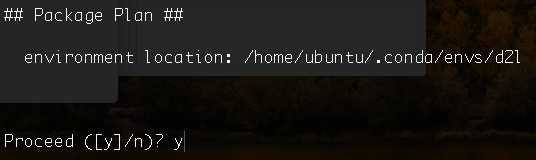

# Installation
:label:`chapter_installation`

To get you up and running with hands-on experiences, we'll need you to set up with a Python environment, Jupyter's interactive notebooks, the relevant libraries, and the code needed to run the book.

## Installing Miniconda

To simplify the installation, we need to install [Miniconda](https://conda.io/en/latest/miniconda.html). Download the corresponing Miniconda "sh" file from the website and then execute the command line `sudo sh <FILENAME>`, *e.g.*,

```bash
# For Mac users (the file name is subject to changes)
sudo sh Miniconda3-latest-MacOSX-x86_64.sh

# For Linux users (the file name is subject to changes)
sudo sh Miniconda3-latest-Linux-x86_64.sh
```


You need to answer the following questions:

```bash
Do you accept the license terms? [yes|no]
[no] >>> yes

Miniconda3 will now be installed into this location:
/home/rlhu/miniconda3
  - Press ENTER to confirm the location
  - Press CTRL-C to abort the installation
  - Or specify a different location below
>>> <ENTER>

Do you wish the installer to initialize Miniconda3
by running conda init? [yes|no]
[no] >>> yes
```


After miniconda installation, run the following command to activate conda.

```bash
# For Mac user
source ~/.bash_profile

# For Linux user
source ~/.bashrc
```


Then create the conda "d2l"" environment and enter `y` for the following inquiries as shown in :numref:`fig_conda_create_d2l`.

```bash
conda create --name d2l
```



:width:`700px`
:label:`fig_conda_create_d2l`


## Downloading the d2l Notebooks

Now, let us download the code for this book.

```bash
sudo apt-get install unzip
mkdir d2l-en && cd d2l-en
wget http://numpy.d2l.ai/d2l-en.zip
unzip d2l-en.zip && rm d2l-en.zip
```


Within the "d2l" environment, activate it and install `pip`. Enter `y` for the following inquiries.

```bash
conda activate d2l
conda install pip
```


Finally, install "d2l" package within the environment "d2l" that we created.

```
pip install git+https://github.com/d2l-ai/d2l-en@numpy2
```


If unfortunately something went wrong, please check

1. You are using `pip` for Python 3 instead of Python 2 by checking `pip --version`. If it's Python 2, then you may check if there is a `pip3` available.
2. You are using a recent `pip`, such as version 19. Otherwise you can upgrade it through `pip install --upgrade pip`
3. If you don't have permission to install package in system wide, you can install to your home directory by adding a `--user` flag. Such as `pip install d2l --user`


## Installing MXNet

Before installing `mxnet`, please first check if you are able to access GPUs. If so, please go to :ref:`sec_gpu` for instructions to install a GPU-supported `mxnet`. Otherwise, you can install the CPU version, which is still good enough for the first few chapters.

```
# For Linux and macOS users (Windows support coming soon)
pip install mxnet==1.6.0b20190915
```


Once both packages are installed, we now open the Jupyter notebook by

```
jupyter notebook
```


At this point open http://localhost:8888 (which usually opens automatically) in the browser, then we can view and run the code in each section of the book.

## Upgrade to a New Version

Both this book and MXNet are keeping improving. Please check a new version from time to time.

1. The URL  http://numpy.d2l.ai/d2l-en.zip always points to the latest contents.
2. Please upgrade "d2l" by `pip install git+https://github.com/d2l-ai/d2l-en@numpy2`.
3. For the CPU version, MXNet can be upgraded by `pip uninstall mxnet` then re-running the aforementioned `pip install mxnet==...` command.


## GPU Support

:label:`sec_gpu`

By default MXNet is installed without GPU support to ensure that it will run on any computer (including most laptops). Part of this book requires or recommends running with GPU. If your computer has NVIDIA graphics cards and has installed [CUDA](https://developer.nvidia.com/cuda-downloads), you should install a GPU-enabled MXNet.

If you have installed the CPU-only version, then remove it first by

```bash
pip uninstall mxnet
```


Then we need to find the CUDA version you installed. You may check it through `nvcc --version` or `cat /usr/local/cuda/version.txt`. Assume you have installed CUDA 10.1, then you can install the according MXNet version by

```
# For Linux and macOS users (Windows support coming soon)
pip install mxnet-cu101==1.6.0b20190915
```


You may change the last digits according to your CUDA version, e.g. `cu100` for CUDA 10.0 and `cu90` for CUDA 9.0. You can find all available MXNet versions by `pip search mxnet`.

For installation of MXNet on other platforms, please refer to http://numpy.mxnet.io/#installation.


## Exercises

1. Download the code for the book and install the runtime environment.


## Scan the QR Code to [Discuss](https://discuss.mxnet.io/t/2315)


