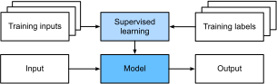
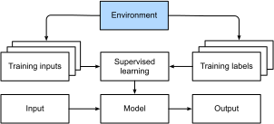

# Introduction
:label:`chap_introduction` 

 Jusqu'à récemment, presque tous les programmes informatiques 
avec lesquels vous pouviez interagir au cours d'une journée ordinaire
étaient codés sous la forme d'un ensemble rigide de règles 
spécifiant précisément comment ils devaient se comporter.
Imaginons que nous voulions écrire une application 
pour gérer une plateforme de commerce électronique.
Après s'être réunis autour d'un tableau blanc
pendant quelques heures pour réfléchir au problème,
nous pourrions nous mettre d'accord sur les grandes lignes 
d'une solution fonctionnelle, par exemple :
(i) les utilisateurs interagissent avec l'application par le biais d'une interface
fonctionnant dans un navigateur Web ou une application mobile ;
(ii) notre application interagit avec un moteur de base de données de qualité commerciale
pour suivre l'état de chaque utilisateur et conserver les enregistrements
des transactions historiques ; 
et (iii) au cœur de notre application,
la *logique métier* (on pourrait dire le *cerveau*) de notre application
décrit méthodiquement un ensemble de règles qui associent chaque 
circonstance imaginable à l'action correspondante
que notre programme doit entreprendre. 

Pour construire le cerveau de notre application,
nous pouvons énumérer tous les événements courants
que notre programme doit traiter.
Par exemple, lorsqu'un client clique sur 
pour ajouter un article à son panier,
notre programme doit ajouter une entrée 
à la table de la base de données du panier,
associant l'ID de cet utilisateur 
à l'ID du produit demandé.
Nous pourrions ensuite essayer de passer en revue 
tous les cas de figure possibles,
pour tester la pertinence de nos règles
et apporter les modifications nécessaires.
Que se passe-t-il si un utilisateur 
effectue un achat avec un panier vide ? 
Bien que peu de développeurs réussissent 
du premier coup
(il faut parfois quelques essais pour régler les problèmes),
la plupart du temps, nous pouvons écrire de tels programmes 
et les lancer en toute confiance 
*avant de rencontrer un vrai client.
Notre capacité à concevoir manuellement des systèmes automatisés
qui pilotent des produits et des systèmes fonctionnels, 
souvent dans des situations inédites,
est un exploit cognitif remarquable.
Et lorsque vous êtes capable de concevoir des solutions 
qui fonctionnent $100\%$ la plupart du temps,
vous ne devriez pas 
vous soucier de l'apprentissage automatique.

Heureusement pour la communauté croissante 
de scientifiques spécialisés dans l'apprentissage automatique,
de nombreuses tâches que nous aimerions automatiser
ne se plient pas si facilement à l'ingéniosité humaine.
Imaginez que vous vous retrouvez autour d'un tableau blanc 
avec les esprits les plus intelligents que vous connaissez,
mais que cette fois vous vous attaquez à 
l'un des problèmes suivants :

* Ecrivez un programme qui prédit le temps qu'il fera demain à partir d'informations géographiques, d'images satellites et d'une fenêtre de temps passé.
* Ecrivez un programme qui prend une question factuelle, exprimée en texte libre, et y répond correctement.
* Ecrire un programme qui, à partir d'une image, identifie toutes les personnes qui y sont représentées et dessine les contours de chacune d'elles.
* Écrire un programme qui présente aux utilisateurs des produits qu'ils sont susceptibles d'apprécier mais qu'ils ont peu de chances de rencontrer dans le cours naturel de la navigation.

Pour ces problèmes,
même les programmeurs d'élite auraient du mal
à coder des solutions à partir de zéro.
Les raisons peuvent varier. 
Parfois, le programme que nous recherchons 
suit un modèle qui évolue dans le temps,
de sorte qu'il n'y a pas de bonne réponse fixe ! 
Dans ce cas, toute solution réussie 
doit s'adapter gracieusement à un monde en mutation. 
À d'autres moments, la relation (par exemple entre les pixels,
et les catégories abstraites) peut être trop compliquée,
nécessitant des milliers ou des millions de calculs
et suivant des principes inconnus. 
Comme dans le cas de la reconnaissance d'images, 
les étapes de l'exécution d'une tâche
se situent souvent au-delà de notre compréhension consciente,
même lorsque nos processus cognitifs subconscients 
peuvent exécuter la tâche avec facilité. 


*L'apprentissage automatique* est l'étude des algorithmes
qui peuvent apprendre de l'expérience.
Au fur et à mesure qu'un algorithme d'apprentissage automatique accumule de l'expérience,
généralement sous la forme de données d'observation 
ou d'interactions avec un environnement, 
ses performances s'améliorent.
Comparez cela à notre plate-forme de commerce électronique déterministe,
qui suit la même logique commerciale,
quelle que soit l'expérience accumulée,
jusqu'à ce que les développeurs eux-mêmes apprennent et décident
qu'il est temps de mettre à jour le logiciel.
Dans ce livre, nous vous apprendrons 
les principes fondamentaux de l'apprentissage automatique,
en nous concentrant en particulier sur *l'apprentissage profond*, 
un ensemble puissant de techniques
à l'origine d'innovations dans des domaines aussi divers que la vision par ordinateur,
le traitement du langage naturel, la santé et la génomique.

## Un exemple motivant

Avant de commencer à écrire, les auteurs de ce livre,
comme une grande partie de la population active, ont dû prendre une caféine.
Nous sommes montés dans la voiture et avons commencé à rouler.
Utilisant un iPhone, Alex a appelé "Hey Siri",
réveillant ainsi le système de reconnaissance vocale du téléphone.
Puis Mu a commandé "directions to Blue Bottle coffee shop".
Le téléphone a rapidement affiché la transcription de sa commande.
Il a également reconnu que nous demandions un itinéraire
et a lancé l'application Maps (app)
pour répondre à notre demande.
Une fois lancée, l'application Maps a identifié un certain nombre d'itinéraires.
À côté de chaque itinéraire, le téléphone a affiché une prévision de temps de trajet.
Bien que nous ayons inventé cette histoire pour des raisons pédagogiques,
elle démontre qu'en l'espace de quelques secondes seulement,
nos interactions quotidiennes avec un smartphone
peuvent faire intervenir plusieurs modèles d'apprentissage automatique.


Imaginez simplement écrire un programme pour répondre à un *mot d'éveil*
tel que "Alexa", "OK Google" et "Hey Siri".
Essayez de le coder vous-même dans une pièce
avec rien d'autre qu'un ordinateur et un éditeur de code,
comme illustré dans :numref:`fig_wake_word` .
Comment écririez-vous un tel programme à partir des premiers principes ?
Pensez-y... le problème est difficile.
Chaque seconde, le microphone collecte environ 
44000 échantillons.
Chaque échantillon est une mesure de l'amplitude de l'onde sonore.
Quelle règle pourrait permettre de passer de manière fiable d'un extrait de données audio brutes à des prédictions fiables 
$\{\text{yes}, \text{no}\}$ 
 pour savoir si l'extrait contient le mot d'éveil ?
Si vous êtes bloqué, ne vous inquiétez pas.
Nous ne savons pas non plus comment écrire un tel programme à partir de zéro.
C'est pourquoi nous utilisons l'apprentissage automatique.


:label:`fig_wake_word`


Voici l'astuce.
Souvent, même si nous ne savons pas comment indiquer explicitement à un ordinateur (
) comment passer des entrées aux sorties,
nous sommes néanmoins capables de réaliser nous-mêmes l'exploit cognitif.
En d'autres termes, même si vous ne savez pas
comment programmer un ordinateur pour qu'il reconnaisse le mot "Alexa",
vous êtes vous-même capable de le reconnaître.
Armés de cette capacité, nous pouvons collecter un énorme ensemble de *données*
contenant des exemples de sons 
et étiqueter ceux qui contiennent
et ceux qui ne contiennent pas le mot d'éveil.
Dans l'approche de l'apprentissage automatique, 
nous ne cherchons pas à concevoir un système
*explicitement* pour reconnaître les mots d'éveil.
Au lieu de cela, nous définissons un programme flexible
dont le comportement est déterminé par un certain nombre de *paramètres*.
Nous utilisons ensuite l'ensemble de données pour déterminer le meilleur jeu de paramètres possible, 
ceux qui améliorent les performances de notre programme
par rapport à une certaine mesure des performances de la tâche concernée.

Vous pouvez considérer les paramètres comme des boutons que nous pouvons tourner,
manipulant ainsi le comportement du programme.
En fixant les paramètres, nous appelons le programme un *modèle*.
L'ensemble de tous les programmes distincts (mappages entrée-sortie)
que nous pouvons produire en manipulant simplement les paramètres
est appelé une *famille* de modèles.
Et le méta-programme qui utilise notre ensemble de données
pour choisir les paramètres est appelé un *algorithme d'apprentissage*.

Avant d'engager l'algorithme d'apprentissage,
nous devons définir précisément le problème,
en déterminant la nature exacte des entrées et des sorties,
et en choisissant une famille de modèles appropriée.
Dans le cas présent, 
, notre modèle reçoit un extrait audio comme *entrée*,
et le modèle 
génère une sélection parmi 
$\{\text{yes}, \text{no}\}$ comme *sortie*.
Si tout se passe comme prévu 
, les suppositions du modèle
seront généralement correctes quant à 
si l'extrait contient le mot d'éveil.

Si nous choisissons la bonne famille de modèles,
il devrait exister un réglage des boutons
tel que le modèle déclenche "oui" chaque fois qu'il entend le mot "Alexa".
Le choix exact du mot de réveil étant arbitraire,
nous aurons probablement besoin d'une famille de modèles suffisamment riche pour que,
via un autre réglage des boutons, elle puisse déclencher un "oui"
uniquement en entendant le mot "Abricot".
Nous pensons que la même famille de modèles devrait convenir
pour la reconnaissance d'"Alexa" et la reconnaissance d'"Abricot"
car il s'agit, intuitivement, de tâches similaires.
Cependant, nous pourrions avoir besoin d'une famille de modèles entièrement différente
si nous voulons traiter des entrées ou des sorties fondamentalement différentes,
par exemple si nous voulions faire une correspondance entre des images et des légendes,
ou entre des phrases anglaises et des phrases chinoises.

Comme vous pouvez le deviner, si nous réglons tous les boutons de manière aléatoire,
il est peu probable que notre modèle reconnaisse "Alexa",
"Apricot" ou tout autre mot anglais.
Dans l'apprentissage automatique, 
l'*apprentissage* est le processus
par lequel nous découvrons le bon réglage des boutons
qui contraint notre modèle à adopter le comportement souhaité.
En d'autres termes,
nous *formons* notre modèle avec des données.
Comme le montre le site :numref:`fig_ml_loop` , le processus d'apprentissage se présente généralement comme suit :

1. Commencez par un modèle initialisé de manière aléatoire qui ne peut rien faire d'utile.
1. Récupérez certaines de vos données (par exemple, des extraits audio et les étiquettes correspondantes $\{\text{yes}, \text{no}\}$ ).
1. Ajustez les boutons pour que le modèle soit moins mauvais par rapport à ces exemples.
1. Répétez les étapes 2 et 3 jusqu'à ce que le modèle soit génial.


:label:`fig_ml_loop`

En résumé, plutôt que de coder un programme de reconnaissance des mots d'éveil,
nous codons un programme qui peut *apprendre à reconnaître les mots d'éveil,
si nous lui présentons un grand ensemble de données étiquetées.
Vous pouvez considérer cette action consistant à déterminer le comportement d'un programme
en lui présentant un ensemble de données comme de la *programmation avec des données*.
En d'autres termes,
nous pouvons "programmer" un détecteur de chats en fournissant à notre système d'apprentissage automatique
de nombreux exemples de chats et de chiens.
De cette façon, le détecteur finira par apprendre à émettre un très grand nombre positif s'il s'agit d'un chat, un très grand nombre négatif s'il s'agit d'un chien,
et quelque chose de plus proche de zéro s'il n'est pas sûr,
et ceci ne fait qu'effleurer la surface de ce que l'apprentissage automatique peut faire.
L'apprentissage profond,
que nous expliquerons plus en détail ultérieurement,
n'est qu'une des nombreuses méthodes populaires
pour résoudre les problèmes d'apprentissage automatique.

## Composants clés

Dans notre exemple de mot de sillage, nous avons décrit un ensemble de données
composé d'extraits audio et d'étiquettes binaires, 
et nous avons
donné une idée de la manière dont nous pourrions entraîner
un modèle pour approximer une correspondance entre les extraits et les classifications.
Ce type de problème, 
où nous essayons de prédire une étiquette inconnue désignée
sur la base d'entrées connues
étant donné un ensemble de données constitué d'exemples
pour lesquels les étiquettes sont connues, 
est appelé *apprentissage supervisé*.
Ce n'est qu'un des nombreux types de problèmes d'apprentissage automatique.
Plus tard, nous nous plongerons en profondeur dans différents problèmes d'apprentissage automatique.
Tout d'abord, nous souhaitons mettre en lumière certains composants essentiels
qui nous suivront partout, quel que soit le type de problème d'apprentissage automatique auquel nous nous attaquons :

1. Les *données* à partir desquelles nous pouvons apprendre.
1. Un *modèle* sur la façon de transformer les données.
1. Une *fonction objective* qui quantifie la qualité (ou la faiblesse) du modèle.
1. Un *algorithme* pour ajuster les paramètres du modèle afin d'optimiser la fonction objectif.

#### Data

Il va sans dire que vous ne pouvez pas faire de la science des données sans données.
Nous pourrions perdre des centaines de pages à réfléchir à ce qui constitue précisément des données,
mais pour l'instant, nous allons privilégier le côté pratique
et nous concentrer sur les principales propriétés à prendre en compte.
En général, nous sommes concernés par une collection d'exemples.
Pour travailler utilement avec des données, 
, nous devons généralement
trouver une représentation numérique appropriée.
Chaque *exemple* (ou *point de données*, *instance de données*, *échantillon*) est généralement constitué d'un ensemble
d'attributs appelés *caractéristiques* (ou *covariables*),
à partir desquels le modèle doit faire ses prédictions.
Dans les problèmes d'apprentissage supervisé ci-dessus,
la chose à prédire
est un attribut spécial 
qui est désigné comme
la *étiquette* (ou *cible*).


Si nous travaillons avec des données d'image,
chaque photographie individuelle pourrait constituer un exemple,
chacune étant représentée par une liste ordonnée de valeurs numériques
correspondant à la luminosité de chaque pixel.
Une photographie couleur $200\times 200$ se composerait de $200\times200\times3=120000$
 valeurs numériques, correspondant à la luminosité
des canaux rouge, vert et bleu pour chaque emplacement spatial.
Dans une autre tâche traditionnelle, nous pourrions essayer de prédire
si un patient va survivre ou non,
étant donné un ensemble standard de caractéristiques telles que
l'âge, les signes vitaux et les diagnostics.

Lorsque chaque exemple est caractérisé par le même nombre de valeurs numériques,
nous disons que les données sont constituées de vecteurs de longueur fixe
et nous décrivons la longueur constante des vecteurs
comme la *dimensionnalité* des données.
Comme vous pouvez l'imaginer, la longueur fixe peut être une propriété pratique.
Si nous voulions entraîner un modèle à reconnaître le cancer dans des images de microscopie,
les entrées de longueur fixe signifient que nous avons une chose de moins à nous soucier.

Cependant, toutes les données ne peuvent pas être facilement représentées sous forme de vecteurs de longueur fixe 
**.
Alors que nous pouvons nous attendre à ce que les images de microscope proviennent d'un équipement standard,
nous ne pouvons pas nous attendre à ce que les images extraites d'Internet
apparaissent toutes avec la même résolution ou forme.
Pour les images, on peut envisager de les recadrer toutes à une taille standard,
mais cette stratégie ne va pas plus loin.
Nous risquons de perdre des informations dans les parties recadrées.
En outre, les données textuelles résistent encore plus obstinément aux représentations de longueur fixe.
Prenons l'exemple des commentaires laissés par les clients sur les sites de commerce électronique
tels qu'Amazon, IMDB et TripAdvisor.
Certains sont brefs : "ça pue !". 
D'autres s'étendent sur des pages entières.
L'un des principaux avantages de l'apprentissage profond par rapport aux méthodes traditionnelles
est la grâce relative avec laquelle les modèles modernes
peuvent traiter des données de longueur variable *.

En général, plus nous avons de données, plus notre travail est facile.
Lorsque nous disposons de plus de données, nous pouvons former des modèles plus puissants
et nous reposer moins sur des hypothèses préconçues.
Le changement de régime, qui consiste à passer des données (comparativement) petites aux données volumineuses
, contribue largement au succès de l'apprentissage profond moderne.
Pour enfoncer le clou, bon nombre des modèles les plus intéressants de l'apprentissage profond ne fonctionnent pas sans grands ensembles de données.
D'autres fonctionnent dans le régime des petites données,
mais ne sont pas meilleurs que les approches traditionnelles.

Enfin, il ne suffit pas d'avoir beaucoup de données et de les traiter intelligemment.
Nous avons besoin des *bonnes* données. 
Si les données sont pleines d'erreurs,
ou si les caractéristiques choisies ne sont pas prédictives
de la quantité cible d'intérêt, 
l'apprentissage va échouer.
Le cliché suivant résume bien la situation :
*garbage in, garbage out*.
De plus, les mauvaises performances prédictives ne sont pas la seule conséquence potentielle.
Dans les applications sensibles de l'apprentissage automatique,
comme la police prédictive, la sélection des CV et les modèles de risque utilisés pour les prêts,
nous devons être particulièrement attentifs aux conséquences des données inutiles.
Un mode d'échec courant se produit dans les ensembles de données où certains groupes de personnes
ne sont pas représentés dans les données d'apprentissage.
Imaginez l'application d'un système de reconnaissance du cancer de la peau dans la nature
qui n'a jamais vu de peau noire auparavant.
L'échec peut également se produire lorsque les données
ne se contentent pas de sous-représenter certains groupes
mais reflètent des préjugés sociétaux.
Par exemple, 
si des décisions d'embauche passées sont utilisées pour former un modèle prédictif
qui sera utilisé pour filtrer les CV,
alors les modèles d'apprentissage automatique pourraient par inadvertance
capturer et automatiser des injustices historiques.
Notez que tout cela peut se produire sans que le scientifique des données
conspire activement, ou même soit conscient.


#### Modèles

La plupart de l'apprentissage automatique implique une transformation des données dans un certain sens.
Nous pourrions vouloir construire un système qui ingère des photos et prédit le caractère souriant.
Ou bien,
nous pourrions vouloir ingérer un ensemble de relevés de capteurs
et prédire le caractère normal ou anormal de ces relevés.
Par *modèle*, nous désignons la machinerie informatique permettant d'ingérer des données
d'un certain type, 
et de produire des prédictions d'un type éventuellement différent.
En particulier, nous nous intéressons aux modèles statistiques
qui peuvent être estimés à partir des données.
Alors que les modèles simples sont parfaitement capables de traiter
des problèmes suffisamment simples,
les problèmes
sur lesquels nous nous concentrons dans ce livre repoussent les limites des méthodes classiques.
L'apprentissage profond se distingue des approches classiques
principalement par l'ensemble des modèles puissants sur lesquels il se concentre.
Ces modèles consistent en de nombreuses transformations successives des données
qui sont enchaînées de haut en bas, d'où le nom d'*apprentissage profond*.
Dans le cadre de notre discussion sur les modèles profonds,
nous aborderons également certaines méthodes plus traditionnelles.

#### Fonctions objectives

Plus tôt, nous avons présenté l'apprentissage automatique comme un apprentissage à partir de l'expérience.
Par *apprentissage* ici,
nous entendons l'amélioration d'une tâche au fil du temps.
Mais qui peut dire ce qui constitue une amélioration ?
Vous pouvez imaginer que nous pourrions proposer de mettre à jour notre modèle,
et que certaines personnes pourraient ne pas être d'accord sur le fait que la mise à jour proposée
constitue une amélioration ou un déclin.

Afin de développer un système mathématique formel d'apprentissage automatique,
nous devons disposer de mesures formelles de la qualité (ou de la faiblesse) de nos modèles.
Dans le domaine de l'apprentissage automatique, et de l'optimisation en général,
nous appelons cela des *fonctions objectives*.
Par convention, nous définissons généralement les fonctions objectives
de manière à ce que les valeurs les plus basses soient les meilleures.
Il s'agit simplement d'une convention. 
Vous pouvez prendre n'importe quelle fonction
pour laquelle plus haut est meilleur, et la transformer en une nouvelle fonction
qualitativement identique mais pour laquelle plus bas est meilleur
en inversant le signe.
Parce que plus bas est meilleur, ces fonctions sont parfois appelées
*fonctions de perte*.

Lorsqu'on essaie de prédire des valeurs numériques,
la fonction de perte la plus courante est l'erreur quadratique *,
c'est-à-dire le carré de la différence entre la prédiction et la vérité du terrain.
Pour la classification, l'objectif le plus courant est de minimiser le taux d'erreur,
c'est-à-dire la fraction d'exemples sur lesquels
nos prédictions sont en désaccord avec la vérité terrain.
Certains objectifs (par exemple, l'erreur quadratique) sont faciles à optimiser.
D'autres (par exemple, le taux d'erreur) sont difficiles à optimiser directement,
en raison de l'indifférenciabilité ou d'autres complications.
Dans ces cas, il est courant d'optimiser un *objectif de substitution*.

Généralement, la fonction de perte est définie
par rapport aux paramètres du modèle
et dépend de l'ensemble de données.
Nous apprenons
les meilleures valeurs des paramètres de notre modèle
en minimisant la perte subie sur un ensemble
constitué d'un certain nombre d'exemples collectés pour la formation.
Cependant, le fait d'obtenir de bons résultats sur les données d'apprentissage
ne garantit pas que nous obtiendrons de bons résultats sur les données non observées.
C'est pourquoi nous souhaitons généralement diviser les données disponibles en deux partitions :
l'ensemble de données d'entraînement * (ou *ensemble d'entraînement*, pour l'ajustement des paramètres du modèle)
et l'ensemble de données de test * (ou *ensemble de test*, qui est utilisé pour l'évaluation),
indiquant comment le modèle se comporte sur les deux.
Les performances de l'entraînement peuvent être comparées à
aux résultats obtenus par un étudiant aux examens pratiques
utilisés pour se préparer à un véritable examen final.
Même si les résultats sont encourageants,
cela ne garantit pas la réussite à l'examen final.
En d'autres termes,
les performances du test peuvent s'écarter considérablement des performances de l'entraînement. 
Lorsqu'un modèle donne de bons résultats sur l'ensemble d'apprentissage
mais ne parvient pas à généraliser aux données non vues,
nous disons qu'il est *overfitting*.
Dans la vie réelle, cela revient à échouer à l'examen réel
malgré de bons résultats aux examens pratiques.


### Algorithmes d'optimisation

Une fois que nous disposons d'une source et d'une représentation de données,
d'un modèle et d'une fonction objective bien définie,
nous avons besoin d'un algorithme capable de rechercher
les meilleurs paramètres possibles pour minimiser la fonction de perte.
Les algorithmes d'optimisation populaires pour l'apprentissage profond
sont basés sur une approche appelée *descente de gradient*.
En bref, à chaque étape, cette méthode 
vérifie, pour chaque paramètre,
dans quel sens la perte de l'ensemble d'apprentissage se déplacerait
si vous perturbiez ce paramètre juste un peu.
Elle met ensuite à jour
le paramètre dans la direction qui peut réduire la perte.

## Types de problèmes d'apprentissage automatique

Le problème du mot d'ordre dans notre exemple de motivation
n'est qu'un des nombreux problèmes
que l'apprentissage automatique peut résoudre.
Pour motiver davantage le lecteur
et nous fournir un langage commun lorsque nous parlons d'autres problèmes tout au long du livre,
dans ce qui suit, nous 
énumérons un échantillon de problèmes d'apprentissage automatique.
Nous ferons constamment référence à
aux concepts susmentionnés 
tels que les données, les modèles et les techniques d'apprentissage.

#### Apprentissage supervisé

L'apprentissage supervisé consiste à prédire des étiquettes à partir de caractéristiques d'entrée (
).
Chaque paire caractéristique-étiquette est appelée un exemple.
Parfois, lorsque le contexte est clair, nous pouvons utiliser le terme *exemples*
pour faire référence à une collection d'entrées,
même lorsque les étiquettes correspondantes sont inconnues.
Notre objectif est de produire un modèle
qui fait correspondre toute entrée à une prédiction d'étiquette.


Pour ancrer cette description dans un exemple concret,
si nous travaillons dans le domaine de la santé,
alors nous pourrions vouloir prédire si oui ou non
un patient aura une crise cardiaque.
Cette observation, "crise cardiaque" ou "pas de crise cardiaque",
serait notre étiquette.
Les caractéristiques d'entrée peuvent être des signes vitaux
tels que la fréquence cardiaque, la pression sanguine diastolique, 
et la pression sanguine systolique.

La supervision entre en jeu car pour choisir les paramètres, nous (les superviseurs) fournissons au modèle un ensemble de données
constitué d'exemples étiquetés,
où chaque exemple correspond à l'étiquette de vérité.
En termes probabilistes, nous sommes généralement intéressés par l'estimation de
la probabilité conditionnelle d'une étiquette compte tenu des caractéristiques d'entrée.
Bien qu'il ne s'agisse que d'un paradigme parmi d'autres au sein de l'apprentissage automatique,
l'apprentissage supervisé représente la majorité des applications réussies
de l'apprentissage automatique dans l'industrie.
Cela s'explique en partie par le fait que de nombreuses tâches importantes
peuvent être décrites clairement comme l'estimation de la probabilité
d'une chose inconnue à partir d'un ensemble particulier de données disponibles :

* Prédire s'il y a cancer ou non, à partir d'une image tomographique.
* Prédire la traduction correcte en français d'une phrase en anglais.
* Prédire le prix d'une action le mois prochain, sur la base des données du rapport financier de ce mois.

Même avec la description simple
"prédire des étiquettes à partir de caractéristiques d'entrée"
, l'apprentissage supervisé peut prendre de nombreuses formes
et nécessiter de nombreuses décisions de modélisation,
en fonction (entre autres considérations) du type, de la taille,
et du nombre d'entrées et de sorties.
Par exemple, nous utilisons différents modèles pour traiter des séquences de longueur arbitraire
et pour traiter des représentations vectorielles de longueur fixe.
Nous aborderons plusieurs de ces problèmes en profondeur
tout au long de cet ouvrage.

De manière informelle, le processus d'apprentissage ressemble à ce qui suit.
Tout d'abord, prenez une grande collection d'exemples pour lesquels les caractéristiques sont connues
et sélectionnez-en un sous-ensemble aléatoire,
en acquérant les étiquettes de vérité pour chacun d'entre eux.
Parfois, ces étiquettes peuvent être des données disponibles qui ont déjà été collectées
(par exemple, un patient est-il décédé au cours de l'année suivante ?)
et d'autres fois, nous pouvons avoir besoin d'employer des annotateurs humains pour étiqueter les données,
(par exemple, affecter des images à des catégories).
Ensemble, ces entrées et les étiquettes correspondantes constituent l'ensemble d'apprentissage.
Nous introduisons l'ensemble de données d'apprentissage dans un algorithme d'apprentissage supervisé,
une fonction qui prend en entrée un ensemble de données
et produit une autre fonction : le modèle appris.
Enfin, nous pouvons introduire des entrées inédites dans le modèle appris,
en utilisant ses sorties comme prédictions de l'étiquette correspondante.
Le processus complet est décrit dans :numref:`fig_supervised_learning` .


:label:`fig_supervised_learning`

#### Régression

La tâche d'apprentissage supervisé la plus simple
à appréhender est sans doute la *régression*.
Considérons, par exemple, un ensemble de données récoltées
dans une base de données de ventes de maisons.
Nous pourrions construire un tableau, 
où chaque ligne correspond à une maison différente,
et où chaque colonne correspond à un attribut pertinent,
tel que la superficie de la maison, 
le nombre de chambres, le nombre de salles de bain et le nombre de minutes (à pied) jusqu'au centre de la ville.
Dans cet ensemble de données, chaque exemple serait une maison spécifique,
et le vecteur de caractéristiques correspondant serait une ligne du tableau.
Si vous habitez à New York ou à San Francisco,
et que vous n'êtes pas le PDG d'Amazon, de Google, de Microsoft ou de Facebook,
le vecteur de caractéristiques (superficie en pieds carrés, nombre de chambres, nombre de salles de bains, distance à pied)
de votre maison pourrait ressembler à ceci : $[600, 1, 1, 60]$.
Cependant, si vous vivez à Pittsburgh, il pourrait ressembler davantage à $[3000, 4, 3, 10]$.
Les vecteurs de caractéristiques comme celui-ci sont essentiels
pour la plupart des algorithmes classiques d'apprentissage automatique.

Ce qui fait d'un problème une régression est en fait le résultat.
Disons que vous êtes à la recherche d'une nouvelle maison.
Vous pourriez vouloir estimer la juste valeur marchande d'une maison,
compte tenu de certaines caractéristiques comme ci-dessus.
L'étiquette, le prix de vente, est une valeur numérique.
Lorsque les étiquettes prennent des valeurs numériques arbitraires,
nous appelons cela un problème de *régression*.
Notre objectif est de produire un modèle dont les prédictions
sont très proches des valeurs réelles des étiquettes.


De nombreux problèmes pratiques sont des problèmes de régression bien décrits.
Prédire la note qu'un utilisateur attribuera à un film
peut être considéré comme un problème de régression
et si vous avez conçu un excellent algorithme pour accomplir cet exploit en 2009,
vous avez peut-être gagné le [1-million-dollar Netflix prize](https://en.wikipedia.org/wiki/Netflix_Prize).
Prédire la durée de séjour des patients à l'hôpital
est également un problème de régression.
Une bonne règle de base est que tout problème de *combien ?* ou *combien ?*
devrait suggérer une régression,
tel que :

* Combien d'heures prendra cette opération chirurgicale ?
* Combien de précipitations cette ville aura-t-elle dans les six prochaines heures ?


Même si vous n'avez jamais travaillé avec l'apprentissage automatique auparavant,
vous avez probablement déjà travaillé sur un problème de régression de manière informelle.
Imaginez, par exemple, que vous ayez fait réparer vos canalisations
et que votre entrepreneur ait passé 3 heures
à enlever la crasse de vos tuyaux d'égout.
Il vous a ensuite envoyé une facture de 350 dollars.
Imaginez maintenant que votre ami ait engagé le même entrepreneur pour 2 heures
et qu'il ait reçu une facture de 250 dollars.
Si quelqu'un vous demandait alors à combien il doit s'attendre à recevoir
sur sa prochaine facture de nettoyage de canalisations
, vous pourriez faire quelques suppositions raisonnables,
telles que plus d'heures travaillées coûtent plus de dollars.
Vous pourriez également supposer qu'il existe un tarif de base
et que l'entrepreneur facture ensuite à l'heure.
Si ces hypothèses se vérifient, alors, à partir de ces deux exemples de données,
vous pourriez déjà identifier la structure de prix de l'entrepreneur :
100 dollars par heure plus 50 dollars pour se présenter chez vous.
Si vous avez bien suivi, vous comprenez déjà
l'idée de haut niveau qui sous-tend la régression linéaire.

Dans ce cas, nous pourrions produire les paramètres
qui correspondent exactement aux prix de l'entrepreneur.
Parfois, ce n'est pas possible, 
par exemple, si une partie de
la variance est due à quelques facteurs 
autres que vos deux caractéristiques.
Dans ces cas, nous essaierons d'apprendre des modèles
qui minimisent la distance entre nos prédictions et les valeurs observées.
Dans la plupart de nos chapitres, nous nous concentrerons sur 
la minimisation de la fonction de perte de l'erreur quadratique.
Comme nous le verrons plus tard, cette perte correspond à l'hypothèse
que nos données sont corrompues par un bruit gaussien.

#### Classification

Alors que les modèles de régression sont parfaits pour répondre aux questions *combien ?*,
de nombreux problèmes ne se plient pas facilement à ce modèle.
Par exemple,
une banque souhaite ajouter la numérisation des chèques à son application mobile.
Pour cela, le client doit prendre une photo du chèque
avec l'appareil photo de son smartphone
et l'application doit être capable
de comprendre automatiquement le texte qui apparaît dans l'image.
Plus précisément,
elle devrait également être capable de comprendre le texte manuscrit pour être encore plus robuste,
par exemple en faisant correspondre un caractère manuscrit
à l'un des caractères connus.
Ce type de problème *lequel ?* est appelé *classification*.
Il est traité avec un ensemble d'algorithmes différents
de ceux utilisés pour la régression, bien que de nombreuses techniques soient reprises.

Dans la *classification*, nous voulons que notre modèle examine les caractéristiques,
par exemple, les valeurs des pixels dans une image,
et prédise ensuite à quelle *catégorie* (formellement appelée *classe*),
parmi un ensemble discret d'options, appartient un exemple.
Pour les chiffres manuscrits, nous pourrions avoir dix classes,
correspondant aux chiffres de 0 à 9.
La forme la plus simple de classification est celle où il n'y a que deux classes,
un problème que nous appelons *classification binaire*.
Par exemple, notre jeu de données pourrait être constitué d'images d'animaux
et nos étiquettes pourraient être les classes $\mathrm{\{cat, dog\}}$.
Alors que dans la régression, nous cherchons un régresseur pour produire une valeur numérique,
dans la classification, nous cherchons un classificateur, dont la sortie est l'affectation de classe prédite.

Pour des raisons que nous aborderons lorsque le livre deviendra plus technique,
il peut être difficile d'optimiser un modèle qui ne peut fournir en sortie
qu'une affectation catégorielle dure, 
par exemple, soit "chat", soit "chien".
Dans ces cas, il est généralement beaucoup plus facile d'exprimer
notre modèle dans le langage des probabilités.
Étant donné les caractéristiques d'un exemple, 
notre modèle attribue une probabilité
à chaque classe possible. 
Revenons à notre exemple de classification des animaux
où les classes sont $\mathrm{\{cat, dog\}}$,
. Un classificateur peut voir une image et donner la probabilité
que l'image est un chat, soit 0,9.
Nous pouvons interpréter ce chiffre en disant que le classificateur
est sûr à 90 % que l'image représente un chat.
L'ampleur de la probabilité pour la classe prédite
transmet une notion d'incertitude.
Ce n'est pas la seule notion d'incertitude
et nous en aborderons d'autres dans des chapitres plus avancés.

Lorsque nous avons plus de deux classes possibles,
nous appelons le problème *classification multiclasse*.
Parmi les exemples courants, citons la reconnaissance de caractères manuscrits
$\mathrm{\{0, 1, 2, ... 9, a, b, c, ...\}}$ .
Alors que nous avons attaqué les problèmes de régression en essayant
de minimiser la fonction de perte de l'erreur quadratique,
la fonction de perte courante pour les problèmes de classification est appelée *entropie croisée*,
dont le nom peut être démystifié 
via une introduction à la théorie de l'information dans les chapitres suivants.

Notez que la classe la plus probable n'est pas nécessairement
celle que vous allez utiliser pour votre décision.
Supposons que vous trouviez un magnifique champignon dans votre jardin
comme illustré dans :numref:`fig_death_cap` .


:width:`200px`
:label:`fig_death_cap`

Maintenant, supposons que vous ayez construit un classificateur et que vous l'ayez entraîné
à prédire si un champignon est toxique à partir d'une photographie.
Supposons que notre classificateur de détection de poison indique à
que la probabilité que
:numref:`fig_death_cap` contienne un amanite tueuse est de 0,2.
En d'autres termes, le classificateur est sûr à 80 %
que notre champignon n'est pas un amanite tueuse.
Pourtant, il faudrait être fou pour le manger.
En effet, le bénéfice certain d'un délicieux dîner
ne vaut pas un risque de 20 % d'en mourir.
En d'autres termes, l'effet du risque incertain
l'emporte de loin sur le bénéfice.
Ainsi, nous devons calculer le risque attendu que nous encourons en tant que fonction de perte,
c'est-à-dire que nous devons multiplier la probabilité du résultat
avec le bénéfice (ou le préjudice) qui lui est associé.
Dans ce cas,
la perte encourue en mangeant le champignon
peut être $0.2 \times \infty + 0.8 \times 0 = \infty$,
alors que la perte en le jetant est
$0.2 \times 0 + 0.8 \times 1 = 0.8$ .
Notre prudence était justifiée :
comme tout mycologue nous le dirait,
le champignon de :numref:`fig_death_cap` en fait
est une amorce de mort.

La classification peut devenir beaucoup plus compliquée que la simple
classification binaire, multi-classes ou même multi-labels.
Par exemple, il existe des variantes de classification
pour traiter les hiérarchies.
Les hiérarchies supposent qu'il existe des relations entre les nombreuses classes.
Ainsi, toutes les erreurs ne sont pas égales - si nous devons nous tromper, nous préférerions
classer à tort dans une classe apparentée plutôt que dans une classe éloignée.
En général, on appelle cela la *classification hiérarchique*.
Un des premiers exemples est dû à [Linnaeus](https://en.wikipedia.org/wiki/Carl_Linnaeus), qui a organisé les animaux en une hiérarchie.

Dans le cas de la classification des animaux,
il n'est peut-être pas si grave de confondre un caniche (une race de chien) avec un schnauzer (une autre race de chien),
mais notre modèle serait très pénalisé
s'il confondait un caniche avec un dinosaure.
Le choix de la hiérarchie pertinente peut dépendre
de la façon dont vous envisagez d'utiliser le modèle.
Par exemple, les serpents à sonnette et les couleuvres
peuvent être proches sur l'arbre phylogénétique,
mais confondre un serpent à sonnette avec une couleuvre peut être mortel.

#### Tagging

Certains problèmes de classification s'intègrent parfaitement
dans les configurations de classification binaire ou multiclasse.
Par exemple, nous pourrions entraîner un classificateur binaire normal
pour distinguer les chats des chiens.
Compte tenu de l'état actuel de la vision par ordinateur,
nous pouvons le faire facilement, avec des outils disponibles dans le commerce.
Néanmoins, quelle que soit la précision de notre modèle,
nous pourrions nous trouver en difficulté lorsque le classificateur
rencontre une image des *Musiciens de la ville de Brême*,
un conte de fées allemand populaire mettant en scène quatre animaux
dans :numref:`fig_stackedanimals` .


:width:`300px`
:label:`fig_stackedanimals`

Comme vous pouvez le voir, il y a un chat sur :numref:`fig_stackedanimals` ,
et un coq, un chien et un âne,
avec des arbres en arrière-plan.
En fonction de ce que nous voulons faire avec notre modèle
, traiter ce problème comme un problème de classification binaire
peut ne pas avoir beaucoup de sens.
Au lieu de cela, nous pourrions vouloir donner au modèle la possibilité de dire à
que l'image représente un chat, un chien, un âne,
*et* un coq.

Le problème de l'apprentissage de la prédiction de classes qui ne sont pas
mutuellement exclusives est appelé classification *multi-label*.
Les problèmes d'étiquetage automatique sont généralement mieux décrits
comme des problèmes de classification multi-labels.
Pensez aux étiquettes que les gens peuvent appliquer aux articles d'un blog technique,
par exemple, "apprentissage automatique", "technologie", "gadgets",
"langages de programmation", "Linux", "informatique en nuage", "AWS".
Un article typique peut avoir 5 à 10 balises appliquées
car ces concepts sont corrélés.
Les articles sur l'"informatique en nuage" sont susceptibles de mentionner "AWS"
et les articles sur l'"apprentissage automatique" pourraient également traiter
des "langages de programmation".

Nous devons également faire face à ce type de problème lorsque nous traitons
de la littérature biomédicale, où le balisage correct des articles est important
car il permet aux chercheurs d'effectuer des analyses exhaustives de la littérature.
À la National Library of Medicine, un certain nombre d'annotateurs professionnels
passent en revue chaque article indexé dans PubMed
pour l'associer aux termes pertinents du MeSH,
une collection d'environ 28 000 étiquettes.
Ce processus prend beaucoup de temps et les annotateurs
ont généralement un an de décalage entre l'archivage et l'étiquetage.
L'apprentissage automatique peut être utilisé ici pour fournir des étiquettes provisoires
jusqu'à ce que chaque article puisse faire l'objet d'un examen manuel approprié.
En effet, depuis plusieurs années, l'organisation BioASQ
a [hosted competitions](http://bioasq.org/) précisément fait cela.

#### Recherche 

Parfois, nous ne voulons pas simplement attribuer chaque exemple à un godet
ou à une valeur réelle. Dans le domaine de la recherche d'informations,
nous voulons imposer un classement à un ensemble d'éléments.
Prenons l'exemple de la recherche sur le Web. 
L'objectif n'est pas tant de déterminer si
une page particulière est pertinente pour une requête, mais plutôt de savoir
lequel de la pléthore de résultats de recherche est
le plus pertinent
pour un utilisateur particulier.
L'ordre des résultats de recherche pertinents nous importe vraiment
et notre algorithme d'apprentissage doit produire des sous-ensembles ordonnés
d'éléments d'un ensemble plus vaste.
En d'autres termes, si on nous demande de produire les 5 premières lettres de l'alphabet, il y a une différence
entre retourner "A B C D E" et "C A B E D".
Même si l'ensemble de résultats est le même,
l'ordre dans l'ensemble a de l'importance.

Une solution possible à ce problème consiste à attribuer à chaque élément de l'ensemble
un score de pertinence correspondant
, puis à récupérer les éléments les mieux notés.
[PageRank](https://en.wikipedia.org/wiki/PageRank) le moteur de recherche Google,
la sauce secrète à l'origine du moteur de recherche Google,
était un exemple précoce d'un tel système de notation, mais il était
particulier en ce qu'il ne dépendait pas de la requête réelle.
Il s'appuyait sur un simple filtre de pertinence
pour identifier l'ensemble des éléments pertinents
, puis sur le PageRank pour classer les résultats
qui contenaient le terme recherché.
Aujourd'hui, les moteurs de recherche utilisent l'apprentissage automatique et les modèles comportementaux
pour obtenir des scores de pertinence en fonction de la requête.
Des conférences universitaires entières sont consacrées à ce sujet.

#### Systèmes de recommandation
:label:`subsec_recommender_systems` 

 Les systèmes de recommandation constituent un autre problème
lié à la recherche et au classement.
Les problèmes sont similaires dans la mesure où l'objectif
est d'afficher un ensemble d'éléments pertinents à l'utilisateur.
La principale différence réside dans l'accent mis sur
*la personnalisation*
à des utilisateurs spécifiques dans le contexte des systèmes de recommandation.
Par exemple, pour les recommandations de films,
la page de résultats d'un fan de science-fiction
et la page de résultats
d'un connaisseur des comédies de Peter Sellers peuvent être très différentes.
Des problèmes similaires se posent dans d'autres contextes de recommandation,
par exemple, pour les produits de détail, la musique et la recommandation d'actualités.

Dans certains cas, les clients fournissent un retour d'information explicite communiquant
combien ils ont aimé un produit particulier
(par exemple, les évaluations et les critiques de produits sur Amazon, IMDb et Goodreads).
Dans d'autres cas, ils fournissent un retour implicite,
par exemple en sautant des titres sur une liste de lecture,
ce qui pourrait indiquer un mécontentement mais pourrait simplement indiquer
que la chanson était inappropriée dans le contexte.
Dans les formulations les plus simples, ces systèmes sont entraînés
à estimer un certain score,
tel qu'une note estimée
ou la probabilité d'achat,
pour un utilisateur et un article.

Avec un tel modèle, 
, pour un utilisateur donné,
nous pourrions récupérer l'ensemble des objets ayant les scores les plus élevés,
qui pourraient alors être recommandés à l'utilisateur.
Les systèmes de production sont considérablement plus avancés et prennent en compte
l'activité détaillée de l'utilisateur et les caractéristiques des objets
lors du calcul de ces scores. :numref:`fig_deeplearning_amazon` est un exemple
de livres d'apprentissage profond recommandés par Amazon sur la base d'algorithmes de personnalisation réglés pour capturer les préférences de chacun.


:label:`fig_deeplearning_amazon`

Malgré leur énorme valeur économique, les systèmes de recommandation

 construits naïvement sur des modèles prédictifs
présentent de graves défauts conceptuels.
Pour commencer, nous n'observons que des commentaires *censurés* : les utilisateurs de
notent de préférence les films qui leur tiennent à cœur.
Par exemple, 
sur une échelle de cinq points,
vous pourriez remarquer que les articles reçoivent de nombreuses notes de cinq et d'une étoile
mais qu'il y a ostensiblement peu de notes de trois étoiles.
En outre, les habitudes d'achat actuelles sont souvent le résultat
de l'algorithme de recommandation en place,
mais les algorithmes d'apprentissage ne tiennent pas toujours compte de ce détail.
Il est donc possible que des boucles de rétroaction se forment
où un système de recommandation pousse de préférence un article
qui est ensuite considéré comme meilleur (en raison d'achats plus importants)
et qui est à son tour recommandé encore plus fréquemment.
Nombre de ces problèmes concernant la gestion de la censure, des incitations
et des boucles de rétroaction sont d'importantes questions de recherche ouvertes.

#### Apprentissage de séquences

Jusqu'à présent, nous avons examiné des problèmes pour lesquels nous disposons de
un nombre fixe d'entrées et produisons un nombre fixe de sorties.
Par exemple,
nous avons envisagé de prédire le prix des maisons à partir d'un ensemble fixe de caractéristiques : superficie en pieds carrés, nombre de chambres,
nombre de salles de bains, temps de marche jusqu'au centre-ville.
Nous avons également envisagé d'établir une correspondance entre une image (de dimension fixe)
et les probabilités prédites d'appartenance à chacune
d'un nombre fixe de classes, ou de prendre un identifiant d'utilisateur et un identifiant de produit,
et de prédire un classement par étoiles. Dans ces cas,
une fois que nous introduisons notre entrée de longueur fixe
dans le modèle pour générer une sortie,
le modèle oublie immédiatement ce qu'il vient de voir.

Cela pourrait convenir si nos entrées avaient vraiment toutes les mêmes dimensions
et si les entrées successives n'avaient vraiment rien à voir les unes avec les autres.
Mais comment faire avec des extraits de vidéo ?
Dans ce cas, chaque extrait peut être composé d'un nombre différent d'images.
Et notre estimation de ce qui se passe dans chaque image peut être beaucoup plus forte
si nous tenons compte des images précédentes ou suivantes.
Il en va de même pour le langage. Un problème d'apprentissage profond populaire
est la traduction automatique : la tâche consistant à ingérer des phrases
dans une langue source et à prédire leur traduction dans une autre langue.

Ces problèmes se posent également en médecine.
Nous pourrions vouloir un modèle pour surveiller les patients dans l'unité de soins intensifs
et déclencher des alertes si leur risque de décès
dans les prochaines 24 heures dépasse un certain seuil.
Nous ne voudrions certainement pas que ce modèle jette
tout ce qu'il sait sur l'historique du patient à chaque heure
et fasse ses prédictions uniquement sur la base des mesures les plus récentes.

Ces problèmes font partie des applications les plus passionnantes de l'apprentissage automatique
et sont des exemples d'apprentissage de séquences *.
Ils exigent d'un modèle qu'il ingère des séquences d'entrées
ou qu'il émette des séquences de sorties (ou les deux).
Plus précisément,
*l'apprentissage de séquence à séquence* considère les problèmes
où l'entrée et la sortie sont toutes deux des séquences de longueur variable,
comme la traduction automatique et la transcription de texte à partir de la parole.
Bien qu'il soit impossible de considérer tous les types de transformations de séquences,
les cas particuliers suivants méritent d'être mentionnés.

**Balisage et analyse syntaxique**. Il s'agit d'annoter une séquence de texte avec des attributs.
En d'autres termes, le nombre d'entrées et de sorties est essentiellement le même.
Par exemple, nous pouvons vouloir savoir où se trouvent les verbes et les sujets.
Ou encore, nous pourrions vouloir savoir quels mots sont les entités nommées.
En général, l'objectif est de décomposer et d'annoter le texte sur la base de la structure
et des hypothèses grammaticales pour obtenir une certaine annotation.
Cela semble plus complexe que cela ne l'est en réalité.
Vous trouverez ci-dessous un exemple très simple d'annotation d'une phrase
avec des balises indiquant quels mots font référence à des entités nommées (marquées "Ent").

```text
Tom has dinner in Washington with Sally
Ent  -    -    -     Ent      -    Ent
```


**Reconnaissance automatique de la parole**. Dans le cas de la reconnaissance vocale, la séquence d'entrée
est l'enregistrement audio d'un locuteur (voir :numref:`fig_speech` ), et la sortie 
est la transcription textuelle de ce que le locuteur a dit.
Le problème est qu'il y a beaucoup plus de trames audio
(le son est généralement échantillonné à 8 ou 16 kHz)
que de texte, c'est-à-dire qu'il n'y a pas de correspondance 1:1 entre l'audio et le texte,
puisque des milliers d'échantillons peuvent
correspondre à un seul mot prononcé.
Il s'agit de problèmes d'apprentissage de séquence à séquence où la sortie est beaucoup plus courte que l'entrée.


:width:`700px`
:label:`fig_speech`

**Text to Speech**. Il s'agit de l'inverse de la reconnaissance automatique de la parole.
En d'autres termes, l'entrée est un texte
et la sortie est un fichier audio.
Dans ce cas, la sortie est beaucoup plus longue que l'entrée.
S'il est facile pour les humains de reconnaître un mauvais fichier audio,
ce n'est pas aussi trivial pour les ordinateurs.

**Traduction automatique**. Contrairement au cas de la reconnaissance vocale, où les entrées et sorties correspondantes
se produisent dans le même ordre (après alignement),
dans la traduction automatique, l'inversion de l'ordre peut être vitale.
En d'autres termes, alors que nous sommes toujours en train de convertir une séquence en une autre,
ni le nombre d'entrées et de sorties ni l'ordre
des exemples de données correspondants ne sont supposés être les mêmes.
Prenons l'exemple suivant
qui illustre la tendance particulière des Allemands
à placer les verbes à la fin des phrases.

```text
German:           Haben Sie sich schon dieses grossartige Lehrwerk angeschaut?
English:          Did you already check out this excellent tutorial?
Wrong alignment:  Did you yourself already this excellent tutorial looked-at?
```


De nombreux problèmes similaires apparaissent dans d'autres tâches d'apprentissage.
Par exemple, déterminer l'ordre dans lequel un utilisateur
lit une page Web est un problème d'analyse de disposition bidimensionnelle.
Les problèmes de dialogue présentent toutes sortes de complications supplémentaires,
lorsque la détermination de ce qu'il faut dire ensuite nécessite la prise en compte de
connaissances du monde réel et de l'état antérieur de la conversation
sur de longues distances temporelles.
Ce sont des domaines de recherche actifs.

### Apprentissage non supervisé et autosupervisé

Jusqu'à présent, tous les exemples étaient liés à l'apprentissage supervisé,
c'est-à-dire des situations où nous alimentons le modèle avec un ensemble de données géant
contenant à la fois les caractéristiques et les valeurs d'étiquettes correspondantes.
Vous pouvez imaginer l'apprenant supervisé comme ayant
un travail extrêmement spécialisé et un patron extrêmement banal.
Le patron se tient au-dessus de votre épaule et vous dit exactement ce que vous devez faire
dans chaque situation jusqu'à ce que vous appreniez à faire le lien entre les situations et les actions.
Travailler pour un tel patron semble plutôt nul.
D'un autre côté, il est facile de satisfaire ce patron.
Il suffit de reconnaître le modèle aussi vite que possible
et d'imiter ses actions.

A l'inverse, il peut être frustrant
de travailler pour un patron qui n'a aucune idée de ce qu'il attend de vous.
Toutefois, si vous envisagez de devenir un scientifique des données, vous feriez mieux de vous y habituer.
Il se peut que le patron vous remette une énorme masse de données et vous dise de *faire de la science des données avec !* 
Cela semble vague parce que ça l'est.
Nous appelons cette classe de problèmes *apprentissage non supervisé*,
et le type et le nombre de questions que nous pourrions poser
n'est limité que par notre créativité.
Nous aborderons les techniques d'apprentissage non supervisé
dans les chapitres suivants. 
Pour vous mettre en appétit pour l'instant,
nous décrivons quelques-unes des questions suivantes que vous pourriez vous poser.

* Pouvons-nous trouver un petit nombre de prototypes
qui résument fidèlement les données ?
Étant donné un ensemble de photos, pouvons-nous les regrouper en photos de paysages,
photos de chiens, de bébés, de chats et de pics montagneux ?
De même, étant donné un ensemble d'activités de navigation d'utilisateurs,
pouvons-nous les regrouper en utilisateurs ayant un comportement similaire ?
Ce problème est généralement connu sous le nom de *clustering*.
* Pouvons-nous trouver un petit nombre de paramètres
qui capturent avec précision les propriétés pertinentes des données ?
Les trajectoires d'une balle sont assez bien décrites
par la vélocité, le diamètre et la masse de la balle.
Les tailleurs ont développé un petit nombre de paramètres
qui décrivent assez précisément la forme du corps humain
dans le but d'ajuster les vêtements.
Ces problèmes sont appelés estimation du *sous-espace*.
Si la dépendance est linéaire, on parle d'analyse en *composantes principales*.
* Existe-t-il une représentation d'objets (arbitrairement structurés)
dans l'espace euclidien 
telle que les propriétés symboliques puissent être bien mises en correspondance ?
Cela peut être utilisé pour décrire des entités et leurs relations,
comme "Rome" $-$ "Italie" $+$ "France" $=$ "Paris".
* Existe-t-il une description des causes profondes
d'une grande partie des données que nous observons ?
Par exemple, si nous disposons de données démographiques
sur le prix des maisons, la pollution, la criminalité, l'emplacement,
l'éducation et les salaires, pouvons-nous découvrir
comment ils sont liés simplement à partir de données empiriques ?
Les domaines concernés par la *causalité* et les *modèles graphiques probabilistes* abordent ce problème.
* Un autre développement récent important et passionnant dans l'apprentissage non supervisé
est l'avènement des *réseaux adversariens génératifs*.
Ceux-ci nous offrent un moyen procédural de synthétiser des données,
même des données non structurées compliquées comme les images et l'audio.
Les mécanismes statistiques sous-jacents sont des tests
pour vérifier si les données réelles et fausses sont les mêmes.

En tant que forme d'apprentissage non supervisé,
*l'apprentissage auto-supervisé*
exploite des données non étiquetées 
pour fournir une supervision dans la formation,
par exemple en
prédisant une partie retenue des données
en utilisant d'autres parties.
Pour le texte,
nous pouvons former des modèles 
pour "remplir les blancs"
en prédisant des mots masqués au hasard
en utilisant les mots qui les entourent (contextes)
dans de grands corpus sans aucun effort d'étiquetage :cite:`Devlin.Chang.Lee.ea.2018` !
Pour les images,
nous pouvons entraîner des modèles
pour déterminer la position relative
entre deux régions rognées
de la même image :cite:`Doersch.Gupta.Efros.2015` .
Dans ces deux exemples d'apprentissage auto-supervisé,
la formation de modèles pour prédire
les mots possibles et les positions relatives
sont deux tâches de classification
(de l'apprentissage supervisé).


#### Interagir avec un environnement

Jusqu'à présent, nous n'avons pas abordé la question de l'origine des données
,
ou ce qui se passe réellement lorsqu'un modèle d'apprentissage automatique génère une sortie.
Cela s'explique par le fait que l'apprentissage supervisé et l'apprentissage non supervisé
n'abordent pas ces questions de manière très sophistiquée.
Dans les deux cas, nous saisissons d'emblée un gros tas de données,
puis nous mettons en marche nos machines de reconnaissance des formes
sans plus jamais interagir avec l'environnement.
Comme tout l'apprentissage a lieu
après que l'algorithme a été déconnecté de l'environnement,
on parle parfois d'apprentissage *hors ligne*.
Pour l'apprentissage supervisé,
le processus en considérant la collecte de données d'un environnement ressemble à :numref:`fig_data_collection` .


:label:`fig_data_collection`

Cette simplicité de l'apprentissage hors ligne a ses charmes.
L'avantage est que
nous pouvons nous préoccuper de la reconnaissance des formes
de manière isolée, sans être distraits par ces autres problèmes.
Mais l'inconvénient est que la formulation du problème est assez limitée.
Si vous êtes plus ambitieux, ou si vous avez grandi en lisant la série des Robots d'Asimov,
vous pouvez imaginer des robots artificiellement intelligents capables
non seulement de faire des prédictions, mais aussi 
d'agir dans le monde.
Nous voulons penser à des *agents* intelligents, pas seulement à des modèles prédictifs.
Cela signifie que
nous devons penser à choisir des *actions*,
et pas seulement à faire des prédictions.
De plus, contrairement aux prédictions, les actions
ont un impact réel sur l'environnement.
Si nous voulons former un agent intelligent,
nous devons tenir compte de la manière dont ses actions pourraient
avoir un impact sur les observations futures de l'agent.

La prise en compte de l'interaction avec un environnement
ouvre toute une série de nouvelles questions de modélisation.
En voici quelques exemples.

* L'environnement se souvient-il de ce que nous avons fait précédemment ?
* L'environnement veut-il nous aider, par exemple un utilisateur qui lit un texte dans un système de reconnaissance vocale ?
* L'environnement veut-il nous battre, par exemple dans un contexte contradictoire comme le filtrage du spam (contre les spammeurs) ou un jeu (contre un adversaire) ?
* L'environnement s'en moque-t-il ?
* L'environnement a-t-il une dynamique changeante ? Par exemple, les données futures ressemblent-elles toujours au passé ou les modèles changent-ils avec le temps, soit naturellement, soit en réponse à nos outils automatisés ?

Cette dernière question soulève le problème du *décalage de la distribution*,
lorsque les données de formation et de test sont différentes.
C'est un problème que la plupart d'entre nous ont connu
en passant des examens rédigés par un professeur,
alors que les devoirs étaient composés par ses assistants pédagogiques.
Ensuite, nous allons brièvement décrire l'apprentissage par renforcement,
un cadre qui prend explicitement en compte les interactions avec un environnement.

### Apprentissage par renforcement

Si vous souhaitez utiliser l'apprentissage automatique
pour développer un agent qui interagit avec un environnement
et prend des mesures, alors vous finirez probablement par
vous concentrer sur *l'apprentissage par renforcement*.
Cela peut inclure des applications à la robotique,
aux systèmes de dialogue, 
et même au développement d'une intelligence artificielle (IA)
pour les jeux vidéo.
*L'apprentissage par renforcement profond*, qui applique
l'apprentissage profond aux problèmes d'apprentissage par renforcement,
a gagné en popularité.
La percée du réseau Q profond qui a battu les humains aux jeux d'Atari en utilisant uniquement l'entrée visuelle,
et le programme AlphaGo qui a détrôné le champion du monde au jeu de société Go en sont deux exemples marquants.

L'apprentissage par renforcement donne un énoncé très général d'un problème,
dans lequel un agent interagit avec un environnement au cours d'une série d'étapes temporelles.
À chaque étape, 
, l'agent reçoit une *observation* 
de l'environnement et doit choisir une *action*
qui est ensuite renvoyée à l'environnement
via un mécanisme (parfois appelé actionneur).
Enfin, l'agent reçoit une récompense de l'environnement.
Ce processus est illustré sur le site :numref:`fig_rl-environment` .
L'agent reçoit ensuite une autre observation,
et choisit une autre action, et ainsi de suite.
Le comportement d'un agent d'apprentissage par renforcement est régi par une politique.
En bref, une *politique* est simplement une fonction qui fait correspondre
des observations de l'environnement à des actions.
L'objectif de l'apprentissage par renforcement est de produire une bonne politique.


:label:`fig_rl-environment`

Il est difficile de surestimer la généralité du cadre de l'apprentissage par renforcement.
Par exemple, nous pouvons transformer tout problème d'apprentissage supervisé en un problème d'apprentissage par renforcement.
Supposons que nous ayons un problème de classification.
Nous pourrions créer un agent d'apprentissage par renforcement avec une action correspondant à chaque classe.
Nous pourrions ensuite créer un environnement qui donne une récompense
exactement égale à la fonction de perte
du problème d'apprentissage supervisé d'origine.

Cela dit, l'apprentissage par renforcement peut également résoudre de nombreux problèmes
que l'apprentissage supervisé ne peut pas résoudre.
Par exemple, dans l'apprentissage supervisé, nous attendons toujours
que l'entrée de formation soit associée à l'étiquette correcte.
Mais dans l'apprentissage par renforcement, nous ne supposons pas que pour chaque observation 
l'environnement nous indique l'action optimale.
En général, nous obtenons simplement une certaine récompense.
De plus, l'environnement peut même ne pas nous dire quelles actions ont conduit à la récompense.

Prenons par exemple le jeu d'échecs.
Le seul véritable signal de récompense intervient à la fin de la partie
, lorsque nous gagnons, ce à quoi nous pouvons attribuer une récompense de 1,
ou lorsque nous perdons, ce à quoi nous pouvons attribuer une récompense de -1.
Les apprenants par renforcement doivent donc faire face au problème de l'*attribution de crédit* :
déterminer les actions à créditer ou à blâmer pour un résultat.
Il en va de même pour un employé qui obtient une promotion le 11 octobre.
Cette promotion reflète probablement un grand nombre
d'actions bien choisies au cours de l'année précédente.
Pour obtenir d'autres promotions à l'avenir, il faudra déterminer
quelles actions ont conduit à cette promotion.

Les apprenants par renforcement peuvent également être confrontés à
au problème de l'observabilité partielle.
C'est-à-dire que l'observation actuelle peut ne pas
tout vous dire sur votre état actuel.
Imaginons qu'un robot de nettoyage se retrouve piégé
dans l'un des nombreux placards identiques d'une maison.
Pour déduire l'emplacement précis (et donc l'état) du robot
, il faudra peut-être tenir compte de ses observations précédentes avant d'entrer dans le placard.

Enfin, à tout moment, l'apprenant par renforcement
peut connaître une bonne politique,
mais il peut y avoir beaucoup d'autres meilleures politiques
que l'agent n'a jamais essayées.
L'apprenant par renforcement doit constamment choisir
s'il doit *exploiter* la meilleure stratégie actuellement connue comme politique,
ou *explorer* l'espace des stratégies,
en renonçant potentiellement à une certaine récompense à court terme en échange de la connaissance.

Le problème général de l'apprentissage par renforcement
est un cadre très général.
Les actions affectent les observations ultérieures.
Les récompenses ne sont observées qu'en fonction des actions choisies.
L'environnement peut être entièrement ou partiellement observé.
La prise en compte de toute cette complexité en une seule fois pourrait exiger trop des chercheurs.
En outre, tous les problèmes pratiques ne présentent pas cette complexité.
Par conséquent, les chercheurs ont étudié un certain nombre de
cas particuliers de problèmes d'apprentissage par renforcement.

Lorsque l'environnement est entièrement observé,
nous appelons le problème d'apprentissage par renforcement un *processus de décision de Markov*.
Lorsque l'état ne dépend pas des actions précédentes,
nous appelons le problème un *problème de bandit contextuel*.
Lorsqu'il n'y a pas d'état, juste un ensemble d'actions disponibles
avec des récompenses initialement inconnues, ce problème
est le classique *problème du bandit à plusieurs bras*.

## Racines

Nous venons d'examiner
un petit sous-ensemble de problèmes que l'apprentissage automatique 
peut traiter.
Pour un ensemble diversifié de problèmes d'apprentissage automatique,
l'apprentissage profond fournit des outils puissants pour les résoudre.
Bien que de nombreuses méthodes d'apprentissage profond
soient des inventions récentes,
l'idée centrale de la programmation avec des données et des réseaux neuronaux (noms de nombreux modèles d'apprentissage profond)
est étudiée depuis des siècles.
En fait,
les humains ont longtemps eu le désir d'analyser les données
et de prédire les résultats futurs
et une grande partie des sciences naturelles y trouve ses racines.
Par exemple, la distribution de Bernoulli porte le nom de
[Jacob Bernoulli (1655--1705) ](https://en.wikipedia.org/wiki/Jacob_Bernoulli), et la distribution gaussienne a été découverte
par [Carl Friedrich Gauss (1777--1855)](https://en.wikipedia.org/wiki/Carl_Friedrich_Gauss).
Il a inventé, par exemple, l'algorithme des moindres carrés moyens,
qui est encore utilisé aujourd'hui pour d'innombrables problèmes
, du calcul des assurances au diagnostic médical.
Ces outils ont donné naissance à une approche expérimentale
dans les sciences naturelles - par exemple, la loi d'Ohm
reliant le courant et la tension dans une résistance
est parfaitement décrite par un modèle linéaire.

Même au Moyen Âge, les mathématiciens avaient une intuition aiguë des estimations.
Par exemple, le livre de géométrie de [Jacob Köbel (1460--1533)](https://www.maa.org/press/periodicals/convergence/mathematical-treasures-jacob-kobels-geometry) illustre
en faisant la moyenne de la longueur des pieds de 16 hommes adultes pour obtenir la longueur moyenne des pieds.

 
 :width:`500px` 
:label:`fig_koebel` 

 :numref:`fig_koebel` illustre le fonctionnement de cet estimateur.
On a demandé aux 16 hommes adultes de se mettre en rang, à la sortie de l'église.
Leur longueur totale a ensuite été divisée par 16
pour obtenir une estimation de ce qui équivaut maintenant à un pied.
Cet "algorithme" a été amélioré par la suite pour tenir compte des pieds difformes - les
2 hommes ayant respectivement les pieds les plus courts et les plus longs étaient renvoyés,
ne faisant la moyenne que sur les autres.
Il s'agit de l'un des premiers exemples d'estimation de la moyenne tronquée.

Les statistiques ont vraiment pris leur essor avec la collecte et la disponibilité des données.
L'un de ses titans, [Ronald Fisher (1890--1962)](https://en.wikipedia.org/wiki/Ronald_Fisher),
a contribué de manière significative à sa théorie
et également à ses applications en génétique.
Nombre de ses algorithmes (comme l'analyse discriminante linéaire)
et de ses formules (comme la matrice d'information de Fisher)
sont encore fréquemment utilisés aujourd'hui. 
En fait,
même l'ensemble de données Iris
que Fisher a publié en 1936 est encore parfois utilisé
pour illustrer les algorithmes d'apprentissage automatique.
Il était également partisan de l'eugénisme,
ce qui devrait nous rappeler que l'utilisation moralement douteuse de la science des données
a une histoire aussi longue et durable que son utilisation productive
dans l'industrie et les sciences naturelles.

Une deuxième influence pour l'apprentissage automatique est venue de la théorie de l'information par
[Claude Shannon (1916--2001) ](https://en.wikipedia.org/wiki/Claude_Shannon) et de la théorie du calcul par [Alan Turing (1912--1954)](https://en.wikipedia.org/wiki/Alan_Turing).
Turing a posé la question "les machines peuvent-elles penser ?"
dans son célèbre article *Computing Machinery and Intelligence* :cite:`Turing.1950` .
Dans ce qu'il a décrit comme le test de Turing, une machine
peut être considérée comme *intelligente* s'il est difficile
pour un évaluateur humain de distinguer les réponses
d'une machine et d'un humain sur la base d'interactions textuelles.

Une autre influence peut être trouvée dans les neurosciences et la psychologie.
Après tout, les humains ont clairement un comportement intelligent.
Il est donc tout à fait raisonnable de se demander s'il est possible d'expliquer
et, éventuellement, de procéder à une rétro-ingénierie de cette capacité.
L'un des plus anciens algorithmes inspirés de cette manière
a été formulé par [Donald Hebb (1904--1985)](https://en.wikipedia.org/wiki/Donald_O._Hebb).
Dans son livre révolutionnaire *The Organization of Behavior* :cite:`Hebb.Hebb.1949` ,
il a postulé que les neurones apprennent par renforcement positif.
Cette théorie est connue sous le nom de règle d'apprentissage de Hebbian.
C'est le prototype de l'algorithme d'apprentissage par perceptron de Rosenblatt
et elle a jeté les bases de nombreux algorithmes de descente de gradient stochastique
qui sous-tendent aujourd'hui l'apprentissage profond : renforcer le comportement désirable
et diminuer le comportement indésirable pour obtenir de bons réglages
des paramètres d'un réseau neuronal.

C'est l'inspiration biologique qui a donné son nom aux réseaux de neurones *.
Depuis plus d'un siècle (depuis les modèles d'Alexander Bain, 1873
et de James Sherrington, 1890), les chercheurs ont essayé d'assembler
des circuits de calcul qui ressemblent à des réseaux de neurones en interaction.
Au fil du temps, l'interprétation de la biologie est devenue moins littérale
mais le nom est resté. Au cœur de ce concept se trouvent quelques principes clés
que l'on retrouve aujourd'hui dans la plupart des réseaux :

* L'alternance d'unités de traitement linéaires et non linéaires, souvent appelées *couches*.
* L'utilisation de la règle de la chaîne (également appelée *rétropropagation*) pour ajuster les paramètres de l'ensemble du réseau en une seule fois.

Après des progrès initiaux rapides, la recherche sur les réseaux neuronaux
a langui entre 1995 et 2005 environ.
Cela est dû principalement à deux raisons.
Premièrement, la formation d'un réseau est très coûteuse en termes de calcul.
Si la mémoire vive était abondante à la fin du siècle dernier,
la puissance de calcul était rare.
Deuxièmement, les ensembles de données étaient relativement petits.
En fait, l'ensemble de données Iris de Fisher datant de 1932
était un outil populaire pour tester l'efficacité des algorithmes.
Le jeu de données MNIST, avec ses 60 000 chiffres manuscrits, était considéré comme énorme.

Compte tenu de la rareté des données et des calculs, les outils statistiques puissants
tels que les méthodes à noyau, les arbres de décision
et les modèles graphiques se sont avérés empiriquement supérieurs.
Contrairement aux réseaux neuronaux, ils ne nécessitaient pas des semaines d'entraînement
et fournissaient des résultats prévisibles avec de solides garanties théoriques.


## The Road to Deep Learning

Tout a changé avec 
la disponibilité immédiate de grandes quantités de données,
grâce au World Wide Web, 
l'avènement d'entreprises servant
des centaines de millions d'utilisateurs en ligne, 
une diffusion de capteurs bon marché et de haute qualité, 
un stockage de données bon marché (loi de Kryder),
et un calcul bon marché (loi de Moore), en particulier sous la forme de GPU, conçus à l'origine pour les jeux vidéo.
Soudain, des algorithmes et des modèles qui semblaient infaisables sur le plan informatique
sont devenus pertinents (et vice versa).
Ce phénomène est parfaitement illustré par le site :numref:`tab_intro_decade` .

:Ensemble de données vs. mémoire et puissance de calcul des ordinateurs

|Décennie|Dataset|Memoire|Calculs en virgule flottante par seconde|
|:--|:-|:-|:-|
|1970|100 (Iris)|1 KB|100 KF (Intel 8080)|
|1980|1 K (Prix des maisons à Boston)|100 KB|1 MF (Intel 80186)|
|1990|10 K (reconnaissance optique de caractères)|10 MB|10 MF (Intel 80486)|
|2000|10 M (pages web)|100 MB|1 GF (Intel Core)|
|2010|10 G (publicité)|1 GB|1 TF (Nvidia C2050)|
|2020|1 T (réseau social)|100 GB|1 PF (Nvidia DGX-2)|
:label:`tab_intro_decade` 

 Il est évident que la mémoire vive n'a pas suivi le rythme de la croissance des données.
Dans le même temps, l'augmentation de la puissance de calcul
a dépassé celle des données disponibles.
Cela signifie que les modèles statistiques doivent devenir plus efficaces en termes de mémoire
(on y parvient généralement en ajoutant des non-linéarités)
tout en étant capables de passer plus de temps
à optimiser ces paramètres, en raison d'un budget de calcul accru.
Par conséquent, le point sensible de l'apprentissage automatique et des statistiques
est passé des modèles linéaires (généralisés) et des méthodes à noyau aux réseaux neuronaux profonds.
C'est également l'une des raisons pour lesquelles bon nombre des piliers
de l'apprentissage profond, tels que les perceptrons multicouches
:cite:`McCulloch.Pitts.1943` , les réseaux neuronaux convolutifs
:cite:`LeCun.Bottou.Bengio.ea.1998` , la mémoire à long terme
:cite:`Hochreiter.Schmidhuber.1997` ,
et le Q-Learning :cite:`Watkins.Dayan.1992` ,
ont été essentiellement "redécouverts" au cours de la dernière décennie,
après avoir été relativement dormants pendant une période considérable.

Les progrès récents des modèles, applications et algorithmes statistiques
ont parfois été comparés à l'explosion cambrienne :
un moment de progrès rapide dans l'évolution des espèces.
En effet, l'état de l'art n'est pas qu'une simple conséquence
des ressources disponibles, appliquées à des algorithmes vieux de plusieurs décennies.
Notez que la liste ci-dessous ne fait qu'effleurer la surface
des idées qui ont permis aux chercheurs de réaliser des progrès considérables
au cours de la dernière décennie.


* De nouvelles méthodes de contrôle de la capacité, telles que le *dropout*
 :cite:`Srivastava.Hinton.Krizhevsky.ea.2014` ,
 ont permis d'atténuer le danger de l'overfitting.
 On y est parvenu en appliquant l'injection de bruit :cite:`Bishop.1995` 
 dans tout le réseau neuronal, en remplaçant les poids par des variables aléatoires
 à des fins de formation.
* Les mécanismes d'attention ont résolu un deuxième problème
 qui tourmentait les statistiques depuis plus d'un siècle :
 comment augmenter la mémoire et la complexité d'un système sans
 augmenter le nombre de paramètres apprenables.
 Les chercheurs ont trouvé une solution élégante
 en utilisant ce qui ne peut être considéré que comme une structure de pointeurs apprenables :cite:`Bahdanau.Cho.Bengio.2014` .
 Au lieu de devoir mémoriser une séquence de texte entière, par exemple
 pour la traduction automatique dans une représentation à dimension fixe,
 il suffisait de stocker un pointeur vers l'état intermédiaire
 du processus de traduction. Cela a permis d'augmenter considérablement la précision de
 pour les longues séquences, puisque le modèle
 n'avait plus besoin de se souvenir de la séquence entière avant
 de commencer la génération d'une nouvelle séquence. Construite uniquement sur des mécanismes d'attention, l'architecture de transformateur :cite:`Vaswani.Shazeer.Parmar.ea.2017` a démontré un succès incontestable dans un large éventail de domaines. Par exemple, un seul transformateur prétraité sur des modalités aussi diverses que du texte, des images, des couples d'articulations et des pressions sur des boutons peut jouer à Atari, légender des images, discuter et agir comme un robot :cite:`reed2022generalist` .
* Les conceptions en plusieurs étapes, par exemple via les réseaux de mémoire 
 :cite:`Sukhbaatar.Weston.Fergus.ea.2015` et le programmeur-interprète neuronal :cite:`Reed.De-Freitas.2015` 
 ont permis aux modélisateurs statistiques de décrire des approches itératives du raisonnement. Ces outils permettent de modifier de manière répétée un état interne du réseau neuronal profond
, réalisant ainsi les étapes suivantes
 dans une chaîne de raisonnement, de la même manière qu'un processeur
 peut modifier la mémoire pour un calcul.
* Un autre développement clé a été l'invention des réseaux adversariens génératifs
 :cite:`Goodfellow.Pouget-Abadie.Mirza.ea.2014` .
 Traditionnellement, les méthodes statistiques d'estimation de la densité
 et les modèles génératifs se concentraient sur la recherche de distributions de probabilité appropriées
 et d'algorithmes (souvent approximatifs) pour l'échantillonnage à partir de celles-ci.
 Par conséquent, ces algorithmes étaient largement limités par le manque de flexibilité
 inhérent aux modèles statistiques.
 L'innovation cruciale des réseaux adversariens génératifs a consisté à remplacer l'échantillonneur
 par un algorithme arbitraire dont les paramètres sont différentiables.
 Ces paramètres sont ensuite ajustés de manière à ce que le discriminateur
 (en fait un test à deux échantillons) ne puisse pas distinguer les fausses données des données réelles.
 Grâce à la possibilité d'utiliser des algorithmes arbitraires pour générer des données,
 a ouvert l'estimation de la densité à une grande variété de techniques.
 Les exemples de zèbres galopants :cite:`Zhu.Park.Isola.ea.2017` 
 et de faux visages de célébrités :cite:`Karras.Aila.Laine.ea.2017` 
 témoignent de ces progrès.
 Même les gribouilleurs amateurs peuvent produire
 des images photoréalistes à partir de simples croquis décrivant
 la disposition d'une scène :cite:`Park.Liu.Wang.ea.2019` .
* Dans de nombreux cas, un seul GPU est insuffisant pour traiter
 les grandes quantités de données disponibles pour la formation.
 Au cours de la dernière décennie, la capacité à construire des algorithmes de formation parallèles et distribués
 s'est considérablement améliorée.
 L'un des principaux défis de la conception d'algorithmes évolutifs
 est que le cheval de bataille de l'optimisation de l'apprentissage profond, la descente de gradient stochastique
, repose sur le traitement de minibatchs de données relativement petits
.
 En même temps, les petits lots limitent l'efficacité des GPU.
 Ainsi, l'entraînement sur 1024 GPU avec une taille de minilots de,
 disons 32 images par lot, équivaut à un minilots agrégé
 d'environ 32000 images. Des travaux récents, réalisés d'abord par :cite:`Li.2017` ,
 et ensuite par :cite:`You.Gitman.Ginsburg.2017` 
 et :cite:`Jia.Song.He.ea.2018` , ont porté la taille à 64 000 observations,
 réduisant le temps d'apprentissage du modèle ResNet-50 sur le jeu de données ImageNet à moins de 7 minutes.
 À titre de comparaison, les temps de formation initiaux étaient de l'ordre de plusieurs jours.
* La capacité à paralléliser les calculs a également contribué de manière assez cruciale
 aux progrès de l'apprentissage par renforcement, du moins lorsque la simulation est une option
. Cela a conduit à des progrès significatifs dans les ordinateurs atteignant
 des performances surhumaines au Go, aux jeux Atari, à Starcraft et aux simulations de physique
 (par exemple, en utilisant MuJoCo). Voir, par exemple,
 :cite:`Silver.Huang.Maddison.ea.2016` pour une description
 de la manière dont AlphaGo y est parvenu. En bref,
 l'apprentissage par renforcement fonctionne mieux si de nombreux triplets (état, action, récompense) sont disponibles, c'est-à-dire lorsqu'il est possible d'essayer beaucoup de choses pour apprendre comment elles sont liées les unes aux autres
. La simulation offre une telle possibilité.
* Les cadres d'apprentissage profond ont joué un rôle crucial
 dans la diffusion des idées. La première génération de cadres
 permettant une modélisation facile comprenait
 [Caffe](https://github.com/BVLC/caffe) ,
 [Torch](https://github.com/torch) , et
 [Theano](https://github.com/Theano/Theano) .
 De nombreux articles fondamentaux ont été rédigés à l'aide de ces outils.
 Aujourd'hui, ils ont été remplacés par
 [TensorFlow](https://github.com/tensorflow/tensorflow) (souvent utilisé via son API de haut niveau [Keras](https://github.com/keras-team/keras)), [CNTK](https://github.com/Microsoft/CNTK), [Caffe 2](https://github.com/caffe2/caffe2), et [Apache MXNet](https://github.com/apache/incubator-mxnet). La troisième génération d'outils, à savoir les outils impératifs pour l'apprentissage profond,
 a sans doute été lancée par [Chainer](https://github.com/chainer/chainer),
 qui utilisait une syntaxe similaire à celle de Python NumPy pour décrire les modèles.
 Cette idée a été adoptée à la fois par [PyTorch](https://github.com/pytorch/pytorch),
 le [Gluon API](https://github.com/apache/incubator-mxnet) de MXNet, et [Jax](https://github.com/google/jax).


La division du travail entre les chercheurs en systèmes qui créent de meilleurs outils
et les modélisateurs statistiques qui créent de meilleurs réseaux neuronaux
a grandement simplifié les choses. Par exemple,
former un modèle de régression logistique linéaire
était autrefois un problème de devoir non trivial,
digne d'être donné aux nouveaux étudiants de doctorat en apprentissage automatique
à l'université Carnegie Mellon en 2014.
Désormais, cette tâche peut être accomplie avec moins de 10 lignes de code,
la mettant fermement à la portée des programmeurs.

## Success Stories

L'IA a une longue histoire de résultats
qu'il aurait été difficile d'obtenir autrement.
Par exemple, 
les systèmes de tri du courrier
utilisant la reconnaissance optique de caractères
sont déployés depuis les années 1990.
C'est, après tout, la source du célèbre jeu de données MNIST de chiffres manuscrits.
Il en va de même pour la lecture des chèques pour les dépôts bancaires et le scoring
de la solvabilité des candidats.
Les transactions financières sont vérifiées automatiquement pour détecter les fraudes.
Cela constitue la colonne vertébrale de nombreux systèmes de paiement du commerce électronique,
tels que PayPal, Stripe, AliPay, WeChat, Apple, Visa et MasterCard.
Les programmes informatiques pour les échecs sont compétitifs depuis des décennies.
L'apprentissage automatique alimente la recherche, la recommandation, la personnalisation,
et le classement sur Internet.
En d'autres termes, l'apprentissage automatique est omniprésent, bien que souvent caché à la vue.

Ce n'est que récemment que l'IA
a été sous les feux de la rampe, principalement en raison des solutions apportées par
à des problèmes
considérés auparavant comme insolubles
et qui sont directement liés aux consommateurs.
Nombre de ces avancées sont attribuées à l'apprentissage profond.

* Les assistants intelligents, tels que Siri d'Apple, Alexa d'Amazon et l'assistant de Google
, sont capables de répondre à des questions orales avec un degré raisonnable de précision
. Cela va des tâches subalternes telles que l'allumage des interrupteurs (une aubaine pour les personnes handicapées) à la prise de rendez-vous chez le coiffeur en passant par le dialogue téléphonique. Il s'agit probablement du signe le plus visible de l'influence de l'IA sur nos vies.
* Un ingrédient clé des assistants numériques est la capacité à reconnaître la parole
 avec précision. Progressivement, la précision de ces systèmes s'est accrue au point
 où ils atteignent la parité avec l'homme pour certaines applications
 :cite:`Xiong.Wu.Alleva.ea.2018` .
* La reconnaissance des objets a également fait des progrès considérables. Estimer l'objet dans une image
 était une tâche assez difficile en 2010. Sur le benchmark ImageNet, des chercheurs de NEC Labs et de l'Université de l'Illinois à Urbana-Champaign ont obtenu un taux d'erreur de 28 % dans le top 5 :cite:`Lin.Lv.Zhu.ea.2010` . En 2017,
 ce taux d'erreur a été réduit à 2,25 % :cite:`Hu.Shen.Sun.2018` . De même, des résultats étonnants
 ont été obtenus pour l'identification des oiseaux ou le diagnostic du cancer de la peau.
* Les jeux étaient autrefois un bastion de l'intelligence humaine.
 À partir de TD-Gammon, un programme permettant de jouer au backgammon en utilisant l'apprentissage par renforcement par différence temporelle, les progrès algorithmiques et informatiques ont conduit à des algorithmes
 pour un large éventail d'applications. Contrairement au backgammon, les échecs
 ont un espace d'état et un ensemble d'actions beaucoup plus complexes.
 DeepBlue a battu Garry Kasparov en utilisant un parallélisme massif, du matériel spécialisé
 et une recherche efficace dans l'arbre de jeu :cite:`Campbell.Hoane-Jr.Hsu.2002` .
 Le go est encore plus difficile, en raison de son énorme espace d'état.
 AlphaGo a atteint la parité humaine en 2015, en utilisant l'apprentissage profond combiné à l'échantillonnage d'arbres de Monte Carlo :cite:`Silver.Huang.Maddison.ea.2016` .
 Le défi au poker était que l'espace d'état est
 grand et qu'il n'est pas entièrement observé (nous ne connaissons pas les cartes des adversaires
 ). Libratus a dépassé les performances humaines au poker en utilisant des stratégies efficacement structurées
 :cite:`Brown.Sandholm.2017` .
 Cela illustre les progrès impressionnants des jeux
 et le fait que des algorithmes avancés y ont joué un rôle crucial.
* Une autre indication des progrès de l'IA est l'avènement des voitures
 et des camions à conduite autonome. Si l'autonomie totale n'est pas encore tout à fait à portée de main,
 d'excellents progrès ont été réalisés dans cette direction,
 avec des sociétés telles que Tesla, NVIDIA,
 et Waymo qui livrent des produits permettant une autonomie au moins partielle.
 Ce qui rend l'autonomie complète si difficile, c'est qu'une bonne conduite
 exige la capacité de percevoir, de raisonner et d'intégrer des règles
 dans un système. À l'heure actuelle, l'apprentissage profond est utilisé principalement
 dans l'aspect vision par ordinateur de ces problèmes.
 Le reste est fortement ajusté par les ingénieurs.


Une fois encore, la liste ci-dessus ne fait qu'effleurer les domaines dans lesquels l'apprentissage automatique a eu un impact sur les applications pratiques. Par exemple, la robotique, la logistique, la biologie informatique, la physique des particules et l'astronomie doivent certaines de leurs avancées récentes les plus impressionnantes, du moins en partie, à l'apprentissage automatique. L'apprentissage automatique devient ainsi un outil omniprésent pour les ingénieurs et les scientifiques.

La question de l'apocalypse de l'IA ou de la singularité de l'IA
a souvent été soulevée dans des articles non techniques sur l'IA.
La crainte est que, d'une manière ou d'une autre, les systèmes d'apprentissage automatique
deviennent sensibles et décident indépendamment de leurs programmeurs
(et de leurs maîtres) de choses qui affectent directement les moyens de subsistance des humains.
Dans une certaine mesure, l'IA affecte déjà les moyens de subsistance des humains
de manière immédiate :
la solvabilité est évaluée automatiquement,
les pilotes automatiques dirigent la plupart du temps les véhicules, les décisions concernant
l'octroi ou non d'une caution utilisent des données statistiques comme données d'entrée.
De manière plus frivole, nous pouvons demander à Alexa d'allumer la machine à café.

Heureusement, nous sommes loin d'un système d'IA sensible
prêt à manipuler ses créateurs humains (ou à brûler leur café).
Tout d'abord, les systèmes d'IA sont conçus, formés et déployés d'une manière spécifique, orientée vers un but précis,
. Si leur comportement peut donner l'illusion
d'une intelligence générale, c'est une combinaison de règles, d'heuristiques
et de modèles statistiques qui sous-tend leur conception.
Deuxièmement, à l'heure actuelle, il n'existe tout simplement pas d'outils d'intelligence générale *artificielle*
capables de s'améliorer,
de raisonner sur eux-mêmes, et capables de modifier,
d'étendre et d'améliorer leur propre architecture
tout en essayant de résoudre des tâches générales.

Une préoccupation beaucoup plus pressante est la façon dont l'IA est utilisée dans notre vie quotidienne.
Il est probable que de nombreuses tâches subalternes accomplies par les chauffeurs routiers
et les vendeurs puissent être et soient automatisées.
Les robots agricoles réduiront probablement le coût de l'agriculture biologique
mais ils automatiseront également les opérations de récolte.
Cette phase de la révolution industrielle
pourrait avoir des conséquences profondes sur de larges pans de la société,
puisque les chauffeurs routiers et les vendeurs font partie des
emplois les plus courants dans de nombreux pays.
En outre, les modèles statistiques, lorsqu'ils sont appliqués sans précaution
peuvent entraîner des préjugés liés à la race, au sexe ou à l'âge et soulever
des préoccupations raisonnables quant à l'équité procédurale
s'ils sont automatisés pour prendre des décisions importantes.
Il est important de s'assurer que ces algorithmes sont utilisés avec précaution.
Avec ce que nous savons aujourd'hui, cela nous semble une préoccupation beaucoup plus urgente
que le potentiel d'une superintelligence malveillante pour détruire l'humanité.


## Caractéristiques

Jusqu'à présent, nous avons parlé de l'apprentissage automatique au sens large, qui est à la fois une branche de l'IA et une approche de l'IA.
Bien que l'apprentissage profond soit un sous-ensemble de l'apprentissage automatique,
l'ensemble vertigineux d'algorithmes et d'applications rend difficile l'évaluation des ingrédients spécifiques de l'apprentissage profond. 
C'est aussi difficile que d'essayer de déterminer les ingrédients requis pour une pizza, car presque tous les composants sont substituables.

Comme nous l'avons décrit, l'apprentissage automatique peut
utiliser des données pour apprendre des transformations entre les entrées et les sorties,
comme la transformation de l'audio en texte dans la reconnaissance vocale.
Ce faisant, il est souvent nécessaire de représenter les données d'une manière adaptée aux algorithmes qui transforment ces représentations en sortie.
 l'apprentissage *profond* est *profond* précisément dans le sens
où ses modèles
apprennent de nombreuses *couches* de transformations,
où chaque couche offre la représentation
à un niveau.
Par exemple, les couches
proches de l'entrée peuvent représenter 
des détails de bas niveau des données,
tandis que les couches plus proches de la sortie de la classification
peuvent représenter des concepts plus abstraits utilisés pour la discrimination.
Étant donné que l'apprentissage des représentations * vise à
trouver la représentation elle-même,
l'apprentissage profond peut être qualifié d'apprentissage des représentations à plusieurs niveaux
.

Les problèmes que nous avons abordés jusqu'à présent, tels que l'apprentissage
à partir du signal audio brut, 
les valeurs brutes des pixels des images,
ou le mappage entre des phrases de longueur arbitraire et
leurs équivalents en langues étrangères,
sont ceux
où l'apprentissage profond excelle et où les méthodes traditionnelles 
d'apprentissage automatique
échouent.
Il s'avère que ces modèles à plusieurs couches
sont capables de traiter des données perceptives de bas niveau
d'une manière que les outils précédents ne pouvaient pas.
Le point commun le plus important des méthodes d'apprentissage profond est sans doute l'utilisation d'une formation *de bout en bout*. 
En d'autres termes, plutôt que d'assembler un système basé sur des composants qui sont réglés individuellement, on construit le système et on règle ensuite leurs performances conjointement.
Par exemple, dans le domaine de la vision par ordinateur, les scientifiques avaient l'habitude de séparer le processus d'ingénierie des caractéristiques * du processus de construction des modèles d'apprentissage automatique. Le détecteur de contours de Canny :cite:`Canny.1987` et l'extracteur de caractéristiques SIFT de Lowe :cite:`Lowe.2004` ont régné en maître pendant plus d'une décennie en tant qu'algorithmes de mappage des images en vecteurs de caractéristiques.
Autrefois, la partie cruciale de l'application de l'apprentissage automatique à ces problèmes
consistait à trouver des moyens manuels
de transformer les données sous une forme se prêtant à des modèles peu profonds.
Malheureusement, l'homme ne peut accomplir que peu de choses par son ingéniosité par rapport à une évaluation cohérente sur des millions de choix effectuée automatiquement par un algorithme.
Lorsque l'apprentissage profond a pris le relais,
ces extracteurs de caractéristiques ont été remplacés par des filtres réglés automatiquement, ce qui a permis d'obtenir une précision supérieure.

Ainsi,
l'un des principaux avantages de l'apprentissage profond est qu'il remplace non seulement
les modèles superficiels à la fin des pipelines d'apprentissage traditionnels,
mais aussi le processus laborieux de 
l'ingénierie des caractéristiques.
De plus, en remplaçant une grande partie du prétraitement spécifique au domaine,
l'apprentissage profond a éliminé bon nombre des frontières
qui séparaient auparavant la vision par ordinateur, la reconnaissance vocale,
le traitement du langage naturel, l'informatique médicale et d'autres domaines d'application,
offrant ainsi un ensemble unifié d'outils pour résoudre divers problèmes.

Au-delà de la formation de bout en bout, 
nous assistons à une transition des descriptions statistiques paramétriques vers des modèles entièrement non paramétriques. Lorsque les données sont rares, il faut s'appuyer sur des hypothèses simplificatrices concernant la réalité afin d'obtenir des modèles utiles. Lorsque les données sont abondantes, ces hypothèses peuvent être remplacées par des modèles non paramétriques qui correspondent mieux à la réalité. Dans une certaine mesure, cela reflète les progrès que la physique a connus au milieu du siècle dernier avec la disponibilité des ordinateurs. Plutôt que de résoudre à la main des approximations paramétriques du comportement des électrons, on peut désormais recourir à des simulations numériques des équations différentielles partielles associées. Cela a conduit à des modèles beaucoup plus précis, bien que souvent au détriment de l'explicabilité.

Une autre différence par rapport aux travaux précédents est l'acceptation de solutions sous-optimales, le traitement de problèmes d'optimisation non linéaire non convexes et la volonté d'essayer des choses avant de les prouver. Ce nouvel empirisme dans le traitement des problèmes statistiques, combiné à un afflux rapide de talents, a permis de faire progresser rapidement les algorithmes pratiques, même si dans de nombreux cas, il a fallu modifier et réinventer des outils qui existaient depuis des décennies.

En fin de compte, la communauté de l'apprentissage profond s'enorgueillit de partager des outils au-delà des frontières universitaires et des entreprises, publiant en open source de nombreuses bibliothèques, modèles statistiques et réseaux formés d'excellente qualité.
C'est dans cet esprit que les carnets de notes qui constituent ce livre sont librement disponibles pour la distribution et l'utilisation. Nous avons travaillé dur pour abaisser les barrières d'accès pour que tout le monde puisse apprendre sur l'apprentissage profond et nous espérons que nos lecteurs en profiteront.


## Résumé

L'apprentissage automatique étudie comment les systèmes informatiques peuvent tirer parti de l'expérience (souvent des données) pour améliorer les performances dans des tâches spécifiques. Il combine des idées issues des statistiques, de l'exploration de données et de l'optimisation. Il est souvent utilisé comme un moyen de mettre en œuvre des solutions d'IA. En tant que classe d'apprentissage automatique, l'apprentissage représentationnel se concentre sur la manière de trouver automatiquement la façon appropriée de représenter les données. 
En tant qu'apprentissage de représentation multi-niveaux par l'apprentissage de nombreuses couches de transformations, l'apprentissage profond remplace non seulement les modèles peu profonds à la fin des pipelines d'apprentissage automatique traditionnels, mais aussi le processus laborieux d'ingénierie des caractéristiques. Une grande partie des progrès récents de l'apprentissage profond a été déclenchée par une abondance de données provenant de capteurs bon marché et d'applications à l'échelle de l'Internet, ainsi que par des progrès significatifs en matière de calcul, principalement grâce aux GPU. En outre, la disponibilité de cadres d'apprentissage profond efficaces a facilité la conception et la mise en œuvre de l'optimisation de l'ensemble du système, qui est un élément clé pour obtenir des performances élevées.

## Exercices

1. Quelles parties du code que vous écrivez actuellement pourraient être "apprises", c'est-à-dire améliorées en apprenant et en déterminant automatiquement les choix de conception qui sont faits dans votre code ? Votre code inclut-il des choix de conception heuristiques ?
1. Quels sont les problèmes que vous rencontrez et pour lesquels il existe de nombreux exemples de résolution, mais pas de moyen spécifique de les automatiser ? Ces problèmes peuvent être des candidats de choix pour l'utilisation de l'apprentissage profond.
1. Si vous considérez le développement de l'IA comme une nouvelle révolution industrielle, quelle est la relation entre les algorithmes et les données ? Est-elle similaire à celle des moteurs à vapeur et du charbon ? Quelle est la différence fondamentale ?
1. Où peut-on appliquer l'approche de la formation de bout en bout, comme sur :numref:`fig_ml_loop` , en physique, en ingénierie et en économétrie ?

[Discussions](https://discuss.d2l.ai/t/22)
