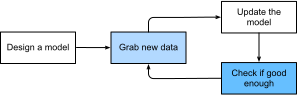

## A Motivating Example

Before we could begin writing, the authors of this book,
like much of the work force, had to become caffeinated.
We hopped in the car and started driving.
Using an iPhone, Alex called out 'Hey Siri',
awakening the phone's voice recognition system.
Then Mu commanded 'directions to Blue Bottle coffee shop'.
The phone quickly displayed the transcription of his command.
It also recognized that we were asking for directions
and launched the Maps application to fulfill our request.
Once launched, the Maps app identified a number of routes.
Next to each route, the phone displayed a predicted transit time.
While we fabricated this story for pedagogical convenience,
it demonstrates that in the span of just a few seconds,
our everyday interactions with a smartphone
can engage several machine learning models.

Imagine just writing a program to respond to a *wake word*
like 'Alexa', 'Okay, Google' or 'Siri'.
Try coding it up in a room by yourself
with nothing but a computer and a code editor.
How would you write such a program from first principles?
Think about it... the problem is hard.
Every second, the microphone will collect roughly 44,000 samples.
What rule could map reliably from a snippet of raw audio
to confident predictions ``{yes, no}``
on whether the snippet contains the wake word?
If you're stuck, don't worry.
We don't know how to write such a program from scratch either.
That's why we use ML.

Here's the trick.
Often, even when we don't know how to tell a computer
explicitly how to map from inputs to outputs,
we are nonetheless capable of performing the cognitive feat ourselves.
In other words, even if you don't know *how to program a computer*
to recognize the word 'Alexa',
you yourself *are able* to recognize the word 'Alexa'.
Armed with this ability,
we can collect a huge *dataset* containing examples of audio
and label those that *do* and that *do not* contain the wake word.
In the ML approach, we do not design a system *explicitly*
to recognize wake words.
Instead, we define a flexible program
whose behavior is determined by a number of *parameters*.
Then we use the dataset to determine
the best possible set of parameters,
those that improve the performance of our program
with respect to some measure of performance on the task of interest.

You can think of the parameters as knobs that we can turn,
manipulating the behavior of the program.
Fixing a the parameters, we call the program a *model*.
The set of all distinct programs (input-output mappings)
that we can produce just by manipulating the parameters
is called a *family* of models.
And the *meta-program* that uses our dataset
to choose the parameters is called a *learning algorithm*.

Before we an go ahead and engage the learning algorithm,
we have to define the problem precisely,
pinning down the exact nature of the inputs and outputs,
and choosing an appropriate model family.
In this case, our model receives a snippet of audio as *input*,
and it generates a selection among ``{yes, no}`` as *output*—which,
if all goes according to plan,
will closely approximate whether (or not)
the snippet contains the wake word.

If we choose the right family of models,
then there should exist one setting of the knobs
such that the model fires ``yes`` every time it hears the word 'Alexa'.
Because the exact choice of the wake word is arbitrary,
we'll probably need a model family capable, via another setting of the knobs,
of firing ``yes`` on the word 'Apricot'.
We expect that the same model should apply to 'Alexa' recognition and 'Apricot' recognition because these are similar tasks.
However, we might need a different family of models entirely
if we want to deal with fundamentally different inputs or outputs,
say if we wanted to map from images to captions,
or from English sentences to Chinese sentences.

As you might guess, if we just set the knobs randomly,
the model will probably recognize neither 'Alexa', 'Apricot',
nor any other English word.
Generally, in deep learning, the *learning*
refers to updating the model's behavior (by tuning the knobs)
over the course of a *training period*.

The training process usually looks like this:

1. Start off with a randomly initialized model that can't do anything useful.
1. Grab some of your labeled data (e.g. audio snippets and corresponding ``{yes,no}`` labels)
1. Tweak the knobs so the model sucks less with respect to those examples
1. Repeat until the model is awesome.

To summarize, rather than code up a wake word recognizer,
we code up a program that can *learn* to recognize wake words,
*if we present it with a large labeled dataset*.
You can think of this act
of determining a program's behavior by presenting it with a dataset
as *programming with data*.
We can 'program' a cat detector by providing our machine learning system
with many examples of cats and dogs, such as the images below:

|||||
|:---------------:|:---------------:|:---------------:|:---------------:|
|cat|cat|dog|dog|

This way the detector will eventually learn to emit
a very large positive number if it's a cat,
a very large negative number if it's a dog,
and something closer to zero if it isn't sure,
and this barely scratches the surface of what ML can do.

Deep learning is just one among many
popular frameworks for solving machine learning problems.
While thus far, we've only talked about machine learning broadly
and not deep learning, there's a couple points worth sneaking in here:
First, the problems that we've discussed thus far:
learning from raw audio signal,
directly from the pixels in images,
and mapping between sentences of arbitrary lengths and across languages
are problems where deep learning excels and traditional ML tools faltered.
Deep models are *deep* in precisely the sense that they learn
many *layers* of computation.
It turns out that these many-layered (or hierarchical) models
are capable of addressing low-level perceptual data
in a way that previous tools could not.
In bygone days, the crucial part of applying ML to these problems
consisted of coming up with manually engineered ways of transforming
the data into some form amenable to *shallow* models.
One key advantage of deep learning is that it replaces not only the *shallow* models
at the end of traditional learning pipelines,
but also the labor-intensive feature engineering.
Secondly, by replacing by eliminating much of the *domain-specific preprocessing*,
deep learning has eliminated many of the boundaries
that previously separated computer vision, speech recognition,
natural language processing, medical informatics, and other application areas,
offering a unified set of tools for tackling diverse problems.

