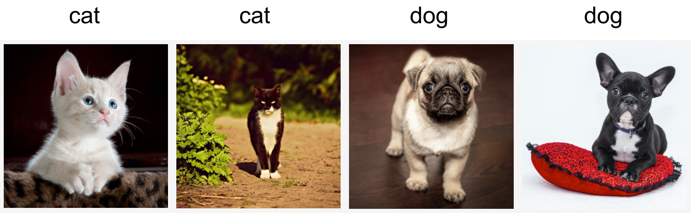

# Environnement et décalage de distribution
:label:`sec_environment-and-distribution-shift` 

 Dans les sections précédentes, nous avons travaillé sur
un certain nombre d'applications pratiques de l'apprentissage automatique,
en adaptant des modèles à divers ensembles de données.
Pourtant, nous n'avons jamais pris le temps de réfléchir à
à l'origine des données
ou à ce que nous prévoyons de faire
avec les résultats de nos modèles.
Trop souvent, les développeurs d'apprentissage automatique
en possession de données se précipitent pour développer des modèles
sans prendre le temps de réfléchir à ces questions fondamentales.

De nombreux déploiements d'apprentissage automatique qui ont échoué
peuvent être attribués à ce modèle.
Parfois, les modèles semblent fonctionner à merveille
, comme le montre la précision des jeux de tests
, mais échouent de manière catastrophique lors du déploiement
lorsque la distribution des données change soudainement.
Plus insidieusement, le déploiement même d'un modèle
peut parfois être le catalyseur qui perturbe la distribution des données.
Supposons, par exemple, que nous ayons formé un modèle
pour prédire qui remboursera ou non un prêt,
et que nous ayons découvert que le choix de chaussures d'un demandeur
était associé au risque de défaillance
(les bœufs indiquent le remboursement, les baskets indiquent la défaillance).
Nous pourrions être enclins à accorder ensuite des prêts
à tous les demandeurs portant des Oxfords
et à refuser tous les demandeurs portant des baskets.

Dans ce cas, notre saut irréfléchi de la reconnaissance des formes
à la prise de décision
et notre incapacité à considérer l'environnement de manière critique
pourraient avoir des conséquences désastreuses.
Pour commencer, dès que nous commencerions à
prendre des décisions basées sur les chaussures,
les clients comprendraient et changeraient leur comportement.
En peu de temps, tous les demandeurs porteraient des Oxfords,
sans que cela n'entraîne une amélioration de leur solvabilité.
Prenez une minute pour digérer cela, car des problèmes similaires se posent
dans de nombreuses applications de l'apprentissage automatique :
en introduisant nos décisions basées sur le modèle dans l'environnement,
nous risquons de casser le modèle.

Bien qu'il soit impossible de traiter ces sujets
de manière exhaustive dans une seule section,
notre objectif est ici d'exposer certaines préoccupations communes,
et de stimuler la réflexion critique
nécessaire pour détecter ces situations à un stade précoce,
limiter les dégâts et utiliser l'apprentissage automatique de manière responsable.
Certaines solutions sont simples
(demander les "bonnes" données),
certaines sont techniquement difficiles
(mettre en œuvre un système d'apprentissage par renforcement),
et d'autres exigent que nous sortions complètement du domaine de la prédiction statistique
et
que nous nous attaquions à des questions philosophiques difficiles
concernant l'application éthique des algorithmes.

## Types de changement de distribution

Pour commencer, nous nous en tenons au cadre de la prédiction passive
en considérant les différentes manières dont les distributions de données peuvent changer
et ce qui peut être fait pour sauver les performances du modèle.
Dans une configuration classique, nous supposons que nos données de formation
ont été échantillonnées à partir d'une certaine distribution $p_S(\mathbf{x},y)$
 mais que nos données de test seront constituées
d'exemples non étiquetés tirés de
une distribution différente $p_T(\mathbf{x},y)$.
Déjà, nous devons faire face à une réalité qui donne à réfléchir.
En l'absence de toute hypothèse sur la façon dont $p_S$
 et $p_T$ sont liés les uns aux autres,
l'apprentissage d'un classificateur robuste est impossible.

Considérons un problème de classification binaire,
où nous souhaitons distinguer les chiens des chats.
Si la distribution peut se déplacer de manière arbitraire,
alors notre configuration permet le cas pathologique
dans lequel la distribution sur les entrées reste
constante : $p_S(\mathbf{x}) = p_T(\mathbf{x})$,
mais les étiquettes sont toutes inversées :
$p_S(y | \mathbf{x}) = 1 - p_T(y | \mathbf{x})$ .
En d'autres termes, si Dieu peut soudainement décider
qu'à l'avenir tous les "chats" sont maintenant des chiens
et que ce que nous appelions auparavant "chiens" sont maintenant des chats - sans
aucun changement dans la distribution des entrées $p(\mathbf{x})$,
alors nous ne pouvons pas distinguer ce cas
de celui où la distribution n'a pas changé du tout.

Heureusement, sous certaines hypothèses restreintes
sur la façon dont nos données pourraient changer à l'avenir,
des algorithmes fondés sur des principes peuvent détecter le décalage
et parfois même s'adapter à la volée,
en améliorant la précision du classificateur original.

### Décalage de covariation

Parmi les catégories de décalage de distribution,
le décalage de covariation est peut-être la plus étudiée.
Ici, nous supposons que si la distribution des entrées
peut changer dans le temps, la fonction d'étiquetage,
c'est-à-dire la distribution conditionnelle
$P(y \mid \mathbf{x})$ ne change pas.
Les statisticiens appellent cela *décalage des covariables*
car le problème se pose en raison d'un
décalage de la distribution des covariables (caractéristiques).
Bien que nous puissions parfois raisonner sur le décalage de la distribution
sans invoquer la causalité, nous notons que le décalage des covariables
est l'hypothèse naturelle à invoquer dans des contextes
où nous pensons que $\mathbf{x}$ cause $y$.

Considérons le défi consistant à distinguer les chats des chiens.
Nos données d'apprentissage peuvent consister en des images du type de celles présentées sur :numref:`fig_cat-dog-train` .

:label:`fig_cat-dog-train`

Au moment du test, on nous demande de classer les images dans :numref:`fig_cat-dog-test` .

:label:`fig_cat-dog-test`

L'ensemble d'apprentissage est constitué de photos,
tandis que l'ensemble de test ne contient que des dessins animés.
L'apprentissage sur un ensemble de données dont les caractéristiques
sont très différentes de celles de l'ensemble de test
peut poser des problèmes en l'absence d'un plan cohérent
d'adaptation au nouveau domaine.

### Label Shift

*Label shift* décrit le problème inverse.
Ici, nous supposons que l'étiquette marginale $P(y)$
 peut changer
mais que la distribution conditionnelle de classe
$P(\mathbf{x} \mid y)$ reste fixe entre les domaines.
Le décalage d'étiquette est une hypothèse raisonnable à faire
lorsque nous pensons que $y$ cause $\mathbf{x}$.
Par exemple, nous pouvons vouloir prédire les diagnostics
en fonction de leurs symptômes (ou autres manifestations),
même si la prévalence relative des diagnostics
évolue dans le temps.
Le changement d'étiquette est l'hypothèse appropriée ici
car les maladies provoquent des symptômes.
Dans certains cas dégénérés, les hypothèses de déplacement de l'étiquette
et de déplacement de la covariable peuvent se vérifier simultanément.
Par exemple, lorsque l'étiquette est déterministe,
l'hypothèse de décalage des covariables sera satisfaite,
même si $y$ cause $\mathbf{x}$.
Il est intéressant de noter que, dans ces cas,
il est souvent avantageux de travailler avec des méthodes
qui découlent de l'hypothèse de décalage de l'étiquette.
En effet, ces méthodes ont tendance à
impliquer la manipulation d'objets qui ressemblent à des étiquettes (souvent de faible dimension),
par opposition aux objets qui ressemblent à des entrées,
qui ont tendance à être de haute dimension dans l'apprentissage profond.

### Concept Shift

Nous pouvons également rencontrer le problème connexe du *concept shift*,
qui survient lorsque les définitions mêmes des étiquettes peuvent changer.
Cela peut sembler bizarre : un *chat* est un *chat*, non ?
Cependant, d'autres catégories sont sujettes à des changements d'usage au fil du temps.
Les critères de diagnostic des maladies mentales,
ce qui passe pour être à la mode, et les titres d'emploi,
sont tous sujets à des changements de concept considérables
.
Il s'avère que si nous naviguons autour des États-Unis,
en déplaçant la source de nos données en fonction de la géographie,
nous trouverons un changement de concept considérable concernant
la distribution des noms de *boissons gazeuses*
comme le montre :numref:`fig_popvssoda` .

 
 :width:`400px` 
:label:`fig_popvssoda` 

 Si nous devions construire un système de traduction automatique,
la distribution $P(y \mid \mathbf{x})$ pourrait être différente
en fonction de notre emplacement.
Ce problème peut être difficile à détecter.
Nous pouvons espérer exploiter la connaissance
que le décalage ne se produit que progressivement
soit au sens temporel, soit au sens géographique.

### Exemples de décalage de distribution

Avant de nous plonger dans le formalisme et les algorithmes,
nous pouvons aborder quelques situations concrètes
où le décalage de covariable ou de concept peut ne pas être évident.

### Diagnostics médicaux

Imaginez que vous souhaitiez concevoir un algorithme de détection du cancer.
Vous collectez des données provenant de personnes saines et malades
et vous entraînez votre algorithme.
Il fonctionne bien, vous donne une grande précision
et vous en concluez que vous êtes prêt
pour une carrière réussie dans le diagnostic médical.
*Pas si vite.*

Les distributions qui ont donné lieu aux données d'entraînement
et celles que vous rencontrerez dans la nature peuvent différer considérablement.
C'est ce qui est arrivé à une malheureuse startup
avec laquelle certains d'entre nous (les auteurs) ont travaillé il y a des années.
Ils développaient un test sanguin pour une maladie
qui touche principalement les hommes âgés
et espéraient l'étudier à l'aide d'échantillons de sang
qu'ils avaient collectés auprès de patients.
Cependant, il est beaucoup plus difficile
d'obtenir des échantillons de sang d'hommes en bonne santé
que de patients malades déjà dans le système.
Pour compenser, la startup a sollicité
des dons de sang auprès d'étudiants d'un campus universitaire
pour servir de témoins sains dans le cadre de la mise au point de leur test.
Ils ont ensuite demandé si nous pouvions les aider
à construire un classificateur pour détecter la maladie.

Comme nous leur avons expliqué,
il serait en effet facile de distinguer
entre les cohortes saines et malades
avec une précision quasi parfaite.
Toutefois, cela est dû au fait que les sujets testés
différaient en termes d'âge, de niveaux d'hormones,
d'activité physique, de régime alimentaire, de consommation d'alcool,
et de nombreux autres facteurs sans rapport avec la maladie.
Il était peu probable que ce soit le cas avec des patients réels.
En raison de leur procédure d'échantillonnage,
nous pouvions nous attendre à rencontrer un décalage extrême des covariables.
De plus, il était peu probable que ce cas
puisse être corrigé par des méthodes conventionnelles.
En bref, ils ont gaspillé une somme d'argent importante.

### Voitures autopilotées

Supposons qu'une entreprise souhaite exploiter l'apprentissage automatique
pour développer des voitures autopilotées.
L'un des composants clés est un détecteur en bord de route.
Comme il est coûteux d'obtenir des données annotées réelles,
l'entreprise a eu l'idée (intelligente et discutable)
d'utiliser des données synthétiques provenant d'un moteur de rendu de jeux
comme données d'entraînement supplémentaires.
Cela a très bien fonctionné sur les "données de test"
tirées du moteur de rendu.
Hélas, à l'intérieur d'une vraie voiture, ce fut un désastre.
Il s'est avéré que le bord de la route avait été rendu
avec une texture très simpliste.
Plus important encore, *tout* le bord de la route avait été rendu
avec la *même* texture et le détecteur de bord de route
a appris très rapidement cette "caractéristique".

Une chose similaire est arrivée à l'armée américaine
lorsqu'elle a essayé pour la première fois de détecter des chars dans la forêt.
Ils ont pris des photos aériennes de la forêt sans chars,
puis ont conduit les chars dans la forêt
et ont pris une autre série de photos.
Le classificateur semblait fonctionner *parfaitement*.
Malheureusement, il avait simplement appris
à distinguer les arbres avec ombres
des arbres sans ombres - la première série de photos
a été prise tôt le matin,
la seconde à midi.

### Distributions non stationnaires

Une situation beaucoup plus subtile se présente
lorsque la distribution change lentement
(également appelée *distribution non stationnaire*)
et que le modèle n'est pas mis à jour de manière adéquate.
Voici quelques cas typiques.

* Nous formons un modèle de publicité computationnel puis nous omettons de le mettre à jour fréquemment (par exemple, nous oublions d'intégrer qu'un obscur nouvel appareil appelé iPad vient d'être lancé).
* Nous construisons un filtre anti-spam. Il fonctionne bien pour détecter tous les spams que nous avons vus jusqu'à présent. Mais les spammeurs deviennent plus malins et créent de nouveaux messages qui ne ressemblent à rien de ce que nous avons vu auparavant.
* Nous construisons un système de recommandation de produits. Il fonctionne tout au long de l'hiver, mais continue à recommander des chapeaux de Père Noël longtemps après Noël.

### Plus d'anecdotes

* Nous construisons un détecteur de visage. Il fonctionne bien sur tous les benchmarks. Malheureusement, il échoue sur les données de test - les exemples incriminés sont des gros plans où le visage remplit toute l'image (aucune donnée de ce type ne figurait dans l'ensemble d'entraînement).
* Nous construisons un moteur de recherche Web pour le marché américain et voulons le déployer au Royaume-Uni.
* Nous formons un classificateur d'images en compilant un grand ensemble de données où chacune des classes est représentée de manière égale dans l'ensemble de données, par exemple 1000 catégories, représentées par 1000 images chacune. Ensuite, nous déployons le système dans le monde réel, où la distribution réelle des étiquettes des photographies est décidément non uniforme.

## Correction du décalage de distribution

Comme nous l'avons vu, il existe de nombreux cas
où les distributions de entrainement et de test
$P(\mathbf{x}, y)$ sont différentes.
Dans certains cas, nous avons de la chance et les modèles fonctionnent
malgré le changement de covariable, d'étiquette ou de concept.
Dans d'autres cas, nous pouvons faire mieux en employant
des stratégies fondées sur des principes pour faire face au changement.
Le reste de cette section est beaucoup plus technique.
Le lecteur impatient pourra passer à la section suivante
car ce matériel n'est pas un prérequis pour les concepts suivants.

### Risque empirique et risque
:label:`subsec_empirical-risk-and-risk` 

 Réfléchissons d'abord à ce qui se passe exactement
pendant l'apprentissage du modèle :
nous itérons sur les caractéristiques et les étiquettes associées
des données d'apprentissage
$\{(\mathbf{x}_1, y_1), \ldots, (\mathbf{x}_n, y_n)\}$ 
 et mettons à jour les paramètres d'un modèle $f$ après chaque minibatch.
Pour des raisons de simplicité, nous ne tenons pas compte de la régularisation,
. Nous minimisons donc largement la perte sur l'apprentissage :

$$\mathop{\mathrm{minimize}}_f \frac{1}{n} \sum_{i=1}^n l(f(\mathbf{x}_i), y_i),$$ 
 :eqlabel:`eq_empirical-risk-min` 

 où $l$ est la fonction de perte
qui mesure la "qualité" de la prédiction $f(\mathbf{x}_i)$ compte tenu de l'étiquette associée $y_i$.
Les statisticiens appellent le terme de :eqref:`eq_empirical-risk-min` *risque empirique*.
Le *risque empirique* est une perte moyenne sur les données d'apprentissage
pour approcher le *risque*,
qui est l'espérance
de la perte sur la population entière de données tirées de leur vraie distribution
$p(\mathbf{x},y)$ :

$$E_{p(\mathbf{x}, y)} [l(f(\mathbf{x}), y)] = \int\int l(f(\mathbf{x}), y) p(\mathbf{x}, y) \;d\mathbf{x}dy.$$ 
 :eqlabel:`eq_true-risk` 

 Cependant, en pratique, nous ne pouvons généralement pas obtenir la population entière de données.
Ainsi, la minimisation du risque empirique *,
qui consiste à minimiser le risque empirique dans :eqref:`eq_empirical-risk-min` ,
est une stratégie pratique pour l'apprentissage automatique,
dans l'espoir d'approcher
en minimisant le risque.

### Correction du décalage des covariables
:label:`subsec_covariate-shift-correction` 

 Supposons que nous voulions estimer
une certaine dépendance $P(y \mid \mathbf{x})$
 pour laquelle nous disposons de données étiquetées $(\mathbf{x}_i, y_i)$.
Malheureusement, les observations $\mathbf{x}_i$ sont tirées
d'une certaine *distribution source* $q(\mathbf{x})$
 plutôt que de la *distribution cible* $p(\mathbf{x})$.
Heureusement,
l'hypothèse de dépendance signifie
que la distribution conditionnelle ne change pas : $p(y \mid \mathbf{x}) = q(y \mid \mathbf{x})$.
Si la distribution source $q(\mathbf{x})$ est "fausse",
nous pouvons corriger cela en utilisant l'identité simple suivante dans le risque :

$$
\begin{aligned}
\int\int l(f(\mathbf{x}), y) p(y \mid \mathbf{x})p(\mathbf{x}) \;d\mathbf{x}dy =
\int\int l(f(\mathbf{x}), y) q(y \mid \mathbf{x})q(\mathbf{x})\frac{p(\mathbf{x})}{q(\mathbf{x})} \;d\mathbf{x}dy.
\end{aligned}
$$

En d'autres termes, nous devons repondérer chaque exemple de données
par le rapport de la probabilité

 qu'il aurait été tiré de la distribution correcte à celle de la distribution erronée :

$$\beta_i \stackrel{\mathrm{def}}{=} \frac{p(\mathbf{x}_i)}{q(\mathbf{x}_i)}.$$

En introduisant le poids $\beta_i$ pour
chaque exemple de données $(\mathbf{x}_i, y_i)$
 nous pouvons entraîner notre modèle à l'aide de
*weighted empirical risk minimization* :

$$\mathop{\mathrm{minimize}}_f \frac{1}{n} \sum_{i=1}^n \beta_i l(f(\mathbf{x}_i), y_i).$$ 
 :eqlabel:`eq_weighted-empirical-risk-min` 

 

 Hélas, nous ne connaissons pas ce ratio,
donc avant de pouvoir faire quoi que ce soit d'utile nous devons l'estimer.
De nombreuses méthodes sont disponibles,
y compris certaines approches fantaisistes de la théorie des opérateurs
qui tentent de recalibrer l'opérateur d'espérance directement
en utilisant un principe de norme minimale ou d'entropie maximale.
Notez que pour toute approche de ce type, nous avons besoin d'échantillons
tirés des deux distributions - la "vraie" $p$, par exemple,
par l'accès aux données de test, et celle utilisée
pour générer l'ensemble d'apprentissage $q$ (cette dernière est trivialement disponible).
Notez cependant que nous n'avons besoin que des caractéristiques $\mathbf{x} \sim p(\mathbf{x})$;
nous n'avons pas besoin d'accéder aux étiquettes $y \sim p(y)$.

Dans ce cas, il existe une approche très efficace
qui donnera des résultats presque aussi bons que l'originale : la régression logistique,
qui est un cas particulier de la régression softmax (voir :numref:`sec_softmax` )
pour la classification binaire.
C'est tout ce qui est nécessaire pour calculer les rapports de probabilité estimés.
Nous apprenons un classificateur pour distinguer
entre les données tirées de $p(\mathbf{x})$
 et les données tirées de $q(\mathbf{x})$.
S'il est impossible de distinguer
entre les deux distributions
, cela signifie que les instances associées
ont la même probabilité de provenir de
l'une ou l'autre des deux distributions.
D'autre part, toute instance
qui peut être bien discriminée
doit être significativement surpondérée
ou sous-pondérée en conséquence.

Pour simplifier, supposons que nous avons
un nombre égal d'instances provenant des deux distributions
$p(\mathbf{x})$ 
 et $q(\mathbf{x})$, respectivement.
Désignons maintenant par $z$ les étiquettes qui sont $1$
 pour les données tirées de $p$ et $-1$ pour les données tirées de $q$.
Alors la probabilité dans un ensemble de données mixte est donnée par

$$P(z=1 \mid \mathbf{x}) = \frac{p(\mathbf{x})}{p(\mathbf{x})+q(\mathbf{x})} \text{ and hence } \frac{P(z=1 \mid \mathbf{x})}{P(z=-1 \mid \mathbf{x})} = \frac{p(\mathbf{x})}{q(\mathbf{x})}.$$ 

 Ainsi, si nous utilisons une approche de régression logistique,
où $P(z=1 \mid \mathbf{x})=\frac{1}{1+\exp(-h(\mathbf{x}))}$ ($h$ est une fonction paramétrée),
il s'ensuit que

$$
\beta_i = \frac{1/(1 + \exp(-h(\mathbf{x}_i)))}{\exp(-h(\mathbf{x}_i))/(1 + \exp(-h(\mathbf{x}_i)))} = \exp(h(\mathbf{x}_i)).
$$

Par conséquent, nous devons résoudre deux problèmes :
d'abord un problème de distinction entre
les données tirées des deux distributions,
et ensuite un problème de minimisation du risque empirique pondéré
dans :eqref:`eq_weighted-empirical-risk-min` 
 où nous pondérons les termes par $\beta_i$.

Nous sommes maintenant prêts à décrire un algorithme de correction.
Supposons que nous ayons un ensemble d'apprentissage $\{(\mathbf{x}_1, y_1), \ldots, (\mathbf{x}_n, y_n)\}$ et un ensemble de test non étiqueté $\{\mathbf{u}_1, \ldots, \mathbf{u}_m\}$.
Pour le décalage des covariables,
nous supposons que $\mathbf{x}_i$ pour tout $1 \leq i \leq n$ sont tirés d'une certaine distribution source
et $\mathbf{u}_i$ pour tout $1 \leq i \leq m$
 sont tirés de la distribution cible.
Voici un algorithme prototype
pour corriger le décalage des covariables :

1. Générer un ensemble d'apprentissage de classification binaire : $\{(\mathbf{x}_1, -1), \ldots, (\mathbf{x}_n, -1), (\mathbf{u}_1, 1), \ldots, (\mathbf{u}_m, 1)\}$.
1. Entraîner un classificateur binaire en utilisant la régression logistique pour obtenir la fonction $h$.
1. Peser les données d'entraînement en utilisant $\beta_i = \exp(h(\mathbf{x}_i))$ ou mieux $\beta_i = \min(\exp(h(\mathbf{x}_i)), c)$ pour une certaine constante $c$.
1. Utilisez les poids $\beta_i$ pour l'entrainement sur $\{(\mathbf{x}_1, y_1), \ldots, (\mathbf{x}_n, y_n)\}$ dans :eqref:`eq_weighted-empirical-risk-min` .

Notez que l'algorithme ci-dessus repose sur une hypothèse cruciale.
Pour que ce schéma fonctionne, il faut que chaque exemple de données
dans la distribution cible (par exemple, au moment du test)
ait une probabilité non nulle de se produire au moment de la formation.
Si nous trouvons un point où $p(\mathbf{x}) > 0$ mais $q(\mathbf{x}) = 0$,
alors le poids d'importance correspondant doit être infini.

### Correction du décalage des étiquettes

Supposons que nous ayons affaire à une tâche de classification
avec $k$ catégories.
En utilisant la même notation que dans :numref:`subsec_covariate-shift-correction` ,
$q$ et $p$ sont la distribution source (par exemple, le temps de formation) et la distribution cible (par exemple, le temps de test), respectivement.
Supposons que la distribution des étiquettes se déplace dans le temps :
$q(y) \neq p(y)$ , mais que la distribution conditionnelle de classe
reste la même : $q(\mathbf{x} \mid y)=p(\mathbf{x} \mid y)$.
Si la distribution source $q(y)$ est "fausse",
nous pouvons corriger cela
selon
l'identité suivante dans le risque
tel que défini dans
:eqref:`eq_true-risk` :

$$
\begin{aligned}
\int\int l(f(\mathbf{x}), y) p(\mathbf{x} \mid y)p(y) \;d\mathbf{x}dy =
\int\int l(f(\mathbf{x}), y) q(\mathbf{x} \mid y)q(y)\frac{p(y)}{q(y)} \;d\mathbf{x}dy.
\end{aligned}
$$

Ici, nos poids d'importance correspondront aux rapports de vraisemblance de l'étiquette

 $$\beta_i \stackrel{\mathrm{def}}{=} \frac{p(y_i)}{q(y_i)}.$$ 

 Un aspect intéressant du décalage de l'étiquette est que
si nous avons un modèle raisonnablement bon
sur la distribution source,
alors nous pouvons obtenir des estimations cohérentes de ces poids
sans jamais avoir à traiter la dimension ambiante.
Dans le cadre de l'apprentissage profond, les entrées ont tendance à
être des objets à haute dimension comme des images,
tandis que les étiquettes sont souvent des objets plus simples comme des catégories.

Pour estimer la distribution des étiquettes cibles,
nous prenons d'abord notre classificateur standard raisonnablement bon
(généralement formé sur les données de formation)
et nous calculons sa matrice de confusion en utilisant l'ensemble de validation
(également issu de la distribution de formation).
La *matrice de confusion*, $\mathbf{C}$, est simplement une matrice $k \times k$,
où chaque colonne correspond à la catégorie de l'étiquette (vérité terrain)
et chaque ligne correspond à la catégorie prédite par notre modèle.
La valeur de chaque cellule $c_{ij}$ est la fraction des prédictions totales sur l'ensemble de validation
où la véritable étiquette était $j$ et notre modèle a prédit $i$.

Nous ne pouvons pas calculer directement la matrice de confusion
sur les données cibles,
car nous ne pouvons pas voir les étiquettes des exemples
que nous voyons dans la nature,
à moins d'investir dans un pipeline complexe d'annotation en temps réel.
Ce que nous pouvons faire, cependant, c'est faire la moyenne de toutes les prédictions de nos modèles
au moment du test, ce qui donne les sorties moyennes du modèle $\mu(\hat{\mathbf{y}}) \in \mathbb{R}^k$,
dont l'élément $i^\mathrm{th}$ $\mu(\hat{y}_i)$ 
 est la fraction des prédictions totales sur l'ensemble de test
où notre modèle a prédit $i$.

Il s'avère que sous certaines conditions douces--- si
notre classificateur était raisonnablement précis en premier lieu,
et si les données cibles ne contiennent que des catégories
que nous avons déjà vues,
et si l'hypothèse de décalage d'étiquette se vérifie en premier lieu
(l'hypothèse la plus forte ici),
alors nous pouvons estimer la distribution des étiquettes de l'ensemble de test
en résolvant un système linéaire simple

$$\mathbf{C} p(\mathbf{y}) = \mu(\hat{\mathbf{y}}),$$ 

 parce que, en tant qu'estimation, $\sum_{j=1}^k c_{ij} p(y_j) = \mu(\hat{y}_i)$ est valable pour tous les $1 \leq i \leq k$,
où $p(y_j)$ est l'élément $j^\mathrm{th}$ du vecteur de distribution des étiquettes $k$-dimensionnel $p(\mathbf{y})$.
Si notre classificateur est suffisamment précis au départ,
alors la matrice de confusion $\mathbf{C}$ sera inversible,
et nous obtiendrons une solution $p(\mathbf{y}) = \mathbf{C}^{-1} \mu(\hat{\mathbf{y}})$.

Comme nous observons les étiquettes sur les données sources,
il est facile d'estimer la distribution $q(y)$.
Ensuite, pour tout exemple de entrainement $i$ avec l'étiquette $y_i$,
nous pouvons prendre le rapport de nos estimations $p(y_i)/q(y_i)$
 pour calculer le poids $\beta_i$,
et l'insérer dans la minimisation du risque empirique pondéré
dans :eqref:`eq_weighted-empirical-risk-min` .

### Correction du décalage de concept

Le décalage de concept est beaucoup plus difficile à corriger d'une manière fondée sur des principes.
Par exemple, dans une situation où le problème change soudainement
de distinguer les chats des chiens à
de distinguer les animaux blancs des animaux noirs,
il sera déraisonnable de supposer
que nous pouvons faire beaucoup mieux que de collecter de nouvelles étiquettes
et de nous entraîner à partir de zéro.
Heureusement, dans la pratique, de tels changements extrêmes sont rares.
Au lieu de cela, ce qui se passe généralement, c'est que la tâche continue à évoluer lentement.
Pour rendre les choses plus concrètes, voici quelques exemples :

* Dans la publicité informatique, de nouveaux produits sont lancés,
les anciens produits deviennent moins populaires. Cela signifie que la distribution des publicités et leur popularité changent progressivement et que tout prédicteur du taux de clics doit changer progressivement avec elle.
* Les lentilles des caméras de circulation se dégradent progressivement en raison de l'usure environnementale, ce qui affecte progressivement la qualité de l'image.
* Le contenu des informations change progressivement (la plupart des informations restent inchangées mais de nouvelles histoires apparaissent).

Dans ce cas, nous pouvons utiliser la même approche que celle utilisée pour l'entrainement des réseaux afin qu'ils s'adaptent au changement des données. En d'autres termes, nous utilisons les poids du réseau existant et effectuons simplement quelques étapes de mise à jour avec les nouvelles données plutôt que de former à partir de zéro.

### Une taxonomie des problèmes d'apprentissage

Armés de connaissances sur la façon de traiter les changements dans les distributions, nous pouvons maintenant examiner d'autres aspects de la formulation des problèmes d'apprentissage automatique.

### Apprentissage par lots

Dans le cadre de l'apprentissage par lots *, nous avons accès à des caractéristiques et à des étiquettes de entrainement $\{(\mathbf{x}_1, y_1), \ldots, (\mathbf{x}_n, y_n)\}$, que nous utilisons pour former un modèle $f(\mathbf{x})$. Plus tard, nous déployons ce modèle pour évaluer de nouvelles données $(\mathbf{x}, y)$ tirées de la même distribution. Il s'agit de l'hypothèse par défaut pour tous les problèmes que nous abordons ici. Par exemple, nous pouvons entraîner un détecteur de chats à partir de nombreuses photos de chats et de chiens. Une fois que nous l'avons formé, nous l'intégrons à un système de vision artificielle de porte à chat intelligente qui ne laisse entrer que les chats. Ce système est ensuite installé au domicile d'un client et n'est plus jamais mis à jour (sauf circonstances extrêmes).

#### Apprentissage en ligne

Imaginons maintenant que les données $(\mathbf{x}_i, y_i)$ arrivent un échantillon à la fois. Plus précisément, supposons que nous observions d'abord $\mathbf{x}_i$, puis que nous devions établir une estimation $f(\mathbf{x}_i)$ et que ce n'est qu'une fois que nous avons fait cela que nous observons $y_i$ et qu'avec cela, nous recevons une récompense ou subissons une perte, selon notre décision.
De nombreux problèmes réels entrent dans cette catégorie. Par exemple, nous devons prédire le cours de l'action de demain, cela nous permet d'effectuer des transactions sur la base de cette estimation et, à la fin de la journée, nous découvrons si notre estimation nous a permis de réaliser un bénéfice. En d'autres termes, dans l'apprentissage *en ligne*, nous avons le cycle suivant où nous améliorons continuellement notre modèle en fonction de nouvelles observations.

$$
\mathrm{model} ~) f_t \longrightarrow
\mathrm{data} ~) \mathbf{x}_t \longrightarrow
\mathrm{estimate} ~) f_t(\mathbf{x}_t) \longrightarrow
\mathrm{observation} ~) y_t \longrightarrow
\mathrm{loss} ~) l(y_t, f_t(\mathbf{x}_t)) \longrightarrow
\mathrm{model} ~) f_{t+1}
$$

#### Bandits

*Les bandits* sont un cas particulier du problème ci-dessus. Alors que dans la plupart des problèmes d'apprentissage, nous avons une fonction continuellement paramétrée $f$ dont nous voulons apprendre les paramètres (par exemple, un réseau profond), dans un problème de *bandits*, nous n'avons qu'un nombre fini de bras que nous pouvons tirer, c'est-à-dire un nombre fini d'actions que nous pouvons entreprendre. Il n'est pas très surprenant que pour ce problème plus simple, des garanties théoriques plus fortes en termes d'optimalité puissent être obtenues. Nous l'énumérons principalement car ce problème est souvent (confusément) traité comme s'il s'agissait d'un cadre d'apprentissage distinct.

#### Contrôle

Dans de nombreux cas, l'environnement se souvient de ce que nous avons fait. Pas nécessairement de manière contradictoire, mais il se souviendra simplement et la réponse dépendra de ce qui s'est passé auparavant. Par exemple, un contrôleur de chaudière à café observera des températures différentes selon qu'il a chauffé la chaudière auparavant. Les algorithmes de contrôle PID (proportionnel-intégral-dérivé) sont un choix populaire dans ce cas.
De même, le comportement d'un utilisateur sur un site d'actualités dépendra de ce qu'on lui a montré précédemment (par exemple, il ne lira la plupart des actualités qu'une seule fois). De nombreux algorithmes de ce type forment un modèle de l'environnement dans lequel ils agissent de manière à ce que leurs décisions semblent moins aléatoires.
Récemment, la théorie du contrôle
(par exemple, les variantes PID) a également été utilisée
pour régler automatiquement les hyperparamètres
afin d'obtenir une meilleure qualité de démêlage et de reconstruction,
et d'améliorer la diversité du texte généré et la qualité de reconstruction des images générées :cite:`Shao.Yao.Sun.ea.2020` .

### Apprentissage par renforcement

Dans le cas plus général d'un environnement doté d'une mémoire, nous pouvons rencontrer des situations où l'environnement essaie de coopérer avec nous (jeux coopératifs, en particulier pour les jeux à somme non nulle), ou d'autres où l'environnement va essayer de gagner. Les échecs, le go, le backgammon ou StarCraft sont quelques-uns des cas de figure de l'apprentissage par renforcement **. De même, nous pourrions vouloir construire un bon contrôleur pour les voitures autonomes. Les autres voitures sont susceptibles de réagir au style de conduite de la voiture autonome de manière non triviale, par exemple en essayant de l'éviter, de provoquer un accident ou de coopérer avec elle.

### Considérer l'environnement

Une distinction essentielle entre les différentes situations ci-dessus est que la même stratégie qui aurait pu fonctionner tout au long dans le cas d'un environnement stationnaire, pourrait ne pas fonctionner tout au long lorsque l'environnement peut s'adapter. Par exemple, une opportunité d'arbitrage découverte par un trader est susceptible de disparaître dès qu'il commence à l'exploiter. La vitesse et la manière dont l'environnement évolue déterminent dans une large mesure le type d'algorithmes que nous pouvons mettre en œuvre. Par exemple, si nous savons que les choses ne peuvent changer que lentement, nous pouvons forcer toute estimation à ne changer que lentement également. Si nous savons que l'environnement peut changer instantanément, mais très rarement, nous pouvons en tenir compte. Ces types de connaissances sont essentiels pour que le scientifique en herbe puisse faire face au changement de concept, c'est-à-dire lorsque le problème qu'il tente de résoudre évolue dans le temps.

## Équité, responsabilité et transparence dans l'apprentissage automatique

Enfin, il est important de se rappeler
que lorsque vous déployez des systèmes d'apprentissage automatique
vous ne vous contentez pas d'optimiser un modèle prédictif - vous
fournissez généralement un outil qui sera utilisé
pour automatiser (partiellement ou totalement) des décisions.
Ces systèmes techniques peuvent avoir un impact sur la vie
des individus soumis aux décisions qui en résultent.
Le passage de la prise en compte de prédictions à la prise de décisions
soulève non seulement de nouvelles questions techniques,
mais aussi une foule de questions éthiques
qui doivent être soigneusement examinées.
Si nous déployons un système de diagnostic médical,
nous devons savoir pour quelles populations
il peut fonctionner et pour lesquelles il peut ne pas fonctionner.
Si nous négligeons les risques prévisibles pour le bien-être d'une sous-population
, nous pourrions administrer des soins de qualité inférieure.
En outre, dès lors que nous envisageons des systèmes de prise de décision,
nous devons prendre du recul et reconsidérer la manière dont nous évaluons notre technologie.
Entre autres conséquences de ce changement de perspective,
nous découvrirons que la *précision* est rarement la bonne mesure.
Par exemple, lorsque nous traduisons des prédictions en actions,
nous voudrons souvent prendre en compte
la sensibilité potentielle aux coûts des erreurs commises de diverses manières.
Si une façon de mal classer une image
peut être perçue comme un tour de passe-passe racial,
alors qu'une classification erronée dans une catégorie différente
serait inoffensive, nous pourrions vouloir ajuster
nos seuils en conséquence, en tenant compte des valeurs sociétales
dans la conception du protocole de prise de décision.
Nous devons également faire attention à la manière dont
les systèmes de prédiction peuvent conduire à des boucles de rétroaction.
Prenons l'exemple des systèmes de police prédictifs,
qui affectent des agents de patrouille
aux zones où les prévisions de criminalité sont élevées.
Il est facile de voir comment un modèle inquiétant peut émerger :

 1. Les quartiers où la criminalité est plus élevée reçoivent plus de patrouilles.
 1. Par conséquent, davantage de crimes sont découverts dans ces quartiers, ce qui enrichit les données d'apprentissage disponibles pour les itérations futures.
 1. Exposé à davantage de positifs, le modèle prédit encore plus de crimes dans ces quartiers.
 1. Lors de l'itération suivante, le modèle mis à jour cible encore plus fortement le même quartier, ce qui entraîne la découverte d'encore plus de crimes, etc.

Souvent, les différents mécanismes par lesquels
les prédictions d'un modèle deviennent couplées à ses données d'apprentissage
ne sont pas pris en compte dans le processus de modélisation.
Cela peut conduire à ce que les chercheurs appellent des *boucles de rétroaction à emballement*.
En outre, il convient de se demander
si nous nous attaquons au bon problème en premier lieu.
Les algorithmes prédictifs jouent désormais un rôle majeur
dans la diffusion de l'information.
Les nouvelles qu'un individu rencontre
doivent-elles être déterminées par l'ensemble des pages Facebook qu'il a *aimées* ?
Ce ne sont là que quelques-uns des nombreux dilemmes éthiques urgents
que vous pourriez rencontrer au cours d'une carrière dans l'apprentissage automatique.

## Résumé

* Dans de nombreux cas, les ensembles de entrainement et de test ne proviennent pas de la même distribution. C'est ce qu'on appelle le changement de distribution.
* Le risque est l'espérance de la perte sur l'ensemble de la population de données tirées de leur vraie distribution. Cependant, cette population entière n'est généralement pas disponible. Le risque empirique est une perte moyenne sur les données d'entraînement pour approcher le risque. En pratique, nous effectuons une minimisation du risque empirique.
* Sous les hypothèses correspondantes, le décalage des covariables et des étiquettes peut être détecté et corrigé au moment du test. Le fait de ne pas prendre en compte ce biais peut devenir problématique au moment du test.
* Dans certains cas, l'environnement peut se souvenir des actions automatisées et répondre de manière surprenante. Nous devons tenir compte de cette possibilité lors de la construction des modèles et continuer à surveiller les systèmes en direct, en restant ouverts à la possibilité que nos modèles et l'environnement s'entremêlent de manière imprévue.

## Exercices

1. Que pourrait-il se passer si nous modifions le comportement d'un moteur de recherche ? Que pourraient faire les utilisateurs ? Qu'en est-il des annonceurs ?
1. Implémentez un détecteur de décalage de covariables. Astuce : construisez un classificateur.
1. Implémentez un correcteur de décalage de covariables.
1. Outre le décalage de la distribution, qu'est-ce qui pourrait affecter la façon dont le risque empirique se rapproche du risque ?

[Discussions](https://discuss.d2l.ai/t/105)
