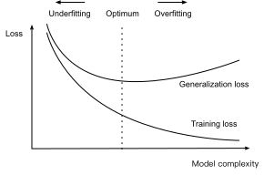

```{.python .input}
%load_ext d2lbook.tab
tab.interact_select(['mxnet', 'pytorch', 'tensorflow'])
```

# Generalization
:label:`sec_generalization_basics`

Consider a college student trying to prepare for his final exam.
A diligent student will strive to practice well
and test his abilities using exams from previous years.
Nonetheless, doing well on past exams is no guarantee
that they will excel when it matters.
For instance, the student might try to prepare
by rote learning the answers to the exam questions.
This requires the student to memorize many things.
They might even remember the answers for past exams perfectly.
Another student might prepare by trying to understand
the reasons for giving certain answers.
While this tends to work well for drivers license exams, 
it has poor outcomes when the set of exam questions is more 
varied and drawn from a larger, possibly infinite pool. 

As machine learning scientists,
our goal is to discover *patterns*.
But how can we be sure that we have
truly discovered a *general* pattern
and not simply memorized our data?
Our predictions will only be useful
if our model has truly discovered a *general* pattern.
We don't want to predict yesterday's stock prices, but tomorrow's. 
We don't need to recognize diseases that have already been diagnosed,
but rather those for new patients that we have never previously encountered.
This problem---how to discover patterns that *generalize*---is
the fundamental problem of machine learning,
and arguably of all of statistics.

The danger is that when we train models,
we access just a small sample of data.
The largest *labeled* public image datasets, 
such as Imagenet :cite:`deng2009imagenet` 
contain roughly one million images. 
Unlabeled image collections 
such as the Flickr YFC100M dataset 
can be significantly larger, 
containing 100 million images :cite:`thomee2016yfcc100m`. 
While both numbers seem large, they are tiny 
compared to the space of all possible images
that one could take at 1 Megapixel resolution. 
Worse still, we frequently must learn 
from only hundreds of examples. 
For instance, a hospital might only have data 
representing 100 occurrences of an infrequent disease. 
When working with finite samples, we run the risk
that we might discover apparent associations
that turn out not to hold up when we collect more data.

The phenomenon of fitting closer to our training data
than to the underlying distribution is called *overfitting*, 
and techniques for combatting overfitting 
are often called *regularization* methods. 
While the following is no substitute for a proper introduction 
to statistical learning theory :cite:`Vapnik98,boucheron2005theory`, 
it should give you the intuitions you need to get going.


## Training Error and Generalization Error


In the standard supervised learning setting,
that we have been focusing on thus far,
we assume that the training data and the test data
are drawn *independently* from *identical* distributions.
This is commonly called the *IID assumption*.
While this assumption is strong,
it's worth noting that absent any such assumption
we would be dead in the water. 
Why should we believe that the training data sampled from distribution $P_(X,Y)$
should tell us anything at all about the data generating our test data $Q(X,Y)$
absent any assumption at all on how $P$ and $Q$ are related?
Later on we'll consider some milder assumptions 
that allow for shifts in distribution 
but for now let's consider the IID case properly.

To begin, we need to differentiate between 
training error and generalization error.
The *training error* $R_\mathrm{emp}$ 
is the error of our model
as calculated on the training dataset,
while *generalization error* $R$ 
is the expectation of our model's error
were we to apply it to an infinite stream
of additional data examples
drawn from the same underlying data distribution.
They are defined as follows:

$$R_\mathrm{emp}[\mathbf{X}, \mathbf{Y}, f] = \frac{1}{m} \sum_{i=1}^m l(\mathbf{x}_i, \mathbf{y}_i, f(\mathbf{x}_i))
\text{ and }
R[p, f] = E_{(\mathbf{x}, \mathbf{y}) \sim p} [l(\mathbf{x}, \mathbf{y}, f(\mathbf{x}))]$$

Problematically, we can never calculate 
the generalization error $R$ exactly.
That is because the stream of infinite data is an imaginary object.
In practice, we must *estimate* the generalization error
by applying our model to an independent test set 
constituted of a random selection of examples $\mathbf{X}'$ and labels $\mathbf{Y}'$
that were withheld from our training set. 
This yields $R_\mathrm{emp}[\mathbf{X}', \mathbf{Y}', f]$.


Note that when we evaluate our classifier on the test set,
we can treat the classifier as *fixed*
(it does not depend on the sample of the test set),
and thus estimating its error 
is simply the problem of mean estimation.
However the same cannot be said 
for the training set. 
Here the model we get depends explicitly 
on the selection of the training sample
and thus the training error will in general
be a biased estimate of the true error 
on the underlying population.
The central question of generalization 
is then when should we expect our training error 
to be close to the population error 
(and thus the test error).


### Model Complexity

In classical theory, when we have simple models and abundant data,
the training and generalization errors tend to be close.
However, when we work with more complex models and/or fewer examples,
we expect the training error to go down but the generalization gap to grow.
This should not be surprising. 
Imagine a model so expressive that 
(for a given dataset size) 
it can fit arbitrary labels,
even if randomly assigned.
In this case, we cannot conclude 
on the basis of fitting the training 
data alone, that our model has 
discovered any generalizable pattern :cite:`vapnik1994measuring`.
However, if our model is not capable 
of fitting anywhere near so many arbitrary labels, 
then it must have discovered a pattern.
These ideas about model complexity owe some inspiration 
to ideas of the great Philosopher of Science Karl Popper,
who formalized the criterion of falsifiability.
According to Popper, a theory 
that can explain any and all observations
is not a scientific theory at all! 
After all, what has it told us about the world
if it has not ruled out any possibility?
Similarly a model class is only useful 
when it cannot fit any data. 


Now what precisely constitutes 
the appropriate notion of model complexity 
is a complex matter.
Many factors govern whether a model will generalize well.
For example a model with more parameters 
might be considered more complex in general. 
Note, though, that this is not necessarily true.
For instance, kernel methods operate in spaces
with infinite numbers of parameters, 
yet their complexity is controlled 
by other means :cite:`scholkopf2002learning`. 
One notion of complexity that often proves useful 
is the range of values that the parameters can take.
Here, a model whose parameters are permitted 
to take arbitrary values
would be more complex.
Notably, it can be difficult to compare 
complexity among members of substantially different model classes
(say, decision trees vs. neural networks).


## Model Selection

Typically, we select our final model,
only after evaluating multiple models 
that differ in various ways 
(different architectures, training objectives,
selected features, data preprocessing,
learning rates, etc).
Choosing among many models is aptly
called *model selection*.

In principle, we should not touch our test set
until after we have chosen all our hyperparameters.
Were we to use the test data in the model selection process,
there is a risk that we might overfit the test data.
Then we would be in serious trouble.
If we overfit our training data,
there is always the evaluation on test data to keep us honest.
But if we overfit the test data, how would we ever know?
See e.g. :cite:`ong2005learning` for an example how 
this can lead to absurd results even for models where the complexity 
can be tightly controlled. 

Thus, we should never rely on the test data for model selection.
And yet we cannot rely solely on the training data
for model selection either because
we cannot estimate the generalization error
on the very data that we use to train the model.


In practical applications, the picture gets muddier.
While ideally we would only touch the test data once,
to assess the very best model or to compare
a small number of models to each other,
real-world test data is seldom discarded after just one use.
We can seldom afford a new test set for each round of experiments. 
In fact, recycling benchmark data for decades can have a significant impact on the 
development of algorithms, e.g. for [image classification](https://paperswithcode.com/sota/image-classification-on-imagenet) and [optical character recognition](https://paperswithcode.com/sota/image-classification-on-mnist).

The common practice to address the problem of `training on the test set`
is to split our data three ways,
incorporating a *validation set*
in addition to the training and test datasets.
The result is a murky practice where the boundaries
between validation and test data are worryingly ambiguous.
Unless explicitly stated otherwise, in the experiments in this book
we are really working with what should rightly be called
training data and validation data, with no true test sets.
Therefore, the accuracy reported in each experiment of the book is really 
the validation accuracy and not a true test set accuracy.

### $K$-Fold Cross-Validation

When training data is scarce,
we might not even be able to afford to hold out
enough data to constitute a proper validation set.
One popular solution to this problem is to employ
$K$*-fold cross-validation*.
Here, the original training data is split into $K$ non-overlapping subsets.
Then model training and validation are executed $K$ times,
each time training on $K-1$ subsets and validating
on a different subset (the one not used for training in that round).
Finally, the training and validation errors are estimated
by averaging over the results from the $K$ experiments.


## Underfitting or Overfitting?

When we compare the training and validation errors,
we want to be mindful of two common situations.
First, we want to watch out for cases
when our training error and validation error are both substantial
but there is a little gap between them.
If the model is unable to reduce the training error,
that could mean that our model is too simple
(i.e., insufficiently expressive)
to capture the pattern that we are trying to model. 
Moreover, since the *generalization gap*
between our training and validation errors is small,
we have reason to believe that we could get away with a more complex model.
This phenomenon is known as *underfitting* (note, though, that it could also 
mean that the problem is simply very difficult). 

On the other hand, as we discussed above,
we want to watch out for the cases
when our training error is significantly lower
than our validation error, indicating severe *overfitting*.
Note that overfitting is not always a bad thing.
With deep learning especially, it is well known
that the best predictive models often perform
far better on training data than on holdout data.
Ultimately, we usually care more about the validation error
than about the gap between the training and validation errors.

Whether we overfit or underfit can depend
both on the complexity of our model
and the size of the available training datasets,
two topics that we discuss below.

### Polynomial Curve Fitting

To illustrate some classical intuition
about overfitting and model complexity,
consider the following:
Given training data consisting of a single feature $x$
and a corresponding real-valued label $y$,
we try to find the polynomial of degree $d$

$$\hat{y}= \sum_{i=0}^d x^i w_i$$

to estimate the labels $y$.
This is just a linear regression problem
where our features are given by the powers of $x$,
the model's weights are given by $w_i$,
and the bias is given by $w_0$ since $x^0 = 1$ for all $x$.
Since this is just a linear regression problem,
we can use the squared error as our loss function.


A higher-order polynomial function is more complex
than a lower-order polynomial function,
since the higher-order polynomial has more parameters
and the model function's selection range is wider.
Fixing the training dataset,
higher-order polynomial functions should always
achieve lower (at worst, equal) training error
relative to lower degree polynomials.
In fact, whenever the data examples 
each have a distinct value of $x$,
a polynomial function with degree 
equal to the number of data examples
can fit the training set perfectly.
We visualize the relationship between polynomial degree
and underfitting vs. overfitting in :numref:`fig_capacity_vs_error`.


:label:`fig_capacity_vs_error`


### Dataset Size

As the above bound already indicates, another big consideration 
to bear in mind is the dataset size.
Fixing our model, the fewer samples
we have in the training dataset,
the more likely (and more severely) 
we are to encounter overfitting.
As we increase the amount of training data,
the generalization error typically decreases.
Moreover, in general, more data never hurts.
For a fixed task and data distribution,
model complexity should not increase 
more rapidly than the amount of data. 
Given more data, we might  attempt 
to fit a more complex model.
Absent sufficient data, simpler models 
may be more difficult to beat.
For many tasks, deep learning 
only outperforms linear models
when many thousands of training examples are available.
In part, the current success of deep learning
owes considerably to the abundance of massive datasets
arising from Internet companies, cheap storage, 
connected devices, and the broad digitization of the economy.


## Summary

This section explored some of the  underpinnings
of generalization in  machine learning. 
Some of these ideas become complicated
and counterintuitive when we get to deeper models,
there, models are capable of overfitting data badly,
and the relevant notions of complexity 
can be both implicit and counterintuitive 
(e.g., larger architectures with more parameters 
generalizing better).
We leave you with a few rules of thumb: 1) validation sets should be used for model selection; 2) more complex models often require more data; 3) more parameters can mean more complex models; 4) wide ranges of values for the parameters can also be a relevant notion of complexity; 4) everything else equal, more data almost always leads to better generalization; 5) all of this talk of generalization is predicated on the IID assumption and in reality you must remain attuned to the ways that your assumptions might be violated. 

## Exercises

1. Can you solve the problem of polynomial regression exactly? 
1. Give at least five examples where dependent random variables make treating the problem as IID data inadvisable. 
1. Can you ever expect to see zero training error? Under which circumstances would you see zero generalization error?
1. Why is $k$-fold crossvalidation very expensive to compute?
1. Why is the $k$-fold crossvalidation error estimate biased? 
1. The VC dimension is defined as the maximum number of points that can be classified with arbitrary labels $\{\pm 1\}$ by a function of a class of functions. Why might this not be a good idea to measure how complex the class of functions is? Hint: what about the magnitude of the functions?
1. Your manager gives you a difficult dataset on which your current algorithm doesn't perform so well. How would you justify to him that you need more data? Hint: you cannot increase the data but you can decrease it. 

:begin_tab:`mxnet`
[Discussions](https://discuss.d2l.ai/t/96)
:end_tab:

:begin_tab:`pytorch`
[Discussions](https://discuss.d2l.ai/t/97)
:end_tab:

:begin_tab:`tensorflow`
[Discussions](https://discuss.d2l.ai/t/234)
:end_tab:
