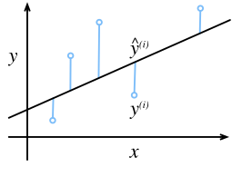

# Linear Regression
:label:`sec_linear_regression`

*Regression* refers to a set of methods for modeling
the relationship between one or more independent variables
and a dependent variable.
In the natural sciences and social sciences,
the purpose of regression is most often to
*characterize* the relationship between the inputs and outputs.
Machine learning, on the other hand,
is most often concerned with *prediction*.

Regression problems pop up whenever we want to predict a numerical value.
Common examples include predicting prices (of homes, stocks, etc.),
predicting length of stay (for patients in the hospital),
demand forecasting (for retail sales), among countless others.
Not every prediction problem is a classic regression problem.
In subsequent sections, we will introduce classification problems,
where the goal is to predict membership among a set of categories.


## Basic Elements of Linear Regression

*Linear regression* may be both the simplest
and most popular among the standard tools to regression.
Dating back to the dawn of the 19th century,
linear regression flows from a few simple assumptions.
First, we assume that the relationship between
the independent variables $\mathbf{x}$ and the dependent variable $y$ is linear,
i.e., that $y$ can be expressed as a weighted sum
of the elements in $\mathbf{x}$,
given some noise on the observations.
Second, we assume that any noise is well-behaved
(following a Gaussian distribution).

To motivate the approach, let us start with a running example.
Suppose that we wish to estimate the prices of houses (in dollars)
based on their area (in square feet) and age (in years).
To actually fit a model for predicting house prices,
we would need to get our hands on a dataset
consisting of sales for which we know
the sale price, area, and age for each home.
In the terminology of machine learning,
the dataset is called a *training dataset* or *training set*,
and each row (here the data corresponding to one sale)
is called an *example* (or *data instance*, *data point*, *sample*).
The thing we are trying to predict (price)
is called a *label* (or *target*).
The independent variables (age and area)
upon which the predictions are based
are called *features* (or *covariates*).

Typically, we will use $n$ to denote
the number of examples in our dataset.
We index the data instances by $i$, denoting each input
as $\mathbf{x}^{(i)} = [x_1^{(i)}, x_2^{(i)}]^\top$
and the corresponding label as $y^{(i)}$.


### Linear Model

The linearity assumption just says that the target (price)
can be expressed as a weighted sum of the features (area and age):

$$\mathrm{price} = w_{\mathrm{area}} \cdot \mathrm{area} + w_{\mathrm{age}} \cdot \mathrm{age} + b.$$
:eqlabel:`eq:price-area`

In :eqref:`eq:price-area`, $w_{\mathrm{area}}$ and $w_{\mathrm{age}}$
are called *weights*, and $b$ is called a *bias*
(also called an *offset* or *intercept*).
The weights determine the influence of each feature
on our prediction and the bias just says
what value the predicted price should take
when all of the features take value 0.
Even if we will never see any homes with zero area,
or that are precisely zero years old,
we still need the intercept or else we will
limit the expressivity of our linear model.

Given a dataset, our goal is to choose
the weights $\mathbf{w}$ and the bias $b$ such that on average,
the predictions made according to our model
best fit the true prices observed in the data.

In disciplines where it is common to focus
on datasets with just a few features,
explicitly expressing models long-form like this is common.
In machine learning, we usually work with high-dimensional datasets,
so it is more convenient to employ linear algebra notation.
When our inputs consist of $d$ features,
we express our prediction $\hat{y}$ (in general the "hat" symbol denotes estimates) as

$$\hat{y} = w_1  x_1 + ... + w_d  x_d + b.$$

Collecting all features into a vector $\mathbf{x} \in \mathbb{R}^d$
and all weights into a vector $\mathbf{w} \in \mathbb{R}^d$,
we can express our model compactly using a dot product:

$$\hat{y} = \mathbf{w}^\top \mathbf{x} + b.$$
:eqlabel:`eq:linreg-y`

In :eqref:`eq:linreg-y`, the vector $\mathbf{x}$ corresponds to features of a single data instance.
We will often find it convenient
to refer to features of our entire dataset of $n$ examples
via the *design matrix* $\mathbf{X} \in \mathbb{R}^{n \times d}$.
Here, $\mathbf{X}$ contains one row for every example
and one column for every feature.

For a collection of features $\mathbf{X}$,
the predictions $\hat{\mathbf{y}} \in \mathbb{R}^n$
can be expressed via the matrix-vector product:

$${\hat{\mathbf{y}}} = \mathbf{X} \mathbf{w} + b,$$

where broadcasting (see :numref:`subsec_broadcasting`) is applied during the summation.
Given features of a training dataset $\mathbf{X}$
and corresponding (known) labels $\mathbf{y}$,
the goal of linear regression is to find
the weight vector $\mathbf{w}$ and the bias term $b$
that given features of a new data instance
sampled from the same distribution as $\mathbf{X}$,
the new data instance's label will (in expectation) be predicted with the lowest error.


Even if we believe that the best model for
predicting $y$ given $\mathbf{x}$ is linear,
we would not expect to find a real-world dataset of $n$ examples where
$y^{(i)}$ exactly equals $\mathbf{w}^\top \mathbf{x}^{(i)}+b$
for all $1 \leq i \leq n$.
For example, whatever instruments we use to observe
the features $\mathbf{X}$ and labels $\mathbf{y}$
might suffer small amount of measurement error.
Thus, even when we are confident
that the underlying relationship is linear,
we will incorporate a noise term to account for such errors.

Before we can go about searching for the best *parameters* (or *model parameters*) $\mathbf{w}$ and $b$,
we will need two more things:
(i) a quality measure for some given model;
and (ii) a procedure for updating the model to improve its quality.


### Loss Function

Before we start thinking about how *to fit* our model,
we need to determine a measure of *fitness*.
The *loss function* quantifies the distance
between the *real* and *predicted* value of the target.
The loss will usually be a non-negative number
where smaller values are better
and perfect predictions incur a loss of 0.
The most popular loss function in regression problems
is the squared error.
When our prediction for an example $i$ is $\hat{y}^{(i)}$
and the corresponding true label is $y^{(i)}$,
the squared error is given by:

$$l^{(i)}(\mathbf{w}, b) = \frac{1}{2} \left(\hat{y}^{(i)} - y^{(i)}\right)^2.$$

The constant $\frac{1}{2}$ makes no real difference
but will prove notationally convenient,
canceling out when we take the derivative of the loss.
Since the training dataset is given to us, and thus out of our control,
the empirical error is only a function of the model parameters.
To make things more concrete, consider the example below
where we plot a regression problem for a one-dimensional case
as shown in :numref:`fig_fit_linreg`.


:label:`fig_fit_linreg`

Note that large differences between
estimates $\hat{y}^{(i)}$ and observations $y^{(i)}$
lead to even larger contributions to the loss,
due to the quadratic dependence.
To measure the quality of a model on the entire dataset,
we simply average (or equivalently, sum)
the losses on the training set.

$$L(\mathbf{w}, b) =\frac{1}{n}\sum_{i=1}^n l^{(i)}(\mathbf{w}, b) =\frac{1}{n} \sum_{i=1}^n \frac{1}{2}\left(\mathbf{w}^\top \mathbf{x}^{(i)} + b - y^{(i)}\right)^2.$$

When training the model, we want to find parameters ($\mathbf{w}^*, b^*$)
that minimize the total loss across all training examples:

$$\mathbf{w}^*, b^* = \operatorname*{argmin}_{\mathbf{w}, b}\  L(\mathbf{w}, b).$$


### Analytic Solution

Linear regression happens to be an unusually simple optimization problem.
Unlike most other models that we will encounter in this book,
linear regression can be solved analytically by applying a simple formula.
To start, we can subsume the bias $b$ into the parameter $\mathbf{w}$
by appending a column to the design matrix consisting of all ones.
Then our prediction problem is to minimize $\|\mathbf{y} - \mathbf{X}\mathbf{w}\|^2$.
There is just one critical point on the loss surface
and it corresponds to the minimum of the loss over the entire domain.
Taking the derivative of the loss with respect to $\mathbf{w}$
and setting it equal to zero yields the analytic solution:

$$\mathbf{w}^* = (\mathbf X^\top \mathbf X)^{-1}\mathbf X^\top \mathbf{y}.$$

While simple problems like linear regression
may admit analytic solutions,
you should not get used to such good fortune.
Although analytic solutions allow for nice mathematical analysis,
the requirement of an analytic solution is so restrictive
that it would exclude all of deep learning.


### Gradient Descent

Even in cases where we cannot solve the models analytically,
it turns out that we can still train models effectively in practice.
Moreover, for many tasks, those difficult-to-optimize models
turn out to be so much better that figuring out how to train them
ends up being well worth the trouble.

The key technique for optimizing nearly any deep learning model,
and which we will call upon throughout this book,
consists of iteratively reducing the error
by updating the parameters in the direction
that incrementally lowers the loss function.
This algorithm is called *gradient descent*.

The most naive application of gradient descent
consists of taking the derivative of the loss function,
which is an average of the losses computed
on every single example in the dataset.
In practice, this can be extremely slow:
we must pass over the entire dataset before making a single update.
Thus, we will often settle for sampling a random minibatch of examples
every time we need to compute the update,
a variant called *minibatch stochastic gradient descent*.

In each iteration, we first randomly sample a minibatch $\mathcal{B}$
consisting of a fixed number of training examples.
We then compute the derivative (gradient) of the average loss
on the minibatch with regard to the model parameters.
Finally, we multiply the gradient by a predetermined positive value $\eta$
and subtract the resulting term from the current parameter values.

We can express the update mathematically as follows
($\partial$ denotes the partial derivative):

$$(\mathbf{w},b) \leftarrow (\mathbf{w},b) - \frac{\eta}{|\mathcal{B}|} \sum_{i \in \mathcal{B}} \partial_{(\mathbf{w},b)} l^{(i)}(\mathbf{w},b).$$


To summarize, steps of the algorithm are the following:
(i) we initialize the values of the model parameters, typically at random;
(ii) we iteratively sample random minibatches from the data,
updating the parameters in the direction of the negative gradient.
For quadratic losses and linear functions,
we can write this out explicitly as follows:

$$
\begin{aligned}
\mathbf{w} &\leftarrow \mathbf{w} -   \frac{\eta}{|\mathcal{B}|} \sum_{i \in \mathcal{B}} \partial_{\mathbf{w}} l^{(i)}(\mathbf{w}, b) =
\mathbf{w} - \frac{\eta}{|\mathcal{B}|} \sum_{i \in \mathcal{B}} \mathbf{x}^{(i)} \left(\mathbf{w}^\top \mathbf{x}^{(i)} + b - y^{(i)}\right),\\
b &\leftarrow b -  \frac{\eta}{|\mathcal{B}|} \sum_{i \in \mathcal{B}} \partial_b l^{(i)}(\mathbf{w}, b)  =
b - \frac{\eta}{|\mathcal{B}|} \sum_{i \in \mathcal{B}} \left(\mathbf{w}^\top \mathbf{x}^{(i)} + b - y^{(i)}\right).
\end{aligned}
$$
:eqlabel:`eq:linreg-update`

Note that $\mathbf{w}$ and $\mathbf{x}$ are vectors.
Here, the more elegant vector notation makes the math
much more readable than expressing things in terms of coefficients,
say $w_1, w_2, \ldots, w_d$.
In :eqref:`eq:linreg-update`, $|\mathcal{B}|$ represents
the number of examples in each minibatch (the *batch size*)
and $\eta$ denotes the *learning rate*.
We emphasize that the values of the batch size and learning rate
are manually pre-specified and not typically learned through model training.
These parameters that are tunable but not updated
in the training loop are called *hyperparameters*.
*Hyperparameter tuning* is the process by which hyperparameters are chosen,
and typically requires that we adjust them
based on the results of the training loop
as assessed on a separate *validation dataset* (or *validation set*).

After training for some predetermined number of iterations
(or until some other stopping criteria are met),
we record the estimated model parameters,
denoted $\hat{\mathbf{w}}, \hat{b}$.
Note that even if our function is truly linear and noiseless,
these parameters will not be the exact minimizers of the loss
because, although the algorithm converges slowly towards the minimizers
it cannot achieve it exactly in a finite number of steps.

Linear regression happens to be a learning problem where there is only one minimum
over the entire domain.
However, for more complicated models, like deep networks,
the loss surfaces contain many minima.
Fortunately, for reasons that are not yet fully understood,
deep learning practitioners seldom struggle to find parameters
that minimize the loss *on training sets*.
The more formidable task is to find parameters
that will achieve low loss on data
that we have not seen before,
a challenge called *generalization*.
We return to these topics throughout the book.


### Making Predictions with the Learned Model


Given the learned linear regression model
$\hat{\mathbf{w}}^\top \mathbf{x} + \hat{b}$,
we can now estimate the price of a new house
(not contained in the training data)
given its area $x_1$ and age $x_2$.
Estimating targets given features is
commonly called *prediction* or *inference*.

We will try to stick with *prediction* because
calling this step *inference*,
despite emerging as standard jargon in deep learning,
is somewhat of a misnomer.
In statistics, *inference* more often denotes
estimating parameters based on a dataset.
This misuse of terminology is a common source of confusion
when deep learning practitioners talk to statisticians.


## Vectorization for Speed

When training our models, we typically want to process
whole minibatches of examples simultaneously.
Doing this efficiently requires that we vectorize the calculations
and leverage fast linear algebra libraries
rather than writing costly for-loops in Python.

To illustrate why this matters so much,
we can consider two methods for adding vectors.
To start we instantiate two 10000-dimensional vectors
containing all ones.
In one method we will loop over the vectors with a Python for-loop.
In the other method we will rely on a single call to `+`.

```python
%matplotlib inline
from d2l import mxnet as d2l
import math
from mxnet import np
import time
```


```{.python .input  n=1}
#@tab pytorch
%matplotlib inline
from d2l import torch as d2l
import math
import torch
import numpy as np
import time
```

```python
#@tab tensorflow
%matplotlib inline
from d2l import tensorflow as d2l
import math
import tensorflow as tf
import numpy as np
import time
```


```{.python .input  n=2}
#@tab all
n = 10000
a = d2l.ones(n)
b = d2l.ones(n)
```

Since we will benchmark the running time frequently in this book,
let us define a timer.

```{.python .input  n=3}
#@tab all
class Timer:  #@save
    """Record multiple running times."""
    def __init__(self):
        self.times = []
        self.start()

    def start(self):
        """Start the timer."""
        self.tik = time.time()

    def stop(self):
        """Stop the timer and record the time in a list."""
        self.times.append(time.time() - self.tik)
        return self.times[-1]

    def avg(self):
        """Return the average time."""
        return sum(self.times) / len(self.times)

    def sum(self):
        """Return the sum of time."""
        return sum(self.times)

    def cumsum(self):
        """Return the accumulated time."""
        return np.array(self.times).cumsum().tolist()
```

Now we can benchmark the workloads.
First, we add them, one coordinate at a time,
using a for-loop.

```{.python .input  n=4}
#@tab mxnet, pytorch
c = d2l.zeros(n)
timer = Timer()
for i in range(n):
    c[i] = a[i] + b[i]
f'{timer.stop():.5f} sec'
```

```{.json .output n=4}
[
 {
  "data": {
   "text/plain": "'0.19877 sec'"
  },
  "execution_count": 4,
  "metadata": {},
  "output_type": "execute_result"
 }
]
```

```python
#@tab tensorflow
c = tf.Variable(d2l.zeros(n))
timer = Timer()
for i in range(n):
    c[i].assign(a[i] + b[i])
f'{timer.stop():.5f} sec'
```


Alternatively, we rely on the reloaded `+` operator to compute the elementwise sum.

```{.python .input  n=5}
#@tab all
timer.start()
d = a + b
f'{timer.stop():.5f} sec'
```

```{.json .output n=5}
[
 {
  "data": {
   "text/plain": "'0.00091 sec'"
  },
  "execution_count": 5,
  "metadata": {},
  "output_type": "execute_result"
 }
]
```

You probably noticed that the second method
is dramatically faster than the first.
Vectorizing code often yields order-of-magnitude speedups.
Moreover, we push more of the mathematics to the library
and need not write as many calculations ourselves,
reducing the potential for errors.

## The Normal Distribution and Squared Loss

While you can already get your hands dirty using only the information above,
in the following we can more formally motivate the square loss objective
via assumptions about the distribution of noise.

Linear regression was invented by Gauss in 1795,
who also discovered the normal distribution (also called the *Gaussian*).
It turns out that the connection between
the normal distribution and linear regression
runs deeper than common parentage.
To refresh your memory, the probability density
of a normal distribution with mean $\mu$ and variance $\sigma^2$ (standard deviation $\sigma$)
is given as

$$p(x) = \frac{1}{\sqrt{2 \pi \sigma^2}} \exp\left(-\frac{1}{2 \sigma^2} (x - \mu)^2\right).$$

Below we define a Python function to compute the normal distribution.

```{.python .input  n=6}
#@tab all
def normal(x, mu, sigma):
    p = 1 / math.sqrt(2 * math.pi * sigma**2)
    return p * np.exp(-0.5 / sigma**2 * (x - mu)**2)
```

We can now visualize the normal distributions.

```{.python .input  n=7}
#@tab all
# Use numpy again for visualization
x = np.arange(-7, 7, 0.01)

# Mean and standard deviation pairs
params = [(0, 1), (0, 2), (3, 1)]
d2l.plot(x, [normal(x, mu, sigma) for mu, sigma in params], xlabel='x',
         ylabel='p(x)', figsize=(4.5, 2.5),
         legend=['mean %d, std %d' % (mu, sigma) for mu, sigma in params])
```

```{.json .output n=7}
[
 {
  "data": {
   "image/svg+xml": "<?xml version=\"1.0\" encoding=\"utf-8\" standalone=\"no\"?>\n<!DOCTYPE svg PUBLIC \"-//W3C//DTD SVG 1.1//EN\"\n  \"http://www.w3.org/Graphics/SVG/1.1/DTD/svg11.dtd\">\n<!-- Created with matplotlib (https://matplotlib.org/) -->\n<svg height=\"180.65625pt\" version=\"1.1\" viewBox=\"0 0 302.08125 180.65625\" width=\"302.08125pt\" xmlns=\"http://www.w3.org/2000/svg\" xmlns:xlink=\"http://www.w3.org/1999/xlink\">\n <defs>\n  <style type=\"text/css\">\n*{stroke-linecap:butt;stroke-linejoin:round;}\n  </style>\n </defs>\n <g id=\"figure_1\">\n  <g id=\"patch_1\">\n   <path d=\"M 0 180.65625 \nL 302.08125 180.65625 \nL 302.08125 0 \nL 0 0 \nz\n\" style=\"fill:none;\"/>\n  </g>\n  <g id=\"axes_1\">\n   <g id=\"patch_2\">\n    <path d=\"M 43.78125 143.1 \nL 294.88125 143.1 \nL 294.88125 7.2 \nL 43.78125 7.2 \nz\n\" style=\"fill:#ffffff;\"/>\n   </g>\n   <g id=\"matplotlib.axis_1\">\n    <g id=\"xtick_1\">\n     <g id=\"line2d_1\">\n      <path clip-path=\"url(#pd8ed096083)\" d=\"M 71.511736 143.1 \nL 71.511736 7.2 \n\" style=\"fill:none;stroke:#b0b0b0;stroke-linecap:square;stroke-width:0.8;\"/>\n     </g>\n     <g id=\"line2d_2\">\n      <defs>\n       <path d=\"M 0 0 \nL 0 3.5 \n\" id=\"mefeb717abf\" style=\"stroke:#000000;stroke-width:0.8;\"/>\n      </defs>\n      <g>\n       <use style=\"stroke:#000000;stroke-width:0.8;\" x=\"71.511736\" xlink:href=\"#mefeb717abf\" y=\"143.1\"/>\n      </g>\n     </g>\n     <g id=\"text_1\">\n      <!-- \u22126 -->\n      <defs>\n       <path d=\"M 10.59375 35.5 \nL 73.1875 35.5 \nL 73.1875 27.203125 \nL 10.59375 27.203125 \nz\n\" id=\"DejaVuSans-8722\"/>\n       <path d=\"M 33.015625 40.375 \nQ 26.375 40.375 22.484375 35.828125 \nQ 18.609375 31.296875 18.609375 23.390625 \nQ 18.609375 15.53125 22.484375 10.953125 \nQ 26.375 6.390625 33.015625 6.390625 \nQ 39.65625 6.390625 43.53125 10.953125 \nQ 47.40625 15.53125 47.40625 23.390625 \nQ 47.40625 31.296875 43.53125 35.828125 \nQ 39.65625 40.375 33.015625 40.375 \nz\nM 52.59375 71.296875 \nL 52.59375 62.3125 \nQ 48.875 64.0625 45.09375 64.984375 \nQ 41.3125 65.921875 37.59375 65.921875 \nQ 27.828125 65.921875 22.671875 59.328125 \nQ 17.53125 52.734375 16.796875 39.40625 \nQ 19.671875 43.65625 24.015625 45.921875 \nQ 28.375 48.1875 33.59375 48.1875 \nQ 44.578125 48.1875 50.953125 41.515625 \nQ 57.328125 34.859375 57.328125 23.390625 \nQ 57.328125 12.15625 50.6875 5.359375 \nQ 44.046875 -1.421875 33.015625 -1.421875 \nQ 20.359375 -1.421875 13.671875 8.265625 \nQ 6.984375 17.96875 6.984375 36.375 \nQ 6.984375 53.65625 15.1875 63.9375 \nQ 23.390625 74.21875 37.203125 74.21875 \nQ 40.921875 74.21875 44.703125 73.484375 \nQ 48.484375 72.75 52.59375 71.296875 \nz\n\" id=\"DejaVuSans-54\"/>\n      </defs>\n      <g transform=\"translate(64.140642 157.698438)scale(0.1 -0.1)\">\n       <use xlink:href=\"#DejaVuSans-8722\"/>\n       <use x=\"83.789062\" xlink:href=\"#DejaVuSans-54\"/>\n      </g>\n     </g>\n    </g>\n    <g id=\"xtick_2\">\n     <g id=\"line2d_3\">\n      <path clip-path=\"url(#pd8ed096083)\" d=\"M 104.145435 143.1 \nL 104.145435 7.2 \n\" style=\"fill:none;stroke:#b0b0b0;stroke-linecap:square;stroke-width:0.8;\"/>\n     </g>\n     <g id=\"line2d_4\">\n      <g>\n       <use style=\"stroke:#000000;stroke-width:0.8;\" x=\"104.145435\" xlink:href=\"#mefeb717abf\" y=\"143.1\"/>\n      </g>\n     </g>\n     <g id=\"text_2\">\n      <!-- \u22124 -->\n      <defs>\n       <path d=\"M 37.796875 64.3125 \nL 12.890625 25.390625 \nL 37.796875 25.390625 \nz\nM 35.203125 72.90625 \nL 47.609375 72.90625 \nL 47.609375 25.390625 \nL 58.015625 25.390625 \nL 58.015625 17.1875 \nL 47.609375 17.1875 \nL 47.609375 0 \nL 37.796875 0 \nL 37.796875 17.1875 \nL 4.890625 17.1875 \nL 4.890625 26.703125 \nz\n\" id=\"DejaVuSans-52\"/>\n      </defs>\n      <g transform=\"translate(96.774342 157.698438)scale(0.1 -0.1)\">\n       <use xlink:href=\"#DejaVuSans-8722\"/>\n       <use x=\"83.789062\" xlink:href=\"#DejaVuSans-52\"/>\n      </g>\n     </g>\n    </g>\n    <g id=\"xtick_3\">\n     <g id=\"line2d_5\">\n      <path clip-path=\"url(#pd8ed096083)\" d=\"M 136.779135 143.1 \nL 136.779135 7.2 \n\" style=\"fill:none;stroke:#b0b0b0;stroke-linecap:square;stroke-width:0.8;\"/>\n     </g>\n     <g id=\"line2d_6\">\n      <g>\n       <use style=\"stroke:#000000;stroke-width:0.8;\" x=\"136.779135\" xlink:href=\"#mefeb717abf\" y=\"143.1\"/>\n      </g>\n     </g>\n     <g id=\"text_3\">\n      <!-- \u22122 -->\n      <defs>\n       <path d=\"M 19.1875 8.296875 \nL 53.609375 8.296875 \nL 53.609375 0 \nL 7.328125 0 \nL 7.328125 8.296875 \nQ 12.9375 14.109375 22.625 23.890625 \nQ 32.328125 33.6875 34.8125 36.53125 \nQ 39.546875 41.84375 41.421875 45.53125 \nQ 43.3125 49.21875 43.3125 52.78125 \nQ 43.3125 58.59375 39.234375 62.25 \nQ 35.15625 65.921875 28.609375 65.921875 \nQ 23.96875 65.921875 18.8125 64.3125 \nQ 13.671875 62.703125 7.8125 59.421875 \nL 7.8125 69.390625 \nQ 13.765625 71.78125 18.9375 73 \nQ 24.125 74.21875 28.421875 74.21875 \nQ 39.75 74.21875 46.484375 68.546875 \nQ 53.21875 62.890625 53.21875 53.421875 \nQ 53.21875 48.921875 51.53125 44.890625 \nQ 49.859375 40.875 45.40625 35.40625 \nQ 44.1875 33.984375 37.640625 27.21875 \nQ 31.109375 20.453125 19.1875 8.296875 \nz\n\" id=\"DejaVuSans-50\"/>\n      </defs>\n      <g transform=\"translate(129.408041 157.698438)scale(0.1 -0.1)\">\n       <use xlink:href=\"#DejaVuSans-8722\"/>\n       <use x=\"83.789062\" xlink:href=\"#DejaVuSans-50\"/>\n      </g>\n     </g>\n    </g>\n    <g id=\"xtick_4\">\n     <g id=\"line2d_7\">\n      <path clip-path=\"url(#pd8ed096083)\" d=\"M 169.412834 143.1 \nL 169.412834 7.2 \n\" style=\"fill:none;stroke:#b0b0b0;stroke-linecap:square;stroke-width:0.8;\"/>\n     </g>\n     <g id=\"line2d_8\">\n      <g>\n       <use style=\"stroke:#000000;stroke-width:0.8;\" x=\"169.412834\" xlink:href=\"#mefeb717abf\" y=\"143.1\"/>\n      </g>\n     </g>\n     <g id=\"text_4\">\n      <!-- 0 -->\n      <defs>\n       <path d=\"M 31.78125 66.40625 \nQ 24.171875 66.40625 20.328125 58.90625 \nQ 16.5 51.421875 16.5 36.375 \nQ 16.5 21.390625 20.328125 13.890625 \nQ 24.171875 6.390625 31.78125 6.390625 \nQ 39.453125 6.390625 43.28125 13.890625 \nQ 47.125 21.390625 47.125 36.375 \nQ 47.125 51.421875 43.28125 58.90625 \nQ 39.453125 66.40625 31.78125 66.40625 \nz\nM 31.78125 74.21875 \nQ 44.046875 74.21875 50.515625 64.515625 \nQ 56.984375 54.828125 56.984375 36.375 \nQ 56.984375 17.96875 50.515625 8.265625 \nQ 44.046875 -1.421875 31.78125 -1.421875 \nQ 19.53125 -1.421875 13.0625 8.265625 \nQ 6.59375 17.96875 6.59375 36.375 \nQ 6.59375 54.828125 13.0625 64.515625 \nQ 19.53125 74.21875 31.78125 74.21875 \nz\n\" id=\"DejaVuSans-48\"/>\n      </defs>\n      <g transform=\"translate(166.231584 157.698438)scale(0.1 -0.1)\">\n       <use xlink:href=\"#DejaVuSans-48\"/>\n      </g>\n     </g>\n    </g>\n    <g id=\"xtick_5\">\n     <g id=\"line2d_9\">\n      <path clip-path=\"url(#pd8ed096083)\" d=\"M 202.046534 143.1 \nL 202.046534 7.2 \n\" style=\"fill:none;stroke:#b0b0b0;stroke-linecap:square;stroke-width:0.8;\"/>\n     </g>\n     <g id=\"line2d_10\">\n      <g>\n       <use style=\"stroke:#000000;stroke-width:0.8;\" x=\"202.046534\" xlink:href=\"#mefeb717abf\" y=\"143.1\"/>\n      </g>\n     </g>\n     <g id=\"text_5\">\n      <!-- 2 -->\n      <g transform=\"translate(198.865284 157.698438)scale(0.1 -0.1)\">\n       <use xlink:href=\"#DejaVuSans-50\"/>\n      </g>\n     </g>\n    </g>\n    <g id=\"xtick_6\">\n     <g id=\"line2d_11\">\n      <path clip-path=\"url(#pd8ed096083)\" d=\"M 234.680233 143.1 \nL 234.680233 7.2 \n\" style=\"fill:none;stroke:#b0b0b0;stroke-linecap:square;stroke-width:0.8;\"/>\n     </g>\n     <g id=\"line2d_12\">\n      <g>\n       <use style=\"stroke:#000000;stroke-width:0.8;\" x=\"234.680233\" xlink:href=\"#mefeb717abf\" y=\"143.1\"/>\n      </g>\n     </g>\n     <g id=\"text_6\">\n      <!-- 4 -->\n      <g transform=\"translate(231.498983 157.698438)scale(0.1 -0.1)\">\n       <use xlink:href=\"#DejaVuSans-52\"/>\n      </g>\n     </g>\n    </g>\n    <g id=\"xtick_7\">\n     <g id=\"line2d_13\">\n      <path clip-path=\"url(#pd8ed096083)\" d=\"M 267.313932 143.1 \nL 267.313932 7.2 \n\" style=\"fill:none;stroke:#b0b0b0;stroke-linecap:square;stroke-width:0.8;\"/>\n     </g>\n     <g id=\"line2d_14\">\n      <g>\n       <use style=\"stroke:#000000;stroke-width:0.8;\" x=\"267.313932\" xlink:href=\"#mefeb717abf\" y=\"143.1\"/>\n      </g>\n     </g>\n     <g id=\"text_7\">\n      <!-- 6 -->\n      <g transform=\"translate(264.132682 157.698438)scale(0.1 -0.1)\">\n       <use xlink:href=\"#DejaVuSans-54\"/>\n      </g>\n     </g>\n    </g>\n    <g id=\"text_8\">\n     <!-- x -->\n     <defs>\n      <path d=\"M 54.890625 54.6875 \nL 35.109375 28.078125 \nL 55.90625 0 \nL 45.3125 0 \nL 29.390625 21.484375 \nL 13.484375 0 \nL 2.875 0 \nL 24.125 28.609375 \nL 4.6875 54.6875 \nL 15.28125 54.6875 \nL 29.78125 35.203125 \nL 44.28125 54.6875 \nz\n\" id=\"DejaVuSans-120\"/>\n     </defs>\n     <g transform=\"translate(166.371875 171.376563)scale(0.1 -0.1)\">\n      <use xlink:href=\"#DejaVuSans-120\"/>\n     </g>\n    </g>\n   </g>\n   <g id=\"matplotlib.axis_2\">\n    <g id=\"ytick_1\">\n     <g id=\"line2d_15\">\n      <path clip-path=\"url(#pd8ed096083)\" d=\"M 43.78125 136.922727 \nL 294.88125 136.922727 \n\" style=\"fill:none;stroke:#b0b0b0;stroke-linecap:square;stroke-width:0.8;\"/>\n     </g>\n     <g id=\"line2d_16\">\n      <defs>\n       <path d=\"M 0 0 \nL -3.5 0 \n\" id=\"m850eae6dcc\" style=\"stroke:#000000;stroke-width:0.8;\"/>\n      </defs>\n      <g>\n       <use style=\"stroke:#000000;stroke-width:0.8;\" x=\"43.78125\" xlink:href=\"#m850eae6dcc\" y=\"136.922727\"/>\n      </g>\n     </g>\n     <g id=\"text_9\">\n      <!-- 0.0 -->\n      <defs>\n       <path d=\"M 10.6875 12.40625 \nL 21 12.40625 \nL 21 0 \nL 10.6875 0 \nz\n\" id=\"DejaVuSans-46\"/>\n      </defs>\n      <g transform=\"translate(20.878125 140.721946)scale(0.1 -0.1)\">\n       <use xlink:href=\"#DejaVuSans-48\"/>\n       <use x=\"63.623047\" xlink:href=\"#DejaVuSans-46\"/>\n       <use x=\"95.410156\" xlink:href=\"#DejaVuSans-48\"/>\n      </g>\n     </g>\n    </g>\n    <g id=\"ytick_2\">\n     <g id=\"line2d_17\">\n      <path clip-path=\"url(#pd8ed096083)\" d=\"M 43.78125 105.954474 \nL 294.88125 105.954474 \n\" style=\"fill:none;stroke:#b0b0b0;stroke-linecap:square;stroke-width:0.8;\"/>\n     </g>\n     <g id=\"line2d_18\">\n      <g>\n       <use style=\"stroke:#000000;stroke-width:0.8;\" x=\"43.78125\" xlink:href=\"#m850eae6dcc\" y=\"105.954474\"/>\n      </g>\n     </g>\n     <g id=\"text_10\">\n      <!-- 0.1 -->\n      <defs>\n       <path d=\"M 12.40625 8.296875 \nL 28.515625 8.296875 \nL 28.515625 63.921875 \nL 10.984375 60.40625 \nL 10.984375 69.390625 \nL 28.421875 72.90625 \nL 38.28125 72.90625 \nL 38.28125 8.296875 \nL 54.390625 8.296875 \nL 54.390625 0 \nL 12.40625 0 \nz\n\" id=\"DejaVuSans-49\"/>\n      </defs>\n      <g transform=\"translate(20.878125 109.753693)scale(0.1 -0.1)\">\n       <use xlink:href=\"#DejaVuSans-48\"/>\n       <use x=\"63.623047\" xlink:href=\"#DejaVuSans-46\"/>\n       <use x=\"95.410156\" xlink:href=\"#DejaVuSans-49\"/>\n      </g>\n     </g>\n    </g>\n    <g id=\"ytick_3\">\n     <g id=\"line2d_19\">\n      <path clip-path=\"url(#pd8ed096083)\" d=\"M 43.78125 74.986221 \nL 294.88125 74.986221 \n\" style=\"fill:none;stroke:#b0b0b0;stroke-linecap:square;stroke-width:0.8;\"/>\n     </g>\n     <g id=\"line2d_20\">\n      <g>\n       <use style=\"stroke:#000000;stroke-width:0.8;\" x=\"43.78125\" xlink:href=\"#m850eae6dcc\" y=\"74.986221\"/>\n      </g>\n     </g>\n     <g id=\"text_11\">\n      <!-- 0.2 -->\n      <g transform=\"translate(20.878125 78.78544)scale(0.1 -0.1)\">\n       <use xlink:href=\"#DejaVuSans-48\"/>\n       <use x=\"63.623047\" xlink:href=\"#DejaVuSans-46\"/>\n       <use x=\"95.410156\" xlink:href=\"#DejaVuSans-50\"/>\n      </g>\n     </g>\n    </g>\n    <g id=\"ytick_4\">\n     <g id=\"line2d_21\">\n      <path clip-path=\"url(#pd8ed096083)\" d=\"M 43.78125 44.017968 \nL 294.88125 44.017968 \n\" style=\"fill:none;stroke:#b0b0b0;stroke-linecap:square;stroke-width:0.8;\"/>\n     </g>\n     <g id=\"line2d_22\">\n      <g>\n       <use style=\"stroke:#000000;stroke-width:0.8;\" x=\"43.78125\" xlink:href=\"#m850eae6dcc\" y=\"44.017968\"/>\n      </g>\n     </g>\n     <g id=\"text_12\">\n      <!-- 0.3 -->\n      <defs>\n       <path d=\"M 40.578125 39.3125 \nQ 47.65625 37.796875 51.625 33 \nQ 55.609375 28.21875 55.609375 21.1875 \nQ 55.609375 10.40625 48.1875 4.484375 \nQ 40.765625 -1.421875 27.09375 -1.421875 \nQ 22.515625 -1.421875 17.65625 -0.515625 \nQ 12.796875 0.390625 7.625 2.203125 \nL 7.625 11.71875 \nQ 11.71875 9.328125 16.59375 8.109375 \nQ 21.484375 6.890625 26.8125 6.890625 \nQ 36.078125 6.890625 40.9375 10.546875 \nQ 45.796875 14.203125 45.796875 21.1875 \nQ 45.796875 27.640625 41.28125 31.265625 \nQ 36.765625 34.90625 28.71875 34.90625 \nL 20.21875 34.90625 \nL 20.21875 43.015625 \nL 29.109375 43.015625 \nQ 36.375 43.015625 40.234375 45.921875 \nQ 44.09375 48.828125 44.09375 54.296875 \nQ 44.09375 59.90625 40.109375 62.90625 \nQ 36.140625 65.921875 28.71875 65.921875 \nQ 24.65625 65.921875 20.015625 65.03125 \nQ 15.375 64.15625 9.8125 62.3125 \nL 9.8125 71.09375 \nQ 15.4375 72.65625 20.34375 73.4375 \nQ 25.25 74.21875 29.59375 74.21875 \nQ 40.828125 74.21875 47.359375 69.109375 \nQ 53.90625 64.015625 53.90625 55.328125 \nQ 53.90625 49.265625 50.4375 45.09375 \nQ 46.96875 40.921875 40.578125 39.3125 \nz\n\" id=\"DejaVuSans-51\"/>\n      </defs>\n      <g transform=\"translate(20.878125 47.817187)scale(0.1 -0.1)\">\n       <use xlink:href=\"#DejaVuSans-48\"/>\n       <use x=\"63.623047\" xlink:href=\"#DejaVuSans-46\"/>\n       <use x=\"95.410156\" xlink:href=\"#DejaVuSans-51\"/>\n      </g>\n     </g>\n    </g>\n    <g id=\"ytick_5\">\n     <g id=\"line2d_23\">\n      <path clip-path=\"url(#pd8ed096083)\" d=\"M 43.78125 13.049715 \nL 294.88125 13.049715 \n\" style=\"fill:none;stroke:#b0b0b0;stroke-linecap:square;stroke-width:0.8;\"/>\n     </g>\n     <g id=\"line2d_24\">\n      <g>\n       <use style=\"stroke:#000000;stroke-width:0.8;\" x=\"43.78125\" xlink:href=\"#m850eae6dcc\" y=\"13.049715\"/>\n      </g>\n     </g>\n     <g id=\"text_13\">\n      <!-- 0.4 -->\n      <g transform=\"translate(20.878125 16.848934)scale(0.1 -0.1)\">\n       <use xlink:href=\"#DejaVuSans-48\"/>\n       <use x=\"63.623047\" xlink:href=\"#DejaVuSans-46\"/>\n       <use x=\"95.410156\" xlink:href=\"#DejaVuSans-52\"/>\n      </g>\n     </g>\n    </g>\n    <g id=\"text_14\">\n     <!-- p(x) -->\n     <defs>\n      <path d=\"M 18.109375 8.203125 \nL 18.109375 -20.796875 \nL 9.078125 -20.796875 \nL 9.078125 54.6875 \nL 18.109375 54.6875 \nL 18.109375 46.390625 \nQ 20.953125 51.265625 25.265625 53.625 \nQ 29.59375 56 35.59375 56 \nQ 45.5625 56 51.78125 48.09375 \nQ 58.015625 40.1875 58.015625 27.296875 \nQ 58.015625 14.40625 51.78125 6.484375 \nQ 45.5625 -1.421875 35.59375 -1.421875 \nQ 29.59375 -1.421875 25.265625 0.953125 \nQ 20.953125 3.328125 18.109375 8.203125 \nz\nM 48.6875 27.296875 \nQ 48.6875 37.203125 44.609375 42.84375 \nQ 40.53125 48.484375 33.40625 48.484375 \nQ 26.265625 48.484375 22.1875 42.84375 \nQ 18.109375 37.203125 18.109375 27.296875 \nQ 18.109375 17.390625 22.1875 11.75 \nQ 26.265625 6.109375 33.40625 6.109375 \nQ 40.53125 6.109375 44.609375 11.75 \nQ 48.6875 17.390625 48.6875 27.296875 \nz\n\" id=\"DejaVuSans-112\"/>\n      <path d=\"M 31 75.875 \nQ 24.46875 64.65625 21.28125 53.65625 \nQ 18.109375 42.671875 18.109375 31.390625 \nQ 18.109375 20.125 21.3125 9.0625 \nQ 24.515625 -2 31 -13.1875 \nL 23.1875 -13.1875 \nQ 15.875 -1.703125 12.234375 9.375 \nQ 8.59375 20.453125 8.59375 31.390625 \nQ 8.59375 42.28125 12.203125 53.3125 \nQ 15.828125 64.359375 23.1875 75.875 \nz\n\" id=\"DejaVuSans-40\"/>\n      <path d=\"M 8.015625 75.875 \nL 15.828125 75.875 \nQ 23.140625 64.359375 26.78125 53.3125 \nQ 30.421875 42.28125 30.421875 31.390625 \nQ 30.421875 20.453125 26.78125 9.375 \nQ 23.140625 -1.703125 15.828125 -13.1875 \nL 8.015625 -13.1875 \nQ 14.5 -2 17.703125 9.0625 \nQ 20.90625 20.125 20.90625 31.390625 \nQ 20.90625 42.671875 17.703125 53.65625 \nQ 14.5 64.65625 8.015625 75.875 \nz\n\" id=\"DejaVuSans-41\"/>\n     </defs>\n     <g transform=\"translate(14.798438 85.185156)rotate(-90)scale(0.1 -0.1)\">\n      <use xlink:href=\"#DejaVuSans-112\"/>\n      <use x=\"63.476562\" xlink:href=\"#DejaVuSans-40\"/>\n      <use x=\"102.490234\" xlink:href=\"#DejaVuSans-120\"/>\n      <use x=\"161.669922\" xlink:href=\"#DejaVuSans-41\"/>\n     </g>\n    </g>\n   </g>\n   <g id=\"line2d_25\">\n    <path clip-path=\"url(#pd8ed096083)\" d=\"M 55.194886 136.922727 \nL 108.224648 136.813535 \nL 113.609208 136.566288 \nL 117.198915 136.184417 \nL 119.97278 135.668952 \nL 122.257139 135.025186 \nL 124.215161 134.257847 \nL 126.010014 133.330368 \nL 127.804868 132.138334 \nL 129.436552 130.779445 \nL 131.068237 129.113085 \nL 132.699922 127.093512 \nL 134.331607 124.67477 \nL 135.963292 121.812692 \nL 137.594977 118.467288 \nL 139.226662 114.605495 \nL 141.021516 109.733818 \nL 142.816369 104.197078 \nL 144.774391 97.412516 \nL 146.895582 89.247632 \nL 149.506278 78.224523 \nL 153.259153 61.239305 \nL 157.501534 42.275258 \nL 159.785893 33.113056 \nL 161.580746 26.820515 \nL 163.049263 22.424523 \nL 164.354611 19.173268 \nL 165.49679 16.884633 \nL 166.475801 15.362585 \nL 167.454812 14.263605 \nL 168.270655 13.679589 \nL 169.086497 13.401979 \nL 169.739171 13.401979 \nL 170.391845 13.599455 \nL 171.207688 14.122466 \nL 172.02353 14.948577 \nL 173.002541 16.331186 \nL 173.981552 18.12656 \nL 175.123732 20.717347 \nL 176.42908 24.286979 \nL 177.897596 29.000684 \nL 179.69245 35.615359 \nL 181.81364 44.367165 \nL 184.913841 58.245076 \nL 190.46157 83.161144 \nL 192.909098 93.115047 \nL 195.030288 100.899673 \nL 196.98831 107.299489 \nL 198.783164 112.473243 \nL 200.578017 116.986089 \nL 202.209702 120.534567 \nL 203.841387 123.5855 \nL 205.473072 126.176453 \nL 207.104757 128.35023 \nL 208.736442 130.152334 \nL 210.368127 131.628806 \nL 211.999812 132.824481 \nL 213.794665 133.865803 \nL 215.752687 134.73293 \nL 217.873878 135.421686 \nL 220.321405 135.97206 \nL 223.258438 136.389278 \nL 227.011314 136.67952 \nL 232.395874 136.850878 \nL 243.001826 136.917995 \nL 283.467614 136.922727 \nL 283.467614 136.922727 \n\" style=\"fill:none;stroke:#1f77b4;stroke-linecap:square;stroke-width:1.5;\"/>\n   </g>\n   <g id=\"line2d_26\">\n    <path clip-path=\"url(#pd8ed096083)\" d=\"M 55.194886 136.7876 \nL 65.800839 136.522951 \nL 73.143421 136.126434 \nL 79.017487 135.590287 \nL 83.912542 134.926494 \nL 88.318091 134.105229 \nL 92.234135 133.153577 \nL 95.823842 132.06316 \nL 99.250381 130.798749 \nL 102.51375 129.367709 \nL 105.77712 127.695008 \nL 109.04049 125.764111 \nL 112.30386 123.563438 \nL 115.56723 121.087897 \nL 118.993769 118.196043 \nL 122.583476 114.860886 \nL 126.49952 110.903144 \nL 131.068237 105.948686 \nL 138.247651 97.770807 \nL 144.611223 90.644946 \nL 148.527267 86.589675 \nL 151.790637 83.530672 \nL 154.564501 81.224436 \nL 157.175197 79.344214 \nL 159.459556 77.957408 \nL 161.743915 76.832365 \nL 163.865105 76.036198 \nL 165.823127 75.522597 \nL 167.781149 75.227168 \nL 169.739171 75.153089 \nL 171.697193 75.301158 \nL 173.655215 75.66978 \nL 175.613237 76.254995 \nL 177.734428 77.126088 \nL 179.855618 78.233161 \nL 182.139977 79.673625 \nL 184.587504 81.48006 \nL 187.361369 83.820867 \nL 190.46157 86.751111 \nL 194.051277 90.469337 \nL 198.783164 95.721751 \nL 211.673475 110.215093 \nL 215.752687 114.383393 \nL 219.505563 117.90542 \nL 222.932101 120.82526 \nL 226.195471 123.328273 \nL 229.458841 125.556324 \nL 232.722211 127.513772 \nL 235.985581 129.211619 \nL 239.248951 130.665971 \nL 242.675489 131.95258 \nL 246.265196 133.063568 \nL 250.18124 134.034481 \nL 254.423621 134.846714 \nL 259.155508 135.514669 \nL 264.540068 136.040363 \nL 270.903639 136.432354 \nL 279.225233 136.707949 \nL 283.467614 136.785216 \nL 283.467614 136.785216 \n\" style=\"fill:none;stroke:#bf00bf;stroke-dasharray:5.55,2.4;stroke-dashoffset:0;stroke-width:1.5;\"/>\n   </g>\n   <g id=\"line2d_27\">\n    <path clip-path=\"url(#pd8ed096083)\" d=\"M 55.194886 136.922727 \nL 157.175197 136.813535 \nL 162.559757 136.566288 \nL 166.149464 136.184417 \nL 168.923329 135.668952 \nL 171.207688 135.025186 \nL 173.16571 134.257847 \nL 174.960563 133.330368 \nL 176.755417 132.138334 \nL 178.387102 130.779445 \nL 180.018787 129.113085 \nL 181.650472 127.093512 \nL 183.282156 124.67477 \nL 184.913841 121.812692 \nL 186.545526 118.467288 \nL 188.177211 114.605495 \nL 189.972065 109.733818 \nL 191.766918 104.197078 \nL 193.72494 97.412516 \nL 195.846131 89.247632 \nL 198.456827 78.224523 \nL 202.209702 61.239305 \nL 206.452083 42.275258 \nL 208.736442 33.113056 \nL 210.531295 26.820515 \nL 211.999812 22.424523 \nL 213.30516 19.173268 \nL 214.447339 16.884633 \nL 215.42635 15.362585 \nL 216.405361 14.263605 \nL 217.221204 13.679589 \nL 218.037046 13.401979 \nL 218.68972 13.401979 \nL 219.342394 13.599455 \nL 220.158237 14.122466 \nL 220.974079 14.948577 \nL 221.95309 16.331186 \nL 222.932101 18.12656 \nL 224.074281 20.717347 \nL 225.379629 24.286979 \nL 226.848145 29.000684 \nL 228.642999 35.615359 \nL 230.764189 44.367165 \nL 233.864391 58.245076 \nL 239.412119 83.161144 \nL 241.859647 93.115047 \nL 243.980837 100.899673 \nL 245.938859 107.299489 \nL 247.733713 112.473243 \nL 249.528566 116.986089 \nL 251.160251 120.534567 \nL 252.791936 123.5855 \nL 254.423621 126.176453 \nL 256.055306 128.35023 \nL 257.686991 130.152334 \nL 259.318676 131.628806 \nL 260.950361 132.824481 \nL 262.745215 133.865803 \nL 264.703236 134.73293 \nL 266.824427 135.421686 \nL 269.271954 135.97206 \nL 272.208987 136.389278 \nL 275.961863 136.67952 \nL 281.346423 136.850878 \nL 283.467614 136.879593 \nL 283.467614 136.879593 \n\" style=\"fill:none;stroke:#008000;stroke-dasharray:9.6,2.4,1.5,2.4;stroke-dashoffset:0;stroke-width:1.5;\"/>\n   </g>\n   <g id=\"patch_3\">\n    <path d=\"M 43.78125 143.1 \nL 43.78125 7.2 \n\" style=\"fill:none;stroke:#000000;stroke-linecap:square;stroke-linejoin:miter;stroke-width:0.8;\"/>\n   </g>\n   <g id=\"patch_4\">\n    <path d=\"M 294.88125 143.1 \nL 294.88125 7.2 \n\" style=\"fill:none;stroke:#000000;stroke-linecap:square;stroke-linejoin:miter;stroke-width:0.8;\"/>\n   </g>\n   <g id=\"patch_5\">\n    <path d=\"M 43.78125 143.1 \nL 294.88125 143.1 \n\" style=\"fill:none;stroke:#000000;stroke-linecap:square;stroke-linejoin:miter;stroke-width:0.8;\"/>\n   </g>\n   <g id=\"patch_6\">\n    <path d=\"M 43.78125 7.2 \nL 294.88125 7.2 \n\" style=\"fill:none;stroke:#000000;stroke-linecap:square;stroke-linejoin:miter;stroke-width:0.8;\"/>\n   </g>\n   <g id=\"legend_1\">\n    <g id=\"patch_7\">\n     <path d=\"M 50.78125 59.234375 \nL 152.05625 59.234375 \nQ 154.05625 59.234375 154.05625 57.234375 \nL 154.05625 14.2 \nQ 154.05625 12.2 152.05625 12.2 \nL 50.78125 12.2 \nQ 48.78125 12.2 48.78125 14.2 \nL 48.78125 57.234375 \nQ 48.78125 59.234375 50.78125 59.234375 \nz\n\" style=\"fill:#ffffff;opacity:0.8;stroke:#cccccc;stroke-linejoin:miter;\"/>\n    </g>\n    <g id=\"line2d_28\">\n     <path d=\"M 52.78125 20.298438 \nL 72.78125 20.298438 \n\" style=\"fill:none;stroke:#1f77b4;stroke-linecap:square;stroke-width:1.5;\"/>\n    </g>\n    <g id=\"line2d_29\"/>\n    <g id=\"text_15\">\n     <!-- mean 0, std 1 -->\n     <defs>\n      <path d=\"M 52 44.1875 \nQ 55.375 50.25 60.0625 53.125 \nQ 64.75 56 71.09375 56 \nQ 79.640625 56 84.28125 50.015625 \nQ 88.921875 44.046875 88.921875 33.015625 \nL 88.921875 0 \nL 79.890625 0 \nL 79.890625 32.71875 \nQ 79.890625 40.578125 77.09375 44.375 \nQ 74.3125 48.1875 68.609375 48.1875 \nQ 61.625 48.1875 57.5625 43.546875 \nQ 53.515625 38.921875 53.515625 30.90625 \nL 53.515625 0 \nL 44.484375 0 \nL 44.484375 32.71875 \nQ 44.484375 40.625 41.703125 44.40625 \nQ 38.921875 48.1875 33.109375 48.1875 \nQ 26.21875 48.1875 22.15625 43.53125 \nQ 18.109375 38.875 18.109375 30.90625 \nL 18.109375 0 \nL 9.078125 0 \nL 9.078125 54.6875 \nL 18.109375 54.6875 \nL 18.109375 46.1875 \nQ 21.1875 51.21875 25.484375 53.609375 \nQ 29.78125 56 35.6875 56 \nQ 41.65625 56 45.828125 52.96875 \nQ 50 49.953125 52 44.1875 \nz\n\" id=\"DejaVuSans-109\"/>\n      <path d=\"M 56.203125 29.59375 \nL 56.203125 25.203125 \nL 14.890625 25.203125 \nQ 15.484375 15.921875 20.484375 11.0625 \nQ 25.484375 6.203125 34.421875 6.203125 \nQ 39.59375 6.203125 44.453125 7.46875 \nQ 49.3125 8.734375 54.109375 11.28125 \nL 54.109375 2.78125 \nQ 49.265625 0.734375 44.1875 -0.34375 \nQ 39.109375 -1.421875 33.890625 -1.421875 \nQ 20.796875 -1.421875 13.15625 6.1875 \nQ 5.515625 13.8125 5.515625 26.8125 \nQ 5.515625 40.234375 12.765625 48.109375 \nQ 20.015625 56 32.328125 56 \nQ 43.359375 56 49.78125 48.890625 \nQ 56.203125 41.796875 56.203125 29.59375 \nz\nM 47.21875 32.234375 \nQ 47.125 39.59375 43.09375 43.984375 \nQ 39.0625 48.390625 32.421875 48.390625 \nQ 24.90625 48.390625 20.390625 44.140625 \nQ 15.875 39.890625 15.1875 32.171875 \nz\n\" id=\"DejaVuSans-101\"/>\n      <path d=\"M 34.28125 27.484375 \nQ 23.390625 27.484375 19.1875 25 \nQ 14.984375 22.515625 14.984375 16.5 \nQ 14.984375 11.71875 18.140625 8.90625 \nQ 21.296875 6.109375 26.703125 6.109375 \nQ 34.1875 6.109375 38.703125 11.40625 \nQ 43.21875 16.703125 43.21875 25.484375 \nL 43.21875 27.484375 \nz\nM 52.203125 31.203125 \nL 52.203125 0 \nL 43.21875 0 \nL 43.21875 8.296875 \nQ 40.140625 3.328125 35.546875 0.953125 \nQ 30.953125 -1.421875 24.3125 -1.421875 \nQ 15.921875 -1.421875 10.953125 3.296875 \nQ 6 8.015625 6 15.921875 \nQ 6 25.140625 12.171875 29.828125 \nQ 18.359375 34.515625 30.609375 34.515625 \nL 43.21875 34.515625 \nL 43.21875 35.40625 \nQ 43.21875 41.609375 39.140625 45 \nQ 35.0625 48.390625 27.6875 48.390625 \nQ 23 48.390625 18.546875 47.265625 \nQ 14.109375 46.140625 10.015625 43.890625 \nL 10.015625 52.203125 \nQ 14.9375 54.109375 19.578125 55.046875 \nQ 24.21875 56 28.609375 56 \nQ 40.484375 56 46.34375 49.84375 \nQ 52.203125 43.703125 52.203125 31.203125 \nz\n\" id=\"DejaVuSans-97\"/>\n      <path d=\"M 54.890625 33.015625 \nL 54.890625 0 \nL 45.90625 0 \nL 45.90625 32.71875 \nQ 45.90625 40.484375 42.875 44.328125 \nQ 39.84375 48.1875 33.796875 48.1875 \nQ 26.515625 48.1875 22.3125 43.546875 \nQ 18.109375 38.921875 18.109375 30.90625 \nL 18.109375 0 \nL 9.078125 0 \nL 9.078125 54.6875 \nL 18.109375 54.6875 \nL 18.109375 46.1875 \nQ 21.34375 51.125 25.703125 53.5625 \nQ 30.078125 56 35.796875 56 \nQ 45.21875 56 50.046875 50.171875 \nQ 54.890625 44.34375 54.890625 33.015625 \nz\n\" id=\"DejaVuSans-110\"/>\n      <path id=\"DejaVuSans-32\"/>\n      <path d=\"M 11.71875 12.40625 \nL 22.015625 12.40625 \nL 22.015625 4 \nL 14.015625 -11.625 \nL 7.71875 -11.625 \nL 11.71875 4 \nz\n\" id=\"DejaVuSans-44\"/>\n      <path d=\"M 44.28125 53.078125 \nL 44.28125 44.578125 \nQ 40.484375 46.53125 36.375 47.5 \nQ 32.28125 48.484375 27.875 48.484375 \nQ 21.1875 48.484375 17.84375 46.4375 \nQ 14.5 44.390625 14.5 40.28125 \nQ 14.5 37.15625 16.890625 35.375 \nQ 19.28125 33.59375 26.515625 31.984375 \nL 29.59375 31.296875 \nQ 39.15625 29.25 43.1875 25.515625 \nQ 47.21875 21.78125 47.21875 15.09375 \nQ 47.21875 7.46875 41.1875 3.015625 \nQ 35.15625 -1.421875 24.609375 -1.421875 \nQ 20.21875 -1.421875 15.453125 -0.5625 \nQ 10.6875 0.296875 5.421875 2 \nL 5.421875 11.28125 \nQ 10.40625 8.6875 15.234375 7.390625 \nQ 20.0625 6.109375 24.8125 6.109375 \nQ 31.15625 6.109375 34.5625 8.28125 \nQ 37.984375 10.453125 37.984375 14.40625 \nQ 37.984375 18.0625 35.515625 20.015625 \nQ 33.0625 21.96875 24.703125 23.78125 \nL 21.578125 24.515625 \nQ 13.234375 26.265625 9.515625 29.90625 \nQ 5.8125 33.546875 5.8125 39.890625 \nQ 5.8125 47.609375 11.28125 51.796875 \nQ 16.75 56 26.8125 56 \nQ 31.78125 56 36.171875 55.265625 \nQ 40.578125 54.546875 44.28125 53.078125 \nz\n\" id=\"DejaVuSans-115\"/>\n      <path d=\"M 18.3125 70.21875 \nL 18.3125 54.6875 \nL 36.8125 54.6875 \nL 36.8125 47.703125 \nL 18.3125 47.703125 \nL 18.3125 18.015625 \nQ 18.3125 11.328125 20.140625 9.421875 \nQ 21.96875 7.515625 27.59375 7.515625 \nL 36.8125 7.515625 \nL 36.8125 0 \nL 27.59375 0 \nQ 17.1875 0 13.234375 3.875 \nQ 9.28125 7.765625 9.28125 18.015625 \nL 9.28125 47.703125 \nL 2.6875 47.703125 \nL 2.6875 54.6875 \nL 9.28125 54.6875 \nL 9.28125 70.21875 \nz\n\" id=\"DejaVuSans-116\"/>\n      <path d=\"M 45.40625 46.390625 \nL 45.40625 75.984375 \nL 54.390625 75.984375 \nL 54.390625 0 \nL 45.40625 0 \nL 45.40625 8.203125 \nQ 42.578125 3.328125 38.25 0.953125 \nQ 33.9375 -1.421875 27.875 -1.421875 \nQ 17.96875 -1.421875 11.734375 6.484375 \nQ 5.515625 14.40625 5.515625 27.296875 \nQ 5.515625 40.1875 11.734375 48.09375 \nQ 17.96875 56 27.875 56 \nQ 33.9375 56 38.25 53.625 \nQ 42.578125 51.265625 45.40625 46.390625 \nz\nM 14.796875 27.296875 \nQ 14.796875 17.390625 18.875 11.75 \nQ 22.953125 6.109375 30.078125 6.109375 \nQ 37.203125 6.109375 41.296875 11.75 \nQ 45.40625 17.390625 45.40625 27.296875 \nQ 45.40625 37.203125 41.296875 42.84375 \nQ 37.203125 48.484375 30.078125 48.484375 \nQ 22.953125 48.484375 18.875 42.84375 \nQ 14.796875 37.203125 14.796875 27.296875 \nz\n\" id=\"DejaVuSans-100\"/>\n     </defs>\n     <g transform=\"translate(80.78125 23.798438)scale(0.1 -0.1)\">\n      <use xlink:href=\"#DejaVuSans-109\"/>\n      <use x=\"97.412109\" xlink:href=\"#DejaVuSans-101\"/>\n      <use x=\"158.935547\" xlink:href=\"#DejaVuSans-97\"/>\n      <use x=\"220.214844\" xlink:href=\"#DejaVuSans-110\"/>\n      <use x=\"283.59375\" xlink:href=\"#DejaVuSans-32\"/>\n      <use x=\"315.380859\" xlink:href=\"#DejaVuSans-48\"/>\n      <use x=\"379.003906\" xlink:href=\"#DejaVuSans-44\"/>\n      <use x=\"410.791016\" xlink:href=\"#DejaVuSans-32\"/>\n      <use x=\"442.578125\" xlink:href=\"#DejaVuSans-115\"/>\n      <use x=\"494.677734\" xlink:href=\"#DejaVuSans-116\"/>\n      <use x=\"533.886719\" xlink:href=\"#DejaVuSans-100\"/>\n      <use x=\"597.363281\" xlink:href=\"#DejaVuSans-32\"/>\n      <use x=\"629.150391\" xlink:href=\"#DejaVuSans-49\"/>\n     </g>\n    </g>\n    <g id=\"line2d_30\">\n     <path d=\"M 52.78125 34.976562 \nL 72.78125 34.976562 \n\" style=\"fill:none;stroke:#bf00bf;stroke-dasharray:5.55,2.4;stroke-dashoffset:0;stroke-width:1.5;\"/>\n    </g>\n    <g id=\"line2d_31\"/>\n    <g id=\"text_16\">\n     <!-- mean 0, std 2 -->\n     <g transform=\"translate(80.78125 38.476562)scale(0.1 -0.1)\">\n      <use xlink:href=\"#DejaVuSans-109\"/>\n      <use x=\"97.412109\" xlink:href=\"#DejaVuSans-101\"/>\n      <use x=\"158.935547\" xlink:href=\"#DejaVuSans-97\"/>\n      <use x=\"220.214844\" xlink:href=\"#DejaVuSans-110\"/>\n      <use x=\"283.59375\" xlink:href=\"#DejaVuSans-32\"/>\n      <use x=\"315.380859\" xlink:href=\"#DejaVuSans-48\"/>\n      <use x=\"379.003906\" xlink:href=\"#DejaVuSans-44\"/>\n      <use x=\"410.791016\" xlink:href=\"#DejaVuSans-32\"/>\n      <use x=\"442.578125\" xlink:href=\"#DejaVuSans-115\"/>\n      <use x=\"494.677734\" xlink:href=\"#DejaVuSans-116\"/>\n      <use x=\"533.886719\" xlink:href=\"#DejaVuSans-100\"/>\n      <use x=\"597.363281\" xlink:href=\"#DejaVuSans-32\"/>\n      <use x=\"629.150391\" xlink:href=\"#DejaVuSans-50\"/>\n     </g>\n    </g>\n    <g id=\"line2d_32\">\n     <path d=\"M 52.78125 49.654688 \nL 72.78125 49.654688 \n\" style=\"fill:none;stroke:#008000;stroke-dasharray:9.6,2.4,1.5,2.4;stroke-dashoffset:0;stroke-width:1.5;\"/>\n    </g>\n    <g id=\"line2d_33\"/>\n    <g id=\"text_17\">\n     <!-- mean 3, std 1 -->\n     <g transform=\"translate(80.78125 53.154688)scale(0.1 -0.1)\">\n      <use xlink:href=\"#DejaVuSans-109\"/>\n      <use x=\"97.412109\" xlink:href=\"#DejaVuSans-101\"/>\n      <use x=\"158.935547\" xlink:href=\"#DejaVuSans-97\"/>\n      <use x=\"220.214844\" xlink:href=\"#DejaVuSans-110\"/>\n      <use x=\"283.59375\" xlink:href=\"#DejaVuSans-32\"/>\n      <use x=\"315.380859\" xlink:href=\"#DejaVuSans-51\"/>\n      <use x=\"379.003906\" xlink:href=\"#DejaVuSans-44\"/>\n      <use x=\"410.791016\" xlink:href=\"#DejaVuSans-32\"/>\n      <use x=\"442.578125\" xlink:href=\"#DejaVuSans-115\"/>\n      <use x=\"494.677734\" xlink:href=\"#DejaVuSans-116\"/>\n      <use x=\"533.886719\" xlink:href=\"#DejaVuSans-100\"/>\n      <use x=\"597.363281\" xlink:href=\"#DejaVuSans-32\"/>\n      <use x=\"629.150391\" xlink:href=\"#DejaVuSans-49\"/>\n     </g>\n    </g>\n   </g>\n  </g>\n </g>\n <defs>\n  <clipPath id=\"pd8ed096083\">\n   <rect height=\"135.9\" width=\"251.1\" x=\"43.78125\" y=\"7.2\"/>\n  </clipPath>\n </defs>\n</svg>\n",
   "text/plain": "<Figure size 324x180 with 1 Axes>"
  },
  "metadata": {
   "needs_background": "light"
  },
  "output_type": "display_data"
 }
]
```

As we can see, changing the mean corresponds to a shift along the $x$-axis,
and increasing the variance spreads the distribution out, lowering its peak.

One way to motivate linear regression with the mean squared error loss function
is to formally assume that observations arise from noisy observations,
where the noise is normally distributed as follows:

$$y = \mathbf{w}^\top \mathbf{x} + b + \epsilon \text{ where } \epsilon \sim \mathcal{N}(0, \sigma^2).$$

Thus, we can now write out the *likelihood*
of seeing a particular $y$ for a given $\mathbf{x}$ via

$$P(y \mid \mathbf{x}) = \frac{1}{\sqrt{2 \pi \sigma^2}} \exp\left(-\frac{1}{2 \sigma^2} (y - \mathbf{w}^\top \mathbf{x} - b)^2\right).$$

Now, according to the principle of maximum likelihood,
the best values of parameters $\mathbf{w}$ and $b$ are those
that maximize the *likelihood* of the entire dataset:

$$P(\mathbf y \mid \mathbf X) = \prod_{i=1}^{n} p(y^{(i)}|\mathbf{x}^{(i)}).$$

Estimators chosen according to the principle of maximum likelihood
are called *maximum likelihood estimators*.
While, maximizing the product of many exponential functions,
might look difficult,
we can simplify things significantly, without changing the objective,
by maximizing the log of the likelihood instead.
For historical reasons, optimizations are more often expressed
as minimization rather than maximization.
So, without changing anything we can minimize the *negative log-likelihood*
$-\log P(\mathbf y \mid \mathbf X)$.
Working out the mathematics gives us:

$$-\log P(\mathbf y \mid \mathbf X) = \sum_{i=1}^n \frac{1}{2} \log(2 \pi \sigma^2) + \frac{1}{2 \sigma^2} \left(y^{(i)} - \mathbf{w}^\top \mathbf{x}^{(i)} - b\right)^2.$$

Now we just need one more assumption that $\sigma$ is some fixed constant.
Thus we can ignore the first term because
it does not depend on $\mathbf{w}$ or $b$.
Now the second term is identical to the squared error loss introduced earlier,
except for the multiplicative constant $\frac{1}{\sigma^2}$.
Fortunately, the solution does not depend on $\sigma$.
It follows that minimizing squared error
is equivalent to maximum likelihood estimation
of a linear model under the assumption of additive Gaussian noise.

## From Linear Regression to Deep Networks

So far we only talked about linear functions.
While neural networks cover a much richer family of models,
we can begin thinking of the linear model
as a neural network by expressing it in the language of neural networks.
To begin, let us start by rewriting things in a "layer" notation.

### Neural Network Diagram

Deep learning practitioners like to draw diagrams
to visualize what is happening in their models.
In :numref:`fig_single_neuron`,
we depict our linear regression model as a neural network.
Note that these diagrams highlight the connectivity pattern
such as how each input is connected to the output,
but not the values taken by the weights or biases.


:label:`fig_single_neuron`

For the neural network shown in :numref:`fig_single_neuron`,
the inputs are $x_1, \ldots, x_d$,
so the number of inputs in the input layer is $d$.
The output of the network in :numref:`fig_single_neuron` is $o_1$,
so the number of outputs in the output layer is 1.
Note that the input values are all *given*
and there is just a single *computed* neuron.
Focusing on where computation takes place,
conventionally we do not consider the input layer when counting layers.
That is to say,
the number of layers for the neural network in :numref:`fig_single_neuron` is 1.
We can think of linear regression models as neural networks
consisting of just a single artificial neuron,
or as single-layer neural networks.

Since for linear regression, every input is connected
to every output (in this case there is only one output),
we can regard this transformation (the output layer in :numref:`fig_single_neuron`)
as a *fully-connected layer* or *dense layer*.
We will talk a lot more about networks composed of such layers
in the next chapter.


### Biology

Since linear regression (invented in 1795)
predates computational neuroscience,
it might seem anachronistic to describe
linear regression as a neural network.
To see why linear models were a natural place to begin
when the cyberneticists/neurophysiologists
Warren McCulloch and Walter Pitts began to develop
models of artificial neurons,
consider the cartoonish picture
of a biological neuron in :numref:`fig_Neuron`, consisting of
*dendrites* (input terminals),
the *nucleus* (CPU), the *axon* (output wire),
and the *axon terminals* (output terminals),
enabling connections to other neurons via *synapses*.


:label:`fig_Neuron`

Information $x_i$ arriving from other neurons
(or environmental sensors such as the retina)
is received in the dendrites.
In particular, that information is weighted by *synaptic weights* $w_i$
determining the effect of the inputs
(e.g., activation or inhibition via the product $x_i w_i$).
The weighted inputs arriving from multiple sources
are aggregated in the nucleus as a weighted sum $y = \sum_i x_i w_i + b$,
and this information is then sent for further processing in the axon $y$,
typically after some nonlinear processing via $\sigma(y)$.
From there it either reaches its destination (e.g., a muscle)
or is fed into another neuron via its dendrites.

Certainly, the high-level idea that many such units
could be cobbled together with the right connectivity
and right learning algorithm,
to produce far more interesting and complex behavior
than any one neuron alone could express
owes to our study of real biological neural systems.

At the same time, most research in deep learning today
draws little direct inspiration in neuroscience.
We invoke Stuart Russell and Peter Norvig who,
in their classic AI text book
*Artificial Intelligence: A Modern Approach* :cite:`Russell.Norvig.2016`,
pointed out that although airplanes might have been *inspired* by birds,
ornithology has not been the primary driver
of aeronautics innovation for some centuries.
Likewise, inspiration in deep learning these days
comes in equal or greater measure from mathematics,
statistics, and computer science.

## Summary

* Key ingredients in a machine learning model are training data, a loss function, an optimization algorithm, and quite obviously, the model itself.
* Vectorizing makes everything better (mostly math) and faster (mostly code).
* Minimizing an objective function and performing maximum likelihood estimation can mean the same thing.
* Linear regression models are neural networks, too.


## Exercises

1. Assume that we have some data $x_1, \ldots, x_n \in \mathbb{R}$. Our goal is to find a constant $b$ such that $\sum_i (x_i - b)^2$ is minimized.
    * Find a closed-form solution for the optimal value of $b$.
    * How does this problem and its solution relate to the normal distribution?
1. Derive the closed-form solution to the optimization problem for linear regression with squared error. To keep things simple, you can omit the bias $b$ from the problem (we can do this in principled fashion by adding one column to $\mathbf X$ consisting of all ones).
    * Write out the optimization problem in matrix and vector notation (treat all the data as a single matrix, and all the target values as a single vector).
    * Compute the gradient of the loss with respect to $w$.
    * Find the closed-form solution by setting the gradient equal to zero and solving the matrix equation.
    * When might this be better than using stochastic gradient descent? When might this method break?
1. Assume that the noise model governing the additive noise $\epsilon$ is the exponential distribution. That is, $p(\epsilon) = \frac{1}{2} \exp(-|\epsilon|)$.
    * Write out the negative log-likelihood of the data under the model $-\log P(\mathbf y \mid \mathbf X)$.
    * Can you find a closed form solution?
    * Suggest a stochastic gradient descent algorithm to solve this problem. What could possibly go wrong (hint: what happens near the stationary point as we keep on updating the parameters)? Can you fix this?

[Discussions](https://discuss.d2l.ai/t/40)
