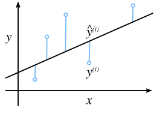
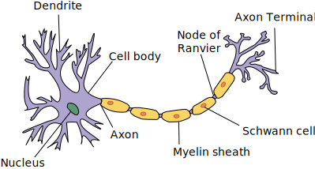

```{.python .input  n=1}
%load_ext d2lbook.tab
tab.interact_select(['mxnet', 'pytorch', 'tensorflow'])
```

# Régression linéaire
:label:`sec_linear_regression` 

 *Les problèmes de régression* surgissent chaque fois que nous voulons prédire une valeur numérique.
Parmi les exemples courants, citons la prédiction des prix (des maisons, des actions, etc.),
la prédiction de la durée de séjour (des patients à l'hôpital),
la prévision de la demande (pour les ventes au détail), parmi d'innombrables autres.
Tous les problèmes de prédiction ne sont pas des problèmes de régression classiques.
Plus tard, nous présenterons les problèmes de classification,
où l'objectif est de prédire l'appartenance à un ensemble de catégories.

À titre d'exemple, supposons que nous souhaitions
estimer le prix des maisons (en dollars)
en fonction de leur superficie (en pieds carrés) et de leur âge (en années).
Pour développer un modèle de prédiction des prix des maisons,
nous devons mettre la main sur des données constituées de ventes,
comprenant le prix de vente, la superficie et l'âge de chaque maison.
Dans la terminologie de l'apprentissage automatique,
l'ensemble de données est appelé un *ensemble de données d'entraînement* ou *ensemble d'entraînement*,
et chaque ligne (contenant les données correspondant à une vente)
est appelée un *exemple* (ou *point de données*, *instance*, *échantillon*).
La chose que nous essayons de prédire (le prix)
est appelée une *étiquette* (ou *cible*).
Les variables (âge et zone)
sur lesquelles les prédictions sont basées
sont appelées *caractéristiques* (ou *covariables*).

## Notions de base

*La régression linéaire* est peut-être à la fois la plus simple
et la plus populaire des outils standard
pour aborder les problèmes de régression.
Datant de l'aube du 19ème siècle :cite:`Legendre.1805,Gauss.1809` ,
la régression linéaire découle de quelques hypothèses simples.
Premièrement, nous supposons que la relation
entre les caractéristiques $\mathbf{x}$ et la cible $y$
 est approximativement linéaire,
c'est-à-dire que la moyenne conditionnelle $E[Y|X=\mathbf{x}]$
peut être exprimée comme une somme pondérée
des caractéristiques $\mathbf{x}$.
Cette configuration permet que la valeur cible
puisse encore s'écarter de sa valeur attendue
en raison du bruit d'observation.
Ensuite, nous pouvons imposer l'hypothèse qu'un tel bruit
se comporte bien, suivant une distribution gaussienne.
En général, nous utiliserons $n$ pour désigner
le nombre d'exemples dans notre ensemble de données.
Nous utilisons des exposants pour énumérer les échantillons et les cibles,
et des indices pour indexer les coordonnées.
Plus concrètement
$\mathbf{x}^{(i)}$ désigne le $i$-ième échantillon
et $x_j^{(i)}$ désigne sa $j$-ième coordonnée.

### Modèle
:label:`subsec_linear_model` 

 Au cœur de chaque solution se trouve un modèle
qui décrit comment les caractéristiques peuvent être transformées
en une estimation de la cible.
L'hypothèse de linéarité signifie que
la valeur attendue de la cible (prix) peut être exprimée
comme une somme pondérée des caractéristiques (surface et âge) :

$$\mathrm{price} = w_{\mathrm{area}} \cdot \mathrm{area} + w_{\mathrm{age}} \cdot \mathrm{age} + b.$$ 
 :eqlabel:`eq_price-area` 

 Ici, $w_{\mathrm{area}}$ et $w_{\mathrm{age}}$
 sont appelés *poids*, et $b$ est appelé un *biais*
(ou *offset* ou *intercept*).
Les poids déterminent l'influence de chaque caractéristique sur notre prédiction.
Le biais détermine la valeur de l'estimation lorsque toutes les caractéristiques sont nulles.
Même si nous ne verrons jamais de maisons nouvellement construites dont la surface est précisément nulle,
nous avons toujours besoin du biais car il nous permet
d'exprimer toutes les fonctions linéaires de nos caractéristiques
(au lieu de nous limiter aux lignes qui passent par l'origine).
Strictement parlant, :eqref:`eq_price-area` est une *transformation affine* des caractéristiques d'entrée, qui se caractérise par une *transformation linéaire* des caractéristiques via la somme pondérée, combinée à une *translation* via le biais ajouté.
Étant donné un ensemble de données, notre objectif est de choisir
les poids $\mathbf{w}$ et le biais $b$
 qui, en moyenne, font que les prédictions de notre modèle
correspondent le plus possible aux prix réels observés dans les données.


Dans les disciplines où il est courant de se concentrer
sur des ensembles de données ne comportant que quelques caractéristiques,
exprime explicitement les modèles en forme longue,
comme dans :eqref:`eq_price-area` , est courant.
Dans le domaine de l'apprentissage automatique, nous travaillons généralement
avec des ensembles de données à haute dimension,
où il est plus pratique d'employer
la notation compacte de l'algèbre linéaire.
Lorsque nos entrées se composent de $d$ caractéristiques,
nous pouvons attribuer à chacune un indice (entre $1$ et $d$)
et exprimer notre prédiction $\hat{y}$
 (en général, le symbole "chapeau" indique une estimation) comme

$$\hat{y} = w_1  x_1 + ... + w_d  x_d + b.$$ 

 En rassemblant toutes les caractéristiques dans un vecteur $\mathbf{x} \in \mathbb{R}^d$
 et tous les poids dans un vecteur $\mathbf{w} \in \mathbb{R}^d$,
nous pouvons exprimer notre modèle de manière compacte via le produit scalaire
entre $\mathbf{w}$ et $\mathbf{x}$:

$$\hat{y} = \mathbf{w}^\top \mathbf{x} + b.$$
:eqlabel:`eq_linreg-y`

Dans :eqref:`eq_linreg-y` , le vecteur $\mathbf{x}$
 correspond aux caractéristiques d'un seul exemple.
Nous trouverons souvent pratique
de nous référer aux caractéristiques de notre ensemble de données de $n$ exemples
via la *matrice de conception* $\mathbf{X} \in \mathbb{R}^{n \times d}$.
Ici, $\mathbf{X}$ contient une ligne pour chaque exemple
et une colonne pour chaque caractéristique.
Pour une collection de caractéristiques $\mathbf{X}$,
les prédictions $\hat{\mathbf{y}} \in \mathbb{R}^n$
 peuvent être exprimées via le produit matrice-vecteur :

$${\hat{\mathbf{y}}} = \mathbf{X} \mathbf{w} + b,$$ 

 où la diffusion (:numref:`subsec_broadcasting` ) est appliquée pendant la sommation.
Étant donné les caractéristiques d'un ensemble de données d'apprentissage $\mathbf{X}$
 et les étiquettes correspondantes (connues) $\mathbf{y}$,
, l'objectif de la régression linéaire est de trouver
le vecteur de poids $\mathbf{w}$ et le terme de biais $b$
 qui, étant donné les caractéristiques d'un nouvel exemple de données
échantillonné à partir de la même distribution que $\mathbf{X}$,
l'étiquette du nouvel exemple sera (en principe)
prédite avec l'erreur la plus faible.

Même si nous pensons que le meilleur modèle pour
prédire $y$ à partir de $\mathbf{x}$ est linéaire,
nous ne nous attendons pas à trouver un ensemble de données du monde réel de $n$ exemples où
$y^{(i)}$ est exactement égal à $\mathbf{w}^\top \mathbf{x}^{(i)}+b$
 pour tous les $1 \leq i \leq n$.
Par exemple, quels que soient les instruments que nous utilisons pour observer
les caractéristiques $\mathbf{X}$ et les étiquettes $\mathbf{y}$
 , il se peut que l'erreur de mesure soit minime.
Ainsi, même si nous sommes convaincus
que la relation sous-jacente est linéaire,
nous incorporerons un terme de bruit pour tenir compte de ces erreurs.

Avant de pouvoir rechercher les meilleurs *paramètres*
(ou *paramètres de modèle*) $\mathbf{w}$ et $b$,
nous aurons besoin de deux autres éléments :
(i) une mesure de qualité pour un modèle donné ;
et (ii) une procédure de mise à jour du modèle pour améliorer sa qualité.

### Fonction de perte
:label:`subsec_linear-regression-loss-function` 

 Naturellement, l'adaptation de notre modèle aux données nécessite
que nous nous mettions d'accord sur une certaine mesure de *fitness*
(ou, de manière équivalente, de *unfitness*).
*Les fonctions de perte* quantifient la distance
entre les valeurs *réelles* et *prédites* de la cible.
La perte est généralement un nombre non négatif
où les petites valeurs sont meilleures
et les prédictions parfaites entraînent une perte de 0.
Pour les problèmes de régression, la fonction de perte la plus courante est l'erreur quadratique.
Lorsque notre prédiction pour un exemple $i$ est $\hat{y}^{(i)}$
 et que l'étiquette réelle correspondante est $y^{(i)}$,
l'erreur quadratique * est donnée par :

$$l^{(i)}(\mathbf{w}, b) = \frac{1}{2} \left(\hat{y}^{(i)} - y^{(i)}\right)^2.$$ 
 :eqlabel:`eq_mse` 

 La constante $\frac{1}{2}$ ne fait aucune différence réelle
mais s'avère pratique d'un point de vue notationnel,
puisqu'elle s'annule lorsque nous prenons la dérivée de la perte.
Étant donné que l'ensemble de données d'apprentissage nous est donné,
et donc hors de notre contrôle,
l'erreur empirique est uniquement fonction des paramètres du modèle.
Ci-dessous, nous visualisons l'ajustement d'un modèle de régression linéaire
dans un problème avec des entrées unidimensionnelles (:numref:`fig_fit_linreg` ).


:label:`fig_fit_linreg`

Notez que les grandes différences entre les estimations
 $\hat{y}^{(i)}$ et les cibles $y^{(i)}$
 entraînent des contributions encore plus importantes à la perte,
en raison de la forme quadratique de la perte
(cela peut être une arme à double tranchant.
Si elle encourage le modèle à éviter les erreurs importantes
, elle peut également conduire à une sensibilité excessive aux données anormales).
Pour mesurer la qualité d'un modèle sur l'ensemble de l'ensemble de données des exemples $n$,
nous faisons simplement la moyenne (ou l'équivalent, la somme)
des pertes sur l'ensemble d'apprentissage :

$$L(\mathbf{w}, b) =\frac{1}{n}\sum_{i=1}^n l^{(i)}(\mathbf{w}, b) =\frac{1}{n} \sum_{i=1}^n \frac{1}{2}\left(\mathbf{w}^\top \mathbf{x}^{(i)} + b - y^{(i)}\right)^2.$$

Lors de l'apprentissage du modèle, nous voulons trouver les paramètres ($\mathbf{w}^*, b^*$)
qui minimisent la perte totale sur tous les exemples d'apprentissage :

$$\mathbf{w}^*, b^* = \operatorname*{argmin}_{\mathbf{w}, b}\  L(\mathbf{w}, b).$$ 

 ### Solution analytique

Contrairement à la plupart des modèles que nous allons aborder,
la régression linéaire nous présente
un problème d'optimisation étonnamment facile.
En particulier, nous pouvons trouver les paramètres optimaux
(tels qu'évalués sur les données d'entraînement)
analytiquement en appliquant une formule simple comme suit.
Tout d'abord, nous pouvons subsumer le biais $b$ dans le paramètre $\mathbf{w}$
 en ajoutant une colonne à la matrice de conception constituée de tous les uns.
Notre problème de prédiction consiste alors à minimiser $\|\mathbf{y} - \mathbf{X}\mathbf{w}\|^2$.
Tant que la matrice de conception $\mathbf{X}$ a un rang complet
(aucune caractéristique ne dépend linéairement des autres),
alors il n'y aura qu'un seul point critique sur la surface de perte
et il correspond au minimum de la perte sur l'ensemble du domaine.
En prenant la dérivée de la perte par rapport à $\mathbf{w}$
 et en la fixant à zéro, on obtient :

$$\begin{aligned}
    \partial_{\mathbf{w}} \|\mathbf{y} - \mathbf{X}\mathbf{w}\|^2 =
    2 \mathbf{X}^\top (\mathbf{X} \mathbf{w} - \mathbf{y}) = 0
    \text{ and hence }
    \mathbf{X}^\top \mathbf{y} = \mathbf{X}^\top \mathbf{X} \mathbf{w}.
\end{aligned}$$

La résolution de $\mathbf{w}$ nous donne la solution optimale
pour le problème d'optimisation.
Notez que cette solution 

$$\mathbf{w}^* = (\mathbf X^\top \mathbf X)^{-1}\mathbf X^\top \mathbf{y}$$ 

 ne sera unique
que lorsque la matrice $\mathbf X^\top \mathbf X$ est inversible,
c'est-à-dire lorsque les colonnes de la matrice de conception
sont linéairement indépendantes :cite:`Golub.Van-Loan.1996` .


Bien que des problèmes simples comme la régression linéaire
puissent admettre des solutions analytiques,
vous ne devez pas vous habituer à une telle chance.
Bien que les solutions analytiques permettent une belle analyse mathématique,
l'exigence d'une solution analytique est si restrictive
qu'elle exclurait presque tous les aspects passionnants de l'apprentissage profond.

### Minibatch Stochastic Gradient Descent

Heureusement, même dans les cas où nous ne pouvons pas résoudre les modèles analytiquement,
nous pouvons souvent entraîner les modèles efficacement dans la pratique.
De plus, pour de nombreuses tâches, ces modèles difficiles à optimiser
s'avèrent tellement meilleurs que le fait de découvrir comment les former
finit par en valoir la peine.

La technique clé pour optimiser presque tous les modèles d'apprentissage profond,
et à laquelle nous ferons appel tout au long de ce livre,
consiste à réduire itérativement l'erreur
en mettant à jour les paramètres dans la direction
qui diminue progressivement la fonction de perte.
Cet algorithme est appelé *descente de gradient*.

L'application la plus naïve de la descente de gradient
consiste à prendre la dérivée de la fonction de perte,
qui est une moyenne des pertes calculées
sur chaque exemple de l'ensemble de données.
En pratique, cette méthode peut être extrêmement lente :
nous devons passer en revue l'ensemble des données avant d'effectuer une seule mise à jour,
même si les étapes de mise à jour peuvent être très puissantes :cite:`Liu.Nocedal.1989` .
Pire encore, s'il y a beaucoup de redondance dans les données d'apprentissage,
l'avantage d'une mise à jour complète est encore plus faible.

L'autre extrême consiste à ne considérer qu'un seul exemple à la fois et à effectuer les étapes de mise à jour
sur la base d'une seule observation à la fois.
L'algorithme qui en résulte, la *descente de gradient stochastique* (SGD)
peut être une stratégie efficace :cite:`Bottou.2010` , même pour les grands ensembles de données.
Malheureusement, la SGD présente des inconvénients, tant sur le plan informatique que statistique.
L'un des problèmes vient du fait que les processeurs sont beaucoup plus rapides
pour multiplier et additionner des nombres que
pour déplacer des données de la mémoire principale vers le cache du processeur.
Il est jusqu'à un ordre de grandeur plus efficace d'effectuer
une multiplication matrice-vecteur
qu'un nombre correspondant d'opérations vecteur-vecteur.
Cela signifie qu'il peut être beaucoup plus long de traiter
un échantillon à la fois que de traiter un lot complet.
Un deuxième problème est que certaines couches,
telles que la normalisation par lot (qui sera décrite dans :numref:`sec_batch_norm` ),
ne fonctionnent bien que lorsque nous avons accès
à plus d'une observation à la fois.

La solution à ces deux problèmes consiste à choisir une stratégie intermédiaire :
plutôt que de prendre un lot complet ou un seul échantillon à la fois,
nous prenons un *minibatch* d'observations :cite:`Li.Zhang.Chen.ea.2014` .
Le choix spécifique de la taille dudit minibatch dépend de nombreux facteurs,
tels que la quantité de mémoire, le nombre d'accélérateurs,
le choix des couches, et la taille totale de l'ensemble de données.
Malgré tout, un nombre compris entre 32 et 256,
de préférence un multiple d'une grande puissance de $2$, est un bon début.
Cela nous conduit à la descente de gradient stochastique en *minibatch*.

Dans sa forme la plus élémentaire, à chaque itération $t$,
nous échantillonnons d'abord de manière aléatoire un mini-batch $\mathcal{B}_t$
 composé d'un nombre fixe $|\mathcal{B}|$ d'exemples d'apprentissage.
Nous calculons ensuite la dérivée (gradient) de la perte moyenne
sur le minilot en fonction des paramètres du modèle.
Enfin, nous multiplions le gradient
par une petite valeur positive prédéterminée $\eta$,
appelée le *taux d'apprentissage*,
et soustrayons le terme résultant des valeurs actuelles des paramètres.
Nous pouvons exprimer la mise à jour comme suit :

$$(\mathbf{w},b) \leftarrow (\mathbf{w},b) - \frac{\eta}{|\mathcal{B}|} \sum_{i \in \mathcal{B}_t} \partial_{(\mathbf{w},b)} l^{(i)}(\mathbf{w},b).$$ 

 En résumé, la SGD par minibatchs se déroule comme suit :
(i) initialiser les valeurs des paramètres du modèle, généralement de manière aléatoire ;
(ii) échantillonner de manière itérative des minibatchs aléatoires à partir des données,
en mettant à jour les paramètres dans la direction du gradient négatif.
Pour les pertes quadratiques et les transformations affines,
il existe une expansion à forme fermée :

$$\begin{aligned} \mathbf{w} & \leftarrow \mathbf{w} - \frac{\eta}{|\mathcal{B}|} \sum_{i \in \mathcal{B}_t} \partial_{\mathbf{w}} l^{(i)}(\mathbf{w}, b) && = \mathbf{w} - \frac{\eta}{|\mathcal{B}|} \sum_{i \in \mathcal{B}_t} \mathbf{x}^{(i)} \left(\mathbf{w}^\top \mathbf{x}^{(i)} + b - y^{(i)}\right)\\ b &\leftarrow b -  \frac{\eta}{|\mathcal{B}|} \sum_{i \in \mathcal{B}_t} \partial_b l^{(i)}(\mathbf{w}, b) &&  = b - \frac{\eta}{|\mathcal{B}|} \sum_{i \in \mathcal{B}_t} \left(\mathbf{w}^\top \mathbf{x}^{(i)} + b - y^{(i)}\right). \end{aligned}$$ 
 :eqlabel:`eq_linreg_batch_update` 

 Puisque nous choisissons un minibatch $\mathcal{B}$
 nous devons normaliser par sa taille $|\mathcal{B}|$.
La taille des minibatchs et le taux d'apprentissage sont souvent définis par l'utilisateur.
Ces paramètres réglables qui ne sont pas mis à jour
dans la boucle d'apprentissage sont appelés *hyperparamètres*.
Ils peuvent être réglés automatiquement par un certain nombre de techniques, telles que l'optimisation bayésienne
:cite:`Frazier.2018` . Au final, la qualité de la solution est
généralement évaluée sur un *ensemble de données de validation* (ou *ensemble de validation*) distinct.

Après un entraînement pendant un nombre prédéterminé d'itérations
(ou jusqu'à ce qu'un autre critère d'arrêt soit satisfait),
nous enregistrons les paramètres estimés du modèle,
désignés par $\hat{\mathbf{w}}, \hat{b}$.
Notez que même si notre fonction est réellement linéaire et sans bruit,
ces paramètres ne seront pas les minimisateurs exacts de la perte, ni même déterministes.
Bien que l'algorithme converge lentement vers les minimiseurs
, il ne peut généralement pas y parvenir exactement en un nombre fini d'étapes.
De plus, les minibatchs $\mathcal{B}$
 utilisés pour mettre à jour les paramètres sont choisis au hasard.
Cela rompt le déterminisme.

Il se trouve que la régression linéaire est un problème d'apprentissage
avec un minimum global
(lorsque $\mathbf{X}$ est de rang complet, ou de manière équivalente,
lorsque $\mathbf{X}^\top \mathbf{X}$ est inversible).
Cependant, les surfaces perdues pour les réseaux profonds contiennent de nombreux points de selle et minima.
Heureusement, nous ne nous soucions généralement pas de trouver
un ensemble exact de paramètres, mais simplement tout ensemble de paramètres
qui conduit à des prédictions précises (et donc à une faible perte).
En pratique, les praticiens de l'apprentissage profond
ont rarement du mal à trouver des paramètres
qui minimisent la perte *sur les ensembles d'apprentissage*
:cite:`Izmailov.Podoprikhin.Garipov.ea.2018,Frankle.Carbin.2018` .
La tâche la plus redoutable est de trouver des paramètres
qui conduisent à des prédictions précises sur des données inédites,
un défi appelé *généralisation*.
Nous reviendrons sur ces sujets tout au long de l'ouvrage.

### Prédictions

Compte tenu du modèle $\hat{\mathbf{w}}^\top \mathbf{x} + \hat{b}$,
nous pouvons maintenant faire des *prédictions* pour un nouvel exemple,
par exemple, pour prédire le prix de vente d'une maison inédite
compte tenu de sa superficie $x_1$ et de son âge $x_2$.
Les praticiens de l'apprentissage profond ont pris l'habitude d'appeler la phase de prédiction *inférence*
, mais il s'agit d'un terme quelque peu erroné---*inférence* fait référence de manière générale
à toute conclusion tirée sur la base de preuves,
y compris les valeurs des paramètres
et l'étiquette probable pour une instance non vue.
Dans la littérature statistique
*inference* désigne plus souvent l'inférence de paramètres
et cette surcharge terminologique crée une confusion inutile
lorsque les praticiens de l'apprentissage profond parlent aux statisticiens.
Dans ce qui suit, nous nous en tiendrons à *prédiction* chaque fois que possible.


## Vectorisation pour la vitesse

Lors de l'apprentissage de nos modèles, nous voulons généralement traiter
des minibatchs entiers d'exemples simultanément.
Pour y parvenir efficacement, (**nous**) (~)~)devrions~)~))
(**vectoriser les calculs et exploiter
des bibliothèques d'algèbre linéaire rapides
plutôt que d'écrire des boucles for coûteuses en Python.**)

```{.python .input  n=1}
%%tab mxnet
%matplotlib inline
from d2l import mxnet as d2l
import math
from mxnet import np
import time
```

```{.python .input  n=1}
%%tab pytorch
%matplotlib inline
from d2l import torch as d2l
import math
import torch
import numpy as np
import time
```

```{.python .input}
%%tab tensorflow
%matplotlib inline
from d2l import tensorflow as d2l
import math
import tensorflow as tf
import numpy as np
import time
```

Pour illustrer pourquoi cela est si important,
nous pouvons (**considérer deux méthodes pour ajouter des vecteurs.**)
Pour commencer, nous instancions deux vecteurs à 10 000 dimensions
contenant tous les uns.
Dans une méthode, nous bouclons sur les vecteurs avec un for-loop Python.
Dans l'autre méthode, nous nous appuyons sur un seul appel à `+`.

```{.python .input  n=2}
%%tab all
n = 10000
a = d2l.ones(n)
b = d2l.ones(n)
```

Nous pouvons maintenant évaluer les charges de travail.
D'abord, [**nous les ajoutons, une coordonnée à la fois,
en utilisant une boucle for.**]

```{.python .input  n=3}
%%tab mxnet, pytorch
c = d2l.zeros(n)
t = time.time()
for i in range(n):
    c[i] = a[i] + b[i]
f'{time.time() - t:.5f} sec'
```

```{.python .input}
%%tab tensorflow
c = tf.Variable(d2l.zeros(n))
t = time.time()
for i in range(n):
    c[i].assign(a[i] + b[i])
f'{time.time() - t:.5f} sec'
```

(**Alternativement, nous nous appuyons sur l'opérateur rechargé `+` pour calculer la somme par éléments.**)

```{.python .input  n=4}
%%tab all
t = time.time()
d = a + b
f'{time.time() - t:.5f} sec'
```

La deuxième méthode est nettement plus rapide que la première.
La vectorisation du code produit souvent des accélérations de l'ordre de grandeur.
De plus, nous confions une plus grande partie des mathématiques à la bibliothèque
et n'avons pas besoin d'écrire nous-mêmes autant de calculs,
ce qui réduit le risque d'erreurs et augmente la portabilité du code.


## La distribution normale et la perte au carré
:label:`subsec_normal_distribution_and_squared_loss` 

 Jusqu'à présent, nous avons donné une motivation assez fonctionnelle
de l'objectif de perte au carré :
les paramètres optimaux renvoient l'espérance conditionnelle $E[Y|X]$
 lorsque le modèle sous-jacent est vraiment linéaire,
et la perte attribue des pénalités démesurées pour les valeurs aberrantes.
Nous pouvons également fournir une motivation plus formelle
pour l'objectif de perte au carré
en faisant des hypothèses probabilistes
sur la distribution du bruit.

La régression linéaire a été inventée au début du 19e siècle.
Bien que l'on ait longtemps débattu pour savoir si c'est Gauss ou Legendre
qui a eu l'idée en premier,
c'est Gauss qui a également découvert la distribution normale
(également appelée la *gaussienne*).
Il s'avère que la distribution normale
et la régression linéaire avec perte au carré
partagent un lien plus profond qu'une parenté commune.

Pour commencer, rappelons qu'une distribution normale
avec une moyenne $\mu$ et une variance $\sigma^2$ (écart-type $\sigma$)
est donnée par

$$p(x) = \frac{1}{\sqrt{2 \pi \sigma^2}} \exp\left(-\frac{1}{2 \sigma^2} (x - \mu)^2\right).$$ 

 Ci-dessous [**nous définissons une fonction pour calculer la distribution normale**].

```{.python .input  n=3}
%%tab all
def normal(x, mu, sigma):
    p = 1 / math.sqrt(2 * math.pi * sigma**2)
    return p * np.exp(-0.5 * (x - mu)**2 / sigma**2)
```

Nous pouvons maintenant (**visualiser les distributions normales**).

```{.python .input  n=8}
%%tab mxnet
# Use numpy again for visualization
x = np.arange(-7, 7, 0.01)

# Mean and standard deviation pairs
params = [(0, 1), (0, 2), (3, 1)]
d2l.plot(x.asnumpy(), [normal(x, mu, sigma).asnumpy() for mu, sigma in params], xlabel='x',
         ylabel='p(x)', figsize=(4.5, 2.5),
         legend=[f'mean {mu}, std {sigma}' for mu, sigma in params])
```

```{.python .input  n=8}
%%tab pytorch, tensorflow
# Use numpy again for visualization
x = np.arange(-7, 7, 0.01)

# Mean and standard deviation pairs
params = [(0, 1), (0, 2), (3, 1)]
d2l.plot(x, [normal(x, mu, sigma) for mu, sigma in params], xlabel='x',
         ylabel='p(x)', figsize=(4.5, 2.5),
         legend=[f'mean {mu}, std {sigma}' for mu, sigma in params])
```

Notez que la modification de la moyenne correspond
à un déplacement le long de l'axe $x$,
et que l'augmentation de la variance
étale la distribution,
abaissant son pic.

Une façon de motiver la régression linéaire avec perte au carré
est de supposer que les observations proviennent de mesures bruitées,
où le bruit est normalement distribué comme suit :

$$y = \mathbf{w}^\top \mathbf{x} + b + \epsilon \text{ where } \epsilon \sim \mathcal{N}(0, \sigma^2).$$ 

 Ainsi, nous pouvons maintenant écrire la *vraisemblance*
de voir un $y$ particulier pour un $\mathbf{x}$ donné via

$$P(y | \mathbf{x}) = \frac{1}{\sqrt{2 \pi \sigma^2}} \exp\left(-\frac{1}{2 \sigma^2} (y - \mathbf{w}^\top \mathbf{x} - b)^2\right).$$ 

 En tant que telle, la vraisemblance se factorise.
Selon le *principe de la vraisemblance maximale*,
les meilleures valeurs des paramètres $\mathbf{w}$ et $b$ sont celles
qui maximisent la *vraisemblance* de l'ensemble des données :

$$P(\mathbf y|\mathbf X) = \prod_{i=1}^{n} p(y^{(i)}|\mathbf{x}^{(i)}).$$ 

 L'égalité découle du fait que toutes les paires $(\mathbf{x}^{(i)}, y^{(i)})$
 ont été tirées indépendamment les unes des autres.
Les estimateurs choisis selon le principe de la vraisemblance maximale
sont appelés *estimateurs de vraisemblance maximale*.
Bien que la maximisation du produit de plusieurs fonctions exponentielles,
, puisse sembler difficile,
nous pouvons simplifier les choses de manière significative, sans changer l'objectif,
en maximisant plutôt le logarithme de la vraisemblance.
Pour des raisons historiques, les optimisations sont plus souvent exprimées
comme une minimisation plutôt qu'une maximisation.
Ainsi, sans rien changer,
nous pouvons *minimiser* la *log-vraisemblance négative*,
que nous pouvons exprimer comme suit :

$$-\log P(\mathbf y | \mathbf X) = \sum_{i=1}^n \frac{1}{2} \log(2 \pi \sigma^2) + \frac{1}{2 \sigma^2} \left(y^{(i)} - \mathbf{w}^\top \mathbf{x}^{(i)} - b\right)^2.$$ 

 Si nous supposons que $\sigma$ est fixe,
nous pouvons ignorer le premier terme,
car il ne dépend pas de $\mathbf{w}$ ou $b$.
Le second terme est identique
à la perte par erreur quadratique introduite précédemment,
sauf pour la constante multiplicative $\frac{1}{\sigma^2}$.
Heureusement, la solution ne dépend pas non plus de $\sigma$.
Il s'ensuit que la minimisation de l'erreur quadratique moyenne
est équivalente à l'estimation par maximum de vraisemblance
d'un modèle linéaire sous l'hypothèse d'un bruit gaussien additif.


## Régression linéaire en tant que réseau neuronal

Alors que les modèles linéaires ne sont pas suffisamment riches
pour exprimer les nombreux réseaux neuronaux compliqués
que nous présenterons dans cet ouvrage,
les réseaux neuronaux sont suffisamment riches
pour subsumer les modèles linéaires en tant que réseaux neuronaux
dans lesquels chaque caractéristique est représentée par un neurone d'entrée,
tous étant connectés directement à la sortie.

:numref:`fig_single_neuron` illustre
la régression linéaire en tant que réseau neuronal.
Le diagramme met en évidence le schéma de connectivité
, par exemple la manière dont chaque entrée est connectée à la sortie,
mais pas les valeurs spécifiques prises par les poids ou les biais.


:label:`fig_single_neuron`

Les entrées sont $x_1, \ldots, x_d$.
Nous appelons $d$ le *nombre d'entrées*
ou la *dimensionnalité des caractéristiques* dans la couche d'entrée.
La sortie du réseau est $o_1$.
Comme nous essayons de prédire
une seule valeur numérique,
nous n'avons qu'un seul neurone de sortie.
Notez que les valeurs d'entrée sont toutes *données*.
Il n'y a qu'un seul neurone *calculé*.
En résumé, nous pouvons considérer la régression linéaire
comme un réseau neuronal monocouche entièrement connecté.
Nous rencontrerons des réseaux
avec beaucoup plus de couches
dans les prochains chapitres.

### Biologie

La régression linéaire étant antérieure aux neurosciences computationnelles,
il peut sembler anachronique de décrire
la régression linéaire en termes de réseaux neuronaux.
Néanmoins, ils constituaient un point de départ naturel
lorsque les cybernéticiens et neurophysiologistes
Warren McCulloch et Walter Pitts ont commencé à développer
modèles de neurones artificiels.
Considérons l'image caricaturale
d'un neurone biologique dans :numref:`fig_Neuron` ,
composé de *dendrites* (bornes d'entrée),
du *noyau* (unité centrale), de l'*axone* (fil de sortie),
et des *terminaisons de l'axone* (bornes de sortie),
permettant des connexions avec d'autres neurones via des *synapses*.


:label:`fig_Neuron`

Les informations $x_i$ provenant d'autres neurones
(ou de capteurs environnementaux) sont reçues dans les dendrites.
Ces informations sont notamment pondérées
par les *poids synaptiques* $w_i$,
déterminant l'effet des entrées,
par exemple, l'activation ou l'inhibition via le produit $x_i w_i$.
Les entrées pondérées provenant de sources multiples
sont agrégées dans le noyau
sous la forme d'une somme pondérée $y = \sum_i x_i w_i + b$,
éventuellement soumise à un post-traitement non linéaire via $\sigma(y)$.
Ces informations sont ensuite envoyées via l'axone aux terminaisons de l'axone,
où elles atteignent leur destination
(par exemple, un actionneur tel qu'un muscle)
ou elles sont introduites dans un autre neurone via ses dendrites.

L'idée de haut niveau selon laquelle de nombreuses unités de ce type
pourraient être combinées avec la bonne connectivité
et le bon algorithme d'apprentissage,
pour produire un comportement
bien plus intéressant et complexe que celui qu'un neurone seul pourrait exprimer
doit certainement à notre étude des systèmes neuronaux biologiques réels.
Dans le même temps, la plupart des recherches menées aujourd'hui dans le domaine de l'apprentissage profond
s'inspirent d'une source beaucoup plus large.
Nous invoquons Stuart Russell et Peter Norvig :cite:`Russell.Norvig.2016` 
 qui ont fait remarquer que, bien que les avions aient pu être *inspirés* par des oiseaux,
l'ornithologie n'a pas été le principal moteur
de l'innovation aéronautique depuis quelques siècles.
De même, l'inspiration dans l'apprentissage profond de nos jours
provient dans une mesure égale ou supérieure
des mathématiques, de la linguistique, de la psychologie,
des statistiques, de l'informatique et de nombreux autres domaines.

## Résumé

Dans cette section, nous avons présenté
la régression linéaire traditionnelle,
où les paramètres d'une fonction linéaire
sont choisis pour minimiser la perte au carré sur l'ensemble d'apprentissage.
Nous avons également motivé ce choix d'objectif
à la fois par des considérations pratiques
et par une interprétation
de la régression linéaire comme une estimation du maximum de vraisemblance
sous une hypothèse de linéarité et de bruit gaussien.
Après avoir discuté des considérations informatiques
et des liens avec les statistiques,
nous avons montré comment de tels modèles linéaires pouvaient être exprimés
comme des réseaux neuronaux simples où les entrées
sont directement reliées à la ou aux sorties.
Bien que nous ne nous intéresserons bientôt plus du tout aux modèles linéaires,
ils sont suffisants pour introduire la plupart des composants
que tous nos modèles requièrent :
formes paramétriques, objectifs différentiables,
optimisation par descente de gradient stochastique en mini-parcelles,
et, finalement, évaluation sur des données inédites.


## Exercices

1. Supposons que nous disposions de certaines données $x_1, \ldots, x_n \in \mathbb{R}$. Notre objectif est de trouver une constante $b$ telle que $\sum_i (x_i - b)^2$ soit minimisé.
   1. Trouvez une solution analytique pour la valeur optimale de $b$.
 1. Quel est le rapport entre ce problème et sa solution et la distribution normale ?
   1. Que se passe-t-il si nous changeons la perte de $\sum_i (x_i - b)^2$ à $\sum_i |x_i-b|$? Pouvez-vous trouver la solution optimale pour $b$?
1. Prouvez que les fonctions affines qui peuvent être exprimées par $\mathbf{x}^\top \mathbf{w} + b$ sont équivalentes aux fonctions linéaires sur $(\mathbf{x}, 1)$.
1. Supposons que vous vouliez trouver des fonctions quadratiques de $\mathbf{x}$, c'est-à-dire $f(\mathbf{x}) = b + \sum_i w_i x_i + \sum_{j \leq i} w_{ij} x_{i} x_{j}$. Comment formuleriez-vous cela dans un réseau profond ?
1. Rappelez-vous que l'une des conditions pour que le problème de régression linéaire soit soluble est que la matrice de conception $\mathbf{X}^\top \mathbf{X}$ ait un rang complet.
   1. Que se passe-t-il si ce n'est pas le cas ?
   1. Comment pouvez-vous résoudre ce problème ? Que se passe-t-il si vous ajoutez une petite quantité de bruit gaussien indépendant des coordonnées à toutes les entrées de $\mathbf{X}$?
 1. Quelle est la valeur attendue de la matrice de conception $\mathbf{X}^\top \mathbf{X}$ dans ce cas ?
   1. Que se passe-t-il avec la descente de gradient stochastique lorsque $\mathbf{X}^\top \mathbf{X}$ n'a pas un rang complet ?
1. Supposez que le modèle de bruit régissant le bruit additif $\epsilon$ est la distribution exponentielle. Autrement dit, $p(\epsilon) = \frac{1}{2} \exp(-|\epsilon|)$.
   1. Écrivez la log-vraisemblance négative des données sous le modèle $-\log P(\mathbf y \mid \mathbf X)$.
   1. Pouvez-vous trouver une solution sous forme fermée ?
   1. Suggérez un algorithme de descente de gradient stochastique par minibatchs pour résoudre ce problème. Qu'est-ce qui pourrait mal tourner (indice : ce qui se passe près du point stationnaire lorsque nous continuons à mettre à jour les paramètres) ? Pouvez-vous résoudre ce problème ?
1. Supposons que nous voulions concevoir un réseau neuronal à deux couches en composant deux couches linéaires. Autrement dit, la sortie de la première couche devient l'entrée de la deuxième couche. Pourquoi une telle composition naïve ne fonctionnerait-elle pas ?
1. Que se passe-t-il si l'on veut utiliser la régression pour une estimation réaliste du prix des maisons ou des actions ?
   1. Montrez que l'hypothèse du bruit gaussien additif n'est pas appropriée. Indice : peut-on avoir des prix négatifs ? Qu'en est-il des fluctuations ?
   1. Pourquoi la régression au logarithme du prix serait-elle bien meilleure, c'est-à-dire $y = \log \text{price}$?
 1. De quoi devez-vous vous préoccuper lorsque vous traitez des pennystock, c'est-à-dire des actions dont le prix est très bas ? Indice : pouvez-vous négocier à tous les prix possibles ? Pourquoi est-ce un problème plus important pour les actions bon marché ?
   1. Pour plus d'informations, consultez le célèbre modèle de Black et Scholes pour l'évaluation des options :cite:`Black.Scholes.1973` .
1. Supposons que nous voulions utiliser la régression pour estimer le *nombre* de pommes vendues dans une épicerie.
   1. Quels sont les problèmes posés par un modèle de bruit additif gaussien ? Indice : vous vendez des pommes, pas du pétrole.
   1. Le modèle [Poisson distribution](https://en.wikipedia.org/wiki/Poisson_distribution) capture les distributions sur les comptages. Elle est donnée par $p(k|\lambda) = \lambda^k e^{-\lambda}/k!$. Ici, $\lambda$ est la fonction de taux et $k$ est le nombre d'événements que vous voyez. Prouvez que $\lambda$ est la valeur attendue des comptes $k$.
   1. Concevez une fonction de perte associée à la distribution de Poisson.
   1. Concevez plutôt une fonction de perte pour l'estimation de $\log \lambda$.

:begin_tab:`mxnet`
[Discussions](https://discuss.d2l.ai/t/40)
:end_tab:

:begin_tab:`pytorch`
[Discussions](https://discuss.d2l.ai/t/258)
:end_tab:

:begin_tab:`tensorflow`
[Discussions](https://discuss.d2l.ai/t/259)
:end_tab:
