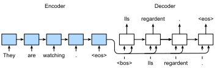
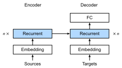
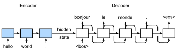

#  Sequence to Sequence
:label:`sec_seq2seq`

The sequence to sequence (seq2seq) model is based on the encoder-decoder architecture to generate a sequence output for a sequence input, as demonstrated in :numref:`fig_seq2seq`. Both the encoder and the decoder use recurrent neural networks (RNNs) to handle sequence inputs with different length. The hidden state of the encoder is used directly to initialize the decoder hidden state to pass information from the encoder to the decoder.


:label:`fig_seq2seq`

The layers in the encoder and the decoder are illustrated in :numref:`fig_seq2seq_details`.


:label:`fig_seq2seq_details`

In this section we will explain and implement the seq2seq model to train on the machine translation dataset.

```{.python .input  n=1}
import d2l
from mxnet import np, npx, init, gluon, autograd
from mxnet.gluon import nn, rnn
npx.set_np()
```

## Encoder

Recall that the encoder of seq2seq can transform the inputs with different length to a universal fixed length content vector $\mathbf{c}$ by encoding the sequence information inside $\mathbf{c}$. We usually use RNN layers within the encoder.

Let's think of an input sequence $x_1, \ldots, x_T$, where $x_t$ is $t$-th word of the inputs. At timestep $t$, the RNN will have two vectors as input: the $x_t$'s feature vector $\mathbf{x_t}$ and the hidden state of the last timestep $\mathbf{h_t}$. Let's denote the transformation of the RNN's hidden states by a function $f$: 

$$\mathbf{h_t} = f (\mathbf{x_t}, \mathbf{h_{t-1}}).$$

Next, the encoder absorbs the information of all the hidden states and encodes into the content vector $\mathbf{c}$ by a function $q$:

$$\mathbf{c} = q (\mathbf{h_1}, \ldots, \mathbf{h_T}).$$

For example, if we choose $q$ as $q (\mathbf{h_1}, \ldots, \mathbf{h_T}) = \mathbf{h_T}$, then the content vector will be the final hidden state $\mathbf{h_T}$.

So far what we describe above is a signle directional RNN, where each timestep's hidden state only depends on the previous tiemsteps'. We can also use other forms of RNNs such as GRUs, LSTMs and, bidirectional RNNs to encode the sequential information.


Let's implement the seq2seq's encoder together! Here, we use the word embedding layer to obtain a feature index from the word index of the input language and then input it into a multi-layer LSTM recurrent neural network. The input for the encoder is a batch of sequences, which is 2-D tensor with shape (batch size, sequence length). It outputs both the LSTM outputs, e.g., the hidden state for each timestep, as well as the hidden state and memory cell of the last timestep.

```{.python .input  n=3}
# Saved in the d2l package for later use
class Seq2SeqEncoder(d2l.Encoder):
    def __init__(self, vocab_size, embed_size, num_hiddens, num_layers,
                 dropout=0, **kwargs):
        super(Seq2SeqEncoder, self).__init__(**kwargs)
        self.embedding = nn.Embedding(vocab_size, embed_size)
        self.rnn = rnn.LSTM(num_hiddens, num_layers, dropout=dropout)

    def forward(self, X, *args):
        X = self.embedding(X)  # X shape: (batch_size, seq_len, embed_size)
        # RNN needs first axes to be timestep, i.e., seq_len
        X = X.swapaxes(0, 1)
        state = self.rnn.begin_state(batch_size=X.shape[1], ctx=X.context)
        out, state = self.rnn(X, state)
        # out shape: (seq_len, batch_size, num_hiddens)
        # stae shape: (num_layers, batch_size, num_hiddens),
        # where "state" contains the hidden state and the memory cell
        return out, state
```

Next, we will create a minibatch sequence input with a batch size of 4 and 7 timesteps. We assume the number of hidden layers of the LSTM unit is 2 and the number of hidden units is 16. The output shape returned by the encoder after performing forward calculation on the input is (number of timesteps, batch size, number of hidden units). The shape of the multi-layer hidden state of the gated recurrent unit in the final timestep is (number of hidden layers, batch size, number of hidden units). For the gated recurrent unit, the `state` list contains only one element, which is the hidden state. If long short-term memory is used, the `state` list will also contain another element, which is the memory cell.

```{.python .input  n=4}
encoder = Seq2SeqEncoder(vocab_size=10, embed_size=8,
                         num_hiddens=16, num_layers=2)
encoder.initialize()
X = np.zeros((4, 7))
output, state = encoder(X)
output.shape
```

Since long short term memory (LSTM) is used, the `state` list will contain both the hidden state and the memory cell with same shape (number of hidden layers, batch size, number of hidden units). However, if gated recurrent unit (GRU) is used, the `state` list contains only one element---the hidden state in the final timestep with shape (number of hidden layers, batch size, number of hidden units).

```{.python .input}
len(state), state[0].shape, state[1].shape
```

## Decoder
:label:`sec_seq2seq_decoder`

As we just introduced, the content vector $\mathbf{c}$ encodes the information from the whole input sequence $x_1, \ldots, x_T$. Suppose that the given outputs in the training set are $y_1, \ldots, y_{T'}$. At each timestep $t'$, the conditional probability of output $y_{t'}$ will base on the previous output sequences $y_1, \ldots, y_{t'-1}$ and the content vector $\mathbf{c}$, i.e., $$P(y_{t'} \mid y_1, \ldots, y_{t'-1}, \mathbf{c}).$$

Hence, we can use another RNN as the decoder. At timestep $t'$, the decoder will update its hidden state $\mathbf{s_{t'}}$ by three inputs: $y_{t'-1}$'s feature vector $\mathbf{y_{t'-1}}$, the content vector $\mathbf{c}$, and the hidden state of the last timestep $\mathbf{s_{t'}}$. Let's denote the transformation of the RNN's hidden states within the decoder by a function $g$: 

$$\mathbf{s_{t'}} = f (\mathbf{y_{t'-1}}, \mathbf{c}, \mathbf{s_{t'-1}}).$$


Now let's implement the seq2seq's decoder together. We directly use the hidden state of the encoder in the final timestep as the initial hidden state of the decoder. This requires that the encoder and decoder RNNs have the same numbers of layers and hidden units.

The LSTM forward calculation of the decoder is similar to the encoder's. The only difference is that we add a dense layer after the LSTM layers, with the hidden size to be the vocabulary size. The dense layer will output the predicted confidence score for each word.

```{.python .input  n=5}
# Saved in the d2l package for later use
class Seq2SeqDecoder(d2l.Decoder):
    def __init__(self, vocab_size, embed_size, num_hiddens, num_layers,
                 dropout=0, **kwargs):
        super(Seq2SeqDecoder, self).__init__(**kwargs)
        self.embedding = nn.Embedding(vocab_size, embed_size)
        self.rnn = rnn.LSTM(num_hiddens, num_layers, dropout=dropout)
        self.dense = nn.Dense(vocab_size, flatten=False)

    def init_state(self, enc_outputs, *args):
        return enc_outputs[1]

    def forward(self, X, state):
        X = self.embedding(X).swapaxes(0, 1)
        out, state = self.rnn(X, state)
        # Make the batch to be the first dimension to simplify loss
        # computation
        out = self.dense(out).swapaxes(0, 1)
        return out, state
```

We create an decoder with the same hyper-parameters as the encoder. As we can see, the output shape is changed to (batch size, the sequence length, vocabulary size).

```{.python .input  n=6}
decoder = Seq2SeqDecoder(vocab_size=10, embed_size=8,
                         num_hiddens=16, num_layers=2)
decoder.initialize()
state = decoder.init_state(encoder(X))
out, state = decoder(X, state)
out.shape, len(state), state[0].shape, state[1].shape
```

## The Loss Function

For each timestep, the decoder outputs a vocabulary size confidence score vector to predict words. Similar to language modeling, we can apply softmax to obtain the probabilities and then use cross-entropy loss to calculate the loss. But note that we padded the target sentences to make them have the same length, but we do not need to compute the loss on the padding symbols.

To implement the loss function that filters out some entries, we will use an operator called `SequenceMask`. It can specify to mask the first dimension (`axis=0`) or the second one (`axis=1`). If the second one is chosen, given a valid length vector `len` and 2-dim input `X`, this operator sets `X[i, len[i]:] = 0` for all $i$'s.

```{.python .input  n=7}
X = np.array([[1, 2, 3], [4, 5, 6]])
npx.sequence_mask(X, np.array([1, 2]), True, axis=1)
```

Apply to $n$-dim tensor $X$, it sets `X[i, len[i]:, :, ..., :] = 0`. In addition, we can specify the filling value such as $-1$ as showing below.

```{.python .input  n=8}
X = np.ones((2, 3, 4))
npx.sequence_mask(X, np.array([1, 2]), True, value=-1, axis=1)
```

Now we can implement the masked version of the softmax cross-entropy loss. Note that each Gluon loss function allows to specify per-example weights, in default they are 1s. Then we can just use a zero weight for each example we would like to remove. So our customized loss function accepts an additional `valid_length` argument to ignore some failing elements in each sequence.

```{.python .input  n=9}
# Saved in the d2l package for later use
class MaskedSoftmaxCELoss(gluon.loss.SoftmaxCELoss):
    # pred shape: (batch_size, seq_len, vocab_size)
    # label shape: (batch_size, seq_len)
    # valid_length shape: (batch_size, )
    def forward(self, pred, label, valid_length):
        # weights shape should be (batch_size, seq_len, 1)
        weights = np.expand_dims(np.ones_like(label),axis=-1)
        weights = npx.sequence_mask(weights, valid_length, True, axis=1)
        return super(MaskedSoftmaxCELoss, self).forward(pred, label, weights)
```

For a sanity check, we create identical three sequences, keep 4 elements for the first sequence, 2 elements for the second sequence, and none for the last one. Then the first example loss should be 2 times larger than the second one, and the last loss should be 0.

```{.python .input  n=10}
loss = MaskedSoftmaxCELoss()
loss(np.ones((3, 4, 10)), np.ones((3, 4)), np.array([4, 2, 0]))
```

## Training
:label:`sec_seq2seq_training`

During training, if the target sequence has length $n$, we feed the first $n-1$ tokens into the decoder as inputs, and the last $n-1$ tokens are used as ground truth label.

```{.python .input  n=13}
# Saved in the d2l package for later use
def train_s2s_ch9(model, data_iter, lr, num_epochs, ctx):
    model.initialize(init.Xavier(), force_reinit=True, ctx=ctx)
    trainer = gluon.Trainer(model.collect_params(),
                            'adam', {'learning_rate': lr})
    loss = MaskedSoftmaxCELoss()
    animator = d2l.Animator(xlabel='epoch', ylabel='loss',
                            xlim=[1, num_epochs], ylim=[0, 0.25])
    for epoch in range(1, num_epochs+1):
        timer = d2l.Timer()
        metric = d2l.Accumulator(2)  # loss_sum, num_tokens
        for batch in data_iter:
            X, X_vlen, Y, Y_vlen = [x.as_in_context(ctx) for x in batch]
            Y_input, Y_label, Y_vlen = Y[:,:-1], Y[:,1:], Y_vlen-1
            with autograd.record():
                Y_hat, _ = model(X, Y_input, X_vlen, Y_vlen)
                l = loss(Y_hat, Y_label, Y_vlen)
            l.backward()
            d2l.grad_clipping(model, 1)
            num_tokens = Y_vlen.sum()
            trainer.step(num_tokens)
            metric.add(l.sum(), num_tokens)
        if epoch % 10 == 0:
            animator.add(epoch, (metric[0]/metric[1],))
    print('loss %.3f, %d tokens/sec on %s ' % (
        metric[0]/metric[1], metric[1]/timer.stop(), ctx))
```

Next, we create a model instance and set hyper-parameters. Then, we can train the model.

```{.python .input  n=14}
embed_size, num_hiddens, num_layers, dropout = 32, 32, 2, 0.0
batch_size, num_steps = 64, 10
lr, num_epochs, ctx = 0.005, 300, d2l.try_gpu()

src_vocab, tgt_vocab, train_iter = d2l.load_data_nmt(batch_size, num_steps)
encoder = Seq2SeqEncoder(
    len(src_vocab), embed_size, num_hiddens, num_layers, dropout)
decoder = Seq2SeqDecoder(
    len(tgt_vocab), embed_size, num_hiddens, num_layers, dropout)
model = d2l.EncoderDecoder(encoder, decoder)
train_s2s_ch9(model, train_iter, lr, num_epochs, ctx)
```

## Predicting

Here we implement the simplest method, greedy search, to generate an output
sequence. As illustrated in :numref:`fig_seq2seq_predict`, during predicting, we feed the same "&lt;bos&gt;" token to the decoder as training at timestep 0. But the input token for a later timestep is the predicted token from the previous timestep.


:label:`fig_seq2seq_predict`

```{.python .input  n=15}
# Saved in the d2l package for later use
def predict_s2s_ch9(model, src_sentence, src_vocab, tgt_vocab, num_steps, ctx):
    src_tokens = src_vocab[src_sentence.lower().split(' ')]
    enc_valid_length = np.array([len(src_tokens)], ctx=ctx)
    src_tokens = d2l.trim_pad(src_tokens, num_steps, src_vocab.pad)
    enc_X = np.array(src_tokens, ctx=ctx)
    # add the batch_size dimension
    enc_outputs = model.encoder(np.expand_dims(enc_X, axis=0),
                                enc_valid_length)
    dec_state = model.decoder.init_state(enc_outputs, enc_valid_length)
    dec_X = np.expand_dims(np.array([tgt_vocab.bos], ctx=ctx), axis=0)
    predict_tokens = []
    for _ in range(num_steps):
        Y, dec_state = model.decoder(dec_X, dec_state)
        # The token with highest score is used as the next timestep input
        dec_X = Y.argmax(axis=2)
        py = dec_X.squeeze(axis=0).astype('int32').item()
        if py == tgt_vocab.eos:
            break
        predict_tokens.append(py)
    return ' '.join(tgt_vocab.to_tokens(predict_tokens))
```

Try several examples:

```{.python .input  n=16}
for sentence in ['Go .', 'Wow !', "I'm OK .", 'I won !']:
    print(sentence + ' => ' + predict_s2s_ch9(
        model, sentence, src_vocab, tgt_vocab, num_steps, ctx))
```

## Summary
* The sequence to sequence (seq2seq) model is based on the encoder-decoder architecture to generate a sequence output from a sequence input.
* We use multiple LSTM layers for both encoder and decoder.

## Exercise
1. Can you think of the other use cases of seq2seq model besides neural machine translation?
1. What will happen if the input sequence in our example is longer? 
1. If we do not use the "SequenceMask" in the loss function, what may happen?


## [Discussions](https://discuss.mxnet.io/t/4357)


