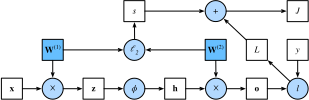

# Forward Propagation, Backward Propagation, and Computational Graphs
:label:`chapter_backprop`

In the previous sections, we used mini-batch
stochastic gradient descent to train our models.
When we implemented the algorithm,
we only worried about the calculations involved
in *forward propagation* through the model.
In other words, we implemented the calculations
required for the model to generate output
corresponding to come given input,
but when it came time to calculate the gradients of each of our parameters,
we invoked the `backward` function,
relying on the `autograd` module to figure out what to do.

The automatic calculation of gradients profoundly simplifies
the implementation of deep learning algorithms.
Before automatic differentiation,
even small changes to complicated models would require
recalculating lots of derivatives by hand.
Even academic papers would too often have to allocate
lots of page real estate to deriving update rules.

While we plan to continue relying on `autograd`,
and we have already come a long way
without every discussing how these gradients
are calculated efficiently under the hood,
it's important that you know
how updates are actually calculated
if you want to go beyond a shallow understanding of deep learning.

In this section, we'll peel back the curtain on some of the details
of backward propagation (more commonly called *backpropagation* or *backprop*).
To convey some insight for both the techniques and how they are implementated,
we will rely on both mathematics and computational graphs
to describe the mechanics behind neural network computations.
To start, we will focus our exposition on
a simple multilayer perceptron with a single hidden layer
and $\ell_2$ norm regularization.

## Forward Propagation

Forward propagation refers to the calculation and storage
of intermediate variables (including outputs)
for the neural network within the models
in the order from input layer to output layer.
In the following, we work in detail through the example of a deep network
with one hidden layer step by step.
This is a bit tedious but it will serve us well
when discussing what really goes on when we call `backward`.

For the sake of simplicity, let’s assume
that the input example is $\mathbf{x}\in \mathbb{R}^d$
and there is no bias term.
Here the intermediate variable is:

$$\mathbf{z}= \mathbf{W}^{(1)} \mathbf{x}$$

$\mathbf{W}^{(1)} \in \mathbb{R}^{h \times d}$
is the weight parameter of the hidden layer.
After entering the intermediate variable $\mathbf{z}\in \mathbb{R}^h$
into the activation function $\phi$ operated by the basic elements,
we will obtain a hidden layer variable with the vector length of $h$,

$$\mathbf{h}= \phi (\mathbf{z}).$$

The hidden variable $\mathbf{h}$ is also an intermediate variable.
Assuming the parameters of the output layer
only possess a weight of $\mathbf{W}^{(2)} \in \mathbb{R}^{q \times h}$,
we can obtain an output layer variable with a vector length of $q$:

$$\mathbf{o}= \mathbf{W}^{(2)} \mathbf{h}.$$

Assuming the loss function is $l$ and the example label is $y$,
we can then calculate the loss term for a single data example,

$$L = l(\mathbf{o}, y).$$

According to the definition of $\ell_2$ norm regularization,
given the hyper-parameter $\lambda$, the regularization term is

$$s = \frac{\lambda}{2} \left(\|\mathbf{W}^{(1)}\|_F^2 + \|\mathbf{W}^{(2)}\|_F^2\right),$$

where the Frobenius norm of the matrix is equivalent
to the calculation of the $L_2$ norm
after flattening the matrix to a vector.
Finally, the model's regularized loss on a given data example is

$$J = L + s.$$

We refer to $J$ as the objective function of a given data example
and refer to it as the ‘objective function’ in the following discussion.

## Computational Graph of Forward Propagation

Plotting computational graphs helps us visualize
the dependencies of operators and variables within the calculation.
The figure below contains the graph associated
with the simple network described above.
The lower-left corner signifies the input
and the upper right corner the output.
Notice that the direction of the arrows (which illustrate data flow)
are primarily rightward and upward.

## Backpropagation

Backpropagation refers to the method of calculating
the gradient of neural network parameters.
In general, back propagation calculates and stores
the intermediate variables of an objective function
related to each layer of the neural network
and the gradient of the parameters
in the order of the output layer to the input layer
according to the ‘chain rule’ in calculus.
Assume that we have functions $\mathsf{Y}=f(\mathsf{X})$
and $\mathsf{Z}=g(\mathsf{Y}) = g \circ f(\mathsf{X})$,
in which the input and the output
$\mathsf{X}, \mathsf{Y}, \mathsf{Z}$
are tensors of arbitrary shapes.
By using the chain rule, we can compute
the derivative of $\mathsf{Z}$ wrt. $\mathsf{X}$ via

$$\frac{\partial \mathsf{Z}}{\partial \mathsf{X}} = \text{prod}\left(\frac{\partial \mathsf{Z}}{\partial \mathsf{Y}}, \frac{\partial \mathsf{Y}}{\partial \mathsf{X}}\right).$$

Here we use the $\text{prod}$ operator
to multiply its arguments after the necessary operations,
such as transposition and swapping input positions have been carried out.
For vectors, this is straightforward:
it is simply matrix-matrix multiplication
and for higher dimensional tensors we use the appropriate counterpart.
The operator $\text{prod}$ hides all the notation overhead.

The parameters of the simple network with one hidden layer
are $\mathbf{W}^{(1)}$ and $\mathbf{W}^{(2)}$.
The objective of backpropagation is to
calculate the gradients $\partial J/\partial \mathbf{W}^{(1)}$
and $\partial J/\partial \mathbf{W}^{(2)}$.
To accompish this, we will apply the chain rule
and calculate, in turn, the gradient of
each intermediate variable and parameter.
The order of calculations are reversed
relative to those performed in forward propagation,
since we need to start with the outcome of the compute graph
and work our way towards the parameters.
The first step is to calculate the gradients
of the objective function $J=L+s$
with respect to the loss term $L$
and the regularization term $s$.

$$\frac{\partial J}{\partial L} = 1 \text{ and } \frac{\partial J}{\partial s} = 1$$

Next, we compute the gradient of the objective function
with respect to variable of the output layer $\mathbf{o}$
according to the chain rule.

$$
\frac{\partial J}{\partial \mathbf{o}}
= \text{prod}\left(\frac{\partial J}{\partial L}, \frac{\partial L}{\partial \mathbf{o}}\right)
= \frac{\partial L}{\partial \mathbf{o}}
\in \mathbb{R}^q
$$

Next, we calculate the gradients of the regularization term
with respect to both parameters.

$$\frac{\partial s}{\partial \mathbf{W}^{(1)}} = \lambda \mathbf{W}^{(1)}
\text{ and }
\frac{\partial s}{\partial \mathbf{W}^{(2)}} = \lambda \mathbf{W}^{(2)}$$

Now we are able calculate the gradient
$\partial J/\partial \mathbf{W}^{(2)} \in \mathbb{R}^{q \times h}$
of the model parameters closest to the output layer.
Using the chain rule yields:

$$
\frac{\partial J}{\partial \mathbf{W}^{(2)}}
= \text{prod}\left(\frac{\partial J}{\partial \mathbf{o}}, \frac{\partial \mathbf{o}}{\partial \mathbf{W}^{(2)}}\right) + \text{prod}\left(\frac{\partial J}{\partial s}, \frac{\partial s}{\partial \mathbf{W}^{(2)}}\right)
= \frac{\partial J}{\partial \mathbf{o}} \mathbf{h}^\top + \lambda \mathbf{W}^{(2)}
$$

To obtain the gradient with respect to $\mathbf{W}^{(1)}$
we need to continue backpropagation
along the output layer to the hidden layer.
The gradient with respect to the hidden layer's outputs
$\partial J/\partial \mathbf{h} \in \mathbb{R}^h$ is given by

$$
\frac{\partial J}{\partial \mathbf{h}}
= \text{prod}\left(\frac{\partial J}{\partial \mathbf{o}}, \frac{\partial \mathbf{o}}{\partial \mathbf{h}}\right)
= {\mathbf{W}^{(2)}}^\top \frac{\partial J}{\partial \mathbf{o}}.
$$

Since the activation function $\phi$ applies elementwise,
calculating the gradient $\partial J/\partial \mathbf{z} \in \mathbb{R}^h$
of the intermediate variable $\mathbf{z}$
requires that we use the elementwise multiplication operator,
which we denote by $\odot$.

$$
\frac{\partial J}{\partial \mathbf{z}}
= \text{prod}\left(\frac{\partial J}{\partial \mathbf{h}}, \frac{\partial \mathbf{h}}{\partial \mathbf{z}}\right)
= \frac{\partial J}{\partial \mathbf{h}} \odot \phi'\left(\mathbf{z}\right).
$$

Finally, we can obtain the gradient
$\partial J/\partial \mathbf{W}^{(1)} \in \mathbb{R}^{h \times d}$
of the model parameters closest to the input layer.
According to the chain rule, we get

$$
\frac{\partial J}{\partial \mathbf{W}^{(1)}}
= \text{prod}\left(\frac{\partial J}{\partial \mathbf{z}}, \frac{\partial \mathbf{z}}{\partial \mathbf{W}^{(1)}}\right) + \text{prod}\left(\frac{\partial J}{\partial s}, \frac{\partial s}{\partial \mathbf{W}^{(1)}}\right)
= \frac{\partial J}{\partial \mathbf{z}} \mathbf{x}^\top + \lambda \mathbf{W}^{(1)}.
$$

## Training a Model

When training networks, forward and backward propagation depend on each other. In particular, for forward propagation,
we traverse the compute graph in the direction of dependencies
and compute all the variables on its path.
These are then used for backpropagation
where the compute order on the graph is reversed.
One of the consequences is that we need to retain
the intermediate values until backpropagation is complete.
This is also one of the reasons why backpropagation
requires significantly more memory than plain 'inference'—we end up
computing tensors as gradients
and need to retain all the intermediate variables
to invoke the chain rule.
Another reason is that we typically train
with minibatches containing more than one variable,
thus more intermediate activations need to be stored.

## Summary

* Forward propagation sequentially calculates and stores intermediate variables within the compute graph defined by the neural network. It proceeds from input to output layer.
* Back propagation sequentially calculates and stores the gradients of intermediate variables and parameters within the neural network in the reversed order.
* When training deep learning models, forward propagation and back propagation are interdependent.
* Training requires significantly more memory and storage.

## Exercises

1. Assume that the inputs $\mathbf{x}$ are matrices. What is the dimensionality of the gradients?
1. Add a bias to the hidden layer of the model described in this chapter.
    * Draw the corresponding compute graph.
    * Derive the forward and backward propagation equations.
1. Compute the memory footprint for training and inference in model described in the current chapter.
1. Assume that you want to compute *second* derivatives. What happens to the compute graph? Is this a good idea?
1. Assume that the compute graph is too large for your GPU.
    * Can you partition it over more than one GPU?
    * What are the advantages and disadvantages over training on a smaller minibatch?

## Scan the QR Code to [Discuss](https://discuss.mxnet.io/t/2344)

