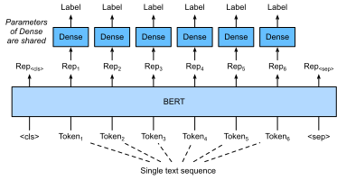

# Fine-Tuning BERT for Sequence-Level and Token-Level Applications
:label:`sec_finetuning-bert`

*This section is under construction.*

:label:`fig_bert-one-seq`

...

:label:`fig_bert-two-seqs`

...

:label:`fig_bert-tagging`

...

:label:`fig_bert-qa`
...

## Summary

* Fine-tune BERT.

## Exercises

1. Suppose that we want to design a search engine algorithm for news articles. When the system receives an query (e.g., "oil industry in coronavirus crisis"), it should return a ranked list of news articles that are most relevant to the query. What data do you need to collect? How can we use BERT in the algorithm design?
1. How can we leverage BERT in text generation tasks such as machine translation?

## [Discussions](https://discuss.mxnet.io/t/5882)

