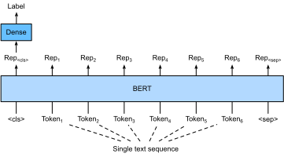
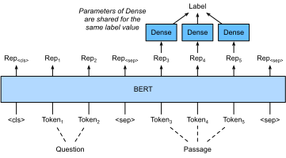

# Réglage fin de BERT pour les applications au niveau des séquences et des tokens
:label:`sec_finetuning-bert` 

Dans les sections précédentes de ce chapitre,
nous avons conçu différents modèles pour les applications de traitement du langage naturel,
tels que ceux basés sur les RNN, CNN, attention et MLP.
Ces modèles sont utiles lorsqu'il y a une contrainte d'espace ou de temps,
; cependant,
la conception d'un modèle spécifique pour chaque tâche de traitement du langage naturel
est pratiquement irréalisable.
Dans :numref:`sec_bert`,
nous avons introduit un modèle de pré-entraînement, BERT,
qui nécessite des modifications minimales de l'architecture
pour un large éventail de tâches de traitement du langage naturel.
D'une part,
au moment de sa proposition,
BERT a amélioré l'état de l'art sur diverses tâches de traitement du langage naturel.
D'autre part,
comme indiqué dans :numref:`sec_bert-pretraining`,
les deux versions du modèle original de BERT
comportent 110 millions et 340 millions de paramètres.
Ainsi, lorsque les ressources informatiques sont suffisantes,
nous pouvons envisager
d'affiner le modèle BERT pour les applications de traitement du langage naturel en aval.

Dans ce qui suit,
nous généralisons un sous-ensemble d'applications de traitement du langage naturel
au niveau de la séquence et au niveau du jeton.
Au niveau de la séquence,
nous présentons comment transformer la représentation BERT du texte d'entrée
en étiquette de sortie
dans la classification d'un seul texte
et la classification ou la régression de paires de textes.
Au niveau des jetons, nous présenterons brièvement de nouvelles applications
telles que le marquage de textes et la réponse à des questions
et nous expliquerons comment BERT peut représenter leurs entrées et les transformer en étiquettes de sortie.
Pendant le réglage fin,
les "changements minimaux d'architecture" requis par BERT pour différentes applications
sont les couches supplémentaires entièrement connectées.
Pendant l'apprentissage supervisé d'une application en aval,
les paramètres des couches supplémentaires sont appris à partir de zéro tandis que
tous les paramètres du modèle BERT pré-entraîné sont ajustés.

### Classification d'un seul texte

*La classification d'un seul texte* prend une seule séquence de texte en entrée et sort son résultat de classification.
Outre l'analyse des sentiments que nous avons étudiée dans ce chapitre,
le Corpus of Linguistic Acceptability (CoLA)
est également un jeu de données pour la classification de textes simples,
permettant de juger si une phrase donnée est grammaticalement acceptable ou non :cite:`Warstadt.Singh.Bowman.2019`.
Par exemple, "Je devrais étudier." est acceptable mais "Je devrais étudier." ne l'est pas.

 
:label:`fig_bert-one-seq` 

 :numref:`sec_bert` décrit la représentation d'entrée de BERT.
La séquence d'entrée de BERT représente sans ambiguïté un texte unique et des paires de textes,
où le jeton de classification spécial 
"&lt;cls&gt;" est utilisé pour la classification de la séquence et 
où le jeton de classification spécial 
"&lt;sep&gt;" marque la fin d'un texte unique ou sépare une paire de textes.
Comme indiqué sur :numref:`fig_bert-one-seq`,
dans les applications de classification de texte unique,
la représentation BERT du jeton de classification spécial 
"&lt;cls&gt;" encode les informations de la séquence de texte d'entrée entière.
La représentation du texte unique d'entrée,
sera introduite dans un petit MLP composé de couches entièrement connectées (denses)
pour produire la distribution de toutes les valeurs d'étiquettes discrètes.

## Classification ou régression de paires de textes

Nous avons également examiné l'inférence en langage naturel dans ce chapitre.
Elle appartient à la *classification de paires de textes*,
un type d'application classifiant une paire de textes.

En prenant une paire de textes en entrée mais en produisant une valeur continue,
la *similarité textuelle sémantique* est une tâche populaire de *régression de paires de textes*.
Cette tâche mesure la similarité sémantique des phrases.
Par exemple, dans le jeu de données Semantic Textual Similarity Benchmark,
le score de similarité d'une paire de phrases
est une échelle ordinale allant de 0 (aucun chevauchement de sens) à 5 (équivalence de sens) :cite:`Cer.Diab.Agirre.ea.2017`.
L'objectif est de prédire ces scores.
Voici quelques exemples tirés du jeu de données Semantic Textual Similarity Benchmark (phrase 1, phrase 2, score de similarité) :

* "Un avion décolle.", "Un avion décolle.", 5.000 ;
* "Une femme mange quelque chose.", "Une femme mange de la viande.", 3.000 ;
* "Une femme est en train de danser.", "Un homme est en train de parler.", 0.000.

 
:label:`fig_bert-two-seqs` 

Comparé à la classification de texte unique dans :numref:`fig_bert-one-seq`,
fine-tuning BERT pour la classification de paires de textes dans :numref:`fig_bert-two-seqs` 
est différent dans la représentation d'entrée.
Pour les tâches de régression de paires de textes, telles que la similarité sémantique textuelle,
des modifications triviales peuvent être appliquées, telles que la sortie d'une valeur d'étiquette continue
et l'utilisation de la perte quadratique moyenne : elles sont courantes pour la régression.

## Balisage de texte

Considérons maintenant les tâches au niveau du token, telles que le *balisage de texte*,
où un label est attribué à chaque token.
Parmi les tâches de marquage de texte,
*part-of-speech tagging* attribue à chaque mot une étiquette de partie de la parole (par exemple, adjectif et déterminant)
en fonction du rôle du mot dans la phrase.
Par exemple,
selon l'ensemble de balises de la Penn Treebank II,
la phrase "La voiture de John Smith est neuve"
devrait être balisée comme
"NNP (nom, propre singulier) NNP POS (terminaison possessive) NN (nom, singulier ou masse) VB (verbe, forme de base) JJ (adjectif)".

:label:`fig_bert-tagging`

Le réglage fin de BERT pour les applications de balisage de texte
est illustré dans :numref:`fig_bert-tagging`.
Par rapport à :numref:`fig_bert-one-seq`,
la seule différence réside dans le fait que
dans le balisage de texte, la représentation BERT de *chaque token* du texte d'entrée
est introduite dans les mêmes couches supplémentaires entièrement connectées pour produire l'étiquette du token,
telle qu'une étiquette de partie de la parole.

## Réponse aux questions

Autre application au niveau du token,
*la réponse aux questions* reflète les capacités de compréhension de la lecture.
Par exemple,
le Stanford Question Answering Dataset (SQuAD v1.1)
se compose de passages de lecture et de questions,
où la réponse à chaque question
est juste un segment de texte (span de texte) du passage sur lequel porte la question :cite:`Rajpurkar.Zhang.Lopyrev.ea.2016`.
Pour expliquer,
considérons un passage
"Certains experts rapportent que l'efficacité d'un masque n'est pas concluante. Cependant, les fabricants de masques insistent sur le fait que leurs produits, tels que les masques respiratoires N95, peuvent protéger contre le virus"
et une question "Qui affirme que les masques respiratoires N95 peuvent protéger contre le virus ?".
La réponse devrait être la plage de texte "fabricants de masques" dans le passage.
Ainsi, l'objectif de SQuAD v1.1 est de prédire le début et la fin de l'intervalle de texte dans le passage pour une paire de questions et de passages.

:label:`fig_bert-qa`

Pour affiner BERT pour la réponse aux questions,
la question et le passage sont emballés comme
la première et la deuxième séquence de texte, respectivement,
dans l'entrée de BERT.
Pour prédire la position du début de la séquence de texte,
la même couche additionnelle entièrement connectée transformera
la représentation BERT de tout token du passage de la position $i$
en un score scalaire $s_i$.
Ces scores de tous les jetons du passage
sont ensuite transformés par l'opération softmax
en une distribution de probabilité,
de sorte que chaque position de jeton $i$ dans le passage se voit attribuer
une probabilité $p_i$ d'être le début de l'empan textuel.
La prédiction de la fin de l'empan textuel
est la même que ci-dessus, sauf que les paramètres de
dans sa couche supplémentaire entièrement connectée
sont indépendants de ceux de la prédiction du début.
Lors de la prédiction de la fin,
tout jeton de passage de la position $i$
est transformé par la même couche entièrement connectée
en un score scalaire $e_i$.
:numref:`fig_bert-qa` 
illustre le réglage fin de BERT pour la réponse aux questions.

Pour répondre aux questions,
l'objectif de entrainement de l'apprentissage supervisé est aussi simple que
maximiser les log-vraisemblances des positions de début et de fin de la vérité du terrain.
Lors de la prédiction de la portée,
nous pouvons calculer le score $s_i + e_j$ pour une portée valide
de la position $i$ à la position $j$ ($i \leq j$),
et sortir la portée avec le score le plus élevé.

## Résumé

* BERT nécessite des modifications minimales de l'architecture (couches supplémentaires entièrement connectées) pour les applications de traitement du langage naturel au niveau de la séquence et du token, telles que la classification d'un seul texte (par exemple, l'analyse des sentiments et le test de l'acceptabilité linguistique), la classification ou la régression de paires de textes (par exemple, l'inférence du langage naturel et la similarité sémantique des textes), le marquage des textes (par exemple, le marquage de la partie de la parole) et la réponse aux questions.
* Pendant l'apprentissage supervisé d'une application en aval, les paramètres des couches supplémentaires sont appris à partir de zéro tandis que tous les paramètres du modèle BERT pré-entraîné sont affinés.

## Exercices

1. Concevons un algorithme de moteur de recherche pour les articles d'actualité. Lorsque le système reçoit une requête (par exemple, "industrie pétrolière pendant l'épidémie de coronavirus"), il doit renvoyer une liste classée d'articles d'actualité les plus pertinents pour la requête. Supposons que nous disposions d'un énorme réservoir d'articles d'actualité et d'un grand nombre de requêtes. Pour simplifier le problème, supposons que l'article le plus pertinent a été étiqueté pour chaque requête. Comment pouvons-nous appliquer l'échantillonnage négatif (voir :numref:`subsec_negative-sampling` ) et BERT dans la conception de l'algorithme ?
1. Comment pouvons-nous tirer parti de BERT dans l'entrainement des modèles de langage ?
1. Peut-on utiliser BERT pour la traduction automatique ?

[Discussions](https://discuss.d2l.ai/t/396)
